# 三、集合框架

在本章中，我们将解释以下内容:

*   链表的概念
*   如何编写使用链表的声明
*   如何计算链表中的节点数
*   如何在链表中搜索项目
*   如何找到链表中的最后一个节点
*   静态存储和动态存储分配的区别
*   如何通过在列表末尾添加一个新项目来构建一个链表
*   如何在链表中插入节点
*   如何通过在列表的头部添加一个新项目来构建一个链表
*   如何从链表中删除项目
*   如何通过添加一个新项来构建一个链表，使得链表总是排序的
*   如何组织你的 Java 文件
*   如何使用链表来确定一个短语是否是回文
*   如何保存一个链表
*   使用链表和数组存储项目列表的区别
*   如何用数组表示一个链表
*   如何合并两个排序的链表
*   循环链表和双向链表的概念

3.1 定义链表

当值存储在一维数组中时(比如说， *x* [0]到 *x* [n])，它们可以被认为是一个“线性列表”将数组中的每一项视为一个*节点*。线性列表意味着节点以线性顺序排列，从而满足以下条件:

```java
        *x*[1] is the first node
        *x*[n] is the last node
        if 1 <*k*<= n, then*x*[*k*] is preceded by*x*[*k*- 1]
        if 1 <=*k*< n then*x*[*k*] is followed by*x*[*k*+ 1]
```

因此，给定一个节点，假定“下一个”节点在数组中的下一个位置，如果有的话。节点的顺序是它们在数组中出现的顺序，从第一个开始。考虑在两个现有节点之间插入一个新节点的问题， *x* [ *k* 和 *x* [ *k* + 1】。

只有当 *x* [ *k* + 1]及其后的节点被移动以给新节点腾出空间时，才能做到这一点。同样， *x* [ *k* 的删除也涉及到节点 *x* [ *k* +1】、 *x* [ *k* + 2】的移动等等。访问任何给定的节点都很容易；我们所要做的就是提供适当的下标。

在许多情况下，我们使用数组来表示一个线性列表。但是我们也可以通过使用一种组织来表示这样的列表，其中列表中的每个节点都明确地指向下一个节点。这个新的组织被称为*链表*。

在(单一)链表中，每个节点都包含一个指向列表中下一个节点的指针。我们可以把每个节点想象成一个由两部分组成的单元，就像这样:


`data`项实际上可以是一个或多个字段(取决于节点中需要存储什么)，而`next`则“指向”列表的下一个节点。(你可以用任何你想要的名字，而不是`data`和`next`。)

由于*最后一个*节点的`next`字段没有指向任何东西，我们必须将其设置为一个特殊值，称为*空指针*。在 Java 中，空指针值由`null`表示。

除了列表的单元格之外，我们还需要一个对象变量(`top`)，它“指向”列表中的第一项。如果列表为空，则`top`的值为`null`。

形象地说，我们表示一个链表，如图 3-1 所示。

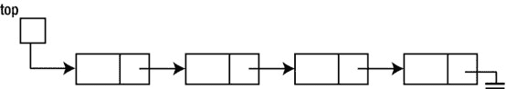

[图 3-1](#_Fig1) 。一个链表

电气接地符号用于表示零指针。


遍历链表就像寻宝一样。你被告知第一件物品在哪里。这就是`top`所做的。当您到达第一个项目时，它会指引您到达第二个项目所在的位置(这就是`next`的目的)。当你到达第二个项目时，它会告诉你第三个项目在哪里(通过`next`，以此类推。当您到达最后一项时，它的空指针告诉您这是搜索的结束(列表的结尾)。

如何在 Java 程序中表示一个链表？由于每个节点至少包含两个字段，我们将需要使用一个`class`来定义节点的格式。`data`组件可以由一个或多个字段组成(每个字段本身可以是一个有许多字段的对象)。这些字段的*类型*将取决于需要存储哪种数据。

但是`next`字段的类型是什么呢？我们知道这是一个指针，但是指向什么的指针？这是一个指向一个对象的指针，就像正在被定义的对象一样！这通常被称为*自引用*结构。举个例子，假设每个节点的数据都是正整数。我们可以如下定义从中创建节点的类(使用`num`而不是`data`):

```java
        class Node {
           int num;
           Node next;
        }
```

变量`top`现在可以声明为一个`Node`变量，如下所示:

```java
        Node top;
```

如前所述，`top`的声明为`top`分配存储，但不为任何节点分配存储。`top`的*值*可以是一个`Node`对象的地址，但是，到目前为止，列表中没有节点。众所周知，我们可以用下面的语句创建一个`Node`对象并将它的地址分配给`top`:

```java
        top = new Node();
```

这将创建以下内容:

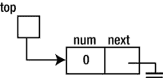

回想一下，当创建一个对象时，除非另外指定，否则 Java 会将一个数值字段设置为`0`，将一个对象字段设置为`null`。

稍后我们将看到如何创建链表，但是首先我们来看一些可以在链表上执行的基本操作。

3.2 对链表的基本操作

为了便于说明，我们假设我们有一个整数链表。我们暂时忽略如何建立这个列表。

3.2.1 计数链表中的节点

也许最简单的操作是计算列表中节点的数量。举例来说，我们编写一个函数，给定一个指向链表的指针，返回链表中节点的数量。

在编写函数之前，让我们看看如何从第一个项目开始遍历列表中的项目。假设`top`指向列表的头部。考虑以下代码:

```java
        Node curr = top;
        while (curr != null) curr = curr.next;
```

最初，`curr`指向列表中的第一项，如果有的话。如果不是`null`，则执行以下语句:

```java
        curr = curr.next;
```

这将设置`curr`指向“当前节点所指向的任何东西”，实际上是下一个节点。例如，考虑以下列表:

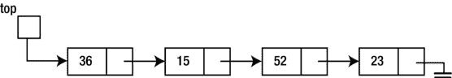

*   最初，`curr`指向(包含)`36`的节点。由于`curr`不是`null`，所以设置为`36`指向什么就指向什么，也就是(包含)`15`的节点。
*   再次测试`while`条件。由于`curr`不是`null`，执行`curr = curr.next`，设置`curr`指向`15`指向的任何东西，即`52`。
*   再次测试`while`条件。由于`curr`不是`null`，执行`curr = curr.next`，设置`curr`指向`52`指向的任何东西，即`23`。
*   再次测试`while`条件。由于`curr`不是`null`，执行`curr = curr.next`，设置`curr`指向`23`指向的任何东西，即`null`。
*   再次测试`while`条件。由于`curr` *是* `null`，不再执行`while`循环。

注意，每次`curr`不是`null`，我们就进入`while`循环。但是`curr`是*不是* `null`的次数与列表中的项目数完全相同。所以，为了计算列表中的项目数，我们只需要计算`while`体被执行了多少次。

为此，我们使用一个初始化为`0`的计数器，并在`while`循环中用`1`递增它。我们现在可以将函数编写如下(我们称之为`length`):

```java
        public static int length(Node top) {
           int n = 0;
           Node curr = top;
           while (curr != null) {
              n++;
              curr = curr.next;
           }
           return n;
        }
```

注意，如果列表为空，`curr`第一次为`null`，不会执行`while`循环。该函数将返回正确的结果`0`。

严格来说，变量`curr`不是必须的。如果我们在函数中省略`curr`并用`top`代替`curr`，该函数将正常工作。在功能执行结束时，`top`将变为`null`。

您可能会担心自己无法访问该列表，但不必担心。记住`length`中的`top`是调用函数中指向列表的任何变量(比如说`head`)的*副本*。改变`top`对`head`没有任何影响。当`length`返回时，`head`仍然指向列表中的第一项。

3.2.2 查找链表

另一个常见的操作是在链表中搜索给定的项目。例如，给定下面的列表，我们可能想要搜索数字`52`:


我们的搜索应该能够告诉我们`52`在列表中。另一方面，如果我们搜索`25`，我们的搜索应该报告`25`不在列表中。

假设我们要搜索的数字存储在变量`key`中。从第一个数字开始，通过比较`key`和列表中的每个数字进行搜索。如果`key`符合任何项目，我们已经找到了。如果我们到达列表的末尾并且`key`不匹配任何项目，我们可以断定`key`不在列表中。

我们必须编写这样的逻辑，如果我们找到一个匹配的*或*，搜索就结束，我们到达列表的末尾。换句话说，如果我们没有到达列表的末尾*并且*我们没有匹配，则搜索继续。如果`curr`指向列表中的某个项目，我们可以将这个逻辑表达如下:

```java
        while (curr != null && key != curr.num) curr = curr.next;
```

Java 保证从左到右对`&&`的操作数求值，一旦知道表达式的真值，求值就停止，在这种情况下，只要一个操作数求值为`false`或整个表达式求值完毕。我们利用这一点，首先编写条件`curr != null`。如果`curr` *为* `null`，则`&&`立即为`false`，不计算第二个条件`key != curr.num`。

如果我们写了以下代码，而`curr`恰好是`null`，当我们的程序试图检索`curr.num`时，它将崩溃:

```java
        while (key != curr.num && curr != null) curr = curr.next; //wrong
```

实际上，这要求由`curr`指向的数字，但是如果`curr`是`null`，它不指向任何东西。我们说我们正试图“解引用一个`null`指针”，这是一个错误。

让我们把搜索写成一个函数，给定一个指向列表和`key`的指针，如果找到包含`key`的节点，就返回这个节点。如果没有找到，函数返回`null`。

我们假设来自上一节的`Node`声明。我们的函数将返回一个类型为`Node`的值。这是:

```java
        public static Node search(Node top, int key) {
           while (top != null && key != top.num)
              top = top.next;
           return top;
        }
```

如果`key`不在列表中，`top`将变成`null`，返回`null`。如果`key`在列表中，当`key`等于`top.num`时，退出`while`循环；在这个阶段，`top`指向包含`key`的节点，*返回`top`的这个*值。

3.2.3 找到链表中的最后一个节点

有时，我们需要找到指向列表中最后一个节点的指针。回想一下，列表中的最后一个节点由*来区分，其* `next`指针为`null`。下面是一个函数，它返回一个指向给定列表中最后一个节点的指针。如果列表为空，函数返回`null`。

```java
        public static Node getLast(Node top) {
           if (top == null) return null;
           while (top.next != null)
              top = top.next;
           return top;
        }
```

如果`top`不是`null`，我们得到`while`语句。因此，询问`top.next`是有意义的。如果*该*不是`null`，则进入循环，并且`top`被设置为该非`null`值。这确保了下一次执行时定义了`while`条件。当`top.next`为`null`时，`top`指向最后一个节点，*返回`top`的这个*值。

3.3 建立链表:在尾部增加一个新项目

考虑按照正整数给出的顺序构建正整数链表的问题。假设输入的数字如下(`0`终止数据):

```java
        36 15 52 23 0
```

我们想要建立下面的链表:


出现的一个问题是，列表中有多少个节点？这当然取决于提供了多少个号码。使用数组存储线性列表的一个缺点是数组的大小必须事先指定。如果当程序运行时，发现它需要存储的项目超过了这个大小所允许的，它可能必须被中止。

使用链表方法，每当必须向列表中添加新节点时，都会为该节点分配存储空间，并设置适当的指针。因此，我们为列表分配了恰到好处的存储空间——不多也不少。

我们确实为指针使用了额外的存储空间，但是通过更有效地使用存储空间以及方便的插入和删除，这种情况得到了很大的补偿。“按需”分配存储通常称为*动态存储分配* 。(另一方面，数组存储被称为*静态*存储。)

在我们前面描述的构建列表的解决方案中，我们从一个空列表开始。我们的程序将通过以下声明反映这一点:

```java
        top = null;
```

当我们读取一个新的数字时，我们必须做到以下几点:

*   为节点分配存储
*   将数字放入新节点
*   使新节点成为列表中的最后一个节点

使用 3.1 节中的`Node`类，让我们写一个构造函数，给定一个整数参数，将`num`设置为整数，将`next`设置为`null`。

```java
        public Node(int n) {
           num = n;
           next = null;
        }
```

考虑以下语句:

```java
        Node p = new Node(36);
```

首先，为新节点分配存储。假设一个`int`占用 4 个字节，一个指针占用 4 个字节，`Node`的大小就是 8 个字节。因此，`8`字节从地址`4000`开始分配。`36`存储在`num`字段，`null`存储在`next`字段，如下所示:


然后将值`4000`分配给`p`；实际上，`p`正在指向刚刚创建的对象。由于实际地址`4000`通常并不重要，我们通常将其描述如下:


换句话说，`p`指向对象，无论它在哪里。

当我们读取第一个数字时，我们必须为它创建一个节点，并将`top`设置为指向新节点。在我们的示例中，当我们读取`36`时，我们必须创建以下内容:


如果`n`包含新的数字，可以通过以下方式实现:

```java
        if (top == null) top = new Node(n);
```

计算机内部没有箭头，但效果是通过以下方式实现的(假设新节点存储在位置`4000`):


对于每个后续的数字，我们必须设置当前最后一个节点的`next`字段指向新的节点。新节点成为最后一个节点。假设新号码是`15`。我们必须创造这个:


但是我们如何找到现有列表的最后一个节点呢？一种方法是从列表的顶部开始，跟随`next`指针，直到我们遇到`null`。如果我们必须对每个新号码都这样做，这是非常耗时的。一个更好的方法是保留一个指向列表最后一个节点的指针(`last`)。该指针随着新节点的添加而更新。这方面的代码可以这样写:

```java
        np = new Node(n);            //create a new node
        if (top == null) top = np;   //set top if first node
        else last.next = np;         //set last.next for other nodes
        last = np;                   //update last to  new node
```

假设列表中只有一个节点；这也是最后一个节点。在我们的例子中，`last`的值将是`4000`。假设包含`15`的节点存储在位置`2000`。我们有以下情况:


上面的代码会将位置`4000`处的`next`字段设置为`2000`，并将`last`设置为`2000`。以下是结果:


现在`top` ( `4000`)指向包含`36`的节点；这个节点的`next`字段是`2000`，因此指向包含`15`的节点。该节点的`next`字段为`null`，表示列表结束。`last`的值是`2000`，列表中最后一个节点的地址。

[程序 P3.1](#list1) 读取数字，并按照讨论创建链表。为了验证列表已经被正确构建，我们应该打印它的内容。函数`printList` 从第一个节点到最后一个节点遍历列表，在每个节点打印数字。

***[程序 P3.1](#_list1)***

```java
        import java.util.*;
        public class BuildList1 {

           public static void main(String[] args) {
              Scanner in = new Scanner(System.in);
              Node top, np, last = null;

              top = null;
              System.out.printf("Enter some integers ending with 0\n");
              int n = in.nextInt();
              while (n != 0) {
                 np = new Node(n);            //create a new node containing n
                 if (top == null) top = np;   //set top if first node
                 else last.next = np;         //set last.next for other nodes
                 last = np;                   //update last to  new node
                 n = in.nextInt();
              }
              System.out.printf("\nThe items in the list are\n");
              printList(top);
           } //end main

           public static void printList(Node top) {
              while (top != null) {  //as long as there's a node
                 System.out.printf("%d ", top.num);
                 top = top.next;     //go on to the next node
              }
              System.out.printf("\n");
           } //end printList

        } //end class BuildList1

        class Node {
           int num;
           Node next;

           public Node(int n) {
              num = n;
              next = null;
           }
        } //end class Node
```

为了验证列表已经被正确构建，我们应该打印它的内容。方法`printList`从第一个节点到最后一个节点遍历列表，在每个节点打印数字。以下是[程序 P3.1](#list1) 的运行示例:

```java
Enter some integers ending with 0
9 1 8 2 7 3 6 4 5 0

The items in the list are
9 1 8 2 7 3 6 4 5
```

3.4 插入到链表中

一个每个节点都有一个指针的链表叫做*单向*，或者叫做*单向*、*链表*。这种列表的一个重要特征是通过“列表顶部”指针和每个节点中的指针字段来访问节点。(但是，其他显式指针可能指向列表中的特定节点，例如，前面显示的指针`last`，它指向列表中的最后一个节点。)这意味着访问被限制为顺序的。

比方说，到达节点 4 的唯一途径是通过节点 1、2 和 3。因为我们不能直接访问第 *k* 个节点，例如，我们不能在链表上执行二分搜索法。链表的最大优点是它允许在列表中的任何地方进行简单的插入和删除。

假设我们想在第二个和第三个节点之间插入一个新节点。我们可以简单地将其视为在第二个节点之后的插入。例如，假设`prev`指向第二个节点，`np`指向新节点，如图[图 3-2](#Fig2) 所示。

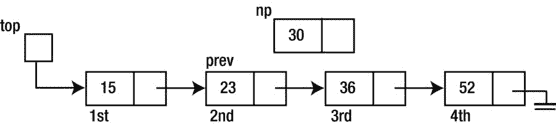

[图 3-2](#_Fig2) 。在链表中插入新节点

我们可以通过设置它的`next`字段指向第三个节点和第二个节点的`next`字段指向新节点来插入新节点。注意，我们需要做的只是插入第二个节点；它的`next`场会给我们第三个节点。插入可以这样完成:

```java
        np.next = prev.next;
        prev.next = np;
```

第一个语句说，“让新节点指向第二个节点指向的任何东西，换句话说，就是第三个节点。”第二条语句说，“让第二个节点指向新节点。”最终结果是新节点被插入到第二个和第三个节点之间。新节点成为第三个节点，原来的第三个节点成为第四个节点。这就将图 3-2 中的[变为](#Fig2)[图 3-3 中的](#Fig3)。


[图 3-3](#_Fig3) 。插入新节点后

如果`prev`指向最后一个节点，那么我们实际上是在最后一个节点之后插入，这段代码会起作用吗？是的。如果`prev`是最后一个节点，那么`prev.next`就是`null`。因此，下面的语句将`np.next`设置为`null`，使得新节点成为最后一个节点:

```java
        np.next = prev.next;
```

和前面一样，`prev.next`被设置为指向新节点。这可以通过更改以下内容来说明:


对此:

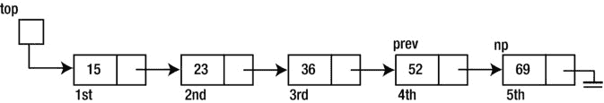

在许多情况下，需要在列表的开头插入一个新的节点。也就是说，我们希望将新节点作为第一个节点。假设`np`将指向新的节点，我们希望将它转换为:

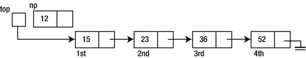

对此:

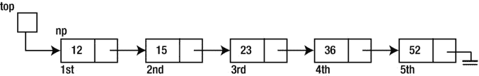

这可以通过下面的代码来完成:

```java
        np.next = top;
        top = np;
```

第一条语句将新节点设置为指向`top`所指向的任何节点(即第一个节点)，第二条语句更新`top`以指向新节点。

您应该观察到，即使列表最初是空的(也就是说，如果`top`是`null`)，代码也能工作。在这种情况下，它将此转换为:

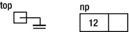

对此:


3.5 构建链表:在头部添加一个新项目

再次考虑构建正整数链表的问题，但是这一次，我们将每个新数字插入到列表的开头，而不是末尾。结果列表中的数字顺序与给出的顺序相反。假设输入的数字如下(`0`终止数据):

```java
        36 15 52 23 0
```

我们希望建立以下链接列表:

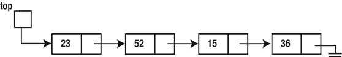

以逆序构建列表的程序实际上比前一个更简单。它与[程序 P3.1](#list1) 几乎相同。唯一的变化是在`while`循环中。当读取每个新数字时，我们将它的链接设置为指向第一个节点，并将`top`设置为指向新节点，使其成为(新的)第一个节点。这些变化被并入[程序 P3.2](#list2) ，写成`BuildList2` 。

***[程序 P3.2](#_list2)***

```java
        import java.util.*;
        public class BuildList2 {

           public static void main(String[] args) {
              Scanner in = new Scanner(System.in);
              Node top, np, last = null;

              top = null;
              System.out.printf("Enter some integers ending with 0\n");
              int n = in.nextInt();
              while (n != 0) {
                 np = new Node(n);   //create a new node containing n
                 np.next = top;      //set it to point to first node
                 top = np;           //update top to point to new node
                 n = in.nextInt();
              }
              System.out.printf("\nThe items in the list are\n");
              printList(top);
           } //end main

           public static void printList(Node top) {
              while (top != null) {  //as long as there's a node
                 System.out.printf("%d ", top.num);
                 top = top.next;  //go on to the next node
              }
              System.out.printf("\n");
           } //end printList

        } //end class BuildList2

        class Node {
           int num;
           Node next;

           public Node(int n) {
              num = n;
              next = null;
           }
        } //end class Node
```

以下是[程序 P3.2](#list2) 的运行示例:

```java
Enter some integers ending with 0
9 1 8 2 7 3 6 4 5 0

The items in the list are
5 4 6 3 7 2 8 1 9
```

[程序 P3.1](#list1) 在列表末尾插入来电号码。这是一个向队列添加项目的示例。一个*队列*是一个线性列表，其中插入发生在一端，删除(见下一节)发生在另一端。

[程序 P3.2](#list2) 在列表的开头插入来电号码。这是一个向栈中添加项目的示例。一个*栈*是一个线性列表，其中插入和删除发生在同一端的*。在栈术语中，当我们添加一个项目时，我们说这个项目是被*推到栈上的*。从栈中删除一个项目被称为*弹出*栈。*

我们将在第 4 章中更全面地讨论栈和队列。

3.6 从链表中删除

从链表顶部删除一个节点是通过以下语句完成的:

```java
        top = top.next;
```

这表示让`top`指向第一个节点指向的任何内容(即第二个节点，如果有的话)。由于`top`现在指向第二个节点，实际上第一个节点已经从列表中删除了。该语句更改了以下内容:


对此:


当然，在我们删除之前，我们应该检查一下*是不是有*要删除，换句话说，就是`top`不是`null`。

如果列表中只有一个节点，删除它将导致空列表；`top`会变成`null`。

从链表中删除任意节点需要更多信息。假设`curr`(代表“当前”)指向要删除的节点。删除这个节点需要我们改变*前一个*节点的`next`字段。这意味着我们必须知道指向前一个节点的指针；假设是`prev`(为“前”)。那么删除节点`curr`可以通过这条语句来完成:

```java
        prev.next = curr.next;
```

这将改变以下内容:


对此:

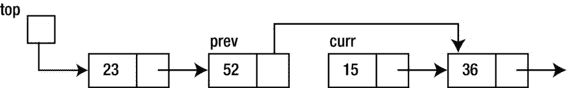

实际上，`curr`指向的节点已经不在列表中了——它已经被删除了。

人们可能想知道被删除的节点会发生什么。在我们的讨论中，*删除*意味着“逻辑删除”也就是说，就处理列表而言，被删除的节点不存在。但是节点仍然在内存中，占用存储空间，即使我们可能已经丢失了指向它们的指针。

如果我们有一个很大的列表，其中发生了许多删除，那么就会有许多“已删除”的节点分散在整个内存中。这些节点占用存储空间，即使它们永远不会也无法被处理。

Java 解决这个问题的方法是*自动垃圾收集*。Java 会不时地检查这些“不可到达”的节点并删除它们，回收它们所占用的存储空间。程序员永远不必担心这些“删除”的节点。

3.7 建立排序链表

作为第三种可能性，假设我们想要构建一个列表，使得数字总是按照升序排序。假设输入的数字如下(`0`终止数据):

```java
        36 15 52 23 0
```

我们希望建立以下链接列表:

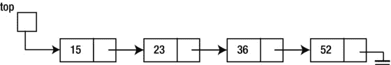

当一个新号码被读取时，它被插入到现有列表(最初是空的)的适当位置。第一个数字只是添加到空列表中。

每个后续数字都与现有列表中的数字进行比较。只要新数字大于列表中的数字，我们就向下移动列表，直到新数字小于或等于现有数字，或者到达列表的末尾。

为了便于插入新号码，在我们离开一个节点并移动到下一个节点之前，我们必须保存指向该节点的指针，以防新号码必须插入到该节点之后。然而，只有当我们将新的数字与下一个节点中的数字进行比较时，我们才能知道这一点。

为了说明这些想法，考虑下面的排序列表，假设我们想要向列表添加一个新的数字(`30`)，以便它保持排序:


假设节点上方的数字是该节点的地址。因此，`top`的值就是`400`。

首先，我们比较一下`30`和`15`。它更大，所以我们继续下一个号码，`23`，记住了`15`的地址(`400`)。

接下来，我们比较一下`30`和`23`。它更大，所以我们继续下一个号码，`36`，记住了`23`的地址(`200`)。我们不再需要记住`15`的地址(`400`)。

接下来，我们比较一下`30`和`36`。它更小，所以我们在前找到了数字*，我们必须插入`30`。这与在* `23`后插入`30` *是一样的。由于我们已经记住了`23`的地址，现在我们可以执行插入了。*

我们将使用以下代码来处理新号码，`n`:

```java
        prev = null;
        curr = top;
        while (curr != null && n > curr.num) {
           prev = curr;
           curr = curr.next;
        }
```

最初，`prev`是`null`，`curr`是`400`。30 的插入过程如下:

*   `30`是与`curr.num`、`15`相比较的。比较大，所以我们把`prev`设为`curr` ( `400`)，把`curr`设为`curr.next`，`200`；`curr`不是`null`。
*   `30`是与`curr.num`、`23`相比较的。比较大，所以我们把`prev`设为`curr` ( `200`)，把`curr`设为`curr.next`，`800`；`curr`不是`null`。
*   `30`是与`curr.num`、`36`相比较的。它更小，所以我们退出`while`循环，其中`prev`为`200`，而`curr`为`800`。

我们有以下情况:


如果新的数字存储在`np`指向的节点中，我们现在可以把它添加到列表中(头部除外；见下一节)用下面的代码:

```java
        np.next = curr;  //we could also use prev.next for curr
        prev.next = np;
```

这将改变以下情况:


对此:


作为练习，如果要添加的数字大于列表中的所有数字，请验证此代码是否有效。提示:`while`循环什么时候退出？

如果要添加的数字比列表中所有数字的*小*，则必须将其添加到列表的开头，成为列表中新的第一个节点。这意味着`top`的值必须更改为新节点。

前面显示的`while`循环也适用于这种情况。在第一次测试时，`while`条件将是`false`(因为`n`将小于`curr.num`)。在退出时，我们简单地测试`prev`是*还是*`null`；如果是，新节点必须插入列表的顶部。

如果列表最初为空，`while`循环将立即退出(因为`curr`将是`null`)。在这种情况下，新节点也必须插入到列表的顶部，成为列表中唯一的节点。

[程序 P3.3](#list3) 包含所有细节。将新节点插入到列表中的适当位置被委托给函数`addInPlace`。这个函数返回一个指向修改列表顶部的指针。

***[程序 P3.3](#_list3)***

```java
        import java.util.*;
        public class BuildList3 {

           public static void main(String[] args) {
              Scanner in = new Scanner(System.in);
              Node top, np, last = null;

              top = null;
              System.out.printf("Enter some integers ending with 0\n");
              int n = in.nextInt();
              while (n != 0) {
                 top = addInPlace(top, n);
                 n = in.nextInt();
              }
              printList(top);
           } //end main

           public static Node addInPlace(Node top, int n) {
           // This functions inserts n in its ordered position in a (possibly empty)
           // list pointed to by top, and returns a pointer to the new list
              Node np, curr, prev;

              np = new Node(n);
              prev = null;
              curr = top;
              while (curr != null && n > curr.num) {
                 prev = curr;
                 curr = curr.next;
              }
              np.next = curr;
              if (prev == null) return np; //top of list is now the new node
              prev.next = np;
              return top; //the top of the list has not changed
           } //end addInPlace

           public static void printList(Node top) {
              while (top != null) {  //as long as there's a node
                 System.out.printf("%d ", top.num);
                 top = top.next;  //go on to the next node
              }
              System.out.printf("\n");
           } //end printList

        } //end class BuildList3

        class Node {
           int num;
           Node next;

           public Node(int n) {
              num = n;
              next = null;
           }
        } //end class Node
```

运行时，[程序 P3.3](#list3) 从提供的数字中构建一个排序链表，然后按照数字在列表中出现的顺序打印数字。下面显示了一些示例输出:

```java
        Enter some integers ending with 0
        9 1 8 2 7 3 6 4 5 0
        1 2 3 4 5 6 7 8 9
```

3.8 一个链表类

我们已经讨论了链表处理中涉及的许多基本思想，并且我们已经看到了如何在链表上实现常见的操作。我们使用了`static`方法 ( `printList`，`addInPlace`)，并将链表的“头节点”作为参数传递。

现在让我们稍微改变一下我们的观点。我们的目标是编写一个“链表类”，从中我们可以创建“链表对象”，我们可以用它来处理链表。

要回答的第一个问题是，“什么定义了链表？”那很简单。它是(object)变量，本质上是一个指针，指向列表中的第一个节点。所以，我们的课将如下开始:

```java
        public class LinkedList {
           Node head = null;
           .
           .
        } //end class LinkedList
```

我们将使用`head`作为我们的“列表顶部”变量。当我们使用如下语句时，Java 会将`head`初始化为`null`，但我们这样做是为了引起对其初始值的注意:

```java
        LinkedList LL = new LinkedList();
```

我们如何定义`Node` ？嗯，这取决于我们想要在列表中存储的项目(“数据”)的种类。如果我们想要一个整数列表，我们可以用这个:

```java
        class Node {
           int num;
           Node next;
        }
```

如果我们想要一个字符列表，我们可以使用这个:

```java
        class Node {
           char ch;
           Node next;
        }
```

如果我们想要一个零件列表，我们可以用这个:

```java
        class Node {
           Part part;
           Node next;
        }
```

如你所见，每次我们需要不同类型的链表时，我们都需要改变`Node`的定义。但是如果一个方法的代码依赖于列表中的条目，我们也需要改变这个方法。例如，考虑在整数列表的开头添加一个新节点的方法。

```java
        public void addHead(int n) {
           Node p = new Node(n); //assume Node has the appropriate constructor
           p.next = head;
           head = p;
        }
```

例如，这可以如下使用(`LL`是`LinkedList`):

```java
        LL.addHead(25);
```

这将在列表`LL`的开头添加一个包含`25`的节点。

但是如果我们需要一个字符列表，我们需要将标题改为:

```java
        public void addHead(char c)
```

对于一个`Part`对象列表，如下所示:

```java
        public void addHead(Part p)
```

如果类中有许多方法，那么每当我们需要改变存储在列表中的数据类型时，这些改变就会变得非常繁琐。

我们将使用一种方法来最小化`LinkedList`中所需的更改。

让我们将类`Node`定义如下:

```java
        class Node {
           NodeData data;
           Node next;

           public Node(NodeData nd) {
              data = nd;
              next = null;
           }
        } //end class Node
```

我们根据一个尚未指定的数据类型`NodeData`来编写这个类。有两个字段，`data`和`next`。在对`NodeData` 一无所知的情况下，我们可以把`addHead`写成如下:

```java
           public void addHead(NodeData nd) {
              Node p = new Node(nd);
              p.next = head;
              head = p;
           }
```

一个想要使用`LinkedList`的类(`TestList`)必须提供一个对`LinkedList`可用的`NodeData`的定义。假设我们想要一个整数链表。我们可以将`NodeData`定义如下(我们将很快解释`toString`的必要性):

```java
        public class NodeData {
           int num;

           public NodeData(int n) {
              num = n;
           }

           public String toString() {
              return num + " ";
              //" " needed to convert num to a string; may also use "" (empty string)
           }
        } //end class NodeData
```

我们可以用如下代码以相反的顺序构建一个链表:

```java
        LinkedList LL = new LinkedList();
        System.out.printf("Enter some integers ending with 0\n");
        int n = in.nextInt();
        while (n != 0) {
           LL.addHead(new NodeData(n)); //NodeData argument required
           n = in.nextInt();
        }
```

注意，由于`addHead`需要一个`NodeData`参数，我们必须用整数`n`创建一个`NodeData`对象；这个对象被传递给`addHead`。

我们如何打印列表中的项目？大概，我们希望在`LinkedList`类中有一个方法(`printList`)来完成这项工作。但是由于`LinkedList`不知道`NodeData`可能包含什么(每次运行都可能不同)，它如何打印节点中的数据呢？

诀窍是让`NodeData`使用`toString`方法打印自己。下面是写`printList`的一种方法:

```java
        public void printList() {
           Node curr = head;
           while (curr != null) {
              System.out.printf("%s", curr.data); //invokes curr.data.toString()
              curr = curr.next;
           }
           System.out.printf("\n");
        } //end printList
```

回想一下，`curr.data`是一个`NodeData`对象。因为我们在需要字符串的上下文中使用它，Java 将在`NodeData`类中寻找`toString`方法。既然它找到了一个，它就会用它来打印`curr.data`。在我们显式调用`toString`的地方，`printf`语句也可以写成如下形式:

```java
        System.out.printf("%s ", curr.data.toString());
```

如果`LL`是一个`LinkedList`，列表可以打印如下语句:

```java
        LL.printList();
```

到目前为止，我们的`LinkedList`类由以下内容组成:

```java
        public class LinkedList {
           Node head = null;

           public void addHead(NodeData nd) {
              Node p = new Node(nd);
              p.next = head;
              head = p;
           }

           public void printList() {
              Node curr = head;
              while (curr != null) {
                 System.out.printf("%s", curr.data); //invokes curr.data.toString()
                 curr = curr.next;
              }
              System.out.printf("\n");
           } //end printList

        } //end class LinkedList
```

我们可以添加一个方法来检查链表是否为空。

```java
        public boolean empty() {
           return head == null;
        }
```

如果`LL`是一个`LinkedList`，我们可以用`empty`如下:

```java
        while (!LL.empty()) { ...
```

现在，假设我们想要添加一个方法，该方法将按照“排序顺序”构建一个链表同样，由于`LinkedList`不知道`NodeData`可能包含什么，我们如何在`LinkedList`中定义“排序顺序”？同样，解决方案是让`NodeData`告诉我们一个`NodeData`项目何时小于、等于或大于另一个`NodeData`项目。

我们可以通过在`NodeData`中编写一个实例方法(我们称之为`compareTo`)来做到这一点。这是:

```java
        public int compareTo(NodeData nd) {
           if (this.num == nd.num) return 0;
           if (this.num < nd.num) return -1;
           return 1;
        }
```

这里，我们第一次使用 Java 关键字`this`。如果`a`和`b`是两个`NodeData`对象，记住我们可以用`a.compareTo(b)`调用方法。在方法中，`this`指的是用来调用它的对象。于是，`this.num`指的就是`a.num`。我们注意到该方法在没有`this`的情况下也同样有效，因为`num`本身确实引用了`a.num`。

因为我们使用的`NodeData`类有一个整数字段，`num`，`compareTo`简化为比较两个整数。如果`a.num`等于`b.num`，则表达式`a.compareTo(b)`返回`0`，如果`a.num`小于`b.num`，则返回`-1`，如果`a.num`大于`b.num`，则返回`1`。

使用`compareTo`，我们可以将`addInPlace`写成如下:

```java
        public void addInPlace(NodeData nd) {
           Node np, curr, prev;

           np = new Node(nd);
           prev = null;
           curr = head;
           while (curr != null && nd.compareTo(curr.data) > 0) { //new value is bigger
              prev = curr;
              curr = curr.next;
           }
           np.next = curr;
           if (prev == null) head = np;
           else prev.next = np;
        } //end addInPlace
```

如果`LL`是一个`LinkedList`，我们可以如下使用:

```java
        LL.addInPlace(new NodeData(25));
```

这将创建一个带有包含`25`的`NodeData`对象的`Node`,并将该节点插入到列表中，以便列表按升序排列。

[程序 P3.4](#list4) 读取整数，按升序建立链表，打印排序后的列表。你会发现我们已经从`NodeData`、`Node`和`LinkedList`类中去掉了单词`public`。这仅仅是为了让我们将整个程序存储在一个文件中，这个文件必须叫做`LinkedListTest.java`，因为公共类的名字是`LinkedListTest`。回想一下，Java 要求一个文件只包含一个公共类。我们将在 3.9 节对此进行详细阐述。

***[程序 P3.4](#_list4)***

```java
        import java.util.*;
        public class LinkedListTest {
           public static void main(String[] args) {
              Scanner in = new Scanner(System.in);
              LinkedList LL = new LinkedList();
              System.out.printf("Enter some integers ending with 0\n");
              int n = in.nextInt();
              while (n != 0) {
                 LL.addInPlace(new NodeData(n));
                 n = in.nextInt();
              }
              LL.printList();
           } //end main
        } //end LinkedListTest

        class NodeData {
           int num;

           public NodeData(int n) {
              num = n;
           }

           public int compareTo(NodeData nd) {
              if (this.num == nd.num) return 0;
              if (this.num < nd.num) return -1;
              return 1;
           } //end compareTo

           public String toString() {
              return num + " ";
              //" " needed to convert num to a string; may also use "" (empty string)
           }
        } //end class NodeData

        class Node {
           NodeData data;
           Node next;

           public Node(NodeData nd) {
              data = nd;
              next = null;
           }
        } //end class Node

        class LinkedList {
           Node head = null;

           public boolean empty() {
              return head == null;
           }

           public void addHead(NodeData nd) {
              Node p = new Node(nd);
              p.next = head;
              head = p;
           }

           public void addInPlace(NodeData nd) {
              Node np, curr, prev;

              np = new Node(nd);
              prev = null;
              curr = head;
              while (curr != null && nd.compareTo(curr.data) > 0) { //new value is bigger
                 prev = curr;
                 curr = curr.next;
              }
              np.next = curr;
              if (prev == null) head = np;
              else prev.next = np;
           } //end addInPlace

           public void printList() {
              Node curr = head;
              while (curr != null) {
                 System.out.printf("%s", curr.data); //invokes curr.data.toString()
                 curr = curr.next;
              }
              System.out.printf("\n");
           } //end printList

        } //end class LinkedList
```

以下是[程序 P3.4](#list4) 的运行示例。

```java
        Enter some integers ending with 0
        9 1 8 2 7 3 6 4 5 0
        1 2 3 4 5 6 7 8 9
```

3.9 如何组织 Java 文件

在上一节中，我们处理了四个类——`LinkedList`、`Node`、`NodeData`和`LinkedListTest`——并且注意到为了将它们存储在一个文件中(作为[程序 P3.4](#list4) )，我们必须从除了`LinkedListTest`之外的所有类中去掉单词`public`。在这里，我们回顾一下我们之前的一些评论，并解释每个类如何存储在自己的文件中。

我们可以将`LinkedListTest`类存储在一个文件中，这个文件必须叫做`LinkedListTest.java`。记住一个`public`类`x`必须存储在一个名为`x.java` 的文件中。我们可以将其他类存储在*相同的*文件中，只要我们将类头写为`class xxx`而不是`public class xxx`。

然而，为了使这些类可以被其他类使用，我们将对它们进行不同的组织。我们将把`NodeData`类声明为`public`，并将其单独存储在一个文件中。该文件必须名为`NodeData.java` ，到目前为止，将包含以下内容:

```java
        public class NodeData {
           int num;

           public NodeData(int n) {
              num = n;
           }

           public int compareTo(NodeData nd) {
              if (this.num == nd.num) return 0;
              if (this.num < nd.num) return -1;
              return 1;
           }

           public String toString() {
              return num + " ";
              //" " needed to convert num to a string; may also use "" (empty string)
           }
        } //end class NodeData
```

我们将把`LinkedList`类声明为`public`，并将其存储在一个名为`LinkedList.java` 的文件中。由于`Node`类仅由`LinkedList`类使用，我们将省略单词`public`并将其存储在同一个文件中，到目前为止，该文件将包含以下内容:

```java
        public class LinkedList {
           Node head = null;

           public boolean empty() {
              return head == null;
           }

           public void addHead(NodeData nd) {
              Node p = new Node(nd);
              p.next = head;
              head = p;
           }

           public void addInPlace(NodeData nd) {
              Node np, curr, prev;

              np = new Node(nd);
              prev = null;
              curr = head;
              while (curr != null && nd.compareTo(curr.data) > 0) { //nd is bigger
                 prev = curr;
                 curr = curr.next;
              }
              np.next = curr;
              if (prev == null) head = np;
              else prev.next = np;
           } //end addInPlace

           public void printList() {
              Node curr = head;
              while (curr != null) {
                 System.out.printf("%s", curr.data); //invokes curr.data.toString()
                 curr = curr.next;
              }
              System.out.printf("\n");
           } //end printList

        } //end class LinkedList

        class Node {
           NodeData data;
           Node next;

           public Node(NodeData d) {
              data = d;
              next = null;
           }
        } //end class Node
```

我们注意到，如果另一个类需要`Node`类，最好声明它`public`，并把它放在一个名为`Node.java` 的文件中。

3.10 扩展 LinkedList 类

为了准备下一个例子，我们将用下面的方法扩展`LinkedList`类。函数`getHeadData` 返回列表中第一个节点的`data`字段(如果有的话)。

```java
        public NodeData getHeadData() {
           if (head == null) return null;
           return head.data;
        }
```

方法`deleteHead` 删除列表中的第一个节点，如果有的话。

```java
        public void deleteHead() {
           if (head != null) head = head.next;
        }
```

`addTail` 方法在列表末尾添加一个新节点。它找到最后一个节点(其中`next`是`null`)并将其设置为指向新节点。

```java
        public void addTail(NodeData nd) {
           Node p = new Node(nd);
           if (head == null) head = p;
           else {
              Node curr = head;
              while (curr.next != null) curr = curr.next;
              curr.next = p;
           }
        } //end addTail
```

函数`copyList` 复制一份用于调用它的列表并返回副本。

```java
        public LinkedList copyList() {
           LinkedList temp = new LinkedList();
           Node curr = this.head;
           while (curr != null) {
              temp.addTail(curr.data);
              curr = curr.next;
           }
           return temp;
        } //end copyList
```

方法`reverseList` 颠倒给定列表中节点的顺序。它作用于原始列表，而不是副本。

```java
        public void reverseList() {
           Node p1, p2, p3;
           if (head == null || head.next == null) return;
           p1 = head;
           p2 = p1.next;
           p1.next = null;
           while (p2 != null) {
              p3 = p2.next;
              p2.next = p1;
              p1 = p2;
              p2 = p3;
           }
           head = p1;
        } //end reverseList
```

函数`equals` 比较两个链表。如果`L1`和`L2`是两个链表，那么如果它们包含相同顺序的相同元素，表达式`L1.equals(L2)`就是`true`，否则就是`false`。

```java
        public boolean equals(LinkedList LL) {
           Node t1 = this.head;
           Node t2 = LL.head;
           while (t1 != null && t2 != null) {
              if (t1.data.compareTo(t2.data) != 0) return false;
              t1 = t1.next;
              t2 = t2.next;
           }
           if (t1 != null || t2 != null) return false; //if one ended but not the other
           return true;
        } //end equals
```

3.11 示例:回文

考虑确定给定字符串是否是一个*回文*的问题(向前或向后拼写都一样)。以下是回文的示例(忽略大小写、标点和空格):

```java
        civic
        Racecar
        Madam, I'm Adam.
        A man, a plan, a canal, Panama.
```

如果所有的字母大小写都一样(大写或小写)，并且字符串(`word`)不包含空格或标点符号，我们*可以用*解决如下问题:

```java
        compare the first and last letters
        if they are different, the string is not a palindrome
        if they are the same, compare the second and second to last letters
        if they are different, the string is not a palindrome
        if they are the same, compare the third and third to last letters
```

我们继续下去，直到我们找到一个不匹配的对(这不是一个回文)，或者没有更多的对进行比较(这是一个回文)。

这种方法是高效的，但是它要求我们能够直接访问单词中的任何字母。如果单词存储在数组中，并且我们使用下标访问任何字母，这是可能的。但是，如果单词的字母存储在一个链表中，我们就不能使用这种方法，因为我们只能按顺序访问字母。

为了说明如何操作链表，我们将使用链表来解决这个问题，其思路如下:

1.  将原始短语存储在一个链表中，每个节点一个字符。
2.  创建另一个列表，只包含短语的字母，全部转换为小写。把这个叫做`list1`。
3.  反转`list1`得到`list2`。
4.  逐个节点地比较`list1`和`list2`，直到我们得到一个不匹配(短语不是回文)或者我们到达列表的末尾(短语是回文)。

考虑一下短语`Damn Mad!`；这将按如下方式存储:


步骤 2 会将其转换为:


步骤 3 将反转该列表，得到以下内容:


比较`list1`和`list2`会发现`Damn Mad!`是一个回文。

我们将编写一个程序，提示用户键入一个短语，并告诉她这是否是一个回文。然后它会提示输入另一个短语。要停止，用户必须按回车键。以下是运行示例:

```java
        Type a phrase. (To stop, press "Enter" only): Damn Mad!
        is a palindrome
        Type a phrase. (To stop, press "Enter" only): So Many Dynamos!
        is a palindrome
        Type a phrase. (To stop, press "Enter" only): Rise to vote, sir.
        is a palindrome
        Type a phrase. (To stop, press "Enter" only): Thermostat
        is not a palindrome
        Type a phrase. (To stop, press "Enter" only): A Toyota’s a Toyota.
        is a palindrome
        Type a phrase. (To stop, press "Enter" only):
```

之前，我们使用的是整数链表。但是，现在，我们需要一个字符链表。如果我们做得对，我们应该只需要对`NodeData`类进行修改。我们不应该改变`LinkedList`类中的*任何东西*，我们也不会。这里是`NodeData`应该有的样子:

```java
        public class NodeData {
           char ch;

           public NodeData(char c) {
              ch = c;
           }

           public char getData() {return ch;}

           public int compareTo(NodeData nd) {
              if (this.ch == nd.ch) return 0;
              if (this.ch < nd.ch) return -1;
              return 1;
           }

           public String toString() {
              return ch + "";
           }
        } //end class NodeData
```

我们添加了一个访问器`getData`，用于返回唯一的数据字段`ch`中的值。其他的变化主要是将`int`改为`char`。

我们将编写一个函数`getPhrase` ，它将读取数据并将短语的字符存储在一个链表中，每个节点一个字符。该函数返回新创建的列表。这个函数必须按照用户输入字符的顺序构建链表——每个新字符都被添加到列表的末尾。

该函数首先通过使用`nextLine`将整个短语读入一个`String`变量来实现这一点。然后，从最后一个字符开始向后，在链表的*头*处插入每个新字符。(我们也可以从第一个字符开始，在列表的*尾部*添加每个新字符，但是这需要更多的工作。)下面是函数:

```java
        public static LinkedList getPhrase(Scanner in) {
           LinkedList phrase = new LinkedList();
           String str = in.nextLine();
           for (int h = str.length() - 1; h >= 0; h--)
              phrase.addHead(new NodeData(str.charAt(h)));
           return phrase;
        } //end getPhrase
```

接下来，我们编写一个函数`lettersLower`，在给定一个字符链表的情况下，它创建另一个只包含字母的列表，所有字母都被转换成小写。当遇到每个字母时，它被转换成小写，并使用`addTail`添加到新列表的*尾*。这里是`lettersLower`:

```java
      public static LinkedList lettersLower(LinkedList phrase) {
         LinkedList word = new LinkedList();

         while (!phrase.empty()) {
            char ch = phrase.getHeadData().getData();
            if (Character.isLetter(ch)) word.addTail(new NodeData(Character.toLowerCase(ch)));
            phrase.deleteHead();
         }
         return word;
      } //end lettersLower
```

表达式`phrase.getHeadData()`返回列表中第一个节点的`data`字段(类型为`NodeData`)。`NodeData`类中的访问器`getData`返回存储在节点中的字符。

我们现在拥有了编写[程序 P3.5](#list5) 所需的一切，它解决了回文问题。它假设`NodeData`和`LinkedList`类被声明为`public`，并存储在不同的文件中。

***[程序 P3.5](#_list5)***

```java
   import java.util.*;
   public class P3_5Palindrome {
      public static void main(String[] args) {
         Scanner in = new Scanner(System.in);
         System.out.printf("Type a phrase. (To stop, press 'Enter' only): ");
         LinkedList aPhrase = getPhrase(in);
         while (!aPhrase.empty()) {
            LinkedList w1 = lettersLower(aPhrase);
            System.out.printf("Converted to: ");
            w1.printList();
            LinkedList w2 = w1.copyList();
            w2.reverseList();
            if (w1.equals(w2)) System.out.printf("is a palindrome\n");
            else System.out.printf("is not a palindrome\n");
            System.out.printf("Type a phrase. (To stop, press 'Enter' only): ");
            aPhrase = getPhrase(in);
         }
      } //end main

      public static LinkedList getPhrase(Scanner in) {
         LinkedList phrase = new LinkedList();
         String str = in.nextLine();
         for (int h = str.length() - 1; h >= 0; h--)
            phrase.addHead(new NodeData(str.charAt(h)));
         return phrase;
      }

      public static LinkedList lettersLower(LinkedList phrase) {
         LinkedList word = new LinkedList();

         while (!phrase.empty()) {
            char ch = phrase.getHeadData().getData();
            if (Character.isLetter(ch)) word.addTail(new NodeData(Character.toLowerCase(ch)));
            phrase.deleteHead();
         }
         return word;
      }

   } //end class P3_5Palindrome
```

 **注**这个解决方案主要用来展示链表是如何操作的。使用字符数组或字符串可以更有效地解决这个问题，因为我们可以直接访问给定短语中的任何字符。例如，我们可以直接比较第一个和最后一个字母。即使在这里给出的解决方案中，我们也可以通过只保留字母并将它们转换成小写字母来清除输入的短语。作为练习，写一个程序用数组解决这个问题。

3.12 保存链接列表

当我们创建一个链表时，一个节点中实际的“指针”值是在运行时根据该节点在内存中的存储位置决定的。每次程序运行时，指针值都会改变。那么，如果已经创建了一个链表，我们需要保存它以备后用，我们该怎么办呢？

因为保存指针值是没有用的，所以我们必须保存节点的内容，以便在需要时能够重新创建列表。最简单的方法是将条目按照它们在链表中出现的顺序写入一个文件(见第 8 章)。稍后，我们可以读取文件，并在读取每个项目时重新创建列表。

有时候，我们可能想把一个链表压缩成一个数组。一个原因可能是链表是排序的，我们想快速搜索它。由于我们被限制在一个链表上进行顺序搜索，我们可以将条目转移到一个数组中，在那里我们可以使用二分搜索法。

例如，假设我们有一个由`top`指向的最多 50 个整数的链表。如果`num`和`next`是一个节点的字段，我们可以用下面的代码将整数存储在一个数组`saveLL` 中:

```java
            int saveLL[50], n = 0;
            while (top != null & n < 50) {
               saveLL[n++] = top.num;
               top = top.next;
            }
```

完成后，`n`的值将指示保存了多少个数字。它们将被存储在`saveLL[0..n-1]`中。

3.13 数组与链表

数组和链表是存储线性链表的两种常见方式，各有优缺点。

两者最大的区别是，我们可以通过使用下标直接访问数组的任何元素，而要访问链表的任何元素，我们必须从顶部开始遍历链表。

如果条目列表是未排序的，我们必须使用顺序搜索来搜索列表，无论条目是存储在数组中还是链表中。如果列表已排序，可以使用二分搜索法搜索数组。因为二分搜索法要求直接访问元素，所以我们不能在链表上执行二分搜索法。搜索链表的唯一方法是顺序搜索。

在存储在数组中的列表的尾部插入一个项很容易(假设有空间)，但是在头部插入一个项需要移动所有其他项来为新项腾出空间。在中间插入一个项目需要移动大约一半的项目，以便为新项目腾出空间。在链表中的任何地方插入一个条目都很容易，因为它只需要设置/改变几个链接。

类似地，从链表中删除一个条目也很容易，不管这个条目位于哪里(头、尾、中间)。从数组中删除一个项很容易，只要它是最后一个；删除任何其他项目将需要移动其他项目来“关闭”先前被删除项目占据的空间。

按照排序的顺序维护数组(当添加新的项时)是很麻烦的，因为每个新的项都必须“在适当的位置”插入，正如我们已经看到的，这通常需要移动其他的项。但是，使用二分搜索法可以快速找到插入该项的位置。

必须使用顺序搜索来找到在排序链表中插入新项目的位置。然而，一旦找到位置，就可以通过设置/更改几个链接来快速插入项目。

表 3-1 总结了在数组中存储条目列表和在链表中存储条目的优缺点。

[表 3-1](#_Tab1) 。在数组和链表中存储项目列表

| 

排列

 | 

合框架

 |
| --- | --- |
| 直接访问任何元素 | 必须遍历列表才能到达元素 |
| 如果未排序，则进行顺序搜索 | 如果未排序，则进行顺序搜索 |
| 如果排序，二分搜索法 | 如果排序，顺序搜索 |
| 易于在列表末尾插入项目 | 易于在列表中的任何位置插入项目 |
| 必须移动项目以插入除尾部以外的任何位置 | 易于在列表中的任何位置插入项目 |
| 删除(除了最后一个)需要移动项目 | 删除任何项目都很容易 |
| 向排序列表添加新项目时需要移动项目 | 向排序的链表中添加一个新的条目很容易 |
| 可以使用排序列表中的二分搜索法来查找插入新项目的位置 | 必须使用顺序搜索来查找在排序链表中插入新项的位置 |

3.14 使用数组存储链表

我们已经看到了如何使用动态存储分配创建一个链表。当我们需要向链表中添加另一个节点时，我们请求该节点的存储。如果我们需要从链表中删除一个节点，我们首先通过改变指针在逻辑上删除它，然后通过释放节点占用的存储空间在物理上删除它。

也可以用数组来表示一个链表。再次考虑下面的链表:

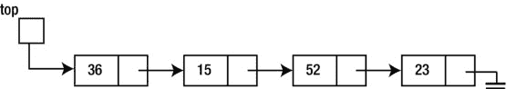

我们可以将它存储如下:


这里，链接(指针)仅仅是数组下标。由于数组下标只是一个整数，`top`是一个`int`变量，`next`是一个`int`数组。在这个例子中，数据碰巧是整数(所以`data`是一个`int`数组)，但是它可以是任何其他类型，甚至是一个对象。

`top`的值是 5，所以这表示列表中的第一项在数组索引 5 处找到；`data[5]`保存数据(本例中为 36)，而`next[5]`(本例中为 1)告诉我们在哪里可以找到列表中的下一个(第二个)条目。

因此，第二项在数组索引 1 处找到；`data[1]`保存数据(15)，而`next[1]` (7)告诉我们在哪里可以找到列表中的下一个(第三个)条目。

第三项在数组索引 7 处找到；`data[7]`保存数据(52)，而`next[7]` (3)告诉我们在哪里可以找到列表中的下一个(第四个)条目。

第四项位于数组索引 3 处；`data[3]`保存数据(23)，而`next[3]` (-1)告诉我们在哪里找到列表中的下一项。这里，我们使用-1 作为空指针，所以我们已经到了列表的末尾。任何不能与有效数组下标混淆的值都可以用来表示空指针，但是通常使用`-1`。

本章中描述的所有操作(例如，添加、删除和遍历)都可以以类似的方式在使用数组存储的链表上执行。主要区别在于，以前，如果`curr`指向当前节点，`curr.next`指向下一个节点。现在，如果`curr`指向当前节点，`next[curr]`指向下一个节点。

使用数组存储链表的一个缺点是，为了声明数组，你必须知道链表有多大。另一个问题是不能释放或垃圾收集已删除项的存储空间。但是，存储可以重新用于存储新项目。

3.15 合并两个排序后的链表

在 1.10 节中，我们考虑了合并两个有序列表的问题。在那里，我们展示了当列表存储在数组中时如何解决这个问题。现在我们将展示当列表被存储为链表时如何解决同样的问题。我们考虑合并两个有序链表产生一个有序链表的问题。

假设给定的列表如下:

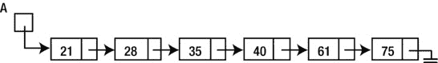

和

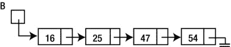

我们想创建一个链表，所有的数字按升序排列，因此:

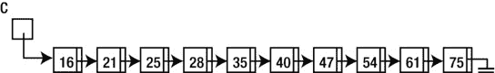

我们将通过为添加到列表`C`中的每个数字创建一个新节点来创建合并列表；我们保留列表`A`和`B`不变。我们将使用 1.10 节中使用的相同算法。这里是为了便于参考:

```java
        while (at least one number remains in both A and B) {
           if (smallest in A < smallest in B)
              add smallest in A to C
              move on to next number in A
           else
              add smallest in B to C
              move on to next number in B
           endif
        }
        //at this stage, at least one of the lists has ended
        while (A has numbers) {
           add smallest in A to C
           move on to next number in A
        }
        while (B has numbers) {
           add smallest in B to C
           move on to next number in B
        }
```

由于我们的列表包含整数，我们将不得不使用`NodeData`的`int`版本。

如果`A`和`B`属于`LinkedList`类型，我们将在`LinkedList`类中编写一个实例方法`merge`，这样`A.merge(B)`将返回一个包含`A`和`B`合并元素的`LinkedList`。下面是`merge`:

```java
        public LinkedList merge(LinkedList LL) {
           Node A = this.head;
           Node B = LL.head;
           LinkedList C = new LinkedList();
           while (A != null && B != null) {
              if (A.data.compareTo(B.data) < 0) {
                 C.addTail(A.data);
                 A = A.next;
              }
              else {
                 C.addTail(B.data);
                 B = B.next;
              }
           }
           while (A != null) {
              C.addTail(A.data);
              A = A.next;
           }
           while (B != null) {
              C.addTail(B.data);
              B = B.next;
           }
           return C;
        } //end merge
```

正如所实现的，`addTail`必须遍历整个列表，在添加每个新节点之前找到末尾。这是低效的。我们*可以*保留一个指向列表末尾的指针(`tail`，以便于在末尾添加一个节点。但是这在这个阶段会使类变得不必要的复杂。

由于在头部添加一个节点是一个简单、高效的操作，所以最好在头部添加一个新节点，并在合并完成后反转列表。我们将通过用`addHead`替换`addTail`来修改`merge`，并且就在`return C`之前，我们插入语句`C.reverseList();`。

为了测试`merge`，我们编写[程序 P3.6](#list6) 。它要求用户为两个列表输入数据。数据可以以任何顺序输入。这些列表将通过“就地”添加每个新数字来按排序顺序构建

我们提醒您，这个程序需要`NodeData`类的`int`版本，它被声明为`public`，并存储在文件`NodeData.java`中。它还要求将函数`merge`放在`LinkedList`类中，该类被声明为`public`并存储在文件`LinkedList.java`中。当然，[程序 P3.6](#list6) 存储在`MergeLists.java`文件中。

***[程序 P3.6](#_list6)***

```java
        import java.util.*;
        public class MergeLists {
           public static void main(String[] args) {
              Scanner in = new Scanner(System.in);
              LinkedList A = createSortedList(in);
              LinkedList B = createSortedList(in);
              System.out.printf("\nWhen we merge\n");
              A.printList();
              System.out.printf("with\n");
              B.printList();
              System.out.printf("we get\n");
              A.merge(B).printList();
           } //end main

           public static LinkedList createSortedList(Scanner in) {
              LinkedList LL = new LinkedList();
              System.out.printf("Enter some integers ending with 0\n");
              int n = in.nextInt();
              while (n != 0) {
                 LL.addInPlace(new NodeData(n));
                 n = in.nextInt();
              }
              return LL;
           } //end createSortedList

        } //end MergeLists
```

以下是[程序 P3.6](#list6) 的运行示例:

```java
        Enter some integers ending with 0
        8 4 12 6 10 2 0
        Enter some integers ending with 0
        5 7 15 1 3  0

        When we merge
        2 4 6 8 10 12
        with
        1 3 5 7 15
        we get
        1 2 3 4 5 6 7 8 10 12 15
```

3.16 循环和双向链表

到目前为止，我们的讨论主要是关于单向(单链表)的。每个节点包含一个指针，告诉我们下一个项目的位置。最后一个节点有一个空指针，表示列表的结尾。虽然这是最常用的列表类型，但两种常见的变体是*循环*列表和*双向*(或双向链接)列表。

3.16.1 循环列表

在循环列表中，我们让最后一项指向第一项，如下所示:

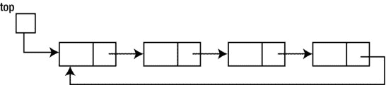

现在，没有空指针告诉我们什么时候到达了列表的末尾，所以我们在遍历时必须小心，不要陷入无限循环。换句话说，假设我们要写这样的东西:

```java
            Node curr = top;
            while (curr != null) {
               //do something with node pointed to by curr
               curr = curr.next;
            }
```

这个循环将*永远不会*终止，因为`curr`永远不会变成`null`。为了避免这个问题，我们可以保存起始节点的指针，并识别何时返回到这个节点。这里有一个例子:

```java
            Node curr = top;
            do {
               //do something with node pointed to by curr
               curr = curr.next;
            } while (curr != top) {
```

机警的读者会注意到，由于一个`do...while`循环的主体至少被执行一次，我们应该在进入循环并试图取消引用一个空指针之前确保列表不为空。

循环列表对于表示循环的情况很有用。例如，在玩家轮流玩的纸牌或棋盘游戏中，我们可以使用循环列表来表示游戏的顺序。如果有四个玩家，他们将按照 1、2、3、4、1、2、3、4、1、2 等顺序进行游戏。最后一个人玩完后，轮到第一个人。

在儿童游戏*报数*中，孩子们被排成一个圆圈，并出现“eenie，meenie，mynie，mo；抱歉，孩子，你得走了”用来一次消灭一个孩子。最后剩下的孩子赢得游戏。

我们将编写一个程序，使用循环列表来查找游戏的获胜者，描述如下:

***清点游戏*** *:* n *个孩子(编号为 1 到* n *)排成一圈。用一个由* m *个单词组成的句子，一次消灭一个孩子，直到剩下一个孩子。从子代 1 开始，子代从 1 计数到第* m *个，第* m *个子代被消除。从刚被淘汰的孩子开始，从 1 到第* m *个孩子开始计数，第* m *个孩子被淘汰。如此反复，直到剩下一个孩子。计数循环进行，被淘汰的孩子不计算在内。写一个程序读取* n *和* m *( > 0)的值，按照描述玩游戏，并打印最后剩下的孩子的号码。*

可以用一个数组(`child`，比方说)来解决这个问题。为了声明数组，我们需要知道要满足的孩子的最大数量(`max`)。我们可以设置`child[1]`到`child[n]`到`1`来表示所有的 *n* 孩子最初都在游戏中。当一个孩子(`h`)被淘汰时，我们会将`child[h]`设置为`0`，并开始从游戏中的下一个孩子开始计数。

随着游戏的进行，`child`中的几个条目会被设置为`0`，我们在计数的时候一定要保证`0` s 不被计数。换句话说，即使一个孩子已经被淘汰，我们仍然必须检查数组项目，如果`0`则跳过它。随着更多的孩子被淘汰，我们将需要检查和跳过更多的零条目。这是使用数组解决这个问题的主要缺点。

我们可以使用循环链表来编写一个更有效的解决方案。首先，我们创建一个有 *n* 个节点的列表。每个节点的值是子节点的编号。对于 *n* = 4，列表将如下所示，假设`curr`指向第一个孩子:

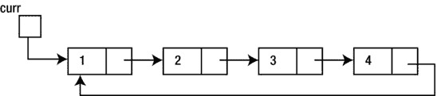

假设 *m* = 5。我们从 1 开始计数；当我们达到 4 时，5 的计数将我们带回到子 1，它被消除。该列表将如下所示:


如图所示，孩子 1 不再在列表中；这个节点的存储最终会被 Java 回收。我们从孩子 2 开始，再数到 5。计数在孩子 3 处结束，通过将孩子 2 的指针设置为指向孩子 4 来消除计数。该列表将如下所示:


最后，我们从第 4 个孩子开始数到 5。计数在孩子 4 处结束，孩子 4 被消除。孩子 2 是赢家。

请注意，这种解决方案(与数组版本相反)确实通过删除节点从游戏中删除了一个孩子。淘汰的孩子既然走了，既不检查也不统计！这更符合游戏的玩法。

[程序 P3.7](#list7) 玩游戏，并使用链表表示法找到获胜者。我们保持解决方案简单并且忠实于游戏的描述。因此，我们不使用`LinkedList`类。相反，我们使用一个有两个字段的`Node`类:一个`int`保存一个孩子的号码，一个指针指向下一个孩子。

在得到孩子的数量和计数长度之后，程序调用`linkCircular`来创建一个孩子的循环链表，然后调用`playGame`来删除所有的孩子，只留下一个。

***[程序 P3.7](#_list7)***

```java
     import java.util.*;
     public class CountOut {
        public static void main(String[] args) {
           Scanner in = new Scanner(System.in);
           int m, n;
           do {
              System.out.printf("Enter number of children and length of count-out: ");
              n = in.nextInt();
              m = in.nextInt();
           } while (n < 1 || m < 1);

           Node last = linkCircular(n); //link children in a circular list
           Node winner = playGame(last, n-1, m); //eliminate n-1 children
           System.out.printf("The winning child: %d\n", winner.num);
        } //end main

        public static Node linkCircular(int n) {
           //link n children in a circular list;
           //return pointer to last child; this will point to the first
           Node first, np;

           first = np = new Node(1);      //first child
           for (int h = 2; h <= n; h++) { //link the others
              np.next = new Node(h);
              np = np.next;
           }
           np.next = first; //set last child to point to first
           return np;
        } //end linkCircular

        public static Node playGame(Node last, int x, int m) {
        //Eliminate x children with countout length of m;
        //last points to the last child which points to the first child
           Node prev = last, curr = last.next; //curr points to first child
           //eliminate x children
           for (int h = 1; h <= x; h++) {
              //curr is pointing at the first child to be counted;
              //count m-1 more to get to the mth child
              for (int c = 1; c < m; c++) {
                 prev = curr;
                 curr = curr.next;
              }
              //delete the mth child
              prev.next = curr.next;
              curr = prev.next; //set curr to the child after the one eliminated
           }
           return curr;
        } //end playGame

     } //end class CountOut

     class Node {
        int num;
        Node next;

        public Node(int n) {
           num = n;
           next = null;
        }
     } //end class Node
```

以下是[程序 P3.7](#list7) 的运行示例:

```java
Enter number of children and length of count-out: 9 10
The winning child: 8
```

3.16.2 双向(双重链接)列表

顾名思义，每个节点将包含两个指针；一个指向下一个节点，另一个指向上一个节点。虽然这需要更多的工作来实现和维护，但还是有一些好处的。

显而易见的是，现在可以从任意一端开始双向遍历列表。如果需要，反转列表现在是一个简单的操作。

如果我们到达一个单链表中的一个节点(当前节点),就没有办法到达(或知道)前一个节点，除非在遍历链表时保存了该信息。有了双向链表，我们就有了一个指向前一个节点的指针，所以我们可以向两个方向移动。

一个可能的缺点是额外的链接需要更多的存储空间。另一个原因是添加和删除节点更加复杂，因为需要设置更多的指针。

**练习 3**

1.  在`LinkedList`类中编写一个实例方法，如果列表按升序排序，则返回`true`，否则返回`false`。
2.  编写一个实例方法，通过创建一个新的链表来反转链表的节点。方法返回新创建的列表。
3.  Write a method to sort a linked list of integers as follows:

    (a)找出列表中的最大值。

    (b)将其从其位置上删除，并将其插入列表的开头。

    (c)从现在的第二个要素开始，重复(a)和(b)。

    (d)从现在的第三个要素开始，重复(a)和(b)。

    继续操作，直到列表排序完毕。

4.  编写一个函数，它有三个参数——一个指向整数链表的指针和两个整数`n`和`j`——并在链表的第`j`个元素后插入`n`。如果`j`是`0`，则`n`被插入列表的开头。如果`j`大于列表中元素的数量，则`n`会被插入到最后一个元素之后。
5.  The characters of a string are held on a linked list, one character per node.

    (a)写一个方法，给定一个指向字符串的指针和两个字符，`c1`和`c2`，用`c2`替换所有出现的`c1`。

    (b)编写一个函数，给定一个指向字符串的指针和一个字符`c`，从字符串中删除所有出现的`c`。返回一个指向修改后的字符串的指针。

    (c)编写一个函数，创建一个新的列表，只包含给定列表中的字母，所有字母都转换成小写，并按字母顺序存储。返回指向新列表的指针。

    (d)编写一个函数，给定指向两个字符串的指针，如果第一个字符串是另一个字符串的子字符串，则返回 true，否则返回 false。

6.  编写一个函数，给定一个整数`n`，将`n`转换为二进制，并将每个位存储在一个链表的一个节点中，其中*最低有效位*位于链表的头部，而*最高有效位*位于链表的尾部。例如，给定`13`，比特按照`1 0 1 1`的顺序从头到尾存储。返回一个指向列表头部的指针。
7.  写一个函数，给定一个指向如 6 中存储的位链表的指针，*遍历链表一次*并返回二进制数的十进制等效值。
8.  You are given two pointers, `b1` and `b2`. Each points to a binary number stored as in question 6\. You must return a pointer to a newly created linked list representing the binary sum of the given numbers with the *least* significant bit at the head of the list and the *most* significant bit at the tail of the list. Write functions to do this in two ways:

    (I)使用 6 和 7 中的功能

    ㈡执行“一点一点”加法

9.  重复练习 6、7 和 8，但这一次，将最高*有效位放在列表的开头，最低*有效位放在列表的末尾。**
10.  Two words are anagrams if one word can be formed by rearranging all the letters of the other word, for example: *treason*, *senator*. A word is represented as a linked list with one letter per node of the list.

    写一个函数，给定`w1`和`w2`，每个都指向一个小写字母的单词，如果单词是变位词，则返回`1`，如果不是，则返回`0`。让你的算法基于以下:对于`w1`中的每个字母，搜索`w2`来找到它；如果找到，删除并继续；否则，返回`0`。

11.  重写计数程序，但是，这一次，将子元素存储在一个数组中。您的程序应该使用与[程序 P3.7](#list7) 相同的逻辑，除了您必须使用数组存储来实现循环表和所需的操作。
12.  整数的数字以相反的顺序保存在链表中，每个节点一个数字。编写一个函数，在给定指向两个整数的指针的情况下，执行逐位相加，并返回一个指向以相反顺序存储的和的数字的指针。注意:这种思想可以用来加任意大的整数。