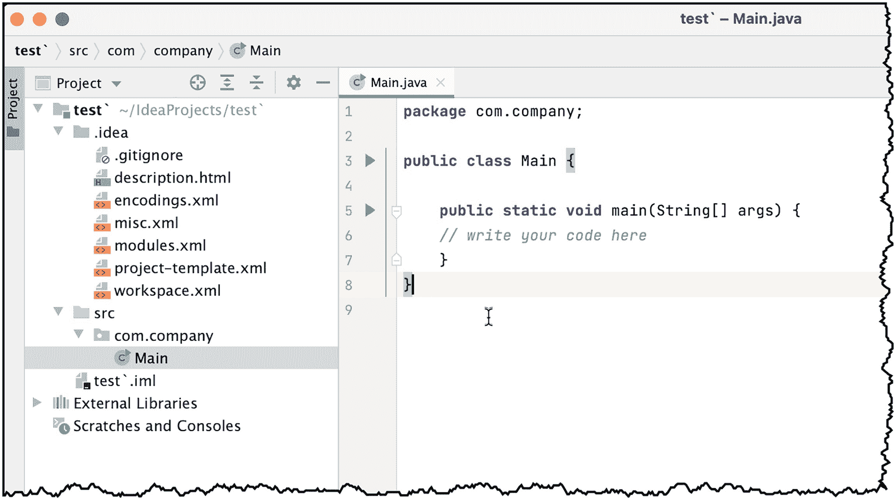
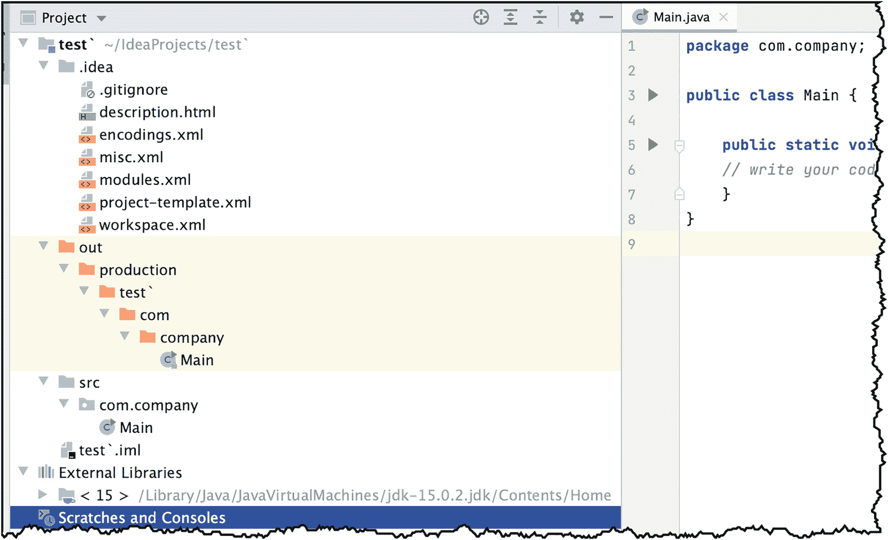

# 三、项目文件

我们将在本章中介绍如下:

*   IntelliJ 模块

*   那个。创意文件夹

*   out 文件夹

*   外部库

在前一章中，我们创建了一个小项目。内容不多，但它让我们体验了 IntelliJ 中的项目创建、编译和执行。在这一章中，我们将更仔细地看看组成 IntelliJ 项目的文件。

大多数足够先进的 ide，除了简单编辑源文件之外，还会生成包含配置、状态、首选项等的专有文件。IntelliJ 也不例外。

本章将着眼于 IntelliJ 作为项目的一部分生成的一些文件。

## iml 文件

这包含基本的模块信息。IntelliJ 中的模块不同于 Java 模块(在 Java 9 中引入)。IntelliJ 模块是一个独立的功能块，可以在 IDE 中独立运行、测试和调试。一个项目可能包含不止一个模块，它可能包含诸如源代码、构建脚本、单元测试、部署描述符等内容。iml 文件描述了一个模块。

图 [3-1](#Fig1) 显示了示例 **iml** 文件的内容。


图 3-1

显示 iml 文件的小项目

如您所见，这个项目中只有一个模块。它是随着项目自动创建的。您可以根据需要向项目中添加模块。

项目中的每个模块可以使用特定的 SDK，甚至可以根据项目设置继承一个 SDK。清单 [3-1](#PC1) 显示了我们的(默认)iml 文件的内容。

```java
<?xml version="1.0" encoding="UTF-8"?>
<module type="JAVA_MODULE" version="4">
  <component name="NewModuleRootManager" inherit-compiler-output="true">
    <exclude-output />
    <content url="file://$MODULE_DIR$">
      <sourceFolder url="file://$MODULE_DIR$/src" isTestSource="false" />
    </content>
    <orderEntry type="inheritedJdk" />
    <orderEntry type="sourceFolder" forTests="false" />
  </component>
</module>

Listing 3-1test.iml

```

## 那个。创意文件夹

**。idea** 文件夹是应用于整个项目的配置文件的集合，不管它包含多少模块。这是每个项目的根本。图 [3-2](#Fig2) 显示了一个带有**的项目。项目工具窗口中展开的 idea** 文件夹。


图 3-2

的内容。创意文件夹

当您更改项目设置或 IDE 设置时，这些更改将反映在**中的一个文件中。创意**文件夹。如果您更改了 JDK 设置、将模块添加到项目、更改了编码等。这些改变会使它成为这些文件中的一个。最好不要手动编辑这些文件。

如果这是您第一次使用 IntelliJ，您可能想知道是否应该包含。源代码管理中的 idea 文件夹。JetBrains 建议所有的内容。idea 文件夹，保存一个，放在源码控制中。您不应该签入的是 **workspace.xml** ，因为它包含您对项目的个人偏好；只是给你的。

## SRC 文件夹

src 文件夹是我们完成大部分工作的地方。您可能已经猜到，src 是源代码的缩写，就像源代码一样。图 [3-3](#Fig3) 显示了编辑窗口中显示的源代码。



图 3-3

Main.java 显示在主编辑窗口中。

我们的小示例项目只有一个 Java 源文件，它在 **com 下。公司**文件夹，如图 [3-3](#Fig3) 所示。IntelliJ 将源文件放在与包声明同名的文件夹下。

当您添加代码(在同一个包中)时，您会在相同的文件夹名称下看到它们。当您添加一个代码时，不在同一个包中，一个新的文件夹(带有新包声明的名称)将被添加到 **src** 文件夹中。

## Out 文件夹

当您运行或生成代码时，另一个文件夹将被添加到项目的根目录中。那就是 **out** 文件夹(如图 [3-4](#Fig4) )。


图 3-4

out 文件夹的内容

out 文件夹包含可执行的 Java 文件(字节码)。如果你点击 **Main.class** 文件尝试查看其内容，IntelliJ 不会打开类文件的内容；而是会提示你是否要反编译(如图 [3-5](#Fig5) )。


图 3-5

JetBrains 反编译程序

反编译器是一个很有价值的工具，尤其是当你不能访问可执行文件的源程序时。这里有一点来自 JetBrains 的警告，因为如你所知，反编译程序的使用是一个灰色地带。反编译器有合法的用途，也有不正当的原因。不管怎样，为了我们的好奇心，让我们反编译一下，好吗？毕竟这是我们自己的项目。要使用反编译器，必须点击“接受”(图 [3-5](#Fig5) )。

图 [3-6](#Fig6) 显示了反编译后的 **Main.class** 。


图 3-6

反编译 Main.class

## 外部库

在“外部库”文件夹中，您可以看到项目所依赖的所有库。我们创建了一个简单的项目，所以除了 JDK 图书馆之外，现在没什么可看的(如图 [3-7](#Fig7) 所示)。



图 3-7

外部库文件夹的内容

## 关键要点

*   IntelliJ 将其项目和 IDE 设置保存在**内的 XML 文件中。创意**文件夹。当您对项目、IDE 或您的环境进行更改时，这些更改会保存在**中的文件中。创意**文件夹。

*   JetBrains 建议我们保留。源代码管理中的 idea 文件夹，除了 **workspace.xml** 。你应该把它放进去。 **gitignore** 文件(如果你使用 Git 的话)。

*   IntelliJ 有一个内置的反编译器，可以用来查看反编译类的源代码。