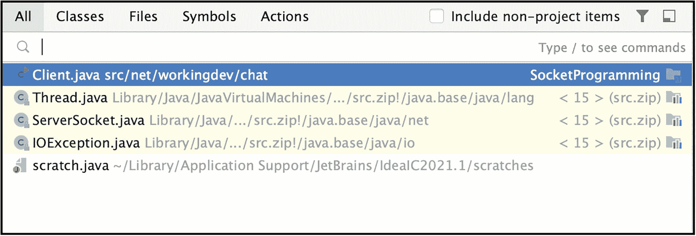
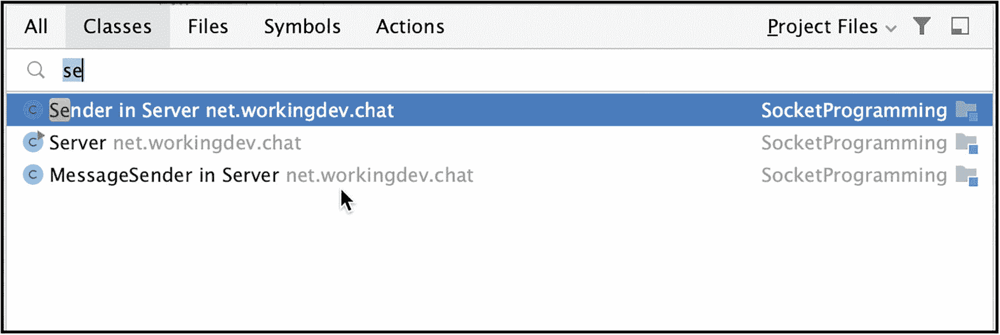
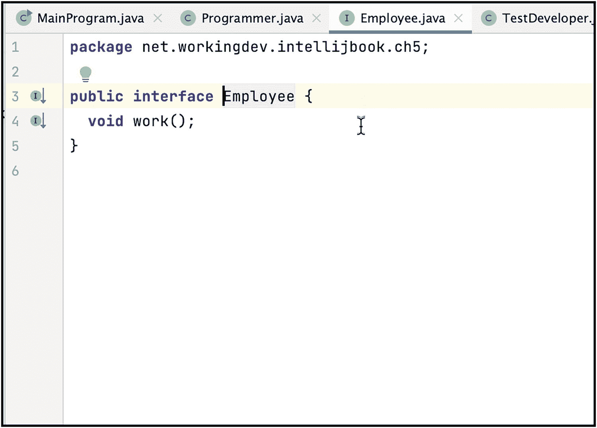
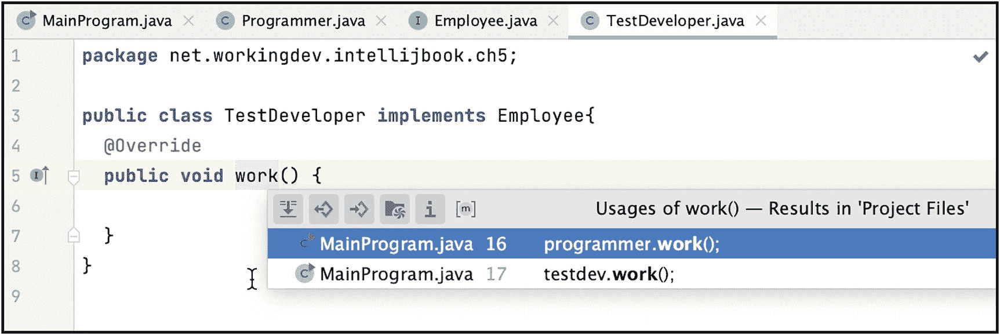
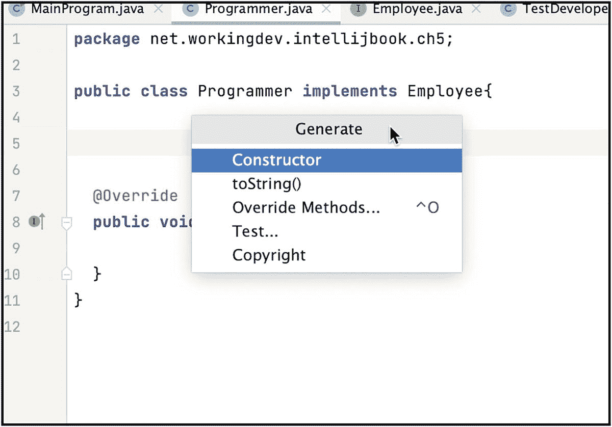

# 五、代码导航和生成

在本章中，我们将介绍以下内容:

*   如何使用 IntelliJ 中的“到处搜索”功能

*   如何使用键盘快捷键进入任何 IDE 操作

*   如何在没有狩猎和北平的情况下寻找档案

*   如何生成样板代码

你见过谁信誓旦旦地认为 Vim 是最好的编辑器吗？你有吗？你知道他们为什么这么说吗？其中一个原因，我认为，是因为有了 Vim，你不用鼠标来导航。都是键盘。你的手永远不会离开键盘——对一些人来说，这让他们处于一种流畅的状态。

你可以用 IntelliJ 做类似的事情。如果你想尝试双手(几乎)不离开键盘的工作流程，这一章就是为你准备的。

## 航行

你可能想知道为什么我们专门为代码导航写了一章。“当然，我知道如何浏览我的代码，”你告诉自己。“打开项目工具窗口，向下钻取到包和层次结构，然后双击打开— *et voila* ！”

如果是一个小项目，或者当编码速度并不重要时，你可以通过搜索和啄文件、类、变量和方法来获得——任何以编码为生的人都不会告诉你速度不重要。这总是很重要——但是当你不再编写“hello world”项目时，发展你的编码习惯将是一件大事。

当你检查你的编码过程(我指的是你自己的编码过程)时，你会发现至少有一半的时间，你并不是真的在敲东西——你实际上是在做更多的导航而不是敲代码。

如果你在狩猎和啄食，你正在失去宝贵的时间。有更快的方法来得到你的代码，这一节就是关于这个的。

### 到处搜索

你在 IntelliJ 中需要的最重要的键盘快捷键实际上在 IDE 的后台开始屏幕上(如图 [5-1](#Fig1) 所示)；然而，这也是最容易被忽视的。大多数人不会关注开始屏幕；我们如此渴望打开源文件并开始输入。


图 5-1

IntelliJ 的开始屏幕

开始屏幕提示为我们提供了一些漂亮的键盘快捷键，但是让我们从*搜索所有地方*快捷键开始。

您可以通过快速连续按下 **Shift** 键两次来激活*到处搜索*对话框(图 [5-2](#Fig2) 显示了到处搜索对话框)。



图 5-2

到处搜索

您可以开始在搜索栏中键入内容，开始看到一些结果。您可以通过名称找到项目中或项目外的任何项。您可以从单个入口点搜索文件、操作、类、符号、设置、UI 元素和 Git 中的任何东西。如果你还记得你的正则表达式，你可以用它们在**搜索所有地方**对话框中查找项目。

对话框中有几个选项卡(类、文件、符号、动作和全部)。默认情况下，您被放置在 *All* 选项卡上，但是您可以通过用鼠标选择它们来切换选项卡。

现在您可能已经知道，当您想要搜索类时，使用 *Classes* 选项卡，当您在解决方案中查找文件时，使用 *Files* ，当您搜索 IDE 操作时，使用 *Actions* ，当您查找类名、变量、常量和方法名时，使用*符号*。

当您在解决方案中查找文件而不是动作时， *All* 选项卡更有用。当您使用这个搜索工具时，请注意对话框是如何划分的，这样您就可以掌握它的窍门了。

顺便说一下，您一定注意到了“搜索所有地方”对话框中的勾号框，上面写着“包括非项目项”当您检查它时，您可以在 Java 文档中搜索非项目项，如类(如果您下载了它)。搜索非项目项目的最快方法是使用双 Shift 键盘快捷键，然后再次按下双 Shift 将搜索扩展到非项目项目。

### 查找操作

动作是指 IDE 动作，如打开终端、构建项目、创建文件等。您可以通过执行以下任一操作来执行操作:

*   **通过主菜单栏**，然后浏览子菜单项，直到找到您需要的动作。

*   **使用上下文菜单**–如果你知道在哪里点击右键，你可以得到你需要的动作。

*   **点击工具栏上的按钮**–工具栏上会显示一些最常见的操作，如运行、调试、停止等。

*   使用键盘快捷键——这是最快的，但这也意味着你需要记住这个快捷键。你也许可以对那些你经常使用的动作这样做，但是你不能对所有的动作都这样做。

*   **使用** ***到处搜索*** **对话框**然后准备行动。开始键入操作的名称，然后按 ENTER。这是第二种最快的行动方式。

例如，如果您想要启动一个终端会话(在 IntelliJ 中)，您可以使用**选项+ F12** (在 macOS 上)或 **Alt + F12** (在 Linux 和 Windows 上)。如果你不记得键盘快捷键，你可以使用到处搜索对话框，然后选择*动作*。或者，如果你不想让你的手指离开键盘，你也可以使用 **Shift + cmd + A** 快捷键(对于 macOS)或者 **Shift + CTRL + A** (对于 Linux 和 Windows)来启动*到处搜索*对话框并直接进入动作标签。

图 [5-3](#Fig3) 显示了我们搜索终端动作时的动作对话框。


图 5-3

行动

这个对话框向我们展示了一些关于终端操作的信息。我们可以看到它的键盘快捷键，也可以看到这个动作在主菜单栏上的位置。此时，您只需按下 ENTER 键即可启动该操作。

### 打开文件

如果您一直使用项目工具窗口打开文件，您会很高兴知道有更快的方法来访问您的文件。

图 [5-4](#Fig4) 所示的项目很小，但足以演示如何使用项目工具窗口搜索文件。将鼠标放在项目工具窗口下箭头的右边(如图 [5-4](#Fig4) ，然后开始输入(如图 [5-5](#Fig5) )。


图 5-5

在项目工具窗口中搜索文件


图 5-4

单击项目工具窗口旁边的

但是，只有当文件在项目工具窗口中可见时，此技术才有效。如果不是，例如当 src 文件夹被折叠时，这种搜索方法就会失败(如图 [5-6](#Fig6) 所示)。嗯，无论如何，你都可以使用*到处搜索*对话框查找文件。


图 5-6

带有折叠 src 文件夹的项目工具窗口

### 开放课程

在命名 Java 源文件时，最好用类名来命名文件。这样，当您查看项目工具窗口时，只需查看实际的源文件，就可以知道类文件在哪里。如果你遵循了这个建议，那么对你有好处。如果你没有，IntelliJ 支持你是件好事。在 IntelliJ 中搜索类定义非常容易；只要在 macOS 上按下 **cmd + O** (大写字母 O，不是零)，在 Windows 和 Linux 上按下 **CTRL + N** ，然后开始输入。

图 [5-7](#Fig7) 显示了搜索类别对话框。



图 5-7

搜索课程

### 转到符号

为了完成我们在*到处搜索*对话框选项卡上的讨论，让我们看看*符号*。当你在寻找变量、方法名和常量时，到处搜索对话框的符号选项卡是一个不错的选择。

*转到符号*的快捷键在 macOS 上是 **option + cmd + O** (大写字母 O)在 Windows 和 Linux 上是 **Shift + CTRL + Alt + N** 。

图 [5-8](#Fig8) 显示了运行中的*转到符号*对话框。


图 5-8

标志

### 最近的更改和文件

您可能经常需要的另一个有用的 IDE 快捷方式是如何查看最近更改的文件，以及通常项目中最近的更改。

要查看您最近处理过的文件，请使用 **cmd + E** 快捷键(macOS)或**CTRL+E**(Windows 和 Linux)。图 [5-9](#Fig9) 显示最近的文件对话框。


图 5-9

最近的文件

当你有健忘的时候，这个对话框很有用，你可以试着记起你正在处理的源文件。这是一个伟大的记忆慢跑者。请注意，它不仅会告诉您最近接触过的文件；它还会告诉您最近的一些操作(在对话框的左侧)。

另一个你可以使用的记忆点动器是*最近* *地点*对话框(如图 [5-10](#Fig10) )。可以使用 **Shift + cmd + E** (macOS)或者 **Shift + CTRL + E** (Windows 和 Linux)来激活。


图 5-10

最近位置

如果你想查看你最近在项目中所做的所有更改的列表，例如，创建一个新文件，使用快捷键 **Shift + cmd + C** (macOS)或 **Shift + Alt + C** (Windows 和 Linux)。图 [5-11](#Fig11) 显示最近变更对话框列表。


图 5-11

最近的变化

该对话框显示了所做的更改(在本例中是创建一个文件)以及更改的时间。列表上的项目是可点击的。它就像指向已更改文件的超链接，因此您只需单击它们就可以快速查看或编辑它们。

### 开放目标类型

有时候，你会遇到一些你不太熟悉的类型。在这些时候，快速浏览一下文档(或实际的代码实现)会非常有用。IntelliJ 可以让你做到这一点。将光标放在您想要调查的类型上，如图 [5-12](#Fig12) 所示，我将光标放在雇员类型上。然后用 **cmd + B** (macOS)或者 **CTRL + B** (Linux 和 Windows)打开定义了类型的源文件。


图 5-12

程序员源文件

IntelliJ 启动定义了类型的源文件(如图 [5-13](#Fig13) 所示)。



图 5-13

员工源文件

您不局限于解决方案中的文件；您也可以查看标准 Java 库中的文件。图 [5-14](#Fig14) 显示我的光标位于*螺纹*型；按下 **cmd + B** 快速将我带到线程类的定义(如图 [5-15](#Fig15) 所示)。


图 5-15

线程类别定义


图 5-14

主程序源文件

**cmd + B** 快捷方式不仅限于类型——它也适用于方法。当您在方法上使用该快捷方式时，IDE 将向您显示该方法在解决方案中的所有用法(如图 [5-16](#Fig16) 所示)。



图 5-16

解决方案中方法的用法

### 窥视定义

*查看定义*类似于*打开目标类型*(我们在上一节中讨论过)，但是与*打开目标类型*不同的是，*查看定义*不启动或打开文件。相反，它会显示一个弹出对话框，您可以在其中看到类型的定义。

要检查这一点，将光标放在您想要查看的类型上，就像我们在*中所做的那样打开目标类型*，然后按下按键 **option + space** (macOS)或 **Shift + CTRL + I** (Windows 和 Linux)。示例如图 [5-17](#Fig17) 所示。


图 5-17

窥视雇员类型的定义

### 显示成员

你把成员变量放在哪里？你是在类开始的时候，在所有方法之前一次性定义它们，还是在接近使用点的时候定义它们？以一个真正的编码惯例的名义发动了一场激烈的战争，但是这已经无关紧要了，因为像 IntelliJ 这样的 ide 可以在一个简洁的窗口中显示所有的类成员。

至少有两种方法可以看到该类的所有成员。第一种是通过使用 **cmd + F12** (macOS)或者 **CTRL + F12** (Windows 和 Linux)；样品如图 [5-18](#Fig18) 所示。


图 5-18

显示成员

查看成员的另一种方法是显示结构窗口(图[5-19](#Fig19))；使用 **cmd + 7** (macOS)或者 **Alt + 7** (Windows 和 Linux)。


图 5-19

结构窗口

使用 **cmd + 7** 来切换结构窗口的可见性，这样你就可以在不需要的时候把它移开。

### 查看类层次结构

IntelliJ 的另一个简洁的特性允许您在主编辑器中查看当前所选类的类层次结构。只需使用快捷键 **CTRL + H** (这是 macOS、Linux 和 Windows 的按键)来显示类层次结构窗口——如图 [5-20](#Fig20) 所示。


图 5-20

显示类层次结构

这是我想向您展示的关于代码导航的最后一个技巧。下一站，代码生成。

## 代码生成

IntelliJ 的另一个节省时间的特性是代码生成器；它的名字恰如其分，因为它确实做了你认为它会做的事情——它生成代码。

激活代码生成对话框的快捷键是 **cmd + N** (macOS)或者 **Alt + Insert** (Linux 和 Windows)。图 [5-21](#Fig21) 显示了运行中的代码生成对话框。



图 5-21

代码生成对话框

如您所见，您并不局限于构造函数生成。我将让你来试验其他的选择。

我想展示的下一个例子是如何为 getters 和 setters 生成代码——这是 Java 编程中非常常见的任务。

图 [5-21](#Fig21) 显示了带有两个成员变量的类程序员， *mLastname* 和 *mFirstname* 。显示代码生成对话框，然后选择 *Getter 和 Setter* ，如图 [5-22](#Fig22) 所示。


图 5-22

生成 getters 和 setters

IntelliJ 显示所有自动检测的成员变量(如图 [5-23](#Fig23) 所示)。您可以选择想要为其生成 getters 和 setters 的所有成员，您可以在这里进行多项选择。


图 5-23

选择字段以生成 getters 和 setters

单击确定按钮生成代码。清单 [5-1](#PC1) 展示了我们的程序员类，它为 mFirstname 和 mLastname 自动生成了 getters 和 setters。

```java
public class Programmer implements Employee{

  String mLastname;
  String mFirstname;

  public String getmLastname() {
    return mLastname;
  }

  public void setmLastname(String mLastname) {
    this.mLastname = mLastname;
  }

  public String getmFirstname() {
    return mFirstname;
  }

  public void setmFirstname(String mFirstname) {
    this.mFirstname = mFirstname;
  }

  @Override
  public void work() {

  }
}

Listing 5-1Class Programmer with Generated Getters and Setters

```

这已经很不错了。任何能让我们节省击键次数的东西都是好东西。我猜你可能只对这个例子有一点挑剔；方法命名不正确。你可能更喜欢称**为 setLastname()** 而不是 **setmLastname()，**不是吗？让我们解决这个问题。

转到 IntelliJ 的偏好设置—使用快捷键 **cmd +，macOS 使用**(逗号)。对于 Linux 和 Windows 来说是 **CTRL + Alt + S** ，然后进入代码风格➤ Java ➤代码生成，如图 [5-24](#Fig24) 所示。


图 5-24

首选项➤代码风格➤ Java ➤代码生成

在字段名前缀中，告诉 IntelliJ 如何给成员变量加前缀。在我的例子中，我用字母 *m* 作为成员变量的前缀，因此， *mLastname* 作为姓氏变量。

单击 Apply 或 OK 按钮保存更改，然后再次为 mFirstname 和 mLastname 生成 getters 和 setters。

清单 [5-2](#PC2) 显示了重新生成的程序员类。

```java
public class Programmer implements Employee{

  String mLastname;
  String mFirstname;

  public String getLastname() {
    return mLastname;
  }

  public void setLastname(String lastname) {
    mLastname = lastname;
  }

  public String getFirstname() {
    return mFirstname;
  }

  public void setFirstname(String firstname) {
    mFirstname = firstname;
  }

  @Override
  public void work() {

  }
}

Listing 5-2Programmer Class with Autogenerated Getters and Setters

```

这还差不多！

## 关键要点

*   所有 IDE 操作都可以通过主菜单栏来执行，但是激活这些操作的最快方式是通过键盘快捷键。

*   在 IntelliJ 中激活一个动作的第二种最快方法是使用 **cmd + A** (macOS)或 **Shift + CTRL + A** (Windows 和 Linux)搜索动作。

*   如果你能记住一些快捷键，你将会节省很多时间，但是如果你只能记住一个快捷键，那就让它变成双 Shift 吧。只需连续按下 Shift 键两次，就可以打开“到处搜索”对话框。