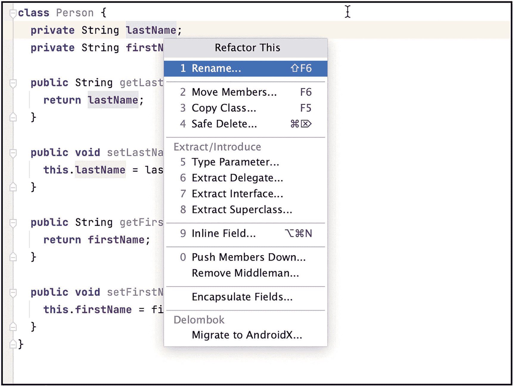
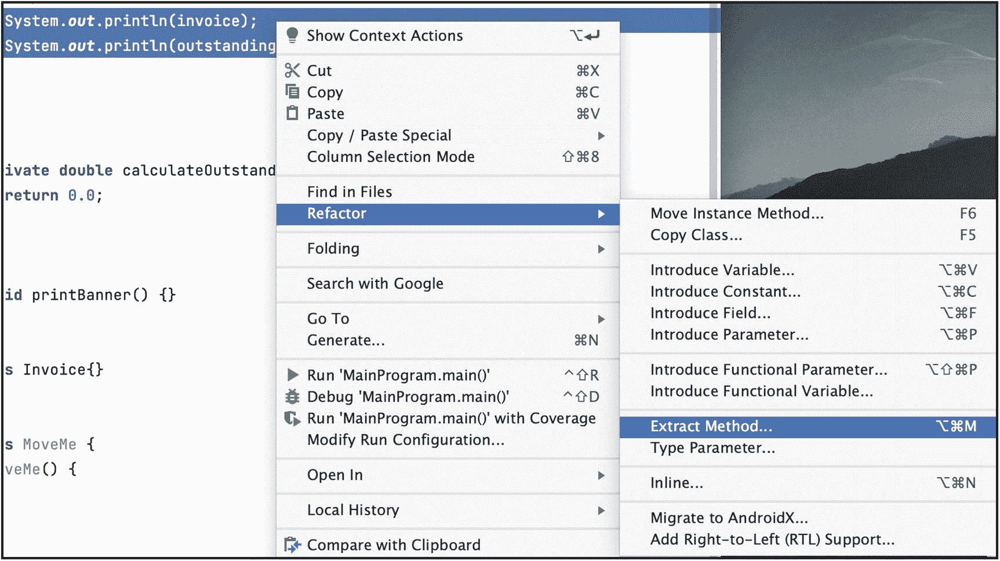
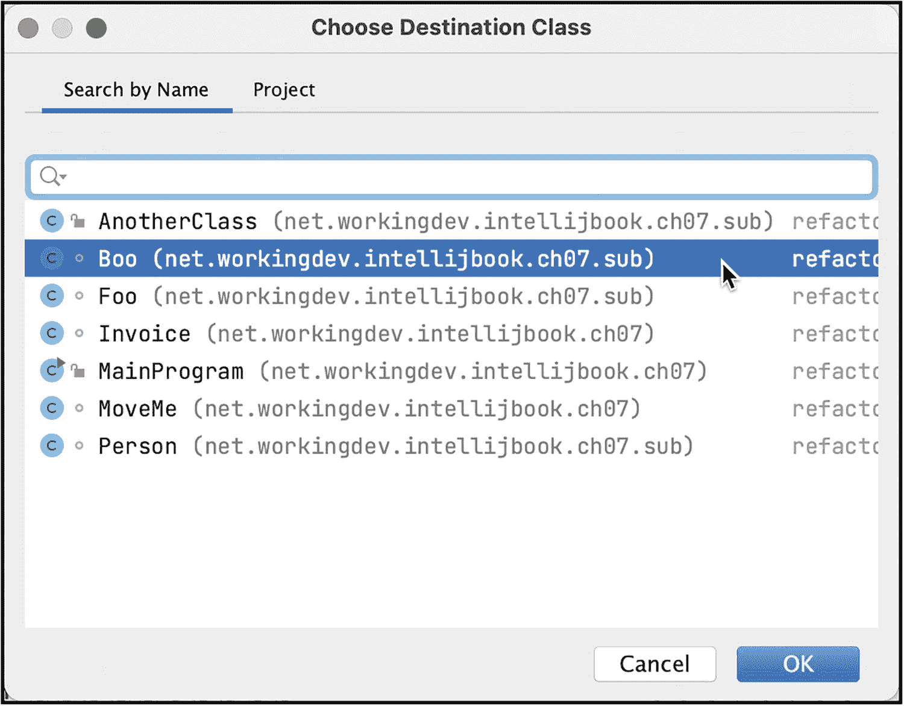
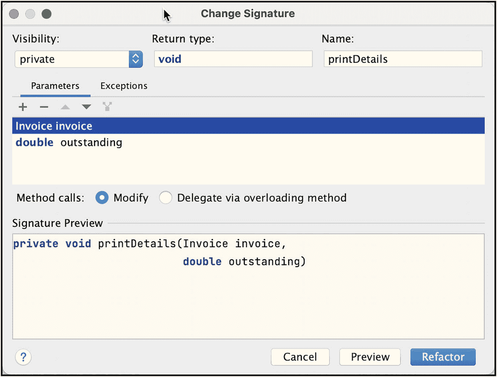

# 七、重构

在本章中，我们将介绍以下内容:

*   重构概述

*   常见的(也是重要的)重构操作

*   IntelliJ 如何重构

“技术债务”、“干燥原则”、“干净的代码”——在代码评审中听过这些术语吗？开发会议，也许？我打赌你有。这些可能是现在的流行语，但它们不是空的。这些术语被创造出来(并变得流行)是有充分理由的。

构建一个新应用最令人兴奋的部分(至少对我来说)是最初的编码阶段。这总是一个爆炸，但随着项目进入维护阶段——您最初的技术决策开始困扰您——它变得越来越不有趣。事实上，它开始感觉像一件苦差事。维护阶段不令人兴奋的一个常见原因是，当您在大量代码的基础上编写新功能时，添加新功能要困难得多。最微小的错误可以破坏很多东西，当你修复一件东西时，你会破坏两件东西。这就是为什么你真的应该养成对你的代码进行单元测试的习惯——但是我们在这里超越了自己；这不是本章的内容；我们很快就会处理测试的问题。无论如何，关键是，如果代码是干净的，易读的，并且有点条理，那么维护代码的工作就不那么可怕了。

重构基本上是重写和改进源代码——使它们易于阅读——而不改变其可观察到的行为。有组织的、整洁的、易读的代码比无组织的、混乱的、复杂的代码更好——这使得代码更容易维护和扩展。在这一章中，我们将讨论重构以及 IntelliJ 是如何让重构变得容易的。

## 重构

没有人会着手编写复杂、混乱和无组织的代码。代码复杂性不是任何程序员开始项目时的目标。代码开始很简单，如果你能相信的话；然后，随着我们添加更多的代码，复杂性越来越多——一个接一个。如果你不能控制复杂性，你很可能会以“意大利面条式的代码”而告终，这些代码真的很难解开。那么，我们如何管理这种情况呢？很多方法，其中之一是通过重构。

当你重构时，你只是以一种更有组织性的方式移动代码片段；但是它不会改变代码的行为。让我们考虑清单 [7-1](#PC1) 中的代码；该方法只需调用一个例程来打印一些横幅数据，计算未清余额，打印发票，最后打印未清余额。

```java
void printSomething(Invoice invoice) {

  printBanner();
  double outstanding = calculateOutstanding();

  // print details
  System.out.println(customer);
  System.out.println(outstanding);

}

Listing 7-1printSomething() Method

```

在某些时候，我们可能需要打印客户发票和代码库中其他地方的未清余额。创建一个打印详细信息的方法，这样我们就不必编写前面示例代码的最后两个 println()语句，难道不是很有意义吗？清单 [7-2](#PC2) 向我们展示了如何操作。

```java
void printSomething(Invoice invoice) {
  printBanner();
  double outstanding = calculateOutstanding();

  printDetails(invoice, outstanding);
}

private void printDetails(Invoice invoice, double outstanding) {
  System.out.println(invoice);
  System.out.println(outstanding);
}

Listing 7-2Refactored printSomething() Method

```

看到多简单了吧？我们只是移动了一些代码。现在，每当我们需要打印客户的详细信息时，我们只需调用 printDetails()。

我们刚刚做的重构叫做“提取方法”重构。这些重构行为有一个完整的目录——你可以在 [`https://refactoring.com/catalog/`](https://refactoring.com/catalog/) 找到。目录中列出了 60 多个重构操作。我怀疑你会需要全部 60 个。作为实验，你可以去 GitHub 搜索每个重构动作的名字。例如，搜索“重命名变量”(如图 [7-1](#Fig1) )。


图 7-1

GitHub 上的“重命名变量”搜索

GitHub 上有超过 100 万次的“重命名变量”操作。当然，并不是所有的重构操作都记录在提交消息中，但是这是对现实世界重构活动的一个不错的近似。

用这些简陋的研究方法，下面是我在 GitHub 上的发现。在撰写本文时,“重命名变量”操作以超过 100 万次提交高居榜首。

以下列表显示了我的部分发现:

*   重命名变量–1M+

*   重命名方法–178k

*   重命名类别–143k

*   移动方法–109k

*   移动等级–97K

*   提取方法–95K

*   内嵌方法–81K

*   提取等级–23K

*   提取接口–18K

*   提取超类–2K

*   引入断言–2K

*   上拉方法–1K

*   引入参数对象- 674

*   下推方法–168

## 何时重构

你怎么知道什么时候应该重构？

肯特·贝克是“极限编程”的创始人，也是“敏捷宣言”的 17 个原始签名人之一，他推广了“代码气味”这个术语。在马丁·福勒的《重构:改进现有代码的设计》一书中，这个术语的使用增加了。

当一个代码需要重构时，它被称为有“味道”，不是字面上的意思——它只是意味着代码读起来没有吸引力或不愉快。以下是一些代码气味的例子:

*   **大类**–在现有的类中添加新的方法或行为通常更容易；这就是一个阶层成长的原因。随着时间的推移，太多的功能被塞进了这个类。您可能需要将它的一些功能重新定位到一个新类中。

*   长方法(Long method)——当你把很多功能塞进一个方法时，就会出现这种情况。节约切换和简单地将行为保持在现有方法内的冲动太强烈了，因此该方法不断发展。这里有一个小提示:当你觉得你必须写一个注释来解释下一行代码时，这通常是一个信号，你应该把下一行代码放到它自己的方法中。

*   **大量原始类型被使用**–当原始成员变量的数量随着时间增长时，可能是时候回顾一下你对问题域的抽象了。

*   **参数过多**–这通常与前面提到的“长方法”同时发生。参数太多，可能是因为这个方法做得太多了。它实现了太多的算法。或者是时候再次回顾你的抽象了。与其传递许多参数，不如传递一个对象。

有很多代码的味道；在这一章中，我们不可能把它们都讲清楚，因为我们应该讨论如何在 IntelliJ 中进行重构。

Note

随着您获得更多的经验，您手动检测“代码气味”的能力将会增强——在此之前，您可能希望使用一些工具来帮助您找到不良代码。SonarLink 是一个不错的起点。它是 IntelliJ 的一个插件。你可以从 [`www.sonarlink.org`](http://www.sonarlink.org) 网站获取 SonarLink。

## IntelliJ 中的重构

现在我们已经对重构有了相当多的了解，是时候看看它的实际应用了。

要开始重构，您需要选择想要重构的代码片段(目标)。它可以是一个符号，也可以只是一段代码。您可以在编辑器或结构工具窗口中选择符号—我通常只在编辑器中选择代码；这样感觉更自然。通常在符号上有插入符号就足够了。IntelliJ 自动扩展选择，如图 [7-2](#Fig2) 所示，我在*姓氏*符号的某处放置了插入符号。


图 7-2

IntelliJ 自动扩展选择

如您所见，IntelliJ 已经突出显示了姓氏符号的用法，即使我还没有要求它做任何事情。IDE 会预测您的行动。

一旦选择了目标，现在就可以选择重构操作了。您可以通过几种方式做到这一点:

*   通过主菜单栏，选择重构，然后选择重构操作。

*   使用上下文菜单。右键单击该符号，然后选择重构，再选择重构操作。

*   使用键盘快捷键 **CTRL + T** (macOS)或者**CTRL+Shift+Alt+T**(Linux/Windows)，然后选择重构动作。

继续我们的例子，让我们将变量*的姓氏*重命名为*的名字*。一旦我在*姓氏*符号上有了插入符号，我将使用键盘显示“重构这个”对话框(如图 [7-3](#Fig3) 所示)。顺便说一下，当你显示“重构这个”对话框时，显示了各种重构操作的键盘快捷键:Shift + F6 用于重命名，F6 用于移动成员，F5 用于复制类，等等。您可以选择记住这些单独的快捷方式(这是访问它们的最快方式)，或者如果您有点懒(像我一样)，我可以只使用右键单击或 CTRL+T——反正它会带我到“重构这个”对话框。



图 7-3

“重构此”对话框

让我们选择“重命名”；毕竟，我们想要重命名一个变量。选择“重命名”后，IntelliJ 会高亮显示正在编辑的符号，并立即相应地更改符号的出现，如图 [7-4](#Fig4) 所示。


图 7-4

重构变量

完成编辑后，按 ENTER 键。

如果您注意到了，在我们的示例代码中，变量 lastName 和 firstName 有 getters 和 setters。IntelliJ 还建议我们是否要改变 getters 和 setters(如图 7-5 所示)。


图 7-5

重命名 Getters 和 Setters

对话框的底部面板显示了代码更改的预览(图 [7-5](#Fig5) )。单击确定完成操作。

清单 7-3 显示了重构后的 Person 类。

```java
class Person {
  private String lname;
  private String firstName;

  public String getLname() {
    return lname;
  }

  public void setLname(String lname) {
    this.lname = lname;
  }

  public String getFirstName() {
    return firstName;
  }

  public void setFirstName(String firstName) {
    this.firstName = firstName;
  }
}

Listing 7-3Refactored Person class

```

你可能会认为这只是一个美化了的“搜索和替换”操作，任何一个像样的编辑器都可以做，但它不仅仅是这样。当您需要在更大范围内重命名一些东西时，比如一个类、包或者一个广泛使用的公共方法，重构操作的价值就变得显而易见了。在重命名操作期间，IntelliJ 执行以下操作:

*   它检查当前作用域中的名称冲突。

*   它验证新名称在语法上是合法的。

*   如果你重命名一个类或包，它会创建新的文件和目录，并删除旧的。

*   它会更新版本控制系统中由于名称更改而从源代码树中添加或删除的任何文件。

*   它会更正对您重命名的符号的所有直接代码引用，以确保它们使用新名称。

*   它甚至更新 JavaDoc 注释。

*   它更新任何受影响的导入语句。

## IntelliJ 中的更多重构

我相信您已经掌握了它的窍门，我可能会让您自己去尝试如何做其他的重构操作——但是让我们再做几个，好吗？

### 提取方法

当你“闻到”代码越来越长时，你可能想要使用“提取方法”重构操作。您将提取方法，因为您想要抽象操作并将一些行为封装在一个单独的方法中；这样，就可以从代码的其他部分重用它。

图 [7-6](#Fig6) 显示了 printSomething()方法——你之前已经看过这段代码了。我在本章前面用这个作为例子。您已经知道这将如何被重构。


图 7-6

printSomething()方法

我们希望提取第 13 行和第 14 行，并将它们放在一个单独的方法中。为此，我将突出显示第 13 行和第 14 行(如图 [7-7](#Fig7) 所示)，然后弹出“Refactor This”对话框。



图 7-7

提取方法

选择“提取方法”操作；一旦我选择了动作，IntelliJ 就会显示一个变化的实时预览。提取的方法——恰当地命名为“extracted()”——在后台显示并点亮(如图 [7-8](#Fig8) 所示)。


图 7-8

提取的()方法显示在预览中

此时，IntelliJ 还没有完成重构操作。如您所见，选择“extracted()”方法签名是因为 IntelliJ 正在等我键入新方法的名称。因此，我将输入新提取的方法的名称。我将名称改为“printDetails()”，如图 [7-9](#Fig9) 所示。


图 7-9

print 细节()方法

像以前一样，IntelliJ 会在您键入时显示更改的实时预览。

当您对方法名的更改感到满意时，按 ENTER 键完成重构操作。重构之后，您可能需要做一些清理工作——不多，但有时可能需要做一些小的修改。

### 移动成员

您可以将成员变量或方法从一个类移动到另一个类，但是请注意，您只能移动静态成员——IntelliJ 不允许您移动实例成员。

要移动一个类成员，将插入符号定位在你想要移动的符号上，然后弹出“重构”对话框，如图 [7-10](#Fig10) 所示。


图 7-10

移动成员

选择“移动成员”在接下来的屏幕中(图 [7-11](#Fig11) ，您可以选择目的地。您需要告诉 IntelliJ 您想要将成员移动到哪里。


图 7-11

移动静态成员

单击省略号按钮(在“完全限定名称”字段的右侧)。您可以在随后的对话框中选择目标类别(如图 [7-12](#Fig12) 所示)。



图 7-12

选择目的地类别

点击 OK 以完成选择，之后您将返回到上一个对话框，但是这一次，destination 字段包含目标类的全限定名称(如图 [7-13](#Fig13) 所示)。


图 7-13

移动静态成员(填满)

点击**重构**完成动作。

### 更改签名

如果您需要更改方法的签名，在手动更改之前请三思。IntelliJ 真的可以在处理变更的后果方面为您节省大量时间。如果您手动执行，您可能无法获得该方法的所有引用 IDE 不会错过任何一个节拍。

让我们更改我们前面的示例“printDetails()”方法的签名。将插入符号放在方法名上，弹出“重构”对话框，如图 [7-14](#Fig14) 所示。


图 7-14

更改 printDetails()的签名

选择“更改签名”操作。弹出更改签名对话框(如图 [7-15](#Fig15) )。



图 7-15

更改签名对话框

在此对话框中，您可以更改成员的可见性、返回类型、名称，甚至参数的顺序。

图 [7-16](#Fig16) 显示了我所做的一些更改的更改签名对话框。


图 7-16

更改签名(包含我的更改)

如您所见，我将方法的名称更改为“printSomeDetails()”，将返回类型更改为 int，还将其可见性更改为“protected”。

对话框的底部面板显示了方法签名的预览(包含您的更改)。此时，如果您已经对您的更改感到满意，您可以单击“重构”来完成操作。或者，您可以单击“预览”按钮，在提交操作之前查看重构预览。重构预览如图 [7-17](#Fig17) 所示。


图 7-17

重构预览

您可以在预览中检查建议的重构的细节。当您对更改满意时，单击“Do Refactor”按钮完成操作。否则，单击“取消”按钮中止操作。

## 关键要点

*   重构不仅为其他人，也为我们自己保持我们代码库的健全。三个月后，你将不会记得在写那段漂亮的代码时的想法。

*   IntelliJ 的重构工具比“查找和替换”要好得多。在手动操作之前，尽可能尝试使用重构工具。

*   如果你只能记住一个重构的快捷方式，那就让它成为 **CTRL + T** (对于 macOS 用户)或者 **CTRL + Shift + Alt + T** (对于 PC 用户)。