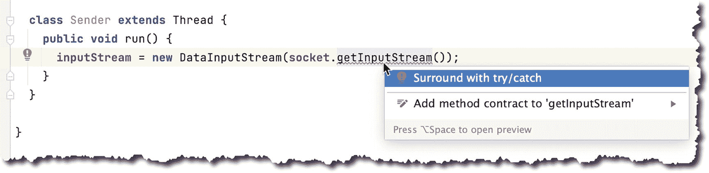
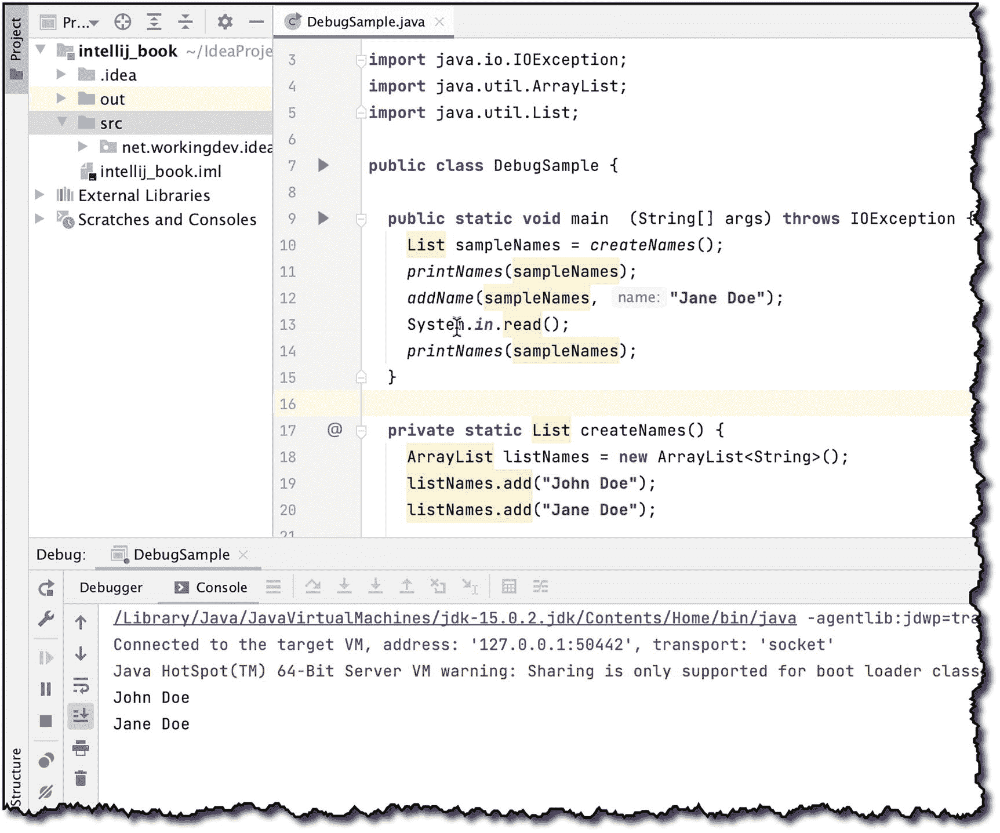

# 九、故障排除

在本章中，我们将介绍以下内容:

*   您最有可能遇到的错误

*   记录调试语句

*   使用调试器

大多数(如果不是全部的话)程序都会有错误——我这里说的是不平凡的程序，不是“Hello World”那种。作为一名开发人员，处理错误将是你职业的一大部分。在这一章中，我们将讨论你最有可能遇到的错误，以及如何使用 IntelliJ 来处理这些错误。

## 错误类型

通常，您会遇到以下几种错误:

*   句法误差

*   运行时错误

*   逻辑错误

### 句法误差

语法错误就是你所认为的语法错误。发生这种情况是因为你在代码中写了一些 Java 编译器的规则集不允许的东西。编译器不理解它。错误可能很简单，比如忘记关闭括号或缺少一对花括号。它也可能很复杂，比如在使用泛型时，将错误类型的参数传递给函数或参数化类。

每当您在主编辑器上看到红色的曲线时，您可以轻松地用 IntelliJ 捕捉语法错误，如图 [9-1](#Fig1) 所示。


图 9-1

主编辑器显示一个语法错误指示器

当你看到这样一条弯弯曲曲的红线时，这意味着你有一个语法错误。IntelliJ 将红色曲线放在非常靠近违规代码的地方。如果您将鼠标悬停在红色曲线上，大多数情况下，IDE 可以非常准确地告诉您代码有什么问题，这样您就可以轻松地找到并修复这些代码。

除了语法错误之外，当您试图编译使用不同的 JDK(旧版本或完全不同的 JDK)构建的代码时，您还可能会遇到编译错误。

### 运行时错误

运行时错误发生在你的代码遇到了意想不到的情况时。顾名思义，这个错误只在程序运行时发生。这不是你在编译时会看到的。

Java 有两种类型的异常，*选中的*和*未选中的*。IntelliJ 在检查异常方面给了你很多帮助。图 [9-2](#Fig2) 显示了当你试图调用一个抛出**检查异常**的方法时，在主编辑器中会发生什么。


图 9-2

显示未处理异常信息的主编辑器

IntelliJ 试图通过标记未处理的异常来提供帮助，如图 [9-2](#Fig2) 所示。如果您将鼠标悬停在弯曲的红线上足够长的时间，IntelliJ 会显示代码被标记的原因，甚至会给出如何修复它的建议。

关于检查的和未检查的异常:检查的异常是 Java 编译器在编译期间检查(或检查)的东西。如果一个方法声明它抛出一个检查过的异常(例如，FileNotFoundException、ClassNotFoundException、IOException、SQLException 等)。)，则该方法必须通过将调用包含在 try-catch 中或通过重新引发异常来处理异常。

另一方面，未检查的异常在编译时不会被检查，这意味着您不需要为 try-catches 费心；你可以像任何坏事都不会发生在你的应用上一样编码。在像 C++和 Kotlin 这样的语言中，所有的异常都是未检查的，所以您可以省去 try-catch 块——如果您愿意，您仍然可以处理异常，但这是可选的。

标记和提示未处理异常的解决方案已经很好了，但是 IntelliJ 还提供了快速修复。快速修复是 IntelliJ 对它在设计时检测到的错误的修复操作；这很容易执行——你只需要在突出显示的代码问题上按下 **Alt + ENTER** (对于 Linux 和 Windows 用户)或 **cmd + ENTER** (如果你在 macOS 上),然后选择一个适当的操作过程。图 [9-3](#Fig3) 显示了这一点。



图 9-3

快速修复我们未处理的异常

清单 [9-1](#PC1) 显示了发送者类(带有自动修正的代码)。

```java
class Sender extends Thread {
  public void run() {
    try {
      inputStream = new DataInputStream(socket.getInputStream());
    } catch (IOException e) {
      e.printStackTrace();
    }
  }
}

Listing 9-1Class Sender

```

IntelliJ 尽职尽责地将适当的 try-catch 结构添加到代码中——它甚至正确地格式化了代码。不过，它没有添加 *finally* 子句，您必须自己编写。

### 逻辑错误

逻辑错误是最难发现的。顾名思义，这是你逻辑上的错误。当你的代码没有做你认为它应该做的事情时，那就是逻辑错误。有许多方法可以应对它，但最受欢迎的是使用 **System.out.println()** 或 Logger 类(来自 java.util.logging)。

当你检查你的代码时，你会发现某些领域你对正在发生的事情非常确定，但是也有一些领域你不太确定；在这些领域，println 或 Logger 最有用。就像留下面包屑让你跟着。

## 调试器

IntelliJ 是一个全功能的 IDE。它带有一个强大的调试器。虽然您可以使用 println 和 Logger 语句在您的代码中使用 sleuth，但是当您在使用 code-detective 时，使用调试器会得到更好的结果——它也更容易使用，因为它不会使您的代码混乱。

让我们考虑下面的代码(如清单 [9-2](#PC2) 所示)来演示 IDEA 调试器。

```java
package net.workingdev.ideabook;

import java.util.ArrayList;
import java.util.List;

public class DebugSample {

  public static void main(String[] args) {
    List sampleNames = createNames();
    printNames(sampleNames);
    addName(sampleNames, "Jane Doe");
    printNames(sampleNames);
  }

  private static List createNames() {
    ArrayList listNames = new ArrayList<String>();
    listNames.add("John Doe");
    listNames.add("Jane Doe");

    return listNames;
  }

  private static void printNames(List<String> names) {
    for (String name : names) {
      System.out.println(name);
    }
  }

  private static void addName(List<String> l, String name) {
    l.add(name);
  }

  private static void removeNames(List l, String name) {
    int position = l.indexOf(name);
    if (position == -1) {
      // the name is not in the list
    }
    else {
      l.remove(position);
      printNames(l);
    }
  }
}

Listing 9-2DebugSample Class

```

代码有五个方法(包括 main)。方法 **createNames()** 创建一个名字列表并返回它。方法 **printNames()** 接受一个姓名列表，并打印列表中的每一项。 **addName()** 方法接受一个列表和一个字符串；然后，它将字符串(第二个参数)添加到列表中。最后， **removeName()** 方法接受一个列表和一个字符串；它在列表中搜索第二个参数的出现；如果找到了，就删除该字符串，并再次打印列表。

您可以通过多种方式启动调试器:


图 9-5

从主方法的上下文菜单中运行调试


图 9-4

从底层调试

1.  你可以点击装订线区域的运行图标(如图 [9-4](#Fig4) 所示)，然后选择“调试”

2.  可以使用类的 main 方法的上下文菜单，然后选择“调试”(如图 [9-5](#Fig5) )。您可以通过左键单击 main 方法或使用 main 方法上的快速修复键来完成此操作——在 Windows/Linux 上，*快速修复键是 **Alt + ENTER** ，在 macOS 上是 **cmd + ENTER** 。*

3.  或者，您可以从 IntelliJ 的主菜单栏启动调试器；转到运行➤调试。

现在，我们的代码愉快地浏览着它的逻辑；它创建一个名称列表，打印名称，添加名称，然后再次打印名称——您可以在 IntelliJ 的输出窗口中看到这一点(图 [9-6](#Fig6) )。


图 9-6

示例代码的调试会话

可以说，当您想要查看(执行)情况时，调试器变得非常有用，我们可以通过几种方式来做到这一点。我们可以在代码中的指定位置暂停、恢复、重启或停止调试器。

当你的应用程序看起来没有反应时——这意味着它卡在了某个地方——你可以使用调试器来分析代码卡在了哪里。目前，我们的示例代码小而简单；这就是为什么它从头到尾都很轻松。让我们修改一下我们的 main 方法，让它模拟一个“卡住”的代码。清单 [9-3](#PC3) 显示了修改后的 main 方法。

```java
public static void main  (String[] args) throws IOException {
  List sampleNames = createNames();
  printNames(sampleNames);
  addName(sampleNames, "Jane Doe");
  System.in.read();
  printNames(sampleNames);
}

Listing 9-3Modified Main Method

```

对`System.in.read()`的调用将停止程序执行；它在继续下一行之前等待用户输入。这对我们的目的来说足够好了。它模拟一个卡住的程序。现在，在调试模式下运行代码。

请注意，在输出窗口中，我们的流程没有完成(如图 [9-7](#Fig7) 所示)。卡住了。



图 9-7

DebugSample 在执行时停滞

现在点击调试器上的*暂停*按钮，如图 [9-8](#Fig8) 所示。


图 9-8

调试器的暂停按钮

一旦你暂停调试器，编辑器将向你显示它当前正在运行的类和方法——或者停留在那里(如图 [9-9](#Fig9) 所示)。在我们的例子中，它卡在了 **System.in.read()** 上；这就是为什么编辑器向我们展示了 **FileInputStream** 类的 **readBytes()** 方法——如果你切换到 *Debug* 窗口的*调试器*选项卡，你甚至可以看到堆栈跟踪(如图 [9-10](#Fig10) 所示)。


图 9-10

查看“调试器”选项卡上的堆栈跟踪


图 9-9

显示当前正在运行的调试器

现在，调试会话正在等待用户输入。按任意键，以便 **System.in.read()** 可以从标准输入中读取一些内容——这应该满足语句。

要继续调试会话，您可以按下*恢复*按钮(就在*暂停*按钮的正上方)。您需要的其他调试器按钮如下:

*   重启按钮–这将重启调试会话。你可以在扳手按钮的正上方找到这个按钮。

*   停止按钮–这将停止调试会话(在*暂停*按钮的正下方)。

### 分步操作

当调试会话暂停时，您可以使用调试器的各种步骤操作来“逐句通过您的代码”——步骤按钮如图 [9-11](#Fig11) 所示。


图 9-11

分步操作

*   **步入**(F7)——如果你想遍历每一行代码，使用这个。请记住，这将引导您遍历当前运行的类中当前运行的方法的每一行。如果该方法创建另一个对象并调用另一个方法，您将进入该另一个方法。

*   **跳过**(F8)——这允许你运行一行代码，然后继续下一行。

*   **Force Step Into**–这允许您调试 API 或库中定义的方法。如果 API 或库的源代码不可用，IntelliJ IDEA 会为您进行反编译和调试。

*   **单步执行**–这让您可以跳过逐行执行代码，返回到调用方法。被调用的方法会执行，但不会单步执行每一行代码。

*   **Drop Frame**–这允许您通过删除方法调用**在代码执行过程中向后移动。**

## 断点

断点是在代码中引入停止点的好方法。还记得在前面的调试示例会话中，我引入了 **System.in.read()** 来暂停代码吗？我们并不真的必须这样做；我们可以使用断点在特定的点暂停程序的执行。

要在一行代码上设置断点，请单击装订线区域(如图 [9-12](#Fig12) 所示)。


图 9-12

断点设置在第 12 行

我在第 12 行设置了断点。当您看到行号旁边的空白处有一个红点时，您就知道断点设置好了。

当您启动调试会话时，调试器将自动在断点处停止执行(如图 [9-13](#Fig13) )，您无需再按**暂停**。


图 9-13

程序在断点处暂停

从这里开始，您可以使用我们之前讨论过的各种步进工具。

## 关键要点

*   您可能遇到的三种错误是编译类型或语法错误、运行时错误和逻辑错误。

*   语法错误是最容易修复的。IntelliJ 本身为您竭尽全力，因此您可以快速发现语法错误。有各种方法可以修复语法错误，但是大多数时候，**快速修复**应该可以做到。

*   通过设置断点和使用各种单步执行操作，可以一行一行地遍历代码。