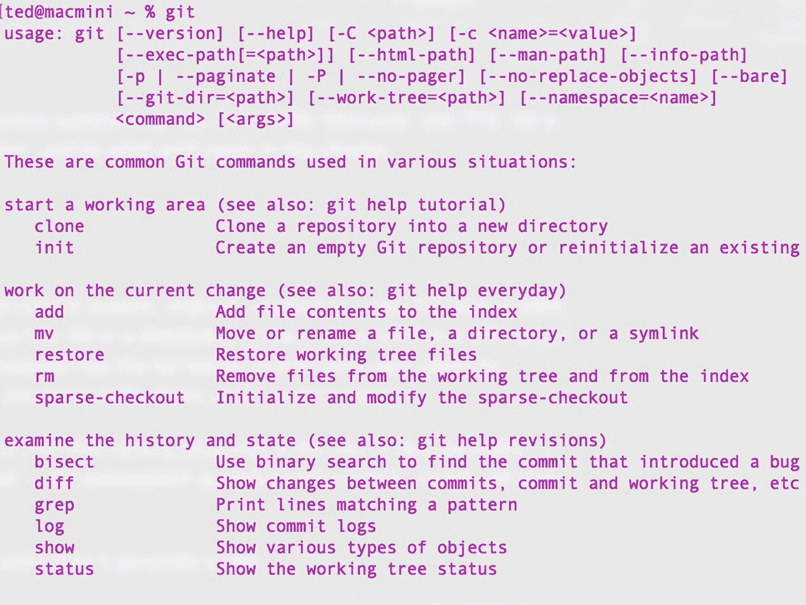
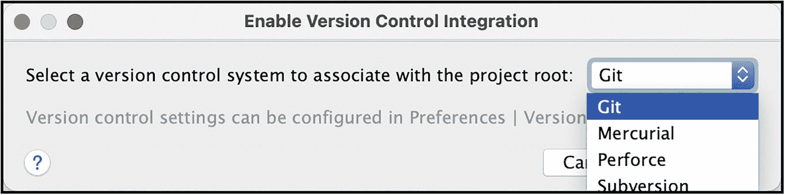
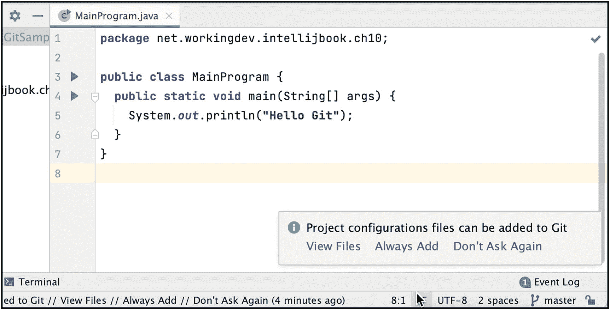
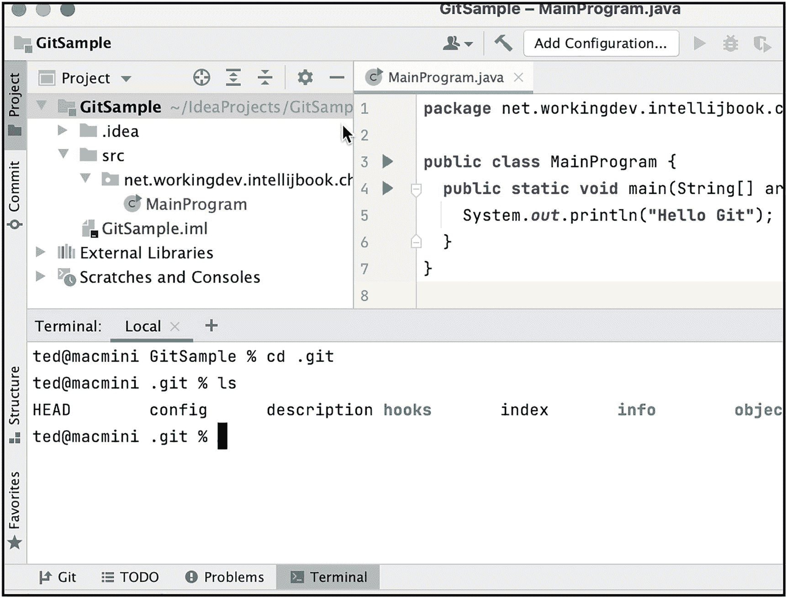
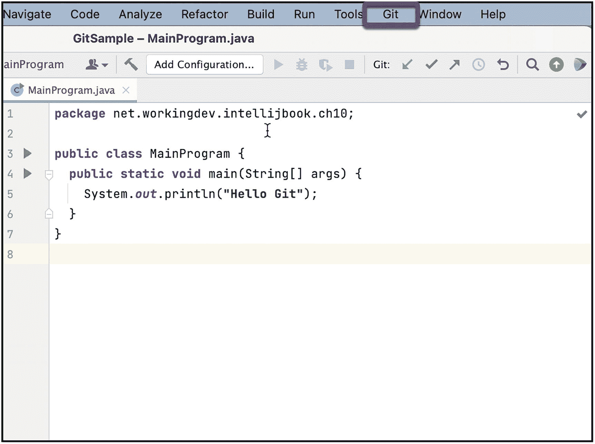
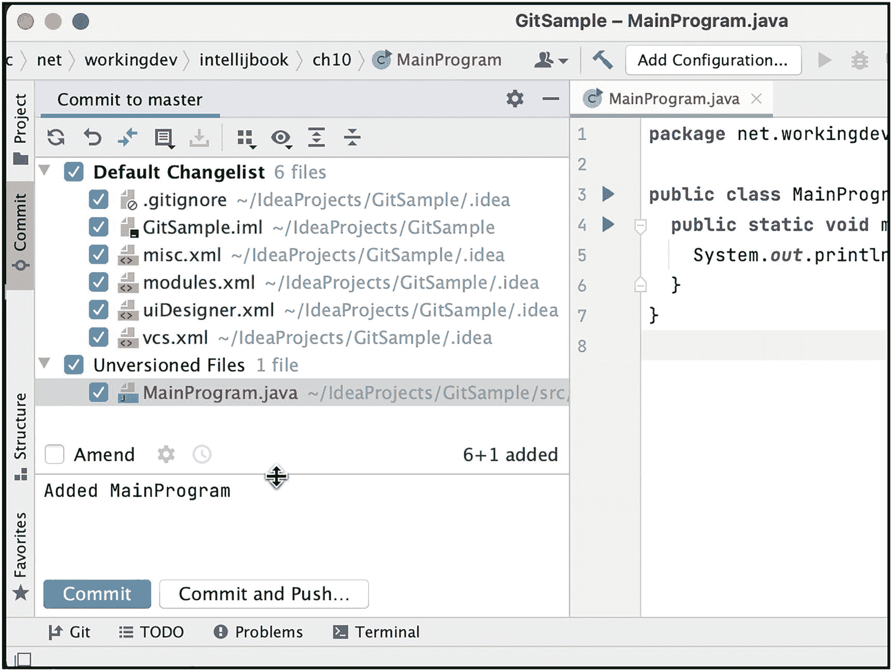
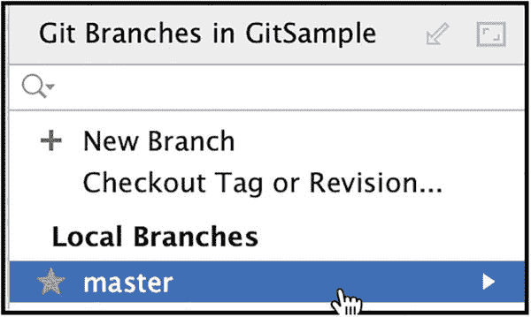
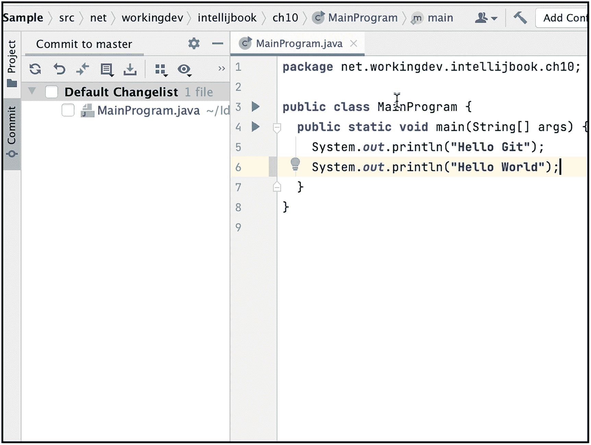
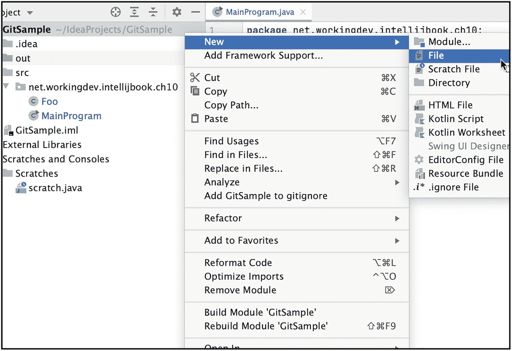
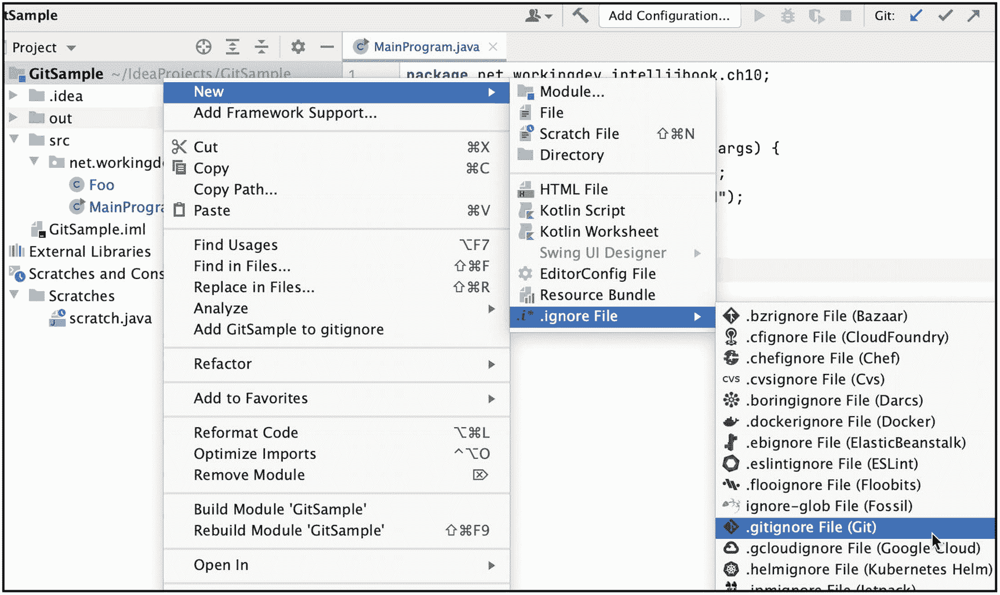

# 十、源代码管理

在本章中，我们将介绍以下内容:

*   Git 简介

*   Git 中的基本操作

*   如何设置本地 Git repo

*   在 GitHub 上发布您的项目

当您与其他开发人员一起工作时，您需要一种方式来与其他人共享您的代码，并共享他们的代码作为回报。即使你是一个人工作，你也需要一种方法来跟踪你对代码库所做的改变。这些是您需要使用源代码控制的主要原因。

IntelliJ 可以与各种源代码控制系统一起工作，例如 Git、CVS、SVN、Mercurial 和 TFS。Git 是一个广泛使用的版本控制系统，这也是我们将在本章讨论的内容。

## 饭桶

Git 是一个免费的开源版本控制系统，最初由 Linus Torvalds 在 2005 年创建——Linus 负责 Linux 操作系统。Git 是一个分布式系统，不像 CVS 和 SVN 是集中式的。有了 Git，每个开发人员在本地都有他们代码 repo(repository 的缩写)的完整历史——repo 就是你所说的在版本控制下的文件夹。

Git 的分布式特性使得 repo 的初始克隆(复制)操作很慢——因为所有内容都被复制了——但后续操作(如提交、合并、比较和记录)要快得多。

我们不会深入 Git，但它通常是这样工作的:

1.  您将创建一个项目文件夹，然后放置您的初始项目工件，例如，一个自述文件、几个源文件等。

2.  初始化 Git 的文件夹。

3.  将文件夹中的文件添加到源代码管理中；此时，您已经在源代码管理中进行了第一次更改——添加了一些文件。

4.  提交您的更改。

5.  在某个时候，您将编辑项目中的一些文件，甚至可能添加一些新文件。

6.  将新文件添加到 Git，然后再次提交更改。

使用 Git 可以做更多的操作，比如分支、合并、责备、隐藏、拉取、克隆等等。，但我们现在保持简单。

在 IntelliJ 中使用 Git 之前，您需要先安装它。为了确定你是否已经有了 Git，获取一个终端窗口(或者 Windows 中的 cmd)并运行 Git 命令，如图 [10-1](#Fig1) 所示。

如果您不带任何参数或选项运行 Git 命令，它将打印一些使用信息，如图 [10-1](#Fig1) 所示。



图 10-1

饭桶

要找出您拥有的 Git 版本，您可以在运行 Git 命令时传递 version 参数，如图 [10-2](#Fig2) 所示。


图 10-2

Git 版本

如果您在运行 Git 后没有看到使用信息，而是看到类似“命令未找到”或“错误的命令或文件名”的消息，这意味着 Git 还没有安装。您需要先安装它，然后才能与 IntelliJ 一起使用。

可以从 [`https://git-scm.com`](https://git-scm.com) 获得 Git 您会找到适合您平台的版本。git-SCM 网站上也有关于如何安装 git 的非常好的文档和说明，所以我们在这里不做介绍。

图 [10-3](#Fig3) 显示了撰写本文时 git-scm.com**的网站。下载安装程序的链接位于页面的右下方。**


图 10-3

git-scm.com 网站

## 将 Git 创建为本地存储库

安装 Git 后，您可以开始使用它来管理您的项目。

第一步是检查是否在 IntelliJ 中安装并启用了 Git 插件。如果您在 IntelliJ 的安装过程中接受了所有的默认设置，那么 Git、GitHub 和一些其他插件将会默认安装。无论如何，检查插件是否安装很容易——如果没有，只需在首选项(或设置)对话框中安装它。你可以通过 **cmd +、** (macOS)或者**CTRL+Alt+S**(Linux/Windows)进入偏好设置对话框。

在**首选项** ➤ **插件**对话框中可以看到版本控制插件(如图 [10-4](#Fig4) )。


图 10-4

Git 插件

打开要进行版本控制的项目；然后进入主菜单栏点击 **VCS** ，如图 [10-5](#Fig5) 所示。


图 10-5

启用版本控制

点击**启用版本控制集成**。IntelliJ 将要求您选择您想要使用的版本控制系统。图 [10-6](#Fig6) 显示弹出的对话框，您可以在其中选择版本控制系统。选择 Git。



图 10-6

启用版本控制集成

当您启用 Git 时，您会注意到 IDE 中的一些变化。首先，IntelliJ 会询问您是否想要将**项目配置文件**添加到 Git。对于您是否应该将项目配置文件添加到源代码控制中，并没有硬性规定，但是一般来说，我会建议您添加它们。JetBrains 对我们为什么要这么做有一个很好的解释。他们在 IntelliJ IDEA ( [`www.jetbrains.com/help/idea/2017.1/about-projects.html`](http://www.jetbrains.com/help/idea/2017.1/about-projects.html) )的在线帮助页面中进行了阐述。在谈到基于目录的格式时，JetBrains 说

*   那个。idea 目录包含一组配置文件(。xml)。每个文件仅包含属于某个功能区域的配置数据的一部分，这反映在文件名中，例如 compiler.xml、encodings.xml、modules.xml

*   几乎所有的文件都包含项目本身的核心信息，如组件模块的名称和位置、编译器设置等。因此，这些文件可以(也应该)在版本控制下保存。

如果您不使用 Gradle 或 Maven 之类的工具来管理依赖项，那么将项目配置文件置于源代码控制之下是一件好事。这样，每个人都可以获得项目及其依赖项的正确配置。但这也意味着每个人都必须按照您在配置文件中定义的方式来设置他们的环境。

另一方面，如果您将使用 Maven 或 Gradle 来管理依赖项，那么不要将项目配置文件添加到源代码控制中。配置文件中包含的所有信息都应该存储在 Maven/Gradle 文件中。然后，让每个人根据他们的环境配置他们的 IDE。

所以，现在，点击“总是添加”——你可以通过添加整个**来覆盖这个设置。Git 忽略文件中的 idea** 文件夹；我们稍后会谈到这一点。

图 [10-7](#Fig7) 显示 IntelliJ 提示我们将项目配置文件包含到源代码控制中。



图 10-7

添加项目配置文件

你可能注意到的 IDE 的另一个变化是在左下方的工具条中增加了一个新的部分(如图 [10-8](#Fig8) 所示)。


图 10-8

新的 Git 部分，添加到工具栏

工具栏上添加了一个 Git 按钮。

此时，我们已经将项目置于版本控制之下。我们已经创建了一个本地存储库(简称 repo ),用于存储我们的项目。

本地回购是一个受版本控制的文件夹，但它还没有任何上游回购——上游回购只是远程回购的另一个术语(就像 GitHub 或 Bitbucket 上托管的那些)。我们稍后会谈到这一点。

您还会注意到我们的 **src** 文件夹下的文件名(在项目工具窗口中)变成了红色。红色的文件名意味着它们还没有被添加到 Git 中。它们还没有升级。 **iml** 文件是绿色的，因为我之前添加了项目配置文件到 Git(当我点击提示添加配置文件到 Git 时，如图 [10-7](#Fig7) )。

图 [10-9](#Fig9) 用红色显示主程序文件名。


图 10-9

主程序以红色亮起

有一些视觉上的暗示表明项目现在处于源代码控制之下，但是要真正确定这一点，我们可以看看项目的目录结构。您不会在项目结构中看到任何可见的变化，因为 Git 文件夹是隐藏的。要查看 Git 文件，你需要进入终端——在 macOS 中使用**选项+ F12** 快捷键，或者在 IntelliJ 中使用 **Alt + F12** (对于 PC)弹出终端窗口。或者，只需单击 IDE 左下角工具栏上的“终端”按钮。

当终端打开时，您将自动位于项目的根文件夹中。发出一个 **cd** 命令去**。git** (点 git)，然后发出命令列出目录的内容(如图 [10-10](#Fig10) )。



图 10-10

的内容。git 文件夹

如你所见，里面有一堆文件和文件夹。

### 添加和提交更改

到目前为止，我添加到 Git 的唯一文件是我的项目配置文件。我还没有添加任何程序文件。我们可以通过几种方式做到这一点:



图 10-11

新建 Git 菜单项

*   我们可以进入主菜单栏，选择**Git**——这是一个新的菜单项。这发生在我们启用 Git 的时候(见图 [10-11](#Fig11) )。

*   我们可以右击*MainProgram.java*(在项目工具窗口中)，然后选择 **Git** ➤ **提交文件**。

*   使用键盘快捷键“提交文件”，这是最快的方式。你应该试着“记住”这一点(双关语)。

在接下来的屏幕中，您将看到提交工具窗口(如图 [10-12](#Fig12) 所示)。


图 10-12

提交工具窗口

文件*MainProgram.java*仍然没有版本；要将其包含在变更列表中，点击文件名右边的勾选框(如图 [10-13](#Fig13) )。



图 10-13

将文件提交给 Git

在提交工具窗口中，您将有机会包含或排除您希望包含在更改列表中的文件。勾选复选框，将该文件包括在提交中；勾掉，就不算了。就这么简单。

我添加了一行注释——“添加了主程序”——作为提交消息，然后单击**提交**按钮。现在，我的所有文件都已版本化，所有更改都已提交到本地存储库中。每当您在项目中添加和/或更改某些内容时，您都需要这样做。

### 分支

新创建的 Git repo 将有一个名为“master”的分支。要查看您的回购分支，请进入主菜单栏，然后选择 **Git** ➤ **Branches** 。分支对话框如图 [10-14](#Fig14) 所示。



图 10-14

Git 分支

您还可以使用 Git 分支对话框来创建项目的新分支。要为你的项目创建一个新的分支，只需点击对话框中的“+ New Branch”链接。在随后的屏幕中键入新分支的名称(如图 [10-15](#Fig15) 所示)，然后单击“创建”


图 10-15

创建新分支

默认情况下，“签出分支”设置是打开的；大部分时间你都想戴着它。这意味着在创建分支后，您可以签出该分支。无论您做什么编辑或更改，它都将在新签出的分支上。

### 更改列表中的更改

当你在一个有很多文件的项目上工作时，知道哪些文件在最后一次提交后被改变了是很有用的；**提交工具窗口**(如图 [10-16](#Fig16) 所示)显示自上次提交以来所有被更改的文件。您可以通过点按工具栏上的标签来隐藏或取消隐藏它。或者，你也可以在主菜单栏中显示或隐藏它，**查看** ➤ **工具窗口** ➤ **提交** —最快的方法是只使用 **cmd + 0** (macOS)或 **Alt + 0** (Linux/Windows)。



图 10-16

提交工具窗口

如果您想查看自上次提交以来文件发生了什么变化，只需在提交窗口中选择该文件(如图 [10-17](#Fig17) 所示)。


图 10-17

在提交窗口中选择一个文件。

然后，显示 **Diff** 对话框；你可以通过右键点击文件然后选择“显示差异”或者使用键盘快捷键来完成，键盘快捷键是 **cmd + D** (macOS)或者 **CTRL + D** (Linux/Windows)。差异对话框如图 [10-18](#Fig18) 所示。


图 10-18

差异对话框

左边的面板显示了您最后一次提交时的文件，右边的面板显示了现在的文件(包含您的更改)。文件之间的更改或“差异”在右侧面板上以浅绿色显示；该突出显示延伸到左侧面板，以指出差异的位置。

### 忽略文件

您可能希望将大多数项目文件置于版本控制之下，但是有些文件您可能不希望置于源代码控制之下。您可以在每次提交时过滤掉您不想放在 Git 中的文件——您只需在提交窗口中取消选中它们——但是这将会很麻烦、乏味，并且容易出错(您可能会错过一些东西)。幸运的是，解决方法很简单。

您可以创建一个名为**的文件。gitignore** 在项目文件夹中的任何地方——但是它通常在项目的根文件夹中。忽略文件是一个简单的文本，其中每行包含一个要忽略的文件或目录的模式。项目中与忽略文件中的模式匹配的任何文件都将被忽略，它们不会是更改列表的一部分。

如图 [10-19](#Fig19) 右键单击项目，然后选择**新建** ➤ **文件**，可以在项目根目录下添加一个忽略文件。



图 10-19

将文件添加到项目中

键入文件的名称-。gitignore(如图 [10-20](#Fig20) 所示)——在新文件对话框中。


图 10-20

新文件

按**回车**完成动作。

IntelliJ 添加了**。gitignore** 文件到项目的根目录。由于我们的项目处于版本控制之下，IDE 可能会询问您是否要将新创建的文件添加到 Git 中(如图 [10-21](#Fig21) 所示)。在这种情况下，是的，我想补充。gitignore 到版本控制。所以，我会选择“添加”


图 10-21

将文件添加到 Git

或者，如果您喜欢在命令行上工作，您可以使用 IntelliJ 的终端，然后创建**。gitignore 项目根文件夹中的**文件。那也可以。

现在可以开始向忽略文件添加条目了。清单 [10-1](#PC1) 中列出了许多 ignore 文件中最常见的一些模式。

```java
# Generated files
.idea/**/contentModel.xml

# Sensitive or high-churn files
.idea/**/dataSources/
.idea/**/dataSources.ids
.idea/**/dataSources.local.xml
.idea/**/sqlDataSources.xml
.idea/**/dynamic.xml
.idea/**/uiDesigner.xml
.idea/**/dbnavigator.xml

# IntelliJ
out/

# User-specific stuff
.idea/**/workspace.xml
.idea/**/tasks.xml
.idea/**/usage.statistics.xml
.idea/**/dictionaries
.idea/**/shelf

# macOS
.DS_Store

Listing 10-1Git Ignore File

```

在生成的示例文件中(列表 [10-1](#PC1) )，只有在。意见文件夹被忽略；但是如果你想完全忽略整个。idea 文件夹中，只需将下面一行添加到。gitignore 文件:

```java
.idea/

```

将文件添加到忽略列表的另一种方法是使用 IntelliJ 中的插件。进入首选项(macOS 中的 **cmd +、**)或设置(Windows/Linux 中的 **CTRL + Alt + S** )，然后进入插件。转到“市场”标签，然后搜索“忽略”如图 [10-22](#Fig22) 所示，我安装了**。忽略**插件(由 JetBrains 开发)和“添加到 gitignore”(由 euphoricity 开发)——你不必安装这两个插件。大多数开发者只是从 JetBrains 安装插件。


图 10-22

Gitignore 外挂程式

一旦你安装了插件，你可以通过右击项目名称(在项目工具窗口中)来添加一个 Git ignore 文件到项目中——如图 [10-23](#Fig23) 所示——然后转到**新建** ➤ **。忽略文件** ➤ **。gitignore** 。



图 10-23

新的。gitignore file 忽略档案

在接下来的屏幕中，您可以从各种配置文件中进行选择。因为我正在做一个 Java 项目，所以我选择了“Java”，如图 [10-24](#Fig24) 所示。


图 10-24

忽略文件生成器

点击**生成**完成动作。该插件生成一个忽略文件，并预加载您想在 Java 项目中忽略的最常见的文件和文件夹模式。

图 [10-25](#Fig25) 显示了生成的忽略文件。


图 10-25

已生成。gitignore 文件

## GitHub 集成

GitHub 是 IntelliJ 的一等公民。如果你有一个 GitHub 账户，在 IntelliJ 中集成它是很简单的。

进入首选项(macOS 中的 **cmd +、**)或设置(Linux/Windows 中的 **CTRL + Alt + S** )，然后进入版本控制。检查 GitHub 是否存在。GitHub 在 IntelliJ 中是作为一个插件提供的，但它可能是在安装过程中安装的。所以，在大多数情况下，你应该有它——如果没有，就从插件市场安装 GitHub。

如果你有 GitHub 插件(就像我在图 [10-26](#Fig26) 中看到的)，你将有机会在这个对话框中添加你的 GitHub 账户。


图 10-26

首选项 GitHub

单击“添加帐户”链接。它将启动您的默认浏览器，并将您带到 JetBrains 的页面，在那里有一个警告等待您——“只有在 JetBrains IDE 打开该页面时才继续”，如图 [10-27](#Fig27) 所示。


图 10-27

在 GitHub 中授权

点击“在 GitHub 中授权”按钮继续操作。点击链接会将你带到 GitHub 页面(如图 [10-28](#Fig28) 所示)。您现在可以授权 JetBrains 访问您的 GitHub 帐户。


图 10-28

授权 JetBrains IDE 集成

点击“授权 JetBrains”完成操作。在短暂地重定向到 JetBrains 站点后，我们会在 GitHub 中看到我们已经被授权的确认，如图 [10-29](#Fig29) 所示。


图 10-29

确认页面

现在我们回到 IDE。你应该可以在偏好设置窗口的 GitHub 部分看到你的 GitHub 账户，如图 [10-30](#Fig30) 所示。


图 10-30

首选项➤版本控制➤ GitHub

一旦我们在 IntelliJ 中设置了 GitHub，我们现在就可以开始在 GitHub 中共享任何项目。

在 GitHub 中分享当前打开的项目，你要做的就是进入主菜单栏，然后 **Git** ➤ **GitHub** ➤ **在 GitHub 上分享项目**(如图 [10-31](#Fig31) )。


图 10-31

在 GitHub 上共享项目

在随后的对话框中(图 [10-32](#Fig32) )，输入存储库名称——这将默认为 IntelliJ 中的项目名称，但是您可以在这里更改它。我通常不去管它，这样我本地环境中的项目名称就和它在 GitHub 上的名称一样了。您可以添加描述，但这是可选的。


图 10-32

在 GitHub 对话框上共享项目

点击“共享”完成操作。

一旦 IntelliJ 将本地回购完全推送到 GitHub，您将得到一个提示(如图 [10-33](#Fig33) 所示),其中包含一个指向 GitHub 中项目页面的可点击链接。


图 10-33

在 GitHub 上成功共享项目

点击链接进入该项目的 GitHub 页面。

图 [10-34](#Fig34) 显示了 GitHub 上的项目。


图 10-34

GitHub 上的共享项目

### 提交并推送到远程存储库

当我们的项目仅存在于本地回购中时，我们所要做的就是“提交”变更。这已经足够了，因为我们当时没有远程回购，但是因为我们的项目现在托管在 GitHub 中，所以您也需要将本地回购中的变化反映到上游回购中。为此，你现在需要选择“提交并推送”，而不是点击“提交”，如图 [10-35](#Fig35) 所示。


图 10-35

提交和推送

单击“提交并推送”会提交所有更改并将这些更改推送到上游回购。

### 创作主旨

GitHub 还有另一个功能，允许其成员共享代码片段，比如 pastebin。com 。这些代码片段被称为 gists。GitHub 在其网站上提供了创建新 gists 的功能。使用 IntelliJ，您可以通过在当前打开的项目中共享源代码来创建 gists。

要开始将您的代码作为要点共享，请在当前打开的项目中选择一个源文件—在项目工具窗口中选择该文件，然后进入主菜单栏，**git**➤**github**➤**create gist**(如图 [10-36](#Fig36) 所示)。


图 10-36

创建要点

在随后的对话框中(图 [10-37](#Fig37) ，您为要点提供文件名；它将默认为 IntelliJ 中的文件名，但是您可以在这里更改它。如果愿意，您可以提供描述。


图 10-37

创建要点

单击确定完成操作。

图 [10-38](#Fig38) 显示了我们在 GitHub 上发布的要点。


图 10-38

我们新创造的主旨

## 关键要点

*   源代码控制是现代软件开发的一部分。您需要它来跟踪变更并与团队共享代码。

*   Git 是最流行的源代码控制软件之一。它被广泛使用并定期更新。在 IntelliJ 中使用 Git 很容易。

*   GitHub 是一个流行的远程回购托管网站。在 IntelliJ 中使用 GitHub 也很容易。

*   在 GitHub 中共享一个项目(或者只是片段)在 IntelliJ 中是轻而易举的事情。