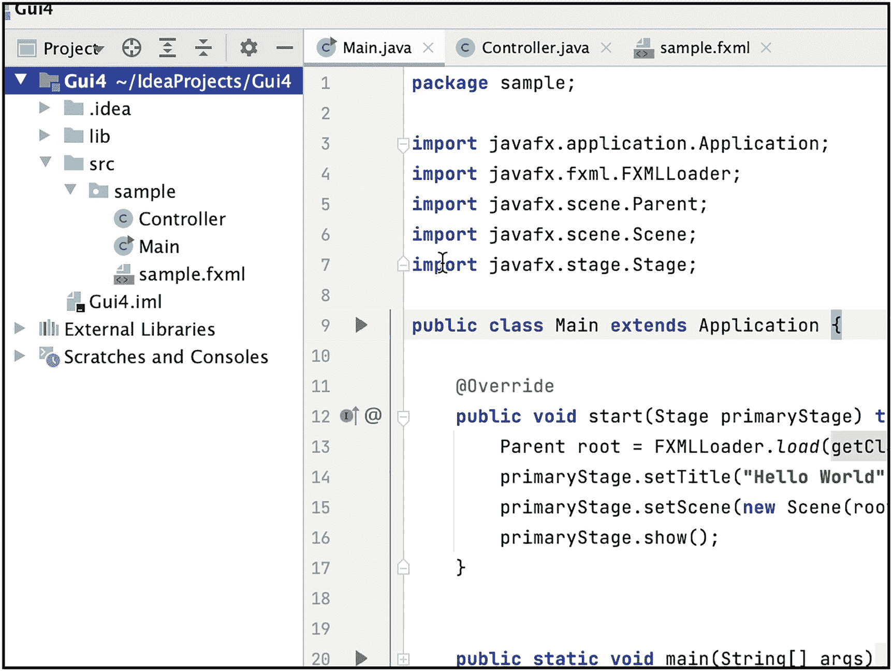
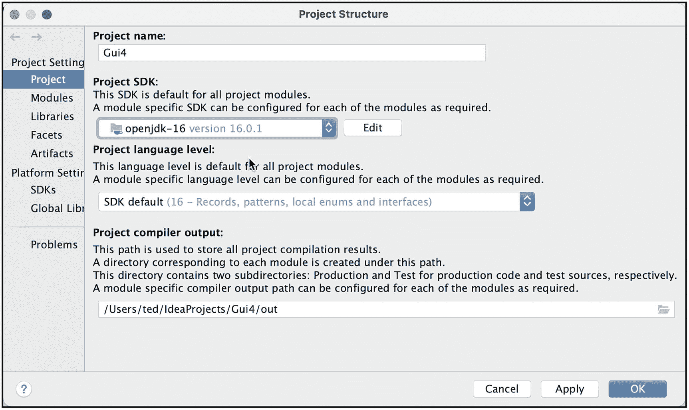
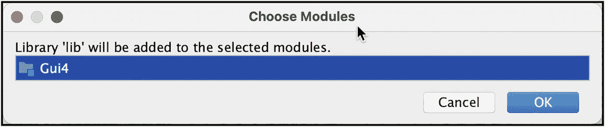
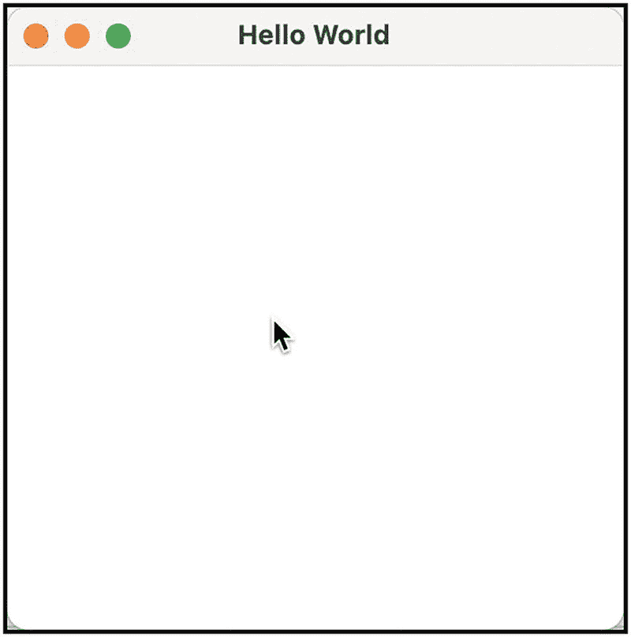
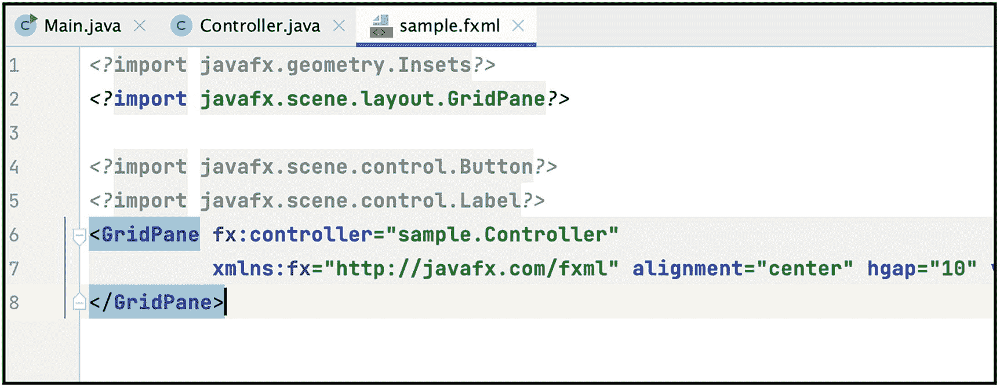
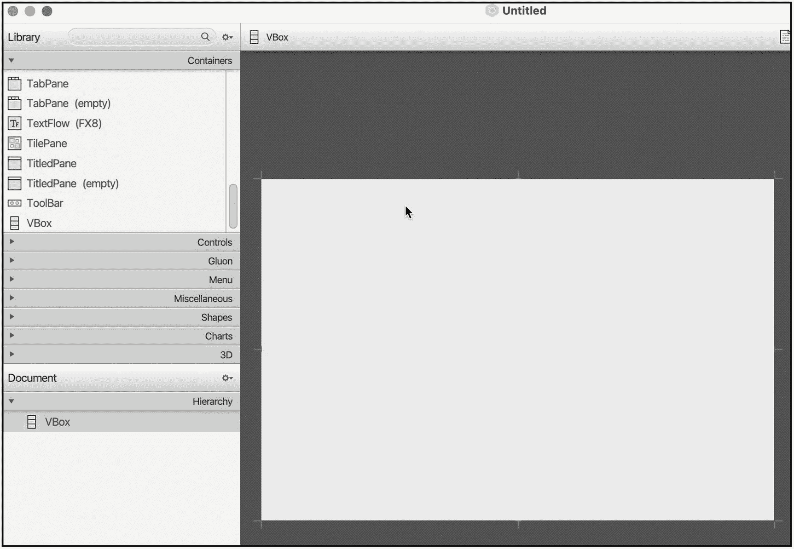
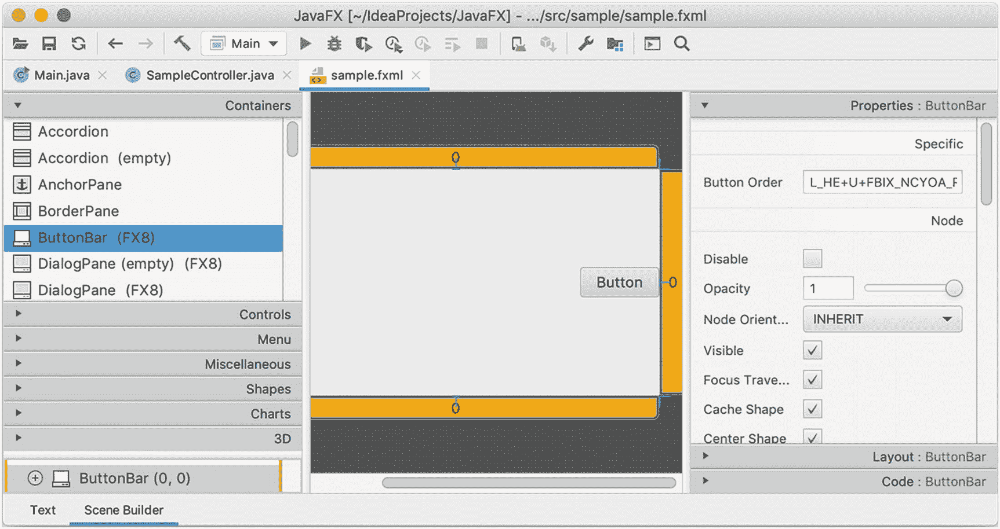

# 12.应用

在本章中，我们将介绍以下内容:

*   JavaFX 概述

*   如何设置 JavaFX 并将其包含在项目中

*   如何使用 JavaFX 构建基本的 UI 应用程序

*   如何设置和使用场景构建器

用 Java 构建用户友好的应用程序有三种方法。你可以去

*   **Web 应用**路线，在这种情况下，你需要了解一些 JakartaEE 应用——附录 A(本书的在线资源)简要讨论了一些常见的 JakartaEE 应用以及如何使用 IntelliJ 构建它们。您可以通过位于 [`www.apress.com/9781484274453`](http://www.apress.com/9781484274453) 的**下载源代码**链接访问本附录。

*   **手机应用路线**，这种情况下你就需要和安卓打交道了。

*   JavaFX route 是一个技术栈，它将让你构建丰富的桌面应用，这也是我们本章的主题。

## 简史

JavaFX 并不是 Java 生态系统中 UI 技术的起点。Java 对桌面应用技术的竞标开始得更早。早在 1995 年(Java 的首次亮相)，开发人员已经使用 AWT——抽象窗口工具包的缩写——来构建小程序(这在当时是一件大事)和构建桌面应用程序。AWT 的一个限制是它使用了底层操作系统的 UI 控件(这很笨重)，而且这也意味着你的应用程序在每个操作系统上看起来(和工作起来)都不一样。

1997 年，Sun Microsystems 推出了 JFC (Java 基础类)，更亲切地称为 Swing API。如果您正在构建 Java 桌面应用程序，那么 Swing 就是您要使用的。Swing 大受欢迎，因为与 AWT 不同，它不使用底层操作系统的 UI 控件，这意味着该应用程序在不同平台上的外观和行为都是一致的。

2008 年的某个时候，JavaFX 作为 Swing 的继任者被推出；但是 JavaFX 的历史并不是始于 2008 年，而是更早。

表 [12-1](#Tab1) 显示了 JavaFX 的时间表。

表 12-1

JavaFX 的历史

<colgroup><col class="tcol1 align-left"> <col class="tcol2 align-left"> <col class="tcol3 align-left"></colgroup> 
| 

发布日期

 | 

版本

 | 

评论

 |
| --- | --- | --- |
| 2000 年初 |   | SeeBeyond 的克里斯·奥利弗创造了 F3(形式服从功能)。F3 是一种用于开发 GUI 应用程序的脚本语言。 |
| Two thousand and five |   | 太阳微系统公司收购 SeeBeyondF3 改名为 JavaFX。 |
| Two thousand and seven |   | 在 JavaOne 大会上，Sun Microsystems 发布了 JavaFX。 |
| Two thousand and eight | One | JavaFX 发布了。 |
| Two thousand and nine | One point one | 包括移动支持。 |
| Two thousand and nine | One point two | 2009 年在 Q2 上映。 |
| Two thousand and ten | One point three | 2010 年在 Q2 上映。 |
| Two thousand and ten | 1.3.1 | 将于 2010 年第三季度发布。 |
| Two thousand and eleven | Two | JavaFX 脚本已被删除。JavaFX 现在支持 Java API。对 JavaFX mobile 的支持已取消。幕后发生了许多变化。添加了对惰性绑定、绑定表达式、绑定序列表达式和部分绑定重新计算的支持。另外，JavaFX 现在是开源的。 |
| Two thousand and twelve | Two point one | 现在支持 macOS 桌面。 |
| Two thousand and twelve | Two point two | 将于 2012 年第三季度发布。现在，支持 Linux 了。 |
| Two thousand and fourteen | Eight | 到目前为止，您需要单独下载 JavaFX 才能使用它。从此版本开始，JavaFX 包含在 JDK 中。所以，一旦你安装了 JDK，你就自动拥有了 JavaFX。此外，JavaFX 的版本也有重大变化。从此版本开始，JavaFX 版本将遵循 JDK 的版本号。幕后的变化包括支持 3D 图形、传感器支持、MathML、打印和富文本支持等。 |
| Two thousand and seventeen | Nine | JEP 253 (JDK 增强提案)，现在我们可以用 CSS 样式化 JavaFX 了。 |
| Two thousand and eighteen | Eleven | Oracle 从 JDK 中删除了 JavaFX。从这个版本开始，您必须从 JDK 单独下载 JavaFX。 |
| Two thousand and nineteen | Twelve | 2019 年在 Q1 上映。 |
| Two thousand and nineteen | 12.0.1 | 2019 年在 Q2 上映。 |
| Two thousand and nineteen | Thirteen | 2019 年第四季度的某个时候发布。 |
| Two thousand and twenty | Fourteen | 2020 年在 Q1 上映。 |
| Two thousand and twenty | Fifteen | 2020 年第四季度发布。 |
| Two thousand and twenty-one | Sixteen | 2021 年在 Q1 上映。 |

## 设置

学习新技术的最好方法是开始使用该技术开发应用程序。因此，让我们构建一个使用 JavaFX 的新项目。

从 glouhq[`https://gluonhq.com/products/javafx/`](https://gluonhq.com/products/javafx/)为您的操作系统下载 JavaFX SDK。将其解压缩到您喜欢的位置，例如/Users/username/javafx-sdk-16。

创建一个 JavaFX 项目。在新建项目对话框上(图 [12-1](#Fig1) ，选择 **JavaFX** 。


图 12-1

创建新的 JavaFX 项目

为项目命名，就像您过去创建的其他项目一样。单击“下一步”按钮继续操作。

您将被要求从 Maven 资源库下载 **javafx-fxml** 库(图 [12-2](#Fig2) )。


图 12-2

从 Maven 资源库下载 JavaFX 库

下载该库，使其成为项目的一部分；单击“确定”按钮完成操作。

IntelliJ 创建项目。如图 [12-3](#Fig3) 所示，它创建了三个文件。



图 12-3

新 JavaFX 项目

接下来从主菜单栏进入**文件** ➤ **项目**T4】结构 ➤ **项目**，如图 [12-4](#Fig4) 所示。



图 12-4

项目结构|项目 SDK

将项目 SDK 设置为 11 或更高；在我的例子中，我将它设置为 OpenJDK 16。

当您仍在项目结构对话框中时，转到**库**。正如你在图 [12-5](#Fig5) 中看到的，我们项目的 lib 文件夹中还没有任何东西。在我们的应用程序中使用 JavaFX 之前，我们需要将 JavaFX 库放在这里。


图 12-5

项目结构|库

点击加号添加一个新的库(如图 [12-6](#Fig6) )。


图 12-6

项目结构|库|新项目库

从下拉菜单中选择 **Java** 。

一个文件浏览器(或者说是 Finder，对于 macOS 来说)会弹出来。现在，导航到解压 JavaFX SDK 的位置，指向 lib 文件夹，如图 [12-7](#Fig7) 所示。


图 12-7

选择 JavaFX 的 lib 文件夹

点击**打开**按钮完成动作。

IntelliJ 将询问您在哪里添加(哪个模块)JavaFX 库。我的项目中只有一个模块，所以我将选择它(图 [12-8](#Fig8) )。



图 12-8

选择模块

单击“确定”按钮完成操作。

您将返回到项目结构对话框。你应该在项目的**库**部分看到 JavaFX 库，如图 [12-9](#Fig9) 所示。


图 12-9

项目结构|库

如果您试图在此时运行项目，您将得到一个运行时错误——“Java FX 运行时组件丢失”，如图 [12-10](#Fig10) 所示。


图 12-10

运行时错误

为了解决这个问题，我们需要向 VM 添加一些选项；为此，我们需要修改运行时配置。

你可以从主菜单栏修改运行时配置，然后进入**运行** ➤ **编辑配置**。或者，您可以点击编辑器栏上的运行按钮(如图 [12-11](#Fig11) )，然后选择**修改配置**。


图 12-11

运行|修改运行配置

点击“修改”链接，如图 [12-12](#Fig12) 所示。


图 12-12

编辑运行配置|修改选项

选择**添加** **虚拟机选项**，如图 [12-13](#Fig13) 所示。


图 12-13

编辑运行配置|修改选项|添加虚拟机选项

在虚拟机选项文本字段(图 [12-14](#Fig14) )上，键入以下内容:


图 12-14

运行/调试配置|虚拟机选项

```java
--module-path /path/to/javafx-sdk-16/lib --add-modules javafx.controls,javafx.fxml

```

不要忘记将 **/path/to/javafx-sdk-16** 替换为解压 javafx 的实际目录路径。

在我的例子中，我在/Users/ted/Prog tools/JavaFX-SDK-16 中安装了 Java FX，所以这就是我在我的 VM 选项中使用的(如图 [12-15](#Fig15) 所示)。


图 12-15

编辑运行配置|虚拟机选项

单击“确定”按钮完成操作。

图 [12-16](#Fig16) 显示了我们运行时的第一个 JavaFX 应用。



图 12-16

JavaFX 应用正在运行

## 舞台、场景和节点

JavaFX 使用舞台、场景和节点等术语。

将舞台对象想象成一个真实的舞台——人们在那里表演戏剧，就像在剧院舞台上一样。舞台是所有场景(我们仍在剧院类比)将被执行的地方；每个场景将包含不同的设置，旨在执行特定的行为。每个场景都有一套不同的道具——一个可能有假的树，另一个可能有假的波浪，等等。

这样思考 JavaFX 应用程序是有帮助的(使用剧院舞台类比),因为它实际上有点像这样。一个场景只属于一个阶段；每个场景都会有一套不同的道具。

我现在将停止使用剧院类比，这意味着从这一点开始，当我说 stage 时，我指的是 JavaFX stage，当我说 scene 时，我指的是 JavaFX scene。

阶段对象是顶级容器。它包含了整个应用程序。一个场景只属于一个阶段。我们可以说舞台是场景的容器。

场景通常包含子组件；在 JavaFX 术语中，这些组件称为节点。我们可以说场景是节点的容器。节点是放置在场景中的元素。这些节点是 GUI 元素，例如，文本框、复选框、按钮等。

每个节点要么是一个*分支节点*(意味着它可以有孩子)，要么是一个*叶节点*(意味着它不能有孩子)。场景上的节点集合形成一个树形结构，称为*场景图*(图 [12-17](#Fig17) )。


图 12-17

场景图

在图中，树上的第一个节点被称为根节点。它没有父母。您将在 JavaFX 中使用的每个元素都是一个节点的实例(节点是一个类)。

JavaFX API 定义了几个可以作为根、分支或叶节点的类。分支节点的例子可以是 HBox、StackPane、BorderPane、Group、Region、GridPane 等。—这些类通常是布局类。叶节点的一些例子是文本框、矩形、滑块、单选按钮、密码字段、分隔符、工具提示等。

当用实际的类名替换时，这个数字可能类似于实际应用程序中的某个东西。

在一个实际的应用程序中，场景图可能如图 [12-18](#Fig18) 所示。


图 12-18

应用程序的场景图

## 你好世界

让我们回到我们的“Hello World”示例项目。

在主编辑器的选项卡中选择 *sample.fxml* 文件(图 [12-19](#Fig19) )。



图 12-19

sample.fxml

FXML 文件是一种基于 XML 的用户界面标记语言(由 Oracle 公司创建)，用于定义 JavaFX 的用户界面。虽然可以通过编程定义场景中的所有节点来构建 JavaFX 应用程序，但这是一项繁琐的工作。产生的代码也很难维护。FXML 是为 JavaFX 构建 ui 的首选替代方法。

创建 JavaFX 项目时，会自动生成三个文件—*Main.java、Controller.java 和 sample.fxml* 。

编辑 sample.fxml 以匹配清单 [12-1](#PC2) 。

```java
<?import javafx.scene.control.Button?>
<?import javafx.scene.control.Label?>
<?import javafx.scene.layout.HBox?>

<?import javafx.scene.control.TextField?>
<HBox>
  <Label text="User name"></Label>
  <TextField></TextField>
  <Button text="Login"></Button>
</HBox>

Listing 12-1sample.fxml

```

即使没有进一步的解释，您也可以理解前面的代码是怎么回事。

前三行是导入语句。它们的功能与我们在 Java 源文件中的功能非常相似。语法有点奇怪，因为每个语句都用一对尖括号和问号括起来——但这就是 FXML 文件。

我们知道 HBox 是一个分支或父容器，所以 Label、TextField 和 Button 节点都包含在 HBox 中，这本能地告诉我们这三个叶节点是 HBox 的子节点。

重新运行该项目会得到如图 [12-20](#Fig20) 所示的结果。


图 12-20

你好世界

### JavaFX 应用程序的生命周期

所有 JavaFX 应用程序都应该扩展类**Java FX . application . application**类。实例化后，JavaFX 应用程序对象将经历以下生命周期:

1.  构造指定应用程序类的实例。如果你定义了一个自己的构造函数，它里面的任何代码都会被调用。

2.  运行时调用应用程序的`init()`方法。如果您的应用程序进行任何 HTTP、数据库或 I/O 调用，这可能是放置初始化代码的好地方。

3.  运行时调用`start()`方法。此方法通常是在创建 JavaFX 项目时为您生成的。在这里，FXML 被展平为 Java 对象以形成场景图，场景被设置为 stage，并且调用了`Stage.show()`方法。

4.  运行时会等待应用程序完成，这种情况会在以下任一情况发生时发生:
    1.  应用程序调用 Platform.exit()。

    2.  最后一个窗口被关闭，并且`Platform`上的`implicitExit`属性为真——这通常发生在您单击窗口上的关闭按钮时。

5.  运行时调用`stop()`方法。如果您打开了任何 I/O 资源，如网络、数据库或文件资源，这是确保它们关闭的绝佳时机。

### Main.java

现在我们对 JavaFX 应用程序的组成有了一些了解，让我们重新看看*Main.java*源文件。清单 [12-2](#PC3) 显示了对【Main.java】的*的注释解释。*

<colgroup><col class="tcol1 align-left"> <col class="tcol2 align-left"></colgroup> 
| -什么 | 我们扩展了`javafx.application.Application`类。所有 JavaFX 应用程序都继承自该类。 |
| ➏ | 在运行时，VM 仍然使用静态的`main()`作为入口点。从`main(),`我们调用`launch()`方法，传递任何命令行参数给它(如果我们有的话)。 |
| ➋ | 运行时调用`start()`方法并传递一个 stage 对象作为参数。 |
| ➌ | 创建一个父节点对象(这是根变量)。它通过将 *sample.fxml* 的内容展平到一个场景图中来填充。 |
| -你好 | 场景对象附加到舞台上。 |
| ➎ | 最后，运行时调用 stage 对象的`show()`方法。此时，应用程序变得可见。 |

```java
import javafx.application.Application;
import javafx.fxml.FXMLLoader;
import javafx.scene.Parent;
import javafx.scene.Scene;
import javafx.stage.Stage;

public class Main extends Application { ➊

    @Override
    public void start(Stage primaryStage) throws Exception{ ➋
        Parent root = FXMLLoader.load(getClass().getResource("sample.fxml")); ➌
        primaryStage.setTitle("Hello World");
        primaryStage.setScene(new Scene(root, 300, 275)); ➍
        primaryStage.show(); ➎
    }

    public static void main(String[] args) { ➏
        launch(args);
    }
}

Listing 12-2Main.java

```

## 场景构建器

虽然使用 FXML 而不是通过 API 来定义 UI 元素很容易，我应该说是“更容易”，但这仍然很乏味，尤其是当 UI 变得越来越复杂时。我们可以用来组成 UI 元素的可视化编辑器仍然是理想的工具。这就是为什么我们有场景生成器工具。

Scene Builder 是一个可视化合成工具，我们可以用它来构建 FXML 文件。Oracle 最初创建了它，但出于某种原因，他们停止了对 Scene Builder 的支持。幸运的是，Scene Builder 是开源的，因此，另一个组织(Gluon)取得了所有权。

如果要使用场景构建器，您需要单独安装它；这是一个直观地编写 FXML 文件的便利工具。像任何可视化合成工具一样，您可以简单地拖放元素来构造 ui，编辑其属性，并查看元素在运行时的可视化预览。顺便说一下，Scene Builder 是使用 JavaFX 本身构建的；这就是它能在所有平台上运行的原因。

要使用场景生成器，我们需要从 [`https://gluonhq.com/pDownload Scene Builderroducts/scene-builder/`](https://gluonhq.com/pDownload%2520Scene%2520Builderroducts/scene-builder/) 下载(图 [12-21](#Fig21) )。


图 12-21

场景构建器下载页面

为您的平台选择安装程序(图 [12-22](#Fig22) ，然后点击下载按钮完成操作。


图 12-22

场景构建器下载链接

运行安装程序，并按照提示完成。启动场景构建器应用程序；图 [12-23](#Fig23) 显示了带有未命名项目的场景构建器应用程序。


图 12-23

场景生成器|无标题项目

### 构建 FXML 文件

让我们使用场景构建器构建一个简单的 UI。

Scene Builder 提供了一些很棒的 UI 入门模板。如果你点击场景构建器的主菜单栏，然后转到文件➤新建模板，你将从一个预建的用户界面模板中选择(如图 [12-24](#Fig24) 所示)。这是一个很好的开始方式。您可以简单地编辑或删除您不需要的 UI 组件，并从那里继续。


图 12-24

场景构建器模板

但我们不会走那条路。我们将从头开始。

在图 [12-23](#Fig23) 中，场景构建器的中间面板就是我们的画布。我们只需在这个区域拖放 UI 组件。

我们首先需要一个容器。所以，打开手风琴(左面板，如图 [12-25](#Fig25) )到**容器**，然后点击 VBox。


图 12-25

将 VBox 拖到画布上

在 VBox 上按住鼠标的同时，将其拖到画布上(这里显示“将库项目拖到这里”)。您应该在可视化编辑器中看到 VBox 小部件(图 [12-26](#Fig26) )。



图 12-26

VBox 已添加

接下来，向 VBox 添加一个标签。打开手风琴控件到**控件**，然后选择**标签**(如图 [12-27](#Fig27) )。


图 12-27

添加标签

使用与将 VBox 添加到画布相同的技术，将标签拖放到 VBox 中。

然后，添加一个文本字段和一个按钮。你应该有类似图 [12-28](#Fig28) 的东西。


图 12-28

标签、文本字段和按钮

如果您想要更改 UI 元素的特定属性，您可以在编辑器中选择它们，然后转到 Properties 部分。您可以更改属性，如对齐、字体、颜色或文本属性——在我的例子中，您可以在图 [12-29](#Fig29) 中看到。


图 12-29

如何编辑属性

如果您现在保存这个文件并使用纯文本编辑器打开它，您将看到类似于清单 [12-3](#PC4) 中的内容。

```java
<?xml version="1.0" encoding="UTF-8"?>

<?import javafx.scene.control.Button?>
<?import javafx.scene.control.Label?>
<?import javafx.scene.control.TextField?>
<?import javafx.scene.layout.VBox?>

<VBox maxHeight="-Infinity" maxWidth="-Infinity" minHeight="-Infinity" minWidth="-Infinity" prefHeight="400.0" prefWidth="600.0" xmlns:="http://javafx.com/javafx/16" xmlns:fx="http://javafx.com/fxml/1">
   <children>
      <Label text="Label" />
      <TextField />
      <Button mnemonicParsing="false" text="Button" />
   </children>
</VBox>

Listing 12-3sample.fxml

```

您可以将它复制并粘贴到我们之前的“Hello World”应用程序的 *sample.fxml* 文件中，这样就可以工作了。考虑到 Scene Builder 和主要 ide(包括 IntelliJ)之间的集成质量，一些开发人员更喜欢这种工作流。

### 为场景构建器配置 IntelliJ

要在 IntelliJ 中打开 FXML 文件(可视化)，我们需要告诉它在哪里可以找到 Scene Builder 应用程序。

打开**首选项**对话框(或者**设置**，对于 PC 用户来说)，然后进入**语言和框架**，再进入 **JavaFX** 。参见图 [12-30](#Fig30) 。


图 12-30

首选项|语言和框架| JavaFX

您需要指向场景构建器应用程序的安装位置。在 macOS 中，这个位置一般是**/Applications/scene builder . app**；在 Windows 10 中，默认位置是**C:\ Users \ user \ AppData \ Local \ scene builder . exe**。

图 [12-31](#Fig31) 显示了场景构建器应用程序，指向它在/Applications 文件夹中的位置。


图 12-31

找到场景构建器应用程序的位置

单击“打开”按钮确认选择。

你应该返回到场景构建器路径被填充的首选项对话框，如图 [12-32](#Fig32) 所示。


图 12-32

场景构建器的路径

单击“确定”按钮完成操作。

### 在场景构建器中打开文件

当你打开一个**。fxml** 文件在编辑器中，编辑区下面有两个标签页(如图 [12-33](#Fig33) )。


图 12-33

FXML 编辑器选项卡

**文本**区域允许您编辑代码中的标记。

**场景构建器**选项卡打开。场景构建器中的 fxml(图 [12-34](#Fig34) )。



图 12-34

IntelliJ 中的场景生成器

至此，我们结束这一章；但是让我带着一句警告离开。您需要设定您对场景构建器与 IntelliJ 配合使用的预期。在撰写本文时，IntelliJ 对 Scene Builder 的支持有点不稳定——大多数时候，它可以工作，但也有不工作的时候；两者我都经历过。

大多数情况下，Scene Builder 与 IntelliJ 集成的问题是 GUI 编辑器不会在 IntelliJ 中显示，但文本标记可以正常工作。我一直在使用 JetBrains 的问题跟踪( [`https://youtrack.jetbrains.com`](https://youtrack.jetbrains.com) )来跟踪这个问题，这个问题仍然没有结束(在撰写本文时)。希望在 Scene Builder 和 IntelliJ 的未来版本和更新中解决这个问题。

## 关键要点

*   如果您需要构建跨平台的桌面应用程序，JavaFX 是一个不错的技术选择。

*   您可以通过 API 构建 JavaFX 应用程序，但这很繁琐。请改用 FXML 文件来定义 UI。

*   您可以手工构建 FXML，但这也很繁琐；请使用可视化工具，如场景构建器。

*   如果你喜欢 JavaFX，你可以在 [`https://openjfx.io/`](https://openjfx.io/) 和 [`https://gluonhq.com/`](https://gluonhq.com/) 获得更多关于这项技术的信息。