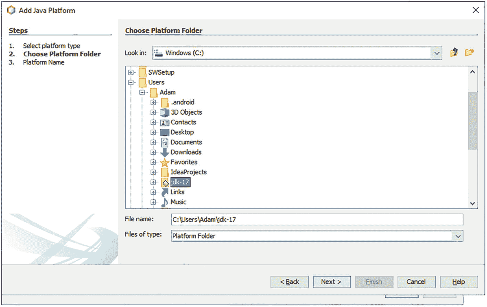
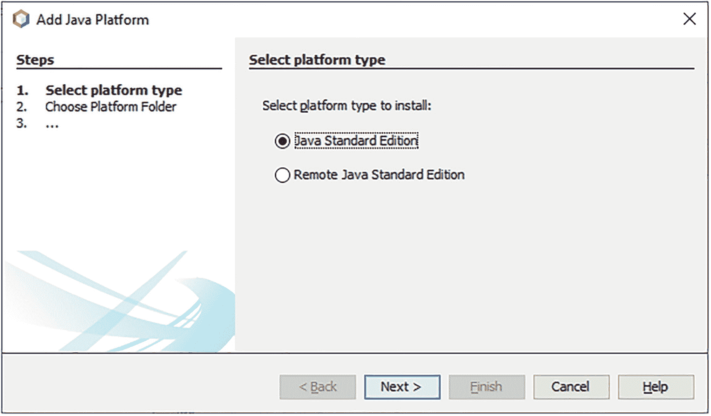
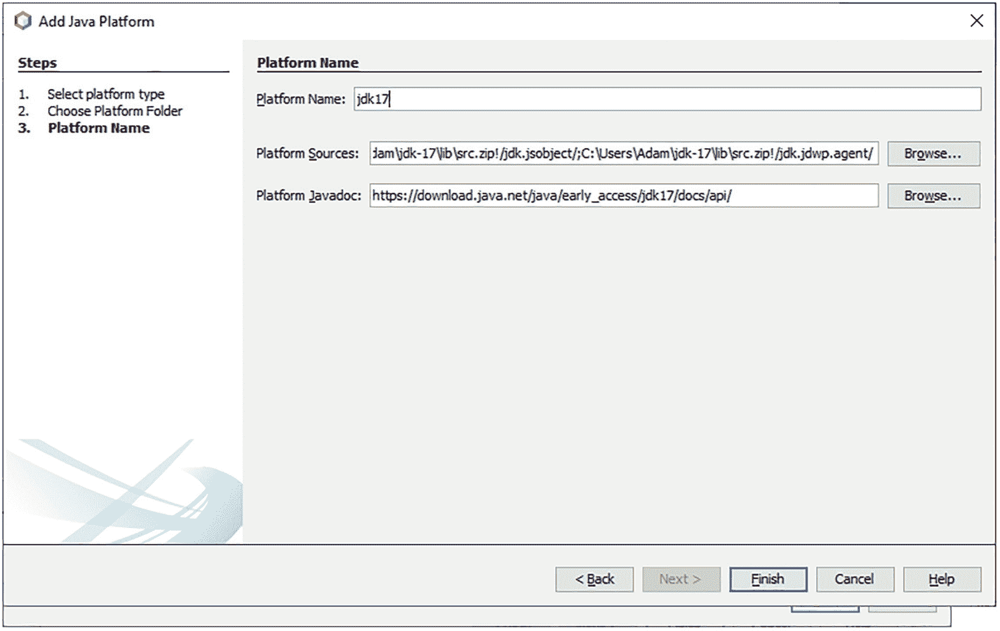

# 二、设置环境

在本章中，您将学习:

*   编写、编译和运行 Java 程序需要什么软件

*   从哪里下载所需的软件

*   如何验证 Java 开发工具包 17 (JDK 17)的安装

*   如何启动让您运行 Java 代码片段的`jshell`命令行工具

*   从哪里下载、安装和配置用于编写、编译、打包和运行 Java 程序的 NetBeans IDE(集成开发环境)

## 系统需求

您需要在您的计算机上安装以下软件，以遵循本书中的示例:

*   JDK 17

*   Java 编辑器，最好是 NetBeans 12.5 或更高版本

## 安装 JDK 17

你需要一个 JDK 来编译和运行 Java 程序。你可以从 [`https://jdk.java.net/17/`](https://jdk.java.net/17/) *下载适合你操作系统的 JDK 17。*按照此网页上的说明在您的操作系统上安装 JDK。位于 [`https://docs.oracle.com/en/java/javase/17/`](https://docs.oracle.com/en/java/javase/15/) 的网页包含 JDK 安装的详细说明。

在本书中，我们假设您已经在 Windows 的`C:\java17`目录中安装了 JDK。如果您已经将它安装在不同的目录中，或者您正在使用不同的操作系统，则需要在您的系统上使用 JDK 安装的路径。例如，如果你已经将它安装在 UNIX 类操作系统的`/home/ksharan/jdk17`目录中，那么只要我们在本书中使用`C:\java17`，就使用`/home/ksharan/jdk17`。

当您使用 Java 时，您会经常听到三个术语:

*   `JDK_HOME`

*   `JRE_HOME`

*   `JAVA_HOME`

`JDK_HOME`指电脑上安装 JDK 的目录。如果您在`C:\java17`中安装了 JDK，`JDK_HOME`指的是`C:\java17`目录。

JDK 有一个子集，称为 JRE (Java 运行时环境)。如果您已经编译了 Java 代码，并且只想运行它，那么您只需要安装 JRE。JDK 包含带有几个工具的 JRE，比如 Java 编译器。`JRE_HOME`指计算机上安装 JRE 的目录。您总是可以使用 JDK 安装目录作为`JRE_HOME`的值，因为 JDK 包含 JRE。

通常，`JAVA_HOME`指的是`JRE_HOME`。根据上下文，它也可以指`JDK_HOME`。

我在本书中使用术语`JDK_HOME`来指代 JDK 17 的安装目录。在接下来的两节中，我将解释 JDK 的目录结构以及如何验证 JDK 安装。

## JDK 目录结构

在本节中，我们将解释 JDK 安装的目录结构。在 JDK 9 及更高版本中，JDK 目录及其内容的组织方式有一些重要的变化。我们还比较了 JDK 8 和 JDK 9 的目录结构。如果您想将 JDK 8 应用程序迁移到 JDK 9 或更高版本，新的 JDK 结构可能会中断您的应用程序，您需要密切关注本节中描述的变化。

在 JDK 9 之前，JDK 构建系统曾经产生两种类型的运行时映像——Java 运行时环境(JRE)和 Java 开发工具包(JDK)。JRE 是 Java SE 平台的完整实现，JDK 拥有嵌入式 JRE、开发工具和库。你可以选择只安装 JRE 或者安装一个内嵌了 JRE 的 JDK。图 [2-1](#Fig1) 显示了 Java SE 9 之前的 JDK 安装中的主要目录。`JDK_HOME`是安装 JDK 的目录。如果您只安装了 JRE，那么您将只有在`jre`目录下的目录。


图 2-1

Java SE 9 之前的 JDK 和 JRE 安装目录安排

JDK 8 中的安装目录排列如下:

*   `bin`目录包含了`javac`、`jar`、`javadoc`等命令行开发调试工具。它还包含启动 Java 应用程序的`java`命令。

*   `include`目录包含编译本机代码时使用的 C/C++头文件。

*   目录包含几个 jar 和其他类型的 JDK 工具文件。

    它有一个`tools.jar`文件，其中包含用于`javac`编译器的 Java 类。

*   `jre\bin`目录包含基本命令，如`java`命令。在 Windows 平台上，它包含系统运行时动态链接库(dll)。

*   `jre\lib`目录包含用户可编辑的配置文件，如`.properties`和`.policy`文件。

*   `jre\lib\endorsed`目录包含允许认可的标准覆盖机制的 jar，该机制允许实现认可的标准或独立技术的类和接口的更高版本(在 Java 社区过程之外创建)被合并到 Java 平台中。这些 jar 被添加到 JVM 的引导类路径中，因此覆盖了 Java 运行时中存在的这些类和接口的任何定义。

*   `jre\lib\ext`目录包含允许扩展机制的 jar。这种机制通过一个扩展类装入器装入这个目录中的所有 jar，它是引导类装入器的子类，也是系统类装入器的父类，它装入所有应用程序类。通过将 jar 放在这个目录中，可以扩展 Java SE 平台。这些 jar 的内容对所有用这个运行时映像编译或运行的应用程序都是可见的。

*   `jre\lib`目录包含几个 jar。`rt.jar`文件包含运行时的 Java 类和资源文件。许多工具依赖于`rt.jar`文件的位置。

*   `jre\lib`目录包含用于非 Windows 平台的动态链接的本地库。

*   `jre\lib`目录包含其他几个子目录，这些子目录包含字体和图像等运行时文件。

没有嵌入 JDK 的 JDK 和 JRE 的根目录过去包含几个文件，如`COPYRIGHT`、`LICENSE`和`README`。根目录中的`release`文件包含一个描述运行时映像的键值对，比如 Java 版本、OS 版本和架构。以下是来自 JDK 8 的`release`文件示例，显示了部分内容:

```java
JAVA_VERSION="1.8.0_66"
OS_NAME="Windows"
OS_VERSION="5.2"
OS_ARCH="amd64"
BUILD_TYPE="commercial"

```

Java SE 9 简化了 JDK 的目录层次结构，消除了 JDK 和 JRE 之间的区别。图 [2-2](#Fig2) 显示了 JDK 9 及以上版本中 JDK 安装的目录。JRE 8 安装不包含`include`和`jmods`目录。


图 2-2

Java SE 9 及更高版本中的 JDK 目录排列

JDK 9+中的安装目录排列如下:

*   没有名为`jre`的子目录。

*   `bin`目录包含所有命令。在 Windows 平台上，它继续包含系统的运行时动态链接库。

*   `conf`目录包含用户可编辑的配置文件，例如曾经在`jre\lib`目录中的`.properties`和`.policy`文件。

*   `include`目录包含编译本机代码时使用的 C/C++头文件。它只存在于 JDK。

*   `jmods`目录包含 JMOD 格式的平台模块。创建自定义运行时映像时需要它。它只存在于 JDK，不存在于 JRE。

*   `legal`目录包含法律声明。

*   `lib`目录包含非 Windows 平台上的动态链接的本地库。它的子目录和文件不应该被开发者直接编辑或使用。它包含一个名为`modules`的文件，该文件包含内部格式为 JIMAGE 的 Java SE 平台模块。

    **提示** JDK 9 或更高版本比 JDK 8 大得多，因为它包含两个平台模块副本——一个在 JMOD 格式的`jmods`目录中，另一个在`lib\modules`文件中，格式为`JIMAGE`。

JDK 的根目录下继续有`COPYRIGHT`、`LICENSE`、`README`等文件。JDK 中的`release`文件包含一个带有`MODULES`键的新条目，其值是映像中包含的模块列表。JDK 17 图像中`release`文件的部分内容如下:

```java
IMPLEMENTOR="Oracle Corporation"
JAVA_VERSION="17"
JAVA_VERSION_DATE="2021-09-14"
OS_ARCH="amd64"
OS_NAME="Windows"
MODULES="java.base java.compiler java.datatransfer”

```

我们在列表中只显示了三个模块。在完全 JDK 安装中，该列表将包括所有平台模块。在自定义运行时映像中，该列表将只包含您在映像中包含的模块。

Tip

JDK 中的`lib\tools.jar`和 JRE 中的`lib\rt.jar`在版本 9 中被从 Java SE 中移除。这些 jar 中可用的类和资源现在以内部格式存储在`lib`目录中。一种叫做`jrt`的新方案可以用来从运行时映像中检索那些类和资源。依赖于这些 jar 位置的应用程序将停止工作。

## 验证 JDK 安装

`JDK_HOME\bin`目录包含一个名为`java`的命令，用于启动 Java 应用程序。当使用以下选项之一运行`java`命令时，它会打印 JDK 版本信息:

*   `-version`

*   `--version`

*   `-showversion`

*   `--show-version`

所有四个选项打印相同的 JDK 版本信息。以一个连字符开头的选项是 UNIX 风格的选项，而以两个连字符开头的选项是 GNU 风格的选项。JDK 9 引入了 GNU 风格的选项。UNIX 风格的选项在标准错误流上打印 JDK 版本，而 GNU 风格的选项在标准输出流上打印它。`-version`和`--version`选项在打印完信息后退出，而`-showversion`和`--show-version`选项在打印完信息后继续执行其他选项。以下命令显示了如何打印 JDK 版本:

```java
C:\>java -version
openjdk version "17-ea" 2021-09-14
OpenJDK Runtime Environment (build 17-ea+10-723)
OpenJDK 64-Bit Server VM (build 17-ea+10-723, mixed mode, sharing)

```

如果输出的第一行打印出`"version 17"`，那么您的 JDK 安装是好的。您可能会得到如下所示的输出:

```java
'java' is not recognized as an internal or external command, operable program or batch file.

```

该输出表明`JDK_HOME\bin`目录不包含在您计算机上的`PATH`环境变量中。在这种情况下，你可以使用`java`命令的完整路径来打印它的版本以及你需要它的任何地方。我的`JDK_HOME`是 Windows 上的`C:\java17`。以下命令向您展示了如何使用完整路径以及如何在命令提示符下设置`PATH`环境变量:

```java
C:\>SET PATH=C:\java17\bin;%PATH%
C:\>java --version

```

您还可以使用以下命令在 Windows 上永久设置`PATH`环境变量:

```java
 Control Panel > System and Security > System > Advanced system settings > Environment Variables

```

如果您的计算机上安装了多个 JDK，那么创建一个批处理(或 shell)脚本来打开命令提示符并在脚本中设置`PATH`环境变量会更容易。这样，您可以使用多个 JDK，而无需在系统级设置`PATH`环境变量。

## 启动 JShell 工具

JDK 9 及以上版本在`JDK_HOME\bin`目录中包含一个`jshell`工具。该工具允许您执行一段 Java 代码，而不是编写一个完整的 Java 程序。这对初学者很有帮助。第 [23](23.html) 章详细介绍了`jshell`工具。以下命令向您展示了如何启动`jshell`工具，执行一些 Java 代码片段，然后退出`jshell`工具:

```java
C:\>jshell
|  Welcome to JShell -- Version 17
|  For an introduction type: /help intro
jshell> System.out.println("Hello JDK 17!")
Hello JDK 17!
jshell> 2 + 2
$2 ==> 4
jshell> /exit
|  Goodbye
C:\>

```

在阅读后续章节时，您可以在命令提示符下启动`jshell`工具，并输入一段代码来查看结果。

## 安装 NetBeans 12

您需要一个 Java 编辑器来编写、打包、编译和运行您的 Java 应用程序，NetBeans 就是这样一个 Java 编辑器。本书的源代码包含 NetBeans 项目。但是，不一定要使用 NetBeans。您可以使用另一个 Java 编辑器，如 Eclipse、IntelliJ IDEA 或 JDeveloper。为了遵循本书中的示例，您需要将源代码(`.java`文件)复制到您使用另一个 Java 编辑器创建的项目中。

可以从 [`https://netbeans.org/`](https://netbeans.org/) 下载 NetBeans 12.5 或以上版本。NetBeans 12 在 JDK 版本 8 和 11 以及当前的 JDK 版本上运行。当您安装 NetBeans 时，它会要求您选择 JDK 主目录。如果您在 JDK 11 上安装 NetBeans，您可以选择 JDK 17 作为 Java 平台，以便在 NetBeans 中使用 JDK 17。如果你把它安装在 JDK 17 上，JDK 17 将是 NetBeans 内部默认的 Java 平台。在下一节中，我们将向您展示如何在 NetBeans IDE 中选择 Java 平台。

## 配置 NetBeans

启动 NetBeans IDE。如果第一次打开 IDE，它会显示一个标题为“起始页”的窗格，如图 [2-3](#Fig3) 所示。如果不希望再次显示，可以取消选中面板右上角标有“启动时显示”的复选框。您可以通过单击窗格标题中的 X 来关闭起始页窗格。如果您想随时显示此页面，可以使用“帮助➤起始页”菜单项。


图 2-3

初始 NetBeans IDE 屏幕

选择工具➤“Java 平台”，显示 Java 平台管理器对话框，如图 [2-4](#Fig4) 所示。在此图中，NetBeans IDE 正在 JDK 17 上运行，它显示在平台列表中。如果您在 JDK 17 上运行它，JDK 17 将显示在平台列表中，您不需要任何进一步的配置。


图 2-4

“Java 平台管理器”对话框

如果您在平台列表中看到 JDK 17，您的 IDE 已经配置为使用 JDK 17，您可以通过单击关闭按钮来关闭对话框。如果在平台列表中没有看到 JDK 17，点击添加平台…按钮，打开添加 Java 平台对话框，如图 [2-5](#Fig5) 所示。确保选中了 Java Standard Edition 单选按钮。点击下一个➤按钮，显示添加 Java 平台对话框，如图 [2-6](#Fig6) 所示。



图 2-6

“添加 Java 平台”对话框



图 2-5

“选择平台类型”框

在“添加 Java 平台”对话框中，选择 JDK 17 的安装目录。在此示例中，我们在 Windows 上的 C:\Users\Adam\jdk-17 中安装了 JDK 17，因此我们在此对话框中选择了 C:\Users\Adam\jdk-17 目录。点击下一个➤按钮。显示如图 [2-7](#Fig7) 所示的添加 Java 平台对话框。“平台名称”和“平台源”字段是预填充的。



图 2-7

“添加 Java 平台，平台名”对话框

单击 Finish 按钮，这将使您返回到 Java Platform Manager 对话框，该对话框将 JDK 17 显示为平台列表中的一个项目，如图 [2-8](#Fig8) 所示。单击关闭按钮关闭对话框。您已经完成了将 NetBeans IDE 配置为使用 JDK 17 的操作。


图 2-8

加上 JDK 17 后

## 摘要

要使用 Java 程序，您需要安装一个 JDK，如 OpenJDK 17，以及一个 Java 编辑器，如 NetBeans。安装 JDK 的目录通常称为`JDK_HOME`。JDK 安装在`JDK_HOME\bin`目录中复制了许多 Java 工具/命令，比如编译 Java 程序的`javac`命令，运行 Java 程序的`java`命令，以及运行 Java 代码片段的`jshell`工具。

NetBeans IDE 可以安装在 JDK 8、11 或 17 之上。当您将它安装在非 17 版本的 JDK 之上时，如果您想将其用作 Java 平台，则需要将 IDE 配置为使用 JDK 17 版本。