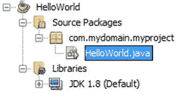
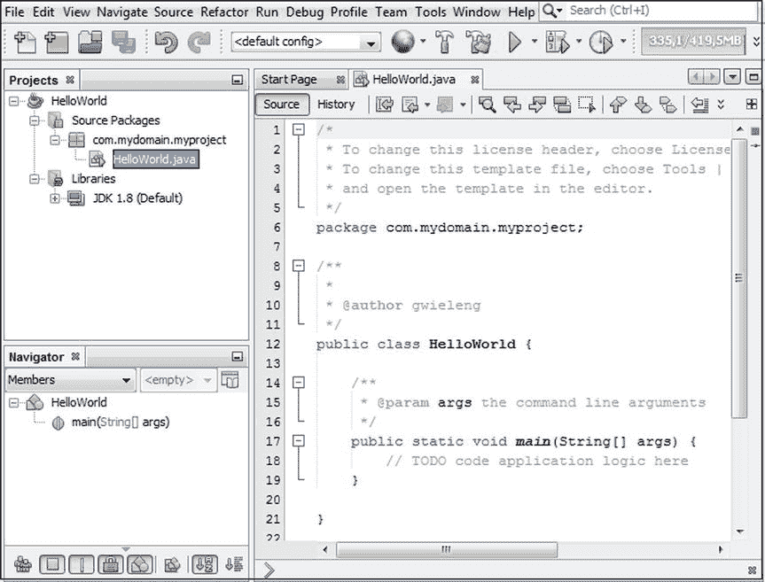
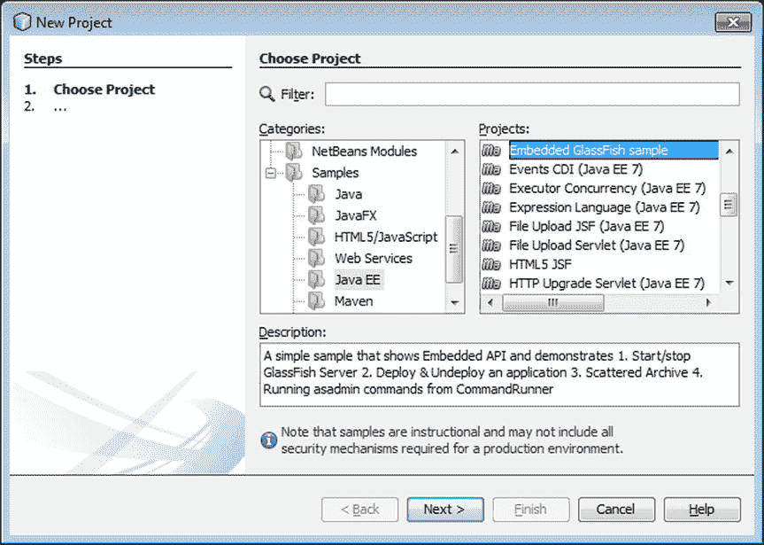
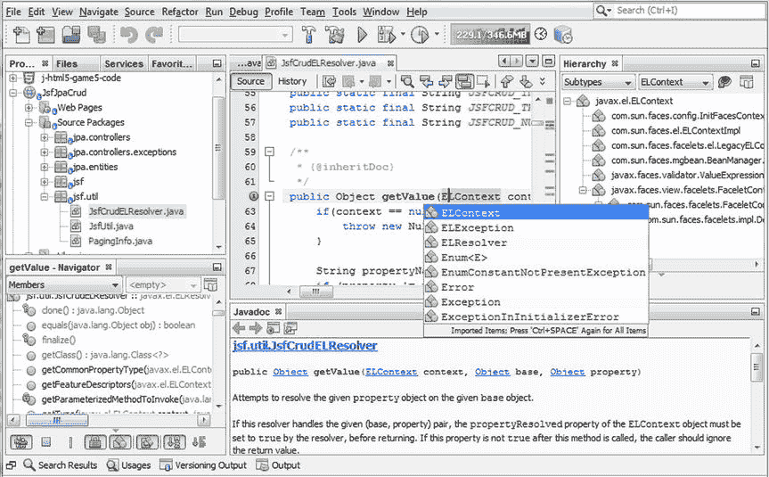
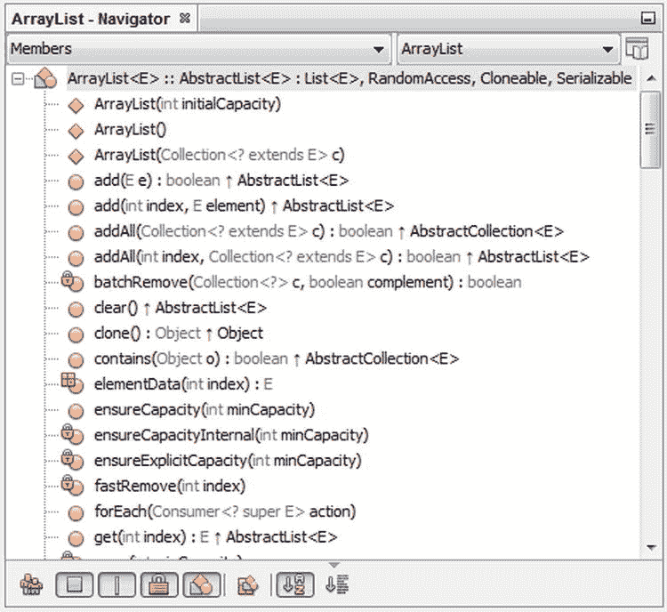
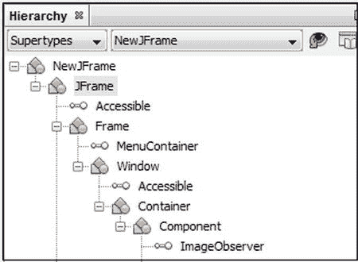
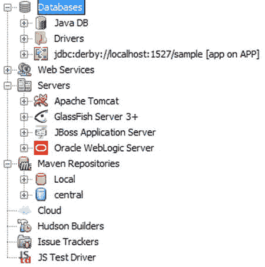
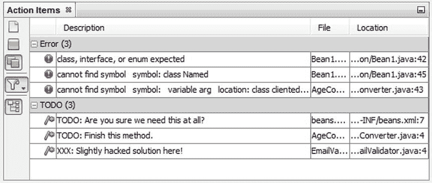
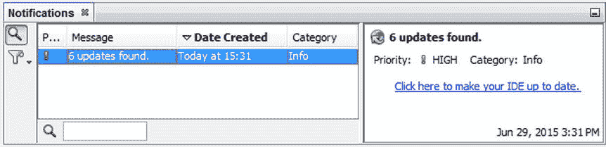

# 二、入门指南

NetBeans 只是一个完整且组织有序的工具箱。当你需要时，一切都很容易找到并随手可得。NetBeans 开箱即用，无需进一步组装，使用起来非常直观。新用户从一开始就很有效率。—安东·埃普勒，埃普勒顿 IT 咨询公司的创始人和所有者

在本章中，您将使用 NetBeans IDE 完成一个简单的 Java“Hello World”示例。之后，我将向您展示 IDE 提供的示例项目，以帮助您开始使用各种技术。本章以对 IDE 主窗口的探索结束。花一些时间熟悉 IDE 提供的工作区的关键组件是一个好主意。

## 你好世界

当您启动 IDE 时，会出现一个欢迎窗口，其中有指向感兴趣内容的链接，如图 [2-1](#Fig1) 所示。

图 2-1。

Welcome screen

为了帮助您激活 IDE，本节提供了设置、编译和运行“Hello World”项目的快速演练。

To set up the project, start by choosing File ➤ New Project. The New Project window opens, as shown in Figure [2-2](#Fig2).

图 2-2。

The New Project window   In the New Project window, expand the Java node, select Java Application, and click Next. The Java Application template sets up a basic project and includes a main class.   In the Name and Location page of the window, type `"HelloWorld"` as the project name, as shown in Figure [2-3](#Fig3).

图 2-3。

Setting the name and location in the New Project window   In the Create Main Class field, change `helloworld.HelloWorld` to `com.mydomain.myproject.HelloWorld`. When you enter a fully-qualified class name in this field, the IDE will generate directories for each level of the package structure when you complete this process. Click Finish.  

IDE 会为您创建一个新的 Java 项目，如图 [2-4](#Fig4) 所示。

图 2-4。

Newly created Java project

完成该窗口后，IDE 将扫描为项目设置的类路径，以启用代码完成等功能。现在已经填充了几个窗口，如图 [2-5](#Fig5) 所示。

图 2-5。

Windows populated when Java project is created

您在图 [2-5](#Fig5) 中看到的窗口如下所述。

*   “项目”窗口位于工作区的左上角。它提供了对您的源代码、您可能有的任何测试以及您的类路径的访问。您可以在“项目”窗口中显示多个项目。
*   导航器位于工作区的左下方。它为您查看和访问当前选定类的成员提供了一种简单的方法。
*   源代码编辑器覆盖了工作区的主要区域。它提供了多个文档的选项卡，比如 Java 文件。`HellowWorld.java`类的标签自动打开。

现在让我们修改、构建并运行项目。

In the Source Editor, click within the `main` method at the end of the line that reads `// TODO code application logic here`. Press the Enter key and then type the following statement.  

`System.out.println("Hello World!");`

另一种更快且利用代码模板的方法是键入字符`sout`，然后按 Tab 键。此外，代替`sout`，您可以键入`soutv`并按 Tab 键，您将看到在`System.out.println`语句中引用的最近的变量。

Press Ctrl+S to save the file.   Press F11 (or choose Build ➤ Build Main Project) to compile and package the application. This command triggers a script that the IDE has generated and maintains for the project. The Output window opens and displays the output from the script as it runs through its targets, as shown in Figure [2-6](#Fig6).

图 2-6。

Output window   Press F6 (or choose Run ➤ Run Main Project) to run the project. The Output window should display the `"Hello World!"` message from your application, as shown in Figure [2-7](#Fig7).

图 2-7。

“Hello World!” message in Output window  

请注意，您不需要单独构建和运行应用。当您运行项目时，任何没有构建到 Java 类中的文件都会自动为您构建。至此，您已经在 IDE 中创建和运行了您的第一个应用！

## 用示例代码尝试 IDE

如果您想在不接触现有文件的情况下检查 IDE 在工作代码上的功能，或者您只想查看 IDE 中工作项目的外观，您可以打开一个或多个 IDE 示例项目。

当您创建一个示例项目时，示例代码被复制到您选择的目录中，并且生成所有必需的项目元数据。

To create a sample project, choose File ➤ New Project. In the New Project window, expand the Samples folder and choose a template from one of the categories, as shown in Figure [2-8](#Fig8). Then click Next.

图 2-8。

Samples in the New Project window   Choose a sample and click Next. On the Name and Location page of the window, check the generated values for the name and location of the project and change them, if you wish. Then click Finish.  

## 探索 IDE

现在，您将通过浏览组成 IDE 的所有窗口来了解自己。有如此多的窗口，不可能在一张图像中捕捉到它们。其中很多如图 [2-9](#Fig9) 所示。在随后的部分中，我将依次浏览每个窗口。

图 2-9。

Most windows open in the IDE

IDE 中的窗口可以分为五类，具体取决于它们提供的视图。

*   项目视图
*   文件视图
*   层次视图
*   服务视图
*   支持观点

### 项目视图

“项目”窗口(Ctrl+1)是项目源的主要入口点。它显示了重要项目内容的逻辑视图；也就是说，它向您显示了您最有可能想要处理的文件，这些文件被组织在您可能容易理解的文件夹中。

除了“项目”窗口，IDE 还提供了“文件”窗口(Ctrl+2)，如图 [2-10](#Fig10) 所示，这样您就可以看到属于一个项目的所有文件。例如，每当构建一个项目时，即编译其文件时，都会创建一个新的“build”文件夹(对于基于 Ant 的项目)或一个新的“target”文件夹(对于基于 Maven 的项目)，尽管它只显示在文件窗口中，因为您不太可能想要处理将要重新生成的文件。通常,“项目”窗口仅显示那些不会被对项目或其文件执行的操作覆盖的文件。

图 2-10。

Projects Window and Files Window

收藏夹窗口(Ctrl+3)提供了第三个项目视图。“收藏夹”窗口允许您访问磁盘上的所有文件夹和文件。它相当于一个文件浏览器，内置于 IDE 中。在“收藏夹”窗口中，您可以添加在磁盘上找到的任意文件夹和文件，这样您就可以轻松地访问和浏览 IDE 中您特别感兴趣的文件夹和文件。默认情况下，用户目录被添加到此窗口，尽管您可以删除它，添加其他文件夹和文件，或者执行这些操作的组合。

### 文件视图

导航窗口(Ctrl+7)如图 [2-11](#Fig11) 所示，提供了当前所选文件的紧凑视图，并简化了文件不同部分之间的导航。

图 2-11。

Navigator window

例如，对于 Java 文件，导航窗口显示构造函数、方法和字段的列表，而对于 HTML 和 CSS 文件，它显示所选文档的逻辑结构。

### 层次视图

如图 [2-12](#Fig12) 所示的层次窗口(Alt+F12)显示了当前选中的 Java 文件的超类型和子类型，或者当前选中的 Java 类型在编辑器中的光标下。

图 2-12。

Hierarchy window

“层次结构”窗口与“导航”窗口和 Javadoc 窗口集成在一起，因此您可以很容易地看到所选项目的元素及其 Javadoc。

### 服务视图

如图 [2-13](#Fig13) 所示，服务窗口(Ctrl+5)可让您访问许多辅助资源，如数据库、服务器、web 服务和问题跟踪器。

图 2-13。

Services window

您可以直接在 IDE 中启动和停止数据库和服务器。使用数据库时，可以在 IDE 中添加、删除和修改数据。将应用部署到服务器时，您可以管理已部署的资源，因为它们显示在“服务器”节点中。您可以连接到 bug 数据库，如 Issuezilla 或 Bugzilla，并在 IDE 中列出项目的问题报告。

### 支持观点

可用于支持项目视图、文件视图和服务视图的窗口是输出窗口、属性窗口、操作项窗口、任务窗口和通知窗口。

#### 输出窗

输出窗口(Ctrl+4)如图 [2-6](#Fig6) 和 [2-7](#Fig7) 所示，是一个多选项卡窗口，显示来自 IDE 的处理消息。当遇到编译错误、调试程序和生成 Javadoc 文档时，它会自动显示。您可以在选项窗口中配置输出窗口的显示选项。

如果包含错误的文件是打开的，当您在源代码编辑器中将插入点移到错误中时，源代码编辑器将跳转到包含每个错误的行。您也可以使用 F12 和 Shift+F12 键盘快捷键移动到文件中的下一个和上一个错误。

当运行需要用户输入的程序时,“输出”窗口中会出现一个新的选项卡。该选项卡包含一个光标。您可以像在命令行上一样在输出窗口中输入信息。

#### 属性窗口

属性窗口(Ctrl+Shift+7)如图 [2-14](#Fig14) 所示，显示当前选中项目的属性。例如，可以在“项目”、“文件”或“导航”窗口中表示的大多数项都具有可以在“属性”窗口中查看的属性。

图 2-14。

Properties window

根据当前选定的项，可以在“属性”窗口中编辑某些属性的值。要更改属性值，请单击属性值字段。字段的外观根据所需值的类型而变化。

#### 行动项目窗口

如图 [2-15](#Fig15) 所示，行动项窗口(Ctrl+6)显示了一个统一的问题列表，您需要在您的各种文件和项目中解决这些问题。

图 2-15。

Action Items window

您可以使用过滤器来确定列表中显示的条目，并且可以通过单击列标题来对列表进行排序。

#### 任务窗口

任务窗口(Ctrl+Shift+6)，如图 [2-16](#Fig16) 所示，提供了任务库中记录的任务的有组织的概述，例如 Bugzilla 和 JIRA。

图 2-16。

Tasks window

#### 通知窗口

如图 [2-17](#Fig17) 所示，通知窗口显示了当前 IDE 会话中出现的 IDE 消息、错误和警告的列表。您可以在列表中选择一个通知，以便在窗口的右窗格中查看有关该通知的详细信息。

图 2-17。

Notifications window