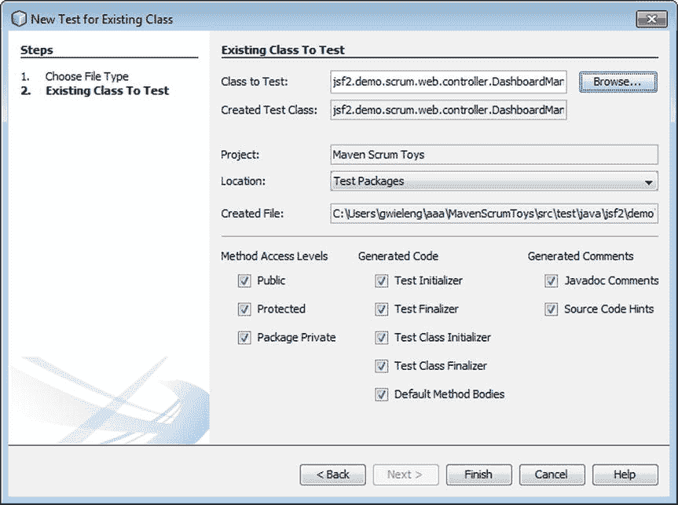
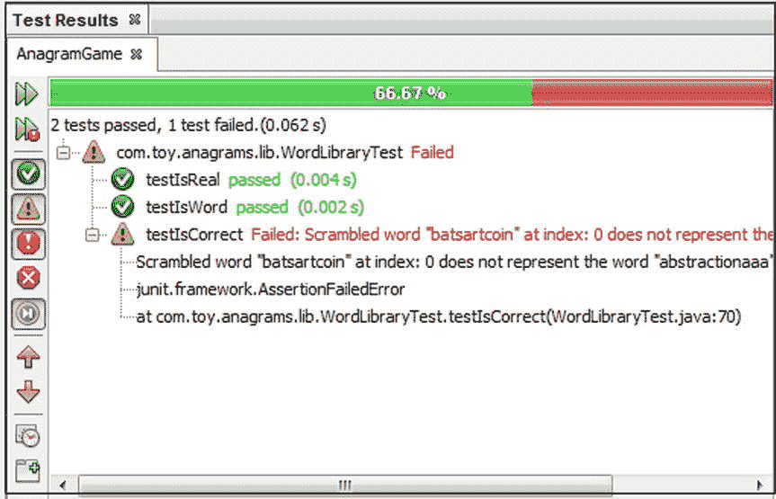
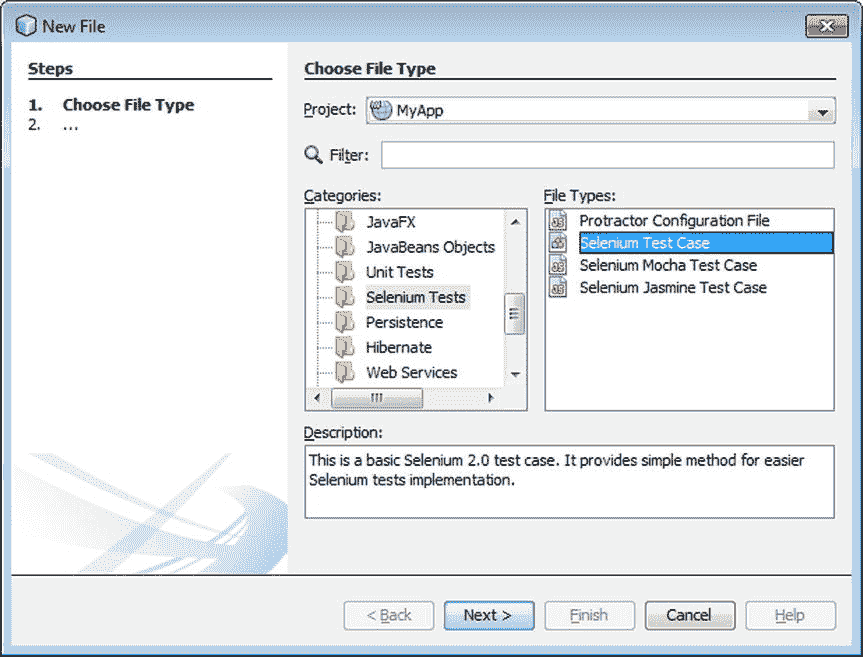
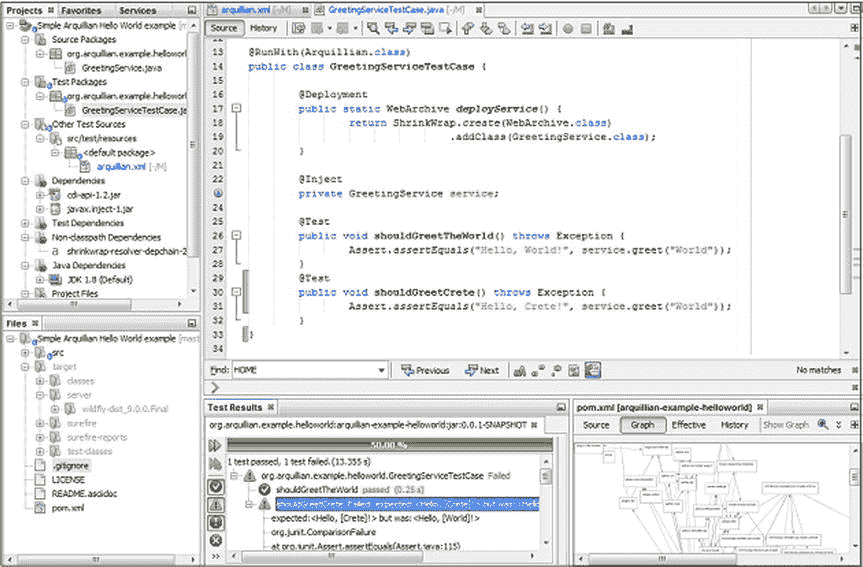

# 七、测试和代码质量

NetBeans 以简单而详细的方式呈现质量问题和测试结果，这使我能够专注于我的主要任务——编写代码。除了 NetBeans，我很少需要使用其他工具。——Sven Reimers，系统工程师，空客防务&航天

测试应用是开发周期中不可或缺的一部分，而编写和维护测试有助于确保单个方法和应用整体代码的质量。NetBeans IDE 对测试相关框架、库和相关代码质量解决方案的集成支持是本章的重点。

比较测试解决方案超出了本书的范围。本章将向您介绍不同的解决方案，并学习如何在 IDE 中使用它们。由您来决定这些解决方案是否适用于您正在进行的项目，并确定这些解决方案之间的比较情况。同样，注意你应该结合本章阅读第 6 章“分析和重构”，因为本章描述的通过测试的代码质量和第 6 章[描述的分析工具有一定的协同和重叠。](06.html)

表 [7-1](#Tab1) 列出了与测试和代码质量相关的解决方案，您将在 IDE 的上下文中了解这些解决方案。

表 7-1。

Frameworks Related to Testing and Code Quality

<colgroup><col> <col></colgroup> 
| 结构 | 描述 |
| --- | --- |
| 单元测试 | 最广泛建立的单元测试框架。如果您的需求仅限于非常详细的单元测试，并且它们之间没有依赖关系，那么 JUnit 是一个合适的单元测试框架。 |
| 测试 | 一个在 JUnit 几年后创建的单元测试框架，使其开发人员能够从 JUnit 的见解中获益。特别是，如果您的需求包括单元测试之间的数据依赖和共享(在这个上下文中称为“参数”)，那么可以考虑使用 TestNG。 |
| 硒 | Selenium 自动化浏览器。它是一个测试框架，主要关注自动化 web 应用的测试；例如，它为测试服务提供了生命周期管理。 |
| 阿奎连 | Arquillian 特别专注于成为 Java EE 应用的集成测试解决方案，它继承了其他测试框架的不足。Arquillian 处理容器管理的管道，以及部署和框架初始化。与“简单的”模块测试相反，Arquillian 的目标是在运行时使用所有可用的必要资源测试项目，特别是针对 Java EE 环境，同时与各种其他测试框架紧密集成，比如上面列出的那些。 |
| 复盖面 | 一个 Java 代码覆盖解决方案，通知您正在测试的应用的百分比。 |
| 杰柯 | 一个 Java 代码覆盖解决方案，通知您正在测试的应用的百分比。 |
| 声纳员 | 一个管理代码质量的开源平台。它以前被称为“声纳”。 |

当然，Java 生态系统中还存在许多其他测试框架和其他相关解决方案。然而，表 [7-1](#Tab1) 中列出的那些通常与在 IDE 中开发的项目结合使用。要探索本章范围之外的测试框架和代码质量，建议您调查软件质量环境( [`sqe-team.github.io`](https://sqe-team.github.io) )，它旨在成为各种代码质量框架的一站式商店，以及 EasyPmd ( [`github.com/giancosta86/EasyPmd`](https://github.com/giancosta86/EasyPmd) )插件，它在[第 4 章](04.html)中提到。

## JUnit 和 TestNG

在 IDE 中，为帮助您使用 JUnit 和 TestNG 而提供的工具是相同的，因此您将在同一部分中了解它们。两者都适用于单元测试，也就是说，当您在应用中测试单独的方法时，应该使用其中的一种。

在这两种情况下，使用这些框架的起点都是在“项目”窗口中选择一个项目，然后转到“新建文件”窗口(Ctrl+N)。在单元测试类别中，你会找到 JUnit 和 TestNG 的入门模板，如图 [7-1](#Fig1) 所示。

图 7-1。

File templates for unit tests

或者，在“项目”窗口中右键单击 Java 文件，然后选择“工具”“➤”“创建/更新测试”( Ctrl+Shift+U)。为当前选定的文件打开“创建测试”窗口，允许您选择 JUnit 或 TestNG。您还可以使用图 [7-1](#Fig1) 所示的单元测试类别中的向导中的所有其他设置。

如图 [7-2](#Fig2) 所示，单元测试类别中的向导非常详细，可以帮助您准确地生成您需要的测试。有关 JUnit 和 TestNG 的详细信息，请参见它们的在线文档，分别位于`junit.org`和`testng.org`。

图 7-2。

New Test for Existing Class wizard

对于 JUnit，当你点击图 [7-2](#Fig2) 中的 Finish 时，会提示你选择生成的测试应该基于 JUnit 3 还是 JUnit 4，如图 [7-3](#Fig3) 所示。使用 JUnit 4，您的测试可以使用 JDK 5 中引入的 Java 特性，比如泛型和注释。为了使用 JUnit 4，应用使用的 JDK 版本至少应该是 JDK 5。

图 7-3。

Select JUnit Version window

当您完成任何单元测试向导时，IDE 都会创建一个符合所选单元测试框架的起点。此外，相关的 jar 被添加到应用的类路径中，对于基于 Maven 的应用，它们被注册到 POM 文件中，同时也显示在“项目”窗口的“测试依赖项”节点中。它们相互关联的依赖关系可以在 Maven POM 的图形视图中可视化，如图 7-4 所示。

图 7-4。

Test dependencies shown in the Projects window and Graph view

一个有用的相关提示是，您可以很容易地找到 Java 文件的单元测试文件。在编辑器中打开 Java 文件，比如双击它，然后按 Ctrl+Alt+T。如果相关的测试文件存在，它将被打开。如果文件不存在，系统会提示您创建该文件。

一旦你写好了测试，你就可以运行它们了。若要运行项目中的所有测试，请右击该项目，然后选择“测试”(Alt+F6)。要运行特定 Java 文件的测试文件，请右键单击该 Java 文件，然后选择“测试”(Ctrl+F6)。要运行特定的测试方法，请在源代码编辑器中打开测试文件，右键单击要测试的方法的签名，然后选择“运行焦点测试方法”。

测试结果窗口(Alt+Shift+R)打开，显示测试结果，如图 [7-5](#Fig5) 所示。

图 7-5。

Test Results window

在“测试结果”窗口中，双击一个条目以跳转到定义测试方法的相关源代码。“测试结果”窗口左侧的按钮允许您重新运行测试方法，并从“测试结果”窗口中筛选出项目。

更多的特性可以被合并到你的单元测试中。例如，当您使用 JUnitReport Ant 任务或 Maven surefire-report 插件时，可以在测试过程中自动生成各种格式的报告。

## 硒

硒(seleniumhq.org)自动化浏览器。它是一个测试框架，主要关注自动化 web 应用的测试，例如，它为测试服务提供生命周期管理。

使用 Selenium 的起点是在“项目”窗口中选择一个项目，然后转到“新建文件”窗口(Ctrl+N)。在 Selenium Tests 类别中，您可以找到开始使用 Selenium 的模板，如图 [7-6](#Fig6) 所示。

图 7-6。

File templates for Selenium tests

当您完成任何 Selenium 测试向导时，IDE 都会创建一个符合您所选 Selenium 测试类型的起点。此外，相关的 jar 被添加到应用的类路径中，对于基于 Maven 的项目，它们被添加到 POM 文件中。

与上一节讨论的单元测试一样，测试结果窗口(Alt+Shift+R)打开，如图 [7-5](#Fig5) 所示，显示测试结果。

## 阿奎连

Arquillian ( `arquillian.org`)是一个与使用 Java EE 平台的应用相关的测试框架。Arquillian 是一个面向社区的项目，由 Red Hat 发起。它起源于 JBoss Test Harness，一个由 Red Hat 的 Pete Muir 创建的实用程序，作为 JSR-299 (CDI 1.0)和 JSR-303 (Bean Validation 1.0)的测试相关工具包的基础。

Arquillian 背后的基本思想是，在 Java EE 环境中通过 JUnit 和 TestNG 编写测试是一项挑战。在 Java EE 环境中，有多种 Java EE 容器可用，比如 WebLogic、GlassFish、JBoss 和 WildFly。每个 Java EE 容器都提供了各种各样的库和工具。Arquillian 使您能够无缝地使用特定 Java EE 容器提供的资源，并让您轻松地在它们之间切换。虽然它的部分好处是与容器无关，但更普遍的是，Arquillian 将服务器端集成测试作为其重点，而 plain JUnit 和 TestNG 根本没有考虑服务器端问题。

与本章讨论的其他解决方案一样，我不会提供比目前为止你所收到的粗略介绍更多的内容，因为如果你对学习 Arquillian 感兴趣的话，还有各种其他的书籍和在线文章。一如既往，这里的重点是如何在 IDE 中使用 Arquillian。

用 Arquillian 编写 Java EE 应用测试的一个有用的起点是 Arquillian 项目负责人 Aslak Knutsen 的“hello world”Arquillian 项目，可从以下位置获得:

[T2`github.com/aslakknutsen/arquillian-example-helloworld`](https://github.com/aslakknutsen/arquillian-example-helloworld)

当您使用 Git 签出这个项目时，您将拥有一个 Maven 项目。转到 IDE 中的文件➤打开，并浏览到包含 POM 文件的文件夹。IDE 将允许您打开该项目。浏览该项目，并注意所有使用 Arquillian 的 Java EE 应用共有的以下特征:

*   在`src/test/resources`文件夹中找到一个`arquillian.xml`文件。
*   POM 文件有一个`dependency-management`部分，它注册了`arquillian-bom`和`jboss-javaee-7.0`的依赖关系。
*   POM 文件在`dependencies`部分注册了许多依赖项，包括`org.jboss.arquillian.junit`、`org.arquillian.container`和`junit`。
*   `GreetingServiceTestCase.java`文件显示可以使用典型的 Java EE 结构，比如`@Inject`注释，而 Arquillian 注释，比如`@RunWith`和`@Deployment`可以帮助您设置和初始化测试的生命周期。

在 IDE 中，通过 Arquillian 定义的测试可以按照前面章节中描述的相同方式运行，并产生相同类型的结果，如图 [7-7](#Fig7) 所示。

图 7-7。

Running Arquillian tests in the IDE

总之，IDE 是用 Arquillian 设置、开发和运行测试的自然环境。

## Java 代码覆盖率

JaCoCo ( `eclemma.org/jacoco`)和 Cobertura ( `cobertura.github.io/cobertura`)是免费的 Java 代码覆盖库。这些项目的目标是为基于 Java VM 的环境中的代码覆盖分析提供标准技术。他们的重点是提供轻量级的、灵活的、文档良好的库，以便与各种构建和开发工具集成。

Java 代码覆盖库中的特性包括对指令、分支、行、方法、类型和圈复杂度的代码分析。在 JaCoCo 的例子中，分析是基于 Java 字节码的，因此不需要源文件。集成很简单，没有痛苦，因为一切都是通过一个基于动态工具的 Java 代理完成的。此外，这些解决方案是框架不可知的，因为它们可以与基于 Java VM 的应用顺利集成，例如普通的 Java 应用、OSGi 框架、web 容器和 EJB 服务器。支持各种报告格式，包括 HTML、XML 和 CSV。

在 IDE 中，与 JaCoCo 和 Cobertura 的集成对于 Maven 应用来说是现成的。在 Maven 应用中设置 Java 代码覆盖率就像在 POM 中添加用于 JaCoCo 的 Maven 插件一样简单:

`<build>`

`<plugins>`

`<plugin>`

`<groupId>org.jacoco</groupId>`

`<artifactId>jacoco-maven-plugin</artifactId>`

`<version>0.7.5.201505241946 </version>`

`<executions>`

`<execution>`

`<goals>`

`<goal>prepare-agent</goal>`

`</goals>`

`</execution>`

`<execution>`

`<id>report</id>`

`<phase>prepare-package</phase>`

`<goals>`

`<goal>report</goal>`

`</goals` `>`

`</execution>`

`</executions>`

`</plugin>`

`</plugins>`

`</build>`

对于 Cobertura，Maven Cobertura 插件在 POM 中注册如下:

`<reporting>`

`<plugins>`

`<plugin>`

`<groupId>org.codehaus.mojo</groupId>`

`<artifactId>cobertura-maven-plugin</artifactId>`

`<version>2.7</version>`

`</plugin>`

`</plugins>`

`</reporting>`

当一个 Java 代码覆盖插件(不超过一个！)已在项目的 POM 中注册，IDE 会立即检测到该插件已被添加。很快，新的菜单项就可以用来检查基于 Maven 的项目的代码覆盖率。当您右键单击一个项目时，这些菜单项是可用的，该项目中的 Java 代码覆盖 Maven 插件已经被添加到 POM 中，如图 [7-8](#Fig8) 所示。

图 7-8。

Code Coverage menu items

选择显示报告菜单项，打开代码覆盖率报告窗口，如图 [7-9](#Fig9) 所示。

图 7-9。

Code Coverage Report window

当你点击运行所有测试时，应用中的测试运行，Java 代码覆盖率库分析代码覆盖率并收集结果，IDE 在代码覆盖率报告窗口显示结果，如图 [7-9](#Fig8) 所示。

接下来，在文件窗口(Ctrl+2)中，展开项目的`target`文件夹。在`site`子文件夹中，你会看到已经创建了一个`jacoco`或`cobertura`文件夹。它包含生成的报表和其他输出，如图 [7-10](#Fig10) 所示。

图 7-10。

JaCoCo reports and output in the Files window

每个 Java 文件，当在编辑器中打开时，显示正在测试(绿色)和没有测试(红色)的语句，如图 [7-11](#Fig11) 所示。Java 代码覆盖库和 IDE 的结合有助于支持测试驱动开发，因为当您为类中定义的语句编写新的测试时，编辑器中的绿色/红色标记会不断更新。

图 7-11。

Code coverage shown in Java source file

要在基于 Ant 的项目中使用类似的特性，进入工具➤插件，安装 TikiOne JaCoCoverage 插件，如图 [7-12](#Fig12) 所示。

图 7-12。

Code coverage for Ant-based Java projects

## 声纳员

sonar cube(sonarqube.org)是一个管理代码质量的在线开放平台。它涵盖了代码质量的一系列领域，特别关注与架构、设计、复制、单元测试、复杂性、潜在缺陷、编码规则和注释相关的代码分析。

在 IDE 中，通过 Radar 插件可以与 SonarQube 集成，该插件可以从以下 URL 下载: [`github.com/hmvictor/radar-netbeans`](https://github.com/hmvictor/radar-netbeans) 。插件的源代码可以在以下网址找到: [`github.com/hmvictor/radar-netbeans`](https://github.com/hmvictor/radar-netbeans) 。使用 Radar 插件，您可以从 SonarQube 服务器检索问题，或者运行本地分析。

一旦安装了 Radar 插件，右键单击 Maven 项目并选择“从服务器获取问题”或“从 Sonar Runner 获取问题”,就可以访问 SonarQube。

SonarQube 窗口中列出了问题，如图 [7-13](#Fig13) 所示。

图 7-13。

SonarQube window