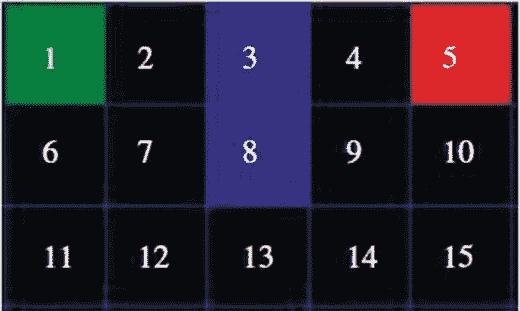
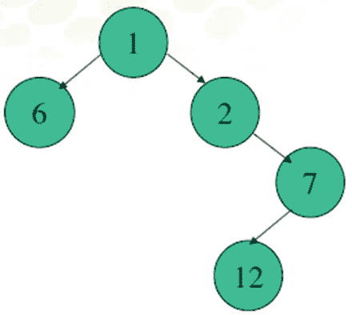
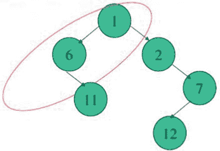

# 九、A\* 搜索算法及其在 Lego Mindstorms 中的实现

本章将向你介绍 A\* 搜索算法的基础。学完本章后，你将能够在实践中应用 A\* 算法解决路径规划问题。您还将看到如何基于 A\* 路径规划算法和导航类来构建问题解决代理，其中问题解决代理可以在迷宫中智能地找到从起点到任何目的地的路线路径。

特别是，本章将涵盖以下主题:

*   什么是 A\* 算法？
*   A\* 搜索策略的基本思想。
*   使用 A\* 算法进行路径规划的编程实践。

## 什么是 A\* 算法？

A-Star(或 A\* )是一种众所周知的搜索算法，与其他搜索算法相比，它在解决路径发现的效率方面极具竞争力。特别是，A\* 算法最适合用于那些可以表示为状态空间的问题，例如，在迷宫中探索路径。给定一个合适的问题，问题的初始条件可以用合适的初始状态来表示，目标条件可以表示为目标状态。

对于您执行的每个操作，A\* 算法都会生成后续状态来表示该操作的结果。如果你一直这样做，并且在某个时刻生成的后续状态之一是目标状态，那么从初始状态到目标状态的路径就是你的问题的解决方案。而且 A\* 算法以一定的方式生成和处理后继状态；也就是说，每当它寻找下一个状态继续时，A\* 算法采用启发式函数来尝试挑选下一个要处理的最佳状态。

## A\* 搜索策略的基本思想

如图 [9-1](#Fig1) 所示，假设你要从节点 1 到节点 5，有一堵墙把节点 1 和节点 5 隔开。搜索区域被分割成一个基于正方形的网格，您将试图找到的路径是从节点 1 到节点 5 要走哪些正方形。在整个搜索区域中有 15 个方块，标记为 1 到 15。左上角是起点 1，右上角是终点 5，节点 3 和 8 位于中心来表示墙。



图 9-1。

The search area of the A\* Algorithm

一旦将搜索区域简化为预定义数量的节点，下一步就是进行搜索，以找到从起点节点 1 到终点节点 5 的最短路径，这是最终目标。从节点 1 开始，检查其相邻的方块，然后通常向外搜索，直到找到目标节点 5。

通过执行以下操作开始 A\* 搜索:

1.  从起点 1 开始，将其添加到一个“开放列表”中，该列表包含沿着您想要选择的路径的方块。基本上，这是一个需要检查的方块列表。比如`OpenList = {1}`。
2.  查看与起点 1 相邻的所有可到达的正方形，忽略有墙的正方形，并将它们添加到开放列表中。对于这些方块中的每一个，将节点 1 保存为其“父方块”:即`OpenList = {1,2,6}`。
3.  从开放列表中删除起点方块 1，然后将其添加到方块的“封闭列表”中，现在您不需要再查看它。于是就有了`OpenList = {2,6}`和`ClosedList = {1}`。
4.  所有相邻的方块现在都在要检查的方块的开放列表中。

接下来你需要在开放列表中选择一个相邻的方块继续。但是，有一个问题，你选择哪个广场？答案是它是 F 成本最低的一个，其中 F 是路径得分，这是决定使用哪些方块的关键。

F 是 G 和 H 的和(F = G + H ),其中 G 是沿着生成的路径从起始节点 1 移动到网格上的给定方块的成本，H 是从网格上的那个方块移动到最终目的地(即结束节点 5)的估计成本。启发式函数 H 包括通过反复检查你的开放列表并选择 F 分数最低的方块来生成你的路径。

首先让我们更仔细地看看你是如何计算这个方程的。

*   F = G + H

g 是使用生成的路径从起始节点 1 移动到给定方块的成本。在本例中，您为移动的每个水平或垂直方块分配 1 的成本。因此，您有以下内容:

*   G(1->2)=1
*   G(1->6)=1

启发式函数 H 可以用多种方式来估计。在此示例中，使用了曼哈顿方法，您可以计算从当前方块水平和垂直移动到目标方块的方块总数，忽略对角线移动和可能存在的任何障碍。结果，你有了启发式函数 H:

*   H(2->5)=3
*   H(6->5)=5

f 是 G 和 h 相加计算出来的。

*   F(2)=1+3=4
*   F(6)=1+5=6

接下来，如图 [9-2](#Fig2) 所示，你只需从开放列表的现有节点中选择最低 F 值的方块，即节点 2。然后从开放列表中删除节点 2，并将其添加到封闭列表中，即`OpenList = {6}`和`ClosedList = {1,2}`。


图 9-2。

Search from Node 1 to Node 2

检查节点 2 的所有相邻方块。忽略那些在封闭列表中的或不可达的(节点 3 不可达，因为它属于墙)，如果方块不在这个列表中，将它们添加到开放列表中。使所选方块成为新方块的“父方块”。因此，您会得到以下内容:

*   `OpenList = {6,7}` in which 6’s parent is Node 1 and 7’s parent is Node 2, as shown in Figure [9-3](#Fig3).

    

    图 9-3。

    Tree structure of nodes after visiting Node 2
*   `ClosedList = {1,2}`

现在开放列表中有两个节点(节点 6 和节点 7)。然后计算 F 的值，然后选择 F 值最低的一个。

*   `OpenList = {6,7}`
*   `ClosedList = {1,2}`

在这种情况下，节点 6 和节点 7 具有相同的 F 值 6。那么你选择哪个呢？出于速度的考虑，选择 H 值较小的节点(即节点 7)可能会更快。然后你只需从开放列表上的现有节点中选择最低的 F 得分方块，即节点 7，并将节点 7 从开放列表中删除并将其添加到封闭列表中，即`OpenList = {6} and ClosedList = {1,2,7}`。

接下来，检查节点 7 的所有相邻方块。忽略那些在封闭列表上或不可达的方块(节点 8 不可达)，如果方块还不在这个列表上，就将它们添加到开放列表中。将选中的方块作为新方块的“父方块”，如图 [9-4](#Fig4) 所示。因此，您会得到以下内容:



图 9-4。

Tree structure of nodes after visiting Node 7

*   `OpenList = {6,12}`
*   `ClosedList = {1,2,7}`

在这种情况下，节点 6 已经在开放列表中。然后，您需要检查到节点 6 的当前路径是否是更好的路径。使用当前路径`1->2->7`，您可以计算节点 6 的当前 G 值`G(1->2->7->6)`，这是 3，然后将其与之前的 G 值`G(1->6)`，这是 1 进行比较。如果当前的 G 值低于前一个值，则将节点 6 的父节点更改为节点 7。如果不低于上一条，就不做单子上的事。由于先前的 G 分数`(1->6)`小于当前的 G 分数`(1->2->7->6)`，所以你不必做列表上的任何事情。

接下来，计算节点 6 和节点 12 的函数 F:

*   你已经知道了`F(6) = 6`
*   `H(12->5)=5`
*   `G(1->12)=3`

这样你就有了`F(12) = 8`，它比`F(6)`大。然后选择节点 6 作为下一个节点，您可以从开放列表中删除节点 6，并将其添加到封闭列表中，如下所示:

*   `OpenList = {12}`
*   `ClosedList = {1,2,7,6}`

节点 6 的父节点是 1，如图 [9-5](#Fig5) 所示。


图 9-5。

Tree structure of nodes in which Node 6 is chosen as the next node

检查节点 6 的所有相邻方块。忽略那些在封闭列表中或不可及的方块，如果它们不在这个列表中，将它们添加到开放列表中。将选中的方块作为新方块的“父方块”，如图 [9-6](#Fig6) 所示。因此，您会得到以下内容:



图 9-6。

Tree structure of nodes after visiting Node 6

*   `OpenList = {12,11}`
*   `ClosedList = {1,2,7,6}`

接下来，计算节点 11 和节点 12 的函数 F:

*   你已经知道了`F(12) = 8`
*   `H(11->5)=6`
*   `G(1->11)=2`

于是就有了`F(12) = 8`，和`F(11)`一样。那么你选择哪个呢？类似地，出于速度的目的，选择具有较小 H 分数的节点(即节点 12)可能会更快。

然后选择节点 12 作为下一个节点，从开放列表中删除节点 12，并将其添加到封闭列表中，这样就有了以下内容:

*   `OpenList = {11}`
*   `ClosedList = {1,2,7,6,12}`

节点 12 的父节点是 7，如图 [9-7](#Fig7) 所示。


图 9-7。

Tree structure of nodes in which Node 12 is chosen as the next node

检查节点 12 的所有相邻方块。忽略那些在封闭列表中或不可及的方块，如果它们不在这个列表中，将它们添加到开放列表中。将选中的方块作为新方块的“父方块”，如图 [9-8](#Fig8) 所示。


图 9-8。

Tree structure of nodes after visiting Node 12

*   `OpenList = {11,13}`
*   `ClosedList = {1,2,7,6,12}`

接下来，计算节点 11 和节点 13 的函数 F:

*   你已经知道了`F(11) = 8`
*   `H(13->5)=4`
*   `G(1->13)=4`

于是就有了`F(13) = 8`，和`F(11)`一样。那么你选择哪个呢？类似地，出于速度的目的，选择具有较小 H 分数的节点(即节点 13)可能会更快。

然后选择节点 13 作为下一个节点。您从开放列表中删除节点 13，并将其添加到封闭列表中，如下所示:

*   `OpenList = {11}`
*   `ClosedList = {1,2,7,6,12,13}`

节点 13 的父节点是 12，如图 [9-9](#Fig9) 所示。


图 9-9。

Tree structure of nodes in which Node 13 is chosen as the next node

检查节点 13 的所有相邻方块。忽略那些在封闭列表中或不可及的方块，如果它们不在这个列表中，将它们添加到开放列表中。将选中的方块作为新方块的“父方块”，如图 [9-10](#Fig10) 所示。

*   `OpenList = {11,14}`
*   `ClosedList = {1,2,7,6,12,13}`


图 9-10。

Tree structure of nodes after visiting Node 13

接下来，计算节点 11 和节点 14 的函数 F:

*   你已经知道了`F(11)=8`
*   `H(14->5)=5`
*   `G(1->14)=3`

于是你就有了`F(14) = 8`，和`F(11)`一样。那么你选择哪个呢？类似地，出于速度的目的，选择具有较小 H 分数的节点(即节点 14)可能会更快。

然后选择节点 14 作为下一个节点。您从开放列表中删除节点 14，并将其添加到封闭列表中，如下所示:

*   `OpenList = {11}`
*   `ClosedList = {1,2,7,6,12,13,14}`

节点 14 的父节点是 13。

检查节点 14 的所有相邻方块。忽略那些在封闭列表中或无法到达的方块，如果方块 9 和 15 不在列表中，将它们添加到开放列表中。使所选方块成为新方块的“父方块”。

*   `OpenList = {11,9,15}`
*   `ClosedList = {1,2,7,6,12,13,14}`

接下来，计算节点 11、节点 9 和节点 15 的函数 F。

*   你已经知道了`F(11) = 8`
*   按照我们之前的思路，可以算出`F(9) = 8`和`F(15) = 8`，和`F(11)`一样。

你选择哪个？类似地，出于速度的目的，选择具有较小 H 分数的那个可以更快。然后选择节点 15 作为下一个节点，从开放列表中删除节点 15，并将其添加到封闭列表中，如下所示:

*   `OpenList = {11,9}`
*   15 的父母是 14

检查节点 15 的所有相邻方块。忽略那些在封闭列表中或不可及的方块，如果它们不在这个列表中，将它们添加到开放列表中。使所选方块成为新方块的“父方块”。

*   `OpenList = {11,9,10}`
*   `ClosedList = {1,2,7,6,12,13,14,15}`

接下来，计算节点 11、节点 9 和节点 10 的函数 F。

*   你有`F(11)=F(9)=F(10)=8`

类似地，出于速度的目的，选择具有较小 H 分数的节点(即节点 10)可能会更快。然后选择节点 10 作为下一个节点，从开放列表中删除节点 10，并将其添加到封闭列表中，如下所示:

*   `OpenList = {11,9,5}`
*   10 的父代是 15

找到目标状态节点 5，并在那里停止。因此，最短路径位于根据父节点的封闭列表中，如下所示:

```java
1->2->7->12->13->14->15->10->5

```

## 使用 A\* 算法进行路径规划的实施规程

在迷宫中寻找路径是一个有趣的问题，通过计算机已经很大程度上解决了这个问题。这个练习的目标是在尽可能短的时间内解决一个简单的迷宫，从一个点开始到另一个点，不管这两点之间有什么障碍。如图 [9-11](#Fig11) 所示，您的机器人将探索从蓝色圆圈开始到绿色椭圆形结束的路径。平面是一个尺寸为 90 英寸乘 90 英寸的正方形:也就是说，H 和 I 之间的距离是 90 英寸。


图 9-11。

Maze map

从图 [9-11](#Fig11) 中的地图可以看到:

*   A 点和 B 点之间的距离是 10 英寸。
*   A 点和 H 点之间的距离是 20 英寸。
*   A 点和 I 点之间的距离是 70 英寸。
*   B 点和 C 点之间的距离是 50 英寸。
*   C 点和 D 点之间的距离是 20 英寸。
*   J 点和 E 点之间的距离是 20 英寸。
*   E 点和 K 点之间的距离是 40 英寸。
*   K 点和 L 点之间的距离是 20 英寸。
*   L 点和 M 点之间的距离是 20 英寸。

为了允许各种各样的迷宫解决方法，迷宫的起点和终点将被提前知道，如图 [9-11](#Fig11) 所示，并且不会有循环。在真实的演示中，您将使用蓝色标记 A，以标识点 A 为起点(在笛卡尔坐标系中，例如，您可以说 A 的坐标是`(0,-20)`)。此外，您将使用绿色来标记线 A 到 H，以便您的机器人可以在到达绿色目的地 B)时停止。在地图中，所有的交叉点都是直角。黑色线条代表墙壁周围。

总而言之，在本练习中，您将创建一个迷宫旅行机器人，它可以探索地图上从蓝色区域开始到绿色区域结束的路径。而且，你的机器人可以检测到终点区域的绿色线，然后在找到最终目的地时通过识别它停下来。

```java
//******************************************************************
//Wei Lu Java Robotics Programming with Lego EV3/NXT2.0 ch9p1.java
//simple line map and grid using A\* search build into LeJOS
//******************************************************************

import lejos.geom.*; //used for rectangle

import lejos.robotics.RegulatedMotor; //motor controller

import lejos.robotics.localization.*; //numbers

import lejos.robotics.mapping.LineMap; //mapping

import lejos.robotics.navigation.*; //navigation used for the
// waypoints

import lejos.robotics.pathfinding.*; //A\* search algorithm

import lejos.util.PilotProps; //not used really

import lejos.nxt.Sound;

import lejos.robotics.navigation.DifferentialPilot;

public class ch9p1 {

          private static final short[] note = { 2349, (115 / 3), 0, (5 / 3), 1760,
                              (165 / 3), 0, (35 / 3), 1760, (28 / 3), 0, (13 / 3), 1976,
                              (23 / 3), 0, (18 / 3), 1760, (18 / 3), 0, (23 / 3), 1568, (15 / 3),
                              0, (25 / 3), 1480, (103 / 3), 0, (18 / 3), 1175, (180 / 3), 0,
                              (20 / 3), 1760, (18 / 3), 0, (23 / 3), 1976, (20 / 3), 0, (20 / 3),
                              1760, (15 / 3), 0, (25 / 3), 1568, (15 / 3), 0, (25 / 3), 2217,
                              (98 / 3), 0, (23 / 3), 1760, (88 / 3), 0, (33 / 3), 1760, (75 / 3),
                              0, (5 / 3), 1760, (20 / 3), 0, (20 / 3), 1760, (20 / 3), 0,
                              (20 / 3), 1976, (18 / 3), 0, (23 / 3), 1760, (18 / 3), 0, (23 / 3),
                              2217, (225 / 3), 0, (15 / 3), 2217, (218 / 3) };

          static RegulatedMotor leftMotor; // motors
          static RegulatedMotor rightMotor;

          public static void main(String[] args) {

                    // set up the robot
                    PilotProps pp = new PilotProps();

                    float wheelDiameter = Float.parseFloat(pp.getProperty(
                                        PilotProps.KEY_WHEELDIAMETER, "2.11"));
                    float trackWidth = Float.parseFloat(pp.getProperty(
                                        PilotProps.KEY_TRACKWIDTH, "5.45"));

                    RegulatedMotor leftMotor = PilotProps.getMotor(pp.getProperty(
                                        PilotProps.KEY_LEFTMOTOR, "C"));

                    RegulatedMotor rightMotor = PilotProps.getMotor(pp.getProperty(
                                        PilotProps.KEY_RIGHTMOTOR, "A"));
                    leftMotor.setSpeed(750);
                    rightMotor.setSpeed(750);
                    leftMotor.setAcceleration(1000);
                    rightMotor.setAcceleration(1000);
                    boolean reverse = Boolean.parseBoolean(pp.getProperty(
                                        PilotProps.KEY_REVERSE, "false"));

                    // new robot object using the setup
                    DifferentialPilot robot = new DifferentialPilot(wheelDiameter,
                                        trackWidth, leftMotor, rightMotor, reverse);

                    // make the robot move faster this is over max
                    // robot.setTravelSpeed(500);
                    robot.setRotateSpeed(600);

                    // Create final map:
                    Line[] lines = new Line[8]; // six lines inside the map
                    lines[0] = new Line(-2.5f, -2.5f, -2.5f, 67.5f);
// line AG
                    lines[1] = new Line(-5.0f, -2.5f, -5.0f, 67.5f);
                    lines[2] = new Line(-2.5f, 67.5f, 47.5f, 67.5f);
// line GF
                    lines[3] = new Line(-2.5f, 7.5f, 47.5f, 7.5f);
// line BC
                    lines[4] = new Line(47.5f, 7.5f, 47.5f, 27.5f);
// line cd

                    lines[5] = new Line(44f, 7.5f, 44f, 27.5f);
// cd broader
                    lines[6] = new Line(27.5f, 27.5f, 27.5f, 47.5f);
// line je

                    lines[7] = new Line(27.5f, 47.5f, 67.5f, 47.5f);
// line ek

                    lejos.geom.Rectangle bounds = new Rectangle(-22.5f, -2.5f, 90f, 90f);
                    LineMap myMap = new LineMap(lines, bounds); // add the //bounds to the map

                    // Use a regular grid of node points. Grid space = 20\. //Clearance = 15:
                    FourWayGridMesh grid = new FourWayGridMesh(myMap, 10, 2f);

                    // Use A\* search:
                    AstarSearchAlgorithm alg = new AstarSearchAlgorithm();

                    // Give the A\* search alg and grid to the PathFinder:
                    PathFinder pf = new NodePathFinder(alg, grid);

                    // store the location of the robot at a given time
                    PoseProvider posep = new OdometryPoseProvider(robot);

                    // new navigator loaded with the robot position, and //path
                    NavPathController nav = new NavPathController(robot, posep, pf);

                    System.out.println("Planning path…"); // displays as //the path is
                    calculated
                    nav.goTo(-12, 0); // goto the end location.

                    for (int i = 0; i < note.length; i += 2) {
                              final short w = note[i + 1];
                              final int n = note[i];
                              if (n != 0)
                                        Sound.playTone(n, w * 10);
                              try {
                                        Thread.sleep(w * 10);
                              } catch (InterruptedException e) {
                              }
                    }

          }
}

```

## 摘要

本章介绍 A\* 搜索算法的基本原理。学完本章后，你能够在实践中应用 A\* 算法解决路径规划问题。具体来说，本章介绍了如何基于 A\* 路径规划算法和导航类构建一个问题求解智能体，其中问题求解智能体智能地找到一条从起点到任意目的地的最短距离的路径。

在下一章中，你将学习如何应用一组传感器来执行有根据的动作。特别是，您将使用您创建的轮式机器人，并添加两个传感器——触摸传感器和超声波传感器——以使它在移动时更加了解周围的环境。