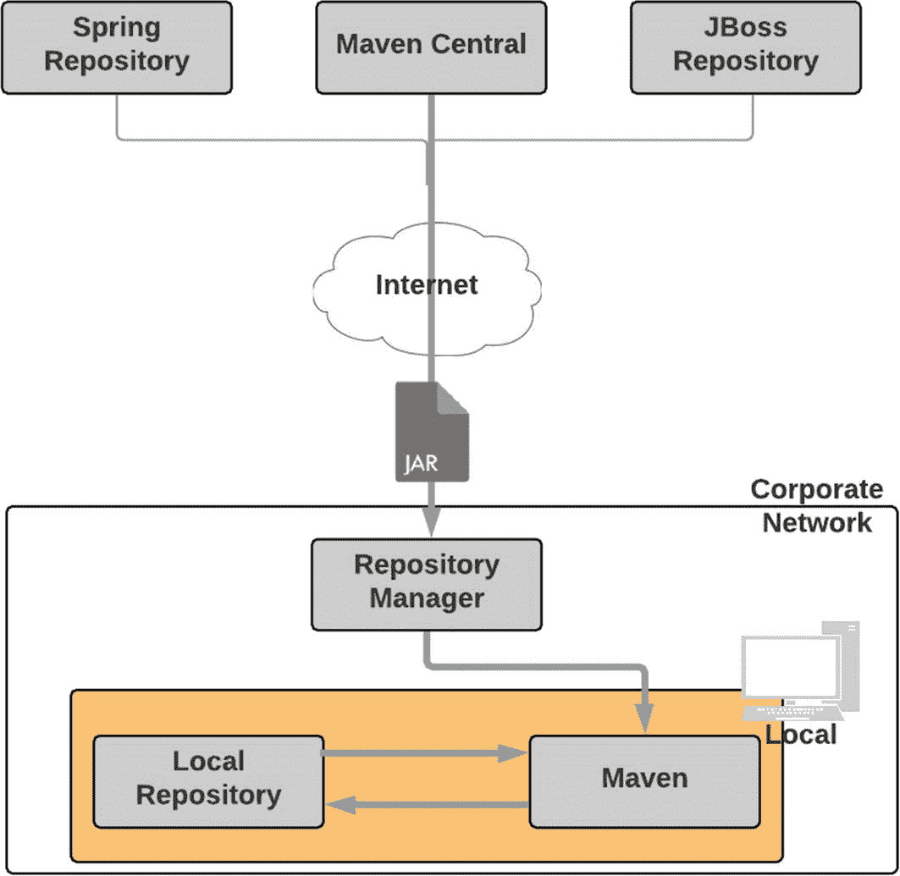

# 三、Maven 依赖管理

企业级项目通常依赖于各种开源库。考虑您想要使用`Log4J`进行应用程序日志记录的场景。为了完成这一点，您可以转到`Log4J`下载页面，下载`JAR`文件，并把它放在项目的`lib`文件夹中，或者把它添加到项目的类路径中。这种方法有几个问题:

1.  您下载的`JAR`文件可能依赖于其他一些库。您现在必须找到所有这些依赖项(以及它们的依赖项)并将它们添加到您的项目中。

2.  到了升级`JAR`文件的时候，你需要重新开始这个过程。

3.  您需要将`JAR`文件与您的源代码一起添加到源代码控制中，这样您的项目就可以在您自己的计算机之外的计算机上构建。这增加了项目规模、检验和构建时间。

4.  在组织内的团队间共享文件变得很困难。

为了解决这些问题，Maven 提供了声明性依赖管理。使用这种方法，您可以在一个名为`pom.xml`的外部文件中声明项目的依赖项。Maven 将自动下载这些依赖项，并出于构建、测试或打包的目的将它们交给您的项目。

图 [3-1](#Fig1) 显示了 Maven 依赖性管理的高级视图。当您第一次运行您的 Maven 项目时，Maven 连接到网络并从远程存储库中下载工件和相关的元数据。默认的远程仓库被称为 *Maven Central* ，它位于`repo.maven.apache.org`和`uk.maven.org`。Maven 将这些下载的工件的副本放在其本地存储库中。在随后的运行中，Maven 将在其本地存储库中寻找一个工件；如果没有找到工件，Maven 将尝试从远程存储库下载它。


图 3-1

Maven 依赖管理

尽管图 [3-1](#Fig1) 中所示的架构在大多数情况下都能工作，但它在企业环境中会带来一些问题。第一个问题是在团队之间共享公司相关的工件是不可能的。出于安全和知识产权的考虑，您不希望在 Maven Central 上发布您企业的工件。另一个问题涉及法律和许可问题。您的公司可能希望团队只使用官方批准的开源软件，而这种架构不适合该模型。最后一个问题是带宽和下载速度。在 Maven Central 负载较重的时候，Maven 工件的下载速度会降低，这可能会对您的构建产生负面影响。因此，大多数企业采用如图 [3-2](#Fig2) 所示的架构。



图 3-2

企业 Maven 存储库架构

内部存储库管理器充当远程存储库的代理。这允许您缓存来自远程存储库的工件，从而加快工件下载并提高构建性能。因为您拥有对内部存储库的完全控制权，所以您可以管理您公司中允许的工件类型。此外，您还可以将您组织的工件推到 repository manager 上，从而实现协作。如表 [3-1](#Tab1) 所示，有几个开源存储库管理器。

表 3-1

开源存储库管理器

<colgroup><col class="tcol1 align-left"> <col class="tcol2 align-left"></colgroup> 
| 

存储库管理器

 | 

统一资源定位器

 |
| --- | --- |
| Nexus 存储库操作系统 | [T2`www.sonatype.com/nexus-repository-oss`](http://www.sonatype.com/nexus-repository-oss) |
| Apache 归档 | [T2`http://archiva.apache.org/`](http://archiva.apache.org/) |
| Artifactory 开源 | [T2`https://jfrog.com/open-source/#artifactory`](https://jfrog.com/open-source/%2523artifactory) |

## 使用新的存储库

为了使用新的存储库，您需要修改您的`settings.xml`文件。清单 [3-1](#PC1) 显示了添加到`settings.xml`文件中的 Spring 和 JBoss 存储库。同样，您可以添加您公司的存储库管理员。

### 注意

关于存储库的信息可以在`settings.xml`或`pom.xml`文件中提供。每种方法都有利弊。将存储库信息放在`pom.xml`文件中可以使您的构建具有可移植性。它使开发人员能够下载项目并简单地构建它们，而无需进一步修改他们的本地`settings.xml`文件。这种方法的问题是，当工件被发布时，相应的`pom.xml`文件将存储库信息硬编码在其中。如果存储库 URL 发生了变化，这些工件的消费者将会由于存储库路径的中断而遇到错误。将存储库信息放在`settings.xml`文件中解决了这个问题，并且由于它提供的灵活性，在企业设置中通常推荐使用`settings.xml`方法。

```java
<?xml version="1.0" encoding="UTF-8" ?>
<settings  xmlns:xsi="http://www.w3.org/2001/XMLSchema-instance" xsi:schemaLocation="http://maven.apache.org/SETTINGS/1.0.0 http://maven.apache.org/xsd/settings-1.0.0.xsd">

  .......

      <profiles>
          <profile>
            <id>your_company</id>
            <repositories>
                   <repository>
                     <id>spring_repo</id>
                     <url>http://repo.spring.io/release/</url>
                   </repository>
                   <repository>
                     <id>jboss_repo</id>
                     <url>https://repository.jboss.org/</url>
                   </repository>
            </repositories>
          </profile>
      </profiles>
      <activeProfiles>
      <activeProfile>your_company</activeProfile>
      </activeProfiles>

  .......

</settings>

Listing 3-1Adding Repositories in settings.xml

```

## 依赖性识别

Maven 依赖项通常是 JAR、WAR、enterprise archive (EAR)和 ZIP 等归档文件。每个 Maven 依赖项都使用以下组、工件和版本(GAV)坐标进行唯一标识:

*   `groupId`:负责该项目的组织或团体的标识。例子包括`org.hibernate`、`log4j`、`org.springframework`和 com.companyname

*   `artifactId`:项目正在生成的工件的标识符。这在使用相同`groupId`的项目中必须是唯一的。例子包括 hibernate-tools、`log4j`、spring-core 等等。

*   `version`:表示项目的版本号。示例包括 1.0.0、2 . 3 . 1-快照和 5.4.2 .最终版本

*   `type`:表示对生成的工件进行打包。示例包括 JAR、WAR 和 EAR。

仍在开发中的工件在它们的版本中用快照标记。一个示例版本是 1.0-快照。这告诉 Maven 每天从远程存储库中寻找工件的更新版本。

使用 Dependencies 标记在 pom.xml 文件中声明依赖关系，如下所示:

```java
<dependencies>
      <dependency>
             <groupId>org.hibernate</groupId>
             <artifactId>hibernate-tools</artifactId>
             <version>5.4.2.Final</version>
      </dependency>
</dependencies>

```

## 传递依赖性

在项目的`pom.xml`文件中声明的依赖项通常有自己的依赖项。这样的依赖被称为*传递依赖*。以 Hibernate 核心为例。为了让它正常工作，它需要 JBoss 日志、dom4j、javaassist 等等。在您的`pom.xml`文件中声明的 Hibernate 核心被认为是一个直接依赖项，而像 dom4j 和 javaassist 这样的依赖项被认为是项目的可传递依赖项。Maven 的一个主要优点是，它自动处理可传递的依赖项，并将它们包含在您的项目中。

图 [3-3](#Fig3) 提供了一个传递依赖的例子。请注意，可传递依赖项可以有自己的依赖项。正如您所想象的，这可能会很快变得复杂，尤其是当多个直接依赖项提取同一个 JAR 文件的不同版本时。

Maven 使用一种称为*依赖中介*的技术来解决版本冲突。简而言之，依赖中介允许 Maven 从依赖树中提取与项目最接近的依赖。在图 [3-3](#Fig3) 中，有两个版本的依赖 B: 0.0.8 和 1.0.0。在这个场景中，依赖项 B 的版本 0.0.8 包含在项目中，因为它是一个直接依赖项，并且是最接近树的*。现在看一下依赖 F 的三个版本:0.1.3、1.0.0 和 2.2.0。所有三个依赖项都在同一深度。在这个场景中，Maven 将使用*第一个找到的依赖项*，这将是 0.1.3，而不是最新的 2.2.0 版本。如果您希望 Maven 使用工件 F 的最新 2.2.0 版本，您需要显式地将该版本依赖项添加到 pom.xml 文件中。*


图 3-3

传递依赖性

虽然非常有用，但是可传递的依赖关系可能会导致问题和不可预知的副作用，因为您可能最终会包含不需要的 JAR 文件或旧版本的 JAR 文件。Maven 提供了一个方便的依赖插件，允许您可视化项目依赖树。清单 [3-2](#PC3) 显示了在一个样本项目上运行依赖*树*目标的输出。可以看到该项目依赖于 4.11 版本的 JUnit JAR 文件。JUnit JAR 本身依赖于 1.3 版本的 hamcrest JAR 文件。

```java
[sudha]$mvn dependency:tree
[INFO] Scanning for projects...
[INFO] --- maven-dependency-plugin:2.8:tree (default-cli) @ gswm
[INFO] com.apress.gswmbook:gswm:jar:1.0.0-SNAPSHOT
[INFO] \- junit:junit:jar:4.11:test
[INFO]    \- org.hamcrest:hamcrest-core:jar:1.3:test
[INFO] -----------------------------------------------
[INFO] BUILD SUCCESS

Listing 3-2Maven Dependency Tree Plug-in

```

有时候，您不希望在最终的归档中包含某些可传递的依赖 jar。例如，在 Tomcat 或 WebLogic 等容器中部署应用程序时，您可能希望排除某些 JAR 文件，如 servlet-api 或 javaee-api，因为它们会与容器加载的版本冲突。Maven 提供了一个“excludes”标签来排除可传递的依赖关系。清单 [3-3](#PC4) 显示了从 JUnit 依赖项中排除 hamcrest 库的代码。如您所见，`exclusion`元素接受您想要排除的依赖项的`groupId`和`artifactId`坐标。

```java
<dependencies>
      <dependency>
             <groupId>junit</groupId>
             <artifactId>junit</artifactId>
             <version>${junit.version}</version>
             <scope>test</scope>
             <exclusions>
                   <exclusion>
                         <groupId>org.hamcrest</groupId>
                         <artifactId>hamcrest</artifactId>
                   </exclusion>
             </exclusions>
      </dependency>
</dependencies>

Listing 3-3JUnit Dependency with Exclusion

```

## 依赖范围

考虑一个使用 JUnit 进行单元测试的 Java 项目。您包含在项目中的 JUnit `JAR`文件只在测试期间需要。您真的不需要将 JUnit `JAR`捆绑到您的最终产品档案中。类似地，考虑 MySQL 数据库驱动程序，`mysql-connector-java.jar`文件。当您在诸如 Tomcat 之类的容器中运行应用程序时，而不是在代码编译或测试期间，您需要 JAR 文件。Maven 使用了作用域的概念，它允许您指定何时何地需要特定的依赖项。

Maven 提供了以下六个范围:

*   `compile`:在项目构建、测试和运行的所有阶段，类路径中都有与`compile`范围的依赖关系。这是默认范围。

*   `provided`:在构建和测试阶段，与`provided`范围的依赖关系在类路径中是可用的。它们不会被捆绑在生成的工件中。使用这个范围的依赖关系的例子包括 Servlet api、JSP api 等等。

*   `runtime`:在构建阶段，与`runtime`范围的依赖关系在类路径中不可用。相反，它们被捆绑在生成的工件中，并在运行时可用。

*   `test`:与`test`范围的依赖关系在测试阶段是可用的。JUnit 和 TestNG 是依赖测试范围的好例子。

*   `system`:与`system`范围的依赖关系类似于与`provided`范围的依赖关系，除了这些依赖关系不是从存储库中检索的。相反，指定了文件系统的硬编码路径，从该路径使用依赖关系。

*   `import`:`import`范围仅适用于`.pom`文件依赖。它允许您包含来自远程`.pom`文件的依赖管理信息。`import`范围仅在 Maven 2.0.9 或更高版本中可用。

## 手动依赖安装

理想情况下，您将从公共存储库或您的企业存储库管理器中提取项目中的依赖项。但是，有时您需要在本地存储库中有一个可用的档案，以便您可以继续开发。例如，您可能正在等待系统管理员将所需的`JAR`文件添加到您的企业存储库管理器中。

Maven 提供了一种使用安装插件将归档文件安装到本地存储库中的简便方法。清单 [3-4](#PC5) 安装一个位于`c:\apress\gswm-book\chapter3`文件夹中的`test.jar`文件。

```java
C:\apress\gswm-book\chapter3>mvn install:install-file -DgroupId=com.apress.gswmbook -DartifactId=test -Dversion=1.0.0 -Dfile=C:\apress\gswm-book\chapter3\test.jar -Dpackaging=jar -DgeneratePom=true
[INFO] Scanning for projects...
[INFO]
[INFO] ------------< org.apache.maven:standalone-pom >---------
[INFO] Building Maven Stub Project (No POM) 1
[INFO] -------------------------[ pom ]------------------------
[INFO]
[INFO] --- maven-install-plugin:2.4:install-file (default-cli) @ standalone-pom ---
[INFO] Installing C:\apress\gswm-book\chapter3\test.jar to C:\Users\bavara\.m2\repository\com\apress\gswmbook\test\1.0.0\test-1.0.0.jar
[INFO] Installing C:\Users\bavara\AppData\Local\Temp\mvninstall5971068007426768105.pom to C:\Users\bavara\.m2\repository\com\apress\gswmbook\test\1.0.0\test-1.0.0.pom
[INFO] --------------------------------------------------------
[INFO] BUILD SUCCESS
[INFO] --------------------------------------------------------
[INFO] Total time:  0.439 s
[INFO] Finished at: 2019-09-01T00:05:21-06:00
[INFO] --------------------------------------------------------

Listing 3-4Installing Dependency Manually

```

看到`BUILD SUCCESS`消息后，您可以通过访问本地 Maven 库来验证安装，如图 [3-4](#Fig4) 所示。


图 3-4

相关性已添加到存储库中

## 摘要

依赖性管理是 Maven 的核心。每个重要的 Java 项目都依赖于开源或外部工件，Maven 的依赖性管理自动化了检索这些工件并将其包含在构建过程的正确阶段的过程。您还了解了 Maven 使用 GAV 坐标来识别其工件。

在下一章，你将学习一个基本 Maven 项目的组织。