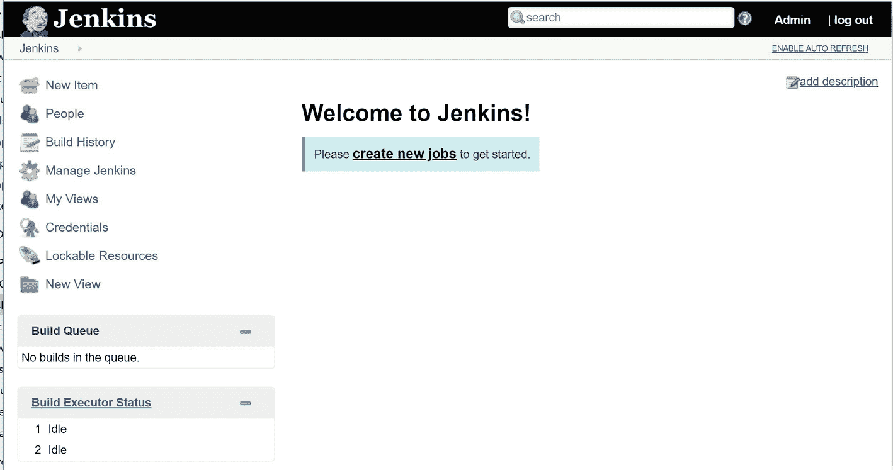
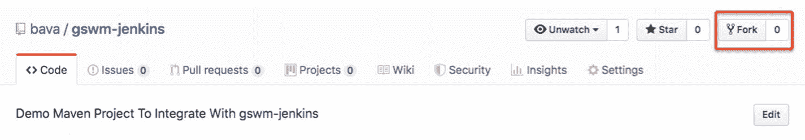
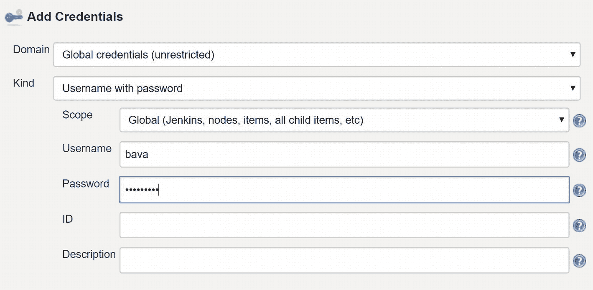
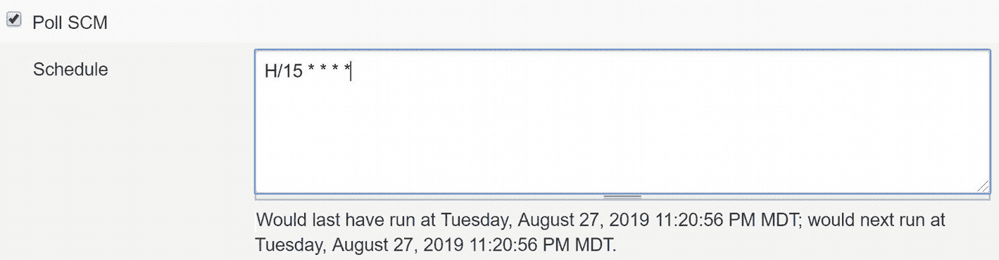
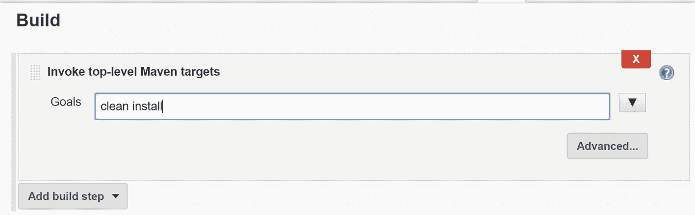

# 九、持续集成

持续集成(CI)是一种软件开发最佳实践，开发人员每天数次将对他们代码的更改集成到一个公共存储库中。每一个提交的变更都会导致一个自动构建，这个自动构建会编译代码，运行测试，并生成工件的一个新版本。构建过程中的任何错误都将立即报告给开发团队。这种频繁的代码集成允许开发人员在开发周期的早期发现并解决集成问题。

图 [9-1](#Fig1) 显示了持续集成以及相关组件的可视化表示。CI 流程从开发人员将她的变更提交给诸如 Git 或 SVN 之类的源代码控制系统开始。CI 服务器会收到通知或观察/查询新的代码变更，一旦发现变更，就会检查源代码并开始构建过程。在成功的构建中，CI 服务器可以将工件发布到存储库或测试服务器。作为最后一步，关于构建状态的通知被发送给开发团队。

图 9-1

CI 组件

Jenkins 是一个流行的开源 CI 服务器，它与 Maven 集成得很好。其他流行的 CI 服务器包括 Bamboo、TeamCity 和 GitLab。在这一章中，我们将安装并配置 Jenkins 来触发基于 Maven 的项目的自动构建。

## 安装 Jenkins

Jenkins 以几种方式发布——本地安装程序、Docker 容器和可执行的 WAR 文件。在本书中，我们将使用长期支持(LTS)的可执行 WAR 文件版本，您可以在 [`https://jenkins.io/download/`](https://jenkins.io/download/) 下载。将下载的版本保存在 c:\tools\jenkins。

下载完成后，使用命令行导航到下载的文件夹并运行命令:***Java–jar Jenkins . war*****。**成功执行命令后，打开浏览器并导航至`http://localhost:8080`。系统将提示您从“initialAdminPassword”文件中找到并输入自动生成的管理员密码。在下一个屏幕上，选择“安装建议的插件”并等待安装程序完成插件安装。在“创建第一个管理员用户”屏幕上，输入“Admin”作为用户名，输入“admin123”作为密码，并填写表格上的其余详细信息。完成 Jenkin 的配置后，您应该会看到类似于图 [9-2](#Fig2) 的 Jenkins 仪表盘。

图 9-2

詹金斯仪表板

## Maven 项目

为了理解 Jenkins 对 Maven 的支持，我们需要一个源代码控制服务器上的示例 Maven 项目。在本章中，我们将使用位于 [`https://github.com/bava/gswm-jenkins`](https://github.com/bava/gswm-jenkins) 的 GitHub 上的 gwsm-jenkins 项目。为了让您理解本章的其余部分，您需要将 gswm-jenkins 存储库放在您自己的帐户下。你可以登录 GitHub，点击如图 [9-3](#Fig3) 所示的分叉按钮。

图 9-3

Fork gswm-jenkins 知识库

## 配置 Jenkins

要开始 Jenkins 配置，请单击仪表板上的“新项目”链接。在新项目屏幕上，选择自由式项目并输入名称“gswm-jenkins-integration”，如图 [9-4](#Fig4) 所示。

图 9-4

新项目屏幕

在下一个屏幕上，在 General 部分，选择“GitHub project”复选框并输入项目 URL。这应该是您 GitHub 帐户上分叉项目位置的 URL。

图 9-5

新项目-常规部分

在“源代码管理”部分，选择“Git”单选按钮并输入 GitHub 库的 URL，如图 [9-6](#Fig6) 所示。这是 GitHub 克隆 URL，您可以通过点击存储库名称下的“克隆或下载”找到它。

图 9-6

新项目源代码管理部分

为了让 Jenkins 检查您的代码，您需要提供您的 GitHub 凭据。您可以点击凭证旁边的“添加”按钮，输入您的用户名和密码，如图 [9-7](#Fig7) 所示。

图 9-7

GitHub 凭证输入

在“构建触发器”部分，选择“轮询 SCM”选项，并输入“H/15∑∑∑”作为值，如图 [9-8](#Fig8) 所示。这表明 Jenkins 需要每 15 分钟轮询一次 GitHub repo 的变化。

图 9-8

构建触发器轮询计划

在“构建”部分，点击“添加构建步骤”并选择“调用顶级 Maven 目标”。输入“全新安装”作为目标值，如图 [9-9](#Fig9) 所示。

图 9-9

Maven 的构建步骤

最后，在 Post-build Actions 部分，点击“Add post-build action”并选择“Archive the artifacts”。输入∫∫/∫。jar 作为要归档文件的值，如图 [9-10](#Fig10) 所示。

图 9-10

存档工件部分

再次单击“添加构建后操作”按钮，并选择“发布 JUnit 测试结果报告”。输入“target/surefire-reports/*。xml "作为测试报告的 XMLs 值如图 [9-11](#Fig11) 所示。单击保存保存配置。

图 9-11

发布 JUnit 结果

## 触发构建作业

我们现在已经做好了让 Jenkins 构建我们项目的一切准备。在“项目作业”页面上，单击“立即构建”链接以触发新的构建。这将启动一个带有数字编号的新构建，您可以从页面左下角的构建历史部分访问该数字编号。单击内部版本号旁边的下拉箭头，并选择“控制台输出”。这将把你带到类似图 [9-12](#Fig12) 的输出屏幕。

图 9-12

作业控制台输出屏幕

成功完成工作后，您将在项目页面上看到构建的工件，如图 [9-13](#Fig13) 所示。

图 9-13

Jenkins 项目页面-构建工件

运行的测试结果也可以在项目页面的“最新测试结果”下找到。

## 摘要

在这一章中，你学习了持续集成和配置 Jenkins 与 Maven 项目交互。

这场讨论将我们带到旅程的终点。在整本书中，你已经学习了 Maven 背后的关键概念。我们希望您将使用您新发现的 Maven 知识来自动化和改进您现有的构建和软件开发过程。