# 2.数学问题

在这一章中，你将学习一些数学运算的基础知识，包括素数和罗马数字系统。此外，我还提出了一些数字游戏的想法。有了这些知识，你应该为大量的练习做好准备。

## 2.1 导言

### 2.1.1 除法和模运算简介

除了乘法和除法，模运算(%)也是非常常用的。它用于确定除法的余数。让我们用下面的例子来说明除法余数落在表下的整数:

(**5**7+3)/7 = 38/7 = 5

(5’7+**3**)% 7 = 38% 7 = 3

即使只有这几个操作，也可以解决各种任务。请回忆以下关于(整数)数的操作:

*   *n*% 10—确定除以 10 的余数，从而确定最后一位数字。

*   *n*/10—显然除以值 10，因此允许截断最后一位数字。

**提取数字**要提取一个数的数字，只要余数大于 0，就要结合模和除:

```java
void extractDigits(final int startValue)
{
    int remainingValue = startValue;
    while (remainingValue > 0)
    {
          final int digit = remainingValue % 10;
          System.out.print(digit + " ");

          remainingValue = remainingValue / 10;
    }
    System.out.println();
}

```

调用此方法一次以理解其工作方式—请注意数字是以相反的顺序输出的:

```java
jshell> extractDigits(123)
3 2 1

```

**确定位数**除了提取单个数字，您还可以使用重复除法来确定十进制数的位数，只需除以 10，直到没有余数:

```java
int countDigits(final int number)
{
    int count = 0;

    int remainingValue = number;
    while (remainingValue > 0)
    {
        remainingValue = remainingValue / 10;
        count++;
    }

    return count;
}

```

### 2.1.2 分频器简介

在下文中，您将研究如何确定一个数的所有实数约数(即，那些没有数本身的约数)。算法非常简单:遍历所有数值的一半(所有更高的数值都不能是整数的除数，因为 2 已经是除数了)，并检查它们是否除以给定的数而没有余数。如果是这种情况，那么这个数就是一个除数，并包含在结果列表中。您将整个事情实现如下:

```java
List<Integer> findProperDivisors(final int value)
{
    final List<Integer> divisors = new ArrayList<>();

    for (int i = 1; i <= value / 2; i++)
    {
        if (value % i == 0)
        {
            divisors.add(i);
        }
    }

    return divisors;
}

```

调用此方法一次以了解其操作，并根据符合预期的输出确认其工作正常:

```java
jshell> findProperDivisors(6)
$2 ==> [1, 2, 3]

jshell> findProperDivisors(24)
$3 ==> [1, 2, 3, 4, 6, 8, 12]

jshell> findProperDivisors(7)
$4 ==> [1]

```

### 2.1.3 素数简介

质数是大于 1 的自然数，并且只能被自身和 1 整除。有两种非常容易理解的算法，用于检查一个给定的数是否是质数，或者用于计算达到给定最大值的质数。

**素数的蛮力算法**一个数是否是素数的判定方法如下:你从 2 开始最多到该数的一半寻找要检查的数，当前数是否是原数的除数。 <sup>[1](#Fn1)</sup> 那样的话，就不是质数了。否则，需要进一步检查。在 Java 中，可以这样写:

```java
boolean isPrime(final int potentiallyPrime)
{
    // check for all relevant numbers if they represent a divisor
    for (int i = 2; i <= potentiallyPrime / 2; i++)
    {
        if (potentiallyPrime % i == 0)
            return false;
    }
    return true;
}

```

为了进行试验，在一个循环中运行该方法，并确定所有最大值为 25 的质数。程序输出表明功能运行正常。

```java
jshell> var primes = new ArrayList<>()
primes ==> []

jshell> for (int i = 2; i < 25; i++)
   ...> {
   ...>      if (isPrime(i))
   ...>          primes.add(i);
   ...> }

jshell> System.out.println("Primes < 25: " + primes)
Primes < 25: [2, 3, 5, 7, 11, 13, 17, 19, 23]

```

**优化:厄拉多塞的筛子**另一种确定达到给定最大值的素数的算法叫做厄拉多塞 T5 的*筛子**。它可以追溯到同名的希腊数学家。***

整个过程如下:最初，从值 2 开始直到给定最大值的所有数字都被写下来，例如:

2, 3, 4, 5, 6, 7, 8, 9, 10, 11, 12, 13, 14, 15

所有的数字最初都被认为是质数的潜在候选者。现在那些不可能是质数的数字被一步步淘汰。取最小的未标记数，在这种情况下，取数字 2，它对应于第一个质数。现在它的所有倍数都消除了(例 4 *、* 6 *、* 8 *、* 10 *、* 12 *、* 14):

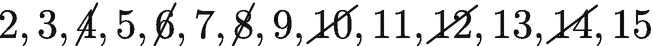

此外，你继续数 3，这是第二个质数。现在，再次消除倍数。分别是数字 6 *、* 9 *、* 12 *、* 15:


下一个未标记的数，也就是质数是 5。只要在当前素数之后还有未标记的数，就重复该过程。

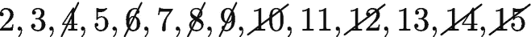

对于所有小于 15 的质数，这会导致以下结果:

2, 3, 5, 7, 11, 13

使用以下值检查该算法:

<colgroup><col class="tcol1 align-left"> <col class="tcol2 align-left"></colgroup> 
| 

限制

 | 

结果

 |
| --- | --- |
| Fifteen | [2, 3, 5, 7, 11, 13] |
| Twenty-five | [2, 3, 5, 7, 11, 13, 17, 19, 23] |
| Fifty | [2, 3, 5, 7, 11, 13, 17, 19, 23, 29, 31, 37, 41, 43, 47] |

Hint: Possible Optimizations

如你所见，数字经常被划掉几次。如果你在数学方面更有经验，你可以证明一个合数中至少有一个质因数必须总是小于等于该数本身的根。原因是如果 *x* 是大于`sqrt(n)`的除数，那么它认为`p = n/x`小于`sqrt(n)`，因此这个值已经被尝试过了。因此，您可以优化多次波的消除。首先，你可以从质数的平方开始消去，因为所有较小的倍数都已经消去了。其次，计算只能进行到上限的根。

### 2.1.4 罗马数字

罗马数字系统使用特殊字母及其组合来表示数字。以下基本映射适用: <sup>[2](#Fn2)</sup>

<colgroup><col class="tcol1 align-left"> <col class="tcol2 align-left"> <col class="tcol3 align-left"> <col class="tcol4 align-left"> <col class="tcol5 align-left"> <col class="tcol6 align-left"> <col class="tcol7 align-left"> <col class="tcol8 align-left"></colgroup> 
| **罗马数字** | 我 | V | X | L | C | D | M |
| **值** | one | five | Ten | Fifty | One hundred | Five hundred | One thousand |

相应的值通常通过从左到右将各个数字的值相加来计算。通常情况下(参见以下规则)，最大的数字在左边，最小的数字在右边，例如，值 16 为 XVI。

### 2.1.5 规则

罗马数字是根据一定的规则组成的:

*   **加法规则** **:** 相邻相同的数字相加，例如 XXX = 30。同样，这也适用于较大数字之后的较小数字，因此 XII = 12。

*   **重复规则** **:** 最多三个相同的数字可以连续出现。根据规则 1，你可以把数字 4 写成 IIII，这是规则 2 禁止的。这就是减法规则发挥作用的地方。

*   **减法法则** **:** 如果一个较小的数字符号出现在一个较大的数字符号前面，则减去相应的数值。让我们再来看看 4:这可以表示为减法 51。这在罗马数字系统中用 IV 表示。以下规则适用于减法:
    *   I 只在 V 和 x 之前。

    *   x 仅在 L 和 c 之前。

    *   c 只在 D 和 m 之前。

### 2.1.6 示例

为了更好的理解和澄清上述规则，我们来看看罗马数字的一些记法及其对应的值:*VII*= 5+1+1 = 7*MDC lxi*= 1000+500+100+50+10+5+1 = 1666*MMS XVIII*= 1000+1000+10+5+1+1+1 = 2018*mmsix*= 1000

### 值得注意的

现代世界中常见的阿拉伯数字依赖于十进制。数字的位置决定了它们的值。因此，7 可以是数字本身，但也可以代表 70 或 700。然而，在罗马数字系统中，V 总是代表 5，不管位置如何。

由于罗马数字的特殊结构，许多数学运算都很复杂；甚至一个简单的加法也可能引起一个更大的，有时甚至是完全的数字变化。这对于数字 2018 和 2019 或者加法 III + II = V 变得非常明显，更糟糕的是:乘法或除法要复杂得多。有人推测这是罗马帝国崩溃的原因之一。

Note: Larger Numbers

表示较大的罗马数字(在一万及以上的范围内)有特殊的表示法，因为不允许四个或更多的 m 相互跟随。这与本书的任务无关。如果有兴趣，读者可以参考互联网或其他来源。

### 2.1.8 数字游戏

在这一部分，你会看到一些特殊的数字星座:

*   完全数

*   阿姆斯特朗数字

*   总和检查（checksum 的复数形式）

在下面使用的许多算法中，您将数字细分成它们的数字，以便能够执行相应的数字游戏。

### 完美的数字

根据定义，如果一个数的值等于它的实数约数之和(即不包括它本身)，那么这个数被称为一个完全数。这听起来可能有点奇怪，但是很简单。让我们以数字 6 为例。它拥有数字 1、2 和 3 作为实数的约数。有趣的是，它现在仍然成立

1 + 2 + 3 = 6

让我们来看看另一个对应的数字:数字 20，它有实数约数 1、2、4、5 和 10，但它们的和是 22 而不是 20:

1 + 2 + 4 + 5 + 10 = 22

### 阿姆斯特朗编号

接下来，你将研究所谓的阿姆斯特朗数。这些数字的单个数字首先按数字的位数取幂，然后相加。如果这个和对应于原始数字的值，它被称为阿姆斯特朗数。为了使事情简单一点，让我们看看三位数的特殊情况。要成为阿姆斯特朗数，该数必须满足以下等式:


数字的位数模型为 *x* 、 *y* 、 *z* ，范围均为 0-9。

让我们考虑这个公式满足的两个例子:


**变化**作为一种修改，满足以下等式的哪些数字也是非常有趣的:

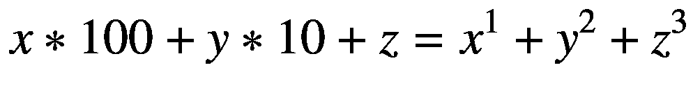

或者

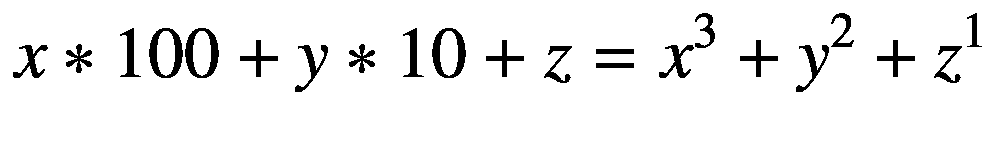

对于第一个方程，有以下解:

[135 *，* 175 *，* 518 *，* 598]

第二个方程， *x* 、 *y* 、 *z* 在最大到 100 的范围内无解。如果你愿意，你可以在执行任务 9 的奖励部分时验证这一点，或者看看解决方案。

### 简单校验和的算法

校验和被编码成不同的数字，因此很容易证明其有效性。例如，这适用于信用卡号码和通过特殊协议进行的数据传输。

让我们假设必须为一个四位数的数计算校验和(以下建模为 *a* 到 *d* )。然后，您可以根据位置执行以下计算:

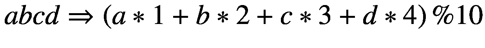

我将再次举例说明计算:

<colgroup><col class="tcol1 align-left"> <col class="tcol2 align-left"> <col class="tcol3 align-left"> <col class="tcol4 align-left"></colgroup> 
| 

投入

 | 

位置计算

 | 

价值

 | 

校验和

 |
| --- | --- | --- | --- |
| One thousand one hundred and eleven | 1 * 1 + 1 * 2 + 1 * 3 + 1 * 4 | 1 + 2 + 3 + 4 = 10 | 10 % 10 = 0 |
| One thousand two hundred and thirty-four | 1 * 1 + 2 * 2 + 3 * 3 + 4 * 4 | 1 + 4 + 9 + 16 = 30 | 30 % 10 = 0 |
| Four thousand three hundred and twenty-one | 4 * 1 + 3 * 2 + 2 * 3 + 1 * 4 | 4 + 6 + 6 + 4 = 20 | 20 % 10 = 0 |
| Seven thousand two hundred and seventy-one | 7 * 1 + 2 * 2 + 7 * 3 + 1 * 4 | 7 + 4 + 21 + 4 = 36 | 36 % 10 = 6 |
| 0815 | 0 * 1 + 8 * 2 + 1 * 3 + 5 * 4 | 0 + 16 + 3 + 20 = 39 | 39 % 10 = 9 |
| Five thousand one hundred and eighty | 5 * 1 + 1 * 2 + 8 * 3 + 0 * 4 | 5 + 2 + 24 + 0 = 31 | 31 % 10 = 1 |

## 2.2 练习

### 2.2.1 练习 1:基本算术(★✩✩✩✩)

#### 练习 1a:基本算术运算(★✩✩✩✩)

编写方法`int calc(int, int)`，将两个变量`int`的 *m* 和 *n* 相乘，然后将乘积除以 2，并输出关于除以 7 的余数。

#### 例子

<colgroup><col class="tcol1 align-left"> <col class="tcol2 align-left"> <col class="tcol3 align-left"> <col class="tcol4 align-left"> <col class="tcol5 align-left"></colgroup> 
| 

m

 | 

n

 | 

男*女

 | 

m * n / 2

 | 

结果((n * m / 2) % 7)

 |
| --- | --- | --- | --- | --- |
| six | seven | forty-two | Twenty-one | Zero |
| three | four | Twelve | six | six |
| five | five | Twenty-five | Twelve | five |

这里有一个简短的提醒:在整数除法中，余数被截断。因此，25 */* 2 得出值 12。

#### 练习 1b:统计(★★✩✩✩)

找出该数字以及自然数的和，这些自然数可以被 2 或 7 整除，直到给定的最大值(不包括最大值)，并将其输出到控制台。写方法`void calcSumAndCountAllNumbersDivBy_2_Or_7(int)`。扩展它，使它返回这两个值，而不是执行控制台输出。

#### 例子

<colgroup><col class="tcol1 align-left"> <col class="tcol2 align-left"> <col class="tcol3 align-left"> <col class="tcol4 align-left"> <col class="tcol5 align-left"></colgroup> 
| 

最高的

 | 

能被 2 整除

 | 

能被 7 整除

 | 

结果

 |
| --- | --- | --- | --- |
| 

数数

 | 

总额

 |
| --- | --- |
| three | Two | -/- | one | Two |
| eight | 2, 4, 6 | seven | four | Nineteen |
| Fifteen | 2, 4, 6, 8, 10, 12, 14 | 7, 14 | eight | Sixty-three |

#### 练习 1c:偶数或奇数(★✩✩✩✩)

创建方法`boolean isEven(n)`和`boolean isOdd(n)`，分别检查传递的整数是偶数还是奇数。

### 2.2.2 练习 2:数字作为文本(★★✩✩✩)

编写方法`String numberAsText(int)`,对于给定的正数，将相应的数字转换成相应的文本。

以下面的片段作为数字的最后一位开始:

```java
static String numberAsText(final int n)
{
    final int remainder = n % 10;
    String valueAsText = "";

    if (remainder == 0)
        valueAsText = "ZERO";
    if (remainder == 1)
        valueAsText = "ONE";

    // ...

    return valueAsText;
}

```

#### 例子

<colgroup><col class="tcol1 align-left"> <col class="tcol2 align-left"></colgroup> 
| 

投入

 | 

结果

 |
| --- | --- |
| seven | “七” |
| forty-two | “四二” |
| Twenty-four thousand six hundred and eighty | “二四六八零” |
| Thirteen thousand five hundred and seventy-nine | “一三五七九” |

### 2.2.3 练习 3:完全数(★★✩✩✩)

根据定义，如果一个自然数的值等于它的实数约数之和，那么这个自然数就叫做完全数。例如，对于数字 6 和 28 来说是这样的:

1 + 2 + 3 = 6

1 + 2 + 4 + 7 + 14 = 28

编写方法`List<Integer> calcPerfectNumbers(int)`,计算最大值的完全数，比如 10，000。

#### 例子

<colgroup><col class="tcol1 align-left"> <col class="tcol2 align-left"></colgroup> 
| 

投入

 | 

结果

 |
| --- | --- |
| One thousand | [6, 28, 496] |
| ten thousand | [6, 28, 496, 8128] |

### 2.2.4 练习 4:素数(★★✩✩✩)

编写方法`List<Integer> calcPrimesUpTo(int)`来计算所有素数直到给定值。提醒一下，质数是大于 1 的自然数，并且只能被自身和 1 整除。为了计算一个质数，之前描述过所谓的厄拉多塞筛。

#### 例子

使用以下值检查您的算法:

<colgroup><col class="tcol1 align-left"> <col class="tcol2 align-left"></colgroup> 
| 

投入

 | 

结果

 |
| --- | --- |
| Fifteen | [2, 3, 5, 7, 11, 13] |
| Twenty-five | [2, 3, 5, 7, 11, 13, 17, 19, 23] |
| Fifty | [2, 3, 5, 7, 11, 13, 17, 19, 23, 29, 31, 37, 41, 43, 47] |

### 2.2.5 练习 5:素数对(★★✩✩✩)

计算距离为 2(孪生)、4(近亲)和 6(性感)的所有素数对，直到 *n* 的上界。对于双胞胎来说，以下是正确的:

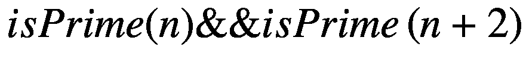

#### 例子

对于限值 50，预计会出现以下结果:

<colgroup><col class="tcol1 align-left"> <col class="tcol2 align-left"></colgroup> 
| 

类型

 | 

结果

 |
| --- | --- |
| 双胞胎之一 | 3=5, 5=7, 11=13, 17=19, 29=31, 41=43 |
| 远亲 | 3=7, 7=11, 13=17, 19=23, 37=41, 43=47 |
| 性感的 | 5=11, 7=13, 11=17, 13=19, 17=23, 23=29, 31=37, 37=43, 41=47, 47=53 |

### 2.2.6 练习 6:校验和(★★✩✩✩)

创建方法`int calcChecksum(String)`，该方法对以字符串形式给出的任意长度的数字的校验和执行以下基于位置的计算，其中 *n* 位数建模为*z*T5】1 到 *z* <sub>*n*</sub> :


#### 例子

<colgroup><col class="tcol1 align-left"> <col class="tcol2 align-left"> <col class="tcol3 align-left"></colgroup> 
| 

投入

 | 

总额

 | 

结果

 |
| --- | --- | --- |
| “11111” | 1 + 2 + 3 + 4 + 5 = 15 | 15 % 10 = 5 |
| “87654321” | 8 + 14 + 18 + 20 + 20 + 18 + 14 + 8 = 120 | 120 % 10 = 0 |

### 2.2.7 练习 7:罗马数字(★★★★✩)

#### 练习 7a:罗马数字→十进制数字(★★★✩✩)

编写方法`int fromRomanNumber(String)`,从文本有效的罗马数字计算相应的十进制数。<sup>[3](#Fn3)T4】</sup>

#### 练习 7b:十进制数字→罗马数字(★★★★✩)

编写将十进制数字转换成(有效的)罗马数字的方法`String toRomanNumber(int)`。

#### 例子

<colgroup><col class="tcol1 align-left"> <col class="tcol2 align-left"></colgroup> 
| 

阿拉伯语

 | 

古罗马的

 |
| --- | --- |
| Seventeen | “十七” |
| Four hundred and forty-four | " CDXLIV " |
| One thousand nine hundred and seventy-one | " MCMLXXI " |
| Two thousand and twenty | " MMXX " |

### 2.2.8 练习 8:组合学(★★✩✩✩)

#### 练习 8a:计算*a*<sup>2</sup>+*b*<sup>2</sup>=*c*<sup>2</sup>

计算值 *a* 、 *b* 和 *c* 的所有组合(每个组合从 1 开始且小于 100)，以下公式成立:

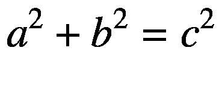

**加成(** ★★★✩✩ **)** 减少*o*(*n*t8】3)到*o*(*n*<sup>2</sup>)的运行时间。如果需要的话，参考附录 C 中关于 O 符号的介绍。

#### 练习 8b:计算*a*<sup>2</sup>+*b*<sup>2</sup>=*c*<sup>2</sup>+*d*<sup>2</sup>

计算值 *a* 、 *b* 、 *c* 和 *d* 的所有组合(每个组合从 1 开始且小于 100)，以下公式成立:

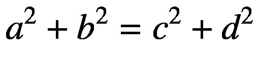

**加成(** ★★★✩✩ **)** 减少*o*(*n*t8】4)到*o*(*n*<sup>3</sup>)的运行时间。

### 2.2.9 练习 9: Armstrong 数字(★★✩✩✩)

这个练习处理三位数的阿姆斯特朗数。根据定义，这些数字的数字 *x* 、 *y* 和 *z* 从 1 到 9 满足以下等式:


编写方法`List<Integer> calcArmstrongNumbers()`计算出 *x* 、 *y、 *z* 的所有阿姆斯特朗数(每个< 10)。*

#### 例子

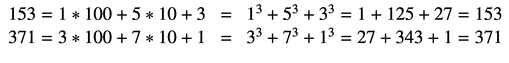

**奖金**找到一个带有 lambdas 的通用版本，然后尝试以下三个公式:


### 2.2.10 练习 10:最大变化计算器(★★★★✩)

假设你收集了不同价值的硬币。编写方法`calcMaxPossibleChange(values)`,确定对于正整数，从值 1 开始，用它可以无缝地*产生多少数量。结果应该是返回最大值。*

 *#### 例子

<colgroup><col class="tcol1 align-left"> <col class="tcol2 align-left"> <col class="tcol3 align-left"></colgroup> 
| 

投入

 | 

可能的值

 | 

最高的

 |
| --- | --- | --- |
| one | one | one |
| 1, 1 | 1, 2 | Two |
| 1, 5 | one | one |
| 1, 2, 4 | 1, 2, 3, 4, 5, 6, 7 | seven |
| 1, 2, 3, 7 | 1, 2, 3, 4, 5, 6, 7, 8, 9, 10, 11, 12, 13 | Thirteen |
| 1, 1, 1, 1, 5, 10, 20, 50 | 1, 2, 3, 4, 5, 6, ... , 30, ... , 39 | Thirty-nine |

### 2.2.11 练习 11:相关数字(★★✩✩✩)

如果两个数*n*T2 1 和*n*T6】2 的约数之和等于另一个数，则称这两个数为朋友:

*sum(约数(n*<sub>1</sub>)=*n*<sub>2</sub>

*sum(约数(n*<sub>2</sub>)=*n*<sub>1</sub>

编写方法`Map<Integer, Integer> calcFriends(int)`来计算所有朋友的数量，直到达到一个传递的最大值。

#### 例子

<colgroup><col class="tcol1 align-left"> <col class="tcol2 align-left"></colgroup> 
| 

投入

 | 

除数

 |
| --- | --- |
| ∑( *约数* (220)) = 284 | div(220) = 1，2，4，5，10，11，20，22，44，55，110 |
| ∑( *约数* (284)) = 220 | div(284) = 1，2，4，71，142 |
| ∑( *约数* (1184)) = 1210 | div(1184) = 1，2，4，8，16，32，37，74，148，296，592 |
| ∑( *约数* (1210)) = 1184 | div(1210) = 1，2，5，10，11，22，55，110，121，242，605 |

### 2.2.12 练习 12:质因数分解(★★★✩✩)

任何大于 1 的自然数都可以表示为素数的乘积——记住 2 也是素数的事实。编写方法`List<Integer> calcPrimeFactors(int)`,返回一个素数列表，这些素数的乘法运算产生所需的数。

#### 例子

<colgroup><col class="tcol1 align-left"> <col class="tcol2 align-left"> <col class="tcol3 align-left"></colgroup> 
| 

投入

 | 

主要因素

 | 

结果

 |
| --- | --- | --- |
| eight | 2 * 2 * 2 | [2, 2, 2] |
| Fourteen | 2 * 7 | [2, 7] |
| forty-two | 2 * 3 * 7 | [2, 3, 7] |
| One thousand one hundred and fifty-five | 3 * 5 * 7 * 11 | [3, 5, 7, 11] |
| Two thousand two hundred and twenty-two | 2 * 11 * 101 | [2, 11, 101] |

## 2.3 解决方案

### 2.3.1 解决方案 1:基本算术(★✩✩✩✩)

#### 解决方案 1a:基本算术运算(★✩✩✩✩)

编写方法`int calc(int, int)`，将两个变量`int`的 *m* 和 *n* 相乘，然后将乘积除以 2，并输出关于除以 7 的余数。

#### 例子

<colgroup><col class="tcol1 align-left"> <col class="tcol2 align-left"> <col class="tcol3 align-left"> <col class="tcol4 align-left"> <col class="tcol5 align-left"></colgroup> 
| 

m

 | 

n

 | 

男*女

 | 

m * n / 2

 | 

结果((n * m / 2) % 7)

 |
| --- | --- | --- | --- | --- |
| six | seven | forty-two | Twenty-one | Zero |
| three | four | Twelve | six | six |
| five | five | Twenty-five | Twelve | five |

这里有一个简短的提醒:在整数除法中，余数被截断。因此，25 */* 2 得出值 12。

**算法**该实现直接遵循数学运算:

```java
public int calc(final int m, final int n)
{
     return (m * n / 2) % 7;
}

```

#### 解决方案 1b:统计(★★✩✩✩)

找出该数字以及自然数的和，这些自然数可以被 2 或 7 整除，直到给定的最大值(不包括最大值)，并将其输出到控制台。写方法`void calcSumAndCountAllNumbersDivBy_2_Or_7(int)`。扩展它，使它返回这两个值，而不是执行控制台输出。

#### 例子

<colgroup><col class="tcol1 align-left"> <col class="tcol2 align-left"> <col class="tcol3 align-left"> <col class="tcol4 align-left"> <col class="tcol5 align-left"></colgroup> 
| 

最高的

 | 

能被 2 整除

 | 

能被 7 整除

 | 

结果

 |
| --- | --- | --- | --- |
| 

数数

 | 

总额

 |
| --- | --- |
| three | Two | -/- | one | Two |
| eight | 2, 4, 6 | seven | four | Nineteen |
| Fifteen | 2, 4, 6, 8, 10, 12, 14 | 7, 14 | eight | Sixty-three |

**算法**实现比以前稍微复杂一点。它使用两个变量计数和总和以及一个循环。模用于检查是否给出了整除性。为了更好的可读性，定义了一个所谓的解释变量`divisibleBy2or7`。在这里，o 故意写成小写，以区别于数字 0:

```java
void calcSumAndCountAllNumbersDivBy_2_Or_7(final int max)
{
    int count = 0;
    int sum = 0;

    for (int i = 1; i < max; i++)
    {
        final boolean divisibleBy2or7 = i % 2 == 0 || i % 7 == 0;
        if (divisibleBy2or7)
        {
            count++;
            sum += i;
        }
    }

    System.out.println("count: " + count);
    System.out.println("sum: " + sum);
}

```

返回这两个值的更棘手的部分仍然存在。不幸的是，Java 不允许使用元组作为返回，但既然 Java 14 使用记录 <sup>[4](#Fn4)</sup> 是一种轻量级的替代，那么在 Java 13 之前(包括 Java 13)你能做些什么呢？

需要一些创造力。除了定义一个类`Pair`，你可以在这里返回一个带有两个固定键的 map。这是使方法可以用单元测试来测试的重要一步。

```java
enum ReturnCode { SUM, COUNT }

Map<ReturnCode, Integer> calcSumAndCountAllNumbersDivBy_2_Or_7(final int max)
{
    int count = 0;
    int sum = 0;

    for (int i = 1; i < max; i++)
    {
        final boolean divisibleBy2or7 = i % 2 == 0 || i % 7 == 0;
        if (divisibleBy2or7)
        {
            count++;
            sum += i;
        }
    }

    return Map.of(ReturnCode.SUM, sum, ReturnCode.COUNT, count);
}

```

#### 解决方案 1c:偶数或奇数(★✩✩✩✩)

创建方法`boolean isEven(n)`和`boolean isOdd(n)`，分别检查传递的整数是偶数还是奇数。

**算法**该实现在每种情况下都使用模运算符。一个数即使被 2 整除也没有余数；否则就奇怪了:

```java
boolean isEven(final int n)
{
    return n % 2 == 0;
}

boolean isOdd(final int n)
{
    return n % 2 != 0;
}

```

Hint: Special Aspects Modulo

虽然`boolean isEven()`的实现非常简单，没有任何陷阱，但在检查奇数时有一个特殊的方面需要考虑。你可能认为你可以只检查剩余的 1。从数学上来说，这是正确的，但在 Java 中，模运算符也考虑符号，因此下面的方法对负数不正确:

```java
static boolean isOdd_WRONG(final int n)
{
    return n % 2 == 1; // wrong implementation
}

```

#### 确认

为了测试练习 1a 的解决方案，您使用了一个参数化测试，并指定了 *m* 和 *n* 的输入值和结果，您使用了一个带`@CsvSource`的逗号分隔枚举。为了更新您对 JUnit 5 的了解，我建议您看一看附录 b。

```java
@ParameterizedTest
@CsvSource({ "6, 7, 0", "3, 4, 6", "5, 5, 5" })
void calc(int m, int n, int expected)
{
    int result = Ex01_Basiscs.calc(m, n);

    assertEquals(expected, result);
}

```

回顾练习的第 1b 部分，JShell 中的调用是合适的:

```java
jshell> calcSumAndCountAllNumbersDivBy_2_Or_7(8)
count: 4
sum: 19

```

所以，你首先掌握了组合返回值这个坎。您仍然需要能够适当地测试这个地图。为此，结合使用 JUnit 5 的`@MethodSource`和`Stream<Arguments>`提供了如下好处:

```java
@ParameterizedTest(name = "sum and count for {0} = {1}")
@MethodSource("argumentProvider")
void calcSumAndCountAllNumbersDivBy_2_Or_7(int max, Map<Ex01_Basiscs.ReturnCode, Integer> expected)
{
   var result = Ex01_Basiscs.calcSumAndCountAllNumbersDivBy_2_Or_7(max);

   assertEquals(expected, result);
}

private static Stream<Arguments> argumentProvider()
{
   return Stream.of(Arguments.of(3, Map.of(Ex01_Basiscs.ReturnCode.SUM, 2,
                                           Ex01_Basiscs.ReturnCode.COUNT, 1)),
                    Arguments.of(8, Map.of(Ex01_Basiscs.ReturnCode.SUM, 19,
                                           Ex01_Basiscs.ReturnCode.COUNT, 4)),
                    Arguments.of(15, Map.of(Ex01_Basiscs.ReturnCode.SUM, 63,
                                            Ex01_Basiscs.ReturnCode.COUNT, 8)));
}

```

测试练习 1c 中的偶数或奇数是如此简单，以至于我们在这里将它限制为 JShell 中的两个示例性调用:

```java
jshell> isEven(2)
$7 ==> true

jshell> isOdd(7)
$8 ==> true

```

### 2.3.2 解决方案 2:数字作为文本(★★✩✩✩)

编写方法`String numberAsText(int)`,对于给定的正数，将相应的数字转换成相应的文本。

#### 例子

<colgroup><col class="tcol1 align-left"> <col class="tcol2 align-left"></colgroup> 
| 

投入

 | 

结果

 |
| --- | --- |
| seven | “七” |
| forty-two | “四二” |
| Twenty-four thousand six hundred and eighty | “二四六八零” |
| Thirteen thousand five hundred and seventy-nine | “一三五七九” |

**算法**总是计算余数(即最后一位数)，打印出来，然后除以十。重复此操作，直到不再有余数。请注意，数字的表示必须附加到文本的前面，因为最后一个数字总是被提取。否则，数字会以错误的顺序出现。

```java
static String numberAsText(final int n)
{
    String value = "";
    int remainingValue = n;
    while (remainingValue > 0)
    {
        String remainderAsText = digitAsText(remainingValue % 10);
        value = remainderAsText + " " + value;
        remainingValue /= 10;
    }
    return value.trim();
}

```

使用查找映射实现从数字到文本的映射，如下所示:

```java
static Map<Integer, String> valueToTextMap =
       Map.of(0, "ZERO", 1, "ONE", 2, "TWO", 3, "THREE", 4, "FOUR",
              5, "FIVE", 6, "SIX", 7, "SEVEN", 8, "EIGHT", 9, "NINE");

static String digitAsText(final int n)
{
    return valueToTextMap.get(n % 10);
}

```

Hint: Notes on String Concatenations

请记住，在字符串上使用+的连接可能不太有效。然而，这只对大量呼叫有影响。这里应该不重要，加号通常更容易阅读。

#### 确认

对于测试，使用一个参数化的测试，它可以用 JUnit 5:

```java
@ParameterizedTest
@CsvSource({"7, SEVEN", "42, FOUR TWO", "7271, SEVEN TWO SEVEN ONE",
            "24680, TWO FOUR SIX EIGHT ZERO",
            "13579, ONE THREE FIVE SEVEN NINE"})
void numberAsText(int number, String expected)
{
    String result = Ex02_NumberAsText.numberAsText(number);

    assertEquals(expected, result);
}

```

### 2.3.3 解决方案 3:完全数(★★✩✩✩)

根据定义，如果一个自然数的值等于它的实数约数之和，那么这个自然数就叫做完全数。例如，对于数字 6 和 28 来说是这样的:

1 + 2 + 3 = 6

1 + 2 + 4 + 7 + 14 = 28

编写方法`List<Integer> calcPerfectNumbers(int)`,计算最大值的完全数，比如 10，000。

#### 例子

<colgroup><col class="tcol1 align-left"> <col class="tcol2 align-left"></colgroup> 
| 

投入

 | 

结果

 |
| --- | --- |
| One thousand | [6, 28, 496] |
| ten thousand | [6, 28, 496, 8128] |

**算法**最简单的变体是检查从 2 到所需最大值一半的所有数字，看它们是否代表原始数字的除数。在这种情况下，除数之和正好增加该值。总和从值 1 开始，因为这总是有效的除数。最后，你只需要将确定的总和与实际数字进行比较。

```java
static boolean isPerfectNumberSimple(final int number)
{
    // always divisible by 1
    int sumOfMultipliers = 1;

    for (int i = 2; i <= number / 2; i++)
    {
        if (number % i == 0)
            sumOfMultipliers += i;
    }

    return sumOfMultipliers == number;
}

```

基于此，实际的方法很容易实现:

```java
static List<Integer> calcPerfectNumbers(final int maxExclusive)
{
    final List<Integer> results = new ArrayList<>();

    for (int i = 2; i < maxExclusive; i++)
    {
        if (isPerfectNumberSimple(i))
            results.add(i);
    }

    return results;
}

```

#### 确认

对于测试，您使用以下输入，这些输入显示了专用号码的正确操作:

```java
@ParameterizedTest(name = "{0} should be perfect")
@ValueSource(ints = { 6, 28, 496, 8128 })
void isPerfectNumberSimple(int value)
{
    boolean result = Ex03_PerfectNumbers.isPerfectNumberSimple(value);

    assertTrue(result);
}

```

现在，您已经测试了考试的基本构件。但是，您仍然应该确保除了完全数之外没有提供其他值，事实上，只有这些值—用于测试。因此，前四个完全数就是数字 6、28、496 和 8128。

```java
@ParameterizedTest(name = "calcPerfectNumbers({0}) = {1}")
@MethodSource("maxAndPerfectNumbers")
void calcPerfectNumbers(int maxExclusive, List<Integer> expected)
{
    List<Integer> result = Ex03_PerfectNumbers.calcPerfectNumbers(maxExclusive);

    assertEquals(expected, result);
}

private static Stream<Arguments> maxAndPerfectNumbers()
{
    return Stream.of(Arguments.of(1000, List.of(6, 28, 496)),
                     Arguments.of(10000, List.of(6, 28, 496, 8128)));
}

```

#### 实施优化

基于本章介绍部分已经介绍的查找所有真约数的`findProperDivisors(int)`方法，您可以将检查简化如下:

```java
static boolean isPerfectNumberBasedOnProperDivisors(final int number)
{
    final List<Integer> divisors = findProperDivisors(number);

    return sum(divisors) == number;
}

```

您仍然需要一个 helper 方法来汇总列表中的元素。解决这个问题最简单的方法是使用 Stream API，如下所示:

```java
static int sum(final List<Integer> values)
{
    return values.stream().mapToInt(n -> n).sum();
}

```

### 2.3.4 解决方案 4:质数(★★✩✩✩)

编写方法`List<Integer> calcPrimesUpTo(int)`来计算所有素数直到给定值。提醒一下，质数是大于 1 的自然数，并且只能被自身和 1 整除。为了计算一个质数，之前描述过所谓的厄拉多塞筛。

#### 例子

使用以下值检查您的算法:

<colgroup><col class="tcol1 align-left"> <col class="tcol2 align-left"></colgroup> 
| 

投入

 | 

结果

 |
| --- | --- |
| Fifteen | [2, 3, 5, 7, 11, 13] |
| Twenty-five | [2, 3, 5, 7, 11, 13, 17, 19, 23] |
| Fifty | [2, 3, 5, 7, 11, 13, 17, 19, 23, 29, 31, 37, 41, 43, 47] |

**算法**该算法遵循厄拉多塞的筛子。首先创建一个由`boolean`组成的数组并用`true`初始化，因为所有的数字都被认为是潜在的质数。在心理上，这类似于最初写下数字 2 *、* 3 *、* 4、*...*达到给定的最大值，如

2, 3, 4, 5, 6, 7, 8, 9, 10, 11, 12, 13, 14, 15

现在，从值 2 开始，*筛选*开始。因为数字 2 没有被划掉，所以它包含在素数列表中。后来，它的每个倍数都被划掉了，因为它们不可能是质数:


迭代地寻找下一个未消去的数。在这种情况下，它是第二个质数 3。同样，该数字的所有倍数都被消除:

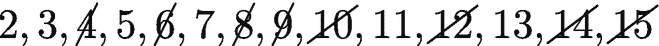

重复该过程，直到达到最大值的一半。这个质数计算在 Java 中实现如下:

```java
static List<Integer> calcPrimesUpTo(final int maxValue)
{
    // initially mark all values as potential prime number
    final boolean[] isPotentiallyPrime = new boolean[maxValue+1];
    Arrays.fill(isPotentiallyPrime, true);

    // run through all numbers starting at 2, optimization only up to half
    for (int i = 2; i <= maxValue / 2; i++)
    {
       if (isPotentiallyPrime[i])
           eraseMultiplesOfCurrent(isPotentiallyPrime, i);
    }

    return buildPrimesList(isPotentiallyPrime);
}

```

划掉或擦除倍数的功能被提取到下面的帮助器方法`eraseMultiplesOfCurrent()`。作为一个技巧，你一方面使用 *i* 的步长，另一方面通过增加起始值来确定第一个倍数。对于初次尝试，带注释的控制台输出可能会有所帮助:

```java
private static void eraseMultiplesOfCurrent(final boolean[] values, final int i)
{
    for (int n = i + i; n < values.length; n = n + i)
    {
        values[n] = false;
        // System.out.println("Eliminating " + n);
    }
}

```

最后，您需要从`boolean[]`中重建一个数字列表，如下所示:

```java
private static List<Integer> buildPrimesList(final boolean[] isPotentiallyPrime)
{
    final List<Integer> primes = new ArrayList<>();
    for (int i = 2; i < isPotentiallyPrime.length; i++)
    {
        if (isPotentiallyPrime[i])
            primes.add(i);
    }
    return primes;
}

```

#### 确认

对于测试，您使用以下显示正确操作的输入。为了提供结果列表，您依赖于`Stream<Arguments>`:

```java
@ParameterizedTest(name = "calcPrimes({0}) = {1}")
@MethodSource("argumentProvider")
void calcPrimesUpTo(int n, List<Integer> expected)
{
    List<Integer> result = Ex04_PrimeNumber.calcPrimesUpTo(n);

    assertEquals(expected, result);
}

static Stream<Arguments> argumentProvider()
{
    return Stream.of(Arguments.of(2, List.of(2)),
                     Arguments.of(3, List.of(2, 3)),
                     Arguments.of(10, List.of(2, 3, 5, 7)),
                     Arguments.of(15, List.of(2, 3, 5, 7, 11, 13)),
                     Arguments.of(25, List.of(2, 3, 5, 7, 11, 13,
                                              17, 19, 23)),
                     Arguments.of(50, List.of(2, 3, 5, 7, 11, 13,
                                              17, 19, 23, 29, 31,
                                              37, 41, 43, 47)));
}

```

### 2.3.5 解决方案 5:素数对(★★✩✩✩)

计算距离为 2(孪生)、4(近亲)和 6(性感)的所有素数对，直到 *n* 的上界。对于双胞胎来说，以下是正确的:

*is prime(n)*&&`isPrime(n`+2

 *#### 例子

对于限值 50，预计会出现以下结果:

<colgroup><col class="tcol1 align-left"> <col class="tcol2 align-left"></colgroup> 
| 

类型

 | 

结果

 |
| --- | --- |
| 双胞胎之一 | 3=5, 5=7, 11=13, 17=19, 29=31, 41=43 |
| 远亲 | 3=7, 7=11, 13=17, 19=23, 37=41, 43=47 |
| 性感的 | 5=11, 7=13, 11=17, 13=19, 17=23, 23=29, 31=37, 37=43, 41=47, 47=53 |

**算法**作为第一步，你需要定义配对的条件。这可以通过`if`语句显式地完成，或者更优雅地通过合适谓词的定义来完成。对于从 2 开始一直到所需上限的所有数字，您必须检查该数字本身以及相应的另一个数字加上 2、4 或 6 是否是质数。为此，您可以调用一个方法`isPrime(int)`，该方法反过来使用之前编写的方法来确定质数。有关孪生素数的更多详细信息，请参见。 [`https://en.wikipedia.org/wiki/Twin_prime`](https://en.wikipedia.org/wiki/Twin_prime) 。

```java
public static void main(final String[] args)
{
    final Predicate<Integer> isTwinPair = n -> isPrime(n) && isPrime(n + 2);
    final Predicate<Integer> isCousinPair = n -> isPrime(n) && isPrime(n + 4);
    final Predicate<Integer> isSexyPair = n -> isPrime(n) && isPrime(n + 6);

    final Map<Integer, Integer> twinPairs = new TreeMap<>();
    final Map<Integer, Integer> cousinPairs = new TreeMap<>();
    final Map<Integer, Integer> sexyPairs = new TreeMap<>();

    for (int i = 1; i < 50; i++)
    {
        if (isTwinPair.test(i))
            twinPairs.put(i, i+2);

        if (isCousinPair.test(i))
            cousinPairs.put(i, i+4);

        if (isSexyPair.test(i))
            sexyPairs.put(i, i+6);
    }

    System.out.println("Twins: " + twinPairs);
    System.out.println("Cousins: " + cousinPairs);
    System.out.println("Sexy: " + sexyPairs);
}

private static boolean isPrime(int n)
{
    // non-optimal call
    return Ex04_PrimeNumber.calcPrimesUpTo(n).contains(n);
}

```

这里显示的实现使用了已经实现的功能，这在原则上是更可取的，但在这种情况下有两个缺点:

1.  每次所有素数都被重新计算，直到给定的最大值。这可以通过只执行一次计算并适当地缓存结果来优化。

2.  目前，这些支票仍然交织在一起。使用只检查一个条件并只返回一个结果的验证函数更清楚。

#### 实施的优化

**漏洞 1:重复调用**首先，你应该只计算一次素数的最大值。在这种情况下，您需要将限制提高 6 倍，以便能够正确映射所有对:

```java
public static void calcPrimePairs(final int maxValue)
{
    final List<Integer> primes = Ex04_PrimeNumber.calcPrimesUpTo(maxValue + 6);

    final Predicate<Integer> isTwinPair = n -> isPrime(primes, n) &&
                                               isPrime(primes, n + 2);
    final Predicate<Integer> isCousinPair = n -> isPrime(primes, n) &&
                                                 isPrime(primes, n + 4);
    final Predicate<Integer> isSexyPair = n -> isPrime(primes, n) &&
                                               isPrime(primes, n + 6);

    final Map<Integer, Integer> twinPairs = new TreeMap<>();
    final Map<Integer, Integer> cousinPairs = new TreeMap<>();
    final Map<Integer, Integer> sexyPairs = new TreeMap<>();

    for (int i = 1; i < maxValue; i++)
    {
        if (isTwinPair.test(i))
            twinPairs.put(i, i + 2);

        if (isCousinPair.test(i))
            cousinPairs.put(i, i + 4);

        if (isSexyPair.test(i))
            sexyPairs.put(i, i + 6);
    }

    System.out.println("Twins: " + twinPairs);
    System.out.println("Cousins: " + cousinPairs);
    System.out.println("Sexy: " + sexyPairs);
}

```

在该方法开始时，计算素数被执行一次。因此，您获得了显著的性能改进。

最后，将质数检查转移到以下方法:

```java
static boolean isPrime(final List<Integer> primes, final int n)
{
    return primes.contains(n);
}

```

漏洞 2:不清晰的程序结构你的目标是编写更多通用的方法。您已经创建了基本的构建块。但是，对线对的确定应移到方法`calcPairs()`中。这样，你就可以更清楚、更容易理解地把它写成如下:

```java
public static void calcPrimePairsImproved(final int maxValue)
{
    final Map<Integer, Integer> twinPairs = calcPairs(maxValue, 2);
    final Map<Integer, Integer> cousinsPairs = calcPairs(maxValue, 4);
    final Map<Integer, Integer> sexyPairs = calcPairs(maxValue, 6);

    System.out.println("Twins: " + twinPairs);
    System.out.println("Cousins: " + cousinsPairs);
    System.out.println("Sexy: " + sexyPairs);
}

static Map<Integer, Integer> calcPairs(final int maxValue, final int distance)
{
    final List<Integer> primes =
                        Ex04_PrimeNumber.calcPrimesUpTo(maxValue + distance);

    final Map<Integer, Integer> resultPairs = new TreeMap<>();
    for (int n = 1; n < maxValue; n++)
    {
        if (isPrime(primes, n) && isPrime(primes, n + distance))
        {
            resultPairs.put(n, n + distance);
        }
    }
    return resultPairs;
}

```

这种转换也为能够用单元测试来测试整个事情打下了基础。

#### 确认

如果调用最大值为 50 的方法，将得到以下结果:

```java
Twins: {3=5, 5=7, 11=13, 17=19, 29=31, 41=43}
Cousins: {3=7, 7=11, 13=17, 19=23, 37=41, 43=47}
Sexy: {5=11, 7=13, 11=17, 13=19, 17=23, 23=29, 31=37, 37=43, 41=47, 47=53}

```

现在，让我们创建另一个单元测试，每个特例使用一个测试方法:

```java
int maxValue = 50;

@ParameterizedTest(name = "primepairs({0}, {1}) = {2}")
@MethodSource("distanceAndExpectd")
void calcPairs(int distance, String info,
               Map<Integer, Integer> expected)
{
    var result = Ex05_PrimePairs_Improved.calcPairs(maxValue, distance);

    assertEquals(expected, result);
}

private static Stream<Arguments> distanceAndExpectd()
{
    return Stream.of(Arguments.of(2, "twin",
                                  Map.of(3, 5, 5, 7, 11, 13, 17,
                                         19, 29, 31, 41, 43)),
                     Arguments.of(4, "cousin",
                                  Map.of(3, 7, 7, 11, 13, 17,
                                         19, 23, 37, 41, 43, 47)),
                     Arguments.of(6, "sexy",
                                  Map.of(5, 11, 7, 13, 11, 17, 13,
                                         19, 17, 23, 23, 29, 31, 37,
                                         37, 43, 41, 47, 47, 53)));
}

```

### 2.3.6 解决方案 6:校验和(★★✩✩✩)

创建方法`int calcChecksum(String)`，该方法对以字符串形式给出的任意长度的数字的校验和执行以下基于位置的计算，其中 *n* 位被建模为*z*T5】1 到*z*T9】n:

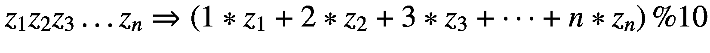

#### 例子

<colgroup><col class="tcol1 align-left"> <col class="tcol2 align-left"> <col class="tcol3 align-left"></colgroup> 
| 

投入

 | 

总额

 | 

结果

 |
| --- | --- | --- |
| “11111” | 1 + 2 + 3 + 4 + 5 = 15 | 15 % 10 = 5 |
| “87654321” | 8 + 14 + 18 + 20 + 20 + 18 + 14 + 8 = 120 | 120 % 10 = 0 |

**算法**从前面到最后一个位置遍历所有数字，提取给定位置的数字，将其数值乘以当前位置。把这个加到总数上。最后，模运算将总和映射为一个数字:

```java
static int calcChecksum(final String input)
{
    int crc = 0;
    for (int i = 0; i < input.length(); i++)
    {
        final char currentChar = input.charAt(i);

        if (Character.isDigit(currentChar))
        {
            final int pos = i + 1;
            final int value = (currentChar - '0') * pos;

            crc += value;
        }
        else
            throw new IllegalArgumentException("illegal char: " + currentChar);
    }
    return crc % 10;
}

```

**验证**测试时，使用以下显示正确操作的输入:

```java
@ParameterizedTest(name="checksum({0}) = {1}")
@CsvSource({ "11111, 5", "22222, 0", "111111, 1",
"12345678, 4", "87654321, 0" })
void testCalcChecksum(String input, int expected)
{
    final int result = Ex10_CheckSumCalculator.calcChecksum(input);

    assertEquals(expected, result);
}

```

### 2.3.7 解决方案 7:罗马数字(★★★★✩)

#### 解答 7a:罗马数字→十进制数字(★★★✩✩)

编写方法`int fromRomanNumber(String)`,从文本有效的罗马数字计算相应的十进制数。 <sup>[5](#Fn5)</sup>

#### 例子

<colgroup><col class="tcol1 align-left"> <col class="tcol2 align-left"></colgroup> 
| 

阿拉伯语

 | 

古罗马的

 |
| --- | --- |
| Seventeen | “十七” |
| Four hundred and forty-four | " CDXLIV " |
| One thousand nine hundred and seventy-one | " MCMLXXI " |
| Two thousand and twenty | " MMXX " |

**算法**您必须特别注意第 2.1.1 节中描述的加法规则:每当一个较大的字符位于一个较小的字符之前时，通常通过从左到右将各个数字的值相加来获得相关值。但是，如果一个较小的数字字符在一个较大的数字字符之前，则相应的值会被减去。

有了这些知识，您可以从右到左遍历字符，并在查找映射中查找相关的值。为了决定是加还是减，你要记住最后一个相关的字符。

```java
static int fromRomanNumber(final String romanNumber)
{
    int value = 0;
    int lastDigitValue = 0;

    for (int i = romanNumber.length() - 1; i >= 0; i−)
    {
        final char romanDigit = romanNumber.charAt(i);
        final int digitValue = valueMap.getOrDefault(romanDigit, 0);

        final boolean addMode = digitValue >= lastDigitValue;
        if (addMode)
        {
            value += digitValue;
            lastDigitValue = digitValue;
        }
        else
            value −= digitValue;
    }
    return value;
}
static Map<Character, Integer> valueMap =
                               Map.of('I', 1, 'V', 5, 'X', 10, 'L', 50,
                                      'C', 100, 'D', 500, 'M', 1000);

```

#### 解决方案 7b:十进制数字→罗马数字(★★★★✩)

编写将十进制数字转换成(有效的)罗马数字的方法`String toRomanNumber(int)`。

**算法**当将十进制数字转换为罗马数字时，您再次使用映射。您按降序对其进行排序，使最大值(即 1000)位于开头。当前数值除以该因子。这就产生了这个值需要重复的次数。现在余数由模决定。重复该过程，直到检查完所有值，并且余数大于 0。在下文中，针对数字 7 示例性地示出了该过程:

```java
7 => 7 / 1000 => 0 => 0 x 'M'
         ...
         7 / 5 = 1 => 1 x 'V'
         7 % 5 = 2
         2 / 1 = 2 => 2 x 'I'
         2 % 1 = 0
    => 'VII'

```

该过程在 Java 中实现如下:

```java
static String toRomanNumber(final int value)
{
    String result = "";
    int remainder = value;

    // descending order
    final Comparator<Integer> reversed = Comparator.reverseOrder();
    final Map<Integer, String> sortedIntToRomanDigit = new TreeMap<>(reversed);
    sortedIntToRomanDigit.putAll(intToRomanDigitMap);

    // start with largest value
    var it = sortedIntToRomanDigit.entrySet().iterator();
    while (it.hasNext() && remainder > 0)
    {
       final Map.Entry<Integer, String> entry = it.next();

       final int multiplier = entry.getKey();
       final char romanDigit = entry.getValue();

       final int times = remainder / multiplier;
       remainder = remainder % multiplier;

       result += repeatCharSequence(romanDigit, times);
    }
    return result;
}
static Map<Integer, String> intToRomanDigitMap =
                            Map.of(1, "I", 5, "V", 10, "X", 50, "L",
                                   100, "C", 500, "D", 1000, "M");

```

然而，这种转换还不是 100%正确的，因为它不遵守三的规则。相反，它将数字重复四次。

要解决这个问题，您可以实现特殊的处理方法，这些方法仅在下面有所提示:

```java
final int multiplier = entry.getKey();
final char romanDigit = entry.getValue();

if (remainder >= 900 && romanDigit == 'D')
{
    result += "CM";
    remainder -= 900;
}
// ...
else if (remainder >= 4 && romanDigit == 'I')
{
    result += "IV";
    remainder -= 4;
}
else
{
    final int times = remainder / multiplier;
    remainder = remainder % multiplier;
    result += repeatCharSequence(romanDigit, times);
}

```

这很快变得令人困惑。为特殊情况插入进一步的查找值更加优雅。然而，您不再调用`of()`方法，因为它们最多只定义了 10 个参数对。

```java
static Map<Integer, String> intToRomanDigitMap = new TreeMap<>()
{{
     put(1, "I");
     put(4, "IV");
     put(5, "V");
     put(9, "IX");
     put(10, "X");
     put(40, "XL");
     put(50, "L");
     put(90, "XC");
     put(100, "C");
     put(400, "CD");
     put(500, "D");
     put(900, "CM");
     put(1000, "M");
}};

```

Hint: Repeating Character Sequences

要重复字符序列，可以使用 Java 11 以后的`String.repeat()`方法。对于较旧的 Java 版本，这个助手方法是合适的:

```java
static String repeatCharSequence(final String value, final int times)
{
    final StringBuilder result = new StringBuilder();
    for (int i = 0; i < times; i++) result.append(value);

    return result.toString();
}

```

#### 确认

让我们从显示正确转换的不同值开始单元测试，特别是包括示例中的四个值 17、444、1971 和 2020:

```java
@ParameterizedTest(name = "fromRomanNumber(''{1}'') => {0}")
@CsvSource({ "1, I", "2, II", "3, III", "4, IV", "5, V", "7, VII", "9, IX",
             "17, XVII", "40, XL", "90, XC", "400, CD", "444, CDXLIV", "500, D",
             "900, CM", "1000, M", "1666, MDCLXVI", "1971, MCMLXXI",
             "2018, MMXVIII", "2019, MMXIX", "2020, MMXX", "3000, MMM"})
void fromRomanNumber(int arabicNumber, String romanNumber)
{
    int result = Ex06_RomanNumbers.fromRomanNumber(romanNumber);

    assertEquals(arabicNumber, result);
}

```

现在让我们来看看反向测试是如何完成的:

```java
@ParameterizedTest(name = "toRomanNumber(''{0}'') => {1}")
@CsvSource({ "1, I", "2, II", "3, III", "4, IV", "5, V", "7, VII", "9, IX",
             "17, XVII", "40, XL", "90, XC", "400, CD", "444, CDXLIV", "500, D",
             "900, CM", "1000, M", "1666, MDCLXVI", "1971, MCMLXXI",
             "2018, MMXVIII", "2019, MMXIX", "2020, MMXX", "3000, MMM"})
void toRomanNumber(int arabicNumber, String romanNumber)
{
    String result = Ex06_RomanNumbers.toRomanNumber(arabicNumber);

    assertEquals(romanNumber, result);
}

```

这里您会遇到`@CsvSource`中的规范的重复，因为它被认为是双向映射。为了避免重复，您还可以从文件中导入值:

```java
@ParameterizedTest(name = "toRomanNumber(''{0}'') => {1}")
@CsvFileSource(resources = "arabicroman.csv", numLinesToSkip = 1)
void toRomanNumber(int arabicNumber, String romanNumber)
{
    String result = Ex06_RomanNumbers.toRomanNumber(arabicNumber);

    assertEquals(romanNumber, result);
}

```

CSV 文件将如下所示:

```java
arabic,roman 1, I
2, II
3, III
4, IV
5, V
7, VII
9, IX
17, XVII
40, XL
90, XC
...

```

### 2.3.8 解答 8:组合学(★★✩✩✩)

#### 解 8a:计算*a*<sup>2</sup>+*b*<sup>2</sup>=*c*<sup>2</sup>

计算值 *a* 、 *b* 和 *c* 的所有组合(每个组合从 1 开始且小于 100)，以下公式成立:


**算法**蛮力解法使用三个嵌套循环，然后检查是否满足上述公式。对于平方，简单乘法比使用注释中暗示的`Math.pow()`提供了更好的可读性:

```java
// brute force, three nested loops
for (int a = 1; a < 100; a++)
{
    for (int b = 1; b < 100; b++)
    {
        for (int c = 1; c < 100; c++)
        {
            if (a * a + b * b == c * c)
            // if ((Math.pow(a, 2)) + Math.pow(b, 2) == Math.pow(c, 2))
            {
                System.out.println("a = " + a + " / b = " + b + " / c = " + c);
            }
        }
    }
}

```

##### 奖励:减少 ( *n* <sup>3</sup> )的*o*(*n*<sup>2</sup>)(★★★✩✩)的运行时间

你看到上解中有三个嵌套的循环，导致运行时间为 *O* ( *n* <sup>3</sup> )。现在我们把这个简化为*O*(*n*T10】2)。为此，应用以下转换(解析为 *c* ):

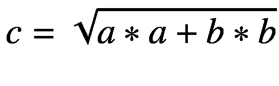

基于这个方程到 *c* 的变换或求解，计算平方根，然后验证公式。此外，你必须确保 *c* 低于 100。

```java
public void solveQuadratic()
{
    for (int a = 1; a < 100; a++)
    {
        for (int b = 1; b < 100; b++)
        {
            final int c = (int) Math.sqrt(a * a + b * b);
            if (c < 100 && a * a + b * b == c * c)
            {
                System.out.println("a = " + a + " / b = " + b + " / c = " + c);
            }
        }
    }
}

```

#### 确认

对于测试，您调用`solveQuadratic()`方法并对一些值执行计算:

```java
jshell> solveQuadratic()
a = 3 / b = 4 / c = 5
a = 4 / b = 3 / c = 5
a = 5 / b = 12 / c = 13
a = 6 / b = 8 / c = 10
a = 7 / b = 24 / c = 25
a = 8 / b = 6 / c = 10
a = 8 / b = 15 / c = 17
a = 9 / b = 12 / c = 15
a = 9 / b = 40 / c = 41
a = 10 / b = 24 / c = 26
a = 11 / b = 60 / c = 61
a = 12 / b = 5 / c = 13
a = 12 / b = 9 / c = 15
a = 12 / b = 16 / c = 20

a = 12 / b = 35 / c = 37
...

```

Note: Why Does the Computation Work at all?

简单地看一下转换，人们可能会奇怪为什么计算不能对所有值进行成功的比较。事实上，这完全是数学上的情况，因为你是从 *a* 和 *b* 推导出 *c* 。但是，您也可以使用强制转换来转换到一个`int`:

```java
final int c = (int) Math.sqrt(a * a + b * b);
if (c < 100 && a * a + b * b == c * c)
{
    System.out.println("a = " + a + " / b = " + b + " / c = " + c);
}

```

因此，十进制数字被截断。这反过来导致比较只对某些值成功。

#### 解 8b:计算*a*<sup>2</sup>+*b*<sup>2</sup>=*c*<sup>2</sup>+*d*<sup>2</sup>

计算值 *a* 、 *b* 、 *c* 和 *d* 的所有组合(每个组合从 1 开始且小于 100)，以下公式成立:


**算法**类比上一部分的练习，蛮力解法是使用四个嵌套循环，然后检查是否满足上述公式。同样，简单的乘法比使用`Math.pow()`更具可读性:

```java
public void solveCubicEquationSimple()
{
    // brute force, four nested loops
    for (int a = 1; a < 100; a++)
    {
         for (int b = 1; b < 100; b++)
         {
             for (int c = 1; c < 100; c++)
             {
                 for (int d = 1; d < 100; d++)
                 {
                      if (a * a + b * b == c * c + d * d)
                      {
                          System.out.println("a = " + a + " / b = " + b +
                                             " / c = " + c + " / d = " + d);
                      }
                 }
             }
         }
    }
}

```

#### 奖励:减少(*n*T4【4】t5)的*o*(*n*T10】3)(★★★✩✩)的运行时间

显而易见，该解决方案使用了四个嵌套循环，运行时间为 *O* ( *n* <sup>4</sup> )。现在你要把这个减少到*O*(*n*T10】3)。为此，您需要使用转换。首先，你分离到 *d* ，然后你分解到 *d* :

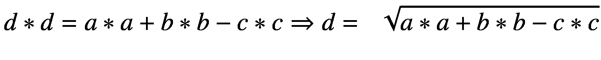

基于这个等式到 *d* 的变换或解析，您可以计算平方根，然后验证公式。此外，您必须确保该值不为负，并且得到的 *d* 小于 100。

```java
private static void solveCubicEquation()
{
    for (int a = 1; a < 100; a++)
    {
        for (int b = 1; b < 100; b++)
        {
            for (int c = 1; c < 100; c++)
            {
                final int value = a * a + b * b - c * c;
                if (value > 0)
                {
                    final int d = (int) Math.sqrt(value);
                    if (d < 100 && a * a + b * b == c * c + d * d)
                    {
                        System.out.println("a = " + a + " / b = " + b +
                                           " / c = " + c + " / d = " + d);
                    }
                }
            }
        }
    }
}

```

#### 确认

对于测试，您使用方法调用并检查一些值:

```java
jshell> solveCubicEquation()
a = 1 / b = 1 / c = 1 / d = 1
a = 1 / b = 2 / c = 1 / d = 2
a = 1 / b = 2 / c = 2 / d = 1
a = 1 / b = 3 / c = 1 / d = 3
a = 1 / b = 3 / c = 3 / d = 1
...

```

### 2.3.9 解决方案 9: Armstrong 数字(★★✩✩✩)

这个练习处理三位数的阿姆斯特朗数。根据定义，这些数字的数字 *x* 、 *y* 和 *z* 从 1 到 9 满足以下等式:

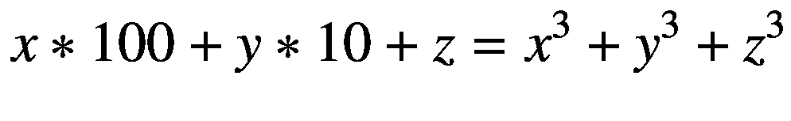

编写方法`List<Integer> calcArmstrongNumbers()`计算出 *x* 、 *y、 *z* 的所有阿姆斯特朗数(每个< 10)。*

#### 例子


**算法**使用三个嵌套循环遍历三位数的所有组合。使用公式*x*∫100+*y*∫10+*z*根据位置计算数值。此外，计算每个数字的三次幂，将它们相加，并检查总和是否与数字匹配。

```java
static List<Integer> calcArmstrongNumbers()
{
    final List<Integer> results = new ArrayList<>();

    for (int x = 1; x < 10; x++)
    {
        for (int y = 1; y < 10; y++)
        {
            for (int z = 1; z < 10; z++)
            {
                final int numericValue = x * 100 + y * 10 + z;
                final int cubicValue = (int) (Math.pow(x, 3) + Math.pow(y, 3) +
                                              Math.pow(z, 3));

                if (numericValue == cubicValue)
                    results.add(numericValue);
            }
        }
    }
    return results;
}

```

Note: Why don’t the Loops Start at 0?

虽然您也可以使用值 0，但这对于第一个位置来说并不常见，并且经常用于表示八进制数，这也是您在这里不使用它的原因。

#### 确认

要进行测试，您需要调用上述方法，并检查作为示例给出的两个值组合是否包含在结果列表中:

```java
@Test
public void calcArmstrongNumbers()
{
     final List<Integer> result = Ex09_SpecialNumbers.calcArmstrongNumbers();

     assertEquals(List.of(153, 371), result);
}

```

#### 奖金(澳门币)

找到带有 lambdas 的通用版本，然后尝试以下三个公式:

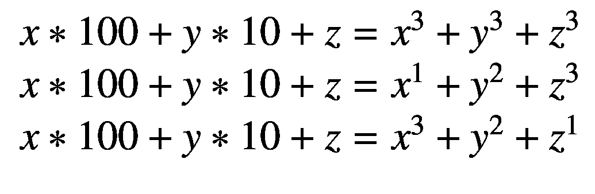

**算法**代替具体的计算，你通过一个函数接口`CubicFunction`添加一个调用进行计算:

```java
static List<Integer> calcNumbers(final CubicFunction func)
{
    final List<Integer> results = new ArrayList<>();

    for (int x = 1; x < 10; x++)
    {
        for (int y = 1; y < 10; y++)
        {
            for (int z = 1; z < 10; z++)
            {
                final int numericValue = x * 100 + y * 10 + z;
                final int cubicValue = func.calc(x, y, z);

                if (numericValue == cubicValue)
                    results.add(numericValue);
            }
        }
    }
    return results;
}

```

现在定义一个合适的函数接口来抽象计算:

```java
@FunctionalInterface
interface CubicFunction
{
    int calc(int x, int y, int z);
}

```

因此，计算可以表示为λ:

```java
CubicFunction special = (x, y, z) -> (int) (Math.pow(x, 3) +
                                            Math.pow(y, 3) +
                                            Math.pow(z, 3));

```

基于这个更通用的解决方案，您现在可以毫不费力地尝试计算规则的其他变体:

```java
CubicFunction special2 = (x, y, z) -> (int) (Math.pow(x, 1) +
                                             Math.pow(y, 2) +
                                             Math.pow(z, 3));

```

同样，您最终定义了以下内容:

```java
CubicFunction special3 = (x, y, z) -> (int) (Math.pow(x, 3) +
                                             Math.pow(y, 2) +
                                             Math.pow(z, 1));

```

#### 确认

为了进行测试，您使用不同的计算规则调用上述方法，并查找 Armstrong 数的计算规则，看作为示例给出的两个值组合是否包含在结果列表中:

```java
jshell> CubicFunction special = (x, y, z) -> (int) (Math.pow(x, 3) +
   ...>                                             Math.pow(y, 3) +
   ...>                                             Math.pow(z, 3));
   ...> List<Integer> calcSpecialNumbers = calcNumbers(special); calcSpecialNumbers ==> [153, 371]

jshell> CubicFunction special2 = (x, y, z) -> (int) (Math.pow(x, 1) +
   ...>                                              Math.pow(y, 2) +
   ...>                                              Math.pow(z, 3));
   ...> List<Integer> specialNumbers2 = calcNumbers(special2); specialNumbers2 ==> [135, 175, 518, 598]

jshell> CubicFunction special3 = (x, y, z) -> (int) (Math.pow(x, 3) +
   ...>                                              Math.pow(y, 2) +
   ...>                                              Math.pow(z, 1));
jshell> List<Integer> specialNumbers3 = calcNumbers(special3) specialNumbers3 ==> []

```

### 2.3.10 解决方案 10:最大变化计算器(★★★★✩)

假设你收集了不同价值的硬币。编写方法`calcMaxPossibleChange(values)`,确定对于正整数，从值 1 开始，用它可以无缝地*产生多少数量。结果应该是返回最大值。*

 *#### 例子

<colgroup><col class="tcol1 align-left"> <col class="tcol2 align-left"> <col class="tcol3 align-left"></colgroup> 
| 

投入

 | 

可能的值

 | 

最高的

 |
| --- | --- | --- |
| one | one | one |
| 1, 1 | 1, 2 | Two |
| 1, 5 | one | one |
| 1, 2, 4 | 1, 2, 3, 4, 5, 6, 7 | seven |
| 1, 2, 3, 7 | 1, 2, 3, 4, 5, 6, 7, 8, 9, 10, 11, 12, 13 | Thirteen |
| 1, 1, 1, 1, 5, 10, 20, 50 | 1, 2, 3, 4, 5, 6, ... , 30, ... , 39 | Thirty-nine |

**算法**你可以尝试通过计算所有数字和排列的映射来解决这个问题，但这很快就会变得复杂。让我们考虑另一种方法。

<colgroup><col class="tcol1 align-left"> <col class="tcol2 align-left"> <col class="tcol3 align-left"></colgroup> 
| 

投入

 | 

可能的值

 | 

最高的

 |
| --- | --- | --- |
| 1, 2, 3, 7 | 1, 2, 3, 4, 5, 6, 7, 8, 9, 10, 11, 12, 13 | Thirteen |
| 1, 2, 3, 8 | 1, 2, 3, 4, 5, 6, => _ <= , 8, 9, 10, 11, 12, 13, 14 | six |

如果你看一看这两个例子，你可能会对情况 1 *、* 2 *、* 3 *、* 7 和 1 *、* 2 *、* 3 *、* 8 认识到果断简化计算的线索。不是总是计算所有的排列，然后检查数字行中的间隙，这里用下划线(_)表示，而是可以从第一个数字开始，总是将这些数字加到前面的总和上，并重复这个过程，直到 *nextNumber > sum* + 1 变为真。

让我们将此应用于 Java。首先，对输入值进行排序。首先假设最初没有什么需要改变的，所以 *maxPossibleChange* = 0。现在检查每个值的以下条件。如果*当前值> maxPossibleChange* + 1 成立，那么就不可能改变。否则，将当前值加到 *maxPossibleChange* 中。重复此操作，直到处理完所有值或满足终止条件。这导致了以下实现:

```java
static int calcMaxPossibleChange(final List<Integer> values)
{
    // wrapping necessary if input values are generated by List.of()
    final List<Integer> sortedNumbers = new ArrayList<>(values);
    sortedNumbers.sort(Integer::compareTo);

    int maxPossibleChange = 0;

    for (int currentValue : sortedNumbers)
    {
        if (currentValue > maxPossibleChange + 1)
            break;

        maxPossibleChange += currentValue;
    }

    return maxPossibleChange;
}

```

#### 确认

对于测试，您使用以下输入，这些输入显示了正确的操作:

```java
@ParameterizedTest(name = "calcMaxPossibleChange({0}) = {1}")
@MethodSource("inputsAndMaxChange")
void calcMaxPossibleChange(List<Integer> values, int expected)
{
     int result = Ex11_MaxChangeCalculator.calcMaxPossibleChange(values);

     assertEquals(expected, result);
}

private static Stream<Arguments> inputsAndMaxChange()
{
     return Stream.of(Arguments.of(List.of(1), 1),
                      Arguments.of(List.of(1,1), 2),
                      Arguments.of(List.of(1, 5), 1),
                      Arguments.of(List.of(1, 2, 4), 7),
                      Arguments.of(List.of(1, 2, 3, 7), 13),
                      Arguments.of(List.of(1, 2, 3, 8), 6),
                      Arguments.of(List.of(1, 1, 1, 1, 5, 10, 20, 50), 39));
}

```

### 2.3.11 解决方案 11:相关数字(★★✩✩✩)

如果两个数*n*T2 1 和*n*T6】2 的约数之和等于另一个数，则称这两个数为朋友:

*sum(约数(n*<sub>1</sub>)=*n*<sub>2</sub>

*sum(约数(n*<sub>2</sub>)=*n*<sub>1</sub>

编写方法`Map<Integer, Integer> calcFriends(int)`来计算所有朋友的数量，直到达到一个传递的最大值。

#### 例子

<colgroup><col class="tcol1 align-left"> <col class="tcol2 align-left"></colgroup> 
| 

投入

 | 

除数

 |
| --- | --- |
| ∑( *约数* (220)) = 284 | div(220) = 1，2，4，5，10，11，20，22，44，55，110 |
| ∑( *约数* (284)) = 220 | div(284) = 1，2，4，71，142 |
| ∑( *约数* (1184)) = 1210 | div(1184) = 1，2，4，8，16，32，37，74，148，296，592 |
| ∑( *约数* (1210)) = 1184 | div(1210) = 1，2，5，10，11，22，55，110，121，242，605 |

**算法**通过确定每个数字的约数和总和，很容易检查两个数字是否是朋友。现在约数可以由这个和确定，然后加在一起。如果第二个和等于原来的数，那么这两个数就是朋友。

```java
static Map<Integer, Integer> calcFriends(final int max)
{
    final Map<Integer, Integer> friends = new TreeMap<>();

    for (int number= 2; number < max; number++)
    {
        final List<Integer> divisors1 = findProperDivisors(number);
        final int sumDiv1 = sum(divisors1);

        final List<Integer> divisors2 = findProperDivisors(sumDiv1);
        final int sumDiv2 = sum(divisors2);

        if (number == sumDiv2 && sumDiv1 != sumDiv2)
        {
            friends.put(number, sumDiv1);
        }
    }

    return friends;
}

static int sum(final List<Integer> values)
{
    return values.stream().mapToInt(n -> n).sum();
}

```

结果按`TreeMap<K,V>`排序。为了实现，您还可以调用简介中已经介绍过的`findProperDivisors()`方法来查找所有的真除数。同样，您使用 Stream API 进行求和，而不是对所有元素进行循环的自定义实现。你再一次看到了将软件分解成更小的独立功能的好处。

#### 确认

对于测试，您使用以下输入，这些输入显示了正确的操作。在这种情况下，再次使用`Stream<Arguments>`，提供最大值和两个数字的映射:

```java
@ParameterizedTest(name = "calcFriends({0}) = {1}")
@MethodSource("upperBoundAndExpectedFriends")
void calcFriends(int maxValue, Map<Integer, Integer> expected)
{
    Map<Integer, Integer> result = Ex12_BefreundeteZahlen.calcFriends(maxValue);

    assertEquals(expected, result);
}

private static Stream<Arguments> upperBoundAndExpectedFriends()
{
    return Stream.of(Arguments.of(250, Map.of(220, 284)),
                     Arguments.of(300, Map.of(220, 284,
                                              284, 220)),
                     Arguments.of(2_000, Map.of(220, 284,
                                                284, 220,
                                                1184, 1210,
                                                1210,1184)));
}

```

### 2.3.12 解决方案 12:质因数分解(★★★✩✩)

任何大于 1 的自然数都可以表示为素数的乘积。记住 2 也是质数的事实。编写方法`List<Integer> calcPrimeFactors(int)`,返回一个素数列表，这些素数的乘法运算产生所需的数。

#### 例子

<colgroup><col class="tcol1 align-left"> <col class="tcol2 align-left"> <col class="tcol3 align-left"></colgroup> 
| 

投入

 | 

主要因素

 | 

结果

 |
| --- | --- | --- |
| eight | 2 * 2 * 2 | [2, 2, 2] |
| Fourteen | 2 * 7 | [2, 7] |
| forty-two | 2 * 3 * 7 | [2, 3, 7] |
| One thousand one hundred and fifty-five | 3 * 5 * 7 * 11 | [3, 5, 7, 11] |
| Two thousand two hundred and twenty-two | 2 * 11 * 101 | [2, 11, 101] |

**算法**只要数字是偶数且大于 2，就从数字除以 2 开始。然后，在某个时候，你会得到一个奇数。如果这是 1，就完成了(参见数字 8 的情况)。否则，你检查奇数是否是质数，并收集它。在这种情况下，您就完成了(例如，上面对于数字 14 的描述)。如果没有，就要进一步拆分奇数。我们以 50 为例。首先，你除以 2，所以剩下 25，这不是一个质数。为此，您要检查所有的质数是否代表除数。你继续这个过程，直到你达到数字 1，这意味着所有的除数都已收集。更多信息，请参见 [`https://en.wikipedia.org/wiki/Integer_factorization`](https://en.wikipedia.org/wiki/Integer_factorization) 。

```java
static List<Integer> calcPrimeFactors(final int n)
{
    final List<Integer> allPrimes = Ex04_PrimeNumber.calcPrimesUpTo(n);
    final List<Integer> primeFactors = new ArrayList<>();

    int remainingValue = n;

    // as long as even, divide by 2 again and again
    while (remainingValue % 2 == 0 && remainingValue >= 2)
    {
        remainingValue = remainingValue / 2;
        primeFactors.add(2);
    }

    // check remainder for prime
    if (isPrime(allPrimes, remainingValue))
    {
        primeFactors.add(remainingValue);
    }
    else
    {
        // remainder is not a prime number, further check
        while (remainingValue > 1)
        {
            for (final Integer currentPrime : allPrimes)
            {
                if (remainingValue % currentPrime == 0)
                {
                    remainingValue = remainingValue / currentPrime;
                    primeFactors.add(currentPrime);
                    // start again from the beginning, because every divisor
                    // may occur more than once
                    break;
                }
            }
        }
    }

    return primeFactors;
}

static boolean isPrime(final List<Integer> allPrimes, final int n)
{
    return allPrimes.contains(n);
}

```

**优化算法**如果你看看刚刚开发的算法，你可能会被所有的特殊处理所困扰。稍加思考，你可能会得出结论，你不需要单独检查数字 2，因为它也是一个质数。因此，这被`while`循环所覆盖。代替重复检查相同数字的`break`,可以用一个`while`循环以一种更具风格的方式来表达。有了这些初步的考虑，您会得到以下实现:

```java
static List<Integer> calcPrimeFactorsOptimized(final int n)
{
    final List<Integer> allPrimes = calcPrimesUpTo(n);
    final List<Integer> primeFactors = new ArrayList<>();

    int remainingValue = n;
    while (remainingValue > 1)
    {
        for (final Integer currentPrime : allPrimes)
        {
            while (remainingValue % currentPrime == 0)
            {
                remainingValue = remainingValue / currentPrime;
                primeFactors.add(currentPrime);
             }
         }
    }
    return primeFactors;
}

```

#### 确认

对于测试，您使用以下输入，这些输入显示了正确的操作:

```java
@ParameterizedTest(name = "calcPrimeFactors({0}) = {1}")
@MethodSource("valueAndPrimeFactors")
void calcPrimeFactors(int value, List<Integer> expected)
{
    var result = Ex13_PrimeFactors.calcPrimeFactors(value);

    assertEquals(expected, result);
}

@ParameterizedTest(name = "calcPrimeFactorsOptimized({0}) = {1}")
@MethodSource("valueAndPrimeFactors")
void calcPrimeFactorsOpt(final int value, final List<Integer> expected)
{
    var result = Ex13_PrimeFactors.calcPrimeFactorsOptimized(value);

    assertEquals(expected, result);
}

private static Stream<Arguments> valueAndPrimeFactors()
{
    return Stream.of(Arguments.of(8, List.of(2, 2, 2)),
                     Arguments.of(14, List.of(2, 7)),
                     Arguments.of(42, List.of(2, 3, 7)),
                     Arguments.of(1155, List.of(3, 5, 7, 11)),
                     Arguments.of(2222, List.of(2, 11, 101)));
}

```

<aside aria-label="Footnotes" class="FootnoteSection" epub:type="footnotes">Footnotes [1](#Fn1_source)

作为一个优化，你实际上只需要计算到根。我在*可能的优化*实用技巧中简要讨论了这一点。

  [2](#Fn2_source)

有趣的是，罗马数字中不存在 0 这个值。

  [3](#Fn3_source)

对于语法上无效的罗马数字，比如 IXD，可以通过连续两次的减法规则计算出错误的结果，这里是 489:0*-*1*-*10+500。

  [4](#Fn4_source)

请查阅我的书*Java–die Neuerungen in Version 9 bis 14:Modularisierung，Syntax-und API-Erweiterungen*【Ind20b】了解当前 Java 版本中许多相关创新的概述。

  [5](#Fn5_source)

对于语法上无效的罗马数字，比如 IXD，可以通过连续两次的减法规则计算出错误的结果，这里是 489:0*-*1*-*10+500。

 </aside>***