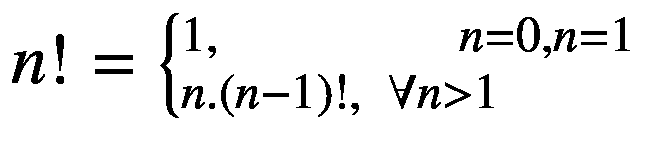
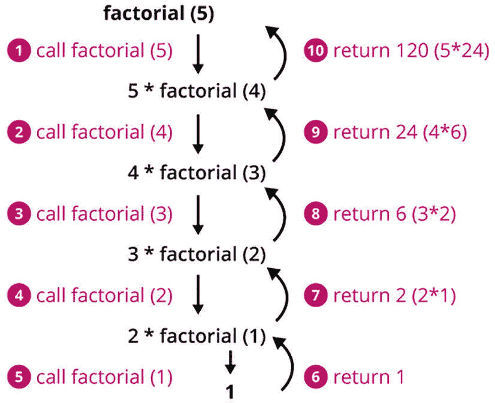
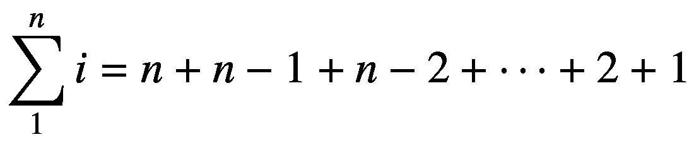
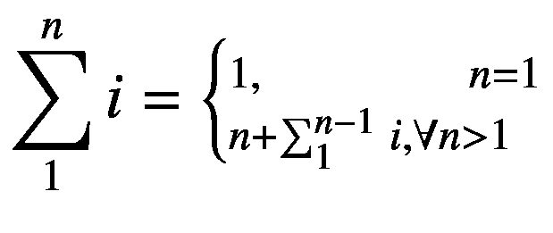
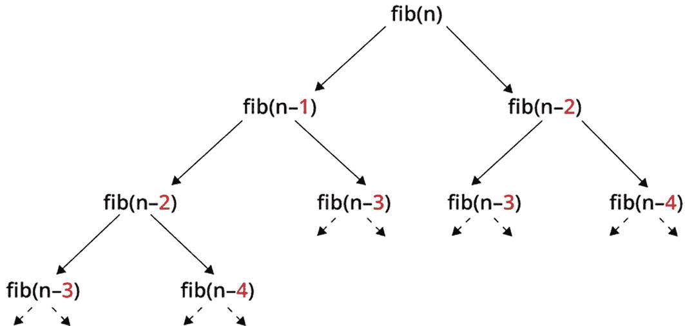
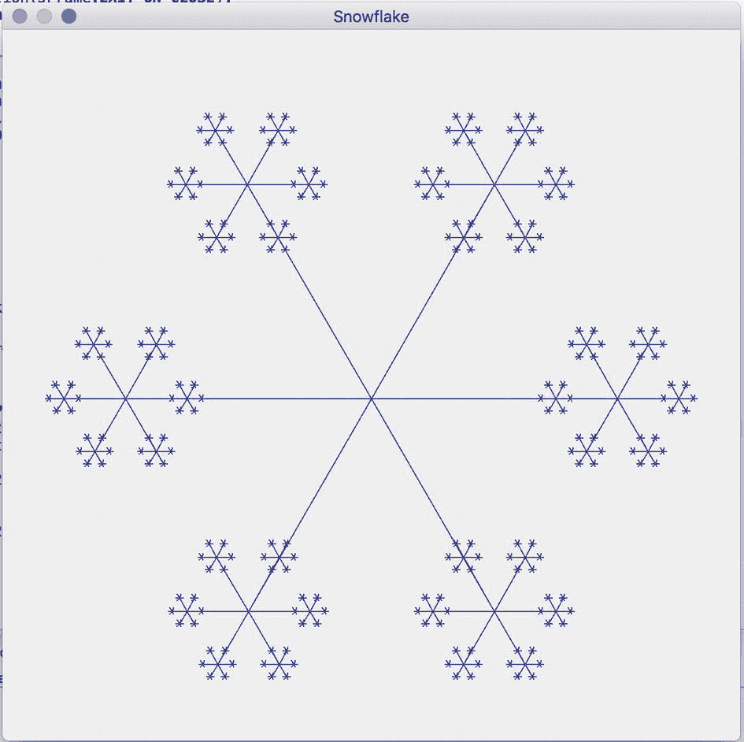
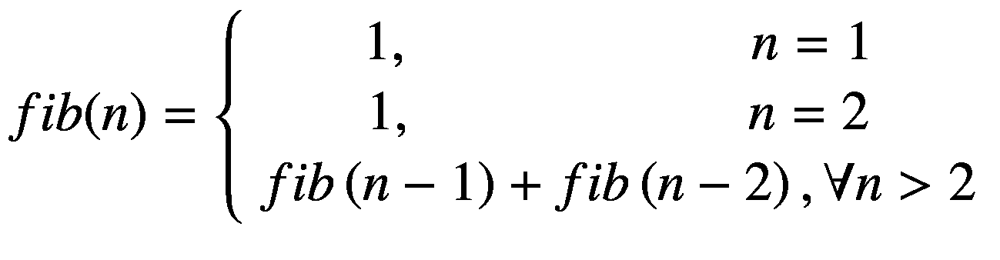
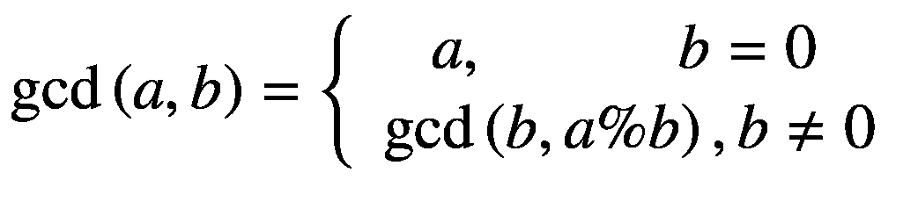
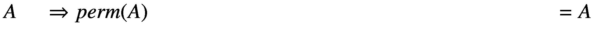
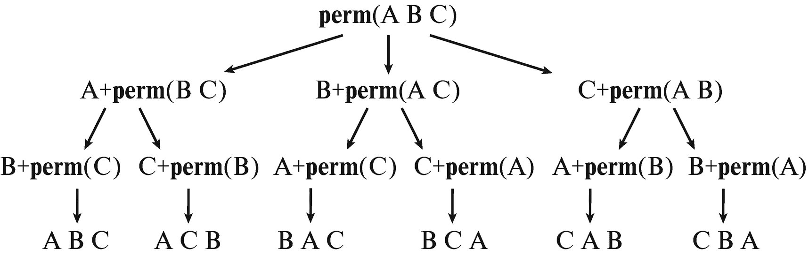

# 三、递归

在自然和数学中，你可以找到题目 ***自相似*** 或者循环结构，比如雪花或者分形和 Julia 集，这些都是有趣的图形构成。在这种情况下，人们说 ***递归*** ，意思是事物重复或彼此相似。与方法相关，这意味着它们调用自己。因此，重要的是特殊输入值形式的终止条件，它导致自调用的结束。

## 3.1 导言

各种计算可以很好地描述为递归函数。目标是将一个更复杂的任务分解成几个更简单的子任务。

### 数学示例

下面你将看到阶乘、求和以及斐波那契数的计算，这是递归定义的三个介绍性例子。

#### 示例 1:阶乘

数学上，正数 *n* 的 ***阶乘*** 定义为从 1 到 *n* 的所有自然数的乘积(即乘法运算)，包括 1 和 T6。对于表示法，感叹号放在相应数字的后面。比如 5！代表数字 5 的阶乘:

五个！= 5’4’3’2’1 = 120

这可以概括如下:

n！=*n**n*-【1】*n*-【2】*-我...。*∑2′1

基于此，推导出递归定义:



这里，倒 A (∀)表示所有的*。*

对于第一个 *n* ,您会得到以下值级数:

<colgroup><col class="tcol1 align-left"> <col class="tcol2 align-left"> <col class="tcol3 align-left"> <col class="tcol4 align-left"> <col class="tcol5 align-left"> <col class="tcol6 align-left"> <col class="tcol7 align-left"> <col class="tcol8 align-left"> <col class="tcol9 align-left"></colgroup> 
| **n** | one | Two | three | four | five | six | seven | eight |
| **n！** | one | Two | six | Twenty-four | One hundred and twenty | Seven hundred and twenty | Five thousand and forty | Forty thousand three hundred and twenty |

**Java 中阶乘的计算**让我们快速看一下阶乘的递归计算公式是如何转移到同类方法中的:

```java
public static int factorial(final int n)
{
    if (n < 0)
        throw new IllegalArgumentException("n must be >= 0");

    // recursive termination
    if (n == 0 || n == 1)
        return 1;

    // recursive descent
    return n * factorial(n – 1);
}

```

让我们弄清楚这个递归定义在调用方面产生了什么。见图 [3-1](#Fig1) 。



图 3-1

对 factorial(5)的递归调用

#### 示例 2:直到 *n* 的数的和的计算

数学上，数字 *n* 的*和*被定义为从 1 上升到并包括 *n* 的所有自然数的和:



这可以递归定义如下:



对于第一个 *n* ，您得到以下值级数:

<colgroup><col class="tcol1 align-left"> <col class="tcol2 align-left"> <col class="tcol3 align-left"> <col class="tcol4 align-left"> <col class="tcol5 align-left"> <col class="tcol6 align-left"> <col class="tcol7 align-left"> <col class="tcol8 align-left"> <col class="tcol9 align-left"></colgroup> 
| **n** | one | Two | three | four | five | six | seven | eight |
| **sum(n)** | one | three | six | Ten | Fifteen | Twenty-one | Twenty-eight | Thirty-six |

**Java 中求和的计算**再次，你把求和的递归计算公式转换成递归方法:

```java
public static int sum(final int n)
{
    if (n <= 0)
        throw new IllegalArgumentException("n must be >= 1");

    // recursive termination
    if (n == 1)
        return 1;

    // recursive descent
    return n + sum(n – 1);
}

```

Attention: Limited Call Depth

请记住，对于求和来说，自呼总是会发生的。因此，只能传递 10.000–20.000 左右的值。较大的值将导致`StackOverflowError`。对于其他递归方法，类似的限制也适用于自调用的数量。

#### 示例 3:斐波那契数列

***斐波纳契数*** 也非常适合递归定义，尽管公式已经稍微复杂了一点:


对于第一个 *n* ,您会得到以下值级数:

<colgroup><col class="tcol1 align-left"> <col class="tcol2 align-left"> <col class="tcol3 align-left"> <col class="tcol4 align-left"> <col class="tcol5 align-left"> <col class="tcol6 align-left"> <col class="tcol7 align-left"> <col class="tcol8 align-left"> <col class="tcol9 align-left"></colgroup> 
| **n** | one | Two | three | four | five | six | seven | eight |
| **纤维(n)** | one | one | Two | three | five | eight | Thirteen | Twenty-one |

如果计算公式以图形方式可视化，那么自我调用树的潜在跨度会很快变得很明显。对于一个更大的 *n* ，调用树会更大，如图 [3-2](#Fig2) 中的虚线箭头所示。



图 3-2

斐波那契递归

即使有了这个示例性的调用，很明显各种调用被进行了几次，例如对于*fib*(*n*-4)和*fib*(*n*-2)，但是特别是对于*fib*(*n*-3)的三次调用。这很快会导致昂贵而繁琐的计算。您将在 8.1 节中了解如何对此进行优化。

Hint: Different Definition with zero as Start Value

还应该注意，存在从值 0 开始的变化。然后 *fib* (0) = 0 和 *fib* (1) = 1 为基值，之后根据递归定义得到*fib*(*n*)=*fib*(*n*1)+*fib*(*n*2)。这产生了与上述定义相同的数字序列，只是增加了 0 的值。

### 算法示例

在介绍中，你看了数学例子。但是递归也非常适合算法任务。例如，可以检查数组中存储的值是否形成了回文。回文是一个前后读起来都一样的词，比如 OTTO 或者 ABBA。这意味着元素从正面和背面成对匹配。这适用于例如具有以下值的`int[]`:`{ 1, 2, 3, 2, 1 }`。

#### 示例 1:回文——递归变量

你可以很容易地递归测试回文属性。在我简单描述了算法之后，你会把它看作一个程序。

**算法**如果数组的长度为 0 或 1，那么根据定义它是一个回文。如果长度等于或大于 2，则必须检查外部左元素和外部右元素是否匹配。之后，创建数组的副本，在前面缩短一个位置，在后面缩短一个位置。然后对数组的剩余部分执行进一步的检查，如下所示:

```java
static boolean isPalindromeSimpleRecursive(final int[] values)
{
    // recursive termination
    if (values.length <= 1)
        return true;

    int left = 0;
    int right = values.length – 1;

    if (values[left] == values[right])
    {
        // attention: copyOfRange() is exclusive end
        final int[] remainder = Arrays.copyOfRange(values, left + 1, right);

        // recursive descent
        return isPalindromeSimpleRecursive(remainder);
    }

    return false;
}

```

然而，所描述和实现的方法导致子阵列的许多复制和提取。通过保留这个想法，但通过使用一个技巧最小程度地修改算法，可以避免这种努力。

**优化算法**不使用副本，仍然使用原数组。您包括两个位置标记，`left`和`right`，它们最初跨越整个数组。现在检查这些位置引用的左右值是否匹配。如果是这种情况，位置标记在两侧向内移动一个位置，并递归调用整个过程。如此重复，直到左位置指针到达或跳过右位置指针。

实现更改如下:

```java
static boolean isPalindromeRecursive(final int[] values)
{
    return isPalindromeRecursive(values, 0, values.length – 1);
}

static boolean isPalindromeRecursive(final int[] values,
                                     final int left, final int right)
{
    // recursive termination
    if (left >= right)
        return true;

    if (values[left] == values[right])
    {
        // recursive descent
        return isPalindromeRecursive(values, left + 1, right – 1);
    }

    return false;
}

```

也许你想知道为什么我不把过程写得更简洁，甚至使用更少的语句。我在介绍算法时主要关心的是可理解性。如果方法非常长并且令人困惑，那么多个`return`确实是个问题。

Hint: Auxiliary Methods for Facilitating Recursion

数组或字符串中位置指针的概念是递归解决方案中常用的工具，用于优化和避免数组复制。为了防止整个事情变得对调用者不方便，让一个高级方法调用一个具有附加参数的 helper 方法是一个好主意。这允许您在递归下降中包含某些信息。在本例中，这些是左右限制，因此可以消除潜在的高成本复制。许多随后的例子将利用这个一般的想法。

#### 例 1:回文——迭代变体

尽管算法的递归定义有时非常优雅，但递归下降会产生自调用。这可能会产生相当大的开销。方便的是，任何递归算法都可以转化为迭代算法。让我们看看这个回文计算。您使用两个位置指针进行迭代转换，而不是递归下降，您使用一个`while`循环。当检查完所有元素或之前检测到不匹配时，此操作终止。

```java
private static boolean isPalindromeIter(int[] values)
{
    int left = 0;
    int right = values.length – 1;
    boolean sameValue = true;

    while (left < right && sameValue)
    {
        sameValue = values[left] == values[right];

        left++;        right––;
    }

    return sameValue;
}

```

同样，关于紧凑性的一个注意事项:这个方法可以写成如下形式，省略辅助变量:

```java
static boolean isPalindromeIterativeCompact(final int[] values)
{
    int left = 0;
    int right = values.length – 1;

    while (left < right && values[left] == values[right])
    {
        left++;        right––;
    }
    // left >= right || values[left] != values[right]
    return left >= right;
}

```

返回值由注释隐含的条件决定，如果*左* > = *右*成立，那么`values`不是回文。然而，对于这种变体，您必须更多地考虑回报——同样，比起简洁或性能，我更喜欢可理解性和可维护性。

#### 例 2:以分形为例

正如开始提到的，递归也允许你创建图形。下面显示了一个简单的图形变体，它基于标尺的细分:

```java
-
==
-
===
-
==
-

```

事实上，借助 Java 11 板载方法(`repeat(n)`)，这可以很容易地递归实现如下，其中递归下降出现两次:

```java
static void fractalGenerator(final int n)
{
    if (n < 1)
        return;

    if (n == 1)
        System.out.println("–");
    else
    {
        fractalGenerator(n − 1);
        System.out.println("=".repeat(n));
        fractalGenerator(n − 1);
    }
}

```

如果 Java 11 和方法`repeat()`不可用，您只需编写辅助方法`repeatCharSequence()`(参见第 2.3.7 节)。

当使用更复杂的绘图函数而不是 ASCII 字符时，递归提供了创建有趣和吸引人的形状的方法，如图 [3-3](#Fig3) 中嵌入在 Swing 应用程序中的雪花。



图 3-3

带 drawSnowflake()的递归图形

雪花的这种风格化表示可以按如下方式实现:

```java
public static void drawSnowflake(final Graphics graphics,
                                 final int startX, final int startY,
                                 final int length, final int depth)
{
    for (int degree = 0; degree < 360; degree += 60)
    {
        final double rad = degree * Math.PI / 180;
        final int endX = (int) (startX + Math.cos(rad) * length);
        final int endY = (int) (startY + Math.sin(rad) * length);

        graphics.drawLine(startX, startY, endX, endY);

        // recursive descent
        if (depth > 0)
        {
            drawSnowflake(graphics, endX, endY, length / 4, depth – 1);
        }
    }
}

```

### 3.1.3 数字相乘的步骤

作为算法示例的总结，我想再次澄清一下各个步骤和自我调用。作为一个人工示例，让我们使用一个数字的数字乘法，也称为*叉积*，例如值 257 2∫5∫7 = 10∫7 = 70。使用模运算，单个数字的提取及其乘法可以非常简单地实现如下:

```java
static int multiplyAllDigits(final int value)
{
    final int remainder = value / 10;
    final int digitValue = value % 10;

    System.out.printf("multiplyAllDigits: %–10d | remainder: %d, digit: %d%n", value, remainder, digitValue);

    if (remainder > 0)
    {
        final int result = multiplyAllDigits(remainder);

        System.out.printf("-> %d * %d = %d%n",
                          digitValue, result, digitValue * result);
        return digitValue * result;
    }
    else
    {
        System.out.println("-> " + value);
        return value;
    }
}

```

让我们看看 1234 和 257 这两个数字的输出:

```java
jshell> multiplyAllDigits(1234)
multiplyAllDigits: 1234    | remainder: 123, digit: 4
multiplyAllDigits: 123     | remainder: 12, digit: 3
multiplyAllDigits: 12      | remainder: 1, digit: 2
multiplyAllDigits: 1       | remainder: 0, digit: 1
-> 1
-> 2 * 1 = 2
-> 3 * 2 = 6
-> 4 * 6 = 24
$2 ==> 24

jshell> multiplyAllDigits(257)
multiplyAllDigits: 257     | remainder: 25, digit: 7
multiplyAllDigits: 25      | remainder: 2, digit: 5
multiplyAllDigits: 2       | remainder: 0, digit: 2
-> 2
-> 5 * 2 = 10
-> 7 * 10 = 70
$3 ==> 70

```

可以清楚地看到递归调用是如何在一个连续变短的数字序列中发生的。最后，根据另一个方向的最后一位数字来构造或计算结果。

### 典型问题

递归通常允许你以一种可理解的方式来制定和实现问题的解决方案。然而，有两件事要记住，我将在下面讨论。

#### 无尽的呼叫和堆栈错误

值得了解的一个细节是，自调用导致它们被临时存储在堆栈上。对于每个方法调用，包含关于被调用方法及其参数的信息的所谓堆栈帧被存储在堆栈上。然而，堆栈的大小是有限的。因此，只能进行有限次数的嵌套方法调用——然而，通常远远超过 10，000 次。这已经在实用技巧中简要讨论过了。

大量的递归调用会导致一个`StackOverflowError`。有时，出现问题是因为递归中没有终止条件，或者条件的表述不正确:

```java
// attention: deliberately wrong for demonstration
static void infiniteRecursion(final String value)
{
    infiniteRecursion(value);
}

static int factorialNoAbortion(final int number)
{
    return number * factorialNoAbortion(number – 1);
}

```

有时调用也是错误的，仅仅是因为没有传递减少的值:

```java
// deliberately wrong for demonstration
static int factorialWrongCall(final int n)
{
    if (n == 0)
        return 1;
    if (n == 1)
        return 1;

    return n * factorialWrongCall(n);
}

```

你可能仍然能很好地识别出直接的无休止的自我呼叫。但是随着行数的增加，这变得更加困难。有了一些递归方面的经验和实践，即使是方法`factorialNoAbortion()`中缺失的终止条件也是很容易识别的。但是，在方法`factorialWrongCall()`中，这并不容易确定。在这里，你必须更准确地知道是什么意图。

你应该从例子中去掉两件事:

1.  **终止条件**:递归方法必须至少包含一个终止条件。但是，即使定义正确，也有可能没有检查不允许的负值范围。对于`factorial(int)`，具有负值的调用将导致`StackOverflowError`。

2.  复杂度降低:递归方法必须总是将原问题细分成一个或多个更小的子问题。有时，这已经通过将参数值减少 1 来实现。

#### 意外的参数值

在方法调用中，尤其是递归调用中，当您希望将参数值递增或递减 1 时，可能会出现一个非常严重的错误，因为这个错误很容易犯，也很难发现。出于习惯，您可能会尝试使用后递增或后递减(`++`或`––`)，如下例所示，用于字符串长度的递归(有点笨拙)计算，其中参数`count`应该包含当前长度:

```java
static int calcLengthParameterValues(final String value, int count)
{
    if (value.length() == 0)
        return count;

    System.out.println("Count: " + count);
    final String remaining = value.substring(1);

    return calcLengthParameterValues(remaining, count++);
}

```

查看呼叫的输出时

```java
final int length = calcLengthParameterValues("ABC", 0);System.out.println("length: " + length);

```

您可能会感到惊讶，因为该值没有增加 1，而是保持不变:

```java
Count: 0
Count: 0
Count: 0
length: 0

```

在这个例子中，只有输入的缩短会终止递归。

有趣的是，如果您遵循良好的编程传统，将参数声明为`final`，那么可以更快地发现思维中的错误。这样，编译器会直接产生一条错误消息，并指出该变量是不可变的。因此，您可能更愿意选择表达式`count + 1`而不是传递变量。有了这些知识，纠正就容易了:

```java
static int calcLengthParameterValues(final String value, final int count)
{
    if (value.length() == 0)
        return count;

    System.out.println("Count: " + count);
    final String remaining = value.substring(1);
    return calcLengthParameterValues(remaining, count + 1);
}

```

**更严重的影响**将参数定义为`final`的好习惯可以缓解出现的问题。然而，假设你在已经给出的递归回文检查中省略了`final`,并且也有点粗心地使用了`++` resp。`--`:

```java
static boolean isPalindromeRecursive(int[] values, int left, int right)
{
    // recursive termination
    if (left >= right)
        return true;

    if (values[left] == values[right])
    {
        // recursive descent
        return isPalindromeRecursive(values, left++, right−−);
    }
    return false;
}

```

其效果甚至比上一个例子更糟，上一个例子至少终止了，但返回了一个错误的值。使用这个回文检查，过一段时间后你会得到一个`StackOverflowError`。

## 3.2 练习

### 3.2.1 练习 1:斐波那契(★★✩✩✩)

#### 练习 1a:斐波那契递归(★✩✩✩✩)

编写基于以下定义递归计算斐波那契数的方法`long fibRec(int)`:



**示例**例如，使用以下值级数检查实施情况:

<colgroup><col class="tcol1 align-left"> <col class="tcol2 align-left"> <col class="tcol3 align-left"> <col class="tcol4 align-left"> <col class="tcol5 align-left"> <col class="tcol6 align-left"> <col class="tcol7 align-left"> <col class="tcol8 align-left"> <col class="tcol9 align-left"></colgroup> 
| **n** | one | Two | three | four | five | six | seven | eight |
| **纤维(n)** | one | one | Two | three | five | eight | Thirteen | Twenty-one |

#### 练习 1b:斐波那契迭代(★★✩✩✩)

斐波那契数列的递归计算效率不高，从第 40 到 50 个斐波那契数列开始，运行时间会大幅增加。为计算编写一个迭代版本。第 1000 个斐波那契数有什么要考虑的？

### 3.2.2 练习 2:处理数字(★★✩✩✩)

#### 练习 2a:计算数字(★★✩✩✩)

编写递归方法`int countDigits(int)`,找出正自然数的位数。我在第 2 章 [2](02.html) 第 2.1 节讨论了如何提取数字。

#### 例子

<colgroup><col class="tcol1 align-left"> <col class="tcol2 align-left"> <col class="tcol3 align-left"></colgroup> 
| 

投入

 | 

数字位数

 | 

交叉求和

 |
| --- | --- | --- |
| One thousand two hundred and thirty-four | four | 1 + 2 + 3 + 4 = 10 |
| One million two hundred and thirty-four thousand five hundred and sixty-seven | seven | 1 + 2 + 3 + 4 + 5 + 6 + 7 = 28 |

#### 练习 2b:交叉求和(★★✩✩✩)

递归计算一个数的位数之和。为此编写递归方法`int calcSumOfDigits(int)`。

### 3.2.3 练习 3: GCD (★★✩✩✩)

#### 练习 3a: GCD 递归(★✩✩✩✩)

写出计算最大公约数的方法`int gcd(int, int)`<sup>[1](#Fn1)</sup>。对于两个自然数 *a* 和 *b* ，GCD 可以数学递归地表示如下:



#### 例子

<colgroup><col class="tcol1 align-left"> <col class="tcol2 align-left"> <col class="tcol3 align-left"></colgroup> 
| 

输入 1

 | 

输入 2

 | 

结果

 |
| --- | --- | --- |
| forty-two | seven | seven |
| forty-two | Twenty-eight | Fourteen |
| forty-two | Fourteen | Fourteen |

#### 练习 3b: GCD 迭代(★★✩✩✩)

为 GCD 计算创建迭代版本。

#### 练习 3c: LCM (★✩✩✩✩)

编写方法`int lcm(int, int)`来计算最小公倍数(LCM)。对于两个自然数 *a* 和 *b* ，您可以使用以下公式基于 GCD 计算:

*lcm(a，b) = a * b* / *gcd(a，b)；*

#### 例子

<colgroup><col class="tcol1 align-left"> <col class="tcol2 align-left"> <col class="tcol3 align-left"></colgroup> 
| 

输入 1

 | 

输入 2

 | 

结果

 |
| --- | --- | --- |
| Two | seven | Fourteen |
| seven | Fourteen | Fourteen |
| forty-two | Fourteen | forty-two |

### 3.2.4 练习 4:反串(★★✩✩✩)

编写递归方法`String reverseString(String)`，翻转传入的输入文本的字母。

#### 例子

<colgroup><col class="tcol1 align-left"> <col class="tcol2 align-left"></colgroup> 
| 

投入

 | 

结果

 |
| --- | --- |
| “一个” | “一个” |
| “ABC” | “CBA” |
| " abcdefghi " | " ihgfedcba " |

### 3.2.5 练习 5:数组求和(★★✩✩✩)

编写递归计算给定数组值之和的方法`int sum(int[])`。

#### 例子

<colgroup><col class="tcol1 align-left"> <col class="tcol2 align-left"></colgroup> 
| 

投入

 | 

结果

 |
| --- | --- |
| [1, 2, 3] | six |
| [1, 2, 3, -7] | -1 |

### 3.2.6 练习 6:数组最小值(★★✩✩✩)

编写方法`int min(int[])`,该方法使用递归来查找传递的数组的最小值。对于空数组，应该返回值`Integer.MAX_VALUE`。

#### 例子

<colgroup><col class="tcol1 align-left"> <col class="tcol2 align-left"></colgroup> 
| 

投入

 | 

结果

 |
| --- | --- |
| [7, 2, 1, 9, 7, 1] | one |
| [11, 2, 33, 44, 55, 6, 7] | Two |
| [1, 2, 3, -7] | -7 |

### 3.2.7 练习 7:转换(★★✩✩✩)

#### 练习 7a:二进制(★★✩✩✩)

编写方法`String toBinary(int)`,它将给定的正整数递归地转换成文本二进制表示。

#### 例子

<colgroup><col class="tcol1 align-left"> <col class="tcol2 align-left"></colgroup> 
| 

投入

 | 

结果

 |
| --- | --- |
| five | “101” |
| seven | “111” |
| Twenty-two | “10110” |
| forty-two | “101010” |
| Two hundred and fifty-six | “100000000” |

#### 练习 7b:八进制和十六进制数(★★✩✩✩)

通过实现相应的方法`String toOctal(int)`和`String toHex(int)`，将转换结果写入八进制和十六进制数。

#### 例子

<colgroup><col class="tcol1 align-left"> <col class="tcol2 align-left"> <col class="tcol3 align-left"></colgroup> 
| 

投入

 | 

方法

 | 

结果

 |
| --- | --- | --- |
| seven | 八进制的 | “7” |
| eight | 八进制的 | “10” |
| forty-two | 八进制的 | “52” |
| Fifteen | 十六进制的 | “F” |
| Seventy-seven | 十六进制的 | 《4D》 |

### 3.2.8 练习 8:指数函数(★★✩✩✩)

#### 练习 8a:二的幂(★★✩✩✩)

编写递归方法`boolean isPowerOf2(int)`,评估给定的正整数，看它是否是 2 的幂。

#### 例子

<colgroup><col class="tcol1 align-left"> <col class="tcol2 align-left"></colgroup> 
| 

投入

 | 

结果

 |
| --- | --- |
| Two | 真实的 |
| Ten | 错误的 |
| Sixteen | 真实的 |

#### 练习 8b:递归幂运算(★★✩✩✩)

编写递归方法`long powerOf(int, int)`,用指定为第二个参数的正数对给定的正整数求幂。例如，调用`powerOf(4, 2)`应该返回 4 的平方，所以计算`4` <sup>`2`</sup> `= 16`。

#### 练习 8c:指数迭代(★★✩✩✩)

编写这个求幂函数的迭代版本。

#### 例子

<colgroup><col class="tcol1 align-left"> <col class="tcol2 align-left"> <col class="tcol3 align-left"></colgroup> 
| 

输入基础

 | 

输入指数

 | 

结果

 |
| --- | --- | --- |
| Two | Two | four |
| Two | eight | Two hundred and fifty-six |
| four | four | Two hundred and fifty-six |

### 3.2.9 练习 9:帕斯卡三角形(★★✩✩✩)

写出帕斯卡三角形的方法`void printPascal(int)`。对于值 5，应该生成以下输出:

```java
[1]
[1, 1]
[1, 2, 1]
[1, 3, 3, 1]
[1, 4, 6, 4, 1]

```

从第三行开始，后面的每一行都是在前一行的基础上借助加法计算出来的，如下面定义的最后一行所示。对于每一行，这些值的前面和后面都有一个 1。由于这是一个二维结构，递归定义稍微复杂一些:


Tip

你可以在这里找到背景资料和深入的解释: [`https://en.wikipedia.org/wiki/Pascal's_triangle`](https://en.wikipedia.org/wiki/Pascal%25E2%2580%2599s_triangle) 。

### 3.2.10 练习 10:数字回文(★★★★✩)

回文是一个从正面和背面读起来都一样的单词。我们可以把这个定义扩展到数字。编写递归方法`boolean isNumberPalindrome(int)`，但不求助于类`String`中的函数。

#### 例子

<colgroup><col class="tcol1 align-left"> <col class="tcol2 align-left"></colgroup> 
| 

投入

 | 

结果

 |
| --- | --- |
| seven | 真实的 |
| Thirteen | 错误的 |
| One hundred and seventy-one | 真实的 |
| Forty-seven thousand seven hundred and forty-two | 错误的 |

### 3.2.11 练习 11:排列(★★★✩✩)

计算给定为字符串的字母序列的所有排列；这意味着这些字母的所有可能的组合。在方法`Set<String> calcPermutations(String)`中实现该计算。也考虑重复字母的情况。

#### 例子

<colgroup><col class="tcol1 align-left"> <col class="tcol2 align-left"></colgroup> 
| 

投入

 | 

结果

 |
| --- | --- |
| “一个” | “一个” |
| " AA " | " AA " |
| “AB” | “AB”，“BA” |
| “ABC” | ABC、BAC、ACB、CAB、CBA、BCA |
| " AAC " | “AAC”、“ACA”、“CAA” |

### 3.2.12 练习 12:计算子字符串(★★✩✩✩)

编写方法`int countSubstrings(String, String)`,计算给定子串的所有出现次数。因此，当发现一个模式时，它应该被*消耗*(即，它不应该再次被命中)。这在下表中显示为最后一种情况。

#### 例子

<colgroup><col class="tcol1 align-left"> <col class="tcol2 align-left"> <col class="tcol3 align-left"></colgroup> 
| 

投入

 | 

搜索词

 | 

结果

 |
| --- | --- | --- |
| " xhixhix " | “x” | three |
| " xhixhix " | “嗨” | Two |
| "麦克风" | "麦克风" | one |
| “哈哈” | “嗬” | Zero |
| " xxxxyz " | " xx " | Two |

### 练习 13:尺子(★★✩✩✩)

在介绍中，我展示了如何使用递归绘制一个简单的尺子形状以及一个风格化的雪花(见图 [3-3](#Fig3) )。在这个练习中，你要模仿一个英式尺子。这涉及到将一英寸的面积分成 1/2、1/4 和 1/8。这样，笔画的长度每次减少一个。

**示例**输出应该如下所示:

```java
---- 0
-
--
-
---
-
--
-
---- 1
-
--
-
---
-
--
-
---- 2

```

## 3.3 解决方案

### 3.3.1 备选案文 1: Fibonacci

#### 解决方案 1a:斐波那契递归(★✩✩✩✩)

编写基于以下定义递归计算斐波那契数的方法`long fibRec(int)`:


**示例**例如，使用以下值级数检查实施情况:

<colgroup><col class="tcol1 align-left"> <col class="tcol2 align-left"> <col class="tcol3 align-left"> <col class="tcol4 align-left"> <col class="tcol5 align-left"> <col class="tcol6 align-left"> <col class="tcol7 align-left"> <col class="tcol8 align-left"> <col class="tcol9 align-left"></colgroup> 
| **n** | one | Two | three | four | five | six | seven | eight |
| **纤维(n)** | one | one | Two | three | five | eight | Thirteen | Twenty-one |

**算法**它在 Java 中的实现正是来源于数学定义:

```java
static long fibRec(final int n)
{
    if (n <= 0)
        throw new IllegalArgumentException("n must be >= 1");

    // recursive termination
    if (n == 1 || n == 2)
        return 1;

    // recursive descent
    return fibRec(n – 1) + fibRec(n – 2);
}

```

#### 解决方案 1b:斐波那契迭代(★★✩✩✩)

斐波那契数列的递归计算效率不高，从第 40 到 50 个斐波那契数列开始，运行时间会大幅增加。为计算编写一个迭代版本。第 1000 个斐波那契数有什么要考虑的？

**算法**与递归版本类似，迭代实现首先检查输入的有效性，然后检查值为 1 或 2 的调用的特殊情况。之后，使用两个辅助变量和一个从 2 到 n 的循环，然后从两个辅助变量之和计算相应的斐波那契数。之后，适当地分配两个辅助变量。这导致了以下实现:

```java
static long fibIterative(final int n)
{
    if (n <= 0)
        throw new IllegalArgumentException("n must be >= 1");

    if (n==1 || n == 2)
        return 1;

    long fibN_2 = 1;
    long fibN_1 = 1;

    for (int count = 2; count < n; count++)
    {
        long fibN = fibN_1 + fibN_2;

        // move forward by one
        fibN_2 = fibN_1;
        fibN_1 = fibN;
    }

    return fibN;
}

```

**斐波那契对于更大的数**比如你要计算第 1000 个斐波那契数，一个`long`的取值范围远远不够。作为一个修正，计算必须使用`BigInteger`类来执行。

#### 确认

对于测试，您使用以下输入，这些输入显示了正确的功能:

```java
@ParameterizedTest(name = "fibRec({0}) = {1}")
@CsvSource({ "1, 1", "2, 1", "3, 2", "4, 3", "5, 5", "6, 8", "7, 13", "8, 21" })
void fibRec(int n, long expectedFibN)
{
    long result1 = Ex01_Fibonacci.fibRec(n);

    assertEquals(expectedFibN, result1);
}

@ParameterizedTest(name = "fibIterative({0}) =  {1}")
@CsvSource({ "1, 1", "2, 1", "3, 2", "4, 3", "5, 5", "6, 8", "7, 13", "8, 21" })
void fibIterative(int n, long expectedFibN)
{
    long result = Ex01_Fibonacci.fibIterative(n);

    assertEquals(expectedFibN, result);
}

```

### 3.3.2 解决方案 2:处理数字(★★✩✩✩)

#### 解决方案 2a:计数位数(★★✩✩✩)

编写递归方法`int countDigits(int)`,找出正自然数的位数。我在第 2 章 [2](02.html) 第 2.1 节讨论了如何提取数字。

#### 例子

<colgroup><col class="tcol1 align-left"> <col class="tcol2 align-left"> <col class="tcol3 align-left"></colgroup> 
| 

投入

 | 

数字位数

 | 

交叉求和

 |
| --- | --- | --- |
| One thousand two hundred and thirty-four | four | 1 + 2 + 3 + 4 = 10 |
| One million two hundred and thirty-four thousand five hundred and sixty-seven | seven | 1 + 2 + 3 + 4 + 5 + 6 + 7 = 28 |

**算法**如果数字小于 10，那么返回值 1，因为这对应一个数字。否则，通过将数字除以 10 来计算剩余的值。这将递归调用计数方法，如下所示:

```java
static int countDigits(final int value)
{
    if (value < 0)
        throw new IllegalArgumentException("value must be >= 0");

    // recursive termination
    if (value < 10)
        return 1;

    final int remainder = value / 10;

    // recursive descent
    return countDigits(remainder) + 1;
}

```

#### 解决方案 2b:交叉求和(★★✩✩✩)

递归计算一个数的位数之和。为此编写递归方法`int calcSumOfDigits(int)`。

**算法**根据第一个子任务的解决方案，您只需改变数字以及加法和自调用的返回值，如下所示:

```java
static int calcSumOfDigits(final int value)
{
    if (value < 0)
        throw new IllegalArgumentException("value must be >= 0");

    // recursive termination
    if (value < 10)
        return value;

    final int remainder = value / 10;
    final int lastDigit = value % 10;

    // recursive descent
    return calcSumOfDigits(remainder) + lastDigit;
}

```

#### 确认

对于测试，您使用以下输入，这些输入显示了正确的操作:

```java
@ParameterizedTest(name = "countDigits({0}) = {1}")
@CsvSource({ "1234, 4", "1234567, 7" })
void countDigits(int number, int expected)
{
    long result = Ex02_CalcDigits.countDigits(number);

    assertEquals(expected, result);
}

@ParameterizedTest(name = "calcSumOfDigits({0}) = {1}")
@CsvSource({ "1234, 10", "1234567, 28" })
void calcSumOfDigits(int number, int expected)
{
    long result = Ex02_CalcDigits.calcSumOfDigits(number)

;

    assertEquals(expected, result);
}

```

### 3.3.3 解决方案 3: GCD

#### 解决方案 3a: GCD 递归(★✩✩✩✩)

写出计算最大公约数的方法`int gcd(int, int)`<sup>[2](#Fn2)</sup>。对于两个自然数 *a* 和 *b* ，GCD 可以数学递归地表示如下:


#### 例子

<colgroup><col class="tcol1 align-left"> <col class="tcol2 align-left"> <col class="tcol3 align-left"></colgroup> 
| 

输入 1

 | 

输入 2

 | 

结果

 |
| --- | --- | --- |
| forty-two | seven | seven |
| forty-two | Twenty-eight | Fourteen |
| forty-two | Fourteen | Fourteen |

**算法**最大公约数的计算可以相当直接地从数学定义用 Java 编码:

```java
static int gcd(final int a, final int b)
{
    // recursive termination
    if (b == 0)
        return a;

    // recursive descent
    return gcd(b, a % b);
}

```

#### 解决方案 3b: GCD 迭代(★★✩✩✩)

为 GCD 计算创建迭代版本。

**算法**自调用被转换成一个循环，一直执行到满足递归终止的条件。诀窍是按照递归定义的规定重新分配变量:

```java
static int gcdIterative(int a, int b)
{
    while (b != 0)
    {
        final int remainder = a % b;

        a = b;
        b = remainder;
    }

    // here applies b == 0
    return a;
}

```

#### 确认

对于测试，您使用以下输入，这些输入显示了正确的操作:

```java
@ParameterizedTest(name = "gcd({0}, {1}) = {2}")
@CsvSource({ "42, 7, 7", "42, 28, 14", "42, 14, 14" })
void gcd(int a, int b, int expected)
{
    int result = Ex03_GCD.gcd(a, b);

    assertEquals(expected, result);
}

@ParameterizedTest(name = "gcdIterative({0}, {1}) = {2}")
@CsvSource({ "42, 7, 7", "42, 28, 14", "42, 14, 14" })
void gcdIterative(int a, int b, int expected)
{
    int result = Ex03_GCD.gcdIterative(a, b);

    assertEquals(expected, result)

;
}

```

#### 解决方案 3c: LCM

编写方法`int lcm(int, int)`来计算最小公倍数(LCM)。对于两个自然数 *a* 和 *b* ，您可以使用以下公式基于 GCD 计算:

*lcm* ( *a* 、*b*=*【a】**【b】*/*【gcd】*

#### 例子

<colgroup><col class="tcol1 align-left"> <col class="tcol2 align-left"> <col class="tcol3 align-left"></colgroup> 
| 

输入 1

 | 

输入 2

 | 

结果

 |
| --- | --- | --- |
| Two | seven | Fourteen |
| seven | Fourteen | Fourteen |
| forty-two | Fourteen | forty-two |

**算法**最小公倍数的计算也可以从数学定义上直接实现，只要你已经完成了 GCD 的功能:

```java
static int lcm(final int a, final int b)
{
    return a * b / gcd(a, b);
}

```

#### 确认

测试时，使用以下显示正确操作的输入:

```java
@ParameterizedTest(name = "lcm({0}, {1}) = {2}")
@CsvSource({ "2, 7, 14", "7, 14, 14", "42, 14, 42" })
void lcm(int a, int b, int expected)
{
    int result = Ex03_GCD.lcm(a, b);

    assertEquals(expected, result);
}

```

### 3.3.4 解决方案 4:反串(★★✩✩✩)

编写递归方法`String reverseString(String)`，翻转传入的输入文本的字母。

#### 例子

<colgroup><col class="tcol1 align-left"> <col class="tcol2 align-left"></colgroup> 
| 

投入

 | 

结果

 |
| --- | --- |
| “一个” | “一个” |
| “ABC” | “CBA” |
| " abcdefghi " | " ihgfedcba " |

**算法**提取第一个字符，直到得到长度为 1 的字符串，然后以相反的顺序连接整个字符串:

```java
static String reverseString(final String input)
{
    // recursive termination
    if (input.length() <= 1)
        return input;

    final char firstChar = input.charAt(0);
    final String remaining = input.substring(1);

    // recursive descent
    return reverseString(remaining) + firstChar;
}

```

#### 确认

测试时，使用以下显示正确操作的输入:

```java
@ParameterizedTest(name = "reverseString({0}) => {1}")
@CsvSource({ "A, A", "ABC, CBA", "abcdefghi, ihgfedcba" })
void reverseString(String input, String expected)
{
    String result = Ex04_ReverseString.reverseString(input);

    assertEquals(expected, result);
}

```

### 3.3.5 解决方案 5:数组和(★★✩✩✩)

编写递归计算给定数组值之和的方法`int sum(int[])`。

#### 例子

<colgroup><col class="tcol1 align-left"> <col class="tcol2 align-left"></colgroup> 
| 

投入

 | 

结果

 |
| --- | --- |
| [1, 2, 3] | six |
| [1, 2, 3, -7] | -1 |

**算法**用递归定义计算部分和，只要

*总和* ( *值*(0))=*值* [0]

*总和* ( *值* (0...*n*)=*数值*【0】+*总和* ( *数值* (1... *n* ))

直到只剩下一个元素。正如简介中提到的，帮助器方法是有用的，它包含实际的处理和逻辑。这里，数组中的当前值被添加到递归确定的结果中:

```java
static int sum(final int[] values)
{
    return sum(values, 0);
}

static int sum(final int[] values, final int pos)
{
    // recursive termination
    if (pos >= values.length)
        return 0;

    int value = values[pos];

    // recursive descent
    return value + sum(values, pos + 1);
}

```

或者，也可以让`pos`计数器从`length – 1`运行到 0，因此递归反向如下:

*总和* ( *值* (0...*n*)=*总和* ( *值* (0...*n*-*1*)+*值* [ *n* ]

这将通过方法`sumTail(int[], int)`实现如下:

```java
static int sumTail(final int[] values, final int pos)
{
    if (pos < 0)
        return 0;

    int value = values[pos];

    // recursive descent
    return sumTail(values, pos – 1) + value;
}

```

#### 确认

对于测试，使用注释`@MethodSource`和对方法`valuesAndResult()`的引用来提供期望的输入和结果:

```java
@ParameterizedTest(name="sum({0}) = {1}")
@MethodSource("valuesAndResult")
void sum(int[] values, int expected)
{
    int result = Ex05_ArraySum.sum(values);

    assertEquals(expected, result);
}

```

除了之前使用的注释`@CsvSource, @MethodSource`是另一种将数据传递给测试用例的方法。这变得很有必要，因为您不能使用`@CsvSource`来提供`int[]`，而这正是您在这里所需要的。为此，可以使用`Stream<Arguments>`:

```java
private static Stream<Arguments> valuesAndResult()
{
    return Stream.of(Arguments.of(new int[] { 1 }, 1),
                     Arguments.of(new int[] { 1, 2, 3 }, 6),
                     Arguments.of(new int[] { 1, 2, 3, –7 }, –1));
}

```

### 3.3.6 解决方案 6:阵列最小值(★★✩✩✩)

编写方法`int min(int[])`,该方法使用递归来查找传递的数组的最小值。对于空数组，应该返回值`Integer.MAX_VALUE`。

#### 例子

<colgroup><col class="tcol1 align-left"> <col class="tcol2 align-left"></colgroup> 
| 

投入

 | 

结果

 |
| --- | --- |
| [7, 2, 1, 9, 7, 1] | one |
| [11, 2, 33, 44, 55, 6, 7] | Two |
| [1, 2, 3, -7] | -7 |

**算法**从第一个元素开始检查数组，并将其与初始设置为`Integer.MAX_VALUE`的最小值进行比较。如果当前元素更小，它将成为新的最小值。对缩短了一个位置的数组重复此过程，直到该位置位于数组的末尾。

```java
static int min(final int[] values)
{
    return min(values, 0, Integer.MAX_VALUE);
}

static int min(final int[] values, final int pos, int currentMin)
{
    // recursive termination
    if (pos >= values.length)
        return currentMin;

    final int current = values[pos];
    if (current < currentMin)
        currentMin = current;

    // recursive descent
    return min(values, pos + 1, currentMin);
}

```

#### 确认

测试时，使用以下显示正确操作的输入:

```java
@ParameterizedTest(name="min({0}) = {1}")
@MethodSource("valuesAndMinimum")
void min(int[] input, int expected)
{
    int result = Ex06_ArrayMin.min(input);

    assertEquals(expected, result);
}

private static Stream<Arguments> valuesAndMinimum()
{
    return Stream.of(Arguments.of(new int[] { 7, 2, 1, 9, 7, 1 }, 1),
                     Arguments.of(new int[] { 11, 2, 33, 44, 55, 6, 7 }, 2),
                     Arguments.of(new int[] { 1, 2, 3, –7 }, –7),
                     Arguments.of(new int[] { }, Integer.MAX_VALUE));
}

```

### 3.3.7 解决方案 7:转换(★★✩✩✩)

#### 解决方案 7a:二进制(★★✩✩✩)

编写方法`String toBinary(int)`,它将给定的正整数递归地转换成文本二进制表示。

#### 例子

<colgroup><col class="tcol1 align-left"> <col class="tcol2 align-left"></colgroup> 
| 

投入

 | 

结果

 |
| --- | --- |
| five | “101” |
| seven | “111” |
| Twenty-two | “10110” |
| forty-two | “101010” |
| Two hundred and fifty-six | “100000000” |

**算法**转换基于已知的最后一位数字的提取和余数的确定，如第 2.1 节所述。要将十进制数转换为二进制数，需要检查传递的数是否可以用二进制中的一个数字来表示(即是否小于 2)。否则，首先使用模运算符提取最后一位数字，然后提取余数。为此，您递归调用方法，然后连接最后一个数字的字符串表示形式。这导致值 22 的以下序列:

<colgroup><col class="tcol1 align-left"> <col class="tcol2 align-left"> <col class="tcol3 align-left"></colgroup> 
| 

祈祷

 | 

顺序

 | 

结果

 |
| --- | --- | --- |
| 托比纳(22 岁) | toBinary(22/2)+value of(22% 2)= > toBinary(11)+" 0 " | “10110” |
| 托比纳(11) | toBinary(11/2)+value of(11% 2)= > toBinary(5)+1 | “1011” |
| 托比纳(5) | toBinary(5/2)+value of(5% 2)= > toBinary(2)+1 | “101” |
| 二进制(2) | toBinary(2/2)+value of(2% 2)= > toBinary(1)+" 0 " | “10” |
| 二进制(1) | value of(1)= > 1 | “1” |

现在让我们用 Java 实现整个过程，如下所示:

```java
static String toBinary(final int n)
{
    if (n < 0)
        throw new IllegalArgumentException("n must be >= 0");

    // recursive termination: check for digit in binary system
    if (n <= 1)
        return String.valueOf(n);

    final int lastDigit = n % 2;
    final int remainder = n / 2;

    // recursive descent
    return toBinary(remainder) + lastDigit

;
}

```

#### 解答 7b:八进制和十六进制数字(★★✩✩✩)

通过实现相应的方法`String toOctal(int)`和`String toHex(int)`，将转换结果写入八进制和十六进制数。

#### 例子

<colgroup><col class="tcol1 align-left"> <col class="tcol2 align-left"> <col class="tcol3 align-left"></colgroup> 
| 

投入

 | 

方法

 | 

结果

 |
| --- | --- | --- |
| seven | 八进制的 | “7” |
| eight | 八进制的 | “10” |
| forty-two | 八进制的 | “52” |
| Fifteen | 十六进制的 | “F” |
| Seventy-seven | 十六进制的 | 《4D》 |

**算法**算法基本保持不变。您检查传递的数字是否可以由所需数字系统的单个数字表示，因此小于 8(八进制)或 16(十六进制)。否则，您首先使用模运算提取最后一位数字以及余数。对于剩余部分，递归地调用这个方法，然后连接最后一个数字的字符串表示。

```java
public String toOctal(final int n)
{
    if (n < 0)
        throw new IllegalArgumentException("n must be >= 0");

    // recursive termination: check for digit in octal system
    if (n < 8)
        return String.valueOf(n);

    final int lastDigit = n % 8;
    final int remainder = n / 8;

    // recursive descent
    return toOctal(remainder) + String.valueOf(lastDigit);
}

public String toHex(final int n)
{
    if (n < 0)
        throw new IllegalArgumentException("n must be >= 0");

    // recursive termination: check for digit in hexadecimal system
    if (n <= 15)
        return asHexDigit(n);

    final int lastDigit = n % 16;
    final int remainder = n / 16;

    // recursive descent
    return toHex(remainder) + asHexDigit(lastDigit);
}

// easier handling of hexadecimal conversion
static String asHexDigit(final int n)
{
    if (n < 0)
        throw new IllegalArgumentException("n must be >= 0");

    if (n < 9)
        return String.valueOf(n);

    if (n <= 15)
        return Character.toString(n – 10 + 'A');

    throw new IllegalArgumentException("value not in range 0 – 15, " +
                                       "but is: " + n);
}

```

Hint: Possible Optimizations

虽然所示的将单个十六进制数字转换成字符串的实现相当简单，但是有一个非常优雅的替代方法，也很容易阅读和理解。它使用`charAt(int)`根据一组给定的字符验证一个数字:

```java
static String asHexDigit(final int n)
{
    if (n < 0)
        throw new IllegalArgumentException("n must be >= 0");
    if (n <= 15)
    {
        final char hexdigit = "0123456789ABCDEF".charAt(n);
        return String.valueOf(hexdigit);
    }

    throw new IllegalArgumentException("value not in range 0 – 15, " + "but is: " + n);
}

```

使用`Character.getNumericvalue(char)`可以实现从字符到数字的反方向转换。您将在第 4.1.3 节中了解到这一点。

#### 确认

测试时，使用以下显示正确操作的输入:

```java
@ParameterizedTest(name = "toBinary({0}) => {1}")
@CsvSource({ "5, 101", "7, 111", "22, 10110", "42, 101010", "256, 100000000" })
void toBinary(int value, String expected)
{
    String result = Ex07_NumberConversions.toBinary(value);

    assertEquals(expected, result);

}

@ParameterizedTest(name = "toOctal({0}) => {1}")
@CsvSource({ "42, 52", "7, 7", "8, 10" })
void toOctal(int value, String expected)
{
    String result = Ex07_NumberConversions.toOctal(value);

    assertEquals(expected, result);
}

@ParameterizedTest(name = "toHex({0}) => {1}")
@CsvSource({ "77, 4D", "15, F", "16, 10" })
void toHex(int value, String expected)
{
    String result = Ex07_NumberConversions.toHex(value);

    assertEquals(expected, result);
}

```

### 3.3.8 解决方案 8:指数函数(★★✩✩✩)

#### 解决方案 8a:二的幂(★★✩✩✩)

编写递归方法`boolean isPowerOf2(int)`,评估给定的正整数，看它是否是 2 的幂。

#### 例子

<colgroup><col class="tcol1 align-left"> <col class="tcol2 align-left"></colgroup> 
| 

投入

 | 

结果

 |
| --- | --- |
| Two | 真实的 |
| Ten | 错误的 |
| Sixteen | 真实的 |

**算法**如果给定数小于值 2，则只有值 1 对应一个幂，即 0 的<sup>次方</sup>(即`2` <sup>`0`</sup> )。现在你要检查它是否是奇数。如果是这样，它不可能是倍数，因此不是 2 的幂。如果数字是偶数，那么用数字除以 2 进行递归检查:

```java
static boolean isPowerOf2(final int n)
{
    // recursive termination
    if (n < 2)
        return n == 1;

    if (n %  2 != 0)
        return false;

    // recursive descent
    return isPowerOf2(n / 2);
}

```

对于初始检查，您使用了一个小技巧`return n==1`，其效果如下:

*n*T3】0:`false`(负数，所以从不取值 1)

*n*= 0:`false`(0≥1)

*n*= 1:`true`(1 = 1)

让我们来看一个简短版本的实现。在我看来，上面那个更容易理解。此外，在第一个版本中，递归终止和下降更加清晰:

```java
static boolean isPowerOf2Short(final int n)
{
    return n == 1 || n > 0 && n % 2 == 0 && isPowerOf2Short(n / 2);
}

```

#### 解决方案 8b:幂递归(★★✩✩✩)

编写递归方法`long powerOf(int, int)`,用指定为第二个参数的正数对给定的正整数求幂。例如，调用`powerOf(4, 2)`应该返回 4 的平方，所以计算`4` <sup>`2`</sup> `= 16`。

**算法**现在，递归调用该方法，将数字乘以自调用的结果，直到指数达到 0 或 1。此外，每次调用都必须将指数减 1。

```java
static long powerOf(int value, int exponent)
{
    if (exponent < 0)
        throw new IllegalArgumentException("exponent must be >= 0");

    // recursive termination
    if (exponent == 0)
        return 1;

    if (exponent == 1)
        return value;

    // recursive descent
    return value * powerOf(value, exponent – 1);
}

```

这个替代方案的成本为 O(n) 。但是对其进行优化并将其简化为 *O(log(n))* 是相当容易的。

**优化算法**为了优化，你使用平方值的技巧，从而将指数减半。这就只剩下对奇指数的特殊处理，这需要另一次乘法。为了避免数值范围溢出，您必须将数值类型从`int`更改为`long`:

```java
static long powerOfOptimized(final long value, final int exponent)
{
    if (exponent < 0)
        throw new IllegalArgumentException("exponent must be >= 0");

    // recursive termination
    if (exponent == 0)
        return 1;

    if (exponent == 1)
        return value;

    // recursive descent
    final long result = powerOfOptimized(value * value, exponent / 2);
    if (exponent % 2 == 1)
        return value * result;

    return result;
}

```

#### 解决方案 8c:指数迭代(★★✩✩✩)

编写这个求幂函数的迭代版本。

#### 例子

<colgroup><col class="tcol1 align-left"> <col class="tcol2 align-left"> <col class="tcol3 align-left"></colgroup> 
| 

输入基础

 | 

输入指数

 | 

结果

 |
| --- | --- | --- |
| Two | Two | four |
| Two | eight | Two hundred and fifty-six |
| four | four | Two hundred and fifty-six |

**算法**对于递归版本，您可能会从两个检查开始。况且自调用还得转换成循环，数字还要乘以前面的中间结果。此外，在每一遍中，指数必须减少。但是，仔细观察很快就会发现，这两项初步检查已经包含在一般情况中，因此不再包括在清单中。

```java
long powerOfIterative(int value, int exponent)
{
    long result = 1;
    while (exponent > 0)
    {
        result *= value;
        exponent––;
    }

    return result;
}

```

#### 确认

测试时，使用以下显示正确操作的输入:

```java
@ParameterizedTest(name = "isPowerOf2({0}) => {1}")
@CsvSource({ "2, true", "3, false", "4, true", "10, false", "16, true" })
void isPowerOf2(int number, boolean expected)
{
    boolean result = Ex08_Exponentation.isPowerOf2(number);

    assertEquals(expected, result);
}

@ParameterizedTest(name = "powerOf({0}) => {1}")
@CsvSource({ "2, 2, 4", "4, 2, 16", "16, 2, 256", "4, 4, 256", "2, 8, 256" })
void powerOf(int number, int exponent, long expected)
{
    long result = Ex08_Exponentation.powerOf(number, exponent);

    assertEquals(expected, result);
}

@ParameterizedTest(name = "powerOfIterative({0}) => {1}")
@CsvSource({ "2, 2, 4", "4, 2, 16", "16, 2, 256", "4, 4, 256", "2, 8, 256" })
void powerOfIterative(int number, int exponent, long expected)
{
    long result = Ex08_Exponentation.powerOfIterative(number, exponent);

    assertEquals(expected, result);
}

```

### 3.3.9 解答 9:帕斯卡三角形(★★✩✩✩)

写出帕斯卡三角形的方法`void printPascal(int)`。对于值 5，应该生成以下输出:

```java
[1]
[1, 1]
[1, 2, 1]
[1, 3, 3, 1]
[1, 4, 6, 4, 1]

```

从第三行开始，后面的每一行都是在前一行的基础上借助加法计算出来的，如下面定义的最后一行所示。对于每一行，这些值的前面和后面都有一个 1。由于这是一个二维结构，递归定义稍微复杂一点。


Tip

你可以在这里找到背景资料和深入的解释: [`https://en.wikipedia.org/wiki/Pascal's_triangle`](https://en.wikipedia.org/wiki/Pascal%25E2%2580%2599s_triangle) 。

**算法**你实现递归定义的方法如下:

```java
static int calcPascal(final int row, final int col)
{
    // recursive termination: top
    if (col == 1 && row == 1)
        return 1;

    // recursive termination: borders
    if (col == 1 || col == row)
        return 1;

    // recursive descent
    return calcPascal(row – 1, col) + calcPascal(row – 1, col – 1);
}

```

实际上，不需要为顶部设置单独的终止条件。然而，为了更好地理解，这里显示了这一点——当然，这是个人喜好问题。

为了计算帕斯卡三角形，现在必须使用覆盖所有行和列的两个嵌套循环对三角形中的每个位置调用前面的方法:

```java
static void printPascal(final int n)
{
    for (int row = 1; row <= n; row++)
    {
        for (int col = 1; col <= row; col++)
             System.out.print(calcPascal(row, col));

        System.out.println();
    }
}

```

测试时，使用以下显示正确操作的输入:

```java
jshell> printPascal(4) [1]
[1, 1]
[1, 2, 1]
[1, 3, 3, 1]

```

**优化算法**纯递归定义导致计算量相当大。如果你一行一行地工作，它会变得更容易理解，更容易领会，更有表现力。

起点是第一行，它只包含值 1。对于所有其他值，您必须调用方法本身 n 次，然后使用助手方法`List<Integer> calcLine(List<Integer>)`来计算新行。但是为了避免混合计算和控制台输出，您添加了一个能够执行操作的参数，例如将中间步骤记录到控制台:

```java
static List<Integer> calcPascal(final int n,
                                final Consumer<List<Integer>> action)
{
    // recursive termination
    if (n == 1)
    {
        action.accept(List.of(1));
        return List.of(1);
    }
    else
    {
        // recursive descent
        final List<Integer> previousLineValues = calcPascal(n – 1, action);

        final List<Integer> newLine = calcLine(previousLineValues);

        action.accept(newLine);
        return newLine;
    }
}

```

在基于前一行计算新行的值的帮助器方法`calcLine(List<Integer>)`中有一点复杂。请务必记住，前一行至少包含两个值，您不会对最后一个元素求和，而只会对倒数第二个元素求和:

```java
static List<Integer> calcLine(final List<Integer> previousLine)
{
    final List<Integer> currentLine = new ArrayList<>();
    currentLine.add(1);

    for (int i = 0; i < previousLine.size() – 1; i++)
    {
        // value is calculated based on the two values of the predecessor line
        final int newValue = previousLine.get(i) + previousLine.get(i + 1);
        currentLine.add(newValue);
    }

    currentLine.add(1);
    return currentLine;
}

```

#### 确认

对于测试，使用下面的调用，它显示了正确的操作:

```java
jshell> calcPascal(7, System.out::println) [1]
[1, 1]
[1, 2, 1]
[1, 3, 3, 1]
[1, 4, 6, 4, 1]
[1, 5, 10, 10, 5, 1]
[1, 6, 15, 20, 15, 6, 1]

```

然后，您可以用单元测试检查一些更正式的东西:

```java
@ParameterizedTest(name = "calcPascal({0}) = {1}")
@MethodSource("valuesAndResults")
void calcPascal(int n, List<Integer> expected)
{
    final Consumer<List<Integer>> NOOP = whatever -> { };
    List<Integer> result = Ex09_PascalTriangle.calcPascal(n, NOOP);

    assertEquals(expected, result);
}

private static Stream<Arguments> valuesAndResults()
{
    return Stream.of(Arguments.of(1, List.of(1)),
                     Arguments.of(2, List.of(1,1)),
                     Arguments.of(3, List.of(1,2,1)),
                     Arguments.of(4, List.of(1,3,3,1)),
                     Arguments.of(5, List.of(1,4,6,4,1)));
}

```

### 3.3.10 解决办法 10:回文数目

回文是一个从正面和背面读起来都一样的单词。你可以把这个定义扩展到数字。编写递归方法`boolean isNumberPalindrome(int)`，但不求助于类`String`中的函数。

#### 例子

<colgroup><col class="tcol1 align-left"> <col class="tcol2 align-left"></colgroup> 
| 

投入

 | 

结果

 |
| --- | --- |
| seven | 真实的 |
| Thirteen | 错误的 |
| One hundred and seventy-one | 真实的 |
| Forty-seven thousand seven hundred and forty-two | 错误的 |

**算法**由于练习中要求的限制，无法逐个字符进行比较。但是，模运算和除法运算是合适的，您已经在类似的任务中使用过了。你用这两个数字来区分和比较左边和右边的数字。

让我们通过示例来探讨解决方案:

```java
# of Digits    Value     Calculation
------------------------------------------------------------------------
1 digit                  => special case, is always palindrome

2 digits       11        divisor = 10
< 100                      1 % 10 = 1
                          11 / 10 = 1      palindrome
               13
                           3 % 10 = 3
                          13 / 10 = 1      X

3 digits       171       divisor = 100
< 1000                     1 % 10 = 1
                         171 / 100 = 1
                         remainder: 7 (171 / 10 = 17 % 10 = 7) => check
                               recursively

4 digits       4774      divisor = 1000
< 10000                     4 % 10 = 4
                         4774 / 1000 = 4   ok
                         remainder: 77 (4774 / 10 = 477 % 100 = 77) =>
                               check recursively

```

必须提取一个数字的左右两位。如果这些匹配，则通过首先除以 10(截掉最后一位数字)然后使用具有适当选择的位数的模运算符来确定余数(即截掉前面的数字)来确定新值。特别是，你必须算出数字的长度是 10 的幂，才能得到正确的除数。

```java
static boolean isNumberPalindrome(final int number)
{
    if (number < 10)
        return true;

    final int factor = MathUtils.calcPowOfTen(number);
    final int divisor = (int)Math.pow(10, factor);

    if (number < divisor * 10)
    {
        final int leftNumber = number / divisor;
        final int rightNumber = number % 10;

        final int remainingNumber = (number / 10) % (divisor / 10);
        return leftNumber == rightNumber && isNumberPalindrome(remainingNumber);
    }

    return false;
}

```

在下文中，10 的幂的计算以及数字的计数被显示为辅助方法，它驻留在实用程序类`MathUtils`中:

```java
static int calcPowOfTen(final int number)
{
    return countDigits(number) – 1;
}

static int countDigits(int number)
{
    int count = 0;

    while (number > 0)
    {
        number = number / 10;        count++;
    }

    return count;
}

```

所示的解决方案决不是最佳的，因为必须不断地确定这些因素。此外，即使已经提取了 helper 方法，从源代码中理解整个过程仍然非常困难。

**优化算法**作为优化，你实现如下版本:始终分隔最后一位数字，除以 10，用新值调用方法。事先，通过将当前值乘以 10 并追加最后一位数字，从当前值和最后一位数字计算新值。如果是回文，那么原始值对应计算值。当不再有数字或只有一个数字时，递归终止发生。诀窍是你从后面重建数字，最后和原始值比较。与目前介绍的其他递归帮助器方法相比，这里需要两个缓冲区，一个用于当前值，一个用于剩余值:

```java
static boolean isNumberPalindromeRec(final int number)
{
    return isNumberPalindromeRec(number, 0, number);
}

static boolean isNumberPalindromeRec(final int origNumber,
                                     final int currentValue,
                                     final int remainingValue)
{
    // recursive termination
    if (origNumber == currentValue)
        return true;

    // recursive termination
    if (remainingValue < 1)
        return false;

    final int lastDigit = remainingValue % 10;
    final int newCurrent = currentValue * 10 + lastDigit;
    final int newRemaining = remainingValue / 10;

    System.out.println(String.format("lastDigit: %,4d, " +
                       "newCurrent: %,4d, newRemaining: %,4d",
                       lastDigit, newCurrent, newRemaining));

    // recursive descent
    return isNumberPalindromeRec(origNumber, newCurrent, newRemaining);
}

```

对值 121 的调用可以如下所示:

```java
isNumberPalindromeRec(121, 0, 121) =>
lastDigit:   1, newCurrent:    1, newRemaining:  12
isNumberPalindromeRec(121, 1, 12) =>
lastDigit:   2, newCurrent:   12, newRemaining:   1
isNumberPalindromeRec(121, 12, 1) =>
lastDigit:   1, newCurrent:  121, newRemaining:   0
isNumberPalindromeRec(121, 121, 0)
true

```

当然，看看整个过程如何处理一个数字是很有趣的，例如 123，它不是一个回文:

```java
isNumberPalindromeRec(123, 0, 123) =>
lastDigit:   3, newCurrent:    3, newRemaining:  12
isNumberPalindromeRec(123, 3, 12) =>
lastDigit:   2, newCurrent:   32, newRemaining:   1
isNumberPalindromeRec(123, 32, 1) =>
lastDigit:   1, newCurrent:  321, newRemaining:   0
isNumberPalindromeRec(123, 321, 0)
false

```

#### 确认

测试时，使用以下显示正确操作的输入:

```java
@ParameterizedTest(name = "isNumberPalindrome({0}) => {1}")
@CsvSource({ "7, true", "13, false", "171, true", "47742, false",
             "123321, true", "1234554321, true" })
void isNumberPalindrome(int number, boolean expected)
{
    boolean result = Ex11_NumberPalindrome.isNumberPalindrome(number);

    assertEquals(expected, result);
}

```

### 3.3.11 解决办法 11:交换

计算给定为字符串的字母序列的所有排列；这意味着这些字母的所有可能的组合。在方法`Set<String> calcPermutations(String)`中实现该计算。也考虑重复字母的情况。

#### 例子

<colgroup><col class="tcol1 align-left"> <col class="tcol2 align-left"></colgroup> 
| 

投入

 | 

结果

 |
| --- | --- |
| “一个” | “一个” |
| " AA " | " AA " |
| “AB” | “AB”，“BA” |
| “ABC” | ABC、ACB、BAC、BCA、CAB、CBA |
| " AAC " | “AAC”、“ACA”、“CAA” |

**算法**计算给定字符串的所有排列的最佳方式是查看递归定义，然后实现它:




你认识到对于一个字符，排列是由字符本身组成的。对于多个字符，排列的计算方法是找到没有字符的剩余字符串的排列，然后将它们与字符适当地组合起来——稍后将详细介绍。原始问题从长度为 *n* 的字符串简化为长度为*n*1 的字符串的 *n* 问题。因此，对于字符串 ABC，你得到了如图 [3-4](#Fig4) 所示的解。



图 3-4

ABC 置换的计算

有了这些知识，实现将变得容易得多，您可以将以下步骤转换成 Java:

*   选择并提取第 I 个字符。

*   建立剩余的字符串，并计算它的排列。

*   将整个事情重新组合在一起，实现如下:

```java
static Set<String> calcPermutations(final String input)
{
    // recursive termination
    if (input.isEmpty() || input.length() == 1)
        return Set.of(input);

    final Set<String> combinations = new HashSet<>();
    for (int i = 0; i < input.length(); i++)
    {
        // extract i-th character as new first character
        final String newFirst = "" + input.charAt(i);

        // rest without i-th character
        final String newInput = input.substring(0, i) + input.substring(i + 1);

        // recursive descent
        final Set<String> permutations = calcPermutations(newInput);

        // adding the extracted character to all partial solutions
        for (final String perm : permutations)
        {
            combinations.add(newFirst + perm);
        }
    }
    return combinations;
}

```

这种实现导致创建相当多的字符串和集合实例作为中间缓冲区。这怎么改善？

**优化算法**上面提到的缺点对于短字符串来说可以忽略不计。然而，字符串越长，创建所有临时对象和执行字符串操作就变得越明显。如何避免这种情况？

在这里，您将重温在其他解决方案中已经看到的想法。您可以巧妙地将它们作为参数传递，而不是将每个字符串组装起来。其中一个定义剩余的字符串，另一个定义当前已经计算的前缀。

```java
static Set<String> calcPermutationsMiniOpt(final String input)
{
    return calcPermutationsMiniOptImpl(input, "");
}
static Set<String> calcPermutationsMiniOptImpl(final String remaining,
                                               final String prefix)
{
    if (remaining.length() == 0)
        return Set.of(prefix);

    final Set<String> candidates = new HashSet<>();

    for (int i = 0; i < remaining.length(); i++)
    {
        final String newPrefix = prefix + remaining.charAt(i);
        final String newRemaining = remaining.substring(0, i) +
                                    remaining.substring(i + 1);

        candidates.addAll(calcPermutationsMiniOptImpl(newRemaining, newPrefix));
    }

    return candidates;
}

```

让我评论一下优化。用我的 iMac (i7 4 Ghz)调用方法`calcPermutations("abcdefghij")`需要大约 7 到 8 秒，`calcPermutationsMiniOpt("abcdefghij")`只需要大约 4 秒就完成了。这是由于调用的数量非常大，因此较小的优化可能是值得的。

然而，如果您只添加一个额外的字符，开销会大幅增加到大约 111 秒，而对于优化版本，增加到大约 85 秒。运行时间的这种增加当然是绝对不希望的。在阅读了涵盖更高级递归技术的第 8 章后，你可能想再看一下排列的计算，试图借助记忆来改进。然而，这将以所需的内存为代价。

#### 确认

测试时，使用以下显示正确操作的输入:

```java
@ParameterizedTest(name = "calcPermutations({0}) = {1}")
@MethodSource("inputAndPermutations")
void calcPermutations(String input, Set<String> expected)
{
    Set<String> result = Ex12_Permutations.calcPermutations(input);

    assertEquals(expected, result);
}

private static Stream<Arguments> inputAndPermutations()
{
    return Stream.of(Arguments.of("A", Set.of("A")),
                     Arguments.of("AA", Set.of("AA")),
                     Arguments.of("AB", Set.of("AB", "BA")),
                     Arguments.of("ABC", Set.of("ABC", "BAC", "ACB",
                                                "CAB", "CBA", "BCA")),
                     Arguments.of("AAC", Set.of("AAC", "ACA", "CAA")));
}

```

### 3.3.12 解决方案 12:计算子字符串(★★✩✩✩)

编写方法`int countSubstrings(String, String)`,计算给定子串的所有出现次数。因此，当一个模式被发现时，它应该被*消耗*(即，它不应该再次被命中)。这在下表中显示为最后一种情况。

#### 例子

<colgroup><col class="tcol1 align-left"> <col class="tcol2 align-left"> <col class="tcol3 align-left"></colgroup> 
| 

投入

 | 

搜索词

 | 

结果

 |
| --- | --- | --- |
| " xhixhix " | “x” | three |
| " xhixhix " | “嗨” | Two |
| "麦克风" | "麦克风" | one |
| “哈哈” | “嗬” | Zero |
| " xxxxyz " | " xx " | Two |

**算法**首先，检查来自源文本的第一个字符和搜索字符串是否匹配。如果是这种情况，则增加数量，并继续搜索。如果没有匹配，那么源文本将被缩短第一个字符。该过程如前所述递归地继续。终止标准是给定输入的长度小于搜索文本的长度。

```java
static int countSubstrings(final String input, final String valueToFind)
{
    // recursive termination
    if (input.length() < valueToFind.length())
        return 0;

    final int count;
    final String remaining;

    // does the text start with the search string?
    if (input.startsWith(valueToFind))
    {
        // hit: continue the search for the found
        // term after the occurrence
        remaining = input.substring(valueToFind.length());        count = 1;
    }
    else
    {
        // remove first character and search again
        remaining = input.substring(1);        count = 0;
    }

    // recursive descent
    return countSubstrings(remaining, valueToFind) + count;
}

```

Hint: Possible Variation

您可以想象，现在对需求的一个小修改是找到所有潜在的子字符串，而不是在找到一个子字符串后继续在它们后面搜索。有趣的是，这简化了实现:

```java
static int countSubstringV2(final String input, final String valueToFind)
{
    if (input.length() < valueToFind.length())
        return 0;

    int count = 0;
    if (input.startsWith(valueToFind))        count = 1;

    // remove first character and search again
    final String remaining = input.substring(1);

    return countSubstringV2(remaining, valueToFind) + count;
}

```

**优化算法**在原算法中，调用`substring()`不断创建新的字符串。对于短输入值来说，这并没有那么引人注目。但是如果你假设一个非常长的文本，这可能已经是不利的了。

那么，优化可能是什么样的呢？您仍然从左到右遍历输入。但与其缩短输入，不如使用位置指针`left`更可行。这将导致以下调整:

1.  由于文本没有变短，现在必须从原始长度中减去`left`的值。

2.  您已使用`startsWith()`进行匹配比较。方便的是，有一种允许提供偏移的变体。

3.  如果有匹配的话，你要把位置指针移动搜索模式中的字符数；否则将减少一个位置。

这导致了以下实现:

```java
static int countSubstringOpt(final String input, final String valueToFind)
{
    return countSubstringOpt(input, valueToFind, 0);
}

static int countSubstringOpt(final String input, final String valueToFind,
                             int left)
{
    if (input.length() – left < valueToFind.length())
        return 0;

    int count = 0;
    if (input.startsWith(valueToFind, left))
    {
        left += valueToFind.length();
        count = 1;
    }
    else
    {
        // überspringe Zeichen und suche erneut
        left++;
    }

    return countSubstringOpt(input, valueToFind, left) + count;
}

```

#### 确认

以下输入显示了三种变型的正确操作:

```java
@ParameterizedTest(name = "countSubstring({0}) = {1}")
@CsvSource({ "xhixhix, x, 3", "xhixhix, hi, 2", "mic, mic, 1",
             "haha, ho, 0", "xxxxyz, xx, 2", "xxxx, xx, 2",
             "xx-xxx-xxxx-xxxxx-xxxxxx, xx, 9",
             "xx-xxx-xxxx-xxxxx-xxxxxx, xxx, 5"})
void countSubstring(String input, String searchFor, int expected)
{
    int result = Ex12_CountSubstrings.countSubstring(input, searchFor);

    assertEquals(expected, result);
}

@ParameterizedTest(name = "countSubstringV2({0}) = {1}")
@CsvSource({ "xhixhix, x, 3", "xhixhix, hi, 2", "mic, mic, 1",
             "haha, ho, 0", "xxxxyz, xx, 3", "xxxx, xx, 3",
             "xx-xxx-xxxx-xxxxx-xxxxxx, xx, 15",
             "xx-xxx-xxxx-xxxxx-xxxxxx, xxx, 10"})
void countSubstringV2(String input, String searchFor, int expected)
{
    int result = Ex12_CountSubstrings.countSubstringV2(input, searchFor);

    assertEquals(expected, result);
}

@ParameterizedTest(name = "countSubstringOpt({0}) = {1}")
@CsvSource({ "xhixhix, x, 3", "xhixhix, hi, 2", "mic, mic, 1",
             "haha, ho, 0", "xxxxyz, xx, 2", "xxxx, xx, 2",
             "xx-xxx-xxxx-xxxxx-xxxxxx, xx, 9",

             "xx-xxx-xxxx-xxxxx-xxxxxx, xxx, 5"})
void countSubstringOpt(String input, String searchFor, int expected)
{
    int result = Ex12_CountSubstrings.countSubstringOpt(input, searchFor, 0);

    assertEquals(expected, result);
}

```

在第一个和最后一个测试案例中，相同的信息用于`@CsvSource`。也可以将它们放在一个文件中，并按如下方式引用它们:

```java
@ParameterizedTest(name="countSubstringOpt({0}) = {1}" )
@CsvFileSource(resources = "countsubstringinputs.csv", numLinesToSkip = 1)
void countSubstringOpt2(String input, String searchFor, int expected)
{
    int result = Ex12_CountSubstrings.countSubstringOpt(input, searchFor, 0);

    assertEquals(expected, result);
}

```

CSV 文件将如下所示:

```java
# input,searchFor,expectedxhixhix,x,3
xhixhix,hi,2mic,mic,1
...

```

### 3.3.13 解决方案 13:统治者(★★✩✩✩)

在介绍中，我展示了如何使用递归绘制一个简单的尺子形状以及一个风格化的雪花(见图 [3-3](#Fig3) )。在这个练习中，你要模仿一个英式尺子。这涉及到将一英寸的面积分成 1/2、1/4 和 1/8。这样做，冲程的长度每次减少一。

**示例**输出应该如下所示:

```java
---- 0
-
--
-
---
-
--
-
---- 1
-
--
-
---
-
--
-
---- 2

```

**算法**完整英寸标记的绘制在一个循环中完成。中间线在方法`drawInterval()`中生成。这又利用了线分布的递归性质。围绕每条稍长的中心线画一条较短的线。只要行长度大于或等于 1，就会重复这一过程。

```java
static void drawRuler(final int majorTickCount, final int maxLength)
{
    drawLine(maxLength, "0");

    for (int i = 1; i <= majorTickCount; i++)
    {
        drawInterval(maxLength – 1);
        drawLine(maxLength, "" + i);
    }
}

```

最后，您需要两个助手方法来绘制一个区间和一条指定长度的线，包括一个可选的标记(用于完整的英寸数)。您可以使用来自类`String`的 Java 11 功能`repeat()`来实现:

```java
static void drawInterval(final int centerLength)
{
    if (centerLength > 0)
    {
        drawInterval(centerLength – 1);
        drawLine(centerLength, "");
        drawInterval(centerLength – 1);
    }
}

static void drawLine(final int count, final String label)
{
    System.out.println("–".repeat(count) + " " + label);
}

```

#### 确认

对于测试，调用`drawRuler()`方法如下:

```java
jshell> drawRuler(3, 4)
---- 0
-
--
-
---
-
--
-
---- 1
-
--
-
---
-
--
-
---- 2
-
--
-
---
-
--
-
---- 3

```

<aside aria-label="Footnotes" class="FootnoteSection" epub:type="footnotes">Footnotes [1](#Fn1_source)

通俗地说，这是两个整数能被除尽而没有余数的最大自然数

  [2](#Fn2_source)

通俗地说，这是两个整数可以无余数相除的最大自然数。

 </aside>