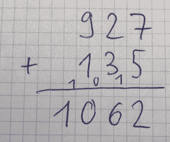

# 七、基本数据结构：列表、集合和映射

在集合框架中，列表、集合和映射作为键值存储由所谓的*容器类*实现。它们管理其他类的对象。包`java.util`中的接口`List<E>`、`Set<E>`和`Map<K,V>`作为容器类的基础。它们存储对象引用。因此，处理原语类型只有在它们被转换成包装器对象(如`Byte`、`Integer`或`Double`)时才有可能。从 Java 5 开始，这是通过隐式的自动装箱/拆箱自动完成的。

## 7.1 导言

### 7.1.1 接口集合

接口`java.util.Collection<E>`定义了实现接口`List<E>`和`Set<E>`的各种容器类的基础。接口`Collection<E>`提供了以下方法，但是*没有*索引访问:

*   `int size()`获取存储在集合中的元素数量。

*   `boolean isEmpty()`检查元素是否存在。

*   `boolean add(E element)`向集合中添加元素。

*   `boolean addAll(Collection<? extends E> collection)`是一个批量操作，它将所有传递的元素添加到集合中。

*   `boolean remove(Object object)`从集合中移除元素。

*   从集合中移除所有传递的元素(如果有的话)。

*   `boolean contains(Object object)`检查元素是否包含在集合中。

*   `boolean containsAll(Collection<?> collection)`检查集合中是否包含所有指定的元素。

*   `boolean retainAll(Collection<?> collection)`保留给定集合中包含的集合的所有元素。

像`add()`和`remove()`这样的修改方法，如果集合发生了变化，返回值`true`，否则返回值`false`。这对器械包尤其重要。

Hint: Signature of `Contains()`, `Containsall()`, and Others

一个小注意:为什么方法`contains()`、`containsAll()`、`retainAll()`以及`remove()`和`removeAll()`不使用通用类型`E`而是使用`Object?`根据方法契约，`equals(Object)`将输入对象与集合的元素进行比较，但是类型只是通过`equals(Object)`的实现间接相关。

### 7.1.2 列表和接口列表

列表是按位置排序的元素序列。也允许重复。集合框架定义了接口`List<E>`来描述列表。这允许索引访问，以及添加和删除元素。已知的实现是类`ArrayList<E>`和`LinkedList<E>`。

#### 界面列表

接口`List<E>`构成了所有列表的基础，并为接口`Collection<E>`的方法提供了*附加的*以下基于 0 的索引访问:

*   `E get(int index)`获取位置`index`的元素。

*   `void add(int index, E element)`在位置索引处添加元素`element`。

*   `E set(int index, E element)`用传递的元素`element`替换位置`index`的元素，并返回先前存储在该位置的元素。

*   `E remove(int index)`删除列表中`index`位置的元素，并返回被删除的元素。

*   `int indexOf(Object object)`和`lastIndexOf(Object)`返回被搜索元素的位置。使用`equals(Object)`方法检查搜索元素和列表中各个元素之间的相等性。搜索从列表的开头`(indexOf(Object))`或末尾(`lastIndexOf(Object)`)开始。

### 7.1.3 集合和接口集合

在以下章节中，您将继续学习器械包和界面`Set<E>`。集合的数学概念表明它们不包含重复项。

#### 界面设置

接口`Set<E>`基于接口`Collection<E>`。与接口`List<E>`不同的是，在接口`Set<E>`中，除了`Collection<E>`接口的方法之外，没有其他方法。然而，`add(E)`和`addAll(Collection<? extends E>)`方法的行为被指定为不可能重复。这是保证无重复所必需的，即使同一个对象被多次添加到集合中。

### 7.1.4 键值映射和接口映射

现在让我们考虑一下接口`Map<K,V>`。它的实现实现了从键到值的映射。通常地图也被称为字典、T2 或查找表、T4。基本思想是为每个存储值分配一个唯一的键。一个直观的例子是电话簿，其中姓名被映射到电话号码。搜索姓名(关键字)通常会很快返回电话号码(值)。如果没有从电话号码到姓名的映射，查找姓名到电话号码就变得非常耗时。

#### 界面图

映射将数据存储为键值对。每个条目由内部接口`Map.Entry<K,V>`表示，它实现了键(类型参数`K`)和值(类型参数`V`)之间的映射。因此，`Map<K,V>`接口中的方法是为这种存储键值映射的特殊方式而设计的。尽管如此，它们还是和`Collection<E>`界面中的相似。但是，`Collection<E>`不作为`Map<K,V>`的基础，T6 是一个独立的基础类型。

接口`Map<K,V>`提供了以下方法，其中包括:

*   `V put(K key, V value)`将映射(从键到值)作为条目添加到该映射。如果已经为传递的键存储了一个值，它将被新值覆盖。如果有这样的条目，则该方法返回以前与该键关联的值；否则，它返回 null。

*   将传递的地图中的所有条目插入到该地图中。类似于方法`put(K,V)`的操作，已经存在的条目的值被覆盖。

*   `V remove(Object key)`从映射中删除一个条目(关键字和相关值)。返回值是与键`key`或`null`相关联的值，如果没有为这个键存储条目的话。

*   `V get(Object key)`获取键`key`的相关值。如果该项不存在，则返回`null`。

*   `boolean containsKey(Object key)`检查键`key`是否存储在映射中，如果是，则返回 true。

*   `boolean containsValue(Object value)`检查值`value`是否存储在地图中，如果是，则返回`true`。

*   `void clear()`删除地图的所有条目。

*   `int size()`获取存储在地图中的条目数。

*   `boolean isEmpty()`检查地图是否为空。

除了刚才介绍的方法之外，还有以下方法提供对存储的键、值和条目的访问:

*   `Set<K> keySet()`返回包含所有键的集合。

*   `Collection<V> values()`将值作为集合返回。

*   `Set<Map.Entry<K,V>> entrySet()`返回所有条目的集合。这提供了对键和值的访问。

这三种方法都提供了数据视图。如果对基础地图进行了更改，这些更改会反映在视图中。 ***请注意，各自视图中的变化也会转移到*** 地图上。

简单地说，我想讨论一下`keySet()`和`values()`的不同返回类型。`keySet()`方法返回一个`Set<K>`，因为映射中的键必须是惟一的。这些值可能出现多次，所以`values()`返回一个`Collection<V>`。

### 7.1.5 作为 LIFO 数据结构的堆栈

堆栈数据结构由类`java.util.Stack<E>`在 JDK 中实现。

一叠类似于一叠纸或一个桌面托盘。你把东西放在上面，你只能从上面拿东西。此外，还可以看到顶部元素。除此之外，还存在大小信息或至少检查元素是否存在。这导致形成 API 的以下方法:

*   `void push(E)`在顶部添加元素。

*   `E pop()`从顶部获取元素。

*   `E peek()`查看顶部元素。

*   `boolean isEmpty()`检查堆栈是否为空。

这四种方法足以在实践中为各种任务和算法有效地使用堆栈，例如，当序列必须反转时。这种特性在计算机科学中用后进先出的术语来描述。

#### 例子

例如，您可以将一些元素放在堆栈上，查看顶部的元素，从顶部获取元素，最后，根据预期检查堆栈是否为空:

```java
final Stack<String> stack = new Stack<>(); stack.push("first");
stack.push("second");

System.out.println("PEEK: " + stack.peek());
System.out.println("POP: " + stack.pop());
System.out.println("POP: " + stack.pop());
System.out.println("ISEMPTY: " + stack.isEmpty());

```

这提供了以下输出:

```java
PEEK: second
POP: second
POP: first
ISEMPTY: true

```

### 7.1.6 作为 FIFO 数据结构的队列

为了结束对重要数据结构的介绍，我想提一下数据结构队列，它是由接口`java.util.Queue<E>`在 JDK 中建模的。排队类似于收银机前的排队。人们排队，谁先来谁先服务，在计算机科学中被称为先进先出。

不幸的是，JDK 中的`Queue<E>`接口非常混乱，因为它是从`Collection<E>`派生出来的——这是与 JDK 堆栈类似的设计缺陷。在这两种情况下，API 都被许多不相关的方法污染了，这意味着误用是不可避免的。 <sup>[1](#Fn1)</sup>

通常，只需要几个操作就可以从队列中获益，比如添加和删除元素。此外，可以查看开头的元素。除此之外，它还提供大小信息或至少检查元素是否存在。这导致形成 API 的以下方法:

*   将一个元素添加到队列的末尾。

*   `E poll()`查看队列开头的元素。

*   `E peek()`查看队列开头的元素。

*   `boolean isEmpty()`检查队列是否为空。

这四种方法足以为实践中的各种任务和算法创建队列，例如，如果您打算将递归算法转换为迭代算法。

下面还有一个小注意事项:插入和移除的方法名是从 Java API 借用的。如果您自己开发数据容器，那么使用`void enqueue(E)`插入和`E dequeue()`移除肯定是更好的名字，因为它们更清楚地反映了这个概念。

#### 例子

例如，您可以向队列中添加一些元素，然后只要有元素就处理它们。为了显示特殊处理，对条目*迈克尔*进行重新处理。类似的习惯用法存在于各种使用队列作为数据结构的算法中。

```java
public static void main(final String[] args)
{
    final Queue<String> waitingPersons = new LinkedList<>();

    waitingPersons.offer("Marcello");
    waitingPersons.offer("Michael");
    waitingPersons.offer("Karthi");

    while (!waitingPersons.isEmpty())
    {
        if (waitingPersons.peek().equals("Michael"))
        {
           // At the end " queue again" and process
           waitingPersons.offer("Michael again");
           waitingPersons.offer("Last Man");
        }
        final String nextPerson = waitingPersons.poll();
        System.out.println("Processing " + nextPerson);
    }
}

```

小样本程序提供以下输出:

```java
Processing Marcello
Processing Michael
Processing Karthi
Processing Michael again
Processing Last Man

```

## 7.2 练习

### 7.2.1 练习 1:设置操作(★★✩✩✩)

#### 练习 1a:共同要素(★★✩✩✩)

找到两个集合 *A* 和 *B* 的公共元素，使用和不使用集合框架的匹配方法。写方法`Set<T> findCommon(Collection<T>, Collection<T>)`。

#### 例子

<colgroup><col class="tcol1 align-left"> <col class="tcol2 align-left"> <col class="tcol3 align-left"></colgroup> 
| 

输入 A

 | 

输入 B

 | 

结果

 |
| --- | --- | --- |
| [1, 2, 4, 7, 8] | [2, 3, 7, 9] | [2, 7] |
| [1, 2, 7, 4, 7, 8] | [7, 7, 3, 2, 9] | [2, 7] |
| [2, 4, 6, 8] | [1, 3, 5, 7, 9] | * =[] |

#### 练习 1b:集合运算(★★✩✩✩)

给定两个集合 *A* 和 *B* ，分别计算差集*A*—*B*和*B*—*A*，并集*A*∩*B*，交集 *A* ∩ *B* 。

#### 例子

<colgroup><col class="tcol1 align-left"> <col class="tcol2 align-left"> <col class="tcol3 align-left"> <col class="tcol4 align-left"> <col class="tcol5 align-left"> <col class="tcol6 align-left"></colgroup> 
| 

输入 A

 | 

输入 B

 | 

美国罗克韦尔

 | 

B - A

 | 

A ∪ B

 | 

A ∩ B

 |
| --- | --- | --- | --- | --- | --- |
| [1, 2, 3, 4, 5] | [2, 4, 6, 7] | [1, 3, 5] | [6, 7] | [1, 2, 3, 4, 5, 6, 7] | [2, 4] |
| [2, 4, 6] | [1, 3, 5, 7] | [2, 4, 6] | [1, 3, 5, 7] | [1, 2, 3, 4, 5, 6, 7] | * =[] |

### 7.2.2 练习 2:列表反转(★★✩✩✩)

#### 练习 2a:列表反转(★★✩✩✩)

编写方法`List<T> reverse(List<T>)`,它创建一个结果列表并以相反的顺序返回原始列表的元素。

#### 例子

<colgroup><col class="tcol1 align-left"> <col class="tcol2 align-left"></colgroup> 
| 

投入

 | 

结果

 |
| --- | --- |
| [1, 2, 3, 4] | [4, 3, 2, 1] |
| ["A "、" BB "、" CCC "、" DDDD"] | ["DDDD "、" CCC "、" BB "、" A"] |

#### 练习 2b:原地列出反转(★★✩✩✩)

如果您想要实现就地反转顺序，以便对非常大的数据集进行内存优化，会有什么不同？那么应该给什么呢？

#### 练习 2c:没有性能索引访问的反向列表(★★✩✩✩)

现在让我们假设没有可用的高性能随机索引访问。如果你想颠倒一个`LinkedList<E>`的顺序会怎么样？在那里，任何基于位置的访问都将导致列表遍历到所需的元素。如何避免这种情况？

Tip

使用堆栈。

### 7.2.3 练习 3:删除重复项(★★✩✩✩)

你应该从列表中删除重复的条目。约束条件是应该保留原始顺序。因此写方法`List<T> removeDuplicates(List<T>)`。

#### 例子

<colgroup><col class="tcol1 align-left"> <col class="tcol2 align-left"></colgroup> 
| 

投入

 | 

结果

 |
| --- | --- |
| [1, 1, 2, 3, 4, 1, 2, 3] | [1, 2, 3, 4] |
| [7, 5, 3, 5, 1] | [7, 5, 3, 1] |
| [1, 1, 1, 1] | [1] |

### 7.2.4 练习 4:最大利润(★★★✩✩)

让我们假设你有一个按时间顺序排列的价格序列，你想计算最大利润。挑战在于确定在什么时间(或者在这种情况下是什么价值)买入和卖出是最理想的。为此编写方法`int maxRevenue(List<Integer>)`，其中时间顺序由列表中的索引表示。

#### 例子

<colgroup><col class="tcol1 align-left"> <col class="tcol2 align-left"></colgroup> 
| 

投入

 | 

结果

 |
| --- | --- |
| [250, 270, 230, 240, 222, 260, 294, 210] | seventy-two |
| [0, 10, 20, 30, 40, 50, 60, 70] | Seventy |
| [70, 60, 50, 40, 30, 20, 10, 0] | Zero |
| [ ] | Zero |

### 7.2.5 练习 5:最长序列(★★★✩✩)

假设你正在用一系列数字来模拟股票价格或一条轨迹的高度。找出值递增或至少保持不变的最长的数字序列。写方法`List<Integer> findLongestGrowingSequence(List<Integer>)`。

#### 例子

<colgroup><col class="tcol1 align-left"> <col class="tcol2 align-left"></colgroup> 
| 

投入

 | 

结果

 |
| --- | --- |
| [7, 2, 7, 1, 2, 5, 7, 1] | [1, 2, 5, 7] |
| [7, 2, 7, 1, 2, 3, 8, 1, 2, 3, 4, 5] | [1, 2, 3, 4, 5] |
| [1, 1, 2, 2, 2, 3, 3, 3, 3] | [1, 1, 2, 2, 2, 3, 3, 3, 3] |

### 7.2.6 练习 6:拥有堆栈(★★✩✩✩)

以 JDK 的班级为例。执行设计分析并识别可能的漏洞。定义栈的基本需求，并基于这些需求，使用`List<E>`实现类`Ex06_Stack<E>`。

### 7.2.7 练习 7:格式良好的大括号(★★✩✩✩)

编写方法`boolean checkParentheses(String)`,检查大括号序列是否整齐地嵌套在每种情况下。这应该接受圆括号、方括号和花括号，但不接受其他字符。

#### 例子

<colgroup><col class="tcol1 align-left"> <col class="tcol2 align-left"> <col class="tcol3 align-left"></colgroup> 
| 

投入

 | 

结果

 | 

评论

 |
| --- | --- | --- |
| "(( ))" | 真实的 |   |
| "({[ ]})" | 真实的 |   |
| "((( ))" | 错误的 | 大括号的数量为奇数 |
| "((一)" | 错误的 | 错别字，没有花括号 |
| "(( ] )" | 错误的 | 没有匹配的大括号 |

**奖励**扩展解决方案，提供错误原因的清晰映射。从下面的`enum`枚举开始:

```java
static enum CheckResult
{
   OK, ODD_LENGTH, CLOSING_BEFORE_OPENING, MISMATCHING, INVALID_CHAR,
   REMAINING_OPENING
}

```

### 7.2.8 练习 8:检查一个神奇的三角形(★★★✩✩)

编写方法`boolean isMagicTriangle(List<Integer>)`,检查一系列数字是否形成一个神奇的三角形。这样的三角形被定义为三条边的值之和必须相等的三角形。

#### 例子

下面显示了边长分别为 3 和 4 的一个三角形的情况:

```java
  1         2
 6 5       8 5
2 4 3     4   9
         3 7 6 1

```

这导致以下方面和总和:

<colgroup><col class="tcol1 align-left"> <col class="tcol2 align-left"> <col class="tcol3 align-left"></colgroup> 
| 

投入

 | 

价值观 1

 | 

价值观 2

 |
| --- | --- | --- |
| 第一面 | 1 + 5 + 3 = 9 | 2 + 5 + 9 + 1 = 17 |
| 第二面 | 3 + 4 + 2 = 9 | 1 + 6 + 7 + 3 = 17 |
| 第三面 | 2 + 6 + 1 = 9 | 3 + 4 + 8 + 2 = 17 |

Tip

将三角形的各个边表示为子列表，并使用`List<E> subList(int startInclusive, int endExclusive)`方法提取各个边。

### 7.2.9 练习 9:帕斯卡三角形(★★★✩✩)

编写方法`List<List<Integer>> pascal(int)`,根据嵌套列表计算帕斯卡三角形。正如你所知道的，每一个新的行都是由前一行产生的。如果其中有两个以上的元素，则将两个值相加，求和得到新行的值。在每种情况下，前面和后面都会附加一个 1。

#### 例子

对于值 5，所需的表示如下:

```java
[1]
[1, 1]
[1, 2, 1]
[1, 3, 3, 1]
[1, 4, 6, 4, 1]

```

### 7.2.10 练习 10:最常见的元素(★★✩✩✩)

编写计算直方图的方法`Map<Integer, long> valueCount(List<Integer>)`,即传递的列表中数字的频率分布。此外，编写方法`Map<Integer, Long> sortByValue(Map<Integer, Long>)`,根据值而不是键对地图进行排序。必须实现降序排序，最高值列在开头。

#### 例子

<colgroup><col class="tcol1 align-left"> <col class="tcol2 align-left"> <col class="tcol3 align-left"></colgroup> 
| 

投入

 | 

结果

 | 

最常见的

 |
| --- | --- | --- |
| [1, 2, 3, 4, 4, 4, 3, 3, 2, 4] | {1=1, 2=2, 3=3, 4=4} | 4=4 |
| [1, 1, 1, 2, 2, 2, 3, 3, 3] | {1=3, 2=3, 3=3} | 根据查询，逻辑上所有 |

### 7.2.11 练习 11:数字加法(★★★✩✩)

考虑两个要相加的十进制数。听起来很简单，但是对于这个任务，这些数字有趣地被表示为一个数字列表。写方法`List<Integer> listAdd(List<Integer>, List<Integer>)`。此外，考虑溢出的特殊情况。

#### 练习 11a:加法(★★★✩✩)

在任务的第一部分，数字按照它们在列表中出现的顺序存储。

#### 例子

<colgroup><col class="tcol1 align-left"> <col class="tcol2 align-left"> <col class="tcol3 align-left"></colgroup> 
| 

输入 1

 | 

输入 2

 | 

结果

 |
| --- | --- | --- |
| 123 = [1, 2, 3] | 456 = [4, 5, 6] | 579 = [5, 7, 9] |
| 927 = [9, 2, 7] | 135 = [1, 3, 5] | 1062 = [1, 0, 6, 2] |

#### 练习 11b:加法逆运算(★★★✩✩)

如果数字在列表中逆序存储会有什么变化？

#### 例子

<colgroup><col class="tcol1 align-left"> <col class="tcol2 align-left"> <col class="tcol3 align-left"></colgroup> 
| 

输入 1

 | 

输入 2

 | 

结果

 |
| --- | --- | --- |
| 123 = [3, 2, 1] | 456 = [6, 5, 4] | 579 = [9, 7, 5] |
| 927 = [7, 2, 9] | 135 = [5, 3, 1] | 1062 = [2, 6, 0, 1] |

### 7.2.12 练习 12:复合键(★★✩✩✩)

假设您想在一个映射中使用两个或更多的值作为一个键。也就是你要用一个所谓的*复合键*。例如，这样的键由两个`int`值组成，或者由一个`String`和一个`int`组成。如何实现这一点？

#### 例子

<colgroup><col class="tcol1 align-left"> <col class="tcol2 align-left"></colgroup> 
| 

复合键(月、年)

 | 

会议

 |
| --- | --- |
| (2019 年 9 月) | ch 开放苏黎世，甲骨文代码一 SF |
| (2019 年 10 月) | JAX 伦敦 |
| (2019 年 11 月) | W-JAX 慕尼黑 |

<colgroup><col class="tcol1 align-left"> <col class="tcol2 align-left"></colgroup> 
| 

复合关键字(姓名、年龄)

 | 

业余爱好

 |
| --- | --- |
| (彼得，22 岁) | 电视 |
| (迈克，48 岁) | Java，骑自行车，电影 |

### 7.2.13 练习 13:列表合并(★★✩✩✩)

给定两个数字列表，每个列表都按升序排序，根据它们的顺序将它们合并成一个结果列表。写方法`List<Integer> merge(List<Integer>, List<Integer>)`。

#### 例子

<colgroup><col class="tcol1 align-left"> <col class="tcol2 align-left"> <col class="tcol3 align-left"></colgroup> 
| 

输入 1

 | 

输入 2

 | 

结果

 |
| --- | --- | --- |
| 1, 4, 7, 12, 20 | 10, 15, 17, 33 | 1, 4, 7, 10, 12, 15, 17, 20, 33 |
| 2, 3, 5, 7 | 11, 13, 17 | 2, 3, 5, 7, 11, 13, 17 |
| 2, 3, 5, 7, 11 | 7, 11, 13, 17 | 2, 3, 5, 7, 7, 11, 11, 13, 17 |
| [1, 2, 3] | * =[] | [1, 2, 3] |

### 7.2.14 练习 14: Excel 魔术选择(★★✩✩✩)

如果你用过一点 Excel，那么你可能用过所谓的魔法选择。它会根据先前的值，在选定的区域中不断填充值。例如，这适用于数字、工作日或日期。为了自己实现类似的东西，编写方法`List<Integer> generateFollowingValues(int, int)`，为数字实现这个。创建一个适合工作日的变体，并使用以下签名:`List<DayOfWeek> generateFollowingValues(DayOfWeek, int)`

#### 例子

<colgroup><col class="tcol1 align-left"> <col class="tcol2 align-left"> <col class="tcol3 align-left"></colgroup> 
| 

基础资料

 | 

数数

 | 

结果

 |
| --- | --- | --- |
| one | seven | [1, 2, 3, 4, 5, 6, 7] |
| five | four | [5, 6, 7, 8] |
| 星期五 | eight | [星期五、星期六、星期日、星期一、星期二、星期三、星期四、星期五] |

## 7.3 解决方案

### 7.3.1 解决方案 1:设置操作(★★✩✩✩)

#### 解决方案 1a:共同要素(★★✩✩✩)

找到两个集合 *A* 和 *B* 的公共元素，使用和不使用集合框架的匹配方法。写方法`Set<T> findCommon(Collection<T>, Collection<T>)`。

#### 例子

<colgroup><col class="tcol1 align-left"> <col class="tcol2 align-left"> <col class="tcol3 align-left"></colgroup> 
| 

输入 A

 | 

输入 B

 | 

结果

 |
| --- | --- | --- |
| [1, 2, 4, 7, 8] | [2, 3, 7, 9] | [2, 7] |
| [1, 2, 7, 4, 7, 8] | [7, 7, 3, 2, 9] | [2, 7] |
| [2, 4, 6, 8] | [1, 3, 5, 7, 9] | * =[] |

**算法**集合框架提供了`retainAll()`方法来确定公共元素。这需要为结果创建一个新的`Set<E>`,以便在原始集合中不发生修改:

```java
static <T> Set<T> findCommon(final Collection<T> collection1,
                             final Collection<T> collection2)
{
    final Set<T> results = new HashSet<>(collection1);
    results.retainAll(collection2);

    return results;
}

```

你现在不用 JDK 方法，而是用地图。您维护一个包含在集合 1 或 2 中的计数器。为了适当地填充它们，首先要遍历集合 1 中的所有元素，并在映射中输入值 1。现在您遍历第二个集合的所有元素。使用`computeIfPresent()`,如果值在映射中已经有一个条目，则增加计数器。因此，两个集合中的所有元素都接收值 2，并且多次出现时接收更高的值。另一方面，来自集合 2 的专有元素从不被存储。最后，您只保留那些数量大于或等于 2 的条目。

```java
static <T> Set<T> findCommonNoJdk(final Collection<T> collection1,
                                  final Collection<T> collection2)
{
    final Map<T, Long> results = new HashMap<>();
    populateFromCollection1(collection1, results);
    markIfAlsoInSecond(collection2, results);

    return removeAllJustInOneCollection(results);
}

static <T> void populateFromCollection1(final Collection<T> collection1,
                                        final Map<T, Long> results)
{
    for (T elem1 : collection1)
    {
        results.put(elem1, 1L);
    }
}

static <T> void markIfAlsoInSecond(final Collection<T> collection2,
                                   final Map<T, Long> results)
{
    for (T elem2 : collection2)
    {
        results.computeIfPresent(elem2, (key, value) -> value + 1);
    }
}

static <T> Set<T> removeAllJustInOneCollection(final Map<T, Long> results)
{
    return results.entrySet().stream().filter(entry -> entry.getValue() >= 2).
                                      map(entry -> entry.getKey()).
                                      collect(Collectors.toSet());
}

```

看着看着，显然显得太复杂了。那么如何做得更好呢？

**优化算法**事实上，通过检查第一个集合中的所有元素是否包含在第二个集合中，然后将该值包含在以下情况的结果集中，可以以更简洁、更容易理解的方式解决该问题:

```java
static <T> Set<T> findCommonTwoLoops(final Collection<T> collection1,
                                     final Collection<T> collection2)
{
    final Set<T> results = new HashSet<>();

    for (T elem1 : collection1)
    {
        for (T elem2 : collection2)
        {
            if (elem1.equals(elem2))
                results.add(elem1);
        }
    }
    return results;
}

```

#### 确认

您可以通过以下单元测试来检查实现——这里只显示了最复杂变体的摘录:

```java
@ParameterizedTest(name = "findCommonNoJdk({0}, {1}) = {2}")
@MethodSource("createCollectionsAndExpected")
void testFindCommonNoJdk(Collection<Integer>  col1,
                         Collection<Integer> col2, Set<Integer> expected)
{
    final Set<Integer> result = Ex01_SetOperations.findCommonNoJdk(col1, col2);

    assertEquals(expected, result);
}

private static Stream<Arguments> createCollectionsAndExpected()
{
    return Stream.of(Arguments.of(List.of(1, 2, 4, 7, 8),
                                  List.of(2, 3, 7, 9), Set.of(2, 7)),
                     Arguments.of(List.of(1, 2, 7, 4, 7, 8),
                                  List.of(7, 7, 3, 2, 9), Set.of(2, 7)),
                     Arguments.of(List.of(2, 4, 6, 8),
                                  List.of(1, 3, 5, 7, 9), Set.of()));
}

```

#### 解决方案 1b:集合运算(★★✩✩✩)

给定两个集合 *A* 和 *B* ，分别计算差集*A*—*B*和*B*—*A*，并集*A*∩*B*，交集 *A* ∩ *B* 。

#### 例子

<colgroup><col class="tcol1 align-left"> <col class="tcol2 align-left"> <col class="tcol3 align-left"> <col class="tcol4 align-left"> <col class="tcol5 align-left"> <col class="tcol6 align-left"></colgroup> 
| 

输入 A

 | 

输入 B

 | 

美国罗克韦尔

 | 

B - A

 | 

A ∪ B

 | 

A ∩ B

 |
| --- | --- | --- | --- | --- | --- |
| [1, 2, 3, 4, 5] | [2, 4, 6, 7] | [1, 3, 5] | [6, 7] | [1, 2, 3, 4, 5, 6, 7] | [2, 4] |
| [2, 4, 6] | [1, 3, 5, 7] | [2, 4, 6] | [1, 3, 5, 7] | [1, 2, 3, 4, 5, 6, 7] | * =[] |

**算法**例如，你已经知道集合框架的方法能够确定交集。进一步是可能的:在`removeAll()`和`addAll()`的帮助下，差集和并集可以被确定。

必须适当地调用这些方法来实现赋值。首先，用第一个集合的值填充一个`HashSet<E>`。之后，执行所需的操作，以便删除或添加元素。您的方法被命名为`difference()`、`union()`和`intersection()`，这样它们的使用应该是直观的。

```java
static <T> Set<T> difference(final Collection<T> collection1,
                             final Collection<T> collection2)
{
    final Set<T> results = new HashSet<>(collection1);
    results.removeAll(collection2);
    return results;
}

static <T> Set<T> union(final Collection<T> collection1,
                        final Collection<T> collection2)
{
    final Set<T> results = new HashSet<>(collection1);
    results.addAll(collection2);
    return results;
}

static <T>  Set<T> intersection(final Collection<T> collection1,
                                final Collection<T> collection2)
{
    final Set<T> results = new HashSet<>(collection1);
    results.retainAll(collection2);
    return results;
}

```

**优化算法**尽管所示的实现非常容易理解，而且简洁明了，但您可能仍然会被一个细节所困扰:您总是必须创建一个新的结果集合，以避免原始集合发生变化。

让我们看看流 API 的替代方案。虽然`difference()`和`intersection()`对于`filter()`来说非常明显，但是`union()`实现了流 API 中可能很少使用并且不太为人所知的方法`concat()`来连接两个流。结果流将包含第一个流的所有元素，然后包含第二个流的所有元素。

```java
static <T> Set<T> differenceV2(final Collection<T> collection1,
                               final Collection<T> collection2)
{
    return collection1.stream().
                       filter(element -> !collection2.contains(element)).
                       collect(Collectors.toSet());
}

static <T> Set<T> unionV2(final Collection<T> collection1,
                          final Collection<T> collection2)
{
    return Stream.concat(collection1.stream(), collection2.stream()).
                  collect(Collectors.toSet());
}

static <T> Set<T> intersectionV2(final Collection<T> collection1,
                                 final Collection<T> collection2)
{
    return collection1.stream().
                       filter(element -> collection2.contains(element)).
                       collect(Collectors.toSet());
}

```

#### 确认

为了理解集合操作，您定义了两个列表，每个列表包含简介中的值，然后调用方法`performSetOperations()`，该方法执行四个集合操作:

```java
jshell> performSetOperations(List.of(1, 2, 3, 4, 5), List.of(2, 4, 6, 7, 8))
A: [1, 2, 3, 4, 5]
B: [2, 4, 6, 7, 8]
dif A-B: [1, 3, 5]
dif B-A: [6, 7, 8]
uni A+B: [1, 2, 3, 4, 5, 6, 7, 8]
sec A+B: [2, 4]

jshell> performSetOperations(List.of(2, 4, 6, 8), List.of(1, 3, 5, 7))
A: [2, 4, 6, 8]
B: [1, 3, 5, 7]
dif A-B: [2, 4, 6, 8]
dif B-A: [1, 3, 5, 7]
uni A+B: [1, 2, 3, 4, 5, 6, 7, 8]
sec A+B: []

```

您按如下方式实现 helper 方法:

```java
static void performSetOperations(final Collection<Integer> colA,
                                 final Collection<Integer> colB)
{
    System.out.println("A: " + colA);
    System.out.println("B: " + colB);
    System.out.println("dif A-B: " + difference(colA, colB));
    System.out.println("dif B-A: " + difference(colB, colA));
    System.out.println("uni A+B: " + union(colA, colB));
    System.out.println("sec A+B: " + intersection(colA, colB));
    System.out.println();
}

```

让我们以联合集的测试用例为例——其他测试的实现类似:

```java
@ParameterizedTest(name = "unionV2({0}, {1}) = {2}")
@MethodSource("createCollectionsAndUnionExpected")
void testUnionV2(Set<Integer> colA, Set<Integer> colB,
                 Set<Integer> expectedUnion)
{
    final Set<Integer> result = Ex01_SetOperations.unionV2(colA, colB);

    assertEquals(expectedUnion, result);
}

private static Stream<Arguments> createCollectionsAndUnionExpected()
{
    return Stream.of(Arguments.of(Set.of(1, 2, 3, 4, 5), Set.of(2, 4, 6, 7, 8),
                                  Set.of(1, 2, 3, 4, 5, 6, 7, 8)),
                     Arguments.of(Set.of(2, 4, 6), Set.of(1, 3, 5, 7),
                                  Set.of(1, 2, 3, 4, 5, 6, 7)));
}

```

### 7.3.2 解决方案 2:反向列表(★★✩✩✩)

#### 解决方案 2a:反向列表(★★✩✩✩)

编写方法`List<T> reverse(List<T>)`,它创建一个结果列表并以相反的顺序返回原始列表的元素。

#### 例子

<colgroup><col class="tcol1 align-left"> <col class="tcol2 align-left"></colgroup> 
| 

投入

 | 

结果

 |
| --- | --- |
| [1, 2, 3, 4] | [4, 3, 2, 1] |
| ["A "、" BB "、" CCC "、" DDDD"] | ["DDDD "、" CCC "、" BB "、" A"] |

**算法**一个简单的解决方案是从后向前遍历一个列表，对于每个位置，将当前元素添加到一个结果列表中。这可以基于索引实现，如下所示:

```java
static <T> List<T> reverse(final List<T> values)
{
    final List<T> result = new ArrayList<>();

    for (int i = values.size() - 1; i >= 0; i--)
    {
        result.add(values.get(i));
    }
    return result;
}

```

这里，在每种情况下都使用`get(i)`执行基于索引的访问。这样的访问对于具有 O`(1)`的`ArrayList<E>`是有效的，但是对于具有`(`O*n*`)`的`LinkedList<E>`则明显更差。更优雅的方式是使用`ListIterator<T>`。一方面，运行时间与列表实现无关，因为根据具体类型，`ArrayList<E>`或者通过索引导航，或者`LinkedList<E>`通过其节点导航。另一方面，`ListIterator<T>`允许通过参数指定开始位置。随后，这个位置被放置在从末尾开始遍历的最后一个元素之后。最后，除了正常的`Iterator<T>`之外，还可以使用方法`hasPrevious()`和`previous()`向后导航。

```java
static <T> List<T> listReverseWithListIterator(final List<T> values)
{
    final List<T> result = new ArrayList<>();

    final ListIterator<T> it = values.listIterator(values.size()));
    while (it.hasPrevious())
    {
        result.add(it.previous());
    }
    return result;
}

```

#### 解决方案 2b:原地反向列表(★★✩✩✩)

如果您想实现逆序，以便对庞大的数据集进行内存优化，会有什么不同呢？那么应该给什么呢？

**算法**基于索引访问，从开头和结尾向内进行，交换元素:

```java
// only performant with indexed access with O(1)
static <T> void listReverseInplace(final List<T> inputs)
{
    // run from the left and right, swap the elements based on their positions
    int left = 0;
    int right = inputs.size() - 1;

    while (left < right)
    {
        final T leftValue = inputs.get(left);
        final T rightValue = inputs.get(right);

        inputs.set(left, rightValue);
        inputs.set(right, leftValue);

        left++;
        right--;
    }
}

```

然而，这仅在给定运行时间为*O*T0】的基于索引的访问时才有效。对于`LinkedList<E>`来说，这并不适用。因此，所示的解决方案性能不佳，因此不太适合。此外，传递的列表必须是可变的。否则，不能通过调用`set()`来改变元素。

#### 解决方案 2c:没有性能索引访问的列表反转(★★✩✩✩)

现在让我们假设没有可用的高性能随机索引访问。如果你想颠倒一个`LinkedList<E>`的顺序会怎么样？在那里，任何基于位置的访问都将导致列表遍历到所需的元素。如何避免这种情况？

Tip

使用堆栈。

**算法**在没有基于性能索引的访问可用的情况下，你仍然必须以运行时间复杂度 *O* `(` *n* `)`来反转顺序，栈开始发挥作用——就像其他各种算法一样，包括这个。您从前到后遍历列表，每次都将当前元素放入堆栈。然后，迭代地从堆栈中移除顶部元素，并将其添加到结果列表中，直到堆栈为空。

```java
static <T> List<T> listReverseWithStack(final List<T> inputs)
{
    // idea: Run through the list from front to back (performant) and
    // fill a stack
    final Stack<T> allValues = new Stack<>();
    final Iterator<T> it = inputs.iterator();
    while (it.hasNext())
    {
        allValues.push(it.next());
    }

    // empty the stack and fill a result list
    final List<T> result = new ArrayList<>();
    while (!allValues.isEmpty())
    {
        result.add(allValues.pop());
    }

    return result;
}

```

这种解决方案需要两次传递和额外的内存。尽管如此，它还是比在循环中调用基于索引的方法`get()`的版本有效得多。为什么呢？当使用一个`LinkedList<E>`时，对于每个索引访问，它遍历其元素到期望的位置，产生*O*`(`*n*<sup>2</sup>`)`。

#### 确认

让我们用示例中的输入值进行实验，并调用您之前创建的方法:

```java
@ParameterizedTest(name = "listReverse({0}) = {1}")
@MethodSource("listInputsAndExpected")
<T> void listReverse(List<T> inputs, List<T> expected)
{
    final List<T> result = Ex02_ListReverse.listReverse(inputs);

    assertEquals(expected, result);
}

@ParameterizedTest(name = "listReverseInplace({0}) = {1}")
@MethodSource("listInputsAndExpected")
<T> void listReverseInplace(List<T> inputs, List<T> expected)
{
    // allow modification of the list by wrapping
    final List<T> modifiableInputs = new ArrayList<>(inputs);
    Ex02_ListReverse.listReverseInplace(modifiableInputs);

    assertEquals(expected, modifiableInputs);
}

static Stream<Arguments> listInputsAndExpected()
{
    return Stream.of(Arguments.of(List.of(1, 2, 3, 4),
                                  List.of(4, 3, 2, 1)),
                     Arguments.of(List.of("A", "BB", "CCC", "DDDD"),
                                  List.of("DDDD", "CCC", "BB", "A")));
}

```

### 7.3.3 解决方案 3:消除重复(★★✩✩✩)

你应该从列表中删除重复的条目。约束条件是应该保留原始顺序。因此写方法`List<T> removeDuplicates(List<T>)`。

#### 例子

<colgroup><col class="tcol1 align-left"> <col class="tcol2 align-left"></colgroup> 
| 

投入

 | 

结果

 |
| --- | --- |
| [1, 1, 2, 3, 4, 1, 2, 3] | [1, 2, 3, 4] |
| [7, 5, 3, 5, 1] | [7, 5, 3, 1] |
| [1, 1, 1, 1] | [1] |

**算法**首先，复制输入以允许修改。然后从前到后遍历列表，并用列表中包含的条目连续填充一个集合。对于列表中的每个元素，检查它是否已经包含在找到的条目集中。如果发现重复，使用`Iterator`的`remove()`方法将其从结果列表中删除。

```java
static <T> List<T> removeDuplicates(final List<T> inputs)
{
    final List<T> result = new ArrayList<>(inputs);
    final Set<T> numbers = new HashSet<>();

    final Iterator<T> it = result.iterator();
    while (it.hasNext())
    {
        final T elem = it.next();

        if (numbers.contains(elem))
            it.remove(); // remove duplicate
        else
            numbers.add(elem);
    }

    return result;
}

```

**优化算法**在实现它的时候，你可能已经有了删除重复项的想法，只要把它们重新填充到一个集合中就行了。这是可行的，但是`HashSet<E>`和`TreeSet<E>`可能会混淆元素的顺序。推荐的解决方法是使用`LinkedHashSet<E>`类，它保留了插入顺序。这使得重复删除实现变得轻而易举。

```java
static List<Integer> removeDuplicatesV2(final List<Integer> inputs)
{
    return new ArrayList<>(new LinkedHashSet<>(inputs));
}

```

几乎总是有替代方案。我想介绍一个使用流 API 的例子。在这个实现中，您利用了这样一个事实，即 Stream API 提供了`distinct()`方法来删除重复项。之后，你只需要把结果转换成一个列表。

```java
static List<Integer> removeDuplicatesV3(final List<Integer> inputs)
{
    return inputs.stream().distinct().collect(Collectors.toList());
}

```

#### 确认

同样，您使用介绍性示例的值来验证实现。下面没有显示这两个优化版本的测试，因为除了方法调用之外，它们是相同的。

```java
@ParameterizedTest(name = "removeDuplicates({0}) = {1}")
@MethodSource("listInputsAndExpected")
void removeDuplicates(List<Integer> inputs, List<Integer> expected)
{
    List<Integer> result = Ex03_ListRemove.removeDuplicates(inputs);

    assertEquals(expected, result);
}

private static Stream<Arguments> listInputsAndExpected()
{
    return Stream.of(Arguments.of(List.of(1, 1, 2, 3, 4, 1, 2, 3),
                                  List.of(1, 2, 3, 4)),
                     Arguments.of(List.of(7, 5, 3, 5, 1), List.of(7, 5, 3, 1)),
                     Arguments.of(List.of(1, 1, 1, 1), List.of(1)));
}

```

### 7.3.4 解决方案 4:最大利润(★★★✩✩)

让我们假设你有一个按时间顺序排列的价格序列，你想计算最大利润。挑战在于确定在什么时间(或者在这个例子中是什么价值)买入和卖出是最理想的。为此编写方法`int maxRevenue(List<Integer>)`，其中时间顺序由列表中的索引表示。

#### 例子

<colgroup><col class="tcol1 align-left"> <col class="tcol2 align-left"></colgroup> 
| 

投入

 | 

结果

 |
| --- | --- |
| [250, 270, 230, 240, 222, 260, 294, 210] | seventy-two |
| [0, 10, 20, 30, 40, 50, 60, 70] | Seventy |
| [70, 60, 50, 40, 30, 20, 10, 0] | Zero |
| [ ] | Zero |

**算法**最初，您可能想确定最小值和最大值，并简单地返回它们的差值。经过短暂的思考，很明显，在这种情况下，必须考虑时间因素。首先，必须先买入，然后以更高的价格卖出，才能实现利润。

下一个想法是运行列表两次。首先，通过查看当前值是否小于当前最小值来确定所有最小值。然后将其添加到当时有效的最小值列表中。在第二次运行时，通过逐个元素的比较来确定最大的差异。如果当前值大于当前有效的最小值，那么由此获得的利润是当前值和在该位置确定的最小值之间的差。最后，从当前最大值和当前利润中的最大值计算最大利润。对于示例 1，结果如下:

<colgroup><col class="tcol1 align-left"> <col class="tcol2 align-left"> <col class="tcol3 align-left"> <col class="tcol4 align-left"> <col class="tcol5 align-left"> <col class="tcol6 align-left"> <col class="tcol7 align-left"> <col class="tcol8 align-left"> <col class="tcol9 align-left"></colgroup> 
| 

**值**

 | 

Two hundred and fifty

 | 

Two hundred and seventy

 | 

Two hundred and thirty

 | 

Two hundred and forty

 | 

Two hundred and twenty-two

 | 

Two hundred and sixty

 | 

Two hundred and ninety-four

 | 

Two hundred and ten

 |
| --- | --- | --- | --- | --- | --- | --- | --- | --- |
| **最小值****差异****max。差异** | Two hundred and fifty | Two hundred and fifty | Two hundred and thirty | Two hundred and thirty | Two hundred and twenty-two | Two hundred and twenty-two | Two hundred and twenty-two | Two hundred and ten |
| Zero | Twenty | Zero | Ten | Zero | Thirty-eight | seventy-two | Zero |
| Zero | Twenty | Twenty | Twenty | Twenty | Thirty-eight | seventy-two | seventy-two |

基于这个想法，您用 Java 实现它，如下所示:

```java
static int maxRevenue(final List<Integer> prices)
{
    final List<Integer> relevantMins = calcRelevantMins(prices);
    return calcMaxRevenue(prices, relevantMins);
}

static List<Integer> calcRelevantMins(final List<Integer> prices)
{
    final List<Integer> relevantMins = new ArrayList<>();

    int currentMin = Integer.MAX_VALUE;
    for (int currentPrice : prices)
    {
        currentMin = Math.min(currentMin, currentPrice);
        relevantMins.add(currentMin);
    }
    return relevantMins;
}

static int calcMaxRevenue(final List<Integer> prices,
                          final List<Integer> relevantMins)
{
    int maxRevenue = 0;
    for (int i = 0; i < prices.size(); i++)
    {
        if (prices.get(i) > relevantMins.get(i))
        {
            final int currentRevenue = prices.get(i) - relevantMins.get(i);
            maxRevenue = Math.max(maxRevenue, currentRevenue);
        }
    }
    return maxRevenue;
}

```

**优化算法**刚刚显示的变化需要两遍。只要访问是在内存中进行的，这几乎不会对性能产生重要影响。如果每次都确定数据，例如，通过 REST 调用或从数据库中确定数据，情况会有所不同。

事实上，可以减少必要的调用和循环迭代的次数。然而，这种优化可能只有在先前的实现已经首先完成的情况下才能实现。

```java
static int maxRevenueV2(final List<Integer> prices)
{
    int currentMin = Integer.MAX_VALUE;
    int maxRevenue = 0;

    for (int currentPrice : prices)
    {
        currentMin = Math.min(currentMin, currentPrice);
        final int currentRevenue = currentPrice - currentMin;
        maxRevenue = Math.max(maxRevenue, currentRevenue);
    }
    return maxRevenue;
}

```

循环中的语句甚至可以进行一些优化。如果调用`min()`的成本很高，那么这一步可能是值得的。作为优化，必须调整最小值(那么`maxRevenue`不能变)或利润，前提是最小值不变。

```java
if (currentPrice < currentMin)
    currentMin = currentPrice;
else
    maxRevenue = Math.max(maxRevenue, currentPrice - currentMin);

```

#### 确认

为了进行测试，您再次使用介绍性示例中的值:

```java
@ParameterizedTest(name = "maxRevenue({0}) = {1}")
@MethodSource("listInputsAndExpected")
void maxRevenue(List<Integer> inputs, int expected)
{
    int result = Ex04_FindMaxRevenue.maxRevenue(inputs);

    assertEquals(expected, result);
}

private static Stream<Arguments> listInputsAndExpected()
{
    return Stream.of(Arguments.of(List.of(250, 270, 230, 240,
                                          222, 260, 294, 210), 72),
                     Arguments.of(List.of(0, 10, 20, 30, 40, 50, 60, 70), 70),
                     Arguments.of(List.of(70, 60, 50, 40, 30, 20, 10, 0), 0),
                     Arguments.of(List.of(), 0));
}

```

### 7.3.5 解决方案 5:最长序列(★★★✩✩)

假设你正在用一系列数字来模拟股票价格或一条轨迹的高度。找出值递增或至少保持不变的最长的数字序列。写方法`List<Integer> findLongestGrowingSequence(List<Integer>)`。

#### 例子

<colgroup><col class="tcol1 align-left"> <col class="tcol2 align-left"></colgroup> 
| 

投入

 | 

结果

 |
| --- | --- |
| [7, 2, 7, 1, 2, 5, 7, 1] | [1, 2, 5, 7] |
| [7, 2, 7, 1, 2, 3, 8, 1, 2, 3, 4, 5] | [1, 2, 3, 4, 5] |
| [1, 1, 2, 2, 2, 3, 3, 3, 3] | [1, 1, 2, 2, 2, 3, 3, 3, 3] |

**算法**这里使用了所谓的*贪心*算法。其思想是从一个元素开始收集后续元素，直到下一个元素小于当前元素。临时列表和结果列表用于此目的。这两个元素最初都是空的，随后被填充:每个元素读取的大于或等于前一个元素的临时列表，以及每当找到较小的后续值时的结果列表。如果值较小，临时列表将被清除，并以当前值作为单元素列表开始。如果侧翼变化处的结果列表比具有先前收集的元素的临时列表短，则临时列表成为新的结果列表。重复此过程，直到到达初始列表的末尾。

让我们看一下输入 1272134572 的过程:

<colgroup><col class="tcol1 align-left"> <col class="tcol2 align-left"> <col class="tcol3 align-left"> <col class="tcol4 align-left"></colgroup> 
| 

投入

 | 

当前字符

 | 

临时列表

 | 

结果列表

 |
| --- | --- | --- | --- |
| 1 272134572 | one | one |   |
| 1 **2** 72134572 | Two | Twelve |   |
| 12 **7** 2134572 | seven | One hundred and twenty-seven |   |
| 127 **2** 134572 | Two | Two | One hundred and twenty-seven |
| 1272 **1** 34572 | one | one | One hundred and twenty-seven |
| 12721 **3** 4572 | three | Thirteen | One hundred and twenty-seven |
| 127213 **4** 572 | four | One hundred and thirty-four | One hundred and twenty-seven |
| 1272134 **5** 72 | five | One thousand three hundred and forty-five | One hundred and twenty-seven |
| 12721345 **7** 7 | seven | Thirteen thousand four hundred and fifty-seven | One hundred and twenty-seven |
| 127213457 **2** | Two | Two | Thirteen thousand four hundred and fifty-seven |

```java
static List<Integer> findLongestGrowingSequence(final List<Integer> values)
{
    List<Integer> longestSubsequence = List.of();
    List<Integer> currentSubsequence = new ArrayList<>();

    int lastValue = Integer.MIN_VALUE;

    for (int currentValue : values)
    {
        if (currentValue >= lastValue)
        {
            lastValue = currentValue;
            currentSubsequence.add(currentValue);
        }
        else
        {
            // end of this sequence, start new sequence
            if (currentSubsequence.size() >= longestSubsequence.size())
            {
                longestSubsequence = currentSubsequence;
            }
            currentSubsequence = new ArrayList<>();
            lastValue = currentValue;
            currentSubsequence.add(currentValue);
        }
    }

    // important, because otherwise the last sequence might not be considered
    if (currentSubsequence.size() >= longestSubsequence.size())
    {
        longestSubsequence = currentSubsequence;
    }
    return longestSubsequence;
}

```

务必注意在`for`循环后的附加检查——否则，最终序列将不会正确返回。

**迷你优化**检查应该进一步优化。正如您所看到的，赋值并将其添加到当前的临时列表在每种情况下都会发生。因此，这些动作可以从条件中分离出来，并写成如下形式:

```java
for (int currentValue : values)
{
    if (currentValue < lastValue)
    {
        // end of this sequence, start new sequence
        // check the length, possibly new longest sequence
        if (currentSubsequence.size() >= longestSubsequence.size())
        {
            longestSubsequence = currentSubsequence;
        }
        currentSubsequence = new ArrayList<>();
    }

    lastValue = currentValue;
    currentSubsequence.add(currentValue);
}

```

**等长段的程序**检查最长序列时，可以与`>`或`>=`进行比较。如果有两个或更多长度相同的序列，在第一种情况下，使用`>`将第一个作为结果，使用`>=`总是最后一个。

**替代和优化算法**有时创建临时数据结构可能是相当不可取的，例如，当子部分变得很大时。在这种情况下，它只确定各自的索引边界。最后一步，提取适当的部分。即使在这里，您也可以在使用`subList()`时不创建新列表。在下面的代码中，您使用现代 Java 的语言特性`record`来表示最长部分的索引范围:

```java
static record StartEndPair(int start, int end)
{
    int length()
    {
        return end - start;
    }
}

static List<Integer> findLongestGrowingSequenceOptimized(List<Integer> values)
{
    if (values.isEmpty())
        return values;

    StartEndPair longest = new StartEndPair(0, 0);
    int startCurrent = 0;
    int endCurrent;

    for (endCurrent = 1; endCurrent < values.size(); endCurrent++)
    {
        if (values.get(endCurrent) < values.get(endCurrent - 1))
        {
            if (endCurrent - startCurrent > longest.length())
            {
                longest = new StartEndPair(startCurrent, endCurrent);
            }
            startCurrent = endCurrent;
        }
    }

    if (endCurrent - startCurrent > longest.length())
    {
        longest = new StartEndPair(startCurrent, endCurrent);
    }

    return values.subList(longest.start, longest.end);
}

```

#### 确认

使用简介中的值序列将计算结果与您的预期进行比较:

```java
@ParameterizedTest(name = "findLongestGrowingSequence({0}) = {1}")
@MethodSource("listInputsAndExpected")
void findLongestGrowingSequence(List<Integer> inputs,
                                List<Integer> expected)
{
    List<Integer> result =
                  Ex05_Sequence.findLongestGrowingSequence(inputs);

    assertEquals(expected, result);
}

private static Stream<Arguments> listInputsAndExpected()
{
    return Stream.of(Arguments.of(List.of(7, 2, 7, 1, 2, 5, 7, 1),
                                  List.of(1, 2, 5, 7)),
                     Arguments.of(List.of(7, 2, 7, 1, 2, 3, 8, 1, 2, 3, 4, 5),
                                  List.of(1, 2, 3, 4, 5)),
                     Arguments.of(List.of(1, 1, 2, 2, 2, 3, 3, 3, 3),
                                  List.of(1, 1, 2, 2, 2, 3, 3, 3, 3)));
}

```

### 7.3.6 解决方案 6:自有堆栈(★★✩✩✩)

以 JDK 的班级为例。执行设计分析并识别可能的漏洞。定义栈的基本需求，并在此基础上，使用`List<E>`实现类`Ex06_Stack<E>`。

**设计评审**类`Stack<E>`是从类`Vector<E>`派生出来的。不幸的是，这允许对`Stack<E>`类的方法调用与栈的工作方式相矛盾，比如方法`get(int)`、`indexOf(Object)`，甚至是那些具有修改访问的方法，比如`add(int, E)`或`remove(int)`。此外，还有几个名称略有不同的方法做同样的事情，例如`empty()`和`isEmpty()`。这些例子应该让你意识到实现继承的问题。

当同时使用基类`Vector<E>`和类`Stack<E>`的方法时，由此产生的陷阱变得清晰可见。假设添加了一些元素，而不是通过调用方法`add(E)`来调用`push(E)`。直觉上，人们期望在最后一个位置插入。事实上，栈顶的元素对应于底层基类`Vector<E>`的最后一个元素。

这种不直观的 API 使编程变得复杂，并分散了对手头任务的注意力。因此，通过使用对类`Vector<E>`(或任何列表)和委托的引用，正确的实现将是容易的。这将在下面显示。

算法你可以自己实现一个堆栈，使用一个列表作为数据存储，但不提供对它的外部直接访问。用户只能通过以下典型的堆栈方法进行访问:

*   `void push(E)`在顶部添加元素。

*   `E pop()`从顶部获取元素。

*   `E peek()`查看顶部元素。

*   `boolean isEmpty()`检查堆栈是否为空。

每次调用`push()`都会在列表的开头添加一个元素。这样，您可以模拟堆栈。当访问顶层元素时，检查堆栈是否为空，在这种情况下抛出一个`Ex06_StackIsEmptyException`。否则，返回顶部元素。

```java
public class Ex06_Stack<E>
{
    private final List<E> values = new LinkedList<>();

    public void push(final E elem)
    {
        values.add(0, elem);
    }

    public E pop()
    {
        if (isEmpty())
            throw new Ex06_StackIsEmptyException();

        return values.remove(0);
    }

    public E peek()
    {
        if (isEmpty())
            throw new Ex06_StackIsEmptyException();

        return values.get(0);
    }

    public boolean isEmpty()
    {
        return values.isEmpty();
    }

    static class Ex06_StackIsEmptyException extends RuntimeException
    {
    }
}

```

与 JDK 的`Stack<E>`类不同，您的实现不是线程安全的。实现这一点的一个方法是为每个方法添加`synchronized`。

还请注意，这个实现依赖于一个`LinkedList<E>`，它允许在前端执行插入和删除。对于`ArrayList<E>`来说，这不是一个合适的解决方案。那么最好使用最后一个位置来插入和移除，但是这需要一些索引数学。

#### 确认

您使用预定义的流程来验证刚刚实现的堆栈是否正常工作。首先，插入两个元素。然后你看最上面那个带`peek()`的。之后，用`pop()`删除元素两次。它们应以相反的插入顺序提供。最后，检查堆栈是否为空。因为是这样，对最顶层元素的后续检查应该抛出一个`Ex06_StackIsEmptyException`。

```java
Ex06_Stack<String> stack = new Ex06_Stack<>();
stack.push("first");
stack.push("second");

System.out.println("PEEK: " + stack.peek());
System.out.println("POP: " + stack.pop());
System.out.println("POP: " + stack.pop());
System.out.println("ISEMPTY: " + stack.isEmpty());
System.out.println("POP: " + stack.pop());

```

这会产生以下输出:

```java
PEEK: second
POP: second
POP:   first
ISEMPTY: true
|  Exception REPL.$JShell$11$Ex06_Stack$StackIsEmptyException
|        at Ex06_Stack.pop (#1:21)

```

### 7.3.7 解决方案 7:格式良好的括号(★★✩✩✩)

编写方法`boolean checkParentheses(String)`,检查大括号序列是否整齐地嵌套在每种情况下。这应该接受圆括号、方括号和花括号，但不接受其他字符。

#### 例子

<colgroup><col class="tcol1 align-left"> <col class="tcol2 align-left"> <col class="tcol3 align-left"></colgroup> 
| 

投入

 | 

结果

 | 

评论

 |
| --- | --- | --- |
| "(( ))" | 真实的 |   |
| "({[ ]})" | 真实的 |   |
| "((( ))" | 错误的 | 大括号的数量为奇数 |
| "((一)" | 错误的 | 错别字，没有花括号 |
| "(( ] )" | 错误的 | 没有匹配的大括号 |

**算法**从前到后遍历字符串。如果当前字符是一个左括号，即字符(、[、或{)中的一个，则将它存储在一个堆栈中。如果它是一个右大括号，请尝试将其与最后一个左大括号匹配。如果还没有左大括号，或者大括号类型不匹配，则返回`false`。如果匹配，则读取下一个字符。如果是左括号，请像前面一样继续操作。如果是右大括号，从堆栈中获取顶部的元素，并将其与刚刚读取的字符进行比较。检查括号的类型是否匹配: (和)、[和]以及{和}。让我们看一下输入的流程(())。

<colgroup><col class="tcol1 align-left"> <col class="tcol2 align-left"> <col class="tcol3 align-left"> <col class="tcol4 align-left"></colgroup> 
| 

投入

 | 

当前字符

 | 

堆

 | 

评论

 |
| --- | --- | --- | --- |
| (( )] |   |   | 开始 |
| **(** ( )] | （ | （ | 商店 |
| ( **(** )] | （ | (( | 商店 |
| (( **)** ) | ) | （ | 比赛 |
| (() **]** | ] | （ | 错配 |

该实现使用堆栈并执行上述检查和操作:

```java
static boolean checkParentheses(final String input)
{
    // odd length cannot be a well-formed bracing
    if (input.length() % 2 != 0)
        return false;

    final Stack<Character> openingParentheses = new Stack<>();

    for (int i = 0; i < input.length(); i++)
    {
        final char currentChar = input.charAt(i);
        if (isOpeningParenthesis(currentChar))
        {
            openingParentheses.push(currentChar);
        }
        else if (isClosingParenthesis(currentChar))
        {
            if (openingParentheses.isEmpty())
            {
               // closing before opening brace
               return false;
            }

            final char lastOpeningParens = openingParentheses.pop();
            if (!isMatchingParenthesisPair(lastOpeningParens, currentChar))
            {
                // different pairs of braces
                return false;
            }
        }
        else
        {
            // invalid character
            return false;
        }
    }

    return openingParentheses.isEmpty();
}

```

同样，建议提取像`isOpeningParenthesis(char)`这样的辅助方法，以便能够在更高的抽象层次上实现实际的算法，从而更加清晰。最后，让我们来检查一下三个助手方法:

```java
static boolean isOpeningParenthesis(final char ch)
{
    return ch == '(' || ch == '[' || ch == '{';
}

static boolean isClosingParenthesis(final char ch)
{
    return ch == ')' || ch == ']' || ch == '}';
}

static boolean isMatchingParenthesisPair(final char opening, final char closing)
{
    return (opening == '(' && closing == ')') ||
           (opening == '[' && closing == ']') ||
           (opening == '{' && closing == '}');
}

```

让我们回到实现和返回值是如何提供的。关于为什么返回`true`或`false`，这里出现了几个注释。用一个合适的`enum`作为回报来表达这个不是更直观吗？你会在奖金里看到这个。

#### 确认

您可以使用简介中的值来查看您刚刚实现的功能的运行情况:

```java
@ParameterizedTest(name = "checkParentheses(''{0}'') should be valid")
@CsvSource({ "()", "()[]{}", "[((()[]{}))]" })
void checkParentheses_ValidInput_Success(String input)
{
    boolean result = Ex07_ParenthesisExample.checkParentheses(input);

    assertTrue(result);
}

@ParameterizedTest(name = "checkParentheses(''{0}'') should be invalid")
@CsvSource({ "(()", "((})", "(()}", ")()(", "()((", "()A(" })
void checkParentheses_InvalidInputs_Should_Fail(String input)
{
    boolean result = Ex07_ParenthesisExample.checkParentheses(input);

    assertFalse(result);
}

```

#### 奖金

扩展解决方案以提供错误原因的清晰映射。从下面的`enum`开始:

```java
static enum CheckResult
{
    OK,
    ODD_LENGTH,
    CLOSING_BEFORE_OPENING,
    MISMATCHING_PARENTHESIS,
    INVALID_CHAR,
    REMAINING_OPENING
}

```

通过使用枚举，可以更清楚地传达可能的错误原因。此外，您可以省略源代码中对返回值的注释，因为枚举值已经充分描述了它们。

```java
static CheckResult checkParenthesesV2(final String input)
{
    if (input.length() % 2 != 0)
        return CheckResult.ODD_LENGTH;

    final Stack<Character> openingParens = new Stack<>();

    for (int i = 0; i < input.length(); i++)
    {
        final char currentChar = input.charAt(i);
        if (isOpeningParenthesis(currentChar))
        {
            openingParens.push(currentChar);
        }
        else if (isClosingParenthesis(currentChar))
        {
            if (openingParens.isEmpty())
                return CheckResult.CLOSING_BEFORE_OPENING;

            final char lastOpeningParens = openingParens.pop();
            if (!isMatchingParenthesisPair(lastOpeningParens, currentChar))
                return CheckResult.MISMATCHING_PARENTHESIS;
        }
        else
            return CheckResult.INVALID_CHAR;
    }

    if (openingParens.isEmpty())
        return CheckResult.OK;

    return CheckResult.REMAINING_OPENING_PARENS;
}

```

Trick: Enum with Variable Content

几乎所有的 Java 开发人员都知道`enum`的简单形式。在`enum`中定义一个或多个属性是很常见的。这些几乎总是`final`，并且被分配一次。

正如所见，`enum`作为一个回报已经是一个进步。有时，您希望向调用者报告有关错误原因的更多信息。为此，我将向您展示一个不为人知的技巧，它允许在运行时将动态信息赋给静态枚举值。然而，这仅对于本地返回是安全的，并且不受多线程的影响，因为否则值可能被意外地改变。

```java
static enum CheckResultV2
{
    ODD_LENGTH, CLOSING_BEFORE_OPENING, MISMATCHING,
    INVALID_CHAR, OK, REMAINING_OPENING;

    private String additionalInfo;

    public CheckResultV2 withInfo(String info)
    {
        this.additionalInfo = info;
        return this;
    }

    @Override
    public String toString()
    {
        return super.toString() + " / Additional Info: " + additionalInfo;
    }
}

```

现在你来到结果枚举。首先，各种结果被定义为常数。诀窍是提供一个附加属性和相应的修改方法来改变动态信息运行时的状态。使用此分机，可以在相应位置拨打以下电话:

```java
return CheckResultV2.CLOSING_BEFORE_OPENING.withInfo("" + currentChar);

return CheckResultV2.MISMATCHING_PARENTHESIS.withInfo("" +
                     lastOpeningParens + " <> " + currentChar);

return CheckResultV2.INVALID_CHAR.withInfo("" + currentChar);

```

请注意使用的局限性和优点。正如已经指出的，使用多线程或缓存结果存在潜在的困难。因此，这种技术主要用于本地结果返回。

### 7.3.8 解决方案 8:检查一个神奇的三角形(★★★✩✩)

编写方法`boolean isMagicTriangle(List<Integer>)`,检查一系列数字是否形成一个神奇的三角形。这样的三角形被定义为三条边的值之和必须相等的三角形。

#### 例子

下面显示了边长分别为 3 和 4 的一个三角形的情况:

```java
 1               2
 6 5            8 5
2 4 3          4   9
              3 7 6 1

```

这导致以下方面和总和:

<colgroup><col class="tcol1 align-left"> <col class="tcol2 align-left"> <col class="tcol3 align-left"></colgroup> 
| 

投入

 | 

价值观 1

 | 

价值观 2

 |
| --- | --- | --- |
| 第一面 | 1 + 5 + 3 = 9 | 2 + 5 + 9 + 1 = 17 |
| 第二面 | 3 + 4 + 2 = 9 | 1 + 6 + 7 + 3 = 17 |
| 第三面 | 2 + 6 + 1 = 9 | 3 + 4 + 8 + 2 = 17 |

Tip

将三角形的各个边表示为子列表，并使用`List<E> subList(int startInclusive, int endExclusive)`方法提取各个边。

Hint: Problem Solving Strategies for the Job Interview

如果问题最初不清楚，建议将问题简化为一两个具体的赋值，并基于它们找到适当的抽象。

以边长为 3 的三角形为例，您可以构建如上所示的边。如果你想一想，你会发现边可以用方法`subList()`表示为子列表。但是，最后一面需要特殊处理。为了再次关闭该图，必须考虑位置 0 的值。然而，它不是子列表的一部分。这里有两个可供选择的窍门。第一个是复制列表，并将其扩展到第 0 个元素:

```java
final List<Integer> valuesWithLoop = new ArrayList<>(values);
// close the triangle
valuesWithLoop.add(values.get(0));

List<Integer> side1 = valuesWithLoop.subList(0, 3);
List<Integer> side2 = valuesWithLoop.subList(2, 5);
List<Integer> side3 = valuesWithLoop.subList(4, 7));

```

在第二个技巧中，您适当地添加了第三方——但是请记住，在这种情况下,`subList()`方法返回一个不可变的视图，因此您必须进行包装才能添加一个元素:

```java
List<Integer> side1 = values.subList(0, 3);
List<Integer> side2 = values.subList(2, 5);
List<Integer> side3 = new ArrayList<>(values.subList(4, 6)); // immutable
side3.add(side1.get(0)); // error, if only subList()

```

**算法:对于边长为 3 的三角形**有了之前收集的知识，你开始实现边长为 3 的三角形的特例的检查。因此，您首先确定边，然后构建并比较其中包含的数字的部分和:

```java
static boolean isMagic6(final List<Integer> values)
{
    final List<Integer> valuesWithLoop = new ArrayList<>(values);
    // close the triangle
    valuesWithLoop.add(values.get(0));

    final List<Integer> side1 = valuesWithLoop.subList(0, 3);
    final List<Integer> side2 = valuesWithLoop.subList(2, 5);
    final List<Integer> side3 = valuesWithLoop.subList(4, 7);

    return compareSumOfSides(side1, side2, side3);
}

```

您已经提取了边值的总和以及它们与方法`compareSumOfSides()`的比较:

```java
static boolean compareSumOfSides(final List<Integer> side1,
                                 final List<Integer> side2,
                                 final List<Integer> side3)
{
    final int sum1 = sum(side1);
    final int sum2 = sum(side2);
    final int sum3 = sum(side3);

    return sum1 == sum2 && sum2 == sum3;
}

```

您仍然需要一个助手方法来计算列表元素的总和。解决这个问题最简单的方法是使用 Stream API，如下所示:

```java
static int sum(final List<Integer> values)
{
    return values.stream().mapToInt(n -> n).sum();
}

```

**中间检查**现在，在进行归纳之前，您至少应该用一些值来检查实现:

```java
jshell> isMagic6(List.of(1, 5, 3, 4, 2, 6))
$55 ==> true

jshell> isMagic6(List.of(1, 2, 3, 4, 5, 6))
$56 ==> false

```

**算法:通用变体**利用从具体实例中获得的知识，可以创建通用变体。差异在于计算三角形各边的指数。此外，您在方法的开头添加了健全性检查。这可以防止您处理可能无效的数据星座。

```java
static boolean isMagic(final List<Integer> values)
{
    if (values.size() % 3 != 0)
        throw new IllegalArgumentException("Not a triangle: " + values.size());

    final int sideLength = 1 + values.size() / 3;

    final List<Integer> valuesWithLoop = new ArrayList<>(values);
    // close the triangle
    valuesWithLoop.add(values.get(0));

    final List<Integer> side1 = valuesWithLoop.subList(0, sideLength);
    final List<Integer> side2 = valuesWithLoop.subList(sideLength - 1,
                                                       sideLength * 2 - 1);
    final List<Integer> side3 = valuesWithLoop.subList((sideLength - 1) * 2,
                                                     sideLength * 3 - 2);

    return compareSumOfSides(side1, side2, side3);
}

```

#### 确认

让我们用下面的单元测试来检查实现:

```java
@ParameterizedTest(name = "isMagic({0})? {1}")
@MethodSource("listInputsAndExpected")
void isMagic(List<Integer> inputs, boolean expected)
{
    boolean result = Ex08_MagicTriangle.isMagic(inputs);

    assertEquals(expected, result);
}

private static Stream<Arguments> listInputsAndExpected()
{
    return Stream.of(Arguments.of(List.of(1, 5, 3, 4, 2, 6), true),
                     Arguments.of(List.of(1, 2, 3, 4, 5, 6), false),
                     Arguments.of(List.of(2, 5, 9, 1, 6, 7, 3, 4, 8), true),
                     Arguments.of(List.of(1, 2, 3, 4, 5, 6, 7, 8, 9), false));
}

```

**替代算法**基于已经完成的归纳，您可以更进一步，省略子列表的提取。

该算法再次使用位置计数器的思想，并在两个循环中遍历原始列表。外环表示当前端；在内部循环中，处理相应的位置。因此使用了两个技巧:

1.  变量`pos`模拟列表中的当前位置。新位置通过加 1 来确定。但是，您需要在列表末尾重新访问列表的第一个值，所以这里使用了模运算。

2.  将一边的值相加后，你必须返回一个位置，因为三角形一边的结束值也是下一边的开始值。

像往常一样，在方法的开头添加一个健全性检查。这将防止潜在的无效数据星座。

```java
static boolean isMagicV2(final List<Integer> values)
{
    if (values.size() % 3 != 0)
        throw new IllegalArgumentException("Not a triangle: " + values.size());

    final int[] sumOfSides = new int[3];

    final int sideLength = values.size() / 3 + 1;
    int pos = 0;
    for (int currentSide = 0; currentSide < 3; currentSide++)
    {
        for (int i = 0; i < sideLength; i++)
        {
             sumOfSides[currentSide] += values.get(pos);

             // trick 1: with modulo => no special treatment
             // for last value needed
             pos = (pos + 1) % values.size();
        }

        // trick 2: The sides overlap, end field = next start field
        pos--;
    }

    return sumOfSides[0] == sumOfSides[1] && sumOfSides[1] == sumOfSides[2];
}

```

#### 确认

该测试通过类似于前一个的单元测试来执行，因此不再显示。

### 7.3.9 解决办法 9: Pascal's Triangle

编写方法`List<List<Integer>> pascal(int)`,根据嵌套列表计算帕斯卡三角形。正如您已经知道的，每一个新的行都是由前一行产生的。如果其中有两个以上的元素，则将两个值相加，求和得到新行的值。在每种情况下，前面和后面都会附加一个 1。

#### 例子

对于值 5，所需的表示如下:

```java
[1]
[1, 1]
[1, 2, 1]
[1, 3, 3, 1]
[1, 4, 6, 4, 1]

```

**算法**单个线条的确定是递归完成的。对于第一行，生成一个值为 1 的单元素列表。对于所有其他的，您通过调用基于前置行的 helper 方法`calcLine(List<Integer>)`来计算值，然后将中间结果添加到您的总结果中。这个调用是从 1 开始的，这可能有点令人恼火，但是列表索引当然是从 0 开始的。

```java
static List<List<Integer>> pascal(final int n)
{
    final List<List<Integer>> result = new ArrayList<>();
    pascal(n, result);
    return result;
}

static List<Integer> pascal(final int n, final List<List<Integer>> results)
{
    // recursive termination
    if (n == 1)
    {
        results.add(List.of(1));
    }
    else
    {
        // recursive descent: compute based on predecessor line
        final List<Integer> previousLine = pascal(n - 1, results);

        final List<Integer> currentLine = calcLine(previousLine);

        results.add(currentLine);
    }

    return results.get(n - 1);
}

```

对所有具有 *n* ≥ 2 的行执行基于前任行的行值计算，如下所示:如果前任行列表中存储了多个值，则对其进行迭代并对每个值求和。为了完成计算，值 1 被附加在前面和后面。

更正式地说，它可以写成如下形式，其中行和列的索引从 1 开始，而不像 Java 那样从 0 开始:


实现是直接完成的，比第 3.3.9 节中已经介绍的每个值的纯递归定义更容易理解:

```java
// each row is calculated from the values of the row above it,
// flanked in each case by a 1
static List<Integer> calcLine(final List<Integer> previousLine)
{
    final List<Integer> currentLine = new ArrayList<>();
    currentLine.add(1);

    for (int i = 0; i < previousLine.size() - 1; i++)
    {
        final int newValue = previousLine.get(i) + previousLine.get(i + 1);
        currentLine.add(newValue);
    }

    currentLine.add(1);
    return currentLine;
}

```

#### 确认

为了测试实现，您计算值为 5 的帕斯卡三角形，然后适当地打印出来:

```java
jshell> pascal(5).forEach(System.out::println) [1]
[1, 1]
[1, 2, 1]
[1, 3, 3, 1]
[1, 4, 6, 4, 1]

```

如果您喜欢它更正式一点，示例项目中提供了一个匹配的单元测试。

### 7.3.10 解决方案 10:最常见的元素(★★✩✩✩)

编写计算直方图的方法`Map<Integer, long> valueCount(List<Integer>)`,即传递的列表中数字的频率分布。此外，编写方法`Map<Integer, Long> sortByValue(Map<Integer, Long>)`,根据值而不是键对地图进行排序。必须实现降序排序，最高值列在开头。

#### 例子

<colgroup><col class="tcol1 align-left"> <col class="tcol2 align-left"> <col class="tcol3 align-left"></colgroup> 
| 

投入

 | 

结果

 | 

最常见的

 |
| --- | --- | --- |
| [1, 2, 3, 4, 4, 4, 3, 3, 2, 4] | {1=1, 2=2, 3=3, 4=4} | 4=4 |
| [1, 1, 1, 2, 2, 2, 3, 3, 3] | {1=3, 2=3, 3=3} | 根据查询，逻辑上所有 |

**算法**根据输入值，计算一个直方图，作为带有频率值的图:

```java
static Map<Integer, Long> valueCount(final List<Integer> values)
{
    final Map<Integer,Long> valueToCount = new TreeMap<>();

    values.forEach(value ->
    {
        valueToCount.putIfAbsent(value, 0L);
        valueToCount.computeIfPresent(value, (orig, count) -> ++count);
    });

    return valueToCount;
}

```

或者，您也可以利用 Stream API 进行简化，尽管问题是所选择的身份映射(n -> n)不幸地不允许编译器正确地确定键的类型，因此这里使用了`Object`并不吸引人:

```java
static Map<Object, Long> valueCountWrong(final List<Integer> values)
{
    return values.stream().
                  collect(Collectors.groupingBy(n -> n, Collectors.counting()));
}

```

您通过使用`Integer.valueOf(int)`实现了改进。通过静态导入收集器以及使用方法引用，它变得更具可读性(使用 IDE 的快速修复可以方便地实现这一点):

```java
static Map<Integer, Long> valueCountV2(final List<Integer> values)
{
    return values.stream().collect(groupingBy(Integer::valueOf, counting()));
}

```

最后一步是按值对生成的地图进行排序。方便的是，从 Java 8 开始，这很容易通过预定义的比较器来实现:

```java
static Map<Integer, Long> sortByValue(final Map<Integer, Long> counts)
{
    return counts.entrySet().stream().
           sorted(Map.Entry.<Integer, Long>comparingByValue().reversed())
           collect(Collectors.toMap(Map.Entry::getKey,
                                    Map.Entry::getValue,
                                    (e1, e2) -> e1, LinkedHashMap::new));
}

```

#### 确认

像往常一样，您使用简介中的值，通过单元测试来检查您刚刚实现的功能:

```java
@ParameterizedTest(name = "valueCountV2({0}) = {1}")
@MethodSource("listInputsAndExpected")
void valueCountV2(List<Integer> inputs, Map<Integer, Long> expected)
{
    Map<Integer, Long> result = Ex10_HaeufigstesElement.valueCountV2(inputs);

    assertEquals(expected, result);
}

private static Stream<Arguments> listInputsAndExpected()
{
    return Stream.of(Arguments.of(List.of(1, 2, 3, 4, 4, 4, 3, 3, 2, 4),
                                  Map.of(1, 1L, 2, 2L, 3, 3L, 4, 4L)),
                     Arguments.of(List.of(1, 1, 1, 2, 2, 2, 3, 3, 3),
                                  Map.of(1, 3L, 2, 3L, 3, 3L)));
}

@Test
public void sortByValue()
{
    Map<Integer, Long> counts = Map.of(1, 1L, 2, 2L, 3, 3L, 4, 4L);
    Map<Integer, Long> expected = new LinkedHashMap<>();
    expected.put(4, 4L);
    expected.put(3, 3L);
    expected.put(2, 2L);
    expected.put(1, 1L);

    Map<Integer, Long> result = Ex10_HaeufigstesElement.sortByValue(counts);

    assertIterableEquals(expected.entrySet(),  result.entrySet());
}

```

要测试按值排序，您必须耍点小花招。如果有相同的条目，通过`assertEquals()`比较地图总是返回`true`，但是这里您关心的是顺序。首先，您会想到用两个迭代器遍历各自的`entrySet()`。但是有一个更好的方法，即使用`assertIterableEquals()`。如图所示，它不仅漂亮短小，而且相当优雅。

### 7.3.11 解决方案 11:数字相加(★★★✩✩)

考虑两个要相加的十进制数。听起来很简单，但是对于这个任务，这些数字有趣地被表示为一个数字列表。写方法`List<Integer> listAdd(List<Integer>, List<Integer>)`。此外，考虑溢出的特殊情况。

#### 解决方案 11a:添加(★★★✩✩)

在任务的第一部分，数字按照它们在列表中出现的顺序存储。

#### 例子

<colgroup><col class="tcol1 align-left"> <col class="tcol2 align-left"> <col class="tcol3 align-left"></colgroup> 
| 

输入 1

 | 

输入 2

 | 

结果

 |
| --- | --- | --- |
| 123 = [1, 2, 3] | 456 = [4, 5, 6] | 579 = [5, 7, 9] |
| 927 = [9, 2, 7] | 135 = [1, 3, 5] | 1062 = [1, 0, 6, 2] |

**算法**你从一个简化开始，即数字有相同的位数。类似于黑板上的加法，你从后到前，从一个位置到另一个位置，将每种情况下的数字相加。可能会有进位，这一点你在下面的加法中要考虑到。如果在处理的最后还有一个进位(所以对于你在最前面的位置)，你必须在前面的位置把值 1 加到结果上。见图 [7-1](#Fig1) 。



图 7-1

带进位的加法示例

您将此过程应用于两个数字列表，并从后向前遍历它们，开始时仍然简化等长的列表，这避免了特殊处理:

```java
static List<Integer> listAdd(final List<Integer> values1,
                             final List<Integer> values2)
{
    final List<Integer> result = new ArrayList<>();

    int carry = 0;
    for (int i = values1.size() - 1; i >= 0; i--)
    {
        final int value1 = values1.get(i);
        final int value2 = values2.get(i);
        final int sum = value1 + value2 + carry;
        result.add(0, sum % 10);

        carry = sum >= 10 ? 1 : 0;
    }

    // add a 1 at the front of a carryover
    if (carry == 1)
        result.add(0, 1);

    return result;
}

```

**改进算法**如果你想提供一个普遍有效的加法，你必须从后面开始重新添加数字。然而，如果长度不相等，那么在某一点上就不再可能访问任何数字，因为一个数字比另一个数字的位数少。辅助方法`safeGetAt()`有助于处理潜在的失败访问，并在这种情况下提供 0 的回退。

```java
static List<Integer> listAddImproved(final List<Integer> inputs1,
                                     final List<Integer> inputs2)
{
    final List<Integer> result = new ArrayList<>();

    int carry = 0;
    int idx1 = values1.size() - 1;
    int idx2 = values2.size() - 1;

    while (idx1 >= 0 || idx2 >= 0)
    {
        final int value1 = safeGetAt(values1, idx1);
        final int value2 = safeGetAt(values2, idx2);
        final int sum = value1 + value2 + carry;
        result.add(0, sum % 10);

        carry = sum >= 10 ? 1 : 0;

        idx1--;
        idx2--;
    }

    // add a 1 at the front of a carryover
    if (carry == 1)
        result.add(0, 1);

    return result;
}

```

让我们快速看一下安全索引访问的实现，它将允许的索引范围之外的访问映射到值 0:

```java
static int safeGetAt(final List<Integer> inputs, final int pos)
{
    if (pos >=0 && pos < inputs.size())
        return inputs.get(pos);

    return 0;
}

```

#### 确认

您可以使用单元测试来验证实现是否为给定的数字序列产生了预期的结果:

```java
@Test
void listAdd_for_Values1()
{
    List<Integer> result = Ex11_ListAdder.listAddImproved(List.of(1, 2, 3),
                                                          List.of(4, 5, 6));
    assertEquals(List.of(5, 7, 9), result);
}

@Test
void listAdd_for_Values2()
{
    List<Integer> result = Ex11_ListAdder.listAddImproved(List.of(9, 2, 7),
                                                          List.of(1, 3, 5));
    assertEquals(List.of(1, 0, 6, 2), result);
}

```

让我们考虑两种实现中数字长度不相等的特殊情况。只有第二个改进的变体正确地处理了这个问题:

```java
jshell> var result3 = listAdd(List.of(7,2,1), List.of(1,2,7,0,0,0)) result3 ==> [8, 4, 8]

jshell> var result4 = listAddImproved(List.of(7,2,1), List.of(1,2,7,0,0,0)) result4 ==> [1, 2, 7, 7, 2, 1]

```

#### 解决方案 11b:加法逆运算(★★★✩✩)

如果数字在列表中逆序存储会有什么变化？

#### 例子

<colgroup><col class="tcol1 align-left"> <col class="tcol2 align-left"> <col class="tcol3 align-left"></colgroup> 
| 

输入 1

 | 

输入 2

 | 

结果

 |
| --- | --- | --- |
| 123 = [3, 2, 1] | 456 = [6, 5, 4] | 579 = [9, 7, 5] |
| 927 = [7, 2, 9] | 135 = [5, 3, 1] | 1062 = [2, 6, 0, 1] |

**算法**如果列表中数字的顺序与数字内部的顺序相反，事情就变得简单了。然后可以直接相加，位数不等的数字的处理变得更容易。同样，您使用了`safeGetAt()`方法。此外，在溢出的情况下，只需要在自然方向上添加。

```java
static List<Integer> listAddV2(final List<Integer> inputs1,
                               final List<Integer> inputs2)
{
    final List<Integer> result = new ArrayList<>();

    int carry = 0;
    for (int i = 0; i < inputs1.size() || i < inputs2.size(); i++)
    {
        final int value1 = safeGetAt(inputs1, i);
        final int value2 = safeGetAt(inputs2, i);
        final int sum = value1 + value2 + carry; result.add(sum % 10);

        carry = sum >= 10 ? 1 : 0;
    }

    // add a 1 to a carry "front"
    if (carry == 1)
        result.add(1);

    return result;
}

```

#### 确认

考虑两个一位数列表形式的数字。数值的书写方式与数字相反。特别是，这个变体允许不同长度的数字相加，而不必处理两个索引值。

```java
@ParameterizedTest(name = "listAddImproved({0} + {1}) = {2}")
@MethodSource("reverseOrderInputs")
void listAddImproved(List<Integer> inputs1, List<Integer> inputs2,
                     List<Integer> expected)
{
    List<Integer> result = Ex11_ListAdder.listAddImproved(inputs1, inputs2);

    assertEquals(expected, result);
}

private static Stream<Arguments> reverseOrderInputs()
{
    return Stream.of(Arguments.of(List.of(3, 2, 1), List.of(6, 5, 4),
                                  List.of(9, 7, 5)),
                     Arguments.of(List.of(7, 2, 9), List.of(5, 3, 1),
                                  List.of(2, 6, 0, 1)),
                     Arguments.of(List.of(5, 3, 1), List.of(0, 0, 0, 1, 3, 5),
                                  List.of(5, 3, 1, 1, 3, 5)));
}

```

### 7.3.12 解决方案 12:复合键(★★✩✩✩)

假设您想在一个映射中使用两个或更多的值作为一个键。也就是你要用一个所谓的*复合键*。例如，这样的键由两个`int`值组成，或者由一个`String`和一个`int`组成。如何实现这一点？

#### 例子

<colgroup><col class="tcol1 align-left"> <col class="tcol2 align-left"></colgroup> 
| 

复合键(月、年)

 | 

会议

 |
| --- | --- |
| (2019 年 9 月) | ch 开放苏黎世，甲骨文代码一 SF |
| (2019 年 10 月) | JAX 伦敦 |
| (2019 年 11 月) | W-JAX 慕尼黑 |

<colgroup><col class="tcol1 align-left"> <col class="tcol2 align-left"></colgroup> 
| 

复合关键字(姓名、年龄)

 | 

业余爱好

 |
| --- | --- |
| (彼得，22 岁) | 电视 |
| (迈克，48 岁) | Java，骑自行车，电影 |

**算法**定义了一个合适的类`XyKey`，比如将`String`和`int`定义为类`StringIntKey.`，尤其重要的是方法`boolean equals(Object)`和`int hashCode()`，它们符合契约的实现确保了正确的功能。 <sup>[2](#Fn2)</sup> 为了以后在调试或输出时得到可读的表示，让 IDE 生成方法`String toString()`并稍加修改。这导致了以下实现:

```java
static class StringIntKey
{
    public final String strValue;
    public final int intValue;

    public static StringIntKey of(final String strValue, final int intValue)
    {
        return new StringIntKey(strValue, intValue);
    }

    private StringIntKey(final String strValue, final int intValue)
    {
        this.strValue = strValue;
        this.intValue = intValue;
    }

    @Override
    public int hashCode()
    {
        return Objects.hash(intValue,  strValue);
    }

    @Override
    public boolean equals(Object obj)
    {
        if (this == obj)
            return true;
        if (obj == null)
            return false;
        if (getClass() != obj.getClass())
            return false;

        StringIntKey other = (StringIntKey) obj;
        return intValue == other.intValue &&
               Objects.equals(strValue, other.strValue);
    }

    @Override
    public String toString()
    {
        return "StringIntKey [" + strValue + " / " + intValue + "]";
    }
}

```

现代 Java 引入了所谓的记录。这是一个简单明了地实现复合键的好方法: <sup>[3](#Fn3)</sup>

```java
record StringIntKey(String strValue, int intValue)
{
    public static StringIntKey of(final String strValue, final int intValue)
    {
        return new StringIntKey(strValue, intValue);
    }
}

```

#### 确认

首先，您定义几个由人名和年龄组成的组合键，然后使用它们映射到一个爱好列表:

```java
public static void main(final String[] args)
{
    // definition of the keys
    final StringIntKey key1 = new StringIntKey("Peter", 22);
    final StringIntKey key2 = new StringIntKey("Mike", 48);
    final StringIntKey key3 = new StringIntKey("Tom", 33);

    // alternative definition
    final StringIntKey mike48 = StringIntKey.of("Mike", 48);
    final StringIntKey tom33 = StringIntKey.of("Tom", 33);
    final StringIntKey michael48 = StringIntKey.of("Michael", 48);

    // usage in the map
    final Map<StringIntKey, List<String>> personToHobbies = new HashMap<>();
    personToHobbies.put(key1, List.of("TV"));
    personToHobbies.put(key2, List.of("Java", "Cycling", "Movies"));
    personToHobbies.put(michael48, List.of("Java", "Cycling"));
    personToHobbies.put(tom33, List.of("Running", "Movies"));

    // access
    System.out.println(mike48 + " => " + personToHobbies.get(mike48));
    final StringIntKey newTom33 = StringIntKey.of("Tom", 33);
    System.out.println(newTom33 + " => " + personToHobbies.get(newTom33));
}

```

因为`equals()`和`hashCode()`方法是根据契约定义的，所以您可以在访问新的键对象时使用它们:

```java
StringIntKey [Mike / 48] => [Java, Cycling, Movies]
StringIntKey [Tom / 33] => [Running, Movies]

```

### 7.3.13 解决方案 13:列表合并(★★✩✩✩)

给定两个数字列表，每个列表都按升序排序，根据它们的顺序将它们合并成一个结果列表。写方法`List<Integer> merge(List<Integer>, List<Integer>)`。

#### 例子

<colgroup><col class="tcol1 align-left"> <col class="tcol2 align-left"> <col class="tcol3 align-left"></colgroup> 
| 

输入 1

 | 

输入 2

 | 

结果

 |
| --- | --- | --- |
| 1, 4, 7, 12, 20 | 10, 15, 17, 33 | 1, 4, 7, 10, 12, 15, 17, 20, 33 |
| 2, 3, 5, 7 | 11, 13, 17 | 2, 3, 5, 7, 11, 13, 17 |
| 2, 3, 5, 7, 11 | 7, 11, 13, 17 | 2, 3, 5, 7, 7, 11, 11, 13, 17 |
| [1, 2, 3] | * =[] | [1, 2, 3] |

**算法**乍一看，这个问题似乎相当容易解决。你从两个列表的开头开始。然后比较各自位置的值，将较小的值插入结果中，并增加元素在列表中的起始位置。这看起来像下面这样:

```java
static List<Integer> mergeFirstTry(final List<Integer> values1,
                                   final List<Integer> values2)
{
    final List<Integer> result = new ArrayList<>();

    int idx1 = 0;
    int idx2 = 0;

    while (idx1 < values1.size() || idx2 < values2.size())
    {
        final int value1 = values1.get(idx1);
        final int value2 = values2.get(idx2);

        if (value1 < value2)
        {
            result.add(value1);
            idx1++;
        }
        else
        {
            result.add(value2);
            idx2++;
        }
    }
    return result;
}

```

虽然这个解决方案看起来很直观，也很好，但它仍然存在问题。为了识别它们，让我们对第二个值组合尝试一次该方法:

```java
jshell> mergeFirstTry(List.of(2, 3, 5, 7), List.of(11, 13, 17))
| Exception java.lang.ArrayIndexOutOfBoundsException: Index 4 out of bounds
     for length 4

```

作为一种快速解决方法，您可以用 AND (&&)替换 OR (||)，这样可以消除 exception 的问题。但是这导致了另一个问题:不是两个列表中的所有元素都被处理了，这通常取决于值的分布，甚至是不同的数字。所以这不是一个万能的解决方案，但仍然是一个好的开始。您只需要适当地满足列表中剩余元素的特殊需求。出于以下目的，将它们添加到结果中:

```java
static List<Integer> merge(final List<Integer> values1,
                           final List<Integer> values2)
{
    final List<Integer> result = new ArrayList<>();

    int idx1 = 0;
    int idx2 = 0;

    while (idx1 < values1.size() && idx2 < values2.size())
    {
        final int value1 = values1.get(idx1);
        final int value2 = values2.get(idx2);

        if (value1 < value2)
        {
            result.add(value1);
            idx1++;
        }
        else
        {
            result.add(value2);
            idx2++;
        }
    }

    addRemaining(result, values1, idx1);
    addRemaining(result, values2, idx2);

    return result;
}

```

您将把附加剩余元素的功能移到方法`addRemaining()`中。有趣的是，在调用它之前不需要特殊的检查。这是通过在`for`循环中提供相应的索引和终止条件间接给出的:

```java
static void addRemaining(final List<Integer> result,
                         final List<Integer> values, final int idx)
{
    for (int i = idx; i < values.size(); i++)
    {
       result.add(values.get(i));
    }
}

```

#### 确认

要检查功能，您可以像往常一样使用简介中的值组合:

```java
@ParameterizedTest(name = "merge({0}, {1}) = {2}")
@MethodSource("listInputsAndExpected")
void listMerge(List<Integer> inputs1, List<Integer> inputs2, List<Integer> expected)
{
    List<Integer> result = Ex13_ListMerger.merge(inputs1, inputs2);

    assertEquals(expected, result);
}

private static Stream<Arguments> listInputsAndExpected()
{
    return Stream.of(Arguments.of(List.of(1, 4, 7, 12, 20),
                                  List.of(10, 15, 17, 33),
                                  List.of(1, 4, 7, 10, 12, 15, 17, 20, 33)),
                     Arguments.of(List.of(2, 3, 5, 7), List.of(11, 13, 17),
                                  List.of(2, 3, 5, 7, 11, 13, 17)),
                     Arguments.of(List.of( 1, 2, 3), List.of(),
                                  List.of( 1, 2, 3)));
}

```

### 7.3.14 解决方案 14: Excel Magic Select (★★✩✩✩)

如果你用过一点 Excel，那么你可能用过所谓的魔法选择。它会根据先前的值，在选定的区域中不断填充值。例如，这适用于数字、工作日或日期。为了自己实现类似的东西，编写方法`List<Integer> generateFollowingValues(int, int)`，为数字实现这个。创建一个适合工作日的变体，并使用以下签名:`List<DayOfWeek> generateFollowingValues(DayOfWeek, int).`

#### 例子

<colgroup><col class="tcol1 align-left"> <col class="tcol2 align-left"> <col class="tcol3 align-left"></colgroup> 
| 

基础资料

 | 

数数

 | 

结果

 |
| --- | --- | --- |
| one | seven | [1, 2, 3, 4, 5, 6, 7] |
| five | four | [5, 6, 7, 8] |
| 星期五 | eight | [星期五、星期六、星期日、星期一、星期二、星期三、星期四、星期五] |

**算法**一开始，你可能会认为这是基于非常复杂的东西。但是，当再次考虑该算法时，您很快意识到您所需要的只是一个作为结果数据结构的列表和一个填充它的循环:

```java
static List<Integer> generateFollowingValues(int currentValue,
                                             int sequenceLength)
{
    final List<Integer> result = new ArrayList<>();

    while (sequenceLength-- > 0)
    {
        result.add(currentValue);
        currentValue++;
    }
    return result;
}

```

同样，用工作日填充也很容易，与数值不同，工作日总是在 7 个值之后重复。有两件事对此有帮助:

1.  所有枚举(`enum`)在调用它们的`values()`方法时都返回一个数组表示。

2.  寻找一个值(见第 5 章[的介绍](05.html))以及循环遍历数组，你提取到助手方法`nextCyclic()`。

有了这些知识，您只需对先前使用的算法进行最小程度的修改:

```java
static List<DayOfWeek> generateFollowingValues(final DayOfWeek startDay,
                                               int sequenceLength)
{
    final DayOfWeek[] allWeekDays = DayOfWeek.values();
    int currentPos = find(allWeekDays, startDay);

    final List<DayOfWeek> result = new ArrayList<>();

    DayOfWeek nextDay = startDay;
    while (sequenceLength-- > 0)
    {
        result.add(nextDay);
        nextDay = nextCyclic(allWeekDays, currentPos);
        currentPos++;
    }
    return result;
}

```

您的实现使用搜索作为基于阵列的功能:

```java
static <T> int find(final T[] values, final T searchFor)
{
    for (int i = 0; i < values.length; i++)
    {
        if (values[i].equals(searchFor))
            return i;
    }
    return -1;
}

```

但是，因为您在这里操作的是一个固定范围的枚举值，所以您可以将其缩写如下，而不是上面的方法:

```java
int currentPos = startDay.getValue() - 1;

```

第二种方法旨在通过在传递最后一个元素后从头开始，允许向前循环遍历数组:

```java
static <T> T nextCyclic(final T[] values, final int currentPos)
{
    final int nextPos = (currentPos + 1) % values.length;

    return values[nextPos];
}

```

**简化**由于`DayOfWeek`是一个本地提供该功能的枚举，您可以如下编写该方法:

```java
static List<DayOfWeek> generateFollowingValuesSimpler(final DayOfWeek
                                                      startDay, int sequenceLength)
{
    final List<DayOfWeek> result = new ArrayList<>();

    DayOfWeek nextDay = startDay;
    while (sequenceLength > 0)
    {
        result.add(nextDay);
        nextDay = day.plus(1);
        sequenceLength--;
    }

    return result;
}

```

#### 确认

为了跟踪刚刚实现的神奇完成的功能，您再次定义参数化测试，例如，一个测试从星期五开始，然后生成八个值:

```java
@ParameterizedTest(name = "generateFollowingValues({0}, {1}) = {2}")
@MethodSource("simpleInputs")
void generateFollowingValues(int startValue, int sequenceLength,
                             List<Integer> expected)
{
    var result =
        Ex14_ExcelMagicSelection.generateFollowingValues(startValue,
                                                         sequenceLength);

    assertEquals(expected, result);
}

@ParameterizedTest(name = "generateFollowingValues({0}, {1}) = {2}")
@MethodSource("enumInputs")
void generateFollowingValues(DayOfWeek startValue, int sequenceLength,
                             List<DayOfWeek> expected)
{
    var result =
    Ex14_ExcelMagicSelection.generateFollowingValues(startValue,
                                                     sequenceLength);

assertEquals(expected, result);
}

private static Stream<Arguments> simpleInputs()
{
    return Stream.of(Arguments.of(1, 7, List.of(1, 2, 3, 4, 5, 6, 7)),
                     Arguments.of(5, 4, List.of(5, 6, 7, 8)));
}

private static Stream<Arguments> enumInputs()
{
    return Stream.of(Arguments.of(DayOfWeek.MONDAY, 3,
                     List.of(DayOfWeek.MONDAY, DayOfWeek.TUESDAY,
                             DayOfWeek.WEDNESDAY)),
                     Arguments.of(DayOfWeek.FRIDAY, 8,
                     List.of(DayOfWeek.FRIDAY, DayOfWeek.SATURDAY,
                             DayOfWeek.SUNDAY, DayOfWeek.MONDAY,
                             DayOfWeek.TUESDAY, DayOfWeek.WEDNESDAY,
                             DayOfWeek.THURSDAY, DayOfWeek.FRIDAY)));
}

```

Hint: Freestyle with the Stream API

你已经看到了魔术的背后并没有太多东西。事实上，通过使用 Stream API，特别是`iterate()`方法，您可以编写得更加优雅，该方法基于一个计算规则创建一个无限流。为了将流限制到期望的值数量，`limit()`可以帮助您。在第一种情况下，您使用一个对类型`int`进行操作的`IntStream`。因此，必须调用`boxed()`将 int 值转换为相应的`Integer`，然后允许转换为 List <integer>。</integer>

```java
static List<Integer> generateFollowingValues(final int startValue,
                                             final int sequenceLength)
{
    return IntStream.iterate(startValue, n -> n + 1).
                      limit(sequenceLength).boxed().
                      collect(Collectors.toList());
}

static List<DayOfWeek> generateFollowingValues(final DayOfWeek startDay,
                                               final int sequenceLength)
{
   return Stream.iterate(startDay, day -> day.plus(1)).
                 limit(sequenceLength).
                 collect(Collectors.toList());
}

static List<LocalDate> generateFollowingValues(final LocalDate startValue,
                                               final int sequenceLength)
{
     return Stream.iterate(startValue, day -> day.plusDays(1)).
                   limit(sequenceLength).
                   collect(Collectors.toList());
}

```

除了调用的方法之外，相关的 JUnit 测试与前面的测试类似。对于使用`LocalDate`作为参数的方法，您可以稍微修改测试，如下所示:

```java
@ParameterizedTest(name = "generateFollowingValuesLocalDate({0}, {1}) " +
                          "last day should be {2}")
@CsvSource({ "2020-03-13, 8, 2020-03-20", "2010-02-07, 366, 2011-02-07" })
void generateFollowingValuesLocalDate(LocalDate startValue,
                                      int sequenceLength,
                                      LocalDate expectedEndDate)
{
    var expected =
        startValue.datesUntil(startValue.plusDays(sequenceLength)).
                   collect(Collectors.toList());

    var result =
        Ex14_ExcelMagicSelection.generateFollowingValues(startValue,
                                                         sequenceLength);

    assertAll(() -> assertEquals(expected, result),
              () -> assertEquals(expectedEndDate,
                                 result.get(result.size() - 1)));
}

```

<aside aria-label="Footnotes" class="FootnoteSection" epub:type="footnotes">Footnotes [1](#Fn1_source)

请注意，`java.util.Stack`是在集合框架存在之前很久创建的，并且基于`java.util.Vector`。类`Stack`后来被重构，这样它就可以集成到集合框架中。但是，即使在开始的时候，它也不一定要从`Vector`中派生出来。相反，授权是合适的。

  [2](#Fn2_source)

详情见我的书*【通往 Java 专业人士的道路】【Ind20a】。*

  [3](#Fn3_source)

记录在我的书 *Java 中有更详细的论述–第 9 版到第 14 版中的新增功能:模块化、语法和 API 扩展* [Ind20b]。

 </aside>