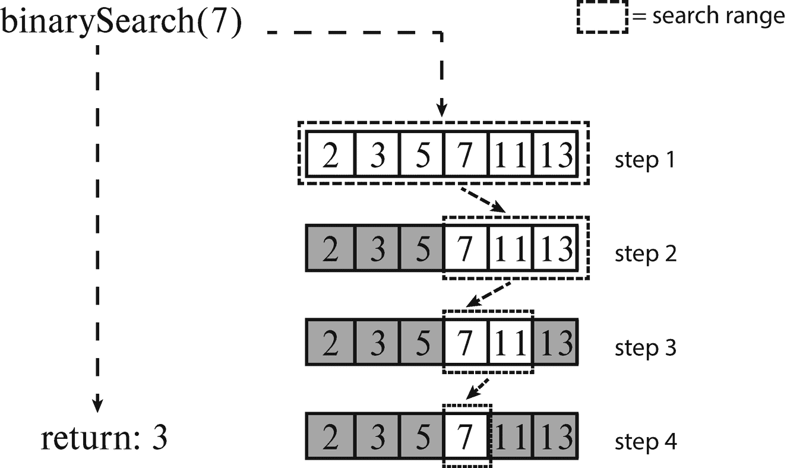
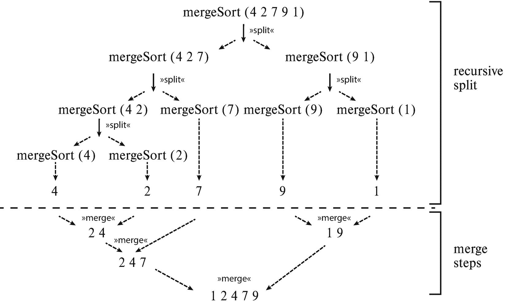
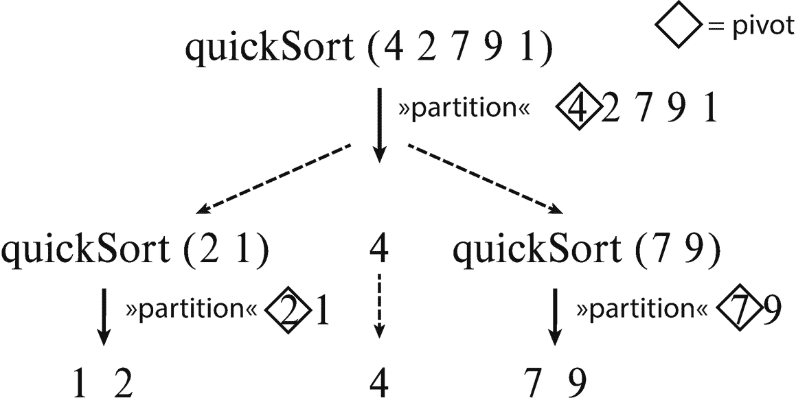
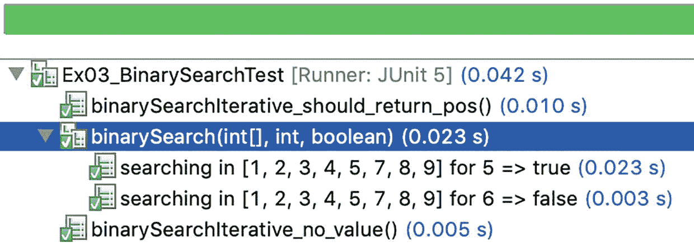
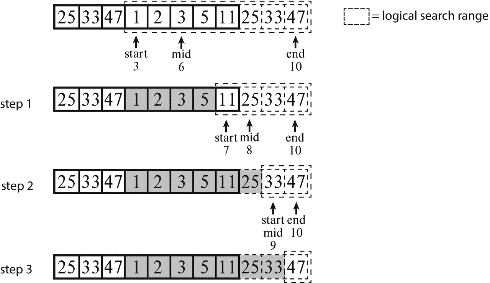

# 十、搜索和排序

在算法和数据结构领域，搜索和排序是计算机科学的两个基本主题。集合框架为这两者提供了高效的实现，从而减轻了您的负担。然而，理解底层算法有助于为特定用例选择最合适的变体。我在这里只是略读了一下搜索的主题，所以请参阅我的书*Der Weg zum Java-Profi*[Ind20a】以获得更详细的处理。

在这一章中，你主要致力于一些基本的排序算法，因为你可以同时学习一些算法技巧。

## 10.1 简介搜索

在管理数据时，有时您需要搜索项目，例如名字为 *Carsten* 的客户或具有特定订单日期的发票。

### 10.1.1 在集合和数组中搜索

方便的是，所有容器类都有搜索元素和检查元素是否在容器中的方法。

#### 使用 contains()搜索

如果容器类是通过通用类型`Collection<E>`访问的，那么可以通过调用方法`contains(Object)`来确定所需的元素是否存在。另外，`containsAll(Collection<?>)`可以用来检查一组元素是否被包含。内部实现遍历集合的元素，并根据`equals(Object)`检查每个元素与给定元素的相等性。对于地图，有相应的方法`containsKey(Object)`和`containsValue(Object)`。

Hint: Signature of Contains()

还有一个问题:为什么`contains()`不使用泛型类型，而使用`Object`？根据方法契约，使用`equals(Object)`将任何类型的输入对象与集合元素进行比较。由于`equals(Object),`的签名，具体类型只是通过实现及其内部类型检查间接重要。

#### 使用 indexOf()和 lastIndexOf()进行搜索

对于列表，除了`contains(Object)`之外，还有方法`indexOf(Object)`和`lastIndexOf(Object)`来确定所需元素的位置。第一种方法从列表的开头开始搜索，第二种方法从列表的结尾开始搜索。这样，可以确定第一次或最后一次出现(如果有的话)。如果没有找到元素，返回值为-1。由`equals(Object)`再次检查是否相等。

#### 自己编程在数组中搜索

正如您刚才看到的，接口`Collection<E>`和`List<E>`提供了各种类型的搜索，比如通过被包含或者通过索引。不幸的是，在辅助类`java.util.Arrays`中没有类似的东西。然而，自己为数组实现这一功能是相当容易的。因为主题上合适，我也为在第 [5 章](05.html)中开发的`ArrayUtils`类中的数组包含了下面的方法。

基于索引的搜索的实现或者返回所需元素的位置，或者为未找到的*返回值-1。您示例性地实现了对类型`int[]`的搜索。搜索的实现如下(一次从数组的开头开始，一次从数组的结尾开始):*

```java
static int indexOf(final int[] values, final int searchFor)
{
    for (int pos = 0; pos < values.length; pos++)
    {
        if (values[pos] == searchFor)
            return pos;
    }
    return -1;
}

static int lastIndexOf(final int[] values, final int searchFor)
{
    for (int pos = values.length - 1; pos >= 0; pos--)
    {
        if (values[pos] == searchFor)
            return pos;
    }
    return -1;
}

```

依靠前面展示的基于索引的搜索，您可以非常容易地为类型`int[]`创建方法`contains(int[], int)`(同样类似于为`Collection<E>`创建的方法):

```java
static boolean contains(final int[] values, final int searchFor)
{
    return indexOf(values, searchFor) != -1;
}

```

### 10.1.2 带二进制搜索的二分搜索法()

除了刚刚提到的搜索方法(迭代地查看数据结构的所有元素，直到它们找到它们所寻找的内容)之外，在 JDK 中为数据结构数组和数据结构提供了一种有效的搜索，即所谓的*二分搜索法*。*这需要排序的数据*，理想情况下通过选择适当的数据结构来提供，比如总是保持元素排序的`TreeSet<E>`。如果您必须首先显式地对数据进行排序，那么相对于线性搜索的优势就很难体现出来，尤其是对于小数据集。

然而，对于更大的数据量，二分搜索法的对数运行时间明显优于线性搜索。低运行时间是通过算法在每种情况下将待处理的区域分成两半，然后在适当的块中继续搜索来实现的。所描述的二分搜索法过程在 JDK 中由实用程序类`Arrays`和`Collections`中的重载方法`binarySearch()`实现。图 [10-1](#Fig1) 显示了原理程序，废弃的零件用灰色标记。



图 10-1

二分搜索法的流程示意图

在图中，箭头指向第一步中的元素之间。根据`binarySearch()`的实现，如果数字是偶数，则使用与中心直接相邻的左侧或右侧元素进行比较。

## 10.2 简介排序

在这一节中，我将介绍一些排序算法，它们是后面练习的基础。

### 插入排序

在纸牌游戏中，通过对你手中的一副牌进行排序，可以最好地说明插入排序。通常你从左边开始，把下一张卡片拿到右边，把它适当地插入已经排序的左边部分，这通常会导致一些卡片移到右边。在此过程中，您可以跳过第一张卡片，因为它是单独排序的，并从第二张卡片开始。我们来看看这个数列 4，2，7，9，1。为此，标记要排序的相应新元素。左边已经排序的部分用||与右边未排序的部分隔开:

```java
4 || ② 7 9 1
2 4 || ⑦ 9 1
2 4 7 || ⑨ 1
2 4 7 9 || ①
1 2 4 7 9

```

在本例中，您从值 2 开始。对于每个数字，您必须确定正确的插入位置。有两种方法可以做到这一点，如下所述。

#### 确定插入位置

从当前位置开始，只要比较的值较大，就向左移动。或者，只要比较的值较小，您也可以从头开始并向右移动一个位置。

```java
static int findInsertPosFromCurrent(final int[] numbers, final int currentPos)
{
    int insertPos = currentPos;
    while (insertPos > 0 && numbers[insertPos - 1] > numbers[currentPos])
        insertPos--;

    return insertPos;
}

static int findInsertPosFromStart(final int[] numbers, final int currentPos)
{
    int insertPos = 0;
    while (insertPos < currentPos &&  numbers[insertPos] < numbers[currentPos])
        insertPos++;

    return insertPos;
}

```

Hint: Stable Sorting

当对相同值的元素进行排序时，保持它们在集合中的原始顺序称为**稳定排序。这通常是一种更好的行为，因为它可以防止与元素相关联的数据出现混乱。**

 **例如，`findInsertPosFromCurrent(int[], int)`产生了稳定的排序，但是第二个没有。但是，如果您用< = there 替换<，得到的排序算法也会变得稳定:

```java
while (insertPos < currentPos && numbers[insertPos] <= numbers[currentPos])

```

这是因为最近找到的相同值的元素总是放在所有相同值的元素之后。

#### 插入排序的实现

在确定值的正确插入位置后，所有值(直到当前考虑的值)都必须向右移动一个位置。最后，在确定的位置插入值。

```java
static void insertionSort(final int[] numbers)
{
    for (int currentPos = 1; currentPos < numbers.length; currentPos++)
    {
        final int currentVal = numbers[currentPos];
        final int insertPos = findInsertPosFromCurrent(numbers, currentPos);

        moveRight(numbers, currentPos, insertPos);

        numbers[insertPos] = currentVal;
    }
}

static void moveRight(final int[] numbers,
                      final int currentPos, final int insertPos)
{
    int movePos = currentPos;
    while (movePos > insertPos)
    {
        numbers[movePos] = numbers[movePos - 1];
        movePos--;
    }
}

```

代码展示了一个易于理解的实现，它关注的是可理解性而不是速度。事实上，将一些动作巧妙地结合起来，从而避免多次运行是可能的。稍后，在练习 4 中，您将处理这种优化。

### 选择排序

选择排序是另一种直观的排序方法。它提供了两种变体，一种基于最小值，另一种基于最大值。在最小版本中，要排序的数组是从前到后遍历的。在每一步中，从仍未排序的部分中确定最小值。通过将它与当前元素交换来向前移动。这导致已排序区域从前面开始增长，剩余的未排序部分收缩。对于基于最大值的版本，要排序的数据是从后向前处理的。相应的最大值放在末尾，以便排序后的区域从后面开始增长。

为了获得更好的理解，让我们为一小组值重现这个。为此，特别标记了相应的电流最小值或最大值。已排序的部分与未排序的部分用||隔开。您可以很容易地观察到排序后的部分是如何增长的。

```java
     MIN                              MAX
     ->                                <-
     || 4    2  7   9   ①     4   2  7  ⑨   1  ||
1:   1  || ②   7   9    4    4   2  ⑦   1  || 9
2:   1  2  ||   7   9   ④    ④   2  1   || 7  9
3:   1  2    4  ||  9   ⑦   1   ② ||   4  7  9
4:   1  2    4    7  || 9    1  || 2    4  7  9

```

关于最小值的版本的实现如下:

```java
static void selectionSortMin(final int[] values)
{
    for (int i = 0; i < values.length - 1; i++)
    {
        int minIdx = i;

        // find minimum
        for (int j = i + 1; j < values.length; j++)
        {
            if (values[j] < values[minIdx])
                minIdx = j;
        }

        // swap current value with minimum
        int tmp = values[minIdx];
        values[minIdx] = values[i];
        values[i] = tmp;
    }
}

```

如果只看这种低级别的算法，通常很难理解和领悟。当然，框架中使用的最终算法必须尽可能优化。这需要用 O 符号进行估计。这在低层次上比在高层次上更容易执行，因为这样就必须考虑所有的构造，包括调用的方法。但要学习入门，先全面编程，再进一步优化就合适多了。

Opinion: Start with Comprehensibility

如何在更高的抽象层次上描述选择排序？为此，我依赖于我们在相应章节的介绍中为数组创建的一些辅助方法，例如用于交换元素的方法`swap()`，以及用于查找最小元素位置的方法`findMinPos()`，这是作为第 5.3.12 节练习 12 的解决方案创建的。通过使用这些方法，实际的过程变得几乎立即明显。您从头开始遍历数组，在每种情况下，找到剩余部分的最小值，并将其与当前位置的值交换:

```java
static void selectionSortMinReadable(final int[] values)
{
    for (int curIdx = 0; curIdx < values.length - 1; curIdx++)
    {
        final int minIdx = findMinPos(values, curIdx, values.length);

        swap(values, minIdx, curIdx);
    }
}

```

为了使 JShell 中的实验更容易，这里再次显示了在`ArrayUtils`类中定义的两个助手方法:

```java
static int findMinPos(int[] values, int startPos, int endPos)
{
    int minPos = startPos;
    for (int i = startPos + 1; i < endPos; i++)
    {
        if (values[i] < values[minPos])
            minPos = i;
    }
    return minPos;
}

static void swap(final int[] values, final int pos1, final int pos2)
{
    final int temp = values[pos1];
    values[pos1] = values[pos2];
    values[pos2] = temp;
}

```

让我们在 JShell 中尝试一下:

```java
jshell> int[] values = { 4, 2, 7, 9, 1 };

jshell> selectionSortMinReadable(values)

jshell> values
values ==> int[5] { 1, 2, 4, 7, 9 }

```

### 合并排序

合并排序基于分治法。它对待排序的数组递归地分割成越来越小的子数组，大约是原始大小的一半，直到它们只包含一个元素或者可能没有元素。之后，子阵列被再次组合。在这个合并步骤中，通过基于相应值的适当合并来完成排序。该过程如图 [10-2](#Fig2) 所示。



图 10-2

合并排序过程

只要允许你创建新的数组，分裂算法可以递归实现，也很容易理解，虽然效率也有点低。方法`merge(int[], int[])`的实现已经在第 5.3.11 节中作为练习 11 的解决方案提出。它用在这里:

```java
static int[] mergesort(final int[] toSort)
{
    // recursive termination: length 0 (only if initially empty array) or 1
    if (toSort.length <= 1)
        return toSort;

    // recursive descent: divide into two halves
    final int midPos = toSort.length / 2;
    final int[] left = Arrays.copyOfRange(toSort, 0, midPos);
    final int[] resultLeft = mergesort(left);

    final int[] right = Arrays.copyOfRange(toSort, midPos, toSort.length);
    final int[] resultRight = mergesort(right);

    // combine the partial results into larger sorted array
    return merge(resultLeft, resultRight);
}

```

Hint: Analogy from Real Life Leads to Optimization

对一副卡片进行排序的类比也适用于合并排序。如果你需要对一大堆卡片进行排序，你可以把它分成许多小得多的堆，分别排序，然后依次合并。然而，与其将堆减少到一张卡片，不如使用另一种方法(通常是插入排序)对较小的堆进行排序，这是一个好主意，对于小的、理想的有序阵列，插入排序的运行时间为 *O* ( *n* )。这对于微调很有用。巧妙的是，合并排序使这变得非常简单:

```java
static int[] mergesortWithInsertionsort(final int[] toSort)
{
    // recursive termination including mini-optimization
    if (toSort.length < 5)
    {
        InsertionSortExample.insertionSort(toSort);
        return toSort;
    }

    // recursive descent: divide into two halves
    final int midPos = toSort.length / 2;
    final int[] left = Arrays.copyOfRange(toSort, 0, midPos);
    final int[] resultLeft = mergesortWithInsertionsort(left);

    final int[] right = Arrays.copyOfRange(toSort, midPos, toSort.length);
    final int[] resultRight = mergesortWithInsertionsort(right);

    // combine the partial results into larger sorted array
    return merge(resultLeft, resultRight);
}

```

最后，我想指出的是，切换到插入排序的限制在这里被任意设置为值 5。据推测，10 到 20 个元素之间的值是非常实用的。然而，如果您依赖于算法专业人员的知识，这将是最好的，这些算法专业人员为运行时间创建数学上合理的估计。

### 快速排序

就像合并排序一样，快速排序基于分治法，将待排序的数组分割成越来越小的子数组。选择一个特殊元素(称为*枢轴*)来确定分组或处理。为了简单起见，您可以选择要排序的子数组的第一个元素作为 pivot 元素，但是也可以考虑其他方法。在快速排序中，排序是基于此 pivot 元素完成的，方法是根据元素值将部件的所有元素排列在 pivot 的左侧(小于或等于)或右侧(大于)。这样，枢轴元素被放置在正确的位置。对左右部分递归地重复整个过程，直到这些部分只包含一个元素。其过程如图 [10-3](#Fig3) 所示。



图 10-3

快速排序的过程

让我们从列表的实现开始，因为它更容易访问和理解。因此，将列表的内容分解成更小和更大的元素很容易实现。稍后，组合递归计算的结果也很简单。整个实现都是有意的。不是为了速度优化，而是为了可理解性。

对于分区，您将小于、等于或大于 pivot 元素值的所有元素收集到一个单独的结果列表中。为了实现这一点，您使用 Stream API 和下面的技巧:您将原始列表转换成一个`Stream<Integer>`，跳过第一个元素，因为它是 pivot 元素，然后应用适当的`Predicate<Integer>` s:

```java
static List<Integer> quicksort(final List<Integer> values)
{
    // recursive termination
    if (values.size() <= 1)
        return values;

    // pick up less than or equal to / greater than pivot
    final Integer pivot = values.get(0);
    final List<Integer> belowOrEquals = collectAll(values.stream().skip(1),
                                                   cur -> cur <= pivot);
    final List<Integer> aboves = collectAll(values.stream().skip(1),
                                            cur -> cur > pivot);

    // recursive descent
    final List<Integer> sortedLowersPart = quicksort(belowOrEquals);
    final List<Integer> sortedUppersPart = quicksort(aboves);

    // assemble

    final List<Integer> result = new ArrayList<>();
    result.addAll(sortedLowersPart); result.add(pivot);
    result.addAll(sortedUppersPart);

    return result;
}

```

最后，收集元素并应用`Predicate<Integer>` s 由辅助方法`collectAll()`实现，使用来自流 API 的`filter()`和`collect()`，如下所示:

```java
static List<Integer> collectAll(final Stream<Integer> values,
                                final Predicate<Integer> condition)
{
    return values.filter(condition).collect(Collectors.toList());
}

```

对于列表来说，如果没有针对性能进行优化，这一切都是非常直观的。如果您想要就地实现数组的分区(即，直接在原始数组本身中)，这将变得相当困难。你可以稍后在解决练习 6 时自己看到这一点。现在，您将了解基本程序。

#### 数组的就地实现

基本算法可以如下实现，尽管如前所述，分区的实现将是一个练习:

```java
static void quicksort(final int values[])
{
    quicksort(values, 0, values.length - 1);
}

public static void quicksort(final int values[], final int begin, final int end)
{
    // recursive termination

    if (begin >= end)
        return;

    final int partitionIndex = partition(values, begin, end);

    // recursive descent
    quicksort(values, begin, partitionIndex - 1);
    quicksort(values, partitionIndex + 1, end);
}

```

Hint: Avoiding Side Effects by Copying

如果原始数组应该保持不变，可以先创建它的副本，然后调用 inplace 方法:

```java
static int[] quicksortWithCopy(final int[] values)
{
    final int[] copy = Arrays.copyOf(values, values.length);

    quicksort(copy);

    return copy;
}

```

### 桶排序

桶排序是一种有趣的排序方法，其算法仅在下面概述，因为实现是练习 7 的主题。

存储桶排序是对数据进行排序的两步过程。首先，将值收集在特殊的容器中(称为*桶*)。然后，这些值被适当地转移到一个排序数组中。为了使算法可行，要排序的元素必须有一组有限的值。例如，这适用于人员的年龄信息，您可以假定一个从 0 到 150 的值范围。

```java
int[] ages = { 10, 50, 22, 7, 42, 111, 50, 7 };

```

不同值的最大数量的定义意味着相应数量的容器(桶)可以存储这些值，或者更准确地说，可以存储它们的频率。为每个可能的值提供一个存储桶。

**步骤 1:分配到桶**首先，遍历初始数据集，并在桶中记录它们的出现。对于上述年龄信息，分布如下:

```java
bucket[7] = 2
bucket[10] = 1
bucket[22] = 1
bucket[42] = 1
bucket[50] = 2
bucket[111] = 1

```

所有其他存储桶存储值 0。

**步骤 2:排序结果的准备**在最后一步中，从开始遍历桶。各个值被插入到结果中的次数与它们在桶中存储的次数一样多。这产生了这种排序:

```java
int[] result = { 7, 7, 10, 22, 42, 50, 50, 111 };

```

### 最后的想法

许多更直观的算法，如插入排序和选择排序，都有运行时间为 *O* ( *n* <sup>2</sup> )的缺点。然而，插入排序有一个积极而显著的特性:只要输出数据是(几乎)排序的，插入排序就会变得非常高效，并且具有 *O* ( *n* )。

快速排序和归并排序通常非常高效，运行时间为*O*(*n**log*(*n*))。尽管如此，它们也有更高的源代码复杂性，尤其是在现场工作时。对于框架和更大的数据集，性能是必不可少的。另一方面，对合并排序潜在不利的是子范围的许多副本的创建。这同样适用于快速排序及其分区。然而，对这两者来说，有些变体却能做到这一点。有趣的是，要排序的子范围的各个划分很容易通过递归来表达，但是划分或合并部分则更复杂，并且更难以实现。尤其是，如果你在一个地方工作。对于合并排序，您将在所提供的 Eclipse 项目中找到一个例子。对于快速排序，您可以在练习 6 中尝试。

桶排序仍然存在。该算法有时甚至在线性运行时间中运行。然而，与提出的其他排序算法相比，它并不普遍适用，因为它具有已经提到的关于允许值的数量的限制。

## 10.3 练习

### 10.3.1 练习 1:包含全部(★★✩✩✩)

类似于 JDK 中用于`Collection<E>`的方法`boolean containsAll(Collection<?>)`，您的任务是为数组实现一个`boolean containsAll(int[], int...)`方法。它应该检查作为变量参数传递的所有值是否都出现在数组中。

#### 例子

<colgroup><col class="tcol1 align-left"> <col class="tcol2 align-left"> <col class="tcol3 align-left"></colgroup> 
| 

投入

 | 

搜索值

 | 

结果

 |
| --- | --- | --- |
| [0, 1, 2, 3, 4, 5, 6, 7, 8, 9] | [7, 2] | 真实的 |
| [0, 1, 2, 3, 4, 5, 6, 7, 8, 9] | [5, 11] | 错误的 |

### 10.3.2 练习 2:分区(★★★★✩)

挑战是在一次传递中适当地排序或排列字母 A 和 B 的混合序列，使得所有的 A 都出现在 Bs 之前。这也可以扩展到三个字母。

#### 例子

<colgroup><col class="tcol1 align-left"> <col class="tcol2 align-left"></colgroup> 
| 

投入

 | 

结果

 |
| --- | --- |
| "阿巴布巴巴" | " AAAAAAABBBBBBB " |
| " ABACCBBCAACCBBA " | " AAAAABBBBBCCCCC " |

#### 练习 2a:划分两个字母(★★★✩✩)

编写方法`String partition2(String)`，它采用由两个字母 A 和 B 组成的给定序列作为`String`或`char[]`，并将其转换为有序序列，其中所有的 A 都出现在 Bs 之前。

#### 练习 2b:划分三个字母(★★★★✩)

编写方法`String partition3(String)`,将由三个字母 A、B 和 C 组成的序列划分为一个有序序列，其中所有的 A 出现在 Bs 之前，它们依次出现在 Cs 之前。代替字母，这可以被认为是旗帜的颜色。然后就是众所周知的荷兰国旗问题。

### 10.3.3 练习 3:★★✩✩✩二分搜索法

#### 练习 3a:★★✩✩✩二分搜索法递归

编写递归方法`boolean binarySearch(int[], int)`,在一个排序数组中搜索所需的值。

#### 例子

<colgroup><col class="tcol1 align-left"> <col class="tcol2 align-left"> <col class="tcol3 align-left"></colgroup> 
| 

投入

 | 

搜索值

 | 

结果

 |
| --- | --- | --- |
| [1, 2, 3, 4, 5, 7, 8, 9] | five | 真实的 |
| [1, 2, 3, 4, 5, 7, 8, 9] | six | 错误的 |

#### 练习 3b:★★✩✩✩二分搜索法迭代

将递归方法转换为名为`int binarySearchIterative(int[], int)`的迭代方法，修改为返回搜索值的位置或-1，而不是分别返回`true`和`false`。

#### 例子

<colgroup><col class="tcol1 align-left"> <col class="tcol2 align-left"> <col class="tcol3 align-left"></colgroup> 
| 

投入

 | 

搜索值

 | 

结果

 |
| --- | --- | --- |
| [1, 2, 3, 4, 5, 7, 8, 9] | five | four |
| [1, 2, 3, 4, 5, 7, 8, 9] | six | -1 |

### 10.3.4 练习 4:插入排序(★★✩✩✩)

介绍部分 10.2.1 展示了插入排序的一个简化的、易于理解的实现。在本练习中，我们的目标是通过找到插入位置并一次性执行必要的交换和插入来优化整个过程。写一个优化版的`int[] insertionSort(int[])`。

#### 例子

<colgroup><col class="tcol1 align-left"> <col class="tcol2 align-left"></colgroup> 
| 

投入

 | 

结果

 |
| --- | --- |
| [7, 2, 5, 1, 6, 8, 9, 4, 3] | [1, 2, 3, 4, 5, 6, 7, 8, 9] |

### 10.3.5 练习 5:选择排序(★★✩✩✩)

编写一个选择排序的变体，它使用最大值而不是最小值，并具有以下签名:`void selectionSortMaxInplace(int[])`。

需要修改什么才能使排序算法保持原始数据不变并返回一个新的排序后的数组？为此编写方法`int[] selectionSortMaxCopy(int[])`。

#### 例子

<colgroup><col class="tcol1 align-left"> <col class="tcol2 align-left"></colgroup> 
| 

投入

 | 

结果

 |
| --- | --- |
| [7, 2, 5, 1, 6, 8, 9, 4, 3] | [1, 2, 3, 4, 5, 6, 7, 8, 9] |

### 10.3.6 练习 6:快速排序(★★★✩✩)

我在介绍性章节 10.2.4 中描述了快速排序。虽然用列表可以很容易地实现将值小于或等于 pivot 元素的两个范围分开，但这对数组来说更具挑战性。现在要用方法`int partition(int[], int, int)`来实现分区。在下文中，再次显示了已经存在的源代码:

```java
static int[] quicksort(final int values[])
{
    quicksort(values, 0, values.length - 1);
    return values;
}

static void quicksort(final int values[], final int begin, final int end)
{
    // recursive termination
    if (begin >= end)
        return;

    final int partitionIndex = partition(values, begin, end);

    // recursive descent
    quicksort(values, begin, partitionIndex - 1);
    quicksort(values, partitionIndex + 1, end);
}

```

#### 例子

<colgroup><col class="tcol1 align-left"> <col class="tcol2 align-left"></colgroup> 
| 

投入

 | 

结果

 |
| --- | --- |
| [5, 2, 7, 1, 4, 3, 6, 8] | [1, 2, 3, 4, 5, 6, 7, 8] |
| [5, 2, 7, 9, 6, 3, 1, 4, 8] | [1, 2, 3, 4, 5, 6, 7, 8, 9] |
| [5, 2, 7, 9, 6, 3, 1, 4, 2, 3, 8] | [1, 2, 2, 3, 3, 4, 5, 6, 7, 8, 9] |

### 10.3.7 练习 7:桶排序(★★✩✩✩)

在介绍性章节 10.2.5 中，描述了桶排序算法。在本练习中，您想要创建方法`int[] bucketSort(int[], int)`，该方法实现了针对`int[]`和预期最大值的排序算法。

#### 例子

<colgroup><col class="tcol1 align-left"> <col class="tcol2 align-left"> <col class="tcol3 align-left"></colgroup> 
| 

投入

 | 

最大值

 | 

结果

 |
| --- | --- | --- |
| [10, 50, 22, 7, 42, 111, 50, 7] | One hundred and fifty | [7, 7, 10, 22, 42, 50, 50, 111] |

### 10.3.8 练习 8:在循环数据中搜索(★★★★✩)

在本练习中，您的任务是在整数值的排序序列中实现搜索。挑战在于，这些值是有序的，但在它们自己内部是旋转的。据此，最小的元素可能不在数据的前面。此外，最大的元素通常不位于数据的末尾(除了旋转 0 个位置的特殊情况)。

Tip

还要注意检查旋转 0 或数组长度倍数的特殊情况，这将再次对应于值 0 的旋转。

#### 练习 8a:侧面高效变换(★★★★✩)

编写方法`int findFlankPos(int[])`，该方法在对数时间内有效地在给定的排序序列的 *n* 个整数值中找到齿侧变化的位置，比如 25、33、47、1、2、3、5、11，即*O*(*log*(*n*)。基于`int findFlankPos(int[])`编写两个名为`int minValue(int[])`和`int maxValue(int[])`的方法，根据它们的名字，从给定的排序但旋转的值序列中分别确定最小值和最大值。

#### 例子

<colgroup><col class="tcol1 align-left"> <col class="tcol2 align-left"> <col class="tcol3 align-left"> <col class="tcol4 align-left"></colgroup> 
| 

投入

 | 

侧翼位置

 | 

最低限度

 | 

最高的

 |
| --- | --- | --- | --- |
| [25, 33, 47, 1, 2, 3, 5, 11] | three | one | Forty-seven |
| [5, 11, 17, 25, 1, 2] | four | one | Twenty-five |
| [6, 1, 2, 3, 4, 5] | one | one | six |
| [1, 2, 3, 4, 5, 6] | 0(特殊情况) | one | six |

#### 练习 8b:旋转数据中的二分搜索法(★★★★✩)

编写方法`int binarySearchRotated(int[], int)`,在整数值的排序序列中有效地搜索给定值，比如说数字序列 25，33，47，1，2，3，5，11，如果没有找到，返回它的位置或-1。

#### 例子

<colgroup><col class="tcol1 align-left"> <col class="tcol2 align-left"> <col class="tcol3 align-left"> <col class="tcol4 align-left"></colgroup> 
| 

投入

 | 

侧翼位置

 | 

搜索值

 | 

结果

 |
| --- | --- | --- | --- |
| [25, 33, 47, 1, 2, 3, 5, 11] | three | Forty-seven | Two |
| [25, 33, 47, 1, 2, 3, 5, 11] | three | three | five |
| [25, 33, 47, 1, 2, 3, 5, 11] | three | Thirteen | -1 |
| [1, 2, 3, 4, 5, 6, 7] | 0(特殊情况) | five | four |
| [1, 2, 3, 4, 5, 6, 7] | 0(特殊情况) | Thirteen | -1 |

## 10.4 解决方案

### 10.4.1 解决方案 1:包含全部(★★✩✩✩)

类似于 JDK 中用于`Collection<E>`的方法`boolean containsAll(Collection<?>)`，您的任务是为数组实现一个`boolean containsAll(int[], int...)`方法。它应该检查作为变量参数传递的所有值是否都出现在数组中。

#### 例子

<colgroup><col class="tcol1 align-left"> <col class="tcol2 align-left"> <col class="tcol3 align-left"></colgroup> 
| 

投入

 | 

搜索值

 | 

结果

 |
| --- | --- | --- |
| [0, 1, 2, 3, 4, 5, 6, 7, 8, 9] | [7, 2] | 真实的 |
| [0, 1, 2, 3, 4, 5, 6, 7, 8, 9] | [5, 11] | 错误的 |

**算法**在第 10.1.1 节中，方法`boolean contains(int[], int)`被创建。对于您的实现，您可以对传入的所有元素重复调用它来检查包含性:

```java
static boolean containsAll(final int[] values, final int... searchFor)
{
    for (int current : searchFor)
    {
        if (!ArrayUtils.contains(values, current))
            return false;
    }
    return true;
}

```

#### 确认

让我们用从 0 到 9 的数字定义一个`int[]`,并检查值 7 和 2，以及 5 和 11 是否存在:

```java
@ParameterizedTest(name = "containsAll({0}, {1}) => {2}")
@MethodSource("createInputsAndExpected")
void containsAll(int[] values, int[] searchvalues, boolean expected)
{
    boolean result = Ex01_ContainsAll.containsAll(values, searchvalues);

    assertEquals(expected, result);
}

private static Stream<Arguments> createInputsAndExpected()
{
    final int[] values = { 0, 1, 2, 3, 4, 5, 6, 7, 8, 9 };
    final int[] searchValues1 = { 7, 2 };
    final int[] searchValues2 = { 5, 11 };

    return Stream.of(Arguments.of(values, searchValues1, true),
                     Arguments.of(values, searchValues2, false));
}

```

### 10.4.2 解决方案 2:分区(★★★✩✩)

挑战是在一次传递中适当地排序或排列字母 A 和 B 的混合序列，使得所有的 A 都出现在 Bs 之前。这也可以扩展到三个字母。

#### 例子

<colgroup><col class="tcol1 align-left"> <col class="tcol2 align-left"></colgroup> 
| 

投入

 | 

结果

 |
| --- | --- |
| "阿巴布巴巴" | " AAAAAAABBBBBBB " |
| " ABACCBBCAACCBBA " | " AAAAABBBBBCCCCC " |

#### 解决方案 2a:分割两个字母(★★✩✩✩)

编写方法`String partition2(String)`,它从两个字母 A 和 B 构建出一个给定的序列，称为`String`或`char[]`,并将其转换为一个有序序列，其中所有的 A 都出现在 Bs 之前。

虽然一开始人们会尝试比较所有可能的位置，但是有一个巧妙的、高性能的解决方案，可以一次性解决这个问题。您使用两个位置指针，*低*和*高*，它们标记前后位置，在这种情况下，有效范围由最后面的 As 和最前面的 Bs 给出。当找到 A 时，它的位置会递增。当找到一个 B 时，它被交换到后面。之后，Bs 的位置指针减小，扩展了已经正确划分的区域。

```java
static String partition2(final String charValues)
{
    return partition2(charValues.toCharArray());
}

static String partition2(final char[] charValues)
{
    int low = 0;
    int high = charValues.length - 1;

    while (low <= high)
    {
        if (charValues[low] == 'A')
            low++;
        else
        {
            ArraysUtils.swap(charValues, low, high);
            high--;
        }
    }
    return new String(charValues);

}

```

因为交换时 a B 也可能移到前面，所以低位指针必须保持不变。在接下来的一个步骤中，B 将再次移动到后面。

这种复杂的算法使得有可能在单次通过时将所有 As 排列在 Bs 的前面。

#### 解决方案 2b:分割三个字母(★★★✩✩)

编写方法`String partition3(String)`，将三个字母 A、B 和 C 组成的序列划分为一个有序序列，其中所有的 A 出现在 Bs 之前，它们依次出现在 Cs 之前。代替字母，这可以被认为是旗帜的颜色。然后就是众所周知的荷兰国旗问题。

从两个字母(或颜色)扩展到三个字母(或颜色)采用了和以前类似的想法，但是增加了一些技巧和特殊处理。你再次从数组的开头开始，但是使用三个位置标记*低*、*中*和*高*。最初，它们位于位置 0 的第一个和中间的字符；*高*的在末端位置。如果找到 A，则*低位*和*中间*的位置向右移动一位。在此之前，较低范围的最后一个字符与当前(中间)的字符交换。如果读一个 B，只有中间位置向末端移动。如果当前字符是一个 C，这是交换到后面。然后，上部区域的位置标记减少 1。

```java
static String partition3(final String input)
{
    final char[] charValues = input.toCharArray();
    int low = 0;
    int mid = 0;
    int high = charValues.length - 1;

    while (mid <= high)
    {
        if (charValues[mid] == 'A')
        {
            ArraysUtils.swap(charValues, low, mid);

            low++;
            mid++;
        }

        else if (charValues[mid] == 'B')
            mid++;
        else
        {
            ArraysUtils.swap(charValues, mid, high);

            high--;
            // low, mid must remain unchanged, because also a B or C
            // can be swapped to the front
        }
    }
    return new String(charValues);

}

```

#### 确认

为了检查功能，您使用两个字符串，分别由字母 A 和 B 或 A、B 和 C 的混洗序列组成:

```java
@Test
public void testPartition2()
{
    final String result = Ex02_FlagPartitioning.partition2("ABAABBBAAABBBA");

    assertEquals("AAAAAAABBBBBBB", result);
}

@Test
public void testPartition3()
{
    final String result = Ex02_FlagPartitioning.partition3("ABACCBBCAACCBBA");

    assertEquals("AAAAABBBBBCCCCC", result);
}

```

### 10.4.3 解决方案 3:★★✩✩✩二分搜索法

#### 解决方案 3a:★★✩✩✩二分搜索法递归

编写递归方法`boolean binarySearch(int[], int)`,在一个排序数组中搜索所需的值。

#### 例子

<colgroup><col class="tcol1 align-left"> <col class="tcol2 align-left"> <col class="tcol3 align-left"></colgroup> 
| 

投入

 | 

搜索值

 | 

结果

 |
| --- | --- | --- |
| [1, 2, 3, 4, 5, 7, 8, 9] | five | 真实的 |
| [1, 2, 3, 4, 5, 7, 8, 9] | six | 错误的 |

**算法**将数组分成两半。确定中间的值，看看是否需要进一步搜索上半部分或下半部分。这可以根据给定的排序顺序轻松确定:

*值* <sub>*居中*</sub> == *搜索值* →找到，结束

*值* <sub>*居中*</sub> < *搜索值*继续在顶部搜索

*值* <sub>*中间*</sub> > *搜索值*继续在底部搜索

Java 中的实现严格遵循描述。像往常一样，要特别注意数组的边界，以避免犯粗心的错误。

```java
static boolean binarySearch(final int[] sortedValues, final int searchValue)
{
    final int midPos = sortedValues.length / 2;

    // recursive termination
    if (searchValue == sortedValues[midPos])
        return true;

    if (sortedValues.length > 1) // there are still at least 2 numbers
    {
        if (searchValue < sortedValues[midPos])
        {
            // recursive descent: search further in the lower part
            final int[] lowerHalf = Arrays.copyOfRange(sortedValues, 0, midPos);

            return binarySearch(lowerHalf, searchValue);

        }
        if (searchValue > sortedValues[midPos])
        {

            // recursive descent: continue search in the upper part
            final int[] upperHalf = Arrays.copyOfRange(sortedValues,
                                    midPos + 1, sortedValues.length);

            return binarySearch(upperHalf, searchValue);
        }
    }
    return false;
}

```

**优化算法**所示的解决方案并不是真正的最优，因为原始数组的部分被永久复制以执行进一步的搜索。在两个索引变量的帮助下，整个过程可以完全完成，而不需要潜在的耗时的数组复制。以下解决方案当然是首选:

```java
static boolean binarySearchOptimized(final int[] values, final int searchValue)
{
    return binarySearchOptimized(values, searchValue, 0, values.length - 1);
}

static boolean binarySearchOptimized(final int[] values, final int searchValue,
                                   final int left, final int right)
{
    if (right >= left)
    {
        final int midIdx = (left + right) / 2;

        if (searchValue == values[midIdx])
            return true;

        // recursive descent: search in the lower / upper part further
        if (searchValue < values[midIdx])
            return binarySearchOptimized(values, searchValue, left, midIdx - 1);
        else
            return binarySearchOptimized(values, searchValue, midIdx + 1, right);
    }
    return false;
}

```

#### 解决方案 3b:★★✩✩✩二分搜索法迭代

将递归方法转换为名为`int binarySearchIterative(int[], int)`的迭代方法，修改为返回搜索值的位置或-1，而不是分别返回`true`和`false`。

#### 例子

<colgroup><col class="tcol1 align-left"> <col class="tcol2 align-left"> <col class="tcol3 align-left"></colgroup> 
| 

投入

 | 

搜索值

 | 

结果

 |
| --- | --- | --- |
| [1, 2, 3, 4, 5, 7, 8, 9] | five | four |
| [1, 2, 3, 4, 5, 7, 8, 9] | six | -1 |

**算法**基于刚刚示出的递归版本，迭代实现可以相当容易地导出。您使用两个位置标记，*左*和*右*用于左和右，它们最初开始于起点和终点(位置`0`和*长度*-`1`)。这两个标记决定了执行进一步搜索的相应索引边界。首先，您将中间的值与搜索到的值进行比较。如果值相等，则返回索引。否则，您将搜索区域分为两部分，并继续搜索，直到搜索成功或左右位置标记相互交叉。

```java
static int binarySearchIterative(final int[] values, final int searchValue)
{
    int left = 0;
    int right = values.length - 1;

    while (right >= left)
    {
        int midIdx = (left + right) / 2;

        if (searchValue == values[midIdx])
            return midIdx;

        if (searchValue < values[midIdx])
            right = midIdx - 1;
        else
            left = midIdx + 1;
    }

    return -1;
}

```

#### 确认

对于测试，您使用以下输入，这些输入显示了正确的操作:

```java
@ParameterizedTest(name = "searching in {0} for {1} => {2}")
@MethodSource("createInputsAndExpected")
void containsAll(int[] values, int searchFor, boolean expected)
{
    boolean result = Ex03_BinarySearch.binarySearch(values, searchFor);

    assertEquals(expected, result);
}

private static Stream<Arguments> createInputsAndExpected()
{
    final int[] values = { 1, 2, 3, 4, 5, 7, 8, 9 };

    return Stream.of(Arguments.of(values, 5, true),
                     Arguments.of(values, 6, false));
}

@Test
void binarySearchIterative_should_return_pos()
{
    final int[] values = { 1, 2, 3, 4, 5, 7, 8, 9 };

    int result = Ex03_BinarySearch.binarySearchIterative(values, 5);

    assertEquals(4, result);
}

@Test
void binarySearchIterative_no_value()
{
    final int[] values = { 1, 2, 3, 4, 5, 7, 8, 9 };

    int result = Ex03_BinarySearch.binarySearchIterative(values, 6);

    assertEquals(-1, result);
}

```

为了让事情变得更有趣一点，让我们来看看单元测试及其在 IDE 中的执行。见图 [10-4](#Fig4) 。



图 10-4

二分搜索法测试执行的结果

### 10.4.4 解决方案 4:插入排序(★★✩✩✩)

介绍部分 10.2.1 展示了插入排序的一个简化的、易于理解的实现。在本练习中，我们的目标是通过找到插入位置并一次性执行必要的交换和插入来优化整个过程。写一个优化版的`int[] insertionSort(int[])`。

#### 例子

<colgroup><col class="tcol1 align-left"> <col class="tcol2 align-left"></colgroup> 
| 

投入

 | 

结果

 |
| --- | --- |
| [7, 2, 5, 1, 6, 8, 9, 4, 3] | [1, 2, 3, 4, 5, 6, 7, 8, 9] |

**算法**对于所有的元素，你执行下面的过程，这个过程是以值序列`24` **3** `17`为例描述的:我们假设 3 是要排序的值。只要邻居的值大于当前值，您就必须从其位置开始与左侧邻居交换。在这种情况下，您还没有到达数组的最前面，所以您只将 3 与 4 交换。接下来，你需要把 1 一直交换到最前面。最后，7 已经在正确的位置。

```java
static void insertionSort(final int[] values)
{
    for (int i = 1; i < values.length; i++)
    {
        // check if current element is larger than predecessor
        int currentIdx = i;
        while (currentIdx > 0 && values[currentIdx - 1] > values[currentIdx])
        {
            swap(values, currentIdx - 1, currentIdx); currentIdx--;
        }
    }
}

```

#### 确认

您使用单元测试来验证实现是否为给定的数字序列产生了所需的结果:

```java
@Test
void testInsertionSort()
{
    final int[] values = { 7, 2, 5, 1, 6, 8, 9, 4, 3 };
    final int[] expected = { 1, 2, 3, 4, 5, 6, 7, 8, 9 };

    Ex04_InsertionSort.insertionSort(values);

    assertArrayEquals(expected, values);
}

```

### 10.4.5 解决方案 5:选择排序(★★✩✩✩)

编写一个选择排序的变体，它使用最大值而不是最小值，并具有以下签名:`void selectionSortMaxInplace(int[])`。

需要修改什么才能使排序算法保持原始数据不变并返回一个新的排序后的数组？为此编写方法`int[] selectionSortMaxCopy(int[])`。

#### 例子

<colgroup><col class="tcol1 align-left"> <col class="tcol2 align-left"></colgroup> 
| 

投入

 | 

结果

 |
| --- | --- |
| [7, 2, 5, 1, 6, 8, 9, 4, 3] | [1, 2, 3, 4, 5, 6, 7, 8, 9] |

**算法**待排序的数组从后向前遍历，每种情况下最大的元素移回当前位置。通过调用方法`findMaxPos()`，您可以从剩余的未排序子范围中确定最大值的位置。该方法是作为第 5.3.12 节中练习 12 的解决方案创建的。随后，通过与当前元素交换，该元素相应地移动到后面。这将减少剩余的尚未排序的部分的大小，直到它只包含最前面的元素。

```java
static void selectionSortMaxInplace(final int[] values)
{
    for (int i = values.length - 1; i > 0 ; i--)
    {
        final int maxPos = ArraysUtils.findMaxPos(values, 0, i + 1);

        ArraysUtils.swap(values, maxPos, i);
    }
}

```

如果您已经创建了前面的方法，则具有复制功能的方法实现起来很简单:

```java
static int[] selectionSortMaxCopy(final int[] values)
{
    final int[] copy = Arrays.copyOf(values, values.length);

    selectionSortMaxInplace(copy);

    return copy;
}

```

#### 确认

您使用单元测试来验证实现是否为给定的数字序列产生了所需的结果:

```java
@Test
void selectionSortMaxInplace()
{
    final int[] values = { 7, 2, 5, 1, 6, 8, 9, 4, 3 };
    final int[] expected = { 1, 2, 3, 4, 5, 6, 7, 8, 9 };

    Ex05_SelectionSort.selectionSortMaxInplace(values);

    assertArrayEquals(expected, values);
}

```

### 10.4.6 解决方案 6:快速分类(★★★✩✩)

我在介绍性章节 10.2.4 中描述了快速排序。虽然用列表可以很容易地实现将值小于或等于 pivot 元素的两个范围分开，但这对数组来说更具挑战性。现在要用方法`int partition(int[], int, int)`来实现分区。在下文中，再次显示了已经存在的源代码:

```java
static void quicksort(final int values[])
{
    quicksort(values, 0, values.length - 1);
}

static void quicksort(final int values[], final int begin, final int end)
{
    // recursive termination
    if (begin >= end)
        return;

    final int partitionIndex = partition(values, begin, end);

    // recursive descent
    quicksort(values, begin, partitionIndex - 1);
    quicksort(values, partitionIndex + 1, end);
}

```

#### 例子

<colgroup><col class="tcol1 align-left"> <col class="tcol2 align-left"></colgroup> 
| 

投入

 | 

结果

 |
| --- | --- |
| [5, 2, 7, 1, 4, 3, 6, 8] | [1, 2, 3, 4, 5, 6, 7, 8] |
| [5, 2, 7, 9, 6, 3, 1, 4, 8] | [1, 2, 3, 4, 5, 6, 7, 8, 9] |
| [5, 2, 7, 9, 6, 3, 1, 4, 2, 3, 8] | [1, 2, 2, 3, 3, 4, 5, 6, 7, 8, 9] |

**算法**你的目标是将一个数组(或者一个数组的范围)细分成两部分，通过传递下限开始和上限索引，选择一个特殊位置的值(比如最前面的元素)作为枢纽元素。现在这两部分被重新安排。值小于或等于 pivot 元素的所有元素都应该位于下部。此外，值大于 pivot 元素的所有元素都应该位于上部。这里，只要条件*值**left index**<*=*pivot*hold 为左， *pivot <值**right index*为右，两个索引 *leftIndex* 和 *rightIndex* 各自向内移动。如果在左侧发现一个排序不当的元素，则从右侧开始检查。如果在这里也发现了一个排序不正确的元素，那么这两个元素将被交换。只要位置标记没有相互交叉，就重复这个过程。最后，来自*右索引*位置的元素与枢轴元素交换。还有一种特殊情况是数组只有两个元素。在这种情况下，您还必须确保正确的值实际上大于轴的值。

```java
static int partition(final int[] values, final int left, final int right)
{
    final int pivot = values[left];

    int leftIndex = left + 1;
    int rightIndex = right;

    while (leftIndex < rightIndex)
    {
        // move the position leftIndex to the right, as long as value
        // less than or equal to pivot and left limit less than right limit
        while (values[leftIndex] <= pivot && leftIndex < rightIndex)
        {
            leftIndex++;
        }

        // move the position rightIndex to the left, as long as value greater
        // than pivot and right limit greater than or equal to left limit
        while (pivot < values[rightIndex] && rightIndex >= leftIndex)
        {
         rightIndex--;
        }

        if (leftIndex < rightIndex)
            ArrayUtils.swap(values, leftIndex, rightIndex);
    }

    // special case 2-element array with wrong sorting, but no
    // pass (leftIndex == rightIndex) as well as normal case at the very end
    if (values[rightIndex] < pivot)
        ArrayUtils.swap(values, left, rightIndex);

    return rightIndex;
}

```

#### 确认

从介绍性示例中定义三个数组，并使用它们来检查快速排序的实现:

```java
@ParameterizedTest(name = "{0} should be sorted to {1}")
@MethodSource("createInputAndExpected")
void testQuicksort(int[] values, int[] expected)
{
    // inplace
    Ex06_Quicksort.quicksort(values);

    assertArrayEquals(expected, values);
}

private static Stream<Arguments> createInputAndExpected()
{
    return Stream.of(Arguments.of(new int[] { 5, 2, 7, 1, 4, 3, 6, 8 },
                                  new int[] { 1, 2, 3, 4, 5, 6, 7, 8 }),
                     Arguments.of(new int[] { 5, 2, 7, 9, 6, 3, 1, 4, 8 },
                                  new int[] { 1, 2, 3, 4, 5, 6, 7, 8, 9 }),
                     Arguments.of(new int[] { 5, 2, 7, 9, 6, 3, 1, 4, 2, 3, 8 },
                                  new int[] { 1, 2, 2, 3, 3, 4, 5, 6, 7, 8, 9 }));
}

```

### 10.4.7 解决方案 7:桶排序(★★✩✩✩)

在介绍性章节 10.2.5 中，描述了桶排序算法。在本练习中，您想要创建方法`int[] bucketSort(int[], int)`，该方法实现了针对`int[]`和预期最大值的排序算法。

#### 例子

<colgroup><col class="tcol1 align-left"> <col class="tcol2 align-left"> <col class="tcol3 align-left"></colgroup> 
| 

投入

 | 

最大值

 | 

结果

 |
| --- | --- | --- |
| [10, 50, 22, 7, 42, 111, 50, 7] | One hundred and fifty | [7, 7, 10, 22, 42, 50, 50, 111] |

**算法**桶排序是实现起来最简单的排序算法之一，也是线性运行时间最快的算法之一，但前提是值的范围有限。

首先，创建所有存储值计数的存储桶。之后，分两步实现桶排序:

1.  遍历所有输入值，并将它们分配给相应的存储桶。如果有几个相同的元素，你必须增加计数器。

2.  最后一步是基于计数器值重建值。

所描述的过程在 Java 中实现如下:

```java
static int[] bucketSort(final int[] values, final int expectedMax)
{
    final int[] buckets = new int[expectedMax + 1];
    collectIntoBuckets(values, buckets);

    final int[] results = new int[values.length];
    fillResultFromBuckets(buckets, results);

    return results;
}

```

从而描述了该算法的基本特征。只剩下两个助手方法的实现，这也是直接完成的。要计算各个数字的计数，您必须遍历原始数组，并根据当前值递增桶中的计数器:

```java
static void collectIntoBuckets(final int[] values, final int[] buckets)
{
    for (int current : values)
    {
        buckets[current]++;
    }
}

```

基于桶中的数量，结果的生成稍微复杂一点。为此，您将遍历所有存储桶。如果索引 *i* 包含一个大于 0 的数量，则该索引值必须按照那里指定的频率复制到目标。在这种情况下，它由`while`循环解决。你只需要单独携带目标数组中的位置。

```java
static void fillResultFromBuckets(final int[] buckets, final int[] results)
{
    int resultPos = 0;
    for (int i = 0; i < buckets.length; i++)
    {
        int count = buckets[i];

        while (count > 0)
        {
            results[resultPos] = i;

            count--;
            resultPos++;
        }
    }
}

```

#### 确认

您编写一个简短的测试方法，用一些值来检查桶排序的实现:

```java
@Test
void testBucketSort()
{
    final int[] values = { 10, 50, 22, 7, 42, 111, 50, 7 };
    final int max = 150;
    final int[] expected = { 7, 7, 10, 22, 42, 50, 50, 111 };

    final int[] result = Ex07_BucketSort.bucketSort(values, max);

    assertArrayEquals(expected, result);
}

```

### 10.4.8 解决方案 8:在循环数据中搜索(★★★★✩)

在本练习中，您的任务是在整数值的排序序列中实现搜索。挑战在于，这些值是有序的，但在它们自己内部是旋转的。据此，最小的元素可能不在数据的前面。此外，最大的元素通常不位于数据的末尾(除了旋转 0 个位置的特殊情况)。

Tip

还要注意检查旋转 0 或数组长度倍数的特殊情况，这将再次对应于值 0 的旋转。

#### 解决方案 8a:侧面更换高效(★★★★✩)

编写方法`int findFlankPos(int[])`，该方法在对数时间内有效地在给定的排序序列的 *n* 个整数值中找到齿侧变化的位置，比如 25、33、47、1、2、3、5、11，即*O*(*log*(*n*)。基于`int findFlankPos(int[])`编写两个名为`int minValue(int[])`和`int maxValue(int[])`的方法，根据它们的名字，从给定的排序但旋转的值序列中分别确定最小值和最大值。

#### 例子

<colgroup><col class="tcol1 align-left"> <col class="tcol2 align-left"> <col class="tcol3 align-left"> <col class="tcol4 align-left"></colgroup> 
| 

投入

 | 

侧翼位置

 | 

最低限度

 | 

最高的

 |
| --- | --- | --- | --- |
| [25, 33, 47, 1, 2, 3, 5, 11] | three | one | Forty-seven |
| [5, 11, 17, 25, 1, 2] | four | one | Twenty-five |
| [6, 1, 2, 3, 4, 5] | one | one | six |
| [1, 2, 3, 4, 5, 6] | 0(特殊情况) | one | six |

**算法的初步考虑:**让我们从线性搜索的强力版本开始，稍后对照它检查您的优化版本。对于搜索，您只需从前到后检查每个元素，以确定值的后续元素是否小于当前元素:

```java
static int findFlankPosSimple(final int[] values)
{
    for (int i = 0; i < values.length; i++)
    {
        final int nextIdx = (i + 1) % values.length;
        if (values[i] > values[nextIdx])
            return nextIdx;
    }
    throw new IllegalStateException("should never reach here!");
}

```

当然，在遍历的时候，你还必须考虑一个特殊的情况，侧翼的变化发生在数组的最末端，所以你有一个非旋转的数组作为基础。

**算法**那么，你如何着手实现一个对数运行时间呢？在这种情况下，您利用了值序列是排序的这一事实。按照二分搜索法的想法，搜索范围总是可以分成两半。然而，因为存在旋转，所以必须小心索引。

这里有三个比较:

*   **案例 A:带前任**:如果大一点，你已经发现侧翼变化了。

*   **情况 B:用最左边的元素**:如果大于当前元素，那么侧翼变化一定发生在两者之间的某个地方。所以，你可以排除右半边。

*   **情况 C:用最右边的元素**:如果这个更小，侧面变化一定发生在右边。可以排除左半部分。

一开始，检查非旋转初始数据集的特殊情况是至关重要的。这可以通过最左边的值小于最右边的值来确定。

有了这些初步的考虑，下面的实现出现了:

```java
static int findFlankPos(final int[] values)
{
    return findFlankPosRec(values, 0, values.length - 1);
}

static int findFlankPosRec(final int[] values, final int left, final int right)
{
    final int midPos = left + (right - left) / 2;
    final int midValue = values[midPos];

    // special case no rotation
    if (values[left] < values[right])
        return 0;

    // case A: value to the left of this is larger, then you got a flank change
    int prevIndex = midPos - 1;
    if (prevIndex < 0)
        prevIndex = values.length - 1;

    if (values[prevIndex] > midValue)
        return midPos;

    if (values[left] > midValue)
    {
        // case B: flank change must be on the left, since first value
        // larger than in the middle
        return findFlankPosRec(values, left, midPos + 1);
    }
    if (values[right] < midValue)
    {
        // case C: flank change must be on the right, as last value
        // smaller than in the middle
        return findFlankPosRec(values, midPos + 1, right);
    }
    throw new IllegalStateException("should never reach here!");
}

```

基于这种方法，在知道齿侧面变化的位置包含最小值并且最大值的位置在其左侧的情况下，可以将确定最小值和最大值的方法简单地写成如下。对于 0°的旋转，仍然必须进行小的校正。

```java
static int minValue(final int[] values)
{
    final int flankpos = findFlankPos(values);
    return values[flankpos];
}

static int maxValue(final int[] values)
{
    int flankpos = findFlankPos(values);
    // for rotation0 move after the end
    if (flankpos == 0)
        flankpos = values.length;
    return values[flankpos - 1];
}

```

#### 确认

使用以下参数化测试来测试齿侧变化的确定。特别地，非旋转输入值的特殊情况也被验证。同样，您测试了确定最小值和最大值的两种方法。

```java
@ParameterizedTest(name = "findFlankPos({0}) => {2}")
@MethodSource("createInputAndExpected")
void findFlankPos(int[] values, int expected)
{
    int flankpos = Ex08_RotatedSearch.findFlankPos(values);

    assertEquals(expected, flankpos);
}
private static Stream<Arguments> createInputAndExpected()
{
    return Stream.of(Arguments.of(new int[] { 25, 33, 47, 1, 2, 3, 5, 11 }, 3),
                    Arguments.of(new int[] { 6, 7, 1, 2, 3, 4, 5 }, 2),
                    Arguments.of(new int[] { 1, 2, 3, 4, 5, 6, 7 }, 0));
}

@ParameterizedTest(name = "minmax({0}) => min: {1} / max: {2}")
@MethodSource("createInputAndExpectedMinAndMax")
void minmax(int[] values, int expectedMin, int expectedMax)
{
    int min = Ex08_RotatedSearch.minValue(values);
    int max = Ex08_RotatedSearch.maxValue(values);

    assertAll(() -> assertEquals(expectedMin, min),
              () -> assertEquals(expectedMax, max));
}

private static Stream<Arguments> createInputAndExpectedMinAndMax()
{
    return Stream.of(Arguments.of(new int[] { 25, 33, 47, 1, 2, 3, 5, 11 },
                                  1, 47),
                     Arguments.of(new int[] { 6, 7, 1, 2, 3, 4, 5 }, 1, 7),
                     Arguments.of(new int[] { 1, 2, 3, 4, 5, 6, 7 }, 1, 7));
}

```

#### 解决方案 8b:旋转数据中的二分搜索法(★★★★✩)

编写方法`int binarySearchRotated(int[], int)`,在整数值的排序序列中有效地搜索给定值，比如说数字序列 25，33，47，1，2，3，5，11，如果没有找到，返回它的位置或-1。

#### 例子

<colgroup><col class="tcol1 align-left"> <col class="tcol2 align-left"> <col class="tcol3 align-left"> <col class="tcol4 align-left"></colgroup> 
| 

投入

 | 

侧翼位置

 | 

搜索值

 | 

结果

 |
| --- | --- | --- | --- |
| [25, 33, 47, 1, 2, 3, 5, 11] | three | Forty-seven | Two |
| [25, 33, 47, 1, 2, 3, 5, 11] | three | three | five |
| [25, 33, 47, 1, 2, 3, 5, 11] | three | Thirteen | -1 |
| [1, 2, 3, 4, 5, 6, 7] | 0(特殊情况) | five | four |
| [1, 2, 3, 4, 5, 6, 7] | 0(特殊情况) | Thirteen | -1 |

**算法**在能够高效确定 *O* ( *log* ( *n* ))中的侧翼变化后，一种可能就是放大数组。因此，可以切掉数组的前面部分，并将其附加在末尾(这对于中等大小的数组是可行的)。然后，您可以调用在练习 3 中开发的二分搜索法。

```java
25 | 27 | 33 | 2 | 3 | 5    =>    | 2 | 3 | 5 | 25 | 27 | 33

```

然而，这个过程需要相当大的努力。那么怎么才能改善呢？

为此，您需要修改二分搜索法来指定一个下限和上限。您获得了阵列扩展的想法，但将其虚拟化。让我们看一下在练习中显示的数字序列中搜索 47 的例子；见图 [10-5](#Fig5) 。



图 10-5

旋转二分搜索法程序

基于这些初步的想法，你继续进行二分搜索法。首先，确定侧面变化的位置，并使用它来指定搜索值范围。现在您执行一个普通的二分搜索法，但是您使用模运算符将扩展的值范围带回数组边界，并基于此确定比较值。

```java
static int binarySearchRotated(final int[] values, final int searchFor)
{
    final int flankpos = findFlankPos(values);

    return binarySearchRotatedHelper(values, searchFor,
                                     flankpos, flankpos - 1 + values.length);
}

static int binarySearchRotatedHelper(final int[] values, final int searchFor,
                                     final int start, final int end)
{
    if (start > end)
        return -1;

    final int midPos = start + (end - start) / 2;
    final int midValue = values[midPos % values.length];

    if (midValue == searchFor)
        return adjustedMid;

    if (searchFor < midValue)
    {

        return binarySearchRotatedHelper(values, searchFor,
                                         start, midPos - 1);
    }
    if (searchFor > midValue)
    {
        return binarySearchRotatedHelper(values, searchFor,
                                         midPos + 1, end);
    }
    throw new IllegalStateException("should never reach here!");
}

```

#### 确认

要检查功能，请使用介绍性示例中的值组合:

```java
@ParameterizedTest(name = "binarySearchRotated({0}) => {2}")
@MethodSource("createInputsAndExpected")
void binarySearchRotated(int[] values, int searchFor, int expected)
{
    int flankpos = Ex08_RotatedSearch.binarySearchRotated(values, searchFor);

    assertEquals(expected, flankpos);
}

private static Stream<Arguments> createInputsAndExpected()
{
    int[] inputs1 = { 25, 33, 47, 1, 2, 3, 5, 11 };
    int[] inputs2 = { 1, 2, 3, 4, 5, 6, 7 };

    return Stream.of(Arguments.of(inputs1, 47, 2),
                     Arguments.of(inputs1, 3, 5),
                     Arguments.of(inputs1, 13, -1),
                     Arguments.of(inputs2, 5, 4),
                     Arguments.of(inputs2, 13, -1));
}

```***