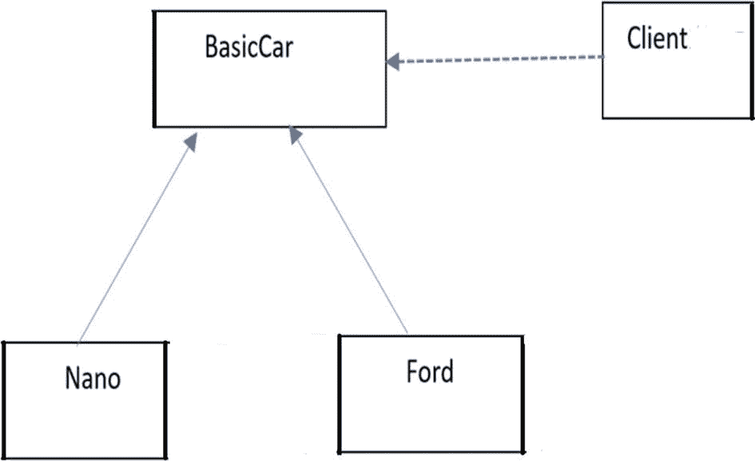
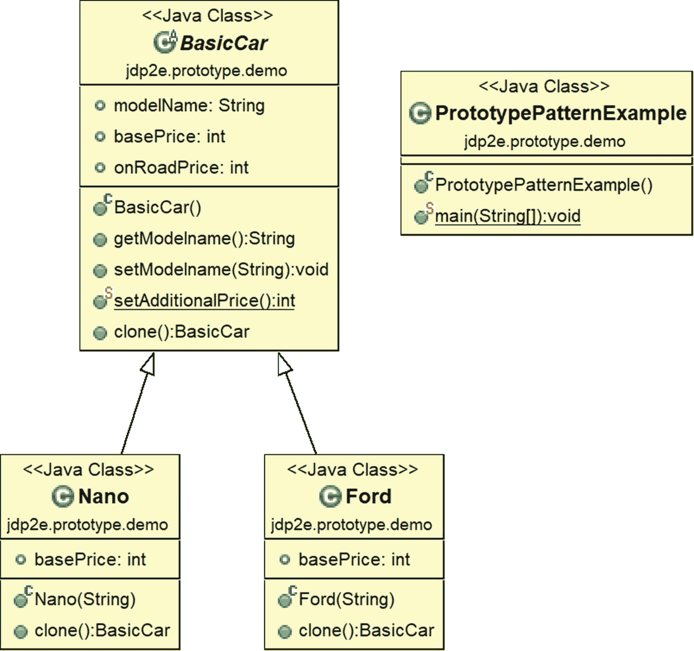
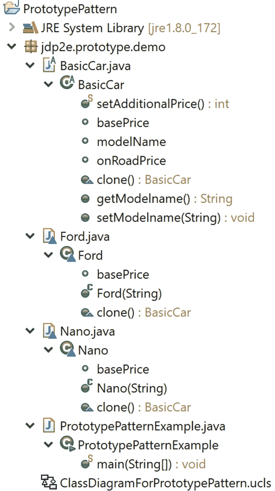
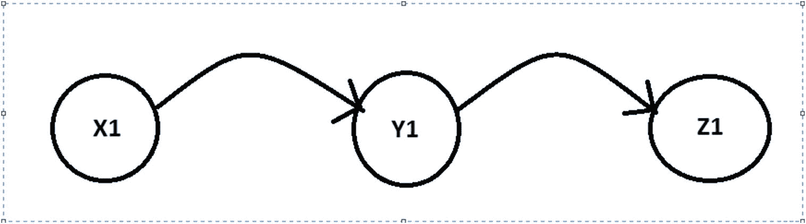
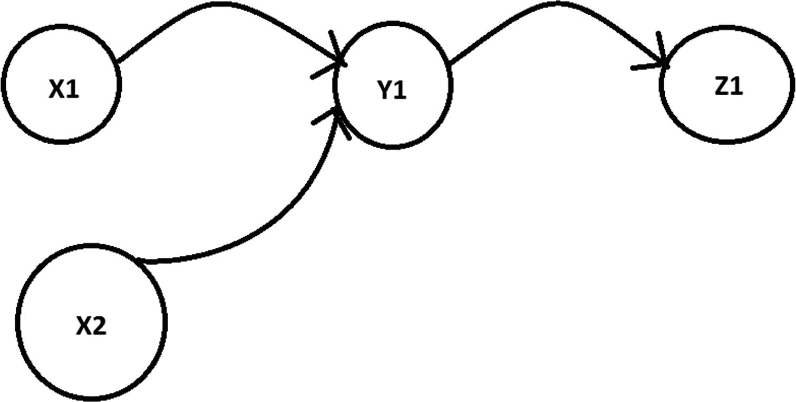
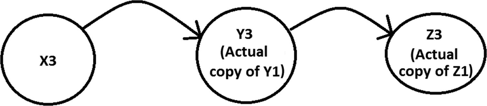

# 二、原型模式

本章涵盖了原型模式。

## GoF 定义

使用原型实例指定要创建的对象种类，并通过复制该原型来创建新对象。

## 概念

一般来说，从头开始创建一个新实例是一项开销很大的操作。使用原型模式，您可以通过复制或克隆现有实例的实例来创建新的实例。这种方法节省了从头创建新实例的时间和金钱。

## 真实世界的例子

假设我们有一份有价值文件的主拷贝。我们需要对其进行一些更改，以查看更改的效果。在这种情况下，我们可以复印原始文档并编辑更改。

再考虑一个例子。假设一群人决定庆祝他们的朋友罗恩的生日。他们去面包店买了一个蛋糕。为了让蛋糕与众不同，他们要求卖家在蛋糕上写上“罗恩生日快乐”。从卖方的角度来看，他并没有制造任何新的模型。他已经定义了模型，每天按照相同的流程制作许多蛋糕(看起来都一样)，最后通过一些小的变化使每个蛋糕都很特别。

## 计算机世界的例子

让我们假设您有一个非常稳定的应用程序。将来，您可能希望通过一些小的修改来更新应用程序。因此，您从原始应用程序的副本开始，进行更改，并进一步分析。当然，为了节省你的时间和金钱，你不希望从零开始。

### 注意

将 Object.clone()方法作为原型的一个例子。

## 说明

图 [2-1](#Fig1) 展示了一个简单的原型结构。



图 2-1

一个样本原型结构

在这里，BasicCar 是一个基本原型。Nano 和 Ford 是实现了 BasicCar 中定义的`clone()`方法的具体原型。在这个例子中，我们创建了一个带有默认价格(印度货币)的 BasicCar 类。后来，我们修改了每个型号的价格。PrototypePatternExample.java 是这个实现中的客户端。

### 类图

图 [2-2](#Fig2) 显示了原型模式的类图。



图 2-2

类图

### 包资源管理器视图

图 [2-3](#Fig3) 显示了程序的高层结构。



图 2-3

包资源管理器视图

### 履行

下面是实现。

```java
//BasicCar.java
package jdp2e.prototype.demo;
import java.util.Random;

public abstract class BasicCar implements Cloneable
{
    public String modelName;
    public int basePrice,onRoadPrice;

    public String getModelname() {
        return modelName;
    }
    public void setModelname(String modelname) {
        this.modelName = modelname;
    }

    public static int setAdditionalPrice()
    {
        int price = 0;
        Random r = new Random();
        //We will get an integer value in the range 0 to 100000
        int p = r.nextInt(100000);
        price = p;
        return price;
    }
    public BasicCar clone() throws CloneNotSupportedException
    {
        return  (BasicCar)super.clone();
    }
}
//Nano.java
package jdp2e.prototype.demo;

class Nano extends BasicCar
{
    //A base price for Nano
    public int basePrice=100000;
    public Nano(String m)
    {
        modelName = m;
    }
    @Override
    public BasicCar clone() throws CloneNotSupportedException
    {
         return (Nano)super.clone();
         //return this.clone();
    }
}

//Ford.java

package jdp2e.prototype.demo;

class Ford extends BasicCar
{
    //A base price for Ford
    public int basePrice=100000;
    public Ford(String m)
    {
        modelName = m;
    }

    @Override
    public BasicCar clone() throws CloneNotSupportedException
    {
        return (Ford)super.clone();
    }
}
//Client
// PrototypePatternExample.java

package jdp2e.prototype.demo;

public class PrototypePatternExample
{
    public static void main(String[] args) throws CloneNotSupportedException
    {
        System.out.println("***Prototype Pattern Demo***\n");
        BasicCar nano = new Nano("Green Nano") ;
        nano.basePrice=100000;

        BasicCar ford = new Ford("Ford Yellow");
        ford.basePrice=500000;

        BasicCar bc1;
        //Nano
        bc1 =nano.clone();
        //Price will be more than 100000 for sure
        bc1.onRoadPrice = nano.basePrice+BasicCar.setAdditionalPrice();
        System.out.println("Car is: "+ bc1.modelName+" and it's price is Rs."+bc1.onRoadPrice);

        //Ford
        bc1 =ford.clone();
        //Price will be more than 500000 for sure
        bc1.onRoadPrice = ford.basePrice+BasicCar.setAdditionalPrice();
        System.out.println("Car is: "+ bc1.modelName+" and it's price is Rs."+bc1.onRoadPrice);
    }
}

```

### 输出

这是输出。

```java
***Prototype Pattern Demo***

Car is: Green Nano and it's price is Rs.123806
Car is: Ford Yellow and it's price is Rs.595460

```

### 注意

您可以在您的系统中看到不同的价格，因为我们在 BasicCar 类中的 setAdditionalPrice()方法中生成了一个随机价格。但我保证福特的价格会比 Nano 高。

## 问答环节

1.  **使用原型设计模式的** **优势** **有哪些？**
    *   当创建一个类的实例是一个复杂(或者无聊)的过程时，这是很有用的。相反，你可以专注于其他关键活动。

    *   您可以在运行时包含或丢弃产品。

    *   您可以以更低的成本创建新的实例。

2.  与使用原型设计模式相关的 **挑战** **有哪些？**
    *   每个子类都需要实现克隆或复制机制。

    *   有时，从现有实例创建副本并不简单。例如，如果所考虑的对象不支持复制/克隆，或者存在循环引用，那么实现克隆机制可能会很困难。比如在 Java 中，带有`clone()`方法的类需要实现可克隆的标记接口；否则，它将抛出 CloneNotSupportedException。

    *   在这个例子中，我使用了在 Java 中执行浅层复制的`clone()`方法。按照约定，我通过调用`super.clone()`获得了返回的对象。(如果您想了解更多这方面的内容，请将光标放在 eclipse 编辑器上，仔细阅读说明)。如果您的应用程序需要一个深层副本，那可能会很贵。

3.  你能详细说明浅拷贝和深拷贝的区别吗？

    一个*浅拷贝*创建一个新对象，然后将各种字段值从原始对象拷贝到新对象。所以，它也被称为*逐场复制*。如果原始对象包含作为字段的对其他对象的任何引用，则这些对象的引用被复制到新对象中(即，您不创建这些对象的副本)。

    Let’s try to understand the mechanism with a simple diagram. Suppose we have an object, `X1`, and it has a reference to another object, `Y1`. Further assume that object `Y1` has a reference to object `Z1`.

    

    图 2-4

    在引用的浅拷贝之前

现在，使用`X1`的浅层副本，创建了一个新对象`X2`；它也提到了`Y1`。



图 2-5

在引用的浅拷贝之后

您已经看到了在我们的实现中使用了`clone()`方法。它执行浅层复制。

对于`X1`的*深度副本*，创建一个新对象`X3`。`X3`引用了新对象`Y3`，实际上是`Y1`的副本。同样，`Y3`又引用了另一个新对象`Z3`，它是`Z1`的副本。



图 2-6

在引用的深层副本之后

在深层副本中，新对象与原始对象完全分离。在一个对象中进行的任何更改都不应反映在另一个对象上。要用 Java 创建深层副本，您可能需要覆盖`clone()`方法，然后继续。此外，深层拷贝的成本很高，因为您需要创建额外的对象。深度复制的完整实现在本书 Memento 模式的“Q & A Session ”(第 [19 章](19.html))中给出。

1.  什么时候你会选择浅层拷贝而不是深层拷贝(反之亦然)？

    浅层拷贝速度更快，成本更低。如果您的目标对象只有基本字段，那总是更好。

    深层拷贝既昂贵又缓慢。但是，如果您的目标对象包含许多引用其他对象的字段，这是很有用的。

2.  当我在 Java 中复制一个对象时，我需要使用 clone()方法。这种理解正确吗？

    不，还有其他选择，其中之一就是使用序列化机制。但是你总是可以定义你自己的复制构造函数并使用它。

3.  你能给出一个简单的例子来演示用户定义的复制构造函数吗？

    Java 不支持默认的复制构造函数。你可能需要自己写。考虑下面的程序，它演示了这种用法。

### 示范

这是演示。

```java
package jdp2e.prototype.questions_answers;

class Student
{
    int rollNo;
    String name;
    //Instance Constructor
    public Student(int rollNo, String name)
    {
        this.rollNo = rollNo;
        this.name = name;
    }
    //Copy Constructor
    public Student( Student student)
    {
        this.name = student.name;
        this.rollNo = student.rollNo;
    }
    public void displayDetails()
    {
        System.out.println(" Student name: " + name + ",Roll no: "+rollNo);
    }
}

class UserDefinedCopyConstructorExample {
    public static void main(String[] args) {
        System.out.println("***User defined copy constructor example in Java***\n");
        Student student1 = new Student(1, "John");
        System.out.println(" The details of Student1 is as follows:");
        student1.displayDetails();
        System.out.println("\n Copying student1 to student2 now");
        //Invoking the user-defined copy constructor
        Student student2 = new Student (student1);
        System.out.println(" The details of Student2 is as follows:");
        student2.displayDetails();
    }
}

```

### 输出

这是输出。

```java
***User defined copy constructor example in Java***

 The details of Student1 is as follows:
 Student name: John,Roll no: 1

 Copying student1 to student2 now
 The details of Student2 is as follows:
 Student name: John,Roll no: 1

```