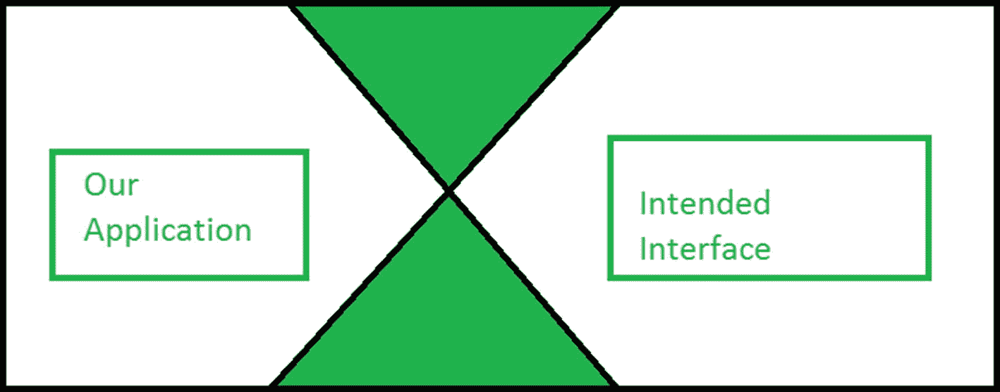
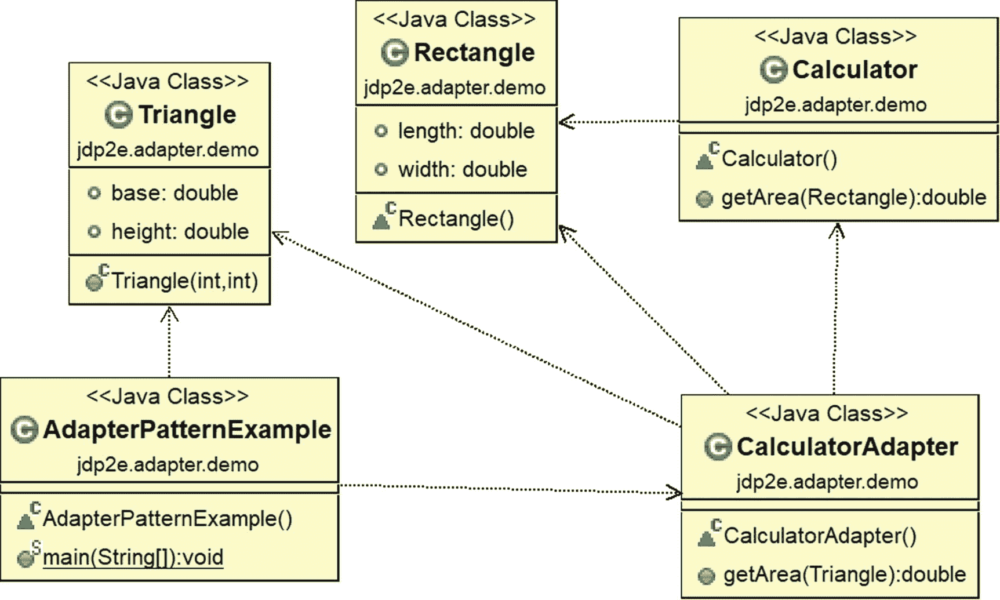
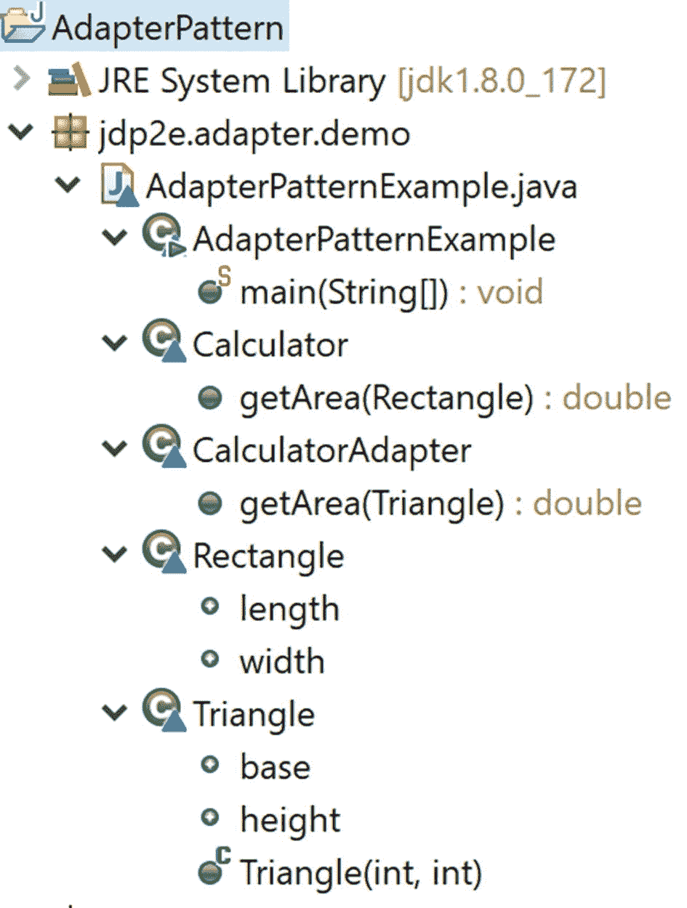
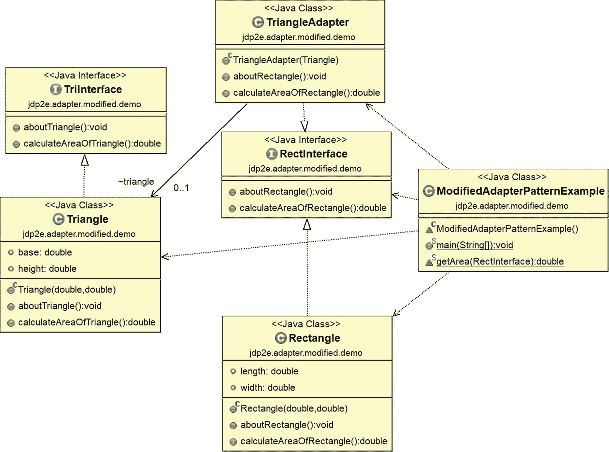
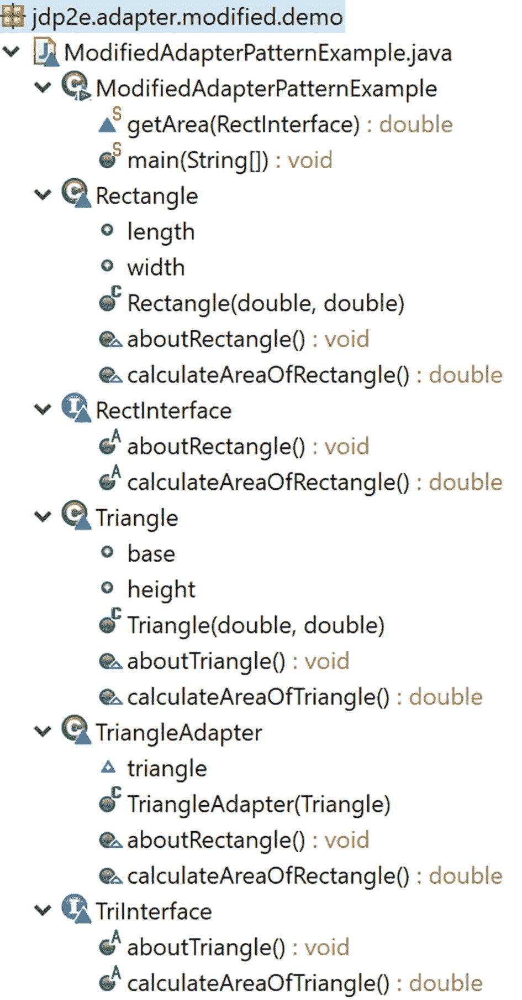
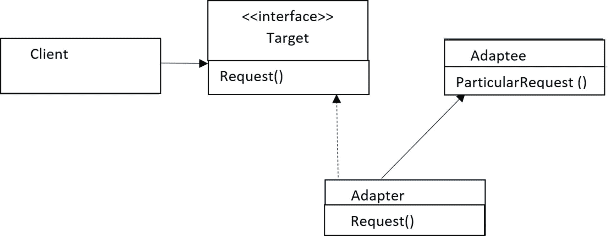
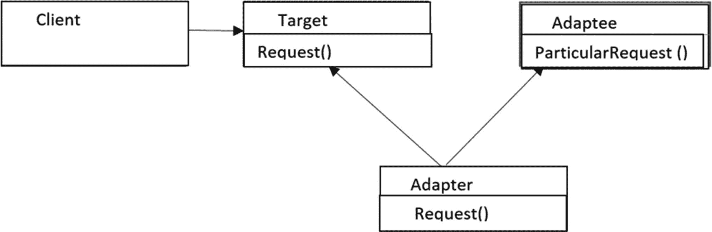

# 8.适配器模式

本章介绍适配器模式。

## GoF 定义

将类的接口转换成客户端期望的另一个接口。适配器允许类一起工作，否则由于不兼容的接口而无法工作。

## 概念

下面的例子最好地描述了核心概念。

## 真实世界的例子

这种模式在国际旅行中的电源插座适配器/交流电源适配器中非常常见。当接受美国电源的电子设备(比如笔记本电脑)可以插入欧洲电源插座时，这些适配器充当中间人。考虑另一个例子。假设你需要给手机充电，但是你看到总机和你的充电器不兼容。在这种情况下，您可能需要使用适配器。或者，在现实生活中，为某人翻译语言的译者可以被认为遵循了这种模式。

现在，您可以想象这样一种情况，您需要将一个应用程序插入一个适配器(在本例中是 X 形的)来使用预期的接口。如果不使用这个适配器，您就不能正确地连接应用程序和接口。

图 [8-1](#Fig1) 显示了使用适配器之前的情况。


图 8-1

在使用适配器之前

图 [8-2](#Fig2) 显示了使用适配器后的情况。



图 8-2

使用适配器后

## 计算机世界的例子

假设您有一个应用程序，可以大致分为两部分:用户界面(UI 或前端)和数据库(后端)。通过用户界面，客户端可以传递特定类型的数据或对象。您的数据库与那些对象兼容，可以顺利地存储它们。经过一段时间，你可能会觉得你需要升级你的软件来让你的客户满意。因此，您可能希望允许新类型的对象通过 UI。但是在这种情况下，第一个阻力来自你的数据库，因为它不能存储这些新类型的对象。在这种情况下，您可以使用一个适配器，负责将新对象转换为旧数据库可以接受的兼容形式。

### 注意

在 Java 中，可以将 java.io.InputStreamReader 类和 java.io.OutputStreamWriter 类视为对象适配器的示例。它们将现有的 InputStream/OutputStream 对象应用于读取器/写入器接口。您将很快了解到类适配器和对象适配器。

## 说明

下面的例子描述了这种模式的一个简单用法。

在这个例子中，你可以很容易地计算出一个矩形的面积。如果您注意到 Calculator 类和它的`getArea()`方法，您就会明白您需要在`getArea()`方法中提供一个 rectangle 对象来计算矩形的面积。现在假设你想计算一个三角形的面积，但是你的约束是你想通过计算器类的`getArea()`方法得到它的面积。那么，如何才能实现这一点呢？

为了处理这类问题，我为 Triangle 类制作了 CalculatorAdapter，并在它的`getArea()`方法中传递了一个三角形。反过来，该方法将三角形视为矩形，并从 Calculator 类的`getArea()`方法计算面积。

### 类图

图 [8-3](#Fig3) 显示了类图。



图 8-3

类图

### 包资源管理器视图

图 [8-4](#Fig4) 显示了程序的高层结构。



图 8-4

包资源管理器视图

### 履行

```java
package jdp2e.adapter.demo;

class Rectangle
{
    public double length;
    public double width;
}
class Calculator
{
    public double getArea(Rectangle rect)
    {
        return rect.length * rect.width;
    }
}
class Triangle
{
    public double base;//base
    public double height;//height
    public Triangle(int b, int h)
    {
        this.base = b;
        this.height = h;
    }
}
class CalculatorAdapter
{
    public double getArea(Triangle triangle)
    {
        Calculator c = new Calculator();
        Rectangle rect = new Rectangle();
        //Area of Triangle=0.5*base*height
        rect.length = triangle.base;
        rect.width = 0.5 * triangle.height;
        return c.getArea(rect);
    }
}

class AdapterPatternExample {
    public static void main(String[] args) {
        System.out.println("***Adapter Pattern Demo***\n");
        CalculatorAdapter calculatorAdapter = new CalculatorAdapter();
        Triangle t = new Triangle(20,10);
        System.out.println("Area of Triangle is " + calculatorAdapter.getArea(t) + " Square unit");
    }
}

```

### 输出

这是输出。

```java
***Adapter Pattern Demo***

Area of Triangle is 100.0 Square unit

```

### 修改后的插图

您已经看到了适配器设计模式的一个非常简单的例子。但是，如果你想严格遵循面向对象的设计原则，你可能想修改实现，因为你已经知道，而不是使用具体的类，你应该总是更喜欢使用接口。因此，记住这个关键原则，让我们修改实现。

### 修改的类图



### 修改后的实现的主要特征

以下是修改后的实现的主要特征。

*   rectangle 类实现 RectInterface，c `alculateAreaOfRectangle()`方法帮助计算 Rectangle 对象的面积。

*   三角形类实现了 TriInterface，c `alculateAreaOfTriangle()`方法帮助计算三角形对象的面积。

*   但是约束是您需要使用 RectInterface 计算三角形的面积(或者，您可以简单地说您现有的系统需要修改三角形对象)。为了达到这个目的，我引入了一个`adapter(TriangleAdapter)`，它与 RectInterface 接口交互。

*   矩形和三角形代码都不需要改变。您只是简单地使用适配器，因为它实现了 RectInterface 接口，并且使用 RectInterface 方法，您可以很容易地计算三角形的面积。这是因为我正在重写接口方法，以委托给我所适应的类(三角形)的相应方法。

*   注意`getArea(RectInterface)`方法并不知道通过 TriangleAdapter，它实际上是在处理一个三角形对象而不是矩形对象。

*   注意另一个重要的事实和用法。假设在一个特定的情况下，您需要处理一些面积为 200 平方单位的矩形对象，但是您没有足够数量的这样的对象。但是你注意到你有面积为 100 平方单位的三角形物体。所以，使用这种模式，你可以调整一些三角形的物体。怎么做？好吧，如果你仔细观察，你会发现在使用适配器的`calculateAreaOfRectangle()`方法时，你实际上是在调用一个三角形对象的`calculateAreaOfTriangle()`(即你是在委托你所适配的类的相应方法)。因此，您可以根据需要修改(覆盖)方法体(例如，在这种情况下，您可以将三角形面积乘以 2.0，得到 200 个平方单位的面积(就像一个长 20 个单位、宽 10 个单位的矩形对象)。

在您可能需要处理不完全相同但非常相似的对象的情况下，这种技术可以帮助您。在客户端代码的最后一部分，我展示了这样一种用法，应用程序使用增强的`for`循环(在 Java 5.0 中引入)显示系统中的当前对象。

### 注意

在最后一点的背景下，你必须同意，你不应该试图将一个圆转换成一个矩形(或类似类型的转换)来获得一个面积，因为它们是完全不同的。但在这个例子中，我谈论的是三角形和矩形，因为它们有一些相似之处，并且面积可以通过微小的变化很容易地计算出来。

### 已修改的包资源管理器视图

图 [8-5](#Fig5) 显示了修改后程序的结构。



图 8-5

已修改的包资源管理器视图

### 修改的实现

这是修改后的实现。

```java
package jdp2e.adapter.modified.demo;

import java.util.ArrayList;
import java.util.List;

interface RectInterface
{
    void aboutRectangle();
    double calculateAreaOfRectangle();
}
class Rectangle implements RectInterface
{
    public double length;
    public double width;
    public Rectangle(double length, double width)
    {
        this.length = length;
        this.width = width;
    }

    @Override
    public void aboutRectangle()
    {
        System.out.println("Rectangle object with length: "+ this.length +" unit and width :" +this.width+ " unit.");

    }

    @Override
    public double calculateAreaOfRectangle()
    {
        return length * width;
    }
}

interface TriInterface
{
    void aboutTriangle();
    double calculateAreaOfTriangle();
}
class Triangle implements TriInterface
{
    public double base;//base
    public double height;//height
    public Triangle(double base, double height)
    {
        this.base = base;
        this.height = height;
    }

    @Override
    public void aboutTriangle() {
        System.out.println("Triangle object with base: "+ this.base +" unit and height :" +this.height+ " unit.");

    }

    @Override
    public double calculateAreaOfTriangle() {
        return 0.5 * base * height;
    }
}

/*TriangleAdapter is implementing RectInterface.
 So, it needs to implement all the methods defined
in the target interface.*/
class TriangleAdapter implements RectInterface
{
    Triangle triangle;
    public TriangleAdapter(Triangle t)
    {
        this.triangle = t;
    }
    @Override
    public void aboutRectangle() {
        triangle.aboutTriangle();

    }
    @Override
    public double calculateAreaOfRectangle() {
        return triangle.calculateAreaOfTriangle();
    }

}

class ModifiedAdapterPatternExample {
    public static void main(String[] args) {
        System.out.println("***Adapter Pattern Modified Demo***\n");
        Rectangle rectangle = new Rectangle(20, 10);
        System.out.println("Area of Rectangle is :  "+ rectangle.calculateAreaOfRectangle()+" Square unit.");
        Triangle triangle = new Triangle(10,5);
        System.out.println("Area of Triangle is : "+triangle.calculateAreaOfTriangle()+ " Square unit.");
        RectInterface adapter = new TriangleAdapter(triangle);
        //Passing a Triangle instead of a Rectangle
        System.out.println("Area of Triangle using the triangle adapter is : "+getArea(adapter)+" Square unit.");

        //Some Additional code (Optional) to show the power of adapter
        //pattern
        List<RectInterface> rectangleObjects=new ArrayList<RectInterface>();
        rectangleObjects.add(rectangle);
        //rectangleObjects.add(triangle);//Error
        rectangleObjects.add(adapter);//Ok
        System.out.println("");
        System.out.println("*****Current objects in the system are:******");
        for(RectInterface rectObjects:rectangleObjects)
        {
            rectObjects.aboutRectangle();
        }
    }

    /*getArea(RectInterface r) method  does not know that through TriangleAdapter, it is getting a Triangle  object instead of a Rectangle object*/
    static double getArea(RectInterface r)
    {
        return r.calculateAreaOfRectangle();
    }
}

```

### 修改输出

这是修改后的输出。

```java
***Adapter Pattern Modified Demo***

Area of Rectangle is :  200.0 Square unit.
Area of Triangle is : 25.0 Square unit.
Area of Triangle using the triangle adapter is : 25.0 Square unit.

*****Current objects in the system are:******
Rectangle object with length: 20.0 unit and width :10.0 unit.
Triangle object with base: 10.0 unit and height :5.0 unit.

```

### 适配器的类型

GoF 解释了两种适配器:类适配器和对象适配器。

#### 对象适配器

对象适配器通过对象组合进行适配，如图 [8-6](#Fig6) 所示。到目前为止讨论的适配器是对象适配器的一个例子。



图 8-6

典型的对象适配器

在我们的示例中，TriangleAdapter 是实现 RectInterface(目标接口)的适配器。三角形是适配器接口。适配器保存被适配器实例。

### 注意

因此，如果您遵循 TriangleAdapter 类的主体，您可以得出结论，要创建对象适配器，您需要遵循以下一般准则:

(1)您的类需要实现目标接口( ***适配*** 接口)。如果目标是一个抽象类，你需要扩展它。

(2)在构造函数中提到你从 改编的 ***类，并在实例变量中存储对它的引用。***

(3)重写接口方法，以委托您正在改编的类的相应方法。

#### 类别适配器

类适配器通过子类化来适应。他们是多重继承的推动者。但是你知道在 Java 中，不支持通过类的多重继承。(你需要接口来实现多重继承的概念。)

图 8-7 显示了支持多重继承的类适配器的典型类图。



图 8-7

典型的类适配器

## 问答环节

1.  如何用 Java 实现类适配器设计模式？

    You can subclass an existing class and implement the desired interface. For example, if you want to use a class adapter instead of an object adapter in the modified implementation, then you can use the following code.

    ```java
    class TriangleClassAdapter extends Triangle implements RectInterface
    {
        public TriangleClassAdapter(double base, double height) {
            super(base, height);
        }

        @Override
        public void aboutRectangle()
        {
            aboutTriangle();
        }
        @Override
        public double calculateAreaOfRectangle()
        {
            return calculateAreaOfTriangle();
        }

    }

    ```

    但是请注意，您不能总是应用这种方法。例如，考虑一下 Triangle 类何时是最终类(因此，您不能从它派生)。除了这种情况，当您注意到您需要修改一个没有在接口中指定的方法时，您将再次被阻止。因此，在这种情况下，对象适配器是有用的。

2.  **“除了这种情况，当你注意到你需要修改一个没有在接口中指定的方法时，你将再次被阻止。”你这么说是什么意思？**

    In the modified implementation, you have used the `aboutRectangle()` and `aboutTriangle()` methods .These methods are actually telling about the objects of the Rectangle and Triangle classes. Now, say, instead of `aboutTriangle(`) , there is a method called `aboutMe()`, which is doing the same but there is no such method in the RectInterface interface. Then it will be a challenging task for you to adapt the `aboutMe()` method from the Triangle class and write code similar to this:

    ```java
    for(RectInterface rectObjects:rectangleObjects)
    {
        rectObjects.aboutMe();
    }

    ```

3.  你更喜欢哪一个——类适配器还是对象适配器？

    在大多数情况下，我更喜欢组合而不是继承。对象适配器使用组合，更加灵活。此外，在许多情况下，您可能没有实现真正的类适配器。(在这种情况下，您可能会再次浏览前面问题的答案。)

4.  这种模式有什么缺点？

    我看不出有什么大的挑战。我相信您可以使适配器的工作简单明了，但是您可能需要编写一些额外的代码。但是回报是巨大的——特别是对于那些不能被改变但是你仍然需要使用它们来保持稳定性的遗留系统。

    同时，专家建议您不要使用不同类型的验证或向适配器添加新的行为。理想情况下，adaptar 的工作应该仅限于执行简单的接口翻译。