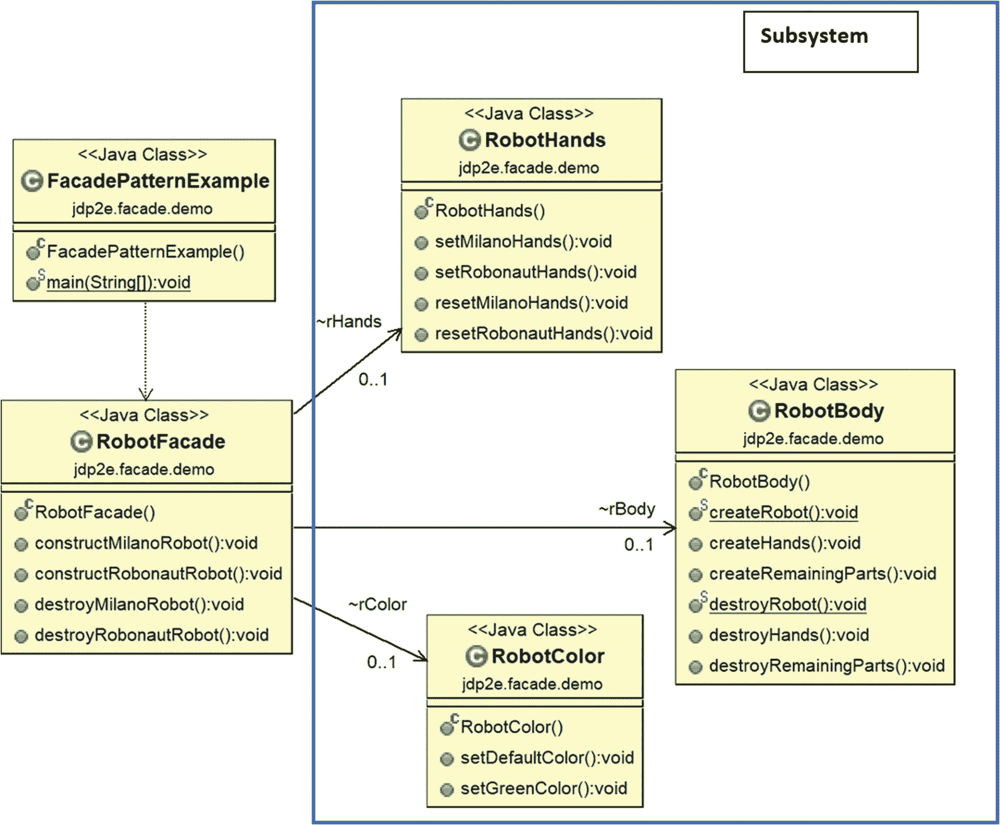
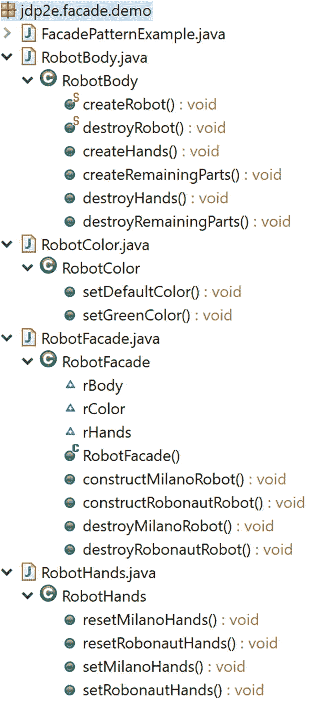

# 九、外观模式

本章涵盖了外观模式。

## GoF 定义

为子系统中的一组接口提供统一的接口。Facade 定义了一个更高级的接口，使得子系统更容易使用。

## 概念

门面使客户的生活更容易。假设有一个复杂的系统，其中多个对象需要执行一系列任务，你需要与系统进行交互。在这种情况下，facade 可以为您提供一个简化的接口，处理所有事情(创建那些对象，提供正确的任务序列，等等)。).结果，你不是以复杂的方式与多个对象交互，而是与单个对象交互。

这是支持松耦合的模式之一。在这里，您强调抽象，并通过公开一个简单的接口来隐藏复杂的细节。因此，代码变得更清晰，更有吸引力。

## 真实世界的例子

假设你要组织一个生日聚会，你打算邀请 500 人。现在，你可以去任何一个聚会组织者那里，让他们知道关键信息——聚会类型、日期和时间、参加人数等等。组织者会为您完成剩下的工作。你不需要考虑大厅将如何装饰，与会者是否会从自助餐桌上获得食物或由餐饮服务商提供服务，等等。所以，你不需要从商店里买东西或者自己装饰派对大厅——你只需要付钱给组织者，让他们把工作做好。

## 计算机世界的例子

考虑一种情况，您使用库中的方法(在编程语言的上下文中)。您不关心该方法在库中是如何实现的。您只需调用方法来试验它的简单用法。

### 注意

您可以有效地使用外观设计模式的概念，使您的 JDBC 应用程序更具吸引力。您可以将 java.net.URL 类视为门面模式实现的一个示例。考虑这个类中的简写 openStream()或 getContent()方法。openStream()方法返回 openConnection()。getInputStream()和 getContent()方法返回 openConnection.getContent() *。*在 URLConnection 类中进一步定义了 getInputStream()和 getContent()方法。

## 说明

在下面的实现中，您创建了一些机器人，然后销毁了这些对象。(在本例中，单词“destroy”没有用在垃圾收集的上下文中)。在这里，您可以通过调用 RobotFacade 类的`constructMilanoRobot`()和`destroyMilanoRobot()`这样的简单方法来构造或破坏特定类型的机器人。

从客户的角度来看，他/她只需要与 FacadePatternExample.java 进行交互。RobotFacade 全权负责创造或摧毁特定种类的机器人。这个 facade 与每个子系统(RobotHands、RobotBody、RobotColor)进行对话，以完成客户端的请求。RobotBody 类包括两个简单的静态方法，在创建或销毁机器人之前提供指令。

因此，在这个实现中，客户端不需要担心单独的类的创建和方法的调用顺序。

### 类图

图 [9-1](#Fig1) 显示了类图。



图 9-1

类图

### 包资源管理器视图

图 [9-2](#Fig2) 显示了程序的高层结构。



图 9-2

包资源管理器视图

### 履行

下面是实现。

```java
// RobotBody.java

package jdp2e.facade.demo;

public class RobotBody
{
    //Instruction manual -how to create a robot
    public static void createRobot()
    {
        System.out.println(" Refer the manual before creation of a robot.");
    }
    //Method to create hands of a robot
    public void createHands()
    {
        System.out.println(" Hands manufactured.");
    }
    //Method to create remaining parts (other than hands) of a robot
    public void createRemainingParts()
    {
        System.out.println(" Remaining parts (other than hands) are created.");
    }
    //Instruction manual -how to destroy a robot
    public static void destroyRobot()
    {
        System.out.println(" Refer the manual before destroying of a robot.");
    }
    //Method to destroy hands of a robot
    public void destroyHands()
    {
        System.out.println(" The robot's hands are destroyed.");
    }
    //Method to destroy remaining parts (other than hands) of a robot
    public void destroyRemainingParts()
    {
        System.out.println(" The robot's remaining parts are destroyed.");
    }

}
//RobotColor.java

package jdp2e.facade.demo;

public class RobotColor

{
    public void setDefaultColor()
    {
        System.out.println(" This is steel color robot.");
    }
    public void setGreenColor()
    {
        System.out.println(" This is a green color robot.");
    }
}

// RobotHands.java

package jdp2e.facade.demo;

public class RobotHands
{
    public void setMilanoHands()
    {
        System.out.println(" The robot will have EH1 Milano hands.");
    }
    public void setRobonautHands()
    {
        System.out.println(" The robot will have Robonaut hands.");
    }
    public void resetMilanoHands()
    {
        System.out.println(" EH1 Milano hands are about to be destroyed.");
    }
    public void resetRobonautHands()
    {
        System.out.println(" Robonaut hands are about to be destroyed.");
    }
}

// RobotFacade.java
package jdp2e.facade.demo;

public class RobotFacade
{
    RobotColor rColor;
    RobotHands rHands ;
    RobotBody rBody;
    public RobotFacade()
    {
        rColor = new RobotColor();
        rHands = new RobotHands();
        rBody = new RobotBody();

    }
    //Constructing a Milano Robot
    public void constructMilanoRobot()

    {
        RobotBody.createRobot();
        System.out.println("Creation of a Milano Robot Start.");
        rColor.setDefaultColor();
        rHands.setMilanoHands();
        rBody.createHands();
        rBody.createRemainingParts();
        System.out.println(" Milano Robot Creation End.");
        System.out.println();
    }
    //Constructing a Robonaut Robot
    public void constructRobonautRobot()
    {
        RobotBody.createRobot();
        System.out.println("Initiating the creational process of a Robonaut Robot.");
        rColor.setGreenColor();
        rHands.setRobonautHands();
        rBody.createHands();
        rBody.createRemainingParts();
        System.out.println("A Robonaut Robot is created.");
        System.out.println();
    }
    //Destroying a Milano Robot
    public void destroyMilanoRobot()
    {
        RobotBody.destroyRobot();
        System.out.println(" Milano Robot's destruction process is started.");
        rHands.resetMilanoHands();
        rBody.destroyHands();
        rBody.destroyRemainingParts();
        System.out.println(" Milano Robot's destruction process is over.");
        System.out.println();
    }
    //Destroying a Robonaut Robot
    public void destroyRobonautRobot()
    {
        RobotBody.destroyRobot();
        System.out.println(" Initiating a Robonaut Robot's destruction process.");
        rHands.resetRobonautHands();
        rBody.destroyHands();
        rBody.destroyRemainingParts();
        System.out.println(" A Robonaut Robot is destroyed.");
        System.out.println();
    }

}
//Client code
//FacadePatternExample.java

package jdp2e.facade.demo;

public class FacadePatternExample {
    public static void main(String[] args) {
        System.out.println("***Facade Pattern Demo***\n");
        //Creating Robots
        RobotFacade milanoRobotFacade = new RobotFacade();
        milanoRobotFacade.constructMilanoRobot();
        RobotFacade robonautRobotFacade = new RobotFacade();
        robonautRobotFacade.constructRobonautRobot();
        //Destroying robots
        milanoRobotFacade.destroyMilanoRobot();
        robonautRobotFacade.destroyRobonautRobot();

    }

}

```

### 输出

这是输出。

```java
***Facade Pattern Demo***

 Refer the manual before creation of a robot.
Creation of a Milano Robot Start.
 This is steel color robot.
 The robot will have EH1 Milano hands.
 Hands manufactured.
 Remaining parts (other than hands) are created.
 Milano Robot Creation End.

 Refer the manual before creation of a robot.
Initiating the creational process of a Robonaut Robot.
 This is a green color robot.
 The robot will have Robonaut hands.
 Hands manufactured.
 Remaining parts (other than hands) are created.
A Robonaut Robot is created.

 Refer the manual before destroying of a robot.
 Milano Robot's destruction process is started.
 EH1 Milano hands are about to be destroyed.
 The robot's hands are destroyed.
 The robot's remaining parts are destroyed.
 Milano Robot's destruction process is over.

 Refer the manual before destroying of a robot.
 Initiating a Robonaut Robot's destruction process.
 Robonaut hands are about to be destroyed.
 The robot's hands are destroyed.
 The robot's remaining parts are destroyed.
 A Robonaut Robot is destroyed

.

```

## 问答环节

1.  使用外观模式的主要优势是什么？
    *   如果一个系统由许多子系统组成，管理所有这些子系统就变得非常困难，客户可能会发现很难与这些子系统中的每一个单独通信。在这种情况下，外观模式非常方便。它为客户提供了一个简单的界面。简而言之，您向客户呈现了一个简化的界面，而不是呈现复杂的子系统。这种方法还通过将客户端与子系统分离来促进弱耦合。

    *   它还可以帮助您减少客户端需要处理的对象数量。

2.  我看到 facade 类正在使用组合。这是故意的吗？

    是的。使用这种方法，您可以很容易地访问每个子系统中的方法。

3.  在我看来，外观并没有限制我们直接与子系统连接。这种理解正确吗？

    是的。外观不封装子系统类或接口。它只是提供了一个简单的接口(或层)让你的生活更轻松。您可以自由地公开子系统的任何功能，但是在这些情况下，您的代码可能看起来很脏，同时，您会失去与该模式相关的所有好处。

4.  **它与适配器设计模式有何不同？**

    在适配器模式中，您试图改变一个接口，以便客户机感觉不到接口之间的差异。facade 模式简化了界面。它们为客户端提供了一个简单的交互界面(而不是复杂的子系统)。

5.  一个复杂的子系统应该只有一个外观。这是正确的吗？

    一点也不。您可以为特定子系统创建任意数量的外观。

6.  我可以用一个门面添加更多的东西/逻辑吗？

    是的，你可以。

7.  与门面模式相关的挑战是什么？
    *   子系统与外观层相连接。因此，您需要关注额外的编码层(即，您的代码库增加)。

    *   当子系统的内部结构发生变化时，您也需要将变化合并到外观层中。

    *   开发人员需要了解这个新层，而他们中的一些人可能已经知道如何有效地使用子系统/API。

8.  **它与 mediator 设计模式有什么不同？**

    在中介模式实现中，子系统知道中介。他们互相交谈。但是在外观中，子系统不知道外观，并且从外观到子系统提供单向通信。(本书第 [21](21.html) 章讨论了中介模式)。

9.  在我看来，要实现一个门面模式，我必须写很多代码。这种理解正确吗？

    一点也不。这取决于系统和相应的功能。例如，在前面的实现中，如果您只考虑一种类型的机器人(Milano 或 Robonaut)，并且如果您不想提供机器人的销毁机制，并且如果您想忽略说明手册(在这个示例中是两个静态方法)，您的代码大小将会显著下降。为了完整的说明，我保留了所有这些。