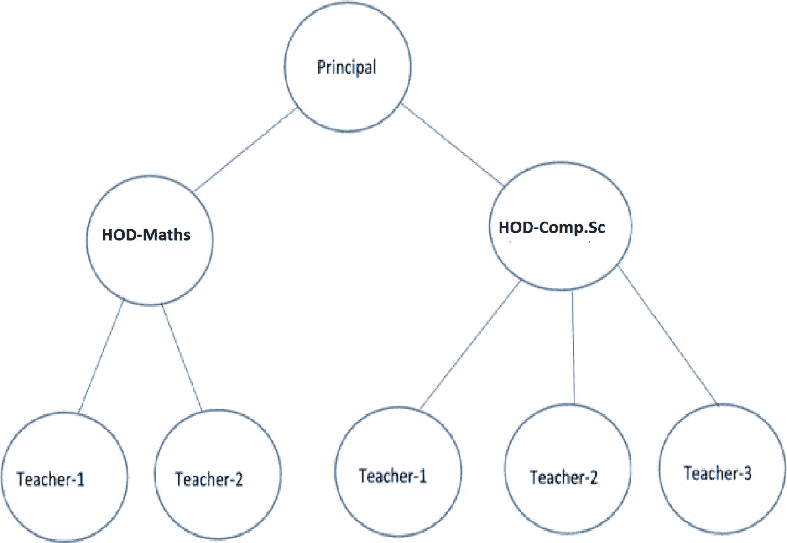
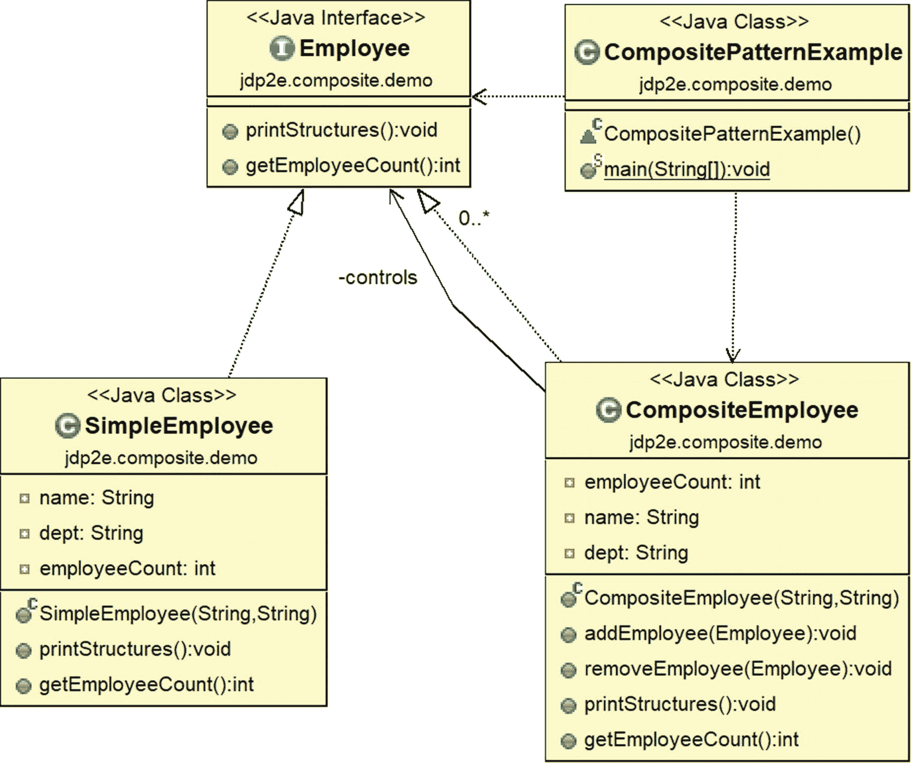
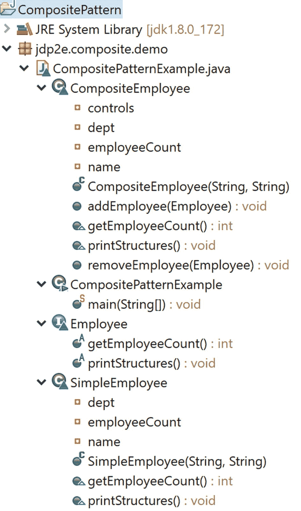

# 十一、组合模式

本章涵盖了组合模式。

## GoF 定义

将对象组成树结构来表示部分-整体层次结构。Composite 允许客户端统一处理单个对象和对象的组合。

## 概念

为了帮助你理解这个概念，我将从一个例子开始。考虑一家出售不同种类的干果和坚果的商店；比如腰果、枣和核桃。这些项目中的每一个都与特定的价格相关联。让我们假设你可以购买这些单独的物品，或者你可以购买包含不同物品的“礼包”(或盒装物品)。在这种情况下，数据包的开销是其组成部分的总和。组合模式在类似的情况下很有用，在这种情况下，您以相同的方式处理单个部分和部分的组合，以便可以统一处理它们。

这种模式对于表示对象的部分-整体层次结构很有用。在面向对象编程中，组合对象是由一个或多个相似对象组成的对象，其中每个对象都具有相似的功能。(这也称为对象之间的“有-有”关系)。这种模式在树状数据结构中非常常见。如果你能恰当地应用它，你就不需要区分分支和叶节点。使用这种模式可以实现两个关键目标。

*   您可以将对象组成一个树结构来表示部分-整体层次结构。

*   您可以统一访问组合对象(分支)和单个对象(叶节点)。因此，您可以降低代码的复杂性，同时使您的应用程序不容易出错。

## 真实世界的例子

你也可以想象一个由许多部门组成的组织。一般来说，一个组织有很多员工。这些员工中的一些被组合在一起形成一个部门，这些部门可以进一步组合在一起以构建组织的最终结构。

## 计算机世界的例子

任何树数据结构都可以遵循这个概念。客户可以用同样的方式对待树的*叶子*和*非叶子*(或树的分支)。

### 注意

这种模式常见于各种 UI 框架中。在 Java 中，通用抽象窗口工具包(AWT)容器对象是一个可以包含其他 AWT 组件的组件。例如，在 java.awt.Container 类(它扩展了 java.awt.Component)中，你可以看到 add(Component comp)方法的各种重载版本。在 JSF 中，UIViewRoot 类像一个组合节点，UIOutput 像一个叶节点。当你遍历一棵树时，你经常会用到迭代器设计模式，这将在第 [18](18.html) 章中介绍。

## 说明

在这个例子中，我代表一个大学组织。让我们假设有一个校长和两个系主任——一个负责计算机科学与工程(CSE)，一个负责数学(Maths)。数学系有两位老师(或教授/讲师)，CSE 系有三位老师(或教授/讲师)。该组织的树形结构类似于图 [11-1](#Fig1) 。



图 11-1

一个样本大学组织

我们还假设在最后，CSE 部门的一个讲师退休了。您将在接下来的小节中研究所有这些情况。

### 类图

图 [11-2](#Fig2) 显示了类图。



图 11-2

类图

### 包资源管理器视图

图 [11-3](#Fig3) 显示了程序的高层结构。



图 11-3

包资源管理器视图

### 履行

下面是实现。

```java
package jdp2e.composite.demo;

import java.util.ArrayList;
import java.util.List;

interface IEmployee
{
    void printStructures();
    int getEmployeeCount();
}
class CompositeEmployee implements IEmployee
{
    //private static int employeeCount=0;
    private int employeeCount=0;

    private String name;
    private String dept;
    //The container for child objects
    private List<IEmployee> controls;
    //Constructor
    public CompositeEmployee(String name, String dept) 

    {
        this.name = name;
        this.dept = dept;
        controls = new ArrayList<IEmployee>();
    }

    public void addEmployee(IEmployee e)
    {
        controls.add(e);
    }

    public void removeEmployee(IEmployee e)
    {
        controls.remove(e);
    }
    @Override
    public void printStructures()
    {
        System.out.println("\t" + this.name + " works in  " + this.dept);
        for(IEmployee e: controls)
        {
            e.printStructures();
        }
    }
    @Override
    public int getEmployeeCount()
    {
        employeeCount=controls.size();
        for(IEmployee e: controls)
        {
            employeeCount+=e.getEmployeeCount();
        }
        return employeeCount;
    }
}
class Employee implements IEmployee

{
    private String name;
    private String dept;
    private int employeeCount=0;
    //Constructor
    public Employee(String name, String dept)
    {
        this.name = name;
        this.dept = dept;
    }
    @Override
    public void printStructures()
    {
        System.out.println("\t\t"+this.name + " works in  " + this.dept);
    }
    @Override
    public int getEmployeeCount()
    {
        return employeeCount;//0
    }

}
class CompositePatternExample {

    /**Principal is on top of college.
     *HOD -Maths and Comp. Sc directly reports to him
     *Teachers of Computer Sc. directly reports to HOD-CSE
     *Teachers of Mathematics directly reports to HOD-Maths
     */
    public static void main(String[] args) {
        System.out.println("***Composite Pattern Demo ***");
        //2 teachers other than HOD works in Mathematics department
        Employee mathTeacher1 = new Employee("Math Teacher-1","Maths");
        Employee mathTeacher2 = new Employee("Math Teacher-2","Maths");

        //teachers other than HOD works in Computer Sc. Department

        Employee cseTeacher1 = new Employee("CSE Teacher-1", "Computer Sc.");
        Employee cseTeacher2 = new Employee("CSE Teacher-2", "Computer Sc.");
        Employee cseTeacher3 = new Employee("CSE Teacher-3", "Computer Sc.");

        //The College has 2 Head of Departments-One from Mathematics, One //from Computer Sc.
        CompositeEmployee hodMaths = new CompositeEmployee("Mrs.S.Das(HOD-Maths)","Maths");
        CompositeEmployee hodCompSc = new CompositeEmployee("Mr. V.Sarcar(HOD-CSE)", "Computer Sc.");

        //Principal of the college
        CompositeEmployee principal = new CompositeEmployee("Dr.S.Som(Principal)","Planning-Supervising-Managing");

        //Teachers of Mathematics directly reports to HOD-Maths
        hodMaths.addEmployee(mathTeacher1);
        hodMaths.addEmployee(mathTeacher2);

        //Teachers of Computer Sc. directly reports to HOD-CSE

        hodCompSc.addEmployee(cseTeacher1);
        hodCompSc.addEmployee(cseTeacher2);
        hodCompSc.addEmployee(cseTeacher3);

        /*Principal is on top of college.HOD -Maths and Comp. Sc directly reports to him*/
        principal.addEmployee(hodMaths);
        principal.addEmployee(hodCompSc);

        /*Printing the leaf-nodes and branches in the same way i.e.
         in each case, we are calling PrintStructures() method
         */
        System.out.println("\n Testing the structure of a Principal object");
        //Prints the complete structure
        principal.printStructures();
        System.out.println("At present Principal has control over "+ principal.getEmployeeCount()+ " number of employees.");

        System.out.println("\n Testing the structure of a HOD-CSE object:");
        //Prints the details of Computer Sc, department

        hodCompSc.printStructures();
        System.out.println("At present HOD-CSE has control over "+ hodCompSc.getEmployeeCount()+ " number of employees.");

        System.out.println("\n Testing the structure of a HOD-Maths object:");
        //Prints the details of Mathematics department
        hodMaths.printStructures();
        System.out.println("At present HOD-Maths has control over "+ hodMaths.getEmployeeCount()+ " number of employees.");

        //Leaf node
        System.out.println("\n Testing the structure of a leaf node:");
        mathTeacher1.printStructures();
        System.out.println("At present Math Teacher-1 has control over "+ mathTeacher1.getEmployeeCount()+ " number of employees.");

        /*Suppose, one computer teacher is leaving now
         from the organization*/
        hodCompSc.removeEmployee(cseTeacher2);
        System.out.println("\n After CSE Teacher-2 resigned, the organization has following members:");
        principal.printStructures();

        System.out.println("At present Principal has control over "+ principal.getEmployeeCount()+ " number of employees");
        System.out.println("At present HOD-CSE has control over "+ hodCompSc.getEmployeeCount()+ " number of employees");
        System.out.println("At present HOD-Maths has control over "+ hodMaths.getEmployeeCount()+ " number of employees");

    }

}

```

### 输出

这是输出。关键变化以粗体显示。

```java
***Composite Pattern Demo ***

 Testing the structure of a Principal object
    Dr.S.Som(Principal) works in  Planning-Supervising-Managing
    Mrs.S.Das(HOD-Maths) works in  Maths
        Math Teacher-1 works in  Maths
        Math Teacher-2 works in  Maths
    Mr. V.Sarcar(HOD-CSE) works in  Computer Sc.
        CSE Teacher-1 works in  Computer Sc.
        CSE Teacher-2 works in  Computer Sc.
        CSE Teacher-3 works in  Computer Sc.

At present Principal has control over 7 number of employees.

 Testing the structure of a HOD-CSE object:
    Mr. V.Sarcar(HOD-CSE) works in  Computer Sc.
        CSE Teacher-1 works in  Computer Sc.
        CSE Teacher-2 works in  Computer Sc.
        CSE Teacher-3 works in  Computer Sc.

At present HOD-CSE has control over 3 number of employees.

 Testing the structure of a HOD-Maths object:
    Mrs.S.Das(HOD-Maths) works in  Maths
        Math Teacher-1 works in  Maths
        Math Teacher-2 works in  Maths
At present HOD-Maths has control over 2 number of employees.

 Testing the structure of a leaf node:
        Math Teacher-1 works in  Maths
At present Math Teacher-1 has control over 0 number of employees.

 After CSE Teacher-2 resigned, the organization has following members:
    Dr.S.Som(Principal) works in  Planning-Supervising-Managing
    Mrs.S.Das(HOD-Maths) works in  Maths
        Math Teacher-1 works in  Maths
        Math Teacher-2 works in  Maths
    Mr. V.Sarcar(HOD-CSE) works in  Computer Sc.
        CSE Teacher-1 works in  Computer Sc.
        CSE Teacher-3 works in  Computer Sc.

At present Principal has control over 6 number of employees

At present HOD-CSE has control over 2 number of employees

At present HOD-Maths has control over 2 number of employees

```

## 问答环节

1.  **使用组合设计模式的** **优势** **有哪些？**
    *   在树状结构中，您可以统一处理组合对象(分支)和单个对象(叶节点)。注意，在这个例子中，我使用了两个常用的方法:pr `intStructures()`和`getEmployeeCount()`来打印结构，并从组合对象结构(principal 或 hods)和单个对象结构(例如，像 Math Teacher 1 这样的叶节点)中获取雇员数。)

    *   使用这种设计模式实现部分-整体层次结构是非常常见的。

    *   您可以轻松地向现有架构添加新组件，或者从您的架构中删除现有组件。

2.  **与使用组合设计模式相关的** **挑战** **有哪些？**
    *   如果您想要保持子节点的顺序(例如，如果解析树被表示为组件)，您可能需要付出额外的努力。

    *   如果你正在处理不可变的对象，你不能简单地删除它们。

    *   您可以轻松地添加一个新组件，但是这种支持会导致将来的维护开销。有时，您想要处理具有特殊组件的组合对象。这种约束会导致额外的开发成本，因为您可能需要实现一个动态检查机制来支持这个概念。

3.  **在这个例子中，你使用了列表数据结构** **。但是我更喜欢使用其他数据结构。这样可以吗？**

    绝对的。没有放之四海而皆准的规则。您可以自由使用您喜欢的数据结构。GoF 确认没有必要使用任何通用数据结构*。*

4.  如何将迭代器设计模式连接到组合设计模式？

    再看一遍我们的例子。如果您想要检查组合对象架构，您可能需要迭代对象。换句话说，如果你想用分支做特殊的活动，你可能需要迭代它的叶节点和非叶节点。迭代器模式通常与组合模式一起使用。

5.  在您的实现的接口中，您只定义了两个方法:printStructures() **和 getEmployeeCount()** **。但是在组合类(CompositeEmployee)中使用其他方法添加和移除对象。为什么没有把这些方法放到接口里？**

    不错的观察。GoF 对此进行了讨论。让我们看看如果在接口中放入`addEmployee (…)`和`removeEmployee (…)`方法会发生什么。叶节点需要实现添加和删除操作。但是这种情况下会有意义吗？显而易见的答案是否定的。看起来你失去了透明性，但我相信你有更多的安全性，因为我已经阻止了叶节点中无意义的操作。这就是为什么 GoF 提到这种决定涉及到安全性和透明度之间的权衡。

6.  我想用抽象类代替接口。这是允许的吗？

    In most of the cases, the simple answer is yes. But you need to understand the difference between an abstract class and an interface. In a typical scenario, you find one of them more useful than the other one. Since I am presenting only simple and easy to understand examples, you may not see much difference between the two. Particularly in this example, if I use the abstract class instead of the interface, I may put a default implementation of `getEmployeeCount()` in the abstract class definition. Although you can still argue that with Java’s default keyword, you could achieve the same, as in the following:

    ```java
    interface IEmployee
    {
        void printStructures();
        //int getEmployeeCount();
        default public int getEmployeeCount()
        {
            return 0;
        }
    }

    ```

### 注意

在 builder 模式的问答环节(见第 [3](03.html) 章)，我讨论了如何在抽象类和接口之间做出决定。