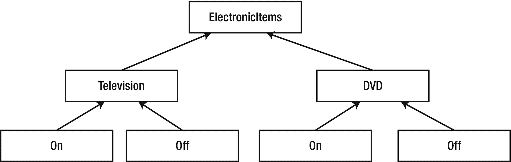
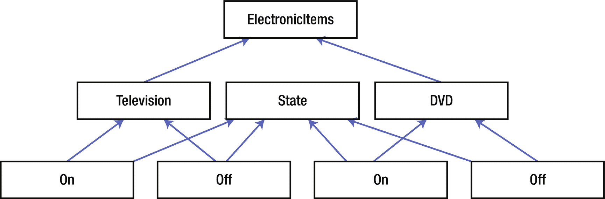
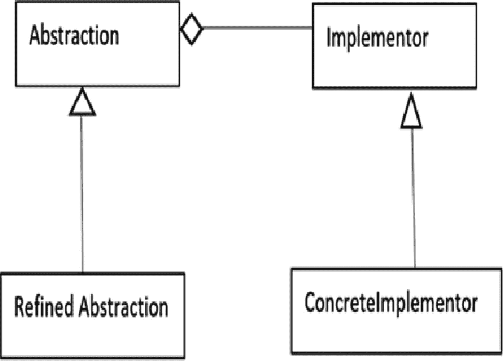
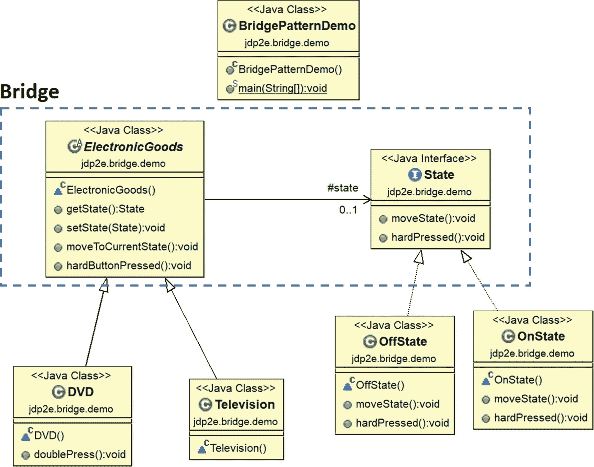
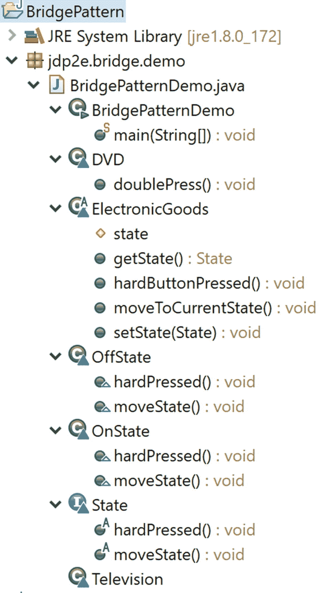

# 12.桥接模式

本章涵盖了桥接模式。

## GoF 定义

将抽象与其实现解耦，这样两者可以独立变化。

## 概念

这种模式也被称为*句柄/主体模式*，在这种模式中，您将实现从抽象中分离出来，并为它们构建独立的继承结构。最后，你通过一座桥把它们连接起来。

您必须注意，抽象和实现可以通过接口或抽象类来表示，但是抽象包含对其实现者的引用。通常，抽象的孩子被称为*精炼抽象*，实现的孩子被称为*具体实现*。

这个桥接口使得具体类的功能独立于接口实现者类。您可以在结构上改变不同种类的类，而不会相互影响。

## 真实世界的例子

在软件产品开发公司中，开发团队和营销团队都扮演着至关重要的角色。营销团队进行市场调查并收集客户需求，这些需求可能会因客户的性质而异。开发团队在他们的产品中实现这些需求，以满足客户的需求。一个团队中的任何变化(如运营策略)都不应对另一个团队产生直接影响。此外，当新的需求来自客户端时，它不应该改变开发人员在他们的组织中工作的方式。在软件组织中，营销团队在客户和开发团队之间扮演着桥梁的角色。

## 计算机世界的例子

GUI 框架可以使用桥模式将抽象从特定于平台的实现中分离出来。例如，使用这种模式，它可以从 Linux 或 macOS 的窗口实现中分离出一个窗口抽象。

### 注意

在 Java 中，您可能会注意到 JDBC 的使用，它在您的应用程序和特定数据库之间提供了一座桥梁。例如，java.sql.DriverManager 类和 java.sql.Driver 接口可以形成一个桥接模式，其中第一个扮演抽象的角色，第二个扮演实现者的角色。具体的实现者是 com.mysql.jdbc.Driver 或者 Oracle . JDBC . driver . Oracle driver 等等。

## 说明

假设你是一个遥控器制造商，你需要为不同的电子产品制造遥控器。为简单起见，让我们假设您目前正在接受订单，生产电视机和 DVD 播放器的遥控器。我们还假设你的遥控器有两个主要功能:开和关。

您可能希望从图 [12-1](#Fig1) 所示的设计或图 [12-2](#Fig2) 所示的设计开始。



图 12-2

方法 2



图 12-1

方法 1

经过进一步分析，您会发现方法 1 确实很混乱，很难维护。

起初，方法 2 看起来更简洁，但是如果您想要包括新的状态，如睡眠、静音等，或者如果您想要包括新的电子项目，如 AC、DVD 等，您将面临新的挑战，因为这些元素在这种设计方法中紧密耦合。但是在真实的场景中，这种增强是经常需要的。

这就是为什么，为了将来的增强，您需要从一个松散耦合的系统开始，这样两个层次结构(电子产品及其状态)中的任何一个都可以独立增长。桥的图案完全符合这种情况。

先说最常见的桥模式类图(见图 [12-3](#Fig3) )。



图 12-3

经典的桥梁图案

*   *抽象*(一个抽象类)定义了抽象接口，它维护实现者引用。

*   *RefinedAbstraction* (具体类)扩展了抽象定义的接口。

*   *实现者*(一个接口)定义实现类的接口。

*   *具体实现者*(具体类)实现`Implementor`接口。

在下面的实现中，我遵循了类似的架构。为了便于您参考，我已经指出了以下实现中的所有参与者，并附上了注释。

### 类图

图 [12-4](#Fig4) 显示了类图。



图 12-4

类图

### 包资源管理器视图

图 [12-5](#Fig5) 显示了程序的高层结构。



图 12-5

*包资源管理器视图*

### 关键特征

以下是以下实现的主要特征。

*   ElectronicGoods 抽象类扮演了抽象的角色。状态接口扮演实现者的角色。

*   具体的实现者是 OnState 类和 OffState 类。他们根据自己的需求实现了`moveState()`和`hardPressed()interface`方法。

*   ElectronicGoods 抽象类持有状态实现者的引用。

*   抽象方法将实现委托给实现者对象。例如，请注意，`hardButtonPressed()`实际上是`state.hardPressed()`的简写，其中 state 是实现者对象*。*

*   有两种精炼的抽象:电视和 DVD。该类对从其父类继承的方法感到满意。但是 DVD 类想要提供一个额外的特性，所以它实现了一个特定于 DVD 的方法:`doublePress()`。**double press()方法* *仅按照超类抽象进行编码*。*

 *### 履行

下面是实现。

```java
package jdp2e.bridge.demo;

//Implementor
interface State
{
    void moveState();
    void hardPressed();
}
//A Concrete Implementor.
class OnState implements State
{
    @Override
    public void moveState()
    {
        System.out.print("On State\n");
    }

    @Override
    public void hardPressed()
    {
        System.out.print("\tThe device is already On.Do not press the button so hard.\n");

    }
}
//Another Concrete Implementor.
class OffState implements State
{
    @Override
    public void moveState()

    {
        System.out.print("Off State\n");
    }

    @Override
    public void hardPressed()
    {
        System.out.print("\tThe device is Offline now.Do not press the off button again.\n");

    }
}
//Abstraction
abstract class ElectronicGoods
{
    //Composition - implementor
    protected State state;
    /*Alternative approach:
      We can also pass an implementor (as input argument) inside a constructor.
     */
    /*public ElectronicGoods(State state)
    {
        this.state = state;
    }*/
    public State getState()
    {
        return state;
    }

    public void setState(State state)
    {
        this.state = state;
    }
    /*Implementation specific:
      We are delegating the implementation to the Implementor object

.
     */
    public void moveToCurrentState()
    {
        System.out.print("The electronic item is functioning at : ");
        state.moveState();
    }
    public void hardButtonPressed()
    {
        state.hardPressed();
    }

}
//Refined Abstraction
//Television does not want to modify any superclass method.
class Television extends ElectronicGoods
{

    /*public Television(State state)
    {
        super(state);
    }*/
}
/*DVD class also ok with the super class method.
In addition to this, it uses one additional method*/
class DVD extends ElectronicGoods
{

    /*public DVD(State state)
    {
        super(state);
    }*/
    /* Notice that following DVD specific method is coded with superclass methods but not with the implementor (State) method.So, this approach will allow to  vary the abstraction and implementation independently

.
     */
    public void doublePress() {
        hardButtonPressed();
        hardButtonPressed();
    }
}
public class BridgePatternDemo {

    public static void main(String[] args) {
        System.out.println("***Bridge Pattern Demo***");

        System.out.println("\n Dealing with a Television at present.");

        State presentState = new OnState();
        //ElectronicGoods eItem = new Television(presentState);
        ElectronicGoods eItem = new Television();
        eItem.setState(presentState);
        eItem.moveToCurrentState();
        //hard press
        eItem.hardButtonPressed();
        //Verifying Off state of the Television now
        presentState = new OffState();
        //eItem = new Television(presentState);
        eItem.setState(presentState);
        eItem.moveToCurrentState();

        System.out.println("\n Dealing with a DVD now.");
        presentState = new OnState();
        //eItem = new DVD(presentState);
        eItem = new DVD();
        eItem.setState(presentState);
        eItem.moveToCurrentState();

        presentState = new OffState();
        //eItem = new DVD(presentState);
        eItem = new DVD();
        eItem.setState(presentState);
        eItem.moveToCurrentState();

        //hard press-A DVD specific method
        //(new DVD(presentState)).doublePress();
        ((DVD)eItem).doublePress();

        /*The following line of code will cause error because a television object does not have this method.*/
        //(new Television(presentState)).doublePress();
    }
}

```

### 输出

这是输出。

```java
***Bridge Pattern Demo***

 Dealing with a Television at present.
The electronic item is functioning at : On State
The device is already On.Do not press the button so hard.
The electronic item is functioning at : Off State

 Dealing with a DVD now.
The electronic item is functioning at : On State
The electronic item is functioning at : Off State
    The device is Offline now.Do not press the off button again.
    The device is Offline now.Do not press the off button again.

```

## 问答环节

1.  这个模式看起来类似于一个状态模式。这是正确的吗？

    No. The state pattern falls into the behavioral pattern and its intent is different. In this chapter, you have seen an example where the electronic items can be in different states, but the key intent was to show that
    *   如何避免项目及其状态之间的紧密耦合。

    *   如何维护两个不同的层次结构，并且这两个层次结构都可以在不相互影响的情况下扩展。

除了这些要点之外，您正在处理多个对象，在这些对象中，实现在它们之间共享。

为了更好地理解，请仔细阅读该实现附带的注释。我还想让你注意 DVD 特有的`doublePress()`方法。注意，它是用超类方法构造的，超类方法又将实现委托给实现者对象(在本例中是一个状态对象)。这种方法允许您独立地改变抽象和实现，这是桥接模式的关键目标。

1.  你可以用简单的子类化来代替这种设计。这是正确的吗？

    不。通过简单的子类化，你的实现不能动态变化。使用子类化技术时，实现的行为可能会有所不同，但实际上，这些变化在编译时就已经被绑定到抽象中了。

2.  在这个例子中，我看到很多死代码。你为什么留着这些？

    与 Getter/Setter 方法相比，一些开发人员更喜欢构造函数。您可以看到不同实现中的差异。我把这些保存起来，供你随时参考。你可以自由使用其中任何一个。

3.  使用桥设计模式的关键 **优势** **是什么？**
    *   实现并不局限于抽象。

    *   抽象和实现都可以独立发展。

    *   具体类独立于接口实现类(即，其中一个类的变化不会影响另一个类)。您还可以用不同的方式改变接口和具体实现。

4.  **与此格局相关的** **挑战** **有哪些？**
    *   整体结构可能变得复杂。

    *   有时它与适配器模式相混淆。(适配器模式的主要目的是只处理不兼容的接口。)

5.  假设我只有一种状态；例如，在州内或州外。在这种情况下，我需要使用状态接口吗？

    不，这不是强制性的。GoF 将这种情况归类为桥模式的退化情况。

6.  在这个例子中，抽象类用于表示抽象，接口用于实现。它是强制性的吗？

    不。你也可以用一个接口来抽象。基本上，您可以为任何抽象或实现使用抽象类或接口。我使用这种格式只是为了更好的可读性。*