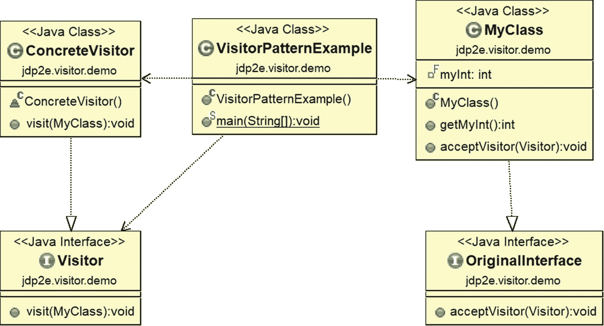
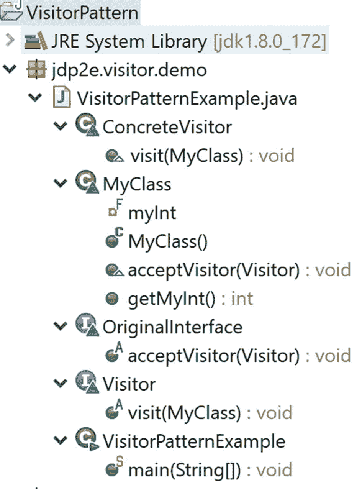
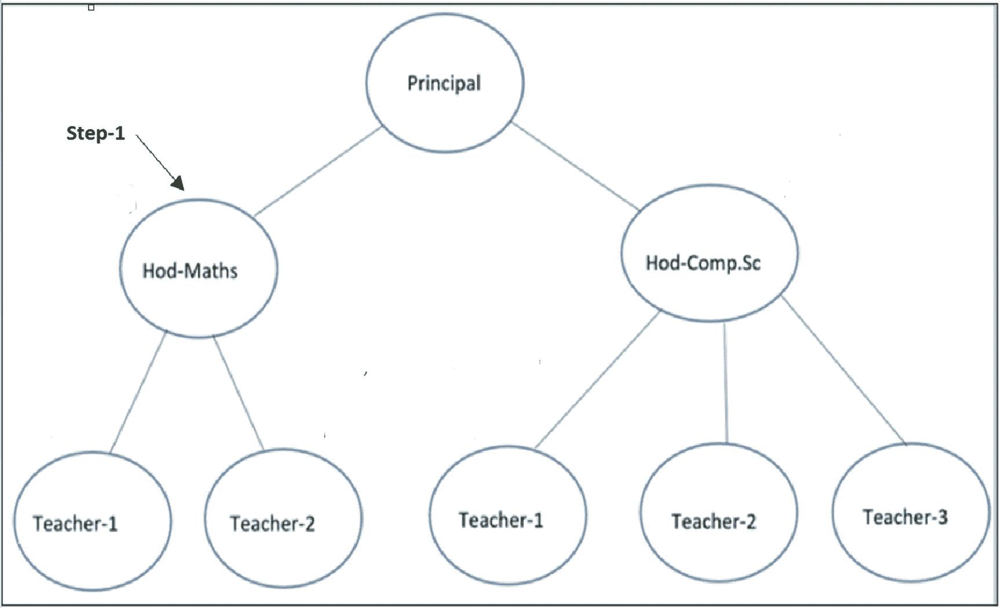
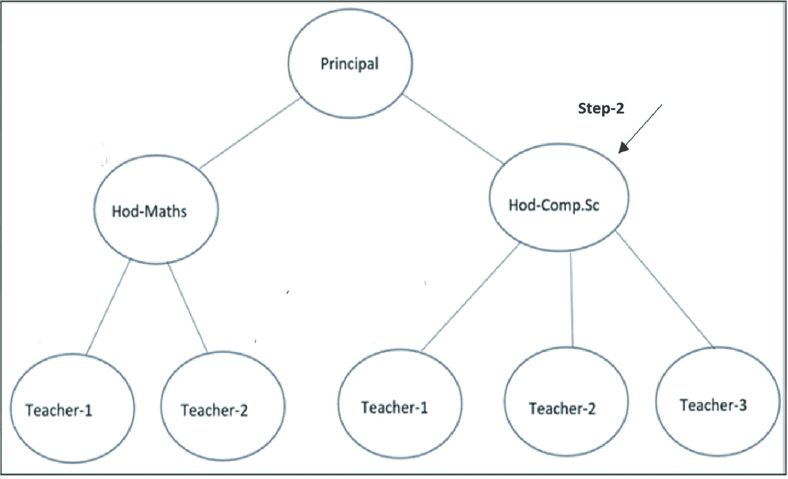
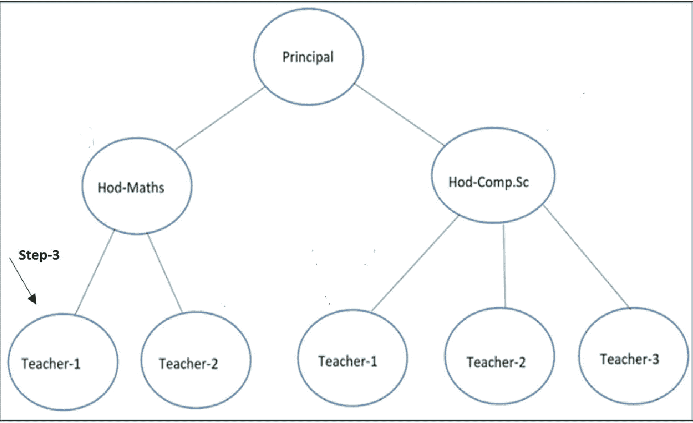
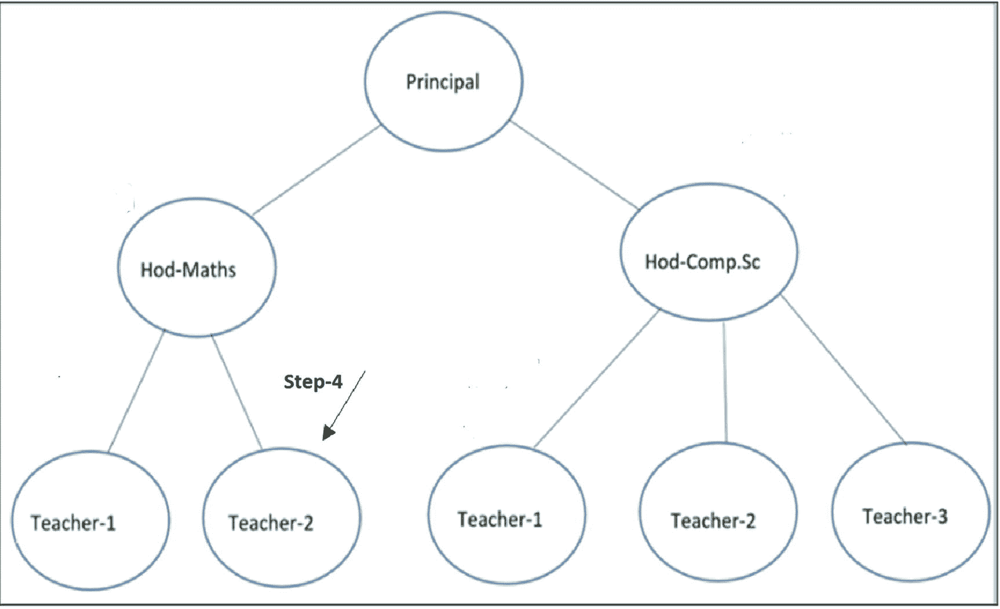
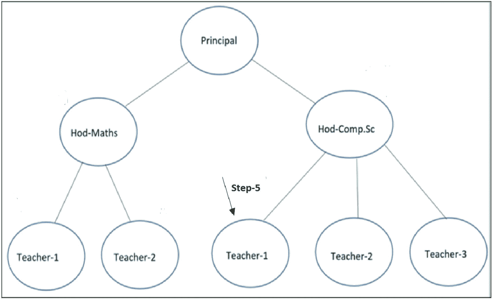
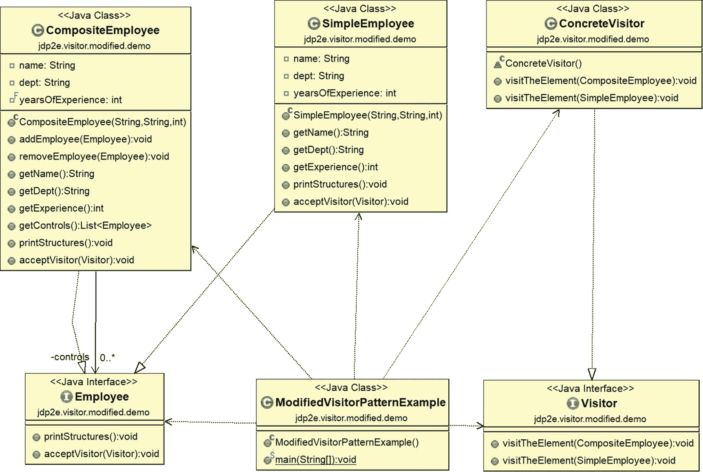
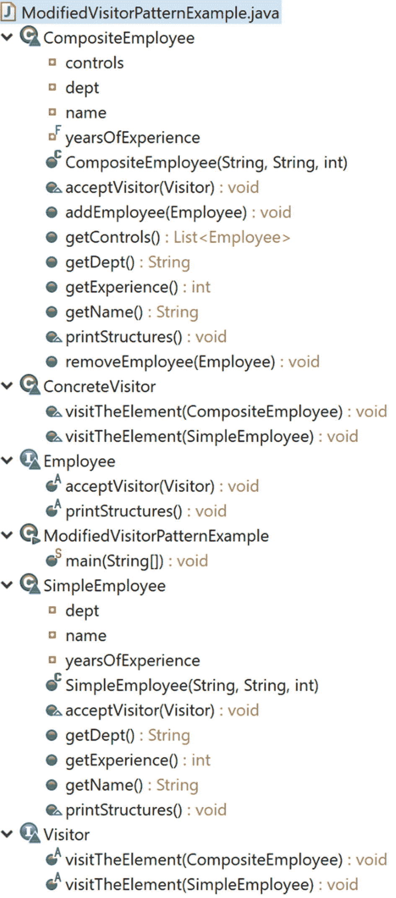

# 13.访问者模式

本章介绍访问者模式。

## GoF 定义

表示要在对象结构的元素上执行的操作。Visitor 允许您定义一个新的操作，而不改变它所操作的元素的类。

## 概念

这种模式帮助您在对象上添加新的操作，而无需修改相应的类，尤其是当您的操作经常改变时。理想情况下，访问者定义特定于类的方法，这些方法与该类的对象一起工作以支持新功能。在这里，您将算法从对象结构中分离出来，并使用新的层次结构添加新的操作。因此，这种模式可以支持开/关原则(允许扩展，但不允许修改类、函数、模块等实体)。).接下来的实现会让你更清楚这个概念。

### 注意

当您将这种设计模式与复合模式相结合时，您可以体验到这种设计模式的真正威力，如本章后面修改后的实现所示。

## 真实世界的例子

想象一个出租车预订的场景。当税到了，你上了车，出租车司机就控制了交通。出租车可能会通过一条你不熟悉的新路线把你带到目的地。所以，你可以在出租车司机的帮助下探索新的路线。但是你应该小心使用访问者模式，否则，你可能会遇到一些问题。(例如，考虑这样一种情况，你的出租车司机不知不觉地改变了目的地，你面临着麻烦)。

## 计算机世界的例子

当公共 API 需要支持插入操作时，这种模式非常有用。然后，客户端可以在不修改源代码的情况下对一个类(使用访问类)执行它们想要的操作。

### 注意

在 Java 中，当您使用抽象类 org.dom4j.VisitorSupport 时，您可能会注意到这种模式的使用，它扩展了 Object 并实现了 org.dom4j.Visitor 接口。此外，当您使用 javax . lang . model . element . element 接口或 javax . lang . model . element . element Visitor<r>(其中 R 是 visitor 方法的返回类型，P 是 visitor 方法的附加参数类型)时，您可能会注意到 visitor 设计模式的使用。</r>

## 说明

这里我们的讨论将从访问者设计模式的一个简单例子开始。让我们假设您有一个继承层次结构，其中 MyClass 具体类实现了 OriginalInterface 接口。MyClass 有一个整数 myInt。当创建 MyClass 的实例时，它用值 5 初始化。现在假设，您想要更新这个初始化的值并显示它。你可以用两种不同的方式来做这件事:你可以在我的类中添加一个方法来完成你的工作，或者使用一个访问者模式，我将要解释这一点。

在下面的实现中，我将现有值乘以 2，并使用访问者设计模式显示 myInt 的双精度值。如果我不使用这种模式，我需要在我的类中添加一个操作(或方法),它做同样的事情。

但是后一种方法有一个问题。如果您想要进一步更新逻辑(例如，您想要三重化 myInt 并显示值)，您需要修改 MyClass 中的操作。这种方法的一个缺点是，如果涉及到许多类，那么在所有类中实现这种更新的逻辑将会很乏味。

但是在访问者模式中，您可以只更新访问者的方法。这样做的好处是你不需要改变原来的类。当您的操作经常变化时，这种方法会对您有所帮助。

那么，我们先来举个例子。让我们假设在这个例子中，您想要将 MyClass 中的初始整数值加倍并操纵它，但是您的约束是您不能更改 OriginalInterface 层次结构中的原始代码。因此，在这种情况下，您使用的是访问者模式。

为了实现这个目标，在下面的例子中，我将功能实现(即算法)从原始的类层次结构中分离出来。

### 类图

图 [13-1](#Fig1) 为类图。



图 13-1

类图

### 包资源管理器视图

图 [13-2](#Fig2) 显示了程序的高层结构。



图 13-2

包资源管理器视图

### 履行

下面是实现。

```java
package jdp2e.visitor.demo;
interface OriginalInterface
{
    //The following method has a Visitor argument.
    void acceptVisitor(Visitor visitor);
}
class MyClass implements OriginalInterface
{
    //Here "myInt" is final.So, once initialized, it should not be changed.
    private final int myInt;
    public MyClass()
    {
        myInt=5;//Initial or default value
    }
    public int getMyInt()
    {
        return myInt;
    }

    @Override
    public void acceptVisitor(Visitor visitor)
    {
        visitor.visit(this);
    }
}

interface Visitor
{
    //The method to visit MyClass

    void visit(MyClass myClassObject);
}
class ConcreteVisitor implements Visitor
{
    @Override
    public void visit(MyClass myClassObject)
    {
        System.out.println("Current value of myInt="+ myClassObject.getMyInt());
        System.out.println("Visitor will make it double and display it.");
        System.out.println("Current value of myInt="+ 2*myClassObject.getMyInt());
        System.out.println("Exiting from Visitor.");
    }

}

public class VisitorPatternExample {

    public static void main(String[] args) {
        System.out.println("***Visitor Pattern Demo***\n");
        Visitor visitor = new ConcreteVisitor();
        MyClass myClass = new MyClass();
        myClass.acceptVisitor(visitor);
    }
}

```

### 输出

这是输出。

```java
***Visitor Pattern Demo***

Current value of myInt=5
Visitor will make it double and display it.
Current value of myInt=10
Exiting from Visitor.

```

### 修改后的插图

您已经看到了访问者设计模式的一个非常简单的例子。但是当你将这种设计模式与复合模式结合起来时，你就可以发挥这种设计模式的真正威力了(参见第 [11](11.html) 章)。因此，让我们来研究一个场景，在这个场景中，您需要将复合模式和访问者模式结合起来。

#### 修改示例的关键特征

让我们回顾一下第 11 章中的复合设计模式的例子。在这个例子中，有一个学院有两个不同的系。每个系都有一个系主任和多名教师(或教授/讲师)。每个团长向学院的校长报告。图 [13-3](#Fig3) 显示了我在那一章中讨论的树形结构。


图 13-3

复合设计示例的树结构

现在假设学院的校长想提升几个员工。让我们考虑教学经验是提升某人的唯一标准。理想情况下，高级教师和初级教师的标准应该不同。*所以，我们假设初级教师的最低晋升标准是 12 年，高级教师的最低晋升标准是 15 年*。

要做到这一点，你需要引入一个新的领域，多年的经验。因此，当访问者从大学收集必要的信息时，它会显示出符合晋升条件的候选人。

访问者从原始学院结构中收集数据，而不对其进行任何修改，一旦收集过程结束，它将分析数据以显示预期的结果。为了直观地理解这一点，您可以按照接下来的图中的箭头进行操作。*负责人在组织的最高层，所以你可以假设那个人*不需要升职。

#### 第一步

图 [13-4](#Fig4) 为步骤 1。



图 13-4

第一步

#### 第二步

图 [13-5](#Fig5) 为步骤 2。



图 13-5

第二步

#### 第三步

图 [13-6](#Fig6) 为步骤 3。



图 13-6

第三步

#### 第四步

图 [13-7](#Fig7) 为步骤 4。



图 13-7

第四步

#### 第五步

图 [13-8](#Fig8) 为步骤 5。



图 13-8

第五步

诸如此类…

在下面的实现中，有如下代码块。

```java
@Override
public void acceptVisitor(Visitor visitor)
{
    visitor.visitTheElement(this);
}

```

从这个结构中，可以看出两个重要的东西。

*   每当访问者访问一个特定的对象时，该对象就调用访问者的一个方法，并将自己作为一个参数传递。访问者拥有特定于特定类的方法。

*   具体 employee 类(CompositeEmployee，SimpleEmployee)的对象只实现 acceptVisitor(Visitor visitor)方法。这些对象知道它应该调用的访问者的特定方法(在这里作为参数传递)。

那么，我们开始吧。

### 修改的类图

图 [13-9](#Fig9) 显示了修改后的类图。



图 13-9

修改的类图

### 已修改的包资源管理器视图

图 [13-10](#Fig10) 显示了修改后程序的高层结构。



图 13-10

已修改的包资源管理器视图

### 修改的实现

下面是修改后的实现。

```java
package jdp2e.visitor.modified.demo;
import java.util.ArrayList;
import java.util.List;

interface Employee
{
    void printStructures();
    //The following method has a Visitor argument.
    void acceptVisitor(Visitor visitor);
}
//Employees who have Subordinates
class CompositeEmployee implements Employee
{
    private String name;
    private String dept;
    //New field for this example.
    //It is tagged with "final", so visitor cannot modify it.
    private final int  yearsOfExperience;
    //The container for child objects
    private List<Employee> controls;
    // Constructor
    public CompositeEmployee(String name,String dept, int experience)
    {
        this.name = name;
        this.dept = dept;
        this.yearsOfExperience = experience;
        controls = new ArrayList<Employee>();
    }
    public void addEmployee(Employee e)
    {
        controls.add(e);
    }
    public void removeEmployee(Employee e)
    {
        controls.remove(e);
    }
    // Gets the name
    public String getName()
    {
        return name;
    }
    // Gets the department name

    public String getDept()
    {
        return dept;
    }

    // Gets the yrs. of experience

    public int getExperience()
    {
        return yearsOfExperience;

    }
    public List<Employee> getControls()
    {
        return this.controls;
    }
    @Override
    public void printStructures()
    {
        System.out.println("\t" + getName() + " works in  " + getDept() + " Experience :" + getExperience() + " years");
        for(Employee e: controls)
        {
            e.printStructures();
        }

    }
    @Override
    public void acceptVisitor(Visitor visitor)
    {
        visitor.visitTheElement(this);
    }
}
class SimpleEmployee implements Employee
{
    private String name;
    private String dept;
    //New field for this example
    private int yearsOfExperience;
    //Constructor
    public SimpleEmployee(String name, String dept, int experience)
    {
        this.name = name;
        this.dept = dept;
        this.yearsOfExperience = experience;
    }
    // Gets the name

    public String getName()
    {
        return name;
    }
    // Gets the department name
    public String getDept()
    {
        return this.dept;

    }
    // Gets the yrs. of experience
    public int getExperience()
    {
        return yearsOfExperience;
    }
    @Override
    public void printStructures()
    {
        System.out.println("\t\t" + getName() + " works in  " + getDept() + " Experience :" + getExperience() + " years");
    }
    @Override
    public void acceptVisitor(Visitor visitor)
    {
        visitor.visitTheElement(this);
    }
}

interface Visitor
{
    void visitTheElement(CompositeEmployee employees);
    void visitTheElement(SimpleEmployee employee);
}
class ConcreteVisitor implements Visitor
{
    @Override
    public void visitTheElement(CompositeEmployee employee)
    {
        //We'll promote them if experience is greater than 15 years

        boolean eligibleForPromotion = employee.getExperience() > 15 ? true : false;
        System.out.println("\t\t" + employee.getName() + " from  " + employee.getDept() + " is eligible for promotion? " + eligibleForPromotion);
    }
    @Override
    public void visitTheElement(SimpleEmployee employee)
    {
        //We'll promote them if experience is greater than 12 years
        boolean eligibleForPromotion = employee.getExperience() > 12 ? true : false;
        System.out.println("\t\t" + employee.getName() + " from  " + employee.getDept() + " is eligible for promotion? " + eligibleForPromotion);
    }

}

public class ModifiedVisitorPatternExample {

    public static void main(String[] args) {
        System.out.println("***Visitor Pattern combined with Composite Pattern Demo***\n");
        /*2 teachers other than HOD works in
         Mathematics department*/
        SimpleEmployee mathTeacher1 = new SimpleEmployee("Math Teacher-1","Maths",13);
        SimpleEmployee mathTeacher2 = new SimpleEmployee("Math Teacher-2","Maths",6);

        /* 3 teachers other than HOD works in
          Computer Sc. department*/
        SimpleEmployee cseTeacher1 = new SimpleEmployee("CSE Teacher-1","Computer Sc.",10);
        SimpleEmployee cseTeacher2 = new SimpleEmployee("CSE Teacher-2", "Computer Sc.",13);
        SimpleEmployee cseTeacher3 = new SimpleEmployee("CSE Teacher-3", "Computer Sc.",7);

        //The College has 2 Head of Departments-One from Mathematics, One from Computer Sc.
        CompositeEmployee hodMaths = new CompositeEmployee("Mrs.S.Das(HOD-Maths)","Maths",14);
        CompositeEmployee hodCompSc = new CompositeEmployee("Mr. V.Sarcar(HOD-CSE)", "Computer Sc.",16);

        //Principal of the college

        CompositeEmployee principal = new CompositeEmployee("Dr.S.Som(Principal)","Planning-Supervising-Managing",20);

        //Teachers of Mathematics directly reports to HOD-Maths
        hodMaths.addEmployee(mathTeacher1);
        hodMaths.addEmployee(mathTeacher2);

        //Teachers of Computer Sc. directly reports to HOD-CSE

        hodCompSc.addEmployee(cseTeacher1);
        hodCompSc.addEmployee(cseTeacher2);
        hodCompSc.addEmployee(cseTeacher3);

        /*Principal is on top of college.HOD -Maths and Comp. Sc directly reports to him */
        principal.addEmployee(hodMaths);
        principal.addEmployee(hodCompSc);

        System.out.println("\n Testing the overall structure");
        //Prints the complete structure
        principal.printStructures();

        System.out.println("\n***Visitor starts visiting our composite structure***\n");
        System.out.println("---The minimum criteria for promotion is as follows ---");
        System.out.println("--Junior Teachers-12 years and Senior teachers-15 years.--\n");
        Visitor myVisitor = new ConcreteVisitor();
        /*
         * At first, we are building a container for employees who will be considered for promotion

.
         Principal is holding the highest position.So, he is not considered for promotion.
         */
        List<Employee> employeeContainer= new ArrayList<Employee>();
        //For employees who directly reports to Principal
        for (Employee e : principal.getControls())
        {
            employeeContainer.add(e);
        }
        //For employees who directly reports to HOD-Maths
        for (Employee e : hodMaths.getControls())
        {
            employeeContainer.add(e);
        }
        //For employees who directly reports to HOD-Comp.Sc
        for (Employee e : hodCompSc.getControls())
        {
            employeeContainer.add(e);
        }
        //Now visitor can traverse through the container.
        for (Employee e :employeeContainer)
        {
            e.acceptVisitor(myVisitor);
        }
    }

}

```

### 修改输出

这是修改后的输出。

```java
***Visitor Pattern combined with Composite Pattern Demo***

 Testing the overall structure
 Dr.S.Som(Principal) works in  Planning-Supervising-Managing Experience :20 years
   Mrs.S.Das(HOD-Maths) works in  Maths Experience :14 years
     Math Teacher-1 works in  Maths Experience :13 years
     Math Teacher-2 works in  Maths Experience :6 years
   Mr. V.Sarcar(HOD-CSE) works in  Computer Sc. Experience :16 years
     CSE Teacher-1 works in  Computer Sc. Experience :10 years
     CSE Teacher-2 works in  Computer Sc. Experience :13 years
     CSE Teacher-3 works in  Computer Sc. Experience :7 years

***Visitor starts visiting our composite structure***

---The minimum criteria for promotion is as follows ---

--Junior Teachers-12 years and Senior teachers-15 years.--

   Mrs.S.Das(HOD-Maths) from  Maths is eligible for promotion? false
  Mr. V.Sarcar(HOD-CSE) from  Computer Sc. is eligible for promotion? true
   Math Teacher-1 from  Maths is eligible for promotion? true
   Math Teacher-2 from  Maths is eligible for promotion? false
  CSE Teacher-1 from  Computer Sc. is eligible for promotion? false
  CSE Teacher-2 from  Computer Sc. is eligible for promotion? true
  CSE Teacher-3 from  Computer Sc. is eligible for promotion? false

```

## 问答环节

1.  什么时候应该考虑实现访问者设计模式？

    您需要向一组对象添加新的操作，而不改变它们对应的类。这是实现访问者模式的主要目标之一。当运营经常变化时，这种方法可以成为你的救星。在这种模式中，封装不是主要考虑的问题。

    如果需要改变各种操作的逻辑，只需通过 visitor 实现即可。

2.  这种模式有什么缺点吗？
    *   封装不是它的主要关注点。所以，你可以通过使用访问者来打破封装的力量。

    *   如果您需要频繁地向现有架构添加新的具体类，那么访问者层次结构将变得难以维护。例如，假设您现在想在原来的层次结构中添加另一个具体的类。在这种情况下，您需要相应地修改 visitor 类的层次结构来实现这个目的。

3.  你为什么说访问者类会违反封装？

    在我们的示例中，我测试了一个非常简单的 visitor 设计模式，在这个模式中，我通过 visitor 类显示了 myInt 的一个更新的整数值。此外，在许多情况下，您可能会看到访问者需要在一个复合结构周围移动，以从其中收集信息，然后它可以修改这些信息。所以，当你提供这种支持时，你违背了封装的核心目标。

4.  **为什么这种模式会损害封装？**

    在这里，您对一组不同种类的对象执行一些操作。但是您的约束是您不能改变它们对应的类。因此，您的访问者需要一种方法来访问这些对象的成员。因此，您需要向访问者公开这些信息。

5.  在修改后的实现的访问者接口中，您使用了方法重载的概念(即方法名相同)。这是强制性的吗？

    不。在我的《C# 中的*设计模式》一书中，我在类似的上下文中使用了`VisitCompositeElement()`和`VisitLeafNode()`这样的方法名。请记住，这些接口方法应该针对特定的类，比如 SimpleEmployee 或 CompositeEmployee。*

6.  假设在修改后的实现中，我添加了 Employee 的一个具体子类 UndefinedEmployee。我应该如何进行？我应该在访问者接口中有另一个特定的方法吗？

    Exactly. You need to define a new method that is specific to this new class. So, your interface may look like the following.

    ```java
    interface Visitor
    {
        void visitTheElement(CompositeEmployee employees);
        void visitTheElement(SimpleEmployee employee);
        void visitTheElement(UndefinedEmployee employee);
    }

    ```

    稍后，您需要在具体的 visitor 类中实现这个新方法。

7.  假设我需要在现有架构中支持新的操作。我应该如何处理访问者模式？

    对于每个新操作，创建一个新的 visitor 子类，并在其中实现操作。然后，按照前面示例中所示的方式访问您现有的结构。

8.  在客户端代码中，你首先创建了一个雇员容器，然后它开始访问。创建这样的结构是强制性的吗？

    不。它只是帮助客户一次顺利访问。如果您没有创建任何这样的结构，您总是可以单独调用它。