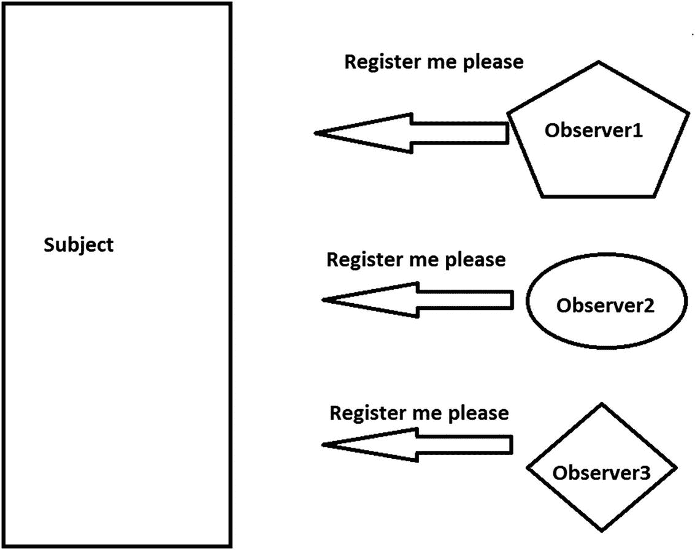
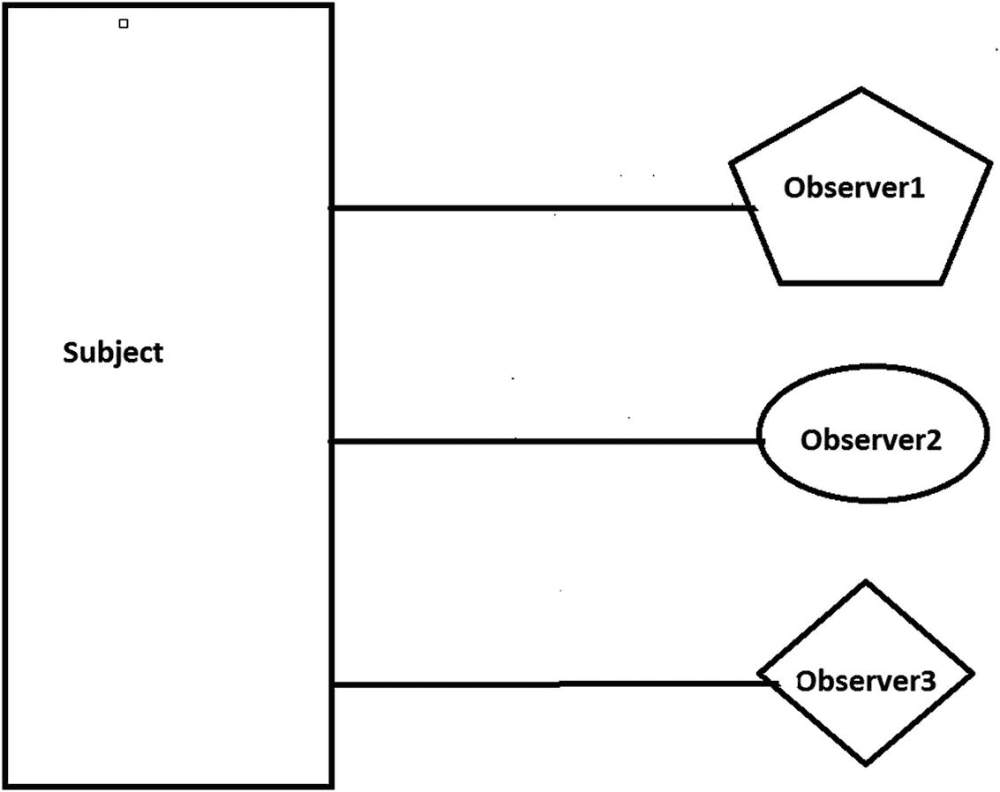
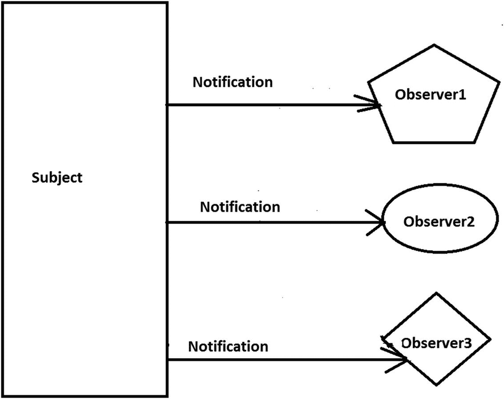
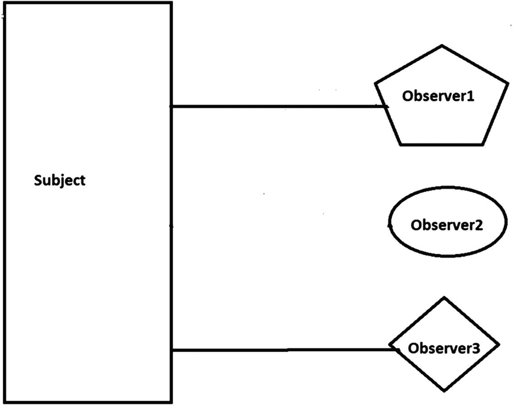
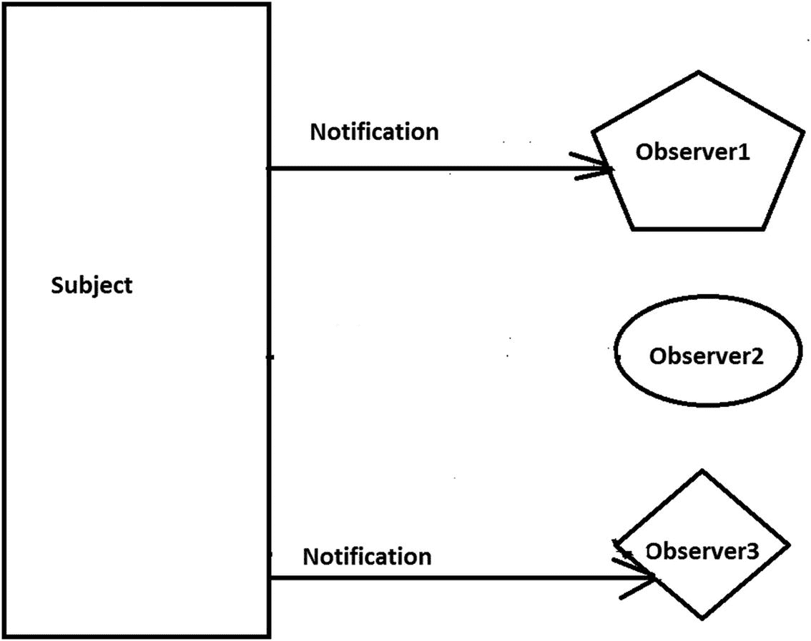
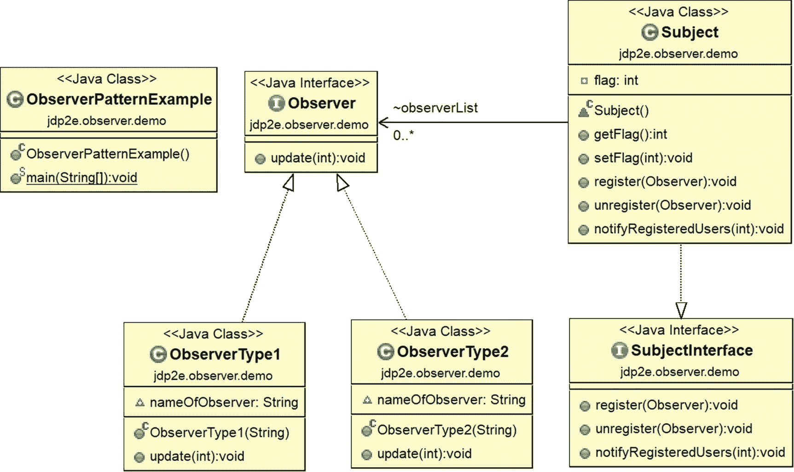
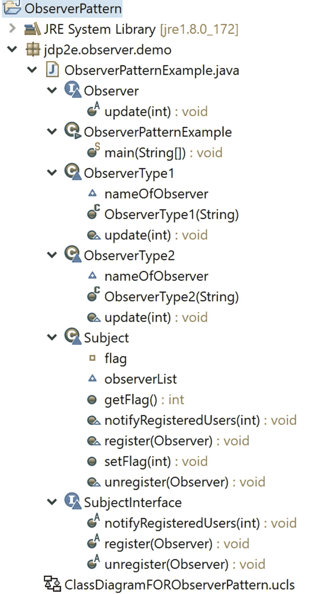
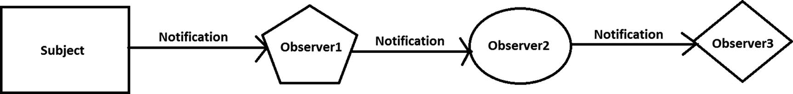
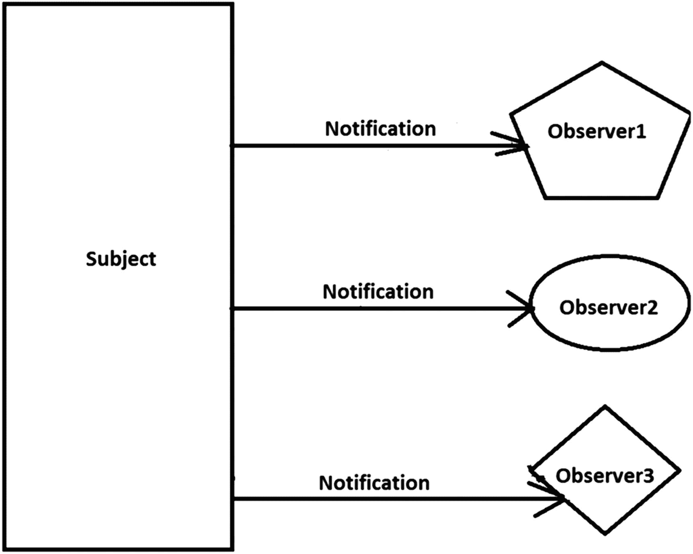

# 十四、观察者模式

本章涵盖了观察者模式。

## GoF 定义

定义对象之间的一对多依赖关系，这样当一个对象改变状态时，它的所有依赖对象都会得到通知并自动更新。

## 概念

在这个模式中，有许多观察者(对象)在观察一个特定的主体(也是一个对象)。观察者将自己注册到一个主题，以便在该主题内部发生变化时获得通知。当他们对该主题失去兴趣时，他们只是从该主题中注销。它也被称为*发布-订阅模式*。整个想法可以总结如下:*使用这个模式，一个对象(subject)可以同时向多个观察者(一组对象)发送通知。*

您可以在下面的图表中可视化这些场景。

**第一步。**观察者正在请求一个主题获得通知(见图 [14-1](#Fig1) )。



图 14-1

第一步

**第二步。**主体同意请求，连接建立(见图 [14-2](#Fig2) )。



图 14-2

第二步

**第三步**。主体向注册用户发送通知(在主体发生典型事件并希望通知其他人的情况下)(见图 [14-3](#Fig3) )。



图 14-3

第三步

**第四步(可选)。**观察器 2 不想得到进一步的通知，所以它注销自己(见图 [14-4](#Fig4) )。



图 14-4

第四步

**第五步。**从现在开始，只有观察者 1 和观察者 3 会收到受试者的通知(见图 [14-5](#Fig5) )。



图 14-5

第五步

## 真实世界的例子

想想一个在社交媒体上有很多粉丝的名人。这些追随者中的每一个都想要他们最喜爱的名人的所有最新消息。所以，他们追随名人直到兴趣减退。当他们失去兴趣时，他们就不再关注那个名人了。你可以把这些粉丝或追随者看作观察者，把名人看作主体。

## 计算机世界的例子

在计算机科学领域，考虑一个简单的基于 UI 的例子。让我们假设这个 UI 连接到一个数据库。用户可以通过该 UI 执行查询，在搜索数据库后，结果将在 UI 中返回。在这里，您将 UI 与数据库隔离开来，如果数据库发生变化，UI 会得到通知，并根据变化更新其显示。

为了简化这个场景，假设您是组织中负责维护特定数据库的人。每当数据库内部发生变化时，您都需要一个通知，以便在必要时采取措施。

### 注意

通常，您会在事件驱动软件中看到这种模式的存在。像 C#、Java 等现代语言都内置了对遵循这种模式处理事件的支持。这些结构让你的生活变得简单。

在 Java 中，你可以看到事件监听器的使用。这些听众只是观察者。在 Java 中，你有一个现成的类叫做 Observable，它可以有多个观察者。这些观察者需要实现观察者接口。观察者接口有一个“更新”方法:void update(Observable o，Object arg)。每当被观察对象发生变化时，就会调用此方法。您的应用程序需要调用可观察对象的 notifyObservers 方法来通知观察者的变化。addObserver(Observer o)和 deleteObserver(Observer o)方法添加或删除观察器，类似于前面讨论的 register 和 unregister 方法。可以从 [https:// docs 了解更多。甲骨文。com/javase/8/docs/API/Java/util/Observer。html](https://docs.oracle.com/javase/8/docs/api/java/util/Observer.html) 和 [https:// docs。甲骨文。com/ javase/ 8/ docs/ api/ index。html？java/ util/ Observable。html](https://docs.oracle.com/javase/8/docs/api/index.html%253Fjava/util/Observable.html) 。

如果你熟悉。NET 框架，你可以看到在 C# 中，你有通用系统。可观察的<t>和系统。IObserver <t>接口，其中泛型类型参数提供通知。</t></t>

## 说明

让我们考虑下面的例子，并对输出进行事后分析。我创建了三个观察者和一个主题。该主题为其所有注册用户维护一个列表。我们的观察者希望在主题中的标志值发生变化时收到通知。在输出中，您发现当标志值分别更改为 5、50 和 100 时，观察器会收到通知。但是其中一个人在标志值更改为 50 时没有收到任何通知，因为此时他不是 subject 中的注册用户。但最终，他会收到通知，因为他再次注册了自己。

在这个实现中，`register()`、`unregister()`和`notifyRegisteredUsers()`方法有它们典型的含义。`register()`方法在主题的通知列表中注册一个观察者，`unregister()`方法从主题的通知列表中删除一个观察者，`notifyRegisteredUsers()`在主题中发生典型事件时通知所有注册的用户。

### 类图

图 [14-6](#Fig6) 显示了类图。



图 14-6

类图

### 包资源管理器视图

图 [14-7](#Fig7) 显示了程序的高层结构。



图 14-7

包资源管理器视图

### 履行

下面是实现。

```java
package jdp2e.observer.demo;

import java.util.*;

interface Observer
{
    void update(int updatedValue);
}
class ObserverType1 implements Observer
{
    String nameOfObserver;
    public ObserverType1(String name)
    {
        this.nameOfObserver = name;
    }
    @Override
    public void update(int updatedValue)
    {
        System.out.println( nameOfObserver+" has received an alert: Updated myValue in Subject is: "+ updatedValue);
    }
}
class ObserverType2 implements Observer
{
    String nameOfObserver;
    public ObserverType2(String name)
    {
        this.nameOfObserver = name;
    }
    @Override
    public void update(int updatedValue)
    {
        System.out.println( nameOfObserver+" has received an alert: The current value of myValue in Subject is: "+ updatedValue);
    }
}

interface SubjectInterface
{
    void register(Observer anObserver);
    void unregister(Observer anObserver);
    void notifyRegisteredUsers(int notifiedValue);
}
class Subject implements SubjectInterface
{
    private int flag;
    public int getFlag()
    {
        return flag;
    }
    public void setFlag(int flag)
    {
        this.flag = flag;
        //Flag value changed. So notify registered users/observers.
        notifyRegisteredUsers(flag);
    }
    List<Observer> observerList = new ArrayList<Observer>();
    @Override
    public void register(Observer anObserver) {
        observerList.add(anObserver);

    }
    @Override
    public void unregister(Observer anObserver) {
        observerList.remove(anObserver);
    }
    @Override
    public void notifyRegisteredUsers(int updatedValue)
    {
        for (Observer observer : observerList)
            observer.update(updatedValue); 

    }
}
public class ObserverPatternExample {

    public static void main(String[] args) {
        System.out.println(" ***Observer Pattern Demo***\n");
        //We have 3 observers- 2 of them are ObserverType1, 1 of them is of //ObserverType2
        Observer myObserver1 = new ObserverType1("Roy");
        Observer myObserver2 = new ObserverType1("Kevin");
        Observer myObserver3 = new ObserverType2("Bose");
        Subject subject = new Subject();
        //Registering the observers-Roy,Kevin,Bose
        subject.register(myObserver1);
        subject.register(myObserver2);
        subject.register(myObserver3);
        System.out.println(" Setting Flag = 5 ");
        subject.setFlag(5);
        //Unregistering an observer(Roy))
        subject.unregister(myObserver1);
        //No notification this time Roy. Since it is unregistered.
        System.out.println("\n Setting Flag = 50 ");
        subject.setFlag(50);
        //Roy is registering himself again
        subject.register(myObserver1);
        System.out.println("\n Setting Flag = 100 ");
        subject.setFlag(100);
    }
}

```

### 输出

这是输出。

```java
***Observer Pattern Demo***

 Setting Flag = 5
Roy has received an alert: Updated myValue in Subject is: 5
Kevin has received an alert: Updated myValue in Subject is: 5
Bose has received an alert: The current value of myValue in Subject is: 5

 Setting Flag = 50
Kevin has received an alert: Updated myValue in Subject is: 50
Bose has received an alert: The current value of myValue in Subject is: 50

 Setting Flag = 100
Kevin has received an alert: Updated myValue in Subject is: 100
Bose has received an alert: The current value of myValue in Subject is: 100

Roy has received an alert: Updated myValue in Subject is: 100

```

### 分析

最初，所有三名观察者——罗伊、凯文和博斯——都注册了来自该对象的通知。所以，在最初阶段，他们都收到了通知。在某种程度上，罗伊变得对通知不感兴趣，所以他取消了自己的注册。因此，从这个时候开始，只有 Kevin 和 Bose 收到通知(注意，当我将标志值设置为 50 时)。但罗伊改变了主意，他重新注册了自己，以获得来自该主题的通知。所以，在最后一个案例中，所有人都收到了受试者的通知。

## 问答环节

1.  如果我只有一个观察者，那么我可能不需要设置界面。这是正确的吗？

    是的。但是如果你想遵循纯面向对象的编程准则，编程到一个接口/抽象类总是被认为是一个更好的实践。所以，比起具体的类，你应该更喜欢接口(或者抽象类)。此外，通常，您有多个观察者，并且您希望他们按照约定以系统的方式实现方法。你从这种设计中获益。

2.  同一个应用程序中可以有不同类型的观察者吗？

    是的。这就是为什么我和来自两个不同班级的三个观察者一起玩。但是你不应该对每个观察者都有这种感觉；您需要创建一个不同的类。

    考虑一个真实的场景。当公司发布或更新新软件时，公司业务合作伙伴和购买该软件的客户会收到通知。在这种情况下，业务伙伴和客户是两种不同类型的观察者。

3.  我可以在运行时添加或删除观察者吗？

    是的。在我们的程序开始时，罗伊注册获得通知；然后他注销了，后来又重新注册了。

4.  观察者模式和责任链模式之间似乎有相似之处。这是正确的吗？

    In an observer pattern, all registered users get notifications at the same time, but in a chain of responsibility pattern, objects in the chain are notified one by one, and this process continues until the object fully handles the notification. Figure [14-8](#Fig8) and Figure [14-9](#Fig9) summarize the differences.

    

    图 14-9

    责任链模式的基本工作流程

    

    图 14-8

    观察者模式的基本工作流程

5.  此模型支持一对多关系。这是正确的吗？

    是的。由于一个主题可以向多个观察者发送通知，这种依赖关系显然是一对多的关系。

6.  如果你已经有了这些现成的结构，为什么还要编写自己的代码呢？

    根据您的偏好更改现成的构造并不总是容易的。在许多情况下，您根本无法更改内置功能。当您尝试自己实现这个概念时，您可能会更好地理解如何使用那些现成的构造。

    Consider some typical scenarios.
    *   在 Java 中，Observable 是一个具体的类。它不实现接口。因此，您不能创建自己的实现来使用 Java 的内置 Observer API。

    *   Java 不允许多重继承。所以，当你必须扩展 Observable 类时，你必须记住这个限制。这可能会限制重用潜力。

    *   可观察对象中`setChanged`方法的签名如下:`protected void setChanged()`。这意味着要使用它，你需要子类化 Observable 类。这违反了一个关键的设计原则，基本上就是说要优先组合而不是继承。

7.  **观察者模式的主要优势** **是什么？**
    *   主体和它的注册用户(观察者)正在构建一个松散耦合的系统。他们不需要明确地相互了解。

    *   在通知列表中添加或删除观察者时，不需要修改主题。

    *   此外，您可以随时单独添加或删除观察者。

8.  与观察者模式相关的主要挑战是什么？
    *   毫无疑问，当您处理任何基于事件的机制时，内存泄漏是最大的问题。在这种情况下，自动垃圾收集器可能并不总是对您有所帮助。您可以考虑这样一种情况，即取消注册/取消注册操作没有正确执行。

    *   通知的顺序不可靠。

    *   Java 对观察者模式的内置支持有一些关键的限制，我在前面已经讨论过了。(重温问题 6 的答案。)其中一个强迫你更喜欢继承而不是组合，所以它显然违反了一个更喜欢相反的关键设计原则。