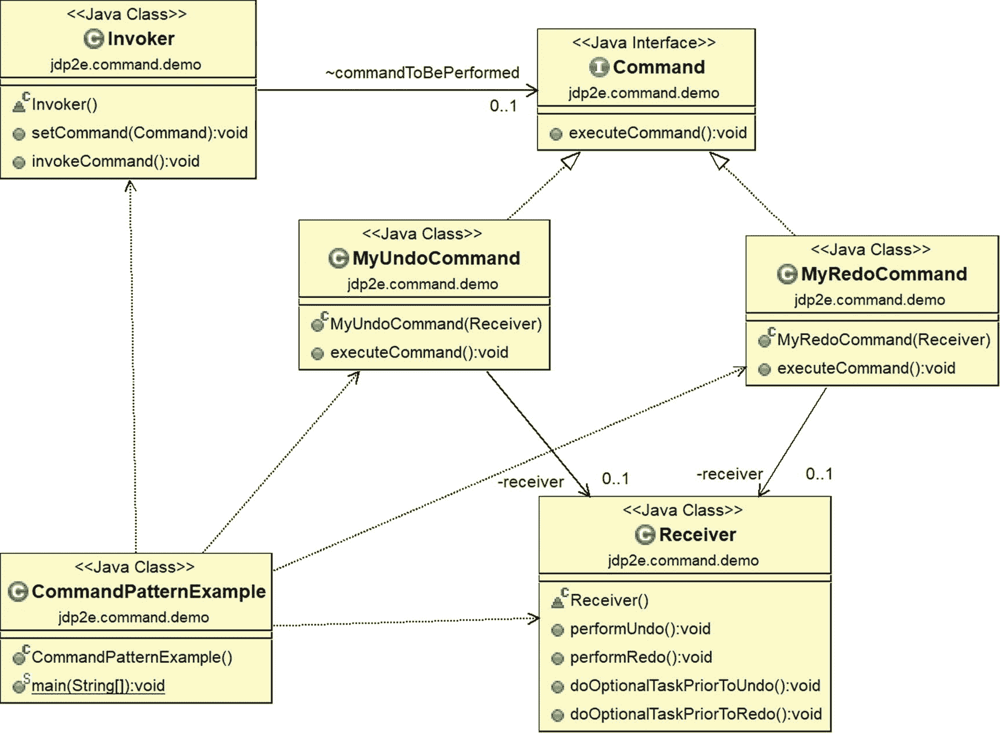
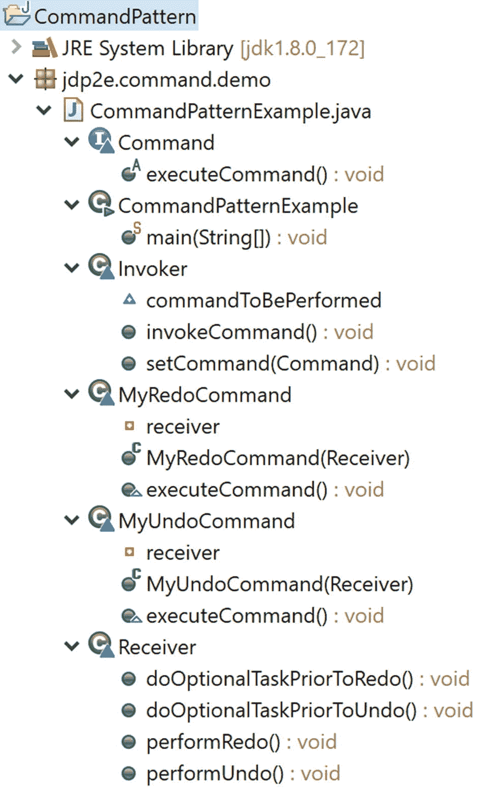
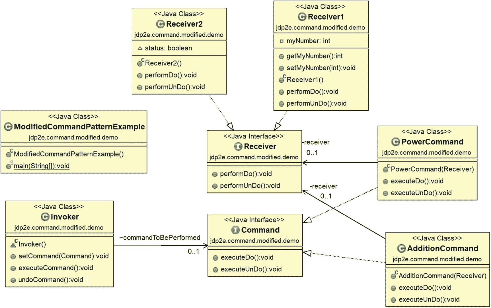
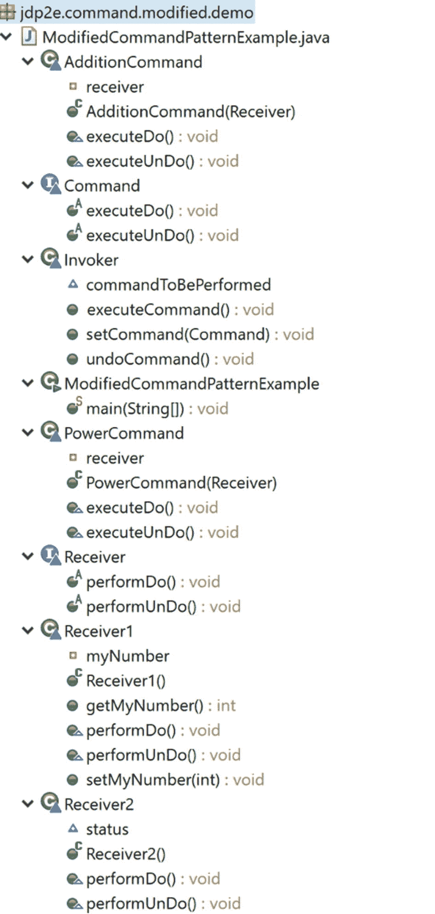

# 十七、命令模式

本章介绍了命令模式。

## GoF 定义

将请求封装为一个对象，从而允许您用不同的请求、队列或日志请求来参数化客户端，并支持可撤销的操作。

## 概念

这里您封装了一个方法调用过程。一般来说，有四个术语是相关联的:*调用方*、*客户端*、*命令方*和*接收方*。命令对象可以以特定于接收方的类的方式调用接收方的方法。然后，接收方开始处理作业。命令对象被单独传递给调用程序对象来调用命令。客户端对象持有调用者对象和命令对象。客户端只决定执行哪些命令，然后将命令传递给调用程序对象(用于执行)。

## 真实世界的例子

当你用铅笔画东西的时候，你可能需要撤销(擦除和重画)一些部分来使它变得更好。

## 计算机世界的例子

真实世界的绘画场景适用于 Microsoft Paint。您可以使用菜单或快捷键在这些上下文中执行撤消/重做操作。

通常，您可以在编辑器或 IDE(集成开发环境)的菜单系统中观察到这种模式。所以，如果你想做一个需要支持撤销、多次撤销或者类似操作的应用，那么 command 模式可以成为你的救星。

微软在 Windows 演示基础(WPF)中使用了这种模式。位于 [`https://visualstudiomagazine.com/articles/2012/04/10/command-pattern-in-net.aspx`](https://visualstudiomagazine.com/articles/2012/04/10/command-pattern-in-net.aspx) 的在线资源详细描述道:“命令模式非常适合处理 GUI 交互。它工作得非常好，微软已经将其紧密集成到 Windows 演示基础(WPF)堆栈中。最重要的部分是系统的 ICommand 接口。窗户。输入命名空间。任何实现 ICommand 接口的类都可以用于通过通用 WPF 控件处理键盘或鼠标事件。这种链接可以在 XAML 中完成，也可以在代码隐藏中完成。

### 注意

当您实现 java.lang.Runnable 接口的 run()方法时，您基本上是在使用命令设计模式。另一个接口 java.swing.Action 也代表了命令设计模式。重要的是要注意，undos 的实现各不相同，可能很复杂。memento 设计模式也支持撤销操作。您可能需要在应用程序中使用这两种设计模式来实现复杂的撤消操作。

## 说明

考虑下面的例子。为了便于理解，我使用了与前面描述的概念相似的类名。为了更好的理解，你可以参考相关的评论。

### 类图

图 [17-1](#Fig1) 为类图。



图 17-1

类图

### 包资源管理器视图

图 [17-2](#Fig2) 显示了程序的高层结构。



图 17-2

包资源管理器视图

### 履行

下面是实现。

```java
package jdp2e.command.demo;

interface Command
{
    //Typically this method does not take any argument.
    //Some of the reasons are:
    //1.We supply all the information when it is created.
    //2.Invoker may reside in different address space.etc.
    void executeCommand();
}

class MyUndoCommand implements Command
{
    private Receiver receiver;
    public MyUndoCommand(Receiver receiver)
    {
        this.receiver=receiver;
    }
    @Override
    public void executeCommand()
    {
        //Perform any optional task prior to UnDo
        receiver.doOptionalTaskPriorToUndo();
        //Call UnDo in receiver now
        receiver.performUndo();
    }
}
class MyRedoCommand implements Command
{
    private Receiver receiver;
    public MyRedoCommand(Receiver receiver)
    {
        this.receiver=receiver;
    }
    @Override
    public void executeCommand()
    {
        //Perform any optional task prior to ReDo

        receiver.doOptionalTaskPriorToRedo();
        //Call ReDo in receiver now
        receiver.performRedo();
    }
}
//Receiver Class
class Receiver
{
    public void performUndo()
    {
        System.out.println("Performing an undo command in Receiver.");
    }
    public void performRedo()
    {
        System.out.println("Performing an redo command in Receiver.");
    }
    /*Optional method-If you want to perform

     any prior tasks before undo operations.*/
    public void doOptionalTaskPriorToUndo()
    {
        System.out.println("Executing -Optional Task/s prior to    execute undo command.");
    }
    /*Optional method-If you want to perform
     any prior tasks before redo operations*/
    public void doOptionalTaskPriorToRedo()
    {
        System.out.println("Executing -Optional Task/s prior to    execute redo command.");
    }

}
//Invoker class
class Invoker
{
    Command commandToBePerformed;
    //Alternative approach:
    //You can also initialize the invoker with a command object
    /*public Invoker(Command command)
    {
        this.commandToBePerformed = command;
    }*/

    //Set the command
    public void setCommand(Command command)
    {
        this.commandToBePerformed = command;
    }
    //Invoke the command
    public void invokeCommand()
    {
        commandToBePerformed.executeCommand();
    }
}

//Client
public class CommandPatternExample {

    public static void main(String[] args) {
        System.out.println("***Command Pattern Demo***\n");
        /*Client holds both the Invoker and Command Objects*/
        Receiver intendedReceiver = new Receiver();
        MyUndoCommand undoCmd = new MyUndoCommand(intendedReceiver);
        //If you use parameterized constructor of Invoker

        //use the following line of code.
        //Invoker invoker = new Invoker(undoCmd);
        Invoker invoker = new Invoker();
        invoker.setCommand(undoCmd);
        invoker.invokeCommand();

        MyRedoCommand redoCmd = new MyRedoCommand(intendedReceiver);
        invoker.setCommand(redoCmd);
        invoker.invokeCommand();
    }
}

```

### 输出

这是输出。

```java
***Command Pattern Demo***

Executing -Optional Task/s prior to    execute undo command.
Performing an undo command in Receiver.
Executing -Optional Task/s prior to    execute redo command.
Performing an redo command in Receiver.

```

## 问答环节

1.  我有两个问题。在本例中，您只处理一个接收者。你如何处理多个接收者？GoF 定义说这种模式支持可撤销的操作。您能展示一个使用这种模式的真正撤销操作的例子吗？

考虑下面的程序。该计划的主要特点如下:

*   这里有两个不同的接收器(接收器 1 和接收器 2)。它们中的每一个都实现了接收器接口方法。因为我要处理多个接收器，所以我引入了一个公共接口 Receiver。

*   在撤消操作中，您通常希望撤销上一个操作。典型的撤消操作可能涉及复杂的逻辑。但是在即将到来的实现中，我将给出一个简单的例子，它支持撤销操作，假设如下。
    *   Receiver1 对象用值 10 初始化(myNumber 实例变量用于此目的)，Receiver2 对象用“关机”状态初始化(status 实例变量用于此目的)。任何 Receiver1 对象都可以在现有的整数上加 2。

    *   我在值 10 上打了一个勾号，这样当您处理一个撤销操作时，如果您注意到一个 Receiver1 对象的 myNumber 是 10，您将不会超出(因为您从 10 开始)。

    *   Receiver2 对象做不同的事情。它可以打开或关闭机器。如果机器已经通电，则通过请求撤销操作，您可以关闭机器，反之亦然。但是，如果您的机器已经处于开机模式，那么进一步的“开机”请求将被忽略。

### 修改的类图

图 [17-3](#Fig3) 所示修改后的类图中有很多参与者和依赖关系。为了说明主要设计并保持图表整洁，我没有显示客户端代码依赖关系。



图 17-3

修改的类图

### 已修改的包资源管理器视图

图 [17-4](#Fig4) 显示了修改后的包浏览器视图。



图 17-4

已修改的包资源管理器视图

### 修改的实现

下面是修改后的实现

```java
package jdp2e.command.modified.demo;

/**
 *In general, an undo operation involves complex logic.
 But for simplicity, in this example,I assume that executeDo() can either add 2 with a given integer or it can switch on a machine.
 Similarly, executeUnDo() can either subtract 2 from a given number() or,
 it will switch off a machine.But you cannot go beyond the initialized value(i.e.10 in this case)*/

interface Command
{
    void executeDo();
    void executeUnDo();
}
class AdditionCommand implements Command
{
    private Receiver receiver;
    public AdditionCommand(Receiver receiver)
    {
        this.receiver = receiver;
    }
    @Override
    public void executeDo()
    {
        receiver.performDo();
    }
    @Override
    public void executeUnDo()
    {
        receiver.performUnDo();
    }
}
class PowerCommand implements Command
{
    private Receiver receiver;
    public PowerCommand(Receiver receiver)
    {
        this.receiver = receiver;
    }
    @Override
    public void executeDo()
    {
        receiver.performDo();
    }
    @Override
    public void executeUnDo()
    {
        receiver.performUnDo();
    }
}

//To deal with multiple receivers , we are using interfaces here
interface Receiver
{
    //It will add 2 with a number or switch on the m/c
    void performDo();
    //It will subtract 2 from a number or switch off the m/c
    void performUnDo();
}
//Receiver Class
class Receiver1 implements Receiver
{
    private int myNumber;

    public int getMyNumber()
    {
        return myNumber;
    }
    public void setMyNumber(int myNumber)
    {
        this.myNumber = myNumber;
    }
    public Receiver1()
    {
        myNumber = 10;
        System.out.println("Receiver1 initialized with " + myNumber);
        System.out.println("The objects of receiver1 cannot set beyond "+ myNumber);
    }
    @Override
    public void performDo()
    {
        System.out.println("Received an addition request.");
        int presentNumber = getMyNumber();
        setMyNumber(presentNumber + 2);
        System.out.println(presentNumber +" + 2 ="+ this.myNumber);
    }
    @Override
    public void performUnDo()
    {
        System.out.println("Received an undo addition request.");
        int presentNumber = this.myNumber;
        //We started with number 10.We'll not decrease further.
        if (presentNumber > 10)
        {
            setMyNumber(this.myNumber - 2);
            System.out.println(presentNumber +" - 2 ="+ this.myNumber);
            System.out.println("\t Undo request processed.");
        }
        else
        {
            System.out.println("Nothing more to undo...");
        }
    }
}
//Receiver2 Class

class Receiver2 implements Receiver
{
    boolean status;

    public Receiver2()
    {
        System.out.println("Receiver2 initialized ");
        status=false;
    }
    @Override
    public void performDo()
    {
        System.out.println("Received a system power on request.");
        if( status==false)
        {
            System.out.println("System is starting up.");
            status=true;
        }
        else
        {
            System.out.println("System is already running.So, power on request is ignored.");

        }

    }
    @Override
    public void performUnDo()
    {
        System.out.println("Received a undo request.");
        if( status==true)
        {
            System.out.println("System is currently powered on.");
            status=false;
            System.out.println("\t Undo request processed.System is switched off now.");
        }
        else
        {
            System.out.println("System is switched off at present.");
            status=true;
            System.out.println("\t Undo request processed.System is powered on now.");

        }
    }
}

//Invoker class

class Invoker
{
    Command commandToBePerformed;
    public void setCommand(Command command)
    {
        this.commandToBePerformed = command;
    }
    public void executeCommand()
    {
        commandToBePerformed.executeDo();
    }
    public void undoCommand()
    {
        commandToBePerformed.executeUnDo();
    }
}

//Client
public class ModifiedCommandPatternExample {
    public static void main(String[] args) {

        System.out.println("***Command Pattern Q&As***");
        System.out.println("***A simple demo with undo supported operations***\n");
        //Client holds  both the Invoker and Command Objects

        //Testing receiver -Receiver1
        System.out.println("-----Testing operations in Receiver1-----");
        Receiver intendedreceiver = new Receiver1();
        Command currentCmd = new AdditionCommand(intendedreceiver);

        Invoker invoker = new Invoker();
        invoker.setCommand(currentCmd);
        System.out.println("*Testing single do/undo operation*");
        invoker.executeCommand();
        invoker.undoCommand();
        System.out.println("_______");
        System.out.println("**Testing a series of do/undo operations**");
        //Executed the command 2 times
        invoker.executeCommand();
        //invoker.undoCommand();
        invoker.executeCommand();
        //Trying to undo 3 times
        invoker.undoCommand();
        invoker.undoCommand();
        invoker.undoCommand();

        System.out.println("\n-----Testing operations in Receiver2-----");
        intendedreceiver = new Receiver2();
        currentCmd = new PowerCommand(intendedreceiver);
        invoker.setCommand(currentCmd);

        System.out.println("*Testing single do/undo operation*");
        invoker.executeCommand();
        invoker.undoCommand();
        System.out.println("_______");
        System.out.println("**Testing a series of do/undo operations**");
        //Executing the command 2 times
        invoker.executeCommand();
        invoker.executeCommand();
        //Trying to undo 3 times
        invoker.undoCommand();
        invoker.undoCommand();
        invoker.undoCommand();

    }

}

```

### 修改输出

这是修改后的输出。

1.  在这个修改过的程序中，两个接收者在做不同的事情。这是故意的吗？

    是的。它展示了命令设计模式提供的强大功能和灵活性。你可以看到这些接收器中的`performDo()`实际上执行不同的动作。对于 Receiver1，它将 2 与现有整数相加，对于 Receiver2，它将打开一台机器。所以，你可能会认为其他一些名字像`addNumber()`和`powerOn()`会更适合他们。

    但是在这种情况下，我需要同时使用接收器和它们对应的方法。因此，我需要使用一个通用的接口和通用的名称，以便两个接收者都可以使用。

    因此，如果您需要使用具有不同方法名称的两个不同的接收器，您可以用一个公共名称替换它们，使用一个公共接口，并且通过多态性，您可以轻松地调用这些方法。

2.  你为什么需要发票员？

    很多时候，程序员在面向对象的编程中尝试封装数据和相应的方法。但是如果你仔细观察，你会发现在这个模式中，你是在试图封装命令对象。换句话说，您正在从不同的角度实现封装。

    当您处理一组复杂的命令时，这种方法是有意义的。

    现在让我们再看一遍这些条款。您创建命令对象将它们发送给接收者并调用一些方法。但是您通过调用程序来执行这些命令，调用程序调用命令对象的方法(例如，executeCommand)。但是对于一个简单的例子，这个 invoker 类不是强制的；例如，考虑这样一种情况，其中一个命令对象只有一个方法要执行，而您正试图免除调用程序来调用该方法。但是，当您希望跟踪日志文件(或队列)中的多个命令时，调用程序可能会发挥重要作用。

3.  你为什么对跟踪这些日志感兴趣？

    如果您想要执行撤消或重做操作，它们会很有用。

4.  指挥模式的主要优势是什么？
    *   创建请求和最终执行是分离的。客户端可能不知道调用者如何执行操作。

    *   您可以创建宏(命令序列)。

    *   可以在不影响现有系统的情况下添加新命令。

    *   最重要的是，您可以支持撤销/重做操作。

5.  与指挥模式相关的挑战是什么？
    *   为了支持更多的命令，您需要创建更多的类。因此，随着时间的推移，维护可能会很困难。

    *   当出现错误情况时，如何处理错误或决定如何处理返回值变得很棘手。客户可能想知道这些。但是这里您将命令与客户端代码解耦，所以这些情况很难处理。在多线程环境中，调用者也在不同的线程中运行，这一挑战变得很大。

```java
***Command Pattern Q&As***
***A simple demo with undo supported operations***

-----Testing operations in Receiver1-----
Receiver1 initialized with 10
The objects of receiver1 cannot set beyond 10
*Testing single do/undo operation*
Received an addition request.
10 + 2 =12
Received an undo addition request.
12 - 2 =10
     Undo request processed.
_______
**Testing a series of do/undo operations**
Received an addition request.
10 + 2 =12
Received an addition request.
12 + 2 =14
Received an undo addition request.
14 - 2 =12
     Undo request processed.
Received an undo addition request.
12 - 2 =10
     Undo request processed.
Received an undo addition request.
Nothing more to undo...

-----Testing operations in Receiver2-----
Receiver2 initialized
*Testing single do/undo operation*
Received a system power on request.
System is starting up.
Received a undo request.
System is currently powered on.
     Undo request processed.System is switched off now.
_______
**Testing a series of do/undo operations**
Received a system power on request.
System is starting up.
Received a system power on request.
System is already running.So, power on request is ignored.
Received a undo request.
System is currently powered on.
     Undo request processed.System is switched off now.
Received a undo request.
System is switched off at present.
     Undo request processed.System is powered on now.
Received a undo request.
System is currently powered on.
     Undo request processed.System is switched off now

.

```