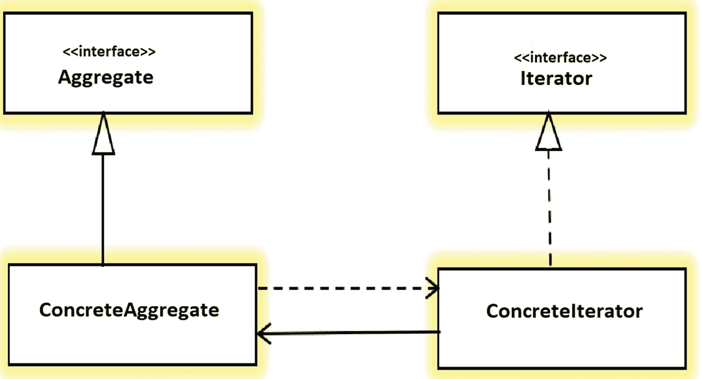
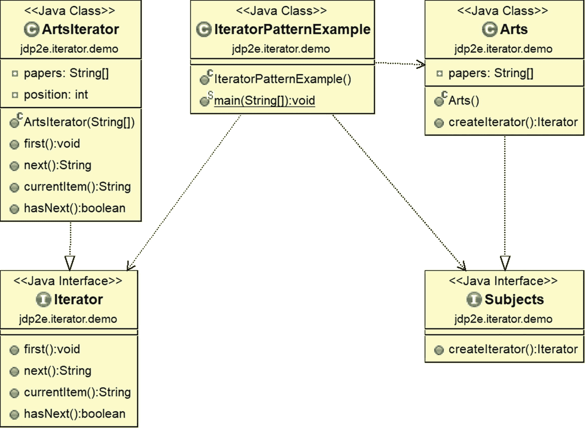
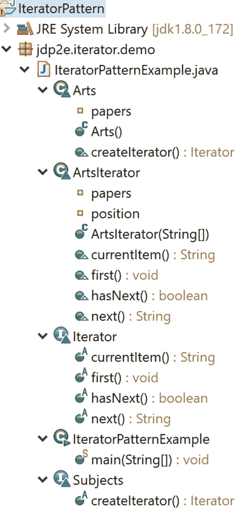

# 十八、迭代器模式

本章涵盖了迭代器模式。

## GoF 定义

提供一种方法来顺序访问聚合对象的元素，而不暴露其底层表示。

## 概念

使用迭代器，客户机对象可以遍历容器(或对象集合)来访问其元素，而不需要知道这些数据是如何在内部存储的。当您需要以标准和统一的方式遍历不同种类的集合对象时，这个概念非常有用。以下是关于这种模式的一些要点。



图 18-1

迭代器模式的示例图

*   它通常用于遍历树状结构的节点。因此，在许多场景中，您可能会注意到组合模式中迭代器模式的使用。

*   迭代器的作用不仅限于遍历。这个角色可以改变以支持各种需求。

*   客户端看不到实际的遍历机制。客户端程序只使用本质上是公共的迭代器方法。

*   图 [18-1](#Fig1) 显示了一个迭代器模式的示例图。

与会者如下:

*   *迭代器*:访问或遍历元素的接口。

*   *具体迭代器*:实现迭代器接口方法。它还可以跟踪聚合遍历中的当前位置。

*   *Aggregate* :定义一个可以创建迭代器对象的接口。

*   *ConcreteAggregate* :实现聚合接口。它返回 ConcreteIterator 的一个实例。

## 真实世界的例子

假设有两家公司:A 公司和 b 公司。A 公司存储其员工记录(即姓名、地址、工资明细等。)在链表数据结构中。B 公司将其员工数据存储在一个数组数据结构中。一天，这两家公司决定合并成一个大组织。迭代器模式在这种情况下非常方便，因为开发人员不想从头开始编写代码。他们可以创建一个公共接口，这样他们就可以访问两家公司的数据，并以统一的方式调用这些方法。

考虑另一个例子。假设你的公司决定根据员工的表现提升他们。所以，所有的经理聚在一起，为晋升制定一个共同的标准。然后，他们遍历每个员工的过去记录，以标记潜在的晋升候选人。

最后，当您将歌曲存储在您喜欢的音频设备中时，例如 MP3 播放器或移动设备，您可以通过各种按钮按压或滑动动作来迭代它们。基本思想是为您提供一些机制来平滑地迭代您的列表。

## 计算机世界的例子

同样，让我们假设，一个大学艺术系正在使用数组数据结构来维护其学生的记录。科学系使用链表数据结构来保存学生的记录。行政部门不关心不同的数据结构，他们只是对从每个部门获取数据感兴趣，并且他们希望以通用的方式访问数据。

### 注意

Java 的集合框架中的迭代器类就是迭代器的例子。当您使用像 java.util.Iterator 或 java.util.Enumeration 这样的接口时，您基本上使用了这种模式。java.util.Scanner 类也遵循这种模式。如果你熟悉 C#，你可以使用 Visual Studio 2005 中引入的 C#自己的迭代器。foreach 语句经常在此上下文中使用。

## 说明

在这一章中，迭代器模式有三种不同的实现。我将从一个遵循该模式核心理论的例子开始。在下一个例子中，我将使用 Java 对迭代器模式的内置支持来修改这个例子。在第三个也是最后一个例子中，您将这个模式用于不同的数据结构。在前两个例子中，我将简单地使用“字符串”数据类型，但在最后一个例子中，我将使用复杂的数据类型。

在开始之前，我建议您注意一下 Package Explorer 视图中的结构，以便立即参考。

在第一个实现中，让我们假设在一个特定的学院中，一个艺术系的学生需要学习四篇论文(或科目)——英语、历史、地理和心理学。这些论文的细节存储在一个数组数据结构中。你的工作是用迭代器打印课程表。

假设您的迭代器目前支持四种基本方法:`first()`、`next()`、`currentItem()`和`hasNext()`。

*   在开始遍历数据结构之前，`first()`方法将指针重置为指向第一个元素。

*   `next()`方法返回容器中的下一个元素。

*   `currentItem()`方法返回迭代器在特定时间点指向的容器的当前元素。

*   `hasNext()`验证下一个元素是否可用于进一步处理。因此，它可以帮助您确定是否已经到达容器的末尾。

### 类图

图 [18-2](#Fig2) 显示了类图。



图 18-2

类图

### 注意

像本书中前面的许多例子一样，为了展示一个清晰的类图，我只展示了客户端代码依赖。对于 Eclipse 编辑器中显示的任何 ObjectAid 类图，您总是可以通过选择图中的一个元素，右键单击它，然后选择 Add ➤依赖项来查看其他依赖项。

### 包资源管理器视图

图 [18-3](#Fig3) 显示了程序的高层结构。



图 18-3

包资源管理器视图

### 首次实现

这是第一个实现。

```java
package jdp2e.iterator.demo;

interface Subjects
{
    Iterator createIterator();
}
class Arts implements Subjects
{
    private String[] papers;

    public Arts()
    {
        papers = new String[] { "English","History", "Geography","Psychology" };
    }

    public Iterator createIterator()
    {
        return new ArtsIterator(papers);
    }
}
interface Iterator
{
    void first();//Reset to first element
    String next();//To get the next element
    String currentItem();//To retrieve the current element
    boolean hasNext();//To check whether there is any next element or not.
}
class ArtsIterator implements Iterator
{
    private String[] papers;
    private int position;
    public ArtsIterator(String[] papers)
    {
        this.papers = papers;
        position = 0;
    }
    @Override
    public void first()
    {
        position = 0;
    }
    @Override
    public String next()
    {
        //System.out.println("Currently pointing to: "+ this.currentItem())

;
        return papers[position++];
    }
    @Override
    public String currentItem()
    {
        return papers[position];
    }
    @Override
    public boolean hasNext()
    {
        if(position >= papers.length)
            return false;
        return true;
    }
}

public class IteratorPatternExample {

    public static void main(String[] args) {
        System.out.println("***Iterator Pattern Demo***");
        Subjects artsSubjects = new Arts();

        Iterator iteratorForArts = artsSubjects.createIterator();
        System.out.println("\n Arts subjects are as follows:");
        while (iteratorForArts.hasNext())
        {
            System.out.println(iteratorForArts.next());
        }
        //Moving back to first element
        iteratorForArts.first();
        System.out.println(" Currently pointing back to: "+ iteratorForArts.currentItem());
    }

}

```

### 输出

这是输出。

```java
***Iterator Pattern Demo***

 Arts subjects are as follows:
English
History
Geography
Psychology
 Currently pointing back to: English

```

### 注意

如果想看到迭代器所指向的当前元素，可以在 next()方法:// System.out.println("当前指向:"+ this.currentItem())中取消对该行的注释；

现在让我们使用 Java 的内置迭代器接口来修改前面的实现。

### 第二个实现方案的主要特征

我使用了 Java 对迭代器模式的内置支持。请注意，在程序的开头包含了下面一行。

```java
                        import java.util.Iterator;

```

如果你打开源代码，你会看到这个接口有三个方法:`hasNext()`、`next()`和`remove()`。但是`remove()`方法已经有了默认的实现。因此，在下面的例子中，我只需要重写`hasNext()`和`next()`方法。

这里使用的是 Java 的迭代器接口，所以不需要定义自己的迭代器接口。

在这个修改的实现中，关键的变化以粗体显示。

### 第二次实现

下面是第二个实现。

```java
package jdp2e.iterator.modified.demo;

import java.util.Iterator;

interface Subjects
{
    //Iterator CreateIterator();
    ArtsIterator createIterator();
}
class Arts implements Subjects
{
    private String[] papers;

    public Arts()
    {
        papers = new String[] { "English","History", "Geography","Psychology" };
    }

    //public Iterator CreateIterator()
    public ArtsIterator createIterator()
    {
        return new ArtsIterator(papers);
    }
}

class ArtsIterator implements Iterator<String>

{
    private String[] papers;
    private int position;
    public ArtsIterator(String[] papers)
    {
        this.papers = papers;
        position = 0;
    }
    public void first()
    {
        position = 0;
    }
    public String currentItem()
    {
        return papers[position];
    }
    @Override
    public boolean hasNext()
    {
        if(position >= papers.length)
            return false;
        return true;
    }
    @Override
    public String next()
    {
        return papers[position++];
    }
}

public class ModifiedIteratorPatternExample {

    public static void main(String[] args) {
        System.out.println("***Modified Iterator Pattern Demo.***");
        Subjects artsSubjects = new Arts();

        //Iterator IteratorForArts = artsSubjects.createIterator();
        ArtsIterator iteratorForArts = artsSubjects.createIterator();
        System.out.println("\nArts subjects are as follows:");
        while (iteratorForArts.hasNext())
        {
            System.out.println(iteratorForArts.next());
        }
        //Moving back to first element
        iteratorForArts.first();
        System.out.println("Currently pointing to: "+ iteratorForArts.currentItem());
    }
}

```

### 输出

这是修改后的输出。

```java
***Modified Iterator Pattern Demo.***

Arts subjects are as follows:
English
History
Geography
Psychology
Currently pointing to: English

```

## 问答环节

1.  迭代器模式有什么用？
    *   你可以遍历一个对象结构而不知道它的内部细节。因此，如果您有一个不同的子集合的集合(例如，您的容器与数组、列表或链表等混合在一起。)，您仍然可以遍历整个集合，并以通用的方式处理元素，而无需了解内部细节或它们之间的差异。

    *   您可以用不同的方式遍历集合。您还可以提供同时支持多个遍历的实现。

2.  与此模式相关的主要挑战是什么？

    理想情况下，在遍历/迭代过程中，您不应该对核心架构进行任何意外的修改。

3.  但是为了应对前面提到的挑战，你可以做一个备份，然后继续。这是正确的吗？

    制作备份并在以后重新检查是一项成本高昂的操作。

4.  在整个讨论过程中，你一直在谈论收藏。什么是收藏？

    它是在一个单元中呈现的一组单独的对象。您可能经常会在 java 程序中看到 java.util.Collection、java.util.Map 等接口的使用。这些是 Java 集合类的一些通用接口，它们是在 JDK 1.2 中引入的。

    在集合之前，您可以选择数组、向量等来存储或操作一组对象。但是这些类没有一个公共接口；访问数组元素的方式与访问向量元素的方式截然不同。这就是为什么很难编写一个通用算法来访问这些不同实现中的不同元素。此外，这些方法中有许多是最终的，所以您不能扩展它们。

    收集框架的引入就是为了解决这些困难。同时，他们提供了高性能的实现，使程序员的生活更加轻松。

5.  在修改后的实现中，为什么我看不到 first()和 currentItem()方法的@Override 注释？

    java.util.Iterator 接口中没有这两个方法。内置的迭代器接口有`hasNext()`和`next()`方法。因此，我对这些方法使用了@Override 注释。在这个接口中还有另一个方法`remove()`。它有一个默认的实现。因为我没有使用过它，所以我不需要修改这个方法。

6.  在这些实现中，我发现你只使用数组字符串来存储和操作数据。能否展示一个使用相对复杂的数据类型和不同数据结构的迭代器模式实现？

    To make these examples simple and straightforward, I only used strings and an array data structure. You can always choose your preferred data structure and apply the same process when you consider a complex data type. For example, consider the following illustration (third implementation) with these key characteristics.
    *   这里我使用了相对复杂的数据类型 Employee。每个 employee 对象有三样东西:一个名字、一个标识号(id)和薪水。

    *   在下面的实现中，我没有使用数组，而是使用了不同的数据结构 LinkedList。因此，我需要在这个实现中包含下面一行。

        `import java.util.LinkedList;`

    *   我采用了与前一个例子中相同的方法。

### 第三次实现

下面是第三个实现。

```java
package jdp2e.iterator.questions_answers;
import java.util.Iterator;
import java.util.LinkedList;

class Employee
{
    private String name;
    private int id;
    private double salary;
    public Employee(String name, int id, double salary )
    {
        this.name=name;
        this.id=id;
        this.salary=salary;
    }

    public String getName() {
        return name;
    }
    public void setName(String name) {
        this.name = name;
    }
    public int getId() {
        return id;
    }
    public void setId(int id) {
        this.id = id;
    }
    public double getSalary() {
        return salary;
    }

    public void setSalary(double salary) {
        this.salary = salary;
    }

    @Override
    public String toString(){
        return "Employee Name: "+this.getName()+", ID: "+this.getId()+ " and salary: "+this.getSalary()+"$";
    }
}
interface DataBase
{
    EmployeeIterator createIterator();
}
class EmployeeDatabase implements DataBase
{
    private LinkedList<Employee> employeeList;

    public EmployeeDatabase()
    {
        employeeList = new LinkedList<Employee>();
        employeeList.add(new Employee("Ron",1, 1000.25));
        employeeList.add(new Employee("Jack",2, 2000.5));
        employeeList.add(new Employee("Ambrose",3, 3000.75));
        employeeList.add(new Employee("Jian",4, 2550.0));
        employeeList.add(new Employee("Alex",5, 753.83));
    }
    public EmployeeIterator createIterator()
    {
        return new EmployeeIterator(employeeList);
    }
}

class EmployeeIterator implements Iterator<Employee>
{
    private LinkedList<Employee> employeeList;
    private int position;
    public EmployeeIterator(LinkedList<Employee> employeeList)
    {
        this.employeeList= employeeList;
        position = 0;
    }
    //@Override
    public void first()
    {
        position = 0;
    }

    //@Override
    public Employee currentItem()
    {
        return employeeList.get(position);
    }

    @Override
    public Employee next()
    {
        return employeeList.get(position++);
    }
    @Override
    public boolean hasNext() {
        if(position >= employeeList.size())
            return false;
        return true;
    }
}

public class ModifiedIteratorPatternExample2 {

    public static void main(String[] args) {
        System.out.println("***Modified Iterator Pattern Demo.Example-2.***");
        DataBase employeesList = new EmployeeDatabase();

        EmployeeIterator iteratorForEmployee = employeesList.createIterator();
        System.out.println("\n -----Employee details are as follows-----\n");

        while (iteratorForEmployee.hasNext())
        {
            System.out.println(iteratorForEmployee.next());
        }

    }
}

```

### 输出

这是第三个实现的输出。

```java
***Modified Iterator Pattern Demo.Example-2.***

 -----Employee details are as follows-----

Employee Name: Ron, ID: 1 and salary: 1000.25$
Employee Name: Jack, ID: 2 and salary: 2000.5$
Employee Name: Ambrose, ID: 3 and salary: 3000.75$
Employee Name: Jian, ID: 4 and salary: 2550.0$
Employee Name: Alex, ID: 5 and salary: 753.83$

```

### 注意

您可以在一个实现中使用两种或多种不同的数据结构来展示这种模式的强大功能。您已经看到，在这些不同的实现中，我使用了 first()、next()、hasNext()和 currentItem()方法，它们的不同实现因其内部数据结构而有所不同。