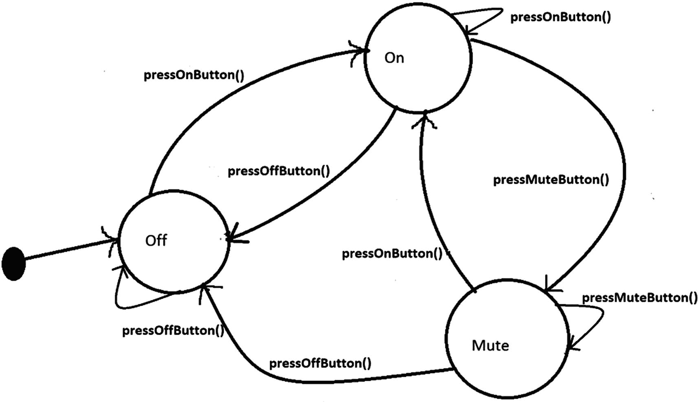
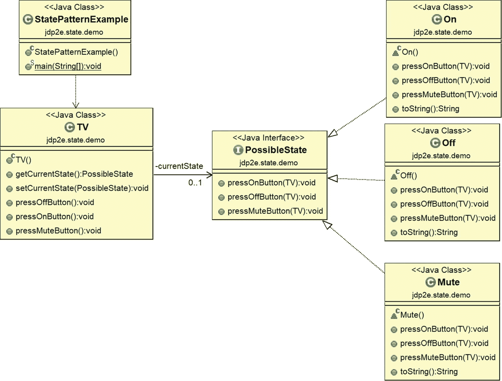
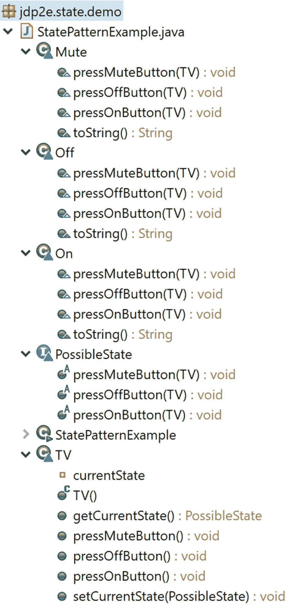
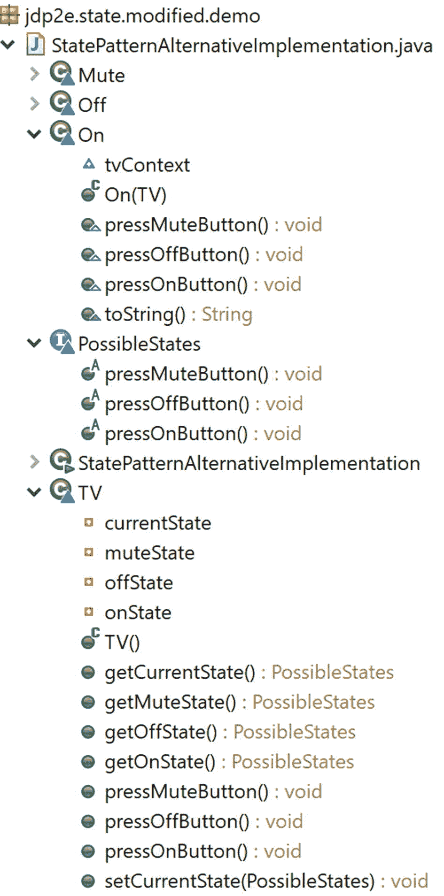

# 20.状态模式

本章介绍了状态模式。

## GoF 定义

允许对象在其内部状态改变时改变其行为。该对象看起来会改变它的类。

## 概念

假设您正在处理一个代码库快速增长的大规模应用程序。结果，情况变得复杂，您可能需要引入大量的`if-else` blocks/switch 语句来保护各种情况。状态模式适合这样的环境。它允许您的对象基于当前状态有不同的行为，并且您可以用不同的类定义特定于状态的行为。

因此，在这种模式中，您开始考虑应用程序的可能状态，并相应地分离代码。理想情况下，每个状态都独立于其他状态。您跟踪这些状态，并且您的代码根据当前状态的行为做出响应。例如，假设你正在观看一个电视节目。如果您按下电视遥控器上的静音按钮，您会发现电视的状态发生了变化。但是如果电视已经关闭，你就不会注意到任何变化。

因此，基本思想是，如果您的代码可以跟踪应用程序的当前状态，您就可以集中任务，分离您的代码，并相应地做出响应。

## 真实世界的例子

考虑网络连接的场景 TCP 连接。一个对象可以处于各种状态；例如，连接可能已经建立，连接可能已经关闭，或者对象已经开始通过连接进行侦听。当此连接收到来自其他对象的请求时，它会根据其当前状态做出响应。

交通信号灯或电视(TV)的功能也可以被认为属于这一类。例如，如果电视已经处于打开模式，您可以更换频道。如果它处于关闭模式，它将不响应频道改变请求。

## 计算机世界的例子

假设您有一个作业处理系统，可以一次处理一定数量的作业。当一个新的作业出现时，要么系统处理该作业，要么它发出信号表明系统正忙于它一次可以处理的最大数量的作业。换句话说，当达到作业处理能力的总数时，系统发送一个繁忙信号。

### 注意

在 javax.faces.lifecycle 包中，有一个名为 lifecycle 的类。这个类有一个名为 *execute(FacesContext context)，*的方法，在这个方法中，您可能会注意到状态设计模式的一个实现。FacesServlet 可以调用生命周期的 execute 方法，生命周期对象与不同的阶段(状态)进行通信。

## 说明

下面的实现模拟了电视及其遥控器的功能。假设您有一个支持电视操作的遥控器。您可以简单地假设，在任何给定的时间，电视处于这三种状态之一:开、关或静音。最初，电视处于关闭状态。当您按下遥控器上的 on 按钮时，电视将进入 On 状态。如果您按下静音按钮，它将进入静音状态。

*您可以假设，如果您在电视已经处于关闭状态时按下关闭按钮，或者如果您在电视已经处于打开状态时按下打开按钮，或者如果您在电视已经处于静音模式时按下静音按钮，电视的状态不会改变。*

如果您按下关闭按钮，电视可以从打开状态进入关闭状态，如果您按下静音按钮，电视将进入静音状态。图 [20-1](#Fig1) 显示了反映所有这些可能情况的状态图。



图 20-1

电视的不同状态

### 注意

在此图中，我没有将任何状态标记为最终状态，尽管在此图中，在最后，我关闭了电视。为了使设计简单，我假设如果您在电视已经处于关闭状态时按下关闭按钮，或者如果您在电视已经处于打开状态时按下打开按钮，或者如果您在电视已经处于静音模式时按下静音按钮，则电视的状态不会改变。但在现实世界中，遥控器的工作方式可能会有所不同。例如，如果电视当前处于打开状态，并且您按下了静音按钮，电视可以进入静音模式，然后如果再次按下静音按钮，电视可能会再次回到打开状态。因此，您可能需要添加额外的逻辑来支持这种行为。

### 关键特征

以下实现的主要特征如下。

*   对于特定于状态的行为，有单独的类。例如，这里有像开、关和静音这样的类。

*   TV 类是这里的主类(单词 *main* 并不意味着它包括`main()`方法)，客户端代码只与它对话。用设计模式的术语来说，电视是这里的上下文类。

*   TV 类中定义的操作将行为委托给当前状态的对象实现。

*   PossibleState 是定义当您拥有一个对象时调用的方法/操作的接口。开、关和静音是实现该接口的具体状态。

*   状态本身触发状态转换(从一个状态到另一个状态)。

### 类图

图 [20-2](#Fig2) 为类图。



图 20-2

类图

### 包资源管理器视图

图 [20-3](#Fig3) 显示了程序的高层结构。



图 20-3

包资源管理器视图

### 履行

下面是实现。

```java
package jdp2e.state.demo;
interface PossibleState
{
    void pressOnButton(TV context);
    void pressOffButton(TV context);
    void pressMuteButton(TV context);
}
//Off state
class Off implements  PossibleState
{
    //User is pressing Off button when the TV is in Off state
    @Override
    public void pressOnButton(TV context)
    {
        System.out.println("You pressed On button. Going from Off to On state.");
        context.setCurrentState(new On());
        System.out.println(context.getCurrentState().toString());
    }
    //TV is Off already, user is pressing Off button again
    @Override
    public void pressOffButton(TV context)
    {
        System.out.println("You pressed Off button. TV is already in Off state.");
    }
    //User is pressing Mute button when the TV is in Off state
    @Override
    public void pressMuteButton(TV context)
    {
        System.out.println("You pressed Mute button.TV is already in Off state, so Mute operation will not work.");
    }
    public String toString()
    {
        return "\t**TV is switched off now.**";
    }
}
//On state
class On implements PossibleState
{
    //TV is On already, user is pressing On button again
    @Override
    public void pressOnButton(TV context)
    {
        System.out.println("You pressed On button. TV is already in On state.");
    }
    //User is pressing Off button when the TV is in On state
    @Override
    public void pressOffButton(TV context)
    {
        System.out.println("You pressed Off button.Going from On to Off state.");
        context.setCurrentState(new Off());
        System.out.println(context.getCurrentState().toString());
    }
    //User is pressing Mute button when the TV is in On state

    @Override
    public void pressMuteButton(TV context)
    {
        System.out.println("You pressed Mute button.Going from On to Mute mode.");
        context.setCurrentState(new Mute());
        System.out.println(context.getCurrentState().toString());
    }
    public String toString()
    {
        return "\t**TV is switched on now.**";
    }
}
//Mute state
class Mute implements PossibleState
{
    //User is pressing On button when the TV is in Mute mode
    @Override
    public void pressOnButton(TV context)
    {
        System.out.println("You pressed On button.Going from Mute mode to On state.");
        context.setCurrentState(new On());
        System.out.println(context.getCurrentState().toString());
    }
    //User is pressing Off button when the TV is in Mute mode
    @Override
    public void pressOffButton(TV context)
    {
        System.out.println("You pressed Off button. Going from Mute mode to Off state.");
        context.setCurrentState(new Off());
        System.out.println(context.getCurrentState().toString());
    }
    //TV is in mute mode already, user is pressing mute button again

    @Override
    public void pressMuteButton(TV context)
    {
        System.out.println("You pressed Mute button.TV is already in Mute mode.");
    }
    public String toString()
    {
        return "\t**TV is silent(mute) now**";
    }
}
class TV
{
    private PossibleState currentState;
    public TV()
    {
        //Initially TV is initialized with Off state
        this.setCurrentState(new Off());
    }
    public PossibleState getCurrentState()
    {
        return currentState;
    }
    public void setCurrentState(PossibleState currentState)
    {
        this.currentState = currentState;
    }
    public void pressOffButton()
    {
        currentState.pressOffButton(this);//Delegating the state
    }
    public void pressOnButton()
    {
        currentState.pressOnButton(this);//Delegating the state

    }
    public void pressMuteButton()
    {
        currentState.pressMuteButton(this);//Delegating the state
    }
}

//Client
public class StatePatternExample {

    public static void main(String[] args) {
        System.out.println("***State Pattern Demo***\n");
        //Initially TV is Off.
        TV tv = new TV();
        System.out.println("User is pressing buttons in the following sequence:");
        System.out.println("Off->Mute->On->On->Mute->Mute->Off\n");
        //TV is already in Off state.Again Off button is pressed.
        tv.pressOffButton();
        //TV is already in Off state.Again Mute button is pressed.
        tv.pressMuteButton();
        //Making the TV on
        tv.pressOnButton();
        //TV is already in On state.Again On button is pressed.
        tv.pressOnButton();
        //Putting the TV in Mute mode
        tv.pressMuteButton();
        //TV is already in Mute mode.Again Mute button is pressed.
        tv.pressMuteButton();
        //Making the TV off
        tv.pressOffButton();
    }

}

```

### 输出

这是输出。

```java
***State Pattern Demo***

User is pressing buttons in the following sequence:

Off->Mute->On->On->Mute->Mute->Off

You pressed Off button. TV is already in Off state.
You pressed Mute button.TV is already in Off state, so Mute operation will not work.
You pressed On button. Going from Off to On state.
    **TV is switched on now.**
You pressed On button. TV is already in On state.
You pressed Mute button.Going from On to Mute mode.
    **TV is silent(mute) now**
You pressed Mute button.TV is already in Mute mode.
You pressed Off button. Going from Mute mode to Off state.
    **TV is switched off now.**

```

## 问答环节

1.  你能详细说明这种模式在另一个真实场景中是如何有用的吗？

    心理学家反复证明了这样一个事实:当人们处于放松状态并且没有紧张感时，他们可以表现得最好，但是在相反的情况下，当他们的头脑充满紧张感时，他们就不能产生好的结果。这就是为什么心理学家总是建议你应该在放松的心情下工作。你可以把这个简单的哲学与电视插图联系起来。如果电视开着，它可以娱乐你；如果关闭，就不能。正确*所以，如果你想设计一个对象内部状态变化时类似的行为变化，这种模式是有用的。*

    除了这个例子之外，您还可以考虑一个场景，客户购买了一张在线机票，然后在某个阶段取消了它。退款金额可能因不同情况而异；例如，您可以取消机票的天数。

2.  在本例中，您只考虑了电视的三种状态:开、关或静音。还有许多其他状态，例如，可能有一个处理连接问题或显示条件的状态。为什么你忽略了这些？

    直截了当的回答是代表简单。如果系统中状态的数量显著增加，那么维护系统就变得很困难(这也是与这种设计模式相关的关键挑战之一)。但是如果你理解这个实现，你可以很容易地添加任何你想要的状态。

3.  我注意到在他们的名著中，GoF 代表了国家模式和战略模式的相似结构。我对此感到困惑。

    是的，结构是相似的，但是你需要注意意图是不同的。除了这个关键的区别，你可以简单地这样想:用一个策略模式提供了一个子类化的更好的选择。另一方面，在状态设计模式中，不同类型的行为可以封装在一个状态对象中，并且上下文被委托给这些状态中的任何一个。当上下文的内部状态改变时，它的行为也会改变。

    State patterns can also help us avoid lots of `if` conditions in some contexts. (Consider our example once again. If the TV is in the Off state, it cannot go to the Mute state. From this state, it can move to the On state only.) So, if you do not like state design pattern, you may need to code like this for a On button press.

    ```java
    class TV
    {
    //Some code before
    public void pressOnButton()
    {
    if(currentState==Off )
    {
    System.out.println (" You pressed Onbutton. Going from Off to OnState");
    //Do some operations
    }
    if(currentState==On )
     {
      System.out.println (" You pressed On button. TV is already  in On state");
     }
    //TV presently is in mute mode
    else
     {
      System.out.println (" You pressed On button . Going from Mute mode to On State");
     }
    //Do some operations
    }

    ```

    请注意，您需要对不同种类的按钮按压重复这些检查。(例如，对于`pressOffButton()`和`pressMuteButton()`方法，您需要重复这些检查并相应地执行。)

    如果你不考虑状态，如果你的代码库增长，维护会变得困难。

4.  **在我们的实施中，您是如何支持开闭原则的？**

    这些 TV 状态中的每一个都被关闭进行修改，但是您可以向 TV 类添加全新的状态。

5.  **战略模式和状态模式有什么共同特征？**

    两者都可以促进构图和授权。

6.  在我看来，这些状态对象就像单态对象一样。这是正确的吗？

    是的。大多数时候他们都是这样做的。

7.  **Can you avoid the use of “contexts” in the method parameters. For example, can you avoid them in the following statements?**

    ```java
    void pressOnButton(TV context);

    ....

    ```

    如果您不想这样使用上下文参数，您可能需要修改实现。为了给出一个快速的概述，我将展示修改后的 Package Explorer 视图，其中只包含修改后的实现。

    下面实现中的一个关键变化可以在 TV 类中看到。用所有可能的状态对象初始化`TV()`构造函数，这些对象用于后面阶段的状态改变。为此调用 getter 方法。考虑下面的实现。

### 已修改的包资源管理器视图

在这种情况下，所有三种可能的状态都有相似的组成部分。因此，为了保持图表简短，我在下面的 Package Explorer 视图中只显示了其中的一个。

图 [20-4](#Fig4) 显示了修改后的程序高层结构。



图 20-4

已修改的包资源管理器视图

### 修改的实现

下面是修改后的实现。

```java
package jdp2e.state.modified.demo;

interface PossibleStates
{
    void pressOnButton();
    void pressOffButton();
    void pressMuteButton();
}

class Off implements  PossibleStates
{
    TV tvContext;
    //Initially we'll start from Off state
    public Off(TV context)
    {
        //System.out.println(" TV is Off now.");
        this.tvContext = context;
    }
    //Users can press any of these buttons at this state-On, Off or Mute
    //TV is Off now, user is pressing On button
    @Override
    public void pressOnButton()
    {
        System.out.println(" You pressed On button. Going from Off to On state");
        tvContext.setCurrentState(tvContext.getOnState());
        System.out.println(tvContext.getCurrentState().toString());
    }
    //TV is Off already, user is pressing Off button again
    @Override
    public void pressOffButton()
    {
        System.out.println(" You pressed Off button. TV is already in Off state");
    }
    //TV is Off now, user is pressing Mute button
    @Override
    public void pressMuteButton()
    {
        System.out.println(" You pressed Mute button.TV is already in Off state, so Mute operation will not work.");
    }
    public String toString()
    {
        return "\t**TV is switched off now.**";
    }

}
class On implements PossibleStates
{
    TV tvContext;
    public On(TV context)
    {
        //System.out.println(" TV is On now.");
        this.tvContext = context;
    }
    //Users can press any of these buttons at this state-On, Off or Mute
    //TV is On already, user is pressing On button again
    @Override
    public void pressOnButton()
    {
        System.out.println("You pressed On button. TV is already in On state.");
    }
    //TV is On now, user is pressing Off button
    @Override
    public void pressOffButton()
    {
        System.out.println(" You pressed Off button.Going from On to Off state.");
        tvContext.setCurrentState(tvContext.getOffState());
        System.out.println(tvContext.getCurrentState().toString());
    }
    //TV is On now, user is pressing Mute button
    @Override
    public void pressMuteButton()
    {
        System.out.println("You pressed Mute button.Going from On to Mute mode.");
        tvContext.setCurrentState(tvContext.getMuteState());
        System.out.println(tvContext.getCurrentState().toString());
    }
    public String toString()
    {
        return "\t**TV is switched on now.**";
    }
}
class Mute implements PossibleStates
{
    TV tvContext;
    public Mute(TV context)
    {
        this.tvContext = context;
    }
    //Users can press any of these buttons at this state-On, Off or Mute
    //TV is in mute, user is pressing On button
    @Override
    public void pressOnButton()
    {
        System.out.println("You pressed On button.Going from Mute mode to On state.");
        tvContext.setCurrentState(tvContext.getOnState());
        System.out.println(tvContext.getCurrentState().toString());
    }
    //TV is in mute, user is pressing Off button
    @Override
    public void pressOffButton()
    {
        System.out.println("You pressed Off button. Going from Mute mode to Off state.");
        tvContext.setCurrentState(tvContext.getOffState());
        System.out.println(tvContext.getCurrentState().toString());
    }
    //TV is in mute already, user is pressing mute button again
    @Override
    public void pressMuteButton()
    {
        System.out.println(" You pressed Mute button.TV is already in Mute mode.");
    }
    public String toString()
    {
        return "\t**TV is silent(mute) now**";
    }
}
class TV
{
    private PossibleStates currentState;
    private PossibleStates onState;
    private PossibleStates offState;
    private PossibleStates muteState;
    public TV()
    {
        onState=new On(this);
        offState=new Off(this);
        muteState=new Mute(this);
        setCurrentState(offState);
    }
    public PossibleStates getCurrentState()
    {
        return currentState;
    }
    public void setCurrentState(PossibleStates currentState)
    {
        this.currentState = currentState;
    }
    public void pressOffButton()
    {
        currentState.pressOffButton();
    }
    public void pressOnButton()
    {
        currentState.pressOnButton();
    }
    public void pressMuteButton()
    {
        currentState.pressMuteButton();
    }
    public PossibleStates getOnState()
    {
        return onState;
    }
    public PossibleStates getOffState()
    {
        return offState;
    }
    public PossibleStates getMuteState()
    {
        return muteState;
    }
}

//Client
public class StatePatternAlternativeImplementation {

    public static void main(String[] args) {
        System.out.println("***State Pattern Alternative Implementation Demo***\n");
        //Initially TV is Off.
        TV tv = new TV();
        System.out.println("User is pressing buttons in the following sequence:");
        System.out.println("Off->Mute->On->On->Mute->Mute->Off\n");
        //TV is already in Off state.Again Off button is pressed.
        tv.pressOffButton();
        //TV is already in Off state.Again Mute button is pressed.
        tv.pressMuteButton();
        //Making the TV on
        tv.pressOnButton();
        //TV is already in On state.Again On button is pressed.
        tv.pressOnButton();
        //Putting the TV in Mute mode
        tv.pressMuteButton();
        //TV is already in Mute mode.Again Mute button is pressed.
        tv.pressMuteButton();
        //Making the TV off
        tv.pressOffButton();

    }
}

```

### 修改输出

下面是修改后的实现的输出。

1.  在这些实现中，TV 是一个具体的类。在这种情况下，你为什么不编程接口？

    我假设 TV 类不会改变，所以我忽略了这一部分以减少程序的代码量。但是是的，你总是可以从一个你可以定义契约的界面开始。

2.  **状态设计模式有哪些优点和缺点？**

    **Pros**
    *   您已经看到，遵循打开/关闭原则，您可以轻松地添加新状态和新行为。此外，状态行为可以毫无争议地扩展。例如，在这个实现中，您可以为 TV 类添加新的状态和新的行为，而无需更改 TV 类本身。

    *   减少了`if-else`语句的使用(即，条件复杂度降低。(参考问题 3 的回答)。

        **Cons**
    *   状态模式也被称为状态的*对象。所以，你可以假设更多的状态需要更多的代码，而明显的副作用是你很难维护。*

3.  在 TV 类构造函数中，你初始化了一个关闭状态的 TV。那么，状态和上下文类都能触发状态转换吗？

    是的。

```java
 ***State Pattern Alternative Implementation Demo***

User is pressing buttons in the following sequence:
Off->Mute->On->On->Mute->Mute->Off

 You pressed Off button. TV is already in Off state
 You pressed Mute button.TV is already in Off state, so Mute operation will not work.
 You pressed On button. Going from Off to On state
    **TV is switched on now.**
You pressed On button. TV is already in On state.
You pressed Mute button.Going from On to Mute mode.
    **TV is silent(mute) now**
 You pressed Mute button.TV is already in Mute mode.
You pressed Off button. Going from Mute mode to Off state.
    **TV is switched off now.**

```