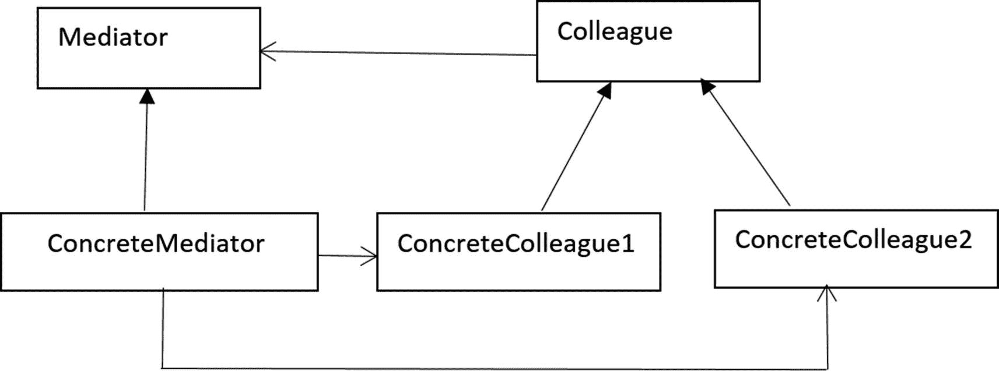
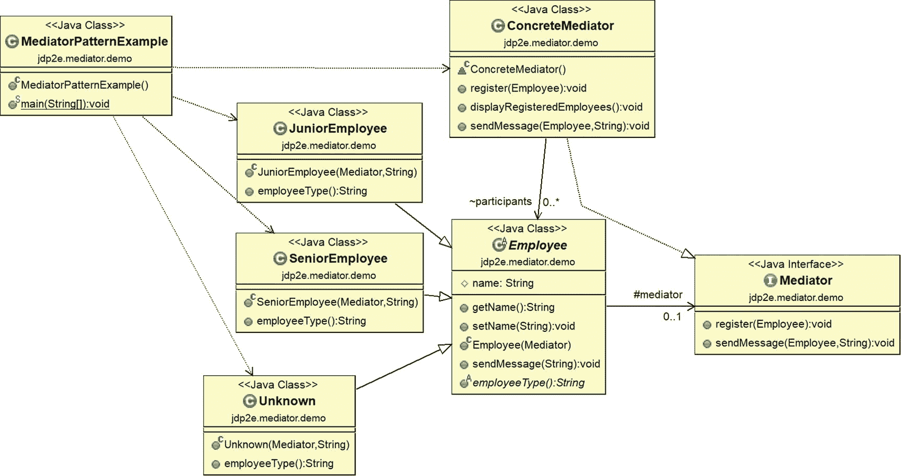
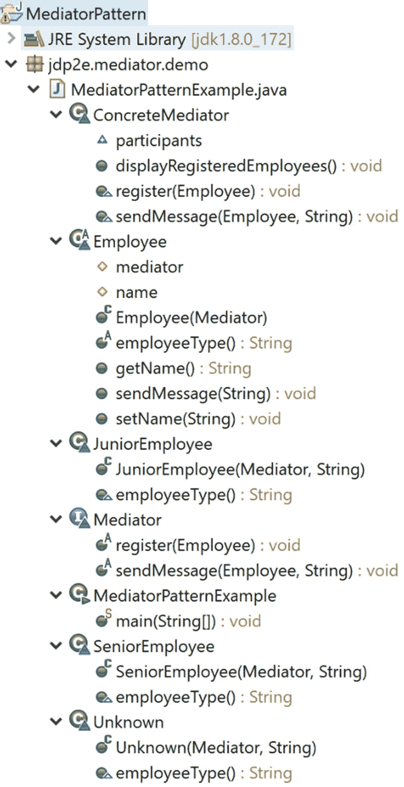
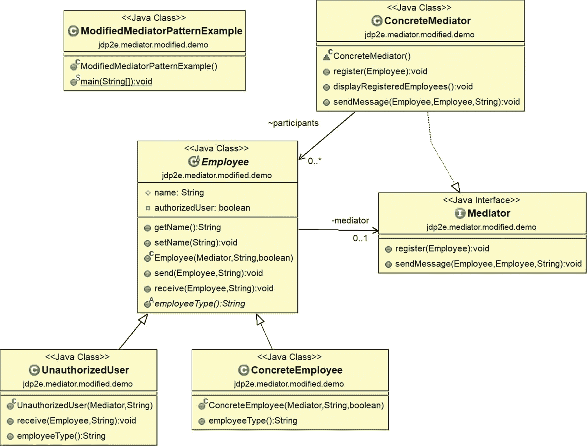
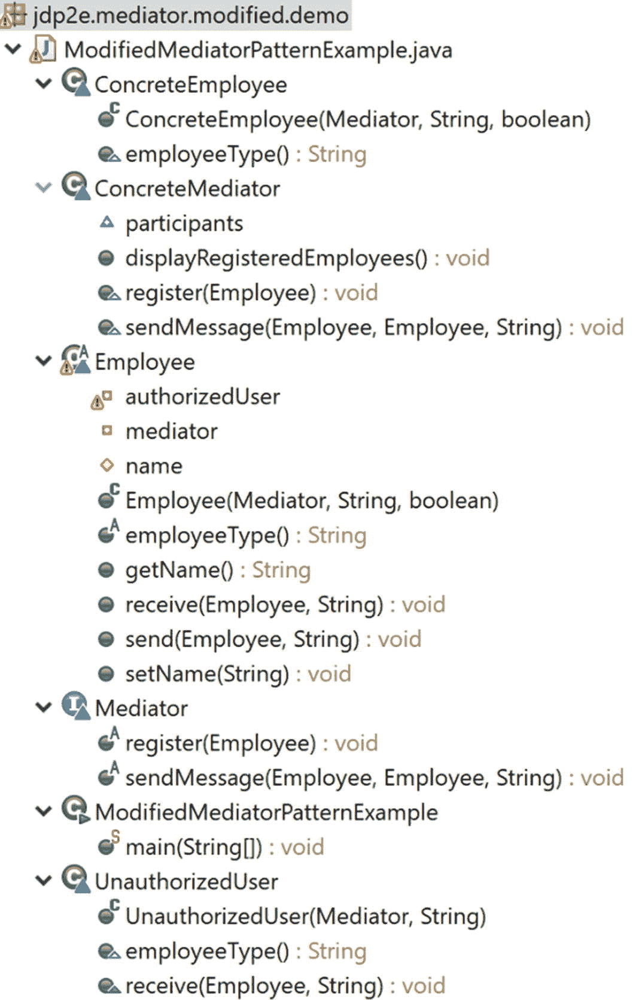
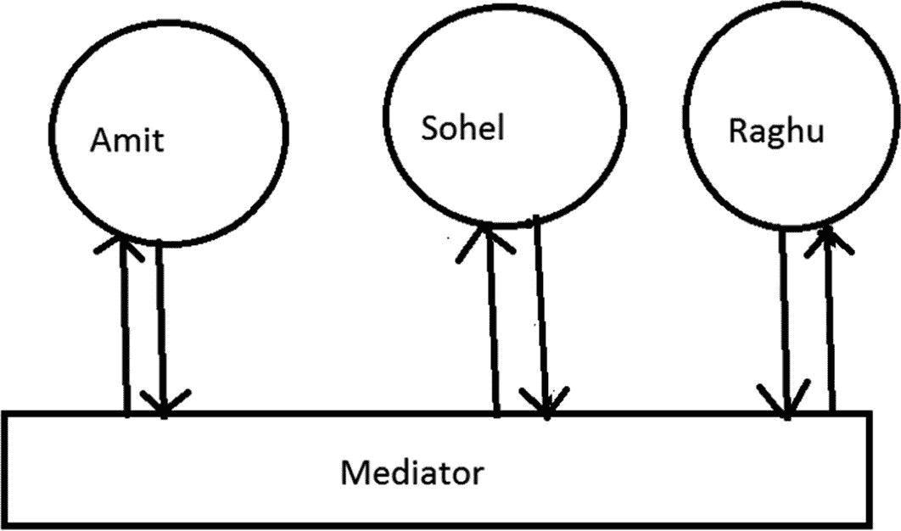
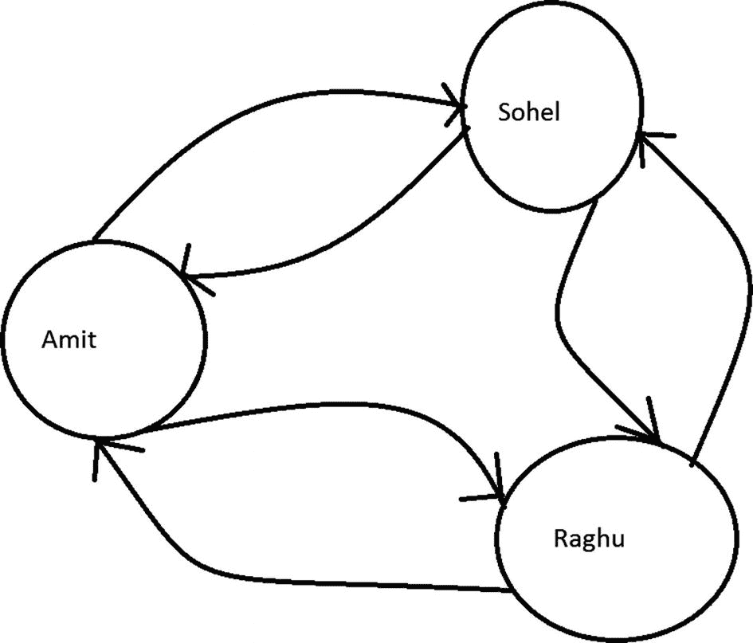

# 21.中介模式

本章涵盖了中介模式。

## GoF 定义

定义一个封装一组对象如何交互的对象。Mediator 通过防止对象显式地相互引用来促进松散耦合，并允许您独立地改变它们的交互。

## 概念

中介负责控制和协调无法显式引用彼此的特定对象组的交互。所以，你可以把一个中介者想象成一个媒介，通过它这些物体彼此交流。这种实现有助于减少不同对象之间的互连数量。因此，您可以促进系统中的松散耦合。

因此，在这种设计中，对象通信是用一个中介对象封装的，这样它们就不能直接相互通信，从而减少了它们之间的依赖性。

## 真实世界的例子

当航班需要起飞时，会进行一系列验证。这些类型的验证确认所有组件/零件(相互依赖)都处于完美状态。

还要考虑飞机飞行员(接近或离开航站区)何时与塔台通信。他们不明确地与来自不同航空公司的其他飞行员交流。他们只向塔台发送他们的状态。这些塔也发送信号来确认哪架飞机可以起飞或降落。你必须注意，这些塔并不控制整个飞行。它们仅在端子区域中实施约束。

## 计算机世界的例子

当客户端处理业务应用程序时，开发人员可能需要对其施加一些约束。例如，在一个表单中，客户需要提供用户 ID 和密码来访问他们的帐户。在同一个表单上，客户必须提供其他信息，如电子邮件、地址、年龄等等。让我们假设开发人员应用了如下约束。

最初，应用程序检查用户提供的 ID 是否有效。如果是有效的用户 id，则仅启用密码字段。在提供这两个字段之后，应用程序表单需要检查电子邮件地址是否是用户提供的。让我们进一步假设在提供了所有这些信息(有效的用户 id、密码、格式正确的电子邮件等)之后。)，提交按钮被启用。因此，基本上，如果客户端以正确的顺序提供了有效的用户 id、密码、电子邮件和其他必需的详细信息，那么 Submit 按钮就会被启用。开发人员可能还会强制要求用户 ID 必须是一个整数，因此如果用户错误地在该字段中放置了任何字符，提交按钮将保持禁用状态。在这种情况下，中介模式变得非常方便。

因此，当一个程序由许多类组成，并且逻辑分布在它们之间时，代码变得更难阅读和维护。在这些场景中，如果您想在系统行为中引入新的变化，这可能会很困难，除非您使用中介模式。

### 注意

java.util.concurrent.Executor 接口中的 execute()方法遵循这种模式。

javax.swing.ButtonGroup 类是支持这种模式的另一个例子。这个类有一个方法 setSelected()，确保用户提供一个新的选择。

java.util.Timer 类的各种 schedule()方法的不同重载版本也可以视为遵循这种模式。

## 说明

mediator 模式(基本上采用了 GoF 的*设计模式:可重用面向对象软件的元素*)的一种常见结构，通常用图 [21-1](#Fig1) 所示的图表来描述。



图 21-1

中介模式示例

参与者描述如下。

*   *Mediator* :定义接口，提供同事对象之间的通信。

*   *ConcreteMediator* :维护同事对象列表。它实现中介接口并协调同事对象之间的通信。

*   *同事*:定义与其他同事交流的接口。

*   *ConcreteColleague1 和 ConcreteColleague2* :实现同事接口。这些对象通过中介相互通信。

在这一章中，我提供了这种模式的两个实现。在第一个实现中，我将单词*同事*替换为*员工*。此外，ConcreteColleague1 和 ConcreteColleague2 分别替换为 JuniorEmployee 和 SeniorEmployee。假设您有三名员工:Amit、Sohel 和 Raghu，其中 Amit 和 Sohel 是初级员工，向他们的老板 Raghu 报告，rag Hu 是高级员工。拉古想顺利协调事情。让我们进一步假设他们可以通过聊天服务器相互通信。

在下面的实现中，Mediator 是一个有两个方法的接口:`register()`和`sendMessage()`。`register()`方法向中介注册一个雇员，`sendMessage()`向服务器发送消息。ConcreteMediator 类是 Mediator 接口的具体实现。

Employee 是一个抽象类，JuniorEmployee 和 SeniorEmployee 类是它的具体实现。Employee 类的`sendMessage()`方法描述如下。

```java
public void sendMessage(String msg) throws InterruptedException
{
    mediator.sendMessage(this, msg);
}

```

您可以看到，当一个雇员调用`sendMessage()`方法时，它正在调用 mediator 的`sendMessage()`方法。因此，实际的沟通过程是通过中介进行的。

在客户端代码中，我引入了另一个人，Jack。但是他没有向中介对象注册自己。因此，中介不允许他向该服务器发布任何消息。

现在检查代码和相应的输出。

### 类图

图 [21-2](#Fig2) 为类图。



图 21-2

类图

### 包资源管理器视图

图 [21-3](#Fig3) 显示了程序的高层结构。



图 21-3

包资源管理器视图

### 履行

这是第一个实现。

```java
package jdp2e.mediator.demo;

import java.time.LocalDateTime;
import java.util.ArrayList;
import java.util.List;

interface Mediator
{
    void register(Employee employee);
    void sendMessage(Employee employee, String msg) throws InterruptedException;
}
// ConcreteMediator
class ConcreteMediator implements Mediator
{
    List<Employee> participants = new ArrayList<Employee>();
    @Override
    public void register(Employee employee)
    {
        participants.add(employee);
    }
    public void displayRegisteredEmployees()
    {
        System.out.println("At present,registered employees are:");
        for (Employee employee: participants)
        {

            System.out.println(employee.getName());
        }
    }
    @Override
    public void sendMessage(Employee employee, String msg) throws InterruptedException
    {
        if (participants.contains(employee))
        {
            System.out.println(employee.getName() +" posts:"+ msg+"Last message posted at "+LocalDateTime.now());
            Thread.sleep(1000);
        }
        else
        {
            System.out.println("An outsider named "+ employee.getName()+" is trying to send some messages.");
        }
    }
}

// The abstract class-Employee
abstract class Employee
{
    protected Mediator mediator;
    protected String name;
    public String getName() {
        return name;
    }

    public void setName(String name) {
        this.name = name;
    }
    // Constructor
    public Employee(Mediator mediator)
    {
        this.mediator = mediator;
    }
    public void sendMessage(String msg) throws InterruptedException
    {
        mediator.sendMessage(this, msg);
    }
    public abstract String employeeType();
}
// Junior Employee
class JuniorEmployee extends Employee
{
    public JuniorEmployee(Mediator mediator, String name)
    {
        super(mediator);
        this.name = name;
    }

    @Override
    public String employeeType()
    {
        return "JuniorEmployee";
    }
}

//Senior Employee
class SeniorEmployee extends Employee
{
    // Constructor
    public SeniorEmployee(Mediator mediator, String name)
    {
        super(mediator);
        this.name = name;
    }
    @Override
    public String employeeType()
    {
        return "SeniorEmployee";
    }
}
// Unknown participant.
class Unknown extends Employee
{
    // Constructor
    public Unknown(Mediator mediator, String name)
    {
        super(mediator);
        this.name = name;
    }
    @Override
    public String employeeType()
    {
        return "Outsider";
    }
}

public class MediatorPatternExample {

    public static void main(String[] args) throws InterruptedException {
        System.out.println("***Mediator Pattern Demo***\n");

        ConcreteMediator mediator = new ConcreteMediator();

        JuniorEmployee amit = new JuniorEmployee(mediator, "Amit");
        JuniorEmployee sohel = new JuniorEmployee(mediator, "Sohel");
        SeniorEmployee raghu = new SeniorEmployee(mediator, "Raghu");

        //Registering participants
        mediator.register(amit);
        mediator.register(sohel);
        mediator.register(raghu);
        //Displaying the participant's list
        mediator.displayRegisteredEmployees();

        System.out.println("Communication starts among participants...");
        amit.sendMessage("Hi Sohel,can we discuss the mediator pattern?");
        sohel.sendMessage("Hi Amit,yup, we can discuss now.");
        raghu.sendMessage("Please get back to work quickly.");

        //An outsider/unknown person tries to participate
        Unknown unknown = new Unknown(mediator, "Jack");
        unknown.sendMessage("Hello Guys..");
    }
}

```

### 输出

这是输出。

```java
***Mediator Pattern Demo***

At present,registered employees are:
Amit
Sohel
Raghu
Communication starts among participants...
Amit posts:Hi Sohel,can we discuss the mediator pattern?Last message posted at 2018-09-09T17:41:21.868
Sohel posts:Hi Amit,yup, we can discuss now.Last message posted at 2018-09-09T17:41:23.369
Raghu posts:Please get back to work quickly.Last message posted at 2018-09-09T17:41:24.870

An outsider named Jack is trying to send some messages

.

```

### 分析

请注意，只有注册用户才能相互通信，并在聊天服务器上成功发布消息。调解人不允许任何外人进入系统。(注意输出的最后一行。)

### 修改后的插图

您已经看到了中介模式的一个简单例子。但是你可以做得更好。你确定了以下几点。

*   这些信息只是单向传递的。

*   当一个参与者发布消息时，每个人都可以看到该消息。所以，没有隐私可言。

*   如果员工忘记自己注册，则不允许他发送消息。这很好，但他不应该被当作外人。在正常情况下，组织外部人员应该与忘记在服务器上注册的组织员工区别对待。

*   向中介注册参与者所需的客户机代码。尽管你可能认为这不是缺点，但你可以选择更好的方法。例如，当您在客户端代码中创建一个 Employee 对象时，您可以将参与者自动注册到一个中介。

*   您没有在客户端代码中使用`employeeType()`方法。

因此，记住这几点，让我们修改前面的例子。下面是修改后的实现的一些关键特征。

*   JuniorEmployee 和 SeniorEmployee 类被替换为一个 ConcreteEmployee 类。它帮助我们容易地识别谁属于组织，谁不属于组织(换句话说，是局外人)。

*   在修改后的实现中，这些参与者中的每一个都可以看到谁在发布消息，但是不会公开消息的目标是谁或者实际的消息是什么。因此，两个参与者之间有隐私，但这种方法可以帮助像 Raghu 这样的人协调事情，因为如果他看到员工聊得太多，他可能会干涉。

*   在客户端代码中，您可以像下面这样创建参与者。

```java
Employee Amit = new ConcreteEmployee(mediator, "Amit", true);

```

第三个参数(对/错)用于确定参与者是否希望向中介注册自己。当他试图发布消息时，他会得到相应的处理。

*   `employeeType()`方法确定参与者是来自组织内部还是来自外部。在这种情况下，您可能还会注意到，没有使用下面的代码行

```java
if( fromEmployee.employeeType()=="UnauthorizedUser")

```

您可以直接使用这行代码:

```java
if( fromEmployee.getClass().getSimpleName().equals("UnauthorizedUser"))

```

为了更好的可读性，我使用了前者。

### 修改的类图

图 [21-4](#Fig4) 显示了修改后的类图。为了显示关键的变化和简洁的图表，我没有在下面的图表中显示客户端代码依赖关系。



图 21-4

类图

### 已修改的包资源管理器视图

图 [21-5](#Fig5) 显示了修改后的包浏览器视图。



图 21-5

已修改的包资源管理器视图

### 修改的实现

下面是修改后的实现。

```java
package jdp2e.mediator.modified.demo;

import java.time.LocalDateTime;
import java.util.ArrayList;
import java.util.List;

interface Mediator
{
    void register(Employee employee);
    void sendMessage(Employee fromEmployee, Employee toEmployee,String msg) throws InterruptedException;
}
// ConcreteMediator
class ConcreteMediator implements Mediator
{
    List<Employee> participants = new ArrayList<Employee>();
    @Override
    public void register(Employee employee)
    {
        participants.add(employee);
    }
    public void displayRegisteredEmployees()
    {
        System.out.println("At present ,registered participants are:");
        for (Employee employee: participants)
        {

            System.out.println(employee.getName());
        }
    }
    @Override
    public void sendMessage(Employee fromEmployee,Employee toEmployee,String msg) throws InterruptedException
    {
        /*if( fromEmployee.getClass().getSimpleName().equals("UnauthorizedUser"))*/
        if( fromEmployee.employeeType()=="UnauthorizedUser")
        {
            System.out.println("[ALERT Everyone] An outsider named "+ fromEmployee.getName()+" trying to send some messages to "+ toEmployee.getName());
            fromEmployee.receive(fromEmployee, ",you are not allowed to enter here.");
        }
        else if (participants.contains(fromEmployee))
        {
            System.out.println("-----"+fromEmployee.getName() +" posts some message at: "+LocalDateTime.now()+"-----");
            Thread.sleep(1000);
            //No need to inform everyone or himself
            //Only let the target receiver know
            if(participants.contains(toEmployee))
            {
                toEmployee.receive(fromEmployee,msg);
            }
            //If target receipient does not exist
            else
            {
                System.out.println(fromEmployee.getName() +" , your target recipient does not exist");
            }
        }
        //An outsider tries to send message.
        else
        {
            System.out.println("[ALERT] An unregistered employee named "+ fromEmployee.getName()+" trying to send some messages to "+ toEmployee.getName());
            System.out.println(fromEmployee.getName()+", you need to register yourself first.");
        }

    }
}
// Employee
abstract class Employee
{
    private Mediator mediator;
    protected String name;
    private boolean authorizedUser;
    public String getName() {
        return name;
    }

    public void setName(String name) {
        this.name = name;
    }
    // Constructor
    public Employee(Mediator mediator, String name, boolean authorizedUser)
    {
        this.mediator = mediator;
        this.name=name;
        this.authorizedUser=authorizedUser;
        if(authorizedUser)
        {
            mediator.register(this);
        }

    }
    //The following method name need not be same as the Mediator's method name
    public void send(Employee toFriend,String msg) throws InterruptedException
    {
        mediator.sendMessage(this,toFriend, msg);
    }
    //public abstract void receive(Friend fromFriend,String message);

    public void receive(Employee fromFriend,String message)
    {
        System.out.println(this.name+" received a message : " + message +" from an employee "+ fromFriend.getName() +".");

    }
    public abstract String employeeType();
}
//A concrete friend
class ConcreteEmployee extends Employee
{

    public ConcreteEmployee(Mediator mediator, String name,boolean authorizedUser)
    {
        super(mediator,name, authorizedUser);
    }
    @Override
    public String employeeType()
    {
        return "ConcreteEmployee";
    }
}
//Unauthorized user
class UnauthorizedUser extends Employee
{
    public UnauthorizedUser(Mediator mediator, String name)
    {
        //The user is always treated an unauthorized user.So, the flag is
        //false always.
        super(mediator,name, false);
    }

    @Override
    public void receive(Employee fromEmployee,String message)
    {
        System.out.println(this.name + message);

    }

    @Override
    public String employeeType()
    {
        return "UnauthorizedUser";
    }
}

public class ModifiedMediatorPatternExample {
    public static void main(String[] args) throws InterruptedException {
        System.out.println("***Mediator Pattern Demo***\n");

        ConcreteMediator mediator = new ConcreteMediator();

        Employee Amit = new ConcreteEmployee(mediator, "Amit", true);
        Employee Sohel = new ConcreteEmployee(mediator, "Sohel",true);
        Employee Raghu = new ConcreteEmployee(mediator, "Raghu",true);
        //Unauthorized user
        Employee Jack = new ConcreteEmployee(mediator, "Jack",false);
        //Only two parameter needed to pass in the following case.
        Employee Divya = new UnauthorizedUser(mediator, "Divya");

        //Displaying the participant's list
        mediator.displayRegisteredEmployees();

        System.out.println("Communication starts among participants...");
        Amit.send(Sohel,"Hi Sohel,can we discuss the mediator pattern?");
        Sohel.send(Amit,"Hi Amit,Yup, we can discuss now.");
        //Boss is sending messages to each of them individually
        Raghu.send(Amit,"Please get back to work quickly.");
        Raghu.send(Sohel,"Please get back to work quickly.");

        //An unregistered employee(Jack) and an outsider(Divya) are also
        //trying to participate.
        Jack.send(Amit,"Hello Guys..");
        Divya.send(Raghu, "Hi Raghu");

    }
}

```

### 修改输出

下面是修改后的输出。

```java
***Mediator Pattern Demo***

At present ,registered participants are:
Amit
Sohel
Raghu
Communication starts among participants...
-----Amit posts some message at: 2018-09-04T20:37:00.999-----
Sohel received a message : Hi Sohel,can we discuss the mediator pattern? from an employee Amit.
-----Sohel posts some message at: 2018-09-04T20:37:01.999-----
Amit received a message : Hi Amit,Yup, we can discuss now. from an employee Sohel.
-----Raghu posts some message at: 2018-09-04T20:37:03.002-----
Amit received a message : Please get back to work quickly. from an employee Raghu.
-----Raghu posts some message at: 2018-09-04T20:37:04.016-----
Sohel received a message : Please get back to work quickly. from an employee Raghu.
[ALERT] An unregistered employee named Jack trying to send some messages to Amit
Jack, you need to register yourself first.
[ALERT Everyone] An outsider named Divya trying to send some messages to Raghu
Divya,you are not allowed to enter here

.

```

### 分析

请注意，当名为 Jack 的员工(属于该组织)在没有注册的情况下发送消息时，系统会阻止他发布消息，但会给他一个建议。但 Divya，谁是一个组织的局外人，被告知，她是不允许进入该系统。它也警告其他人。

## 问答环节



图 21-7

使用调解人的沟通



图 21-6

不使用调解人的沟通

1.  你为什么要把事情复杂化？在第一个例子中，每个参与者都可以彼此直接对话，您可以绕过中介的使用。这是正确的吗？

    在这个例子中，您只有三个*注册的*参与者，所以看起来他们可以直接相互交流。但是你可能需要考虑一个相对复杂的场景。例如，只有当目标参与者处于在线模式(这是聊天服务器的常见情况)时，参与者才能向目标参与者发送消息。因此，根据您提出的体系结构，如果它们试图相互通信，那么在发送消息之前，它们中的每一个都需要维护所有其他参与者的状态。而如果参与人数不断增长，你能想象系统的复杂程度吗？

    因此，调解人肯定可以帮助你处理这种情况。图 [21-6](#Fig6) 和图 [21-7](#Fig7) 描绘了该场景。

    **案例一**。没有中间人的交流。

**案例二**。与调解人沟通。

此外，您可以在这个上下文中考虑修改后的实现。在修改后的实现中，您可以看到中介在维护逻辑——应该允许谁在服务器上发布消息以及应该如何对待他/她。

1.  **使用中介模式的** **优势** **是什么？**
    *   您可以降低系统中对象通信的复杂性。

    *   该模式促进了松散耦合。

    *   它减少了系统中子类的数量。

    *   您可以将“多对多”关系替换为“一对多”关系，这样更容易阅读和理解。(考虑我们在这方面的第一个例子)。作为一个明显的效果，维护变得容易。

    *   您可以使用这种模式通过中介提供集中控制。

    *   简而言之，从我们的代码中移除紧密耦合(对象之间)一直是我们的目标，这种模式在这种情况下得分很高。

2.  使用中介模式的缺点是什么？
    *   在某些情况下，实现适当的封装是很棘手的。

    *   如果在中介对象中放入过多的逻辑，那么它的架构可能会变得复杂。不恰当地使用中介模式可能会导致“上帝级”反模式。(你将在第 28 章中学习反模式)。

    *   有时维护中介会成为一个大问题。

3.  **如果您需要添加一个新的规则或逻辑，您可以直接将其添加到中介器中。这是正确的吗？**

    是的。

4.  我在门面模式和中介模式中发现了一些相似之处。这是正确的吗？

    是的。Steve Holzner 在他的书*中提到了相似性，他把中介模式描述为一个复用的门面模式。在 mediator 中，您不是使用单个对象的接口，而是在多个对象之间创建一个多路复用的接口，以提供平滑的过渡。*

5.  在这个模式中，你减少了不同对象之间的相互联系。通过这一缩减，您获得了哪些关键优势？

    对象之间更多的互连可以形成一个整体系统，其中系统的行为很难改变(系统的行为分布在许多对象中)。作为副作用，您可能需要创建许多子类来在系统中带来这些变化。

6.  **在修改后的实现中，您使用的是线程。睡眠(1000)。这是什么原因呢？**

    你可以忽略它。我用它来模拟现实生活。我假设参与者在正确阅读消息后发布消息，此活动至少需要 1 秒钟。

7.  在一些应用中，我只看到了具体中介物的使用。这种做法可以吗？

    中介模式并不限制您只能使用一个具体的中介。但是我喜欢遵循专家的建议，“对超类型(抽象类/接口)编程是一种更好的方法”，从长远来看，它可以提供更多的灵活性。

8.  **我是否可以简单地说，如果一个类简单地从多个对象调用方法，它就是一个中介体？**

    一点也不。中介的主要目的是简化系统中对象之间的复杂通信。我建议您始终牢记 GoF 定义和相应的概念。

9.  **在第一个实现中，两个发送方法(中介和雇员)都被命名为 sendMessage()，但是在修改后的实现中，它们是不同的——一个是 send()，另一个是 sendMessage()。我需要遵循任何特定的命名约定吗？**

    不。两个都很好。这是你的选择。