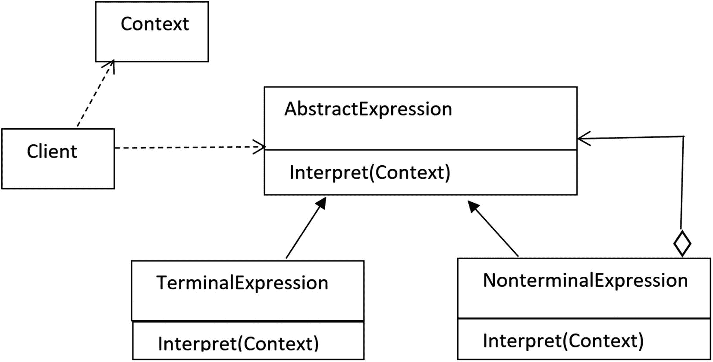
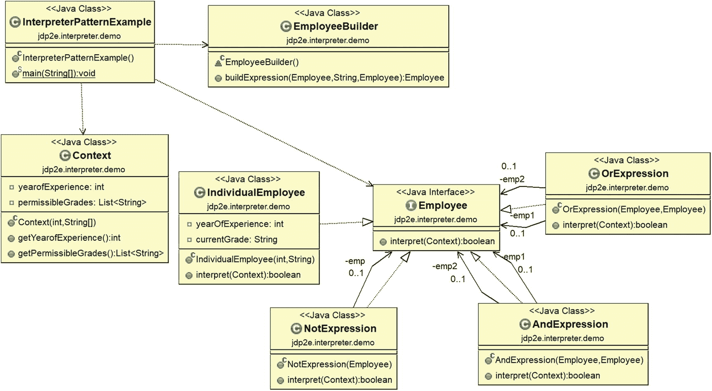
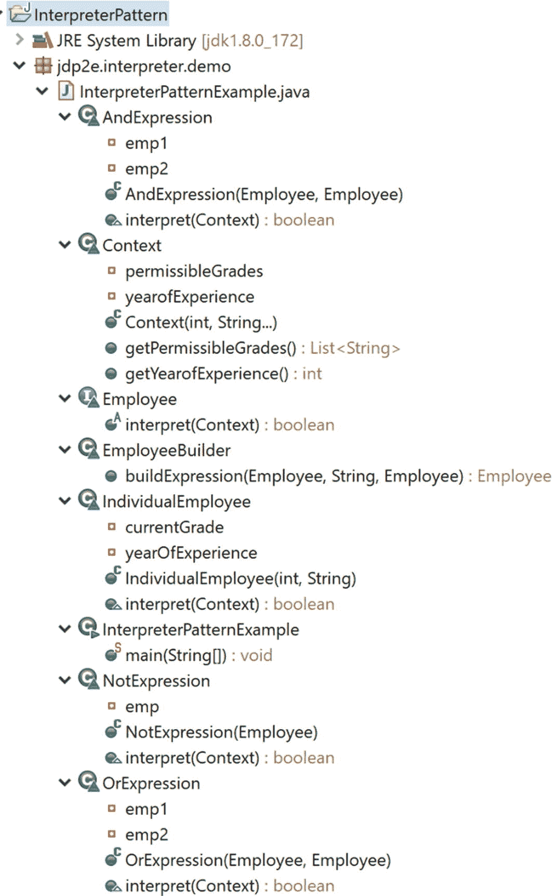
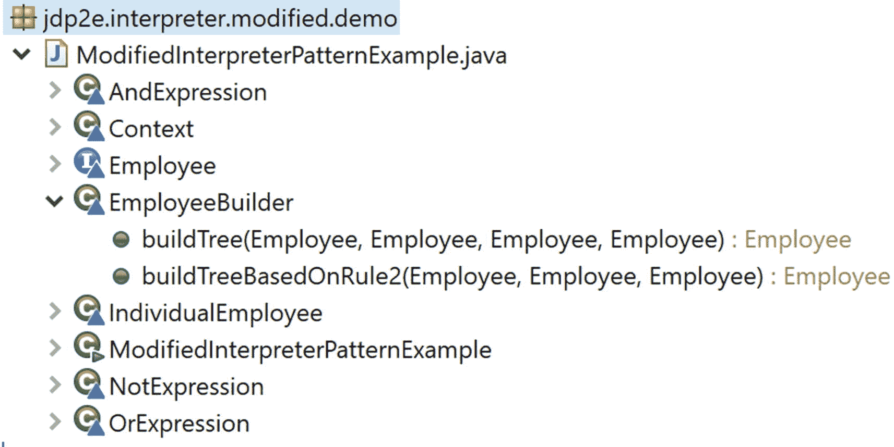

# 二十三、解释器模式

本章涵盖了解释器模式。

## GoF 定义

给定一种语言，为它的语法定义一个表示，以及一个使用该表示来解释该语言中的句子的解释器。

## 概念

为了理解这个模式，你需要熟悉一些关键术语，比如*句子*、*语法、语言*等等。所以，如果你对自动机中的形式语言不熟悉，你可能需要访问它们。

通常，这种模式处理的是*如何评估语言*中的句子。所以，你首先需要定义一个语法来表示这种语言。然后解释器处理语法。如果语法简单，这种模式是最好的。

这个模式中的每个类可能代表该语言中的一个规则，并且它应该有一个解释表达式的方法。因此，为了处理更多的规则，您需要创建更多的类。这就是解释器模式不应该用于处理复杂语法的原因。

让我们考虑计算器程序中不同的算术表达式。虽然这些表达式是不同的，但它们都是使用一些基本规则构造的，这些规则是在语言的语法中定义的(这些算术表达式)。因此，如果您能够解释这些规则的一般组合，而不是将每个规则组合视为单独的情况，这是最好的。在这种情况下，可以使用解释器模式。

这种模式的典型结构通常用类似于图 [23-1](#Fig1) 的图表来描述。



图 23-1

典型解释器模式的结构

术语描述如下。

*   抽象表达式(abstract expression):通常是一个带有解释方法的接口。您需要向该方法传递一个上下文对象。

*   *终端表达式*:用于终端表达式。终结表达式不需要其他表达式来解释。这些基本上是数据结构中的叶节点(即，它们没有子节点)。

*   *非终结符*:用于非终结符表达式。也称为*交替表达式*、*重复表达式*或*顺序表达式*。这就像可以包含终结和非终结表达式的组合。当你在这上面调用`interpret()`方法时，你基本上是在它的所有子节点上调用它。

*   *Context* :保存解释器需要的全局信息。

*   *客户端*:调用`interpret()`方法。它可以根据语言的规则有选择地建立一个语法树。

### 注意

解释器用于处理具有简单规则或语法的语言。理想情况下，开发人员不想创建他们自己的语言。这就是他们很少使用这种模式的原因。

## 真实世界的例子

*   翻译外语的翻译者。

*   把音符看作语法，音乐家在其中扮演解释者的角色。

## 计算机世界的例子

*   Java 编译器将 Java 源代码解释成 JVM 可以理解的字节码。

*   在 C#中，源代码被转换成由 CLR 解释的 MSIL 代码。在执行时，这个 MSIL(中间代码)被 JIT 编译器转换成本机代码(二进制可执行代码)。

### 注意

在 Java 中，您可能还会注意到充当解释器的 java.util.regex.Pattern 类。您可以通过调用 compile()方法创建这个类的一个实例，然后您可以使用 Matcher 实例根据语法来评估一个句子。

## 说明

这些是实现这种模式的一些重要步骤。

*   **第一步**。定义您想要为其构建解释器的语言的规则。

*   **第二步**。定义抽象类或接口来表示表达式。它应该包含一个解释表达式的方法。
    *   迈步 2A。识别终结和非终结表达式。例如，在接下来的示例中，IndividualEmployee 类是一个终端表达式类。

    *   步骤 2B。创建非终结符表达式类。他们每个人都在他们的孩子身上调用解释方法。例如，在接下来的示例中，OrExpression 和 AndExpression 类是非终结表达式类。

*   **第三步**。使用这些类构建抽象语法树。*您可以在客户端代码中完成这项工作，也可以创建一个单独的类来完成任务*。

*   **第四步**。一个客户现在用这个树来解释一个句子。

*   **第五步**。将上下文传递给解释器。它通常有需要解释的句子。解释器可以使用这个上下文执行额外的任务。

在接下来的程序中，我使用解释器模式作为规则验证器。我用不同员工的“经验年数”和当前等级来举例说明他们。请注意下面几行。

```java
       Employee emp1 = new IndividualEmployee(5,"G1");
       Employee emp2 = new IndividualEmployee(10,"G2");
       Employee emp3 = new IndividualEmployee(15,"G3");
       Employee emp4 = new IndividualEmployee(20,"G4");

```

为简单起见，这里考虑了四个不同级别的四名员工——G1、G2、G3 和 G4。

还要注意上下文，如下所示。

```java
       //Minimum Criteria for promoton is:
       //The year of experience is minimum 10 yrs. and
       //Employee grade should be either G2 or G3
       Context context=new Context(10,"G2","G3");

```

因此，您可以假设我想要根据上下文验证一些条件，这基本上是告诉您，要获得晋升，员工应该至少有 10 年的工作经验，并且他/她应该来自 G2 级或 G3 级。解释完这些表达式后，您会看到布尔值形式的输出。

*需要注意的重要一点是，这种设计模式并没有指导你如何构建语法树或者如何解析句子*。它给了你继续前进的自由。因此，为了给出一个简单的场景，我使用了一个 EmployeeBuilder 类和一个名为`buildExpression()`的方法来完成我的任务。

### 类图

图 [23-2](#Fig2) 为类图。



图 23-2

类图

### 包资源管理器视图

图 [23-3](#Fig3) 显示了程序的高层结构。



图 23-3

包资源管理器视图

### 履行

下面是实现。

```java
package jdp2e.interpreter.demo;

import java.util.ArrayList;
import java.util.List;

interface Employee
{
    public boolean interpret(Context context);
}
class IndividualEmployee implements Employee
{
    private int yearOfExperience;

    private String currentGrade;

    public IndividualEmployee(int experience, String grade){
        this.yearOfExperience=experience;
        this.currentGrade=grade;
    }
    @Override
    public boolean interpret(Context context)
    {

        if(this.yearOfExperience>=context.getYearofExperience() && context.getPermissibleGrades().contains(this.currentGrade))
        {
            return true;
        }
        return false;
    }
}
class OrExpression implements Employee
{

    private Employee  emp1;
    private Employee  emp2;

    public OrExpression(Employee emp1, Employee emp2)
    {
        this.emp1 = emp1;
        this.emp2 = emp2;
    }

    @Override
    public boolean interpret(Context context)
    {
        return emp1.interpret(context) || emp2.interpret(context);
    }
}
class AndExpression implements Employee
{

    private Employee  emp1;
    private Employee  emp2;

    public AndExpression(Employee emp1, Employee emp2)
    {
        this.emp1 = emp1;
        this.emp2 = emp2;
    }

    @Override
    public boolean interpret(Context context)
    {
        return emp1.interpret(context) && emp2.interpret(context);
    }
}
class NotExpression implements Employee
{
    private Employee  emp;

    public NotExpression(Employee  expr)
    {
        this.emp = expr;
    }

    @Override
    public boolean interpret(Context context)
    {
        return !emp.interpret(context);
    }
}
class Context
{
    private int yearofExperience;
    private List<String> permissibleGrades;
    public Context(int experience,String... allowedGrades)
    {
        this.yearofExperience=experience;
        this.permissibleGrades=new ArrayList<>();
        for( String grade:allowedGrades)
        {
            permissibleGrades.add(grade);
        }
    }
    public int getYearofExperience()
    {
        return yearofExperience;
    }
    public List<String> getPermissibleGrades()
    {
        return permissibleGrades;
    }
}
class EmployeeBuilder
{
    public Employee buildExpression(Employee emp1,  String operator, Employee emp2)
    {

        //Whatever the input,converting it to lowarcase
        switch(operator.toLowerCase())
        {
        case "or":
            return new OrExpression(emp1,emp2);
        case "and":
            return new AndExpression(emp1,emp2);
        case "not":
            return new NotExpression(emp1);
        default:
            System.out.println("Only AND,OR and NOT operators are allowed at present");
            return null;
        }

    }
}
public class InterpreterPatternExample {

    public static void main(String[] args) {
        System.out.println("***Interpreter Pattern Demo***\n");

        //Minimum Criteria for promoton is:
        //The year of experience is minimum 10 yrs. and
        //Employee grade should be either G2 or G3
        Context context=new Context(10,"G2","G3");

        //Different employees with grades
        Employee emp1 = new IndividualEmployee(5,"G1");
        Employee emp2 = new IndividualEmployee(10,"G2");
        Employee emp3 = new IndividualEmployee(15,"G3");
        Employee emp4 = new IndividualEmployee(20,"G4");

        EmployeeBuilder builder=new EmployeeBuilder();

        System.out.println("emp1 is eligible for promotion. " + emp1.interpret(context));
        System.out.println("emp2 is eligible for promotion. " + emp2.interpret(context));
        System.out.println("emp3 is eligible for promotion. " + emp3.interpret(context));
        System.out.println("emp4 is eligible for promotion. " + emp4.interpret(context));

        System.out.println("Is either emp1 or emp3 is eligible for promotion?" +builder.buildExpression(emp1,"Or",emp3).interpret(context));
        System.out.println("Is both emp2 and emp4 are eligible for promotion? ?" + builder.buildExpression(emp2,"And",emp4).interpret(context));
        System.out.println("The statement 'emp3 is NOT eligible for promotion' is true? " + builder.buildExpression(emp3, "Not",null).interpret(context));
        //Invalid input expression
        //System.out.println("Is either emp1 or emp3 is eligible for promotion?" +builder.buildExpression(emp1,"Wrong",emp3).interpret(context));
    }
}

```

### 输出

这是输出。

```java
***Interpreter Pattern Demo***

emp1 is eligible for promotion. false
emp2 is eligible for promotion. true
emp3 is eligible for promotion. true
emp4 is eligible for promotion. false
Is either emp1 or emp3 is eligible for promotion?true
Is both emp2 and emp4 are eligible for promotion? ?false
The statement 'emp3 is NOT eligible for promotion' is true? false

```

### 分析

您可以看到每个复合表达式都在调用其所有子表达式的`interpret()`方法。

### 修改后的插图

您已经看到了解释器模式的一个简单例子。从这个实现来看，您似乎已经处理了一些简单明了的表达式。因此，让我们在修改后的实现中处理一些复杂的规则或表达式。

### 修改的类图

在修改后的实现中，主要更改仅在 EmployeeBuilder 类中进行。所以，让我们快速浏览一下这个类的类图(见图 [23-4](#Fig4) )。


图 23-4

修改了 EmployeeBuilder 类的类图

### 已修改的包资源管理器视图

在修改后的实现中，主要更改仅反映在 EmployeeBuilder 类中。因此，在本节中，我只扩展了这个类。图 [23-5](#Fig5) 显示了修改后的包浏览器视图。



图 23-5

已修改的包资源管理器视图

### 修改的实现

下面是修改后的实现。关键变化以粗体显示。

```java
package jdp2e.interpreter.modified.demo;

import java.util.ArrayList;
import java.util.List;

interface Employee
{
    public boolean interpret(Context context);
}
class IndividualEmployee implements Employee
{
    private int yearOfExperience;

    private String currentGrade;

    public IndividualEmployee(int experience, String grade){
        this.yearOfExperience=experience;
        this.currentGrade=grade;
    }
    @Override
    public boolean interpret(Context context)
    {

        if(this.yearOfExperience>=context.getYearofExperience() && context.getPermissibleGrades().contains(this.currentGrade))
        {
            return true;
        }
        return false;
    }
}
class OrExpression implements Employee
{

    private Employee  emp1;
    private Employee  emp2;

    public OrExpression(Employee emp1, Employee emp2)
    {
        this.emp1 = emp1;
        this.emp2 = emp2;
    }

    @Override
    public boolean interpret(Context context)
    {
        return emp1.interpret(context) || emp2.interpret(context);
    }
}
class AndExpression implements Employee
{

    private Employee  emp1;
    private Employee  emp2;

    public AndExpression(Employee emp1, Employee emp2)
    {
        this.emp1 = emp1;
        this.emp2 = emp2;
    }

    @Override
    public boolean interpret(Context context)
    {
        return emp1.interpret(context) && emp2.interpret(context);
    }
}
class NotExpression implements Employee
{
    private Employee  emp;

    public NotExpression(Employee  expr)
    {
        this.emp = expr;
    }

    @Override
    public boolean interpret(Context context)
    {
        return !emp.interpret(context);
    }
}
class Context
{
    private int yearofExperience;
    private List<String> permissibleGrades;
    public Context(int experience,String... allowedGrades)
    {
        this.yearofExperience=experience;
        this.permissibleGrades=new ArrayList<>();
        for( String grade:allowedGrades)
        {
            permissibleGrades.add(grade);
        }
    }
    public int getYearofExperience()
    {
        return yearofExperience;
    }
    public List<String> getPermissibleGrades()
    {
        return permissibleGrades;
    }
}

class EmployeeBuilder

{

    // Building the tree
    //Complex Rule-1: emp1 and (emp2 or (emp3 or emp4))

    public Employee buildTree(Employee emp1, Employee emp2,Employee emp3,Employee emp4)
    {
        //emp3 or emp4
        Employee firstPhase=new OrExpression(emp3,emp4);
        //emp2 or (emp3 or emp4)
        Employee secondPhase=new OrExpression(emp2,firstPhase);
        //emp1 and (emp2 or (emp3 or emp4))
        Employee finalPhase=new AndExpression(emp1,secondPhase);
        return finalPhase;

    }
    //Complex Rule-2: emp1 or (emp2 and (not emp3 ))
    public Employee buildTreeBasedOnRule2(Employee emp1, Employee emp2,Employee emp3)
    {
        //Not emp3
        Employee firstPhase=new NotExpression(emp3);
        //emp2 or (not emp3)
        Employee secondPhase=new AndExpression(emp2,firstPhase);
        //emp1 and (emp2 or (not emp3 ))
        Employee finalPhase=new OrExpression(emp1,secondPhase);
        return finalPhase;

    }

}

public class ModifiedInterpreterPatternExample {

    public static void main(String[] args) {
        System.out.println("***Modified Interpreter Pattern Demo***\n");

        //Minimum Criteria for promoton is:
        //The year of experience is minimum 10 yrs. and
        //Employee grade should be either G2 or G3
        Context context=new Context(10,"G2","G3");
        //Different Employees with grades
        Employee emp1 = new IndividualEmployee(5,"G1");
        Employee emp2 = new IndividualEmployee(10,"G2");
        Employee emp3 = new IndividualEmployee(15,"G3");
        Employee emp4 = new IndividualEmployee(20,"G4");

        EmployeeBuilder builder=new EmployeeBuilder();

        //Validating the 1st complex rule
        System.out.println("Is emp1 and any of emp2,emp3, emp4 is eligible for promotion?" +builder.buildTree(emp1,emp2, emp3,emp4).interpret(context));
        System.out.println("Is emp2 and any of emp1,emp3, emp4 is eligible for promotion?" +builder.buildTree(emp2,emp1, emp3,emp4).interpret(context));
        System.out.println("Is emp3 and any of emp1,emp2, emp3 is eligible for promotion?" +builder.buildTree(emp3,emp1, emp2,emp4).interpret(context));
        System.out.println("Is emp4 and any of emp1,emp2, emp3 is eligible for promotion?" +builder.buildTree(emp4,emp1, emp2,emp3).interpret(context));

        System.out.println("");
        //Validating the 2nd complex rule
        System.out.println("Is emp1 or (emp2 but not emp3) is eligible for promotion?" +builder.buildTreeBasedOnRule2(emp1, emp2, emp3).interpret(context));
        System.out.println("Is emp2 or (emp3 but not emp4) is eligible for promotion?" +builder.buildTreeBasedOnRule2(emp2, emp3, emp4).interpret(context));
    }
}

```

### 修改输出

下面是修改后的输出。

```java
***Modified Interpreter Pattern Demo***

Is emp1 and any of emp2,emp3, emp4 is eligible for promotion?false
Is emp2 and any of emp1,emp3, emp4 is eligible for promotion?true
Is emp3 and any of emp1,emp2, emp4 is eligible for promotion?true
Is emp4 and any of emp1,emp2, emp3 is eligible for promotion?false

Is emp1 or (emp2 but not emp3) is eligible for promotion?false
Is emp2 or (emp3 but not emp4) is eligible for promotion?true

```

### 分析

现在，您已经了解了如何使用解释器模式来处理遵循所示方法的复杂规则。

## 问答环节

1.  什么时候应该使用这种模式？

    在日常编程中，不是很需要。尽管在一些罕见的情况下，您可能需要使用自己的编程语言来定义特定的协议。在这种情况下，这种模式可能会变得很方便。但是在你继续之前，你必须问问你自己关于投资回报(ROI)的问题。

2.  使用解释器设计模式有什么好处？
    *   你很大程度上参与了如何为你的语言定义语法，以及如何表达和解释这些句子的过程。你也可以改变和扩展你的语法。

    *   你有充分的自由去解释这些表达。

3.  使用解释器设计模式的相关挑战是什么？

    我相信工作量是最大的问题。维护复杂的语法也变得棘手，因为您可能需要创建(和维护)单独的类来处理不同的规则。