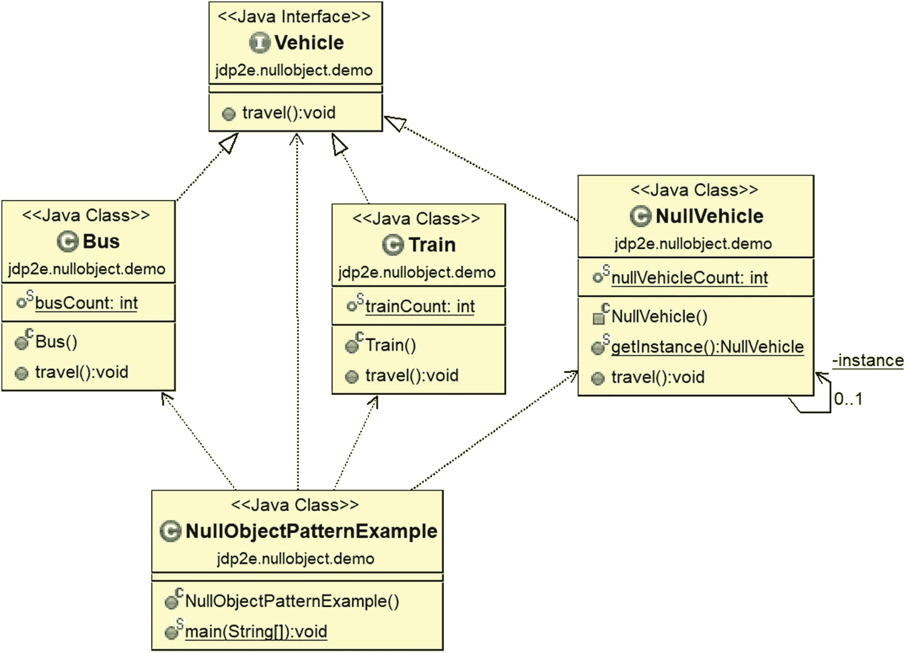
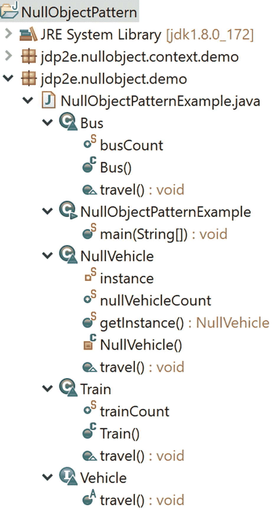
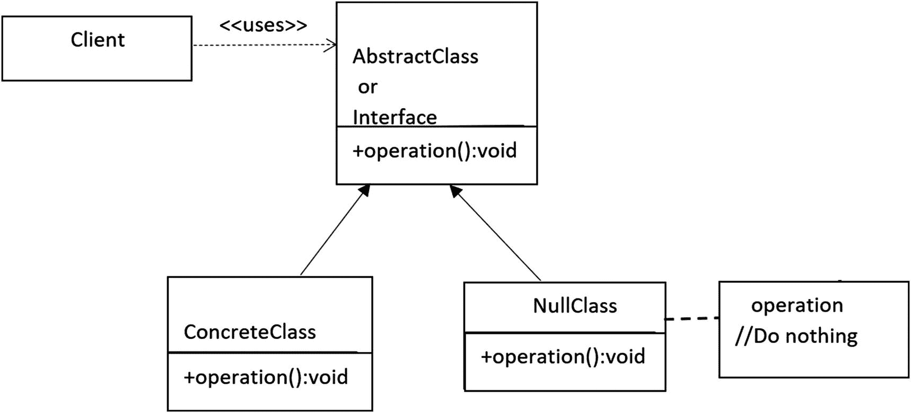

# 二十五、空对象模式

维基百科上说，“在面向对象的计算机编程中，空对象是没有引用值或定义了中性(空)行为的对象。空对象设计模式描述了此类对象的用途及其行为(或缺乏行为)。它最初发表在程序设计的*模式语言*系列丛书中。Hillside Group 发起了程序模式语言(PLoP)年会。

该模式可以实现“什么都不做”关系，或者当应用程序遇到空对象而不是真实对象时，它可以提供默认行为。简而言之，核心目标是通过`if`块避免“空对象检查”或“空协作检查”,从而制定一个更好的解决方案。使用这种模式，您试图通过提供一个默认的什么都不做的行为来封装对象的缺失。

## 概念

这种模式的显著特点是，当您在空对象上调用操作时，您不需要做任何事情(或者不存储任何东西)。考虑下面的程序和相应的输出。让我们试着理解与下面的程序段相关的问题，分析可能的解决方案，在本章的结尾，你会看到一个使用这种设计模式的更好的实现。

在下面的实现中，让我们假设您有两种类型的交通工具:公共汽车和火车。客户可以通过不同的输入选择公共汽车或火车对象，如“a”或“b”。让我们进一步假设应用程序认为这两个只是有效的输入。

### 错误的程序

这是一个错误的程序。

```java
package jdp2e.nullobject.context.demo;

import java.util.Scanner;

interface Vehicle
{
    void travel();
}
class Bus implements Vehicle
{
    public static int busCount = 0;
    public Bus()
    {
        busCount++;
    }
    @Override
    public void travel()
    {
        System.out.println("Let us travel with a bus");
    }
}
class Train implements Vehicle
{
    public static int trainCount = 0;
    public Train()
    {
        trainCount++;
    }
    @Override
    public void travel()
    {
        System.out.println("Let us travel with a train");
    }

}

public class NeedForNullObjectPattern {

    public static void main(String[] args) {
        System.out.println("***Need for Null Object Pattern Demo***\n");
        String input = null;
        int totalObjects = 0;

        while (true)
        {
            System.out.println("Enter your choice( Type 'a' for Bus, 'b' for Train ) ");
            Scanner scanner=new Scanner(System.in);
            input = scanner.nextLine();
            Vehicle vehicle = null;
            switch (input.toLowerCase())
            {
            case "a":
                vehicle = new Bus();
                break;
            case "b":
                vehicle = new Train();
                break;
            }
            totalObjects = Bus.busCount + Train.trainCount;

            vehicle.travel();
            System.out.println("Total number of objects created in the system is : "+ totalObjects);
        }
    }
}

```

### 具有有效输入的输出

```java
***Need for Null Object Pattern Demo***

Enter your choice( Type 'a' for Bus, 'b' for Train )
a
Let us travel with a bus
Total number of objects created in the system is : 1
Enter your choice( Type 'a' for Bus, 'b' for Train )
b
Let us travel with a train
Total number of objects created in the system is : 2
Enter your choice( Type 'a' for Bus, 'b' for Train )
b
Let us travel with a train
Total number of objects created in the system is : 3
Enter your choice( Type 'a' for Bus, 'b' for Train )

```

### 不需要输入的分析

假设用户错误地提供了一个不同的字符“d ”,如下所示:

```java
***Need for Null Object Pattern Demo***

Enter your choice( Type 'a' for Bus, 'b' for Train )
a
Let us travel with a bus
Total number of objects created in the system is : 1
Enter your choice( Type 'a' for Bus, 'b' for Train )
b
Let us travel with a train
Total number of objects created in the system is : 2
Enter your choice( Type 'a' for Bus, 'b' for Train )
b
Let us travel with a train
Total number of objects created in the system is : 3
Enter your choice( Type 'a' for Bus, 'b' for Train )

d

```

### 遇到异常

这一次，您会收到`System.NullPointerException`运行时异常。

```java
Enter your choice( Type 'a' for Bus, 'b' for Train )
d

Exception in thread "main"
java.lang.NullPointerException

    at jdp2e.nullobject.context.demo.NeedForNullObjectPattern.main(NeedForNullObjectPattern.java:61)

```

### 即时补救措施

您可能想到的直接补救方法是在调用操作之前进行空检查，如下所示:

```java
//A immediate remedy
if(vehicle !=null)
{
    vehicle.travel();
}

```

### 分析

先前的解决方案在这种情况下有效。但是请考虑一个企业应用程序。如果您需要对每个可能的场景进行空检查，那么您可能需要在每次执行时评估大量的`if`条件，这种方法会使您的代码变脏。与此同时，你可能会注意到难以维护的副作用。空对象模式的概念在类似的情况下很有用。

## 真实世界的例子

让我们考虑一个现实生活中的洗衣机场景。如果门是关着的，并且供水顺畅，没有任何内部泄漏，洗衣机就可以正常洗涤。但是假设，有一次，你忘记关门或者中途停止供水。在这些情况下，洗衣机不应损坏自身。它可以发出一些警报来引起你的注意，并指示目前没有水或门仍然开着。

## 计算机世界的例子

假设在客户机服务器体系结构中，服务器根据客户机输入进行某种处理。服务器应该足够智能，以便它不会启动任何不必要的计算。在处理输入之前，它可能希望进行交叉验证，以确保是否需要启动该流程，或者是否应该忽略无效的输入。在这种情况下，您可能会注意到命令模式和空对象模式的使用。

基本上，在企业应用程序中，使用这种设计模式可以避免大量的空检查和`if/else`块。下面的实现可以让您很好地了解这种模式。

### 注意

在 Java 中，你可能见过 java.awt.event 包中各种适配器类的使用。可以认为这些类更接近于空对象模式。例如，考虑 MouseMotionAdapter 类。它是一个抽象类，但包含具有空体的方法，如 mouseDragged(MouseEvent e){ }，mouseMoved(MouseEvent e){ }。但是由于适配器类是用 abstract 关键字标记的，所以不能直接创建该类的对象。

## 说明

和以前一样，在下面的实现中，让我们假设您有两种类型的交通工具:公共汽车和火车。客户可以通过不同的输入选择公共汽车或火车:“a”或“b”。如果用户错误地提供了任何无效数据(即，在这种情况下除了“a”或“b”之外的任何输入)，他根本不能旅行。应用程序通过使用 *NullVehicle 对象* *什么都不做*来忽略无效输入。在下面的例子中，我不会重复创建这些 NullVehicle 对象。一旦它被创建，我将简单地重用该对象。**

### 类图

图 [25-1](#Fig1) 为类图。(这个概念是用单例模式实现的，因此，您可以避免不必要的对象创建)。



图 25-1

类图

### 包资源管理器视图

图 [25-2](#Fig2) 显示了程序的高层结构。



图 25-2

包资源管理器视图

### 履行

下面是实现。

```java
package jdp2e.nullobject.demo;
import java.util.Scanner;

interface Vehicle
{
    void travel();
}
class Bus implements Vehicle
{
    public static int busCount = 0;
    public Bus()
    {
        busCount++;
    }
    @Override
    public void travel()
    {
        System.out.println("Let us travel with a bus");
    }
}

class Train implements Vehicle
{
    public static int trainCount = 0;
    public Train()
    {
        trainCount++;
    }
    @Override
    public void travel()
    {
        System.out.println("Let us travel with a train");
    }
}
class NullVehicle implements Vehicle
{
    //Early initialization
    private static  NullVehicle instance = new NullVehicle();
    public static int nullVehicleCount;
    //Making constructor private to prevent the use of "new"
    private NullVehicle()
    {
        nullVehicleCount++;
        System.out.println(" A null vehicle object created.Currently null vehicle count is :  "+nullVehicleCount);
    }
    // Global point of access.
    public static NullVehicle getInstance()
    {
        //System.out.println("We already have an instance now. Use it.");
        return instance;
    }
    @Override
    public void travel()
    {
        //Do Nothing
    }
}

public class NullObjectPatternExample  {

    public static void main(String[] args) {
        System.out.println("***Null Object Pattern Demo***\n");
        String input = "dummyInput";
        int totalObjects = 0;
        Scanner scanner;
        while(!input.toLowerCase().contains("exit"))
        {
            System.out.println("Enter your choice( Type 'a' for Bus, 'b' for Train.Type 'exit' to close the application. ) ");
            scanner=new Scanner(System.in);
            if(scanner.hasNextLine())
            {
                input = scanner.nextLine();
            }
            Vehicle vehicle = null;
            switch (input.toLowerCase())
            {
            case "a":
                vehicle = new Bus();
                break;
            case "b":
                vehicle = new Train();
                break;
            case "exit":
                System.out.println("Closing the application");
                vehicle = NullVehicle.getInstance();
                break;
            default:
                System.out.println("Invalid input");
                vehicle =  NullVehicle.getInstance();
            }
            totalObjects = Bus.busCount + Train.trainCount+NullVehicle.nullVehicleCount;
            //A immediate remedy
            //if(vehicle !=null)
            //{
            vehicle.travel();
            //}
            System.out.println("Total number of objects created in the system is : "+ totalObjects);
        }

    }
}

```

### 输出

这是输出。

```java
***Null Object Pattern Demo***

Enter your choice( Type 'a' for Bus, 'b' for Train.Type 'exit' to close the application. )
a
 A null vehicle object created.Currently null vehicle count is :  1
Let us travel with a bus
Total number of objects created in the system is : 2
Enter your choice( Type 'a' for Bus, 'b' for Train.Type 'exit' to close the application. )
b
Let us travel with a train
Total number of objects created in the system is : 3
Enter your choice( Type 'a' for Bus, 'b' for Train.Type 'exit' to close the application. )

c

Invalid input

Total number of objects created in the system is : 3
Enter your choice( Type 'a' for Bus, 'b' for Train.Type 'exit' to close the application. )

dfh

Invalid input

Total number of objects created in the system is : 3
Enter your choice( Type 'a' for Bus, 'b' for Train.Type 'exit' to close the application. )
exit

Closing the application
Total number of objects created in the system is : 3

```

### 分析

*   无效输入及其影响以粗体显示。

*   除了最初的情况，请注意，对象计数并没有因为空的车辆对象或无效的输入而增加。

*   这次我没有执行任何空检查(注意下面代码段中的注释行)。

    ```java
    //A immediate remedy
      //if(vehicle !=null)
      //{
       vehicle.travel();
      //}

    ```

*   这次程序执行不会因为无效的用户输入而中断。

## 问答环节

1.  开始时，我看到创建了一个额外的对象。是故意的吗？

    为了节省内存，我遵循了一种单例设计模式机制，该机制支持 NullVehicle 类结构中的早期初始化。我不想为每个无效输入创建一个 NullVehicle 对象。应用程序很可能需要处理大量的无效输入。如果您不注意这种情况，大量的 NullVehicle 对象驻留在系统中(基本上是无用的),这些对象会占用更多的内存。因此，您可能会注意到一些典型的副作用(例如，系统变慢等。).

2.  为了实现一个简单的空对象模式，我可以忽略不同的对象计数器(在前一个例子中使用的)并减少大量代码。这是正确的吗？

    Yes. Ideally, consider the following code segment.

    ```java
    //Another context
    List<Vehicle> vehicleList=new ArrayList<Vehicle>();
    vehicleList.add(new Bus());
    vehicleList.add(new Train());
    vehicleList.add(null);
    for( Vehicle vehicle : vehicleList)
      {
          vehicle.travel();
      }

    ```

    您不能循环通过这段代码，因为您遇到了`java.lang.NullPointerException`。

    Note a class like the following.

    ```java
    class NullVehicle implements Vehicle
    {
        @Override
        public void travel()
        {
            //Do nothing
        }
    }

    ```

    And you code like this:

    ```java
    //Another context discussed in Q&A session
    List<Vehicle> vehicleList=new ArrayList<Vehicle>();
    vehicleList.add(new Bus());
    vehicleList.add(new Train());
    //vehicleList.add(null);

    vehicleList.add(new NullVehicle());

    for( Vehicle vehicle : vehicleList)
    {
     vehicle.travel();
    }

    ```

    This time you can loop through smoothly. So, remember that the following structure prior to implementing a null object pattern (see Figure [25-3](#Fig3)).

    

    图 25-3

    空对象模式的基本结构

3.  什么时候应该使用这种模式？
    *   如果您不想在某些典型场景中遇到 Java 中的 NullPointerException，那么该模式非常有用。(例如，如果您错误地试图调用一个空对象的方法。)

    *   您可以忽略代码中的大量“空检查”。

    *   没有这些空检查会使您的代码更整洁，更易于维护。

4.  与空对象模式相关的挑战是什么？
    *   在某些情况下，您可能希望找到失败的根本原因。因此，如果抛出对您更有意义的 NullPointerException，您总是可以在`try` / `catch`或`try` / `catch` / `finally`块中处理这些异常，并相应地更新日志信息。

    *   空对象模式基本上帮助我们实现一个默认行为，当你无意识地想要处理一个根本不存在的对象时。但是这种方法可能不适合系统中每个可能的对象。

    *   空对象模式的不正确实现会抑制在程序执行中正常出现的真包。

    *   在所有可能的场景中创建一个合适的空对象可能并不容易。在某些类中，这可能会导致影响类方法的变化。

5.  空对象像代理一样工作。这是正确的吗？

    不。一般来说，代理在某个时间点作用于真实对象，它们也可以提供一些行为。但是空对象不应该做这样的事情。

6.  空对象模式总是与 NullPointerException 相关联。这是正确的吗？

    概念是相同的，但是异常名可以不同或者是特定于语言的。例如，在 Java 中，您使用它来保护 java.lang.NullPointerException，但是在像 C# 这样的语言中，您可以使用此模式来保护 System.NullReferenceException。