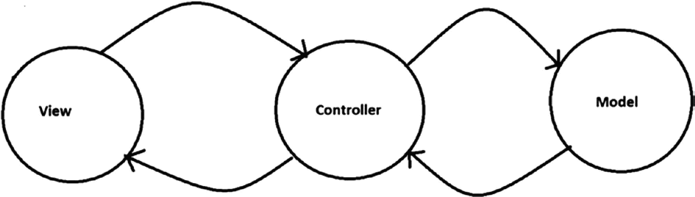
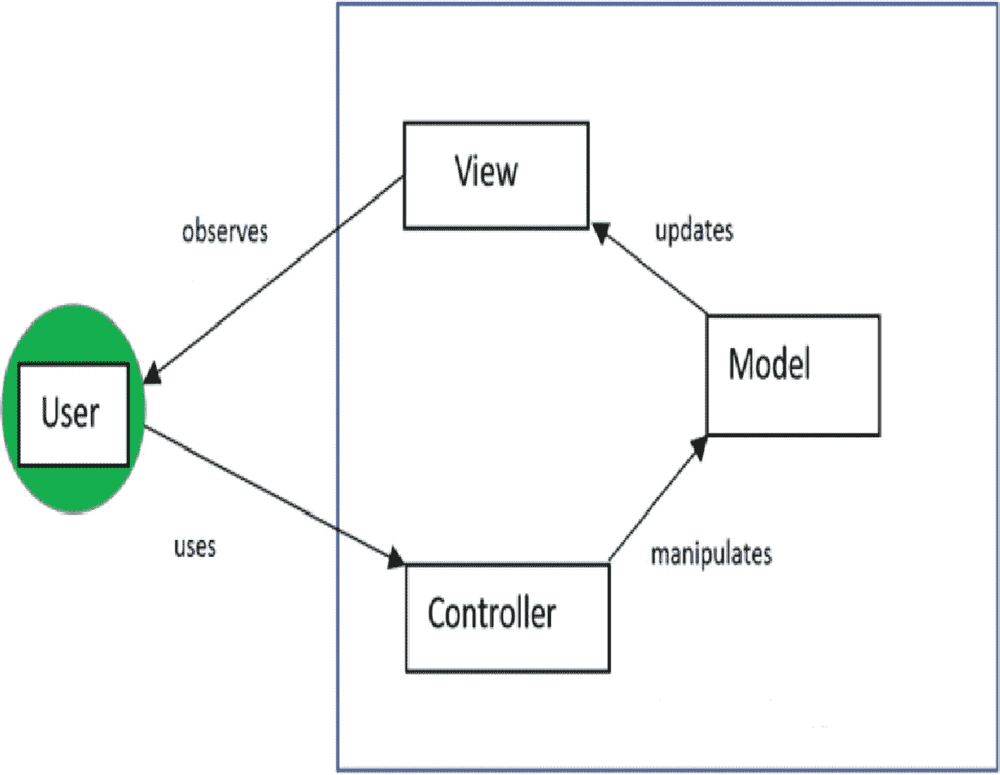
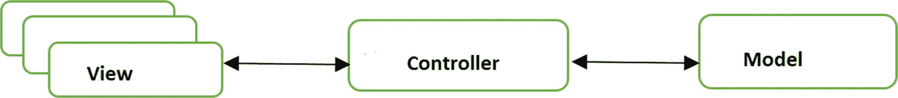
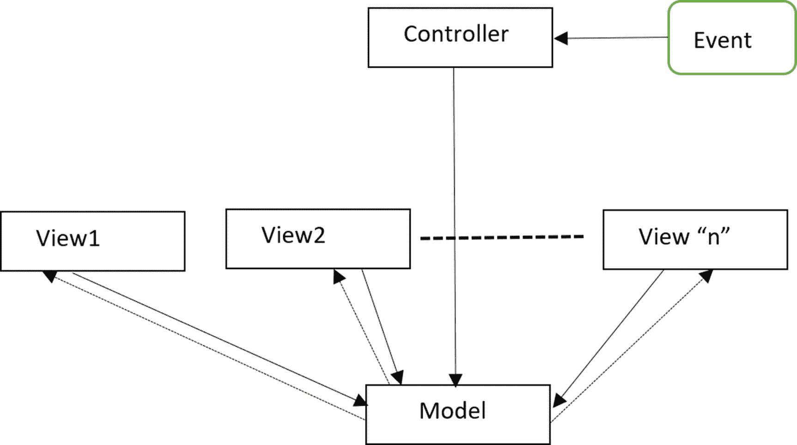
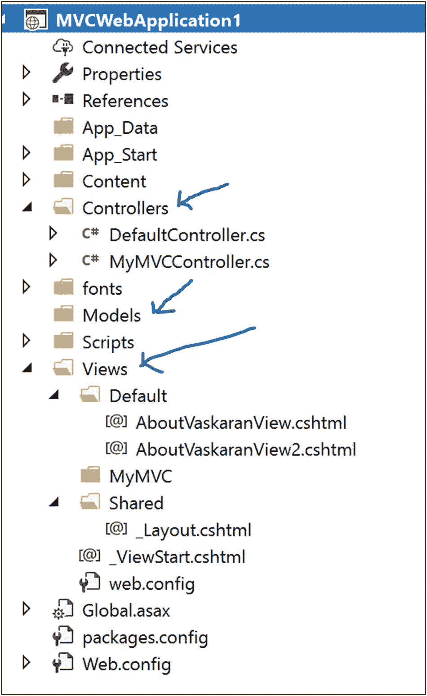
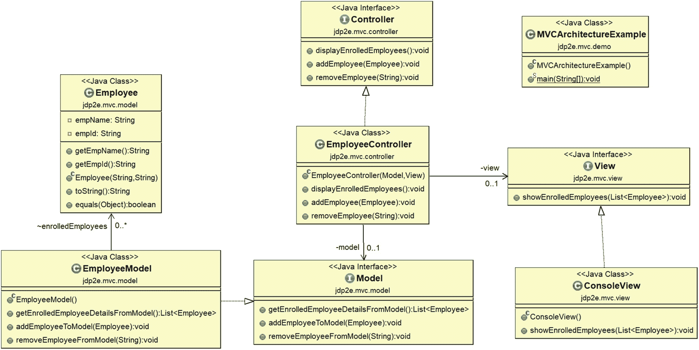
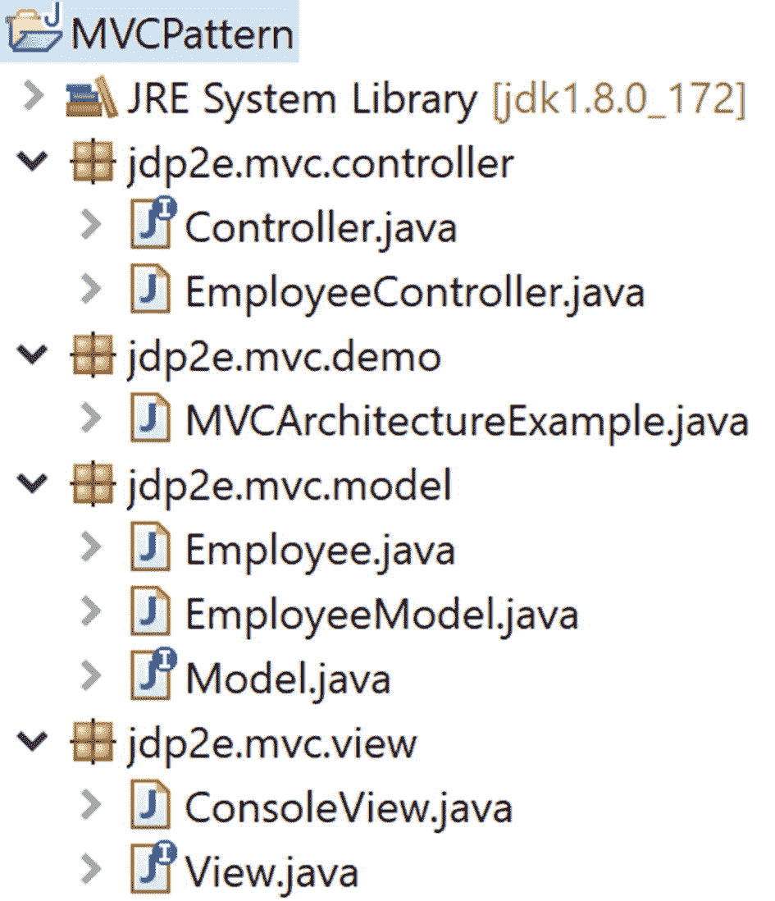
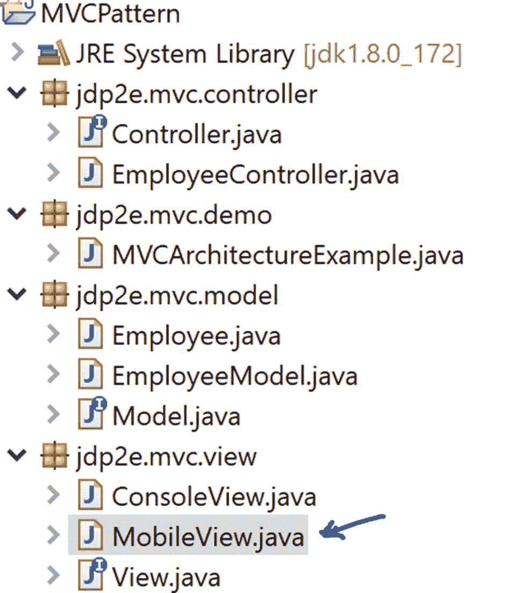

# 二十六、MVC 模式

模型-视图-控制器(MVC)是一种架构模式。

这种模式的使用在 web 应用程序中或我们开发强大的用户界面时很常见。但值得注意的是，Trygve Reenskaug 在 1979 年的一篇题为“Smalltalk-80TM 中的应用程序编程:如何使用模型-视图-控制器”的论文中首次描述了 MVC，这是在万维网时代之前。那时候还没有 web 应用的概念。但是现代的应用程序可以被看作是最初概念的一种适应。值得注意的是，一些开发人员认为这不是真正的设计模式，相反，他们更愿意称之为“MVC 架构”

在这里，您将用户界面逻辑从业务逻辑中分离出来，并以一种可以有效重用的方式分离主要组件。这种方法也促进了并行开发。MVC 最好的标题之一是“我们需要智能模型、瘦控制器和愚蠢的视图。”( [`http://wiki.c2.com/?ModelViewController`](http://wiki.c2.com/%253FModelViewController)

## 概念

从这个介绍中，很明显模式由三个主要组件组成:模型、视图和控制器。控制器放置在视图和模型之间，模型和视图只能通过控制器相互通信。在这里，您将数据显示的机制与数据操作的机制分开。图 [26-1](#Fig1) 显示了一个典型的 MVC 架构。



图 26-1

典型的 MVC 架构

### 需要记住的要点

以下是对该模式中关键组件的简要描述。

*   视图表示输出。它是表示层。把它想象成一个用户界面/图形用户界面。你可以用各种技术来设计它。例如，在. NET 应用程序中，您可以使用 HTML、CSS、WPF 等等，而对于 Java 应用程序，您可以使用 AWT、Swing、JSF、JavaFX 等等。

*   模型是应用程序的大脑。它管理数据和业务逻辑。它知道如何存储和管理(或操作)数据，以及如何处理来自控制器的请求。但是这个组件与视图组件是分离的。一个典型的例子是数据库、文件系统或类似的存储。它可以用 JavaBeans、Oracle、SQL Server、DB2、Hadoop、MySQL 等等来设计。

*   控制器是接受来自视图组件的用户输入并将请求传递给模型的中介。当它从模型得到响应时，它将数据传递给视图。可以用 C# 设计。NET、ASP.NET、VB.NET、核心 Java、JSP、servlets、PHP、Ruby、Python 等等。

这种架构在不同的应用中有不同的实现方式。其中一些如下:

*   您可以有多个视图。

*   视图可以将运行时值(例如，使用 JavaScript)传递给控制器。

*   您的控制器可以验证用户的输入。

*   您的控制器可以通过多种方式接收输入。例如，它可以通过 URL 从 web 请求中获取输入，或者您可以通过按下表单上的 Submit 按钮来传递输入。

*   在某些应用程序中，模型组件可以更新视图组件。

基本上，你需要使用这个模式来支持你自己的需求。图 [26-2](#Fig2) 、图 [26-3](#Fig3) 和图 [26-4](#Fig4) 展示了 MVC 架构的一些已知变体。

### 变体 1



图 26-2

典型的 MVC 框架

### 变体 2



图 26-3

一个多视图的 MVC 框架

### 变体 3



图 26-4

用观察者模式/基于事件的机制实现的 MVC 模式

我最喜欢的关于 MVC 的描述来自 Connelly Barnes，他说:“理解 MVC 的一个简单方法是:模型是数据，视图是屏幕上的窗口，控制器是两者之间的粘合剂。”( [`http://wiki.c2.com/?ModelViewController`](http://wiki.c2.com/%253FModelViewController)

## 真实世界的例子

让我们重温一下模板方法模式的真实例子。但是这一次你有不同的解释。我说过，在餐馆里，根据顾客的输入，厨师可以改变口味，做出最终的产品。顾客不直接向厨师点餐。顾客看到菜单卡(视图)，可能会咨询服务员，并下订单。服务员将订单交给厨师，厨师从餐厅的厨房收集所需的材料(类似于仓库/计算机数据库)。准备好后，服务员会把盘子端到顾客的桌子上。所以，你可以考虑把服务员/女招待的角色作为控制者，把厨师和他们的厨房作为模型(把准备食物的材料作为数据)。

## 计算机世界的例子

许多 web 编程框架使用 MVC 框架的概念。一些典型的例子包括 Django、Ruby on Rails、ASP.NET 等等。例如，一个典型的 ASP.NET MVC 项目的结构如图 [26-5](#Fig5) 所示。



图 26-5

ASP.NET 项目中典型的 MVC 结构

但是应该注意的是，不同的技术可以遵循不同的结构，因此，没有必要像这样获得具有严格命名约定的文件夹结构。在 Java 世界中，在 MVC 架构中，您可能会注意到使用 Java servlets 作为控制器，使用 JavaBeans 作为模型，而 JSP 创建不同的视图。

## 说明

大多数情况下，您希望将 MVC 的概念与能够为您提供内置支持并为您做大量基础工作的技术结合使用。在这种情况下，你可能需要学习新的术语。在 Java 应用程序中，您可能希望使用 Swing 或 JavaFX 等来获得更好的 GUI。

在本书中，我使用了一个控制台窗口来显示不同设计模式实现的输出。因此，让我们在即将到来的实现中继续使用控制台窗口作为视图，因为这里的重点是 MVC 结构，而不是新技术。

为了简单和符合我们的理论，我将即将到来的实现分成三个基本部分:模型、视图和控制器。当您查看 Package Explorer 视图时，您会看到创建了单独的包来完成这项任务。以下是一些要点。

*   在这个应用中，要求非常简单。有些员工需要在应用程序/系统中注册自己。最初，应用程序从三个不同的注册员工开始:Amit、Jon 和 Sam。在任何时候，您都应该能够在系统中看到注册的员工。

*   您可以在注册员工列表中添加新员工或删除员工。

*   在 Employee 类中添加了一个简单的检查，以确保不会在应用程序中重复添加雇员。

*   要从注册列表中删除一个雇员，您需要在客户机代码中传递雇员 ID，但是如果在注册列表中没有找到雇员 ID，应用程序将什么也不做。

现在检查一下实现，并考虑一下您的即时参考意见。

### 类图

图 [26-6](#Fig6) 为类图。为了强调核心架构，我省略了客户端代码依赖性。



图 26-6

类图

### 包资源管理器视图

图 [26-7](#Fig7) 显示了程序的高层结构。



图 26-7

包资源管理器视图

### 履行

下面是实现。

**//Employee.java**

```java
package jdp2e.mvc.model;

//The key "data" in this application
public class Employee
{
    private String empName;
    private String empId;
    public String getEmpName() {
        return empName;
    }
    public String getEmpId() {
        return empId;
    }
    public Employee(String empName, String empId)
    {
        this.empName=empName;
        this.empId=empId;
    }
    @Override
    public String toString()
    {
        return empName + "'s employee id is: "+ empId ;
    }
    @Override
    //To check uniqueness.
    public boolean equals(Object o) {
        if (this == o) return true;
        if (!(o instanceof Employee)) return false;

        Employee empObject = (Employee) o;

        if (!empName.equals(empObject.empName)) return false;
        //cannot use the following for an int
        if (!empId.equals(empObject.empId)) return false;
        return true;
    }
}

```

**//Model.java**

```java
package jdp2e.mvc.model;

import java.util.List;

//Model interface
public interface Model
{

    List<Employee> getEnrolledEmployeeDetailsFromModel();
    void addEmployeeToModel(Employee employeee);
    void removeEmployeeFromModel(String employeeId);
}

```

**//EmployeeModel.java**

```java
package jdp2e.mvc.model;

import java.util.ArrayList;
import java.util.List;
import java.util.ListIterator;

//EmployeeModel class

public class EmployeeModel implements Model
{
    List<Employee> enrolledEmployees;

    public EmployeeModel()
    {
        //Adding 3 employees at the beginning.
        enrolledEmployees = new ArrayList<Employee>();
        enrolledEmployees.add(new Employee("Amit","E1"));
        enrolledEmployees.add(new Employee("John","E2"));
        enrolledEmployees.add(new Employee("Sam","E3"));
    }

    public List<Employee> getEnrolledEmployeeDetailsFromModel()
    {
        return enrolledEmployees;
    }

    //Adding an employee to the model(student list)
    @Override
    public void addEmployeeToModel(Employee employee)
    {
        System.out.println("\nTrying to add an employee to the registered list.");
        if( !enrolledEmployees.contains(employee))
        {
            enrolledEmployees.add(employee);
            System.out.println(employee+" [added recently.]");
        }
        else
        {
            System.out.println(employee+" is already added in the system.");
        }
    }
    //Removing an employee from model(student list)
    @Override
    public void removeEmployeeFromModel(String employeeId)
    {
        boolean flag=false;
        ListIterator<Employee> employeeIterator=enrolledEmployees.listIterator();
        System.out.println("\nTrying to remove an employee from the registered list.");
        while(employeeIterator.hasNext())
        {
            Employee removableEmployee=((Employee)employeeIterator.next());
            if(removableEmployee.getEmpId().equals(employeeId))
            {
                //To avoid ConcurrentModificationException,try to
                //remember to invoke remove() on the iterator but not on
                //the list.
                employeeIterator.remove();
                System.out.println("Employee " + removableEmployee.getEmpName()+ " with id "+ employeeId+" is removed now.");
                flag=true;
            }

        }
        if(flag==false)
        {
            System.out.println("###Employee Id " + employeeId +" Not found.###");
        }

    }

}

```

**//View.java**

```java
package jdp2e.mvc.view;
import java.util.List;
import jdp2e.mvc.model.Employee;

public interface View
{
    void showEnrolledEmployees(List<Employee> enrolledEmployees);
}

```

**//ConsoleView.java**

```java
package jdp2e.mvc.view;

import java.util.List;
import jdp2e.mvc.model.Employee;

//ConsoleView class

public class ConsoleView implements View
{
    @Override
    public void showEnrolledEmployees(List<Employee> enrolledEmployees)
    {
        System.out.println("\n ***This is a console view of currently enrolled employees.*** ");
        for( Employee employee : enrolledEmployees)
        {
            System.out.println(employee);
        }
        System.out.println("---------------------");
    }
}

```

**//Controller.java**

```java
package jdp2e.mvc.controller;

import jdp2e.mvc.model.Employee;

//Controller
public interface Controller
{
    void displayEnrolledEmployees();
    void addEmployee(Employee employee);
    void removeEmployee(String employeeId);
}

//EmployeeController.java

package jdp2e.mvc.controller;

import java.util.List;

import jdp2e.mvc.model.*;
import jdp2e.mvc.view.*;

public class EmployeeController implements Controller
{
    private Model model;
    private View  view;

    public EmployeeController(Model model, View view)
    {
        this.model = model;
        this.view = view;
    }
    @Override
    public void displayEnrolledEmployees()
    {
        //Get data from Model
        List<Employee> enrolledEmployees = model.getEnrolledEmployeeDetailsFromModel();
        //Connect to View
        view.showEnrolledEmployees(enrolledEmployees);
    }

    //Sending a request to model to add an employee to the list.
    @Override
    public void addEmployee(Employee employee)
    {
        model.addEmployeeToModel(employee);
    }
    //Sending a request to model to remove an employee from the list.
    @Override
    public void removeEmployee(String employeeId)
    {
        model.removeEmployeeFromModel(employeeId);
    }
}

```

**//客户端代码**

**//mvcarchitectureexample . Java**

```java
package jdp2e.mvc.demo;
import jdp2e.mvc.model.*;
import jdp2e.mvc.view.*;
import jdp2e.mvc.controller.*;

public class MVCArchitectureExample {

    public static void main(String[] args) {
        System.out.println("***MVC architecture Demo***\n");
        //Model
        Model model  = new EmployeeModel();

        //View
        View view = new ConsoleView();

        //Controller
        Controller controller = new EmployeeController(model, view);
        controller.displayEnrolledEmployees();

        //Add an employee
        controller.addEmployee(new Employee("Kevin","E4"));
        controller.displayEnrolledEmployees();

        //Remove an existing employee using the employee id.
        controller.removeEmployee("E2");
        controller.displayEnrolledEmployees();

        //Cannot remove an  employee who does not belong to the list.
        controller.removeEmployee("E5");
        controller.displayEnrolledEmployees();

        //Avoiding duplicate entry
        controller.addEmployee(new Employee("Kevin","E4"));
    }
}

```

### 输出

这是输出。

```java
***MVC architecture Demo***

 ***This is a console

view of currently enrolled employees.***
Amit's employee id is: E1
John's employee id is: E2
Sam's employee id is: E3
---------------------

Trying to add an employee to the registered list.
Kevin's employee id is: E4 [added recently.]

 ***This is a console view of currently enrolled employees.***
Amit's employee id is: E1
John's employee id is: E2
Sam's employee id is: E3
Kevin's employee id is: E4
---------------------

Trying to remove an employee from the registered list.
Employee John with id E2 is removed now.

 ***This is a console view of currently enrolled employees.***
Amit's employee id is: E1
Sam's employee id is: E3
Kevin's employee id is: E4
---------------------

Trying to remove an employee from the registered list.
###Employee Id E5 Not found.###

 ***This is a console view of currently enrolled employees.***
Amit's employee id is: E1
Sam's employee id is: E3
Kevin's employee id is: E4
---------------------

Trying to add an employee to the registered list.
Kevin's employee id is: E4 is already added in the system.

```

## 问答环节

1.  假设你有一名程序员、一名数据库管理员和一名图形设计师。你能猜出他们在 MVC 架构中的角色吗？

    图形设计师设计视图层。数据库管理员制作模型，程序员制作智能控制器。

2.  **使用 MVC 设计模式的关键** **优势** **是什么？**
    *   “高内聚、低耦合”是 MVC 的口号。在这种模式中，模型和视图之间的紧密耦合很容易消除。因此，它可以很容易地扩展和重用。

    *   它支持并行开发。

    *   您还可以提供多个运行时视图。

3.  **与 MVC 模式相关的** **挑战** **有哪些？**
    *   需要高技能人员。

    *   它可能不适合微小的应用。

    *   开发者需要熟悉多种语言/平台/技术。

    *   多部分一致性是一个大问题，因为您将整个项目分成三个不同的部分。

4.  在这个实现中，你能提供多个视图吗？

    Sure. Let’s add a new view called “Mobile view” in the application. Let’s add this class inside the jdp2e.mvc.view package as follows.

    ```java
    package jdp2e.mvc.view;
    import java.util.List;
    import jdp2e.mvc.model.Employee;

    //This class is added to discuss a question in "Q&A Session"

    //MobileView class

    public class MobileView implements View
    {
        @Override
        public void showEnrolledEmployees(List<Employee> enrolledEmployees)
        {
            System.out.println("\n ***This is a mobile view of currently enrolled employees.*** ");
            System.out.println("Employee Id"+ "\t"+ " Employee Name");
            System.out.println("______________________");
            for( Employee employee : enrolledEmployees)
            {
                System.out.println(employee.getEmpId() + "\t"+ employee.getEmpName());
            }
            System.out.println("---------------------");
        }
    }

    ```

修改后的包浏览器视图类似于图 [26-8](#Fig8) 。



图 26-8

已修改的包资源管理器视图

将以下代码段添加到客户端代码的末尾。

```java
//This segment is addeed to discuss a question in "Q&A Session"
view = new MobileView();
controller = new EmployeeController(model, view);
controller.displayEnrolledEmployees();

```

现在，如果您运行应用程序，您会看到修改后的输出。

### 修改输出

下面是修改后的输出。输出的最后一部分显示了新更改的效果。这些变化用粗体显示。

```java
***MVC architecture Demo***

 ***This is a console view of currently enrolled employees.***
Amit's employee id is: E1
John's employee id is: E2
Sam's employee id is: E3
---------------------

Trying to add an employee to the registered list.
Kevin's employee id is: E4 [added recently.]

 ***This is a console view of currently enrolled employees.***
Amit's employee id is: E1
John's employee id is: E2
Sam's employee id is: E3
Kevin's employee id is: E4
---------------------

Trying to remove an employee from the registered list.
Employee John with id E2 is removed now.

 ***This is a console view of currently enrolled employees.***
Amit's employee id is: E1
Sam's employee id is: E3
Kevin's employee id is: E4
---------------------

Trying to remove an employee from the registered list.
###Employee Id E5 Not found.###

 ***This is a console view of currently enrolled employees.***
Amit's employee id is: E1
Sam's employee id is: E3
Kevin's employee id is: E4
---------------------

Trying to add an employee to the registered list.
Kevin's employee id is: E4 is already added in the system.

 ***This is a mobile view of currently enrolled employees.***

Employee Id   Employee Name

______________________

E1    Amit

E3    Sam

E4    Kevin

---------------------

```