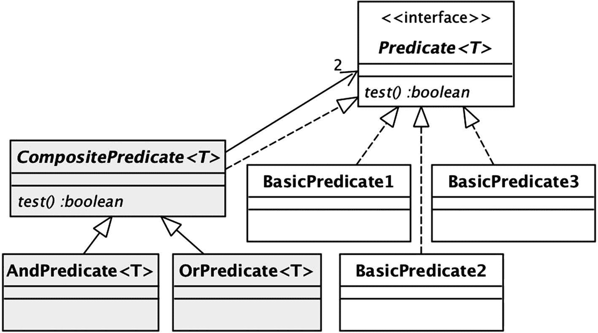
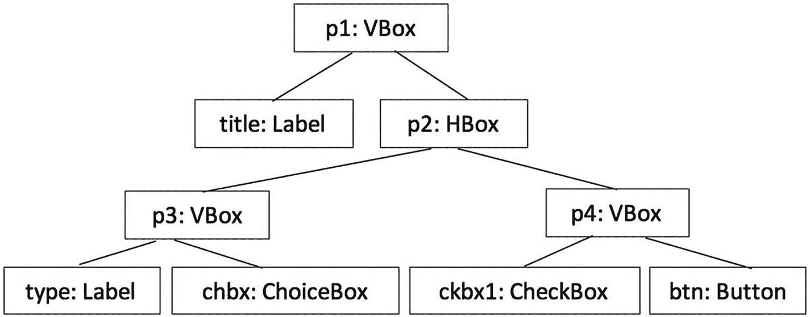
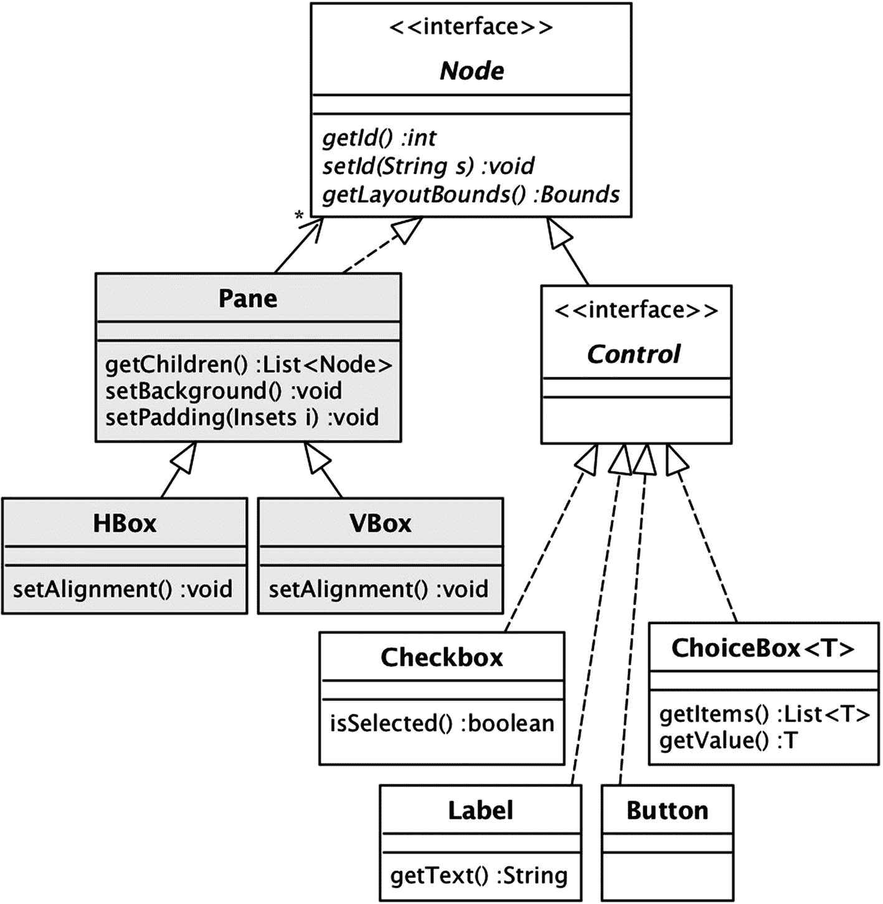
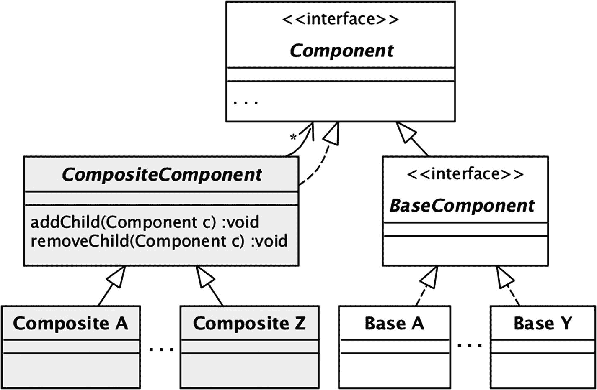

# 九、组合

第 [8](08.html) 章研究了 decoratorss，decorator 是实现与它们包装的对象相同的接口的包装器。本章考察了*组合*物体。组合对象类似于装饰器，只是它包装了*多个*对象，每个对象都实现了与自身相同的接口。这个看似很小的区别对组合的结构和使用方式有很大的影响。组合对象对应于树，组合方法倾向于涉及树遍历。

这一章展示了三个组合的例子:谓词、图形用户界面(GUI)和菜谱。这些例子共享一个被称为*组合模式*的公共类设计。它们也有一些功能上的差异，说明了设计师面临的不同选择。

## 组合谓词

一个*谓词*是一个计算结果为真或假的数学表达式。给定两个谓词，您可以通过对它们应用操作符`and`或`or`来创建另一个更大的谓词。这个较大的谓词被称为一个*组合*，两个较小的谓词是它的*组件*。您可以继续这个过程，构建越来越大的组合谓词。非组合谓词被称为基本谓词。

例如，清单 [9-1](#PC1) 显示了一个由三个基本谓词组成的组合谓词。如果`n`小于 20 并且能被 2 或 3 整除，则返回 true。

```java
n<20 and (n%2=0 or n%3=0)

Listing 9-1A Composite Predicate

```

组合谓词可以表示为一棵树，其内部节点是操作符{ `and`，`or` }，其叶子是基本谓词。图 [9-1](#Fig1) 描绘了清单 [9-1](#PC1) 的谓词树。


图 9-1

列表 [9-1](#PC1) 的谓词树

Java 谓词是实现接口`Predicate`的对象，如第 [6 章](06.html)中所讨论的。基本谓词通常是通过 lambda 表达式创建的。例如，清单 [9-2](#PC2) 给出了 Java 语句来实现清单 [9-1](#PC1) 中的三个基本谓词。

```java
Predicate<Integer> pred1 = n -> n < 20;
Predicate<Integer> pred2 = n -> n%2 == 0;
Predicate<Integer> pred3 = n -> n%3 == 0;

Listing 9-2Basic Predicates in Java

```

在 Java 中支持组合谓词的一种方法是为每个操作符创建一个类。将这些类称为`AndPredicate`和`OrPredicate`。每个类包装两个组件谓词并实现`Predicate`。如果两个组件都返回 true，则`AndPredicate`的`test`方法返回 true，如果至少一个组件返回 true，则`OrPredicate`的`test`方法返回 true。为了方便编码，我还将创建类`CompositePredicate`作为`AndPredicate`和`OrPredicate`的公共超类，管理它们的包装对象。清单 [9-3](#PC3) 给出了`CompositePredicate`的代码，清单 [9-4](#PC4) 给出了`AndPredicate`的代码。`OrPredicate`的代码类似，在此省略。

```java
public class AndPredicate<T> extends CompositePredicate<T> {
   public AndPredicate(Predicate<T> p1, Predicate<T> p2) {
      super(p1, p2);
   }

   public boolean test(T t) {
      return p1.test(t) && p2.test(t);
   }
}

Listing 9-4The AndPredicate Class

```

```java
public abstract class CompositePredicate<T>
                      implements Predicate<T> {
   protected Predicate<T> p1, p2;

   protected CompositePredicate(Predicate<T> p1,
                                Predicate<T> p2) {
      this.p1 = p1;
      this.p2 = p2;
   }

   public abstract boolean test(T t);
}

Listing 9-3The CompositePredicate Class

```

图 [9-2](#Fig2) 包含了一个类图，显示了这些`Predicate`类之间的关系。三个“BasicPredicate”类对应于为清单 [9-2](#PC2) 中的`pred1`、`pred2`和`pred3`创建的匿名类。



图 9-2

谓词的类图

类图看起来非常像装饰模式。不同之处在于包装类`CompositePredicate`包装了两个对象，而不是一个。为了突出这一区别，依赖箭头被标注了可选的基数标签“2”

清单 [9-5](#PC5) 中的类`CompositePredicateTest`说明了组合谓词在 Java 中的使用。这段代码首先创建基本谓词`pred1`、`pred2`和`pred3`，如清单 [9-2](#PC2) 所示。然后，它以三种不同的方式实现清单 [9-1](#PC1) 的组合谓词。

```java
public class CompositePredicateTest {
   public static void main(String[] args) {
      Predicate<Integer> pred1 = n -> n < 20;
      Predicate<Integer> pred2 = n -> n%2 == 0;
      Predicate<Integer> pred3 = n -> n%3 == 0;

      // First: use AndPredicate and OrPredicate objects
      Predicate<Integer> pred4 =
                     new OrPredicate<Integer>(pred2, pred3);
      Predicate<Integer> pred5 =
                     new AndPredicate<Integer>(pred1, pred4);
      printUsing(pred5);

      // Second: use the 'or' and 'and' methods separately
      Predicate<Integer> pred6 = pred2.or(pred3);
      Predicate<Integer> pred7 = pred1.and(pred6);
      printUsing(pred7);

      // Third: compose the 'or' and 'and' methods
      Predicate<Integer> pred8 = pred1.and(pred2.or(pred3));
      printUsing(pred8);
   }

   private static void printUsing(Predicate<Integer> p) {
      for (int i=1; i<100; i++)
         if (p.test(i))
            System.out.print(i + " ");
      System.out.println();
   }
}

Listing 9-5The CompositePredicateTest Class

```

第一种方式使用了`AndPredicate`和`OrPredicate`类。谓语`pred4`是一个`OrPredicate`宾语，谓语`pred5`是一个`AndPredicate`宾语。图 [9-3](#Fig3) 描绘了内存中的这五个`Predicate`对象。该图类似于图 [8-3](08.html#Fig3) 的内存图，每个对象由一个矩形表示，其全局变量的值显示在其矩形内。注意对象引用如何形成一棵与图 [9-1](#Fig1) 的谓词树完全对应的树。


图 9-3

组合谓词的记忆表征

在创建了谓词`pred5`之后，清单 [9-5](#PC5) 的代码将`pred5`传递给它的`printUsing`方法，后者调用谓词的`test`方法来处理从 1 到 100 的整数。图 [9-4](#Fig4) 描绘了跟踪表达式`pred5.test(9)`执行的序列图。步骤 2 调用`pred5`的第一个组件`pred1`的`test`方法，该方法返回 true。Step 4 然后在它的第二个组件`pred4`上调用`test`。为了确定它的响应，`pred4`在它的两个组件上调用`test`。组件`pred2`返回假，而`pred3`返回真；因此`pred4`可以返回 true。由于`pred5`的两个组件现在都返回 true，因此`pred5`返回 true。


图 9-4

表达式 pred5.test(9)的序列图

注意对`test(9)`的调用是如何从谓词树的根向下传递到它的叶子的。事实上，这个方法调用序列对应于树的后序遍历。

类`AndPredicate`和`OrPredicate`不是 Java 库的一部分。相反，`Predicate`接口有默认的方法`and`和`or`，这使得创建组合谓词而不必自己创建组合对象成为可能。

清单 [9-5](#PC5) 的第二和第三部分说明了这些方法的使用。如果`pred2`或`pred3`为真，变量`pred6`返回真，并且在功能上等同于`pred4`。同样，变量`pred7`在功能上等同于`pred5`。对`and`和`or`方法的调用也可以被组合，如变量`pred8`所示。

清单 [9-6](#PC6) 展示了如何实现`and`和`or`方法。`and`方法创建并返回一个`AndPredicate`对象，该对象包装了两个对象:当前对象和传递给该方法的对象。`or`方法的实现也类似。

```java
public interface Predicate<T> {
   boolean test(T t);

   default Predicate<T> and(Predicate<T> other) {
      return new AndPredicate(this, other);
   }

   default Predicate<T> or(Predicate<T> other) {
      return new OrPredicate(this, other);
   }
}

Listing 9-6A Reasonable Implementation of Predicate

```

这些方法的实际 Java 库实现与清单 [9-6](#PC6) 略有不同，出现在清单 [9-7](#PC7) 中。lambda 表达式定义了等价于`AndPredicate`和`OrPredicate`的匿名内部类。这段代码非常优雅，因为它不再需要显式的`AndPredicate`和`OrPredicate`类。

```java
public interface Predicate<T> {
   boolean test(T t);

   default Predicate<T> and(Predicate<T> other) {
      return t -> test(t) && other.test(t);
   }

   default Predicate<T> or(Predicate<T> other) {
      return t -> test(t) || other.test(t);
   }
}

Listing 9-7The Actual Implementation of Predicate

```

## JavaFX 中的组合对象

对于组合对象的第二个例子，考虑一个用于构建 GUI 应用程序的库。当您创建一个应用程序窗口时，您通常将其内容组织为一个组合对象。例如，图 [9-5](#Fig5) 描述了我使用 JavaFX 库创建的一个窗口。


图 9-5

JavaFX 窗口

在 JavaFX 中，窗口的内容由*节点*构成。JavaFX 库有实现几种类型节点的类。这个示例窗口使用两种类型的节点:*控件*和*窗格*。

一个*控件*是一个可以被用户操作的节点。JavaFX 中的所有控件都扩展了抽象类`Control`。示例窗口中的控件属于类别`Label`、`ChoiceBox`、`CheckBox`和`Button`。

一个*窗格*是一个可以包含其他节点的节点，称为它的*子节点*。每个窗格负责确定其子节点在屏幕上的位置。这被称为窗格的*布局策略*。

JavaFX 库有几个 pane 类，每个类都有自己的布局策略。它们都扩展了类`Pane`。示例窗口使用了其中的两个:`HBox`和`VBox`。一个`HBox`窗格水平布局其子窗格。一个`VBox`窗格垂直排列其子窗格。

图 [9-5](#Fig5) 的窗口有九个节点:五个控件和四个窗格。图 [9-6](#Fig6) 描绘了它们的布局。


图 9-6

图 [9-5](#Fig5) 的节点

描述窗口结构的另一种方法是使用树，其内部节点是窗格，其叶节点是控件。这棵树被称为窗口的*节点层次*。图 [9-7](#Fig7) 描绘了图 [9-6](#Fig6) 对应的节点层次。这些节点上的标签对应于 JavaFX 类`AccountCreationWindow`中的变量名，Java FX 类是实现窗口的代码。



图 9-7

图 [9-6](#Fig6) 的节点层次结构

清单 [9-8](#PC8) 给出了`AccountCreationWindow`的代码。由于这段代码是您对 JavaFX 程序的第一次介绍，因此值得详细研究。JavaFX 程序扩展了库类`Application`并遵循模板模式。模板类是`Application`，有公共方法`launch`和抽象策略方法`start`。实现`start`的策略类是`AccountCreationWindow`。

```java
public class AccountCreationWindow extends Application {
   public void start(Stage stage) {
      Pane root = createNodeHierarchy();
      stage.setScene(new Scene(root));
      stage.setTitle("Bank Account Demo");
      stage.show();
   }

   public static void main(String[] args) {
      Application.launch(args);
   }

   private Pane createNodeHierarchy() {
      // see Listing 9-9
   }
}

Listing 9-8The AccountCreationWindow Class

```

这种技术非常类似于`Thread`使用模板模式的方式(你可能还记得第 [3](03.html) 章的结尾)。不同之处在于，与`Thread`不同，客户端不能通过简单地调用`Application`构造器来创建`Application`对象。相反，静态工厂方法`launch`负责创建`Application`对象并在一个新线程中运行它。使用工厂方法的优点是，它对客户端隐藏了应用程序线程，从而防止线程被不正当地使用。

`launch`方法还创建了一个`Stage`对象，它管理窗口的框架。例如，`Stage`方法`setTitle`指定了要在窗口标题栏中显示的字符串。然后，`launch`方法调用应用程序的`start`方法，将`Stage`对象作为参数传递。

列出 [9-8](#PC8) 的`start`方法调用`createNodeHierarchy`来创建节点层次结构。它将该层次结构的根传递给一个新的`Scene`对象，然后通过`setScene`方法将该对象发送到舞台。

`AccountCreationWindow`中的大部分代码致力于创建节点层次结构。清单 [9-9](#PC9) 中显示了`createNodeHierarchy`方法的代码。

```java
private Pane createNodeHierarchy() {
   VBox p3 = new VBox(8);
   p3.setAlignment(Pos.CENTER);
   p3.setPadding(new Insets(10));
   p3.setBackground(
         new Background(
               new BackgroundFill(Color.SKYBLUE,
                      new CornerRadii(20), new Insets(0))));
   Label type = new Label("Select Account Type:");
   ChoiceBox<String> chbx  = new ChoiceBox<>();
   chbx.getItems().addAll("Savings", "Checking",
                          "Interest Checking");
   p3.getChildren().addAll(type, chbx);

   VBox p4 = new VBox(8);
   p4.setAlignment(Pos.CENTER);
   p4.setPadding(new Insets(10));
   CheckBox ckbx = new CheckBox("foreign owned?");
   Button btn  = new Button("CREATE ACCT");
   p4.getChildren().addAll(ckbx, btn);

   HBox p2 = new HBox(8);
   p2.setAlignment(Pos.CENTER);
   p2.setPadding(new Insets(10));
   p2.getChildren().addAll(p3, p4);

   VBox p1 = new VBox(8);
   p1.setAlignment(Pos.CENTER);
   p1.setPadding(new Insets(10));
   Label title = new Label("Create a New Bank Account");
   double size = title.getFont().getSize();
   title.setFont(new Font(size*2));
   title.setTextFill(Color.GREEN);
   p1.getChildren().addAll(title, p2);

   btn.setOnAction(event -> {
      String foreign = ckbx.isSelected() ? "Foreign " : "";
      String acct = chbx.getValue();
      title.setText(foreign + acct + " Account Created");
   });
   return p1;
}

Listing 9-9The createNodeHierarchy Method

```

这些控件的行为如下。一个`Label`对象显示一个字符串。字符串的初始值在构造器中指定，但是它的值可以通过调用`setText`方法随时更改。一个`CheckBox`对象显示一个复选框和一个描述性字符串。如果该框当前被选中，它的`isSelected`方法返回 true，否则返回 false。一个`ChoiceBox`对象允许用户从对象列表中选择。`getItems`方法返回列表，而`getValue`方法返回选择的对象。

一个`Button`对象有一个标签，并在被触发时执行一个动作。它的构造器指定标签。方法`setOnAction`指定了它的动作。`setOnAction`的参数是一个`EventHandler`对象。第 10 章将会更详细地讨论事件处理程序。现在，只要知道这个事件处理程序是由 lambda 表达式指定的就足够了，该表达式的主体包含单击按钮时要执行的代码。

清单 [9-9](#PC9) 中的 lambda 表达式调用复选框的`isSelected`和选择框的`getValue`方法来获取新账户的类型及其外国所有权状态。然后，它构造一条描述这些选择的消息，并将标题标签的文本设置为该消息。特别是，如果用户选择类型“Checking”，检查“is foreign”，并单击按钮，标题标签将显示“Foreign Checking Account Created”

您可能会感到失望，点击按钮并没有真正创建一个帐户。问题是，如果没有对`Bank`对象的引用，窗口就不能创建帐户。第 [11 章](11.html)将讨论将银行信息连接到窗口的正确方式，所以你需要等到那时。

窗格的行为如下。每个`Pane`对象都有方法`getChildren`，该方法返回其子节点的列表。客户可以随时修改列表的内容。它的`setPadding`方法指定窗格周围边距中的像素数。

窗格的`setBackground`方法指定其背景。`AccountCreationWindow`的窗格`p3`演示了它的用法。`BackgroundFill`对象指定纯色背景。(另一种可能是使用一个`BackgroundImage`对象，它指定一个图像作为背景。(`BackgroundFill`)的三个参数指定颜色、角的圆度和背景周围的边距大小。

为`VBox`和`HBox`显示的构造器接受一个参数，即它们的子元素之间的像素数。他们的`setAlignment`方法指定了子元素应该如何对齐。因为不是所有的`Pane`子类都支持这个方法，所以它必须在`VBox`和`HBox`中被不透明地定义。

图 [9-8](#Fig8) 显示了本节描述的 JavaFX `Node`类的类图。这个图故意省略了许多 JavaFX 类，这使得它看起来比实际简单得多。这种简单性使得理解 JavaFX 的设计原则更加容易。对 JavaFX 节点类的全面讨论超出了本书的范围。



图 9-8

节点类层次结构

注意这个类图与图 [9-2](#Fig2) 的`Predicate`类图是多么的相似。基类是`Control`的子类。包装类是`Pane`，它的子类是递归类。从`Pane`到`Node`的依赖箭头带有标签`*`，表示一个窗格可以包装任意数量的节点。

`Node`接口声明了很多方法；图 9-8 的类图只显示了其中的三个。每个节点都有一个可以用作其 id 的字符串。默认情况下，id 是空字符串。方法`setId`设置 id，方法`getId`返回 id。

每个节点还需要知道它的大小和位置。方法`getLayoutBounds`返回类型`Bounds`的值。一个`Bounds`对象包含节点的高度和宽度，以及它左上角的坐标。

控件和窗格计算大小的方式不同。控件的大小由其属性决定。例如，标签的大小取决于要显示的文本及其字体的大小和类型。窗格的大小基于其子窗格的大小加上由布局算法确定的任何额外空间(如子窗格之间的空间)。

`getLayoutBounds`方法可以作为节点层次结构的后序遍历来实现。根窗格的大小取决于其子窗格的大小，而子窗格的大小又取决于其子窗格的大小，依此类推，直到到达`Control`对象。

为了说明`getLayoutBounds`方法，考虑一下类`PrintNodeInformation`。它的代码出现在清单 [9-10](#PC10) 中。

```java
public class PrintNodeInformation extends Application {
   private Label label;
   private ChoiceBox<String> chbx;
   private Button btn;
   private Pane p1, p2;

   public void start(Stage stage) {
      createNodeHierarchy();
      stage.setScene(new Scene(p1));
      stage.setTitle("Bank Account Demo");
      stage.show();

      System.out.println("NODE\tWID HT");
      printNodeSize(label);
      printNodeSize(chbx);
      printNodeSize(p2);
      printNodeSize(btn);
      printNodeSize(p1);
   }

   public static void main(String[] args) {
      Application.launch(args);
   }

   private void printNodeSize(Node n) {
      Bounds b = n.getLayoutBounds();
      int w = (int) b.getWidth();
      int h = (int) b.getHeight();
      System.out.println(n.getId() + "\t" + w + " " + h );
   }

   private void createNodeHierarchy() {
      p2 = new VBox(10);
      p2.setId("p2");
      label = new Label("Select Account Type:");
      label.setId("label");
      chbx = new ChoiceBox<>();
      chbx.setId("chbox");
      chbx.getItems().addAll("Savings", "Checking",
                             "Interest Checking");
      p2.getChildren().addAll(label, chbx);

      p1 = new HBox(10);
      p1.setId("p1");
      btn = new Button("CREATE ACCT");
      btn.setId("button");
      p1.setPadding(new Insets(10));
      p1.getChildren().addAll(p2, btn);
   }
}

Listing 9-10The Class PrintNodeInformation

```

这段代码是`AccountCreationWindow`的精简版，只包含两个窗格和三个控件。这将创建如图 [9-9](#Fig9) 所示的窗口。


图 9-9

由 PrintNodeInformation 创建的窗口

`start`方法为窗口中的每个节点调用方法`printNodeSize`。`printNodeSize`方法根据`getLayoutBounds`返回的值打印给定节点的 id、高度和宽度。程序的输出如清单 [9-11](#PC11) 所示。

```java
NODE    WID HT
label   132 17
chbox   149 27
p2      149 54
button  108 27
p1      287 74

Listing 9-11The Output of PrintNodeInformation

```

让我们来理解这个输出。首先考虑窗格`p2`及其子节点`label`和`chbox`。这些控件计算自己的大小。程序输出断言`chbox`比`label`高一点，宽一点，截图证明了这一点。窗格`p2`是一个`VBox`，这意味着它的宽度应该与其最宽的子窗格相同，在本例中是`chbox`。`p2`的高度是其子元素的高度加上 10 个像素的总和，以说明它们之间的间距。这些值由程序输出验证。

现在考虑窗格`p1`及其子节点`p2`和`btn`。窗格`p1`的四边都有 10 像素的边距。因此，它的高度和宽度将比为其子级计算的值多 20 个像素。窗格`p1`是一个`HBox`，所以它的高度将是其子级的最大高度(在本例中是`p2`的高度)加上 20 个像素的边距。`p1`的宽度是其子元素的宽度加上 10 个像素的间距加上 20 个像素的边距。程序输出也验证了这些值。

## 组合模式

到目前为止，您已经看到了组合对象的两个例子:Java 谓词和 JavaFX 节点。尽管这些对象来自完全不同的领域，但它们的类图——如图 9-2 和图 9-8 所示——非常相似。这种相似性被称为*组合模式*。

组合模式表达了创建树形结构对象的首选方式。其类图如图 [9-10](#Fig10) 所示。树由类型为`Component`的对象组成。这些组件或者是类型`CompositeComponent`或者是类型`BaseComponent`。一个`BaseComponent`对象没有子对象，它将是树的一片叶子。一个`CompositeComponent`对象可以有任意数量的子对象(因此它的依赖箭头上有一个“`*`”标签),并且位于树的内部。



图 9-10

组合模式

`Component`接口指定了所有组件将拥有的方法；图中没有显示这些方法。`CompositeComponent`是一个抽象类，包含修改组合对象的子对象列表的方法。

组合模式的类图类似于装饰模式的类图。它们唯一的区别是装饰类只包装一个对象，而组合类可以包装多个对象。因此，装饰器形成了一条链，组合者形成了一棵树。

这种差异对装饰器和组合的使用方式有着深远的影响。装饰链有一个端点，它被视为链的主要对象。链上剩余的对象是“装饰器”,它们增强了这个主要对象的行为。另一方面，组合树有多个叶子，没有一个是主要的。相反，它的主要对象是树根。根把它的孩子当作“助手”，依靠他们来帮助计算它的方法的答案。这就是为什么组合方法经常被实现为树遍历。

图 [9-10](#Fig10) 中的类`CompositeComponent`包含两种管理组合对象子对象的方法。这个设计是许多可能的设计之一。例如，JavaFX `Pane`类只有一个方法`getChildren`来管理其子类。

此外，`Predicate`层次没有子管理方法。当一个组合的`Predicate`对象被创建时，它的子对象由构造器分配，并且没有办法在以后改变这些子对象。这样的设计叫做*静*。具有添加和移除子元素方法的组合设计被称为*动态*。

动态组合的设计者可以决定将子管理方法放在组合接口或抽象包装类中。图 [9-8](#Fig8) 和 [9-10](#Fig10) 中显示的选择是将方法放在包装类中。这个决定导致方法不透明。例如，考虑 JavaFX 中的`getChildren`方法。这个方法在`Pane`中定义，这意味着它不能被`Node`类型的变量调用。注意清单 [9-9](#PC9) 中的变量`p1`、`p2`、`p3`和`p4`属于类`VBox`和`HBox`，而不是节点。

替代设计是将修改方法移到`Component`界面。这种设计实现了透明性，但是以安全为代价。有了这样的设计，客户端可以向基本对象添加子对象，即使这样做没有合法的意义。

这种设计偶尔会被采用，但通常是作为最后的手段。Java Swing 库就是这样一个例子，它是 JavaFX 的前身。为了支持遗留软件，Swing 中的控件类被指定为`Container`的子类，它是定义`add`方法的类。因此，下面的代码是合法的 Java:

```java
   JButton b1 = new JButton("push me");
   JButton b2 = new JButton("where am I?");
   b1.add(b2);

```

`add`方法将按钮`b2`放在`b1`的孩子列表中。但是由于`b1`(无可非议地)忽略了这个列表，`b2`将永远不会被显示。这种错误可能很难发现。

## 烹饪书的例子

对于组合模式的第三个例子，考虑编写一个程序来管理食谱中的食谱。食谱由一份配料清单和一些说明组成。配料可以是“基本食物”，如胡萝卜、苹果或牛奶；或者，它可能是另一个配方的结果。图 [9-11](#Fig11) 显示了一个示例配方。


图 9-11

一个示例配方

首要任务是设计食谱类。因为一个食谱可以包括其他食谱以及基本食物，所以指出了组合模式。图 [9-12](#Fig12) 给出了合理的类图。它包含一个基本食物类和一个食谱类。这两个类都实现了`FoodItem`接口。`Recipe`类还依赖于`FoodItem`，后者表示它的成分列表。


图 9-12

食谱类图

清单 [9-12](#PC13) 中出现了`FoodItem`界面。它声明了`BasicFood`和`Recipe`必须实现的三个抽象方法。前两个方法表示食品项目的属性:方法`name`返回项目的名称，如果食品不含动物产品，方法`isVegan`返回 true。每一种基本食物都有一个明确的标志，表明它是否是素食主义者；如果一个食谱的所有成分都是纯素的，那么它就是纯素的。

```java
public interface FoodItem extends Iterable<FoodItem> {
   String name();
   boolean isVegan();
   Iterator<FoodItem> childIterator();

   default Iterator<FoodItem> iterator() {
      return new FoodIterator(this);
   }
}

Listing 9-12The FoodItem Interface

```

`FoodItem`的最后两种方法使客户能够检查食品的成分。`childIterator`方法返回一个迭代器，其中包含给定食物项目的子项目。如果项目是一个食谱，那么迭代器包含它的成分；如果项目是一个基本的食物，那么迭代器将是空的。`iterator`方法返回一个迭代器，该迭代器执行以给定对象为根的树的完整遍历。根据类`FoodIterator`，方法`iterator`被实现为接口的默认方法。该类将在下一节中讨论。

清单 [9-13](#PC14) 给出了`BasicFood`的代码。食物的名称和它的素食标志被传递给它的构造器，而`name`和`isVegan`方法返回这些值。`childIterator`方法返回一个空迭代器，因为基本食物没有子代。

```java
public class BasicFood implements FoodItem {
   private String name;
   private boolean isvegan;

   public BasicFood(String name, boolean isvegan) {
      this.name = name;
      this.isvegan = isvegan;
   }

   public String name() {
      return name;
   }

   public boolean isVegan() {
      return isvegan;
   }

   public Iterator<FoodItem> childIterator() {
      return Collections.emptyIterator();
   }

   public String toString() {
      String veg = isvegan ? " (vegan)" : "";
      return name + veg;
   }
}

Listing 9-13The BasicFood Class

```

清单 [9-14](#PC15) 给出了`Recipe`的代码。一个`Recipe`对象是一个组合对象，它的子对象是菜谱中使用的配料。成分保存在地图中。贴图的关键字是`FoodItem`对象，它的值是相关的数量。方法`addIngredient`将指定的配料添加到地图中。我选择将这种方法放在`Recipe`(而不是`FoodItem`)中，因为比起透明，我更喜欢安全。`isVegan`方法通过检查食谱的成分来计算它的值。如果它发现一种非素食的成分，那么它返回 false 否则返回 true。注意递归是如何使这个方法在食谱的成分层次结构中执行树遍历的。最后，`childIterator`方法返回与映射键相关联的迭代器。

```java
public class Recipe implements FoodItem {
   private String name;
   private Map<FoodItem,Integer> ingredients = new HashMap<>();
   private String directions;

   public Recipe(String name, String directions) {
      this.name = name;
      this.directions = directions;
   }

   public void addIngredient(FoodItem item, int qty) {
      ingredients.put(item, qty);
   }

   public String name() {
      return name;
   }

   public boolean isVegan() {
      Iterator<FoodItem> iter = childIterator();
      while (iter.hasNext())
         if (!iter.next().isVegan())
            return false;
      return true;
   }

   public Iterator<FoodItem> childIterator() {
      return ingredients.keySet().iterator();
   }

   public int getQuantity(FoodItem item) {
      return ingredients.get(item);
   }

   public String toString() {
      String veg = isVegan() ? " (vegan)" : "";
      String result = "Recipe for " + name + veg + "\n";
      result += "Ingredients:";
      for (FoodItem item : ingredients.keySet()) {
         int qty = ingredients.get(item);
         result += "\t" + qty + " " + item.name() + "\n";
      }
      return result + "Directions: " + directions + "\n";
   }
}

Listing 9-14The Recipe Class

```

清单 [9-15](#PC16) 显示了一个方法`addRecipes`的代码，该方法说明了配方的创建。要创建一个食谱，首先调用`Recipe`构造器，传入食谱的名称和方向。然后你称每种成分为`addIngredient`法。注意，这个成分可以是一个`BasicFood`对象，也可以是一个`Recipe`对象。代码假设了一个全局变量`cbook`，它将一个`String`对象映射到其关联的`Recipe`对象。

```java
private static void addRecipes() {
   Recipe dressing = new Recipe("dressing", "Mix well.");
   dressing.addIngredient(new BasicFood("oil", true), 4);
   dressing.addIngredient(new BasicFood("vinegar", true), 2);
   cbook.put("dressing", dressing);

   Recipe salad = new Recipe("salad",
          "Chop lettuce, add bacon. Pour dressing over it.");
   salad.addIngredient(new BasicFood("lettuce", true), 1);
   salad.addIngredient(new BasicFood("bacon", false), 6);
   salad.addIngredient(dressing, 1);
   cbook.put("salad", salad);

}

Listing 9-15The addRecipes Method

```

## 遍历组合对象

组合对象通常具有遍历对象组件的方法。例如`Predicate`中的`test`方法、`Node`中的`getLayoutBounds`方法、`FoodItem`中的`isVegan`方法。这些方法被称为*内部*树遍历，因为遍历发生在方法内部，客户端不知道也不控制。这个概念类似于第 [6](06.html) 章中讨论的内部迭代的概念。像内部迭代器一样，这些内部树遍历是特定于任务的。

这一节关注的问题是，一个组合的客户机是否应该能够执行定制的树遍历，如果能够，应该如何执行。例如，`Predicate`接口的设计使得定制的遍历是不可能的。设计者省略了任何使客户端能够检查谓词结构的方法，这意味着没有办法确定给定的`Predicate`对象的基本谓词，甚至无法判断它是否是组合的。遍历`Predicate`对象的唯一方法是调用它的`test`方法。

另一方面，JavaFX 客户端可以通过使用其`getchildren`方法来执行对`Pane`对象的定制遍历。清单 [9-16](#PC17) 中的`NodeTraversal`类提供了一个例子。该类首先构建与图 [9-9](#Fig9) 中相同的 JavaFX 窗口。然后调用两个遍历窗口层次结构的方法:`printAllNodes`，打印每个节点的高度和宽度；和`getWidestControl`，返回最宽控件对应的节点。

```java
public class NodeTraversal extends Application {
   ...
   public void start(Stage stage) {
      createNodeHierarchy(); // as in Listing 9-9 with root p1
      stage.setScene(new Scene(p1));
      stage.setTitle("Bank Account Demo");
      stage.show();
      System.out.println("NODE\tWID HT");
      printAllNodes(p1);
      Node n = getWidestControl(p1);
      System.out.println("The widest control is "+ n.getId());
   }
   ...
   private void printAllNodes(Node n) {
      // see listing 9-17
   }

   private Node getWidestControl(Node n) {
      // see listing 9-18
   }
}

Listing 9-16The NodeTraversal Class

```

清单 [9-17](#PC18) 给出了`printAllNodes`的代码。它的参数是一个节点`n`，它打印以`n`为根的组合层次结构中的每个节点。它通过执行`n`的前序遍历来实现。也就是它先打印出`n`的大小；然后，如果`n`是一个窗格，它在`n`的每个子节点上递归调用`printAllNodes`。

```java
private void printAllNodes(Node n) {
   // first print the node
   printNodeSize(n);  // same as in Listing 9-10

   // then print its children, if any
   if (n instanceof Pane) {
      Pane p = (Pane) n;
      for (Node child : p.getChildren())
         printAllNodes(child);
   }
}

Listing 9-17Printing the Components of a Node

```

清单 [9-18](#PC19) 给出了`getWidestControl`的代码。这种方法的结构类似于`printAllNodes`。如果参数`n`是一个控件，那么它显然是树中唯一的控件，因此也是最宽的。如果`n`是一个窗格，那么代码递归调用其子节点上的`getWidestControl`，并选择返回对象中最宽的一个。

```java
private Node getWidestControl(Node n) {
   if (n instanceof Control)
      return n;
   Node widest = null;
   double maxwidth = -1;
   Pane p = (Pane) n;
   for (Node child : p.getChildren()) {
      Node max = getWidestControl(child);
      double w = max.getLayoutBounds().getWidth();
      if (w > maxwidth) {
         widest = max;
         maxwidth = w;
      }
   }
   return widest;
}

Listing 9-18Calculating a Node’s Widest Control

```

虽然`getChildren`方法可以以这种方式用于定制`Node`对象的遍历，但它不太适合这个目的。该方法是在`Pane`中定义的，这意味着它不能被透明地使用。结果是清单 [9-17](#PC18) 和 [9-18](#PC19) 中的代码需要 if 语句和笨拙的类型转换。

cookbook 示例中的遍历方法`childIterator`和`iterator`是在`FoodItem`接口中定义的，因此更适合编写定制的树遍历。清单 [9-19](#PC20) 中的`Cookbook`代码演示了这些方法的使用。它的 main 方法创建一些`Recipe`对象，并将它们保存在一个以名称为关键字的地图中。然后，它调用执行配方遍历的方法。

```java
public class Cookbook {
   private static Map<String,Recipe> cbook = new HashMap<>();

   public static void main(String[] args) {
      addRecipes(); // from Listing 9-15
      System.out.println("\n---VEGAN RECIPES---");
      printRecipes(r->r.isVegan());
      System.out.println("\n---RECIPES USING 4+ ITEMS---");
      printRecipes(r -> foodsUsed1(r)>=4);
      printRecipes(r -> foodsUsed2(r)>=4);
      printRecipes(r -> foodsUsed3(r)>=4);
      System.out.println("\n---RECIPES COMPRISING SALAD---");
      printRecipesUsedIn1(cbook.get("salad"));
      printRecipesUsedIn2(cbook.get("salad"));
      System.out.println("\n---SHOPPING LIST FOR SALAD---");
      printShoppingList(cbook.get("salad"));
   }
   ... // the remaining methods are in listings 9-20 to 9-26
}

Listing 9-19The Cookbook Class

```

清单 [9-20](#PC21) 显示了`printRecipes`方法。对于 cookbook 中的每个食谱，如果它满足给定的谓词，它将打印该食谱。`Cookbook`类调用了`printRecipes`四次，每次都有不同的谓词。第一个谓词调用配方的`isVegan`方法，该方法执行内部树遍历。剩下的三个谓词调用方法`foodsUsed`的变体，使用外部树遍历来计算食谱中使用的基本食物。这些方法的代码出现在清单 [9-21](#PC22) 到 [9-23](#PC24) 中。

```java
private static void printRecipes(Predicate<Recipe> pred) {
   for (Recipe r : cbook.values())
      if (pred.test(r))
         System.out.println(r);
}

Listing 9-20The printRecipes Method

```

方法`foodsUsed1`的代码出现在清单 [9-21](#PC22) 中。它调用`childIterator`方法来显式检查指定食品的成分。如果配料是基本食品，那么它会增加计数。如果一个配料是一个食谱，那么它递归地调用这个食谱上的`foodsUsed1`。请注意，与 JavaFX 示例中的方法相比，`childIterator`方法的透明性简化了代码。

```java
private static int foodsUsed1(FoodItem r) {
   int count = 0;
   if (r instanceof BasicFood)
      count = 1;
   else {
      Iterator<FoodItem> iter = r.childIterator();
      while (iter.hasNext())
         count += foodsUsed1(iter.next());
   }
   return count;
}

Listing 9-21The foodsUsed1 Method

```

方法`foodsUsed2`使用`iterator`方法检查以指定配方为根的整个组合树。这段代码比`foodsUsed1`简单，因为这段代码可以通过迭代器执行一次循环，而不需要递归。它的代码出现在清单 [9-22](#PC23) 中。

```java
private static int foodsUsed2(FoodItem r) {
   int count = 0;
   Iterator<FoodItem> iter = r.iterator();
   while (iter.hasNext())
      if (iter.next() instanceof BasicFood)
         count++;
   return count;
}

Listing 9-22The foodsUsed2 Method

```

方法`foodsUsed3`与`foodsUsed2`基本相同。不同之处在于，`iterator`方法是通过 for-each 循环隐式调用的。

```java
private static int foodsUsed3(FoodItem r) {
   int count = 0;
   for (FoodItem item : r)
      if (item instanceof BasicFood)
         count++;
   return count;
}

Listing 9-23The foodsUsed3 Method

```

`Cookbook`类中的两个`printRecipesUsedIn`方法打印出制作给定食谱所需的所有食谱的名称。例如，制作沙拉所需的食谱是“沙拉”和“调料”这两种方法的代码都利用了`FoodItem`是可迭代的这一事实。方法`printRecipesUsedIn1`使用`iterator`方法遍历菜谱的组合树，打印菜谱中任何食品的名称。它的代码出现在清单 [9-24](#PC25) 中。

```java
private static void printRecipesUsedIn1(Recipe r) {
   for (FoodItem item : r) {
      if (item instanceof Recipe)
         System.out.println(item.name());
   }
}

Listing 9-24The printRecipesUsedIn1 Method

```

`printRecipesUsedIn2`的代码出现在清单 [9-25](#PC26) 中。它使用了方法`forEach`和访问者模式。

```java
private static void printRecipesUsedIn2(Recipe r) {
   r.forEach(item -> {
      if (item instanceof Recipe) {
         System.out.println(item.name());
   }});
}

Listing 9-25The printRecipesUsedIn2 Method

```

清单 [9-26](#PC27) 给出了`printShoppingList`的代码。该方法打印配方中使用的每个基本项目所需的名称和数量。该方法的第二个参数是将要制作的食谱的份数。代码的一个复杂性是配方中每一项的数量必须乘以配方中正在制作的部分的数量。

这个方法与其他方法不同，因为它的代码需要知道组合树的结构。特别是，代码需要知道一种配料属于哪种配方，以及该配方将被制成多少份。因此，代码必须使用`childIterator`来手动遍历配方的成分，并为子配方执行递归。`iterator`方法在这里没有用。

```java
private static void printShoppingList(Recipe r, int howmany) {
   Iterator<FoodItem> iter = r.childIterator();
   while (iter.hasNext()) {
      FoodItem item = iter.next();
      int amt = r.getQuantity(item) * howmany;
      if (item instanceof BasicFood)
         System.out.println(item.name() + " " + amt);
      else
         printShoppingList((Recipe) item, amt);
   }
}

Listing 9-26The printShoppingList Method

```

本节的最后一个主题是如何实现`iterator`方法。回想一下清单 [9-12](#PC13) ，这个方法的代码在`FoodItem`接口中声明如下:

```java
   default Iterator<FoodItem> iterator() {
      return new FoodIterator(this);
   }

```

清单 [9-27](#PC29) 给出了`FoodIterator`类的代码。它实现了`Iterator<FoodItem>`。它的构造器的参数是一个食物项目`f`。对`next`的连续调用将返回以`f`为根的组合层次结构中的每一项，从`f`本身开始。

```java
public class FoodIterator implements Iterator<FoodItem> {
   private Stack<Iterator<FoodItem>> s = new Stack<>();

   public FoodIterator(FoodItem f) {
      Collection<FoodItem> c = Collections.singleton(f);
      s.push(c.iterator());
   }

   public boolean hasNext() {
      return !s.isEmpty();
   }

   public FoodItem next() {
      FoodItem food = s.peek().next(); // return this value
      if (!s.peek().hasNext())
         s.pop();      // pop the iterator when it is empty
      Iterator<FoodItem> iter = food.childIterator();
      if (iter.hasNext())
         s.push(iter); // push the child iterator if non-empty
      return food;
   }
}

Listing 9-27The FoodIterator Class

```

`next`方法本质上是使用一堆迭代器来执行非递归的树遍历。每次调用`next`都会从最顶层的迭代器中移除一个项目。如果迭代器没有更多的元素，那么它将从堆栈中弹出。如果被检索的条目有子条目，那么它的子迭代器被推到堆栈上。如果堆栈不为空，`hasNext`方法返回 true。构造器通过添加一个包含组合层次根的迭代器来初始化堆栈。

## 摘要

*组合对象*具有层次结构。层次结构中的每个对象实现相同的接口，称为*组合接口*。*组合模式*描述了组织组合对象的类的首选方式。这些类形成了两个类别:*基类*，其对象是组合层次结构的叶子，以及*递归类*，其对象形成了层次结构的内部。每个递归对象包装一个或多个实现组合接口的对象。这些包装的对象被称为它的*子对象*。

从语法上来说，组合对象非常类似于装饰对象；唯一的区别是一个组合可以有多个子元素，而一个装饰器只能有一个。然而，这种不同完全改变了他们的目的。装饰器是一个链，其中递归对象用来增强链末端的基本对象的方法。组合是一棵树，它的非根对象组合起来执行根的方法。组合方法通常作为树遍历来实现。

当设计符合组合模式的类时，您需要考虑它们的方法的透明性。修改组合的子列表的方法不应该在组合接口中定义，因为它将允许客户端在基本对象上执行无意义的(和潜在危险的)操作。最好在包装类中定义这样的方法，并不透明地使用它们。另一方面，可以为组合接口设计方法，使客户端能够透明地遍历组合层次结构。本章介绍了两个这样的方法:`childIterator`，它返回一个包含对象子对象的迭代器，以及`iterator`，它返回一个包含整个组合层次结构的迭代器。实现`iterator`方法还可以让组合接口扩展`Iterable`，这意味着客户端可以使用`forEach`方法和 for-each 循环来检查组合对象。