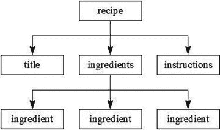

# 一、XML 简介

Electronic supplementary material The online version of this chapter (doi:[10.​1007/​978-1-4842-1916-4_​1](http://dx.doi.org/10.1007/978-1-4842-1916-4_1)) contains supplementary material, which is available to authorized users.

应用程序通常使用 XML 文档来存储和交换数据。XML 定义了以[格式](https://en.wikipedia.org/wiki/File_format#File%20format)编码文档的规则，这种格式既[可读](https://en.wikipedia.org/wiki/Human-readable_medium#Human-readable%20medium)又[机器可读](https://en.wikipedia.org/wiki/Machine-readable_data#Machine-readable%20data)。本章介绍 XML，浏览 XML 语言特性，并讨论格式良好的有效文档。

## 什么是 XML？

XML(可扩展标记语言)是一种用于定义词汇(自定义标记语言)的元语言(一种用于描述其他语言的语言)，这是 XML 的重要性和普及性的关键。基于 XML 的词汇表(如 XHTML)让您能够以有意义的方式描述文档。

XML 词汇表文档类似于 HTML(参见 [`http://en.wikipedia.org/wiki/HTML`](http://en.wikipedia.org/wiki/HTML) )文档，因为它们是基于文本的，由标记(文档逻辑结构的编码描述)和内容(不被解释为标记的文档文本)组成。标记通过标签(尖括号分隔的语法结构)来证明，每个标签都有一个名称。此外，一些标签具有属性(名称-值对)。

Note

XML 和 HTML 是标准通用标记语言(SGML)的后代，SGML 是创建词汇表的原始元语言。XML 本质上是 SGML 的限制形式，而 HTML 是 SGML 的应用。XML 和 HTML 之间的关键区别在于，XML 让您使用自己的标记和规则创建自己的词汇表，而 HTML 为您提供一个预先创建的词汇表，它有自己固定的标记和规则集。XHTML 和其他基于 XML 的词汇表都是 XML 应用程序。创建 XHTML 是为了更清晰地实现 HTML。

如果您以前没有接触过 XML，您可能会对它的简单性和它的词汇与 HTML 的相似程度感到惊讶。学习如何创建 XML 文档并不需要成为火箭科学家。为了证明这一点，请查看清单 [1-1](#Par6) 。

```java
<recipe>
   <title>
      Grilled Cheese Sandwich
   </title>
   <ingredients>
      <ingredient qty="2">
         bread slice
      </ingredient>
      <ingredient>
         cheese slice
      </ingredient>
      <ingredient qty="2">
         margarine pat
      </ingredient>
   </ingredients>
   <instructions>
      Place frying pan on element and select medium heat. For each bread slice, smear one pat of margarine on one side of bread slice. Place cheese slice between bread slices with margarine-smeared sides away from the cheese. Place sandwich in frying pan with one margarine-smeared side in contact with pan. Fry for a couple of minutes and flip. Fry other side for a minute and serve.
   </instructions>
</recipe>
Listing 1-1.XML-Based Recipe for a Grilled Cheese Sandwich

```

清单 [1-1](#Par6) 展示了一个 XML 文档，描述了制作烤奶酪三明治的食谱。这个文档类似于 HTML 文档，因为它由标签、属性和内容组成。然而，相似之处也就到此为止了。这种非正式的菜谱语言呈现了自己的`<recipe>`、`<ingredients>`和其他标签，而不是 HTML 标签，比如`<html>`、`<head>`、``和`<p>`。

Note

虽然清单 [1-1](#Par6) 的`<title>`和`</title>`标签也可以在 HTML 中找到，但是它们与它们的 HTML 对应物不同。Web 浏览器通常会在标题栏中显示这些标签之间的内容。相比之下，清单 [1-1](#Par6) 的`<title>`和`</title>`标签之间的内容可能会显示为菜谱标题、大声朗读或以其他方式呈现，这取决于解析该文档的应用程序。

## 语言特色之旅

XML 提供了几种用于定义自定义标记语言的语言功能:XML 声明、元素和属性、字符引用和 CDATA 节、名称空间以及注释和处理指令。在本节中，您将了解这些语言特性。

### XML 声明

XML 文档通常以 XML 声明开始，XML 声明是一种特殊的标记，告诉 XML 解析器该文档是 XML。清单 [1-1](#Par6) 中缺少 XML 声明表明这种特殊的标记不是强制性的。当 XML 声明存在时，它前面不能出现任何内容。

XML 声明看起来至少类似于`<?xml version="1.0"?>`，其中非可选的`version`属性标识文档符合的 XML 规范的版本。该规范的初始版本(1.0)于 1998 年推出，并得到了广泛的实施。

Note

维护 XML 的万维网联盟(W3C)在 2004 年发布了 1.1 版。该版本主要支持使用 EBCDIC 平台上使用的行尾字符(见 [`http://en.wikipedia.org/wiki/EBCDIC`](http://en.wikipedia.org/wiki/EBCDIC) )和使用 Unicode 3.2 中没有的脚本和字符(见 [`http://en.wikipedia.org/wiki/Unicode`](http://en.wikipedia.org/wiki/Unicode) )。与 XML 1.0 不同，XML 1.1 没有被广泛实现，应该只由那些需要其独特特性的人使用。

XML 支持 Unicode，这意味着 XML 文档完全由 Unicode 字符集中的字符组成。文档的字符被编码成字节以便存储或传输，编码是通过 XML 声明的可选属性`encoding`指定的。一种常见的编码是 UTF-8(见 [`http://en.wikipedia.org/wiki/UTF-8`](http://en.wikipedia.org/wiki/UTF-8) )，它是 Unicode 字符集的可变长度编码。UTF-8 是 ASCII 的严格超集(见 [`http://en.wikipedia.org/wiki/ASCII`](http://en.wikipedia.org/wiki/ASCII) )，这意味着纯 ASCII 文本文件也是 UTF-8 文档。

Note

如果没有 XML 声明或者 XML 声明的`encoding`属性不存在，XML 解析器通常会在文档的开头寻找一个特殊的字符序列来确定文档的编码。该字符序列被称为字节顺序标记(BOM ),由编辑程序(如 Microsoft Windows 记事本)根据 UTF-8 或其他编码保存文档时创建。例如，十六进制序列`EF BB BF`表示编码为 UTF-8。同样，`FE FF`表示 UTF-16 大端(参见 [`https://en.wikipedia.org/wiki/UTF-16`](https://en.wikipedia.org/wiki/UTF-16) )，`FF FE`表示 UTF-16 小端，`00 00 FE FF`表示 UTF-32 大端(参见 [`https://en.wikipedia.org/wiki/UTF-32`](https://en.wikipedia.org/wiki/UTF-32) )，而`FF FE 00 00`表示 UTF-32 小端。当没有物料清单时，假定为 UTF-8。

如果除了 ASCII 字符集之外，您从来不使用字符，那么您可能会忘记`encoding`属性。但是，当您的母语不是英语，或者当您被要求创建包含非 ASCII 字符的 XML 文档时，您需要正确地指定`encoding`。例如，当您的文档包含来自非英语西欧语言(如法语、葡萄牙语和其他语言中使用的 cedilla)的 ASCII plus 字符时，您可能希望选择`ISO-8859-1`作为`encoding`属性的值——以这种方式编码的文档可能比使用 UTF-8 编码的文档更小。清单 [1-2](#Par16) 向您展示了生成的 XML 声明。

```java
<?xml version="1.0" encoding="ISO-8859-1"?>
<movie>
   <name>Le Fabuleux Destin d’Amélie Poulain</name>
   <language>français</language>
</movie>
Listing 1-2.An Encoded Document Containing Non-ASCII Characters

```

可以出现在 XML 声明中的最后一个属性是`standalone`。这个可选属性只与 dtd 相关(稍后讨论)，它决定了是否有[外部标记声明](https://www.w3.org/TR/2004/REC-xml-20040204/#dt-extmkpdecl%23External%20Markup%20Declaration)影响从 XML 处理器(一个解析器)传递到应用程序的信息。它的值默认为`no`，暗示有，或者可能有这样的声明。一个`yes`值表示没有这样的声明。有关更多信息，请查看( [`www.xmlplease.com/xml/xmlquotations/standalone`](http://www.xmlplease.com/xml/xmlquotations/standalone) )上的文章“独立伪属性仅在使用 DTD 时相关”。

### 元素和属性

XML 声明之后是元素的层次(树)结构，其中元素是由开始标签(如`<name>`)和结束标签(如`</name>`)分隔的文档的一部分，或者是空元素标签(名称以正斜杠(`/`)结尾的独立标签，如`<break/>`)。开始标签和结束标签包围内容和可能的其他标记，而空元素标签不包围任何东西。图 [1-1](#Fig1) 展示了清单 [1-1](#Par6) 的 XML 文档树结构。



图 1-1。

Listing 1-1’s tree structure is rooted in the `recipe` element

与 HTML 文档结构一样，XML 文档的结构锚定在根元素(最顶层的元素)中。在 HTML 中，根元素是`html`(`<html>`和`</html>`标签对)。与 HTML 不同，您可以为 XML 文档选择根元素。图 [1-1](#Fig1) 显示根元素为`recipe`。

与其他有父元素的元素不同，`recipe`没有父元素。还有，`recipe`和`ingredients`有子元素:`recipe`的子元素是`title`、`ingredients`和`instructions`；而`ingredients`子代是`ingredient`的三个实例。`title`、`instructions`和`ingredient`元素没有子元素。

元素可以包含子元素、内容或混合内容(子元素和内容的组合)。清单 [1-2](#Par16) 揭示了`movie`元素包含`name`和`language`子元素，还揭示了这些子元素中的每一个都包含内容(例如，`language`包含`français`)。清单 [1-3](#Par22) 展示了另一个例子，展示了混合内容以及子元素和内容。

```java
<?xml version="1.0"?>
<article title="The Rebirth of JavaFX" lang="en">
   <abstract>
      JavaFX 2 marks a significant milestone in the history of JavaFX. Now that Sun Microsystems has passed the torch to Oracle, we have seen the demise of JavaFX Script and the emergence of Java APIs (such as <code-inline>javafx.application.Application</code-inline>) for interacting with this technology. This article introduces you to this new flavor of JavaFX, where you learn about JavaFX 2 architecture and key APIs.
   </abstract>
   <body>
   </body>
</article>
Listing 1-3.An abstract Element Containing Mixed Content

```

这个文档的根元素是`article`，它包含了`abstract`和`body`子元素。`abstract`元素将内容与包含内容的`code-inline`元素混合在一起。相反，`body`元素是空的。

Note

与清单 [1-1](#Par6) 和 [1-2](#Par16) 一样，清单 [1-3](#Par22) 也包含空格(不可见的字符，比如空格、制表符、回车符和换行符)。XML 规范允许在文档中添加空白。内容中出现的空白(如单词之间的空格)被视为内容的一部分。相反，解析器通常会忽略结束标记和下一个开始标记之间出现的空白。这样的空白不被认为是内容的一部分。

XML 元素的开始标记可以包含一个或多个属性。例如，清单 [1-1](#Par6) 的`<ingredient>`标签有一个`qty`(数量)属性，清单 [1-3](#Par22) 的`<article>`标签有`title`和`lang`属性。属性提供了关于元素的附加细节。例如，`qty`表示可以添加的成分的量，`title`表示文章的标题，`lang`表示文章使用的语言(`en`表示英语)。属性可以是可选的。例如，当未指定`qty`时，假定默认值为`1`。

Note

元素和属性名称可以包含英语或其他语言的任何字母数字字符，还可以包含下划线(`_`)、连字符(`-`)、句点(。)，以及冒号(:)标点字符。冒号应该只用于名称空间(将在本章后面讨论)，并且名称不能包含空格。

### 字符引用和 CDATA 节

某些字符不能出现在开始标记和结束标记之间的内容中，也不能出现在属性值中。例如，不能在开始标记和结束标记之间放置文字字符`<`,因为这样做会使 XML 解析器误以为遇到了另一个标记。

这个问题的一个解决方案是用字符引用替换原义字符，字符引用是代表字符的代码。字符引用分为数字字符引用或字符实体引用:

*   数字字符引用通过其 Unicode 码位来引用字符，并遵循格式`&#` nnnn `;`(不限于四位)或`&#x` hhhh `;`(不限于四位)，其中 nnnn 提供码位的十进制表示，hhhh 提供十六进制表示。例如，`&#0931;`和`&#x03A3;`代表希腊文大写字母 sigma。虽然 XML 要求`&#x` hhhh `;`中的`x`是小写的，但是它很灵活，前导零在两种格式中都是可选的，并且允许您为每个 h 指定大写或小写字母。因此，`&#931;`、`&#x3A3;`和`&#x03a3;`也是希腊大写字母 sigma 的有效表示。
*   字符实体引用通过实体名称(别名数据)引用字符，该实体将所需字符指定为其替换文本。字符实体引用由 XML 预定义，格式为`&` name `;`，其中 name 是实体的名称。XML 预定义了五个字符实体引用:`&lt;`(`<`)`&gt;`(`>`)`&amp;`(`&`)`&apos;`(`’`)和`"` ( `"`)。

考虑一下`<expression>6 < 4</expression>`。你可以用数字参考`&#60;`代替`<`，产生`<expression>6 &#60; 4</expression>`，或者更好的是用`&lt;`，产生`<expression>6 &lt; 4</expression>`。第二种选择更清晰，更容易记忆。

假设您想在一个元素中嵌入一个 HTML 或 XML 文档。为了使嵌入的文档能够被 XML 解析器接受，您需要用它的`&lt;`和`&amp;`预定义的字符实体引用来替换每个文字`<`(标签的开始)和`&`(实体的开始)字符，这是一项繁琐且可能容易出错的工作——您可能会忘记替换其中的一个字符。为了避免繁琐和潜在的错误，XML 以 CDATA(字符数据)部分的形式提供了一种替代方法。

CDATA 部分是由前缀`<![CDATA[`和后缀`]]>`包围的文字 HTML 或 XML 标记和内容的一部分。您不需要在 CDATA 部分中指定预定义的字符实体引用，如清单 [1-4](#Par34) 所示。

```java
<?xml version="1.0"?>
<svg-examples>
   <example>
      The following Scalable Vector Graphics document describes a blue-filled and black-stroked rectangle.
      <![CDATA[<svg width="100%" height="100%" version="1.1"
           >
         <rect width="300" height="100"
               style="fill:rgb(0,0,255);stroke-width:1; stroke:rgb(0,0,0)"/>
      </svg>]]>
   </example>
</svg-examples>
Listing 1-4.Embedding an XML Document in Another Document’s CDATA Section

```

清单 [1-4](#Par34) 嵌入了一个可缩放的矢量图形(SVG[参见 SVG 示例文档的`example`元素中的 [`https://en.wikipedia.org/wiki/Scalable_Vector_Graphics`](https://en.wikipedia.org/wiki/Scalable_Vector_Graphics) ) XML 文档。SVG 文档放在一个`CDATA`部分，避免了用`&lt;`预定义的字符实体引用替换所有`<`字符的需要。

### 命名空间

创建结合不同 XML 语言特性的 XML 文档是很常见的。当元素和其他 XML 语言特性出现时，命名空间用于防止名称冲突。如果没有名称空间，XML 解析器就无法区分同名元素或其他具有不同含义的语言特性，比如来自两种不同语言的两个同名`title`元素。

Note

名称空间不是 XML 1.0 的一部分。它们是在这个规范发布一年后出现的。为了确保向后兼容 XML 1.0，名称空间利用了冒号字符，这是 XML 名称中的合法字符。不识别名称空间的解析器返回包含冒号的名称。

名称空间是基于统一资源标识符(URI)的容器，它通过为包含的标识符提供唯一的上下文来帮助区分 XML 词汇表。命名空间 URI 通过指定(通常在 XML 文档的根元素中)单独的`xmlns`属性(表示默认命名空间)或`xmlns:`前缀属性(表示被标识为前缀的命名空间),并将 URI 分配给该属性，与命名空间前缀(URI 的别名)相关联。

Note

一个命名空间的作用域从声明它的元素开始，应用于该元素的所有内容，除非被另一个具有相同前缀名称的命名空间声明覆盖。

当 prefix 被指定时，前缀和冒号字符被添加到属于该名称空间的每个元素标签的名称之前(参见清单 [1-5](#Par41) )。

```java
<?xml version="1.0"?>
<h:html xmlns:h="http://www.w3.org/1999/xhtml"
        xmlns:r="http://www.javajeff.ca/">
   <h:head>
      <h:title>
         Recipe
      </h:title>
   </h:head>
   <h:body>
   <r:recipe>
      <r:title>
         Grilled Cheese Sandwich
      </r:title>
      <r:ingredients>
         <h:ul>
         <h:li>
         <r:ingredient qty="2">
            bread slice
         </r:ingredient>
         </h:li>
         <h:li>
         <r:ingredient>
            cheese slice
         </r:ingredient>
         </h:li>
         <h:li>
         <r:ingredient qty="2">
            margarine pat
         </r:ingredient>
         </h:li>
         </h:ul>
      </r:ingredients>
      <h:p>
      <r:instructions>
         Place frying pan on element and select medium heat. For each bread slice, smear one pat of margarine on one side of bread slice. Place cheese slice between bread slices with margarine-smeared sides away from the cheese. Place sandwich in frying pan with one margarine-smeared side in contact with pan. Fry for a couple of minutes and flip. Fry other side for a minute and serve.
      </r:instructions>
      </h:p>
   </r:recipe>
   </h:body>
</h:html>
Listing 1-5.Introducing a Pair of Namespaces

```

清单 [1-5](#Par41) 描述了一个结合了 XHTML(参见 [`http://en.wikipedia.org/wiki/XHTML`](http://en.wikipedia.org/wiki/XHTML) )元素和菜谱语言元素的文档。所有与 XHTML 相关的元素标签都以`h:`为前缀，所有与菜谱语言相关的元素标签都以`r:`为前缀。

`h:`前缀与 [`www.w3.org/1999/xhtml`](http://www.w3.org/1999/xhtml) URI 相关联，`r:`前缀与 [`www.javajeff.ca`](http://www.javajeff.ca) URI 相关联。XML 不要求 URIs 指向文档文件。它只要求它们是惟一的，以保证惟一的名称空间。

该文档将菜谱数据与 XHTML 元素分离开来，这使得保留该数据的结构成为可能，同时还允许符合 XHTML 的 web 浏览器(如 Mozilla Firefox)通过网页呈现菜谱(见图 [1-2](#Fig2) )。


图 1-2。

Mozilla Firefox presents the recipe data via XHTML tags

当标签的属性属于元素时，这些属性不需要加上前缀。例如，`<r:ingredient qty="2">`中没有前缀`qty`。但是，属于其他名称空间的属性需要前缀。例如，假设您想要向文档的`<r:title>`标签添加一个 XHTML `style`属性，以便在通过应用程序显示时为菜谱标题提供样式。您可以通过在`title`标签中插入一个 XHTML 属性来完成这项任务，如下所示:

```java
<r:title h:style="font-family: sans-serif;">

```

XHTML `style`属性带有前缀`h:`,因为该属性属于 XHTML 语言名称空间，而不属于 recipe 语言名称空间。

当涉及多个名称空间时，将其中一个名称空间指定为默认名称空间会很方便，这样可以减少输入名称空间前缀的繁琐。考虑列出 [1-6](#Par49) 。

```java
<?xml version="1.0"?>
<html 
      xmlns:r="http://www.javajeff.ca/">
   <head>

      <title>
         Recipe
      </title>
   </head>
   <body>
   <r:recipe>
      <r:title>
         Grilled Cheese Sandwich
      </r:title>
      <r:ingredients>
         <ul>
         <li>
         <r:ingredient qty="2">
            bread slice
         </r:ingredient>
         </li>
         <li>
         <r:ingredient>
            cheese slice
         </r:ingredient>
         </li>
         <li>
         <r:ingredient qty="2">
            margarine pat
         </r:ingredient>
         </li>
         </ul>
      </r:ingredients>
      <p>
      <r:instructions>
         Place frying pan on element and select medium heat. For each bread slice, smear one pat of margarine on one side of bread slice. Place cheese slice between bread slices with margarine-smeared sides away from the cheese. Place sandwich in frying pan with one margarine-smeared side in contact with pan. Fry for a couple of minutes and flip. Fry other side for a minute and serve.
      </r:instructions>
      </p>
   </r:recipe>
   </body>
</html>

Listing 1-6.Specifying a Default Namespace

```

清单 [1-6](#Par49) 指定了 XHTML 语言的默认名称空间。没有 XHTML 元素标签需要以`h:`为前缀。然而，配方语言元素标签仍然必须以前缀`r:`为前缀。

### 注释和处理说明

XML 文档可以包含注释，注释是以`<!--`开始，以`-->`结束的字符序列。例如，您可以将`<!-- Todo -->`放在清单 [1-3](#Par22) 的`body`元素中，以提醒自己需要完成该元素的编码。

注释用于阐明文档的各个部分。它们可以出现在 XML 声明之后的任何地方，除了在标记内，不能嵌套，不能包含双连字符(`--`)，因为这样做可能会使 XML 解析器混淆，认为注释已经结束，出于同样的原因，不应该包含连字符(`-`)，并且通常在处理过程中被忽略。评论不内容。

XML 还允许存在处理指令。处理指令是对解析文档的应用程序可用的指令。指令以`<?`开始，以`?>`结束。`<?`前缀后面是一个名为目标的名字。该名称通常标识处理指令所针对的应用程序。处理指令的其余部分包含适合应用程序格式的文本。以下是处理指令的两个示例:

*   `<?xml-stylesheet href="modern.xsl" type="text/xml"?>`将可扩展样式表语言(XSL)样式表与 XML 文档相关联(参见 [`http://en.wikipedia.org/wiki/XSL`](http://en.wikipedia.org/wiki/XSL) )。
*   `<?php /* PHP code */ ?>`将一段 PHP 代码片段传递给应用程序(参见 [`http://en.wikipedia.org/wiki/PHP`](http://en.wikipedia.org/wiki/PHP) )。尽管 XML 声明看起来像一个处理指令，但事实并非如此。

Note

XML 声明不是处理指令。

## 格式良好的文档

HTML 是一种松散的语言，在这种语言中，可以无序地指定元素，可以省略结束标记，等等。web 浏览器页面布局代码的复杂性部分是由于需要处理这些特殊情况。相比之下，XML 是一种更严格的语言。为了使 XML 文档更容易解析，XML 要求 XML 文档遵循某些规则:

*   所有元素必须有开始和结束标记，或者由空元素标记组成。例如，不像 HTML `<p>`标签那样经常没有对应的`</p>`，`</p>`也必须从 XML 文档的角度出现。
*   标记必须正确嵌套。例如，虽然您可能在 HTML 中指定了`<b><i>XML</b></i>`,但是 XML 解析器会报告一个错误。相比之下，`<b><i>XML</i></b>`不会导致错误，因为嵌套的标签对相互镜像。
*   所有属性值都必须用引号括起来。单引号(`’`)或双引号(`"`)都是允许的(尽管双引号是更常见的指定引号)。省略这些引号是错误的。
*   空元素必须正确格式化。例如，HTML 的`<br>`标签在 XML 中必须被指定为`<br/>`。您可以在标签名称和`/`字符之间指定一个空格，尽管空格是可选的。
*   小心大小写。XML 是一种区分大小写的语言，其中大小写不同的标签(如`<author>`和`<Author>`)被认为是不同的。将不同大小写的开始和结束标签混在一起是错误的，例如，`<author>`和`</Author>`。

意识到名称空间的 XML 解析器执行两个额外的规则:

*   每个元素和属性名称不得包含一个以上的冒号字符。
*   实体名称、处理指令目标或符号名称(稍后讨论)都不能包含冒号。

符合这些规则的 XML 文档是格式良好的。该文档具有逻辑清晰的外观，并且更易于处理。XML 解析器只会解析格式良好的 XML 文档。

## 有效文件

对于一个 XML 文档来说，格式良好并不总是足够的；在许多情况下，文件也必须是有效的。有效的文档遵守约束。例如，可以在列出 [1-1](#Par6) 的食谱文档时设置一个约束，以确保`ingredients`元素总是在`instructions`元素之前；也许一个申请必须首先处理`ingredients`。

Note

XML 文档验证类似于编译器分析源代码，以确保代码在机器上下文中有意义。例如，`int`、`count`、`=`、`1`和`;`都是有效的 Java 字符序列，但是`1 count ; int =`不是有效的 Java 结构(而`int count = 1;`是有效的 Java 结构)。

一些 XML 解析器执行验证，而其他解析器不执行验证，因为验证解析器更难编写。执行验证的解析器将 XML 文档与语法文档进行比较。对语法文档的任何偏离都会被报告为应用程序的错误 XML 文档是无效的。应用程序可以选择修复错误或拒绝 XML 文档。与格式良好性错误不同，有效性错误不一定是致命的，解析器可以继续解析 XML 文档。

Note

默认情况下，验证 XML 解析器通常不进行验证，因为验证非常耗时。必须指导他们执行验证。

语法文件是用一种特殊的语言写的。两种常用的语法语言是文档类型定义和 XML 模式。

### 文档类型定义

文档类型定义(DTD)是规定 XML 文档语法的最古老的语法语言。DTD 语法文档(称为 DTD)是根据一种严格的语法编写的，该语法规定了什么元素可以出现在文档的什么部分，元素中包含什么(子元素、内容或混合内容)以及可以指定什么属性。例如，DTD 可能会指定一个`recipe`元素必须有一个`ingredients`元素，后跟一个`instructions`元素。

清单 [1-7](#Par74) 给出了用于构建清单 [1-1](#Par74) 文档的配方语言的 DTD。

```java
<!ELEMENT recipe (title, ingredients, instructions)>
<!ELEMENT title (#PCDATA)>
<!ELEMENT ingredients (ingredient+)>
<!ELEMENT ingredient (#PCDATA)>
<!ELEMENT instructions (#PCDATA)>
<!ATTLIST ingredient qty CDATA "1">
Listing 1-7.The Recipe Language’s DTD

```

这个 DTD 首先声明配方语言的元素。元素声明采用的形式是`<!ELEMENT` name content-specifier `>`，其中 name 是任何合法的 XML 名称(例如，它不能包含空格)，content-specifier 标识元素中可以出现的内容。

第一个元素声明声明 XML 文档中只能出现一个`recipe`元素——这个声明并不意味着`recipe`是根元素。此外，这个元素必须包含`title`、`ingredients`和`instructions`子元素中的一个，并且按照这个顺序。子元素必须指定为逗号分隔的列表。此外，列表总是用括号括起来。

第二个元素声明声明`title`元素包含解析的字符数据(非标记文本)。第三个元素声明声明至少一个`ingredient`元素必须出现在`ingredients`中。`+`字符是表示一个或多个的正则表达式的一个例子。其他可能使用的表达式有`*`(零或更多)和`?`(一次或根本不使用)。第四个和第五个元素声明与第二个类似，声明`ingredient`和`instructions`元素包含解析的字符数据。

Note

元素声明支持其他三种内容说明符。您可以指定`<!ELEMENT`名称`ANY>`来允许任何类型的元素内容，或者指定`<!ELEMENT`名称`EMPTY>`来禁止任何元素内容。要声明一个元素包含混合内容，您可以指定`#PCDATA`和一个元素名称列表，用竖线(`|`)分隔。例如，`<!ELEMENT ingredient (#PCDATA | measure | note)*>`表示`ingredient`元素可以包含已解析的字符数据、零个或多个`measure`元素以及零个或多个`note`元素。它没有指定被解析的字符数据和这些元素出现的顺序。但是，`#PCDATA`必须是列表中指定的第一项。在此上下文中使用正则表达式时，它必须出现在右括号的右侧。

清单 [1-7](#Par74) 的 DTD 最后声明了菜谱语言的属性，其中只有一个:`qty`。属性声明的形式是`<!ATTLIST`ename aname type default-value`>`，其中 ename 是属性所属元素的名称，aname 是属性的名称，type 是属性的类型，default-value 是属性的默认值。

属性声明将`qty`标识为`ingredient`的属性。它还说明了`qty`的类型是`CDATA`(任何不包括&符号、小于或大于符号或双引号的字符串都可能出现；这些字符可以分别通过`&amp;`、`&lt;`、`&gt;`或`&quot;`来表示，并且`qty`是可选的，当不存在时采用默认值`1`。

More About Attributes

DTD 允许您指定附加的属性类型:`ID`(为标识元素的属性创建唯一的标识符)、`IDREF`(属性值是位于文档中其他位置的元素)、`IDREFS`(值由多个`IDREF`组成)、`ENTITY`(可以使用外部二进制数据或未解析的实体)、`ENTITIES`(值由多个实体组成)、`NMTOKEN`(值限于任何有效的 XML 名称)、`NMTOKENS`(值由多个 XML 名称组成)、`NOTATION`(值已经通过 DTD 表示法声明指定)值用竖线分隔)。

您可以不逐字指定缺省值，而是指定`#REQUIRED`来表示属性必须始终具有某个值`(<!ATTLIST`名称名称类型`#REQUIRED>`)，`#IMPLIED`来表示属性是可选的并且不提供缺省值(`<!ATTLIST`名称名称类型`#IMPLIED>`)，或者`#FIXED`来表示属性是可选的并且在使用时必须始终采用 DTD 分配的缺省值(`<!ATTLIST`名称名称类型`#FIXED "value">`)。

您可以在一个`ATTLIST`声明中指定属性列表。例如，`<!ATTLIST`ename aname1 type 1 default-value 1 aname2 type 2 default-value 2`>`声明了标识为 aname 1 和 aname 2 的两个属性。

基于 DTD 的验证 XML 解析器在验证文档之前，要求文档包含一个标识 DTD 的文档类型声明，该 DTD 指定了文档的语法。

Note

文档类型定义和文档类型声明是两回事。DTD 首字母缩略词标识文档类型定义，从不标识文档类型声明。

文档类型声明紧跟在 XML 声明之后，并以下列方式之一指定:

*   `<!DOCTYPE` root-element-name `SYSTEM` uri `>`通过 uri 引用一个外部但私有的 DTD。引用的 DTD 不可用于公共审查。例如，我可能将我的配方语言的 DTD 文件(`recipe.dtd`)存储在我的 [`www.javajeff.ca`](http://www.javajeff.ca) 网站上的私有`dtds`目录中，并使用`<!DOCTYPE recipe SYSTEM "` [`http://www.javajeff.ca/dtds/recipe.dtd`](http://www.javajeff.ca/dtds/recipe.dtd) `">`通过系统标识符 [`http://www.javajeff.ca/dtds/recipe.dtd`](http://www.javajeff.ca/dtds/recipe.dtd) 来标识该 DTD 的位置。
*   `<!DOCTYPE`root-element-name`PUBLIC`fpi uri`>`通过 FPI、正式的公共标识符(参见 [`http://en.wikipedia.org/wiki/Formal_Public_Identifier`](http://en.wikipedia.org/wiki/Formal_Public_Identifier) )和 uri 引用外部但公共的 DTD。如果验证 XML 解析器不能通过公共标识符 fpi 定位 DTD，它可以使用系统标识符 uri 来定位 DTD。比如`<!DOCTYPE html PUBLIC "-//W3C//DTD XHTML 1.0 Transitional//EN" "` [`http://www.w3.org/TR/xhtml1/DTD/xhtml1-transitional.dtd`](http://www.w3.org/TR/xhtml1/DTD/xhtml1-transitional.dtd) `">`首先通过公共标识符`-//W3C//DTD XHTML 1.0 Transitional//EN`引用 XHTML 1.0 DTD，其次通过系统标识符 [`http://www.w3.org/TR/xhtml1/DTD/xhtml1-transitional.dtd`](http://www.w3.org/TR/xhtml1/DTD/xhtml1-transitional.dtd) 引用。
*   `<!DOCTYPE`根元素`[` dtd `]>`引用了一个内部 dtd，一个嵌入在 XML 文档中的 DTD。内部 DTD 必须出现在方括号中。

清单 [1-8](#Par91) 显示了带有内部 DTD 的清单 [1-1](#Par6) (减去`<recipe>`和`</recipe>`标签之间的子元素)。

```java
<?xml version="1.0"?>
<!DOCTYPE recipe [

   <!ELEMENT recipe (title, ingredients, instructions)>
   <!ELEMENT title (#PCDATA)>
   <!ELEMENT ingredients (ingredient+)>
   <!ELEMENT ingredient (#PCDATA)>
   <!ELEMENT instructions (#PCDATA)>
   <!ATTLIST ingredient qty CDATA "1">
]>
<recipe>
   <!-- Child elements removed for brevity. -->
</recipe>
Listing 1-8.The Recipe Document with an Internal DTD

```

Note

文档可以有内部和外部 DTDs 比如`<!DOCTYPE recipe SYSTEM "` [`http://www.javajeff.ca/dtds/recipe.dtd`](http://www.javajeff.ca/dtds/recipe.dtd) `" [ <!ELEMENT ...>]>`。内部 DTD 称为内部 DTD 子集，外部 DTD 称为外部 DTD 子集。任何一个子集都不能覆盖另一个子集的元素声明。

您还可以在 dtd 中声明符号、一般实体和参数实体。符号是一段任意的数据，通常描述未解析的二进制数据的格式，通常具有形式`<!NOTATION` name `SYSTEM` uri `>`，其中 name 标识符号，uri 标识某种插件，该插件可以代表解析 XML 文档的应用程序处理数据。例如，`<!NOTATION image SYSTEM "psp.exe">`声明了一个名为`image`的符号，并将 Windows 可执行文件`psp.exe`标识为处理图像的插件。

使用符号通过媒体类型指定二进制数据类型也很常见(参见 [`https://en.wikipedia.org/wiki/Media_type`](https://en.wikipedia.org/wiki/Media_type) )。例如，`<!NOTATION image SYSTEM "image/jpeg">`声明了一个图像符号，它标识了联合图像专家组图像的`image/jpeg`媒体类型。

通用实体是通过通用实体引用从 XML 文档内部引用的实体，格式为`&`name；。例如预定义的`lt`、`gt`、`amp`、`apos`和`quot`角色实体，其`&lt;`、`&gt;`、`&amp;`、`&apos;`和`&quot;`角色实体引用分别是角色`<`、`>`、`&`、`’`和`"`的别名。

一般实体分为内部实体和外部实体。内部一般实体是其值存储在 DTD 中的一般实体，其形式为`<!ENTITY` name value `>`，其中 name 标识实体，value 指定其值。例如，`<!ENTITY copyright "Copyright &copy; 2016 Jeff Friesen. All rights reserved.">`声明了一个名为`copyright`的内部通用实体。这个实体的值可能包括另一个声明的实体，比如`&copy;`(版权符号的 HTML 实体)，并且可以通过指定`&copyright;`从 XML 文档中的任何地方引用。

外部一般实体是其值存储在 DTD 外部的一般实体。该值可能是文本数据(如 XML 文档)，也可能是二进制数据(如 JPEG 图像)。外部通用实体分为外部已解析通用实体和外部未解析通用实体。

外部解析的通用实体引用存储该实体的文本数据的外部文件，当在文档中指定了通用实体引用时，该文件将被插入到文档中并由验证解析器进行解析，并且该文件具有形式`<!ENTITY` name `SYSTEM` uri `>`，其中 name 标识实体，uri 标识外部文件。例如，`<!ENTITY chapter-header SYSTEM "` [`http://www.javajeff.ca/entities/chapheader.xml`](http://www.javajeff.ca/entities/chapheader.xml) `">`将`chapheader.xml`标识为存储要插入到 XML 文档中`&chapter-header;`出现的任何地方的 XML 内容。可以指定替代的`<!ENTITY`名称`PUBLIC` fpi uri `>`形式。

Caution

因为外部文件的内容可能被解析，所以该内容必须是格式良好的。

一个外部未解析的通用实体引用一个存储实体二进制数据的外部文件，其格式为`<!ENTITY` name `SYSTEM` uri `NDATA` nname `>`，其中 name 标识实体，uri 定位外部文件，`NDATA`标识名为 nname 的符号声明。该符号通常标识用于处理二进制数据或该数据的互联网媒体类型的插件。例如，`<!ENTITY photo SYSTEM "photo.jpg" NDATA image>`将名称`photo`与外部二进制文件`photo.png`和符号`image`相关联。可以指定替代的`<!ENTITY`名称`PUBLIC` fpi uri `NDATA`名称`>`形式。

Note

XML 不允许对外部通用实体的引用出现在属性值中。例如，您不能在属性值中指定`&chapter-header;`。

参数实体是通过参数实体引用从 DTD 内部引用的实体，格式为`%`name；。它们有助于消除元素声明中的重复内容。例如，您正在为一家大公司创建一个 DTD，这个 DTD 包含三个元素声明:`<!ELEMENT salesperson (firstname, lastname)>`、`<!ELEMENT lawyer (firstname, lastname)>`和`<!ELEMENT accountant (firstname, lastname)>`。每个元素都包含重复的子元素内容。如果你需要添加另一个子元素(比如`middleinitial`，你需要确保所有的元素都被更新；否则，您将面临 DTD 格式错误的风险。参数实体可以帮你解决这个问题。

参数实体分为内部实体和外部实体。内部参数实体是其值存储在 DTD 中的参数实体，其形式为`<!ENTITY %` name value `>`，其中 name 标识实体，value 指定其值。例如，`<!ENTITY % person-name "firstname, lastname">`声明了一个名为`person-name`的参数实体，其值为`firstname, lastname`。一旦声明，这个实体可以在前面的三个元素声明中被引用，如下:`<!ELEMENT salesperson (%person-name;)>`、`<!ELEMENT lawyer (%person-name;)>`和`<!ELEMENT accountant (%person-name;)>`。不是像以前那样将`middleinitial`添加到`salesperson`、`lawyer`和`accountant`中，而是像在`<!ENTITY % person-name "firstname, middleinitial, lastname">`中那样将这个子元素添加到`person-name`中，并且这个更改将被应用到这些元素声明中。

外部参数实体是其值存储在 DTD 外部的参数实体。它的形式是`<!ENTITY % name SYSTEM uri>`，其中`name`标识实体，`uri`定位外部文件。例如，`<!ENTITY % person-name SYSTEM "` [`http://www.javajeff.ca/entities/names.dtd`](http://www.javajeff.ca/entities/names.dtd) `">`将`names.dtd`标识为存储要插入到 DTD 中`%person-name;`出现的任何地方的`firstname, lastname`文本。可以指定替代的`<!ENTITY %`名称`PUBLIC` fpi uri `>`形式。

Note

这个讨论总结了 DTD 的基础。另外一个没有涉及的主题(为了简洁)是条件包含，它允许您指定 DTD 中可供解析器使用的部分，通常与参数实体引用一起使用。

### XML 模式

XML Schema 是一种语法语言，用于声明 XML 文档的结构、内容和语义(含义)。这种语言的语法文档被称为模式，模式本身就是 XML 文档。模式必须符合 XML 模式 DTD(参见 [`www.w3.org/2001/XMLSchema.dtd`](http://www.w3.org/2001/XMLSchema.dtd) )。

W3C 引入了 XML Schema 来克服 DTD 的局限性，比如 DTD 缺乏对名称空间的支持。此外，XML Schema 提供了一种面向对象的方法来声明 XML 文档的语法。这种语法语言提供了比 DTD 的 CDATA 和 PCDATA 类型更多的基本类型。例如，整数、浮点、各种日期和时间以及字符串类型都是 XML 模式的一部分。

Note

XML Schema 预定义了 19 种原语类型，通过以下标识符来表示:`anyURI`、`base64Binary`、`boolean`、`date`、`dateTime`、`decimal`、`double`、`duration`、`float`、`hexBinary`、`gDay`、`gMonth`、`gMonthDay`、`gYear`、`gYearMonth`、`NOTATION`、`QName`、`string`和`time`。

XML Schema 提供了限制(通过约束减少允许值的集合)、列表(允许值的序列)和联合(允许从几种类型中选择值)派生方法，用于从这些原始类型创建新的简单类型。比如 XML Schema 通过限制从`decimal`派生出 13 个整数类型；这些类型通过以下标识符表示:`byte`、`int`、`integer`、`long`、`negativeInteger`、`nonNegativeInteger`、`nonPositiveInteger`、`positiveInteger`、`short`、`unsignedByte`、`unsignedInt`、`unsignedLong`和`unsignedShort`。它还支持从简单类型创建复杂类型。

熟悉 XML 模式的一个好方法是通过一个例子，比如为清单 [1-1](#Par6) 的菜谱语言文档创建一个模式。创建这个配方语言模式的第一步是识别它的所有元素和属性。要素有`recipe`、`title`、`ingredients`、`instructions`、`ingredient`；`qty`是孤属性。

下一步是根据 XML Schema 的内容模型对元素进行分类，该模型指定了元素中可以包含的子元素和文本节点的类型(参见 [`http://en.wikipedia.org/wiki/Node_(computer_science`](http://en.wikipedia.org/wiki/Node_(computer_science) `)`)。当元素没有子元素或文本节点时，该元素被认为是空的；当只接受文本节点时，该元素被认为是简单的；当只接受子元素时，该元素被认为是复杂的；当接受子元素和文本节点时，该元素被认为是混合的。清单 [1-1](#Par6) 的元素都没有空的或混合的内容模型。然而，`title`、`ingredient`和`instructions`元素具有简单的内容模型；并且`recipe`和`ingredients`元素具有复杂的内容模型。

对于具有简单内容模型的元素，我们可以区分有属性的元素和没有属性的元素。XML Schema 将具有简单内容模型并且没有属性的元素分类为简单类型。此外，它将具有简单内容模型和属性的元素或者来自其他内容模型的元素分类为复杂类型。此外，XML Schema 将属性分类为简单类型，因为它们只包含文本值——属性没有子元素。清单 [1-1](#Par6) 的`title`和`instructions`元素及其`qty`属性是简单类型。它的`recipe`、`ingredients`和`ingredient`元素是复杂类型。

此时，您可以开始声明模式了。以下代码片段展示了介绍性的`schema`元素:

```java
<xs:schema xmlns:xs="http://www.w3.org/2001/XMLSchema">

```

元素介绍了语法。它还将常用的`xs`名称空间前缀分配给标准 XML 模式名称空间；`xs:`随后被添加到 XML 模式元素名称的前面。

接下来，使用`element`元素声明`title`和`instructions`简单类型元素，如下所示:

```java
<xs:element name="title" type="xs:string"/>
<xs:element name="instructions" type="xs:string"/>

```

XML Schema 要求每个元素都有一个名称，并且(与 DTD 不同)与一个类型相关联，该类型标识元素中存储的数据类型。例如，第一个`element`声明通过其`name`属性将`title`标识为名称，通过其`type`属性将`string`标识为类型(字符串或字符数据出现在`<title>`和`</title>`标记之间)。`xs:string`中的`xs:`前缀是必需的，因为`string`是预定义的 W3C 类型。

继续，现在使用`attribute`元素声明`qty`简单类型属性，如下所示:

```java
<xs:attribute name="qty" type="xs:unsignedInt" default="1"/>

```

这个`attribute`元素声明了一个名为`qty`的属性。我选择`unsignedInt`作为这个属性的`type`，因为数量是非负值。此外，我指定了`1`作为没有指定`qty`时的`default`值— `attribute`元素默认声明可选属性。

Note

元素和属性声明的顺序在模式中并不重要。

既然已经声明了简单类型，就可以开始声明复杂类型了。首先，声明`recipe`如下:

```java
<xs:element name="recipe">
   <xs:complexType>
      <xs:sequence>
         <xs:element ref="title"/>
         <xs:element ref="ingredients"/>
         <xs:element ref="instructions"/>
      </xs:sequence>
   </xs:complexType>
</xs:element>

```

该声明声明`recipe`是一个复杂类型(通过`complexType`元素),由一个`title`元素、一个`ingredients`元素和一个`instructions`元素组成(通过`sequence`元素)。这些元素中的每一个都由一个不同的`element`声明，这个不同的`element`由它的`element`的`ref`属性引用。

下一个要声明的复杂类型是`ingredients`。下面的代码片段提供了它的声明:

```java
<xs:element name="ingredients">
   <xs:complexType>
      <xs:sequence>
         <xs:element ref="ingredient" maxOccurs="unbounded"/>
      </xs:sequence>
   </xs:complexType>
</xs:element>

```

这个声明声明`ingredients`是一个复杂类型，由一个或多个`ingredient`元素组成。“或更多”是通过包含`element`的`maxOccurs`属性并将该属性的值设置为`unbounded`来指定的。

Note

`maxOccurs`属性标识一个元素可以出现的最大次数。一个类似的`minOccurs`属性标识了一个元素出现的最小次数。每个属性可以被赋予`0`或一个正整数。此外，您可以为`maxOccurs`指定`unbounded`，这意味着元素的出现次数没有上限。每个属性的默认值为`1`，这意味着当两个属性都不存在时，一个元素只能出现一次。

最后要声明的复杂类型是`ingredient`。虽然`ingredient`只能包含文本节点，这意味着它应该是一个简单的类型，但正是`qty`属性的存在使它变得复杂。查看以下声明:

```java
<xs:element name="ingredient">
   <xs:complexType>
      <xs:simpleContent>
         <xs:extension base="xs:string">
            <xs:attribute ref="qty"/>
         </xs:extension>
      </xs:simpleContent>
   </xs:complexType>
</xs:element>

```

名为`ingredient`的元素是一个复杂类型(因为它有可选的`qty`属性)。`simpleContent`元素表示`ingredient`只能包含简单的内容(文本节点)，`extension`元素表示`ingredient`是一个新类型，扩展了预定义的`string`类型(通过`base`属性指定)，意味着`ingredient`继承了`string`的所有属性和结构。此外，`ingredient`被赋予了一个附加的`qty`属性。

清单 [1-9](#Par134) 将前面的例子组合成一个完整的模式。

```java
<?xml version="1.0"?>
<xs:schema xmlns:xs="http://www.w3.org/2001/XMLSchema">
<xs:element name="title" type="xs:string"/>
<xs:element name="instructions" type="xs:string"/>
<xs:attribute name="qty" type="xs:unsignedInt" default="1"/>
<xs:element name="recipe">
   <xs:complexType>
      <xs:sequence>
         <xs:element ref="title"/>
         <xs:element ref="ingredients"/>
         <xs:element ref="instructions"/>
      </xs:sequence>
   </xs:complexType>
</xs:element>
<xs:element name="ingredients">
   <xs:complexType>
      <xs:sequence>
         <xs:element ref="ingredient" maxOccurs="unbounded"/>
      </xs:sequence>
   </xs:complexType>
</xs:element>
<xs:element name="ingredient">
   <xs:complexType>
      <xs:simpleContent>
         <xs:extension base="xs:string">
            <xs:attribute ref="qty"/>
         </xs:extension>
      </xs:simpleContent>
   </xs:complexType>
</xs:element>
Listing 1-9.The Recipe Document’s Schema

```

创建模式后，您可以从配方文档中引用它。通过在文档的根元素开始标记(`<recipe>`)上指定`xmlns:xsi`和`xsi:schemaLocation`属性来完成这个任务，如下所示:

```java
<recipe 
        xmlns:xsi="http://www.w3.org/2001/XMLSchema-instance"
        xsi:schemaLocation="http://www.javajeff.ca/schemas recipe.xsd">

```

`xmlns`属性将 [`http://www.javajeff.ca/`](http://www.javajeff.ca/) 标识为文档的默认名称空间。无前缀的元素及其无前缀的属性属于此命名空间。

`xmlns:xsi`属性将传统的`xsi` (XML 模式实例)前缀与标准的 [`http://www.w3.org/2001/XMLSchema-instance`](http://www.w3.org/2001/XMLSchema-instance) 名称空间相关联。文档中唯一以`xsi:`为前缀的项目是`schemaLocation`。

`schemaLocation`属性用于定位模式。该属性的值可以是多对空格分隔的值，但在本例中被指定为一对这样的值。第一个值( [`http://www.javajeff.ca/schemas`](http://www.javajeff.ca/schemas) )标识模式的目标名称空间，第二个值(`recipe.xsd`)标识模式在该名称空间中的位置。

Note

符合 XML 模式语法的模式文件通常被指定为文件扩展名`.xsd`。

如果一个 XML 文档声明了一个名称空间(`xmlns` default 或`xmlns:prefix`)，那么该名称空间必须对模式可用，以便验证解析器可以解析对该名称空间的元素和其他模式组件的所有引用。您还需要提到模式描述了哪个名称空间，通过在`schema`元素中包含`targetNamespace`属性可以做到这一点。例如，假设您的配方文档声明了一个默认的 XML 名称空间，如下所示:

```java
<?xml version="1.0"?>
<recipe >

```

至少，您需要修改清单 [1-9](#Par134) 的`schema`元素，以包含`targetNameSpace`和配方文档的默认名称空间作为`targetNameSpace`的值，如下所示:

```java
<xs:schema targetNamespace="http://www.javajeff.ca/"
           xmlns:xs="http://www.w3.org/2001/XMLSchema">

```

Exercises

以下练习旨在测试您对第 [1](01.html) 章内容的理解。

Define XML.   True or false: XML and HTML are descendents of SGML.   What language features does XML provide for use in defining custom markup languages?   What is the XML declaration?   Identify the XML declaration’s three attributes. Which attribute is nonoptional?   True or false: An element always consists of a start tag followed by content followed by an end tag.   Following the XML declaration, an XML document is anchored in what kind of element?   What is mixed content?   What is a character reference? Identify the two kinds of character references.   What is a CDATA section? Why would you use it?   Define namespace.   What is a namespace prefix?   True or false: A tag’s attributes don’t need to be prefixed when those attributes belong to the element.   What is a comment? Where can it appear in an XML document?   Define processing instruction.   Identify the rules that an XML document must follow to be considered well formed.   What does it mean for an XML document to be valid?   A parser that performs validation compares an XML document to a grammar document. Identify the two common grammar languages.   What is the general syntax for declaring an element in a DTD?   Which grammar language lets you create complex types from simple types?   Create a `books.xml` document file with a `books` root element. The `books` element must contain one or more `book` elements, where a `book` element must contain one `title` element, one or more `author` elements, and one `publisher` element (and in that order). Also, the `book` element’s `<book>` tag must contain `isbn` and `pubyear` attributes. Record `Advanced C++`/`James Coplien`/`Addison Wesley`/`0201548550`/`1992` in the first `book` element, `Beginning Groovy and Grails`/`Christopher M. Judd`/`Joseph Faisal Nusairat`/`James Shingler`/`Apress`/`9781430210450`/`2008` in the second `book` element, and `Effective Java`/`Joshua Bloch`/`Addison Wesley`/`0201310058`/`2001` in the third `book` element.   Modify `books.xml` to include an internal DTD that satisfies the previous exercise’s requirements.  

## 摘要

应用程序经常使用 XML 文档来存储和交换数据。XML 定义了以[格式](https://en.wikipedia.org/wiki/File_format#File%20format)编码文档的规则，这种格式既[可读](https://en.wikipedia.org/wiki/Human-readable_medium#Human-readable%20medium)又[机器可读](https://en.wikipedia.org/wiki/Machine-readable_data#Machine-readable%20data)。它是一种定义词汇表的元语言，这是 XML 的重要性和受欢迎程度的关键。

XML 提供了几种用于定义自定义标记语言的语言功能。这些特性包括 XML 声明、元素和属性、字符引用和 CDATA 节、名称空间以及注释和处理指令。

HTML 是一种松散的语言，其中元素可以无序指定，结束标记可以省略，等等。相比之下，XML 文档格式良好，因为它们符合特定的规则，这使得它们更容易处理。XML 解析器只解析格式良好的 XML 文档。

在许多情况下，XML 文档也必须是有效的。有效的文档遵循语法文档所描述的约束。语法文档是用语法语言编写的，比如常用的文档类型定义和 XML Schema。

第 [2](02.html) 章介绍了 Java 解析 XML 文档的 SAX API。