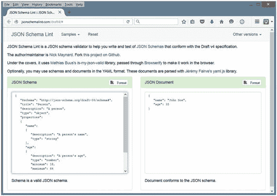
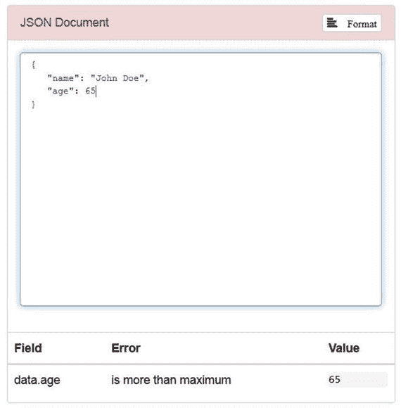
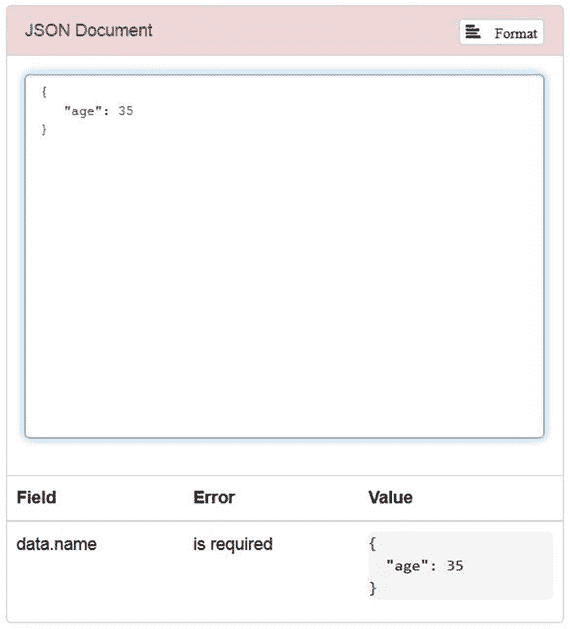

# 7.JSON 简介

许多应用程序通过交换 JSON 对象而不是 XML 文档来进行通信。本章介绍 JSON，浏览它的语法，在 JavaScript 上下文中演示 JSON，并展示如何在 JSON 模式的上下文中验证 JSON 对象。

## JSON 是什么？

JSON (JavaScript Object Notation)是一种独立于语言的数据格式，它将 JSON 对象表示为[人类可读的](https://en.wikipedia.org/wiki/Human-readable#Human-readable)属性列表([名称-值对](https://en.wikipedia.org/wiki/Attribute%E2%80%93value_pair#Attribute%E2%80%93value%20pair))。尽管源自 JavaScript 的非严格子集，但将[JSON 对象解析成等价的语言相关对象的代码在许多](https://en.wikipedia.org/wiki/Parse#Parse)[编程语言](https://en.wikipedia.org/wiki/Programming_languages#Programming%20languages)中都可用。

Note

JSON 允许 [Unicode](https://en.wikipedia.org/wiki/Unicode#Newlines%23Unicode) `U+2028`行分隔符和`U+2029`段落分隔符在带引号的字符串中不转义。因为 JavaScript 不支持这种能力，所以 JSON 不是 JavaScript 的子集。

JSON 常用于通过 Ajax([`https://en.wikipedia.org/wiki/AJAJ`](https://en.wikipedia.org/wiki/AJAJ))进行的异步浏览器/服务器通信。JSON 也用于 NoSQL 数据库管理系统，如 MongoDb 和 CouchDb 使用 Twitter、脸书、LinkedIn 和 Flickr 等社交媒体网站的应用程序；即使使用流行的谷歌地图 API。

Note

许多开发人员更喜欢 JSON 而不是 XML，因为他们认为 JSON 不那么冗长，更容易阅读。查看“JSON:XML 的无脂肪替代品”( [`www.json.org/xml.html`](http://www.json.org/xml.html) )了解更多信息。

## JSON 语法教程

JSON 数据格式将 JSON 对象表示为用大括号分隔、用逗号分隔的属性列表:

```java
{
   property1 ,
   property2 ,
   ...
   propertyN

}

```

最后一个属性后没有逗号。

对于每个属性，名称被表示为一个通常用引号括起来的字符串(用一对双引号括起来)。名称字符串后面跟一个冒号字符，后面跟一个特定类型的值(例如，`"name": "JSON"`)。

JSON 支持以下六种类型:

*   Number:一个有符号的十进制数，可以包含小数部分，可以使用指数( [E)符号](https://en.wikipedia.org/wiki/E_notation#E%20notation)。JSON 不允许非数字(比如 [NaN](https://en.wikipedia.org/wiki/NaN#NaN) )，也不区分整数和浮点。此外，JSON 不识别八进制和十六进制格式。(尽管 JavaScript 对所有数值都使用了一种[双精度浮点格式](https://en.wikipedia.org/wiki/Double-precision_floating-point_format#Double-precision%20floating-point%20format)，但是实现 JSON 的其他语言对数字的编码可能不同。)
*   [字符串](https://en.wikipedia.org/wiki/String_%28computer_science%29#String%20(computer%20science)):零个或多个 [Unicode](https://en.wikipedia.org/wiki/Unicode#Unicode) 字符的序列。字符串用双引号分隔，并支持反斜杠[转义](https://en.wikipedia.org/wiki/Escape_character#Escape%20character)语法。
*   [布尔](https://en.wikipedia.org/wiki/Boolean_datatype#Boolean%20datatype):值`true`或`false`中的任意一个。
*   [数组](https://en.wikipedia.org/wiki/Array_data_structure#Array%20data%20structure):零个或多个值的[有序列表](https://en.wikipedia.org/wiki/List_%28abstract_data_type%29#List%20(abstract%20data%20type))，每个值可以是任意类型。数组使用[方括号](https://en.wikipedia.org/wiki/Square_bracket#Square%20bracket)符号，元素用逗号分隔。
*   对象:属性的无序集合，其中的名称(也称为键)是字符串。因为对象旨在表示[关联数组](https://en.wikipedia.org/wiki/Associative_array#Associative%20array)，所以建议(尽管不是必需的)每个键在一个对象中是唯一的。对象用大括号分隔，并用逗号分隔每个属性。在每个属性中，冒号字符将键与其值分开。
*   [Null](https://en.wikipedia.org/wiki/Nullable_type#Nullable%20type) :空值，使用关键字`null`。

Note

JSON 模式(稍后讨论)识别第七种类型:整数。这种类型不包括分数或指数，而是数字的子集。

语法元素(值和标点符号)周围或之间允许有空格，但会被忽略。为此，四个特定字符被视为空白:空格、水平制表符、换行符和回车符。还有，JSON 不支持注释。

使用这种数据格式，您可以指定一个 JSON 对象，如下面的匿名对象(节选自维基百科的 JSON 页面上的 [`https://en.wikipedia.org/wiki/JSON`](https://en.wikipedia.org/wiki/JSON) )来描述一个人的名字、姓氏和其他数据项:

```java
{
   "firstName": "John",
   "lastName": "Smith",
   "isAlive": true,
   "age": 25,
   "address":
   {
      "streetAddress": "21 2nd Street",
      "city": "New York",
      "state": "NY",
      "postalCode": "10021-3100"
   },
   "phoneNumbers":
   [
      {
         "type": "home",
         "number": "212 555-1234"
      },
      {
         "type": "office",
         "number": "646 555-4567"
      }
   ],
   "children": [],
   "spouse": null
}

```

在此示例中，匿名对象由带有以下键的八个属性组成:

*   `firstName`标识一个人的名字，类型为 string。
*   `lastName`标识一个人的姓，类型为 string。
*   `isAlive`标识一个人的存活状态，属于布尔类型。
*   `age`识别一个人的年龄，属于数字类型。
*   `address`标识一个人的位置，属于 object 类型。在这个对象中有四个属性(字符串类型):`streetAddress`、`city`、`state`和`postalCode`。
*   识别一个人的电话号码，并且是数组类型。数组中有两个对象；每个对象由`type`和`number`属性(字符串类型)组成。
*   标识一个人的孩子(如果有的话),并且是数组类型。
*   `spouse`标识一个人的伴侣，为空。

前面的示例显示了对象和数组可以嵌套；例如，对象内数组中的对象。

Note

按照惯例，JSON 对象存储在扩展名为`.json`的文件中。

## 用 JavaScript 演示 JSON

理想情况下，我会用 Java 的标准 JSON API 来演示 JSON。然而，Java 并不正式支持 JSON。

Note

Oracle 之前推出了一个 Java 增强提案(JEP ),将 JSON API 添加到 Java 9 中。不幸的是，JEP 198:轻量级 JSON API ( [`http://openjdk.java.net/jeps/198`](http://openjdk.java.net/jeps/198) )被放弃了。

我将通过 JavaScript 演示 JSON，但是是在 Java 环境中通过 Java 的脚本 API。(如果您不熟悉脚本，我将解释这个 API，以便您能够理解代码。)首先，清单 [7-1](#Par35) 展示了执行 JavaScript 代码的应用程序的源代码。

```java
import java.io.FileReader;
import java.io.IOException;

import javax.script.ScriptEngine;
import javax.script.ScriptEngineManager;
import javax.script.ScriptException;

public class RunScript
{
   public static void main(String[] args)
   {
      if (args.length != 1)
      {
         System.err.println("usage: java RunScript script");
         return;
      }
      ScriptEngineManager manager = new ScriptEngineManager();
      ScriptEngine engine = manager.getEngineByName("nashorn");
      try
      {
         engine.eval(new FileReader(args[0]));
      }
      catch (ScriptException se)
      {
         System.err.println(se.getMessage());
      }
      catch (IOException ioe)
      {
         System.err.println(ioe.getMessage());
      }      
   }
}

Listing 7-1.Executing JavaScript Code with Assistance from Java

```

清单 [7-1](#Par35) 的`main()`方法首先验证是否指定了一个命令行参数，该参数命名了一个脚本文件。如果不是这样，它会显示使用信息并终止应用程序。

假设指定了一个命令行参数，`javax.script.ScriptEngineManager`类被实例化。`ScriptEngineManager`作为脚本 API 的入口点。

接下来，`ScriptEngineManager`对象的`ScriptEngine getEngineByName(String shortName)`方法被调用以获得对应于期望的`shortName`值的脚本引擎。JavaScript 支持两个脚本引擎:`rhino`和`nashorn`。我选择获得更现代的`nashorn`脚本引擎，它作为一个对象返回，该对象的类实现了`javax.script.ScriptEngine`接口。

`ScriptEngine`声明了几个用于评估脚本的`eval()`方法。`main()`调用`Object eval(Reader reader)`方法从其`java.io.FileReader`对象参数中读取脚本，然后(假设`java.io.IOException`没有被抛出)评估脚本。这个方法返回任何脚本返回值，我忽略了。此外，当脚本中出现错误时，该方法抛出`javax.script.ScriptException`。

编译清单 [7-1](#Par35) 如下:

```java
javac RunScript.java

```

在运行这个应用程序之前，您需要一个合适的脚本文件。清单 [7-2](#Par43) 展示了一个声明和访问 JSON 对象的脚本。

```java
var person =
{
   "firstName": "John",
   "lastName": "Smith",
   "isAlive": true,
   "age": 25,
   "address":
   {
      "streetAddress": "21 2nd Street",
      "city": "New York",
      "state": "NY",
      "postalCode": "10021-3100"
   },
   "phoneNumbers":
   [
      {
         "type": "home",
         "number": "212 555-1234"
      },
      {
         "type": "office",
         "number": "646 555-4567"
      }
   ],
   "children": [],
   "spouse": null
};
print(person.firstName);
print(person.lastName);
print(person.address.city);
print(person.phoneNumbers[1].number);
Listing 7-2.Declaring and Accessing a Person Object

```

假设清单 [7-2](#Par43) 存储在`person.js`中，运行应用程序如下:

```java
java RunScript person.js

```

您应该观察到以下输出:

```java
John
Smith
New York
646 555-4567

```

JSON 对象作为独立于语言的文本存在。要将文本转换成语言相关的对象，需要解析文本。JavaScript 为这个任务提供了一个带有`parse()`方法的`JSON`对象。将要解析的文本作为参数传递给`parse()`,并接收生成的基于 JavaScript 的对象作为该方法的返回值。`parse()`当文本不符合 JSON 格式时抛出`SyntaxError`。

清单 [7-3](#Par50) 展示了一个演示`parse()`的脚本。

```java
var creditCardText =
"{ \"number\": \"1234567890123456\", \"expiry\": \"04/20\", \"type\": " +
"\"visa\" }";
var creditCard = JSON.parse(creditCardText);
print(creditCard.number);
print(creditCard.expiry);
print(creditCard.type);

var creditCardText2 = "{ 'type': 'visa' }";
var creditCard2 = JSON.parse(creditCardText2);

Listing 7-3.Parsing a JSON Object

```

假设清单 [7-3](#Par50) 存储在`cc.js`中，运行应用程序如下:

```java
java RunScript cc.js

```

您应该观察到以下输出:

```java
1234567890123456
04/20
visa
SyntaxError: Invalid JSON: <json>:1:2 Expected , or } but found '
{ 'type': 'visa' }
  ^ in <eval> at line number 10

```

语法错误表明不能用单引号分隔名称。

关于在 JavaScript 环境中使用 JSON，我要说的就是这些。因为这本书是以 Java 为中心的，后续章节将探讨各种第三方 Java APIs，用于将 JSON 对象解析成 Java 相关对象，反之亦然。

## 验证 JSON 对象

应用程序经常需要验证 JSON 对象，以确保所需的属性存在，并且满足附加的约束条件(比如价格不能低于一美元)。验证通常在 JSON 模式的上下文中执行。

JSON Schema 是一种语法语言，用于定义 JSON 对象的结构、内容和(在某种程度上)语义。它允许您指定关于对象属性含义的元数据(关于数据的数据)以及这些属性的有效值。应用语法语言的结果是一个模式(蓝图),它描述了根据模式有效的 JSON 对象集。

Note

JSON 模式将模式表示为 JSON 对象。

JSON 模式在 JSON 模式网站( [`http://json-schema.org`](http://json-schema.org) )上维护。这个网站揭示了 JSON 模式的几个优点:

*   它描述了您现有的数据格式。
*   它提供了清晰的、人类可读的和机器可读的文档。
*   它提供了完整的结构化验证，这对于自动化测试和验证客户提交的数据非常有用。

Note

JSON 模式网站主要关注 JSON 模式规范的草案版本 4。该规范分为三个部分:JSON 模式核心、JSON 模式验证和 JSON 超级模式。

要理解 JSON 模式，请考虑以下 JSON 对象:

```java
{
   "name": "John Doe",
   "age": 35
}

```

这个对象用一个`name`和一个`age`来描述一个人。让我们设置以下约束:两个属性都必须存在，`name`必须是字符串类型，`age`必须是数字类型，`age`的值必须在 18 到 64 之间。

以下模式(基于 JSON 模式的草案版本 4)为该对象提供了必要的约束:

```java
{
   "$schema": "http://json-schema.org/draft-04/schema#",
   "title": "Person",
   "description": "A person",
   "type": "object",
   "properties":
   {
      "name":
      {
         "description": "A person's name",
         "type": "string"
      },
      "age":
      {
         "description": "A person's age",
         "type": "number",
         "minimum": 18,
         "maximum": 64
      }

   },
   "required": ["name", "age"]    
}

```

从上到下阅读，您会将这个基于 JSON 的模式解释如下:

*   关键字`$schema`声明该模式是根据草案版本 4 规范编写的。
*   `title`关键字标识这个模式正在验证的 JSON 对象。在这种情况下，正在验证一个`Person`对象。
*   `description`关键字提供了对`Person`对象的描述。与`title`一样，`description`没有给被验证的数据添加任何约束。
*   `type`关键字表示包含对象是一个 JSON 对象(通过`object`值)。此外，它还识别属性类型(例如`string`和`number`)。
*   关键字`properties`引入了一个可以出现在 JSON 对象中的属性数组。这些属性被标识为`name`和`age`。每个属性由一个对象进一步描述，该对象提供了一个描述属性的`description`关键字和一个识别可以分配给属性的值的类型的`type`关键字。这是一个约束:您必须给`name`分配一个字符串，给`age`分配一个数字。对于`age`属性，`minimum`和`maximum`关键字被指定来提供额外的约束:分配给`age`的数字必须在从`18`到`64`的范围内。
*   `required`关键字引入了一个数组，该数组标识那些必须存在于 JSON 对象中的属性。在这个例子中，`name`和`age`都是必需的属性。

JSON 模式网站提供了不同编程语言的各种验证器实现的链接(参见 [`http://json-schema.org/implementations.html`](http://json-schema.org/implementations.html) )。您可以下载一个实现，并将其集成到您的应用程序中，但须符合许可要求。对于这一章，我选择使用一个名为 JSON Schema Lint ( [`http://jsonschemalint.com/draft4/`](http://jsonschemalint.com/draft4/) )的在线工具来演示验证。

图 [7-1](#Fig1) 显示了 JSON Schema Lint 在线工具的相应窗口中先前的 JSON 对象和模式。



图 7-1。

The schema is valid and the JSON object conforms to this schema

让我们对 JSON 对象进行一些修改，使它不再符合模式，并看看 JSON 模式 Lint 工具如何响应。首先，让我们将`65`赋值给`age`，这超过了`age`属性的`maximum`约束。图 [7-2](#Fig2) 显示了结果。



图 7-2。

JSON Schema Lint changes its header color to red to signify an error, and also identifies the property and constraint that’s been violated

接下来，让我们将`age`的值恢复为`35`，但是用双引号将它括起来，这将类型从数字更改为字符串。结果如图 [7-3](#Fig3) 所示。


图 7-3。

JSON Schema Lint reports that the `age` property has the wrong type

最后，让我们将`age`的值恢复为`35`，但是删除`name`属性。图 [7-4](#Fig4) 显示了 JSON 模式 Lint 的响应。



图 7-4。

JSON Schema Lint reports that the `name` property is required Note

查看“JSON 模式:核心定义和术语”( [`http://json-schema.org/latest/json-schema-core.html`](http://json-schema.org/latest/json-schema-core.html) )和“JSON 模式:交互式和非交互式验证”( [`http://json-schema.org/latest/json-schema-validation.html`](http://json-schema.org/latest/json-schema-validation.html) )文档，了解更多关于创建基于 JSON 模式的模式的信息。

Exercises

以下练习旨在测试你对第 [7](07.html) 章内容的理解。

Define JSON.   True or false: JSON is derived from a strict subset of JavaScript.   How does the JSON data format present a JSON object?   Identify the six types that JSON supports.   True or false: JSON doesn’t support comments.   How would you parse a JSON object into an equivalent JavaScript object?   Define JSON Schema.   When creating a schema, how do you identify those properties that must be present in those JSON objects that the schema validates?   Declare a JSON object for a product in terms of `name` and `price` properties. Set the `name` to `"hammer"` and the `price` to `20`.   Declare a schema for validating the previous JSON object. The schema should constrain `name` to be a `string`, `price` to be a `number`, `price` to be at least `1` dollar, and `name` and `price` to be present in the object. Use JSON Schema Lint to verify the schema and JSON object.  

## 摘要

JSON 是一种独立于语言的数据格式，它将 JSON 对象表示为人类可读的[属性](https://en.wikipedia.org/wiki/Attribute%E2%80%93value_pair#Attribute%E2%80%93value%20pair)列表[。虽然源自 JavaScript，但是将](https://en.wikipedia.org/wiki/Human-readable#Human-readable)[JSON 对象解析成等价的语言相关对象的代码在许多](https://en.wikipedia.org/wiki/Parse#Parse)[编程语言](https://en.wikipedia.org/wiki/Programming_languages#Programming%20languages)中都有。

JSON 数据格式将 JSON 对象表示为用大括号分隔、用逗号分隔的属性列表。对于每个属性，名称都表示为双引号字符串。名称字符串后面跟一个冒号字符，后面跟一个特定 JSON 类型的值。

应用程序经常需要验证 JSON 对象，以确保所需的属性存在，并且满足附加的约束条件(比如价格不能低于一美元)。JSON Schema 是一种让您完成验证的语法语言。

第 8 章介绍了用于解析和创建 Json 对象的 mJson。