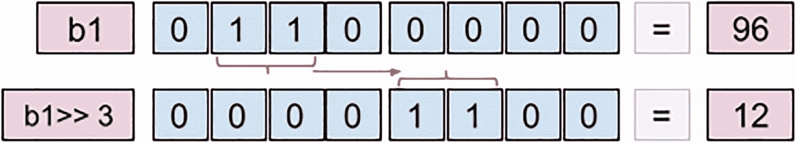
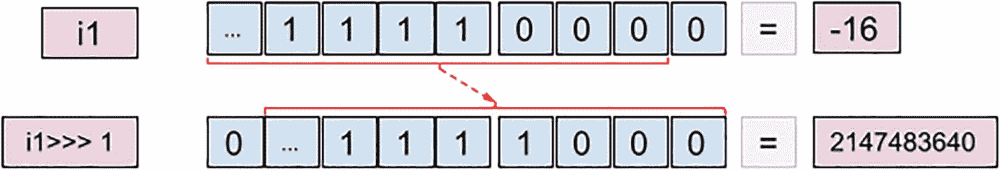

# 六、运算符

前面的章节已经涵盖了 Java 编程的基本概念。你学会了如何组织你的代码，你的文件应该如何命名，你可以使用哪些数据类型，这取决于你要解决的问题。您将学习如何声明字段、变量和方法，以及如何将它们存储在内存中，从而帮助您设计解决方案，使资源消耗达到最优。

在声明变量之后，在这一章中你将学会使用操作符来组合它们。大多数 Java 操作符都是您从数学中学到的，但是因为编程涉及到数字以外的其他类型，所以添加了具有特定用途的额外操作符。在表 [6-1](#Tab1) 中，列出了所有 Java 操作符及其类别和作用域。

表 6-1

Java 转义序列

<colgroup><col class="tcol1 align-left"> <col class="tcol2 align-left"> <col class="tcol3 align-left"></colgroup> 
| 

种类

 | 

操作员

 | 

范围

 |
| --- | --- | --- |
| 铸造 | *(类型)* | 显式类型转换。 |
| 一元，后缀 | expr++，expr—— | 后期递增/递减。 |
| 一元，前缀 | ++exp，exp | 预递增/递减。 |
| 一元的，逻辑的 | `!` | 否定。 |
| 一元、按位 | `~` | 按位补码对整数值执行逐位反转。 |
| 乘法、二进制 | `*, /, %` | 对于数值类型:乘、除、除并返回余数。 |
| 加法、二进制 | `+, -` | 对于数值类型:加法、减法。“+”也用于`String`连接。 |
| 二进制移位 | `>>, >>, >>>` | 对于数值类型:乘以和除以 2 的幂，有符号和无符号。 |
| 条件的、关系的 | `instanceof` | 测试对象是否是指定类型(类、子类或接口)的实例。 |
| 条件的、关系的 | `==, !=, <, >, <=, >=` | 等于、不同于、小于、大于、小于或等于、大于或等于。 |
| 二进制 | `&` | 按位逻辑与。 |
| 二进制异或 | `^` | 双态逻辑异或。 |
| 包含或，二元 | `&#124;` | Bitewise 逻辑 OR。 |
| 条件逻辑 AND | `&&` | 逻辑与。 |
| 条件、逻辑或 | `&#124;&#124;` | 逻辑或。 |
| 条件的、三元的 | `? :` | 也被称为猫王操作员。 |
| 作业 | `=, +=, -=, *=, /= %=, &=, ^=, <<=,>>=, >>>= ,&#124;=` | 简单作业，组合作业。 |

让我们从编程中最常见的操作符开始这一章:赋值操作符“=”。

## 赋值运算符

“=”赋值操作符显然是编程中使用最多的，因为没有它什么也做不了。你创建的任何变量，不管是什么类型，原语还是引用，都必须在程序中的某一点被赋予一个值。使用赋值操作符设置值非常简单:在“=”操作符的左边是变量名，右边是一个值。赋值生效的唯一条件是值与变量的类型匹配。

为了测试这个操作符，你可以使用`jshell`来玩一会儿:只要确保你在详细模式下启动它，这样你就可以看到你的赋值的效果。本章执行的语句如清单 [6-1](#PC1) 所示。

```java
jshell -v
|  Welcome to JShell -- Version 17-ea
|  For an introduction type: /help intro

jshell> int i = 0;
i ==> 0
|  created variable i : int

jshell> i = -4;
i ==> -4
|  assigned to i : int

jshell> String sample = "text";
sample ==> "text"
|  created variable sample : String

jshell> List<String> list = new ArrayList<>();
list ==> []
|  created variable list : List<String>

jshell> list = new LinkedList<>();
list ==> []
|  assigned to list : List<String>

Listing 6-1jshell Play

```

在前面的例子中，我们声明了原始值和引用值，并给它们赋值和重新赋值。不允许对类型与初始类型不匹配的值进行赋值。在清单 [6-2](#PC2) 中的代码示例中，我们试图将一个文本值赋给一个先前声明为`int`类型的变量。

```java
jshell> i = -5;
i ==> -5
|  assigned to i : int

jshell> i = "you are not allowed";
|  Error:
|  incompatible types: java.lang.String cannot be converted to int
|  i = "you are not allowed";
|      ^-------------------^

Listing 6-2More jshell Play

```

JDK 10 中引入的类型推断对此没有影响，变量的类型将根据第一个赋值的类型来推断。显然，这意味着您不能在没有指定初始值的情况下使用`var`关键字声明变量。这显然排除了`null`值，因为它没有类型。

这可以通过将`null`值强制转换成我们感兴趣的类型来实现，如清单 [6-3](#PC3) 所示。

```java
jshell> var j;
|  Error:
|  cannot infer type for local variable j
|    (cannot use 'var' on variable without initializer)
|  var j;
|  ^----^

jshell> var j = 5;
j ==> 5
|  created variable j : int

jshell> var sample2 = "bubulina";
sample2 ==> "bubulina"
|  created variable sample2 : String
// this does not work, obviously
jshell> var funny = null;
|  Error:
|  cannot infer type for local variable funny
|    (variable initializer is 'null')
|  var funny = null;
|  ^---------------^

// yes, this actually works !
jshell> var funny = (Integer) null;
funny ==> null
|  created variable funny : Integer

Listing 6-3jshell Failed Variable Declaration

```

## 显式类型转换`(type)`和`instanceof`

这两个操作符放在一起讨论，因为提供与真实场景中可能需要编写的代码非常相似的代码样本更容易。

之前在书中提到过，最好尽可能保持引用类型的通用性，以便在不破坏代码的情况下改变具体的实现。这就是所谓的**型多态性**。类型多态性是为不同**类型**的实体提供一个单一的接口，或者使用一个单一的符号来表示多个不同的类型。

有时我们可能需要将对象组合在一起，但是根据它们的类型执行不同的代码。还记得上一章提到的`Performer`层级吗？我们将在这里利用这些类型来展示如何使用这些操作符。如果你不想回到上一章去记住层次结构，在图 [6-1](#Fig1) 中它又出现了，但是有了一点变化:一个名为`Graphician`的额外类被添加到层次结构中，它实现了接口`Artist`并扩展了类`Human` <sup>[1](#Fn1)</sup> 。


图 6-1

人类等级制度

在下面的代码示例中，创建了一个类型为`Musician`的对象和一个类型为`Graphician`的对象，它们都被添加到包含类型为`Artist`的引用的列表中。我们可以这样做，因为两种类型都实现了接口`Artist`。清单 [6-4](#PC4) 中的代码显示了这个层次结构中的几个类，它们被用来创建添加到同一个列表中的对象，然后从列表中提取，并测试它们的类型。

```java
package com.apress.bgn.six;

import com.apress.bgn.four.classes.Gender;
import com.apress.bgn.four.hierarchy.*;

import java.util.ArrayList;
import java.util.List;

public class OperatorDemo {

    public static void main(String... args) {
        List<Artist> artists = new ArrayList<>();

        Musician john = new Performer("John", 40, 1.91f, Gender.MALE);
        List<String> songs = List.of("Gravity");
        john.setSongs(songs);
        artists.add(john);

        Graphician diana = new Graphician("Diana", 23, 1.62f, Gender.FEMALE, "MacOs");
        artists.add(diana);

        for (Artist artist : artists) {
            if (artist instanceof Musician) {          // (*)
                Musician musician = (Musician) artist; // (**)
                System.out.println("Songs: " + musician.getSongs());
            } else {
                System.out.println("Other Type: " +  artist.getClass());
            }
        }
    }
}

Listing 6-4Code Sample Showing instanceof

and (type) Operators

```

标有`(*)`的行显示了如何使用`instanceof`操作符。该运算符用于测试对象是否是指定类型(类、超类或接口)的实例。它用于编写条件来决定应该执行哪个代码块。

标有`(**)`的行进行一个引用的显式转换，也称为**转换**操作。由于`instanceof`操作符有助于确定引用所指向的对象属于`Musician`类型，我们现在可以将引用转换为适当的类型，这样就可以调用类`Musician`的方法。

注意如何使用`instanceof`操作符来测试类型，然后，为了使用引用，需要编写一个显式转换。从 Java 14 开始，`instanceof`操作符被丰富成包含了转换，这使得语法更加清晰和简单，如清单 [6-5](#PC5) 所示。

```java
 for (Artist artist : artists) {
    if (artist instanceof Musician musician) {
        System.out.println("Songs: " + musician.getSongs());
    } else {
        System.out.println("Other Type: " +  artist.getClass());
    }
}

Listing 6-5Java 14 New instanceof Syntax

```

但是如果显式转换失败了会发生什么呢？为此，我们将尝试将之前声明的`Graphician`引用转换为音乐家。下面一行可以添加到前面的代码清单中，它不会阻止代码编译。

```java
Musician fake = (Musician) diana;

```

`Graphician`类与`Musician`类型没有关系，所以代码不会运行。控制台中会抛出一个特殊的异常，告诉您发生了什么问题。控制台中打印的错误消息将非常明确，并在下一个日志片段中描述。

```java
Exception in thread "main" java.lang.ClassCastException: class com.apress.bgn.six.Graphician cannot be cast to class com.apress.bgn.four.hierarchy.Musician (com.apress.bgn.six.Graphician is in module chapter.six of loader 'app'; com.apress.bgn.four.hierarchy.Musician is in module chapter.four@1.0-SNAPSHOT of loader 'app')
    at chapter.six/com.apress.bgn.six.OperatorDemo.main(OperatorDemo.java:25)

```

该消息明确指出这两种类型不兼容，并且包含了包和模块名称。

显式转换不限于引用类型；它也适用于原语。在前一章中提到，任何具有较小区间值的类型变量都可以转换为具有较大区间值的类型，而无需显式转换。通过使用显式转换，反过来也是可能的，但是如果值太大，位将丢失，并且值将是意外的。看看清单 [6-6](#PC8) 中描述的 byte 和 int 之间转换的例子。

```java
jshell> byte b = 2;
b ==> 2
|  created variable b : byte

jshell> int i = 10;
i ==> 10
|  modified variable i : int
|    update overwrote variable i : int

jshell> i = b
i ==> 2
|  assigned to i : int

jshell> b = i
|  Error:  \\
|  incompatible types: possible lossy conversion from int to byte
|  b = i
|      ^

jshell> b = (byte) i
b ==> 2
|  assigned to b : byte

jshell> i = 300_000
i ==> 300000
|  assigned to i : int

jshell> b = (byte) i
b ==> -32  // oops! value outside of byte interval
|  assigned to b : byte

Listing 6-6jshell Conversions Examples

```

一般来说，只需使用显式转换来扩大变量的范围，而不是缩小变量的范围，因为缩小变量的范围会导致异常或精度损失。

## 数值运算符

本节将数字类型上最常用的所有运算符组合在一起。你从 math 上知道的数值运算符:`+, -, /, *`和比较器在编程中也有，但是可以组合起来得到不同的效果。

### 一元运算符

一元运算符只需要一个操作数，它们影响应用它们的变量。

#### 增量和减量

在 Java(和其他一些编程语言)中，有一个一元运算符，名为 incrementors( `++`)和 decimator(`--`)。这些运算符放在变量的前面或后面，用于将变量的值增加或减少 1。它们通常在循环中用作计数器，以调节循环的终止。当它们放在变量之前时，叫做**前缀**，当它们放在变量之后时，叫做**后缀**。

当它们有前缀时，在下一条语句中使用变量之前，先对变量执行操作。这意味着在清单 [6-7](#PC9) 中，`i`变量的值将递增，然后赋给`j`。

```java
package com.apress.bgn.six;
public class UnaryOperatorsDemo {
    public static void main(String... args) {
        int i = 1;
        int j = ++i;
        System.out.println("j is " + j + ", i is " + i);
    }
}

Listing 6-7Prefixed Incrementor Example

```

前面代码的预期结果是`j=2`，因为`i`变量的值在赋给`j`之前被修改为 2。因此，预期输出为`j is 2, i is 2`。

当它们是后缀时，在下一个语句中使用该变量之后，对该变量执行操作。这意味着在清单 [6-8](#PC10) 中，`i`的值首先赋给`j`，之后递增。

```java
package com.apress.bgn.six;
public class UnaryOperatorsDemo {
    public static void main(String... args) {
        int i = 1;
        int j = i++;
        System.out.println("j is " + j + ", i is " + i);
    }
}

Listing 6-8Prefixed Incrementor Example

```

前面代码的预期结果是`j=1`，因为`i`变量的值在赋值给`j`后被修改为 2。因此，预期输出为`j is 1, i is 2`。

递减运算符也可以同样的方式使用；唯一的影响是变量减少了 1。

尝试修改`UnaryOperatorsDemo`以使用`--`操作符。

#### 符号运算符

数学运算符`+(plus)`可以用在单个运算符上，表示一个数是正数(相当多余，大多数情况下从不使用)。所以基本上:

```java
int i = 3;

```

与以下内容相同:

```java
int i = +3;

```

数学运算符可用于声明负数。

```java
[jshell> int i = -3
i ==> -3
| created variable i : int

```

或者否定一个表达式:

```java
[jshell> int i = -3
i ==> -3
| created variable i : int
[jshell> int j = - ( i + 4 )
j ==> -1
| created variable j : int

```

正如你在前面的例子中看到的，`( i + 4 )`的结果是 1，因为`i = -3`，但是因为圆括号前面的`-`，最终赋给`j`变量的结果是`-1`。

#### 否定运算符

还有一个一元运算符，它的作用是对变量求反。运算符`"!"`适用于布尔变量，用于求反。所以`true`变成了`false`，而`false`变成了`true`，如清单 [6-9](#PC15) 所示。

```java
[jshell> boolean t = true
t ==> true
| created variable t : boolean
[jshell> boolean f = !t
f ==> false
| created variable f : boolean
[jshell> boolean t2 = !f
t2 ==> true
| created variable t2 : boolean

Listing 6-9Negating Boolean Values in jshell

```

### 二元运算符

二元运算符相当多，有些甚至可以组合起来执行新的运算。这部分从你可能从数学中知道的那些开始。

#### `+`(加/加/串联)运算符

`"+"`用于将两个数值变量相加，如清单 [6-10](#PC16) 中的语句所示。

```java
jshell> int i = 4
i ==> 4
|  created variable i : int

jshell> int j = 6
j ==> 6
|  created variable j : int

jshell> int k = i + j
k ==> 10
|  created variable k : int

jshell> int i = i + 2
i ==> 6
|  modified variable i : int
|    update overwrote variable i : int

Listing 6-10Adding Numeric Values in jshell

```

最后一个语句 int `i = i + 2`的作用是将`i`的值增加 2，正如你所看到的，这里有一点冗余。这个语句可以写成两次不提到`i`，因为它的作用是把 I 的值增加 2。这可以通过使用由赋值和加法操作符组成的`+=`操作符来完成。最佳说法是`i += 2`。

`+`操作符也可以用来连接`String`实例，或者将`String`实例与其他类型的实例连接起来。JVM 根据上下文决定如何使用`+`操作符。例如，试着猜测正在执行的清单 [6-11](#PC17) 中代码的输出。

```java
package com.apress.bgn.six;

public class ConcatenationDemo {
    public static void main(String... args) {
        int i1 = 0;
        int i2 = 1;
        int i3 = 2;
        System.out.println(i1 + i2 + i3);
        System.out.println("Result1 = " + (i1 + i2) + i3);
        System.out.println("Result2 = " + i1 + i2 + i3);
        System.out.println("Result3 = " + (i1 + i2 + i3));
    }
}

Listing 6-11Concatenating String and int Values

```

猜得怎么样了？

如果代码被执行，下面的内容将显示在控制台中。

```java
1\. 3
2\. Result1 = 12
3\. Result2 = 012
4\. Result3 = 3

```

此输出中每一行的解释如下所示:

*   第 1 行的结果可以解释如下:所有操作数的类型都是`int`，所以 JVM 将这些项作为`int`值相加，`System.out.println`方法打印出这个结果。

*   第 2 行的结果可以解释如下:括号隔离了两个术语`(i1+i2)`的相加。因此，JVM 执行圆括号之间的加法，就像对`int`值的普通加法一样。但是在那之后，我们剩下的是`"Result1 = " + 1 + i3`，并且这个操作包括一个`String`操作数，这意味着`+`操作符必须被用作连接操作符，因为添加一个带有文本值的数字没有其他作用。

*   此时，第 3 行解释中的结果应该是显而易见的:我们有三个`int`操作数和一个`String`操作数，因此 JVM 决定操作的上下文不能是数字，所以需要连接。

*   第 4 行的结果可以用与第 2 行类似的方式来解释。括号确保运算的上下文是数字的，因此添加了三个操作数。

这是一个典型的例子，展示了 JVM 如何决定涉及到`+`操作符的操作的上下文，您也可以在其他 Java 教程中找到这个例子。但是 int 变量可以被替换为`float`或`double`，其行为是相似的。串联也适用于引用类型，因为 any Java 类型默认是`Object`的扩展，因此可以通过调用其`toString()`方法转换为`String`。清单 [6-12](#PC19) 显示了一个`String`和一个`Performer`实例之间的连接。

```java
package com.apress.bgn.six;

import com.apress.bgn.four.classes.Gender;
import com.apress.bgn.four.hierarchy.Musician;
import com.apress.bgn.four.hierarchy.Performer;

public class ReferenceConcatenationDemo {
    public static void main(String... args) {
        Musician john = new Performer("John", 43, 1.91f, Gender.MALE);

        System.out.println("Singer: " + john);
        // or convert explicitly
        System.out.println("Singer: " + john.toString());
    }
}

Listing 6-12Concatenating String and Performer Values

```

#### `-`(减)运算符

数学运算符`-(minus)`用于减去两个变量或从一个变量中减去一个值。在清单 [6-13](#PC20) 中，您可以看到这个操作符和由赋值操作符组成的`-=`操作符以及减法操作符是如何使用的。

```java
jshell> int i = 4
i ==> 4
|  created variable i : int

jshell> int j = 2
j ==> 2
|  created variable j : int

jshell> int k = i - j
k ==> 2
|  created variable k : int

jshell> int i = 4
i ==> 4
|  modified variable i : int
|    update overwrote variable i : int

jshell> i  = i - 3
i ==> 1
|  assigned to i : int

jshell> int i = 4
i ==> 4
|  modified variable i : int
|    update overwrote variable i : int

jshell> i -=3
$7 ==> 1
|  created scratch variable $7 : int

Listing 6-13Subtracting Numeric Values in jshell

```

#### `*`(乘)运算符

“`*`”(乘法)运算符用于将两个变量相乘或将一个值与一个变量相乘。可以用在类似于`"+"`和`-`的语句中，还有一个复合运算符“`*=`”，可以用来将一个变量的值相乘并就地赋值。在清单 [6-14](#PC21) 中，您可以看到这个操作符在工作。

```java
jshell>  int i = 4
i ==> 4
|  created variable i : int

jshell> int j = 2
j ==> 2
|  created variable j : int

jshell> int k = i * j
k ==> 8
|  created variable k : int

jshell> int i = 4
i ==> 4
|  modified variable i : int
|    update overwrote variable i : int

jshell> i  = i * 3
i ==> 12
|  assigned to i : int

jshell> int i = 4
i ==> 4
|  modified variable i : int
|    update overwrote variable i : int

jshell>  i *= 3
$7 ==> 12
|  created scratch variable $7 : int

Listing 6-14Multiplying Numeric Values in jshell

```

#### `/`(除法)运算符

`The "/"(divide)`运算符用于将两个变量相除或将一个值除以一个变量。可以在类似语句中使用为“`+`”、`-`，还有一个复合运算符“`/=`”，可以用来对一个变量的值进行除法运算，并当场赋值。

除法的结果被命名为**商，**，它被赋给赋值运算符(" = ")左侧的变量。当操作数是整数时，结果也是整数，余数被丢弃。在清单 [6-15](#PC22) 中，您可以看到这个操作符在工作。

```java
jshell> int i = 4
i ==> 4
|  created variable i : int

jshell> int j = 2
j ==> 2
|  created variable j : int

jshell> int k = i / j
k ==> 2
|  created variable k : int

jshell> int i = 4
i ==> 4
|  modified variable i : int
|    update overwrote variable i : int

jshell> int i = i / 3
i ==> 1
|  modified variable i : int
|    update overwrote variable i : int

jshell> int i = 4
i ==> 4
|  modified variable i : int
|    update overwrote variable i : int

jshell> i /= 3
$7 ==> 1
|  created scratch variable $7 : int

Listing 6-15Divide Numeric Values in jshell

```

#### `%`(模数)运算符

`"%"`也称为**模数**运算符，用于将两个变量相除，但结果是相除的余数。这个操作叫做**模块化** **、**，还有一个复合操作符`%=`，可以用来除一个变量的值，并当场分配余数。在清单 [6-16](#PC23) 中，您可以看到这个操作符在工作。

```java
jshell> int i = 4
i ==> 4
|  created variable i : int

jshell> int j = 3
j ==> 3
|  created variable j : int

jshell> int k = i % j
k ==> 1
|  created variable k : int

jshell> int i = 4
i ==> 4
|  modified variable i : int
|    update overwrote variable i : int

jshell> i = i % 3
i ==> 1
|  assigned to i : int

jshell> int i = 4
i ==> 4
|  modified variable i : int
|    update overwrote variable i : int

jshell> i %= 3
$7 ==> 1
|  created scratch variable $7 : int

Listing 6-16Modulus Numeric Values in jshell

```

模数运算符返回余数，但是当操作数是实数时会发生什么呢？

简而言之，浮点数的运算很复杂。它取决于小数点后的位数，以及用于除法的操作数。看一下清单 [6-17](#PC24) 。

```java
jshell> double d = 5.28d
d ==> 5.28
|  created variable d : double

jshell> d / 2
$2 ==> 2.64
|  created scratch variable $2 : double

jshell> d % 2
$4 ==> 1.2800000000000002
|  created scratch variable $4 : double

Listing 6-17Modulus Numeric Operations with Floating Point Numbers in jshell

```

对上述结果的解释是由于浮点数的内部表示方式导致精度损失。

此外，如果余数是一个小数点后有无限小数位数的实数，表示它是不可能的，所以一些四舍五入是必要的。这显示在清单 [6-18](#PC25) 中。

```java
jshell> float f = 1.9f
f ==> 1.9
|  created variable f : float

jshell> float g = 0.4f
g ==> 0.4
|  created variable g : float

jshell> float h = f % g
h ==> 0.29999995    // remainder
|  created variable h : float

Listing 6-18Loss of Precision in jshell for a Remainder with an Infinite Number of Decimals After the Decimal Point

```

`jshell`中返回的提醒是`0.29999995`，有些情况下可以四舍五入为`0.3`。但是，当数据用于敏感操作时，四舍五入可能是危险的，例如确定机器人手术的肿瘤体积或发射到火星的火箭的完美轨道。

浮点数的舍入是有问题的，因为它会导致精度的损失。

使用浮点数时精度的损失不是 Java 的问题，因为根据 IEEE754 <sup>[2](#Fn2)</sup> 算法的规则支持使用浮点数的运算。

如果一个项目需要更高精度的数学运算，`java.lang.Math`类提供了不同类型的舍入和其他类型的浮点数运算的方法。

### 关系运算

在某些情况下，当设计问题的解决方案时，您需要引入条件来驱动和控制执行流。条件要求使用**比较**运算符对两个项之间的比较进行评估。本节描述了 Java 中使用的所有比较运算符，并提供了代码示例。我们继续吧。

#### `==`等于运算符

测试术语的相等性。因为在 Java 中，单个等号(" = ")用于赋值，所以引入了双等号来测试相等性并避免混淆。该操作符经常用于控制执行流。控制执行流是下一章的主题，但是为了说明如何使用`"=="`操作符，本章将介绍几个简单的代码示例，包括`if`和`for`等控制语句。在清单 [6-19](#PC26) 中，你可以看到一个测试`"=="`比较器在数组中搜索值 2 的例子。如果找到该值，则在控制台中打印找到该值的索引。

```java
package com.apress.bgn.six;

public class ComparisonOperatorsDemo {
    public static void main(String... args) {
        int[] values = {1, 7, 9, 2, 6,};
        for (int i = 0; i < values.length; ++i) {
            if (values[i] == 2) {
                System.out.println("Fount 2 at index: " + i);
            }
        }
    }
}

Listing 6-19Example for Using the "==" Operator to Test a Value in an Array

```

对标记行中的条件进行评估，结果是一个布尔值。当结果为`false`时，什么都不做，但是如果结果为`true`则打印索引。因为结果是布尔类型的，如果您犯了一个错误，使用了`=`而不是`==`，代码将无法编译。

在比较布尔值时，你必须格外小心。清单 [5-20](#PC27) 中的代码可以编译并运行，但是它不能像预期的那样工作。

```java
package com.apress.bgn.six;

public class BadAssignementDemo {
    public static void main(String... args) {
        boolean testVal = false;

        if(testVal = true) {
            System.out.println("TestVal got initialized incorrectly!");
        } else {
            System.out.println("TestVal is false? " + (testVal == false));
        }
    }
}

Listing 6-20Example of an Unexpected Initialization of a Boolean Variable Instead of an Evaluation of Its Value

```

“`==`”符号对于原语来说很好。对于引用类型，在解释栈和堆内存的区别时，需要使用本书前面**章节** [开头的`equals()`方法。](05.html)

#### 其他比较运算符

其他比较运算符只作用于基本类型。由于没有太多关于它们的内容，本节将一一介绍。

*   测试术语的不相等性。它与`==`运算符相反。这个操作符也作用于引用类型，但是它比较的是引用值而不是对象本身，就像`==`一样。

作为一个练习，修改清单 [6-19](#PC26) 中的例子，当数组元素值不等于 2 时打印一条消息。

*   `<`和`<=`的用途和你可能在数学课上学过的一样。第一个(`<`)测试操作符左边的项目是否小于右边的项目。下一个(`<=`)测试运算符左边的项目是否小于或等于右边的项目。此运算符不能用于引用类型。

*   `>`和`>=`的用途和你可能在数学课上学过的一样。第一个(`>`)测试操作符左边的项目是否大于右边的项目。下一个(`>=`)测试运算符左边的项目是否大于或等于右边的项目。此运算符不能用于引用类型。

几乎所有数值运算符都可以用于不同类型的变量，因为它们会自动转换为具有更宽区间表示的类型。清单 [6-21](#PC28) 中的代码反映了一些情况，但是在实践中，你可能需要做出更加极端的事情，这些事情并不总是遵守编程的常识规则，也没有遵循好的实践。不过，如果可以的话，尽量避免这样做！

```java
package com.apress.bgn.six;

public class MixedOperationsDemo {
    public static void main(String... args) {
        byte b = 1;
        short s = 2;
        int i = 3;
        long l = 4;

        float f = 5;
        double d = 6;
        int ii = 6;

        double resd = l + d;
        long resl = s + 3;
        //etc

        if (b <= s) {
            System.out.println("byte val < short val");
        }
        if (i >= b) {
            System.out.println("int val >= byte val");
        }
        if (l > b) {
            System.out.println("long val > byte val");
        }
        if(d > i) {
            System.out.println("double val > byte val");
        }
        if(i == i) {
            System.out.println("double val == int val");
        }
    }
}

Listing 6-21Different Primitive Types Comparison Examples

```

只要确保你曾经处于这样一种情况，你需要做一些可疑的事情*(非优化代码构造)*像这些来进行大量的测试，并且认为你的转换是好的，特别是当涉及到浮点类型的时候。这是因为(例如)清单 [6-22](#PC29) 中的这段代码可能会产生意想不到的结果。

```java
package com.apress.bgn.six;

public class BadDecimalPointDemo {
    public static void main(String... args) {
        float f1 = 2.2f;
        float f2 = 2.0f;
        float f3 = f1 * f2;
        if (f3 == 4.4) {
            System.out.println("expected float value of 4.4");
        } else {
            System.out.println("!! unexpected value of " + f3);
        }
    }
}

Listing 6-22Unexpected Comparison Results with Floating Numbers

```

如果您期望控制台中打印出消息*预期浮点值为 4.4* ，您将会非常惊讶。

任何 IEEE 754 浮点数表示都会出现问题，因为一些数字在十进制中看起来有固定的小数位数，实际上在二进制中有无限多的小数位数。所以显然我们不能用`==`来比较浮点数和双精度数。最容易实现的解决方案之一是使用包装类提供的比较方法，在本例中是`Float.compare`，如清单 [6-23](#PC30) 所示。

```java
package com.apress.bgn.six;

public class GoodDecimalPointDemo {
    public static void main(String... args) {
        float f1 = 2.2f;
        float f2 = 2.0f;
        float f3 = f1 * f2;
        if (Float.compare(f3,4.4f) == 0) {
            System.out.println("expected float value of 4.4");
        } else {
            System.out.println("!!unexpected value of " + f3);
        }
    }
}

Listing 6-23Correct Comparison Results with Float.compare

```

使用前面的例子，预期的消息现在被打印在控制台中:*预期的浮点值 4.4* 。

## 按位运算符

在 Java 中，有几个操作符用于位级操作数值类型的变量。按位运算符用于改变操作数中的各个位。由于减少了资源的使用，位运算速度更快，通常使用的 CPU 处理能力也更少。它们在编程视觉应用(例如游戏)时最有用，在这些应用中，颜色、鼠标点击和移动应该被快速确定，以确保令人满意的体验。

### 按位非

运算符`~`有点像二元运算符**的反运算符**。Is 执行整数值的逐位反转。这会影响用于表示该值的所有位。所以如果我们宣布

`byte b1 = 10;`

二进制表示是`00001010`。`Integer`类提供了一个名为`toBinaryString()`的方法，可以用来打印之前定义的变量的二进制表示，但是它不会打印所有的位，因为这个方法不知道我们想要多少位的表示。所以我们需要使用一个特殊的`String`方法来格式化输出。清单 [6-24](#PC31) 中描述的方法可以用来打印 8 位二进制的`b1`值，正如前面提到的。

```java
public static void print8Bits(byte arg) {
    System.out.println("decimal:" + arg);
    String str =
       String.format("%8s", Integer.toBinaryString(arg)).replace(' ', '0');
    System.out.println("binary:" + str);
}

Listing 6-24Method Used to Print Each Bit of a byte Value

```

如果我们对`b1`值应用`~`操作符，得到的二进制值就是`11110101`。如果您没有注意到，该值超出了`byte`间隔范围，并自动转换为`int`。这就是负数在 Java 中的内部表示方式——根据 Java 语言规范，这种表示方式称为 **2 的补码**。(这一点将在本章末尾讨论。)

因此结果将是`-11`，如清单 [6-25](#PC32) 中的代码所示:

```java
package com.apress.bgn.six;
BitwiseDemo

public class BitwiseDemo {
    public static void main(String... args) {
        byte b1 = 10;
        print8Bits(b1);
        byte b2 = (byte) ~b1;
        print8Bits(b2);
    }

    // print8Bits method omitted
}

// execution result
decimal:10
binary:00001010
decimal:-11
binary:11111111111111111111111111110101

Listing 6-25Testing the ~ Bitwise Negator Operator

```

在前面的代码清单中，您可能注意到了这个语句字节`b2 = (byte) ~b1`,并且希望得到解释。按位补码表达式运算符需要一个可转换为基元整数类型的操作数，否则会发生编译时错误。在内部，Java 使用一个或多个字节来表示值。`~`运算符将其操作数转换为`int`类型，因此在进行补码运算时可以使用 32 位；这是避免精度损失所必需的。这就是为什么在前面的例子中需要显式转换为`byte`。因为有了图像，一切都变得更加清晰，在图 [6-2](#Fig2) 中，你可以看到`~`对`b1`变量位的影响，与其值平行。


图 6-2

negator 运算符对字节值中每一位的影响

### 按位 AND

按位`AND`运算符由`&`表示，它逐位比较两个数字。如果相同位置上的位的值为`1`，则结果中的位将为`1`。清单 [6-26](#PC33) 中的代码示例描述了`&`操作符的结果。

```java
package com.apress.bgn.six;

public class BitwiseDemo {
    public static void main(String... args) {
        byte b1 = 117;  // 01110101
        print8Bits(b1);
        byte b2 = 95;   // 01011111
        print8Bits(b2);
        byte result  = (byte) (b1 & b2);  // 01010101
        print8Bits(result);
    }

    // print8Bits method omitted
}

// execution result
decimal:117
binary:01110101
decimal:95
binary:01011111
decimal:85
binary:01010101

Listing 6-26Testing the & Bitwise AND Operator

```

在图 [6-3](#Fig3) 中可以更好地看到`&`操作符的效果。`01010101`值是十进制数 85 的二进制表示。


图 6-3

`&`运算符对每一位的影响

此外，出于实际原因，Java 中提供了组合操作符`&=`，以便可以对结果所赋给的同一个变量进行按位`AND`操作，如清单 [6-27](#PC34) 所示。这样做的好处是结果会自动转换成`byte`，所以不需要显式转换。

```java
jshell> byte b1 = 117
b1 ==> 117
|  created variable b1 : byte

jshell> b1 &= 95
$2 ==> 85
|  created scratch variable $2 : byte

Listing 6-27Testing the &= Bitwise AND Operator in jshell

```

### 按位异或

按位`OR`运算符(也称为包含 or)由`|`(管道)表示，它逐位比较两个数字，如果至少一个位为 1，则结果中的位被设置为 1。清单 [6-28](#PC35) 中的代码描述了|操作符的结果。

```java
package com.apress.bgn.six;

public class BitwiseDemo {
    public static void main(String... args) {
        byte b1 = 117; // 01110101
        print8Bits(b1);
        byte b2 = 95; // 01011111
        print8Bits(b2);
        byte result  = (byte) (b1 | b2); // 01111111
        print8Bits(result);
    }

    // print8Bits method omitted
}

// execution result
decimal:117
binary:01110101
decimal:95
binary:01011111
decimal:127
binary:01111111

Listing 6-28Testing the | Bitwise OR Operator

```

在图 [6-4](#Fig4) 中可以更好地看到`|`操作符的效果。`01111111`值是数字 127 的二进制表示。


图 6-4

`|`运算符对每一位的影响

此外，出于实际原因，Java 中提供了复合运算符`|=`，以便可以对结果所赋给的同一个变量进行按位异或运算，如清单 [6-29](#PC36) 所示。这样做的好处是结果会自动转换成`byte`，所以不需要显式转换。

```java
jshell>  byte b1 = 117
b1 ==> 117
|  created variable b1 : byte

jshell> b1 |= 95
$2 ==> 127
|  created scratch variable $2 : byte

Listing 6-29Testing the |= Bitwise OR Operator in jshell

```

### 按位异或

按位异或或异或运算符由`^`表示，它逐位比较两个数，如果两位的值不同，则结果中的位被设置为 1。清单 [6-30](#PC37) 中的代码示例描述了`^`操作符的结果。

```java
package com.apress.bgn.six;

public class BitwiseDemo {
    public static void main(String... args) {
        byte b1 = 117; // 01110101
        print8Bits(b1);
        byte b2 = 95; // 01011111
        print8Bits(b2);
        byte result  = (byte) (b1 ^ b2); // 00101010
        print8Bits(result);
    }

    // print8Bits method omitted
}

// execution result
decimal:117
binary:01110101
decimal:95
binary:01011111
decimal:42
binary:00101010

Listing 6-30Testing the ^ Bitwise XOR Operator

```

在图 [6-5](#Fig5) 中可以更好地看到`^`操作符的效果。`00101010`值是数字 42 的二进制表示。


图 6-5

`^`运算符对每一位的影响

此外，出于实际原因，Java 中提供了复合运算符`^=`，以便可以对结果所赋给的同一个变量进行按位异或运算，如清单 [6-31](#PC38) 所示。这样做的好处是结果会自动转换成`byte`，所以不需要显式转换。

```java
jshell> byte b1 = 117
b1 ==> 117
|  created variable b1 : byte

jshell> b1 ^= 95
$2 ==> 42
|  created scratch variable $2 : byte

Listing 6-31Testing the ^= Bitwise OR Operator in jshell

```

## 逻辑运算符

当设计用于控制程序执行流程的条件时，有时需要编写复杂的条件:由多个表达式构造的复合条件。有四种运算符可用于构造复杂的条件。其中两个是可以重用的位运算`&(AND)`和`|(OR)`，但是它们需要对条件的所有部分进行求值。其他操作符`&&(AND)`和`||(OR)`与前面提到的操作符具有完全相同的效果，但不同之处在于它们不需要对所有表达式求值，这就是为什么它们也被称为快捷操作符。为了解释这些操作符的行为，有一个典型的例子可以使用。

在清单 [6-32](#PC39) 中，我们声明了一个包含 10 个术语的列表(其中一些是`null`)和一个生成随机索引的方法，该索引用于从列表中选择一个条目。然后我们测试从列表中选择的元素，看看它是否不是`null`并且等于一个期望值。如果两个条件都为真，则在控制台中打印一条消息。让我们看看第一个例子。

```java
package com.apress.bgn.six;

import java.util.ArrayList;
import java.util.List;
import java.util.Random;

public class LogicalDemo {
    static List<String> terms = new ArrayList<>() {{
        add("Rose");
        add(null);
        add("River");
        add("Clara");
        add("Vastra");
        add("Psi");
        add("Cas");
        add(null);
        add("Nardhole");
        add("Strax");
    }};

    public static void main(String... args) {
        for (int i = 0; i < 20; ++i) {
            int index = getRandomIndex(terms.size());
            String term = terms.get(index);
            System.out.println("Generated index: " + index);
            if (term != null & term.equals("Rose")) {
                System.out.println("Rose was found");
            }
        }
    }

    private static int getRandomIndex(int listSize) {
        Random r = new Random();
        return r.nextInt(listSize);
    }
}

Listing 6-32Testing the & Operator to Control the Execution Flow

```

为了确保得到预期的结果，我们将从列表中选择一个随机元素的操作重复 20 次。正如您可能注意到的，在标记的行中，按位`&`用于组合两个表达式。只有当变量`term`的值不是`null`并且等于`Rose`时，您才会期望控制台中打印出文本“*Rose found*”。但是，当运行前面的代码时，会打印出以下内容:

```java
Exception in thread "main" java.lang.NullPointerException: Cannot invoke "String.equals(Object)" because "term" is null
    at chapter.six/com.apress.bgn.six.LogicalDemo.main(LogicalDemo.java:56)

```

这是因为两个表达式都被求值。但是想想吧！如果`term`变量是`null`，我们甚至应该评估它与`Rose`的相等性吗，尤其是在调用`null`对象的方法会导致运行时错误的情况下？显然不是，这就是为什么`&`不适合这种情况。如果 term 是`null`，那么它不满足第一个条件，对第二个条件求值也没有意义，所以输入`&&`快捷操作符，它就能做到这一点。这是因为当使用逻辑`AND`操作符时，如果第一个表达式被求值为`false`，那么第二个表达式被求值为什么并不重要；结果永远是`false`。因此，我们可以将前面的代码示例更正为清单 [6-33](#PC41) 中的代码示例。

```java
package com.apress.bgn.six;

import java.util.ArrayList;
import java.util.List;
import java.util.Random;

public class LogicalDemo {
    static List<String> terms = new ArrayList<>() {{
        /* list elements omitted */}};

    public static void main(String... args) {
        for (int i = 0; i < 20; ++i) {
            int index = getRandomIndex(terms.size());
            String term = terms.get(index);
            System.out.println("Generated index: " + index);
            if (term != null && term.equals("Rose")) {
                System.out.println("Rose was found");
            }
        }
    }

   // getRandomIndex method omitted
}

Listing 6-33Testing the && Operator to Control the Execution Flow

```

当执行代码时，不会抛出异常，因为如果`term`是`null`，则第二个表达式不会被求值。因此，这段代码在技术上更有效，因为它评估的条件更少，但它也设计得更好，因为它避免了失败。

现在，让我们修改前面的代码示例，这一次，如果我们找到了`null`或`Rose`，我们将打印一条消息。为此需要一个 or 运算符，所以我们将首先尝试使用按位版本(清单 [6-34](#PC42) ):

```java
package com.apress.bgn.six;

import java.util.ArrayList;
import java.util.List;
import java.util.Random;

public class LogicalDemo {
    static List<String> terms = new ArrayList<>() {{
        /* list elements omitted */}};

    public static void main(String... args) {
        for (int i = 0; i < 20; ++i) {
            int index = getRandomIndex(terms.size());
            String term = terms.get(index);
            System.out.println("Generated index: " + index);
            if (term == null | term.equals("Rose")) {
                System.out.println("null or Rose was found");
            }
        }
    }

   // getRandomIndex method omitted
}

Listing 6-34Testing the && Operator to Control the Execution Flow

```

如果我们运行前面的代码，当随机索引恰好匹配列表中的一个`null`元素的索引时，就会抛出一个`NullPointerException`。这是因为`|`操作符要求对两个表达式都求值，所以如果`term`为空，调用`term.equals(..)`将导致抛出异常。因此，为了确保代码按预期工作，必须用`||`替换`|`，这简化了条件，并且不计算其中的第二个表达式，除非第一个条件的计算结果是`false`。这是因为当使用逻辑 OR 操作符时，如果第一个表达式的计算结果是`true`，那么第二个表达式的计算结果是什么并不重要，结果总是`true`。我们将把它作为一个练习留给你。

条件可以由多个表达式和多个运算符组成，无论是`&&`还是`||`。清单 [6-35](#PC43) 中的代码描述了一些复杂的情况。

```java
package com.apress.bgn.six;

import java.util.ArrayList;
import java.util.List;
import java.util.Random;

public class ComplexConditionsDemo {
    static List<String> terms = new ArrayList<>()  {{
        /* list elements omitted */}};

    public static void main(String... args) {
        for (int i = 0; i < 20; ++i) {
            int rnd = getRandomIndex(terms.size());
            if (rnd == 0 || rnd == 1 || rnd <= 3) {
                System.out.println(rnd + ": this works...");
            }
            if (rnd > 3 && rnd <=6 || rnd < 3 && rnd > 0) {
                System.out.println(rnd + ": this works too...");
            }
        }
    }

    private static int getRandomIndex(int listSize) {
        Random r = new Random();
        return r.nextInt(listSize);
    }
}

Listing 6-35Complex Conditions Composed from Multiple Expressions

```

当心变得太复杂的情况；确保用大量测试覆盖这段代码。在编写复杂的条件时，一些表达式可能会变得多余，IntelliJ IDEA 和其他智能编辑器会在多余和未使用的表达式上显示死代码警告，以帮助开发人员改进代码设计。

## 移位运算符

**移位操作符**是在比特级工作的操作符。因为移动位是一个敏感的操作，所以这些操作数的要求是参数必须是整数。运算符左边的操作数是将要移位的数字，运算符右边的操作数是将要移位的位数。

Java 中有三个移位操作符，每一个都可以和赋值操作符组合起来进行移位，并将结果就地赋给原变量。本节通过简单的例子和图像来分析所有的移位操作符，使事情变得清晰。

### `<<`左移运算符

顾名思义，给定一个用二进制表示的数，这个运算符用于向左移位。清单 [6-36](#PC44) 中的代码显示了运行中的`<<`左移操作符。

```java
package com.apress.bgn.six;

public class ShiftDemo {
    public static void main(String... args) {
        byte b1 = 12; // 00001100
        print8Bits(b1);
        byte b2 = (byte) (b1 << 3); // 01100000
        print8Bits(b2);
    }

    // print8Bits method omitted
}

// execution result
decimal:12
binary:00001100
decimal:96
binary:01100000

Listing 6-36Testing the << Operator

```

当位向左移位时，剩余的位置用 0 填充。同样，数字变大了，新值是它的旧值乘以`2^N`，其中`N`是第二个操作数。

清单 [6-36](#PC44) 中的代码可以像`b1 <<= 3`一样编写，使用复合操作符，不需要声明另一个变量。结果是`12 * 2^3`。如图 [6-6](#Fig6) 所示移位。


图 6-6

`<

移位运算符将`byte`值提升为`int`，以避免精度损失。在前面的代码示例中，要移位的位数很小，足以产生一个位于`byte`类型区间内的值。这就是为什么显式转换为`byte`有效，并且结果仍然有效。这并不总是可能的，正如您将在本节中进一步看到的那样。

### `>>`符号右移运算符

顾名思义，给定一个用二进制表示的数，这个运算符用于向右移位。清单 [6-37](#PC45) 中的代码显示了运行中的`>>`右移操作符。

```java
package com.apress.bgn.six;

public class ShiftDemo {
    public static void main(String... args) {
        byte b1 = 96; // 01100000
        print8Bits(b1);
        byte b2 = (byte) (b1 >> 3); // 00001100
        print8Bits(b2);
    }

    // print8Bits method omitted
}

// execution result
decimal:96
binary:01100000
decimal:12
binary:00001100

Listing 6-37Testing the >> Operator

```

当位向右移位时，如果数字为正数，则剩余的位置用 0 填充。如果数字为负数，则剩余的位置将被替换为 1。这样做是为了保留数字的符号。同样，数字变小，新值是它的旧值除以`2^N`，其中`N`是第二个操作数。

清单 [6-37](#PC45) 中的代码可以写成`b1 >>= 3`，使用复合运算符，无需声明另一个变量。结果是`12 * 2^3`。如图 [6-7](#Fig7) 所示移位。



图 6-7

`>>`运算符的作用

图 [6-7](#Fig7) 和清单 [6-37](#PC45) 都显示了应用于正数的右移运算符。当涉及到负数时，事情就变得复杂了，因为负数在内部被表示为 2 的补码。这是什么意思？这意味着，为了得到负数的表示，我们得到正数的表示，我们翻转这些位，然后加 1。图 [6-8](#Fig8) 描绘了从`7`的表示开始，获取`-7`的内部表示的过程。


图 6-8

用二进制补码在内部表示负数

2 的补码表示中的`-7`值在`byte`范围之外，因此内部负数表示为整数。这意味着`print8Bits(..)`方法需要被替换为打印所有 32 位`int`值的版本。清单 [6-38](#PC46) 显示了应用于负数的`>>`无符号右移运算符。

```java
package com.apress.bgn.six;

public class ShiftDemo {
    public static void main(String... args) {
        System.out.println( " -- ");
        int i1 = -96;
        print32Bits(i1);
        int i2 =  i1 >> 3;
        print32Bits(i2);
    }

    public static void print32Bits(int arg) {
      System.out.println("decimal:" + arg);
      String str = arg > 0 ?
       String.format("%32s", Integer.toBinaryString(arg)).replace(' ', '0'):
       String.format("%32s", Integer.toBinaryString(arg)).replace(' ', '1');
      System.out.println("binary:" + str);
    }
}

// execution result
decimal:-96
binary:11111111111111111111111110100000
decimal:-12
binary:11111111111111111111111111110100

Listing 6-38Testing the >> Operator with Negative Numbers

```

二进制补码表示的一个优点是，算术运算对于有符号和无符号运算符是相同的，这意味着 cpu 的算术逻辑单元需要一半的电路。

二进制补码表示的一个奇特之处在于`-Integer.MAX_VALUE`和`Integer.MIN_VALUE`以相同的方式表示。

### `>>>`无符号右移运算符

`>>>`无符号右移运算符也叫逻辑移位。给定一个用二进制表示的数，该运算符用于将位向右移位，剩余的位置用 0 替换，而不管该值是正还是负。这就是为什么结果总是正数。

清单 [6-39](#PC47) 显示了`>>>`无符号右移操作符对负值的作用。

```java
package com.apress.bgn.six;

public class ShiftDemo {
    public static void main(String... args) {
        int i1 = -16;
        print32Bits(i1);
        int i2 = i1 >>> 1;
        print32Bits(i2);
    }

    // print32Bits method omitted
}

// execution result
decimal:-16
binary:11111111111111111111111111110000
decimal:2147483640
binary:01111111111111111111111111111000

Listing 6-39Testing the >>> Operator with Negative Values

```

清单 [6-39](#PC47) 中的代码可以像`i1 >>>= 1`一样编写，使用组合操作符，不需要声明另一个变量。结果是一个非常大的正数。如图 [6-9](#Fig9) 所示移位。



图 6-9

`>>>`运算符对负值的影响

与所有按位运算符一样，移位运算符将`char`、`byte`或`short`类型变量提升为`int`，这就是为什么显式转换是必要的。你可能已经注意到，对负数进行移位是很棘手的；结果数字很容易超出类型允许值的区间，显式转换会导致精度损失，甚至严重异常。那么为什么要使用它们呢？因为他们速度很快。只要确保在使用移位运算符时进行密集测试即可。

## 猫王接线员

****猫王运算符**是 Java 中唯一的三元运算符。它的功能相当于一个 Java 方法，该方法评估一个条件，并根据结果返回值。Elvis 操作员的模板如下所示:**

```java
variable = (condition) ? val1 : val2

```

清单 [6-40](#PC49) 中描述了与该运算符等效的方法。

```java
variable = methodName(..);

type methodName(..) {
    if (condition) {
        return val1;
    } else {
        return val2;
    }
}

Listing 6-40The Elvis Operator Equivalent Method

```

这个运算符被命名为 Elvis 运算符的原因是，问号类似于 Elvis Presley 的头发，而冒号类似于眼睛。Elvis 操作员可以在`jshell`中轻松测试，如清单 [6-41](#PC50) 所示。

```java
jshell> int a = 4
a ==> 4
|  created variable a : int

jshell> int result = a > 4 ? 3 : 1;
result ==> 1
|  created variable result : int

jshell> String a2 = "test"
a2 ==> "test"
|  created variable a2 : String

jshell> var a3 = a2.length() > 3 ? "hello" : "bye-bye"
a3 ==> "hello"
|  created variable a3 : String

Listing 6-41The Elvis Operator Being Tested in jshell

```

当您有一个简单的`if`语句，每个分支只包含一个表达式时，这个操作符非常实用，因为使用这个操作符，您可以将所有内容压缩到一个表达式、一行代码中。只要确保在使用它时，代码的可读性得到了提高。从性能的角度来看，`if`语句和等效的 Elvis 操作符表达式没有区别。使用 Elvis 操作符的另一个优点是表达式可以用来初始化变量。

## 摘要

在本章中，我们了解到:

*   Java 有很多操作符，简单的，复合的。

*   按位运算速度很快，但是很危险。

*   负数在内部用二进制补码表示。

*   操作符在不同的上下文中做不同的事情。

*   Java 有一个三元运算符，它接受三个操作数:一个布尔表达式和两个相同类型的对象。布尔表达式的求值结果决定了哪个操作数是语句的结果。

本章的目的只是让你熟悉整本书中用到的所有操作符，帮助你理解提供的解决方案，甚至设计和编写你自己的解决方案。

<aside aria-label="Footnotes" class="FootnoteSection" epub:type="footnotes">Footnotes [1](#Fn1_source)

新类的实现与本章无关，所以这里不详细介绍，但是你可以在本书附带的项目中找到它。

  [2](#Fn2_source)

关于浮点运算的 IEEE 标准的描述可以在维基百科上找到，“IEEE 754，” [`https://en.wikipedia.org/wiki/IEEE_754`](https://en.wikipedia.org/wiki/IEEE_754) `,`，2021 年 10 月 15 日访问。

 </aside>**