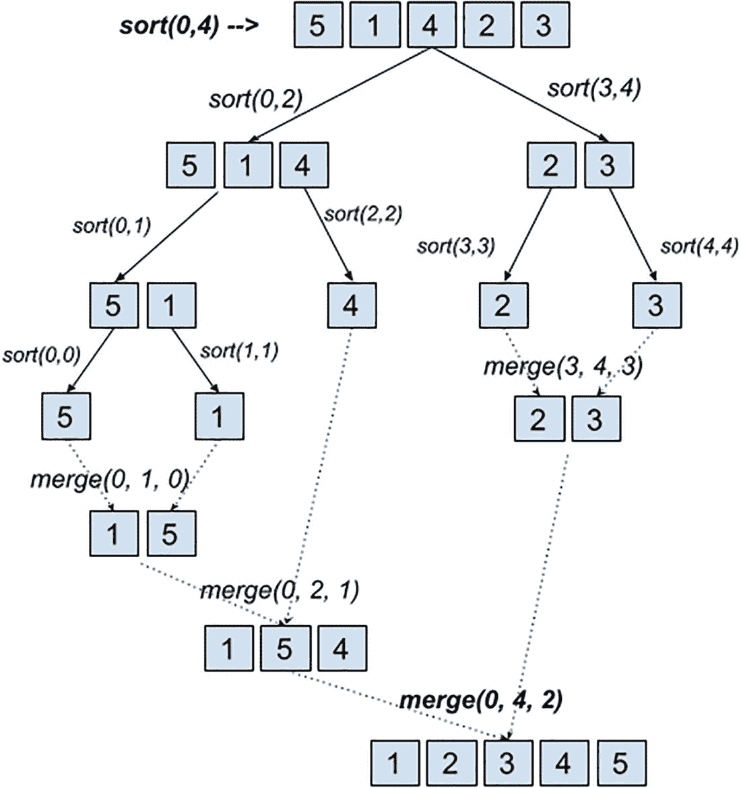
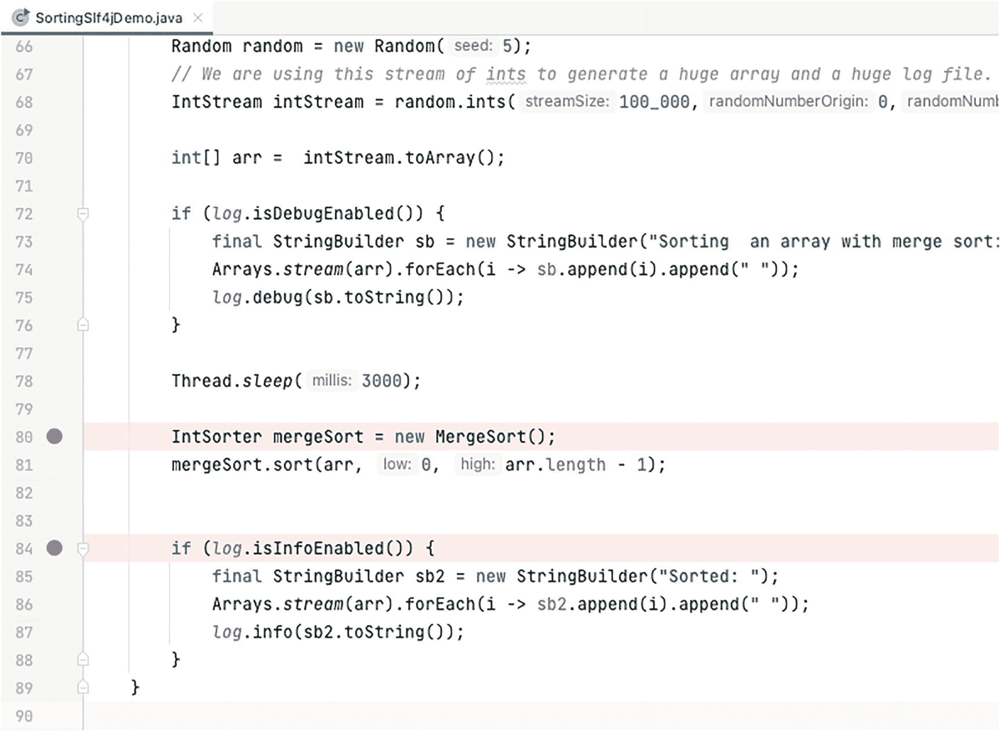
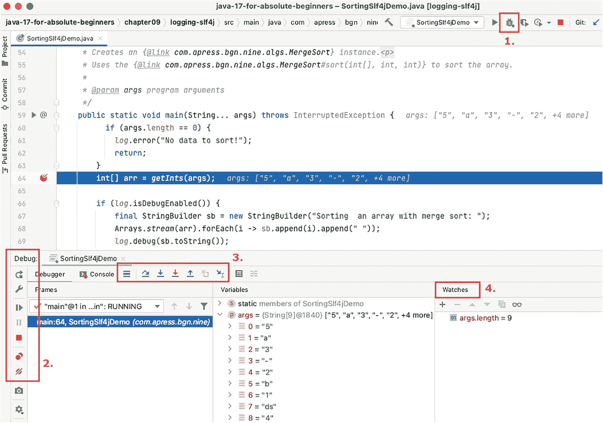
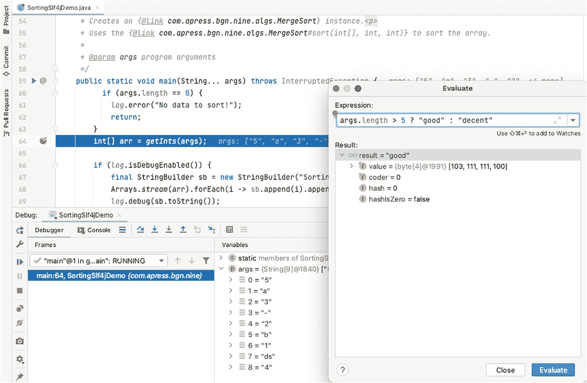
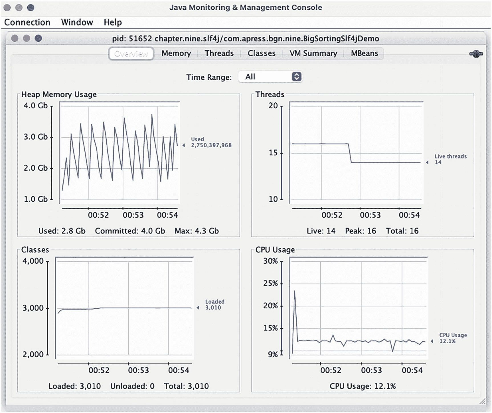
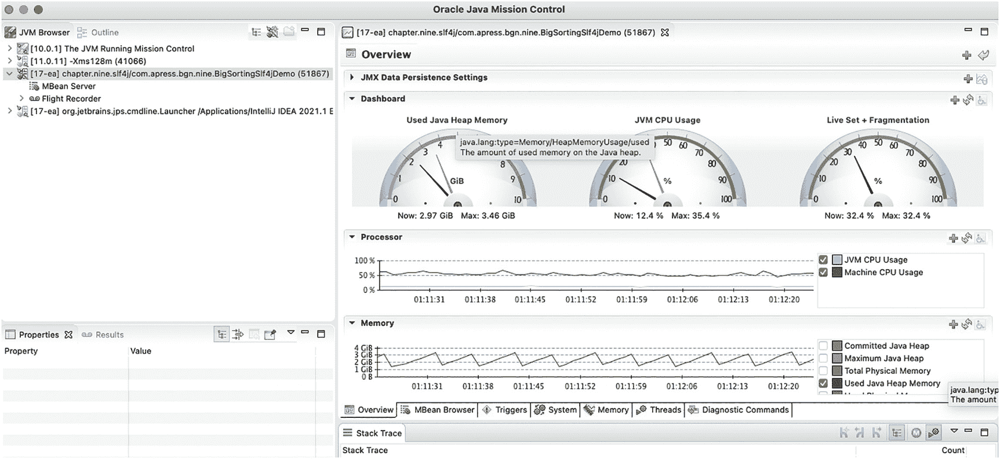
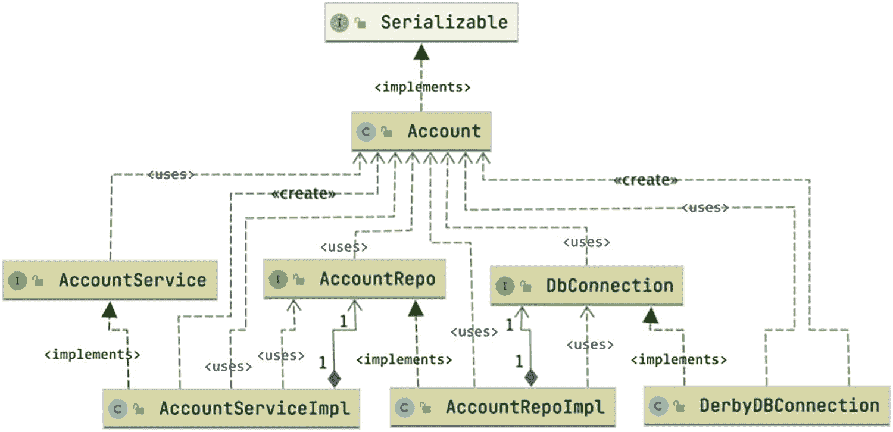
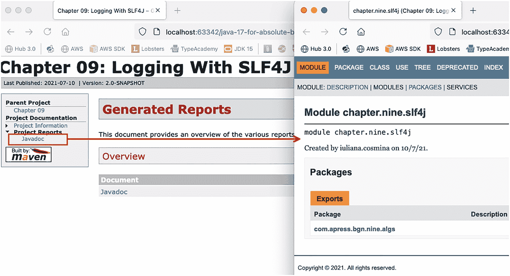

# 九、调试、测试和日志

开发工作不仅仅要求你为一个问题设计解决方案并为其编写代码。为了确保您的解决方案能够解决问题，您必须对其进行测试。**测试**包括确保组成您的解决方案的每个组件在预期和意外情况下都能正常运行。

测试代码最实用的方法是通过**记录**中间变量的值，并在特定情况下在控制台中打印出来。

当解决方案很复杂时，**调试**提供了暂停执行和检查变量状态的机会。调试有时会涉及到**断点**，并且需要一个 IDE。顾名思义，断点是应用暂停执行和检查变量的地方。

在确保您的解决方案符合需求之后，您必须记录它，尤其是当正在解决的问题需要复杂的代码来解决时。或者如果您的解决方案可能是其他应用的先决条件，那么您有责任向其他开发人员解释如何使用它。

这一章将会介绍一些实现这些的方法，因为这些是开发人员的关键才能。

## 排除故障

调试是发现并解决计算机程序中的缺陷或问题的过程。有更多的调试策略，根据应用的复杂性，可以使用一种或多种。这里列出了这些技术:

*   记录流程中涉及的对象的中间状态并分析日志文件

*   使用断点来暂停程序的执行并检查进程中涉及的对象的中间状态的交互式调试

*   测试

*   应用或系统级监控

*   内存转储项目分析是一种动态程序分析形式，它测量程序占用的内存、使用的 CPU、方法调用的持续时间等等。

先说最简单的调试方式:**日志**。

### 记录

在现实世界中，伐木是一个破坏性的过程，是对树木进行砍伐和加工以生产木材。在软件编程中，**日志记录**意味着写日志文件，以后可以用来识别代码中的问题。记录信息最简单的方法是使用`System.out.print*(..)`方法族，如图 [9-1](#Fig1) 所示。


图 9-1

`System.out.print`法族

本章中的示例使用了一个类层次结构，这些类提供了对整数数组进行排序的方法。图 [9-2](#Fig2) 中描述了类的层次结构。


图 9-2

分类层次结构排序

在下一个代码示例中，`MergeSort`类的内容被修改，以添加`System.out.print(..)`语句来记录算法的步骤。

**Merge-Sort** 是一种性能优于冒泡排序(在前一章介绍过)的排序算法的名字。Merge-Sort 将数组排序描述为以下一系列步骤:

*   数组被分成两半，每一半再被分成两半，直到得到的数组是一个容易排序的数组，然后排序后的数组被重复合并，直到结果是一个排序后的数组。

这种重复分割数组直到排序成为可管理的操作的方法被称为 **divide et impera** **，**也被称为**分治**。有更多的算法遵循相同的方法来解决问题，合并排序只是本书将讨论的第一个算法。在图 9-3 中，你可以看到合并排序算法的每一步都发生了什么。


图 9-3

合并排序算法步骤

在算法的每一步中，识别数组的中间索引。然后调用`sort(..)`方法来处理被索引从中间分开的数组。这种情况一直持续到没有中间索引为止，因为数组只有一个元素。也就是调用`merge(..)`方法的时候；除了合并数组片段之外，它还在合并过程中对它们进行排序。

图 [9-3](#Fig3) 以与`System.out.print(..)`语句生成的输出非常相似的方式描述了该算法。既然提到该算法是基于分治法，图 [9-4](#Fig4) 更好地显示了运算的顺序。



图 9-4

合并排序算法步骤显示为树

为了编写模拟合并排序算法的代码，我们需要编写两个方法`sort(array, low, high)`和`merge(array, low, high, middle)`。清单 [9-1](#PC1) 中描述了提议的实施方案。

```java
package com.apress.bgn.nine.algs;

import java.util.logging.Logger;

public class MergeSort implements IntSorter {
    private static final Logger log = Logger.getLogger(MergeSort.class.getName());

    public void sort(int[] arr, int low, int high) {
        if (low < high) {

            int middle = (low + high) / 2;

            //sort lower half of the interval
            sort(arr, low, middle);

            //sort upper half of the interval
            sort(arr, middle + 1, high);

            // merge the two intervals
            merge(arr, low, high, middle);
        }
    }

    private void merge(int arr[], int low, int high, int middle) {
        int leftLength = middle - low + 1;
        int rightLength = high - middle;

        int left[] = new int[leftLength];
        int right[] = new int[rightLength];

        for (int i = 0; i < leftLength; ++i) {
            left[i] = arr[low + i];
        }
        for (int i = 0; i < rightLength; ++i) {
            right[i] = arr[middle + 1 + i];
        }

        int i = 0, j = 0;

        int k = low;
        while (i < leftLength && j < rightLength) {
            if (left[i] <= right[j]) {
                arr[k] = left[i];
                i++;
            } else {
                arr[k] = right[j];
                j++;
            }
            k++;
        }

        while (i < leftLength) {
            arr[k] = left[i];
            i++;
            k++;
        }

        while (j < rightLength) {
            arr[k] = right[j];
            j++;
            k++;
        }
    }
}

Listing 9-1Merge-Sort Proposed Implementation

```

### 用`System.out.print`记录

前面的代码可能看起来很吓人，但是它确实做了图 [9-3](#Fig3) 中描述的事情。虽然需要很多变量来引用所有的索引，这些索引用于以适当的顺序排列我们的元素。为了确保我们的解决方案被正确实现，查看每个方法被调用的值和被处理的数组片段将会很有用。我们可以通过简单地修改我们的方法并添加一些`System.out.print`语句来做到这一点，如清单 [9-2](#PC2) 所示。

```java
package com.apress.bgn.nine.algs;

public class MergeSort implements IntSorter {

    public void sort(int[] arr, int low, int high) {
        System.out.print("Call sort of [low,high]: [" + low + " " + high + "] ");
        for (int i = low; i <= high; ++i) {
            System.out.print(arr[i] + " ");
        }
        System.out.println();

        if (low < high) {

            int middle = (low + high) / 2;

            //sort lower half of the interval
            sort(arr, low, middle);

            //sort upper half of the interval
            sort(arr, middle + 1, high);

            // merge the two intervals
            merge(arr, low, high, middle);
        }
    }

    private void merge(int arr[], int low, int high, int middle) {
        int leftLength = middle - low + 1;
        int rightLength = high - middle;

        int left[] = new int[leftLength];
        int right[] = new int[rightLength];

        for (int i = 0; i < leftLength; ++i) {
            left[i] = arr[low + i];
        }
        for (int i = 0; i < rightLength; ++i) {
            right[i] = arr[middle + 1 + i];
        }

        int i = 0, j = 0;

        int k = low;
        while (i < leftLength && j < rightLength) {
            if (left[i] <= right[j]) {
                arr[k] = left[i];
                i++;
            } else {
                arr[k] = right[j];
                j++;
            }
            k++;
        }

        while (i < leftLength) {
            arr[k] = left[i];
            i++;
            k++;
        }

        while (j < rightLength) {
            arr[k] = right[j];
            j++;
            k++;
        }
        System.out.print("Called merge of [low, high, middle]: [" + low + " " + high + " " + middle + "]) ");
        for (int z = low; z <= high; ++z) {
            System.out.print(arr[z] + " ");
        }
        System.out.println();
    }
}

Listing 9-2Merge-Sort Proposed Implementation with Logging Using System.out.print Statements

```

`System.out.print(..)`和`System.out.println(..)`语句的组合格式化输出，以显示算法的进度。为了测试输出，我们需要一个包含执行算法的`main(..)`方法的类，类似于清单 [9-3](#PC3) 中描述的那种。

```java
package com.apress.bgn.nine;

import com.apress.bgn.nine.algs.IntSorter;
import com.apress.bgn.nine.algs.MergeSort;
import java.util.Arrays;

public class SortingDemo {

    public static void main(String... args) {
        int arr[] = {5,1,4,2,3};

        IntSorter mergeSort = new MergeSort();
        mergeSort.sort(arr, 0, arr.length - 1);

        System.out.print("Sorted: ");
        Arrays.stream(arr).forEach(i -> System.out.print(i+ " "));
    }

}

Listing 9-3Main Class to Execute the Merge-Sort Proposed Implementation

```

如果我们运行前面的类，提供给方法`sort(..)`和`merge(..)`的参数将打印在控制台中。被排序的值和被合并的数组片段也是如此。输出应该如清单 [9-4](#PC4) 所示。

```java
Call sort of [low,high]: [0 4] 5 1 4 2 3
Call sort of [low,high]: [0 2] 5 1 4
Call sort of [low,high]: [0 1] 5 1
Call sort of [low,high]: [0 0] 5
Call sort of [low,high]: [1 1] 1
Called merge of [low, high, middle]: [0 1 0]) 1 5
Call sort of [low,high]: [2 2] 4
Called merge of [low, high, middle]: [0 2 1]) 1 4 5
Call sort of [low,high]: [3 4] 2 3
Call sort of [low,high]: [3 3] 2
Call sort of [low,high]: [4 4] 3
Called merge of [low, high, middle]: [3 4 3]) 2 3
Called merge of [low, high, middle]: [0 4 2]) 1 2 3 4 5
Sorted: 1 2 3 4 5

Listing 9-4Values Being Printed During the Execution of the Merge-Sort Proposed Implementation

```

您可以看到控制台输出与图 [9-3](#Fig3) 中描述的算法步骤相匹配，因此输出清楚地证明了解决方案的预期效果。

虽然一切看起来都很好，但是这段代码有一个问题:每次调用`sort(..)`方法时，都会执行那些打印语句。

如果排序只是一个更复杂的解决方案的一个步骤，那么输出并不是真正必要的，甚至会污染更大的解决方案的输出。此外，如果数组非常大，打印输出可能会影响整个解决方案的性能。

因此，应该考虑一种不同的方法，一种可以定制并决定是否打印输出的方法。这就是日志库的用武之地。

#### 用 JUL 记录

JUL 是 JDK 提供的日志后端的名称，是`java.util.logging`的缩写。JDK 提供了自己的记录器类，这些类被分组到这个包中。一个`Logger`实例用于编写消息。创建`Logger`实例时，应该为其提供一个名称，并通过调用在不同级别打印消息的专用方法来打印日志消息。对于 JUL 模块，这里列出了级别及其范围，但是其他日志库也有类似的日志级别。

*   应该使用 OFF 来关闭所有日志记录

*   严重最高级别，消息指示严重故障

*   警告表示由于潜在问题，此消息正在打印中

*   INFO 表示这是一条信息性消息

*   CONFIG 表示这是一条包含配置信息的消息

*   FINE 表示这是一条提供跟踪信息的消息

*   FINER 表示这是一条相当详细的跟踪消息

*   FINEST 表示这是一条非常详细的跟踪消息

*   应该打印所有日志消息

记录器可使用`XML`或`properties`文件进行配置，其输出可定向至外部文件。对于前面介绍的代码示例，`MergeSort`类中的所有`System.out.print`语句都被 logger 调用替换了。清单 [9-5](#PC5) 描述了运行算法的主类。

```java
package com.apress.bgn.nine;

// some imports omitted
import java.util.logging.Level;
import java.util.logging.LogManager;
import java.util.logging.Logger;

public class SortingJulDemo {

    private static final Logger log = Logger.getLogger(SortingJulDemo.class.getName());

    static {
        try {
            LogManager logManager = LogManager.getLogManager();
            logManager.readConfiguration(new FileInputStream("./chapter09/logging-jul/src/main/resources/logging.properties"));
        } catch (IOException exception) {
            log.log(Level.SEVERE, "Error in loading configuration", exception);
        }
    }

    public static void main(String... args) {
        int arr[] = {5,1,4,2,3};

        final StringBuilder sb = new StringBuilder("Sorting  an array with merge sort: ");
        Arrays.stream(arr).forEach(i -> sb.append(i).append(" "));
        log.info(sb.toString());

        IntSorter mergeSort = new MergeSort();
        mergeSort.sort(arr, 0, arr.length - 1);

        final StringBuilder sb2 = new StringBuilder("Sorted: ");
        Arrays.stream(arr).forEach(i -> sb2.append(i).append( " "));
        log.info(sb2.toString());
    }
}

Listing 9-5Main Class to Run the Merge-Sort Proposed Implementation with JUL Logging Statements

```

这个类中的日志语句不多。

类的主体从`Logger`实例的声明和初始化开始。实例不是通过调用构造函数创建的，而是通过调用在`Logger`类中声明的`getLogger(..)`静态方法获得的。此方法查找名称作为参数提供的记录器实例，如果找到，则返回该实例，否则创建并返回具有该名称的实例。在本例中，记录器实例的名称是完全限定的类名，通过调用`SortingJulDemo.class.getName().`获得

在这个语句之后，有一个用于从`logging.properties`文件配置记录器的`static`块。该文件的内容如清单 [9-6](#PC6) 所示。

```java
handlers=java.util.logging.ConsoleHandler
java.util.logging.ConsoleHandler.level=ALL
java.util.logging.ConsoleHandler.formatter=java.util.logging.SimpleFormatter
java.util.logging.SimpleFormatter.format=[%1$tF %1$tT] [%4$-4s] %5$s %n

Listing 9-6Properties Used to Configure the JUL Logger Declared in the logging.properties File

```

该字段包含格式为`propertyName=propertyValue`的值列表，表示 JUL 记录器的配置。它们的值指定了以下内容:

*   用来打印日志消息的类:`java.util.logging.ConsoleHandler`在控制台中打印消息。

*   用于格式化日志消息的类:`java.util.logging.SimpleFormatter`

*   打印日志信息的模板:`[%1$tF %1$tT] [%4$-4s] %5$s %n`

*   打印的日志消息的级别，在本例中，所有级别的日志消息都是由于`ALL`值的缘故。

通过调用静态方法`Logger.getLogger(..)`来创建`Logger`实例。推荐的做法是将记录器命名为它记录消息的类。在没有任何附加配置的情况下，每条打印有`log.info(..)`的消息前面都会打印完整的系统日期、完整的类名和方法名。可以想象，结果相当冗长，这就是派上用场的`logging.properties`文件和从中配置的`LogManager`。`LogManager`读取定制`Logger`实例的配置。

对于这一部分，所有的`System.out.print`语句都被替换为`MergeSort`类中的记录器调用。引入了一个`StringBuilder`来构造更长的消息，然后用`log.info([message]),`编写它们，这相当于调用`log.log(Level.INFO, [message])`。该算法的结果代码如清单 [9-7](#PC7) 所示。

```java
package com.apress.bgn.nine.algs;

import java.util.logging.Logger;

public class MergeSort implements IntSorter {
    private static final Logger log = Logger.getLogger(MergeSort.class.getName());

    public void sort(int[] arr, int low, int high) {
        StringBuilder sb = new StringBuilder("Call sort of ")
                .append("[low,high]: [")
                    .append(low).append(" ").append(high)
                .append("] ");
        for (int i = low; i <= high; ++i) {
            sb.append(arr[i]).append(" ");
        }
        log.info(sb.toString());

        if (low < high) {

            int middle = (low + high) / 2;

            //sort lower half of the interval
            sort(arr, low, middle);

            //sort upper half of the interval
            sort(arr, middle + 1, high);

            // merge the two intervals
            merge(arr, low, high, middle);
        }
    }

    private void merge(int arr[], int low, int high, int middle) {
        int leftLength = middle - low + 1;
        int rightLength = high - middle;

        int left[] = new int[leftLength];
        int right[] = new int[rightLength];

        for (int i = 0; i < leftLength; ++i) {
            left[i] = arr[low + i];
        }
        for (int i = 0; i < rightLength; ++i) {
            right[i] = arr[middle + 1 + i];
        }

        int i = 0, j = 0;

        int k = low;
        while (i < leftLength && j < rightLength) {
            if (left[i] <= right[j]) {
                arr[k] = left[i];
                i++;
            } else {
                arr[k] = right[j];
                j++;
            }
            k++;
        }

        while (i < leftLength) {
            arr[k] = left[i];
            i++;
            k++;
        }

        while (j < rightLength) {
            arr[k] = right[j];
            j++;
            k++;
        }
        StringBuilder sb = new StringBuilder("Called merge of [low, high, middle]: [")
                    .append(low).append(" ").append(high).append(" ").append(middle)
                .append("]) ");
        for (int z = low; z <= high; ++z) {
            sb.append(arr[z]).append(" ");
        }
        log.info(sb.toString());
    }
}

Listing 9-7Merge-Sort Proposed Implementation with Logging Using JUL Statements

```

运行`SortingJulDemo`会产生清单 [9-8](#PC8) 中所示的输出。

```java
[2021-06-06 11:36:06] [INFO] Sorting  an array with merge sort: 5 1 4 2 3
[2021-06-06 11:36:06] [INFO] Call sort of [low,high]: [0 4] 5 1 4 2 3
[2021-06-06 11:36:06] [INFO] Call sort of [low,high]: [0 2] 5 1 4
[2021-06-06 11:36:06] [INFO] Call sort of [low,high]: [0 1] 5 1
[2021-06-06 11:36:06] [INFO] Call sort of [low,high]: [0 0] 5
[2021-06-06 11:36:06] [INFO] Call sort of [low,high]: [1 1] 1
[2021-06-06 11:36:06] [INFO] Called merge of [low, high, middle]: [0 1 0]) 1 5
[2021-06-06 11:36:06] [INFO] Call sort of [low,high]: [2 2] 4
[2021-06-06 11:36:06] [INFO] Called merge of [low, high, middle]: [0 2 1]) 1 4 5
[2021-06-06 11:36:06] [INFO] Call sort of [low,high]: [3 4] 2 3
[2021-06-06 11:36:06] [INFO] Call sort of [low,high]: [3 3] 2
[2021-06-06 11:36:06] [INFO] Call sort of [low,high]: [4 4] 3
[2021-06-06 11:36:06] [INFO] Called merge of [low, high, middle]: [3 4 3]) 2 3
[2021-06-06 11:36:06] [INFO] Called merge of [low, high, middle]: [0 4 2]) 1 2 3 4 5
[2021-06-06 11:36:06] [INFO] Sorted: 1 2 3 4 5

Listing 9-8Values Being Printed During the Execution of the Merge-Sort Proposed Implementation When Logging is Done Using JUL with a Custom Configuration

```

没有定制如何显示日志消息的静态初始化块，用于指定在哪里打印日志消息的默认类是`java.util.logging.ConsoleHandler`，`java.util.logging.SimpleFormatter`配置了由`jdk.internal.logger.SimpleConsoleLogger. Formatting.DEFAULT_FORMAT`声明的相当冗长的默认格式。

这个常量的值是`%1$tb %1$td, %1$tY %1$tl:%1$tM:%1$tS %1$Tp %2$s%n%4$s: %5$s%6$s%n`，这使得日志记录器在日志消息前面加上一行，其中包含以可读方式格式化的系统日期和时间、完整的类名、方法名，以及一个包含日志级别的新行。要测试这一点，只需注释`static`初始化块并运行`SortingJulDemo`类。控制台中的日志消息现在被打印出来，如清单 [9-9](#PC9) 所示。

```java
Jun 06, 2021 11:40:46 AM com.apress.bgn.nine.SortingJulDemo main
INFO: Sorting  an array with merge sort: 5 1 4 2 3
Jun 06, 2021 11:40:46 AM com.apress.bgn.nine.algs.MergeSort sort
INFO: Call sort of [low,high]: [0 4] 5 1 4 2 3
Jun 06, 2021 11:40:46 AM com.apress.bgn.nine.algs.MergeSort sort
INFO: Call sort of [low,high]: [0 2] 5 1 4
Jun 06, 2021 11:40:46 AM com.apress.bgn.nine.algs.MergeSort sort
INFO: Call sort of [low,high]: [0 1] 5 1
Jun 06, 2021 11:40:46 AM com.apress.bgn.nine.algs.MergeSort sort
INFO: Call sort of [low,high]: [0 0] 5
# other log messages omitted

Listing 9-9Values Being Printed During the Execution of the Merge-Sort Proposed Implementation When Logging is Done Using JUL with the Default Configuration

```

除了 thew `SimpleFormatter`之外，还有另一个名为`XMLFormatter`的类可以用来格式化日志消息，它将消息格式化为 XML(可扩展标记语言)。编写数据的 XML 格式是由一组规则定义的，这些规则用于编码人类可读和机器可读的数据。此外，这组规则使得验证和发现错误变得容易。 <sup>[1](#Fn1)</sup> 因为对于 XML 来说，将消息写入控制台是没有意义的，所以应该使用`FileHandler`类将日志消息定向到一个文件。清单 [9-10](#PC10) 中描述了要添加到配置文件中的修改。

```java
handlers=java.util.logging.FileHandler
java.util.logging.FileHandler.pattern=chapter09/out/chapter09-log.xml
.level=ALL
java.util.logging.ConsoleHandler.formatter=java.util.logging.XMLFormatter

Listing 9-10Properties Used to Configure the JUL Logger to Write Log Messages as XML to a File

```

当运行`SortingJulDemo`类时，使用清单 [9-10](#PC10) 中所示内容的配置文件，在`chapter09/out`下生成一个名为`chapter09-log.xml`的文件，其中包含类似于清单 [9-11](#PC11) 中所示的条目:

```java
<?xml version="1.0" encoding="UTF-8" standalone="no"?>
<!DOCTYPE log SYSTEM "logger.dtd">
<log>
    <record>
      <date>2021-06-06T11:03:44.200054Z</date>
      <millis>1622977424200</millis>
      <nanos>54000</nanos>
      <sequence>0</sequence>
      <logger>com.apress.bgn.nine.SortingJulDemo</logger>
      <level>INFO</level>
      <class>com.apress.bgn.nine.SortingJulDemo</class>
      <method>main</method>
      <thread>1</thread>
      <message>Sorting  an array with merge sort: 5 1 4 2 3 </message>
    </record>
<!-- other log messages omitted-->
</log>

Listing 9-11Logging Messages as XML

```

日志输出也可以通过提供一个定制类来定制，唯一的条件是该类扩展`java.util.logging.Formatter`类，或者它的任何 JDK 子类。

在前面的代码示例中，只使用了`log.info(..)`调用，因为代码非常简单；几乎没有意外发生的空间(不涉及可能不可用的外部资源)。

可以修改代码以允许用户插入数组的元素。当用户不提供任何数据时处理这种情况的代码和当用户插入错误数据时处理这种情况的代码应该添加到类中。例如，如果用户没有提供任何数据，应该打印一条`SEVERE`日志消息，应用应该终止。如果用户引入了无效数据，则应该使用有效数据，并且应该为非整数元素输出警告。这意味着`SortingJulDemo`类的变化如清单 [9-12](#PC12) 所示。

```java
package com.apress.bgn.nine;

// imports omitted

public class SortingJulDemo {

    private static final Logger log = Logger.getLogger(SortingJulDemo.class.getName());

    static {
        try {
            LogManager logManager = LogManager.getLogManager();
            logManager.readConfiguration(new FileInputStream("./chapter09/logging-jul/src/main/resources/logging.properties"));
        } catch (IOException exception) {
            log.log(Level.SEVERE, "Error in loading configuration", exception);
        }
    }

    public static void main(String... args) {
        if (args.length == 0) {
            log.severe("No data to sort!");
            return;
        }
        int[] arr = getInts(args);

        final StringBuilder sb = new StringBuilder("Sorting  an array with merge sort: ");
        Arrays.stream(arr).forEach(i -> sb.append(i).append(" "));
        log.info(sb.toString());

        IntSorter mergeSort = new MergeSort();
        mergeSort.sort(arr, 0, arr.length - 1);

        final StringBuilder sb2 = new StringBuilder("Sorted: ");
        Arrays.stream(arr).forEach(i -> sb2.append(i).append( " "));
        log.info(sb2.toString());
    }

    /**
     * Transforms a String[] to an int[] array
     * @param args
     * @return an array of integers
     */
    private static int[] getInts(String[] args) {
        List<Integer> list = new ArrayList<>();
        for (String arg : args) {
            try {
                int toInt = Integer.parseInt(arg);
                list.add(toInt);
            } catch (NumberFormatException nfe) {
                log.warning("Element " + arg + " is not an integer and cannot be added to the array!");
            }
        }
        int[] arr = new int[list.size()];
        int j = 0;
        for (Integer elem : list) {
            arr[j++] = elem;
        }
        return arr;
    }
}

Listing 9-12SortingJulDemo
Using an Array of Elements Provided as Argument for the main(..) Method

```

正如您所看到的，`arr`数组不再被硬编码在`main(..)`方法中，但是该方法作为参数接收的值变成了要排序的数组，并通过`getInts(..)`方法从`String`值转换为`int`值。执行这个程序的人可以从命令行提供参数，但是因为我们使用的是 IntelliJ IDEA，所以有一个更简单的方法。如果您现在运行该程序而不提供任何参数，控制台中将显示以下内容:

```java
[2021-06-06 12:16:14] [SEVERE] No data to sort!

```

执行在这里停止，因为没有要排序的东西。由于您可能已经运行过这个类几次，IntelliJ IDEA 可能已经为您创建了一个启动器配置，您可以自定义它并为执行提供参数。只需看一下图 [9-5](#Fig5) 并尝试编辑您的配置，如那里所示，通过添加推荐值作为程序参数。


图 9-5

用于`SortingJulDemo`类的 IntelliJ IDEA 启动器

在配置了默认控制台日志记录的情况下运行这个版本的`SortingJulDemo`会产生一些额外的日志消息，如清单 [9-13](#PC14) 所示。

```java
[2021-06-06 12:21:35] [WARNING] Element a is not an integer and cannot be added to the array!
[2021-06-06 12:21:35] [WARNING] Element b is not an integer and cannot be added to the array!
[2021-06-06 12:21:35] [WARNING] Element - is not an integer and cannot be added to the array!
[2021-06-06 12:21:35] [WARNING] Element ds is not an integer and cannot be added to the array!
[2021-06-06 12:21:35] [INFO] Sorting an array with merge sort: 5 3 2 1 4
[2021-06-06 12:21:35] [INFO] Call sort of [low,high]: [0 4] 5 3 2 1 4
# other log messages omitted

Listing 9-13Logging Messages of Level WARNING Being Shown During Execution of the New Version of SortingJulDemo

```

我们在上一节中提到，在某些情况下，写日志会影响性能。当应用在生产系统中运行时，我们可能希望细化日志配置，过滤掉不太重要的日志消息，只保留那些通知问题风险的消息。在前面的配置示例中，有一个配置行可以打印所有日志消息:

```java
java.util.logging.ConsoleHandler.level=ALL

```

或者适用于任何`java.util.logging.Handler`子类的更通用的格式:

```java
.level=ALL

```

如果该属性值更改为`OFF`，则不会打印任何内容。日志级别分配有整数值，这些值可用于比较消息的严重性。通常，如果您配置了特定级别的消息，也会打印更严重的消息。因此，如果我们将该属性设置为`INFO`，`WARNING`消息也将被打印。消息严重性级别的值在`java.util.logging.Level`类中定义，如果在编辑器中打开该类，可以看到分配给它们的整数值，如清单 [9-14](#PC17) 所示。

```java
package java.util.logging;
// import statements omitted

public class Level implements java.io.Serializable {

    public static final Level OFF = new Level("OFF",Integer.MAX_VALUE, defaultBundle);
    public static final Level SEVERE = new Level("SEVERE",1000, defaultBundle);
    public static final Level WARNING = new Level("WARNING", 900, defaultBundle);
    public static final Level INFO = new Level("INFO", 800, defaultBundle);
    public static final Level CONFIG = new Level("CONFIG", 700, defaultBundle);
    public static final Level FINE = new Level("FINE", 500, defaultBundle);
    public static final Level FINER = new Level("FINER", 400, defaultBundle);
    public static final Level FINEST = new Level("FINEST", 300, defaultBundle);
    public static final Level ALL = new Level("ALL", Integer.MIN_VALUE, defaultBundle);
    // other comments and code omitted
}

Listing 9-14The Integer Valued Specific to the Log Levels

```

在之前的配置中，通过将`.level=ALL`更改为`.level=WARNING`，我们可以看到警告和严重级别的所有日志消息。使用前面的参数运行`SortingJulDemo`类，我们应该只看到`WARNING`级别的消息，如清单 [9-15](#PC18) 所示。

```java
[2021-06-06 17:12:29] [WARNING] Element a is not an integer and cannot be added to the array!
[2021-06-06 17:12:29] [WARNING] Element b is not an integer and cannot be added to the array!
[2021-06-06 17:12:29] [WARNING] Element - is not an integer and cannot be added to the array!
[2021-06-06 17:12:29] [WARNING] Element ds is not an integer and cannot be added to the array!

Listing 9-15Only Logging Messages of Level WARNING Being Shown During Execution of the SortingJulDemo

```

要定义日志消息格式，有更多的方法:可以使用系统属性，或者通过编程方式，可以在 logger 实例上实例化和设置格式化程序。这实际上取决于应用的具体情况。然而，这不会在书中涉及，如果你有兴趣阅读更多关于 JUL 的 Java 日志，我推荐这个教程: [`https://www.vogella.com/tutorials/Logging/article.html`](https://www.vogella.com/tutorials/Logging/article.html) 。这是因为众所周知，与其他日志库相比，JUL 的性能较差。您必须考虑的另一件事是，如果您正在构建的应用是一个具有许多依赖项的复杂应用，这些依赖项可能会使用不同的日志库。你如何配置和使用它们？这就是日志外观证明有用的地方。下一节将向您展示如何使用最著名的 Java 日志门面:SLF4J。

#### 使用 SLF4J 和 Logback 进行记录

最著名的 Java 日志 facade 是 Java 的简单日志 Facade(SLF4J)， <sup>[2](#Fn2)</sup> ，它是各种日志框架的日志抽象。这意味着在您的代码中，您将使用 SLF4J 接口和类，并且在幕后，所有的工作将由类路径中的具体日志实现来完成。最精彩的部分？您可以随时更改日志实现，您的代码仍将正确编译和执行，并且不需要对其进行任何更改。

在本章到目前为止涵盖的代码示例中，代码与 JUL 相关联；如果我们出于某种原因想要更改日志库，我们也需要更改现有的代码。第一步是更改我们的代码，以使用 SLF4J 应用编程接口(API)。 <sup>[3](#Fn3)</sup> 使用 SLF4J 的另一个好处是，如果日志配置文件在类路径中，那么配置会被自动读取。这意味着我们在 JUL 需要的`LogManager`初始化块对于 SLF4J 是不需要的，只要配置文件是根据所使用的具体日志实现的标准命名的。本节从清单 [9-5](#PC5) 中的主`SortingJulDemo`类到清单 [9-16](#PC19) 中所示的`SortingSlf4jDemo`的转换开始，用 SLF4J 特有的语句替换 JUL 配置和日志语句。

```java
package com.apress.bgn.nine;

import org.slf4j.Logger;
import org.slf4j.LoggerFactory;
// other imports omitted

public class SortingSlf4jDemo {

    private static final Logger log = LoggerFactory.getLogger(SortingSlf4jDemo.class);

    public static void main(String... args) {
        if (args.length == 0) {
            log.error("No data to sort!");
            return;
        }

        final StringBuilder sb = new StringBuilder ("Sorting an array with merge sort: ");
        Arrays.stream(arr).forEach(i -> sb.append(i).append(" "));
        log.debug(sb.toString());

        IntSorter mergeSort = new MergeSort();
        mergeSort.sort(arr, 0, arr.length - 1);

        final StringBuilder sb2 = new StringBuilder("Sorted: ");
        Arrays.stream(arr).forEach(i -> sb2.append(i).append( " "));
        log.info(sb2.toString());
    }
}

Listing 9-16The SortingSlf4jDemo Class

```

SLf4J 定义了一个 API，它映射到一个日志库提供的具体实现，这个日志库还没有提到。SLf4J 日志语句看起来非常相似，但是日志级别略有不同。以下列表解释了最常见的 SLf4J 日志语句:

*   `log.error(..)`用于记录`ERROR`级别的消息；通常，当应用出现严重故障，无法继续正常执行时，会使用这些消息。这个方法有不止一种形式，异常和对象可以作为参数传递给它，这样就可以评估应用在失败时的状态。

*   `log.warn(..)`用于记录`WARN`级别的消息；通常会打印这些消息，通知应用不能正常运行，并且可能有理由担心，与前面的方法一样，它有多种形式，并且可以将异常和对象作为参数传递，以便更好地评估应用的当前状态。

*   `log.info(..)`用于记录`INFO`级别的消息；这种类型的消息是信息性的，让用户知道一切正常，并按预期工作。

*   `log.debug(..)`用于记录`DEBUG`级别的消息；通常，这些消息用于打印应用的中间状态，以检查事情是否按预期进行，并且最终在出现故障的情况下，您可以跟踪应用对象的演变。

*   `log.trace(..)`用于记录`TRACE`级别的消息；这种类型的消息是非常不重要的信息。

本例中使用的日志具体实现称为 Logback， <sup>[4](#Fn4)</sup> ，它被选作本书的前一版本，因为在 Java 9 中引入模块后，它是唯一一个与 SLF4J 一起工作的库。

Logback 被视为 Log4j， <sup>[5](#Fn5)</sup> 的继任者，这是另一种流行的日志实现。

 **趣闻** Log4j、SLF4j、Logback 都是由同一个人创立的:Ceki Gülcü。他目前从事后两者。至于 Log4j，它目前正被 Log4j2 取代，这是一个对其前身进行了重大改进的升级。

Logback 在本地实现了 SLF4J，不需要添加另一个桥库，并且速度更快，因为 Logback 内部已经被重写，以便在关键执行点上执行得更快。在修改我们的类以使用 SLF4J 之后，我们所要做的就是添加 Logback 作为我们应用的依赖项，并在`src/main/resources`目录下添加一个配置文件。配置文件可以用 XML 或 Groovy 编写，标准要求将其命名为`logback.xml`。清单 [9-17](#PC20) 描述了本节示例文件的内容:

```java
<?xml version="1.0" encoding="UTF-8"?>
<configuration>
    <appender name="console" class="ch.qos.logback.core.ConsoleAppender">
        <encoder>
            <pattern>%d{HH:mm:ss.SSS} %-5level %logger{5} - %msg%n</pattern>
        </encoder>
    </appender>
    <logger name="com.apress.bgn.nine" level="debug"/>
    <root level="info">
        <appender-ref ref="console" />
    </root>
</configuration>

Listing 9-17The Contents of the logback.xml Configuration File

```

`ch.qos.logback.core.ConsoleAppender`类在控制台中写入日志消息，而`<pattern>`元素值定义了日志消息的格式。Lobgack 可以通过将包名缩短为它们的首字母来格式化完全限定的类名；因此，它允许在不丢失细节的情况下进行紧凑的记录。这使得 Logback 成为目前 Java 开发世界中最受欢迎的日志实现之一。

如果包名由多个部分组成，则减少到每个部分的第一个字母。`MergeSort`类中的日志调用都被替换成了`log.debug(..)`,因为这些消息是中间的，并不是真正的信息，只是应用在流程执行期间使用的对象的状态样本。可以使用`<root>`元素将应用的一般日志记录级别设置为所需的级别，但是可以使用`<logger>`元素为类、包或包的子集设置不同的日志记录级别。

使用前面的配置，运行`SortingSlf4jDemo`会产生如清单 [9-18](#PC21) 所示的输出。

```java
18:59:32.473 WARN  c.a.b.n.SortingSlf4jDemo - Element a is not an integer and cannot be added to the array!
18:59:32.475 WARN  c.a.b.n.SortingSlf4jDemo - Element b is not an integer and cannot be added to the array!
18:59:32.475 WARN  c.a.b.n.SortingSlf4jDemo - Element - is not an integer and cannot be added to the array!
18:59:32.475 WARN  c.a.b.n.SortingSlf4jDemo - Element ds is not an integer and cannot be added to the array!
18:59:32.477 DEBUG c.a.b.n.SortingSlf4jDemo - Sorting  an array with merge sort: 5 3 2 1 4
18:59:32.479 DEBUG c.a.b.n.a.MergeSort - Call sort of : [0 4] 5 3 2 1 4
18:59:32.479 DEBUG c.a.b.n.a.MergeSort - Call sort of : [0 2] 5 3 2
18:59:32.479 DEBUG c.a.b.n.a.MergeSort - Call sort of : [0 1] 5 3
18:59:32.480 DEBUG c.a.b.n.a.MergeSort - Call sort of : [0 0] 5
18:59:32.480 DEBUG c.a.b.n.a.MergeSort - Call sort of : [1 1] 3
18:59:32.480 DEBUG c.a.b.n.a.MergeSort - Called merge of: [0 1 0],) 3 5
18:59:32.480 DEBUG c.a.b.n.a.MergeSort - Call sort of : [2 2] 2
18:59:32.480 DEBUG c.a.b.n.a.MergeSort - Called merge of: [0 2 1],) 2 3 5
18:59:32.480 DEBUG c.a.b.n.a.MergeSort - Call sort of : [3 4] 1 4
18:59:32.480 DEBUG c.a.b.n.a.MergeSort - Call sort of : [3 3] 1
18:59:32.480 DEBUG c.a.b.n.a.MergeSort - Call sort of : [4 4] 4
18:59:32.480 DEBUG c.a.b.n.a.MergeSort - Called merge of: [3 4 3],) 1 4
18:59:32.480 DEBUG c.a.b.n.a.MergeSort - Called merge of: [0 4 2],) 1 2 3 4 5
18:59:32.481 INFO  c.a.b.n.SortingSlf4jDemo - Sorted: 1 2 3 4 5

Listing 9-18Log Messages Printed by SLF4J + Logback

```

如您所见，完全限定类名`com.apress.bgn.nine.SortingSlf4jDemo`被缩短为`c.a.b.n.SortingSlf4jDemo`。配置文件可以作为 VM 参数提供给程序，这意味着可以在外部配置日志记录格式。当启动这个类时，如果你想提供一个不同的日志文件，就使用`-Dlogback.configurationFile=\temp\ext-logback.xml`作为 VM 参数。

Logback 也可以将输出定向到文件，我们所要做的就是使用`ch.qos.logback.core.FileAppender`类添加一个配置，并通过在`<root>`配置中添加一个`<appender>`元素将输出定向到文件。清单 [9-19](#PC22) 中描述了一个配置示例。

```java
<?xml version="1.0" encoding="UTF-8"?>
<configuration>
    <appender name="file" class="ch.qos.logback.core.FileAppender">
        <file>chapter09/logging-slf4j/out/output.log</file>
        <append>true</append>
        <encoder>
            <pattern>%d{HH:mm:ss.SSS} %-5level %logger{5} - %msg%n</pattern>
        </encoder>
    </appender>
    <appender name="console" class="ch.qos.logback.core.ConsoleAppender">
        <encoder>
            <charset>UTF-8</charset>
            <pattern>%d{HH:mm:ss.SSS} %-5level %logger{5} - %msg%n</pattern>
        </encoder>
    </appender>
    <logger name="com.apress.bgn.nine" level="debug"/>
    <root level="info">
        <appender-ref ref="file"/>
        <appender-ref ref="console" />
    </root>
</configuration>

Listing 9-19Logback Configuration to Direct Log Messages to a File

```

在前面的示例中，保留了原始配置，以便在控制台中也打印日志消息。因此，证明了日志消息可以同时指向两个目的地。

如果日志文件变得太大而无法打开怎么办？有一种方法可以解决这个问题。另一个名为`ch.qos.logback.core.rolling.RollingFileAppender`的类可以被配置为写入一个文件，直到达到配置的大小限制，然后启动另一个文件。`RollingFileAppender`需要两个参数:

*   实现`ch.qos.logback.core.rolling.RollingPolicy`的类型的实例，它提供写入新日志文件的功能(操作也称为翻转)

*   以及一个实现`ch.qos.logback.core.rolling.TriggeringPolicy<E>`的类型实例，该实例配置翻转发生的条件。

此外，实现这两个接口的类型的单个实例可用于配置记录器。滚动日志文件意味着根据配置重命名日志文件，通常是将文件的最后访问日期添加到其名称中，然后创建一个新的日志文件，并配置名为的日志文件(没有日期后缀，以明确这是当前转储日志的文件)。清单 [9-20](#PC23) 中描述了这种回退配置。

```java
<?xml version="1.0" encoding="UTF-8"?>
<configuration scan="true">

    <appender name="r_file" class="ch.qos.logback.core.rolling.RollingFileAppender">
        <file>chapter09/logging-slf4j/out/output.log</file>
        <rollingPolicy class="ch.qos.logback.core.rolling.TimeBasedRollingPolicy">
            <fileNamePattern>chapter09/logging-slf4j/out/output_%d{yyyy-MM-dd}.%i.log</fileNamePattern>

            <timeBasedFileNamingAndTriggeringPolicy class="ch.qos.logback.core.rolling.SizeAndTimeBasedFNATP">
                <maxFileSize>10MB</maxFileSize>
            </timeBasedFileNamingAndTriggeringPolicy>
            <maxHistory>30</maxHistory>
        </rollingPolicy>

        <encoder>
            <charset>UTF-8</charset>
            <pattern>%d{HH:mm:ss.SSS} %-5level %logger{5} - %msg%n</pattern>
        </encoder>
    </appender>

    <appender name="console" class="ch.qos.logback.core.ConsoleAppender">
        <encoder>
            <pattern>%d{HH:mm:ss.SSS} %-5level %logger{5} - %msg%n</pattern>
        </encoder>
    </appender>

    <logger name="com.apress.bgn.nine" level="info"/>

    <root level="info">
        <appender-ref ref="r_file"/>
        <appender-ref ref="console" />
    </root>
</configuration>

Listing 9-20Logback Configuration to Direct Log Messages to a File of a Reasonable Limit

```

在前面的配置中，`<file>`元素配置日志文件的位置和名称。

使用`<fileNamePattern>`元素，`<rollingPolicy>`元素配置当日志消息不再写入日志文件时，日志文件将接收的名称。

例如，在前面的配置中，`output.log`文件将被重命名为`output_2020-07-22.log`，然后将为应用运行的第二天创建一个新的`output.log`文件。

`<timeBasedFileNamingAndTriggeringPolicy>`元素配置何时应该创建新的日志文件，以及在创建新文件之前`output.log`文件应该有多大。上例中配置的大小是 10MB。如果日志文件在一天结束前超过 10MB，该文件将被重命名为`output_2018-07-22.1.log`。一个索引被添加到名称中，并且一个新的`output.log`被创建。

`<maxHistory>`元素配置日志文件的生命周期，在本例中是 30 天。

如果使用得当，日志记录是一个强大的工具。如果使用不当，很容易导致性能问题。此外，记录所有内容并不是真正有用的，因为在一个大的日志文件中寻找问题就像大海捞针一样。

另一件值得注意的事情是，在前面的代码中，`StringBuilder`实例用于构造大的日志消息，这些消息将在特定的级别打印。如果通过配置禁用了该级别的日志记录，会发生什么情况？如果您认为创建这些消息会消耗大量的时间和内存，即使它们没有被记录，那么您是对的。那我们该怎么办？SLF4J 的创建者也考虑到了这一点，并添加了一些方法来测试是否启用了某个日志级别，以及创建详细日志消息的语句是否可以封装在一个`if`语句中。也就是说，`SortingSlf4jDemo.main(..)`方法可以通过重写变得更有效，如清单 [9-21](#PC24) 所示。

```java
package com.apress.bgn.nine;
// import statements omitted

public class SortingSlf4jDemo {

    private static final Logger log = LoggerFactory.getLogger(SortingSlf4jDemo.class);

    public static void main(String... args) {
         if (args.length == 0) {
            log.error("No data to sort!");
            return;
        }
        int[] arr = getInts(args);

        if (log.isDebugEnabled()) {
            final StringBuilder sb = new StringBuilder("Sorting  an array with merge sort: ");
            Arrays.stream(arr).forEach(i -> sb.append(i).append(" "));
            log.debug(sb.toString());
        }

        IntSorter mergeSort = new MergeSort();
        mergeSort.sort(arr, 0, arr.length - 1);

        if (log.isInfoEnabled()) {
            final StringBuilder sb2 = new StringBuilder("Sorted: ");
            Arrays.stream(arr).forEach(i -> sb2.append(i).append(" "));
            log.info(sb2.toString());
        }
    }
}

Listing 9-21Logging Efficiently in Class SortingSlf4jDemo

```

在前面的代码示例中，如果`com.apress.bgn.nine`包的 SLF4J 配置被设置为 info，那么以*使用合并排序对数组进行排序开始的消息:…* 将不再被创建和打印，因为`log.isDebugEnabled()`返回`false`，所以包含在`if`语句中的代码将不再被执行。`Logger`类包含任何日志级别的`if..Enabled()`方法。

这就是本节中关于日志的全部内容。请记住，您应该适度地使用它，当您决定在循环中记录消息时要特别注意，对于大型应用，请始终使用日志外观；在 Java 中，对于 99%的项目来说，这个门面就是 SLF4J。

### 使用断言调试

调试代码的另一种方法是使用断言。如果你还记得关于 Java 关键字的部分，你可能还记得`assert`关键字。`assert`关键字用于编写一个断言语句，它只是对你在程序执行上的假设的一个测试。在前面的例子中，我们让用户为我们的排序程序提供输入，所以为了让我们的程序做正确的事情，假设用户将提供正确的输入；这意味着数组的大小大于 1，因为对单个数字运行算法没有意义。那么这个断言在代码中是什么样子的呢？这个问题的答案在清单 [9-22](#PC25) 中描述。

```java
package com.apress.bgn.nine;
// other import statements omitted
import static com.apress.bgn.nine.SortingSlf4jDemo.getInts;

public class AssertionDemo {
    public static void main(String... args) {
        int[] arr = getInts(args);

        assert arr.length > 1;

        IntSorter mergeSort = new QuickSort();
        mergeSort.sort(arr, 0, arr.length - 1);

        final StringBuilder sb2 = new StringBuilder("Sorted: ");
        Arrays.stream(arr).forEach(i -> sb2.append(i).append(" "));
        System.out.println(sb2);
    }
}

Listing 9-22Asserting the Size of User-Provided Array

```

即使我们在程序中有一个断言语句，也可以在不向程序提供任何参数的情况下运行前面的代码。不出所料，它什么也不做，因为没有要排序的数组。

这样做的原因是需要使用 VM 参数来启用断言:`-ea`。

要指定此参数，您可以在从命令行执行时将其添加到命令中，但由于我们到目前为止一直使用编辑器，您可以将其添加到 IntelliJ IDEA launcher 的 VM options 文本框中，如图 [9-6](#Fig6) 所示。


图 9-6

设置了`-ea` VM 参数的 AssertionDemo 类的 IntelliJ IDEA 启动器

当断言被启用时，运行前面的代码以抛出`java.lang.AssertionError`结束，因为断言的表达式被评估为`false`，因为当没有提供参数时，显然`arr.length`不大于 1。断言有两种形式。有一个简单的形式，当他们有刚刚的表达式来评估，假设来测试:

```java
assertion [expression];

```

在这种情况下，被抛出的`java.lang.AssertionError`只打印程序当前运行中断言假设的那一行，以及模块和完整的类名:

```java
Exception in thread "main" java.lang.AssertionError
at chapter.nine.slf4j/com.apress.bgn.ch9.AssertionDemo.main(AssertionDemo.java:48)

```

最复杂的断言形式是添加另一个要计算的表达式或栈中要使用的值，以告诉用户哪个假设是错误的。

```java
assertion [expression1] : [expression2];

```

所以如果我们替换:

```java
assert arr.length > 1;

```

随着

```java
assert arr.length > 1 : "Not enough data to sort!";

```

当抛出`java.lang.AssertionError`时，现在它也描述了*“没有足够的数据来排序！”*消息，它说明了断言语句阻止其余代码执行的原因。

```java
Exception in thread "main" java.lang.AssertionError: Not enough data to sort!
at chapter.nine.slf4j/com.apress.bgn.nine.AssertionDemo.main(AssertionDemo.java:47)

```

或者我们可以只打印数组的大小:

```java
assert arr.length > 1 : arr.length;

```

或者两者都有:

```java
assert arr.length > 1 : "Not enough data to sort! Number of values: " + arr.length;

```

断言可以用在需要调试的代码的前后。在前一种情况下，断言被用作执行的前提条件，因为断言的失败阻止了代码的执行。

断言也可以用作后置条件，以测试执行一段代码的结果。

在前面的代码片段中，断言用于测试用户提供的输入的正确性。在这种情况下，无论是否启用断言，都应该遵守有效输入的限制。当然，如果我们的数组是空的或者只包含一个元素，这不是问题，因为算法没有被执行，这不会导致技术上的失败。在使用断言编写代码时，有一些规则需要遵守或注意，如下所示:

*   断言不应该被用来检查提供给公共方法的参数的正确性。参数的正确性应该在代码中进行测试，并且应该抛出适当的`RuntimeException`。验证公共方法参数不应该是不可避免的。

    不幸的是，为了简单起见，前面展示断言如何工作的代码样本打破了这条规则。毕竟，`main(..)` is 方法的有效参数的存在是使用断言来检查的。

*   **断言不应该被用来做你的应用正常运行所需的工作**。其主要原因很明显，断言在默认情况下是禁用的，禁用断言会导致代码无法执行，因此应用的其余部分实际上将因为缺少代码而无法正常工作。假设在前面的例子中没有向`main(..)`方法提供参数，断言可以用来用默认值初始化正在处理的数组。但这并不意味着你应该！类似下一行的代码是不好的，因为禁用断言会用默认值删除数组的初始化。

*   **出于性能原因，不要在断言**中使用评估开销很大的表达式。这条规则不需要解释，即使断言在默认情况下是禁用的，想象一下有人在生产应用中错误地启用了它们，那将是非常不幸的，不是吗？下一个示例显示了一个断言表达式，如果不支持，则在等待五分钟后用默认值初始化数组。接下来的断言打破了所有三个规则。

```java
assert arr.length > 1 : arr = new int[]{1, 2, 3};

```

```java
assert arr.length > 1 : sleepFiveMinsThenInit.apply(5L);

//the function body
Function<Long, int[]> sleepFiveMinsThenInit  =  aLong ->   {
    try {Thread.sleep(Duration.ofMinutes(aLong).toMillis()); } catch (InterruptedException e) {}
    return new int[]{1, 2, 3};
};

```

如果你对使用断言感兴趣，只要记住这三条规则，你应该没问题。

### 逐步调试

如果您不想写日志消息或使用断言，但仍想在程序执行过程中检查变量值，有一种方法可以做到这一点，这在前面的章节中提到过:使用断点暂停执行，使用 IDE 检查变量内容或执行简单的语句来检查您的程序是否按预期执行。

断点是在代码的可执行行上设置的标记(不是注释行，也不是空行，也不是声明)。在 IntelliJ IDEA 中，要设置断点，你只需点击你感兴趣的行上的装订线区域，或者选择该行并从**运行**菜单中选择**切换行断点**。当断点就位时，在装订线部分的行上会出现一个红色气泡。在图 [9-7](#Fig7) 中，你可以看到 IntelliJ IDEA 中的一些断点。



图 9-7

IntelliJ IDEA 断点

一旦断点就位，当应用在调试模式下运行时，它将在每一个标记行暂停。在暂停期间，您可以逐步继续执行，检查变量的值，甚至在正在运行的应用的上下文中评估表达式。IntelliJ IDEA 在这方面很有帮助，因为它向您展示了当前正在执行的每一行代码中每个变量的内容。在图 [9-8](#Fig8) 中，`SortingSlf4jDemo`类正在调试模式下运行，并在执行过程中使用断点暂停。



图 9-8

IntelliJ IDEA `SortingSlf4jDemo`类在执行过程中暂停

要在调试模式下运行应用，不需要正常启动启动器，您可以通过单击绿色的 bug 形图标(标有 1。在上图中)按钮，它紧挨着用于正常运行应用的绿色三角形按钮。

应用运行并停止在标有断点的第一行。从那时起，开发人员可以做以下事情:

*   通过读取该处编辑器描述的值，检查断点所在行中使用的变量值。

*   点击**调试**部分的绿色三角形，继续执行，直到下一个断点，在上图中用 2 标记。

*   点击**调试**部分的红色方形按钮，停止执行，在上图中标记为 2。

*   点击**调试**部分的红色气泡切割对角线按钮，禁用所有断点，在上图中标记为 2。

*   通过点击**调试器**部分中带有 90 度角按钮的蓝色箭头，继续执行下一行代码，在上图中标记为 3。

*   在**调试器**部分，点击带有向下蓝色箭头的按钮，在当前代码行输入方法，继续执行，在前面的图片中用 3 标记。

    向下的红色箭头用于进入第三方库提供的方法。Intellij 试图找到该方法的源代码。如果它找不到源代码，那么它可能会向您显示基于字节码/库自动生成的存根。蓝色箭头只跳转到项目中的方法。

*   在**调试器**部分，点击带有向上蓝色箭头的按钮，跳出当前方法，继续执行，在上图中标记为 3。

*   或者点击**调试器**部分中带有一个指向光标符号的斜箭头的按钮，继续执行到光标所指的行，在上图中标记为 3。

*   通过将您自己的表情添加到**手表**部分来评估它们，在上图中标记为 4。唯一的条件是表达式只使用在断点行的上下文中可访问的变量(例如，是同一方法体或类体的一部分，并且访问器不重要，私有字段也可以被检查)。

在当前运行的应用的上下文中评估表达式的另一种方法是在当前暂停执行的文件上单击右键，并从打开的菜单中选择选项**评估表达式**。打开一个对话窗口，在这里可以编写复杂的表达式并当场求值，如图 [9-9](#Fig9) 所示。



图 9-9

调试会话期间的 IntelliJ IDEA 表达式计算

大多数 Java 智能编辑器提供了在调试模式下运行 Java 应用的方法；只是要确保不时清理你的手表区。如果 watches 部分中添加的表达式的计算开销很大，则可能会影响应用的性能。此外，要注意使用流的表达式，因为这些可能会使应用失败，正如上一章所证明的那样。

### 使用 Java 工具检查正在运行的应用

除了编译 Java 代码和执行或打包 Java 字节代码的可执行文件之外，JDK 还提供了一组实用的可执行文件，可用于调试和检查正在运行的 Java 应用的状态。本节涵盖了其中最有用的部分。事不宜迟，我们开始吧！

#### `jps`

正在运行的 Java 应用有一个唯一的进程 id。这就是操作系统跟踪同时并行运行的所有应用的方式。你可以在 Windows 的 **Process Explorer** 和 macOs 的 **Activity Monitor** 等实用程序中看到进程 id，但如果你对在控制台中工作感到足够舒适，你可能会更喜欢使用**jps**(Java 虚拟机进程状态工具的缩写)，这是 JDK 提供的可执行文件，因为它只关注 Java 进程。

当从控制台调用`jps`时，将列出所有 Java 进程 id，以及主类名或应用 API 公开的一些细节，这将帮助您识别正在运行的应用。当应用崩溃，但进程仍处于挂起状态时，这很有用。当应用使用文件或网络端口等资源时，这可能会很痛苦，因为它可能会阻塞这些资源并阻止您使用它们。当在我的电脑(我有一台 Mac)上执行`jps`时，我看到正在运行的 Java 进程如下:

```java
> jps
41066
51099 Launcher
51100 SortingSlf4jDemo
51101 Jps

```

从前面的清单中可以看到，`jps`在输出中包含了它自己，因为它毕竟是一个 Java 进程。id 为 51100 的进程显然是`SortingSlf4jDemo`类的执行。51099 进程是一个启动器应用，IntelliJ IDEA 用它来启动`SortingSlf4jDemo`类的执行。41066 进程没有任何描述，但是此时我可以自己识别该进程，因为我知道我已经打开了 IntelliJ IDEA，它本身就是一个 Java 应用。能够知道进程 id 的好处是，当它们最终挂起和阻塞资源时，您可以杀死它们。让我们假设由执行`SortingSlf4jDemo`开始的进程最终被挂起。要终止所有操作系统的进程，请提供一个版本的 kill 命令。对于 macOS 和 Linux，您应该执行以下命令:

```java
kill -9 [process_id]

```

对于这个例子，如果我调用`kill -9 51100`然后调用 jps，我可以看到`SortingSlf4jDemo`进程不再列出。

```java
> jps
41066
51099 Launcher
51183 Jps

```

我仍然有启动器进程，但是它是 IntelliJ IDEA 的子进程，所以没有必要杀死它，因为下次我在 IDE 中运行主类时，该进程将再次启动。

对于这个特定的目的来说,`jps`是一个非常简单的工具，但是有时当应用被安装在服务器上时，只需要很少的设置，它可能就是你所拥有的全部。所以知道它的存在很好。

#### `jcmd`

jcmd 是另一个有用的 JDK 工具。它可以用于向 JVM 发送诊断命令请求，这有助于对 JVM 和正在运行的 Java 应用进行故障排除和诊断。它必须在运行 JVM 的同一台机器上使用，不带任何参数调用它的结果是，它显示当前在机器上运行的所有 Java 进程，包括它自己。在进程 id 旁边，`jcmd`还显示用来开始它们执行的命令。

```java
> jcmd
51205 org.jetbrains.jps.cmdline.Launcher /Applications/IntelliJ IDEA 2021.1 EAP.app/Contents/lib/util.jar:
...
# IntelliJ IDEA command details omitted
51206 chapter.nine.slf4j/com.apress.bgn.nine.SortingSlf4jDemo 5 a 3 - 2 b 1 ds 4
51207 jdk.jcmd/sun.tools.jcmd.JCmd

```

当使用 Java 进程 id 和文本`help`作为参数运行`jcmd`时，它会显示您可以在该进程上使用的所有附加命令。如果应用当前正在运行并且没有使用断点暂停，这将起作用。当我写这篇文章的时候，`SortingSlf4jDemo`正在暂停；此外，它的执行花费的时间太少，以至于`jcmd`无法使用。另一个为运行对 100.000.000 随机生成的数字进行排序的`BigSortingSlf4jDemo`类而创建的 Java 进程被用作产生清单 [9-23](#PC40) 中描述的输出的示例。

```java
> jcmd 51301 help
51301:
The following commands are available:
Compiler.CodeHeap_Analytics
Compiler.codecache
Compiler.codelist
Compiler.directives_add
Compiler.directives_clear
Compiler.directives_print
Compiler.directives_remove
Compiler.queue
GC.class_histogram
GC.finalizer_info
GC.heap_dump
GC.heap_info
GC.run
GC.run_finalization
JFR.check
JFR.configure
JFR.dump
JFR.start
JFR.stop
JVMTI.agent_load
JVMTI.data_dump
ManagementAgent.start
ManagementAgent.start_local
ManagementAgent.status
ManagementAgent.stop
Thread.print
VM.class_hierarchy
VM.classloader_stats
VM.classloaders
VM.command_line
VM.dynlibs
VM.events
VM.flags
VM.info
VM.log
VM.metaspace
VM.native_memory
VM.print_touched_methods
VM.set_flag
VM.stringtable
VM.symboltable
VM.system_properties
VM.systemdictionary
VM.uptime
VM.version
help

Listing 9-23The Output of jcmd [pid] help on a Java Process Doing Some Serious Work

```

本书的目的不是要涵盖所有这些，因为这些都是 Java 的高级特性，但是您可能对每个命令的范围有一个基本的概念。例如，在清单 [9-24](#PC41) 中，您可以看到调用`jcmd 51301 GC.heap_info`的输出:

```java
> jcmd 51301 GC.heap_info
51301:
 garbage-first heap   total 3923968K, used 2534849K [0x0000000700000000, 0x0000000800000000)
  region size 2048K, 766 young (1568768K), 1 survivors (2048K)
 Metaspace       used 5386K, committed 5504K, reserved 1056768K
  class space    used 595K, committed 640K, reserved 1048576K

Listing 9-24The Output of jcmd [pid] GC.heap_info on a Java Process Doing Some Serious Work

```

如果您还记得，在第**章** [**5**](05.html) 中，我们讨论了 JVM 使用的不同类型的内存，而**堆**是存储应用使用的所有对象的内存。这个命令打印堆的详细信息，使用了多少，保留了多少，区域有多大，等等。所有这些细节将在第**章** [**13**](13.html) 中详细介绍。

#### `jconsole`

jconsole 是一个 JDK 工具，可以用来检查各种 JVM 统计数据。要使用它，您只需从命令行启动它，并将其连接到已经运行的 Java 应用。这个应用非常有用，因为它可以监控本地和远程 JVM。它还可以监控和管理应用。应用必须公开一个端口供`jconsole`连接。

要启动 Java 应用并为外部应用公开一个端口，只需使用以下 VM 参数启动应用:

```java
-agentlib:jdwp=transport=dt_socket,server=y,suspend=y,address=1044

```

`transport=dt_socket`指示 JVM 调试器将通过套接字进行连接。`address=1044`参数通知它端口号将是 1044。`port`可以是任何大于 1024 的端口，因为它们受到操作系统的限制。`suspend=y`指示 JVM 暂停执行，直到一个调试器如`jconsole`连接到它。为了避免这种情况，应该使用`suspend=n`。

对于我们的简单示例，考虑到我们将使用`jconsole`在同一台机器上调试 Java 应用，我们不需要所有这些。我们只需要从命令行启动`jconsole`,查看**本地进程**部分，并确定我们感兴趣调试的 Java 进程。

在图 [9-10](#Fig10) 中，您可以看到第一个`jconsole`对话框。


图 9-10

`jconsole`第一个对话窗口

当进程在本地运行时，可以很容易地识别它，因为它将使用模块和完全限定的主类名来命名。对于像我们这样简单的应用，我们需要做一些调整，以确保我们可以在应用运行期间看到一些统计数据。添加了一些`Thread.sleep(..)`语句来暂停执行，以便`jconsole`进行连接。此外，我们将使用大量数据来确保统计数据的相关性。清单 [9-25](#PC43) 中描述了`BigSortingSlf4jDemo`级。

```java
package com.apress.bgn.nine;

// import statements omitted

public class BigSortingSlf4jDemo {

    private static final Logger log = LoggerFactory.getLogger(BigSortingSlf4jDemo.class);

    public static void main(String... args) throws InterruptedException {
        Thread.sleep(3000);

        Random random = new Random(5);
        IntStream intStream = random.ints(100_000_000,0,350);

        int[] arr =  intStream.toArray();

        if (log.isDebugEnabled()) {
            final StringBuilder sb = new StringBuilder("Sorting  an array with merge sort: ");
            Arrays.stream(arr).forEach(i -> sb.append(i).append(" "));
            log.debug(sb.toString());
        }

        Thread.sleep(3000);

        IntSorter mergeSort = new MergeSort();
        mergeSort.sort(arr, 0, arr.length - 1);

        if (log.isInfoEnabled()) {
            final StringBuilder sb2 = new StringBuilder("Sorted: ");
            Arrays.stream(arr).forEach(i -> sb2.append(i).append(" "));
            log.info(sb2.toString());
        }
    }
}

Listing 9-25The Contents of the BigSortingSlf4jDemo Class

```

通过这种修改，该类可以正常执行并连接`jconsole`到它。成功连接后，类似图 [9-11](#Fig11) 中的窗口打开，显示 JVM 内存消耗、加载的类线程数和 CPU 使用情况的图表。



图 9-11

`jconsole`统计窗口

这些统计信息中的每一个都有一个选项卡提供更多的信息，在更复杂的应用中，这些信息可以用来提高性能、识别潜在的问题，甚至估计应用在期望情况下的行为。对于我们的小应用来说,`jconsole`图并没有透露太多，但是如果你真的想看到有价值的统计数据，安装一个像 mucommander <sup>[6](#Fn6)</sup> 这样的应用，不用关闭它就可以使用一段时间，然后将`jconsole`连接到它，玩得开心。

#### 使用 jmc

是 JDK 任务控制中心的简称。`jmc`命令启动一个高级 Oracle 应用，用于调试和分析正在运行的应用的 JVM 统计数据。它的官方描述是“JMC 是一个工具套件，用于管理、监控、分析和排除 Java 应用的故障，从版本 7 开始，它成为 JDK 实用工具家族的一部分。”(如果您感兴趣，可以在 Oracle 官方网站上阅读更多相关内容。)

与以前的工具类似，这个实用程序识别当前运行的 Java 进程，并提供检查它们在执行期间的特定时间需要多少内存、在给定时刻有多少线程并行运行、JVM 加载的类以及运行 JAVA 应用需要多少 cpu 处理能力的可能性。JMC 有一个更友好的界面，它最重要的组件之一是 Java 飞行记录器，可以用来记录应用运行时的所有 JVM 活动。在定制的执行时间内收集的所有数据对于诊断和分析应用都很有用。

为了在应用运行时对其进行检查，我们通过从命令行运行`jmc`来打开 JMC，然后根据与前面相同的规则选择我们认为是运行`BigSortingSlf4jDemo`主类的进程。我们寻找一个包含模块名和完全分类类名的进程名，当我们找到它时，右键单击它，并选择**启动 JMX 控制台**。您应该会看到类似于图 [9-12](#Fig12) 中描绘的图像。



图 9-12

`jmc` JMX 控制台

您可能已经注意到，界面肯定更加友好，提供的统计数据肯定更加详细。使用 JMC，应用和 JVM 在运行期间发生的一切都可以被记录下来，并在以后进行分析，即使应用已经停止运行。图底部的**内存**选项卡提供了大量关于应用使用的内存的信息，包括哪些类型的对象正在占用它。记录 Java 进程的详细信息需要从

```java
-XX:+UnlockCommercialFeatures -XX:+FlightRecorder.

```

OpenJDK 和 early access JDKs 没有商业功能或飞行记录器。这些是 Oracle JDK 的一部分，设计用于商业目的，需要付费订阅。

JMC 的主题对这一节来说太深奥了；或许可以写一整本书来讲述它的用法以及如何解释统计数据，所以我们就此打住。 <sup>[7](#Fn7)</sup>

### 访问 Java 流程 API

除了 Jigsaw 模块之外，Java 9 还有很多其他的改进，其中之一是一个新的改进的流程 API。Java Process API 允许您启动、检索信息和管理本机操作系统进程。操纵进程的能力在以前的 Java 版本中就有了，但是还很初级。清单 [9-26](#PC45) 展示了在 Java 5:

```java
package com.apress.bgn.nine;
// import section omitted

public class ProcessCreationDemo {

    private static final Logger log =
            LoggerFactory.getLogger(ProcessCreationDemo.class);
    public static void main(String... args) {
        try {
            Process exec = Runtime.getRuntime()
                    .exec(new String[] { "/bin/sh", "-c", "echo Java home: $JAVA_HOME" });
            exec.waitFor();
            InputStream is = exec.getInputStream();
            StringBuilder textBuilder = new StringBuilder();
            Reader reader = new BufferedReader(new InputStreamReader
                    (is, Charset.forName(StandardCharsets.UTF_8.name())));
            try {
                int c = 0;
                while ((c = reader.read()) != -1) {
                    textBuilder.append((char) c);
                }
            } finally {
                reader.close();
            }
            log.info("Process output -> {}", textBuilder.toString());
            log.info("process result: {}", exec.exitValue());
        } catch (Exception e) {
            e.printStackTrace();
        }
    }
}

Listing 9-26Creating a Process Using Pre-Java 5 API

```

截取已启动流程的输出是一件痛苦的事情，您也可以看到我们需要在连接到流程正常输出的`InputStream`实例周围包装一个`BufferedReader`实例。

过程 API 让事情变得更加实际。它的核心有几个类和接口，它们的名字都以流程术语开头。到目前为止，我们对 Java 可执行文件所做的工作可以通过编写 Java 代码直接完成。提供访问本地进程的 API 的接口名为 ProcessHandle，是核心 Java `java.lang`包的一部分。类似于`Thread`类，有一个名为`current`的静态方法在这个接口上调用，以检索当前运行进程的`ProcessHandle`实例。一旦我们有了这个，我们就可以使用它的方法来访问更多的流程细节。`ProcessHandle`提供了几个静态实用方法来访问本地进程。可以编写 Java 代码来列出计算机上运行的所有进程，并且可以根据各种标准对它们进行排序。清单 2-27 中的这段代码列出了通过运行`java`命令创建的所有进程。

```java
package com.apress.bgn.nine;
// import section omitted

public class ProcessListingDemo {

    private static final Logger log = LoggerFactory.getLogger(ProcessListingDemo.class);

    public static void main(String... args) {
        Optional<String> currUser = ProcessHandle.current().info().user();

        ProcessHandle.allProcesses().filter(ph -> ph.info().user().equals(currUser) && ph.info().commandLine().isPresent())
                .filter(ph -> ph.info().commandLine().get().contains("java"))
                .forEach(p -> {
                    log.info("PID: " + p.pid());
                    p.info().arguments().ifPresent(s -> Arrays.stream(s).forEach(a -> log.info("   {}", a)));
                    p.info().command().ifPresent(c -> log.info("\t Command: {}", c));
                });
    }
}

Listing 9-27Listing All java Processes Using Java 9 Process API

```

前面列出的代码通过获取当前正在运行的进程的句柄并调用`info()`来获取`ProcessHandle.Info`的实例，该接口声明了一组由`ProcessHandleImpl.Info`类实现的方法，以访问有关进程的快照信息，作为用于创建进程的命令和参数。运行前面代码的输出打印在控制台上，可能看起来与清单 [9-28](#PC47) 中列出的输出非常相似。不同的用户，不同的流程。；)

```java
INFO  c.a.b.n.ProcessListingDemo - PID: 58820
INFO  c.a.b.n.ProcessListingDemo -    -javaagent:/Applications/IntelliJ IDEA.app/Contents/lib/idea_rt.jar=55299:/Applications/IntelliJ IDEA.app/Contents/bin
INFO  c.a.b.n.ProcessListingDemo -    -Dfile.encoding=UTF-8
INFO  c.a.b.n.ProcessListingDemo -    -p
INFO  c.a.b.n.ProcessListingDemo -    /workspace/java-17-for-absolute-beginners/chapter09/processapi/target/classes...*.jar
INFO  c.a.b.n.ProcessListingDemo -    -m
INFO  c.a.b.n.ProcessListingDemo -    chapter.nine.processapi/com.apress.bgn.nine.ProcessListingDemo
INFO  c.a.b.n.ProcessListingDemo -   Command: /Library/Java/JavaVirtualMachines/jdk-17.jdk/Contents/Home/bin/java
INFO  c.a.b.n.ProcessListingDemo - PID: 58819
INFO  c.a.b.n.ProcessListingDemo -    -Xmx700m
INFO  c.a.b.n.ProcessListingDemo -    -Djava.awt.headless=true
// some output omitted
INFO  c.a.b.n.ProcessListingDemo -    -classpath
INFO  c.a.b.n.ProcessListingDemo -    /Applications/IntelliJ IDEA.app/Contents/plugins/java/lib/jps-launcher.jar
INFO  c.a.b.n.ProcessListingDemo -    org.jetbrains.jps.cmdline.Launcher
INFO  c.a.b.n.ProcessListingDemo -    /Applications/IntelliJ IDEA.app/Contents/lib/netty-common-4.1.52.Final...*.jar
INFO  c.a.b.n.ProcessListingDemo -    org.jetbrains.jps.cmdline.BuildMain
INFO  c.a.b.n.ProcessListingDemo -    127.0.0.1
INFO  c.a.b.n.ProcessListingDemo -    52130
INFO  c.a.b.n.ProcessListingDemo -    de98ca31-a7d8-4fe3-b268-44545198d08b
INFO  c.a.b.n.ProcessListingDemo -    /Users/iulianacosmina/Library/Caches/JetBrains/IntelliJIdea2020.3/compile-server
INFO  c.a.b.n.ProcessListingDemo -   Command: /Library/Java/JavaVirtualMachines/jdk-17.jdk/Contents/Home/bin/java

Listing 9-28Output Produced By Running the Code in Listing 9-27

```

在之前的日志中，只描述了用于运行`ProcessListingDemo`类的 IntelliJ IDEA 启动器和为运行它而产生的进程，但是输出可能要大得多。一些论点被一起跳过，因为用你自己可以产生的日志来浪费书页是没有用的。然而，如果您永远不会自己运行代码，那么对日志格式的一些描述是必要的。

前面的代码示例大致向您展示了如何访问本机进程并打印关于它们的信息。使用改进的 Java 进程 API，可以创建新的进程，并且可以启动底层操作系统的命令。例如，我们可以创建一个进程来打印`JAVA_HOME`环境变量的值，并捕获输出以在 IntelliJ 控制台中显示它，如清单 [9-29](#PC48) 所示。(这段代码可以在 macOS 和 Linux 上运行，对于 Windows，应该使用等效的 PowerShell 命令。)

```java
package com.apress.bgn.nine;

// other import statements omitted
import java.util.concurrent.CompletableFuture;
import java.util.concurrent.ExecutionException;

public class NewApiProcessCreationDemo {
    private static final Logger log = LoggerFactory.getLogger(NewApiProcessCreationDemo.class);

    public static void main(String... args) throws IOException, InterruptedException, ExecutionException {
        ProcessBuilder processBuilder = new ProcessBuilder();
        processBuilder.command("/bin/sh", "-c", "echo Java home: $JAVA_HOME");
        processBuilder.inheritIO();

        Process process = processBuilder.start();
        CompletableFuture<Process> future = process.onExit();
        int result = future.get().exitValue();
        log.info("Process result: " + result);

        CompletableFuture<ProcessHandle> futureHandle = process.toHandle().onExit();
        ProcessHandle processHandle = futureHandle.get();
        log.info("Process ID: {}", processHandle.pid());
        ProcessHandle.Info info = processHandle.info();
        info.arguments().ifPresent(s -> Arrays.stream(s).forEach(a -> log.info("   {}", a)));
        info.command().ifPresent(c -> log.info("\t Command: {}", c));
    }
}

Listing 9-29Java Sample Code to Create a Process

```

可以通过使用`ProcessBuilder`的实例来创建新的进程，这些实例接收命令和参数列表作为参数。该类有许多带有不同签名的构造函数和方法，可用于轻松创建和启动进程。`inheritIO()`方法用于将子流程标准 I/O 的源和目的地设置为与当前流程相同。这意味着流程输出直接打印在控制台上，不需要使用`InputStream`来读取。`Process`类中的`onExit()`方法返回一个`CompletableFuture<Process>`，可以用来在流程执行结束时访问该流程，以检索流程的退出值。对于正常终止的进程，该值应为 0(零)。`ProcessHandle`类中的`onExit()`方法返回一个`CompletableFuture<ProcessHandle>`，可以用来访问进程，可以用来等待进程终止，也可能触发依赖动作。

当 Java 程序创建一个进程时，该进程就成为创建它的进程的子进程。为了能够列出所有子进程，我们需要确保它们持续一段时间，因为一旦终止，它们显然就不再存在了。清单 [9-30](#PC49) 中的代码示例创建了三个相同的进程，每个进程执行三个 linux shell 命令:

*   `echo "start"`通知流程已经开始执行

*   `sleep 3`暂停 3 秒钟

*   `echo "done."`正好在父进程完成其执行之前被执行。

一旦一个进程被启动，它就不能再被控制，所以为了确保子进程真正完成它们的执行，我们将通过添加一个`System.in.read();`语句让用户按一个键来决定当前进程何时结束。

```java
package com.apress.bgn.nine;

// import statements omitted

public class ThreeProcessesDemo {
    private static final Logger log =
            LoggerFactory.getLogger(ThreeProcessesDemo.class);

    public static void main(String... args) {
        try {
            List<ProcessBuilder> builders = List.of(
                    new ProcessBuilder("/bin/sh", "-c",
                            "echo \"start...\" ; sleep 3; echo \"done.\"").inheritIO(),
                    new ProcessBuilder("/bin/sh", "-c",
                            "echo \"start...\" ; sleep 3; echo \"done.\"").inheritIO(),
                    new ProcessBuilder("/bin/sh", "-c",
                            "echo \"start...\" ; sleep 3; echo \"done.\"").inheritIO()
            );
            builders.parallelStream().forEach(pbs -> {
                try {
                    pbs.start();
                } catch (Exception e) {
                    log.error("Oops, could not start process!", e);
                }
            });
            ProcessHandle ph = ProcessHandle.current();
            ph.children().forEach(pc -> {
                log.info("Child PID: {}", pc.pid());
                pc.parent().ifPresent(parent ->
                        log.info(" Parent PID: {}", parent.pid()));
            });
            System.out.println("Press any key to exit!");
            System.in.read();
        } catch (Exception e) {
            e.printStackTrace();
        }
    }
}

Listing 9-30Java Sample Code to Create Three Processes

```

如您所见，我们将`ProcessBuilders`分组到一个列表中，并使用并行流处理实例，以确保所有进程几乎同时启动。我们在终止后打印了每个项目的结果，以确保所有项目都正确执行。`children()`方法返回一个包含 ProcessHandle 实例的流，这些实例对应于当前 Java 进程启动的进程。

为每个子`ProcessHandle`实例调用了`parent()`方法，以获得与创建它的进程相对应的`ProcessHandle`(如果有的话)。当在控制台中运行前面的代码时，您应该会看到类似于清单 [9-31](#PC50) 中所示的输出。(如果你在 Mac 或 Linux 上运行的话。Windows 可能不知道被要求做什么。)

```java
start...
start...
start...
INFO  c.a.b.n.ThreeProcessesDemo - Child PID: 59368
INFO  c.a.b.n.ThreeProcessesDemo -  Parent PID: 59365
INFO  c.a.b.n.ThreeProcessesDemo - Child PID: 59366
INFO  c.a.b.n.ThreeProcessesDemo -  Parent PID: 59365
INFO  c.a.b.n.ThreeProcessesDemo - Child PID: 59367
INFO  c.a.b.n.ThreeProcessesDemo -  Parent PID: 59365
Press any key to exit!
done.
done.
done.

Listing 9-31Output of a Java Application That Creates Three Processes

```

过去，需要在更高级别上处理流程的开发人员需要求助于本机代码。改进的 Java Process API 提供了对运行和衍生过程的更多控制，所以如果您需要它，现在您知道它的存在了。Java 9 中添加的 Java process API 改进的完整列表可以在这里找到: [`https://docs.oracle.com/javase/9/core/process-api1.htm`](https://docs.oracle.com/javase/9/core/process-api1.htm) 。

## 测试

调试是名为**测试**的软件过程的一部分，包括识别和纠正代码错误。但是仅仅避免技术错误是不够的，测试一个应用意味着更多。甚至有一个组织为软件测试人员的培训和认证提供了非常好的材料。**国际软件测试资格委员会**是一个国际化运作的软件测试资格认证组织。它为软件测试建立了一个教学大纲，一个资格等级和指导方针。如果你认为你对软件测试更感兴趣，那么你应该考虑获得 ISTQB 认证。

ISTQB 对测试的定义是“包含所有静态和动态生命周期活动的过程，涉及软件和相关工作产品的计划、准备和评估，以确定它们满足指定的要求，证明它们适合目的并检测缺陷。”

前面是一个技术性的、学术性的定义。我提出的定义是“验证一个实现在预期的时间内以可接受的资源消耗做了它应该做的事情的过程。”

测试是开发过程中必不可少的一部分，应该尽早开始，因为修复缺陷的工作量会随着发现缺陷的时间呈指数增长。 <sup>[9](#Fn9)</sup>

在开发阶段，除了编写实际的解决方案，您还可以编写代码来测试您的解决方案。这些测试可以手动运行，也可以在您生成项目时由生成工具运行。编写代码时，除了考虑如何编写代码以使解决方案解决问题之外，还应该考虑如何测试解决方案。这种方法被命名为 **TDD** ( **测试驱动开发)**，这是一种编程范式，它指出，在实现解决方案之前，您应该考虑如何测试您的解决方案，因为如果很难测试，它很可能很难实现，很难长期维护，也很难扩展到解决相关问题。

你可以编写的最简单的测试叫做**单元测试** **，**，它们是测试小功能单元的非常简单的方法。如果单元测试不容易编写，你的设计可能会很糟糕。单元测试是防止失败的第一道防线。如果单元测试失败了，你的解决方案的基础就不好了。

跨越多个组件的测试，测试功能单元之间的通信以及它们相对于预期结果的交互结果，被称为**集成测试**。

开发人员应该编写的最后一种测试是**回归测试**，这是定期运行的测试，以确保先前测试的代码在更改后仍能正确执行。这种类型的测试对于由大量开发人员编写代码的大型项目至关重要，因为有时组件之间的依赖关系并不明显，开发人员编写的代码可能会破坏其他人的代码。

本节将只向您展示如何使用名为 JUnit 的 Java 框架编写单元测试，并描述开发人员可以构建的几个典型测试组件，以建立单元测试的上下文。因此，正如我的苏格兰同事所说的那样:让我们开始吧！

### 测试代码位置

你可能还记得，在**章节** [**3**](03.html) 中解释了`java-bgn`项目结构。关于测试的讨论必须从项目最底层模块的结构开始，这些模块包含源代码和测试。在图 [9-13](#Fig13) 中，您可以看到模块的结构，其中包含本节所用模块的源代码和测试代码。


图 9-13

Maven (Gradle too)模块结构

前面示例中描述的结构可以解释如下:

*   src 目录包含项目的所有代码和资源。内容被分成两个目录`main`和`test`。
    *   `main`目录包含源代码和应用配置文件，分为两个目录。`java`目录包含 Java 源代码，`resources`目录包含配置文件、不可执行的文本文件(可以按照各种格式编写:XML、SQL、CSV 等)、媒体文件、pdf 等。当应用被构建并打包到一个 jar(或 war，或 ear)中时，只考虑 Java 目录中的文件；`*.class`文件和配置文件一起打包。

    *   `test`目录包含用于测试`src`目录中源代码的代码。Java 文件保存在`java`目录下，在`resources`目录中包含了构建测试上下文所需的配置文件。`test`目录中的类是项目的一部分，可以访问`main`目录中声明的类，如**章节** [**3**](03.html) 中的访问器所述。然而，`test`目录的内容并不是将要交付给客户的项目的一部分。它们的存在只是为了在开发过程中帮助测试应用。`test/resources`目录中的文件通常会覆盖`main/resources`中的配置文件，为测试类提供一个隔离的、更小的执行上下文。

#### 构建要测试的应用

对于本节中的示例，我们将构建一个简单的应用，它使用嵌入式 Derby <sup>[10](#Fn10)</sup> 数据库来存储数据。这将是生产数据库。对于测试环境，数据库将被替换为模拟数据库行为的各种伪结构。

这个应用非常简单。一个`AccountService`实现从输入中获取数据，并使用它来管理`Account`实例。`Account`类是一个非常抽象的银行账户的不切实际的实现。它有一个作为账户所有者的`holder`字段、一个`accountNumber`字段和一个金额字段。`AccountService`实现使用`AccountRepo`实现来执行所有与使用`DBConnection`实现的`Account`实例相关的数据库操作。组成这个简单应用的类和接口以及它们之间的关系如图 [9-14](#Fig14) 所示。



图 9-14

简单的帐户管理应用组件(如 IntelliJ IDEA 所示)

这些类的实现与本节无关，但是如果您有兴趣，可以在本书的官方资源库中找到完整的代码。所以我们开始测试吧。最简单的方法是编写一个主类并执行一些帐户操作。然而，一旦应用投入生产，那么做是没有用的，因为在其上测试新特性会带来数据损坏的风险。此外，生产数据库通常托管在昂贵的产品上，如 Oracle RDBMS (Oracle 关系数据库管理系统)或 Microsoft SQL Server。它们并不真正适合于开发或测试。目的是在自动化构建过程中自动运行测试，因此内存中或可以实例化的实现更合适。所以让我们从测试`AccountRepoImpl`开始。

#### JUnit 简介

JUnit 无疑是 Java 开发世界中使用最多的测试框架。2017 年底，JUnit 5 <sup>[11](#Fn11)</sup> 发布，这是这个框架的下一代。它带有一个新的引擎，兼容 Java 9+，并带有许多基于 lambda 的功能。JUnit 提供注释来标记自动执行的测试方法、初始化和销毁测试上下文的注释，以及实际实现测试方法的实用方法。您可以使用多个 JUnit 注释，但是其中五个注释和一个实用程序类代表了 JUnit 框架的核心，这是开始学习测试的最佳地方。下面的列表用简短的描述介绍了每一种方法，以便对如何使用 JUnit 测试您的应用有一个大致的了解:

*   来自包`org.junit.jupiter.api`的`@BeforeAll`用于返回 void 的非私有静态方法，void 用于初始化当前类中所有测试方法使用的对象和变量。在类中的所有测试方法之前，这个方法只被调用一次，所以测试方法不应该修改这些对象，因为它们的状态是共享的，这可能会影响测试结果。最终，由带注释的方法初始化的静态字段可以被声明为 final，因此一旦初始化，就不能再更改。在一个测试类中可以声明不止一个用`@BeforeAll`注释的方法，但是这有什么意义呢？

*   `@AfterAll` from package `org.junit.jupiter.api`是`@BeforeAll`的对应。它还用于注释返回`void`的非私有静态方法，它们的目的是破坏测试方法运行的上下文并执行清理操作。

*   包`org.junit.jupiter.api`中的`@BeforeEach`用于返回 void 的非私有、非静态方法，用它标注的方法在每个用`@Test`标注的方法之前执行。这些方法可用于进一步定制测试上下文，以使用测试方法中用于测试断言的值来填充对象。

*   包`org.junit.jupiter.api`中的`@AfterEach`用于返回 void 的非私有、非静态方法，用它标注的方法在每个用`@Test`标注的方法之后执行。

*   来自包`org.junit.jupiter.api`的`@Test`用于返回 void 的非私有、非静态方法，用它标注的方法是测试方法。一个测试类可以有一个或多个，这取决于被测试的类。

*   实用程序类`org.junit.jupiter.api.Assertions`提供了一组支持在测试中断言条件的方法。

您可能有兴趣知道它存在的另一个注释是`@DisplayName`。它在与所有其他组件相同的包中声明，并接收一个表示测试显示名称的文本参数，该名称将由 IDE 显示，并显示在由生成工具创建的结果报告中。清单 [9-32](#PC51) 显示了一个伪测试类，因此您可以对测试类的外观有所了解。

```java
package com.apress.bgn.nine.pseudo;

import org.junit.jupiter.api.*;
import org.slf4j.Logger;
import org.slf4j.LoggerFactory;

import static org.junit.jupiter.api.Assertions.assertFalse;
import static org.junit.jupiter.api.Assertions.assertTrue;

public class PseudoTest {

    private static final Logger log = LoggerFactory.getLogger(PseudoTest.class);

    @BeforeAll
    static void loadCtx() {
        log.info("Loading general test context.");
    }

    @BeforeEach
    void setUp(){
        log.info("Prepare  single test context.");
    }

    @Test
    @DisplayName("test one")
    void testOne() {
        log.info("Executing test one.");
        assertTrue(true);
    }

    @Test
    @DisplayName("test two")
    void testTwo() {
        log.info("Executing test two.");
        assertFalse(false);
    }

    @AfterEach
    void tearDown(){
        log.info("Destroy  single test context.");
    }

    @AfterAll
    static void unloadCtx(){
        log.info("UnLoading general test context.");
    }
}

Listing 9-32Pseudo Test Class Using JUnit Annotations

```

记住您现在拥有的关于这些注释的信息，当运行这个类时，我们希望每个方法打印的日志消息都按照我们定义的顺序，因为这些方法已经被有策略地放在前面的代码中，所以 JUnit 的执行顺序得到了尊重。唯一不能保证的是测试的执行顺序。通过在`test\resources`下添加一个名为 junit-platform.properties 的文件，可以并行执行测试，该文件包含以下属性:

```java
junit.jupiter.execution.parallel.enabled = true
junit.jupiter.execution.parallel.mode.default = concurrent
junit.jupiter.execution.parallel.mode.classes.default = same_thread

```

前一组属性表示顺序执行顶级类的配置参数，但它们的方法是并行的。JUnit 官方文档中提供了更多的配置示例。

大多数 Java 智能编辑器，如 IntelliJ IDEA，都为您提供了一个选项，当您右键单击该类时，就可以这样做。在图 [9-15](#Fig15) 中，你可以看到在 IntelliJ IDEA 中执行测试类的菜单选项。


图 9-15

在 IntelliJ IDEA 中执行测试类的菜单选项

右键单击类后，从出现的菜单中选择 **Run PseudoTest** ，测试类被执行。创建了一个启动器，因此您也可以从典型的启动菜单中启动它。测试类也可以在调试和断点中执行。当执行前面的类时，即使测试方法是并行运行的，输出也与匹配前面提到的注释规范的方法的顺序一致。为了确保测试方法被并行执行，记录器被配置为打印线程 id。清单 [9-33](#PC53) 中描述了一个样本输出。

```java
[1-worker-1] INFO  c.a.b.n.p.PseudoTest - Loading general test context.
Jun 12, 2021 1:44:13 PM org.junit.jupiter.engine.config.EnumConfigurationParameterConverter get
INFO: Using parallel execution mode 'CONCURRENT' set via the 'junit.jupiter.execution.parallel.mode.default' configuration parameter.
[1-worker-1] INFO  c.a.b.n.p.PseudoTest - Prepare  single test context.
[1-worker-2] INFO  c.a.b.n.p.PseudoTest - Prepare  single test context.
[1-worker-1] INFO  c.a.b.n.p.PseudoTest - Executing test two.
[1-worker-2] INFO  c.a.b.n.p.PseudoTest - Executing test one.
[1-worker-2] INFO  c.a.b.n.p.PseudoTest - Destroy  single test context.
[1-worker-1] INFO  c.a.b.n.p.PseudoTest - Destroy  single test context.
[1-worker-1] INFO  c.a.b.n.p.PseudoTest - UnLoading general test context.

Listing 9-33Output of the Execution of PseudoTest

```

请注意，有一条关于正在配置的并行执行测试方法的日志消息。`testOne()`方法包含这个语句:`assertTrue(true);`，它向您展示了断言方法的样子。真实值被替换为真实测试中的条件。这同样适用于方法`textTwo()`中的`assertFalse(false);`断言。这就是我们在本书中能够献给 JUnit 的全部篇幅。我的建议是深入研究它，因为一个开发人员可以编写代码，但是一个好的开发人员知道如何确保它也能工作。

#### 使用假货

一个**假的**对象是一个有工作实现的对象，但与生产对象不同。为实现这种对象而编写的代码简化了产品中部署的功能。

为了测试`AccountRepoImpl`类，我们必须用一个`FakeDBConnection`来代替`DerbyDBConnection`，它不是由数据库来备份，而是由更简单、更容易访问的东西来备份，比如`Map<?,?>`。`DerbyDBConnection`使用一个`java.sql.Connection`和该包中的其他类在 Derby 数据库上执行数据操作。

`FakeDBConnection`将实现 DBConnection 接口，这样它可以被传递给一个`AccountRepoImpl`并且它的所有方法都将在它上面被调用。

编写测试和测试支持类的经验法则是将它们与被测试或替换的对象放在同一个包中，但是放在`test/java`目录中。这是因为测试类必须访问被测试的类，在`module-info.java`中不需要额外的配置。使用 fakes 测试应用类的支持类在`com.apress.bgn.nine.fake`包中声明。

编写测试的另一个经验法则是编写一个方法来测试被测试方法的正确结果，编写一个方法来测试不正确的行为。在出现意外数据的意外情况下，您的应用会以意外的方式运行，因此尽管这看起来很矛盾，但您必须预料到意外情况并为其编写测试。

`AccountRepoImpl`类实现了在数据库中持久保存或删除`Account`实例的基本方法。清单 [9-34](#PC54) 中描述了该实现。

```java
package com.apress.bgn.nine.repo;

import com.apress.bgn.nine.Account;
import com.apress.bgn.nine.db.DbConnection;

import java.util.List;
import java.util.Optional;

public class AccountRepoImpl implements AccountRepo {

    private DbConnection conn;

    public AccountRepoImpl(DbConnection conn) {
        this.conn = conn;
    }

    @Override
    public Account save(Account account) {
        Account dbAcc = conn.findByHolder(account.getHolder());
        if(dbAcc == null) {
            return conn.insert(account);
        }
        return conn.update(account);
    }

    @Override
    public Optional<Account> findOne(String holder) {
        Account acc = conn.findByHolder(holder);
        if(acc != null) {
            return Optional.of(acc);
        }
        return Optional.empty();
    }

    @Override
    public List<Account> findAll() {
        return conn.findAll();
    }

    @Override
    public int deleteByHolder(String holder) {
        Account acc = conn.findByHolder(holder);
        conn.delete(holder);
        if(acc != null) {
            return 0;
        }
        return 1;
    }
}

Listing 9-34The AccountRepoImpl Implementation

```

`AccountRepoImpl`中的`deleteByHolder(..)`方法用于删除账户。如果条目存在，则删除它并返回 0，否则返回 1。下一段代码描述了`deleteByHolder(..)`方法。

为了测试这个类，我们需要提供一个模拟数据库连接的`DbConnection`实现。这就是前面提到的`FakeDBConnection`的用武之地。代码如清单 [9-35](#PC55) 所示。

```java
package com.apress.bgn.nine.fake.db;

import com.apress.bgn.nine.Account;
import com.apress.bgn.nine.db.DBException;
import com.apress.bgn.nine.db.DbConnection;

import java.util.*;

public class FakeDBConnection implements DbConnection {
     // pseudo-database {@code Map<holder, Account>}
    Map<String, Account> database = new HashMap<>();

    @Override
    public void connect() {
        // no implementation needed
    }

    @Override
    public Account insert(Account account) {
        if (database.containsKey(account.getHolder())) {
            throw new DBException("Could not insert " + account);
        }
        database.put(account.getHolder(), account);
        return account;
    }

    @Override
    public Account findByHolder(String holder) {
        return database.get(holder);
    }

    @Override
    public List<Account> findAll() {
        List<Account> result = new ArrayList<>();
        result.addAll(database.values());
        return result;
    }

    @Override
    public Account update(Account account) {
        if (!database.containsKey(account.getHolder())) {
            throw new DBException("Could not find account for " + account.getHolder());
        }
        database.put(account.getHolder(), account);
        return account;
    }

    @Override
    public void delete(String holder) {
        database.remove(holder);
    }

    @Override
    public void disconnect() {
        // no implementation needed
    }
}

Listing 9-35The FakeDBConnection Implementation

```

`FakeDBConnection`的行为就像一个连接对象，可以用来将条目保存到数据库中、搜索条目或删除条目，只是它不是由数据库而是由`Map<String, Account>`来备份。映射键将是持有者的名字，因为在我们的数据库中，持有者的名字被使用，并且是表中一个`Account`条目的唯一标识符。现在我们有了假对象，我们可以测试我们的`AccountRepoImpl`是否如预期的那样运行。由于实际原因，本节只测试一种方法，但是完整的代码可以在本书的官方 GitHub repo 上找到。

清单 [9-36](#PC56) 显示了一个测试类，它测试验证`findOne(..)`方法行为的方法。当有符合标准的条目时，它包含一个肯定的测试方法，当没有符合标准的条目时，它包含一个否定的测试方法。

```java
package com.apress.bgn.nine;

// other import statements omitted

import static org.junit.jupiter.api.Assertions.*;

public class FakeAccountRepoTest {
    private static final Logger log = LoggerFactory.getLogger(FakeAccountRepoTest.class);
    private static DbConnection conn;

    private AccountRepo repo;

    @BeforeAll
    static void prepare() {
        conn = new FakeDBConnection();
    }

    @BeforeEach
    public void setUp(){
        repo = new AccountRepoImpl(conn);

        // inserting an entry so we can test update/findOne
        repo.save(new Account("Pedala", 200, "2345"));
    }

    @Test
    public void testFindOneExisting() {
        Optional<Account> expected = repo.findOne("Pedala");
        assertTrue(expected.isPresent());
    }

    @Test
    public void testFindOneNonExisting() {
        Optional<Account> expected = repo.findOne("Dorel");
        assertFalse(expected.isPresent());
    }

        @AfterEach
    void tearDown(){
        // delete the entry
        repo.deleteByHolder("Pedala");
    }

    @AfterAll
    public static void cleanUp(){
        conn = null;
        log.info("All done!");
    }

}

Listing 9-36The FakeAccountRepoTest Test Class

```

请注意我们是如何创建一个条目并添加到我们的假数据库中的。

既然我们已经确定 repository 类正确地完成了它的工作，下一个要测试的是`AccountServiceImpl`。为了测试这个类，我们将研究一种不同的方法。Fakes 是有用的，但是从开发时间的角度来看，为一个具有复杂功能的类编写一个 Fakes 是非常不划算的。那么有哪些选择呢？有几个。在下一节中，我们将看看存根。

#### 使用存根

一个**存根**是一个保存预定义数据并使用它来回答测试调用的对象。`AccountServiceImpl`的实例使用`AccountRepo`的实例从数据库中检索数据或将数据保存到数据库中。当编写这个类的单元测试时，每个测试方法必须覆盖服务类中方法的功能，这样我们就可以编写一个存根类来模拟`AccountRepo`的行为。为了让`AccountServiceImpl`实例能够使用它，存根必须实现`AccountRepo`。在本节中，测试将涵盖方法`createAccount(..)`，因为该方法可能会在许多方面失败。因此，可以为它编写不止一个测试方法。清单 [9-37](#PC57) 显示了`createAccount(..)`方法。

```java
package com.apress.bgn.nine.service;
// import section omitted

public class AccountServiceImpl implements AccountService {

    AccountRepo repo;

    public AccountServiceImpl(AccountRepo repo) {
        this.repo = repo;
    }

    @Override
    public Account createAccount(String holder, String accountNumber, String amount) {
        int intAmount;
        try {
            intAmount = Integer.parseInt(amount);
        } catch (NumberFormatException nfe) {
            throw new InvalidDataException("Could not create account with invalid amount!");
        }

        if (accountNumber == null || accountNumber.isEmpty() || accountNumber.length() < 5 || intAmount < 0) {
            throw new InvalidDataException("Could not create account with invalid account number or invalid amount!");
        }

        Optional<Account> existing = repo.findOne(holder);
        if (existing.isPresent()) {
            throw new AccountCreationException("Account already exists for holder " + holder);
        }
        Account acc = new Account(holder, intAmount, accountNumber);
        return repo.save(acc);
    }
    // other code omitted
}

Listing 9-37The AccountServiceImpl#createAccount(..) Method

```

`createAccount(..)`方法将持有人姓名、要创建的账号和初始金额作为参数。所有这些都是有意作为`String`实例提供的，因此方法体包含一点需要认真测试的逻辑。让我们分析前一个方法的行为，并列出所有可能的返回值和返回的异常:

*   如果`amount`不是一个数字，则抛出一个`InvalidDataException`。(`InvalidDataException`是专门为此项目创建的定制类型的异常，目前与此无关。)

*   如果`accountNumber`参数为空，则抛出一个`InvalidDataException`。

*   如果`accountNumber`参数为空，则抛出一个`InvalidDataException`。

*   如果`accountNumber`参数少于 5 个字符，则抛出`InvalidDataException`。

*   如果转换为数字的`amount`参数为负，则抛出`InvalidDataException`。

*   如果`holder`参数的`account`已经存在，就会抛出一个`AccountCreationException`。

*   如果所有的输入都是有效的，并且没有 holder 参数的帐户，则创建一个`Account`实例，保存到数据库中，并返回结果。

如果我们真的痴迷于测试，我们将不得不为所有这些情况编写一个测试场景。在软件世界中，有一种叫做**测试覆盖，**的东西，它是一个决定测试用例是否覆盖应用代码以及覆盖多少代码的过程。结果是一个百分比值，公司通常定义一个测试覆盖率百分比 <sup>[12](#Fn12)</sup> 来代表应用的质量保证。在展示`createAccount(..)`方法的测试方法之前，请看一下清单 [9-38](#PC58) ，它展示了回购存根代码。

```java
package com.apress.bgn.nine.service.stub;
// other import statements omitted
import com.apress.bgn.nine.repo.AccountRepo;

public class AccountRepoStub implements AccountRepo {

    private Integer option = 0;

    public synchronized void set(int val) {
        option = val;
    }

    @Override
    public Account save(Account account) {
        return account;
    }

    @Override
    public Optional<Account> findOne(String holder) {
        if (option == 0) {
            return Optional.of(new Account(holder, 100, "22446677"));
        }
        return Optional.empty();
    }

    @Override
    public List<Account> findAll() {
        return List.of(new Account("sample", 100, "22446677"));
    }

    @Override
    public int deleteByHolder(String holder) {
        return option;
    }
}

Listing 9-38The AccountRepoStub Class

```

`option`字段可以用来改变存根的行为，以覆盖更多的测试用例。因为我们有一个存根存储库，这意味着并行运行时测试可能会失败，但是对于这个简单存根的例子，它是有效的。

根据所使用的`assert*(..)`语句，有两种方法可以使用 JUnit 编写测试。清单 [9-39](#PC59) 显示了两个否定的测试方法，当一个无效的数量作为参数被提供时，它们验证行为。

```java
package com.apress.bgn.nine.service;

import com.apress.bgn.nine.Account;
import com.apress.bgn.nine.service.stub.AccountRepoStub;
import org.junit.jupiter.api.*;

import static org.junit.jupiter.api.Assertions.*;

public class AccountServiceTest {

    private static AccountRepoStub repo;
    private AccountService service;

    @BeforeAll
    static void prepare() {
        repo = new AccountRepoStub();
    }

    @BeforeEach
    void setUp() {
        service = new AccountServiceImpl(repo);
    }

    @Test
    void testNonNumericAmountVersionOne() {
        assertThrows(InvalidDataException.class,
                () -> {
                    service.createAccount("Gigi", "223311", "2I00");
                });
    }

    @Test
    void testNonNumericAmountVersionTwo() {
        InvalidDataException expected = assertThrows(
                InvalidDataException.class, () -> {
                    service.createAccount("Gigi", "223311", "2I00");
                }
        );
        assertEquals("Could not create account with invalid amount!", expected.getMessage());
    }

    @AfterEach
    void tearDown() {
        repo.set(0);
    }

    @AfterAll
    static void destroy() {
        repo = null;
    }
}

Listing 9-39The AccountServiceTest Unit Test Class Using a Stub Repo

```

`testNonNumericAmountVersionOne()`方法利用了接收两个参数的`assertThrows(..)`:当类型为`Executable`的第二个参数被执行时预期抛出的异常类型。`Executable`是在`org.junit.jupiter.api.function`中定义的函数接口，可以在 lambda 表达式中使用，以获得您在清单 [9-39](#PC59) 中看到的紧凑测试。

`testNonNumericAmountVersionTwo()`方法保存`assertThrows(..)`调用的结果，这也允许测试异常消息，以确保执行流完全按照预期工作。

可以编写类似的方法来测试所有其他服务方法。本书存储库上的`AccountServiceTest`类描述了一些其他的测试方法。请随意添加您自己的内容，以涵盖被忽略的情况。

本章介绍的最后一项测试技术:使用模拟编写测试。

#### 使用模拟

模拟对象是注册它们收到的调用的对象。在测试的执行过程中，使用 assert utility 方法，测试所有预期动作都在模拟上执行的假设。幸运的是，Mock 的代码不必由开发人员编写，有三个著名的库提供了使用 Mock 进行测试所需的类类型:Mockito、JMock 和 EasyMock。 <sup>[13](#Fn13)</sup> 此外，如果你需要模仿静态方法——最常见的原因是糟糕的设计——还有 PowerMock。 <sup>[14](#Fn14)</sup>

使用模拟，您可以直接跳到编写测试。清单 [9-40](#PC60) 显示了对`createAccount(..)`方法的两个测试，集中在实际调用其方法的存储库类上，因为存储库类是被 mock 替换的那个。

```java
package com.apress.bgn.nine.mock;
// other import statements omitted
import org.junit.jupiter.api.extension.ExtendWith;
import org.mockito.Mock;
import org.mockito.junit.jupiter.MockitoExtension;

import static org.junit.jupiter.api.Assertions.*;
import static org.mockito.ArgumentMatchers.any;
import static org.mockito.Mockito.when;

@ExtendWith(MockitoExtension.class)
public class AccountServiceTest {

    private AccountService service;

    @Mock
    private AccountRepo mockRepo;

    @BeforeEach
    public void checkMocks() {
        assertNotNull(mockRepo);
  service = new AccountServiceImpl(mockRepo);
    }

    @Test
    public void testCreateAccount() {
        Account expected = new Account("Gigi", 2100, "223311");
        when(mockRepo.findOne("Gigi")).thenReturn(Optional.empty());
        when(mockRepo.save(any(Account.class))).thenReturn(expected);

        Account result = service.createAccount("Gigi", "223311", "2100");
        assertEquals(expected, result);
    }

    @Test
    public void testCreateAccountAlreadyExists() {
        Account expected = new Account("Gigi", 2100, "223311");
        when(mockRepo.findOne("Gigi")).thenReturn(Optional.of(expected));

        assertThrows(AccountCreationException.class,
                () -> service.createAccount("Gigi", "223311", "2100"));
    }
}

Listing 9-40The AccountServiceTest Unit Test Class Using a Mock Repo

```

这些测试是不言自明的，并且`Mockito`实用程序方法的名称使得理解测试执行过程中实际发生的事情变得容易。等等，你可能会问，模拟是如何创建和注入的？谁会这么做？对于 JUnit 5 测试来说，`@ExtendWith(MockitoExtension.class)`是支持`Mockito`注释所必需的。没有它，像`@Mock`这样的注释对代码没有影响。`@Mock`注释将用于引用由`Mockito`创建的模拟。使用 mock 的首选方式是指定一个接口类型的引用，该接口类型由真实对象类型和将为测试场景创建的 mock 实现。但是`@Mock`也可以放在具体的类型引用上，创建的 mock 将是该类的子类。在要测试的对象上使用了`@InjectMocks`注释，因此`Mockito`知道创建这个对象并注入模拟而不是依赖项。这就是开始在测试中使用 Mockito mocks 所需要知道的全部内容。声明要用模拟替换的对象和要注入的对象是包含使用模拟的单元测试的类所需要的唯一设置。

使用模拟的测试方法主体也有一个典型的结构。第一行必须声明对象和变量，这些对象和变量作为参数传递给被测试对象上调用的方法，或者作为参数传递给 Mockito 实用程序方法，这些方法声明 mocks 将什么作为参数以及它们返回什么。接下来的几行建立了待测试对象调用 mock 方法时的行为。

下面两行为`findOne(..)`方法描述了这一点。第一行创建了一个`account`对象。第二行定义了模拟的行为。当调用`mockRepo.findOne("Gigi")`时，之前创建的账户实例将被包装在`Optional<T>`实例中返回。

```java
Account expected = new Account("Gigi", 2100, "223311");
when(mockRepo.findOne("Gigi")).thenReturn(Optional.of(expected));

```

还有许多其他的库可以让开发人员尽可能轻松地编写测试，像 Spring 这样的大型框架也提供了自己的测试库来帮助开发人员使用这个框架编写应用测试。像 Ant、Maven 和 Gradle 这样的构建工具可以用来在构建项目时自动运行测试，并生成与失败相关的有用报告。

使用 Maven，可以通过在控制台中调用`mvn clean install`来构建项目。所有在测试模块中声明的测试类，如果它们被命名为`*Test.java`，将被自动选取。当编写测试并且不改变应用代码时，您可以只通过调用`mvn test`来运行测试。这是一个可以通过配置在`pom.xml`文件中配置的 Maven Surefire 测试插件来改变的配置。

在 Maven 项目中，测试由`maven-surefire-plugin`运行。Maven 测试结果以`txt`和`XML`格式保存，文件位于`target/surefire-reports`目录下。通过将`maven-surefire-report-plugin`添加到项目配置中，并将其配置为在测试阶段运行，可以将测试结果分组到一个 HTML 报告中。这很实用，因为它通过运行`mvn clean install`或`mvn test`来生成报告。生成的报告是可读的，但是如果不是为项目生成的站点的一部分，就没有 css 样式。该报告由位于`target/site`目录下名为`surefire-report.html`的文件表示。

在下面的例子中，一个测试失败被故意引入，并且构建被修改以记录失败而不使整个构建失败。否则，不会生成报告。这都是通过 Maven 配置完成的，您可以在本书的代码中一窥端倪。您可以在图 [9-16](#Fig16) 中看到生成的报告。


图 9-16

带有测试失败和无样式的 Maven 测试报告

它看起来不漂亮，但它是可读的。修复测试后，报告变得更简单，并且最后两个部分没有生成。当使用`maven-site-plugin`(在本章的下一节中使用)将生成的报告包含到为此项目生成的站点中时，生成的报告看起来要好得多，如图 [9-17](#Fig17) 所示。


图 9-17

没有测试失败的 Maven 测试报告和典型的 Maven 生成的站点样式

本书的上一版使用了 Gradle 来构建这个项目。由于与较新版本的 Java 的各种不兼容性和配置的困难，它被放弃了，取而代之的是 Maven，它被广泛使用并且相当稳定。不幸的是，生成测试报告需要多个 Maven 插件，而且报告并不美观。

作为本节的结论，请记住:无论一个开发团队有多好，如果没有一个优秀的测试团队，最终的应用实际上可能离可接受的质量标准还很远。因此，如果你曾经遇到过没有专门的测试团队的公司，或者在代码审查和编写测试等技术上妥协的公司文化，在接受这份工作之前要三思。

## 文件编制

在软件世界里，有一个关于文档的笑话，可能不是每个人都喜欢，但是值得一提。

文档就像性。好的时候，真的，真的很好。糟糕的时候，总比没有好。

编程的一个常识性规则和最佳实践是编写自我解释的代码，以避免编写文档。基本上，如果你需要写太多的文档，你就做错了。您可以做很多事情来避免编写文档，例如为类和变量使用有意义的名称，遵守语言代码约定，等等。然而，当您构建一组将被其他开发人员使用的类时，您需要为主要的 API 提供一些文档。如果您的解决方案需要编写一个非常复杂的算法，您可能希望在这里或那里添加关于它的注释，尽管在这种情况下，也应该编写带有模式和图表的适当的技术文档。

在**章节** [**3**](03.html) 中，提到了不同类型的注释，并承诺会回来提供更多关于 Javadoc 注释的细节。Javadoc 块注释，也称为**文档注释**，可以与公共类、接口、方法体、公共字段相关联，有时甚至是受保护的或私有的，如果真的需要的话。Javadoc 注释包含特殊的标记，这些标记将文档化的元素链接在一起，或者标记不同类型的信息。Javadoc 注释及其相关代码可以由 Javadoc 工具进行处理、提取并打包到一个 HTML 站点中，该站点称为项目的 Javadoc API。这个项目的 Maven 配置声明了几个报告插件和前面提到的`maven-site-plugin`，它被配置为将所有报告打包到一个静态的项目站点中，这个站点可以在`target/site`下找到。

执行`mvn site`生成项目现场。

不出所料，开发和维护 Maven 插件的团队很难跟上 Oracle JDK 的发布进度。在设置此模块的配置时，注意到了几个错误。 <sup>[ 15 ](#Fn15)</sup> 这似乎并没有影响建造的成功，或者说它的成果太多了。希望如此，但是在这本书发行的时候，运行这个版本时不会有警告和错误消息。

智能编辑器可以下载和访问项目的文档，并在开发人员试图使用文档化的组件编写代码时显示出来，因此好的代码文档可以大大提高开发过程的速度。让我们从 Javadoc 注释的几个例子开始，来解释所使用的最重要的标签。

每当我们创建一个类或接口时，我们都应该添加 Javadoc 注释来解释它们的用途，添加它们时添加应用的版本，并最终链接一些现有的资源。在本章的开始，我们提到了`IntSorter`层次结构，这是一个实现了`IntSorter`接口的类层次结构，它提供了不同排序算法的实现。当这些类被其他开发人员使用时，他们中的一个可能想要在我们的层次结构中添加一个定制的算法。一些关于`IntSorter`界面的信息会对他们设计合适的解决方案有很大帮助。清单 9-41 显示了添加到`IntSorter`接口的 Javadoc 注释。

```java
/**
 * Interface {@code IntSorter} is an interface that needs to be implemented
 * by classes that provide a method to sort an array of {@code int} values. <p>
 *
 * {@code int[]} was chosen as a type because this type
 * of values are always sortable. ({@link Comparable})
 *
 * @author Iuliana Cosmina
 * @since 1.0
 */
public interface IntSorter {
    // interface body omitted
}

Listing 9-41The Documentation Comment on the IntSorter Interface

```

在 Javadoc 注释中，HTML 标记可以用来格式化信息。在前面的代码中，使用了一个`<p>`元素来确保注释将由多个段落组成。`@author`标签是在 JDK 1.0 中引入的，当开发团队相当大时，它非常有用，因为如果你最终使用了别人的代码，你知道如果出现问题该找谁。`@since`标签用于在添加该接口时提供应用的版本。对于一个开发和发布周期很长的应用，这个标签可以用来标记元素(方法、类、字段等)。)以便使用应用代码库的开发人员知道元素是何时添加的，并且在回滚到先前版本的情况下，将知道编译时错误将出现在应用中的什么位置。

这里最好的例子是 Java 官方 Javadoc 我们上`String`课吧。它是在 Java 版本 1.0 中引入的，但是随着每个 Java 版本的发布，更多的构造函数和方法被添加到其中。它们中的每一个都标有特定的版本。清单 [9-42](#PC63) 描述了证明前面断言的代码片段和文档注释。

```java
package java.lang;
// import section omitted

/**
 * ...
 * @since 1.0
 */
public final class String
    implements java.io.Serializable, Comparable<String>, CharSequence,
               Constable, ConstantDesc {

    // some code omitted

    /**
     * ...
     * @since  1.1
     */
    public String(byte[] bytes, int offset, int length, String charsetName) {
         // method body omitted
    }

    /**
     * ...
     * @since  1.4
     */
    public boolean contentEquals(StringBuffer sb) {
        // method body omitted
    }

    /**
     * ...
     * @since  1.5
     */
    public String(int[] codePoints, int offset, int count) {
        // method body omitted
    }

    /**
     * ...
     * @since  1.6
     */
    public String(byte[] bytes, int offset, int length, Charset charset) {
       // method body omitted
    }

    /**
     * ...
     * @since 1.8
     */
    public static String join(CharSequence delimiter, CharSequence... elements) {
        // method body omitted
    }

     /**
     * ...
     * @since 9
     */
    @Override
    public IntStream codePoints() {
        // method body omitted
    }

    /**
     * ...
     * @since 11
     */
    public String strip() {
        // method body omitted
    }

    /**
     * ...
     * @since 12
     */
    public String indent(int n) {
        // method body omitted
    }

    /**
     * ...
     * @since 15
     */
    public String stripIndent() {
        // method body omitted
    }
}

Listing 9-42The Documentation Comments in the String Class

```

在`IntSorter`的例子中，你可能已经注意到了`@code`标签。这个标记是在 Java 1.5 版本中引入的，用于以代码形式显示文本，使用特殊的字体和转义可能破坏 HTML 语法的符号。(例如:`<`或`>`)。

`@link`标签是在 Java 1.2 中添加的，用于插入相关文档的可导航链接。

清单 [9-43](#PC64) 展示了一个更好的文档版本的`IntSorter`接口，它包含了方法的文档注释，这样实现它的开发者就知道应该如何使用它的方法。

```java
/**
 * Interface {@code IntSorter} is an interface that needs to be implemented
 * by classes that provide a method to sort an array of {@code int} values. <p>
 *
 * {@code int[]} was chosen as a type because this type
 * of values are always sortable. ({@link Comparable})
 *
 * @author Iuliana Cosmina
 * @since 1.0
 */
public interface IntSorter {

    /**
     * Sorts {@code arr}
     *
     * @param arr int array to be sorted
     * @param low lower limit of the interval to be sorted
     * @param high higher limit of the interval to be sorted
     */
    void sort(int[] arr, int low, int high);

     /**
     * Implement this method to provide a sorting solution that does not require pivots.
     * @deprecated As of version 0.1, because the
     *             {@link #sort(int[], int, int) ()} should be used instead.<p>
     * To be removed in version 3.0.
     * @param arr int array to be sorted
     */
    @Deprecated (since= "0.1", forRemoval = true)
    default void sort(int[] arr) {
        System.out.println("Do not use this! This is deprecated!!");
    }
}

Listing 9-43The Documentation Comments for Method in the IntSorter Interface

```

IntelliJ IDEA 编辑器(和其他智能编辑器)可以为您生成小部分 Javadoc。一旦你声明了一个你想要记录的类或方法体，输入`/**`并按下`<Enter>`。生成的注释块包含可以从组件声明中推断出的所有内容的条目。下表描述了最常见的:

*   一个或多个`@param`标签以及参数名称。开发人员要做的就是添加额外的文档来解释它们的用途。

*   如果该方法返回一个不同于 void 类型的值，则生成一个`@return`标签。开发人员必须提供文档来解释结果代表什么，以及是否存在返回某个值的特殊情况。

*   如果方法声明抛出一个异常，一个`@throws`标签和异常类型一起生成，开发人员的工作是解释什么时候以及为什么抛出这种类型的异常。

清单 [9-44](#PC65) 描述了包含`filter(..)`方法及其文档注释的`Optional<T>`类的一个片段。

```java
/**
 * ...
 * @param predicate the predicate to apply to a value, if present
 * @return an {@code Optional} describing the value of this
 *         {@code Optional}, if a value is present and the value matches the
 *         given predicate, otherwise an empty {@code Optional}
 * @throws NullPointerException if the predicate is {@code null}
 */
public Optional<T> filter(Predicate<? super T> predicate) {
    Objects.requireNonNull(predicate);
    if (!isPresent()) {
        return this;
    } else {
        return predicate.test(value) ? this : empty();
    }
}

Listing 9-44The Documentation Comments for Optional<T>#filter(..) Method

```

`@link` to 可以用来创建一个类的文档链接，或者那个类或接口中的一个方法，一个方法文档部分，一个字段，甚至一个外部网页。清单 [9-45](#PC66) 描述了一个实现`IntSorter`的类。它的文档注释包含一个到`IntSorter`接口中抽象方法的链接。

```java
package com.apress.bgn.nine.algs;

/**
 * The {@code InsertionSort} class contains a single method that is a concrete implementation of {@link IntSorter#sort(int[])}.<p>
 * Instances of this class can be used to sort an {@code int[] } array using the insertion-sort algorithm.
 *
 * @author Iuliana Cosmina
 * since 1.0
 * @see IntSorter
 */
public class InsertionSort implements IntSorter {
     // class body omitted
}

Listing 9-45The Documentation Comments for the InsertionSort Class

```

`@` see 标签是对`@link`的简单替代，它应该将开发人员的注意力引向特定于该标签引用的元素的文档。标签`@deprecated`用于添加一段文字，解释弃用的原因，当组件要被删除时的版本，以及用什么来代替。Javadoc 生成工具将获取该标签的文本，使用斜体显示，并将其添加到组件(类、字段、方法等)的主要描述中。除了这个标签，Java 1.5 中还引入了`@Deprecated`注释。用它来注释一个组件应该会阻止开发人员使用它。这种注释的优点是，当在非弃用代码中使用或覆盖了弃用的组件时，编译器会拾取它并发出警告。这个注释可以用在任何 Java 语言组件上，包括模块。

像 IntelliJ IDEA 一样，智能 Java IDEs 知道`@deprecated`标签和`@Deprecated`注释，并以删除线格式显示不推荐使用的组件，以警告开发人员不要使用它们。负责编译 Java 源代码的 Maven `maven-compiler-plugin`提供了显示或隐藏弃用警告的配置选项。所有这些都在图 [9-18](#Fig18) 中进行了描述。


图 9-18

IntelliJ IDEA 可以识别`@deprecated`标签。Maven build 被配置为显示弃用警告

至此，我们已经涵盖了编写 Javadoc 注释时最常用的标记。如果你想查看完整的列表，你可以在这里找到: [`https://www.oracle.com/java/technologies/javase/javadoc-tool.html#javadocdocuments`](https://www.oracle.com/java/technologies/javase/javadoc-tool.html%2523javadocdocuments) 。Javadoc 文档也是一个广泛的主题，可以为整本书提供素材。在这一节中，我们只是触及了皮毛，涵盖了基础知识，以便您对它有一个很好的理解。

为项目生成站点的 Maven 插件配置是一个高级主题，不适合本书。然而，Maven 插件已经被提到了名字，并且在`pom.xml`文件中添加了一些注释来解释它们的用途和配置，如果您对这些细节感兴趣的话。

为`logging-jul`模块生成 HTML 站点，打开 Maven 项目视图，导航到**章节** [**09**](09.html) **:使用 SLF4J ➤生命周期**节点进行日志记录，在其下，我们会找到`site`阶段，如图 [9-19](#Fig19) 所示。


图 9-19

Maven 站点阶段和`logging-jul`模块的结果

在 IDE 中双击它与在控制台中执行`mvn site`是一样的。它触发 Maven 站点生成阶段及其依赖的所有阶段的执行，构建的结果是一个名为`site`的目录，位于`target`目录下。它包含一个静态站点，其起始页面名为`index.html`。该站点非常简单，因为使用了默认配置。

右击该文件，从出现的上下文菜单中选择**在浏览器**中打开，并选择您的首选浏览器。

项目的主页描述了来自`pom.xml`的信息，比如项目名称、描述等等。在页面的左侧有一个包含几个条目的菜单，其中一个名为`Project Reports`。展开此菜单项，会显示一个项目列表，其中一个名为`Javadoc`。单击会将您定向到项目 Javadoc 页面。如果您认为该页面类似于 JDK 官方 Javadoc 页面，那么您不是在想象它；同样的 Doclet API 也被用来生成官方的。项目菜单和 Javadoc 主页如图 [9-20](#Fig20) 所示。



图 9-20

Maven 项目站点和用于`logging-slf4j`模块的主 Javadoc 站点

文档并不是特别丰富，但是很有用。

前面提到过，Javadoc 文档(如果存在的话)由 IntelliJ IDEA 和其他智能编辑器获取并在现场描述，而开发人员在代码中使用文档化的组件。更聪明的编辑器在选择类、方法名、接口方法等时，会提供某种包含 F1 的组合键，开发人员必须按 F1 键才能在弹出窗口中显示文档。在 IntelliJ IDEA 中，只需单击一个元素并按 F1，Javadoc 文档就会显示在一个弹出窗口中，格式非常好，如图 [9-21](#Fig21) 所示。


图 9-21

IntelliJ IDEA 中描述的 Javadoc 信息

只要代码是开源的，并且模块导出适当的包，您就可以在智能编辑器中查看项目的任何依赖项(包括 JDK 类)的 Javadoc 信息。

在 Java 9 中，用于生成 Javadoc 的 Doclet API 得到了升级和改进。在 Java 9 之前，开发人员抱怨旧版本的性能问题，晦涩的 API，缺乏支持，以及整体上的浅薄。在 Java 9 中，大多数问题都被处理和解决了。详细描述和改进列表可以在这里找到: [`http://openjdk.java.net/jeps/221`](http://openjdk.java.net/jeps/221) 。

文档真的很有价值，真的好的时候可以让开发变得实用愉快。因此，在编写代码时，按照您对项目依赖关系的预期来记录它。你可能听说过这个短语 **RTFM** ，它是**的缩写，请阅读该死的手册！有经验的开发人员在与新手开发人员一起工作时，会经常使用这个表达。问题是，没有手册的时候你该怎么办？大多数公司在最后期限内可能倾向于分配很少或没有时间来记录项目，所以这一部分被添加到本书中，以强调良好的文档在软件开发中的重要性，并教你如何在编写代码时编写文档，因为你以后可能没有时间做它。**

## 摘要

本章涵盖了重要的开发工具和技术，JDK 中为它们提供支持的类，以及重要的 Java 库和框架，您很可能最终会使用它们来使您的开发工作变得实用和愉快。一个完整的主题列表在下面的列表中，希望在读完这一章后，你有一个很好的起点去使用它们。

*   如何在 Java 应用中配置和使用日志记录？

*   如何在控制台中记录消息。

*   如何将消息记录到文件中。

*   如何使用 Java 日志？

*   什么是日志门面，为什么推荐使用它。

*   配置并使用 SLF4J 和回退功能。

*   如何使用断言编程？

*   如何使用 IntelliJ IDEA 一步一步调试？

*   如何在应用运行时使用各种 JDK 工具监控和检查 JVM 统计数据，例如:`jps`、`jcmd`、`jconsole`和`jmc`。

*   如何使用流程 API 来监控和创建流程。

*   如何使用 JUnit 测试应用？

*   如何用假货写测试？

*   如何使用存根编写测试？

*   如何使用模拟编写测试？

*   如何使用 Maven 编写 Java 应用文档并生成 HTML 格式的文档。

<aside aria-label="Footnotes" class="FootnoteSection" epub:type="footnotes">Footnotes [1](#Fn1_source)

你可以在维基百科上阅读更多关于 XML 的内容，“XML，” [`https://en.wikipedia.org/wiki/XML`](https://en.wikipedia.org/wiki/XML) ，2021 年 10 月 15 日访问。

  [2](#Fn2_source)

见 SLF4j， [`https://www.slf4j.org`](https://www.slf4j.org) 官方网站，2021 年 10 月 15 日访问。

  [3](#Fn3_source)

API 描述了库的公共可用组件:接口、类、方法等等。

  [4](#Fn4_source)

参见 logback 官方网站， [`https://logback.qos.ch`](https://logback.qos.ch) ，2021 年 10 月 15 日访问。

  [5](#Fn5_source)

参见 LOG4J 官方网站 Log4j， [`https://logging.apache.org/log4j`](https://logging.apache.org/log4j) ，2021 年 10 月 15 日访问。

  [6](#Fn6_source)

见 MuCommander 官方网站， [`http://www.mucommander.com`](http://www.mucommander.com) ，2021 年 10 月 15 日访问。

  [7](#Fn7_source)

如果您订阅了甲骨文 JDK，并想了解更多关于使用 JMC 的信息，甲骨文为您提供了非常好的资源，甲骨文“JDK 任务控制”， [`https://www.oracle.com/java/technologies/jdk-mission-control.html`](https://www.oracle.com/java/technologies/jdk-mission-control.html) ，2021 年 10 月 15 日访问。

  [8](#Fn8_source)

ISTQB 认证途径可在 ISTQB“为什么要 ISTQB 认证？， [`https://www.istqb.org/certification-path-root/why-istqb-certification.html`](https://www.istqb.org/certification-path-root/why-istqb-certification.html) ，2021 年 10 月 15 日访问。

  [9](#Fn9_source)

参见罗伯特·马丁的书*洁码*(城市:出版社，年份)**章节**[T5】9](09.html)。

  [10](#Fn10_source)

如果您有兴趣了解更多关于 Derby 数据库的信息，请参见 Apache Derby， [`https://db.apache.org/derby`](https://db.apache.org/derby) ，访问于 2021 年 10 月 15 日。

  [11](#Fn11_source)

参见 JUnit 5 官方网站 [`https://junit.org/junit5`](https://junit.org/junit5) ，2021 年 10 月 15 日访问。

  [12](#Fn12_source)

这一代最著名的 Java 大师之一马丁·福勒(Martin Fowler)写了一篇关于这个主题的好文章，可以在他的网站上找到，“测试覆盖率”， [`https://martinfowler.com/bliki/TestCoverage.html`](https://martinfowler.com/bliki/TestCoverage.html) ，2021 年 10 月 15 日访问。

  [13](#Fn13_source)

见这些图书馆的官方网站莫奇托，[`https://site.mockito.org/`](https://site.mockito.org/)；JMock，[`https://jmock.org/`](https://jmock.org/)；还有 EasyMock， [`https://easymock.org/`](https://easymock.org/) ，都是 2021 年 10 月 15 日访问的。

  [14](#Fn14_source)

参见 PowerMock 官方网站 [`https://powermock.github.io/`](https://powermock.github.io/) ，2021 年 10 月 15 日访问。

  [15](#Fn15_source)

例如，您可能会看到 Apache 上提到的消息，“JDK 16+:获取链接时出错”， [`https://issues.apache.org/jira/browse/MJAVADOC-680`](https://issues.apache.org/jira/browse/MJAVADOC-680) ，访问时间为 2021 年 10 月 15 日。

 </aside>