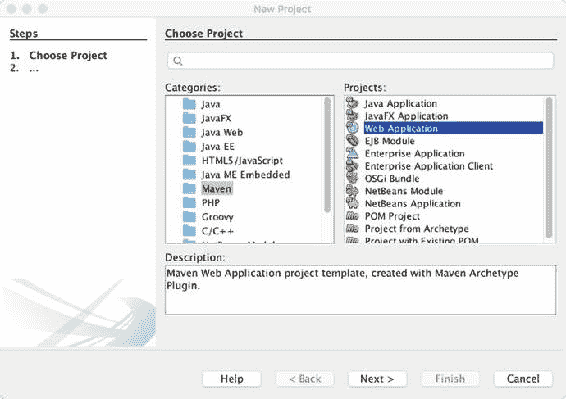
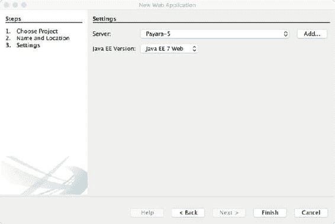
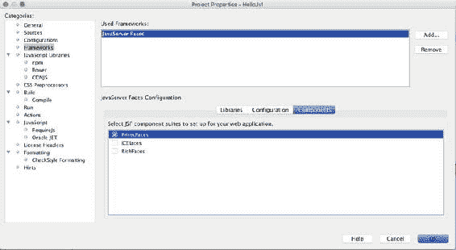
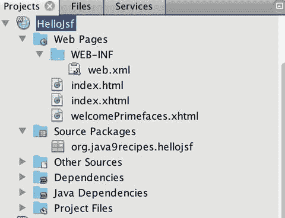
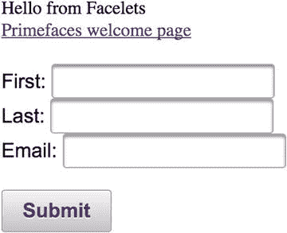

# 十七、使用 JavaServer Faces 的 Java Web 应用

Java 开发不仅仅是在桌面上。数以千计的企业应用是使用 Java 企业版(Java EE)编写的，这使得开发复杂、健壮和安全的应用成为可能。开发 Java EE 应用的最主流和最成熟的框架是 JavaServer Faces (JSF)。JDK 9 可以与一些 Java EE 应用服务器(如 GlassFish)一起使用，以支持 Java 9 特性的使用。虽然 Java EE 和 JSF 太大了，无法在一章中涵盖，但这将让您对使用 Java 9 和 Java EE 进行 web 开发的世界有所了解。

在这一章中，我将介绍 JSF 框架的基础知识，从开发一个基本的应用到创建一个复杂的前端。在整个过程中，我将介绍一些重要的信息，比如如何正确地确定控制器类的范围，以及如何生成 web 应用模板。最终，您将能够开始开发 Java web 应用，或者维护现有的 JSF 项目。

由于 web 应用开发包含许多相互关联的过程，因此建议利用 NetBeans 之类的集成开发环境来更轻松地组织 web 项目。在本章中，我将使用 NetBeans IDE 8.2 演示配方的解决方案。但是，您可以使用任意数量的 Java IDEs 将这些基本概念应用到项目中。

###### 注意

这本书是使用 GlassFish 5 应用服务器和 JDK 9 的早期访问版本编写的。要配置服务器使用 JDK 9，修改 GlassFish<<glassfish-home>>/config/asenv . conf 文件并添加 AS_JAVA 属性，指向 JDK 9 的安装。接下来，修改< <glassfish-home>>/bin/asadmin 文件，使最后一行如下所示:</glassfish-home></glassfish-home>

exec " $ JAVA "-add-modules JAVA . annotations . common-jar " $ AS _ INSTALL _ LIB/client/appserver-CLI . jar " " $ @ "

## 17-1.创建和配置 Web 项目

### 问题

您希望创建并配置一个简单的 Java web 应用项目，该项目将利用 JSF web 框架。

### 解决办法

有许多不同的项目格式可用于创建 web 应用。其中最灵活的是 Maven web 应用格式。随着时间的推移，Apache Maven 构建系统使组织构建和扩展应用的功能变得容易，因为它包含一个健壮的依赖管理系统。在该解决方案中，利用 NetBeans IDE 生成一个 Maven Web 应用项目，然后配置该项目以开发 JSF 应用。

首先，打开 NetBeans IDE 并选择“文件”、“新建项目”，然后在“新建项目”窗口中，选择“Maven”类别和“Web 应用”项目(图 [17-1](#Fig1) )，然后单击“下一步”



###### 图 17-1。NetBeans Maven Web 应用项目

将应用命名为“HelloJsf”，并将其放入硬盘上的一个目录中。将“包名”更改为 org.java9recipes，并保留所有其他默认值(图 [17-2](#Fig2) )。


###### 图 17-2。新的 Java Web 应用配置

接下来，选择应用将部署到的服务器，以及 Java EE 版本。在这种情况下，我将利用 Payara 5 服务器(GlassFish 也足够了)和 Java EE 7(图 [17-3](#Fig3) )。



###### 图 17-3。选择服务器和 Java EE 版本

创建项目后，右键单击项目并选择“Properties ”,为 JSF 配置它并分配一个 Java 平台。在属性菜单中，选择“框架”类别，然后选择“添加”并选择 JSF。接下来，在同一窗口中点击“组件”选项卡，并选择“PrimeFaces”(图 [17-4](#Fig4) )。



###### 图 17-4。配置项目属性

单击“OK”保存项目属性，项目现在可以使用 JSF 作为框架，连同 PrimeFaces UI 库一起构建了。

### 它是如何工作的

web 应用的开发需要编排许多不同的文件。虽然可以在不使用 IDE 的情况下开发 Java EE web 应用，但是使用开发环境几乎是一件小事。在这个方法中，NetBeans IDE 用于配置基于 Maven 的 web 应用。Maven 是一个类似于 Apache Ant 的构建系统，它对于应用项目的组织非常有用。Maven 不一定比 Ant 好，但是更容易上手使用。Ant 和 Maven 都是构建系统；然而，Maven 使用约定胜于配置，因此它假设了许多默认配置，以便用户可以非常容易地使用。另一方面，Ant 需要在使用之前配置并编写一个构建脚本。Maven 的一个关键组件是它使依赖关系管理变得非常容易。它已经成为最流行的项目格式之一，在 NetBeans 中开发 Maven 项目可以创建可移植的项目。

在项目创建向导中，必须填写许多字段，尽管许多缺省值可以保留。最重要的是，为应用设置适当的包命名约定，并选择服务器和 Java EE 版本。

###### 注意

使用向导时完成的设置可以在项目创建后通过进入项目属性进行更改。

一旦初始向导完成，就会生成一个基本的 Maven web 项目。此时，通过更改项目属性，可以将项目配置为利用 web 框架、不同版本的 JDK 等。右键单击 NetBeans 项目以进入项目属性屏幕，并利用类别选择来查看或更改与选定类别相关的属性。在这种情况下，选择“框架”类别将允许您添加一个 web 框架，如 JSF。当框架添加到项目中时，框架的所有管道和配置都已完成。另外，在选择 JSF 时，选择框架属性上的“Components”选项卡，并添加将要使用的任何其他 JSF 库。在这种情况下，添加“PrimeFaces ”,因为本章开发的应用将利用 PrimeFaces 组件库。

一旦配置好框架，请确保在属性对话框中选择“源代码”类别，并选择将用于应用编码的 JDK 版本的“源代码/二进制格式”。在这种情况下，选择 1.8，因为在撰写本文时，Java 9 还没有被认证为可以在应用服务器上运行。接下来，在属性对话框中选择“Build”->“Compile”类别，并确保“Java Platform”选项与“Source/Binary Format”类别中选择的选项一致。

完成这些选择后，配置就完成了。在项目属性中选择“确定”。该项目将被修改以包括新的视图(index.xhtml 和 welcomePrimefaces.xhtml)(图 [17-5](#Fig5) )。对于 JSF 配置，web.xml 部署描述符也将改变。欢迎文件现在将指向 index.xhtml，JSF 框架的关键组件 FacesServlet 将被配置。



###### 图 17-5。完全为 JSF 配置的 Maven Web 项目

JSF 应用的 web.xml 配置通常如下所示:

```java
<?xml version="1.0" encoding="UTF-8"?>
<web-app version="3.1"  xmlns:xsi="http://www.w3.org/2001/XMLSchema-instance" xsi:schemaLocation="http://xmlns.jcp.org/xml/ns/javaee http://xmlns.jcp.org/xml/ns/javaee/web-app_3_1.xsd">
    <context-param>
        <param-name>javax.faces.PROJECT_STAGE</param-name>
        <param-value>Development</param-value>
    </context-param>
    <servlet>
        <servlet-name>Faces Servlet</servlet-name>
        <servlet-class>javax.faces.webapp.FacesServlet</servlet-class>
        <load-on-startup>1</load-on-startup>
    </servlet>
    <servlet-mapping>
        <servlet-name>Faces Servlet</servlet-name>
        <url-pattern>/faces/*</url-pattern>
    </servlet-mapping>
    <session-config>
        <session-timeout>
            30
        </session-timeout>
    </session-config>
    <welcome-file-list>
        <welcome-file>faces/index.xhtml</welcome-file>
    </welcome-file-list>
</web-app>
```

此时，右键单击 NetBeans 项目并选择“运行”这将导致应用被编译并部署到在项目属性中或在项目创建时选择的应用服务器上(图 [17-6](#Fig6) 和 [17-7](#Fig7) )。


###### 图 17-6。部署的 HelloJsf 应用


###### 图 17-7。选择“欢迎使用 PrimeFaces”链接

这就是在 NetBeans 中创建和配置 JSF 项目的过程。在下一个菜谱中，我将深入研究 JSF 的世界，因为 HelloJsf 应用被修改以添加一些功能。

## 17-2.开发 JSF 应用

### 问题

您已经创建了一个配置了 JSF 的 Maven web 项目，并且希望向应用添加功能。

### 解决办法

构建应用，使其包含一个 HTML 表单，其中包含许多要填充的字段。提交表单时，表单将调用一个控制器方法。

首先，创建一个 Java 类，它将被用作保存表单中提交的数据的容器。在名为 org . Java 9 recipes . hello JSF . model 的包中创建一个新的 Java 类，并将其命名为 User。在该类中，暂时创建三个 String 类型的私有字段:firstName、lastName 和 email。接下来，右键单击文件并从上下文菜单中选择“Refactor->Encapsulate Fields ”,为这些字段生成访问器方法(getters 和 setters)。这将打开“封装字段”对话框，在该对话框中，您应该选择所有用于创建访问器方法的字段，然后单击“重构”(图 [17-8](#Fig8) )。


###### 图 17-8。封装字段

接下来，创建上下文和依赖注入(CDI)托管 bean。右键单击项目的“Source Packages”节点，创建一个名为 org.java9recipes.hellojsf.jsf 的新包，它将用于打包应用的所有托管 bean 控制器类。接下来，在名为 HelloJsfController 的新包中创建一个新的 Java 类，并使该类实现 java.io.Serializable，以便它能够钝化。用@ViewScoped 对该类进行注释，以表明该 bean 将在视图作用域中进行管理(关于作用域的更多信息，请参见配方 17-6)。此外，用@Named 对该类进行注释，这使得控制器类可注入，并且还允许在 JSF 视图中从表达式语言引用该类。接下来，创建一个 user 类型的私有字段，将字段命名为 User，并封装字段以生成访问器方法。在生成的 getUser()方法中，执行检查以查看用户字段是否为空，如果是，则实例化一个新用户。此时，该类应该如下所示:

```java
package org.java9recipes.hellojsf.jsf;

import javax.faces.view.ViewScoped;
import javax.inject.Named;
import org.java9recipes.hellojsf.model.User;

@Named
@ViewScoped
public class HelloJsfController implements java.io.Serializable {

    private User user;

    public User getUser() {
          if(user == null){
            user = new User();
        }
        return user;
    }

    public void setUser(User user) {
        this.user = user;
    }

}
```

最后，创建一个具有 void 返回类型的公共方法，并将其命名为 createUser()。当有人单击表单上的提交按钮时，将调用该方法。在该方法中，只需在屏幕上打印一条消息，表明用户已经成功创建。为此，获取当前 FacesContext 实例的句柄，该实例属于当前会话。一旦获得，通过传递一个 null 作为第一个参数向其添加一个新的 FacesMessage，因为该消息不会被分配给任何单个组件，并传递该消息作为第二个参数。最后，将用户对象设置为 null，以便创建新的用户对象。

###### 注意

FacesContext 包含关于 JSF 请求的状态信息。FacesContext 在 JSF 请求处理生命周期的不同阶段都会更新。

一旦完成，该方法应该如下所示。

```java
public void createUser(){
    FacesContext context = FacesContext.getCurrentInstance();
    context.addMessage(null, new FacesMessage("Successfully Added User: " +
                        user.getFirstName() + " " + user.getLastName()));
    user = null;
}
```

接下来，是时候创建视图了。在这种情况下，请在 NetBeans IDE 中打开 index.xhtml 视图文件，并添加构成表单的 html 标记和 JSF 组件。

```java
<?xml version='1.0' encoding='UTF-8' ?>
<!DOCTYPE html PUBLIC "-//W3C//DTD XHTML 1.0 Transitional//EN" "http://www.w3.org/TR/xhtml1/DTD/xhtml1-transitional.dtd">
<html 
      xmlns:h="http://xmlns.jcp.org/jsf/html"
      xmlns:p="http://primefaces.org/ui">
    <h:head>
        <title>Facelet Title</title>
    </h:head>
    <h:body>
        Hello from Facelets
        <br />
        <h:link outcome="welcomePrimefaces" value="Primefaces welcome page" />
        <br/>
        <h:form>
            <p:messages id="messages"/>
            <br/>
            <p:outputLabel for="firstName" value="First: "/>
            <p:inputText id="firstName" value="#{helloJsfController.user.firstName}"/>
            <br/>
            <p:outputLabel for="lastName" value="Last: " />
            <p:inputText id="lastName" value="#{helloJsfController.user.lastName}"/>
            <br/>
            <p:outputLabel for="email" value="Email: " />
            <p:inputText id="email" value="#{helloJsfController.user.email}"/>
            <br/><br/>
            <p:commandButton id="submitUser" value="Submit" ajax="false"
                             action="#{helloJsfController.createUser()}"/>

        </h:form>
    </h:body>
</html>
```

一旦生成了视图并创建了 CDI 控制器，就可以通过右键单击项目并选择“Run”来构建和运行应用该屏幕将类似于图 [17-9](#Fig9) 中的屏幕。



###### 图 17-9。JSF 形式

### 它是如何工作的

JSF 是 Sun Microsystems 在 2004 年开发的，旨在帮助简化 web 应用开发，并使 web 应用更易于管理/支持。它是 JavaServer Pages (JSP)框架的发展，增加了更有组织的开发生命周期和更容易利用现代 web 技术的能力。JSF 使用 XHTML 格式的 XML 文件构建视图，使用 Java 类构建应用逻辑，这使得它能够遵循 MVC 架构。JSF 应用中的每个请求都由 FacesServlet 处理。FacesServlet 负责构建组件树、处理事件、确定导航和呈现响应。JSF 现在已经成为一个成熟的网络框架，与之前的版本相比有很多优势。还有大量的组件和函数库可用于扩展 JSF 应用。

该框架非常强大，包括与 Ajax 和 HTML5 等技术的轻松集成，使得开发动态内容毫不费力。JSF 可以很好地处理数据库，使用 JDBC、企业 Java Bean (EJB)或 RESTful 技术来处理后端。JavaBeans 被称为 JSF 托管 Beans，用于应用逻辑并支持每个视图中的动态内容。根据所使用的范围(配方 17-6)，它们可以坚持不同的寿命。视图可以调用 beans 中的方法来执行数据操作和表单处理等操作。属性也可以在 beans 中声明，在视图中公开，并使用标准的表达式语言进行计算，这提供了一种与服务器之间传递值的便捷方式。JSF 允许开发人员使用预先存在的验证和转换标签定制他们的应用，这些标签可以用在带有视图的组件上。构建定制验证器和定制组件也很容易，它们可以应用于视图中的组件。简而言之，JSFs 的成熟使得使用该框架开发任何 web 应用都变得很容易。

在这个解决方案中，创建了一个名为 HelloJsf 的小应用。application 视图包含一个用于提交几个数据字段的简单 HTML 表单、一个用于向后端提交表单的按钮和一个用于显示响应的消息组件。名为 UserController 的控制器类是 ViewScoped 的，这意味着该类中的对象范围将在视图的生命周期内保留。一旦用户导航到另一个视图或关闭窗口，对象就会被销毁。一个名为 User 的对象用作在应用中传递用户数据的容器，用户在控制器类中声明，并通过访问器方法供视图使用。

```java
private User user;

/**
 * @return the user
 */
public User getUser() {
    if(user == null){
        user = new User();
    }
    return user;
}

/**
 * @param user the user to set
 */
public void setUser(User user) {
    this.user = user;
}
```

CDI 控制器类包含 JSF 应用视图的业务逻辑。在该解决方案中，名为 HelloJsfController 的类管理 HelloJsf 应用的处理和数据。控制器的代码可以在配方 17-4 中看到。控制器负责向 JSF 视图显示字段和操作方法，以便可以将数据直接提交到字段中并进行相应的处理。控制器还有助于与终端用户的通信，因为可以创建消息来清楚地指示处理是否成功或者是否出现了问题，并且可以使消息对视图可用。

应用的视图是一个 XHTML 文件 index.xhtml，它包含一个通过 JSF

<form>标记的 HTML 表单。在视图的顶部，导入了所需的名称空间，以便可以利用 PrimeFaces 和 JSF HTML 组件。该表单由许多 HTML 元素和 JSF 组件组成。PrimeFaces 组件必须以“p”为前缀，因为 PrimeFaces 名称空间被分配给该字母。每个 JSF 组件都包含许多属性，可用于设置值和配置组件的行为和功能。消息组件<messages>用于显示通过 FacesContext 提供的消息。p:outputLabel 组件呈现为 HTML 标签，p:inputText 组件呈现为 Text 类型的 HTML 输入元素。p:inputText 组件的 value 属性包含 JSF 表达式语言，引用 HelloJsfController 用户对象字段。最后，p:commandButton 组件呈现一个 HTML 按钮(类型为“submit”的输入元素)来提交表单。commandButton 的 action 属性也利用 JSF 表达式语言来调用名为 createUser()的控制器操作方法。ajax="false "属性表明 ajax 不应该用来异步处理表单值，而是应该提交和刷新表单。</messages></form>

这个菜谱包含了很多信息，但是它展示了用托管控制器类开发一个简单的 JSF 视图是多么容易。在实际应用中，数据可能存储在 RDBMS 中，如 Oracle 等。下一个诀窍是如何添加一个数据库并将其绑定到应用来存储和检索用户对象。

## 17-3.开发数据模型

### 问题

您希望将来自 Java EE 应用的数据存储在关系数据库中。

### 解决办法

将应用中的数据绑定到 Java 对象，以便可以使用这些对象来存储和检索数据库中的数据。在大多数情况下，Java 持久性 API (JPA)是处理 Java 对象形式的数据的合适选择。在前面的配方中，开发了一个 JSF 应用，用于将用户对象提交给 CDI 控制器。在这个配方中，数据将被绑定到一个实体类，然后使用 JPA 从关系数据存储中存储/检索。

出于这个菜谱的目的，将使用 Apache derby 数据库。首先，创建一个数据库表来存储用户对象。以下 SQL 可用于生成表，该表包括标识为 ID 的主键字段。

```java
CREATE TABLE HELLO_USER (
ID                          NUMERIC PRIMARY KEY,
FIRST_NAME                  VARCHAR(100),
LAST_NAME                   VARCHAR(50),
EMAIL                       VARCHAR(150));
```

一旦创建了数据库表，就生成一个相应的实体类。对于此解决方案，将使用 NetBeans IDE 来自动创建该类。为此，右键单击 HelloJsf 项目的“Source Packages”节点，并创建一个名为 org . Java 9 recipes . hello JSF . Entity 的包。出现“从数据库新建实体类”对话框后，为 Apache Derby 数据库选择或创建一个 JDBC 数据源。选中后，从可用表列表中选择用户表，并将其添加到“选定的表”列表中，然后选择“下一步”在随后的对话框屏幕上，接受所有默认设置，点击“完成”并创建实体类(图 [17-10](#Fig10) )。


###### 图 17-10。在 NetBeans IDE 中从数据库创建实体类

一旦创建了实体类，开发一个 EJB 或 JAX-RS RESTful web 服务类来处理相应的实体。在此解决方案中，将使用 NetBeans IDE 开发一个 EJB，首先在名为 org . Java 9 recipes . hello JSF . session 的项目中创建另一个新包。此包将用于保存会话 beans 或 EJB。接下来，右键单击新创建的包，并从上下文菜单中选择“实体类的会话 Beans”。这将打开允许选择实体类的对话框，以便 NetBeans IDE 可以自动创建相应的会话 beans(图 [17-11](#Fig11) )。


###### 图 17-11。选择实体类以生成会话 beans

选择后，选择“下一步”，最后选择“完成”以创建 EJB。这样做之后，NetBeans IDE 将生成一个名为 AbstractFacade 的抽象类，它将由生成的任何实体类进行扩展。NetBeans IDE 还将生成会话 bean hellojsfacade。一旦生成了这些类，应用的模型就完成了，控制器将能够成功地处理数据。

### 它是如何工作的

企业应用的模型是最重要的组件之一，因为数据是企业的核心。要为 Java EE 应用生成模型，必须有一个数据存储，通常是一个 RDBMS，并且必须编码一个对象关系映射策略，以代码格式表示数据库。在这个解决方案中，模型由三个类组成:实体类、包含标准对象关系映射方法的抽象类和扩展抽象类的 EJB。

实体类本质上是一个普通的旧 Java 对象(POJO ),它将数据库表表示为一个 Java 对象。实体类为数据库表的每一列都声明了一个字段，并为每个字段定义了访问器方法。注释使实体类像魔术一样工作，通过几个简单的注释执行绑定类的任务，随后将字段绑定到数据库表及其列。@Entity 注释告诉编译器这是一个实体类。表 [17-1](#Tab1) 列出了一些常见的实体类注释。

###### 表 17-1。公共实体类注释

<colgroup class="calibre15"><col class="calibre16"> <col class="calibre16"></colgroup> 
| 

注释

 | 

描述

 |
| --- | --- |
| @实体 | 将类标记为实体类。 |
| @表格 | 将实体类映射到数据库表。 |
| @Id | 降级实体类的主键字段。 |
| @XmlRootElement | 将类映射到 XML 元素。 |
| @ NamedQueries | 将名称映射到预定义查询的@NamedQuery 元素列表。 |
| @可嵌入 | 降级嵌入的类。 |

通过用@Table 对实体类进行注释，并将数据库表的名称指定为属性，将实体类映射到命名的数据库表。为了方便起见，NetBeans IDE 还向实体类添加了几个注释，分别是@XmlRootElement 和@NamedQueries。@XmlRootElement 注释将 XML 根元素与类相关联，从而使实体类可用于基于 XML 的 API，如 JAX-RS 和 JAXB。@NamedQueries 注释为实体提供了许多命名查询(每个字段一个)，使得按名称查询实体类变得容易，而不是每次需要查询时都编写 JPQL。实体类也总是包含一个主键，它通过@Id 注释来表示，数据库表的每一列都用@Column 映射到类字段。Bean 验证也可以添加到实体类的字段中，为添加到相关实体类字段中的任何输入或内容提供验证。最后，一个实体类包含一个 equals()方法来帮助比较对象和实体，以及一个 toString()方法。HelloUser 的最终实体类应该如下所示:

```java
@Entity
@Table(name = "HELLO_USER")
@XmlRootElement
@NamedQueries({
    @NamedQuery(name = "HelloUser.findAll", query = "SELECT h FROM HelloUser h"),
    @NamedQuery(name = "HelloUser.findById", query = "SELECT h FROM HelloUser h WHERE h.id = :id"),
    @NamedQuery(name = "HelloUser.findByFirstName", query = "SELECT h FROM HelloUser h WHERE h.firstName = :firstName"),
    @NamedQuery(name = "HelloUser.findByLastName", query = "SELECT h FROM HelloUser h WHERE h.lastName = :lastName"),
    @NamedQuery(name = "HelloUser.findByEmail", query = "SELECT h FROM HelloUser h WHERE h.email = :email")})
public class HelloUser implements Serializable {

    private static final long serialVersionUID = 1L;
    @Id
    @Basic(optional = false)
    @NotNull
    @Column(name = "ID")
    private Integer id;
    @Size(max = 100)
    @Column(name = "FIRST_NAME")
    private String firstName;
    @Size(max = 50)
    @Column(name = "LAST_NAME")
    private String lastName;
    // @Pattern(regexp="[a-z0-9!#$%&'*+/=?^_`{|}∼-]+(?:\\.[a-z0-9!#$%&'*+/=?^_`{|}∼-]+)*@(?:[a-z0-9](?:[a-z0-9-]*[a-z0-9])?\\.)+[a-z0-9](?:[a-z0-9-]*[a-z0-9])?", message="Invalid email")//if the field contains e-mail address consider using this annotation to enforce field validation
    @Size(max = 150)
    @Column(name = "EMAIL")
    private String email;

    public HelloUser() {
    }

    public HelloUser(Integer id) {
        this.id = id;
    }

    public Integer getId() {
        return id;
    }

    public void setId(Integer id) {
        this.id = id;
    }

    public String getFirstName() {
        return firstName;
    }

    public void setFirstName(String firstName) {
        this.firstName = firstName;
    }

    public String getLastName() {
        return lastName;
    }

    public void setLastName(String lastName) {
        this.lastName = lastName;
    }

    public String getEmail() {
        return email;
    }

    public void setEmail(String email) {
        this.email = email;
    }

    @Override
    public int hashCode() {
        int hash = 0;
        hash += (id != null ? id.hashCode() : 0);
        return hash;
    }

    @Override
    public boolean equals(Object object) {
        // TODO: Warning - this method won't work in the case the id fields are not set
        if (!(object instanceof HelloUser)) {
            return false;
        }
        HelloUser other = (HelloUser) object;
        if ((this.id == null && other.id != null) || (this.id != null && !this.id.equals(other.id))) {
            return false;
        }
        return true;
    }

    @Override
    public String toString() {
        return "org.java9recipes.hellojsf.entity.HelloUser[ id=" + id + " ]";
    }

}
```

一旦生成了一个实体类，就可以生成一个会话 bean 来促进实体类的工作。会话 bean(又名 EJB)声明一个 PersistenceContext，它提供与底层数据存储的通信。然后它调用 PersistenceContext 来执行任意数量的 JPA 任务，比如通过实体类数据创建、更新或删除数据库中的记录。NetBeans IDE 生成 AbstractFacade 抽象类，该类由项目的所有实体类扩展。这个类本质上包含了允许对实体进行基本操作的方法:create()、findAll()、edit()和 remove()，使开发人员能够自动访问这些方法，而无需为每个实体类重新编码。这给开发人员留下了一个没有任何编码的全功能会话 bean。如果需要创建针对实体的附加查询或工作，开发人员可以相应地修改会话 bean 的内容，在本例中是 HelloJsfFacade。

EJB 必须用@Stateful 或@Stateless 注释，以指定该类是有状态会话 bean 还是无状态会话 bean。有状态会话 bean 可以绑定到单个用户会话，允许在整个用户会话中管理状态。无状态更常用于在应用的所有用户会话中共享会话 bean。名为 HelloJsfFacade 的简单无状态会话 bean 如下所示:

```java
@Stateless
public class HelloUserFacade extends AbstractFacade<HelloUser> {

    @PersistenceContext(unitName = "org.java9recipes_HelloJsf_war_1.0-SNAPSHOTPU")
    private EntityManager em;

    @Override
    protected EntityManager getEntityManager() {
        return em;
    }

    public HelloUserFacade() {
        super(HelloUser.class);
    }

}
```

本菜谱中讨论的类和代码构成了应用的模型。总之，该模型将应用绑定到底层数据存储，从而使得使用 Java 对象创建、移除、更新和删除数据成为可能，而不是通过 SQL 直接使用数据库。关于开发实体类的更多信息，请参见在线 Java EE 教程:[https://docs.oracle.com/javaee/7/tutorial/](https://docs.oracle.com/javaee/7/tutorial/)。

## 17-4.编写视图控制器

### 问题

您已经开发了一个 JSF 视图，其中包含绑定字段和一个表单，您需要创建业务逻辑来处理表单并简化会话 bean 的工作。

### 解决办法

创建一个托管 bean 控制器类(CDI bean ),该类可用于将操作和字段绑定到 JSF 视图，并简化需要在 EJB 会话 bean 中执行的工作。在这个解决方案中，HelloJsfController 类(如下所示)被用作 CDI 控制器。

```java
@Named
@ViewScoped
public class HelloJsfController implements java.io.Serializable {

    private User user;

    /**
     * @return the user
     */
    public User getUser() {
        if(user == null){
            user = new User();
        }
        return user;
    }

    /**
     * @param user the user to set
     */
    public void setUser(User user) {
        this.user = user;
    }

    public void createUser(){
        FacesContext context = FacesContext.getCurrentInstance();
        context.addMessage(null, new FacesMessage("Successfully Added User: " +
                            user.getFirstName() + " " + user.getLastName()));
        user = null;
    }

}
```

在前面的菜谱中，数据模型被添加到 HelloJsf 应用中。接下来，需要修改控制器类和视图以利用数据模型。要修改控制器，只需添加一个新的 HelloUser 类型的私有字段，并为其生成访问器方法。在 getHelloUser 方法中，首先检查字段是否为 null，如果是，实例化一个新的实例。

```java
...
private HelloUser helloUser;
...
public HelloUser getHelloUser() {
        if(helloUser == null){
            helloUser = new HelloUser();
        }
        return helloUser;
}

public void setHelloUser(HelloUser helloUser) {
        this.helloUser = helloUser;
}
...
```

接下来，将 EJB 注入控制器类，这样就可以持久保存一个新的 HelloUser。为此，注入一个新的 HelloUserFacade 类型的私有字段，如下所示:

```java
@EJB
private HelloUserFacade helloUserFacade;
```

最后，创建一个名为 createAndPersistUser()的新操作方法，它通常与 createUser()方法做相同的事情。然而，这个新方法将通过调用 EJB 把一个更高级的对象持久化到数据库中。

```java
public void createAndPersistUser(){
    FacesContext context = FacesContext.getCurrentInstance();
    helloUserFacade.create(helloUser);
    context.addMessage(null, new FacesMessage("Successfully Persisted User: " +
                        user.getFirstName() + " " + user.getLastName()));
    helloUser = null;
}
```

数据模型现在已经集成到控制器逻辑中。当用户单击视图中的按钮时，它应该调用控制器中的操作方法 createAndPersistUser()。表单中包含的字段也通过控制器处理，因为用户对象被注入并暴露给用户界面。

### 它是如何工作的

JSF 管理的 bean 控制器用于促进 Java EE 应用的视图和会话 bean 之间的工作。过去，受管 bean 控制器遵循一套不同的规则，因为 JSF 包含自己的一套用于开发受管 bean 的注释。在 Java EE 的最近版本中，特定于 JSF 的托管 bean 已经被淘汰，CDI beans 已经取而代之，从而允许更具内聚性和通用性的控制器类。

在该解决方案中，该类实现 java.io.Serializable，因为在会话突然结束的情况下，可能需要将它保存到磁盘上。这个类用@Named 进行了注释，使它可以通过 JSF 表达式语言进行注入和访问。该类还用指定的 CDI 作用域进行了注释，在本例中为@ViewScoped，以指示控制器的 CDI 作用域。有许多不同的范围，这些包括在配方 17-6 中。ViewScoped 意味着控制器状态将在视图的生存期内保存。用户对象在控制器中被声明为私有字段，并且可以通过访问器方法作为属性进行访问。最后，该类包含一个名为 createUser()的方法，该方法是公共的，它创建一个 FacesMessage 对象并将其放入当前的 FacesContext 中以在屏幕上显示。然后，用户对象被设置为 null。

控制器类的修改版本(包括数据模型)声明了 HelloUser 类型的实例字段。创建 HelloUser 字段的访问器方法，如果该字段为空，则在 getter 方法中创建一个新实例。HelloUserFacade 被注入到控制器中，以便它可以用来执行数据模型事务(也称为:数据库事务)。createAndPersistUser()方法调用 HelloUserFacade create()方法，传递一个 HelloUser 实例将对象持久化到数据库中。类似地，如果希望编辑 HelloUser 对象，可以调用 HelloUserFacade edit()方法。最后，如果希望删除用户，可以调用 remove()方法。

控制器类可以包含任意数量的动作方法和字段声明，但是，管理控制器的大小以使控制器不负责执行过多的工作是很重要的。如果一个控制器类包含太多的功能，例如，如果它用于支持多个视图，那么它会变得很麻烦，很难维护。要了解更多关于控制器类的 CDI 作用域，请参阅配方 17-6。

## 17-5.开发异步视图

### 问题

与旧式的提交和响应 web 应用不同，您希望生成一个现代化的 ui，它可以异步提交数据和发布响应，而无需刷新浏览器页面或重新呈现视图，从而提供更好的用户体验。

### 解决办法

将异步 JavaScript 和 XML 合并到您的应用中，以异步方式向服务器发送数据，并在不刷新的情况下呈现响应。为 JSF 应用创建基于 AJAX 的视图有很多种方法，这个方法将演示如何利用 PrimeFaces AJAX API。在这个解决方案中，将创建一个名为 helloAjax.xhtml 的新视图(图 [17-12](#Fig12) )，它通常是利用 Ajax 提交表单的原始 index.xhtml 视图的副本。该视图还将异步更新 messages 组件，显示控制器类生成的消息。helloAjax.xhtml 中还添加了一个 dataTable 组件，它被异步更新以显示已经创建并保存到数据库中的用户列表。增强视图如下所示:


###### 图 17-12。异步形式

```java
<?xml version='1.0' encoding='UTF-8' ?>
<!DOCTYPE html PUBLIC "-//W3C//DTD XHTML 1.0 Transitional//EN" "http://www.w3.org/TR/xhtml1/DTD/xhtml1-transitional.dtd">
<html 
      xmlns:h="http://xmlns.jcp.org/jsf/html"
      xmlns:f="http://xmlns.jcp.org/jsf/core"
      xmlns:p="http://primefaces.org/ui">
    <h:head>
        <title>Facelet Title</title>
    </h:head>
    <h:body>
        Hello from Facelets
        <br />
        <h:link outcome="welcomePrimefaces" value="Primefaces welcome page" />
        <br/>
        <h:form>
            <h:inputText id="firstNameType" value="#{helloJsfController.freeText}">
                <f:ajax execute="@this" event="keyup" listener="#{helloJsfController.displayText}"
                        render="messages"/>
            </h:inputText>
            <p:messages id="messages"/>
            <br/>
            <p:panelGrid columns="2" style="width: 100%">

                <p:outputLabel for="firstName" value="First: "/>
                <p:inputText id="firstName" value="#{helloJsfController.user.firstName}"/>

                <p:outputLabel for="lastName" value="Last: " />
                <p:inputText id="lastName" value="#{helloJsfController.user.lastName}"/>

                <p:outputLabel for="email" value="Email: " />
                <p:inputText id="email" value="#{helloJsfController.user.email}"/>
            </p:panelGrid>
            <br/>
            <p:commandButton id="submitUser" value="Submit"
                             action="#{helloJsfController.createUser()}"
                             update="messages, helloUsers"/>

            <br/>
            <p:dataTable id="helloUsers" var="user" value="#{helloJsfController.helloUserList}">
                <p:column headerText="First Name">
                    <h:outputText value="#{user.firstName}"/>
                </p:column>
                <p:column headerText="Last Name">
                    <h:outputText value="#{user.lastName}"/>
                </p:column>
                <p:column headerText="Email">
                    <h:outputText value="#{user.email}"/>
                </p:column>
            </p:dataTable>

        </h:form>
    </h:body>
</html>
```

### 它是如何工作的

将 AJAX 的原理应用于 JSF 视图是非常容易的。有几种不同的方法来应用 AJAX 功能，但是最简单的方法是利用一个复杂的用户界面框架，比如 PrimeFaces，它包含了内置的 AJAX 功能。事实上，许多 PrimeFaces 组件默认执行 ajax 提交，因此它们包含一个 AJAX 属性，可以设置为 false 以便以同步方式操作。

在这个配方的解决方案中，PrimeFaces commandButton 用于将表单内容异步发送到控制器类。一旦调用了 action 方法，数据就被持久化，并生成 FacesMessage，然后响应被发送回视图。当视图收到响应时，它异步更新 commandButton update 属性中列出的组件，即 messages 组件和 helloUsers dataTable 组件。

通过在组件的开始和结束标签之间嵌入标签，可以异步提交没有 PrimeFaces 的 JSF 组件的内容。f:ajax 标签使用 execute 属性来指示视图的哪个部分将被异步执行或提交，使用 onevent 属性来指示哪个 JavaScript 事件应该调用异步操作，使用 listener 属性来绑定操作方法，等等。例如，通过使用 f:ajax 标记，下面的 inputText 组件变成了异步的:

```java
<h:inputText id="firstNameType" value="#{helloJsfController.freeText}">
   <f:ajax execute="@this" event="keyup" listener="#{helloJsfController.displayText}"
                        render="messages"/>
</h:inputText>
```

在该示例中，当 keyup 事件发生时，在 inputText 字段中键入的值被提交给 helloJsfController.freeText 属性。displayText()操作方法也被调用，该方法将 freeText 属性的内容放入 FacesMessage 中，如下所示。一旦动作被调用并且请求被发回，消息组件就会被更新，因为 f:ajax 的 render 属性指定了它的 id。

```java
public void displayText(AjaxBehaviorEvent evt){
    FacesContext context = FacesContext.getCurrentInstance();
    System.out.println("test: " + freeText);
    context.addMessage(null, new FacesMessage(freeText));
}
```

有许多不同的技术可以用来异步更新 JSF 视图。在众多可用的 UI 库中，还有更多可用的异步组件。虽然这个解决方案演示了 PrimeFaces 以及 f:ajax 标签的使用，但是可以就这个主题写一些小书。JSF 是一个成熟的网络框架，提供了大量的工具来完成这项工作。选择最适合这种情况的方法，享受使用 AJAX 和限制暴露于底层 JavaScript 的便利。

## 17-6.应用正确的范围

### 问题

您正在开发一个 JSF 应用，并且您希望确保控制器被配置为根据功能和需求在正确的时间内保持在范围内。

### 解决办法

利用 CDI 作用域将所需的作用域应用于控制器类。例如，如果控制器类包含与整个会话相关的逻辑和数据，则使用 javax . enterprise . context . session scoped 对该类进行注释。但是，如果控制器类仅与请求级别相关，则使用 javax . enterprise . context . request scoped 对该类进行注释。根据此逻辑将每个不同的范围应用于控制器类。

### 它是如何工作的

控制器类范围可以完全改变应用运行的方式。控制器在范围内的时间长短会对应用的各个视图产生很大的影响。幸运的是，对不同的控制器应用不同的作用域是一件容易的事情。然而，编程方法会根据控制器类所处的范围而发生巨大的变化。CDI 提供了许多可以利用的示波器，如表 [17-2](#Tab2) 所示。

###### 表 17-2。CDI 示波器

<colgroup class="calibre15"><col class="calibre16"> <col class="calibre16"></colgroup> 
| 

范围

 | 

持续时间

 |
| --- | --- |
| @应用范围 | 状态在应用中的所有用户会话之间共享。 |
| @依赖 | 对象接收与客户端 bean 相同的生命周期。(默认范围) |
| @会话范围 | 开发人员控制对话的开始和结束，并且在整个对话过程中维护状态。 |
| @ RequestScoped | 状态持续单个 HTTP 请求的持续时间。 |
| @会话范围 | 状态在用户会话期间持续存在。 |
| javax.faces.view.ViewScoped | 只要 NavigationHandler 没有导致导航到不同的 viewId，状态就会持续。 |

如前所述，在应用作用域时要记住的一件事是，控制器选择的作用域会影响应用的其余部分。如果控制器将包含在整个用户会话中有用的数据，那么@SessionScoped 可能是最佳选择。请记住,@SessionScoped bean 中的所有数据都将在整个会话期间保留。因此，如果在 bean 中声明并填充了列表，则必须以编程方式刷新或更改 bean 的内容。如果使用某个范围导致 bean 在整个用户会话过程中被刷新，情况就不一样了。例如，如果同一个 bean 是@RequestScoped，那么列表中的数据将在每次发出请求时被重新查询和填充。

###### 注意

范围还会对与其他受管 beans 的交互产生很大影响。注入相同范围的 beans 是很重要的

## 17-7.生成和应用模板

### 问题

您希望在应用的所有视图中应用相同的可视化模板。

### 解决办法

利用 Facelets 模板并应用于每个视图。要创建模板，必须首先开发一个新的 XHTML 视图文件，然后向其中添加适当的 HTML/JSF/ XML 标记。来自其他视图的内容将取代 ui:一旦模板被应用到一个或多个 JSF 视图，就在模板中插入元素。下面的源代码来自一个名为 template.xhtml 的模板，该模板将应用于 HelloJsf 应用中的所有视图:

```java
<html 
      xmlns:ui="http://xmlns.jcp.org/jsf/facelets"
      xmlns:h="http://xmlns.jcp.org/jsf/html"
      xmlns:p="http://primefaces.org/ui">

    <h:head>
        <meta http-equiv="Content-Type" content="text/html; charset=UTF-8" />
        <h:outputStylesheet library="css" name="default.css"/>
        <h:outputStylesheet library="css" name="cssLayout.css"/>

        <title>Hello JSF</title>

    </h:head>

    <h:body>

        <p:growl id="growl" life="3000" />

        <p:layout fullPage="true">
            <p:layoutUnit position="north" size="65" header="#{bundle.AppName}">
                <h:form id="menuForm">
                    <p:menubar>
                        <p:menuitem value="Home" outcome="/index.xhtml" icon="ui-icon-home"/>

                           <p:menuitem value="Hello Main" outcome="/helloUser.xhtml" />
                              <p:menuitem value="PrimeFaces" outcome="/welcomePrimefaces.xhtml" />
                           <p:menuitem value="Hello Ajax" outcome="/helloAjax.xhtml" />

                    </p:menubar>
                </h:form>
            </p:layoutUnit>

            <p:layoutUnit position="south" size="60">
                <ui:insert name="footer"/>
            </p:layoutUnit>

            <p:layoutUnit position="center">
                <ui:insert name="content"/>
            </p:layoutUnit>

        </p:layout>

    </h:body>

</html>
```

模板定义了应用视图的整体结构。但是，它可以使用 CSS 样式表来声明模板中每个元素的格式。样式表应该包含在应用的资源目录中，以便视图可以访问它。也可以在模板中使用 JSF EL。如果使用 EL，通常由会话或应用范围的受管 bean 来驱动内容。模板的 JSF 客户端视图将包含视图内容周围的<composition>标签，以及属于模板内相应<insert>标签的标记命名段周围的<define>标签。下面的视图是前面显示的模板的客户端视图的示例。</define></insert></composition>

```java
<?xml version='1.0' encoding='UTF-8' ?>
<!DOCTYPE html PUBLIC "-//W3C//DTD XHTML 1.0 Transitional//EN" "http://www.w3.org/TR/xhtml1/DTD/xhtml1-transitional.dtd">
<html 
      xmlns:h="http://xmlns.jcp.org/jsf/html"
      xmlns:f="http://xmlns.jcp.org/jsf/core"
      xmlns:p="http://primefaces.org/ui"
      xmlns:ui="http://xmlns.jcp.org/jsf/facelets">

      <ui:composition template="layout/template.xhtml">

        <ui:define name="content">
        Hello from Facelets
        <br />
        <h:link outcome="welcomePrimefaces" value="Primefaces welcome page" />
        <br/>
        <h:form>
            <p:messages id="messages"/>
            <br/>

            <p:outputLabel for="firstName" value="First: "/>
            <p:inputText id="firstName" value="#{helloJsfController.user.firstName}"/>
            <br/>
            <p:outputLabel for="lastName" value="Last: " />
            <p:inputText id="lastName" value="#{helloJsfController.user.lastName}"/>
            <br/>
            <p:outputLabel for="email" value="Email: " />
            <p:inputText id="email" value="#{helloJsfController.user.email}"/>
            <br/>
            <p:commandButton id="submitUser" value="Submit"
                             action="#{helloJsfController.createUser()}"
                             update="messages, helloUsers"/>

            <br/>
            <p:dataTable id="helloUsers" var="user" value="#{helloJsfController.helloUserList}">
                <p:column headerText="First Name">
                    <h:outputText value="#{user.firstName}"/>
                </p:column>
                <p:column headerText="Last Name">
                    <h:outputText value="#{user.lastName}"/>
                </p:column>
                <p:column headerText="Email">
                    <h:outputText value="#{user.email}"/>
                </p:column>
            </p:dataTable>

        </h:form>
        </ui:define>

    </ui:composition>

</html>
```

### 它是如何工作的

为了创建统一的应用体验，视图应该是一致的，因为它们看起来相似，并且以统一的方式运行。开发 web 页面模板的想法已经存在很多年了，但不幸的是，许多模板实现在每个应用页面上都包含重复的标记。虽然为每个单独的 web 页面复制相同的布局是可行的，但这造成了维护上的一场噩梦。当需要更新页眉中的单个链接时会发生什么？如果模板在每个页面上都被复制，这样的难题将导致开发者访问并手动更新应用的每个网页。Facelets 视图定义语言为视图模板的开发提供了一个健壮的解决方案，这是使用 JSF 技术的主要好处之一。

Facelets 提供了将单个模板应用于应用中一个或多个视图的能力。这意味着开发人员可以创建一个视图来构造页眉、页脚和模板的其他部分，然后这个视图可以应用于任何数量的负责包含主视图内容的其他视图。这种技术减轻了诸如更改页面标题中的单个链接之类的问题，因为现在模板可以用新的链接进行更新，应用中的每个其他视图都将自动反映这种更改。

要使用 Facelets 创建模板，请创建一个 XHTML 视图，声明所需的名称空间，然后相应地添加 HTML、JSF 和 Facelets 标记，以设计所需的布局。模板可以被认为是 web 视图的“外壳”,因为它可以包含任意数量的其他视图。同样，任意数量的 JSF 视图可以应用相同的模板，因此应用的整体外观将保持不变。

负责控制视图布局的 Facelets 标记。为了利用这些 Facelets 标记，您需要在模板的元素中声明 Facelets 标记库的 XML 名称空间。注意，这里还指定了标准 JSF 标记库的 XML 名称空间。

```java
<html 
      xmlns:ui="http://xmlns.jcp.org/jsf/facelets"
      xmlns:h="http://xmlns.jcp.org/jsf/html">
...
```

Facelets 包含许多特殊的标记，可以用来帮助控制页面流和布局。中的表 [17-3](#Tab3) 列出了对控制页面流和布局有用的 Facelets 标签。本例模板中使用的惟一 Facelets 标记是 ui:insert。ui:insert 标记包含一个 name 属性，该属性被设置为将包含在视图中的相应 ui:define 元素的名称。看看这个例子的源代码，您可以看到下面的 ui:insert tag:

###### 表 17-3。Facelets 页面控件和模板标签

<colgroup class="calibre15"><col class="calibre16"> <col class="calibre16"></colgroup> 
| 

标签

 | 

描述

 |
| --- | --- |
| 用户界面:组件 | 定义模板组件并指定组件的文件名 |
| ui:合成 | 定义页面组合并封装所有其他 JSF 标记 |
| 用户界面:调试 | 创建调试组件，该组件在呈现组件时捕获调试信息，即组件树的状态和应用中的作用域变量 |
| 不明确的 | 定义由模板插入页面的内容 |
| ui:装饰 | 页面的装饰部分 |
| ui:片段 | 定义一个模板片段，很像 ui:component，除了没有忽略标记之外的所有内容 |
| 用户界面:包括 | 允许在视图中封装和重用另一个 XHTML 页面 |
| 用户界面:插入 | 将内容插入模板 |
| ui:停止 | 将参数传递给包含的文件或模板 |
| ui:重复 | 迭代一组数据 |
| 用户界面:删除 | 从页面中删除内容 |

```java
<ui:insert name="content">Content</ui:insert>
```

如果一个视图使用模板，也就是模板客户端，它必须在视图<composition>标签中列出模板。在<composition>中，视图必须指定一个与<insert>同名的<define>标签，然后放置在开始和结束<define>标签之间的任何内容都将被插入到视图的那个位置。但是，如果模板客户端不包含与<insert>标签同名的<define>标签，那么将显示模板内开始和结束<insert>标签之间的内容。</insert></define></insert></define></define></insert></composition></composition>

## 摘要

Java EE web 应用的开发可能是一个非常大的主题，这一章只是触及了可以利用的许多技术中的一些。JSF web 框架是成熟和健壮的，它为开发复杂和易于使用的应用提供了许多选择。结合底层的 Java EE 技术，包括 EJB、JAX-RS、JPA 和其他技术，Java web 开发功能强大且易于上手。