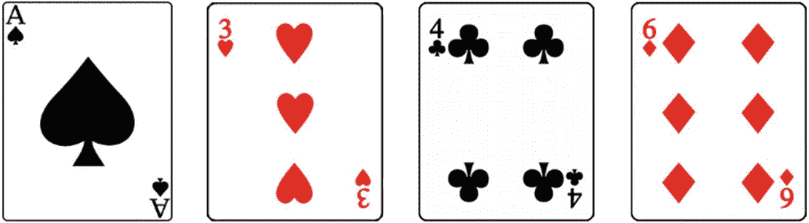

# 1.介绍

市场上有很多好的 Java 编程书籍，但是对于一个刚接触 Java 并且只有很少编程知识的初学者来说，找到一本合适的并不容易。

这本书将帮助初学者学习如何有效地用 Java 编程。我的意图是简化 Java 更复杂的方面，并指导学习者探索“幕后”的东西我希望这本书里面的说明足够直观，读者可以通过实践来理解。

有编程经验的人都明白，数学知识在程序设计中起着至关重要的作用。所以拥有良好的数学功底在学习编程的时候无疑是超级有帮助的。这本书提供了一个在编程环境中练习数学问题解决的好机会。带着这个动机，我加入了一些适用于编程相关概念的数学练习题。

通过有意识的练习来学习可以在更深的层次上增强你对新概念的理解。积极参与动手项目是学习过程中的一个重要部分。更多的练习会更快产生效果。我希望这对你来说是一次愉快的学习经历。

编程工作包括使用某种计算机语言设计和编写代码。正确执行的代码将执行重复的任务并完成预期的目标。如今，随着高科技产品融入我们的日常生活，计算机编程技能几乎在任何地方都变得不可或缺。许多日常计算工作已经被编程设备所取代——除了当地超市的自助结账队伍或不断增加的网上购物数量，你不需要看得太远。重复发生的事件越来越多地由自动化系统控制，如建筑安全系统、安装在你房子里墙上的恒温器，以及许多其他例子。

另一个例子是游戏软件，它有如此丰富的用户界面，以至于我们许多人——从青少年到成年人——都已经沉迷其中。所有这些产品和服务本质上都是由计算机编程构建的。

随着人工智能之美的出现，我们已经比以往任何时候都更能看到和感受到计算机技术应用的力量。如果你看过好莱坞电影，比如《抵达》或《T2》【乘客】(均于 2016 年上映)，我相信你会被电影中描绘的智能机器人迷住。如果你对计算机如何精确识别任何图片中的活动对象感到好奇，我建议你听一听一个激动人心的 TED 演讲，题为“我们如何教计算机理解图片”。所有这些令人惊讶的事情都是由软件实现的，软件是用编程语言编写的。

要成为一名优秀的程序员，你需要了解逻辑控制和基本的计数方法。如果你想开发一个系统来控制对象的活动，这将需要更复杂的数学知识。

数学史上有相当多著名但尚未解决的问题。随着计算机技术的进步，我们可以利用计算机的才能来解决这些问题。

例如，Collatz 猜想指出，如果你随机挑选一个正整数 N，如果它是偶数，除以 2；如果是奇数，就乘以 3 再加 1。如果你重复这个过程足够长的时间，最终 N 的最终结果总是 1。

数学家和数据研究人员尝试了数百万个数字。没有发现例外，但是没有人找到证明所有整数都遵循这个规律的方法。

利用简单的 Java 编程，我们可以证明任意正整数到 n 的 Collatz 猜想，在下面的短程序中，我将用每一个整数来检验这个猜想，找出它的序列长度，也就是它达到结果“1”的运算次数。

```java
public class ProveIt {
        public static void main(String[] args) {
                // representation of a million
                final long N = 1000 * 1000;
                for(long i = 1; i <= N; i++) {
                        System.out.println("i=" + i + " - " +
                                GetCollatzSequenceCount(i));
                }
                System.out.println("DONE!");
        }

        private static long GetCollatzSequenceCount(long n) {
                if (n <= 0) return 0;
                long count = 0;
                while(true) {
                        if (n == 1) return count;
                        if (n % 2 == 0) {
                                n /= 2;
                        } else {
                                n = n * 3 + 1;
                        }
                        count++;
                }
        }
}

```

你猜怎么着？为了测试多达 1，000，000 个整数，它在普通工作笔记本电脑上几秒钟内完成执行并报告结果。现在不要担心理解或运行这段代码；要知道，这个短程序可以在几秒钟内完成 100 万次迭代。

输出的最后一部分是:

```java
i=999991 - 165
i=999992 - 113
i=999993 - 165
i=999994 - 113
i=999995 - 258
i=999996 - 113
i=999997 - 113
i=999998 - 258
i=999999 - 258
i=1000000 - 152
DONE!

```

关于本书中的符号还有最后一件事要提:

*   ***数学*** :描述一个具体的数学概念。

*   ***问题*** :提供后续练习列表。可以找到一些问题的提示。

*   ***提示*** :为参考解决问题建议思路。

*   最后，鼓励学生尝试 ***实验室工作****后学习 ***答案******例题*** *。**

 *## 问题

1.  列举一个你观察到的同时满足以下(a)和(b)的例子。
    1.  现在没有与之相关的编程功能。

    2.  如果有一个内置程序，它的运行效率会高得多。

2.  我们如何在两个杯子之间交换不同类型的水？

不允许你掺水。

1.  我在考虑 1 到 100 之间的一个整数。你可以问我一些问题来确定这个整数，但是你不能问类似“这个整数是什么？”

为了算出数字，你问最少数量问题的策略是什么？

1.  有 27 个乒乓球。它们看起来都一样，重量也一样，除了其中一个更轻。使用天平，您如何快速找到与其他产品不同的产品？

2.  如何使用以下四个数字和基本运算符(“+”、“-”、“x”和“/”)来创建一个等于 24 的数学公式？每个数字只能使用一次，但可以使用括号。

*