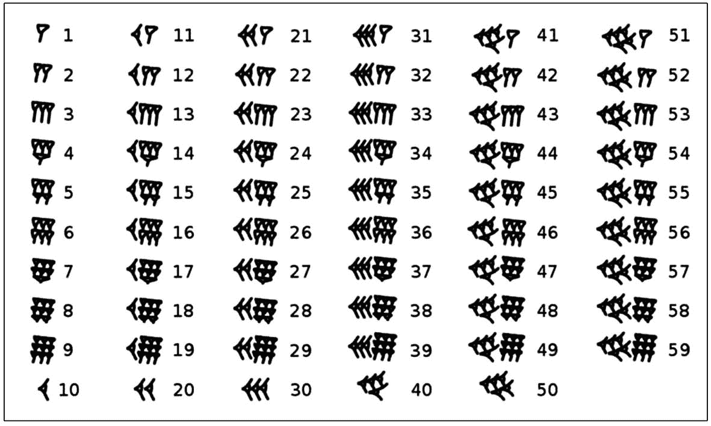
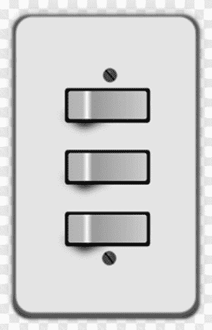
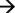

# 二、数字基础

## 什么是数制？

存在许多不同的数字系统，因为有特定的用途，其中某个数字系统使用起来更方便，并且比其他数字系统更有优势。例如:

*   重量:1 磅= 16 盎司

*   长度:1 码= 3 英尺，1 英尺= 12 英寸

*   巴比伦数字:基数 60

(来自维基百科)

*   在中国古代:阴阳——二进制，八卦——八卦图

(来自维基百科)

*   十进制计数
    *   十个符号:0–9

*   二进制计数
    *   两个符号:0 和 1

*   时间测量

一天= 24 小时

一小时= 60 分钟= 3600 秒

## 为什么人用十进制数，而计算机用二进制数？

一个简单的答案是，人类有十个手指和十个脚趾，而计算机只有两种状态。

开玩笑地说，计算机是由许多连接和组件(部件)组成的，用于传输和存储数据，以及与其他组件通信。大多数存储、传输和通信事件都发生在数字电子设备中。数字电子设备使用二进制系统(开或关)。具有一系列开/关脉冲的信号等于一个二进制数。

## 如何在不同的数字系统之间转换数字

【数学】十进制和二进制之间的转换:

1.  将十进制数转换成二进制数

    [示例]

    将基数为 10 的 350 转换为二进制数(基数为 2)

    [回答]

    以 10 为基数，我们可以用这个等式写出 350:

    350 = 3 * 102+5 * 101+0 * 100

    请注意，每个系数(即 3、5 和 0)都小于 10，并且没有 10 3 或以上的系数。

    现在我们想把它改成这样:

    350 = a * 28+b * 27+c * 26+d * 25+e * 24+f * 23+g * 22+h * 21+I * 20

    注意没有 2 9 或以上，因为我们知道 350 < 512=2 9

    350–1 * 256(即 28)= 94<128 = 27a = 1，b = 0；

    94–1 * 64(即 26)= 30<32 = 25c = 1，d = 0；

    30–1 * 16(即 24)= 14e = 1；

    14–1 * 8(即 23)= 6f = 1；

    6–1 * 4(即 22)= 2g = 1；

    2–1 * 2(即 2 1 ) = 0  h = 1，I = 0；

    所以 350 = 1 * 28+0 * 27+1 * 26+0 * 25+1 * 24+1 * 23+1 * 22+1 * 21+0 * 20

    也就是说(350)10=(101011110)2

    下标数字(10 和 2)表示它的基数。

2.  将二进制数转换成十进制数

    [示例]

    将二进制数 11001001 转换为十进制数

    【回答】

    我们重写了二进制数的表达式，如下所示。

    (11001001) 2

    = 1 * 27+1 * 26+0 * 25+0 * 24+1 * 23+0 * 22+0 * 21+1 * 20

    = 128 + 64 + 8 + 1

    = (201) 10

    要练习十进制和二进制的转换，我推荐这个网游:[http://games . pen JEE . com/binary-numbers-game/](http://www.games.penjee.com/binary-numbers-game)

【数学】十进制和二进制的分数

1.  将十进制数(基数为 10)转换为二进制数

    我们需要了解如何识别小数点后的每一位数字。例如，4.3256

    去掉整数部分“4”，我们得到 0.3256。

    0.3256 x 10 = 3.256  3 是小数点后的第一位数字

    删除整数部分“3”，所以我们现在有 0.256

    0.256 x 10 = 2.56  2 是小数点后的第二位数字

    去掉整数部分“2”，所以我们现在有 0.56

    0.56 x 10 = 5.6  5 是小数点后的第三位数字

    去掉整数部分“5”，所以我们现在有 0.6

    0.6 x 10 = 6  6 是小数点后的第四位数字

    去掉整数部分“6”，我们就完成了。

    当我们把一个分数从十进制转换成二进制时，同样的过程也适用。

    “4.3256”的整数部分是“4”，在二进制中是 100。

    从现在开始，我们只看小数部分。

    0.3256 x 2 = 0.6512  0 是小数点后的第一位数字

    0.6512 x 2 = 1.3024  1 是第二位数字

    0.3024 x 2 = 0.6048  0 是第三位数字

    0.6048 x 2 = 1.2096  1 是第 4 位数字

    0.2096 x 2 = 0.4192  0 是第 5 位数字

    0.4192 x 2 = 0.8392  0 是第 6 位数字

    0.8392 x 2 = 1.6784  1 是第 7 位数字

    ……

    重复，直到我们最终得到 0，或者我们看到一个重复的模式。

    (100.0101001…) 2 为最终答案。

    【数学】二进制算术:加、减、乘、除、平方根

    二进制加法和减法运算遵循如下规则:

    0 + 0 = 0  0 - 0 = 0

    0 + 1 = 1  1 - 0 = 1

    1 + 0 = 1

    1 + 1 = 0(进位 1)= 1010-1 = 1

### 注意

与我们熟悉的十进制数字系统(也称为以 10 为基数的数字)相反，二进制数字以 2 为基数，每一位只有 0 或 1 来表示。在加法运算中，当任何一个数字达到 2 时，它的左边数字就变成“进位 1”。然而，在减法运算中，一个数字 0 需要从它的左边数字借 2 来减去 1。然而，这是与“进位”相反的操作方向

二进制乘法和除法运算遵循如下规则:

*   0 x 0 = 0

*   0 x 1 = 0

*   1 x 0 = 0

*   1 x 1 = 1

这是二进制数除法的一个例子。

*   11__

*   11) 1011

*   −11_

*   101

*   −11

*   10 余数(r)

二进制和其他数字系统之间的转换:

*   十六进制-以 16 为基数的数字系统

十进制和十六进制之间的映射:

<colgroup><col class="tcol1 align-left"> <col class="tcol2 align-left"> <col class="tcol3 align-left"> <col class="tcol4 align-left"> <col class="tcol5 align-left"> <col class="tcol6 align-left"> <col class="tcol7 align-left"> <col class="tcol8 align-left"> <col class="tcol9 align-left"> <col class="tcol10 align-left"> <col class="tcol11 align-left"> <col class="tcol12 align-left"> <col class="tcol13 align-left"> <col class="tcol14 align-left"> <col class="tcol15 align-left"> <col class="tcol16 align-left"> <col class="tcol17 align-left"></colgroup> 
| 

**十六进制：**

 | 

Zero

 | 

one

 | 

Two

 | 

three

 | 

four

 | 

five

 | 

six

 | 

seven

 | 

eight

 | 

nine

 | 

A

 | 

B

 | 

C

 | 

D

 | 

E

 | 

F

 |
| --- | --- | --- | --- | --- | --- | --- | --- | --- | --- | --- | --- | --- | --- | --- | --- | --- |
| **十进制：** | Zero | one | Two | three | four | five | six | seven | eight | nine | Ten | Eleven | Twelve | Thirteen | Fourteen | Fifteen |

由于二进制中的每四个数字构成一个十六进制数字，为了将二进制数转换为十六进制数，我们从右开始对二进制中的每四个数字进行分组。

比如二进制的 100 等于十六进制的 4，二进制的 1011 等于十六进制的 8 + 2 + 1 = B。所以二进制的 1001011，十六进制就是 4B。

*   八进制-以 8 为基数的数字系统

二进制中的每三个数字组成一个八进制数字。我们可以将二进制中的每三个数字从最右边开始分组，并将其转换为八进制形式。

例如，

要将二进制的 10111011 转换为八进制的结果:

第一步——从右起每三位数分组:(10)2(111)2(011)2；

第二步——将每组最多三位数(0 到 1)转换为一个八进制数(0 到 7):(2)8(7)8(3)8；

步骤 3 -转换后的八进制结果是 273 8 。

相反，要将八进制的 273 转换为二进制格式，我们将每个八进制数字转换为三位二进制数字:

*   2738=(2)8(7)8(3)8=(010)2(111)2(011)2= 0101110112

## 什么是比特、字节、KB、MB、GB、TB、PB？

位表示二进制数字，0 或 1。它是数据的最小单位。

字节是八位的序列。

1 字节(= 8 位)、KB、MB、GB、TB、PB

<colgroup><col class="tcol1 align-left"> <col class="tcol2 align-left"></colgroup> 
| 1024 字节= 1 KB | KB:千字节 |
| 1024 kb = 1mb | 兆字节 |
| 1，024 MB = 1 GB | GB:千兆字节 |
| 1.024 GB = 1 TB | TB：TB：TB |
| 1，024 TB = 1 PB | PB:PB |

### 什么是按位？

在计算机中，一个整数在内存中被表示为一个比特序列。我们通常通过计算机的图形用户界面与显示器上的十进制数字进行交互。然而，它的二进制形式在计算机内部执行实际的计算。按位只是涉及处理单个位的一级运算。

按位运算符包含三种基本运算符:

& 还有

*   0 & 0 = 0 & 1 = 1 & 0 = 0

*   1 & 1 = 1

*   如果第一位为 1，第二位为 1，则每个位对的逻辑与(&)结果为 1。否则，结果为零。

*   示例:

*   01 & 00 = 00

*   11111111 & 01100101 = 01100101

| 或者

*   否则，结果为零。

*   示例:

*   0101 | 0011 = 0111

*   0010 | 1000 = 1010

1.  如果第一位是 1 或者第二位是 1。

2.  或者，如果第一位和第二位都是 1。

*   0 | 0 = 0

*   0 | 1 = 1 | 0 = 1 | 1 = 1

*   每个位对的逻辑或(|)导致 1，

^ 没有

*   一元运算对每个位执行逻辑否定。

*   换句话说，在这个操作之后，1 位被翻转为 0 位，0 位被翻转为 1 位。

*   示例:

*   ^ 0011 = 1100

*   ^ 01010110 = 10101001

## 问题

1.  为什么计算机使用二进制数？

2.  十六进制、八进制和按位是什么意思？