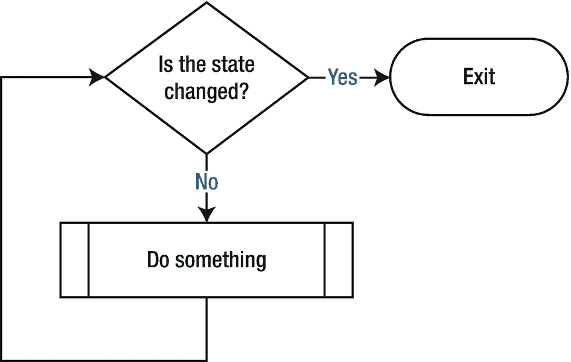

# 九、循环结构——`while`循环

这是循环结构的另一种方式(图 [9-1](#Fig1) )。



图 9-1

while 循环

```java
        while(i == 0) {
              <do something>;    //the variable "i" may be updated in this code block.
        }

```

可以在“做某事”过程中更新状态。

问:如果状态永远不变，会发生什么？

答:这将是一个“无限循环”，意味着程序将永远运行，直到它崩溃或被用户终止。

### 注意

你可能注意到了`<do something>`线旁边的`//`。这标识了开发人员留下的注释。你应该使用注释来注释你的代码，以便将来的读者更容易理解(他们可能是你，所以善待你未来的自己)。编译 Java 程序时，编译器会忽略所有注释。

## 例子

循环会执行它的主体多少次？

```java
int x = 1;
while (x < 100) {
    System.out.print(x + " ");
    x += 10;
}

```

答案:十次(当 x = 1，11，21，31，41，51，61，71，81，91 时)

## 例子

循环会执行它的主体多少次？

```java
int max = 10;
while (max < 10) {
    System.out.println("count down: " + max);
    max--;
}

```

答案:零。

`for`循环和`while`循环都是完成重复工作的循环结构(即<做某事>)。`for`循环提供了一种简单的方法来分配初始计数器值，并定义计数器值如何在同一行代码中递增(或递减)，而`while`循环要求用户在单独的行中定义它们。以下两个示例具有相同的功能。

```java
for(int i = 0; i < 10; i++) {
        <do something>
}

int i = 0;
while(i < 10) {
        <do something>
        i++;
}

```

除了`for`循环之外，我们需要`while`循环选项还有一个很好的理由。这个例子显示了我们更喜欢`while`循环而不是`for`循环的许多情况之一。

```java
        boolean flag = true;
        while(flag) {
               < commit planned operations

, during which time the flag may be updated upon a certain codition change, e.g. the operation is completed, or failed for some reason.>
        }

```

## do-while 循环

Java 还提供了一个`do` - `while`循环结构:

```java
do {
     <do something>
} while (expression);

```

`do` - `while`和`while`的区别在于`do` - `while`在循环的底部而不是顶部对其布尔表达式求值。因此，`do`块(又名<do something="">)中的语句总是至少执行一次。您可以尝试以下程序来观看演示。</do>

```java
class DoWhileDemo {
    public static void main(String[] args){
        int count = 1;
        do {
            System.out.println("Count is: " + count);
            count++;
        } while (count < 1);
    }
}

```

## 实验室工作

1.  使用`while`循环输出“Hello！”10 次。

2.  使用`while`循环打印出从 1 到 25 的所有整数，包括 1 和 25。

3.  解释下面的代码片段试图做什么。

    ```java
    int n = 5;
    while (n == 5) {
           n = n + 1;
           System.out.println(n);
           n--;
    }

    ```

## 问题

1.  循环会执行它的主体多少次？

    ```java
    int x = 250;
    while (x % 3 != 0) {
        System.out.println(x);
    }

    ```

2.  循环会执行它的主体多少次？

    ```java
    int x = 2;
    while (x < 200) {
        System.out.print(x + " ");
         x *= x;
    }

    ```

3.  循环会执行它的主体多少次？

    ```java
    String word = "a";
    while (word.length() < 10) {
        word = "b" + word + "b";
    }
    System.out.println(word);

    ```

4.  循环会执行它的主体多少次？

    ```java
    int x = 100;
    while (x > 1) {
        System.out.println(x / 10);
        x = x / 2;
    }

    ```

5.  给定静态方法`runWhileLoop()`，当`x = 10`时它的输出是什么？您可能希望将该方法复制到您的测试类中进行尝试。

    ```java
    public static void runWhileLoop(int x) {
        int y = 1;
        int z = 0;
        while (2 * y <= x) {
            y = y * 2;
            z++;
        }
        System.out.println(y + " " + z);
    }

    ```