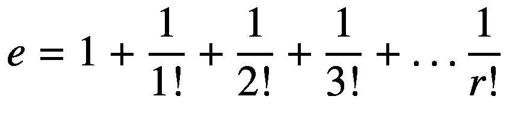

# 33.Java 中间解决方案

作为参考，在这一章中，我将为你提供前几章中一些问题的答案提示。比如“为了 16。”意思是“第 16 章中问题的提示”

## 为了 16。毕达哥拉斯三联体

1.  不使用“c”，我们可以检查(a <sup>2</sup> + b <sup>2</sup> )是否是一个完美的平方数，取它的平方根并验证它是否是一个整数值。

2.  使用示例代码并检查结果值(a <sup>2</sup> + b <sup>2</sup> )是否与“4n + 1”的形式相匹配。

## 为了 17。强类型编程

```java
       public boolean isCollinear(Point p) {
              if (p.getX() == p1.getX() && p1.getX() == p2.getX()) {
                     return true;
              }
              if (this.getSlope(p) == this.getSlope()) {
                     return true;
              }
              return false;
       }

public double getSlope(Point p) {
       if (this.p1.x == this.p.x) {
              throw new
IllegalStateException("Denominator cannot be 0");
       }
       return (double)(this.p.y - this.p1.y) / (this.p.x - this.p1.x);
}

```

## 18 岁。条件语句

1.  它被重写，如下所示。

    ```java
           if (num < 10 && num > 0) {
                  System.out.println("It's a one-digit number");
           }
           else if (num < 100) {
                  System.out.println("It's a two-digit number");
           }
           else if (num < 1000) {
                  System.out.println("It's a three-digit number");
           }
           else if (num < 10000) {
                  System.out.println("It's a four-digit number");
           }
           else {
                  System.out.println("The number is not between 1 & 9999");
           }

    ```

2.  这里显示了一个简化的版本。

    ```java
    if (a == 0) {
           if (b == 0) {...}
           else {...}
    } else {
           if (b != 0) {...}
    }

    ```

## 为了 19。交换语句

```java
switch(color) {

       case 'R':
              System.out.println("The color is red");
              break;
       case 'G':
              System.out.println("The color is green");
              break;
       case 'B':
              System.out.println("The color is black");
              break;
       case 'C':
       default:
              System.out.println("Some other color");
              break;
}

```

## 21 岁。计算

1.  定义 x 为孩子的数量，(2200–x)为成年人的数量，那么 1.5∫x+4∫(2200–x)= 5050。迭代 x = 0 到 2200，找到 x 的一个解。很明显，不存在一个以上的解。

2.  将 x 定义为正确答案的数量，将(10–x)定义为错误答案的数量，则 5∫x–2(10–x)= 29。从 0 到 10 迭代 x，找到 x 的可能解。

3.  迭代一个从 0 到 2001 的正整数，并检查它与 3、4 和 5 的整除性。

4.  迭代每个三位数的整数，从 100 到 999，并检查其位数。

5.  用一个递归的方法(参考例子)从三类植物(定义三类为 A、B、C)中重复挑选一个植物五次。然后从组合中删除重复项。例如:{A，A，B，B，C}是{A，B，A，B，C}的重复。

## 为了 23。Pi 的探索性实验

利用以下带有整数“r”的公式，近似计算“e”的值



## 为了 24。面向对象编程中的类

1.  a)

2.  b)

3.  ```java
             NumberHolder nh = new NumberHolder();
             Nh.anInt = 5;
             Nh.aFloat = 3.2;
             System.out.printIn("anInt=" + Nh.anInt + "; aFloat=" + Nh.aFloat);

    ```

4.  (一)、(四)

5.  (二)

## 26 岁。继承——代码重用

1.  (c)

2.  (b)、(d)、(e)、(f)

## 为了 27。封装和多态

1.  ```java
    public interface GeometricObject {

    public abstract double getPerimeter();
           public abstract double getArea();
    }

    ```

2.  ```java
           public class Circle implements GeometricObject {
           private final double PI = 3.14159;
           protected double radius;
           public Circle(double radius) {
                  this.radius = radius;
           }

           // Implement methods defined in the interface
           @Override
           public double getPerimeter() {
           return 2 * PI * this.radius;
           }

           @Override
           public double getArea() {
                  return PI * this.radius * this.radius;
           }
    }

    ```

## 28 年。数组——一种简单高效的数据结构

1.  (d)

2.  { 0, 4, 0, 0, 11, 0, 0, 2 }

## 29 元。常见陷阱

1.  如果想得到一个整数值，为什么不一开始就取一个整数输入呢？

    This is a corrected version. It is significantly simplified.

    ```java
    Scanner user_input = new Scanner(System.in);
    System.out.println("a=");
    int a = user_input.nextInt();
    System.out.println("b=");
    int b = user_input.nextInt();

    ```

2.  `myArray[3]`等于“13”吗？

    注意数组元素索引的定义。

3.  有必要查`stringsArray.length = 0`吗？在`for`循环中做`countMe.toLowerCase()`是一个好方法吗？

    This is a recommended version:

    ```java
    public static int CountStrings(String[] stringsArray, String countMe) {
           int occurences = 0;
           String keyword = countMe.toLowerCase();
           for (int i = 0; i < stringsArray.length; i ++) {
                  if (stringsArray[i].toLowerCase().contains(keyword)) {
                         occurences ++;
                  }

           }
           return occurences;
    }

    ```

4.  `myRect`初始化过吗？

    There is an important line to update in the `main()` method as shown here:

    ```java
    public class SomethingIsWrong {
           public static void main(String[] args) {
                   Rectangle myRect = new Rectangle();
                   myRect.width = 40;
                   myRect.height = 50;
                   System.out.println("myRect's area is " + myRect.area());
           }
    }

    ```

5.  既然变量`temp`已经被赋予了`array1`中第一个元素的值，我们需要从`for`循环中的`i=0`开始迭代吗？

    The simple fix is to change from `for (int i = 0; ... to for (int = 1; ...` in the original function as shown.

    ```java
    public static int getMaxLength(ArrayList<String> array1)  {
           if(array1.isEmpty()) {
                  return 0;
           }
           else {
                  String temp= array1.get(0);
                  for (int i = 1; i < array1.size(); i++) {
                         if (array1.get(i).length() > temp.length() ) {
                                temp= array1.get(i);
                         }
                  }
                  return temp.length();
           }
    }

    ```

6.  检查`if` / `else`子句。

    “`y > 31 && z > 12`的范围已经被“`z > 12 || y > 31`的范围覆盖。因此，原代码中的“`else if (...)`部分毫无意义。

7.  查看`Scanner`的实际使用情况。

    Due to the same reason stated in 1, the code can be corrected as shown:

    ```java
    System.out.println("What month were you born in? (1-12)");
    Scanner sc = new Scanner(System.in);
    int al = sc.nextInt();

    ```

8.  检查`if` / `else`子句

    `numToTake > 2`的范围已经包含了`numToTake >= 2 && numToTake < 3`的范围。`if`和`else if`条件句需要重写。