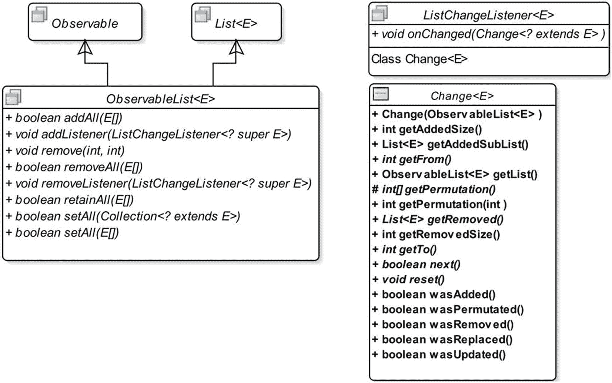
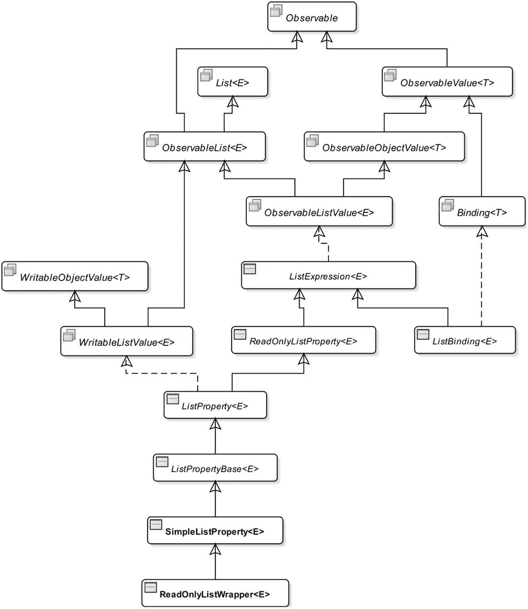

# 三、可观察的集合

在本章中，您将学习:

*   JavaFX 中有哪些可观察的集合

*   如何观察可观察集合的失效和变化

*   如何使用可观察集合作为属性

本章的例子在`com.jdojo.collections`包中。为了让它们工作，您必须在`module-info.java`文件中添加相应的一行:

```java
...
opens com.jdojo.collections to javafx.graphics, javafx.base;
...

```

## 什么是可观测集合？

JavaFX 中的可观察集合是 Java 中集合的扩展。Java 中的*集合*框架有`List`、`Set`和`Map`接口。JavaFX 添加了以下三种类型的可观察集合，可以观察到它们内容的变化:

*   可观察的列表

*   可观察的集合

*   可观察的地图

JavaFX 通过三个新接口支持这些类型的集合:

*   `ObservableList`

*   `ObservableSet`

*   `ObservableMap`

这些接口从`java.util`包中的`List`、`Set`和`Map`继承而来。除了从 Java 集合接口继承之外，JavaFX 集合接口还继承了`Observable`接口。所有 JavaFX 可观察集合接口和类都在`javafx.collections`包中。图 [3-1](#Fig1) 显示了`ObservableList`、`ObservableSet`和`ObservableMap`接口的部分类图。


图 3-1

JavaFX 中可观察集合接口的部分类图

JavaFX 中的可观察集合有两个额外的特性:

*   它们支持失效通知，因为它们是从`Observable`接口继承的。

*   它们支持更改通知。您可以向它们注册更改侦听器，当它们的内容发生更改时会得到通知。

`javafx.collections.FXCollections`类是一个使用 JavaFX 集合的实用程序类。它由所有静态方法组成。

JavaFX 不公开可观察列表、集合和映射的实现类。您需要使用`FXCollections`类中的一个工厂方法来创建`ObservableList`、`ObservableSet`和`ObservableMap`接口的对象。

Tip

简单地说，JavaFX 中的可观察集合是一个列表、集合或映射，可以观察到它的失效和内容变化。

## 理解*观察列表*

一个`ObservableList`是一个`java.util.List`和一个具有变更通知特性的`Observable`。图 [3-2](#Fig2) 显示了`ObservableList`接口的类图。



图 3-2

`ObservableList`接口的类图

Tip

图中缺少方法`filtered()`和`sorted()`。您可以使用它们来过滤和排序列表元素。有关详细信息，请参见 API 文档。

`ObservableList`接口中的`The addListener()`和`removeListener()`方法允许您分别添加和移除`ListChangeListener` s。其他方法对列表执行操作，这会影响多个元素。

如果您想在`ObservableList`中发生变化时收到通知，您需要添加一个`ListChangeListener`接口，当列表中发生变化时会调用该接口的`onChanged()`方法。`Change`类是`ListChangeListener`接口的静态内部类。一个`Change`对象包含一个`ObservableList`中变化的报告。它被传递给`ListChangeListener`的`onChanged()`方法。我将在本节的后面详细讨论列表更改侦听器。

您可以使用从`Observable`接口继承的以下两种方法在`ObservableList`中添加或移除失效监听器:

*   `void addListener(InvalidationListener listener)`

*   `void removeListener(InvalidationListener listener)`

注意，`ObservableList`包含了`List`接口的所有方法，因为它从`List`接口继承了这些方法。

Tip

JavaFX 库提供了两个名为`FilteredList`和`SortedList`的类，它们在`javafx.collections.transformation`包中。一个`FilteredList`是一个`ObservableList`，它使用一个指定的`Predicate`过滤它的内容。A `SortedList`对其内容进行排序。我不会在本章讨论这些类。所有关于可观察列表的讨论也适用于这些类的对象。

### 创建一个*可观察列表*

您需要使用`FXCollections`类的以下工厂方法之一来创建一个`ObservableList:`

*   `<E> ObservableList<E> emptyObservableList()`

*   `<E> ObservableList<E> observableArrayList()`

*   `<E> ObservableList<E> observableArrayList(Collection<? extends E> col)`

*   `<E> ObservableList<E> observableArrayList(E... items)`

*   `<E> ObservableList<E> observableList(List<E> list)`

*   `<E> ObservableList<E> observableArrayList(Callback<E, Observable[]> extractor)`

*   `<E> ObservableList<E> observableList(List<E> list, Callback<E, Observable[]> extractor)`

`emptyObservableList()`方法创建一个空的、不可修改的`ObservableList`。通常，当您需要一个`ObservableList`作为参数传递给一个方法，并且您没有任何元素要传递给那个列表时，就使用这个方法。您可以创建一个空的`String`的`ObservableList`，如下所示:

```java
ObservableList<String> emptyList = FXCollections.emptyObservableList();

```

`observableArrayList()`方法创建一个由`ArrayList`支持的`ObservableList`。该方法的其他变体创建一个`ObservableList`，其初始元素可以在一个`Collection`中指定为一个项目列表或一个`List`。

前面列表中的最后两个方法创建了一个`ObservableList`，可以观察它的元素是否有更新。他们接受一个提取器，它是`Callback<E, Observable[]>`接口的一个实例。一个提取器用于获取`Observable`值的列表，以观察更新。我将在“观察 ObservableList 的更新”一节中介绍这两种方法的使用。

清单 [3-1](#PC3) 展示了如何创建可观察列表以及如何使用`ObservableList`接口的一些方法来操作列表。最后，它展示了如何使用`FXCollections`类的`concat()`方法来连接两个可观察列表的元素。

```java
// ObservableListTest.java
package com.jdojo.collections;

import javafx.collections.FXCollections;
import javafx.collections.ObservableList;

public class ObservableListTest {
        public static void main(String[] args) {
            // Create a list with some elements
            ObservableList<String> list =
                    FXCollections.observableArrayList("one", "two");
            System.out.println("After creating list: " + list);

            // Add some more elements to the list

            list.addAll("three", "four");
            System.out.println("After adding elements: " + list);

            // You have four elements. Remove the middle two
            // from index 1 (inclusive) to index 3 (exclusive)
            list.remove(1, 3);
            System.out.println("After removing elements: " + list);

            // Retain only the element "one"
            list.retainAll("one");
            System.out.println("After retaining \"one\": " + list);

            // Create another ObservableList
            ObservableList<String> list2 =
                FXCollections.<String>observableArrayList(
                      "1", "2", "3");

            // Set list2 to list
            list.setAll(list2);
            System.out.println("After setting list2 to list: " +
                     list);

            // Create another list
            ObservableList<String> list3 =
                FXCollections.<String>observableArrayList(
                       "ten", "twenty", "thirty");

            // Concatenate elements of list2 and list3
            ObservableList<String> list4 =
                     FXCollections.concat(list2, list3);
            System.out.println("list2 is " + list2);
            System.out.println("list3 is " + list3);
            System.out.println(
                     "After concatenating list2 and list3:" + list4);
        }

}
After creating list: [one, two]
After adding elements: [one, two, three, four]
After removing elements: [one, four]
After retaining "one": [one]
After setting list2 to list: [1, 2, 3]
list2 is [1, 2, 3]
list3 is [ten, twenty, thirty]
After concatenating list2 and list3:[1, 2, 3, ten, twenty, thirty]

Listing 3-1Creating and Manipulating Observable Lists

```

### 观察一个*可观察列表*的无效

您可以像添加任何一个`Observable`一样添加失效监听器到一个`ObservableList`。清单 [3-2](#PC4) 展示了如何使用带有`ObservableList`的失效监听器。

Tip

在`ObservableList`的情况下，失效监听器被通知列表中的每一个变化，而不管变化的类型。

```java
// ListInvalidationTest.java
package com.jdojo.collections;

import javafx.beans.Observable;
import javafx.collections.FXCollections;
import javafx.collections.ObservableList;

public class ListInvalidationTest {
        public static void main(String[] args) {
                // Create a list with some elements
                ObservableList<String> list =
                    FXCollections.observableArrayList("one", "two");

                // Add an InvalidationListener to the list
                list.addListener(ListInvalidationTest::invalidated);

                System.out.println("Before adding three.");
                list.add("three");
                System.out.println("After adding three.");

                System.out.println("Before adding four and five.");
                list.addAll("four", "five");
                System.out.println("Before adding four and five.");

                System.out.println("Before replacing one with one.");
                list.set(0, "one");
                System.out.println("After replacing one with one.");
        }

        public static void invalidated(Observable list) {
                System.out.println("List is invalid.");
        }
}
Before adding three.
List is invalid.
After adding three.
Before adding four and five.
List is invalid.
Before adding four and five

.
Before replacing one with one.
List is invalid.
After replacing one with one.

Listing 3-2Testing Invalidation Notifications for an ObservableList

```

### 观察*可观察列表*的变化

观察`ObservableList`的变化有点棘手。列表可以有多种变化。有些变化可能是排他性的，而有些变化可能与其他变化一起发生。列表中的元素可以被置换、更新、替换、添加和删除。学习这个话题你需要耐心，因为我会零零碎碎的讲。

您可以使用其`addListener()`方法向`ObservableList`添加一个变更监听器，该方法采用了一个`ListChangeListener`接口的实例。每次列表发生变化时，监听器的`changed()`方法都会被调用。下面的代码片段展示了如何向`String`的`ObservableList`添加一个变更监听器。`onChanged()`方法简单；当它被通知更改时，它在标准输出上打印一条消息:

```java
// Create an observable list
ObservableList<String> list = FXCollections.observableArrayList();

// Add a change listener to the list
list.addListener(new ListChangeListener<String>() {
        @Override
        public void onChanged(ListChangeListener.Change<? extends String>
                  change) {
            System.out.println("List has changed.");
        }

});

```

清单 [3-3](#PC6) 包含了展示如何检测`ObservableList`中的变化的完整程序。它使用带有方法引用的 lambda 表达式(Java 8 的特性)来添加更改监听器。在添加了一个更改侦听器之后，它操纵列表四次，每次都通知侦听器，从下面的输出可以明显看出。

```java
// SimpleListChangeTest.java
package com.jdojo.collections;

import javafx.collections.FXCollections;
import javafx.collections.ListChangeListener;
import javafx.collections.ObservableList;

public class SimpleListChangeTest {
        public static void main(String[] args) {
            // Create an observable list
            ObservableList<String> list =
                    FXCollections.observableArrayList();

            // Add a change listener to the list
            list.addListener(SimpleListChangeTest::onChanged);

            // Manipulate the elements of the list
            list.add("one");
            list.add("two");
            FXCollections.sort(list);
            list.clear();
        }

        public static void onChanged(
                   ListChangeListener.Change<? extends String> change) {
            System.out.println("List has changed");
        }

}
List has changed.
List has changed.
List has changed.
List has changed.

Listing 3-3Detecting Changes in an ObservableList

```

#### 了解 *ListChangeListener。改变*类

有时，您可能想要更详细地分析列表的更改，而不仅仅是知道列表已经更改。传递给`onChanged()`方法的`ListChangeListener.Change`对象包含一个对列表执行的更改的报告。您需要使用其方法的组合来了解变更的细节。表 [3-1](#Tab1) 列出了`ListChangeListener.Change`类中的方法及其类别。

表 3-1

`ListChangeListener.Change`类中的方法

<colgroup><col class="tcol1 align-left"> <col class="tcol2 align-left"></colgroup> 
| 

方法

 | 

种类

 |
| --- | --- |
| `ObservableList<E> getList()` | 一般 |
| `boolean next()``void reset()` | 光标移动 |
| `boolean wasAdded()``boolean wasRemoved()``boolean wasReplaced()``boolean wasPermutated()``boolean wasUpdated()` | 更改类型 |
| `int getFrom()``int getTo()` | 受影响范围 |
| `int getAddedSize()``List<E> getAddedSubList()` | 添加 |
| `List<E> getRemoved()``int getRemovedSize()` | 搬迁 |
| `int getPermutation(int oldIndex)` | 排列 |

`getList()`方法在更改后返回源列表。一个`ListChangeListener.Change`对象可以报告多个块中的变化。这可能一开始并不明显。考虑以下代码片段:

```java
ObservableList<String> list = FXCollections.observableArrayList();

// Add a change listener here...

list.addAll("one", "two", "three");
list.removeAll("one", "three");

```

在这段代码中，变更监听器将被通知两次:一次是针对`addAll()`方法调用，一次是针对`removeAll()`方法调用。`ListChangeListener.Change`对象报告受影响的索引范围。在第二个更改中，您删除了属于两个不同索引范围的两个元素。注意，在两个被移除的元素之间有一个元素`"two"`。在第二种情况下，`Change`对象将包含两个变更的报告。第一个变化将包含索引 0 处的元素`"one"`已被移除的信息。现在，列表只包含两个元素，元素`"two"`的索引为 0，元素`"three"`的索引为 1。第二个变化将包含索引 1 处的元素`"three"`已被移除的信息。

一个`Change`对象包含一个指向报告中特定变更的光标。`next()`和`reset()`方法用于控制光标。当调用`onChanged()`方法时，光标指向报告中的第一个变更。第一次调用`next()`方法会将光标移动到报告中的第一个变更处。在试图读取变更的细节之前，您必须通过调用`next()`方法将光标指向变更。如果`next()`方法将光标移动到一个有效的变更，它将返回`true`。否则返回`false`。`reset()`方法在第一次改变前移动光标。通常，在 while 循环中调用`next()`方法，如以下代码片段所示:

```java
ObservableList<String> list = FXCollections.observableArrayList();
...
// Add a change listener to the list
list.addListener(new ListChangeListener<String>() {
    @Override
    public void onChanged(ListChangeListener.Change<? extends String>
             change) {
        while(change.next()) {
            // Process the current change here...
        }
    }

});

```

在变更类型类别中，方法报告特定类型的变更是否已经发生。如果添加了元素，`wasAdded()`方法返回`true`。如果元素被移除，`wasRemoved()`方法返回`true`。如果元素被替换，`wasReplaced()`方法返回`true`。您可以将替换看作是在相同的索引处删除后添加。如果`wasReplaced()`返回`true`，则`wasRemoved()`和`wasAdded()`也返回`true`。如果列表的元素被置换(即重新排序)但没有被删除、添加或更新，则`wasPermutated()`方法返回`true`。如果列表的元素被更新，`wasUpdated()`方法返回`true`。

并非列表的所有五种类型的更改都是排他的。某些变更可能会在同一个变更通知中同时发生。置换和更新这两种类型的改变是互斥的。如果您对处理所有类型的更改感兴趣，那么您在`onChanged()`方法中的代码应该如下所示:

```java
public void onChanged(ListChangeListener.Change change) {
        while (change.next()) {
                if (change.wasPermutated()) {
                        // Handle permutations
                }
                else if (change.wasUpdated()) {
                        // Handle updates
                }
                else if (change.wasReplaced()) {
                        // Handle replacements
                }
                else {
                        if (change.wasRemoved()) {
                                // Handle removals
                        }
                        else if (change.wasAdded()) {
                                // Handle additions
                        }
                }
        }
}

```

在受影响的范围类型类别中，`getFrom()`和`getTo()`方法报告受变更影响的索引范围。`getFrom()`方法返回开始索引，`getTo()`方法返回结束索引加 1。如果`wasPermutated()`方法返回`true`，则该范围包括被置换的元素。如果`wasUpdated()`方法返回`true`，则该范围包括被更新的元素。如果`wasAdded()`方法返回`true`，则该范围包括添加的元素。如果`wasRemoved()`方法返回`true`而`wasAdded()`方法返回`false`，那么`getFrom()`和`getTo()`方法返回相同的数字——移除的元素在列表中的位置的索引。

`getAddedSize()`方法返回添加的元素数量。`getAddedSubList()`方法返回一个包含添加元素的列表。`getRemovedSize()`方法返回移除的元素数量。`getRemoved()`方法返回一个不可变的被移除或替换元素的列表。`getPermutation(int oldIndex)`方法返回排列后元素的新索引。例如，如果在置换过程中，索引 2 处的元素移动到索引 5 处，`getPermutation(2)`将返回`5`。

关于`ListChangeListener.Change`类的方法的讨论到此结束。但是，您还没有完成这个课程！我仍然需要讨论如何在实际情况下使用这些方法，例如，当列表的元素被更新时。我将在下一节介绍如何处理列表元素的更新。我将用一个涵盖所有讨论内容的例子来结束这个主题。

#### 观察*可观察列表*的更新

在“创建一个*可观察列表*一节中，我已经列出了下面两个创建`ObservableList`的`FXCollections`类的方法:

*   `<E> ObservableList<E> observableArrayList(Callback<E, Observable[]> extractor)`

*   `<E> ObservableList<E> observableList(List<E> list, Callback<E, Observable[]> extractor)`

如果您希望在列表元素更新时得到通知，您需要使用以下方法之一创建列表。这两种方法有一个共同点:它们接受一个`Callback<E,Observable[]>`对象作为参数。`Callback<P,R>`接口在`javafx.util`包中。其定义如下:

```java
public interface Callback<P,R> {
        R call(P param)
}

```

`Callback<P,R>`接口用于 API 在以后合适的时间需要进一步动作的情况。第一个泛型类型参数指定传递给`call()`方法的参数的类型，第二个指定`call()`方法的返回类型。

如果您注意到`Callback<E,Observable[]>`中类型参数的声明，第一个类型参数是`E`，它是列表元素的类型。第二个参数是一个`Observable`数组。当您向列表中添加一个元素时，会调用`Callback`对象的`call()`方法。添加的元素作为参数传递给`call()`方法。你应该从`call()`方法返回一个`Observable`的数组。如果返回的`Observable`数组中的任何元素发生变化，监听器将被通知列表元素的“更新”变化，因为`call()`方法已经为该列表返回了`Observable`数组。

让我们看看为什么需要一个`Callback`对象和一个`Observable`数组来检测列表元素的更新。列表存储其元素的引用。它的元素可以在程序的任何地方使用它们的引用来更新。列表不知道它的元素正在从其他地方被更新。它需要知道`Observable`对象的列表，其中任何一个对象的改变都可能被认为是对其元素的更新。`Callback`对象的`call()`方法满足了这一要求。列表将每个元素传递给`call()`方法。`call()`方法返回一个`Observable`数组。该列表监视`Observable`数组元素的任何变化。当它检测到一个变化时，它通知它的变化监听器，它的与`Observable`数组相关的元素已经被更新。这个参数被命名为*提取器*的原因是它为一个列表元素提取一个数组`Observable`。

清单 [3-4](#PC11) 展示了如何创建一个`ObservableList`，当它的元素被更新时，它可以通知它的变化监听器。

```java
// ListUpdateTest.java
package com.jdojo.collections;

import java.util.List;
import javafx.beans.Observable;
import javafx.beans.property.IntegerProperty;
import javafx.beans.property.SimpleIntegerProperty;
import javafx.collections.FXCollections;
import javafx.collections.ListChangeListener;
import javafx.collections.ObservableList;
import javafx.util.Callback;

public class ListUpdateTest {
        public static void main(String[] args) {
            // Create an extractor for IntegerProperty.
            Callback<IntegerProperty, Observable[]> extractor =
                    (IntegerProperty p) -> {
                   // Print a message to know when it is called
                   System.out.println("The extractor is called for " + p);
                   // Wrap the parameter in an Observable[] and return it
                   return new Observable[]{p};
               };
            // Create an empty observable list with a callback to
            // extract the observable values for each element of the list
            ObservableList<IntegerProperty> list =
                FXCollections.observableArrayList(extractor);

            // Add two elements to the list

            System.out.println("Before adding two elements...");
            IntegerProperty p1 = new SimpleIntegerProperty(10);
            IntegerProperty p2 = new SimpleIntegerProperty(20);
            list.addAll(p1, p2); // Will call the call() method of the
                          // extractor - once for p1 and once for p2.
            System.out.println("After adding two elements...");

            // Add a change listener to the list
            list.addListener(ListUpdateTest::onChanged);

            // Update p1 from 10 to 100, which will trigger
            // an update change for the list
            p1.set(100);
        }

        public static void onChanged(
               ListChangeListener.Change<? extends IntegerProperty>
                    change) {
            System.out.println("List is " + change.getList());

            // Work on only updates to the list
            while (change.next()) {
                if (change.wasUpdated()) {
                    // Print the details of the update
                    System.out.println("An update is detected.");

                    int start = change.getFrom();
                    int end = change.getTo();
                    System.out.println("Updated range: [" + start +
                               ", " + end + "]");

                    List<? extends IntegerProperty> updatedElementsList;
                    updatedElementsList =
                               change.getList().subList(start, end);

                    System.out.println("Updated elements: " +
                                updatedElementsList);
                }
            }
        }

}
Before adding two elements...
The extractor is called for IntegerProperty [value: 10]
The extractor is called for IntegerProperty [value: 20]
After adding two elements...
List is [IntegerProperty [value: 100], IntegerProperty [value: 20]]
An update is detected.
Updated range: [0, 1]
Updated elements: [IntegerProperty [value: 100]]

Listing 3-4Observing a List for Updates of Its Elements

```

`ListUpdateTest`类的`main()`方法创建一个提取器，它是`Callback<IntegerProperty, Observable[]>`接口的一个对象。`call()`方法接受一个`IntegerProperty`参数，并将其包装在一个`Observable`数组中返回。它还打印传递给它的对象。

提取器用于创建一个`ObservableList`。两个`IntegerProperty`对象被添加到列表中。当添加对象时，提取器的`call()`方法被调用，添加的对象作为它的参数。从输出中可以明显看出这一点。`call()`方法返回被添加的对象。这意味着列表将监视对象(`IntegerProperty`)的任何变化，并通知它的变化监听器。

列表中会添加一个更改监听器。它只处理列表的更新。最后，您将列表中第一个元素的值从 10 更改为 100，以触发更新更改通知。

#### 观察*可观察列表*变化的完整示例

本节提供了一个完整的例子，展示了如何处理对`ObservableList`的不同种类的更改。

我们的起点是一个`Person`类，如清单 [3-5](#PC12) 所示。在这里，您将使用`Person`对象中的`ObservableList`。`Person`类有两个属性:`firstName`和`lastName`。两种属性都是`StringProperty`类型。它的`compareTo()`方法被实现来按照先名后姓的升序对`Person`对象进行排序。它的`toString()`方法打印名字、空格和姓氏。

```java
// Person.java
package com.jdojo.collections;

import javafx.beans.property.SimpleStringProperty;
import javafx.beans.property.StringProperty;

public class Person implements Comparable<Person> {
        private StringProperty firstName = new SimpleStringProperty();
        private StringProperty lastName = new SimpleStringProperty();

        public Person() {
                this.setFirstName("Unknown");
                this.setLastName("Unknown");
        }

        public Person(String firstName, String lastName) {
                this.setFirstName(firstName);
                this.setLastName(lastName);
        }

        // Complete listing part of the example sources download for
        // the book
        ...
}

Listing 3-5A Person Class with Two Properties Named firstName and lastName

```

清单 [3-6](#PC13) 中所示的`PersonListChangeListener`类是一个变更监听器类。它实现了`ListChangeListener`接口的`onChanged()`方法，为`Person`对象的`ObservableList`处理所有类型的变更通知。

```java
// PersonListChangeListener.java
// Listing part of the example sources download for the book

Listing 3-6A Change Listener for an ObservableList of Person Objects

```

清单 [3-7](#PC14) 中所示的`ListChangeTest`类是一个测试类。它创建了一个带有提取器的`ObservableList`。提取器返回一个`Person`对象的`firstName`和`lastName`属性的数组。这意味着当这些属性中的一个被改变时，作为列表元素的一个`Person`对象被认为是更新的，并且一个更新通知将被发送给所有的改变监听器。它将更改侦听器添加到列表中。最后，它对列表进行了几种更改，以触发更改通知。更改通知的详细信息打印在标准输出上。

这就完成了关于为`ObservableList`编写变更监听器的最复杂的讨论之一。JavaFX 的设计者没有把它变得更复杂，你难道不庆幸吗？

```java
// ListChangeTest.java
// Listing part of the example sources download for the book
Before adding Li Na: []
Change Type: Added
Added Size: 1
Added Range: [0, 1]
Added List: [Li Na]
After adding Li Na: [Li Na]

Before adding Vivi Gin and Li He: [Li Na]
Change Type: Added

Added Size: 2
Added Range: [1, 3]
Added List: [Vivi Gin, Li He]
After adding Vivi Gin and Li He: [Li Na, Vivi Gin, Li He]

Before sorting the list:[Li Na, Vivi Gin, Li He]
Change Type: Permutated
Permutated Range: [0, 3]
index[0] moved to index[1]
index[1] moved to index[2]
index[2] moved to index[0]
After sorting the list:[Li He, Li Na, Vivi Gin]

Before updating Li Na: [Li He, Li Na, Vivi Gin]
Change Type: Updated
Updated Range : [1, 2]
Updated elements are: [Li Smith]
After updating Li Smith: [Li He, Li Smith, Vivi Gin]

Before replacing Li He with Simon Ng: [Li He, Li Smith, Vivi Gin]
Change Type: Replaced
Change Type: Removed
Removed Size: 1
Removed Range: [0, 1]
Removed List: [Li He]
Change Type: Added

Added Size: 1
Added Range: [0, 1]
Added List: [Simon Ng]
After replacing Li He with Simon Ng: [Simon Ng, Li Smith, Vivi Gin]

Before setAll(): [Simon Ng, Li Smith, Vivi Gin]
Change Type: Replaced
Change Type: Removed
Removed Size: 3
Removed Range: [0, 3]
Removed List: [Simon Ng, Li Smith, Vivi Gin]
Change Type: Added
Added Size: 3
Added Range: [0, 3]
Added List: [Lia Li, Liz Na, Li Ho]
After setAll(): [Lia Li, Liz Na, Li Ho]

Before removeAll(): [Lia Li, Liz Na, Li Ho]
Change Type: Removed
Removed Size: 1
Removed Range: [0, 0]
Removed List: [Lia Li]
Change Type: Removed

Removed Size: 1
Removed Range: [1, 1]
Removed List: [Li Ho]
After removeAll(): [Liz Na]

Listing 3-7Testing an ObservableList of Person Objects for All Types of Changes

```

## 了解*可观察设置*

如果您在学习了`ObservableList`和 list change listeners 之后还活着，那么学习`ObservableSet`将会很容易！图 [3-3](#Fig3) 显示了`ObservableSet`接口的类图。


图 3-3

`ObservableSet`接口的类图

它继承自`Set`和`Observable`接口。它支持失效和变更通知，并且从`Observable`接口继承了失效通知支持的方法。它添加了以下两种方法来支持更改通知:

*   `void addListener(SetChangeListener<? super E> listener)`

*   `void removeListener(SetChangeListener<? super E> listener)`

`SetChangeListener`接口的一个实例监听`ObservableSet`中的变化。它声明了一个名为`Change`的静态内部类，表示一个`ObservableSet`中的变化报告。

Note

集合是一个无序的集合。本节显示了输出中几个集合的元素。您可能会得到不同的输出，以不同于示例中所示的顺序显示集合的元素。

### 创建一个*可观察集合*

您需要使用`FXCollections`类的以下工厂方法之一来创建一个`ObservableSet`:

*   `<E> ObservableSet<E> observableSet(E... elements)`

*   `<E> ObservableSet<E> observableSet(Set<E> set)`

*   `<E> ObservableSet<E> emptyObservableSet()`

由于使用可观察集合与使用可观察列表没有太大的不同，我们不进一步研究这个主题。您可以参考 API 文档和`com.jdojo.collections`包中的示例类来了解更多关于可观察集的信息。

## 理解*观察图*

图 [3-4](#Fig4) 显示了`ObservableMap`接口的类图。它继承自`Map`和`Observable`接口。它支持失效和更改通知。它从`Observable`接口继承了无效通知支持的方法，并增加了以下两个方法来支持变更通知:


图 3-4

`ObservableMap`接口的类图

*   `void addListener(MapChangeListener<? super K, ? super V> listener)`

*   `void removeListener(MapChangeListener<? super K, ? super V> listener)`

`MapChangeListener`接口的一个实例监听`ObservableMap`中的变化。它声明了一个名为`Change`的静态内部类，表示一个`ObservableMap`中的变化报告。

### 创建一个*可观察地图*

您需要使用`FXCollections`类的以下工厂方法之一来创建一个`ObservableMap`:

*   `<K,V> ObservableMap<K, V> observableHashMap()`

*   `<K,V> ObservableMap<K, V> observableMap(Map<K, V> map)`

*   `<K,V> ObservableMap<K,V> emptyObservableMap()`

第一种方法创建一个由`HashMap`支持的空的可观察地图。第二种方法创建一个由指定地图支持的`ObservableMap`。在`ObservableMap`上执行的突变被报告给监听器。直接在支持映射上执行的突变不会报告给监听器。第三种方法创建一个空的不可修改的可观察图。清单 [3-8](#PC15) 展示了如何创建`ObservableMap` s。

```java
// ObservableMapTest.java
package com.jdojo.collections;

import java.util.HashMap;
import java.util.Map;
import javafx.collections.FXCollections;
import javafx.collections.ObservableMap;

public class ObservableMapTest {
        public static void main(String[] args) {
            ObservableMap<String, Integer> map1 =
                    FXCollections.observableHashMap();

            map1.put("one", 1);
            map1.put("two", 2);
            System.out.println("Map 1: " + map1);

            Map<String, Integer> backingMap = new HashMap<>();
            backingMap.put("ten", 10);
            backingMap.put("twenty", 20);

            ObservableMap<String, Integer> map2 =
                    FXCollections.observableMap(backingMap);
            System.out.println("Map 2: " + map2);
        }

}
Map 1: {two=2, one=1}
Map 2: {ten=10, twenty=20}

Listing 3-8Creating ObservableMaps

```

因为使用可观察的地图与使用可观察的列表和集合没有太大的不同，所以我们不进一步研究这个主题。您可以参考 API 文档和`com.jdojo.collections`包中的示例类来了解更多关于可观察地图的信息。

## JavaFX 集合的属性和绑定

可以将`ObservableList`、`ObservableSet`和`ObservableMap`集合公开为`Property`对象。它们还支持使用高级和低级绑定 API 的绑定。代表单一值的属性对象在第 2 章[中讨论过。在继续本节之前，请确保您已经阅读了该章。](02.html)

### 了解 *ObservableList* 属性和绑定

图 [3-5](#Fig5) 显示了`ListProperty`类的部分类图。`ListProperty`类实现了`ObservableValu` e 和`ObservableList`接口。它是一个可观察的值，因为它包含了一个`ObservableList`的参考。实现`ObservableList`接口使得它的所有方法对一个`ListProperty`对象可用。在`ListProperty`上调用`ObservableList`的方法与在被包装的`ObservableList`上调用它们具有相同的效果。



图 3-5

`ListProperty`类的部分类图

您可以使用`SimpleListProperty`类的以下构造器之一来创建`ListProperty`的实例:

*   `SimpleListProperty()`

*   `SimpleListProperty(ObservableList<E> initialValue)`

*   `SimpleListProperty(Object bean, String name)`

*   `SimpleListProperty(Object bean, String name, ObservableList<E> initialValue)`

使用`ListProperty`类的一个常见错误是在使用之前没有将`ObservableList`传递给它的构造器。在对其执行有意义的操作之前，`ListProperty`必须有对`ObservableList`的引用。如果不使用`ObservableList`来创建`ListProperty`对象，可以使用它的`set()`方法来设置`ObservableList`的引用。以下代码片段会生成一个异常:

```java
ListProperty<String> lp = new SimpleListProperty<String>();

// No ObservableList to work with. Generates an exception.
lp.add("Hello");
Exception in thread "main" java.lang.UnsupportedOperationException
        at java.util.AbstractList.add(AbstractList.java:148)
        at java.util.AbstractList.add(AbstractList.java:108)
        at javafx.beans.binding.ListExpression.add(ListExpression.java:262)

```

Tip

在包装了`null`引用的`ListProperty`上执行的操作被视为在不可变的空`ObservableList`上执行的操作。

下面的代码片段展示了如何在使用之前创建和初始化一个`ListProperty`:

```java
ObservableList<String> list1 = FXCollections.observableArrayList();
ListProperty<String> lp1 = new SimpleListProperty<String>(list1);
lp1.add("Hello");

ListProperty<String> lp2 = new SimpleListProperty<String>();
lp2.set(FXCollections.observableArrayList());
lp2.add("Hello");

```

#### 观察*列表属性*的变化

您可以将三种类型的监听器附加到一个`ListProperty`:

*   一个`InvalidationListener`

*   答`ChangeListener`

*   答`ListChangeListener`

当包装在`ListProperty`中的`ObservableList`的引用发生变化或者`ObservableList`的内容发生变化时，所有三个监听器都会得到通知。当列表的内容改变时，`ChangeListeners`的`changed()`方法接收对相同列表的引用作为新旧值。如果`ObservableList`的包装引用被一个新的替换，这个方法接收旧列表和新列表的引用。要处理列表更改事件，请参考本章中的“观察一个*可观察列表*的更改”一节。

清单 [3-9](#PC18) 中的程序展示了如何处理对一个`ListProperty`的所有三种类型的改变。列表更改监听器以简单通用的方式处理列表内容的更改。具体如何处理一个`ObservableList`的内容变化事件，请参见本章“观察一个*观察列表*的变化”一节。

```java
// ListPropertyTest.java
// Listing part of the example sources download for the book

Before addAll()
List property is invalid.
List Property has changed. Old List: [one, two, three], New List: [one, two, three]
Action taken on the list: Added. Removed: [], Added: [one, two, three]
After addAll()

Before set()
List property is invalid.
List Property has changed. Old List: [one, two, three], New List: [two, three]
Action taken on the list: Replaced. Removed: [one, two, three], Added: [two, three]
After set()

Before remove()
List property is invalid

.
List Property has changed. Old List: [three], New List: [three]
Action taken on the list: Removed. Removed: [two], Added: []
After remove()

Listing 3-9Adding Invalidation, Change, and List Change Listeners to a ListProperty

```

#### 绑定*列表属性*的*大小*和*空*属性

一个`ListProperty`公开了两个属性，`size`和`empty`，它们分别属于类型`ReadOnlyIntegerProperty`和`ReadOnlyBooleanProperty`。您可以使用`sizeProperty()`和`emptyProperty()`方法访问它们。`size`和`empty`属性对于 GUI 应用程序中的绑定非常有用。例如，GUI 应用程序中的模型可能由一个`ListProperty`支持，您可以将这些属性绑定到屏幕上标签的 text 属性。当模型中的数据发生变化时，标签会通过绑定自动更新。`size`和`empty`属性在`ListExpression`类中声明。

清单 [3-10](#PC19) 中的程序展示了如何使用`size`和`empty`属性。它使用`ListExpression`类的`asString()`方法将包装的`ObservableList`内容转换为`String`。

```java
// ListBindingTest.java
package com.jdojo.collections;

import javafx.beans.property.ListProperty;
import javafx.beans.property.SimpleListProperty;
import javafx.beans.property.SimpleStringProperty;
import javafx.beans.property.StringProperty;
import javafx.collections.FXCollections;

public class ListBindingTest {
        public static void main(String[] args) {
            ListProperty<String> lp =
                        new SimpleListProperty<>(FXCollections.observableArrayList());

            // Bind the size and empty properties of the ListProperty
            // to create a description of the list
            StringProperty initStr = new SimpleStringProperty("Size: " );
            StringProperty desc = new SimpleStringProperty();
            desc.bind(initStr.concat(lp.sizeProperty())
                             .concat(", Empty: ")
                             .concat(lp.emptyProperty())
                             .concat(", List: ")
                             .concat(lp.asString()));

            System.out.println("Before addAll(): " + desc.get());
            lp.addAll("John", "Jacobs");
            System.out.println("After addAll(): " + desc.get());
        }

}
Before addAll(): Size: 0, Empty: true, List: []
After addAll(): Size: 2, Empty: false, List: [John, Jacobs]

Listing 3-10Using the size and empty Properties of a ListProperty Object

```

### 绑定到列表属性和内容

支持列表属性高级绑定的方法在`ListExpression`和`Bindings`类中。低级绑定可以通过子类化`ListBinding`类来创建。一个`ListProperty`支持两种类型的绑定:

*   绑定它所包装的`ObservableList`的引用

*   绑定它所包装的`ObservableList`的内容

`bind()`和`bindBidirectional()`方法用于创建第一种绑定。清单 [3-11](#PC20) 中的程序展示了如何使用这些方法。如下面的输出所示，注意两个列表属性在绑定后都引用了同一个`ObservableList`。

```java
// BindingListReference.java
package com.jdojo.collections;

import javafx.beans.property.ListProperty;
import javafx.beans.property.SimpleListProperty;
import javafx.collections.FXCollections;

public class BindingListReference {

        public static void main(String[] args) {
            ListProperty<String> lp1 =
                new SimpleListProperty<>(
                         FXCollections.observableArrayList());
            ListProperty<String> lp2 =
                new SimpleListProperty<>(
                         FXCollections.observableArrayList());

            lp1.bind(lp2);

            print("Before addAll():", lp1, lp2);
            lp1.addAll("One", "Two");
            print("After addAll():", lp1, lp2);

            // Change the reference of the ObservableList in lp2
            lp2.set(FXCollections.observableArrayList("1", "2"));
            print("After lp2.set():", lp1, lp2);

            // Cannot do the following as lp1 is a bound property
            // lp1.set(FXCollections.observableArrayList("1", "2"));
            // Unbind lp1
            lp1.unbind();
            print("After unbind():", lp1, lp2);

            // Bind lp1 and lp2 bidirectionally

            lp1.bindBidirectional(lp2);
            print("After bindBidirectional():", lp1, lp2);

            lp1.set(FXCollections.observableArrayList("X", "Y"));
            print("After lp1.set():", lp1, lp2);
        }

        public static void print(String msg, ListProperty<String> lp1,
                   ListProperty<String> lp2) {
            System.out.println(msg);
            System.out.println("lp1: " + lp1.get() + ", lp2: " +
                    lp2.get() + ", lp1.get() == lp2.get(): " +
                    (lp1.get() == lp2.get()));
            System.out.println("---------------------------");
        }
}
Before addAll():
lp1: [], lp2: [], lp1.get() == lp2.get(): true
---------------------------
After addAll():
lp1: [One, Two], lp2: [One, Two], lp1.get() == lp2.get(): true
---------------------------
After lp2.set():
lp1: [1, 2], lp2: [1, 2], lp1.get() == lp2.get(): true
---------------------------
After unbind():
lp1: [1, 2], lp2: [1, 2], lp1.get() == lp2.get(): true
---------------------------
After bindBidirectional():
lp1: [1, 2], lp2: [1, 2], lp1.get() == lp2.get(): true

---------------------------
After lp1.set():
lp1: [X, Y], lp2: [X, Y], lp1.get() == lp2.get(): true
---------------------------

Listing 3-11Binding the References of List Properties

```

通过`bindContent()`和`bindContentBidirectional()`方法，您可以分别在一个方向和两个方向上将包装在`ListProperty`中的`ObservableList`的内容绑定到另一个`ObservableList`的内容。确保使用相应的方法`unbindContent()`和`unbindContentBidirectional()`来解除两个可观察列表的内容绑定。

Tip

您还可以使用`Bindings`类的方法来为可观察列表的引用和内容创建绑定。

允许更改一个内容已经绑定到另一个`ObservableList`的`ListProperty`的内容，但这并不可取。在这种情况下，绑定的`ListProperty`将不会与其目标列表同步。清单 3-12 展示了这两种内容绑定的例子。

```java
// BindingListContent.java
package com.jdojo.collections;

import javafx.beans.property.ListProperty;
import javafx.beans.property.SimpleListProperty;
import javafx.collections.FXCollections;

public class BindingListContent {

        public static void main(String[] args) {
            ListProperty<String> lp1 =
                new SimpleListProperty<>(
                         FXCollections.observableArrayList());
            ListProperty<String> lp2 =
                new SimpleListProperty<>(
                         FXCollections.observableArrayList());

            // Bind the content of lp1 to the content of lp2
            lp1.bindContent(lp2);

            /* At this point, you can change the content of lp1\. However,
             * that will defeat the purpose of content binding, because
             * the content of lp1 is no longer in sync with the content of
             * lp2.
             * Do not do this:
             * lp1.addAll("X", "Y");
             */
            print("Before lp2.addAll():", lp1, lp2);
            lp2.addAll("1", "2");
            print("After lp2.addAll():", lp1, lp2);

            lp1.unbindContent(lp2);
            print("After lp1.unbindContent(lp2):", lp1, lp2);

            // Bind lp1 and lp2 contents bidirectionally

            lp1.bindContentBidirectional(lp2);

            print("Before lp1.addAll():", lp1, lp2);
            lp1.addAll("3", "4");
            print("After lp1.addAll():", lp1, lp2);

            print("Before lp2.addAll():", lp1, lp2);
            lp2.addAll("5", "6");
            print("After lp2.addAll():", lp1, lp2);
        }

        public static void print(String msg, ListProperty<String> lp1,
                   ListProperty<String> lp2) {
            System.out.println(msg + " lp1: " + lp1.get() +
                    ", lp2: " + lp2.get());
        }

}
Before lp2.addAll(): lp1: [], lp2: []
After lp2.addAll(): lp1: [1, 2], lp2: [1, 2]
After lp1.unbindContent(lp2): lp1: [1, 2], lp2: [1, 2]
Before lp1.addAll(): lp1: [1, 2], lp2: [1, 2]
After lp1.addAll(): lp1: [1, 2, 3, 4], lp2: [1, 2, 3, 4]
Before lp2.addAll(): lp1: [1, 2, 3, 4], lp2: [1, 2, 3, 4]
After lp2.addAll(): lp1: [1, 2, 3, 4, 5, 6], lp2: [1, 2, 3, 4, 5, 6]

Listing 3-12Binding Contents of List Properties

```

#### 绑定到列表的元素

提供了如此多有用的特性，以至于我可以继续讨论这个话题至少 50 多页！我将用另外一个例子来结束这个话题。

可以使用`ListExpression`类的以下方法之一绑定到包装在`ListProperty`中的`ObservableList`的特定元素:

*   `ObjectBinding<E> valueAt(int index)`

*   `ObjectBinding<E> valueAt(ObservableIntegerValue index)`

该方法的第一个版本为列表中特定索引处的元素创建一个`ObjectBinding`。该方法的第二个版本将一个索引作为参数，它是一个可以随时间变化的`ObservableIntegerValue`。当`valueAt()`方法中的绑定索引在列表范围之外时，`ObjectBinding`包含`null`。

让我们使用该方法的第二个版本来创建一个绑定，它将绑定到列表的最后一个元素。在这里，您可以利用`ListProperty`的`size`属性来创建绑定表达式。清单 [3-13](#PC22) 中的程序展示了如何使用`valueAt()`方法。

```java
// BindingToListElements.java
// Listing part of the example sources download for the book
List:[], Last Value: null
List:[John], Last Value: John
List:[John, Donna, Geshan], Last Value: Geshan
List:[John, Donna], Last Value: Donna
List:[], Last Value: null

Listing 3-13Binding to the Elements of a List

```

### 了解 *ObservableSet* 属性和绑定

一个`SetProperty`对象包装了一个`ObservableSet`。和`SetProperty`一起工作和和`ListProperty`一起工作非常相似。我不打算重复前面几节中讨论的关于`ObservableList`的属性和绑定的内容。同样的讨论也适用于`ObservableSet`的属性和绑定。以下是使用`SetProperty`时需要记住的要点:

*   `SetProperty`类的类图类似于图 [3-5](#Fig5) 中`ListProperty`类的类图。您需要将所有名称中的单词“List”替换为“Set”。

*   `SetExpression`和`Bindings`类包含支持设置属性的高级绑定的方法。你需要子类化`SetBinding`类来创建底层绑定。

*   像`ListProperty`一样，`SetProperty`公开了`size`和`empty`属性。

*   和`ListProperty`一样，`SetProperty`支持引用和它所包装的`ObservableSet`内容的绑定。

*   与`ListProperty`一样，`SetProperty`支持三种类型的通知:失效通知、更改通知和设置更改通知。

*   与列表不同，集合是项目的无序集合。它的元素没有索引。它不支持绑定到其特定元素。因此，`SetExpression`类不像`ListExpression`类那样包含类似于`valueAt()`的方法。

您可以使用`SimpleSetProperty`类的以下构造器之一来创建`SetProperty`的实例:

*   `SimpleSetProperty()`

*   `SimpleSetProperty(ObservableSet<E> initialValue)`

*   `SimpleSetProperty(Object bean, String name)`

*   `SimpleSetProperty(Object bean, String name, ObservableSet<E> initialValue)`

下面的代码片段创建了一个`SetProperty`的实例，并向属性包装的`ObservableSet`添加了两个元素。最后，它使用`get()`方法从属性对象中获取`ObservableSet`的引用:

```java
// Create a SetProperty object
SetProperty<String> sp = new SimpleSetProperty<String>(FXCollections.observableSet());

// Add two elements to the wrapped ObservableSet
sp.add("one");
sp.add("two");

// Get the wrapped set from the sp property

ObservableSet<String> set = sp.get();

```

清单 [3-14](#PC24) 中的程序演示了如何绑定`SetProperty`对象。

```java
// SetBindingTest.java
// Listing part of the example sources download for the book
Before sp1.add(): Size: 0, Empty: true, Set: []
After sp1.add(): Size: 2, Empty: false, Set: [Jacobs, John]
Called sp1.bindContent(sp2)...
Before sp2.add(): sp1: [], sp2: []
After sp2.add(): sp1: [1], sp2: [1]
After sp1.unbindContent(sp2): sp1: [1], sp2: [1]
Before sp2.add(): sp1: [1], sp2: [1]
After sp2.add(): sp1: [1, 2], sp2: [2, 1]

Listing 3-14Using Properties and Bindings for Observable Sets

```

### 理解 *ObservableMap* 属性和绑定

一个`MapProperty`对象包装了一个`ObservableMap`。和`MapProperty`一起工作和和`ListProperty`一起工作非常相似。我不打算重复前面几节中讨论的关于`ObservableList`的属性和绑定的内容。同样的讨论也适用于`ObservableMap`的属性和绑定。以下是使用`MapProperty`时需要记住的要点:

*   `MapProperty`类的类图类似于图 [3-5](#Fig5) 中`ListProperty`类的类图。您需要将所有名称中的单词“List”替换为单词“map”，将泛型类型参数`<E>`替换为`<K, V>`，其中 K 和 V 分别代表 Map 中条目的键类型和值类型。

*   `MapExpression`和`Bindings`类包含支持地图属性高级绑定的方法。你需要子类化`MapBinding`类来创建底层绑定。

*   与`ListProperty`一样，`MapProperty`公开了`size`和`empty`属性。

*   和`ListProperty`一样，`MapProperty`支持引用和它所包装的`ObservableMap`内容的绑定。

*   像`ListProperty`一样，`MapProperty`支持三种类型的通知:无效通知、更改通知和地图更改通知。

*   `MapProperty`支持使用其`valueAt()`方法绑定到特定键值。

使用下列`SimpleMapProperty`类的构造器之一创建`MapProperty`的实例:

*   `SimpleMapProperty()`

*   `SimpleMapProperty(Object bean, String name)`

*   `SimpleMapProperty(Object bean, String name, ObservableMap<K,V> initialValue)`

*   `SimpleMapProperty(ObservableMap<K,V> initialValue)`

下面的代码片段创建了一个`MapProperty`的实例，并添加了两个条目。最后，它使用`get()`方法获得被包装的`ObservableMap`的引用:

```java
// Create a MapProperty object
MapProperty<String, Double> mp =
        new SimpleMapProperty<String, Double>(FXCollections.observableHashMap());

// Add two entries to the wrapped ObservableMap
mp.put("Ken", 8190.20);
mp.put("Jim", 8990.90);

// Get the wrapped map from the mp property
ObservableMap<String, Double> map = mp.get();

```

清单 [3-15](#PC26) 中的程序展示了如何绑定`MapProperty`对象。它显示了两个地图之间的内容绑定。您还可以在两个地图属性之间使用单向和双向简单绑定来绑定它们包装的地图的引用。

```java
// MapBindingTest.java
// Listing part of the example sources download for the book
Ken Salary: null
Before mp1.put(): Size: 0, Empty: true, Map: {}, Ken Salary: null
After mp1.put(): Size: 3, Empty: false, Map: {Jim=9800.8, Lee=6000.2, Ken=7890.9}, Ken Salary: 7890.9
Called mp1.bindContent(mp2)...
Before mp2.put(): Size: 0, Empty: true, Map: {}, Ken Salary: null
After mp2.put(): Size: 2, Empty: false, Map: {Cindy=7800.2, Ken=7500.9}, Ken Salary: 7500.9

Listing 3-15Using Properties and Bindings for Observable Maps

```

## 摘要

JavaFX 通过添加对可观察列表、集合和映射(称为可观察集合)的支持，扩展了 Java 中的集合框架。可观察集合是一个列表、集合或映射，可以观察到它的失效和内容变化。`javafx.collections`包中的`ObservableList`、`ObservableSet`和`ObservableMap`接口的实例代表 JavaFX 中可观察到的接口。您可以向这些可观察集合的实例添加失效和更改侦听器。

`FXCollections`类是一个使用 JavaFX 集合的实用程序类。它由所有静态方法组成。JavaFX 不公开可观察列表、集合和映射的实现类。您需要使用`FXCollections`类中的一个工厂方法来创建`ObservableList`、`ObservableSet`和`ObservableMap`接口的对象。

JavaFX 库提供了两个名为`FilteredList`和`SortedList`的类，它们在`javafx.collections.transformation`包中。一个`FilteredList`是一个`ObservableList`，它使用一个指定的`Predicate`过滤它的内容。A `SortedList`对其内容进行排序。

下一章将讨论如何在 JavaFX 应用程序中创建和定制 stages。