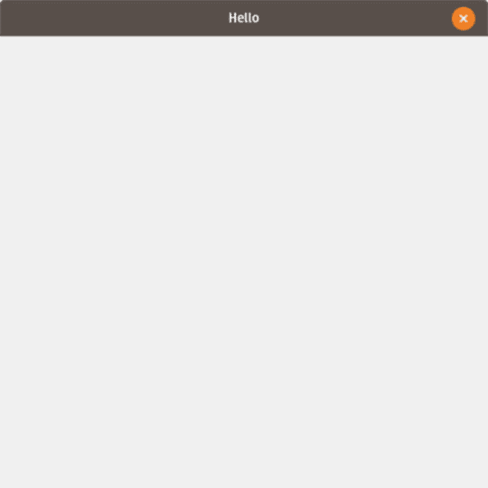

# 十八、Swing 图形

*Swing* 是用于构建跨平台 GUI(图形用户界面)的 Java API。

如果你想写一个图形程序(例如，一个电脑游戏)，你必须使用 Swing，或者 JavaFX，或者类似的东西。

在 Java 中有许多其他的图形库，但是 Swing 是内置的。

## 你好窗户

图形最基本的概念是把东西放到屏幕上。

在 Swing 中最简单的方法是使用`JWindow`，例如:

```java
 1   import javax.swing.*; import java.awt.Graphics;
 2
 3   public class HelloWindow extends JWindow {
 4
 5           public HelloWindow() {
 6                    setSize(500, 500); //width, height
 7                    setAlwaysOnTop(true);
 8                    setVisible(true);
 9           }
10
11           @Override
12           public void paint(Graphics g) {
13                    g.setFont(g.getFont().deriveFont(20f));
14                    g.drawString("Hello Window", 10, 20); //x,y
15           }
16
17           public static void main(String[] args) {
18                    new HelloWindow();
19           }
20
21   }

```

运行这段代码将在屏幕的左上方创建一个窗口，上面印有“Hello Window”字样。它看起来应该如图 [18-1](#Fig1) 所示。


图 18-1

你好窗口

在构造器中，会发生以下情况:

*   窗口的宽度和高度都设置为 500 像素。

*   用`setAlwaysOnTop`方法将窗口设置为总是显示(在所有其他窗口之上)。

*   最后，调用`setVisible(true)`使窗口可见。

每次在屏幕上绘制窗口时，都会调用`paint`方法。这种方法只完成以下工作:

*   将字体大小设置为 20

*   在坐标 x=10，y=20 处绘制字符串“`Hello World`”(坐标始终以像素为单位)

你可能会注意到“窗口”没有你习惯的任何边缘、标题、菜单或最小化/最大化图标(要关闭它，你需要按下 *Ctrl+C* )。要得到这些东西，你用一个`JFrame`。这里有一个非常简单的例子:

```java
 1   import javax.swing.*;
 2
 3   public class HelloFrame extends JFrame {
 4
 5           public HelloFrame() {
 6                   super("Hello");
 7                   setSize(500, 500); //width, height
 8                   setAlwaysOnTop(true);
 9                   setVisible(true);
10                   setDefaultCloseOperation(EXIT_ON_CLOSE);
11           }
12
13           public static void main(String[] args) {
14                   new HelloFrame();
15           }
16
17   }

```

运行这段代码创建一个 500×500 的“带框架的窗口”，名称为“Hello”(图 [18-2](#Fig2) )，关闭窗口将退出应用程序。



图 18-2

有 JFrame 的窗户

## 按我的按钮

按钮是用户与程序交互的方式之一。当按钮被按下时，你可以使用一个`ActionListener`，例如:

`JOptionPane`的`showMessageDialog`方法类似于 JavaScript 的`alert`方法，显示一个弹出窗口。

```java
1   button.addActionListener(e -> JOptionPane.showMessageDialog(this, "Hello!"));

```

这使用了一个 Java lambda 表达式，因为 ActionListener 有一个抽象方法，因此是一个函数接口，正如我们前面所学的。

Groovy 语法略有不同(它只需要一个`{ and }`)。

```java
1   button.addActionListener({e -> JOptionPane.showMessageDialog(this, "Hello!")})

```

Swing 有很多以单词`Listener`结尾的接口，比如

*   `KeyListener`

*   `MouseListener`

*   `WindowListener`

*监听器*模式与*观察者*设计模式非常相似。

## 假浏览器

让我们做一个网络浏览器吧！

让我们从添加必要的导入开始:

```java
1  import java.awt.*;
2  import java.awt.event.*;
3  import java.io.*;
4  import java.net.*;
5  import javax.swing.*;

```

然后，让我们继续为该类创建字段和构造器，如下所示:

```java
 1   public class Browser extends JFrame {
 2
 3           JTextField urlField = new JTextField();
 4           JEditorPane viewer = new JEditorPane();
 5           JScrollPane pane = new JScrollPane();
 6
 7           public Browser() {
 8                   super("Browser");
 9                   setSize(800,600);
10                   setAlwaysOnTop(true);
11                   setDefaultCloseOperation(EXIT_ON_CLOSE);
12                   init();
13           }

```

`JTextField`将用于输入网址。`JEditorPane`用于显示 HTML，`JScrollPane`允许页面滚动。

接下来，我们定义了`init()`方法来把所有东西放在一起。

```java
 1   private void init() {
 2           viewer.setContentType("text/html");
 3           pane.setViewportView(viewer);
 4           JPanel panel = new JPanel();
 5           panel.setLayout(new BorderLayout(2,2));
 6           panel.add(pane, BorderLayout.CENTER);
 7           panel.add(urlField, BorderLayout.NORTH);
 8           setContentPane(panel);
 9           urlField.addKeyListener(new KeyAdapter() {
10                   @Override
11                   public void keyReleased(KeyEvent e) {
12                           handleKeyPress(e);
13                   }
14           });
15   }

```

`viewer`被设置为`JScrollPane`的视口视图，因此可以滚动。

`JPanel`是用`BorderLayout`创建的。这允许我们将`urlField`安排在滚动窗格的顶部，就像在真正的浏览器中一样。`KeyListener`用于在`urlField`内按下一个键时调用`handleKeyPress`。

接下来，我们填写`handleKeyPress`方法。

```java
 1   private void handleKeyPress(KeyEvent e) {
 2           if (e.getKeyCode() == KeyEvent.VK_ENTER) {
 3                   try {
 4                           viewer.setPage(new URL(urlField.getText()));
 5                   } catch (MalformedURLException ex) {
 6                           ex.printStackTrace();
 7                   } catch (IOException ex) {
 8                           ex.printStackTrace();
 9                   }
10           }
11   }

```

每当按下 Enter 键时，该方法简单地将页面`JEditorPane`设置为来自`urlField`的 URL。

最后，我们定义主方法。

```java
1   public static void main(String[] args) {
2    new  Browser().setVisible(true);
3   }

```

从第 [17 章](17.html)开始运行你的应用。打开你的假浏览器，指向`http://localhost:8000/`处的 app。它应该看起来像图 [18-3](#Fig3) 。


图 18-3

运行假浏览器

## 狮身鹫首的怪兽

*Griffon* <sup>[1](#Fn1)</sup> 是一个受 Grails 启发的桌面应用平台。它是用 Java 编写的，所以可以从纯 Java 中使用，但是使用 Groovy 增加了额外的功能。

首先安装懒骨头 <sup>[2](#Fn2)</sup> 和 Gradle。您可以使用以下命令安装它们:

```java
$ curl -s http://get.sdkman.io | bash
$ sdk install lazybones
$ sdk install gradle

```

接下来编辑 lazybones 配置文件以添加`griffon-lazybones-templates`存储库。编辑`$USER_HOME/.lazybones/config.groovy`并输入以下内容:

```java
bintrayRepositories = [
    "griffon/griffon-lazybones-templates",
    "pledbrook/lazybones-templates"
]

```

要开始新的项目类型，请使用以下命令:

```java
$  lazybones create griffon-swing-groovy griffon-example

```

这将使用 Groovy 和 Swing 创建一个名为`griffon-example`的项目。对每个提示填写适当的响应(它将要求您提供包、版本、类名和其他值)。使用`lazybones list`命令查看其他类型的项目是可能的。

Griffon 使用 MVC 设计模式和 Groovy DSL 使构建 Swing 应用程序变得更加容易。

## 高级图形

虽然远远超出了本书的范围，但有几个库可以用于 2D 或 3D 图形。以下是其中的一些:

爪哇 2D

*   Java FX<sup>T1】3T3】</sup>

*   jfree chart<sup>[【4】](#Fn4)</sup>

*   小 2d<sup>[【5】](#Fn5)</sup>

*   jmagick<sup>[【6】](#Fn6)</sup>

Java 3D

*   jog<sup>[【7】](#Fn7)</sup>

*   jmmonkey yengene<sup>[【8】](#Fn8)</sup>

二维 JavaScript

*   D3 . js<sup>T1】9T3】</sup>

*   高图[【10】](#Fn10)

JavaScript 3D

*   三. js <sup>[11](#Fn11)</sup>

## 图形词汇表

*   *组件*:Java 图形 API 中定义的任何图形元素。

*   双缓冲:图形中使用的一种技术，其中元素在被发送到计算机屏幕之前被绘制在内存中。这避免了闪烁。

*   框架:在 Swing 中，框架(JFrame)用来表示我们通常所说的 GUI 中的“窗口”。

*   *GUI* :图形用户界面。

*   *布局*:Swing 在面板或其他组件中排列组件时使用的策略。

*   *菜单*:有两种菜单:windows 内置菜单(JMenu)和弹出菜单(JPopupMenu)。

*   *菜单项*:在 Swing 中，`JMenuItem`表示菜单中的一行，可以有与之相关联的动作。

*   *面板*:在 Swing 中，`JPanel`用来包含其他组件。

*   *像素*:可绘制的屏幕最小单位。典型的屏幕有数百万像素排列在一个网格中。

*   *窗口*:屏幕的矩形部分。在 Swing 中，Window 对象没有边框，所以它可以用于一个闪屏图像。

## 摘要

您刚刚学到了以下内容:

*   用 Java 和 Groovy 创建跨平台 GUI

*   如何让网页浏览器比 IE 差

*   一些可用的图形库

<aside aria-label="Footnotes" class="FootnoteSection" epub:type="footnotes">Footnotes [1](#Fn1_source)

[T2`http://griffon-framework.org/`](http://griffon-framework.org/)

  [2](#Fn2_source)

[T2`https://github.com/pledbrook/lazybones`](https://github.com/pledbrook/lazybones)

  [3](#Fn3_source)

[T2`https://openjfx.io/`](https://openjfx.io/)

  [4](#Fn4_source)

[T2`www.jfree.org/jfreechart/`](http://www.jfree.org/jfreechart/)

  [5](#Fn5_source)

[T2`http://piccolo2d.org/`](http://piccolo2d.org/)

  [6](#Fn6_source)

[T2`https://github.com/techblue/jmagick`](https://github.com/techblue/jmagick)

  [7](#Fn7_source)

[T2`http://download.java.net/media/jogl/www/`](http://download.java.net/media/jogl/www/)

  [8](#Fn8_source)

[T2`https://jmonkeyengine.org/`](https://jmonkeyengine.org/)

  [9](#Fn9_source)

[T2`https://d3js.org/`](https://d3js.org/)

  [10](#Fn10_source)

[T2`www.highcharts.com/`](http://www.highcharts.com/)

  [11](#Fn11_source)

[T2`https://threejs.org/`](https://threejs.org/)

 </aside>