# 5.线

在本章中，您将学习:

*   什么是线程

*   如何在 Java 中创建线程

*   如何在单独的线程中执行代码

*   什么是 Java 内存模型

*   线程的生命周期

*   如何使用对象监视器同步线程对临界区的访问

*   如何中断、停止、挂起和恢复线程

*   原子变量、显式锁、同步器、执行器框架、fork/join 框架和线程局部变量

本章中的所有示例程序都是清单 [5-1](#PC1) 中声明的`jdojo.threads`模块的成员。

```java
// module-info.java
module jdojo.threads {
    exports com.jdojo.threads;
}

Listing 5-1The Declaration of a jdojo.threads Module

```

## 什么是线程？

线程是一个庞大的主题。他们应该得到一整本书。本章不详细讨论线程的概念。相反，它讨论了如何使用 Java 结构处理线程。在我定义线程这个术语之前，有必要了解一些相关术语的含义，比如程序、进程、多任务、顺序编程、并发编程等。

程序是用编程语言表达的算法。进程是一个正在运行的程序实例，所有系统资源都由操作系统分配给该程序实例。通常，一个进程由唯一标识符、程序计数器、可执行代码、地址空间、系统资源的打开句柄、安全上下文和许多其他内容组成。程序计数器，也称为指令指针，是一个保存在 CPU 寄存器中的值，用于跟踪 CPU 正在执行的指令。它在指令执行结束时自动递增。您也可以将进程视为操作系统中的一个活动单元(或一个工作单元，或一个执行单元，或一条执行路径)。进程的概念允许一个计算机系统支持多个执行单元。

多任务是操作系统一次执行多个任务(或进程)的能力。在单 CPU 机器上，真正意义上的多任务是不可能的，因为一个 CPU 一次只能为一个进程执行指令。在这种情况下，操作系统通过将单个 CPU 的时间分配给所有正在运行的进程并在进程之间快速切换来实现多任务处理，从而给人一种所有进程同时运行的印象。CPU 在进程间的切换被称为上下文切换。在上下文切换中，正在运行的进程被停止，其状态被保存，将要获取 CPU 的进程的状态被恢复，并且新的进程被运行。在将 CPU 分配给另一个进程之前，需要保存正在运行的进程的状态，这样当这个进程再次获得 CPU 时，就可以从它离开的同一点开始执行。通常，进程的状态由程序计数器、进程使用的寄存器值以及以后恢复进程所需的任何其他信息组成。操作系统将过程状态存储在数据结构中，这种数据结构称为过程控制块或交换帧。上下文切换是一项相当昂贵的任务。

多任务有两种类型:合作型和抢先型。在协作式多任务处理中，正在运行的进程决定何时释放 CPU，以便其他进程可以使用 CPU。在抢占式多任务处理中，操作系统给每个进程分配一个时间片。一旦一个进程用完了它的时间片，它就会被抢占，操作系统会将 CPU 分配给另一个进程。在协同多任务中，一个进程可能会长时间独占 CPU，其他进程可能得不到运行的机会。在抢占式多任务处理中，操作系统确保所有进程都获得 CPU 时间。UNIX、OS/2 和 Windows(Windows 3 . x 除外)使用抢占式多任务处理。Windows 3.x 使用了协同多任务处理。

多重处理是计算机同时使用多个处理器的能力。并行处理是系统在多个处理器上同时执行同一任务的能力。您可能会注意到，对于并行处理，任务必须分成子任务，以便子任务可以在多个处理器上同时执行。让我们考虑一个由六条指令组成的程序:

```java
Instruction-1
Instruction-2
Instruction-3
Instruction-4
Instruction-5
Instruction-6

```

为了完全执行这个程序，CPU 必须执行所有六条指令。假设前三条指令相互依赖。假设`Instruction-2`使用`Instruction-1`的结果；`Instruction-3`使用`Instruction-2`的结果。假设最后三条指令也像前三条指令一样相互依赖。假设前三条和后三条指令作为两组，互不依赖。你希望如何执行这六条指令以获得最佳结果？执行它们的方法之一是当它们出现在程序中时按顺序执行。这给了你程序中的一个执行序列。执行它们的另一种方式是有两个执行序列。一个执行序列将执行`Instruction-1`、`Instruction-2`和`Instruction-3`，同时，另一个执行序列将执行`Instruction-4`、`Instruction-5`和`Instruction-6`。短语“执行单元”和“执行顺序”意思相同；我交替使用它们。这两种情况如图 [5-1](#Fig1) 所示。

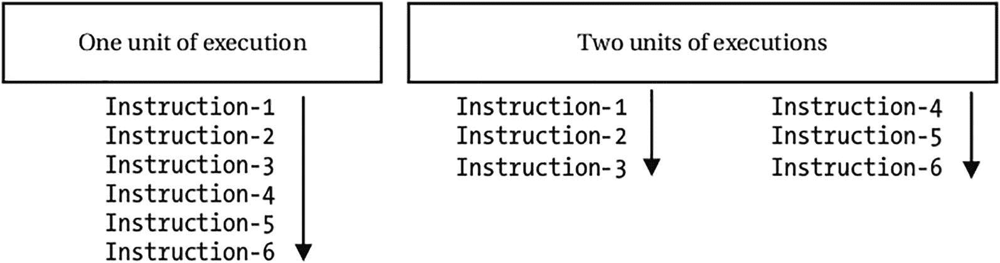

图 5-1

将一个程序分成多个执行单元

请注意，进程也是一个执行单元。因此，这两组指令可以作为两个进程运行，以实现它们执行的并发性。到目前为止，我们已经假设这两组指令是相互独立的。假设这个假设仍然成立。如果这两组指令访问一个共享内存会怎样；或者，当两组指令都完成运行时，您需要合并两组指令的结果来计算最终结果？通常不允许进程访问另一个进程的地址空间。它们必须使用诸如套接字、管道等进程间通信设施进行通信。当多个进程需要通信或共享资源时，进程的本质(独立于其他进程运行)可能会带来问题。所有现代操作系统都允许您在一个进程中创建多个执行单元，所有执行单元可以共享分配给该进程的地址空间和资源，从而解决了这个问题。进程中的每个执行单元称为一个线程。

每个进程至少有一个线程。如果需要，一个进程可以创建多个线程。操作系统及其实现可用的资源决定了一个进程可以创建的最大线程数。一个进程中的所有线程共享所有资源，包括地址空间；它们还可以很容易地相互通信，因为它们在同一个进程中运行，并且共享同一个内存。进程中的每个线程都独立于同一进程中的其他线程运行。

一个线程维护两件事情:一个程序计数器和一个堆栈。程序计数器让线程跟踪它当前正在执行的指令。有必要为每个线程维护一个单独的程序计数器，因为一个进程中的每个线程可能同时执行不同的指令。每个线程维护自己的堆栈来存储局部变量的值。一个线程还可以维护它的私有内存，这些内存不能与其他线程共享，即使它们在同一个进程中。由线程维护的私有内存称为线程本地存储(TLS)。图 [5-2](#Fig2) 描述了一个流程中表示的线程。

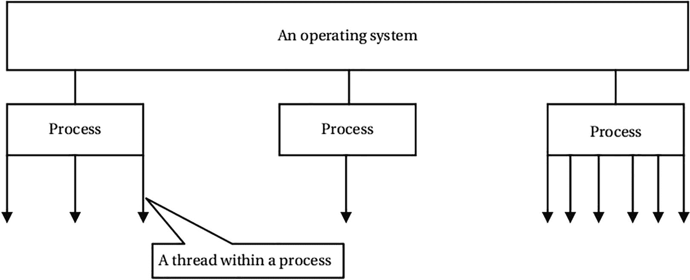

图 5-2

进程和线程

在所有现代操作系统中，线程被安排在 CPU 上执行，而不是进程。因此，CPU 上下文切换发生在线程之间。与进程间的上下文切换相比，线程间的上下文切换开销较小。由于易于通信、在一个进程内的线程之间共享资源以及更便宜的上下文切换，所以最好将一个程序分成多个线程，而不是多个进程。有时，线程也称为轻量级进程。如前所述，具有六条指令的程序也可以在一个进程中分成两个线程，如图 [5-3](#Fig3) 所示。在多处理器机器上，一个进程的多个线程可以在不同的处理器上调度，从而提供一个程序的真正的并发执行。使用多线程的程序称为多线程程序。

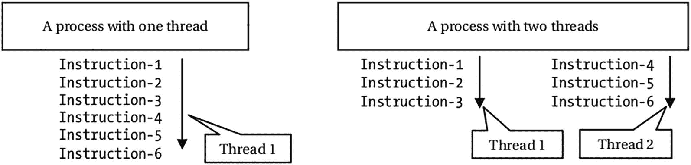

图 5-3

划分程序逻辑以在一个进程中使用两个线程

您可以将进程和线程之间的关系想象成`Process = address space + resources + threads`，其中线程是进程中的执行单元；它们维护自己独特的程序计数器和堆栈；它们共享进程地址空间和资源；它们被独立地调度在一个 CPU 上，并且可以在不同的 CPU 上执行(如果有的话)。

## 在 Java 中创建线程

Java API 使得使用线程变得很容易。它允许你将一个线程表示为一个对象。`java.lang.Thread`类的一个对象代表一个线程。在 Java 中创建和使用线程就像创建一个`Thread`类的对象并在程序中使用该对象一样简单。让我们从用 Java 创建线程这个最简单的例子开始。使用线程至少需要两个步骤:

*   创建一个`Thread`类的对象

*   调用`Thread`类的`start()`方法启动线程

在 Java 中创建一个`Thread`类的对象与创建任何其他类的对象是一样的。最简单的形式是，您可以使用`Thread`类的无参数构造函数来创建一个`Thread`对象:

```java
// Creates a thread object
Thread simplestThread = new Thread();

```

创建一个`Thread`类的对象会在堆上为该对象分配内存。它不启动或运行线程。你必须调用`Thread`对象的`start()`方法来启动线程:

```java
// Starts the thread
simplestThread.start();

```

在完成一些日常工作后，`start()`方法返回。它将线程置于可运行状态。在这种状态下，线程准备接收 CPU 时间。注意，调用一个`Thread`对象的`start()`方法并不能保证这个线程“什么时候”开始获得 CPU 时间。也就是说，它不能保证线程何时开始运行。它只是调度线程来接收 CPU 时间。

让我们用这两条语句编写一个简单的 Java 程序，如清单 [5-2](#PC5) 所示。这个程序不会做任何有用的事情。然而，它将让你开始使用线程。

```java
// SimplestThread.java
package com.jdojo.threads;
public class SimplestThread {
    public static void main(String[] args) {
        // Creates a thread object
        Thread simplestThread = new Thread();
        // Starts the thread
        simplestThread.start();
    }
}

Listing 5-2The Simplest Thread in Java

```

当您运行`SimplestThread`类时，您看不到任何输出。程序将无声地开始和结束。尽管您没有看到任何输出，但是在执行`main()`方法中的两条语句时，JVM 还是做了一些事情:

*   当执行第二条语句`simplestThread.start()`时，JVM 调度这个线程来执行。

*   在某个时间点，这个线程获得了 CPU 时间并开始执行。Java 中的一个线程在获得 CPU 时间后开始执行什么代码？

*   Java 中的线程总是在一个`run()`方法中开始执行。当你创建一个`Thread`类的对象时，你可以定义一个由线程执行的`run()`方法。在您的例子中，您使用它的无参数构造函数创建了一个`Thread`类的对象。当您使用`Thread`类的无参数构造函数创建其对象时(如在 new `Thread()`中)，线程开始执行时会调用`Thread`类的`run()`方法。本章的以下部分解释了如何为线程定义自己的`run()`方法。

*   `Thread`类的`run()`方法检查`Thread`类的对象是如何创建的。如果 thread 对象是使用 Thread 类的无参数构造函数创建的，则它不做任何事情并立即返回。所以在你的程序中，当线程得到 CPU 时间的时候，调用了 thread 类的`run()`方法，这个方法没有执行任何有意义的代码，并返回。

*   当 CPU 执行完`run()`方法，线程就死了，也就是说线程不会再获得 CPU 时间。

图 [5-4](#Fig4) 描述了最简单的线程示例是如何工作的。

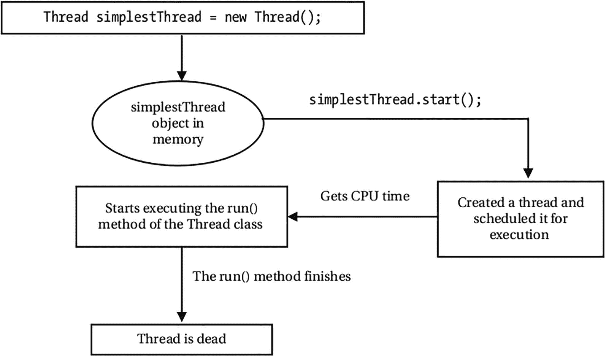

图 5-4

最简单的线程执行

目前的讨论中有两个要点需要补充:

*   当一个线程死了，并不意味着线程对象被垃圾收集。请注意，线程是一个执行单元。“线程死了”意味着该线程所代表的执行单元已经完成了它的工作。但是，表示执行单元的线程对象仍然存在于内存中。在线程死了之后，对象将根据用于任何其他 Java 对象的相同垃圾收集规则进行垃圾收集。存在一些限制，规定了可以在死线程上调用的方法。例如，您不能再次调用它的`start()`方法。也就是说，一个线程对象只能启动一次。但是，您仍然可以通过调用 thread 对象的`isAlive()`方法来检查线程是否死了。

*   线程不会一次性获得 CPU 时间来执行`run()`方法。操作系统决定分配的时间量以及何时将时间分配给线程。这意味着在线程完成执行`run()`方法之前，可能会发生多次上下文切换。

## 为线程指定代码

有三种方法可以指定线程要执行的代码:

*   通过从`Thread`类继承你的类

*   通过在你的类中实现`Runnable`接口

*   通过使用对不带参数并返回 void 的方法的方法引用

Note

如果你的类已经从另一个类继承，从`Thread`类继承你的类可能是不可能的。在这种情况下，您需要使用第二种方法。您可以使用 Java 8 中的第三种方法。在 Java 8 之前，通常使用匿名类来定义一个线程对象，其中匿名类要么从`Thread`类继承，要么实现`Runnable`接口。

### 从`Thread`类继承你的类

当您从`Thread`类继承您的类时，您应该覆盖`run()`方法并提供由线程执行的代码:

```java
public class MyThreadClass extends Thread {
    @Override
    public void run() {
        System.out.println("Hello Java threads!");
    }
    // More code goes here
}

```

创建线程对象和启动线程的步骤是相同的:

```java
MyThreadClass myThread = new MyThreadClass();
myThread.start();

```

线程将执行`MyThreadClass`类的`run()`方法。

### 实现`Runnable`接口

您可以创建一个实现`java.lang.Runnable`接口的类。`Runnable`是一个功能接口，在`java.lang`包中声明如下:

```java
@FunctionalInterface
public interface Runnable {
    void run();
}

```

`Runnable`的一个简单实现示例如下

```java
public class HelloRunnable implements Runnable {
    @Override
    public void run() {
        System.out.println("Hello Java threads!");
    }
}

// Creating an instance:
Runnable aRunnableObject = new HelloRunnable();

```

相反，您也可以使用 lambda 表达式来创建`Runnable`接口的实例:

```java
Runnable aRunnableObject = () ->
    System.out.println("Hello Java threads!");

```

使用接受`Runnable`对象的构造函数创建一个`Thread`类的对象:

```java
Thread myThread = new Thread(aRunnableObject);

```

通过调用线程对象的`start()`方法启动线程:

```java
myThread.start();

```

线程将执行 lambda 表达式主体中包含的代码。

### 使用方法引用

为了进一步提高简洁性，您可以使用不带参数的方法(静态或实例)的方法引用，并返回`void`作为线程要执行的代码。下面的代码声明了一个包含`execute()`方法的`ThreadTest`类。该方法包含要在线程中执行的代码:

```java
public class ThreadTest {
    public static void execute() {
        System.out.println("Hello Java threads!");
    }
}

```

以下代码片段使用`ThreadTest`类的`execute()`方法的方法引用来创建一个`Runnable`对象:

```java
Thread myThread = new Thread(ThreadTest::execute);
myThread.start();

```

线程将执行包含在`ThreadTest`类的`execute()`方法中的代码。

### 一个简单的例子

让我们看一个简单的例子，在一个新线程中打印从`1`到`500`的整数。清单 [5-3](#PC15) 包含了执行这个任务的`PrinterThread`类的代码。当该类运行时，它在标准输出上打印从`1`到`500`的整数。

```java
// PrinterThread.java
package com.jdojo.threads;
public class PrinterThread {
    public static void main(String[] args) {
        // Create a Thread object
        Thread t = new Thread(PrinterThread::print);
        // Start the thread
        t.start();
    }
    public static void print() {
        for (int i = 1; i <= 500; i++) {
            System.out.print(i + " ");
        }
    }
}

1 2 3 4 5 6 7 8 9 10 11 12 13 14  ... 497 498 499 500

Listing 5-3Printing Integers from 1 to 500 in a New Thread

```

在示例中，我使用了一个方法引用来创建线程对象。您可以使用前面讨论过的任何其他方法来创建线程对象。

## 在程序中使用多线程

在 Java 程序中使用多线程就像创建多个`Thread`对象并调用它们的`start()`方法一样简单。Java 对一个程序中可以使用的线程数量没有任何上限。它受到操作系统和程序可用内存的限制。清单 [5-4](#PC16) 使用两个线程。两个线程都打印从`1`到`500`的整数。代码在每个整数后打印一个新行。但是，输出会在每个整数后显示一个空格，以保持输出简短。仅显示了部分输出。

```java
// MultiPrinterThread.java
package com.jdojo.threads;
public class MultiPrinterThread {
    public static void main(String[] args) {
        // Create two Thread objects
        Thread t1 = new Thread(MultiPrinterThread::print);
        Thread t2 = new Thread(MultiPrinterThread::print);
        // Start both threads
        t1.start();
        t2.start();
    }
    public static void print() {
        for (int i = 1; i <= 500; i++) {
            System.out.println(i);
        }
    }
}

1  2  3  4  5  1  2  3  4  5  6  7  8  9  10  11  12  13
14  15  16  17  18  19  20  21  22  23  24  25  26  6  7
27  28  8  9  10  11  12  29  30  31  13  14  32  15  16
17  ...  496  497  498  499  500  424  425 ... 492  493
494  495  496  497  498  499  500

Listing 5-4Running Multiple Threads in a Program

```

你会在输出中发现一些有趣的东西。每次运行这个程序，可能会得到不同的输出。但是，您计算机上的输出性质可以与此处显示的输出进行比较。在非常快的机器上，输出可能会打印出`1`到`500`和`1`到`500`。然而，让我们把注意力集中在假设您的输出与图中所示类似的讨论上。

程序创建了两个线程。每个线程打印从`1`到`500`的整数。它首先启动线程`t1`，然后启动线程`t2`。你可能期望线程`t1`首先开始打印从`1`到`500`的整数，然后线程`t2`开始打印从`1`到`500`的整数。然而，从输出中可以明显看出，程序并没有按照您预期的方式运行。

Thread 类的`start()`方法立即返回。也就是说，当您调用线程的`start()`方法时，JVM 会注意到您启动线程的指令。但是，它不会立即启动线程。在真正启动线程之前，它必须做一些内务处理。当一个线程启动时，由操作系统决定何时以及给该线程多少 CPU 时间。因此，一旦`t1.start()`和`t2.start()`方法返回，你的程序就进入了不确定领域。也就是说，两个线程都将开始运行；然而，你不知道它们什么时候开始运行，以什么顺序运行来执行它们的代码。当您启动多个线程时，您甚至不知道哪个线程将首先开始运行。查看输出，您可以观察到其中一个线程启动了，在被抢占之前，它获得了足够的 CPU 时间来打印从`1`到`5`的整数。另一个线程在被抢占之前获得了从`1`到`26`打印的 CPU 时间。第二次，第一个线程(最先开始打印整数的线程)得到了 CPU 时间，它只打印了两个整数，`6`和`7`，以此类推。您可以看到两个线程都占用了 CPU 时间。然而，CPU 时间的总量以及它们获得 CPU 时间的顺序是不可预测的。每次运行这个程序，您可能会得到不同的输出。您从这个程序中得到的唯一保证是，在`1`和`500`之间的所有整数都将按照某种顺序打印两次。

## 使用多线程的问题

当你在一个程序中使用多线程时，会涉及到一些问题。只有当多个线程必须基于某些条件或某些共享资源进行协调时，才需要考虑这些问题。

在前面的章节中，涉及线程的例子是微不足道的。他们只是在标准输出上打印了一些整数。让我们看一个使用多线程的不同类型的例子，它访问和修改一个变量的值。清单 [5-5](#PC17) 显示了`BalanceUpdate`类的代码。

```java
// BalanceUpdate.java
package com.jdojo.threads;
public class BalanceUpdate {
    // Initialize balance to 100
    private static int balance = 100;
    public static void main(String[] args) {
        startBalanceUpdateThread();
        // <- Thread to update the balance value
        startBalanceMonitorThread();
        // <- Thread to monitor the balance value
    }
    public static void updateBalance() {
        // Add 10 to balance and subtract 10 from balance
        balance = balance + 10;
        balance = balance - 10;
    }
    public static void monitorBalance() {
        int b = balance;
        if (b != 100) {
            System.out.println("Balance changed: " + b);
            System.exit(0); // Exit the program
        }
    }
    public static void startBalanceUpdateThread() {
        // Start a new thread that calls the
        // updateBalance() method in an infinite loop
        Thread t = new Thread(() -> {
            while (true) {
                updateBalance();
            }
        });
        t.start();
    }
    public static void startBalanceMonitorThread() {
        // Start a thread that monitors the balance value
        Thread t = new Thread(() -> {
            while (true) {
                monitorBalance();
            }
        });
        t.start();
    }
}

Balance changed: 110

Listing 5-5Multiple Threads Modifying the Same Variable

```

该类每个组件的简要描述如下:

*   `balance`:类型为`int`的静态变量。它被初始化为`100`。

*   `updateBalance()`:是静态变量`balance`加`10`，减去`10`的静态方法。该方法完成后，静态变量`balance`的值预计将保持与`100`相同。

*   `startBalanceUpdateThread()`:它启动一个新线程，这个线程在无限循环中不断调用`updateBalance()`方法。也就是说，一旦你调用了这个方法，一个线程就会不断地将`10`加到余额变量中，并从中减去`10`。

*   `startBalanceMonitorThread()`:它启动一个新线程，通过重复调用`monitorBalance()`方法来监控静态变量`balance`的值。当线程检测到`balance`变量的值不是`100`时，它打印当前值并退出程序。

*   `main()`:该方法用于运行程序。它启动一个线程，使用`updateBalance()`方法更新循环中的`balance`类变量。它还启动了另一个线程来监视`balance`类变量的值。

该程序由两个线程组成。一个线程调用`updateBalance()`方法，该方法将`10`加到`balance`上，并从中减去`10`。也就是说，在这个方法执行完毕后，`balance`变量的值应该保持不变。另一个线程监控`balance`变量的值。当它检测到`balance`变量的值不是`100`时，它打印新值并退出程序。在`System.exit(0)`方法调用中指定零表示您想正常终止程序。

直观上，余额监视器线程不应该打印任何东西，因为余额应该总是`100`，并且程序应该永远不会结束，因为两个线程都在使用无限循环。然而，事实并非如此。如果你运行这个程序，你会发现，在很短的时间内，程序会打印出`100`以外的余额值并退出。

假设在特定机器上，语句`balance = balance + 10;`被实现为以下机器指令，假设`register-1`为 CPU 寄存器:

```java
register-1 = balance;
register-1 = register-1 + 10;
balance = register-1;

```

类似地，假设语句`balance = balance - 10;`被实现为以下机器指令，假设`register-2`是另一个 CPU 寄存器:

```java
register-2 = balance;
register-2 = register-2 - 10;
balance = register-2;

```

当调用`updateBalance()`方法时，CPU 必须执行六条指令将`10`加到变量`balance`上，并从变量`balance`上减去`10`。当余额更新线程正在执行前三条指令中的任何一条时，余额监控线程将读取余额值作为`100`。当余额更新线程执行完第三条指令时，余额监控线程将读取其值`110`。只有当余额更新线程执行第六条指令时，余额变量的值`110`才会恢复为`100`。请注意，如果平衡监视器线程在平衡更新线程执行第三条指令之后和执行第六条指令之前的任何时候读取`balance`变量的值，它将读取与`updateBalance()`方法执行开始时存在的值不同的值。表 [5-1](#Tab1) 显示了两个线程将如何修改和读取`balance`变量的值。

表 5-1

多线程的指令执行

<colgroup><col class="tcol1 align-left"> <col class="tcol2 align-left"> <col class="tcol3 align-left"></colgroup> 
| 语句(假设余额值从 100 开始) | 余额更新线程正在执行的指令 | 由余额监视器线程读取的余额值 |

<colgroup><col class="tcol1 align-left"> <col class="tcol2 align-left"> <col class="tcol3 align-left"></colgroup> 
| `balance = balance + 10;` | `register-1 = balance;``register-1 = register-1 + 10;``balance = register-1;` | `100``Before execution: 100``After execution: 110` |
| `balance = balance - 10;` | `register-2 = balance;``register-2 = register-2 - 10;``balance = register-2;` | `110``110``Before execution: 110``After execution: 100` |

在您的程序中，监控线程能够将`balance`变量的值读取为`110`，因为您允许两个线程同时修改和读取 balance 变量的值。如果一次只允许一个线程处理(修改或读取)`balance`变量，那么除了`100`之外，余额监视器线程将永远不会读取余额变量的值。

多个线程同时操作和访问一个共享数据，其结果取决于线程执行的顺序，这种情况称为竞争情况。程序中的竞争条件可能会导致不可预知的结果。清单 [5-5](#PC17) 是一个竞争条件的例子，其中程序输出依赖于两个线程的执行顺序。

为了避免程序中的竞争情况，您需要确保一次只有一个竞争线程处理共享数据。为了解决这个问题，您需要同步对`BalanceUpdate`类的两个方法`updateBalance()`和`monitorBalance()`的访问。也就是说，一次只能有一个线程访问这两个方法中的一个。换句话说，如果一个线程正在执行`updateBalance()`方法，另一个想要执行`monitorBalance()`方法的线程必须等到执行`updateBalance()`方法的线程完成。类似地，如果一个线程正在执行`monitorBalance()`方法，另一个想要执行`updateBalance()`方法的线程必须等到执行`monitorBalance()`方法的线程完成。这将确保当一个线程正在更新`balance`变量时，没有其他线程会读取`balance`变量的不一致值，并且如果一个线程正在读取`balance`变量，没有其他线程会同时更新`balance`变量。

这种需要同步多个线程对 Java 程序中一段代码的访问的问题可以使用`synchronized`关键字来解决。为了理解关键字`synchronized`的用法，我需要简单讨论一下 Java 内存模型和对象的锁和等待集。

## Java 内存模型

程序中的所有程序变量(实例字段、静态字段和数组元素)都从计算机的主内存中分配内存。每个线程都有一个工作内存(处理器缓存或寄存器)。Java 内存模型(JMM)描述了程序变量如何、何时以及以何种顺序存储到主内存中，以及从主内存中读取。Java 语言规范中详细描述了 JMM。你可以想象 JMM，如图 [5-5](#Fig5) 所示。

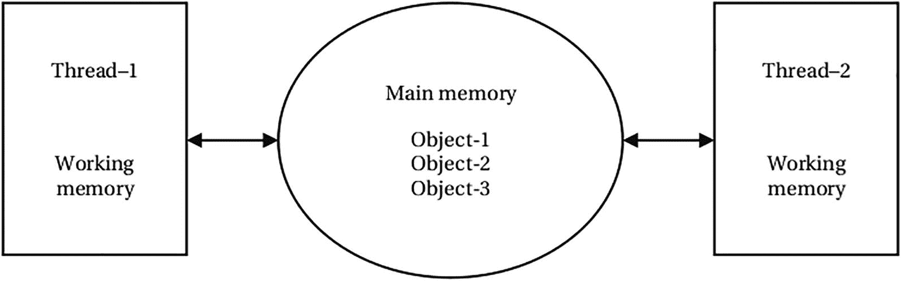

图 5-5

Java 内存模型

图 [5-5](#Fig5) 显示两个线程共享主内存。假设您有一个运行两个线程的 Java 程序，`thread-1`和`thread-2`，每个线程运行在不同的处理器上。假设`thread-1`在其工作内存中读取`object-1`的一个实例变量的值，更新该值，并且不将更新后的值写回主内存。让我们来看几个可能的场景:

*   如果`thread-2`试图从主存中读取`object-1`的同一个实例变量的值会怎么样？`thread-2`能从主存储器中读取旧值吗，或者它能从`thread-1`的工作存储器中读取更新值吗？

*   假设`thread-1`正在将更新后的值写入主存储器，同时`thread-2`正在尝试从主存储器读取相同的值。`thread-2`会因为值没有完全写回主存而从主存中读取旧值或一些垃圾值吗？

JMM 回答了所有这些问题。本质上，JMM 描述了 Java 程序中指令执行的三个重要方面。它们如下:

*   原子数

*   能见度

*   排序

### 原子数

JMM 描述了应该自动执行的动作。它描述了关于实例变量、静态变量和数组元素的读写操作的原子性规则。它保证对除了`long`和`double`之外的任何类型的对象字段的读写总是原子的。然而，如果类型为`long`或`double`的字段被声明为`volatile`(我将在本章后面详细讨论`volatile`关键字)，那么对该字段的读写也保证是原子的。

### 能见度

JMM 描述了一个线程中的动作产生的效果对其他线程可见的条件。主要是，它决定一个线程何时向一个字段写入一个值，该字段的新值何时对其他线程可见。在本章后面讨论锁、同步和可变变量时，我会详细讨论 JMM 的可见性。为了完整起见，以下是一些可见性规则:

*   当一个线程第一次读取一个字段的值时，它将读取该字段的初始值或者由其他线程写入该字段的某个值。

*   对易失性变量的写入总是被写入主存储器。

*   对可变变量的读取总是从主存储器中读取。也就是说，volatile 变量永远不会缓存在线程的工作内存中。实际上，对 volatile 变量的任何写入都会被刷新到主内存中，从而立即使新值对其他线程可见。

*   当一个线程终止时，该线程的工作内存被立即写入主内存。也就是说，在线程终止后，所有仅对被终止的线程可见的变量值对所有线程都可见。

*   当一个线程进入一个`synchronized`块时，该线程重新加载其工作内存中所有变量的值。当一个线程离开一个`synchronized`块时，它将所有变量的值从它的工作内存写到主内存。

### 排序

JMM 描述了线程内和线程间执行动作的顺序。它保证在一个线程中执行的所有操作都是有序的。不同线程中的操作不能保证以任何顺序执行。通过使用本章后面介绍的同步技术，您可以在处理多线程时实现一定的排序。

Note

Java 程序中的每个线程都使用两种内存:工作内存和主内存。一个线程不能访问另一个线程的工作内存。主内存由线程共享。线程使用主内存相互通信。每个线程都有自己的堆栈，用来存储局部变量。

## 对象的监视器和线程同步

在多线程程序中，如果由多个线程同时执行，可能会对程序的结果产生不良影响的代码段称为临界段。通常，不良影响是由临界区中的多个线程同时使用一个资源引起的。有必要控制对程序中临界区的访问，以便一次只有一个线程可以执行临界区。

在 Java 程序中，临界区可以是一个语句块或一个方法。Java 没有内置的机制来识别程序中的关键部分。然而，Java 有许多内置的构造，允许程序员声明一个临界区，并控制和协调对它的访问。程序员的责任是识别程序中的关键部分，并控制多线程对这些关键部分的访问。控制和协调多个线程对临界区的访问被称为线程同步。编写多线程程序时，线程同步总是一项具有挑战性的任务。在清单 [5-5](#PC17) 中，`updateBalance()`和`monitorBalance()`方法是关键部分，您必须同步线程对这两个方法的访问以获得一致的输出。Java 编程语言内置了两种线程同步:

*   互斥同步

*   条件同步

在互斥同步中，在某个时间点，只允许一个线程访问一段代码。清单 [5-5](#PC17) 是一个需要互斥同步的程序的例子，这样在一个时间点只有一个线程可以执行`updateBalance()`和`monitorBalance()`。在这种情况下，你可以把互斥看作是一个线程对`balance`变量的独占访问。

有条件的同步允许多个线程一起工作来实现一个结果。例如，考虑一个多线程程序来解决生产者/消费者问题。程序中有两个线程:一个线程产生数据(生产者线程)，另一个线程消耗数据(消费者线程)。消费者线程必须等待，直到生产者线程产生数据并使其可供消费。生产者线程必须在产生数据时通知消费者线程，以便消费者线程可以消费它。换句话说，生产者线程和消费者线程必须相互协调/合作来完成任务。在条件同步期间，可能还需要互斥同步。假设生产者线程一次产生一个字节的数据，并将数据放入一个容量也是一个字节的缓冲区。消费者线程从同一个缓冲区消费数据。在这种情况下，一次应该只有一个线程可以访问缓冲区(互斥)。如果缓冲区已满，生产者线程必须等待消费者线程清空缓冲区；如果缓冲区为空，消费者线程必须等待生产者线程产生一个字节的数据，并将其放入缓冲区(条件同步)。

互斥同步是通过锁实现的。锁支持两种操作:获取和释放。想要独占访问资源的线程必须获得与该资源相关联的锁。只要一个线程拥有资源的锁，其他线程就不能获得相同的锁。一旦拥有锁的线程使用完资源，它就会释放锁，以便另一个线程可以获取它。

条件同步是通过条件变量和三个操作实现的:等待、信号和广播。条件变量定义线程同步的条件。等待操作使线程等待某个条件变为真，这样它才能继续执行。信号操作唤醒了一个等待条件变量的线程。广播操作唤醒所有等待条件变量的线程。注意，信号操作和广播操作的区别在于，前者只唤醒一个等待线程，而后者唤醒所有等待线程。

监视器是一种编程结构，它有一个锁、条件变量和与之相关的操作。Java 程序中的线程同步是使用监视器实现的。Java 程序中的每个对象都有一个相关的监视器。

Java 程序中的临界区是相对于对象的监视器来定义的。线程必须先获得对象的监视器，然后才能开始执行声明为临界区的代码。`synchronized`关键字用于声明一个临界区。有两种方法可以使用`synchronized`关键字:

*   将方法声明为临界区

*   将语句块声明为临界区

您可以通过在方法的返回类型前使用关键字`synchronized`将方法声明为临界区，如下所示:

```java
public class CriticalSection {
    public synchronized void someMethod_1() {
        // Method code goes here
    }
    public static synchronized void someMethod_2() {
        // Method code goes here
    }
}

```

Note

您可以将实例方法和静态方法都声明为`synchronized`。构造函数不能声明为 synchronized。一个构造函数只被一个线程调用一次，这个线程正在创建对象。因此同步对构造函数的访问是没有意义的。

在同步实例方法的情况下，整个方法是一个关键部分，它与为其执行该方法的对象的监视器相关联。也就是说，在执行该对象的同步实例方法内部的代码之前，线程必须获取该对象的监视器锁。例如:

```java
// Create an object called cs1
CriticalSection cs1 = new CriticalSection();
// Execute the synchronized instance method. Before this
// method execution starts, the thread that is executing
// this statement must acquire the monitor lock of the cs1
// object
cs1.someMethod_1();

```

在静态方法的情况下，整个方法是一个关键部分，它与代表那个类的类对象相关联。也就是说，在执行该类的同步静态方法中的代码之前，线程必须获得类对象的监视器锁。例如:

```java
// Execute the synchronized static method. Before this
// method execution starts, the thread that is executing
// this statement must acquire the monitor lock of the
// CriticalSection.class object
CriticalSection.someMethod_2();

```

将代码块声明为临界区的语法如下:

```java
synchronized(<objectReference>) {
    // one or more statements of the critical section
}

```

`<objectReference>`是对象的引用，其监控锁将用于同步对临界区的访问。该语法用于将方法体的一部分定义为临界区。这样，一个线程只需要获得对象的监视器锁，同时执行方法代码的一小部分，它被声明为临界区。

其他线程仍然可以并发执行方法体的其他部分。此外，这种声明临界区的方法允许您将部分或整个构造函数声明为临界区。回想一下，您不能在构造函数的声明部分使用关键字`synchronized`。但是，您可以在构造函数体中使用它来声明代码块是同步的。以下代码片段说明了关键字`synchronized`的用法:

```java
public class CriticalSection2 {
    public synchronized void someMethod10() {
        // Method code goes here. Only one thread can
        // execute here at a time.
    }
    public void someMethod11() {
        synchronized(this) {
            // Method code goes here. Only one thread
            // can execute here at a time.
        }
    }
    public void someMethod12() {
        // Some statements go here. Multiple threads can
        // execute here at a time.
        synchronized(this) {
            // Some statements go here. Only one thread
            // can execute here at a time.
        }
        // Some statements go here. Multiple threads can
        // execute here at a time.
    }
    public static synchronized void someMethod20() {
        // Method code goes here. Only one thread can
        // execute here at a time.
    }
    public static void someMethod21() {
        synchronized(CriticalSection2.class) {
            // Method code goes here. Only one thread can
            // execute here at a time.
        }
    }
    public static void someMethod_22() {
        // Some statements go here: section_1\. Multiple
        // threads can execute here at a time.
        synchronized(CriticalSection2.class) {
            // Some statements go here: section_2\. Only
            // one thread can execute here at a time.
        }
        // Some statements go here: section_3\.  Multiple
        // threads can execute here at a time
    }
}

```

`CriticalSection2`类有六个方法:三个实例方法和三个类方法。`someMethod10()`方法是同步的，因为在方法声明中使用了`synchronized`关键字。`someMethod11()`方法与`someMethod10()`方法的不同之处仅在于它使用了`synchronized`关键字。它将整个方法体作为一个块放在关键字`synchronized`中，这实际上与声明方法`synchronized`的效果相同。方法`someMethod12()`不同。它只将方法体的一部分声明为`synchronized`块。可以有多个线程同时执行`someMethod12()`。然而，在一个时间点上，它们中只有一个可以在`synchronized`块中执行。其他方法— `someMethod20()`、`someMethod21()`和`someMethod22()`—是类方法，它们的行为方式相同，只是将使用类的对象监视器来实现线程同步。

获取和释放对象的监视器锁的过程由 JVM 处理。您唯一需要做的就是将一个方法(或者一个块)声明为`synchronized`。在进入一个`synchronized`方法或块之前，线程获取对象的监视器锁。在退出 synchronized 方法或块时，它会释放对象的监视器锁。已经获得对象的监视器锁的线程可以根据需要多次获得它。但是，为了让另一个线程获得同一个对象的监控锁，它必须释放该对象的监控锁，释放的次数与它获得的次数一样多。让我们考虑下面这个`MultiLocks`类的代码:

```java
public class MultiLocks {
    public synchronized void method1() {
        // Some statements go here
        this.method2();
        // Some statements go here
    }
    public synchronized void method2() {
        // Some statements go here
    }
    public static synchronized void method3() {
        // Some statements go here
        MultiLocks.method4();
        // Some statements go here
    }
    public static synchronized void method4() {
        // Some statements go here
    }
}

```

`MultiLocks`类有四个方法，它们都是同步的。其中两个是实例方法，它们使用将对其进行方法调用的对象的引用进行同步。其中两个是类方法，使用`MultiLocks`类的类对象的引用进行同步。如果一个线程想要执行`method1()`或`method2()`，它必须首先获取调用该方法的对象的监控锁。你正在从方法`method1()`内部调用`method2()`。由于正在执行`method1()`的线程必须已经获取了对象的监控锁，并且对`method2()`的调用需要获取相同的锁，所以当线程从`method1()`内部执行`method2()`时，它将自动重新获取相同对象的监控锁，而不会与其他线程竞争获取对象的监控锁。

因此，当一个线程从`method1()`内部执行`method2()`时，它将两次获得对象的监控锁。当它退出`method2()`时，它会解锁一次；当它退出`method1()`时，会第二次解锁；然后该对象的监控锁将可供其他线程获取。同样的论点也适用于从`method3()`内部对`method4()`的调用，除了在这种情况下，`MultiLocks`类对象的监视器锁参与了同步。考虑从`method1()`调用`method3()`，就像这样:

```java
public class MultiLocks {
    public synchronized void method1() {
        // Some statements go here
        this.method2();
        MultiLocks.method3();
        // Some statements go here
    }
    // Rest of the code remains the same as shown before
}

```

假设你调用`method1()`，像这样:

```java
MultiLocks ml = new MultiLocks();
ml.method1();

```

当`ml.method1()`被执行时，执行线程必须获取对象`ml`的监控锁。然而，执行线程必须获得`MultiLocks.class`对象的监控锁才能执行`MultiLocks.method3()`方法。注意`ml`和`MultiLocks.class`是两个不同的对象。想要从`method1()`方法执行`MultiLocks.method3()`方法的线程必须同时拥有两个对象的监控锁。

您可以应用相同的参数来处理`synchronized`块。例如，您可以有如下代码片段:

```java
synchronized (objectReference) {
    // Trying to synchronize again on the same object is ok
    synchronized(objectReference) {
        // Some statements go here
    }
}

```

是时候使用对象的监视器更深入地了解线程同步的工作方式了。图 [5-6](#Fig6) 描述了多线程如何使用一个对象的监视器。

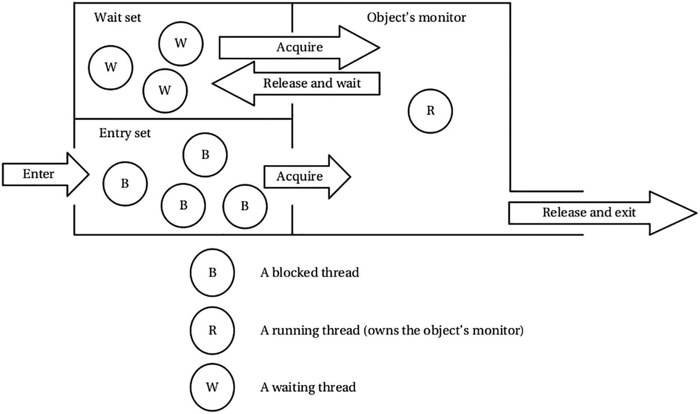

图 5-6

使用对象监视器的多线程

在讨论线程同步时，我使用了一个医患类比。假设一个医生有一个诊所给病人看病。我们知道，一次只允许一名患者看医生是非常重要的。否则，医生可能会把一个病人的症状和另一个病人的症状混淆起来；一个发烧的病人可能会得到一个头痛的处方！因此，我们将假设在任何时间点只有一个患者可以接触到医生。同样的假设是，一次只有一个线程(病人)可以访问一个对象的监视器(医生)。

任何想看医生的病人都必须签到并在候诊室等候。类似地，每个对象监视器都有一个条目集(等待新人的空间)，任何想要获取对象的监视器锁的线程都必须首先进入该条目集。如果患者签到，他们可以立即接触到医生，如果医生不治疗患者并且没有患者在候诊室中等待轮到他们。类似地，如果一个对象的监视器的入口集为空，并且没有其他线程拥有该对象的监视器锁，则进入该入口集的线程会立即获得该对象的监视器锁。但是，如果有病人在候诊室等待，或者有一个病人正在接受医生的治疗，则签到的病人将被阻止，必须等待医生再次有空。类似地，如果一个线程进入了条目集合，而其他线程已经被阻塞在该条目集合中，或者另一个线程已经拥有了该对象的监视器锁，则刚刚登录的线程被认为被阻塞，必须在该条目集合中等待。

进入条目集合的线程由标记为`Enter`的箭头示出。螺纹本身在图 [5-6](#Fig6) 中用圆圈表示。带有文本`B`的圆圈表示在条目集中被阻塞的线程。带有文本`R`的圆圈表示一个已经获得对象监视器的线程。

条目集中被阻塞的线程会发生什么情况？他们什么时候有机会获得目标的监视器？你可以想想那些被堵在候诊室的病人，然后轮到他们接受医生的治疗。许多因素决定了下一个要治疗的病人。首先，接受治疗的病人必须在另一个病人可以接触到医生之前释放医生。在 Java 中，拥有对象监视器所有权的线程必须释放对象的监视器，然后条目集中被阻塞的任何线程才能拥有对象监视器的所有权。患者可能出于以下两种原因之一释放医生:

*   病人完成了治疗，准备回家。这是一个病人在治疗结束后释放医生的简单例子。

*   一个病人正在接受治疗。然而，他们必须等待一段时间，以便医生恢复他们的治疗。让我们假设诊所有一个专门的候诊室(与刚刚签名等候的病人的候诊室分开),用于那些正在接受治疗的病人。这个案子需要一些解释。假设医生是眼科专家，在他们诊所有一些病人。正在接受治疗的病人需要进行眼科检查，为此他们必须先放大瞳孔。患者在接受眼药水后大约需要 30 分钟来进行全面的瞳孔扩张，这是检查所需要的。医生应该等 30 分钟让病人的瞳孔放大吗？这个病人是否应该释放医生 30 分钟，让其他病人接触到医生？你会同意，如果医生的时间可以用来治疗其他病人，而这个病人的瞳孔正在扩大，这个病人可以让医生出院。然而，当这个病人的瞳孔放大，而医生还在忙着治疗另一个病人时，该怎么办呢？医生不能在治疗过程中离开任何病人。因此，释放医生并等待某个条件为真的患者(这里是要完成的扩张过程)必须等到医生再次空闲。我将在本章后面详细解释这个问题，并尝试将这种情况与线程和对象的监控锁联系起来。

我必须在医生-病人示例的上下文中讨论另一个问题，然后才能将它与 monitor-threads 的情况进行比较。当医生有空，只有一个病人在等着见他们时，就没有问题了。等待医生的唯一的病人将会立即得到他们。然而，当医生变得有空，并且有不止一个病人等待访问他们时，会发生什么呢？等待中的哪个病人应该先去看医生？应该是病人先来(先进先出还是先进先出)？应该是最后来的病人(后进先出还是后进先出)？应该是病人需要最少(或最多)的治疗时间吗？病情最严重的应该是病人吗？答案取决于诊所管理层遵循的政策。

与医生-病人示例中的病人相似，线程也可以释放对象的监视器锁，原因有两个:

*   此时，线程已经完成了它已经获得对象的监视器锁的工作。图 [5-6](#Fig6) 中标有“释放和退出”的箭头表示图中的这种情况。当一个线程简单地退出一个同步的方法/块时，它释放它已经获得的对象的监视器锁。

*   该线程正在执行一项任务，它需要等待某个条件为真才能完成剩余的任务。让我们考虑生产者/消费者问题。假设生产者获得了缓冲区对象的监视器锁，并希望将一些数据写入缓冲区。但是，它发现缓冲区已满，消费者必须先消费数据并清空缓冲区，然后才能写入数据。在这种情况下，生产者必须释放缓冲区对象的监视器锁，并等待，直到消费者获得锁并清空缓冲区。当消费者获得缓冲区的监视器锁并发现缓冲区为空时，同样的逻辑也适用于消费者。这时，消费者必须释放锁，并等待生产者产生一些数据。这种暂时释放对象的监视器锁并等待某个条件发生的方式在标有“释放并等待”箭头的图中显示。一个对象可以有多个线程，这些线程可以同时处于“释放并等待”状态。所有已经释放了对象的监视器锁并正在等待某些条件发生的线程都被放在一个称为等待集的集合中。

一个线程如何被放置在等待集中？请注意，只有当线程获得了对象的监视器锁时，它才能被放入对象监视器的等待集中。一旦线程获得了对象的监视器锁，它必须调用对象的 wait()方法，以便将自己放入等待集。这意味着线程必须总是从同步方法或块内部调用 wait()方法。wait()方法在 java.lang.Object 类中定义，声明为 final 也就是说，Java 中没有其他类可以覆盖这个方法。在调用对象的 wait()方法之前，必须考虑以下两条规则。

### 规则 1

对`wait()`方法的调用必须放在`synchronized`方法(静态或非静态)或`synchronized`块中。

### 规则二

必须在当前线程已经获得其监视器的对象上调用`wait()`方法。它抛出一个`java.lang.InterruptedException`。调用此方法的代码必须处理此异常。当当前线程不是对象监视器的所有者时，`wait()`方法抛出一个`IllegalMonitorStateException`。下面的代码片段没有将`wait()`方法调用放在 try-catch 中，以保持代码简单易读。例如，在一个`synchronized`非静态方法中，对`wait()`方法的调用可能如下所示:

```java
public class WaitMethodCall {
    // Object that is used to synchronize a block
    private Object objectRef = new Object();
    public synchronized void someMethod_1() {
        // The thread running here has already acquired
        // the monitor lock on the object represented by
        // the reference this because it is a
        // synchronized non-static method

        // other statements go here
        while (some condition is true) {
            // It is ok to call the wait() method on this,
            // because the current thread possesses
            // monitor lock on this
            this.wait();
        }
        // other statements go here
    }
    public static synchronized void someMethod_2() {
        // The thread executing here has already acquired
        // the monitor lock on the class object represented
        // by the WaitMethodCall.class reference because it
        // is a synchronized static method

        while (some condition is true) {
            // It is ok to call the wait() method on
            // WaitMethodCall.class because the current
            // thread possesses monitor lock on
            // WaitMethodCall.class object
            WaitMethodCall.class.wait();
        }
        // other statements go here
    }

    public void someMethod_3() {
        // other statements go here
        synchronized(objectRef) {
            // Current thread possesses monitor lock of
            // objectRef
            while (some condition is true) {
                // It is ok to call the wait() method on
                // objectRef because the current thread
                // possesses monitor lock on objectRef
                objectRef.wait();
            }
        }
        // other statements go here
    }
}

```

注意`objectRef`是一个实例变量，它的类型是`java.lang.Object`。它唯一的用途是在`someMethod_3()`方法中同步线程对块的访问。因为它被声明为实例变量，所有调用`someMethod_3()`的线程将使用它的监视器来执行`synchronized`块。初学者常犯的一个错误是将`objectRef`声明为方法内部的局部变量，并在`synchronized`块中使用。以下代码片段显示了这样一个错误:

```java
public void wrongSynchronizationMethod {
    // This objectRef is created every time a thread calls
    // this method
    Object objectRef = new Object();
    // It is a blunder to use objectRef for
    // synchronization below
    synchronized(objectRef) {
        // In fact, this block works as if there is no
        // synchronization, because every thread  creates a
        // new objectRef and acquires its monitor lock
        // immediately.
    }
}

```

记住这段代码，您必须使用一个所有线程通用的对象引用来同步对块的访问。

让我们回到这样一个问题，当他们再次有空的时候，哪一个病人将能够接触到医生。是登记后在候诊室等候的病人，还是在治疗过程中在另一个候诊室等候的病人？在你回答这个问题之前，让我们弄清楚在登记后在等候室等候的患者和在另一个等候室等候某种情况(例如，扩张完成)发生的患者之间是有区别的。在签到之后，病人等待医生的空闲，而在治疗过程中的病人等待特定情况的发生。对于第二类患者来说，在他们能够寻求看医生之前，必须满足特定的条件，而第一类患者则准备尽快地看医生。因此，必须有人通知第二类患者发生了特定情况，是他们再次寻求医生帮助以继续治疗的时候了。让我们假设这个通知必须来自于医生当前正在治疗的患者。也就是说，当前可以接触到医生的患者通知在治疗过程中等待的患者准备好再次接触医生。请注意，这只是一个通知，说明某些情况已经发生，并且只发送给正在等待治疗的患者。不能保证正在接受治疗的患者在当前患者与医生完成治疗后是否能立即接触到医生。它仅保证在通知时患者正在等待的条件保持不变，并且等待的患者可以尝试接触医生以继续他们的治疗。让我们将这个例子与 monitor-threads 例子联系起来。

条目集中的线程被阻塞，它们准备好尽快获取对监视器的访问。等待集中的线程正在等待某个条件发生。拥有监视器所有权的线程必须通知在等待集中等待的线程，它们正在等待的条件已经满足。在 Java 中，通知是通过调用`Object`类的`notify()`和`notifyAll()`方法来实现的。像`wait()`方法一样，`notify()`和`notifyAll()`方法也被声明为`final`。像`wait()`方法一样，这两个方法必须由线程使用一个对象来调用，该对象的监视器已经被线程获取。如果一个线程在获取对象的监视器之前调用这些方法，就会抛出一个`IllegalMonitorStateException`。对`notify()`方法的调用从等待集中唤醒一个线程，而对`notifyAll()`方法的调用唤醒等待集中的所有线程。在`notify()`方法调用的情况下，被唤醒的线程是任意选择的。注意，当线程调用`notify()`或`notifyAll()`方法时，它仍然持有对象监视器上的锁。等待集中的线程仅由`notify()`或`notifyAll()`调用唤醒。它们不会立即获得对象的监视器锁。当调用`notify()`或`notifyAll()`方法的线程通过“释放并退出”或“释放并等待”释放对象的监视器锁时，等待集中被唤醒的线程与条目集中的线程竞争再次获取对象的监视器。因此，对`notify()`和`notifyAll()`的调用仅作为对等待集中线程的唤醒调用，并不保证对对象监视器的访问。

Note

没有办法唤醒等待集中的特定线程。对`notify()`的调用任意选择一个线程，而对`notifyAll()`的调用唤醒所有线程。当你不确定用哪种方法时，就用`notifyAll()`。

下面的代码片段显示了使用`notifyAll()`方法和`wait()`方法的伪代码。您可能会注意到对`wait()`和`notify()`方法的调用是在同一个对象上进行的，因为如果`objectRef.wait()`将一个线程放入`objectRef`对象的等待集中，`objectRef.notify()`或`objectRef.notifyAll()`方法将从`objectRef`对象的等待集中唤醒该线程:

```java
public class WaitAndNotifyMethodCall {
    private Object objectRef = new Object();
    public synchronized void someMethod_1() {
        while (some condition is true) {
            this.wait();
        }
        if (some other condition is true) {
            // Notify all waiting threads
            this.notifyAll();
        }
    }
    public static synchronized void someMethod_2() {
        while (some condition is true) {
            WaitAndNotifyMethodCall.class.wait();
        }
        if (some other condition is true) {
            // Notify all waiting threads
            WaitAndNotifyMethodCall.class.notifyAll();
        }
    }

    public void someMethod_3() {
        synchronized(objectRef) {
            while (some condition is true) {
                objectRef.wait();
            }
            if (some other condition is true) {
                // Notify all waiting threads
                objectRef.notifyAll();
            }
        }
    }
}

```

一旦一个线程在等待集合中被唤醒，它必须与条目集合中的线程竞争来获取对象的监视器锁。当一个线程在等待集中被唤醒并获得对象的监控锁后，它有两种选择:做一些工作并通过再次调用`wait()`方法(释放并等待)来释放锁，或者通过退出同步部分(释放并退出)来释放锁。关于对`wait()`方法的调用，需要记住的重要一点是，通常对`wait()`方法的调用是放在一个循环中的。这就是为什么有必要这样做的原因。一个线程寻找一个条件来保持。它通过调用`wait()`方法进行等待，如果条件不成立，就将自己放入等待集。当被另一个线程通知时，该线程被唤醒，该线程调用`notify()`或`notifyAll()`方法。当被唤醒的线程获得锁时，通知时保持的条件可能不再保持。因此，当线程醒来并获得锁时，有必要再次检查条件，以确保它所寻找的条件为真，并且它可以继续工作。例如，考虑生产者/消费者问题。假设有一个生产者和许多消费者。假设消费者如下调用`wait()`方法:

```java
if (buffer is empty) {
    buffer.wait();
}
buffer.consume();

```

假设缓冲区是空的，所有的消费者都在等待集合中等待。生产者产生一些数据，它调用`buffer.notifyAll()`方法来唤醒等待集中的所有消费者线程。所有消费者线程都被唤醒；然而，接下来只有一个人有机会获得监视器锁。第一个获取锁并执行`buffer.consume()`方法来清空缓冲区。当下一个消费者获得监视器锁时，它也将执行`buffer.consume()`语句。然而，在这个用户之前醒来并获得锁的用户已经清空了缓冲区。前面代码片段中的逻辑错误是对`wait()`方法的调用被放在了一个`if`语句中，而不是一个循环中。也就是说，在一个线程醒来后，在尝试使用数据之前，它不会检查缓冲区是否包含一些数据。更正后的代码片段如下:

```java
while (buffer is empty) {
    buffer.wait();
}
buffer.consume();

```

在你看到这个关于线程同步的大讨论之前，我再回答一个问题。问题是，“当入口集中有一些被阻塞的线程，等待集中有一些被唤醒的线程时，哪个线程有机会获得对象的监视器锁？”注意，等待集中的线程不会竞争对象的监视器，直到它们被`notify()`或`notifyAll()`调用唤醒。这个问题的答案是，这取决于操作系统的调度程序的算法。

清单 [5-6](#PC34) 包含了`BalanceUpdateSynchronized`类的代码，它是清单 [5-5](#PC17) 中列出的`BalanceUpdate`类的修改版本。这两个类之间唯一的区别是使用了`synchronized`关键字来声明新类中的`updateBalance()`和`monitorBalance()`方法，因此一次只有一个线程可以进入其中一个方法。当您运行新类时，您将看不到任何输出，因为除了`100`之外，`monitorBalance()`方法将永远看不到`balance`变量的值。您需要手动终止程序，例如，在 Windows 上使用`Ctrl+C`。

```java
// BalanceUpdateSynchronized.java
package com.jdojo.threads;
public class BalanceUpdateSynchronized {
    // Initialize balance to 100
    private static int balance = 100;
    public static void main(String[] args) {
        startBalanceUpdateThread();
        // <- Thread to update the balance value
        startBalanceMonitorThread();
        // <- Thread to monitor the balance value
    }
    public static synchronized void updateBalance() {
        // Add 10 to balance and subtract 10 from balance
        balance = balance + 10;
        balance = balance - 10;
    }

    public static synchronized void monitorBalance() {
        int b = balance;
        if (b != 100) {
            System.out.println("Balance changed: " + b);
            System.exit(1); // Exit the program
        }
    }
    public static void startBalanceUpdateThread() {
        // Start a new thread that calls the
        // updateBalance() method in an infinite loop
        Thread t = new Thread(() -> {
            while (true) {
                updateBalance();
            }
        });
        t.start();
    }

    public static void startBalanceMonitorThread() {
        // Start a thread that monitors the balance value
        Thread t = new Thread(() -> {
            while (true) {
                monitorBalance();
            }
        });

        t.start();
    }
}

Listing 5-6Synchronized Balance Update

```

我将在下一节展示使用`wait()`和`notify()`方法的例子，这一节将讨论生产者/消费者问题。`Object`类中的`wait()`方法被重载，它有三个版本:

*   `wait()`:线程在对象的等待集合中等待，直到另一个线程在同一个对象上调用`notify()`或`notifyAll()`方法。

*   `wait(long timeinMillis)`:线程在对象的等待集合中等待，直到另一个线程对同一个对象调用`notify()`或`notifyAll()`方法，或者经过了指定的`timeinMillis`时间。

*   这个版本允许你用毫秒和纳秒来指定时间。

## 生产者/消费者同步问题

生产者/消费者是一个典型的使用`wait()`和`notify()`方法的线程同步问题。我保持简单。

问题陈述是这样的。有四个等级:`Buffer`、`Producer`、`Consumer`和`ProducerConsumerTest`。一个`Buffer`类的对象将有一个整数数据元素，它将由生产者生产，由消费者消费。因此，在这个例子中，`Buffer`对象在某个时间点只能保存一个整数。您的目标是同步对缓冲区的访问，因此只有当`Buffer`为空时`Producer`才会产生一个新的数据元素，而`Consumer`只有在缓冲区的数据可用时才会使用它。`ProducerConsumerTest`类用于测试程序。

清单 [5-7](#PC35) 到 [5-10](#PC38) 包含四个类的代码。

```java
// ProducerConsumerTest.java
package com.jdojo.threads;
public class ProducerConsumerTest {
    public static void main(String[] args) {
        // Create Buffer, Producer and Consumer objects
        Buffer buffer = new Buffer();
        Producer p = new Producer(buffer);
        Consumer c = new Consumer(buffer);
        // Start the producer and consumer threads
        p.start();
        c.start();
    }
}
Produced: 1872733184
Consumed: 1872733184
...

Listing 5-10A ProducerConsumerTest Class

to Test the Producer/Consumer Synchronization

```

```java
// Consumer.java
package com.jdojo.threads;
public class Consumer extends Thread {
    private final Buffer buffer;
    public Consumer(Buffer buffer) {
        this.buffer = buffer;
    }
    @Override
    public void run() {
        int data;
        while (true) {
            // Consume the data from the buffer. We are
            // not using the consumed data for any other
            // purpose here
            data = buffer.consume();
        }
    }
}

Listing 5-9A Consumer Class

for Producer/Consumer Synchronization

```

```java
// Producer.java
package com.jdojo.threads;
import java.util.Random;
public class Producer extends Thread {
    private final Buffer buffer;
    public Producer(Buffer buffer) {
        this.buffer = buffer;
    }
    @Override
    public void run() {
        Random rand = new Random();
        while (true) {
            // Generate a random integer and store it in
            // the buffer
            int n = rand.nextInt();
            buffer.produce(n);
        }
    }
}

Listing 5-8A Producer Class

for Producer/Consumer Synchronization

```

```java
// Buffer.java
package com.jdojo.threads;
public class Buffer {
    private int data;
    private boolean empty;

    public Buffer() {
        this.empty = true;
    }
    public synchronized void produce(int newData) {
        // Wait until the buffer is empty
        while (!this.empty) {
            try {
                this.wait();
            } catch (InterruptedException e) {
                e.printStackTrace();
            }
        }
        // Store the new data produced by the producer
        this.data = newData;
        // Set the empty flag to false, so the consumer
        // may consume the data
        this.empty = false;
        // Notify the waiting consumer in the wait set
        this.notify();
        System.out.println("Produced: " + newData);
    }
    public synchronized int consume() {
        // Wait until the buffer gets some data
        while (this.empty) {
            try {
                this.wait();
            } catch (InterruptedException e) {
                e.printStackTrace();
            }
        }
        // Set the empty flag to true, so that the
        // producer can store new data
        this.empty = true;
        // Notify the waiting producer in the wait set
        this.notify();
        System.out.println("Consumed: " + data);
        return data;
    }
}

Listing 5-7A Buffer Class

for Producer/Consumer Synchronization

```

当您运行`ProducerConsumerTest`类时，您可能会得到不同的输出。然而，您的输出看起来将是相似的，因为打印的两行将始终是以下形式，其中`XXX`表示一个整数:

```java
Produced: XXX
Consumed: XXX

```

在这个例子中，`Buffer`类需要一些解释。它有两个实例变量:

*   `private int data`

*   `private boolean empty`

生产者使用`data`实例变量来存储新数据。消费者阅读它。`empty`实例变量被用作缓冲区是否为空的指示器。在构造函数中，它被初始化为`true`，表示新的缓冲区是空的。

它有两个同步方法:`produce()`和`consume()`。这两个方法都被声明为`synchronized`，因为目标是保护被多个线程同时使用的`Buffer`对象。如果生产者通过调用`produce()`方法产生新的数据，消费者必须等待直到生产者完成消费数据，反之亦然。生产者线程调用`produce()`方法，将新生成的数据传递给它。然而，在新数据存储到`data`实例变量之前，生产者确保缓冲区是空的。如果缓冲区不为空，它调用`this.wait()`方法将自己放入缓冲区对象的等待集，直到消费者使用`consume()`方法中的`this.notify()`方法通知它。

一旦生产者线程检测到缓冲区为空，它就将新数据存储在`data`实例变量中，将`empty`标志设置为假，并调用`this.notify()`来唤醒等待集中的消费者线程来消费数据。最后，它还在控制台上打印一条消息，表明数据已经生成。

`Buffer`类的`consume()`方法与其对应的`produce()`方法相似。唯一的区别是消费者线程调用这个方法，它执行与`produce()`方法相反的逻辑。例如，它在使用数据之前检查缓冲区是否为空。

`Producer`和`Consumer`类继承自`Thread`类。它们覆盖了`Thread`类的`run()`方法。它们都在构造函数中接受了一个`Buffer`类的对象，以便在它们的`run()`方法中使用它。`Producer`类在无限循环中的`run()`方法中生成一个随机整数，并不断将其写入缓冲区。`Consumer`类在无限循环中不断消耗缓冲区中的数据。

`ProducerConsumerTest`类创建所有三个对象(一个缓冲区、一个生产者和一个消费者),并启动生产者和消费者线程。因为两个类(`Producer`和`Consumer`)都在`run()`方法中使用无限循环，所以如果你从 Windows 命令提示符下运行这个程序，你必须强制终止程序，比如按下`Ctrl+C`。

## 哪个线程正在执行？

`Thread`类有一些有用的静态方法；其中之一就是`currentThread()`法。它返回调用这个方法的`Thread`对象的引用。请考虑以下陈述:

```java
Thread t = Thread.currentThread();

```

该语句会将执行该语句的线程对象的引用赋给变量`t`。请注意，Java 中的语句可以在程序执行期间的不同时间点由不同的线程执行。因此，当该语句在同一程序中的不同时间执行时，`t`可能被赋予不同的`Thread`对象的引用。清单 [5-11](#PC41) 展示了`currentThread()`方法的使用。您可能会在输出中得到相同的文本，但是顺序不同。

```java
// CurrentThread.java
package com.jdojo.threads;
public class CurrentThread extends Thread {
    public CurrentThread(String name) {
        super(name);
    }
    @Override
    public void run() {
        Thread t = Thread.currentThread();
        String threadName = t.getName();
        System.out.println("Inside run() method: " +
            threadName);
    }
    public static void main(String[] args) {
        CurrentThread ct1 = new CurrentThread(
            "Thread #1");
        CurrentThread ct2 = new CurrentThread(
            "Thread #2");
        ct1.start();
        ct2.start();
        // Let's see which thread is executing the
        // following statement
        Thread t = Thread.currentThread();
        String threadName = t.getName();
        System.out.println("Inside main() method: " +
            threadName);
    }
}

Inside main() method: main
Inside run() method: Thread #1
Inside run() method: Thread #2

Listing 5-11Using the Thread.currentThread() Method

```

两个不同的线程调用了`CurrentThread`类的`run()`方法中的`Thread.currentThread()`方法。方法返回执行调用的线程的引用。程序只是打印正在执行的线程的名字。有趣的是，当您在`main()`方法中调用`Thread.currentThread()`方法时，一个名为`main`的线程执行了代码。当运行一个类时，JVM 启动一个名为`main`的线程，它负责执行`main()`方法。

## 让线程休眠

`Thread`类包含一个静态的`sleep()`方法，它让一个线程休眠一段指定的时间。它接受超时作为参数。您可以用毫秒或毫秒和纳秒来指定超时。执行此方法的线程在指定的时间内休眠。操作系统调度程序不会调度休眠线程来接收 CPU 时间。如果一个线程在进入睡眠状态之前拥有一个对象的监控锁，它将继续持有这些监控锁。`sleep()`方法可能抛出一个`InterruptedException`，你的代码应该准备好处理它。清单 [5-12](#PC42) 展示了`sleep()`方法的使用。

```java
// LetMeSleep.java
package com.jdojo.threads;
public class LetMeSleep {
    public static void main(String[] args) {
        try {
            System.out.println(
                "I am going to sleep for 5 seconds.");
            Thread.sleep(5000);
            // <- The "main" thread will sleep
            System.out.println("I woke up.");
        } catch (InterruptedException e) {
            System.out.println(
                "Someone interrupted me in my sleep.");
        }
        System.out.println("I am done.");
    }
}

I am going to sleep for 5 seconds.
I woke up.
I am done.

Listing 5-12A Sleeping Thread

```

Note

`java.util.concurrent`包中的`TimeUnit` enum 表示各种单位的时间度量，如毫秒、秒、分钟、小时、天等。它有一些方便的方法。其中之一是`sleep()`法。`Thread.sleep()`方法接受以毫秒为单位的时间。如果你想让一个线程休眠五秒钟，你需要调用这个方法作为`Thread.sleep(5000)`，把秒转换成毫秒。您可以使用`TimeUnit`的`sleep()`方法来避免持续时间转换，如下所示:

`TimeUnit.SECONDS.sleep(5); // Same as Thread.sleep(5000)`

## 我会和你一起去天堂

我可以把这部分的标题改写成“我会一直等到你死。”没错。一个线程可以等待另一个线程死亡(或终止)。假设有两个线程，`t1`和`t2`。如果线程`t1`执行`t2.join()`，线程`t1`开始等待，直到线程`t2`终止。换句话说，调用`t2.join()`一直阻塞到`t2`终止。如果一个线程在另一个线程完成执行之前不能继续执行，那么在程序中使用`join()`方法是很有用的。

清单 [5-13](#PC43) 中有一个例子，当程序执行完毕时，你想在标准输出上打印一条消息。要打印的信息是“我们完成了。”

```java
// JoinWrong.java
package com.jdojo.threads;
public class JoinWrong {
    public static void main(String[] args) {
        Thread t1 = new Thread(JoinWrong::print);
        t1.start();
        System.out.println("We are done.");
    }
    public static void print() {
        for (int i = 1; i <= 5; i++) {
            try {
                System.out.println("Counter: " + i);
                Thread.sleep(1000);
            } catch (InterruptedException e) {
                e.printStackTrace();
            }
        }
    }
}

We are done.
Counter: 1
Counter: 2
Counter: 3
Counter: 4
Counter: 5

Listing 5-13An Incorrect Way of Waiting for a Thread to Terminate

```

在`main()`方法中，创建并启动一个线程。线程打印从`1`到`5`的整数。它在打印一个整数后会休眠一秒钟。最后，`main()`方法输出一条消息。这个程序似乎应该打印出从`1`到`5`的数字，然后是你的最后一条消息。但是，如果你看输出，它是在相反的顺序。这个程序有什么问题？

JVM 启动一个名为`main`的新线程，负责执行您运行的类的`main()`方法。在您的例子中，`JoinWrong`类的`main()`方法是由`main`线程执行的。该线程将执行以下语句:

```java
Thread t1 =  new Thread(JoinWrong::print);
t1.start();
System.out.println("We are done.");

```

当`t1.start()`方法调用返回时，除了主线程之外，您的程序中又多了一个线程(线程`t1`)。`t1`线程负责打印从`1`到`5`的整数，而主线程负责打印消息“我们完成了”因为有两个线程负责两个不同的任务，所以不能保证哪个任务会先完成。解决办法是什么？你必须让你的主线程等待线程`t1`终止。这可以通过在`main()`方法中调用`t1.join()`方法来实现。

清单 [5-14](#PC45) 包含清单 [5-13](#PC43) 的正确版本，在打印最终消息之前使用`t1.join()`方法调用。当主线程执行`join()`方法调用时，它会一直等到`t1`线程终止。`Thread`类的`join()`方法可能抛出一个`InterruptedException`，你的代码应该准备好处理它。

```java
// JoinRight.java
package com.jdojo.threads;
public class JoinRight {
    public static void main(String[] args) {
        Thread t1 = new Thread(JoinRight::print);
        t1.start();
        try {
            t1.join();
            // <- "main" thread waits until t1 is
            //    terminated
        } catch (InterruptedException e) {
            e.printStackTrace();
        }
        System.out.println("We are done.");
    }

    public static void print() {
        for (int i = 1; i <= 5; i++) {
            try {
                System.out.println("Counter: " + i);
                Thread.sleep(1000);
            } catch (InterruptedException e) {
                e.printStackTrace();
            }
        }
    }
}

Counter: 1
Counter: 2
Counter: 3
Counter: 4
Counter: 5
We are done.

Listing 5-14A Correct Way of Waiting for a Thread to Terminate

```

`Thread`类的`join()`方法被重载。它的另外两个版本接受超时参数。如果您使用带有超时的`join()`方法，调用方线程将一直等待，直到调用它的线程被终止或者超时结束。如果用`t1.join(1000)`替换`JoinRight`类中的`t1.join()`语句，您会发现输出的顺序不同，因为主线程只需等待一秒钟，让`t1`线程在打印最终消息之前终止。

一个线程可以连接多个线程吗？答案是肯定的。一个线程可以连接多个线程，如下所示:

```java
t1.join(); // Join t1
t2.join(); // Join t2
t3.join(); // Join t3

```

你应该在线程启动后调用它的`join()`方法。如果在尚未启动的线程上调用`join()`方法，它会立即返回。类似地，如果您在一个已经终止的线程上调用`join()`方法，它会立即返回。

一根线能自己接合吗？答案是肯定的，也是否定的。从技术上来说，线程加入自己是允许的。但是，在大多数情况下，线程不应该自行连接。在这种情况下，线程会等待自己终止。换句话说，线程永远在等待。

```java
// "Bad" call (not if you know what you are doing) to
// join. It waits forever until another thread interrupts
// it.
Thread.currentThread().join();

```

如果你写这个语句，确保你的程序使用其他线程来中断等待线程。在这种情况下，等待线程将通过抛出一个`InterruptedException`从`join()`方法调用返回。

## 体谅他人，让步

一个线程可以通过调用`Thread`类的静态`yield()`方法自愿放弃 CPU。对`yield()`方法的调用是对调度程序的一个暗示，它可能会暂停正在运行的线程，将 CPU 让给其他线程。只有在长循环中执行而没有等待或阻塞的情况下，线程才希望调用此方法。如果一个线程频繁地等待或阻塞，那么`yield()`方法调用就不是很有用，因为这个线程不会独占 CPU，当这个线程被阻塞或等待时，其他线程将获得 CPU 时间。建议不要依赖`yield()`方法，因为它只是给调度器的一个提示。它不能保证在不同的平台上给出一致的结果。调用`yield()`方法的线程继续持有监视器锁。请注意，无法保证放弃的线程何时会再次获得 CPU 时间。你可以这样使用它:

```java
// The run() method of a thread class
public void run() {
    while(true) {
        // do some processing here...
        Thread.yield(); // Let's yield to other threads
    }
}

```

## 线程的生命周期

线程总是处于以下六种状态之一:

*   新的

*   可追捕的

*   堵塞的

*   等待

*   定时等待

*   终止的

线程的所有这些状态都是 JVM 状态。它们不代表操作系统分配给线程的状态。

当线程被创建并且它的`start()`方法还没有被调用时，它处于新的状态:

```java
Thread t = new SomeThreadClass();
// <- t is in the new state

```

准备运行或正在运行的线程处于可运行状态。换句话说，有资格获得 CPU 时间的线程处于可运行状态。

Note

JVM 结合了两种 OS 级线程状态:准备运行和运行到一种称为可运行状态的状态。处于准备运行操作系统状态的线程意味着它正在等待获得 CPU 时间。处于运行操作系统状态的线程意味着它正在 CPU 上运行。

如果一个线程试图进入(或重新进入)一个同步的方法或块，但监视器正被另一个线程使用，则称该线程处于阻塞状态。条目集中等待获取监视器锁的线程处于阻塞状态。等待集中的线程在被唤醒后等待重新获取监视器锁，也处于阻塞状态。

线程可以通过调用表 [5-2](#Tab2) 中列出的方法之一将自己置于等待状态。通过调用表 [5-3](#Tab3) 中列出的方法之一，线程可以将自己置于定时等待状态。我将在本章后面讨论`parkNanos()`和`parkUntil()`方法。

表 5-3

将线程置于定时等待状态的方法

<colgroup><col class="tcol1 align-left"> <col class="tcol2 align-left"></colgroup> 
| 

方法

 | 

描述

 |
| --- | --- |
| `sleep()` | 这个方法在`Thread`类中。 |
| `wait (long millis)``wait(long millis, int nanos)` | 这些方法在`Object`类中。 |
| `join(long millis)``join(long millis, int nanos)` | 这些方法在`Thread`类中。 |
| `parkNanos (long nanos)``parkNanos (Object blocker, long nanos)` | 这些方法在`LockSupport`类中，该类在`java.util.concurrent.locks`包中。 |
| `parkUntil (long deadline)``parkUntil (Object blocker, long nanos)` | 这些方法在`LockSupport`类中，该类在`java.util.concurrent.locks`包中。 |

表 5-2

将线程置于等待状态的方法

<colgroup><col class="tcol1 align-left"> <col class="tcol2 align-left"></colgroup> 
| 

方法

 | 

描述

 |
| --- | --- |
| `wait()` | 这是`Object`类的`wait()`方法，如果一个线程想要等待一个特定的条件保持，它可以调用这个方法。回想一下，一个线程必须拥有一个对象的监视器锁，才能在该对象上调用`wait()`方法。另一个线程必须在同一个对象上调用`notify()`或`notifyAll()`方法，以便等待线程转换到可运行状态。 |
| `join()` | 这是`Thread`类的`join()`方法。调用此方法的线程希望等待，直到调用此方法的线程终止。 |
| `park()` | 这是`LockSupport`类的`park()`方法，它在`java.util.concurrent.locks`包中。调用该方法的线程可以通过调用线程上的`unpark()`方法来等待，直到获得许可。我将在本章后面介绍`LockSupport`类。 |

已经完成执行的线程被称为处于终止状态。当线程退出其`run()`方法或调用其`stop()`方法时，线程被终止。终止的线程不能转换到任何其他状态。您可以在线程启动后使用线程的`isAlive()`方法来了解它是活动的还是终止的。

您可以使用`Thread`类的`getState()`方法随时获取线程的状态。这个方法返回一个`Thread.State`枚举类型的常量。清单 [5-15](#PC50) 和 [5-16](#PC51) 演示了线程从一种状态到另一种状态的转换。清单 [5-16](#PC51) 的输出显示了线程在其生命周期中的一些状态。

```java
// ThreadStateTest.java
package com.jdojo.threads;
public class ThreadStateTest {
    public static void main(String[] args) {
        Object syncObject = new Object();
        ThreadState ts = new ThreadState(syncObject);
        System.out.println(
            "Before start()-ts.isAlive(): " +
            ts.isAlive());
        System.out.println("#1: " + ts.getState());
        // Start the thread
        ts.start();
        System.out.println(
            "After start()-ts.isAlive(): " +
            ts.isAlive());
        System.out.println("#2: " + ts.getState());
        ts.setWait(true);
        // Make the current thread sleep, so the thread
        // starts waiting
        sleepNow(100);
        synchronized (syncObject) {
            System.out.println("#3: " + ts.getState());
            ts.setWait(false);
            // Wake up the waiting thread
            syncObject.notifyAll();
        }
        // Make the current thread sleep, so ts thread
        // wakes up
        sleepNow(2000);
        System.out.println("#4: " + ts.getState());
        ts.setKeepRunning(false);
        // Make the current thread sleep, so the ts thread
        // will wake up
        sleepNow(2000);
        System.out.println("#5: " + ts.getState());
        System.out.println("At the end. ts.isAlive(): " +
            ts.isAlive());
    }
    public static void sleepNow(long millis) {
        try {
            Thread.currentThread().sleep(millis);
        } catch (InterruptedException e) {
        }
    }
}

Before start()-ts.isAlive(): false
#1: NEW
After start()-ts.isAlive(): true
#2: RUNNABLE
#3: WAITING
#4: RUNNABLE
#5: TERMINATED
At the end. ts.isAlive(): false

Listing 5-16A ThreadStateTest Class

to Demonstrate the States of a Thread

```

```java
// ThreadState.java
package com.jdojo.threads;
public class ThreadState extends Thread {
    private boolean keepRunning = true;
    private boolean wait = false;
    private final Object syncObject;
    public ThreadState(Object syncObject) {
        this.syncObject = syncObject;
    }
    @Override
    public void run() {
        while (keepRunning) {
            synchronized (syncObject) {
                if (wait) {
                    try {
                        syncObject.wait();
                    } catch (InterruptedException e) {
                        e.printStackTrace();
                    }
                }
            }
        }
    }
    public void setKeepRunning(boolean keepRunning) {
        this.keepRunning = keepRunning;
    }
    public void setWait(boolean wait) {
        this.wait = wait;
    }
}

Listing 5-15A ThreadState Class

```

## 线程的优先级

线程有优先级。优先级由`1`和`10`之间的整数表示。优先级为`1`的线程被认为具有最低的优先级。优先级为`10`的线程被称为具有最高优先级。在`Thread`类中定义了三个常量来代表三种不同的线程优先级，如表 [5-4](#Tab4) 中所列。

表 5-4

在`Thread`类中定义的线程优先级常数

<colgroup><col class="tcol1 align-left"> <col class="tcol2 align-left"></colgroup> 
| 

线程优先级常数

 | 

整数值

 |
| --- | --- |
| `MIN_PRIORITY` | `1` |
| `NORM_PRIORITY` | `5` |
| `MAX_PRIORITY` | `10` |

线程的优先级是对调度器的一个提示，表明调度器应该调度该线程的重要性(或紧迫性)。线程的优先级越高，表明该线程的重要性越高，调度程序应该优先将 CPU 时间分配给该线程。注意，线程的优先级只是给调度器的一个提示；这取决于调度程序是否尊重该提示。不建议依赖线程优先级来保证程序的正确性。例如，如果有十个最大优先级线程和一个最小优先级线程，这并不意味着调度器将在所有十个最大优先级线程都被调度和完成之后调度最小优先级线程。这种调度方案将导致线程饥饿，低优先级线程将不得不无限期等待或等待很长时间来获得 CPU 时间。

`Thread`类的`setPriority()`方法为线程设置一个新的优先级。`getPriority()`方法返回线程的当前优先级。创建线程时，其优先级默认设置为创建新线程的线程的优先级。

清单 [5-17](#PC52) 演示了如何设置和获取线程的优先级。它还演示了新线程如何获得创建它的线程的优先级。在这个例子中，线程`t1`和`t2`在它们被创建时获得主线程的优先级。

```java
// ThreadPriority.java
package com.jdojo.threads;
public class ThreadPriority {
    public static void main(String[] args) {
        // Get the reference of the current thread
        Thread t = Thread.currentThread();
        System.out.println("main Thread Priority: " +
            t.getPriority());
        // Thread t1 gets the same priority as the main
        // thread at this point
        Thread t1 = new Thread();
        System.out.println("Thread(t1) Priority: " +
            t1.getPriority());
        t.setPriority(Thread.MAX_PRIORITY);
        System.out.println("main Thread Priority: " +
            t.getPriority());
        // Thread t2 gets the same priority as main
        // thread at this point, which is
        // Thread.MAX_PRIORITY (10)
        Thread t2 = new Thread();
        System.out.println("Thread(t2) Priority: " +
            t2.getPriority());
        // Change thread t2 priority to minimum
        t2.setPriority(Thread.MIN_PRIORITY);
        System.out.println("Thread(t2) Priority: " +
            t2.getPriority());
    }
}

main Thread Priority: 5
Thread(t1) Priority: 5
main Thread Priority: 10
Thread(t2) Priority: 10
Thread(t2) Priority: 1

Listing 5-17Setting and Getting a Thread’s Priority

```

## 是恶魔还是守护进程？

线程可以是守护线程或用户线程。单词“daemon”和“demon”发音相同然而，线程上下文中的 daemon 一词与恶魔毫无关系！

守护线程是一种服务提供者线程，而用户线程(或非守护线程)是使用守护线程服务的线程。如果没有服务消费者，服务提供者就不应该存在。JVM 应用了这个逻辑。当 JVM 检测到应用程序中的所有线程都只是守护线程时，它会退出应用程序。注意，如果一个应用程序中只有守护线程，JVM 在退出应用程序之前不会等待这些守护线程完成。

您可以通过使用`setDaemon()`方法将`true`作为参数传递来使线程成为守护线程。在启动线程之前，必须调用线程的`setDaemon()`方法。否则，抛出一个`IllegalThreadStateException`。您可以使用`isDaemon()`方法来检查一个线程是否是守护线程。

Note

JVM 启动一个垃圾收集器线程来收集所有未使用的对象内存。垃圾收集器线程是一个守护线程。

创建线程时，其守护进程属性与创建它的线程相同。换句话说，一个新线程继承了它的创建者线程的守护进程属性。

清单 [5-18](#PC53) 创建一个线程并将该线程设置为守护线程。线程打印一个整数，并在无限循环中休眠一段时间。在`main()`方法结束时，程序向标准输出打印一条消息，说明它正在退出`main()`方法。由于线程 t 是一个守护线程，当`main()`方法执行完毕时，JVM 将终止应用程序。您可以在输出中看到这一点。应用程序在退出前只打印线程中的一个整数。运行这个程序时，您可能会得到不同的输出。

```java
// DaemonThread.java
package com.jdojo.threads;
public class DaemonThread {
    public static void main(String[] args) {
        Thread t = new Thread(DaemonThread::print);
        t.setDaemon(true);
        t.start();
        System.out.println("Exiting main method");
    }
    public static void print() {
        int counter = 1;
        while (true) {
            try {
                System.out.println("Counter: " +
                    counter++);
                Thread.sleep(2000); // sleep for 2 seconds
            } catch (InterruptedException e) {
                e.printStackTrace();
            }
        }
    }
}

Exiting main method
Counter: 1

Listing 5-18A Daemon Thread Example

```

清单 [5-19](#PC54) 与清单 [5-18](#PC53) 是相同的程序，除了它将线程设置为非守护线程。因为这个程序有一个非守护进程(或用户)线程，JVM 将继续运行这个应用程序，甚至在`main()`方法完成之后。您必须手动停止该应用程序，因为线程在无限循环中运行。

```java
// NonDaemonThread.java
package com.jdojo.threads;
public class NonDaemonThread {
    public static void main(String[] args) {
        Thread t = new Thread(NonDaemonThread::print);
        // t is already a non-daemon thread because the
        // "main" thread that runs the main() method is a
        // non-daemon thread. You can verify it by using
        // t.isDaemon() method. It will return false.
        // Still we will use the following statement to
        // make it clear that we want t to be a non-daemon
        // thread.
        t.setDaemon(false);
        t.start();
        System.out.println("Exiting main method");
    }
    public static void print() {
        int counter = 1;
        while (true) {
            try {
                System.out.println("Counter: " +
                    counter++);
                Thread.sleep(2000); // sleep for 2 seconds
            } catch (InterruptedException e) {
                e.printStackTrace();
            }
        }
    }
}

Exiting main method
Counter: 1
Counter: 2
...

Listing 5-19A Non-daemon Thread Example

```

## 我被打扰了吗？

您可以通过使用`interrupt()`方法来中断一个活动的线程。线程上的这个方法调用只是向线程表明，程序的某个其他部分正在试图引起它的注意。如何响应中断取决于线程。Java 为每个线程使用一个中断状态标志来实现中断机制。

当线程被中断时，它可能处于两种状态之一:正在运行或被阻塞。如果一个线程在运行时被中断，它的中断状态由 JVM 设置。正在运行的线程可以通过调用`Thread.interrupted()`静态方法来检查其中断状态，如果当前线程被中断，该方法将返回 true。对`Thread.interrupted()`方法的调用清除了线程的中断状态。也就是说，如果在同一个线程上再次调用这个方法，并且如果第一次调用返回了`true`，那么后续调用将返回`false`，除非线程在第一次调用之后、后续调用之前被中断。

清单 [5-20](#PC55) 显示了中断主线程并打印线程中断状态的代码。注意，对`Thread.interrupted()`方法的第二次调用返回`false`，如输出`#3: false`所示。这个例子也显示了一个线程可以中断自己。在这个例子中，负责运行 main()方法的主线程正在中断自己。

```java
// SimpleInterrupt.java
package com.jdojo.threads;
public class SimpleInterrupt {
    public static void main(String[] args) {
        System.out.println("#1: " + Thread.interrupted());
        // Now interrupt the main thread
        Thread.currentThread().interrupt();
        // Check if it has been interrupted
        System.out.println("#2: " + Thread.interrupted());
        // Check again if it has been interrupted
        System.out.println("#3: " + Thread.interrupted());
    }
}

#1: false
#2: true
#3: false

Listing 5-20A Simple Example of Interrupting a Thread

```

让我们看另一个同类的例子。这一次，一个线程将中断另一个线程。清单 [5-21](#PC56) 启动一个线程，递增计数器，直到线程被中断。最后，线程打印计数器的值。`main()`方法启动线程；它休眠一秒钟，让计数器线程做一些工作；它会中断线程。由于线程在继续 while 循环之前会检查自己是否被中断，因此一旦中断，它就会退出循环。运行这个程序时，您可能会得到不同的输出。

```java
// SimpleInterruptAnotherThread.java
package com.jdojo.threads;
public class SimpleInterruptAnotherThread {
    public static void main(String[] args) {
        Thread t = new Thread(
            SimpleInterruptAnotherThread::run);
        t.start();
        try {
            // Let the main thread sleep for 1 second
            Thread.currentThread().sleep(1000);
        } catch (InterruptedException e) {
            e.printStackTrace();
        }
        // Now interrupt the thread
        t.interrupt();
    }
    public static void run() {
        int counter = 0;
        while (!Thread.interrupted()) {
            counter++;
        }
        System.out.println("Counter: " + counter);
    }
}

Counter: 1313385352

Listing 5-21A Thread Interrupting Another Thread

```

`Thread`类有一个非静态的`isInterrupted()`方法，可以用来测试线程是否被中断。当你调用这个方法时，不像`interrupted()`方法，线程的中断状态不会被清除。清单 [5-22](#PC57) 展示了这些方法之间的区别。

```java
// SimpleIsInterrupted.java
package com.jdojo.threads;
public class SimpleIsInterrupted {
    public static void main(String[] args) {
        // Check if the main thread is interrupted
        System.out.println("#1: " +
            Thread.interrupted());
        // Now interrupt the main thread
        Thread mainThread = Thread.currentThread();
        mainThread.interrupt();
        // Check if it has been interrupted
        System.out.println("#2: " +
            mainThread.isInterrupted());
        // Check if it has been interrupted
        System.out.println("#3: " +
            mainThread.isInterrupted());
        // Now check if it has been interrupted using the
        // static method which will clear the interrupted
        // status
        System.out.println("#4: " +
            Thread.interrupted());
        // Now, isInterrupted() should return false,
        // because previous statement Thread.interrupted()
        // has cleared the flag
        System.out.println("#5: " +
            mainThread.isInterrupted());
    }
}

#1: false
#2: true
#3: true
#4: true
#5: false

Listing 5-22Difference Between the interrupted() and isInterrupted() Methods

```

你可以中断一个被阻塞的线程。回想一下，线程可能会通过执行`sleep()`、`wait()`和`join()`方法之一来阻塞自己。如果在这三个方法上被阻塞的线程被中断，抛出一个`InterruptedException`，并且线程的中断状态被清除，因为线程已经接收到一个异常来通知中断。

清单 [5-23](#PC58) 启动一个线程，休眠一秒钟，打印一条消息，直到被中断。主线程休眠五秒钟，因此休眠线程有机会休眠并打印几次消息。当主线程醒来时，它会中断睡眠线程。运行该程序时，您可能会得到不同的输出。

```java
// BlockedInterrupted.java
package com.jdojo.threads;
public class BlockedInterrupted {
    public static void main(String[] args) {
        Thread t = new Thread(BlockedInterrupted::run);
        t.start();
        // main thread sleeps for 5 seconds
        try {
            Thread.sleep(5000);
        } catch (InterruptedException e) {
            e.printStackTrace();
        }
        // Interrupt the sleeping thread
        t.interrupt();
    }
    public static void run() {
        int counter = 1;
        while (true) {
            try {
                Thread.sleep(1000);
                System.out.println("Counter: " +
                    counter++);
            } catch (InterruptedException e) {
                System.out.println("I got interrupted!");
                // Terminate the thread by returning
                return;
            }
        }
    }
}

Counter: 1
Counter: 2
Counter: 3
Counter: 4
I got interrupted!

Listing 5-23Interrupting a Blocked Thread

```

如果一个线程在一个 I/O 上被阻塞，如果您使用的是旧的 I/O API，那么中断一个线程实际上没有任何作用。但是，如果您使用新的 I/O API，您的线程将收到一个`ClosedByInterruptException`，它在`java.nio.channels`包中声明。

## 线程在一个组中工作

线程总是线程组的成员。默认情况下，线程的线程组是其创建者线程的组。JVM 创建一个名为 main 的线程组和这个组中一个名为 main 的线程，负责在启动时运行 main 类的`main()`方法。Java 程序中的线程组由`ThreadGroup`类的对象表示。`Thread`类的`getThreadGroup()`方法返回对线程的`ThreadGroup`的引用。清单 [5-24](#PC59) 展示了默认情况下，一个新线程是其创建线程的线程组的成员。

```java
// DefaultThreadGroup.java
package com.jdojo.threads;
public class DefaultThreadGroup {
    public static void main(String[] args) {
        // Get the current thread, which is called "main"
        Thread t1 = Thread.currentThread();
        // Get the thread group of the main thread
        ThreadGroup tg1 = t1.getThreadGroup();
        System.out.println(
            "Current thread's name: " +
            t1.getName());
        System.out.println(
            "Current thread's group name: " +
            tg1.getName());
        // Creates a new thread. Its thread group is the
        // same that of the main thread.
        Thread t2 = new Thread("my new thread");
        ThreadGroup tg2 = t2.getThreadGroup();
        System.out.println("New thread's name: " +
            t2.getName());
        System.out.println("New thread's group name: " +
            tg2.getName());
    }
}

Current thread's name: main
Current thread's group name: main
New thread's name: my new thread
New thread's group name: main

Listing 5-24Determining the Default Thread Group of a Thread

```

您还可以创建一个线程组，并在该线程组中放置一个新线程。要在线程组中放置一个新线程，您必须使用接受一个`ThreadGroup`对象作为参数的`Thread`类的一个构造函数。以下代码片段在特定线程组中放置了一个新线程:

```java
// Create a new ThreadGroup
ThreadGroup myGroup = new ThreadGroup("My Thread Group");
// Make the new thread a member of the myGroup thread group
Thread t = new Thread(myGroup, "myThreadName");

```

线程组以树状结构排列。一个线程组可以包含另一个线程组。`ThreadGroup`类的`getParent()`方法返回一个线程组的父线程组。顶级线程组的父线程是`null`。

`ThreadGroup`类的`activeCount()`方法返回组中活动线程的估计数量。`ThreadGroup`类的`enumerate(Thread[] list)`方法可以用来获取线程组中的线程。

Java 程序中的线程组可用于实现基于组的策略，该策略适用于线程组中的所有线程。例如，通过调用线程组的`interrupt()`方法，可以中断线程组及其子组中的所有线程。

## 易变变量

我在前面的章节中讨论了关键字`synchronized`的使用。当一个线程执行一个`synchronized`方法/块时会发生两件事:

*   线程必须获得方法/块在其上同步的对象的监视器锁。

*   就在线程获得锁之后，线程的共享变量的工作副本在主存中用这些变量的值更新。就在线程释放锁之前，用线程的工作副本值更新主存储器中共享变量的值。也就是说，在同步方法/块的开始和结束时，线程的工作内存和主内存中的共享变量的值是同步的。

在不使用同步方法/块的情况下，如何才能只实现第二点呢？也就是说，如何让线程工作内存中的变量值与它们在主内存中的值保持同步？答案是关键词`volatile`。您可以像这样声明一个变量 volatile:

```java
volatile boolean flag = true;

```

对于可变变量的每个读请求，一个线程从主存储器中读取值。对于一个可变变量的每个写请求，一个线程将该值写入主内存。换句话说，线程不会在工作内存中缓存可变变量的值。注意，只有在多线程环境中，对于线程间共享的变量，使用 volatile 变量才有用。它比使用`synchronized`块更快更便宜。

您只能将类成员变量(实例或静态字段)声明为`volatile`。您不能将局部变量声明为`volatile`，因为局部变量总是线程私有的，不会与其他线程共享。你不能声明一个`volatile`变量`final`，因为`volatile`关键字与一个变化的变量一起使用。

您可以使用一个`volatile`变量来停止一个线程，方法是将该变量的值作为一个标志。如果设置了标志，线程可以继续运行。如果另一个线程清除了该标志，该线程应该停止。因为两个线程共享这个标志，所以您需要声明它`volatile`，这样在每次读取时，线程将从主内存中获得它的更新值。

清单 [5-25](#PC62) 展示了`volatile`变量的使用。如果`keepRunning`变量没有声明为`volatile`，JVM 就可以自由地永远运行`run()`方法中的 while 循环，因为`keepRunning`的初始值被设置为`true`，线程可以将这个值缓存在它的工作内存中。由于`keepRunning`变量被声明为`volatile`，JVM 将在每次使用时从主内存中读取它的值。当另一个线程使用`stopThread()`方法将`keepRunning`变量的值更新为`false`时，while 循环的下一次迭代将读取其更新值并停止循环。即使您没有将`keepRunning`声明为`volatile`，您的程序也可以像清单 [5-25](#PC62) 一样工作。然而，根据 JVM 规范，这种行为是不被保证的。如果正确实现了 JVM 规范，以这种方式使用一个`volatile`变量可以确保程序的正确行为。

```java
// VolatileVariable.java
package com.jdojo.threads;
public class VolatileVariable extends Thread {
    private volatile boolean keepRunning = true;
    @Override
    public void run() {
        System.out.println("Thread started...");
        // keepRunning is volatile. So, for every read,
        // the thread reads its latest value from the main
        // memory
        while (keepRunning) {
            try {
                System.out.println("Going to sleep ...");
                Thread.sleep(1000);
            } catch (InterruptedException e) {
                e.printStackTrace();
            }
        }
        System.out.println("Thread stopped...");
    }
    public void stopThread() {
        this.keepRunning = false;
    }
    public static void main(String[] args) {
        // Create the thread
        VolatileVariable vv = new VolatileVariable();
        // Start the thread
        vv.start();
        // Let the main thread sleep for 3 seconds
        try {
            Thread.sleep(3000);
        } catch (InterruptedException e) {
            e.printStackTrace();
        }
        // Stop the thread
        System.out.println(
            "Going to set the stop flag to true...");
        vv.stopThread();
    }
}

Thread started...
Going to sleep ...
Going to sleep ...
Going to sleep ...
Going to set the stop flag to true...
Thread stopped...

Listing 5-25Using a volatile Variable in a Multi-threaded Program

```

Note

long 和 double 类型的`volatile`变量被原子地处理，用于读写目的。回想一下，`long`和`double`类型的非易失性变量被非原子地处理。也就是说，如果两个线程分别向一个非易失性变量`long`或`double`写入两个不同的值，比如说`v1`和`v2`，你的程序可能会看到该变量的一个既不是`v1`也不是`v2`的值。然而，如果那个`long`或`double`变量被声明为`volatile`，你的程序会在给定的时间点看到值`v1`或`v2`。您不能创建数组元素`volatile`。

## 停止、挂起和恢复线程

`Thread`类中的`stop()`、`suspend()`和`resume()`方法分别让您停止线程、暂停线程和恢复暂停的线程。这些方法已被弃用，因为它们的使用容易出错。

您可以通过调用`stop()`方法来停止线程。当线程的`stop()`方法被调用时，JVM 抛出一个`ThreadDeath`错误。由于引发了此错误，所有被停止的线程锁定的监视器都将被解锁。监控锁用于保护一些重要的共享资源(通常是 Java 对象)。如果当线程停止时，受监视器保护的任何共享资源处于不一致状态，则其他线程可以看到这些资源的不一致状态。这将导致程序的不正确行为。这就是不推荐使用`stop()`方法的原因；建议您不要在您的程序中使用它。

不使用线程的`stop()`方法如何停止线程？您可以通过设置正在运行的线程将定期检查的标志来停止线程。如果设置了标志，线程应该停止执行。这种停止线程的方式在上一节的清单 [5-25](#PC62) 中有说明。

您可以通过调用线程的`suspend()`方法来暂停线程。要恢复一个挂起的线程，需要调用它的`resume()`方法。然而，`suspend()`方法已经被弃用，因为它容易出错，并且可能导致死锁。让我们假设挂起的线程持有一个对象的监视器锁。将恢复挂起线程的线程正试图获取同一对象的监视器锁。这将导致死锁。挂起的线程将保持挂起，因为没有线程将恢复它，并且将恢复它的线程将保持阻塞，因为它试图获得的监视器锁被挂起的线程持有。这就是为什么`suspend()`方法被弃用的原因。也不推荐使用`resume()`方法，因为它是与`suspend()`方法一起调用的。您可以使用类似的技术来模拟程序中`Thread`类的`suspend()`和`resume()`方法，就像您模拟`stop()`方法一样。

清单 [5-26](#PC63) 演示了如何在线程中模拟`Thread`类的`stop()`、`suspend()`和`resume()`方法。

```java
// StopSuspendResume.java
package com.jdojo.threads;
public class StopSuspendResume extends Thread {
    private volatile boolean keepRunning = true;
    private boolean suspended = false;
    public synchronized void stopThread() {
        this.keepRunning = false;
        // Notify the thread in case it is suspended when
        // this method is called, so  it will wake up and
        // stop.
        this.notify();
    }
    public synchronized void suspendThread() {
        this.suspended = true;
    }
    public synchronized void resumeThread() {
        this.suspended = false;
        this.notify();
    }
    @Override
    public void run() {
        System.out.println("Thread started...");
        while (keepRunning) {
            try {
                System.out.println("Going to sleep...");
                Thread.sleep(1000);
                // Check for a suspended condition must be
                // made inside a synchronized block to call
                // the wait() method
                synchronized (this) {
                    while (suspended) {
                        System.out.println("Suspended...");
                        this.wait();
                        System.out.println("Resumed...");
                    }
                }
            } catch (InterruptedException e) {
                e.printStackTrace();
            }
        }

        System.out.println("Thread stopped...");
    }
    public static void main(String[] args) {
        StopSuspendResume t = new StopSuspendResume();
        // Start the thread
        t.start();
        // Sleep for 2 seconds
        try {
            Thread.sleep(2000);
        } catch (InterruptedException e) {
            e.printStackTrace();
        }
        // Suspend the thread
        t.suspendThread();
        // Sleep for 2 seconds
        try {
            Thread.sleep(2000);
        } catch (InterruptedException e) {
            e.printStackTrace();
        }

        // Resume the thread
        t.resumeThread();
        try {
            Thread.sleep(2000);
        } catch (InterruptedException e) {
            e.printStackTrace();
        }
        // Stop the thread
        t.stopThread();
    }
}

Thread started...
Going to sleep...
Going to sleep...
Going to sleep...
Suspended...
Resumed...
Going to sleep...
Going to sleep...
Going to sleep...
Thread stopped...

Listing 5-26Stopping, Suspending, and Resuming a Thread

```

注意在`StopSuspendResume`类中有两个实例变量。挂起的实例变量没有声明`volatile`。没有必要声明它`volatile`，因为它总是在`synchronized`方法/块中被访问。`run()`方法中的以下代码用于实现挂起和恢复功能:

```java
synchronized (this) {
    while (suspended) {
        System.out.println("Suspended...");
        this.wait();
        System.out.println("Resumed...");
    }
}

```

当`suspended`实例变量被设置为`true`时，线程调用自身的`wait()`方法等待。注意`synchronized`块的使用。它将此用作要同步的对象。这就是你可以在`synchronized`块中调用`this.wait()`的原因，因为在进入 synchronized 块之前，你已经获得了这个对象的锁。一旦调用了`this.wait()`方法，线程就释放这个对象上的锁，并一直等待，直到另一个线程调用`resumeThread()`方法来通知它。我还在`stopThread()`方法中使用了`this.notify()`方法调用，因为如果在调用`stopThread()`方法时线程被挂起，线程将不会停止；相反，它将保持暂停状态。

本例中的线程在其`run()`方法中只休眠了一秒钟。假设您的线程休眠了一段时间。在这种情况下，调用`stopThread()`方法不会立即停止线程，因为线程只有在唤醒并在下一次循环迭代中检查其`keepRunning`实例变量值时才会停止。在这种情况下，您可以在`stopThread()`方法中使用`interrupt()`方法来中断睡眠/等待线程，当抛出`InterruptedException`时，您需要适当地处理它。

如果你使用清单 [5-26](#PC63) 中的技术来停止一个线程，在某些情况下你可能会遇到问题。在`run()`方法中的 while 循环依赖于在`stopThread()`方法中设置的`keepRunning`实例变量。这个清单中的例子很简单。它只是为了演示如何停止、挂起和恢复线程的概念。假设在`run()`方法中，您的代码等待其他资源，比如调用方法`someBlockingMethodCall()`，如下所示:

```java
while (keepRunning) {
    try {
        someBlockingMethodCall();
    } catch (InterruptedException e) {
        e.printStackTrace();
    }
}

```

如果您调用了`stopThread()`方法，而这个线程在方法调用`someBlockingMethodCall()`上被阻塞，那么这个线程将不会停止，直到它从阻塞的方法调用中返回或者被中断。为了克服这个问题，您需要改变停止线程的策略。依靠线程的中断技术来提前停止它是一个好主意。`stopThread()`方法可以更改如下:

```java
public void stopThread() {
    // interrupt this thread
    this.interrupt();
}

```

此外，应该修改`run()`方法内的 while 循环，以检查线程是否被中断。如果该线程在被阻塞时被中断，您需要修改异常处理代码来退出循环。以下代码片段说明了这一逻辑:

```java
public void run() {
    while (Thread.currentThread().isInterrupted())) {
        try {
            // Do the processing
        } catch (InterruptedException e) {
            // Stop the thread by exiting the loop
            break;
        }
    }
}

```

## 旋转等待提示

有时，一个线程可能必须等待另一个线程更新一个`volatile`变量。当`volatile`变量被更新为某个值时，第一个线程可以继续执行。如果等待时间可能更长，建议第一个线程通过休眠或等待来释放 CPU，并在可以恢复工作时通知它。但是，让线程休眠或等待会有延迟。为了短时间等待并减少延迟，线程通常通过检查某个条件是否为真来循环等待。考虑一个类中的代码，它使用一个循环来等待一个名为`dataReady`的`volatile`变量成为`true`:volatile boolean data ready；

```java
...
@Override
public void run() {
    // Wait in a loop until data is ready
    while (!dataReady) {
        // No code
    }
    processData();
}
private void processData() {
    // Data processing logic goes here
}

```

这段代码中的 while 循环称为自旋循环、忙自旋、忙等待或自旋等待。while 循环一直循环，直到`dataReady`变量的值变成`true`。

虽然旋转等待因其不必要的资源使用而不被鼓励，但它通常是需要的。在这个例子中，优点是一旦变量`dataReady`变为`true`，线程将开始处理数据。但是，您需要为性能和功耗付出代价，因为线程是主动循环的。

某些处理器可以被提示线程处于自旋等待状态，并且如果可能的话，可以优化资源使用。例如，x86 处理器支持暂停指令来指示旋转等待。该指令将线程的下一条指令的执行延迟有限的一小段时间，从而提高资源利用率。

`Thread`类的静态`onSpinWait()`方法可以用来给处理器一个提示，即调用者线程暂时无法继续，因此可以优化资源使用。当基础平台不支持此类提示时，此方法的可能实现可能是 no-op。

清单 [5-27](#PC69) 包含示例代码。请注意，使用自旋等待提示不会改变程序的语义。如果底层硬件支持提示，它可能会执行得更好。

```java
// SpinWaitTest.java
package com.jdojo.misc;
public class SpinWaitTest implements Runnable {
    private volatile boolean dataReady = false;
    @Override
    public void run() {
        // Wait while data is ready
        while (!dataReady) {
            // use a spin-wait hint
            Thread.onSpinWait();
        }
        processData();
    }
    private void processData() {
        // Data processing logic goes here
    }
    public void setDataReady(boolean dataReady) {
        this.dataReady = dataReady;
    }
}

Listing 5-27Sample Code for Using a Spin-Wait Hint to the Processor Using the static Thread.onSpinWait() Method

```

## 处理线程中未捕获的异常

您可以处理线程中抛出的未捕获的异常。使用实现嵌套的`Thread.UncaughtExceptionHandler`接口的类的对象来处理它。该接口包含一个方法:`void uncaughtException(Thread t, Throwable e)`。

这里，`t`是抛出异常的线程对象引用，`e`是抛出的未被捕获的异常。清单 [5-28](#PC70) 包含了一个类的代码，该类的对象可以被用作线程的未捕获异常处理程序。

```java
// CatchAllThreadExceptionHandler.java
package com.jdojo.threads;
public class CatchAllThreadExceptionHandler
        implements Thread.UncaughtExceptionHandler {
    @Override
    public void uncaughtException(Thread t,
          Throwable e) {
        System.out.println(
            "Caught Exception from Thread: " +
            t.getName());
    }
}

Listing 5-28An Uncaught Exception Handler for a Thread

```

该类只是打印一条消息和线程名，说明线程中未捕获的异常已经得到处理。通常，您可能想要做一些清理工作，或者在处理程序的`uncaughtException()`方法中将异常记录到文件或数据库中。`Thread`类包含两个为线程设置未捕获异常处理程序的方法:一个是静态的`setDefaultUncaughtExceptionHandler()`方法，另一个是非静态的`setUncaughtExceptionHandler()`方法。使用静态方法为应用程序中的所有线程设置默认处理程序。使用非静态方法为特定线程设置处理程序。当线程出现未捕获的异常时，将采取以下步骤:

*   如果线程使用`setUncaughtExceptionHandler()`方法设置了一个未捕获的异常处理程序，则调用该处理程序的`uncaughtException()`方法。

*   如果线程没有设置未捕获的异常处理程序，则调用其线程组的`uncaughtException()`方法。如果线程组有父线程组，则调用其父线程组的`uncaughtException()`方法。否则，它会检查是否设置了默认的未捕获异常处理程序。如果它找到一个默认的未被捕获的异常处理程序，它就调用它的`uncaughtException()`方法。如果没有找到默认的未捕获异常处理程序，则在标准错误流中打印一条消息。如果没有找到默认的未捕获异常处理程序，它什么也不做，并抛出一个`ThreadDeath`异常。

清单 [5-29](#PC71) 展示了如何为线程中未捕获的异常设置一个处理程序。它创建一个类`CatchAllThreadExceptionHandler`的对象，并将其设置为主线程的未捕获异常的处理程序。主线程在其最后一条语句中抛出一个未检查的异常。输出显示处理程序处理了在`main()`方法中抛出的异常。

```java
// UncaughtExceptionInThread.java
package com.jdojo.threads;
public class UncaughtExceptionInThread {
    public static void main(String[] args) {
        CatchAllThreadExceptionHandler handler =
            new CatchAllThreadExceptionHandler();
        // Set an uncaught exception handler for the
        // main thread
        Thread.currentThread().
            setUncaughtExceptionHandler(handler);
        // Throw an exception
        throw new RuntimeException();
    }
}

Caught Exception from Thread: main

Listing 5-29Setting an Uncaught Exception Handler for a Thread

```

## 线程并发包

尽管 Java 从一开始就内置了对多线程的支持，但是开发一个使用高级并发结构的多线程 Java 程序并不容易。比如`synchronized`关键字，用来锁定一个对象的监视器，从一开始就存在。但是，如果锁不可用，试图锁定对象监视器的线程就会阻塞。在这种情况下，开发商别无选择，只能退出。拥有一个基于“尝试并锁定”哲学而不是“锁定或阻止”哲学的结构不是很好吗？在这种策略中，如果对象的监视器锁不可用，锁定监视器的调用将立即返回。

`java.util.concurrent`包及其两个子包`java.util.concurrent.atomic`和`java.util.concurrent.locks`，包含了非常有用的并发结构。只有在开发高级多线程程序时才使用它们。在这一节中，我没有涵盖所有的并发结构，因为描述这些包中的所有可用内容可能需要一百多页。我简要介绍了这些包中一些最有用的并发结构。您可以将这些并发功能大致分为四类:

*   原子变量

*   锁

*   同步器

*   并发收款

## 原子变量

通常，当您需要在线程间共享可更新变量时，会使用同步。过去，多线程之间的同步是使用 synchronized 关键字实现的，它基于对象的监视器。如果一个线程不能获得一个对象的监视器，那么这个线程就被挂起，以后必须恢复。这种同步方式(暂停和恢复)使用了大量的系统资源。问题不在于监视器锁的锁定和解锁机制；相反，它是在挂起和恢复线程。如果没有争用锁，使用 synchronized 关键字来同步线程不会有太大的伤害。

原子变量使用单个变量的无锁同步。请注意，如果您的程序需要同步多个共享变量，您仍然需要使用旧的同步方法。所谓无锁同步，我的意思是多线程可以不使用对象监视器锁安全地访问一个共享变量。JDK 利用称为“比较和交换”(CAS)的硬件指令来实现一个变量的无锁同步。

### 国际体育仲裁法庭

Compare And Swap 是一条内部指令，用于维护单个原子变量的无锁同步。

CAS 基于三个操作数:内存位置 M、预期的旧值 V 和新值 N。如果内存位置 M 包含值 V，CAS 会自动将其更新为 N；否则，它不会做任何事情。CAS 总是返回在 CAS 操作开始之前存在的位置 M 处的当前值。CAS 的伪代码如下:

```java
CAS(M, V, N) {
    currentValueAtM = get the value at Location M;
    if (currentValueAtM == V) {
        set value at M to N;
    }
    return currentValueAtM;
}}

```

CAS 指令是无锁的。大多数现代计算机硬件都直接支持它。然而，CAS 并不总是保证在多线程环境中成功。CAS 采取乐观的方法，假设没有其他线程更新位置`M`的值；如果位置`M`包含值`V`，则更新为`N`；如果位置`M`的值不是`V`，不要做任何事情。因此，如果多个线程试图同时将位置`M`处的值更新为不同的值，则只有一个线程会成功，其他线程会失败。

使用锁的同步采用悲观的方法，假设其他线程可能正在使用位置`M`，并在位置`M`开始工作之前获取一个锁，这样当一个线程正在使用位置`M`时，其他线程将不会访问它。在 CAS 失败的情况下，调用方线程可能会再次尝试该操作或放弃；使用 CAS 的调用方线程从不阻塞。但是，在使用锁进行同步的情况下，如果调用方线程无法获得锁，它可能必须挂起并恢复。使用同步，您还会面临死锁、活锁和其他与同步相关的故障的风险。

原子变量类的命名类似于`AtomicXxx`，可以用来在不使用任何锁的情况下自动执行单个变量上的多条指令。这里，`Xxx`用不同的词代替，表示用于不同目的的不同类；例如，`AtomicInteger`类被用来表示一个`int`变量，它应该被原子地操作。Java 类库中的 12 个类支持原子地对单个变量进行读-修改-写操作。他们在`java.util.concurrent.atomic`的包裹里。它们可以分为四类，下面几节将对此进行讨论。

### 标量原子变量类

`AtomicInteger`、`AtomicLong`和`AtomicBoolean`类分别支持对原始数据类型`int`、`long`和`boolean`的操作。

如果您需要使用其他原始数据类型，请使用`AtomicInteger`类。您可以直接使用它来处理`byte`和`short`数据类型。通过使用`Float.floatToIntBits()`方法将`float`值转换为`int`数据类型，使用`AtomicInteger.floatValue()`方法将`int`值转换为`float`数据类型，使用它来处理`float`数据类型。

通过使用`Double.doubleToLongBits()`方法将`double`值转换为`long`数据类型，使用`AtomicLong.doubleValue()`方法将`long`值转换为`double`数据类型，您可以使用`AtomicLong`类来处理`double`数据类型。

当引用变量需要自动更新时，`AtomicReference<V>`类用于处理引用数据类型。

### 原子数组类

有三个类——称为`AtomicIntegerArray`、`AtomicLongArray`和`AtomicReferenceArray <E>`—代表一个由`int`、`long`和引用类型组成的数组，这些引用类型的元素可以自动更新。

### 原子字段更新程序类

有三个类——称为`AtomicLongFieldUpdater`、`AtomicIntegerFieldUpdater`和 AtomicReferenceFieldUpdater<t>——可用于使用反射原子地更新类的</t> `volatile`字段。这些类没有构造函数。要获得对这些类的对象的引用，需要使用它们的工厂方法`newUpdater()`。

### 原子复合变量类

CAS 通过询问“位置`M`处的值仍然是`V`吗？”如果答案是肯定的，它将位置`M`的值从`V`更新为`N`。在典型的场景中，一个线程可以从位置`M`读取值作为`V`。当这个线程试图将值从`V`更新为`N`时，另一个线程已经将位置`M`处的值从`V`更改为`P`，并从`P`更改回`V`。因此，调用`CAS(M, V, N)`将会成功，因为位置`M`处的值仍然是`V`，即使它在线程上次读取值`V`后被更改了两次(`v`到`P`再回到`V`)。在某些情况下，这是好的。想要更新位置`M`处的值的线程不关心它上次读取的旧值`V`是否在它自己更新之前被更新，只要位置`M`处的值在它将值更新为`N`时是`V`。但是，在某些情况下，这是不可接受的。如果一个线程从位置`M`读取值`V`，这个线程想要确保在它读取该值之后，没有其他线程更新该值。在这种情况下，CAS 需要询问“自从我最后一次读取位置`M`的值为`V`以来，它是否发生了变化？”为了实现这个功能，您需要存储一对值:您想要使用的值及其版本号。每次更新也会更新版本号。`AtomicMarkableReference`和`AtomicStampedReference`类属于原子复合变量类的范畴。

让我们看一个使用原子类的简单例子。如果您想编写一个类来使用内置的 Java 同步生成一个计数器，它将类似于清单 [5-30](#PC73) 中所示的代码。

```java
// SynchronizedCounter.java
package com.jdojo.threads;
public class SynchronizedCounter {
    private long value;
    public synchronized long next() {
        return ++value;
    }
}

Listing 5-30A Counter Class That Uses Synchronization

```

你可以使用`AtomicLong`类重写`SynchronizedCounter`类，如清单 [5-31](#PC74) 所示。

```java
// AtomicCounter.java
package com.jdojo.threads;
import java.util.concurrent.atomic.AtomicLong;
public class AtomicCounter {
    private final AtomicLong value = new AtomicLong(0L);
    public long next() {
        return value.incrementAndGet();
    }
}

Listing 5-31A Counter Class Using an Atomic Variable

```

请注意，`AtomicCounter`类不使用任何显式同步。它利用了 CAS 硬件指令。对`AtomicCounter`类的`next()`方法中的`incrementAndGet()`方法的调用是自动执行的。

您也可以使用一个`AtomicLong`类的对象作为线程安全的计数器对象，如下所示:

```java
AtomicLong aCounter = new AtomicLong(0L);

```

然后您可以使用`aCounter.incrementAndGet()`方法生成一个新的计数器。`AtomicLong`类的`incrementAndGet()`方法增加其当前值并返回新值。您还有一个对应的方法叫做`getAndIncrement()`，它递增它的值并返回它以前的值。

`AtomicXxx`变量类有一个`compareAndSet()`方法。它是比较和交换(CAS)的变体。唯一的区别是`compareAndSet()`方法返回一个`boolean`。如果成功，它返回`true`；否则返回`false`。下面是`compareAndSet()`方法的伪代码表示:

```java
compareAndSet(M, V, N) {
    // Call CAS (see CAS pseudocode) if CAS succeeded,
    // return true; otherwise, return false.
    return (CAS(M, V, N) == V)
}

```

## 显式锁

显式锁定机制可用于在多线程环境中协调对共享资源的访问，而无需使用`synchronized`关键字。在`java.util.concurrent.locks`包中声明的`Lock`接口定义了显式的锁定操作。同一个包中的`ReentrantLock`类是`Lock`接口的具体实现。`Lock`接口包含以下方法:

*   `void lock();`

*   `Condition newCondition();`

*   `void lockInterruptibly() throws InterruptedException;`

*   `boolean tryLock();`

*   `boolean tryLock(long time, TimeUnit unit) throws InterruptedException;`

*   `void unlock();`

使用`lock()`方法获取锁的行为与使用`synchronized`关键字的行为相同。`synchronized`关键字的使用要求一个线程应该在同一块代码中获取和释放一个对象的监控锁。当您使用`synchronized`关键字获取一个对象的监视器锁时，当程序离开获取锁的块时，锁就会被 JVM 释放。这个特性使得使用内部锁变得非常简单，并且不容易出错。然而，在`Lock`接口的情况下，在同一代码块中获取和释放锁的限制并不适用。这使得它使用起来有点灵活；然而，它更容易出错，因为获取和释放锁的责任都在开发人员身上。获取了锁却忘了释放，从而产生难以发现的 bug，这并不困难。您必须确保在锁定完成后，通过调用`Lock`接口的`unlock()`方法来释放锁定。您可以使用最简单形式的`lock()`和`unlock()`方法，如清单 [5-32](#PC77) 所示。

```java
// SimpleExplicitLock.java
package com.jdojo.threads;
import java.util.concurrent.locks.Lock;
import java.util.concurrent.locks.ReentrantLock;
public class SimpleExplicitLock {
    // Instantiate the lock object
    private final Lock myLock = new ReentrantLock();
    public void updateResource() {
        // Acquire the lock
        myLock.lock();
        try {
            // Logic for updating/reading the shared
            // resource goes here
        } finally {
            // Release the lock
            myLock.unlock();
        }
    }
}

Listing 5-32Using an Explicit Lock in Its Simplest Form

```

注意在`updateResource()`方法中使用 try-finally 块来释放锁。在这种情况下，使用 try-finally 块是必要的，因为在调用`myLock.lock()`之后，无论您如何完成从该方法的返回，您都希望释放锁。只有在调用`finally`块中的`unlock()`方法时，才能确保这一点。

您可能想知道为什么您会使用清单 [5-32](#PC77) 中列出的代码结构，而您本可以使用`synchronized`关键字来达到同样的效果，就像这样:

```java
public void updateResource() {
    // Acquire the lock and the lock will be released
    // automatically by the JVM when your code exits the
    // block
    synchronized (this) {
        // Logic for updating/reading the shared
        // resource goes here
    }
}

```

您认为在这种情况下使用关键字`synchronized`会更好，这是正确的。在这种情况下，使用关键字`synchronized`要简单得多，也不容易出错。当您遇到无法使用`synchronized`关键字或者使用起来非常麻烦的情况时，使用新的`Lock`界面的威力就变得显而易见了。例如，如果您想在`updateResource()`方法中获取锁，并在其他一些方法中释放它，您就不能使用`synchronized`关键字。如果您需要获得两个锁来使用一个共享资源，而只有一个锁可用，那么您希望做些别的事情，而不是等待另一个锁变得可用。如果您使用`synchronized`关键字或`Lock`接口的`lock()`方法来获取一个锁，如果锁不能立即使用，调用就会阻塞，一旦您请求了锁，您就无法选择后退。这种被阻塞的线程也不能被中断。`Lock`接口的两个方法，`tryLock()`和`lockInterruptibly()`，让您能够尝试获取一个锁(而不是获取一个锁或块)。如果已经获得锁的线程被阻塞，它可能会被中断。使用`Lock`接口获取和释放锁的语法应该使用 try-finally 或 try-catch-finally 块结构，通过将`unlock()`调用放在`finally`块中来避免意外的错误。

您将使用显式锁构造来解决一个经典的同步问题，即哲学家进餐问题。问题是这样的:五个哲学家花费他们所有的时间或者思考或者吃饭。他们围坐在一张有五把椅子和五把叉子的圆形桌子周围，如图 [5-7](#Fig7) 所示。只有五把叉子，五个哲学家都需要挑离他们最近的两把(一把在他们的左边，一把在他们的右边)叉子吃饭。

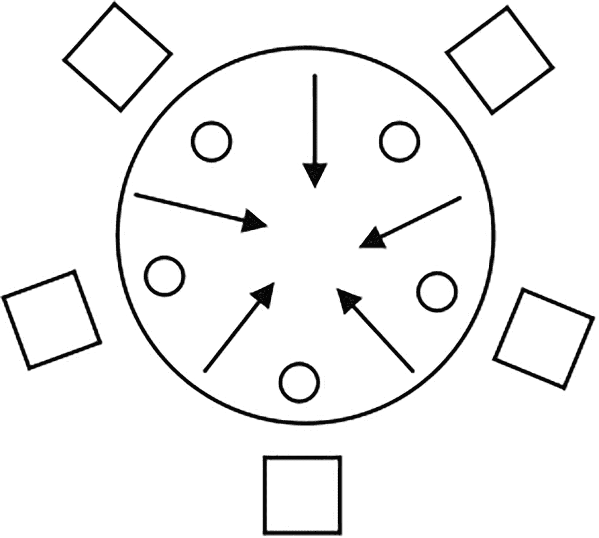

图 5-7

餐桌上的五位哲学家

哲学家一旦吃完饭，就放下两把叉子，开始思考。如果一个哲学家的邻居在用叉子，他就不能拿起它。如果五个哲学家各自从自己的右边拿起一把叉子，等着自己左边的叉子被邻座松开，会发生什么？这将是一个僵局，没有哲学家能够吃饭。使用`Lock`接口的`tryLock()`方法可以很容易地避免这种死锁情况。该方法立即返回，并且从不阻塞。如果锁可用，它获取锁并返回`true`。如果锁不可用，则返回`false`。清单 [5-33](#PC79) 中的类可以用来模拟哲学家，假设`ReentrantLock`类的一个对象代表一个叉子。

```java
// Philosopher.java
package com.jdojo.threads;
import java.util.concurrent.locks.Lock;
public class Philosopher {
    private final Lock leftFork;
    private final Lock rightFork;
    private final String name; // Philosopher's name
    public Philosopher(Lock leftFork, Lock rightFork,
          String name) {
        this.leftFork = leftFork;
        this.rightFork = rightFork;
        this.name = name;
    }
    public void think() {
        System.out.println(name + " is thinking...");
    }
    public void eat() {
        // Try to get the left fork
        if (leftFork.tryLock()) {
            try {
                // try to get the right fork
                if (rightFork.tryLock()) {
                    try {
                        // Got both forks. Eat now
                        System.out.println(name +
                            " is eating...");
                    } finally {
                        // release the right fork
                        rightFork.unlock();
                    }
                }
            } finally {
                // release the left fork
                leftFork.unlock();
            }
        }
    }
}

To create philosophers, you would use code like:
Lock fork1 = new ReentrantLock();
Lock fork2 = new ReentrantLock();
...
Lock fork5 = new ReentrantLock();
Philosopher p1 = new Philosopher(fork1, fork2, "John");
Philosopher p2 = new Philosopher(fork2, fork3, "Wallace");
...

Philosopher p5 = new Philosopher(fork5, fork1, "Charles");

Listing 5-33A Philosopher Class 

to Represent a Philosopher

```

留给读者的练习是完成代码并在五个不同的线程中运行所有五个哲学家来模拟哲学家进餐问题。你也可以思考如何使用`synchronized`关键字来解决同样的问题。仔细阅读`eat()`方法中的代码。它试图一次得到一个左右叉。如果你只能得到一把叉子，而另一把没有，你就放下你得到的那把，这样别人就可以得到它。`eat()`方法中的代码只有获取分叉的逻辑。在一个真实的程序中，如果你不能同时获得两个分叉，你可能会等待一段时间，然后再次尝试获得两个分叉。你将不得不写那个逻辑。

您可以在实例化`ReentrantLock`类时指定锁的公平性。公平性表示当多个线程等待获取锁时，将锁分配给一个线程的方式。在公平锁中，线程按照它们请求锁的顺序获得锁。在非公平锁中，允许向前跳转一个线程。例如，在非公平锁中，如果一些线程正在等待一个锁，而另一个稍后请求同一锁的线程在等待线程之前获得该锁，如果该锁在第二个线程请求它时变得可用。这听起来可能有点奇怪，因为让等待线程等待并把锁授予稍后请求锁的线程是不公平的。但是，它有一个性能增益。使用非公平锁定可以减少挂起和恢复线程的开销。`ReentrantLock`类的`tryLock()`方法总是使用非公平锁。您可以创建公平锁和非公平锁，如下所示:

```java
Lock nonFairLock1 = new ReentrantLock();
    // <- A non-fair lock (Default is non-fair)
Lock nonFairLock2 = new ReentrantLock(false);
    // <- A non-fair lock
Lock fairLock2 = new ReentrantLock(true);
    // <- A fair lock

```

一个`ReentrantLock`提供了一个互斥的锁定机制。也就是说，一次只有一个线程可以拥有`ReentrantLock`。如果你有一个由`ReentrantLock`保护的数据结构，写线程和读线程必须一次获取一个锁来修改或读取数据。如果您的数据结构经常被读取而很少被修改，那么`ReentrantLock`的这种限制(一次只能由一个线程拥有)可能会降低性能。在这种情况下，您可能希望多个读取器线程同时访问数据结构。然而，如果数据结构被修改，则只有一个写线程应该能够访问该数据结构。读写锁允许您使用`ReadWriteLock`接口的实例来实现这种锁定机制。它有两个方法:一个获取读取器锁，另一个获取写入器锁，如下所示:

```java
public interface ReadWriteLock {
    Lock readLock();
    Lock writeLock();
}

```

一个`ReentrantReadWriteLock`类是一个`ReadWriteLock`接口的实现。只有一个线程可以持有`ReentrantReadWriteLock`的写锁，而多个线程可以持有它的读锁。清单 [5-34](#PC82) 演示了`ReentrantReadWriteLock`的用法。请注意，在`getValue()`方法中，您使用了读锁，因此多个线程可以并发地读取数据。`setValue()`方法使用写锁，因此在给定时间只有一个线程可以修改数据。

Note

`ReadWriteLock`允许您拥有同一个锁的读版本和写版本。只要另一个线程不拥有写锁，多个线程就可以拥有一个读锁。但是，一次只能有一个线程拥有写锁。

```java
// ReadMostlyData.java
package com.jdojo.threads;
import java.util.concurrent.locks.Lock;
import java.util.concurrent.locks.ReentrantReadWriteLock;
public class ReadMostlyData {
    private int value;
    private final ReentrantReadWriteLock rwLock =
        new ReentrantReadWriteLock();
    private final Lock rLock = rwLock.readLock();
    private final Lock wLock = rwLock.writeLock();
    public ReadMostlyData(int value) {
        this.value = value;
    }
    public int getValue() {
        // Use the read lock, so multiple threads may
        // read concurrently
        rLock.lock();
        try {
            return this.value;
        } finally {
            rLock.unlock();
        }
    }
    public void setValue(int value) {
        // Use the write lock, so only one thread can
        // write at a time
        wLock.lock();
        try {
            this.value = value;
        } finally {
            wLock.unlock();
        }
    }
}

Listing 5-34Using a ReentrantReadWriteLock

to Guard a Read-Mostly Data Structure

```

## 同步器

我讨论了如何使用内在锁和显式锁的互斥机制来协调多线程对临界区的访问。一些称为同步器的类用于在需要对临界区进行非互斥访问的情况下协调一组线程的控制流。同步器对象与一组线程一起使用。它维护一个状态，根据它的状态，它让一个线程通过或者强制它等待。本节讨论以下类型的同步器:

*   旗语

*   障碍

*   短语

*   理解

*   交换器

其他类也可以充当同步器，比如阻塞队列。

### 旗语

信号量用于控制可以访问资源的线程数量。一个`synchronized`块还控制对一个资源的访问，该资源是关键部分。那么，信号量和`synchronized`块有什么不同呢？一个`synchronized`块只允许一个线程访问一个资源(一个临界区)，而一个信号量允许`N`线程(`N`可以是任何正数)访问一个资源。

如果`N`设置为 1，信号量可以充当`synchronized`块，以允许线程互斥地访问资源。信号量维护许多虚拟许可证。为了访问一个资源，一个线程获得一个许可，当它处理完这个资源时，它释放这个许可。如果许可证不可用，请求线程将被阻塞，直到许可证可用。您可以将信号量的许可看作一个令牌。

让我们讨论一个日常生活中使用信号量的例子。假设有一家餐厅有三张餐桌。那家餐馆一次只能有三个人吃饭。当一个人到达餐馆时，他们必须带一个代币去找一张桌子。当他们吃完后，他们会归还代币。每个代币代表一张餐桌。如果一个人在三张桌子都在使用的时候到达餐馆，他们必须等到有桌子空出来。如果一张桌子不能马上得到，你可以选择等到有空的时候或者去另一家餐馆。让我们使用信号量来模拟这个例子。你会有一个有三个许可的信号量。每个许可证代表一张餐桌。`java.util.concurrent`包中的`Semaphore`类代表信号量同步器。使用信号量的一个构造函数创建信号量:

```java
final int MAX_PERMITS = 3;
Semaphore s = new Semaphores(MAX_PERMITS);

```

`Semaphore`类的另一个构造函数将公平性作为第二个参数:

```java
final int MAX_PERMITS = 3;
Semaphore s = new Semaphores(MAX_PERMITS, true);
    // <- A fair semaphore

```

信号量的`fairness`与锁的含义相同。如果你创建一个公平的信号量，在多个线程请求许可的情况下，信号量将保证先进先出(FIFO)。也就是说，首先请求许可的线程将首先获得许可。

要获得许可，请使用`acquire()`方法。如果有许可证，它会立即返回。如果没有许可证，它将被阻止。线程在等待许可变得可用时可以被中断。`Semaphore`类的其他方法让您一次获得一个或多个许可。

要发布许可证，请使用`release()`方法。

清单 [5-35](#PC85) 包含了一个`Restaurant`类的代码。它将餐馆中可用桌子的数量作为其构造函数中的一个参数，并创建一个信号量，其许可数量等于桌子的数量。客户使用其`getTable()`和`returnTable()`方法分别获取和返回一个表。在`getTable()`方法中，您获得了一个许可。如果客户调用了`getTable()`方法，但是没有可用的表，他们必须等待，直到有一个表可用。这个类依赖于清单 [5-36](#PC86) 中声明的`RestaurantCustomer`类。

```java
// Restaurant.java
package com.jdojo.threads;
import java.util.concurrent.Semaphore;
public class Restaurant {
    private final Semaphore tables;
    public Restaurant(int tablesCount) {
        // Create a semaphore using number of tables we
        // have
        this.tables = new Semaphore(tablesCount);
    }
    public void getTable(int customerID) {
        try {
            System.out.println("Customer #" + customerID
                + " is trying to get a table.");
            // Acquire a permit for a table
            tables.acquire();
            System.out.println("Customer #" + customerID
                + " got a table.");
        } catch (InterruptedException e) {
            e.printStackTrace();
        }
    }
    public void returnTable(int customerID) {
        System.out.println("Customer #" + customerID +
            " returned a table.");
        tables.release();
    }

    public static void main(String[] args) {
        // Create a restaurant with two dining tables
        Restaurant restaurant = new Restaurant(2);
        // Create five customers
        for (int i = 1; i <= 5; i++) {
            RestaurantCustomer c = new RestaurantCustomer(
                restaurant, i);
            c.start();
        }
    }
}

Customer #4 is trying to get a table.
Customer #5 is trying to get a table.
Customer #1 is trying to get a table.
Customer #3 is trying to get a table.

Listing 5-35A Restaurant Class

, Which Uses a Semaphore to Control Access to Tables

```

清单 [5-36](#PC86) 包含了一个`RestaurantCustomer`类的代码，该类的对象代表一个餐馆中的顾客。客户线程的`run()`方法从餐馆获取一张桌子，随机吃一段时间，然后将桌子返回给餐馆。当您运行`Restaurant`类时，您可能会得到相似但不相同的输出。您可能会注意到，您创建了一个只有两张桌子的餐厅，有五位顾客正在用餐。在任何给定的时间，只有两个客户在吃饭，如输出所示。

```java
// RestaurantCustomer.java
package com.jdojo.threads;
import java.util.Random;
class RestaurantCustomer extends Thread {
    private final Restaurant r;
    private final int customerID;
    private static final Random random = new Random();
    public RestaurantCustomer(Restaurant r,
          int customerID) {
        this.r = r;
        this.customerID = customerID;
    }
    @Override
    public void run() {
        r.getTable(this.customerID); // Get a table
        try {
            // Eat for some time. Use number between 1
            // and 30 seconds
            int eatingTime = random.nextInt(30) + 1;
            System.out.println("Customer #"
                    + this.customerID
                    + " will eat for "
                    + eatingTime + " seconds.");
            Thread.sleep(eatingTime * 1000);
            System.out.println("Customer #"
                    + this.customerID
                    + " is done eating.");
        } catch (InterruptedException e) {
            e.printStackTrace();
        } finally {
            r.returnTable(this.customerID);
        }
    }
}

Listing 5-36A RestaurantCustomer Class to Represent a Customer in a Restaurant

```

信号量不受创建它所使用的许可数量的限制。每个`release()`方法增加一个许可证。因此，如果调用`release()`方法的次数比调用其`acquire()`方法的次数多，那么最终会比开始时拥有更多的许可。许可证不是在每个线程的基础上获取的。一个线程可以从信号量获取许可，另一个线程可以返回它。这就把正确使用获取和发布许可的负担留给了开发者。信号量有其他方法来获得许可，如果许可不能立即获得，这将让您后退而不是强迫您等待，例如`tryAcquire()`和`acquireUninterruptibly()`方法。

### 障碍

屏障用于使一组线程在屏障点相遇。到达屏障的组中的线程等待，直到该组中的所有线程都到达。一旦组中的最后一个线程到达屏障，组中的所有线程都被释放。当任务可以分成子任务时，可以使用屏障；每个子任务都可以在一个单独的线程中执行，每个线程必须在一个公共点相遇，以组合它们的结果。图 [5-8](#Fig8) 到 [5-11](#Fig11) 描述了屏障同步器如何让一组三个线程在屏障点相遇并让它们继续前进。

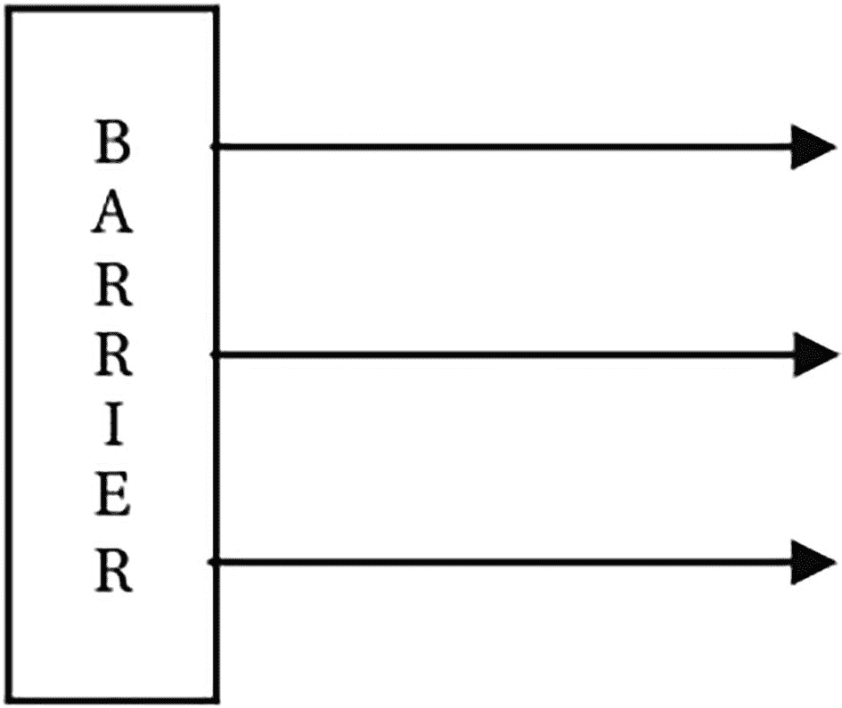

图 5-11

所有三个线程都成功通过了屏障

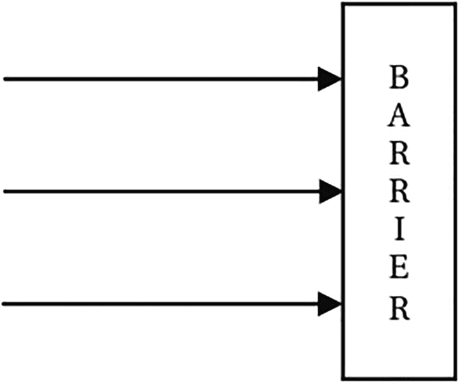

图 5-10

所有三个线程到达屏障，然后立即被释放

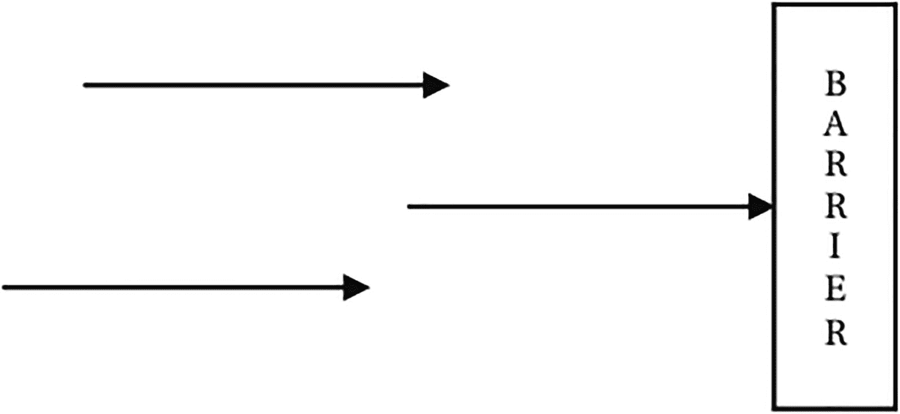

图 5-9

一个线程等待另外两个线程到达屏障

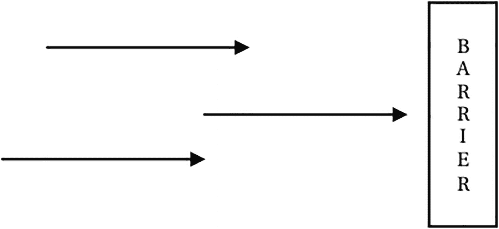

图 5-8

三个线程到达一个障碍

`java.util.concurrent`包中的`CyclicBarrier`类提供了屏障同步器的实现。它被称为循环屏障，因为一旦屏障点的所有等待线程都被释放，您就可以通过调用它的`reset()`方法来重用屏障。它还允许您将一个 barrier 动作与其相关联，这是一个`Runnable`任务(一个实现了`Runnable`接口的类的对象)。就在所有线程被释放之前，屏障动作被执行。当所有线程在屏障处相遇时，但在它们被释放之前，您可以将屏障操作视为“聚会时间”。以下是在程序中使用屏障需要执行的步骤:

1.  用组中的线程数:

    ```java
    CyclicBarrier barrier = new CyclicBarrier(5);
    // <- 5 threads

    ```

    创建一个`CyclicBarrier`类的对象，如果你想在所有线程都遇到栅栏时执行栅栏动作，你可以使用`CyclicBarrier`类的另一个构造函数:

    ```java
    // Assuming a BarrierAction class implements the
    // Runnable interface
    Runnable barrierAction = new BarrierAction();
    CyclicBarrier barrier = new CyclicBarrier(
        5, barrierAction);

    ```

2.  当一个线程准备在栅栏处等待时，该线程执行`CyclicBarrier`类的`await()`方法。`await()`方法有两种。一个让您无条件地等待所有其他线程，另一个让您指定超时。

清单 [5-37](#PC89) 中的程序演示了如何使用循环屏障。您可能会得到不同的输出。然而，事件的顺序将是相同的:所有三个线程将工作一段时间，在障碍处等待其他人到达，有一个聚会时间，并通过障碍。

```java
// MeetAtBarrier.java
package com.jdojo.threads;
import java.util.Random;
import java.util.concurrent.CyclicBarrier;
import java.util.concurrent.BrokenBarrierException;
public class MeetAtBarrier extends Thread {
    private final CyclicBarrier barrier;
    private final int ID;
    private static final Random random = new Random();
    public MeetAtBarrier(int ID, CyclicBarrier barrier) {
        this.ID = ID;
        this.barrier = barrier;
    }
    @Override
    public void run() {
        try {
            // Generate a random number between 1 and 30
            // to wait
            int workTime = random.nextInt(30) + 1;
            System.out.println("Thread #" + ID
                    + " is going to work for "
                    + workTime + " seconds");
            // Yes. Sleeping is working for this thread!!!
            Thread.sleep(workTime * 1000);
            System.out.println("Thread #" + ID
                    + " is waiting at the barrier...");
            // Wait at barrier for other threads in group
            // to arrive
            this.barrier.await();
            System.out.println("Thread #" + ID
                    + " passed the barrier...");
        } catch (InterruptedException e) {
            e.printStackTrace();
        } catch (BrokenBarrierException e) {
            System.out.println("Barrier is broken...");
        }
    }
    public static void main(String[] args) {
        // Create a barrier for a group of three threads
        // with a barrier action
        String msg =
            "We are all together. It's party time...";
        Runnable barrierAction = () ->
             System.out.println(msg);
        CyclicBarrier barrier =
             new CyclicBarrier(3, barrierAction);
        for (int i = 1; i <= 3; i++) {
            MeetAtBarrier t =
                new MeetAtBarrier(i, barrier);
            t.start();
        }
    }
}

Thread #2 is going to work for 15 seconds
Thread #3 is going to work for 2 seconds
Thread #1 is going to work for 30 seconds
Thread #3 is waiting at the barrier...
Thread #2 is waiting at the barrier...
Thread #1 is waiting at the barrier...
We are all together. It's party time...
Thread #3 passed the barrier...
Thread #2 passed the barrier...
Thread #1 passed the barrier...

Listing 5-37A Class That Demonstrates How to Use a CyclicBarrier in a Program

```

你可能已经注意到，在`MeetAtBarrier`类的`run()`方法中，你正在捕捉`BrokenBarrierException`。如果线程超时或者在等待障碍点时被中断，则认为障碍被破坏。超时的线程用一个`TimeoutException`释放，而所有在关卡等待的线程用一个`BrokenBarrierException`释放。

**注意**cyclic barrier 类的 await()方法返回调用它的线程的到达索引。到达屏障的最后一个线程的索引为零，第一个线程的索引为组中线程数减一。您可以使用这个索引在您的程序中进行任何特殊的处理。例如，最后到达屏障的线程可以记录所有参与线程完成特定一轮计算的时间。

### 短语

`java.util.concurrent`包中的`Phaser`类提供了另一个名为 phaser 的同步屏障的实现。一个`Phaser`提供类似于`CyclicBarrier`和`CountDownLatch`同步器的功能。我将在下一节介绍`CountDownLatch`同步器。但是，它更强大、更灵活。它提供了以下功能:

*   像`CyclicBarrier`一样，`Phaser`也是可重用的。

*   与`CyclicBarrier`不同，在`Phaser`上同步的参与方数量可以动态变化。在`CyclicBarrier`中，参与者的数量在屏障建立时就已经确定了。但是，在`Phaser`中，您可以随时添加或删除参与方。

*   一个`Phaser`有一个相关的相位号，从零开始。当所有注册方到达一个`Phaser`时，`Phaser`前进到下一个阶段，并且阶段号增加 1。相数的最大值为`Integer.MAX_VALUE`。达到最大值后，相数从零开始。

*   一个`Phaser`有一个终止状态。在终止状态下对`Phaser`调用的所有同步方法会立即返回，而不会等待前进。`Phaser`类提供了不同的方法来终止相位器。

*   有三种类型的交易方计数:注册交易方计数、到达交易方计数和未到达交易方计数。registered parties count 是为同步而注册的参与方数。到达方计数是相位器当前阶段已经到达的参与方的数量。未到达方计数是尚未到达相位器当前阶段的参与方的数量。当最后一队到达时，相位器进入下一阶段。请注意，所有三种类型的交易方计数都是动态的。

*   Optionally, a `Phaser` lets you execute a phaser action when all registered parties arrive at the phaser. Recall that a `CyclicBarrier` lets you execute a barrier action, which is a `Runnable` task. Unlike a `CyclicBarrier`, you specify a phaser action by writing code in the onAdvance() method of your `Phaser` class. It means you need to use your own phaser class by inheriting it from the `Phaser` class and override the `onAdvance()` method to provide a `Phaser` action. I discuss an example of this kind shortly.

    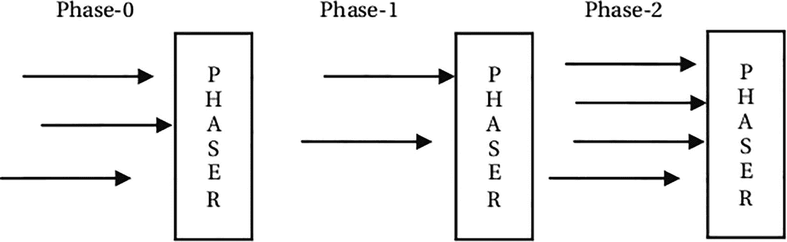

    图 5-12

    具有三个相位的相位器，每个相位中有不同数量的参与方

图 [5-12](#Fig12) 显示了三相相位器。它在每个阶段同步不同数量的参与方。图中箭头代表一方。

使用`Phaser`有几个步骤。您可以使用默认构造函数创建一个没有初始注册方的`Phaser`:

```java
// A phaser with no registered parties
Phaser phaser = new Phaser();

```

另一个构造函数允许您在创建`Phaser`时注册参与方:

```java
// A phaser with 5 registered parties
Phaser phaser = new Phaser(5);

```

一个`Phaser`可以以树状结构排列。其他构造函数允许您通过指定新创建的`Phaser`的父代来创建一个`Phaser`。一旦创建了一个`Phaser`，下一步就是注册对 phaser 上的同步感兴趣的各方。您可以通过以下方式注册交易方:

*   通过在创建一个`Phaser`对象时指定要在`Phaser`类的构造函数中注册的参与方的数量

*   通过使用`Phaser`类的`register()`方法一次注册一方

*   通过使用`Phaser`类的`bulkRegister(int parties)`方法批量注册指定数量的参与方

`Phaser`的注册方可以通过注册新的注册方或撤销已注册方的注册而随时变更。您可以使用`Phaser`类的`arriveAndDeregister()`方法取消注册方的注册。该方法让一方到达`Phaser`并取消注册，而无需等待其他方到达。如果一方被撤销注册，在下一阶段的`Phaser`中，该方的数量将减少一个。

通常，`Phaser`中的一方意味着一个线程。然而，`Phaser`并不将参与方的注册与特定线程相关联。它只是维护一个计数，当一方注册时该计数加 1，当一方注销时该计数减 1。

一个`Phaser`最重要的部分是多方在上面同步的方式。在`Phaser`上同步的一种典型方式是让注册的用户到达，并在`Phaser`等待其他注册用户到达。一旦最后一个注册方到达`Phaser`，所有方进入`Phaser`的下一阶段。

`Phaser`类的`arriveAndAwaitAdvance()`方法让一方到达`Phaser`并等待其他方到达，然后才能继续。

`Phaser`类的`arriveAndDeregister()`方法让一方到达`Phaser`并注销，而不等待其他方到达。注销后，进入下一阶段所需的缔约方数量减少一个。通常，`arriveAndDeregister()`方法由控制方使用，其工作是控制其他方的进展，而不参与进展本身。通常，控制方向`Phaser`注册自己，并等待某些条件发生；当所需的条件发生时，它到达并从`Phaser`中注销自己，因此各方可以在`Phaser`上同步并前进。

让我们看一个使用`Phaser`来同步一组任务的例子，这样它们可以同时开始。清单 [5-38](#PC92) 中所示的`StartTogetherTask`类的一个实例代表了本例中的一个任务。

```java
// StartTogetherTask.java
package com.jdojo.threads;
import java.util.Random;
import java.util.concurrent.Phaser;
public class StartTogetherTask extends Thread {
    private final Phaser phaser;
    private final String taskName;
    private static Random rand = new Random();
    public StartTogetherTask(String taskName,
          Phaser phaser) {
        this.taskName = taskName;
        this.phaser = phaser;
    }

    @Override
    public void run() {
        System.out.println(taskName + ":Initializing...");
        // Sleep for some time between 1 and 5 seconds
        int sleepTime = rand.nextInt(5) + 1;
        try {
            Thread.sleep(sleepTime * 1000);
        } catch (InterruptedException e) {
            e.printStackTrace();
        }
        System.out.println(taskName + ":Initialized...");
        // Wait for all parties to arrive to start the task
        phaser.arriveAndAwaitAdvance();
        System.out.println(taskName + ":Started...");
    }
}

Listing 5-38A StartTogetherTask Class

to Represent Tasks That Start Together by Synchronizing on a Phaser

```

`StartTogetherTask`类继承自`Thread`类。它的构造函数接受一个任务名和一个 Phaser 实例。在它的`run()`方法中，它输出一条正在初始化的消息。它通过休眠一段随机的时间`1`到`5`秒来伪装它的初始化。之后，它会打印一条消息，说明它已初始化。在这个阶段，它通过调用`Phaser`的`arriveAndAwaitAdvance()`方法来等待`Phaser`前进。该方法将被阻止，直到所有注册方到达`Phaser`。当此方法返回时，它会打印一条消息，表明任务已经开始。清单 [5-39](#PC93) 包含测试三个`StartTogetherTask`类型任务的代码。

```java
// StartTogetherTaskTest.java
package com.jdojo.threads;
import java.util.concurrent.Phaser;
public class StartTogetherTaskTest {
    public static void main(String[] args) {
        // Start with 1 registered party
        Phaser phaser = new Phaser(1);
        // Let's start three tasks
        final int TASK_COUNT = 3;
        for (int i = 1; i <= TASK_COUNT; i++) {
            // Register a new party with the phaser for
            // each task
            phaser.register();
            // Now create the task and start it
            String taskName = "Task #" + i;
            StartTogetherTask task =
                new StartTogetherTask(taskName, phaser);
            task.start();
        }
        // Now, deregister the self, so all tasks can
        // advance
        phaser.arriveAndDeregister();
    }
}

Task #3:Initializing...
Task #2:Initializing...
Task #1:Initializing...
Task #3:Initialized...
Task #1:Initialized...
Task #2:Initialized...
Task #2:Started...
Task #1:Started...
Task #3:Started...

Listing 5-39Testing Some Objects of the StartTogetherTask Class

with a Phaser

```

首先，程序通过将`1`指定为初始注册方来创建一个`Phaser`对象:

```java
// Start with 1 registered party
Phaser phaser = new Phaser(1);

```

你用`Phaser`一次注册一个任务。如果一个任务(或一方)在其他任务注册之前注册并开始，第一个任务将推进 phaser，因为将有一个注册方，它将自己到达 phaser。因此，您需要从一个注册方开始。它充当其他任务的控制方。

您在一个循环中创建了三个任务。在这个循环中，您用`Phaser`注册一个 party(代表一个任务)，创建一个任务，并启动它。一旦完成了任务的设置，就可以调用`Phaser`的`arriveAndDeregister()`方法。这将处理您在创建`Phaser`时已经注册的一个额外的参与方。该方法使一方到达`Phaser`并取消注册，而无需等待其他注册方到达。这个方法调用结束后，到达`Phaser`并前进就靠三个任务了。一旦三个任务都到达`Phaser`，它们将同时前进，从而使它们同时开始。您可能会得到不同的输出。然而，输出中的最后三条消息总是关于启动这三个任务。

如果您不想使用额外的一方作为控制器，您需要提前注册所有任务，以使该程序正常工作。您可以重写`StartTogetherTaskTest`类的`main()`方法中的代码，如下所示:

```java
public static void main(String[] args) {
    // Start with 0 registered party
    Phaser phaser = new Phaser();
    // Let's start three tasks
    final int TASK_COUNT = 3;
    // Initialize all tasks in one go
    phaser.bulkRegister(TASK_COUNT);
    for(int i = 1; i <= TASK_COUNT; i++) {
        // Now create the task and start it
        String taskName = "Task #" + i;
        StartTogetherTask task =
            new StartTogetherTask(taskName, phaser);
        task.start();
    }
} 

```

这一次，您创建一个没有注册方的`Phaser`。您可以使用`bulkRegister()`方法一次性注册所有政党。请注意，您不再需要在循环中注册一个参与方。新法典与旧法典具有同等效力。只不过是用不同的方式写出了同样的逻辑。

与`CyclicBarrier`一样，`Phaser`允许您使用其`onAdvance()`方法在阶段推进时执行动作。您需要通过从`Phaser`类继承来创建自己的 phaser 类，并覆盖`onAdvance()`方法来编写自定义的`Phaser`动作。在每次相位提前时，相位器的`onAdvance()`方法被调用。`Phaser`类中的`onAdvance()`方法声明如下。第一个参数是相数，第二个参数是注册方数:`protected boolean onAdvance(int phase, int registeredParties`)

除了定义一个阶段推进动作，`Phaser`类的`onAdvance()`方法还控制一个`Phaser`的终止状态。如果一个`Phaser`的`onAdvance()`方法返回`true`，则该`Phaser`被终止。您可以使用`Phaser`类的`isTerminated()`方法来检查 phaser 是否被终止。您也可以使用 phaser 的`forceTermination()`方法来终止它。

清单 [5-40](#PC96) 演示了如何添加一个`Phaser`动作。这是一个微不足道的例子。但是，它演示了添加和执行 Phaser 操作的概念。它使用一个匿名类来创建一个自定义 Phaser 类。匿名类覆盖 onAdvance()方法来定义 Phaser 动作。它只是在 onAdvance()方法中打印一条消息作为 Phaser 操作。它返回 false，这意味着 phaser 不会从 onAdvance()方法中终止。稍后，它将自己注册为一方，并使用 arriveAndDeregister()方法触发阶段推进。在每次相位超前时，执行 onAdvance()方法定义的 Phaser 操作。

```java
// PhaserActionTest.java
package com.jdojo.threads;
import java.util.concurrent.Phaser;
public class PhaserActionTest {
    public static void main(String[] args) {
        // Create a Phaser object using an anonymous class
        // and override its onAdvance() method to define a
        // phaser action
        Phaser phaser = new Phaser() {
            @Override
            protected boolean onAdvance(int phase,
                  int parties) {
                System.out.println(
                    "Inside onAdvance(): phase = "
                    + phase + ", Registered Parties = "
                    + parties);
                // Do not terminate the phaser by returning
                // false
                return false;
            }
        };
        // Register the self (the "main" thread) as a party
        phaser.register();
        // Phaser is not terminated here
        System.out.println("#1: isTerminated(): " +
            phaser.isTerminated());
        // Since we have only one party registered, this
        // arrival will advance the phaser and registered
        // parties reduces to zero
        phaser.arriveAndDeregister();
        // Trigger another phase advance
        phaser.register();
        phaser.arriveAndDeregister();
        // Phaser is still not terminated
        System.out.println("#2: isTerminated(): " +
            phaser.isTerminated());
        // Terminate the phaser
        phaser.forceTermination();
        // Phaser is terminated
        System.out.println("#3: isTerminated(): " +
            phaser.isTerminated());
    }

}

#1: isTerminated(): false
Inside onAdvance(): phase = 0, Registered Parties = 0
Inside onAdvance(): phase = 1, Registered Parties = 0
#2: isTerminated(): false
#3: isTerminated(): true

Listing 5-40Adding a Phaser Action to a Phaser

```

让我们考虑用一个`Phaser`来解决一个复杂的任务。这一次，`Phaser`通过在每个阶段同步多方来在多个阶段中工作。多个任务在每个阶段生成随机整数，并将它们添加到一个`List`。在`Phaser`终止后，您计算所有随机生成的整数的总和。

清单 [5-41](#PC97) 包含任务的代码。我们姑且称这个任务为`AdderTask`。在它的`run()`方法中，它在`1`和`10`之间创建一个随机整数，将该整数加到一个`List`，并等待一个`Phaser`前进。在`Phaser`的每个阶段，它不断向列表中添加一个整数，直到`Phaser`终止。

```java
// AdderTask.java
package com.jdojo.threads;
import java.util.List;
import java.util.Random;
import java.util.concurrent.Phaser;
public class AdderTask extends Thread {
    private final Phaser phaser;
    private final String taskName;
    private final List<Integer> list;
    private static Random rand = new Random();
    public AdderTask(String taskName, Phaser phaser,
          List<Integer> list) {
        this.taskName = taskName;
        this.phaser = phaser;
        this.list = list;
    }

    @Override
    public void run() {
        do {
            // Generate a random integer between 1 and 10
            int num = rand.nextInt(10) + 1;
            System.out.println(taskName + " added " +
                num);
            // Add the integer to the list
            list.add(num);
            // Wait for all parties to arrive at the phaser
            phaser.arriveAndAwaitAdvance();
        } while (!phaser.isTerminated());
    }
}

Listing 5-41An AdderTask Class

Whose Instances Can Be Used with a Phaser to Generate Some Integers

```

清单 [5-42](#PC98) 通过从`Phaser`类继承一个匿名类来创建一个`Phaser`。在它的`onAdvance()`方法中，它在第二次提前之后终止相位器，这由`PHASE_COUNT`常数控制，或者如果注册方减少到零。您使用一个同步的`List`来收集加法器任务生成的随机整数。您计划使用三个加法器任务，所以您用 phaser 注册了四个参与方(比任务数多一个)。附加方将用于同步每个阶段。它等待每个相位提前，直到`Phaser`终止。最后，计算所有加法器任务生成的随机整数之和，并显示在标准输出上。您可能会得到不同的输出。

```java
// AdderTaskTest.java
package com.jdojo.threads;

import java.util.List;
import java.util.ArrayList;
import java.util.Collections;
import java.util.concurrent.Phaser;

public class AdderTaskTest {
    public static void main(String[] args) {
        final int PHASE_COUNT = 2;
        Phaser phaser = new Phaser() {
            @Override
            public boolean onAdvance(int phase,
                  int parties) {
                // Print the phaser details
                System.out.println("Phase:" + phase
                        + ", Parties:"
                        + parties
                        + ", Arrived:"
                        + this.getArrivedParties());
                boolean terminatePhaser = false;
                // Terminate the phaser when we reach the
                // PHASE_COUNT or there is no registered
                // party
                if (phase >= PHASE_COUNT - 1 ||
                        parties == 0) {
                    terminatePhaser = true;
                }
                return terminatePhaser;
            }
        };
        // Use a synchronized List
        List<Integer> list = Collections.synchronizedList(
            new ArrayList<>());
        // Let's start three tasks
        final int ADDER_COUNT = 3;
        // Register parties one more than the number of
        // adder tasks. The extra party will synchronize to
        // compute the result of all generated integers by
        // all adder tasks
        phaser.bulkRegister(ADDER_COUNT + 1);
        for (int i = 1; i <= ADDER_COUNT; i++) {
            // Create the task and start it
            String taskName = "Task #" + i;
            AdderTask task = new AdderTask(taskName,
                phaser, list);
            task.start();
        }

        // Wait for the phaser to terminate, so we can
        // compute the sum of all generated integers by the
        // adder tasks
        while (!phaser.isTerminated()) {
            phaser.arriveAndAwaitAdvance();
        }
        // Phaser is terminated now. Compute the sum
        int sum = 0;
        for (Integer num : list) {
            sum = sum + num;
        }
        System.out.println("Sum = " + sum);
    }
}

Task #2 added 2
Task #1 added 2
Task #3 added 5
Phase:0, Parties:4, Arrived:4
Task #3 added 5
Task #1 added 1
Task #2 added 7
Phase:1, Parties:4, Arrived:4
Sum = 22

Listing 5-42A Program to Use Multiple AdderTask Tasks with a Phaser

```

### 理解

闩锁的工作方式类似于屏障，因为它也让一组线程等待，直到到达其终止状态。一旦一个锁存器到达它的终端状态，它就让所有的线程通过。与屏障不同，它是一次性对象。一旦达到终止状态，就不能重置和重用。闩锁可用于在一定数量的一次性活动完成之前许多活动无法继续的情况。例如，一项服务应该在它所依赖的所有服务都启动后才启动。

`java.util.concurrent`包中的`CountDownLatch`类提供了一个闩锁的实现。使用其构造函数将它初始化为一个计数。调用闩锁对象的`await()`方法的所有线程都被阻塞，直到闩锁的`countDown()`方法被调用的次数达到其计数被设置的次数。当调用`countDown()`方法的次数和它的计数相同时，它就到达了终止状态，所有被阻塞的线程都被释放。一旦一个锁存器到达它的终端状态，它的`await()`方法立即返回。您可以将为闩锁设置的计数视为一组线程将等待发生的事件数。事件的每次发生都会调用它的`countDown()`方法。

清单 [5-43](#PC99) 和 [5-44](#PC100) 包含分别代表助手服务和主服务的类。主服务依赖于助手服务来启动。所有助手服务启动后，主服务才能启动。

```java
// LatchMainService.java
package com.jdojo.threads;
import java.util.concurrent.CountDownLatch;
public class LatchMainService extends Thread {
    private final CountDownLatch latch;
    public LatchMainService(CountDownLatch latch) {
        this.latch = latch;
    }

    @Override
    public void run() {
        try {
            System.out.println(
                "Main service is waiting for helper " +
                "services to start...");
            latch.await();
            System.out.println(
                "Main service has started...");
        } catch (InterruptedException e) {
            e.printStackTrace();
        }
    }
}

Listing 5-44A Class to Represent the Main Service That Depends on Helper Services to Start

```

```java
// LatchHelperService.java
package com.jdojo.threads;
import java.util.concurrent.CountDownLatch;
import java.util.Random;
public class LatchHelperService extends Thread {
    private final int ID;
    private final CountDownLatch latch;
    private final Random random = new Random();
    public LatchHelperService(int ID,
          CountDownLatch latch) {
        this.ID = ID;
        this.latch = latch;
    }

    @Override
    public void run() {
        try {
            int startupTime = random.nextInt(30) + 1;
            System.out.println("Service #" + ID
                    + " starting in "
                    + startupTime + " seconds...");
            Thread.sleep(startupTime * 1000);
            System.out.println("Service #" + ID
                    + " has started...");
        } catch (InterruptedException e) {
            e.printStackTrace();
        } finally {
            // Count down on the latch to indicate that
            // it has started
            this.latch.countDown();
        }
    }
}

Listing 5-43A Class to Represent a Helper Service

```

清单 [5-45](#PC101) 列出了一个测试带有闩锁的助手和主服务概念的程序。创建一个初始化为 2 的锁存器。首先启动主服务线程，它调用 latch 的`await()`方法来等待助手服务启动。一旦两个助手线程都调用了闩锁的`countDown()`方法，主服务就会启动。输出清楚地解释了事件的顺序。

```java
// LatchTest.java
package com.jdojo.threads;
import java.util.concurrent.CountDownLatch;
public class LatchTest {
    public static void main(String[] args) {
        // Create a countdown latch with 2 as its counter
        CountDownLatch latch = new CountDownLatch(2);
        // Create and start the main service
        LatchMainService ms = new LatchMainService(latch);
        ms.start();
        // Create and start two helper services
        for (int i = 1; i <= 2; i++) {
            LatchHelperService lhs =
                new LatchHelperService(i, latch);
            lhs.start();
        }
    }
}

Main service is waiting for helper services to start...
Service #1 starting in 12 seconds...
Service #2 starting in 2 seconds...
Service #2 has started...
Service #1 has started...
Main service has started...

Listing 5-45A Class to Test the Concept of a Latch with Helper and Main Services

```

### 交换器

交换器是屏障的另一种形式。像屏障一样，交换器让两个线程在同步点互相等待。当两个线程都到达时，它们交换一个对象并继续它们的活动。这在构建两个独立方需要不时交换信息的系统时很有用。图 [5-13](#Fig13) 到 [5-15](#Fig15) 描述了一个交换器如何与两个线程一起工作并让它们交换一个对象。

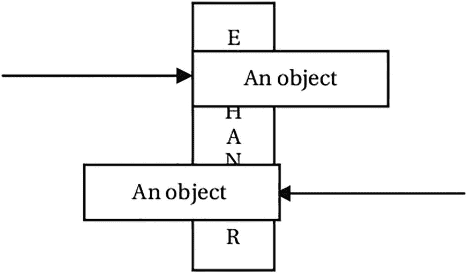

图 5-15

两个线程在交换点相遇并交换对象

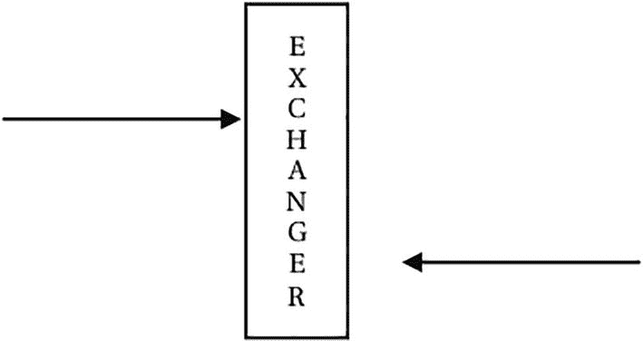

图 5-14

一个线程到达交换点，并等待另一个线程到达

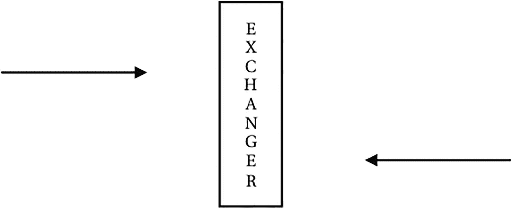

图 5-13

两个线程独立执行它们的工作

`Exchanger<V>`类提供了一个交换器同步器的实现。它有一个不带参数的构造函数。类型参数`V`是双方将要交换的 Java 对象的类型。您可以创建一个让两个线程交换一个`Long`的交换器，如下所示:

```java
Exchanger<Long> exchanger = new Exchanger<>();

```

`Exchanger`类只有一个方法`exchange()`。当一个线程准备与另一个线程交换对象时，它调用交换器的`exchange()`方法，等待另一个线程交换对象。等待交换对象的线程可能会被中断。

另一个重载版本的`exchange()`方法接受超时期限。如果指定了超时期限，调用此方法的线程将等待另一个线程交换对象，直到超时期限结束。`exchange()`方法将对象作为参数传递给另一个线程，并返回另一个线程传递的对象。你这样称呼`exchange()`法:

```java
objectReceived = exchanger.exchange(objectedPassed);

```

清单 [5-46](#PC106) 到 [5-48](#PC108) 展示了在构建生产者/消费者系统时交换缓冲区的使用，缓冲区是整数对象的`ArrayList`。要声明整数对象的数组列表，必须按如下方式声明:

```java
ArrayList<Integer> buffer = new ArrayList<Integer>();

```

在清单 [5-48](#PC108) 中，您已经创建了一个交换器

```java
Exchanger<ArrayList<Integer>> exchanger =
          new Exchanger<ArrayList<Integer>>();

```

类型声明`Exchanger<ArrayList<Integer»`表示交换器将让两个线程交换类型为`ArrayList<Integer>`的对象。您还可以注意到，`ExchangerProducer`和`ExchangerConsumer`类中的类型声明与前面的声明相匹配。生成器填充数据，并等待一段时间，让用户觉得它真的在填充数据。它等待消费者用来自消费者的空缓冲区来交换填满的缓冲区。消费者做的正好相反。它等待生产者交换缓冲区。当它从生产者那里得到一个满的缓冲区时，它清空缓冲区并再次等待生产者用一个满的缓冲区来交换它的空缓冲区。由于生产者和消费者在无限循环中运行，程序不会结束。您必须手动结束该程序。您将得到与清单 [5-48](#PC108) 所示类似的输出。

```java
// ExchangerProducerConsumerTest.java
package com.jdojo.threads;
import java.util.concurrent.Exchanger;
import java.util.ArrayList;
public class ExchangerProducerConsumerTest {
    public static void main(String[] args) {
        Exchanger<ArrayList<Integer>> exchanger =
            new Exchanger<>();
        // The producer will produce 5 integers at a time
        ExchangerProducer producer =
            new ExchangerProducer(exchanger, 5);
        ExchangerConsumer consumer =
            new ExchangerConsumer(exchanger);
        producer.start();
        consumer.start();
    }
}

Producer is filling the buffer with data...
Consumer is waiting to exchange the data...
Producer has produced:[1, 2, 3, 4, 5]
Producer is waiting to exchange the data...
Producer is filling the buffer with data...
Consumer has received:[1, 2, 3, 4, 5]
Consumer is emptying data from the buffer...
...

Listing 5-48A Class to Test a Producer/Consumer System with an Exchanger

```

```java
// ExchangerConsumer.java
package com.jdojo.threads;
import java.util.concurrent.Exchanger;
import java.util.ArrayList;
import java.util.Random;
public class ExchangerConsumer extends Thread {
    private final Exchanger<ArrayList<Integer>> exchanger;
    private ArrayList<Integer> buffer = new ArrayList<>();
    private final Random random = new Random();
    public ExchangerConsumer(
          Exchanger<ArrayList<Integer>> exchanger) {
        this.exchanger = exchanger;
    }
    @Override
    public void run() {
        // keep consuming the integers
        while (true) {
            try {
                // Let's wait for the consumer to exchange
                // data
                System.out.println(
                    "Consumer is waiting to exchange" +
                    " the data...");
                buffer = exchanger.exchange(buffer);
                System.out.println(
                    "Consumer has received:" + buffer);
                System.out.println(
                    "Consumer is emptying data from" +
                    " the buffer...");
                // Wait for some time by sleeping
                int sleepTime = random.nextInt(20) + 1;
                // Sleep for some time
                Thread.sleep(sleepTime * 1000);
                // Empty the buffer
                this.emptyBuffer();
            } catch (InterruptedException e) {
                e.printStackTrace();
            }
        }
    }
    public void emptyBuffer() {
        buffer.clear();
    }
}

Listing 5-47A Consumer Thread That Will Use an Exchanger to Exchange Data with a Producer

```

```java
// ExchangerProducer.java
package com.jdojo.threads;
import java.util.concurrent.Exchanger;
import java.util.ArrayList;
import java.util.Random;
public class ExchangerProducer extends Thread {
    private final Exchanger<ArrayList<Integer>> exchanger;
    private ArrayList<Integer> buffer = new ArrayList<>();
    private final int bufferLimit;
    private final Random random = new Random();
    private int currentValue = 0; // to produce values
    public ExchangerProducer(
            Exchanger<ArrayList<Integer>> exchanger,
            int bufferLimit) {
        this.exchanger = exchanger;
        this.bufferLimit = bufferLimit;
    }
    @Override
    public void run() {
        // keep producing integers
        while (true) {
            try {
                System.out.println(
                    "Producer is filling the buffer" +
                    " with data...");
                // Wait for some time by sleeping
                int sleepTime = random.nextInt(20) + 1;
                Thread.sleep(sleepTime * 1000);
                // Fill the buffer
                this.fillBuffer();
                System.out.println(
                    "Producer has produced:" + buffer);
                // Let's wait for the consumer to
                // exchange data
                System.out.println(
                    "Producer is waiting to exchange" +
                    " the data...");
                buffer = exchanger.exchange(buffer);
            } catch (InterruptedException e) {
                e.printStackTrace();
            }
        }
    }
    public void fillBuffer() {
        for (int i = 1; i <= bufferLimit; i++) {
            buffer.add(++currentValue);
        }
    }
}

Listing 5-46A Producer Thread That Will Use an Exchanger to Exchange Data with a Consumer

```

## 执行者框架

任务是工作的逻辑单元，通常使用线程来表示和执行任务。在程序中建模之前，应该考虑任务执行的许多方面。任务的几个方面如下:

*   它是如何产生的。

*   提交执行的方式。

*   它是如何执行的。是同步执行还是异步执行？

*   它被执行的时间。提交后是立即执行还是排队执行？

*   哪个线程执行它？它是在提交它的线程中执行还是在另一个线程中执行？

*   当任务执行完毕时，我们如何得到它的结果？

*   我们如何知道在其执行过程中发生的错误？

*   是否依赖其他任务来完成它的执行？

任务可以表示为一个`Runnable`。如果您想使用线程管理任务，请遵循下面描述的步骤。您可以创建一个类来表示任务:

```java
public class MyTask implements Runnable {
    public void run() {
        // Task processing logic goes here
    }
}

```

您可以按如下方式创建任务:

```java
MyTask task1 = new MyTask();
MyTask task2 = new MyTask();
MyTask task3 = new MyTask();

```

要执行这些任务，可以按如下方式使用线程:

```java
Thread t1 = new Thread(task1);
Thread t2 = new Thread(task2);
Thread t3 = new Thread(task3);
t1.start();
t2.start();
t3.start();

```

如果您想获得任务执行的结果，您必须编写额外的代码。你可能会注意到，管理这样的任务很困难，如果不是不可能的话。任务执行还有一个非常重要的方面:应该创建多少个线程来执行一组任务？一种方法是为每个任务创建一个线程。为每个任务创建一个线程有以下缺点:

*   创建和销毁线程需要开销和时间，这又会延迟任务执行的开始。

*   每个线程都消耗资源。如果线程的数量超过了可用的 CPU 数量，其他线程将会闲置并消耗资源。

*   每个平台都有支持最大线程数的限制。如果一个应用程序超过这个限制，它甚至可能崩溃！另一种方法是创建一个线程，让它处理所有任务的执行。这是另一种极端情况，具有以下缺点:

*   让一个线程执行所有任务会使它成为一个顺序执行者。

*   如果一个任务提交了另一个任务，并且依赖于它提交的任务的结果，那么这个策略很容易出现死锁。

*   如果您有长时间运行的任务，等待它们执行的其他任务似乎没有响应，因为启动挂起的任务需要很长时间。

executor 框架试图解决任务执行的所有这些问题。该框架提供了一种将任务提交与任务执行分开的方法。您创建一个任务并将其提交给执行者。执行者负责任务的执行细节。它提供可配置的策略来控制任务执行的许多方面。

`java.util.concurrent`包中的`Executor`接口是 executor 框架的基础。该接口只包含一个方法，如下所示:

```java
public interface Executor {
    void execute (Runnable command);
}

```

您可以使用 executor 框架来执行前面提到的三个任务，如下所示:

```java
// Get an executor instance.
Executor executor = Executors.newCachedThreadPool();
// Submit three tasks to the executor
executor.execute(task1);
executor.execute(task2);
executor.execute(task3);

```

注意，当您使用执行器时，您并没有创建三个线程来执行这三个任务。遗嘱执行人会替你决定。您只是调用了执行者的`execute()`方法来提交任务。执行器将管理将执行任务的线程和关于任务执行的其他细节。

executor 框架提供了一个类库来选择执行任务的线程使用策略。您可以选择在一个线程、固定数量的线程或可变数量的线程中运行所有任务。事实上，您可以选择一个线程池来执行您的任务，并且线程池可以配置池中有多少个线程以及如何维护这些线程。在任何情况下，池中的所有线程在变得可用时都会被重用。使用线程池来执行提交的任务有两个重要的优点:

*   创建新线程和在使用完线程后销毁它们的开销减少了。执行器重用线程池中的线程。

*   如果在任务提交时线程池中有可用的线程，则任务可以立即开始。这消除了线程创建和任务执行之间的时间延迟。

这里有必要提一下另一个名为`ExecutorService`的接口。它提供了执行器的一些高级特性，包括管理执行器的关闭和检查提交任务的状态。它继承自`Executor`接口。这个接口的一些重要方法有`shutdown()`、`shutdownNow()`、`submit()`和`awaitTermination()`。我很快会讨论它们。

当不再需要执行程序时，关闭它是很重要的。执行器框架创建非守护线程来执行任务。通常，当一个线程执行完一个任务时，它不会被销毁。相反，它被保存在线程池中以备将来重用——线程是被销毁还是被保留取决于线程池的配置。如果一些非守护线程仍然存在，Java 应用程序将不会退出。因此，如果您忘记关闭执行器，您的应用程序可能永远不会退出。

执行者如何处理任务执行？为了避免详细冗长的讨论，这里有一个简单的解释。您可以在创建执行器时指定执行器用来管理任务的线程池类型。提交给执行者的所有任务都在一个队列中排队，这个队列称为工作队列。当一个线程变得可用时，它从工作队列中删除一个任务并执行它。当一个线程执行完一项任务时，根据线程池的类型，执行器要么销毁该线程，要么将它放回线程池中，以便可以重用它来执行另一项任务。您有许多选择来决定对执行器使用哪种线程池:

*   您可以使用`Executors`类的一个工厂方法来获得一个执行器，它有一个预配置的线程池，如果您愿意，可以让您重新配置它。您将使用这种方法在您的示例中获得一个执行程序。您还可以使用这个类来获得一个无法重新配置的预配置执行器。`Executors`类获取执行器服务的常用方法如下:
    *   `newCachedThreadPool()`:返回一个`ExecutorService`对象。如果先前创建的线程可用，线程池将重用它们。否则，它会创建一个新线程来执行任务。它销毁并删除池中的空闲线程。线程池具有根据工作负载扩展和收缩的特性。

    *   `newFixedThreadPool(int nThreads)`:返回一个`ExecutorService`对象。线程池维护固定数量的线程。在任何时候，线程池都将拥有最大`nThread`数量的线程。如果一个任务到达工作队列，并且所有线程都忙于执行其他任务，那么该任务必须等待执行，直到一个线程变得可用。如果一个线程在任务执行过程中由于意外失败而被终止，它将被一个新线程替换。

    *   `newSingleThreadExecutor()`:返回一个`ExecutorService`对象。线程池只维护一个线程来执行所有任务。它保证一次只执行一个任务。如果单独的线程意外死亡，它将被一个新线程替换。

*   您可以实例化`ThreadPoolExecutor`类并配置线程池。

*   您可以从头开始创建自己的遗嘱执行人。

清单 [5-49](#PC114) 包含了一个`RunnableTask`类的完整代码。

```java
// RunnableTask.java
package com.jdojo.threads;
import java.util.Random;
public class RunnableTask implements Runnable {
    private final int taskId;
    private final int loopCounter;
    private final Random random = new Random();
    public RunnableTask(int taskId, int loopCounter) {
        this.taskId = taskId;
        this.loopCounter = loopCounter;
    }

    @Override
    public void run() {
        for (int i = 1; i <= loopCounter; i++) {
            try {
                int sleepTime = random.nextInt(10) + 1;
                System.out.println("Task #" + this.taskId
                        + " - Iteration #" + i
                        + " is going to sleep for "
                        + sleepTime + " seconds.");
                Thread.sleep(sleepTime * 1000);
            } catch (InterruptedException e) {
                System.out.println("Task #" + this.taskId
                        + " has been interrupted.");
                break;
            }
        }
    }
}

Listing 5-49A Runnable Task

```

`RunnableTask`类的一个对象代表你程序中的一个任务。您将有一个任务，它将休眠一段时间，并在标准输出上打印一条消息。睡眠时间将在`1`和`10`秒之间随机确定。每个任务将被分配一个任务 ID 和一个循环计数器。任务 ID 用于标识任务。循环计数器用于控制`run()`方法中的循环。清单 [5-50](#PC115) 包含测试`Runnable`任务类的完整代码。

```java
// RunnableTaskTest.java
package com.jdojo.threads;
import java.util.concurrent.Executors;
import java.util.concurrent.ExecutorService;
public class RunnableTaskTest {
    public static void main(String[] args) {
        final int THREAD_COUNT = 3;
        final int LOOP_COUNT = 3;
        final int TASK_COUNT = 5;
        // Get an executor with three threads in its
        // thread pool
        ExecutorService exec =
            Executors.newFixedThreadPool(THREAD_COUNT);
        // Create five tasks and submit them to the
        // executor
        for (int i = 1; i <= TASK_COUNT; i++) {
            RunnableTask task =
                new RunnableTask(i, LOOP_COUNT);
            exec.submit(task);
        }
        // Let's shutdown the executor
        exec.shutdown();
    }
}

Task #1 - Iteration #1 is going to sleep for 9 seconds.
Task #2 - Iteration #1 is going to sleep for 2 seconds.
Task #3 - Iteration #1 is going to sleep for 7 seconds.
Task #2 - Iteration #2 is going to sleep for 5 seconds.
Task #2 - Iteration #3 is going to sleep for 7 seconds.
Task #3 - Iteration #2 is going to sleep for 2 seconds.
...

Listing 5-50A Class to Test an Executor to Run Some Runnable Tasks

```

`RunnableTaskTest`类创建一个有三个线程的`Executor`。它创建了五个`RunnableTask`类的实例——每个任务在其`run()`方法中进行三次迭代。五项任务全部提交给`Executor`。您已经使用了一个带有固定线程数的线程池的执行器。您的执行器的线程池中只有三个线程，一次只能执行三个任务。当执行器完成前三个任务中的一个时，它开始第四个。注意在提交所有任务后关闭执行器的`exec.shutdown()`方法调用。执行器的`shutdownNow()`方法调用试图通过中断来停止正在执行的任务，并丢弃未决的任务。它返回所有已放弃的挂起任务的列表。如果您替换`main()`方法中的`exec.shutdown()`到`exec.shutdownNow()`，您可能会得到类似所示的输出:

```java
Task #1 - Iteration #1 is going to sleep for 7 seconds.
Task #2 - Iteration #1 is going to sleep for 10 seconds.
Task #3 - Iteration #1 is going to sleep for 9 seconds.
Task #2 has been interrupted.
Task #3 has been interrupted.
Task #1 has been interrupted.

```

### 产生结果的任务

当一项任务完成时，你如何得到它的结果？可以在执行时返回结果的任务必须表示为`Callable<V>`接口的实例:

```java
public interface Callable<V> {
    V call() throws Exception;
}

```

类型参数`V`是任务结果的类型。注意，`Runnable`接口的`run()`方法不能返回值，也不能抛出任何检查过的异常。`Callable`接口的`call()`方法可以返回任何类型的值。它还允许您抛出异常。

让我们将清单 [5-49](#PC114) 中的`RunnableTask`类重做为`CallableTask`，如清单 [5-51](#PC118) 所示。

```java
// CallableTask.java
package com.jdojo.threads;
import java.util.Random;
import java.util.concurrent.Callable;
public class CallableTask implements Callable<Integer> {
    private final int taskId;
    private final int loopCounter;
    private final Random random = new Random();
    public CallableTask(int taskId, int loopCounter) {
        this.taskId = taskId;
        this.loopCounter = loopCounter;
    }
    @Override
    public Integer call() throws InterruptedException {
        int totalSleepTime = 0;
        for (int i = 1; i <= loopCounter; i++) {
            try {
                int sleepTime = random.nextInt(10) + 1;
                System.out.println("Task #" + this.taskId
                        + " - Iteration #" + i
                        + " is going to sleep for "
                        + sleepTime + " seconds.");
                Thread.sleep(sleepTime * 1000);
                totalSleepTime = totalSleepTime +
                    sleepTime;
            } catch (InterruptedException e) {
                System.out.println("Task #" + this.taskId
                        + " has been interrupted.");
                throw e;
            }
        }
        return totalSleepTime;
    }
}

Listing 5-51A Callable Task

```

任务的`call()`方法返回所有休眠周期的总和。清单 [5-52](#PC119) 展示了`Callable`任务的用法。每次运行程序时，您可能会得到不同的输出。

```java
// CallableTaskTest.java
package com.jdojo.threads;

import java.util.concurrent.Executors;
import java.util.concurrent.ExecutorService;
import java.util.concurrent.Future;
import java.util.concurrent.ExecutionException;

public class CallableTaskTest {
    public static void main(String[] args) {
        // Get an executor with three threads in its
        // thread pool
        ExecutorService exec =
            Executors.newFixedThreadPool(3);
        // Create the callable task with loop counter as 3
        CallableTask task = new CallableTask(1, 3);
        // Submit the callable task to executor
        Future<Integer> submittedTask = exec.submit(task);
        try {
            Integer result = submittedTask.get();
            System.out.println(
                "Task's total sleep time: " + result +
                " seconds");
        } catch (ExecutionException e) {
            System.out.println(
                "Error in executing the task.");
        } catch (InterruptedException e) {
            System.out.println(
                "Task execution has been interrupted.");
        }
        // Let's shutdown the executor
        exec.shutdown();
    }
}

Task #1 - Iteration #1 is going to sleep for 6 seconds.
Task #1 - Iteration #2 is going to sleep for 5 seconds.
Task #1 - Iteration #3 is going to sleep for 4 seconds.
Task's total sleep time: 15 seconds

Listing 5-52A Class to Demonstrate How to Use a Callable Task with an Executor

```

我一步一步地解释这两个清单中的逻辑。

`CallableTask`类定义了`call()`方法，它包含任务处理的逻辑。它将任务的所有睡眠时间加起来并返回。

`CallableTaskTest`类使用一个线程池中有三个线程的执行器。

`ExecutorService.submit()`方法返回一个`Future<V>`对象。`Future`是一个界面，可以让你跟踪你提交的任务的进度。它包含以下方法:

*   `boolean cancel(boolean mayInterruptIfRunning)`

*   `V get() throws InterruptedException, ExecutionException`

*   `V get(long timeout, TimeUnit unit) throws InterruptedException, ExecutionException, TimeoutException`

*   `boolean isCancelled()`

*   `boolean isDone()`

`get()`方法返回任务执行的结果，该结果与`Callable`对象的`call()`方法的返回值相同。如果任务还没有执行完，`get()`方法就会阻塞。您可以使用另一种版本的`get()`方法来指定等待任务执行结果的超时时间。

`cancel()`方法取消一个提交的任务。它的调用对已完成的任务没有影响。它接受一个`boolean`参数来指示如果任务仍在运行，执行器是否应该中断该任务。如果你使用`cancel(true)`来取消一个任务，确保任务对中断做出正确的反应。

`isDone()`方法告诉您任务是否已经执行完毕。如果任务正常执行完毕、被取消或者在执行过程中出现异常，则返回`true`。

在`CallableTaskTest`类中，将返回的`Future`对象保存在`submittedTask`变量中。`Future<Integer>`声明表示您的任务返回一个`Integer`对象作为它的结果:

```java
Future<Integer> submittedTask = exec.submit(task);

```

另一个重要的方法调用是对`submittedTask`的`get()`方法:

```java
Integer result = submittedTask.get();

```

我将对`get()`方法的调用放在一个 try-catch 块中，因为它可能会抛出一个异常。如果任务没有执行完，`get()`方法将会阻塞。程序打印任务执行的结果，这是任务在执行过程中花费在睡眠上的总时间。

最后，使用它的`shutdown()`方法关闭执行器。

### 计划任务

executor 框架允许您计划将来运行的任务。您可以在给定的延迟后或定期运行任务。使用`ScheduledExecutorService`接口的实例来调度任务，可以使用`Executors`类的一个静态工厂方法来获得这个接口。你也可以使用这个接口的具体实现，也就是`ScheduledThreadPoolExecutor`类。要获得`ScheduledExecutorService`接口的实例，请使用下面的代码片段:

```java
// Get scheduled executor service with 3 threads
ScheduledExecutorService sexec =
    Executors.newScheduledThreadPool(3);

```

要在某个延迟(比如说`10`秒)后安排一个任务(比如说`task1`，使用

```java
sexec.schedule(task1, 10, TimeUnit.SECONDS);

```

要在某个延迟(比如说`10`秒)后安排一个任务(比如说`task2`，并在某个时间段(比如说`25`秒)后重复，请使用

```java
sexec.scheduleAtFixedRate(task2, 10, 25,
    TimeUnit.SECONDS);

```

经过`10`秒的延迟后，`task2`将第一次执行。随后，它将在`10 + 25`秒、`10 + 2 * 25`秒、`10 + 3 * 25`秒后继续执行，以此类推。

您还可以在一次执行结束和下一次执行开始之间设置延迟时间来调度任务。要在`40`秒后第一次调度`task3`，并在每次执行完成后每隔`60`秒调度一次，请使用

```java
sexec.scheduleWithFixedDelay(task3, 40, 60,
    TimeUnit.SECONDS);

```

`ScheduledExecutorService`接口没有提供使用绝对时间调度任务的方法。但是，您可以使用以下技术安排任务在绝对时间执行。假设`scheduledDateTime`是您想要执行任务的日期和时间:

```java
import java.time.LocalDateTime;
import static java.time.temporal.ChronoUnit.SECONDS;
import java.util.concurrent.TimeUnit;
...
LocalDateTime scheduledDateTime =
    get the scheduled date and time for the task...
// Compute the delay from the time you schedule the task
long delay = SECONDS.between(LocalDateTime.now(),
    scheduledDateTime);
// Schedule the task
sexec.schedule(task, delay, TimeUnit.MILLISECONDS);

```

Note

`ExecutorService`的`submit()`方法提交任务立即执行。通过指定初始延迟为零，您可以使用`ScheduledExecutorService.schedule()`方法提交一个立即执行的任务。负的初始延迟将任务调度为立即执行。

清单 [5-53](#PC127) 包含了一个`Runnable`任务的代码。它只是打印运行时的日期和时间。

```java
// ScheduledTask.java
package com.jdojo.threads;
import java.time.LocalDateTime;
public class ScheduledTask implements Runnable {
    private final int taskId;
    public ScheduledTask(int taskId) {
        this.taskId = taskId;
    }
    @Override
    public void run() {
        LocalDateTime now = LocalDateTime.now();
        System.out.println("Task #" + this.taskId +
           " ran at " + now);
    }
}

Listing 5-53A Scheduled Task

```

清单 [5-54](#PC128) 演示了如何调度任务。第二个任务已被安排重复运行。为了让它运行几次，在关闭执行程序之前，让主线程休眠`60`秒。关闭执行器会丢弃所有未完成的任务。停止重复的计划任务的一个好方法是在一定延迟后使用另一个计划任务取消它。当您运行`ScheduledTaskTest`类时，您可能会得到不同的输出。

```java
// ScheduledTaskTest.java
package com.jdojo.threads;
import java.util.concurrent.Executors;
import java.util.concurrent.ScheduledExecutorService;
import java.util.concurrent.TimeUnit;
public class ScheduledTaskTest {
    public static void main(String[] args) {
        // Get an executor with 3 threads
        ScheduledExecutorService sexec =
            Executors.newScheduledThreadPool(3);
        // Task #1 and Task #2
        ScheduledTask task1 = new ScheduledTask(1);
        ScheduledTask task2 = new ScheduledTask(2);
        // Task #1 will run after 2 seconds
        sexec.schedule(task1, 2, TimeUnit.SECONDS);
        // Task #2 runs after 5 seconds delay and keep
        // running every 10 seconds
        sexec.scheduleAtFixedRate(task2, 5, 10,
            TimeUnit.SECONDS);
        // Let the current thread sleep for 60 seconds
        // and shut down the executor that will cancel
        // the task #2 because it is scheduled
        // to run after every 10 seconds
        try {
            TimeUnit.SECONDS.sleep(60);
        } catch (InterruptedException e) {
            e.printStackTrace();
        }
        // Shut down the executor
        sexec.shutdown();
    }
}

Task #1 ran at 2020-10-07T10:47:48.800387200
Task #2 ran at 2020-10-07T10:47:51.753682400
Task #2 ran at 2020-10-07T10:48:01.754210400
Task #2 ran at 2020-10-07T10:48:11.754739100
Task #2 ran at 2020-10-07T10:48:21.755259400
Task #2 ran at 2020-10-07T10:48:31.755795600
Task #2 ran at 2020-10-07T10:48:41.756322800

Listing 5-54A Class to Test Scheduled Task Executions Using the Executor Framework

```

### 处理任务执行中未捕获的异常

当任务执行过程中出现未捕获的异常时会发生什么？executor 框架很好地为您处理了这种未被捕获的异常。如果您使用`Executor`的`execute()`方法执行一个`Runnable`任务，任何未被捕获的运行时异常都将暂停任务执行，并且异常堆栈跟踪将被打印在控制台上，如清单 [5-55](#PC129) 的输出所示。

```java
// BadRunnableTask.java
package com.jdojo.threads;
import java.util.concurrent.ExecutorService;
import java.util.concurrent.Executors;
public class BadRunnableTask {
    public static void main(String[] args) {
        Runnable badTask = () -> {
            throw new RuntimeException(
                "The task threw an exception...");
        };
        ExecutorService exec = Executors.
            newSingleThreadExecutor();
        exec.execute(badTask);
        exec.shutdown();
    }
}
Exception in thread "pool-1-thread-1" java.lang.
    RuntimeException: The task threw an exception...
        at jdojo.threads/com.jdojo.threads.
           BadRunnableTask.
           lambda$main$0(BadRunnableTask.java:10)
        at java.base/java.util.concurrent.
           ThreadPoolExecutor.runWorker(
           ThreadPoolExecutor.java:1167)
        at java.base/java.util.concurrent.
           ThreadPoolExecutor\$Worker.
           run(ThreadPoolExecutor.java:641)
        at java.base/java.lang.Thread.run(
           Thread.java:844)

Listing 5-55Printing the Runtime Stack Trace from the execute() Method of the Executor

```

如果您使用`ExecutorService`的`submit()`方法提交任务，当您使用`get()`方法获得任务执行的结果时，executor 框架会处理异常并向您指出。Future 实例的`get()`方法抛出一个`ExecutionException`，将实际的异常包装为其原因。清单 [5-56](#PC130) 说明了这种例子。即使提交了一个`Runnable`任务，也可以使用`Future`实例的`get()`方法。任务成功执行后，`get()`方法将返回`null`。如果在任务执行期间抛出一个未被捕获的异常，它会抛出一个`ExecutionException`。

```java
// BadCallableTask.java
package com.jdojo.threads;

import java.util.concurrent.ExecutorService;
import java.util.concurrent.Executors;
import java.util.concurrent.Callable;
import java.util.concurrent.Future;
import java.util.concurrent.ExecutionException;

public class BadCallableTask {
    public static void main(String[] args) {
        Callable<Object> badTask = () -> {
            throw new RuntimeException(
                "The task threw an exception...");
        };
        // Create an executor service
        ExecutorService exec = Executors.
            newSingleThreadExecutor();
        // Submit a task
        Future submittedTask = exec.submit(badTask);
        try {
            // The get method should throw
            // ExecutionException
            Object result = submittedTask.get();
        } catch (ExecutionException e) {
            System.out.println(
                "Execution exception has occurred: "
                + e.getMessage());
            System.out.println(
                "Execution exception cause is: "
                + e.getCause().getMessage());
        } catch (InterruptedException e) {
            e.printStackTrace();
        }
        exec.shutdown();
    }
}

Execution exception has occurred:
    java.lang.RuntimeException:
    The task threw an exception...
Execution exception cause is:
    The task threw an exception...

Listing 5-56Future’s get() Method Throws ExecutionException, Wrapping the Actual Exception Thrown in Task Execution As Its Cause

```

### 遗嘱执行人的完成服务

在前面的小节中，我解释了如何使用`Future`对象获取任务执行的结果。要获取已提交任务的结果，您必须保留从执行器返回的`Future`对象的引用，如清单 [5-52](#PC119) 所示。但是，如果您有许多已经提交给执行者的任务，并且希望在它们可用时知道它们的结果，那么您需要使用执行者的完成服务。它由一个`CompletionService<V>`接口的实例来表示。它结合了一个执行器和一个阻塞队列来保存已完成的任务引用。`ExecutorCompletionService<V>`类是`CompletionService<V>`接口的具体实现。下面是使用它的步骤:

1.  创建一个执行者对象:

1.  创建一个`ExecutorCompletionService`类的对象，将上一步中创建的执行器传递给它的构造函数:

```java
ExecutorService exec = Executors.
    newScheduledThreadPool(3);

```

1.  完成服务的`take()`方法返回已完成任务的引用。如果不存在已完成的任务，它将阻塞。如果您不想等待，万一没有已完成的任务，您可以使用`poll()`方法，如果队列中没有已完成的任务，该方法将返回`null`。这两种方法都从队列中删除已完成的任务(如果它们找到一个任务的话)。

*   执行器完成服务在内部使用一个阻塞队列来保存已完成的任务。您还可以使用自己的阻塞队列来保存已完成的任务。

```java
ExecutorCompletionService CompletionService =
    new ExecutorCompletionService(exec);

```

清单 [5-57](#PC133) 到 [5-59](#PC135) 说明了完成服务的使用。`TaskResult`类的一个实例代表一个任务的结果。有必要使用一个像`TaskResult`这样的定制对象来表示任务的结果，因为完成服务只是告诉您任务已经完成，您可以得到它的结果。它不会告诉您哪个任务已经完成。要识别已完成的任务，您需要在任务的结果中识别该任务。您的`SleepingTask`通过嵌入任务 ID 和任务的总睡眠时间，从它的`call()`方法返回一个`TaskResult`。

```java
// CompletionServiceTest.java
package com.jdojo.threads;

import java.util.concurrent.Future;
import java.util.concurrent.Executors;
import java.util.concurrent.ExecutorService;
import java.util.concurrent.ExecutionException;
import java.util.concurrent.ExecutorCompletionService;

public class CompletionServiceTest {
    public static void main(String[] args) {
        // Get an executor with three threads in its thread
        // pool
        ExecutorService exec = Executors.
            newFixedThreadPool(3);

        // Completed task returns an object of the
        // TaskResult class
        ExecutorCompletionService<TaskResult>
        completionService
            = new ExecutorCompletionService<>(exec);
        // Submit five tasks and each task will sleep three
        // times for a random period between 1 and 10
        // seconds
        for (int i = 1; i <= 5; i++) {
            SleepingTask task = new SleepingTask(i, 3);
            completionService.submit(task);
        }
        // Print the result of each task as they are
        // completed
        for (int i = 1; i <= 5; i++) {
            try {
                Future<TaskResult> completedTask =
                    completionService.take();
                TaskResult result = completedTask.get();
                System.out.println("Completed a task - " +
                    result);
            } catch (ExecutionException ex) {
                System.out.println(
                    "Error in executing the task.");
            } catch (InterruptedException ex) {
                System.out.println("Task execution" +
                    " has been interrupted.");
            }
        }
        // Let's shut down the executor
        exec.shutdown();
    }
}

Task #3 - Iteration #1 is going to sleep for 3 seconds.
...
Task #4 - Iteration #1 is going to sleep for 5 seconds.
Completed a task - Task Name: Task #2, Task Result:15
    seconds
...
Completed a task - Task Name: Task #4, Task Result:15
    seconds
Completed a task - Task Name: Task #5, Task Result:18
    seconds

Listing 5-59A Class to Test the Completion Service

```

```java
// SleepingTask.java
package com.jdojo.threads;
import java.util.Random;
import java.util.concurrent.Callable;

public class SleepingTask implements Callable<TaskResult> {
    private int taskId;
    private int loopCounter;
    private Random random = new Random();
    public SleepingTask(int taskId, int loopCounter) {
        this.taskId = taskId;
        this.loopCounter = loopCounter;
    }
    @Override
    public TaskResult call() throws InterruptedException {
        int totalSleepTime = 0;
        for (int i = 1; i <= loopCounter; i++) {
            try {
                int sleepTime = random.nextInt(10) + 1;
                System.out.println("Task #" + this.taskId
                    + " - Iteration #" + i
                    + " is going to sleep for "
                    + sleepTime + " seconds.");
                Thread.sleep(sleepTime * 1000);
                totalSleepTime = totalSleepTime +
                    sleepTime;
            } catch (InterruptedException e) {
                System.out.println("Task #" + this.taskId
                        + " has been interrupted.");
                throw e;
            }
        }
        return new TaskResult(taskId, totalSleepTime);
    }
}

Listing 5-58A Class Whose Object Represents a Callable Task and Produces a TaskResult As Its Result

```

```java
// TaskResult.java
package com.jdojo.threads;
public class TaskResult {
    private final int taskId;
    private final int result;
    public TaskResult(int taskId, int result) {
        this.taskId = taskId;
        this.result = result;
    }
    public int getTaskId() {
        return taskId;
    }
    public int getResult() {
        return result;
    }
    @Override
    public String toString() {
        return "Task Name: Task #" + taskId +
            ", Task Result:" + result + " seconds";
    }
}

Listing 5-57A Class to Represent the Result of a Task

```

## Fork/Join 框架

fork/join 框架是 executor 服务的一个实现，其重点是有效地解决这些问题，它可以通过利用机器上的多个处理器或多个内核来使用分治算法。该框架有助于解决涉及并行性的问题。通常，fork/join 框架适用于以下情况

*   一个任务可以分成多个可以并行执行的子任务。

*   当子任务完成后，可以将部分结果合并得到最终结果。

fork/join 框架创建了一个线程池来执行子任务。当一个线程正在等待一个子任务完成时，框架使用该线程来执行其他线程的其他未决子任务。一个空闲线程执行其他线程的任务的技术被称为工作窃取。该框架使用工作窃取算法来提高性能。`java.util.concurrent`包中的以下四个类是学习 fork/join 框架的核心:

*   `ForkJoinPool`

*   `ForkJoinTask<V>`

*   `RecursiveAction`

*   `RecursiveTask<V>`

`ForkJoinPool`类的一个实例代表一个线程池。`ForkJoinTask`类的一个实例代表一个任务。`ForkJoinTask`类是一个抽象类。它有两个具体的子类:`RecursiveAction`和`RecursiveTask`。Java 8 增加了一个名为`CountedCompleter<T>`的抽象子类`ForkJoinTask`。该框架支持两种类型的任务:

*   不产生结果的任务和产生结果的任务。`RecursiveAction`类的一个实例表示一个不产生结果的任务。

*   `RecursiveTask`类的一个实例代表一个产生结果的任务。

一项任务可能会也可能不会产生结果。两个类，`RecursiveAction`和`RecursiveTask`，都提供了一个抽象的`compute()`方法。您的类(其对象代表一个 fork/join 任务)应该从这些类中的一个继承，并为`compute()`方法提供一个实现。通常情况下，`compute()`方法内部的逻辑编写如下:

```java
if (Task is small) {
    Solve the task directly.
} else {
    Divide the task into subtasks.
    Launch the subtasks asynchronously (the fork stage).
    Wait for the subtasks to finish (the join stage).
    Combine the results of all subtasks.
}

```

ForkJoinTask 类的以下两个方法在任务执行期间提供了两个重要的功能:

*   `fork()`方法从异步执行的任务中启动一个新的子任务。

*   方法让一个任务等待另一个任务完成。

### 使用 Fork/Join 框架的步骤

使用 fork/join 框架包括以下五个步骤。

#### 步骤 1:声明一个代表任务的类

创建一个继承自`RecursiveAction`或`RecursiveTask`类的类。此类的一个实例表示您想要执行的任务。如果任务产生一个结果，你需要从`RecursiveTask`类继承它。否则就从`RecursiveAction`类继承。`RecursiveTask`是一个泛型类。它采用一个类型参数，即任务结果的类型。返回`Long`结果的`MyTask`类可以声明如下:

```java
public class MyTask extends RecursiveTask<Long> {
    // Code for your task goes here
}

```

#### 步骤 2:实现`compute()`方法

执行任务的逻辑在类的`compute()`方法中。`compute()`方法的返回类型与任务返回的结果类型相同。`MyTask`类的`compute()`方法的声明如下所示:

```java
public class MyTask extends RecursiveTask<Long> {
    public Long compute() {
        // Logic for the task goes here
    }
}

```

#### 步骤 3:创建一个 Fork/Join 线程池

您可以使用`ForkJoinPool`类创建一个工作线程池来执行您的任务。该类的默认构造函数创建一个线程池，其并行度与机器上可用的处理器数量相同:

```java
ForkJoinPool pool = new ForkJoinPool();

```

其他构造函数允许您指定池的并行性和其他属性。

#### 步骤 4:创建 Fork/Join 任务

您需要创建任务的一个实例:

MyTask task = MyTask（）;

#### 步骤 5:将任务提交给 Fork/Join 池执行

您需要调用`ForkJoinPool`类的`invoke()`方法，将您的任务作为参数传递。如果您的任务返回一个结果，那么`invoke()`方法将返回任务的结果。以下语句将执行您的任务:

```java
long result = pool.invoke(task);

```

### Fork/Join 示例

让我们考虑一个使用 fork/join 框架的简单例子。您的任务将生成几个随机整数，并计算它们的总和。清单 [5-60](#PC141) 显示了您的任务的完整代码。

```java
// RandomIntSum.java
package com.jdojo.threads;

import java.util.ArrayList;
import java.util.List;
import java.util.Random;
import java.util.concurrent.RecursiveTask;

public class RandomIntSum extends RecursiveTask<Long> {
    private static final Random randGenerator =
        new Random();
    private final int count;
    public RandomIntSum(int count) {
        this.count = count;
    }
    @Override
    protected Long compute() {
        long result = 0;
        if (this.count <= 0) {
            return 0L; // We do not have anything to do
        }
        if (this.count == 1) {
            // Compute the number directly and return the
            // result
            return (long) this.getRandomInteger();
        }
        // Multiple numbers. Divide them into many single
        // tasks. Keep the references of all tasks to call
        // their join() method later
        List<RecursiveTask<Long>> forks =
            new ArrayList<>();
        for (int i = 0; i < this.count; i++) {
            RandomIntSum subTask = new RandomIntSum(1);
            subTask.fork(); // Launch the subtask
            // Keep the subTask references to combine the
            // results later
            forks.add(subTask);
        }
        // Now wait for all subtasks to finish and combine
        // the results
        for (RecursiveTask<Long> subTask : forks) {
            result = result + subTask.join();
        }
        return result;
    }
    public int getRandomInteger() {
        // Generate the next random integer between
        // 1 and 100
        int n = randGenerator.nextInt(100) + 1;
        System.out.println("Generated a random integer: " +
            n);
        return n;
    }
}

Listing 5-60A ForkJoinTask Class to Compute the Sum of a Few Random Integers

```

`RandomIntSum`类继承自`RecursiveTask<Long>`类，因为它产生了`Long`类型的结果。结果是所有随机整数的和。它声明了一个用于生成随机数的`randGenerator`实例变量。`count`实例变量存储您想要使用的随机数的数量。`count`实例变量的值在构造函数中设置。

`getRandomInteger()`方法在`1`和`100`之间生成一个随机整数，在标准输出上打印该整数值，并返回该随机整数。

`compute()`方法包含执行任务的主要逻辑。如果要使用的随机数的数量是 1，它将计算结果并将其返回给调用者。如果随机数的数量大于 1，它将启动与随机数数量一样多的子任务。请注意，如果您使用十个随机数，它将启动十个子任务，因为每个随机数都可以独立计算。最后，您需要组合所有子任务的结果。因此，您需要保留子任务的引用以备后用。您使用了一个`List`来存储所有子任务的引用。注意使用`fork()`方法来启动一个子任务。以下代码片段执行此逻辑:

```java
List<RecursiveTask<Long>> forks = new ArrayList<>();
for(int i = 0; i < this.count; i++) {
    RandomIntSum subTask = new RandomIntSum(1);
    subTask.fork(); // Launch the subtask
    // Keep the subTask references to combine the
    // results at the end
    forks.add(subTask);
}

```

一旦所有的子任务都启动了，你需要等待所有的子任务完成，然后组合所有的随机整数得到总和。下面的代码片段执行这个逻辑。注意`join()`方法的使用，这将使当前任务等待子任务完成:

```java
for(RecursiveTask<Long> subTask : forks) {
    result = result + subTask.join();
}

```

最后，`compute()`方法返回结果，这是所有随机整数的和。清单 [5-61](#PC144) 有执行任务的代码，它是`RandomIntSum`类的一个实例。您可能会得到不同的输出。

```java
// ForkJoinTest.java
package com.jdojo.threads;
import java.util.concurrent.ForkJoinPool;
public class ForkJoinTest {
    public static void main(String[] args) {
        // Create a ForkJoinPool to run the task
        ForkJoinPool pool = new ForkJoinPool();
        // Create an instance of the task
        RandomIntSum task = new RandomIntSum(3);
        // Run the task
        long sum = pool.invoke(task);
        System.out.println("Sum is " + sum);
    }
}

Generated a random integer: 26
Generated a random integer: 5
Generated a random integer: 68
Sum is 99

Listing 5-61Using a Fork/Join Pool to Execute a Fork/Join Task

```

这是使用 fork/join 框架的一个非常简单的例子。建议您探索 fork/join 框架类，以了解更多关于框架的信息。在任务的`compute()`方法中，可以用复杂的逻辑将任务分成子任务。与本例不同，您可能不知道需要启动多少子任务。您可以启动一个子任务，该子任务可以启动另一个子任务，依此类推。

## 线程局部变量

线程局部变量提供了一种为每个线程维护单独的变量值的方法。`java.lang`包中的`ThreadLocal<T>`类提供了线程局部变量的实现。它有五种方法:

*   `T get()`

*   `protected T initialValue()`

*   `void remove()`

*   `void set(T value)`

*   `static <S> ThreadLocal<S> withInitial(Supplier<? extends S> supplier)`

`get()`和`set()`方法分别用于获取和设置线程局部变量的值。`initialValue()`方法用于设置变量的初始值，它有一个`protected`访问。要使用它，你需要子类化`ThreadLocal`类并覆盖这个方法。您可以使用`remove()`方法删除该值。`withInitial()`方法允许您创建一个带有初始值的`ThreadLocal`。

让我们创建一个`CallTracker`类，如清单 [5-62](#PC145) 所示，来记录线程调用其`call()`方法的次数。

```java
// CallTracker.java
package com.jdojo.threads;
public class CallTracker {
    // threadLocal variable is used to store counters for
    // all threads
    private static final ThreadLocal<Integer>
        threadLocal = new ThreadLocal<Integer>();
    public static void call() {
        Integer counterObject = threadLocal.get();
        // Initialize counter to 1
        int counter = 1;
        if (counterObject != null) {
            counter = counterObject + 1;
        }
        // Set the new counter
        threadLocal.set(counter);
        // Print how many times this thread has called
        // this method
        String threadName = Thread.currentThread().
            getName();
        System.out.println("Call counter for " +
            threadName + " = " + counter);
    }
}

Listing 5-62A Class That Uses a ThreadLocal Object

to Track Calls to Its Method

```

`ThreadLocal`类的`get()`方法基于线程工作。它通过执行`get()`方法的同一个线程返回由`set()`方法设置的值。如果一个线程第一次调用`get()`方法，它返回`null`。如果是第一次调用，程序将调用者线程的调用计数器设置为`1`。否则，它将呼叫计数器增加`1`。它在`threadLocal`对象中设置新的计数器。最后，`call()`方法输出一条关于当前线程调用该方法的次数的消息。

清单 [5-63](#PC146) 在三个线程中使用了`CallTracker`类。每个线程在`1`和`5`之间随机调用这个方法若干次。您可以在输出中观察到，计数器是为每个线程的调用分别维护的。您可能会得到不同的输出。

```java
// CallTrackerTest.java
package com.jdojo.threads;
import java.util.Random;
public class CallTrackerTest {
    public static void main(String[] args) {
        // Let's start three threads to the
        // CallTracker.call() method
        new Thread(CallTrackerTest::run).start();
        new Thread(CallTrackerTest::run).start();
        new Thread(CallTrackerTest::run).start();
    }
    public static void run() {
        Random random = new Random();
        // Generate a random value between 1 and 5
        int counter = random.nextInt(5) + 1;
        // Print the thread name and the generated random
        // number by the thread
        System.out.println(Thread.currentThread().getName()
                + " generated counter: " + counter);
        for (int i = 0; i < counter; i++) {
            CallTracker.call();
        }
    }
}

Thread-0 generated counter: 4
Thread-1 generated counter: 2
Thread-2 generated counter: 3
Call counter for Thread-0 = 1
Call counter for Thread-2 = 1
Call counter for Thread-1 = 1
Call counter for Thread-2 = 2
Call counter for Thread-0 = 2
Call counter for Thread-2 = 3
Call counter for Thread-1 = 2
Call counter for Thread-0 = 3
Call counter for Thread-0 = 4

Listing 5-63A Test Class for the CallTracker Class

```

`initialValue()`方法为每个线程设置线程局部变量的初始值。如果已经设置了初始值，那么在调用`set()`方法之前，对`get()`方法的调用将返回初始值。这是一个受保护的方法。您必须在子类中覆盖它。您可以使用匿名类将调用计数器的初始值设置为`1000`，如下所示:

```java
// Create an anonymous subclass ThreadLocal class and
// override its initialValue()
// method to return 1000 as the initial value
private static ThreadLocal<Integer> threadLocal =
    new ThreadLocal<Integer>() {
        @Override
        public Integer initialValue() {
            return 1000;
        }
    };

```

子类化`ThreadLocal`类仅仅是为了有一个带有初始值的`ThreadLocal`实例是多余的。最后，类设计者实现了它(在 Java 8 中),并在`ThreadLocal`类中提供了一个名为`withInitial()`的工厂方法，可以指定初始值。该方法声明如下:

`public static <S> ThreadLocal<S> withInitial(Supplier<? extends S> supplier)`

指定的供应商为`ThreadLocal`提供初始值。供应商的`get()`方法用于获取初始值。您可以重写此逻辑，并用 lambda 表达式替换匿名类，如下所示:

```java
// Create a ThreadLocal with an initial value of 1000
ThreadLocal<Integer> threadLocal = T
    hreadLocal.withInitial(() -> 1000);

```

有一个供应商作为初始值的供应商，您可以基于一些逻辑延迟生成初始值。以下语句创建一个 ThreadLocal，其初始值为检索初始值时当前时间的第二部分:

```java
// Return the second part of the current time as the
// initial value
ThreadLocal<Integer> threadLocal =
    ThreadLocal.withInitial(() ->
        LocalTime.now().getSecond()
    );

```

您可以使用`remove()`方法来重置线程的线程局部变量的值。在调用了`remove()`方法之后，第一次调用`get()`方法就像第一次被调用一样，返回初始值。

线程局部变量的典型用途是存储线程的用户 ID、事务 ID 或事务上下文。线程在开始时设置这些值，在线程执行期间任何代码都可以使用这些值。有时，一个线程可能会启动子线程，这些子线程可能需要使用父线程中线程局部变量的值集。您可以通过使用从`ThreadLocal`类继承而来的`InheritableThreadLocal<T>`类的对象来实现这一点。子线程从父线程继承其初始值。然而，子线程可以使用`set()`方法设置自己的值。

## 设置线程的堆栈大小

JVM 中的每个线程都被分配了自己的堆栈。线程在执行期间使用其堆栈来存储所有局部变量。局部变量用于构造函数、方法或块(静态或非静态)中。每个线程的堆栈大小将限制一个程序中可以拥有的线程数量。局部变量在其作用域内被分配给堆栈上的内存。一旦它们超出范围，它们所使用的内存就会被回收。如果程序中某个线程使用了太多的线程，那么优化该线程的堆栈大小是非常必要的。如果堆栈太大，程序中可以有较少的线程。线程的数量将受到 JVM 可用内存的限制。如果堆栈太小，无法存储一次使用的所有局部变量，您可能会遇到一个`StackOverflowError`。要设置每个线程的堆栈大小，可以使用一个名为`-Xss<size>`的非标准 JVM 选项，其中`<size>`是线程堆栈的大小。要将堆栈大小设置为`512 KB`，可以使用如下命令:

```java
java –Xss512k <other-arguments>

```

## 摘要

线程是程序中的一个执行单位。`Thread`类的一个实例代表 Java 程序中的一个线程。线程在`Thread`类或其子类的`run()`方法中开始执行。要在一个线程中执行您的代码，您需要子类化`Thread`类并覆盖它的`run()`方法；您还可以使用`Runnable`接口的实例作为线程的目标。从 Java 8 开始，您可以使用任何不带参数并返回 void 作为线程目标的方法的方法引用。通过使用`Thread`类的`start()`方法来调度线程。

有两种类型的线程:守护进程和非守护进程。非守护线程也称为用户线程。当只有在 JVM 中运行的线程都是守护线程时，JVM 退出。

Java 中的每个线程都有一个优先级，它是介于`1`和`10`之间的整数，`1`是最低优先级，`10`是最高优先级。线程的优先级是对操作系统的一个暗示，可以忽略它对获取 CPU 时间的重要性。

在多线程程序中，如果由多个线程同时执行，可能会对程序的结果产生不良影响的代码段称为临界段。您可以使用 synchronized 关键字标记 Java 程序中的关键部分。方法也可以声明为`synchronized`。任何线程一次只能执行一个对象的`synchronized`实例方法。任何线程一次只能执行一个类的`synchronized`类方法。

Java 程序中的线程会经历一系列决定其生命周期的状态。线程可以处于以下任何一种状态:新的、可运行的、阻塞的、等待的、定时等待的或终止的。状态由`Thread.State`枚举的常数表示。使用`Thread`类的`getState()`方法获取线程的当前状态。

线程可以被中断、停止、挂起和恢复。无法重新启动已停止的线程或已完成执行的线程。

原子变量、显式锁、同步器、执行器框架和 fork/join 框架作为类库提供给 Java 开发人员，以帮助开发并发应用程序。原子变量是可以在不使用显式同步的情况下自动更新的变量。显式锁的特性允许您获取锁，并在锁不可用时退出。executor 框架帮助调度任务。fork/join 框架是在 executor 框架之上编写的，以帮助处理可以划分为子任务的任务，最后可以组合它们的结果。

线程局部变量通过`ThreadLocal<T>`类实现。它们基于线程存储值。它们适用于线程本地的、其他线程看不到的值。

## 练习

**练习** 1

什么是线程？线程可以共享内存吗？什么是线程本地存储？

**练习** 2

什么是多线程程序？

**运动** 3

在 Java 程序中，对象代表线程的类的名称是什么？

**演习** 4

假设您创建了一个`Thread`类的对象:

```java
Thread t = new Thread();

```

接下来需要做什么才能让这个`Thread`对象获得 CPU 时间？

**锻炼** 5

使用多线程时，什么是竞争条件？你如何在你的程序中避免竞争情况？

**锻炼** 6

什么是程序中的关键部分？

**锻炼** 7

在方法声明中使用`synchronized`关键字有什么影响？

**运动** 8

什么是线程同步？Java 程序中线程同步是如何实现的？

**演习** 9

什么是对象的入口集和等待集？

**运动** 10

描述线程同步中`wait()`、`notify()`和`notifyAll()`方法的用户。

**演习** 11

你使用`Thread`类的什么方法来检查一个线程是终止的还是活动的？

**运动** 12

描述线程的以下六种状态:新建、可运行、阻塞、等待、定时等待和终止。`Thread`类中的什么方法返回线程的状态？

**运动** 13

可以在线程终止后通过调用其`start()`方法重启线程吗？

**运动** 14

什么是线程饥饿？

**运动** 15

什么是守护线程？当 JVM 检测到应用程序中只有守护线程在运行时会发生什么？主线程和垃圾收集器线程是守护线程吗？

**演习** 16

如何中断一个线程？调用`Thread`类的实例`isInterrupted()`方法和`static interrupted()`方法有什么区别？当一个被阻塞的线程被中断时会发生什么？

**演习** 17

什么是线程组？一个线程的默认线程组是什么？如何估计一个线程组中的活动线程？

**演习** 18

描述可变变量在 Java 程序中的使用。

**演习** 19

使用带有`synchronized`获取器和设置器的`AtomicLong`变量和`long`变量有什么区别？

**运动** 20

什么是信号量、屏障、相位器、闩锁和交换器？用 Java 命名代表这些同步器实例的类。

**演习** 21

什么是执行者框架？`Executor`接口的实例和`ExecutorService`接口的实例有什么区别？你用什么类来获得一个预配置的`Executor`实例？

**演习** 22

如果要向`Executor`提交一个有结果的任务，这个任务需要是哪个接口的实例:`Runnable`还是`Callable<T>`？

**练习** 23

`Future<T>`接口的实例代表什么？

**演习** 24

使用`shutdown()`和`shutdownNow()`方法关闭一个执行程序有什么区别？

**锻炼** 25

什么是 fork/join 框架？

**演习** 26

描述`ThreadLocal<T>`类的用法。

**演习** 27

您使用哪个 JVM 选项来设置 Java 线程的堆栈大小？

**演习** 28

创建一个从`Thread`类继承它的类。当类的一个实例作为一个线程运行时，它应该打印类似于`1<name> 2<name> ...N<name>`的文本，其中`<name>`是您指定的线程的名称，`N`是要打印的从`1`开始的整数个数的上限。例如，如果您用 100 和“A”创建您的类的一个实例，它应该打印出`1A 2A 3A ...100A`。创建类的三个线程，并同时运行它们。

**演习** 29

创建一个名为`BankAccount`的类。这个类的一个实例代表一个银行账户。它应该包含三种方法:`deposit()`、`withdraw()`和`balance()`。他们存入、提取并归还账户中的余额。它的`balance`实例变量应该存储账户中的余额，它被初始化为`100`。账户余额不得低于`100`。不要在这个类中使用任何线程同步构造或关键字。创建一个`BankAccount`类的实例。将这个实例传递给四个线程——两个线程应该存钱，两个线程应该取钱。存取金额应在`1`和`10`之间随机选择。启动另一个线程，一个监控线程，它一直调用`balance()`方法来检查余额是否低于`100`。当余额低于`100`时，应打印一条信息并退出应用程序。

**锻炼** 30

创建`BankAccount`类的另一个副本，并将其命名为`Account`。使用线程同步来保护对`Account`类中`balance`实例变量的访问，这样它的值永远不会低于`100`。运行与上一个练习相同数量的线程五分钟。这一次，监视器线程不应该打印任何消息。五分钟后，您的所有线程都应该被中断，并且您的线程应该通过完成其任务来响应中断。这样，您的应用程序应该在五分钟后正常退出。