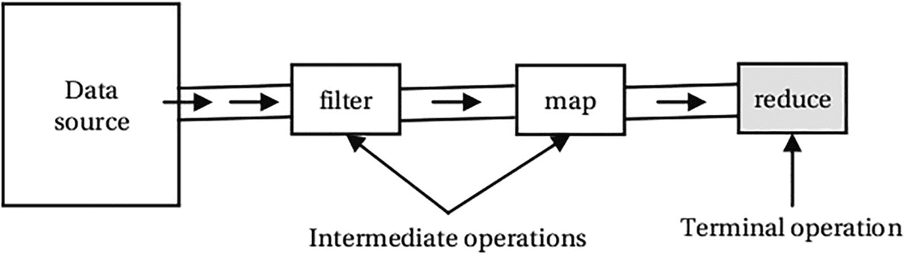
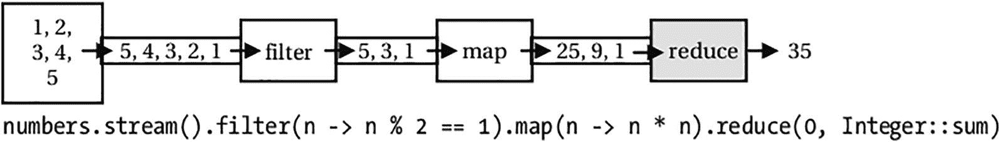
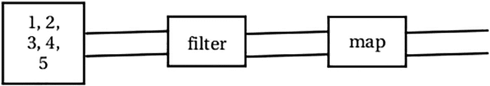
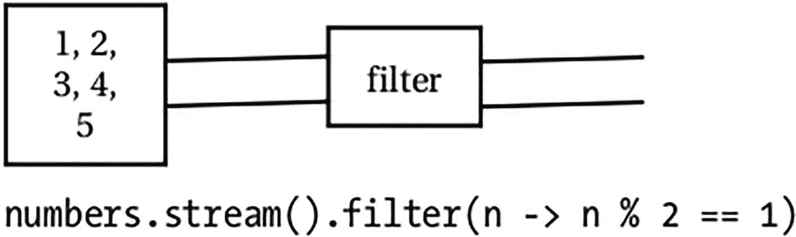
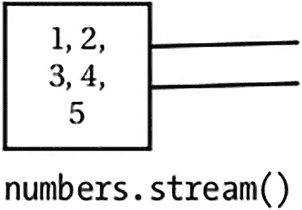
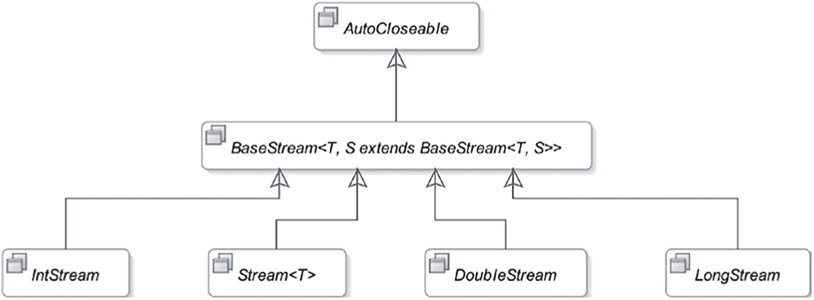
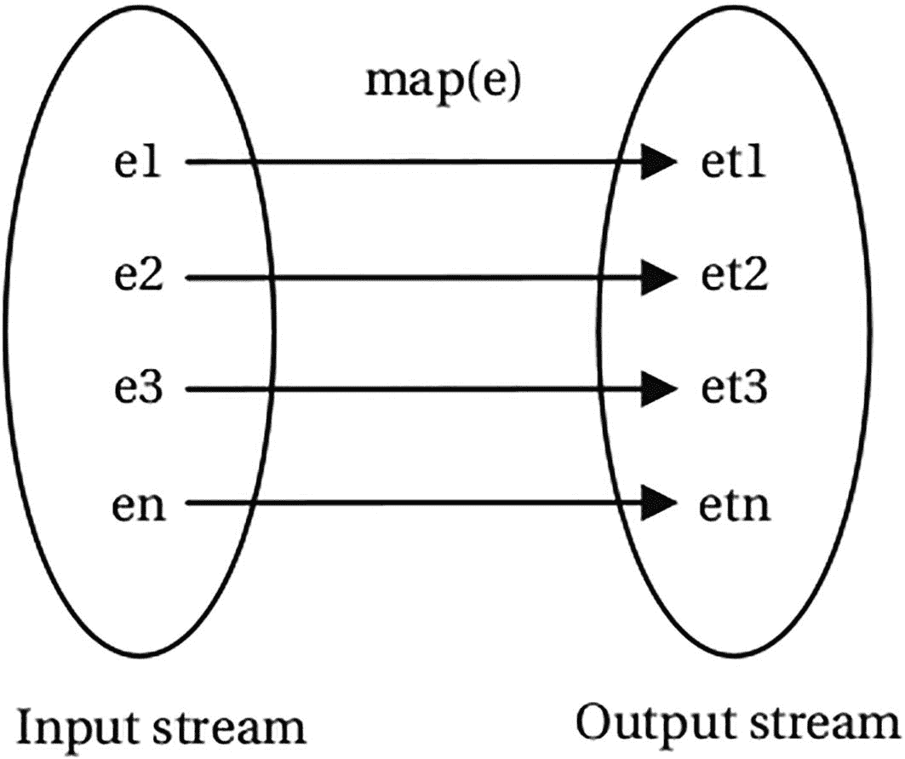
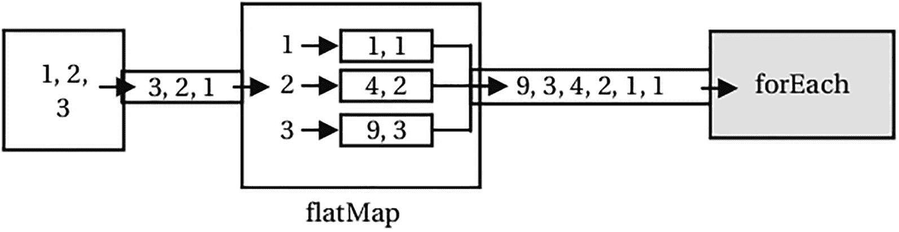
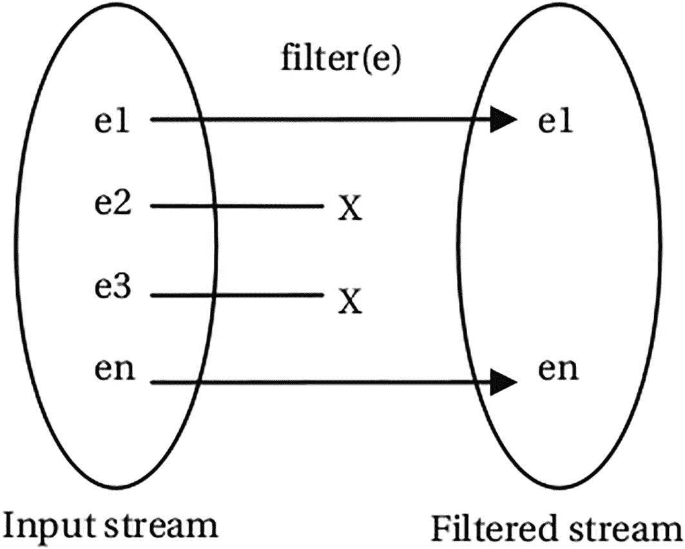
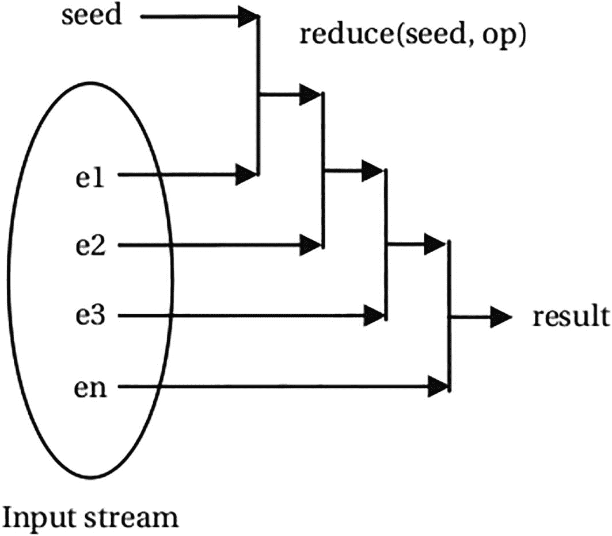

# 六、流

在本章中，您将学习:

*   什么是流

*   集合和流之间的差异

*   如何从不同类型的数据源创建流

*   如何使用`Optional`类表示可选值

*   对流应用不同类型的操作

*   使用收集器从流中收集数据

*   对流的数据进行分组和分区

*   在流中查找和匹配数据

*   如何使用并行流

本章中的所有示例程序都是清单 [6-1](#PC1) 中声明的`jdojo.streams`模块的成员。

```java
// module-info.java
module jdojo.streams {
    exports com.jdojo.streams;
}

Listing 6-1The Declaration of a jdojo.streams Module

```

## 什么是流？

聚合运算从值的集合中计算出单个值。聚合操作的结果可能只是一个原始值、一个对象或一个`void`。注意，对象可以表示单个实体，例如人，或者值的集合，例如列表、集合、地图等。

流是支持顺序和并行聚合操作的数据元素序列。计算整数流中所有元素的总和，将列表中的所有名称映射到它们的长度，等等。是对流进行聚合操作的例子。

看流的定义，好像是集合一样。那么，流和集合有什么不同呢？两者都是数据元素集合的抽象。集合关注数据元素的存储以实现高效访问，而流关注来自数据源的数据元素的聚合计算，数据源通常是集合，但不一定是集合。

在本节中，我将讨论流的以下特性，并在必要时将它们与集合进行比较:

*   流没有储存空间。

*   流可以表示无限元素的序列。

*   流的设计基于内部迭代。

*   流被设计为并行处理，不需要开发人员做额外的工作。

*   流被设计成支持函数式编程。

*   流支持惰性操作。

*   流可以是有序的，也可以是无序的。

*   不能重用流。

接下来的部分展示了使用流的简短代码片段。该代码旨在让您对 Streams API 有所了解，并将 Streams API 与 Collections API 进行比较。此时，您不需要完全理解代码。我稍后会详细解释。

### 流没有储存空间

集合是存储其所有元素的内存数据结构。所有元素在添加到集合之前都必须存在于内存中。流没有存储；它不存储元素。流按需从数据源提取元素，并将它们传递给操作管道进行处理。

### 无限的流

集合不能表示一组无限的元素，而流可以。集合将其所有元素存储在内存中，因此集合中不可能有无限数量的元素。拥有无限数量元素的集合将需要无限数量的内存，并且存储过程将永远持续下去。流从数据源中提取元素，数据源可以是集合、生成数据的函数、I/O 通道等。因为函数可以生成无限数量的元素，而流可以按需从中提取数据，所以流可以表示一系列无限的数据元素。

### 内部迭代与外部迭代

集合基于外部迭代。您为一个集合获取一个迭代器，并使用迭代器连续处理集合中的元素。假设你有一个从`1`到`5`的整数列表。您可以计算列表中所有奇数的平方和，如下所示:

```java
List<Integer> numbers = List.of(1, 2, 3, 4, 5);
int sum = 0;
for (int n : numbers) {
    if (n % 2 == 1) {
        int square = n * n;
        sum = sum + square;
    }
}

```

此示例使用 for-each 循环对整数列表执行外部迭代。简单地说，客户端代码(本例中的 for 循环)从集合中提取元素，并应用逻辑来获得结果。考虑下面的代码片段，它使用流来计算同一列表中所有奇数的平方和:

```java
int sum = numbers.stream()
                 .filter(n -> n % 2 == 1)
                 .map(n -> n * n)
                 .reduce(0, Integer::sum);

```

你注意到流的力量和简单了吗？你用一句话代替了五句话。然而，代码简洁并不是我想说的重点。重点是，当您使用流时，没有迭代列表中的元素。流在内部为你做了那件事。这就是我所说的由流支持的内部迭代。通过向流传递一个使用 lambda 表达式的算法，向流指定您想要的内容，流通过内部迭代其元素将您的算法应用于其数据元素，并向您提供结果。

通常，使用外部迭代会产生顺序代码；也就是说，代码只能由一个线程执行。例如，当您编写使用 for-each 循环计算总和的逻辑时，该循环必须仅由一个线程执行。所有现代计算机都配有多核处理器。利用多核处理器并行执行逻辑不是很好吗？Java 库提供了一个 fork/join 框架，可以递归地将一个任务分成子任务，并利用多核处理器并行执行这些子任务。然而，fork/join 框架使用起来并不那么简单，尤其是对于初学者。

小溪来救你了！它们被设计成并行处理它们的元素，而你甚至不会注意到它！这并不意味着流会自动决定何时串行或并行处理它们的元素。你只需要告诉一个流你想使用并行处理，流会处理剩下的事情。流负责内部使用 fork/join 框架的细节。您可以并行计算列表中奇数整数的平方和，如下所示:

```java
int sum = numbers.parallelStream()
                 .filter(n -> n % 2 == 1)
                 .map(n -> n * n)
                 .reduce(0, Integer::sum);

```

您所要做的就是用`parallelStream()`替换名为`stream()`的方法。Streams API 使用多线程来过滤奇数整数，计算它们的平方，并将它们相加以计算部分和。最后，它将部分和相加，给出结果。在这个例子中，列表中只有五个元素，使用多线程来处理它们是多余的。你不会对如此琐碎的计算使用并行处理。我举这个例子是为了说明使用流来并行化计算是免费的；你只需要使用不同的方法名就可以得到它！第二点是，并行化计算之所以成为可能，是因为流提供了内部迭代。

流被设计成使用内部迭代。它们提供了一个`iterator()`方法，返回一个迭代器，用于元素的外部迭代。您将“永远”不需要自己使用迭代器来迭代流中的元素。如果你需要它，以下是使用方法:

```java
// Get a list of integers from 1 to 5
List<Integer> numbers = List.of(1, 2, 3, 4, 5);
...
// Get an iterator from the stream
Iterator<Integer> iterator = numbers.stream().iterator();

// That's not normally the way you'd use streams!
while(iterator.hasNext()) {
    int n = iterator.next();
    ...
}

```

### 命令式与功能式

集合支持命令式编程，而流支持声明式编程。这是支持外部迭代的集合的一个分支，而流支持内部迭代。当你使用收藏时，你需要知道“你想要什么”和“如何”得到它；这就是命令式编程的特点。当您使用流时，您只指定流操作中您想要的“什么”;“如何”部分由 Streams API 负责。Streams API 支持函数式编程。流上的操作在不修改数据源的情况下产生结果。像在函数式编程中一样，当您使用 streams 时，您可以使用 Streams API 提供的内置方法来指定要对其元素执行“什么”操作，通常是通过向这些方法传递一个 lambda 表达式，自定义这些操作的行为。

### 流操作

流支持两种类型的操作:

*   中间操作

*   终端操作

中间操作也称为惰性操作。终端操作也称为急切操作。根据从数据源提取数据元素的方式，操作被称为懒惰和急切操作。在流上调用另一个急切操作之前，流上的惰性操作不会处理流的元素。

流通过一系列操作连接在一起，形成一个流管道。一个流本质上是懒惰的，直到你对它调用一个终端操作。对一个流的中间操作产生另一个流。当您在流上调用终端操作时，将从数据源中提取元素并通过流管道传递。每个中间操作从输入流中提取元素，并转换这些元素以产生输出流。终端操作从流中获取输入并产生结果。图 [6-1](#Fig1) 显示了一个流管道，有一个数据源、三个流和三个操作。过滤和映射操作是中间操作，而归约操作是终止操作。



图 6-1

流管道

在图中，第一个流(在左边)从数据源提取数据，并成为过滤操作的输入源。过滤操作产生另一个包含过滤条件为真的数据的流。过滤操作产生的流成为映射操作的输入。映射操作产生另一个包含映射数据的流。映射操作产生的流成为归约操作的输入。归约操作是终止操作。它计算并返回结果，然后流处理结束。

Note

我在前面的讨论中使用了短语“流从它的数据源中提取/消费元素”。这并不意味着流从数据源中移除元素；它只读取它们。流被设计为支持函数式编程，在函数式编程中，数据元素被读取，并且对读取的数据元素的操作产生新的数据元素。然而，数据元素没有被修改(或者至少不应该被修改)。

直到终端操作被调用，流处理才开始。如果您只是在一个流上调用中间操作，没有什么令人兴奋的事情发生，除了它们在内存中创建另一个对象流，而不从数据源读取数据。这意味着您必须在流上使用终端操作来处理数据以产生结果。这也是终端操作被称为结果承载操作，中间操作也被称为非结果承载操作的原因。

您看到了下面的代码，它使用流操作的管道来计算从`1`到`5`的奇数整数的平方和:

```java
List<Integer> numbers = List.of(1, 2, 3, 4, 5);
int sum = numbers.stream()
                 .filter(n -> n % 2 == 1)
                 .map(n -> n * n)
                 .reduce(0, Integer::sum);

```

图 [6-2](#Fig2) 至 [6-5](#Fig5) 显示了添加操作时的流水线状态。请注意，在调用 reduce 操作之前，没有数据流经该流。最后一张图显示了操作的输入流中的整数以及操作产生的映射(或转换)整数。`reduce`终端操作产生结果`35`。



图 6-5

调用 reduce 操作后的流管道



图 6-4

调用映射操作后的流管道



图 6-3

调用过滤操作后的流管道



图 6-2

创建流对象后的流管道

### 有序流

流可以是有序的，也可以是无序的。有序流保持其元素的顺序。Streams API 允许您将有序流转换为无序流。流可以是有序的，因为它表示有序的数据源，如列表或排序集。您还可以通过应用中间操作(如排序)将无序流转换为有序流。

如果迭代器遍历元素的顺序是可预测且有意义的，那么就说数据源具有相遇顺序。例如，数组和列表的相遇顺序总是从索引`0`处的元素到最后一个索引处的元素。所有有序数据源的元素都有一个相遇顺序。基于具有相遇顺序的数据源的流对于它们的元素也具有相遇顺序。有时，一个流操作可能会在一个原本无序的流上强加一个相遇顺序。例如，`HashSet`的元素没有相遇顺序。但是，在基于`HashSet`的流上应用排序操作会强加一个相遇顺序，因此元素是按照排序后的顺序产生的。

### 流是不可重用的

与集合不同，流是不可重用的。它们是一次性对象。在对流调用终端操作后，不能重用流。如果需要对来自同一数据源的相同元素再次执行计算，则必须重新创建流管道。如果检测到流正在被重用，流实现可能会抛出一个`IllegalStateException`。

### Streams API 的架构

图 6-6 显示了流相关接口的类图。与流相关的接口和类在`java.util.stream`包中。



图 6-6

Streams API 中流相关接口的类图

所有流接口都继承自`BaseStream`接口，该接口继承自`java.lang`包的`AutoCloseable`接口。实际上，大多数流使用集合作为它们的数据源，集合不需要关闭。当流基于可关闭的数据源(如文件 I/O 通道)时，您可以使用 try-with-resources 语句创建流的实例，使其自动关闭。所有类型的流共有的方法在`BaseStream`接口中声明如下:

*   `Iterator<T> iterator()`:返回流的迭代器。您几乎不需要在代码中使用这个方法。这是一个终端操作。调用此方法后，不能在流上调用任何其他方法。

*   `S sequential()`:返回一个顺序流。如果流已经是连续的，它将返回自身。使用此方法将并行流转换为顺序流。这是一个中间操作。

*   `S parallel()`:返回并行流。如果流已经是并行的，它将返回自身。使用此方法将并行流转换为顺序流。这是一个中间操作。

*   `boolean isParallel()`:如果流是平行的，返回`true`，否则返回`false`。在调用终端流操作方法后调用此方法时，结果是不可预测的。

*   `S unordered()`:返回一个无序版本的流。如果流已经是无序的，它返回自己。这是一个中间操作。

*   关闭流。您不需要关闭基于集合的流。在封闭流上操作抛出一个`IllegalState-Exception`。

*   `S onClose(Runnable closeHandler)`:它返回一个等价的流，带有一个额外的关闭处理程序。关闭处理程序在流上调用`close()`方法时运行，并按添加顺序执行。

`Stream<T>`接口表示元素类型`T`的流；例如，`Stream<Person>`代表一串`Person`对象。该接口包含表示中间和终端操作的方法，如`filter()`、`map()`、`reduce()`、`collect()`、`max()`、`min()`等。当您处理流时，大多数时候会用到这些方法。我很快会详细讨论每种方法。

注意，`Stream<T>`接口接受一个类型参数`T`，这意味着您只能使用它来处理引用类型的元素。如果你必须使用原始类型的流，比如`int`、`long`等等。，当需要原始值时，使用`Stream<T>`会导致装箱和拆箱元素的额外开销。例如，添加一个`Stream<Integer>`的所有元素将需要取消所有`Integer`元素到 int 的装箱。Streams API 的设计者意识到了这一点，他们提供了三个专门的流接口，称为`IntStream`、`LongStream`和`DoubleStream`来处理原语；这些接口包含处理原始值的方法。请注意，您没有表示其他原语类型的流接口，例如`float`、`short`等。因为这三种流类型可用于处理其他原始类型值。

## 一个简单的例子

让我们看一个使用流的简单例子。该代码读取一个整数列表，并计算列表中所有奇数的平方和。

`Collection`接口中的`stream()`方法返回一个顺序流，其中`Collection`充当数据源。下面的代码片段创建了一个`List<Integer>`并从列表中获得了一个`Stream<Integer>`:

```java
// Get a list of integers from 1 to 5
List<Integer> numbersList = List.of(1, 2, 3, 4, 5);
// Get a stream from the list
Stream<Integer> numbersStream = numbersList.stream();

```

`Stream<T>`接口的`filter()`方法将一个`Predicate<? super T>`作为参数，并返回一个`Stream<T>`，其中包含指定的`Predicate`返回`true`的原始流的元素。下面的语句只获取奇数整数的流:

```java
// Get a stream of odd integers
Stream<Integer> oddNumbersStream =
    numbersStream.filter(n -> n % 2 == 1);

```

注意使用 lambda 表达式作为`filter()`方法的参数。如果流中的元素不能被`2`整除，lambda 表达式返回`true`。

`Stream<T>`接口的`map()`方法以`Function<? super T,? extends R>`作为参数。流中的每个元素都被传递给这个`Function`，并生成一个新的流，其中包含来自`Function`的返回值。以下语句将所有奇数整数映射到它们的平方:

```java
// Get a stream of the squares of odd integers
Stream<Integer> squaredNumbersStream =
    oddNumbersStream.map(n -> n * n);

```

最后，你需要将所有奇数的平方相加来得到结果。`Stream<T>`接口的`reduce(T identity, BinaryOperator<T> accumulator)`方法对流执行归约操作，将流归约为单个值。它接受一个初始值和一个累加器(T2)作为参数。第一次，累加器接收初始值和流的第一个元素作为参数，并返回值。第二次，累加器接收从上一次调用返回的值和流中的第二个元素。这个过程一直持续到流的所有元素都被传递到累加器。累加器最后一次调用的返回值是从`reduce()`方法返回的。以下代码片段执行流中所有整数的求和:

```java
// Sum all integers in the stream
int sum = squaredNumbersStream.
    reduce(0, (n1, n2) -> n1 + n2);

```

`Integer`类包含一个静态的`sum()`方法来执行两个整数的求和。您可以使用方法引用重写前面的语句，如下所示:

```java
// Sum all integers in the stream
int sum = squaredNumbersStream.
    reduce(0, Integer::sum);

```

在这个例子中，我将流上的每个操作分解成一条语句。您不能使用从中间操作返回的流，除非对它们应用其他操作。通常，您关心终端操作的结果，而不是中间流。流被设计成支持方法链以避免临时变量，您在这个例子中使用了临时变量。您可以将这些语句组合成一条语句，如下所示:

```java
// Sum the squares of all odd integers in the numbers list
int sum = numbersList.stream()
                     .filter(n -> n % 2 == 1)
                     .map(n -> n * n)
                     .reduce(0, Integer::sum);

```

在后面的例子中，我将流上的所有方法调用链接起来，只形成一个语句。清单 [6-2](#PC13) 包含了这个例子的完整程序。请注意，在这个示例中，您只处理整数。为了获得更好的性能，您可以在本例中使用`IntStream`。稍后我会告诉你如何使用一个`IntStream`。

```java
// SquaredIntsSum.java
package com.jdojo.streams;
import java.util.List;
public class SquaredIntsSum {
    public static void main(String[] args) {
        // Get a list of integers from 1 to 5
        List<Integer> numbers = List.of(1, 2, 3, 4, 5);
        // Compute the sum of the squares of all odd
        // integers in the list
        int sum = numbers.stream()
                         .filter(n -> n % 2 == 1)
                         .map(n -> n * n)
                         .reduce(0, Integer::sum);
        System.out.println("Sum = " + sum);
    }
}

Sum = 35

Listing 6-2Computing the Sum of the Squares of All Odd Integers from 1 to 5

```

我展示了许多在不同类型的流上执行聚合操作的例子。大多数时候，使用数字流和字符串流更容易解释流操作。我通过使用一个`Person`对象流展示了一些使用流的真实例子。清单 [6-3](#PC14) 包含了对`Person`类的声明。

```java
// Person.java
package com.jdojo.streams;
import java.time.LocalDate;
import java.time.Month;
import java.util.List;
public class Person {
    // An enum to represent the gender of a person
    public static enum Gender {
        MALE, FEMALE
    }
    private long id;
    private String name;
    private Gender gender;
    private LocalDate dob;
    private double income;

    public Person(long id, String name, Gender gender,
          LocalDate dob, double income) {
        this.id = id;
        this.name = name;
        this.gender = gender;
        this.dob = dob;
        this.income = income;
    }
    public long getId() {
        return id;
    }
    public void setId(long id) {
        this.id = id;
    }
    public String getName() {
        return name;
    }
    public void setName(String name) {
        this.name = name;
    }
    public Gender getGender() {
        return gender;
    }
    public boolean isMale() {
        return this.gender == Gender.MALE;
    }

    public boolean isFemale() {
        return this.gender == Gender.FEMALE;
    }
    public void setGender(Gender gender) {
        this.gender = gender;
    }
    public LocalDate getDob() {
        return dob;
    }
    public void setDob(LocalDate dob) {
        this.dob = dob;
    }
    public double getIncome() {
        return income;
    }
    public void setIncome(double income) {
        this.income = income;
    }
    public static List<Person> persons() {
        Person ken = new Person(1, "Ken",
                Gender.MALE,
                LocalDate.of(
                  1970, Month.MAY, 4), 6000.0);
        Person jeff = new Person(2, "Jeff",
                Gender.MALE,
                LocalDate.of(
                  1970, Month.JULY, 15), 7100.0);
        Person donna = new Person(3, "Donna",
                Gender.FEMALE,
                LocalDate.of(
                  1962, Month.JULY, 29), 8700.0);
        Person chris = new Person(4, "Chris",
                Gender.MALE,
                LocalDate.of(
                  1993, Month.DECEMBER, 16), 1800.0);
        Person laynie = new Person(5, "Laynie",
                Gender.FEMALE,
                LocalDate.of(
                  2012, Month.DECEMBER, 13), 0.0);
        Person lee = new Person(6, "Li",
                Gender.MALE,
                LocalDate.of(
                  2001, Month.MAY, 9), 2400.0);
        // Create a list of persons
        List<Person> persons = List.of(
            ken, jeff, donna, chris, laynie, lee);
        return persons;
    }
    @Override
    public String toString() {
        String str = String.format(
                "(%s, %s, %s, %s, %.2f)",
                id, name, gender, dob, income);
        return str;
    }
}

Listing 6-3A Person Class

```

`Person`类包含一个静态的`Gender`枚举来表示一个人的性别。该类声明了五个实例变量(`id`、`name`、`gender`、`dob`和`income`)、getters 和 setters。`isMale()`和`isFemale()`方法已经被声明用作 lambda 表达式中的方法引用。您将经常使用人员列表，为此，该类包含一个名为`persons()`的静态方法来获取人员列表。

## 创建流

创建流的方法有很多种。Java 库中的许多现有类都接收了返回流的新方法。根据数据源，流创建可以分类如下:

*   来自值的流

*   空流

*   来自函数的流

*   来自数组的流

*   集合中的流

*   来自文件的流

*   来自其他来源的流

### 来自值的流

Stream 接口包含以下三个静态方法，用于从单个值和多个值创建顺序的`Stream`:

*   `<T> Stream<T> of(T t)`

*   `<T> Stream<T> of(T...values)`

*   `<T> Stream<T> ofNullable(T t)`

以下代码片段创建了两个流:

```java
// Creates a stream with one string element
Stream<String> stream = Stream.of("Hello");
// Creates a stream with four string elements
Stream<String> stream = Stream.of(
    "Ken", "Jeff", "Chris", "Ellen");

```

如果指定的值为非空，则`ofNullable()`方法返回一个具有单个值的流。否则，它返回一个空流:

```java
String str = "Hello";
// Stream s1 will have one element "Hello"
Stream<String> s1 = Stream.ofNullable(str);
str = null;
// Stream s2 is an empty stream because str is null
Stream<String> s2 = Stream.ofNullable(str);

```

您创建了一个`List<Integer>`并调用它的`stream()`方法来获得清单 [6-2](#PC13) 中的流对象。您可以使用`Stream.of()`方法重写该示例，如下所示:

```java
import java.util.stream.Stream;
...
// Compute the sum of the squares of all odd integers in
// the list
int sum = Stream.of(1, 2, 3, 4, 5)
                .filter(n -> n % 2 == 1)
                .map(n -> n * n)
                .reduce(0, Integer::sum);
System.out.println("Sum = " + sum);

Sum = 35

```

注意，`of()`方法的第二个版本采用了一个`varargs`参数，您也可以用它从一个对象数组中创建一个流。下面的代码片段从一个`String`数组创建一个流:

```java
String[] names  = {"Ken", "Jeff", "Chris", "Ellen"};
// Creates a stream of four strings in the names array
Stream<String> stream = Stream.of(names);

```

Note

方法创建了一个元素是引用类型的流。如果您想从一个原始类型数组中创建一个原始值流，您需要使用`Arrays.stream()`方法，我将很快对此进行解释。

下面的代码片段从一个从`String`类的`split()`方法返回的`String`数组中创建一个字符串流:

```java
String str  = "Ken,Jeff,Chris,Ellen";
// The stream will contain 4 elements:
// "Ken", "Jeff", "Chris", and "Ellen"
Stream<String> stream = Stream.of(str.split(","));

```

`Stream`接口还支持使用 builder 模式创建流，使用的是`Stream.Builder<T>`接口，它的实例代表一个流构建器。`Stream`接口的`builder()`静态方法返回一个流构建器:

```java
// Gets a stream builder
Stream.Builder<String> builder = Stream.builder();

```

`Stream.Builder<T>`接口包含以下方法:

*   `void accept(T t)`

*   `Stream.Builder<T> add(T t)`

*   `Stream<T> build()`

`accept()`和`add()`方法向正在构建的流中添加元素。您可能想知道生成器中是否存在两种添加元素的方法。`Stream.Builder<T>`接口继承自`Consumer<T>`接口，因此它继承了`Consumer<T>`接口的`accept()`方法。您可以将构建器的实例传递给接受消费者的方法，该方法可以使用`accept()`方法向构建器添加元素。

`add()`方法返回对构建器的引用，这使得它适合使用方法链接添加多个元素。添加完元素后，调用`build()`方法来创建流。调用`build()`方法后，不能向流中添加元素；这样做会导致`IllegalStateException`运行时异常。下面的代码片段使用 builder 模式创建一个包含四个字符串的流:

```java
Stream<String> stream = Stream.<String>builder()
    .add("Ken")
    .add("Jeff")
    .add("Chris")
    .add("Ellen")
.build();

```

注意，代码在获取构建器`Stream.<String>builder()`时将类型参数指定为`String`。如果不指定类型参数，编译器将无法推断出它。如果单独获取构建器，编译器会将类型推断为`String`，如下图:

```java
// Obtain a builder
Stream.Builder<String> builder = Stream.builder();
// Add elements and build the stream
Stream<String> stream = builder.add("Ken")
    .add("Jeff")
    .add("Chris")
    .add("Ellen")
.build();

```

`IntStream`接口包含四个静态方法，允许您从值创建`IntStream`:

*   `IntStream of(int value)`

*   `IntStream of(int... values)`

*   `IntStream range(int start, int end)`

*   `IntStream rangeClosed(int start, int end)`

`of()`方法允许您通过指定单个值来创建一个`IntStream`。`range()`和`rangeClosed()`方法产生一个`IntStream`，其中包含指定开始和结束位置之间的有序整数。指定的结束在`range()`方法中是独占的，而在`rangeClosed()`方法中是包含的。以下代码片段使用这两种方法创建一个`IntStream`，其元素为整数`1`、`2`、`3`、`4`和`5`:

```java
// Create an IntStream containing 1, 2, 3, 4, and 5
IntStream oneToFive = IntStream.range(1, 6);
// Create an IntStream containing 1, 2, 3, 4, and 5
IntStream oneToFive = IntStream.rangeClosed(1, 5);

```

`LongStream`接口还包含`range()`和`rangeClosed()`方法，它们接受`long`类型的参数并返回一个`LongStream`。`LongStream`和`DoubleStream`接口还包含`of()`方法，这些方法使用`long`和`double`值，并分别返回一个`LongStream`和一个`DoubleStream`。

### 空流

空流是没有元素的流。`Stream`接口包含一个`empty()`静态方法来创建一个空的顺序流:

```java
// Creates an empty stream of strings
Stream<String> stream = Stream.empty();

```

`IntStream`、`LongStream`和`DoubleStream`接口还包含一个`empty()`静态方法来创建一个原始类型的空流。这里有一个例子:

```java
// Creates an empty stream of integers
IntStream numbers = IntStream.empty();

```

### 来自函数的流

无限流是具有能够生成无限数量元素的数据源的流。请注意，我说的是数据源应该“能够生成”无限数量的元素，而不是数据源应该拥有或包含无限数量的元素。由于内存和时间的限制，不可能存储无限数量的任何类型的元素。但是，有一个函数可以根据需要生成无限多的值。`Stream`接口包含以下两个静态方法来生成无限流:

*   `<T> Stream<T> iterate(T seed, Predicate<? super T> hasNext, Unary-Operator<T> next)`

*   `<T> Stream<T> iterate(T seed, UnaryOperator<T> f)`

*   `<T> Stream<T> generate(Supplier<? extends T> s)`

`iterate()`方法创建顺序有序的流，而`generate()`方法创建顺序无序的流。以下部分向您展示了如何使用这些方法。

原始值`IntStream`、`LongStream`和`DoubleStream`的流接口还包含`iterate()`和`generate()`静态方法，它们接受特定于其原始类型的参数。例如，这些方法在`IntStream`界面中定义如下:

*   `static IntStream iterate(int seed, IntPredicate hasNext, IntUnaryOperator next)`

*   `IntStream iterate(int seed, IntUnaryOperator f)`

*   `IntStream generate(IntSupplier s)`

第一个版本的`iterate()`方法声明如下:

```java
static <T> Stream<T> iterate(
    T seed,
    Predicate<? super T> hasNext,
    UnaryOperator<T> next)

```

该方法有三个参数:种子、谓词和函数。只要`hasNext`谓词是`true`，它就通过迭代应用`next`函数来产生元素。`seed`参数是初始元素。调用此方法类似于使用 for 循环，如下所示:

```java
for (int index = seed;
       hasNext.test(index);
       index = next.applyAsInt(index)) {
    // index is the next element in the stream
}

```

下面的代码片段产生一个从`1`到`10`的整数流:

```java
Stream<Integer> nums =
    Stream.iterate(1, n -> n <= 10, n -> n + 1);

```

第二个版本的`iterate()`方法声明如下:

```java
static <T> Stream<T> iterate(T seed, UnaryOperator<T> f)

```

该方法有两个参数:一个种子和一个函数。第一个参数是种子，它是流的第一个元素。通过将该函数应用于第一元素来生成第二元素。第三个元素是通过对第二个元素应用函数而生成的，依此类推。它的元素有`seed`、`f(seed)`、`f(f(seed))`、`f(f(f(seed)))`等等。以下语句创建自然数的无限流和所有奇数自然数的无限流:

```java
// Creates a stream of natural numbers
Stream<Long> naturalNumbers =
    Stream.iterate(1L, n -> n + 1);
// Creates a stream of odd natural numbers
Stream<Long> oddNaturalNumbers =
    Stream.iterate(1L, n -> n + 2);

```

你用无限流做什么？你明白不可能消耗一个无限流的所有元素。这只是因为流处理将永远无法完成。通常，通过应用将输入流截断为不超过指定大小的限制操作，可以将无限流转换为固定大小的流。极限操作是产生另一个流的中间操作。您使用`Stream`接口的`limit(long maxSize)`方法应用限制操作。下面的代码片段创建了第一个`10`自然数的流:

```java
// Creates a stream of the first 10 natural numbers
Stream<Long> tenNaturalNumbers =
    Stream.iterate(1L, n -> n + 1).
    limit(10);

```

您可以使用`Stream`接口的`forEach(Consumer<? super T> action)`方法在流上应用`forEach`操作。该方法返回`void`。

这是一个终端操作。以下代码片段在标准输出中打印前五个奇数自然数:

```java
Stream.iterate(1L, n -> n + 2)
      .limit(5)
      .forEach(System.out::println);

1
3
5
7
9

```

让我们看一个创建素数无限流的现实例子。清单 [6-4](#PC33) 包含一个名为`PrimeUtil`的实用程序类。该类包含两个实用工具方法。`next()`实例方法返回最后找到的质数之后的下一个质数。`next(long after)`静态方法返回指定数字后的质数。静态方法检查一个数是否是质数。

```java
// PrimeUtil.java
package com.jdojo.streams;
public class PrimeUtil {
    // Used for a stateful PrimeUtil
    private long lastPrime = 0L;
    // Computes the prime number after the last generated
    // prime
    public long next() {
        lastPrime = next(lastPrime);
        return lastPrime;
    }

    // Computes the prime number after the specified
    // number
    public static long next(long after) {
        long counter = after;
        // Keep looping until you find the next prime
        // number
        while (!isPrime(++counter));
        return counter;
    }
    // Checks if the specified number is a prime number
    public static boolean isPrime(long number) {
        // <= 1 is not a prime number
        if (number <= 1) {
            return false;
        }
        // 2 is a prime number
        if (number == 2) {
            return true;
        }
        // Even numbers > 2 are not prime numbers
        if (number % 2 == 0) {
            return false;
        }

        long maxDivisor = (long) Math.sqrt(number);
        for (int counter = 3;
              counter <= maxDivisor;
              counter += 2) {
            if (number % counter == 0) {
                return false;
            }
        }
        return true;
    }
}

Listing 6-4A Utility Class to Work with Prime Numbers

```

下面的代码片段创建了一个素数的无限流，并在标准输出中打印出前五个素数:

```java
Stream.iterate(2L, PrimeUtil::next)
      .limit(5)
      .forEach(System.out::println);

2
3
5
7
11

```

还有一种方法可以得到前五个素数。您可以生成一个无限的自然数流，应用过滤操作只挑选质数，并将过滤后的流限制为五个。下面的代码片段显示了使用`PrimeUtil`类的`isPrime()`方法的逻辑:

```java
// Print the first 5 prime numbers
Stream.iterate(2L, n -> n + 1)
      .filter(PrimeUtil::isPrime)
      .limit(5)
      .forEach(System.out::println);

2
3
5
7
11

```

有时，您可能想要丢弃流中的一些元素。这是使用`skip`操作完成的。`Stream`接口的`skip(long n)`方法丢弃(或跳过)流的第一个`n`元素。这是一个中间操作。下面的代码片段使用这个操作打印五个质数，跳过第一个`100`质数:

```java
Stream.iterate(2L, PrimeUtil::next)
      .skip(100)
      .limit(5)
      .forEach(System.out::println);

547
557
563
569
571

```

利用你所学的关于流的一切，你能写一个流管道来打印五个大于`3000`的质数吗？这是留给读者的一个练习。

`generate(Supplier<? extends T> s)`方法使用指定的`Supplier`生成一个无限的顺序无序流。下面的代码片段使用`Math`类的`random()`静态方法打印了五个大于或等于`0.0`且小于`1.0`的随机数。您可能会得到不同的输出:

```java
Stream.generate(Math::random)
      .limit(5)
      .forEach(System.out::println);

0.05958352209327644
0.8122226657626394
0.5073323815997652
0.9327951597282766
0.4314430923877808

```

如果您想使用`generate()`方法生成一个无限流，其中下一个元素是基于前一个元素的值生成的，那么您需要使用一个`Supplier`来存储最后生成的元素。注意，`PrimeUtil`对象可以充当`Supplier`，它的`next()`实例方法会记住最后生成的质数。下面的代码片段在跳过第一个`100`后打印出五个质数:

```java
Stream.generate(new PrimeUtil()::next)
      .skip(100)
      .limit(5)
      .forEach(System.out::println);

547
557
563
569
571

```

`java.util`包中的`Random`类包含专门定制的方法来处理流。所以我们有像`ints()`、`longs()`和`doubles()`这样的方法，它们分别返回无限的`IntStream`、`LongStream`和`DoubleStream`，其中包含`int`、`long`和`double`类型的随机数。以下代码片段打印了从`Random`类的`ints()`方法返回的`IntStream`中的五个随机`int`值:

```java
// Print five random integers
new Random().ints()
            .limit(5)
            .forEach(System.out::println);

-1147567659
285663603
-412283607
412487893
-22795557

```

每次运行代码时，您可能会得到不同的输出。您可以使用`Random`类的`nextInt()`方法作为`generate()`方法中的`Supplier`来获得相同的结果:

```java
// Print five random integers
Stream.generate(new Random()::nextInt)
      .limit(5)
      .forEach(System.out::println);

```

如果您想只处理原始值，您可以使用原始类型流接口的`generate()`方法。例如，下面的代码片段使用`IntStream`接口的`generate()`静态方法打印五个随机整数:

```java
IntStream.generate(new Random()::nextInt)
         .limit(5)
         .forEach(System.out::println);

```

如何生成无限的重复值流？例如，你如何生成一个无限的零流？以下代码片段向您展示了如何做到这一点:

```java
IntStream zeroes = IntStream.generate(() -> 0);

```

### 来自数组的流

`java.util`包中的`Arrays`类包含一个重载的`stream()`静态方法，用于从数组创建顺序流。您可以使用它从`int`数组创建一个`IntStream`，从`long`数组创建一个`LongStream`，从`double`数组创建一个`DoubleStream`，从引用类型`T`的数组创建一个`Stream<T>`。以下代码片段从一个`int`数组和一个`String`数组创建了一个`IntStream`和一个`Stream<String>`:

```java
// Creates a stream from an int array with elements
// 1, 2, and 3
IntStream numbers = Arrays.stream(new int[]{1, 2, 3});
// Creates a stream from a String array with elements
// "Ken", and "Jeff"
Stream<String> names = Arrays.stream(
    new String[] {"Ken", "Jeff"});

```

Note

您可以使用两种方法从引用类型数组创建流:`Arrays.stream(T[] t)`和`Stream.of(T...t)`。在库中提供两个方法来完成同样的事情是有意的。

### 来自集合的流

`Collection`接口包含`stream()`和`parallelStream()`方法，分别从`Collection`创建顺序流和并行流。以下代码片段从一组字符串创建流:

```java
import java.util.HashSet;
import java.util.Set;
import java.util.stream.Stream;
...
// Create and populate a set of strings
Set<String> names = Set.of("Ken", "jeff");
// Create a sequential stream from the set
Stream<String> sequentialStream = names.stream();
// Create a parallel stream from the set
Stream<String> parallelStream = names.parallelStream();

```

### 来自文件的流

在`java.io`和`java.nio.file`包的类中有许多方法支持使用流的 I/O 操作。例如:

*   您可以将文件中的文本作为字符串流读取，其中每个元素代表文件中的一行文本。

*   你可以从一个`JarFile`获得一个`JarEntry`的流。

*   您可以获得一个目录中的条目列表，作为一个`Path`流。

*   您可以获得一个`Path`流，这是在指定目录中搜索文件的结果。

*   您可以获得一个包含指定目录的文件树的`Path`流。

在这一节中，我展示了一些将流用于文件 I/O 的例子。有关流相关方法的更多细节，请参考 API 文档中的`java.nio.file.Files`、`java.io.BufferedReader`和`java.util.jar.JarFile`类。

`BufferedReader`和`Files`类包含一个`lines()`方法，该方法缓慢地读取一个文件，并将内容作为字符串流返回。流中的每个元素代表文件中的一行文本。当您处理完该流时，需要关闭该文件。在流上调用`close()`方法将关闭底层文件。或者，您可以在 try-with-resources 语句中创建流，以便自动关闭基础文件。

清单 [6-5](#PC45) 中的程序展示了如何使用流读取文件内容。它还遍历当前工作目录的整个文件树，并打印目录中的条目。程序假设您在当前工作目录中有源代码提供的`luci1.txt`文件。如果该文件不存在，将打印一条错误消息，其中包含预期文件的绝对路径。运行该程序时，您可能会得到不同的输出。

```java
// IOStream.java
package com.jdojo.streams;

import java.io.IOException;
import java.nio.file.Files;
import java.nio.file.Path;
import java.nio.file.Paths;
import java.util.stream.Stream;

public class IOStream {
    public static void main(String[] args) {
        // Read the contents of the file luci1.txt
        readFileContents("luci1.txt");
        // Print the file tree for the current working
        // directory
        listFileTree();
    }
    public static void readFileContents(String filePath) {
        Path path = Paths.get(filePath);
        if (!Files.exists(path)) {
            System.out.println("The file "
                    + path.toAbsolutePath()
                    + " does not exist.");
            return;
        }
        try (Stream<String> lines = Files.lines(path)) {
            // Read and print all lines
            lines.forEach(System.out::println);
        } catch (IOException e) {
            e.printStackTrace();
        }
    }
    public static void listFileTree() {
        Path dir = Paths.get("");
        System.out.printf("%nThe file tree for %s%n",
            dir.toAbsolutePath());
        try (Stream<Path> fileTree = Files.walk(dir)) {
            fileTree.forEach(System.out::println);
        } catch (IOException e) {
            e.printStackTrace();
        }
    }
}

STRANGE fits of passion have I known:
And I will dare to tell,
But in the lover's ear alone,
What once to me befell.

The file tree for C:\Java9LanguageFeatures
build
build\modules
build\modules\com
build\modules\com\jdojo
...

Listing 6-5Performing File I/O Using Streams

```

### 来自其他来源的流

许多保存某种内容的类提供了返回它们在流中表示的数据的方法。下面解释两种您可能经常使用的方法:

*   `CharSequence`接口中的`chars()`方法返回一个`IntStream`，其元素是表示`CharSequence`字符的 int 值。您可以在`String`、`StringBuilder`和`StringBuffer`上使用`chars()`方法来获取它们内容的字符流，因为这些类实现了`CharSequence`接口。

*   `java.util.regex. Pattern`类的`splitAsStream(CharSequence input)`方法返回一个元素与模式匹配的`String`流。

让我们看一个这两类的例子。下面的代码片段从一个字符串创建一个字符流，过滤掉所有数字和空白，并打印剩余的字符:

```java
String str = "5 apples and 25 oranges";
str.chars()
   .filter(n -> !Character.isDigit((char)n)
                && !Character.isWhitespace((char)n))
   .forEach(n -> System.out.print((char)n));

applesandoranges

```

下面的代码片段通过使用正则表达式(“，”)拆分字符串来获取字符串流。匹配的字符串打印在标准输出中:

```java
String str = "Ken,Jeff,Lee";
Pattern.compile(",")
       .splitAsStream(str)
       .forEach(System.out::println);

Ken
Jeff
Lee

```

## 表示可选值

在 Java 中，`null`用来表示“无”或“空”结果。大多数情况下，如果一个方法没有结果要返回，它就会返回`null`。这是 Java 程序中经常出现`NullPointerException`的一个原因。考虑打印一个人的出生年份，如下所示:

```java
Person ken = new Person(1, "Ken", Person.Gender.MALE,
    null, 6000.0);
int year = ken.getDob().getYear();
// <- Throws a NullPointerException
System.out.println("Ken was born in the year " + year);

```

代码在运行时抛出一个`NullPointerException`。问题出在返回`null`的`ken.getDob()`方法的返回值上。在`null`引用上调用`getYear()`方法会导致`NullPointerException`。那么，解决办法是什么呢？事实上，除非你想用一种新的语言取代 Java，否则在语言层面上没有真正的解决方案。但是 Java 提供了一个库结构来帮助避免`NullPointerExceptions`。在`java.util`包中有一个`Optional<T>`类来优雅地处理`NullPointerExceptions`。可能不返回任何东西的方法应该返回一个`Optional`而不是`null`。

`Optional`是一个容器对象，可能包含也可能不包含非空值。如果它包含一个非空值，它的`isPresent()`方法返回`true`，否则返回`false`。它的`get()`方法如果包含非空值则返回非空值，否则抛出`NoSuchElementException`。这意味着当一个方法返回一个`Optional`时，作为一种实践，您必须在向它请求值之前检查它是否包含一个非空值。如果在确保包含非空值之前使用`get()`方法，可能会得到`NoSuchElementException`而不是`NullPointerException`。这就是为什么我在前一段说`NullPointerException`没有真正的解决方案。然而，返回一个`Optional`肯定是处理`null`的一个更好的方法，因为开发人员将习惯于按照设计的方式使用`Optional`对象。

如何创建一个`Optional<T>`对象？`Optional<T>`类提供了以下静态工厂方法来创建它的对象:

*   `<T> Optional<T> empty()`:返回一个空的`Optional`。也就是说，从该方法返回的`Optional`不包含非空值。

*   `<T> Optional<T> of(T value)`:返回一个包含指定值作为非空值的`Optional`。如果指定的值是`null`，它抛出一个`NullPointerException`。

*   `<T> Optional<T> ofNullable(T value)`:如果值为非空，则返回包含指定值的`Optional`。如果指定的值是`null`，则返回空的`Optional`。

以下代码片段显示了如何创建`Optional`对象:

```java
// Create an empty Optional
Optional<String> empty = Optional.empty();
// Create an Optional for the string "Hello"
Optional<String> str = Optional.of("Hello");
// Create an Optional with a String that may be null
String nullableString = "";
// <- get a string that may be null...
Optional<String> str2 = Optional.of(nullableString);

```

如果`Optional`中包含非空值，下面的代码片段将打印该值:

```java
// Create an Optional for the string "Hello"
Optional<String> str = Optional.of("Hello");
// Print the value in Optional
if (str.isPresent()) {
    String value = str.get();
    System.out.println("Optional contains " + value);
} else {
    System.out.println("Optional is empty.");
}

Optional contains Hello

```

您可以使用`Optional`类的`ifPresent(Consumer<? super T> action)`方法对包含在`Optional`中的值采取行动。如果`Optional`为空，这个方法不做任何事情。您可以重写前面的代码来打印一个`Optional`中的值，如下所示。注意，如果`Optional`为空，代码不会打印任何内容:

```java
// Create an Optional for the string "Hello"
Optional<String> str = Optional.of("Hello");
// Print the value in the Optional, if present
str.ifPresent(value ->
    System.out.println("Optional contains " + value));

Optional contains Hello

```

以下是获取`Optional`值的四种方法:

*   `T get()`:返回`Optional`中包含的值。如果`Optional`为空，它抛出一个`NoSuchElementException`。

*   `T orElse(T defaultValue)`:返回`Optional`中包含的值。如果`Optional`为空，则返回指定的`defaultValue`。

*   `T orElseGet(Supplier<? extends T> defaultSupplier)`:返回`Optional`中包含的值。如果`Optional`为空，则返回从指定的`defaultSupplier`返回的值。

*   `<X extends Throwable> T orElseThrow(Supplier<? extends X> exceptionSupplier) throws X extends Throwable`:返回`Optional`中包含的值。如果`Optional`为空，则抛出从指定的`exceptionSupplier`返回的异常。

`Optional<T>`类描述了一个非空的引用类型值或者它的缺失。`java.util`包包含另外三个名为`OptionalInt`、`OptionalLong`和`OptionalDouble`的类来处理可选的原始值。除了获取它们的值之外，它们包含应用于原始数据类型的类似命名的方法。它们不包含`get()`方法。为了返回它们的值，`OptionalInt`类包含一个`getAsInt()`,`OptionalLong`类包含一个`getAsLong()`,`OptionalDouble`类包含一个`getAsDouble()`方法。像`Optional`类的`get()`方法一样，原始可选类的 getters 也在它们为空时抛出一个`NoSuchElementException`。与`Optional`类不同，它们不包含`ofNullable()`工厂方法，因为原始值不能是`null`。以下代码片段显示了如何使用`OptionalInt`类:

```java
// Create an empty OptionalInt
OptionalInt empty = OptionalInt.empty();
// Use an OptionalInt to store 287
OptionalInt number = OptionalInt.of(287);
if (number.isPresent()){
    int value = number.getAsInt();
    System.out.println("Number is " + value);
} else {
    System.out.println("Number is absent.");
}

Number is 287

```

Streams API 中的几个方法在没有任何东西可返回时，会返回一个`Optional`、`OptionalInt`、`OptionalLong`和`OptionalDouble`的实例。例如，所有类型的流都允许您计算流中的最大元素。如果流为空，则没有最大元素。请注意，在流管道中，由于过滤或其他操作(如 limit、skip 等)，您可能以非空流开始，以空流结束。因此，所有流类中的`max()`方法都返回一个可选对象。清单 [6-6](#PC53) 中的程序展示了如何从`IntStream`中获取最大整数。

```java
// OptionalTest.java
package com.jdojo.streams;

import java.util.Comparator;
import java.util.Optional;
import java.util.OptionalInt;
import java.util.stream.IntStream;
import java.util.stream.Stream;

public class OptionalTest {
    public static void main(String[] args) {
        // Get the maximum of odd integers from the stream
        OptionalInt maxOdd = IntStream.of(10, 20, 30)
                                .filter(n -> n % 2 == 1)
                                .max();
        if (maxOdd.isPresent()) {
            int value = maxOdd.getAsInt();
            System.out.println("Maximum odd integer is " +
                value);
        } else {
            System.out.println("Stream is empty.");
        }

        // Get the maximum of odd integers from the stream
        OptionalInt numbers = IntStream.of(
                1, 10, 37, 20, 31)
            .filter(n -> n % 2 == 1)
            .max();
        if (numbers.isPresent()) {
            int value = numbers.getAsInt();
            System.out.println("Maximum odd integer is " +
                value);
        } else {
            System.out.println("Stream is empty.");
        }
        // Get the longest name
        Optional<String> name =
            Stream.of("Ken", "Ellen", "Li")
            .max(Comparator.comparingInt(String::length));
        if (name.isPresent()) {
            String longestName = name.get();
            System.out.println("Longest name is " +
                longestName);
        } else {
            System.out.println("Stream is empty.");
        }
    }
}

Stream is empty.
Maximum odd integer is 37
Longest name is Ellen

Listing 6-6Working

with Optional Values

```

此外，`Optional<T>`类包含以下方法:

*   `void ifPresentOrElse(Consumer<? super T> action, Runnable empty-Action)`

*   `Optional<T> or(Supplier<? extends Optional<? extends T» supplier)`

*   `Stream<T> stream()`

在我描述这些方法并给出一个完整的程序展示它们的用法之前，先考虑下面的一个`Optional<Integer>`列表:

```java
List<Optional<Integer>> optionalList = List.of(
    Optional.of(1),
    Optional.empty(),
    Optional.of(2),
    Optional.empty(),
    Optional.of(3));

```

列表包含五个`Optional`元素，其中两个为空，三个包含值`1`、`2`和`3`。我在随后的讨论中参考了这个列表。

`ifPresentOrElse()`方法允许您提供两种可选的操作过程。如果存在一个值，它将使用该值执行指定的操作。

否则，它执行指定的`emptyAction`。下面的代码片段遍历列表中的所有元素，如果`Optional`包含值，则使用流打印值，如果`Optional`为空，则使用“空”字符串:

```java
optionalList.stream()
        .forEach(p -> p.ifPresentOrElse(
                System.out::println,
                () -> System.out.println("Empty")));

1

Empty
2
Empty
3

```

如果`Optional`包含非空值，则`or()`方法返回`Optional`本身。否则，返回指定的`supplier`返回的`Optional`。以下代码片段从列表`Optional`中创建一个流，并使用`or()`方法将所有空选项映射到值为零的`Optional`:

```java
optionalList.stream()
            .map(p -> p.or(() -> Optional.of(0)))
            .forEach(System.out::println);

Optional[1]
Optional[0]
Optional[2]
Optional[0]
Optional[3]

```

`stream()`方法返回一个连续的元素流，其中包含了`Optional`中的值。如果`Optional`为空，则返回一个空流。假设你有一个`Optional`的列表，你想在另一个列表中收集所有的当前值。您可以通过以下方式实现这一点:

```java
// Print the values in all non-empty Optionals
optionalList.stream()
            .filter(Optional::isPresent)
            .map(Optional::get)
            .forEach(System.out::println);

1
2
3

```

您必须使用过滤器过滤掉所有空的选项，并将剩余的选项映射到它们的值。使用新的`stream()`方法，您可以将`filter()`和`map()`操作合并成一个`flatMap()`操作，如图所示。我将在本章后面的“展平流”部分详细讨论展平流。

```java
// Print the values in all non-empty Optionals
optionalList.stream()
            .flatMap(Optional::stream)
            .forEach(System.out::println);

1
2
3

```

## 将操作应用于流

表 [6-1](#Tab1) 列出了一些常用的流操作、它们的类型和描述。`Stream`接口包含一个与表中操作名称同名的方法。在前面的章节中，您已经看到了其中的一些操作。后续部分将详细介绍它们。

表 6-1

Streams API 支持的常用流操作列表

<colgroup><col class="tcol1 align-left"> <col class="tcol2 align-left"> <col class="tcol3 align-left"></colgroup> 
| 

操作

 | 

类型

 | 

描述

 |
| --- | --- | --- |
| `Distinct` | 中间的 | 返回由流的不同元素组成的流。如果`e1.equals(e2)`返回`true`，则元素`e1`和`e2`被认为相等。 |
| `Filter` | 中间的 | 返回一个流，该流由与指定谓词匹配的元素组成。 |
| `flatMap` | 中间的 | 返回一个流，该流由对该流中的元素应用指定函数的结果组成。该函数为每个输入元素生成一个流，输出流被展平。执行一对多映射。 |
| `Limit` | 中间的 | 返回由流中的元素组成的流，该流被截断为不超过指定的大小。 |
| `Map` | 中间的 | 返回一个流，该流由对该流中的元素应用指定函数的结果组成。执行一对一映射。 |
| `peek` | 中间的 | 返回一个流，其元素由该流组成。它在使用该流的元素时应用指定的操作。它主要用于调试目的。 |
| `Skip` | 中间的 | 丢弃流中的前 N 个元素，并返回剩余的流。如果此流包含的元素少于 N 个，则返回一个空流。 |
| `dropWhile` | 中间的 | 返回流的元素，从谓词为真的开始处丢弃元素。这个操作被添加到 Java 9 的 Streams API 中。 |
| `takeWhile` | 中间的 | 从流的开头返回与谓词匹配的元素，丢弃其余的元素。这个操作被添加到 Java 9 的 Streams API 中。 |
| `sorted` | 中间的 | 返回由流中的元素组成的流，根据自然顺序或指定的比较器排序。对于有序流，排序是稳定的。 |
| `allMatch` | 末端的 | 如果流中的所有元素都匹配指定的谓词，则返回`true`，否则返回`false`。如果流为空，则返回 true。 |
| `anyMatch` | 末端的 | 如果流中的任何元素匹配指定的谓词，则返回`true`，否则返回 false。如果流为空，则返回`false`。 |
| `findAny` | 末端的 | 返回流中的任何元素。为空流返回空的`Optional`。 |
| `findFirst` | 末端的 | 返回流的第一个元素。对于有序流，它返回相遇顺序中的第一个元素；对于无序流，它返回任何元素。 |
| `noneMatch` | 末端的 | 如果流中没有元素匹配指定的谓词，则返回`true`，否则返回`false`。如果流为空，则返回`true`。 |
| `forEach` | 末端的 | 对流中的每个元素应用一个操作。 |
| `Reduce` | 末端的 | 应用归约运算来计算流中的单个值。 |

### 调试流管道

您在流上应用一系列操作。每个操作都转换输入流的元素，要么产生另一个流，要么产生一个结果。有时，您可能需要在流通过管道时查看流的元素。您可以通过使用仅用于调试目的的`Stream<T>`接口的`peek(Consumer<? super T> action)`方法来做到这一点。它在对每个输入元素应用一个动作后产生一个流。`IntStream`、`LongStream`和`DoubleStream`方法还包含一个`peek()`方法，它将一个`IntConsumer`、一个`LongConsumer`和一个`DoubleConsumer`作为参数。通常，使用带有`peek()`方法的 lambda 表达式来记录描述正在处理的元素的消息。下面的代码片段在三个地方使用了`peek()`方法来打印通过流管道的元素:

```java
int sum = Stream.of(1, 2, 3, 4, 5)
    .peek(e -> System.out.println("Taking integer: "
         + e))
    .filter(n -> n % 2 == 1)
    .peek(e -> System.out.println("Filtered integer: "
         + e))
    .map(n -> n * n)
    .peek(e -> System.out.println("Mapped integer: "
         + e))
    .reduce(0, Integer::sum);
System.out.println("Sum = " + sum);

Taking integer: 1
Filtered integer: 1
Mapped integer: 1
Taking integer: 2
Taking integer: 3
Filtered integer: 3
Mapped integer: 9
Taking integer: 4
Taking integer: 5
Filtered integer: 5
Mapped integer: 25
Sum = 35

```

请注意，输出显示了从数据源获取的偶数，但没有通过筛选操作。

### 应用 ForEach 操作

`forEach`操作对流的每个元素采取一个动作。该操作可以简单地将流的每个元素打印到标准输出，或者将流中每个人的收入增加`10%`。`Stream<T>`接口包含两种方法来执行`forEach`操作:

*   `void forEach(Consumer<? super T> action)`

*   `void forEachOrdered(Consumer<? super T> action)`

`IntStream`、`LongStream`、`DoubleStream`也包含相同的方法，只是它们的参数类型是原语的专用消费者类型；例如，IntStream 中的`forEach()`方法的参数类型是 IntConsumer。

为什么有两种方法来执行`forEach`操作？有时候，对流中的元素应用操作的顺序很重要，有时候则不重要。`forEach()`方法不保证流中每个元素的动作被应用的顺序。`forEachOrdered()`方法按照流定义的元素相遇顺序执行动作。仅在必要时对并行流使用`forEachOrdered()`方法，因为它可能会降低处理速度。以下代码片段打印了人员列表中女性的详细信息:

```java
Person.persons()
      .stream()
      .filter(Person::isFemale)
      .forEach(System.out::println);

(3, Donna, FEMALE, 1962-07-29, 8700.00)
(5, Laynie, FEMALE, 2012-12-13, 0.00)

```

清单 [6-7](#PC61) 中的程序展示了如何使用`forEach()`方法将所有女性的收入提高`10%`。输出显示，只有唐娜得到了增加，因为另一位名叫蕾妮的女性以前有过`0.0`收入。

```java
// ForEachTest.java
package com.jdojo.streams;
import java.util.List;
public class ForEachTest {
    public static void main(String[] args) {
        // Get the list of persons
        List<Person> persons = Person.persons();
        // Print the list
        System.out.println(
            "Before increasing the income: " + persons);
        // Increase the income of females by 10%
        persons.stream()
           .filter(Person::isFemale)
           .forEach( ->
               p.setIncome(p.getIncome() * 1.10));
        // Print the list again
        System.out.println(
            "After increasing the income: " + persons);
    }
}

Before increasing the income:
    [(1, Ken, MALE, 1970-05-04, 6000.00),
     (2, Jeff, MALE, 197007-15, 7100.00),
     (3, Donna, FEMALE, 1962-07-29, 8700.00),
     (4, Chris, MALE, 1993-12-16,1800.00),
     (5, Laynie, FEMALE, 2012-12-13, 0.00),
     (6, Li, MALE, 2001-05-09, 2400.00)]
After increasing the income:
    [(1, Ken, MALE, 1970-05-04, 6000.00),
     (2, Jeff, MALE, 197007-15, 7100.00),
     (3, Donna, FEMALE, 1962-07-29, 9570.00),
     (4, Chris, MALE, 1993-12-16,1800.00),
     (5, Laynie, FEMALE, 2012-12-13, 0.00),
     (6, Li, MALE, 2001-05-09, 2400.00)]

Listing 6-7Applying the ForEach Operation on a List of Persons

```

### 应用地图操作

映射操作(也称为映射)将函数应用于输入流的每个元素，以生成另一个流(也称为输出流或映射流)。输入和输出流中的元素数量是相同的。该操作不会修改输入流的元素——至少不应该这样做。

图 [6-7](#Fig7) 描述了地图操作在流上的应用。它显示输入流中的元素`e1`被映射到映射流中的元素`et1`，元素`e2`被映射到`et2`，等等。



图 6-7

地图操作的图示视图

将一个流映射到另一个流不限于任何特定类型的元素。您可以将`T`的流映射到类型`S`的流，其中`T`和`S`可以是相同或不同的类型。例如，您可以将一个`Person`流映射到一个`int`流，其中输入流中的每个`Person`元素都映射到映射流中的这个人的 ID。您可以使用`Stream<T>`接口的以下方法之一在流上应用映射操作:

*   `<R> Stream<R> map(Function<? super T,? extends R> mapper)`

*   `DoubleStream mapToDouble(ToDoubleFunction<? super T> mapper)`

*   `IntStream mapToInt(ToIntFunction<? super T> mapper)`

*   `LongStream mapToLong(ToLongFunction<? super T> mapper)`

映射操作将函数作为参数。输入流中的每个元素都被传递给函数。函数的返回值是映射流中的映射元素。使用`map()`方法执行到引用类型元素的映射。如果映射的流是基元类型，则使用其他方法；例如，使用`mapToInt()`方法将引用类型的流映射到`int`的流。`IntStream`、`LongStream`和`DoubleStream`接口包含类似的方法，以便于将一种类型的流映射到另一种类型。在`IntStream`上支持地图操作的方法如下:

*   `IntStream map(IntUnaryOperator mapper)`

*   `DoubleStream mapToDouble(IntToDoubleFunction mapper)`

*   `LongStream mapToLong(IntToLongFunction mapper)`

*   `<U> Stream<U> mapToObj(IntFunction<? extends U> mapper)`

下面的代码片段创建了一个`IntStream`，它的元素是从`1`到`5`的整数，将流的元素映射到它们的方块，并在标准输出中打印映射的流。注意，代码中使用的`map()`方法是`IntStream`接口的`map()`方法:

```java
IntStream.rangeClosed(1, 5)
         .map(n -> n * n)
         .forEach(System.out::println);

1
4
9
16
25

```

下面的代码片段将人员流的元素映射到他们的名字，并打印映射的流。注意，代码中使用的`map()`方法是`Stream`接口的`map()`方法:

```java
Person.persons()
      .stream()
      .map(Person::getName)
      .forEach(System.out::println);

Ken
Jeff
Donna
Chris
Laynie
Li

```

### 使河流变平

在上一节中，您看到了简化一对一映射的映射操作。输入流的每个元素都映射到输出流中的一个元素。Streams API 还通过`flatMap`操作支持一对多映射。它的工作原理如下:

1.  它接受一个输入流，并使用映射函数产生一个输出流。

2.  映射函数从输入流中获取一个元素，并将该元素映射到一个流。输入元素的类型和映射流中的元素可能不同。这一步产生了一个流的流。假设输入流是`Stream<T>`，映射流是`Stream<Stream<R»`，其中`T`和`R`可以相同也可以不同。

3.  最后，它展平输出流(即流的流)以产生流。也就是说，`Stream<Stream<R»`被展平为`Stream<R>`。

理解平面图操作需要一些时间。假设您有一个包含三个数字的流:`1`、`2`和`3`。你想产生一个包含数字和数字平方的流。您希望输出流包含`1`、`1`、`2`、`4`、`3`和`9`。以下是实现这一点的第一次不正确的尝试:

```java
Stream.of(1, 2, 3)
      .map(n -> Stream.of(n, n * n))
      .forEach(System.out::println);

java.util.stream.ReferencePipeline$Head@372f7a8d
java.util.stream.ReferencePipeline$Head@2f92e0f4
java.util.stream.ReferencePipeline\$Head@28a418fc

```

你对输出感到惊讶吗？您在输出中看不到数字。`map()`方法的输入流包含三个整数:`1`、`2`和`3`。`map()`方法为输入流中的每个元素生成一个元素。在这种情况下，`map()`方法为输入流中的每个整数产生一个`Stream<Integer>`。它产生三个`Stream<Integer>s`。第一个流包含`1`和`1`；第二个包含`2`和`4`；第三个包含`3`和`9`。`forEach()`方法接收`Stream<Integer>`对象作为其参数，并打印从每个`Stream<Integer>`的`toString()`方法返回的字符串。你可以在一个流上调用`forEach()`，所以让我们嵌套它的调用来打印流的元素流，就像这样:

```java
Stream.of(1, 2, 3)
      .map(n -> Stream.of(n, n * n))
      .forEach(e -> e.forEach(System.out::println));

1
1
2
4
3
9

```

你可以打印出数字和它们的方块。但是您还没有达到在`Stream<Integer>`中获得这些数字的目标。他们还在`Stream<Stream<Integer»`里。解决方法是使用`flatMap()`方法，而不是`map()`方法。以下代码片段实现了这一点:

```java
Stream.of(1, 2, 3)
      .flatMap(n -> Stream.of(n, n * n))
      .forEach(System.out::println);

1
1
2
4
3
9

```

图 [6-8](#Fig8) 显示了`flatMap()`方法在这个例子中是如何工作的。如果您仍然对`flatMap`操作的工作方式有疑问，您可以以相反的顺序考虑它的名字。读作 mapFlat，意思是“将输入流的元素映射到流，然后展平映射的流。”



图 6-8

使用平面图方法展平流

我们再举一个平面图操作的例子。假设你有一串字符串。你将如何计算字符串中 e 的个数？以下代码片段向您展示了如何做到这一点:

```java
long count = Stream.of("Ken", "Jeff", "Ellen")
           .map(name -> name.chars())
           .flatMap(intStream -> intStream.
               mapToObj(n -> (char)n))
           .filter(ch -> ch == 'e' || ch == 'E')
           .count();
System.out.println("Es count: " + count);

Es count: 4

```

代码将字符串映射到`IntStream`。注意，`String`类的`chars()`方法返回一个`IntStream`，而不是一个`Stream<Character>`。`map()`方法的输出是`Stream<IntStream>`。`flatMap()`方法将`Stream<IntStream>`映射到`Stream<Stream<Character»`，最后，将其展平以产生一个`Stream<Character>`。所以，`flatMap()`方法的输出是`Stream<Character>`。`filter()`方法过滤掉所有不是`E`或`e`的字符。最后，`count()`方法返回流中元素的数量。主要逻辑是将`Stream<String>`转换为`Stream<Character>`。您也可以使用下面的代码达到同样的效果:

```java
long count = Stream.of("Ken", "Jeff", "Ellen")
           .flatMap(name ->
               IntStream.range(0, name.length())
               .mapToObj(name::charAt))
           .filter(ch -> ch == 'e' || ch == 'E')
           .count();

```

`IntStream.range()`方法创建一个包含输入字符串中所有字符索引的`IntStream`。`mapToObj()`方法将`IntStream`转换成`Stream<Character>`，其元素是输入字符串中的字符。

### 应用过滤操作

过滤操作应用于输入流以产生另一个流，该流被称为过滤流。过滤后的流包含谓词评估为`true`的输入流的所有元素。谓词是一个接受流元素并返回一个`boolean`值的函数。与映射流不同，过滤流与输入流的类型相同。

过滤操作产生输入流的子集。如果谓词对输入流的所有元素都评估为`false`，则过滤后的流是一个空流。图 [6-9](#Fig9) 显示了对流应用过滤操作的示意图。该图显示输入流中的两个元素(e1 和 en)进入了过滤流，而另外两个元素`(e2 and e3)`被过滤掉了。



图 6-9

过滤器操作的图示视图

您可以使用`Stream`、`IntStream`、`LongStream`和`DoubleStream`接口的`filter()`方法对流应用过滤操作。该方法接受一个`Predicate`。Streams API 提供了不同风格的过滤操作，我将在几个使用`filter()`方法的例子之后讨论这些操作。

Note

在映射操作中，新流包含相同数量的元素，这些元素的值不同于输入流。在筛选操作中，新流包含不同数量的元素，这些元素具有来自输入流的相同值。

下面的代码片段使用了一个人流，并且只过滤女性。它将雌性映射到它们的名字，并将它们输出到标准输出:

```java
Person.persons()
      .stream()
      .filter(Person::isFemale)
      .map(Person::getName)
      .forEach(System.out::println);

Donna
Laynie

```

以下代码片段应用两个筛选操作来打印所有收入超过 5000.0 的男性的姓名:

```java
Person.persons()
      .stream()
      .filter(Person::isMale)
      .filter(p -> p.getIncome() > 5000.0)
      .map(Person::getName)
      .forEach(System.out::println);

Ken
Jeff

```

您可以使用下面的语句完成同样的任务，该语句仅使用一个过滤操作，该操作将两个谓词过滤成一个谓词:

```java
Person.persons()
      .stream()
      .filter(p -> p.isMale() && p.getIncome() > 5000.0)
      .map(Person::getName)
      .forEach(System.out::println);

Ken
Jeff

```

以下方法可用于将过滤操作应用于流:

*   `Stream<T> skip(long count)`

*   `Stream<T> limit(long maxCount)`

*   `default Stream<T> dropWhile(Predicate<? super T> predicate)`

*   `default Stream<T> takeWhile(Predicate<? super T> predicate)`

`skip()`方法从开始跳过指定的 count 元素后返回流的元素。`limit()`方法从流的开头返回等于或小于指定的`maxCount`的元素。其中一种方法从开头删除元素，另一种方法从开头删除剩余的元素。两者都基于元素的数量。`dropWhile()`和`takeWhile()`分别类似于`skip()`和`limit()`方法；然而，他们处理的是`Predicate`而不是元素的数量。

您可以认为`dropWhile()`和`takeWhile()`方法类似于`filter()`方法，只是有一点例外。`filter()`方法评估所有元素上的谓词，而`dropWhile()`和`takeWhile()`方法从流的开始评估元素上的谓词，直到谓词评估为`false`。

对于一个有序流，`dropWhile()`方法返回流的元素，从指定谓词为`true`的开始处丢弃元素。考虑以下有序整数流:

```java
1, 2, 3, 4, 5, 6, 7

```

如果在`dropWhile()`方法中使用一个谓词，该谓词为小于`5`的整数返回`true`，该方法将丢弃前四个元素并返回其余的元素:

```java
Stream.of(1, 2, 3, 4, 5, 6, 7)
             .dropWhile(e -> e < 5)
             .forEach(System.out::println);

5
6
7

```

对于无序的流，`dropWhile()`方法的行为是不确定的。它可以选择删除与谓词匹配的任何元素子集。当前的实现从一开始就丢弃匹配的元素，直到找到不匹配的元素。下面的代码片段对一个无序流使用了`dropWhile()`方法，只有一个匹配谓词的元素被删除:

```java
Stream.of(1, 5, 6, 2, 3, 4, 7)
      .dropWhile(e -> e < 5)
      .forEach(System.out::println);

5

6
2
3
4
7

```

`dropWhile()`方法有两种极端情况。如果第一个元素与谓词不匹配，该方法将返回原始流。如果所有元素都与谓词匹配，该方法将返回一个空流。

`takeWhile()`方法的工作方式与`dropWhile()`方法相同，除了它从流的开头返回匹配的元素并丢弃其余的元素。

Caution

对有序的并行流使用`dropWhile()`和`takeWhile()`方法时要非常小心，因为您可能会看到性能下降。在有序的并行流中，在这些方法可以返回之前，必须对元素进行排序并从所有线程中返回。这些方法在处理顺序流时表现最佳。

### 应用归约操作

reduce 操作通过重复应用组合函数来组合流中的所有元素以产生单个值。它也被称为归约操作或折叠。计算总和、最大值、平均值、计数等。整数流的元素是归约操作的例子。在`List`、`Set`或`Map`中收集流的元素也是归约操作的一个例子。

reduce 操作有两个参数，称为种子(也称为初始值)和累加器。累加器是一个函数。如果流是空的，种子就是结果。否则，种子表示部分结果。部分结果和一个元素被传递给累加器，累加器返回另一个部分结果。如此重复，直到所有元素都被传递到累加器。从累加器返回的最后一个值是归约操作的结果。图 [6-10](#Fig10) 显示了缩减操作的示意图。



图 6-10

应用归约操作的图示视图

与流相关的接口包含两个名为 reduce()和`collect()`的方法来执行一般的 reduce 操作。方法如`sum()`、`max()`、`min()`、`count()`等。也可用于执行专门的归约操作。请注意，专用方法并不适用于所有类型的流。例如，在`Stream<T>`接口中有一个`sum()`方法是没有意义的，因为添加引用类型元素，比如添加两个人，是没有意义的。所以，你只会在`IntStream`、`LongStream`和`DoubleStream`接口中找到类似`sum()`的方法。计算流中元素的数量对所有类型的流都有意义。因此，`count()`方法适用于所有类型的流。我将在本节讨论`reduce()`方法。我将在接下来的几节中讨论`collect()`方法。

让我们考虑下面的代码片段，它以命令式编程风格执行 reduce 操作。该代码计算列表中所有整数的总和:

```java
// Create the list of integers
List<Integer> numbers = List.of(1, 2, 3, 4, 5);
// Declare an accumulator called sum and initialize
// (or seed) it to zero
int sum = 0;
for(int num : numbers) {
    // Accumulate the partial result in sum
    sum = sum + num;
}
// Print the result
System.out.println(sum);

15

```

代码声明了一个名为 sum 的变量，并将该变量初始化为`0`。如果列表中没有元素，sum 的初始值将成为结果。for-each 循环遍历列表，并将部分结果存储在`sum`变量中，将其用作累加器。当 for-each 循环结束时，`sum`变量包含结果。正如本章开头所指出的，这样的 for 循环没有并行化的空间；整个逻辑必须在单个线程中执行。

考虑另一个计算列表中人员收入总和的示例:

```java
// Declare an accumulator called sum and initialize
// it to zero
double sum = 0.0;
for(Person person : Person.persons()) {
    // Map the Person to his income double
    double income = person.getIncome();
    // Accumulate the partial result in sum
    sum = sum + income;
}
System.out.println(sum);

```

这一次，您必须执行一个额外的步骤来将`Person`映射到他们的收入，然后才能在`sum`变量中累积部分结果。

`Stream<T>`接口包含一个`reduce()`方法来执行归约操作。该方法有三个重载版本:

*   `T reduce(T identity, BinaryOperator<T> accumulator)`

*   `<U> U reduce(U identity, BiFunction<U,? super T,U> accumulator, BinaryOperator<U> combiner)`

*   `Optional<T> reduce(BinaryOperator<T> accumulator)`

第一个版本的`reduce()`方法将一个标识和一个累加器作为参数，并将流简化为同类型的单个值。您可以重新编写计算列表中整数之和的示例，如下所示:

```java
List<Integer> numbers = List.of(1, 2, 3, 4, 5);
int sum = numbers.stream()
                 .reduce(0, Integer::sum);
System.out.println(sum);

15

```

让我们尝试用第二个例子做同样的事情，它计算收入的总和。下面的代码生成一个编译时错误。仅显示错误消息的相关部分:

```java
double sum = Person.persons()
                   .stream()
                   .reduce(0.0, Double::sum);

error: no suitable method found for
    reduce(double,Double::sum)
    .reduce(0.0, Double::sum);
    ^
    method Stream.reduce(Person,BinaryOperator
    <Person>) is not applicable
      (argument mismatch;
    double cannot be converted to Person) ...

```

`Person.persons().stream()`中的`stream()`方法返回一个`Stream<Person>`，因此，`reduce()`方法应该对`Person`对象执行一个归约。然而，该方法的第一个参数是`0.0`，这意味着该方法试图操作`Double`类型，而不是`Person`类型。预期参数类型`Person`和实际参数类型`Double`的不匹配导致了错误。

你想计算所有人的收入总和。您需要使用映射操作将人流映射到他们的收入流，如下所示:

```java
double sum = Person.persons()
                   .stream()
                   .map(Person::getIncome)
                   .reduce(0.0, Double::sum);
System.out.println(sum);

26000.0

```

执行 map-reduce 操作是函数式编程中的典型操作。reduce 方法的第二个版本(为了便于参考，再次显示)允许您执行映射操作，然后执行 reduce 操作。

```java
<U> U reduce(U identity,
    BiFunction<U,? super T,U> accumulator,
    BinaryOperator<U> combiner)

```

请注意，第二个参数是累加器，它接受一个类型可能不同于流类型的参数。这用于映射操作以及累积部分结果。当并行执行 reduce 操作时，第三个参数用于组合部分结果，稍后我会详细说明。以下代码片段打印了所有人的收入总和:

```java
double sum = Person.persons()
    .stream()
    .reduce(0.0, (partialSum, person) ->
        partialSum + person.getIncome(), Double::sum);
System.out.println(sum);

26000.0

```

如果您检查代码，在这种情况下，`reduce()`方法的第二个参数足以产生期望的结果。那么，第三个参数`Double::sum`的目的是什么，也就是合并器？事实上，合并器根本没有在`reduce()`操作中使用，即使您指定了它。您可以使用下面的代码来验证合并器没有被使用，该代码从合并器中打印一条消息:

```java
double sum = Person.persons()
    .stream()
    .reduce(0.0, (partialSum, person) ->
        partialSum + person.getIncome(),
        (a, b) -> {
            System.out.println(
                "Combiner called: a = " + a + "b = " + b );
            return a + b;
        });
System.out.println(sum);

26000.0

```

输出证明合并器没有被调用。为什么不用的时候需要提供合路器？并行执行归约操作时会用到它。在这种情况下，每个线程将使用累加器累加部分结果。最后，组合器用于组合来自所有线程的部分结果以获得结果。下面的代码片段展示了顺序归约操作是如何工作的。该代码在几个步骤中打印一条消息，以及正在执行操作的当前线程名称:

```java
double sum = Person.persons()
   .stream()
   .reduce(0.0,
       (Double partialSum, Person p) -> {
          double accumulated = partialSum + p.getIncome();
          System.out.println(
              Thread.currentThread().getName() +
              " - Accumulator: partialSum = " +
              partialSum + ", person = " + p +
              ", accumulated = " + accumulated);
         return accumulated;
       },
       (a, b) -> {
           double combined = a + b;
           System.out.println(
             Thread.currentThread().getName() +
             " - Combiner: a = " + a + ", b = " + b +
             ", combined = " + combined);
          return combined;
       });
System.out.println(sum);

main - Accumulator: partialSum = 0.0,
  person = (1, Ken, MALE, 1970-05-04, 6000.00),
  accumulated = 6000.0
main - Accumulator: partialSum = 6000.0,
  person = (2, Jeff, MALE, 1970-07-15, 7100.00),
  accumulated = 13100.0
main - Accumulator: partialSum = 13100.0,
  person = (3, Donna, FEMALE, 1962-07-29, 8700.00),
  accumulated = 21800.0
main - Accumulator: partialSum = 21800.0,
  person = (4, Chris, MALE, 1993-12-16, 1800.00),
  accumulated = 23600.0
main - Accumulator: partialSum = 23600.0,
  person = (5, Laynie, FEMALE, 2012-12-13, 0.00),
  accumulated = 23600.0
main - Accumulator: partialSum = 23600.0,
  person = (6, Li, MALE, 2001-05-09, 2400.00),
  accumulated = 26000.0
26000.0

```

输出显示累加器足以产生结果，而合并器从未被调用。注意，只有一个名为 main 的线程处理流中的所有人。

让我们把流变成一个并行流，保留所有的调试消息。下面的代码使用并行流来获得所有人的收入总和。您可能会得到包含不同消息的不同输出，但是总和值将与`26000.0`相同。

```java
double sum = Person.persons()
   .parallelStream()
   .reduce(0.0,
       (Double partialSum, Person p) -> {
          double accumulated = partialSum + p.getIncome();
          System.out.println(
              Thread.currentThread().getName() +
              " - Accumulator: partialSum = " +

              partialSum + ", person = " + p +
              ", accumulated = " + accumulated);
         return accumulated;
       },
       (a, b) -> {
           double combined = a + b;
           System.out.println(
             Thread.currentThread().getName() +
             " - Combiner: a = " + a + ", b = " + b +
             ", combined = " + combined);
          return combined;
       });
System.out.println(sum);

ForkJoinPool.commonPool-worker-4 -
  Accumulator: partialSum = 0.0,
  person = (5, Laynie, FEMALE, 2012-12-13, 0.00),
  accumulated = 0.0
ForkJoinPool.commonPool-worker-2 -
  Accumulator: partialSum = 0.0,
  person = (6, Li, MALE, 2001-05-09, 2400.00),
  accumulated = 2400.0
ForkJoinPool.commonPool-worker-1 -
  Accumulator: partialSum = 0.0,
  person = (2, Jeff, MALE, 1970-07-15, 7100.00),
  accumulated = 7100.0
ForkJoinPool.commonPool-worker-2 -
  Combiner: a = 0.0, b = 2400.0, combined = 2400.0
ForkJoinPool.commonPool-worker-5 -
  Accumulator: partialSum = 0.0,
  person = (3, Donna, FEMALE, 1962-07-29, 8700.00),
  accumulated = 8700.0
main - Accumulator: partialSum = 0.0,
  person = (4, Chris, MALE, 1993-12-16, 1800.00),
  accumulated = 1800.0
ForkJoinPool.commonPool-worker-3 -
  Accumulator: partialSum = 0.0,
  person = (1, Ken, MALE, 1970-05-04, 6000.00),
  accumulated = 6000.0
main - Combiner: a = 1800.0, b = 2400.0,
  combined = 4200.0
ForkJoinPool.commonPool-worker-5 -
  Combiner: a = 7100.0, b = 8700.0, combined = 15800.0
ForkJoinPool.commonPool-worker-5 -
  Combiner: a = 6000.0, b = 15800.0, combined = 21800.0
ForkJoinPool.commonPool-worker-5 -
  Combiner: a = 21800.0, b = 4200.0, combined = 26000.0
26000.0

```

输出显示六个线程(五个 fork/join 工作线程和一个主线程)执行了并行 reduce 操作。它们都使用累加器执行部分归约以获得部分结果。最后，使用组合器将部分结果组合起来得到结果。

有时，您不能为归约操作指定默认值。假设你想从一个整数流中获取一个最大的整数值。如果流为空，则不能将最大值默认为`0`。在这种情况下，结果是不确定的。第三种版本的`reduce(BinaryOperator<T> accumulator)`方法用于执行这样的归约操作。该方法返回一个`Optional<T>`，包装结果或结果的缺失。如果流只包含一个元素，则该元素就是结果。如果流包含多个元素，则前两个元素被传递到累加器，随后部分结果和剩余元素被传递到累加器。以下代码片段计算流中整数的最大值:

```java
Optional<Integer> max = Stream.of(1, 2, 3, 4, 5)
                              .reduce(Integer::max);
if (max.isPresent()) {
    System.out.println("max = " + max.get());
} else {
    System.out.println("max is not defined.");
}

max = 5

```

以下代码片段尝试获取空流中的最大整数:

```java
Optional<Integer> max = Stream.<Integer>empty()
                              .reduce(Integer::max);
if (max.isPresent()) {
    System.out.println("max = " + max.get());
} else {
    System.out.println("max is not defined.");
}

max is not defined.

```

下面的代码片段打印了个人列表中收入最高者的详细信息:

```java
Optional<Person> person = Person.persons()
    .stream()
    .reduce((p1, p2) ->
        p1.getIncome() > p2.getIncome() ? p1 : p2);
if (person.isPresent()) {
    System.out.println(
        "Highest earner: " + person.get());
} else {
    System.out.println(
        "Could not get the highest earner.");
}

Highest earner: (3, Donna, FEMALE, 1962-07-29, 8700.00)

```

计算总和、最大值、最小值、平均值等。对于数字流，您不需要使用`reduce()`方法。您可以将非数字流映射到三种数字流类型(`IntStream`、`LongStream`或`DoubleStream`)中的一种，并使用专门的方法来实现这些目的。下面的代码片段打印了所有人的收入总和。请注意将`Stream<Person>`转换为`DoubleStream`的`mapToDouble()`方法的使用。在`DoubleStream`上调用`sum()`方法。

```java
double totalIncome = Person.persons()
    .stream()
    .mapToDouble(Person::getIncome)
    .sum();
System.out.println("Total Income: " + totalIncome);

Total Income : 26000.0

```

要获得流的最小值和最大值，使用特定流的`min()`和`max()`方法。`Stream<T>`接口中的这些方法将一个`Comparator`作为参数，并返回一个`Optional<T>`。它们在`IntStream`、`LongStream`和`DoubleStream`接口中不接受任何参数，并分别返回`OptionalInt`、`OptionalLong`和`OptionalDouble`。下面的代码片段打印了人员列表中收入最高者的详细信息:

```java
Optional<Person> person = Person.persons()
    .stream()
    .max(Comparator.comparingDouble(Person::getIncome));
if (person.isPresent()) {
    System.out.println(
        "Highest earner: " + person.get());
} else {
    System.out.println(
        "Could not get the highest earner.");
}

Highest earner: (3, Donna, FEMALE, 1962-07-29, 8700.00)

```

下面的代码片段使用`DoubleStream`的`max()`方法打印人员列表中的最高收入:

```java
OptionalDouble income = Person.persons()
    .stream()
    .mapToDouble(Person::getIncome)
    .max();
if (income.isPresent()) {
    System.out.println(
        "Highest income: " + income.getAsDouble());
} else {
    System.out.println(
        "Could not get the highest income.");
}

Highest income: 8700.0

```

你将如何在一个流管道中获得男性中最高的收入和女性中最高的收入？到目前为止，您已经学习了如何使用 reduce 运算计算单个值。在这种情况下，您需要将这些人分成两组，男性和女性，然后计算每组中收入最高的人。在下一节讨论`collect()`方法时，我将向您展示如何执行分组和收集多个值。

流通过`count()`方法支持计数操作，该方法简单地将流中元素的数量作为一个`long`返回。以下代码片段打印了人流中的元素数量:

```java
long personCount = Person.persons()
    .stream()
    .count();
System.out.println("Person count: " + personCount);

Person count: 6

```

计数操作是一种专门归约操作。您是否想过使用`map()`和`reduce()`方法来计算一个流中的元素数量？更简单的方法是将流中的每个元素映射到`1`并计算总和。这种方法不使用`reduce()`方法。以下是您的操作方法:

```java
long personCount = Person.persons()
    .stream()
    .mapToLong(p -> 1L)
    .sum();

```

以下代码片段使用`map()`和`reduce()`方法来实现计数操作:

```java
long personCount = Person.persons()
    .stream()
    .map(p -> 1L)
    .reduce(0L, Long::sum);

```

以下代码片段仅使用`reduce()`方法来实现计数操作:

```java
long personCount = Person.persons()
    .stream()
    .reduce(0L, (partialCount, person) ->
        partialCount + 1L,
        Long::sum);

```

Note

本节向您展示了在流上执行相同归约操作的许多方法。根据流类型和使用的并行化，一些方法可能比其他方法执行得更好。尽可能使用基元类型流，以避免取消装箱的开销；尽可能使用并行流，以利用机器上可用的多内核。

## 使用收集器收集数据

到目前为止，您已经在流上应用了归约来产生单个值(原始值或参考值)或`void`。例如，您使用了`Stream<Integer>`接口的`reduce()`方法来计算一个`long`值，该值是其元素的总和。有几种情况下，您希望将执行流管道的结果收集到一个集合中，如`List`、`Set`、`Map`等。有时，您可能想要应用复杂的逻辑来总结流的数据。例如，您可能希望按性别对人员进行分组，并计算每个性别组中收入最高的人员。这可以通过使用`Stream<T>`接口的`collect()`方法来实现。`collect()`方法重载了两个版本:

*   `<R> R collect(Supplier<R> supplier, BiConsumer<R,? super T> accumulator, BiConsumer<R,R> combiner)`

*   `<R,A> R collect(Collector<? super T,A,R> collector)`:该方法使用可变归约运算。它使用一个可变的容器，比如一个可变的`Collection`来计算来自输入流的结果。第一个版本的`collect()`方法有三个参数:
    *   提供可变容器来存储(或收集)结果的供应商

    *   将结果累积到可变容器中的累加器

    *   并行进行归约操作时组合部分结果的组合器

Note

使用`collect()`方法收集数据的容器不必是`Collection`。它可以是任何可以累积结果的可变对象，比如一个`StringBuilder`。

假设您有一个人流，您想在一个`ArrayList<String>`中收集所有人的名字。下面是实现这一点的步骤。

首先，您需要有一个将返回一个`ArrayList<String>`来存储名称的供应商。您可以使用以下任一语句来创建供应商:

```java
// Using a lambda expression
Supplier<ArrayList<String>> supplier =
    () -> new ArrayList<>();
// Using a constructor reference
Supplier<ArrayList<String>> supplier =
    ArrayList::new;

```

其次，您需要创建一个接收两个参数的累加器。第一个参数是从供应商返回的容器，在本例中是`ArrayList<String>`。第二个参数是流的元素。您的累加器应该简单地将名字添加到列表中。您可以使用以下任一语句来创建累加器:

```java
// Using a lambda expression
BiConsumer<ArrayList<String>, String> accumulator =
    (list, name) -> list.add(name);
// Using a method reference
BiConsumer<ArrayList<String>, String> accumulator =
    ArrayList::add;

```

最后，您需要一个合并器，将两个`ArrayList<String>s`的结果合并成一个`ArrayList<String>`。请注意，只有当您使用并行流收集结果时，才会使用合并器。在顺序流中，累加器足以收集所有结果。你的合并器会很简单；它将使用`addAll()`方法将第二个列表中的所有元素添加到第一个列表中。您可以使用以下任一语句来创建合并器:

```java
// Using a lambda expression
BiConsumer<ArrayList<String>,
           ArrayList<String>> combiner =
    (list1, list2) -> list1.addAll(list2);
// Using a method reference
BiConsumer<ArrayList<String>,
           ArrayList<String>> combiner =
    ArrayList::addAll;

```

现在，您已经准备好使用下面的代码片段使用`collect()`方法来收集列表中所有人的名字:

```java
List<String> names = Person.persons()
    .stream()
    .map(Person::getName)
    .collect(ArrayList::new,
             ArrayList::add,
             ArrayList::addAll);
System.out.println(names);

[Ken, Jeff, Donna, Chris, Laynie, Li]

```

您可以使用类似的方法在`Set`和`Map`中收集数据。仅仅在一个简单的集合(如列表)中收集数据似乎就要做很多准备工作。另一种版本的`collect()`方法提供了一个更简单的解决方案。它将`Collector`接口的一个实例作为参数，并为您收集数据。`Collector`接口在`java.util.stream`包中，声明如下。只显示了抽象方法:

```java
public interface Collector<T,A,R> {
    Supplier<A> supplier();
    BiConsumer<A,T> accumulator();
    BinaryOperator<A> combiner();
    Function<A,R> finisher();
    Set<Collector.Characteristics> characteristics();
}

```

`Collector`接口接受三个类型参数，称为`T`、`A`和`R`，其中`T`是输入元素的类型，`A`是累加器的类型，`R`是结果的类型。前三种方法看起来很熟悉；您只是在前一个示例中使用了它们。`finisher`用于将中间类型`A`转换为结果类型`R`。`Collector`的特征描述了由`Collector.Characteristics`枚举的常量所代表的属性。

Streams API 的设计者意识到推出自己的收集器工作量太大。他们提供了一个名为`Collectors`的实用程序类，为常用的收集器提供现成的实现。`Collectors`类最常用的三种方法是`toList()`、`toSet()`和`toCollection()`。`toList()`方法返回一个`Collector`，它收集`List`中的数据；`toSet()`方法返回一个在`Set`中收集数据的`Collector`；`toCollection()`接受一个`Supplier`，该`Supplier`返回一个用于收集数据的`Collection`。下面的代码片段收集了一个`List<String>`中所有人的名字:

```java
List<String> names = Person.persons()
    .stream()
    .map(Person::getName)
    .collect(Collectors.toList());
System.out.println(names);

[Ken, Jeff, Donna, Chris, Laynie, Li]

```

请注意，这一次您以一种更加干净的方式获得了相同的结果。

下面的代码片段收集了一个`Set<String>`中的所有名字。注意，`Set`只保存唯一的元素。

```java
Set<String> uniqueNames = Person.persons()
    .stream()
    .map(Person::getName)
    .collect(Collectors.toSet());
System.out.println(uniqueNames);

[Donna, Ken, Chris, Jeff, Laynie, Li]

```

输出没有特定的顺序，因为`Set`没有对其元素进行任何排序。您可以使用`toCollection()`方法在一个有序集合中收集姓名，如下所示:

```java
SortedSet<String> uniqueSortedNames= Person.persons()
    .stream()
    .map(Person::getName)
    .collect(Collectors.toCollection(TreeSet::new));
System.out.println(uniqueSortedNames);

[Chris, Donna, Jeff, Ken, Laynie, Li]

```

回想一下，`toCollection()`方法将一个`Supplier`作为用于收集数据的参数。在这种情况下，您使用了构造函数引用`TreeSet::new`作为`Supplier`。这就产生了使用一个`TreeSet`来收集数据的效果，它是一个有序的集合。

您也可以使用排序操作对名称列表进行排序。接口`Stream`的`sorted()`方法产生另一个流，该流包含排序后的相同元素。以下代码片段显示了如何在列表中收集已排序的名称:

```java
List<String> sortedName = Person.persons()
    .stream()
    .map(Person::getName)
    .sorted()
    .collect(Collectors.toList());
System.out.println(sortedName);

[Chris, Donna, Jeff, Ken, Laynie, Li]

```

请注意，代码在收集姓名之前会应用排序。收集器注意到它正在收集一个有序的流(已排序的名称),并在收集过程中保持排序。

您将在`Collectors`类中找到许多静态方法，它们返回一个用于嵌套收集器的`Collector`。其中一个方法是返回输入元素数量的`counting()`方法。下面是一个统计流中人数的例子:

```java
long count = Person.persons()
    .stream()
    .collect(Collectors.counting());
System.out.println("Person count: " + count);

Person count: 6

```

您可能会争辩说，使用`Stream`接口的`count()`方法可以获得相同的结果，如下所示:

```java
long count = Person.persons()
    .stream()
    .count();
System.out.println("Persons count: " + count);

Persons count: 6

```

什么时候使用`Collectors.counting()`方法而不是`Stream.count()`方法来计算一个流中元素的数量？如前所述，收集器可以嵌套。您将很快看到嵌套收集器的示例。`Collectors`类中的这些方法旨在作为嵌套收集器使用，而不仅仅是为了计算流中元素的数量。两者之间的另一个区别是它们的类型:`Stream.count()`方法表示流上的操作，而`Collectors. counting()`方法返回一个`Collector`。清单 [6-8](#PC106) 显示了收集列表中已排序名字的完整程序。

```java
// CollectTest.java
package com.jdojo.streams;
import java.util.List;
import java.util.stream.Collectors;
public class CollectTest {
    public static void main(String[] args) {
        List<String> sortedNames = Person.persons()
            .stream()
            .map(Person::getName)
            .sorted()
            .collect(Collectors.toList());
        System.out.println(sortedNames);
    }
}

[Chris, Donna, Jeff, Ken, Laynie, Li]

Listing 6-8Collecting Results into a Collection

```

## 收集汇总统计数据

在以数据为中心的应用程序中，您需要计算一组数字数据的汇总统计数据。例如，您可能想知道所有人收入的最大值、最小值、总和、平均值和计数。`java.util`包包含三个收集统计数据的类:

*   `DoubleSummaryStatistics`

*   `LongSummaryStatistics`

*   `IntSummaryStatistics`

这些类不一定需要与流一起使用。您可以使用它们来计算任何数字数据组的汇总统计数据。使用这些类很简单:创建该类的一个对象，使用`accept()`方法不断添加数字数据，最后，调用 getter 方法如`getCount()`、`getSum()`、`getMin()`、`getAverage()`和`getMax()`来获取数据组的统计信息。清单 [6-9](#PC107) 展示了如何计算一些`double`值的统计数据。

```java
// SummaryStats.java
package com.jdojo.streams;
import java.util.DoubleSummaryStatistics;
public class SummaryStats {
    public static void main(String[] args) {
        DoubleSummaryStatistics stats =
            new DoubleSummaryStatistics();
        stats.accept(100.0);
        stats.accept(500.0);
        stats.accept(400.0);
        // Get stats
        long count = stats.getCount();
        double sum = stats.getSum();
        double min = stats.getMin();
        double avg = stats.getAverage();
        double max = stats.getMax();
        System.out.printf("count=%d, sum=%.2f, " +
                "min=%.2f, max=%.2f, average=%.2f%n",
                count, sum, min, max, avg);
    }
}

count=3, sum=1000.00, min=100.00, max=500.00,
average=333.33

Listing 6-9Computing Summary Statistics on a Group of Numeric Data

```

汇总统计类被设计用于流。它们包含一个组合两个汇总统计数据的`combine()`方法。你能猜出它的用途吗？回想一下，当您从流中收集数据时，您需要指定一个组合器，这个方法可以充当两个汇总统计信息的组合器。以下代码片段计算所有人收入的汇总统计数据:

```java
DoubleSummaryStatistics incomeStats =
    Person.persons()
          .stream()
          .map(Person::getIncome)
          .collect(DoubleSummaryStatistics::new,
                   DoubleSummaryStatistics::accept,
                   DoubleSummaryStatistics::combine);
System.out.println(incomeStats);

DoubleSummaryStatistics{count=6, sum=26000.000000,
min=0.000000, average=4333.333333,
max=8700.000000}

```

`Collectors`类包含获取收集器的方法，以计算特定类型数字数据的汇总统计信息。这些方法被命名为`summarizingDouble()`、`summarizingLong()`和`summarizingInt()`。它们接受应用于流元素的函数，并分别返回一个`DoubleSummaryStatistics`、一个`LongSummaryStatistics`和一个`IntSummaryStatistics`。您可以按如下方式重写前面示例的代码:

```java
DoubleSummaryStatistics incomeStats =
    Person.persons()
          .stream()
          .collect(Collectors.summarizingDouble(Person::getIncome));
System.out.println(incomeStats);

DoubleSummaryStatistics{count=6, sum=26000.000000, min=0.000000, average=4333.333333,
max=8700.000000}

```

`Collectors`类包含诸如`counting()`、`summingXxx()`、`averagingXxx()`、`minBy()`和`maxBy(`之类的方法，这些方法返回一个收集器，以对使用`summarizingXxx()`方法一次性获得的一组数字数据执行特定类型的汇总计算。这里的`Xxx`可以是`Double`、`Long`、`Int`。

## 在地图中收集数据

您可以将流中的数据收集到一个`Map`中。`Collectors`类的`toMap()`方法返回一个收集器来收集`Map`中的数据。该方法是重载的，它有三个版本:

*   `toMap(Function<? super T,? extends K> keyMapper, Function<? super T,? extends U> valueMapper)`

*   `toMap(Function<? super T,? extends K> keyMapper, Function<? super T,? extends U> valueMapper, BinaryOperator<U> mergeFunction)`

*   `toMap(Function<? super T,? extends K> keyMapper, Function<? super T,? extends U> valueMapper, BinaryOperator<U> mergeFunction, Supplier<M> mapSupplier)`

第一个版本有两个参数。两种说法都是`Functions`。第一个参数将流元素映射到映射中的键。第二个参数将流元素映射到 map 中的值。如果发现重复的键，就会抛出一个`IllegalStateException`。下面的代码片段在一个`Map<long,String>`中收集一个人的数据，其键是这个人的 id，值是这个人的名字:

```java
Map<Long,String> idToNameMap = Person.persons()
    .stream()
    .collect(Collectors.toMap(Person::getId,
Person::getName));
System.out.println(idToNameMap);

{1=Ken, 2=Jeff, 3=Donna, 4=Chris, 5=Laynie, 6=Li}

```

假设你想根据性别收集一个人的名字。下面是第一个不正确的尝试，它抛出了一个`IllegalStateException`。仅显示了部分输出。

```java
Map<Person.Gender,String> genderToNamesMap =
    Person.persons()
    .stream()
    .collect(Collectors.toMap(Person::getGender,
                              Person::getName));

Exception in thread "main"
java.lang.IllegalStateException: Duplicate key Ken ...

```

运行时抱怨重复的键，因为`Person::getGender`将返回这个人的性别作为键，并且您在流中有多个男性和女性。

解决方案是使用第二个版本的`toMap()`方法来获取集合。它允许您指定一个合并函数作为第三个参数。向合并函数传递重复键的旧值和新值。该函数应该合并这两个值，并返回一个将用于键的新值。在你的例子中，你可以把所有男性和女性的名字连接起来。以下代码片段实现了这一点:

```java
Map<Person.Gender,String> genderToNamesMap =
    Person.persons()
    .stream()
    .collect(Collectors.toMap(
            Person::getGender,
            Person::getName,
            (oldValue, newValue) ->
                String.join(", ", oldValue, newValue)));
System.out.println(genderToNamesMap);

{FEMALE=Donna, Laynie, MALE=Ken, Jeff, Chris, Li}

```

`toMap()`方法的前两个版本为您创建了`Map`。第三个版本让你通过一个`Supplier`来自己提供一个`Map`。我没有介绍使用这个版本的`toMap()`方法的例子。

有了两个在地图中收集数据的例子，您能想到在按性别汇总人数的地图中收集数据的逻辑吗？以下是如何实现这一点:

```java
Map<Person.Gender, Long> countByGender = Person.persons()
    .stream()
    .collect(Collectors.toMap(
            Person::getGender,
            p -> 1L,
            (oldCount, newCount) -> oldCount + 1));
System.out.println(countByGender);

{MALE=4, FEMALE=2}

```

键映射器功能保持不变。值映射函数是`p -> 1L`，也就是说当第一次遇到属于某个性别的人时，它的值被设置为`1`。在出现重复键的情况下，调用合并函数，简单地将旧值增加`1`。

清单 [6-10](#PC114) 显示了这个类别中最后一个按性别收集 a `Map`中最高收入者的例子。

```java
// CollectIntoMapTest.java
package com.jdojo.streams;
import java.util.Map;
import java.util.function.Function;
import java.util.stream.Collectors;
public class CollectIntoMapTest {
    public static void main(String[] args) {
        Map<Person.Gender, Person> highestEarnerByGender =
          Person.persons()
            .stream()
            .collect(Collectors.toMap(
                Person::getGender,
                Function.identity(),
                (oldPerson, newPerson) ->
                    newPerson.getIncome() >
                    oldPerson.getIncome() ?
                    newPerson:oldPerson));
        System.out.println(highestEarnerByGender);
    }
}

{ FEMALE=(3, Donna, FEMALE, 1962-07-29, 8700.00),
  MALE=(2, Jeff, MALE, 1970-07-15, 7100.00)
}

Listing 6-10Collecting the Highest Earner by Gender in a Map

```

程序将`Person`对象存储为地图中的值。注意使用`Function.identity()`作为映射值的函数。该方法返回一个 identity 函数，该函数只返回传递给它的值。你可以用一个`person -> person`的 Lambda 表达式来代替它。merge 函数比较已经存储为键值的个人收入。如果新的人比现有的人有更多的收入，它返回新的人。

将数据收集到地图中是一种非常有效的汇总数据的方式。当我稍后讨论数据的分组和分区时，您将再次看到映射。

Note

`toMap()`方法返回一个非并发映射，当流被并行处理时，它会产生性能开销。它有一个名为`toConcurrentMap()`的伴生方法，返回并行处理流时应该使用的并发收集器。

## 使用收集器连接字符串

`Collectors`类的 joining()方法返回一个连接`CharSequence`流元素的收集器，并将结果作为`String`返回。串联按相遇顺序发生。`joining()`方法是重载的，它有三个版本:

*   `joining()`

*   `joining(CharSequence delimiter)`

*   `joining(CharSequence delimiter, CharSequence prefix, CharSequence suffix)`

不带参数的版本只是连接所有元素。第二个版本在两个元素之间使用分隔符。第三个版本使用分隔符、前缀和后缀。前缀添加到结果的开头，后缀添加到结果的结尾。清单 [6-11](#PC115) 展示了如何使用`joining()`方法。

```java
// CollectJoiningTest.java
package com.jdojo.streams;
import java.util.List;
import java.util.stream.Collectors;
public class CollectJoiningTest {
    public static void main(String[] args) {
        List<Person> persons = Person.persons();
        String names = persons.stream()
            .map(Person::getName)
            .collect(Collectors.joining());
        String delimitedNames = persons.stream()
            .map(Person::getName)
            .collect(Collectors.joining(", "));
        String prefixedNames = persons.stream()
            .map(Person::getName)
            .collect(Collectors.joining(
                ", ", "Hello ", ". Goodbye."));
        System.out.println("Joined names: " + names);
        System.out.println("Joined, delimited names: " +
            delimitedNames);
        System.out.println(prefixedNames);
    }
}

Joined names: KenJeffDonnaChrisLaynieLi
Joined, delimited names:
    Ken, Jeff, Donna, Chris, Laynie, Li
Hello Ken, Jeff, Donna, Chris, Laynie, Li. Goodbye.

Listing 6-11Joining a Stream of CharSequence Using a Collector

```

## 分组数据

出于报告目的对数据进行分组是很常见的。例如，您可能想知道按性别划分的平均收入，按性别划分的最年轻的人，等等。在前面的小节中，您使用了`Collectors`类的`toMap()`方法来获取可用于对地图中的数据进行分组的收集器。`Collectors`类的`groupingBy()`方法返回一个收集器，该收集器在将数据收集到一个`Map`中之前对它们进行分组。如果您使用过 SQL 语句，这类似于使用“group by”子句。`groupingBy()`方法是重载的，它有三个版本:

*   `groupingBy(Function<? super T,? extends K> classifier)`

*   `groupingBy(Function<? super T,? extends K> classifier, super T,A,D> downstream)`

*   `groupingBy(Function<? super T,? extends K> classifier, Supplier<M> mapFactory, Collector<? super T,A,D> downstream)`

我讨论第一个和第二个版本。第三个版本与第二个版本相同，除了它让您指定一个用作获取`Map`的工厂的`Supplier`。在前两个版本中，收集器负责为您创建`Map`。

Note

`groupingBy()`方法返回一个非并发映射，当流被并行处理时，它会产生性能开销。它有一个名为`groupingByConcurrent()`的伴生方法，该方法返回一个并发收集器，应该在并行流处理中使用该收集器以获得更好的性能。

在最通用的版本中，`groupingBy()`方法有两个参数:

*   一个分类器，它是一个在映射中生成关键字的函数

*   对与每个键关联的值执行归约操作的收集器

第一个版本的`groupingBy()`方法返回一个收集器，该收集器将数据收集到一个`Map<K, List<T»`中，其中`K`是分类器函数的返回类型，`T`是输入流中元素的类型。请注意，map 中分组键的值是来自流的元素列表。以下代码片段按性别收集人员列表:

```java
Map<Person.Gender, List<Person>> personsByGender =
    Person.persons()
          .stream()
          .collect(Collectors.groupingBy(
                  Person::getGender));
System.out.println(personsByGender);

{FEMALE=[(3, Donna, FEMALE, 1962-07-29, 8700.00),
  (5, Laynie, FEMALE, 2012-12-13, 0.00)],
MALE=[(1, Ken, MALE, 1970-05-04, 6000.00),
  (2, Jeff, MALE, 1970-07-15, 7100.00),
  (4, Chris, MALE, 1993-12-16, 1800.00),
  (6, Li, MALE, 2001-05-09, 2400.00)]}

```

假设您想获得一个按性别分组的姓名列表。您需要使用第二个版本的`groupingBy()`方法，它允许您对每个键的值执行归约操作。注意，第二个参数的类型是`Collector`。`Collectors`类包含许多方法，这些方法返回一个`Collector`，您将使用它作为第二个参数。

让我们尝试一个简单的例子，你想把人们按性别分组，并统计每组的人数。`Collectors`类的`counting()`方法返回一个`Collector`来计算流中元素的数量。以下代码片段实现了这一点:

```java
Map<Person.Gender, Long> countByGender =
    Person.persons()
          .stream()
          .collect(Collectors.groupingBy(
              Person::getGender,
              Collectors.counting()));
System.out.println(countByGender);

{MALE=4, FEMALE=2}

```

让我们回到按性别列出一个人的名字的例子。您需要使用`Collectors`类的`mapping()`方法来获取一个收集器，该收集器会将一个键值中的人员列表映射到他们的姓名并加入他们。`mapping()`的签名方法如下:

```java
mapping(Function<? super T,? extends U> mapper,
        Collector<? super U,A,R> downstream)

```

注意`mapping()`方法的第二个参数的类型。又是一个`Collector`。这就是处理分组数据变得复杂的地方。您需要在收集器中嵌套收集器。为了简化分组过程，您需要对数据进行分解。您已经按性别对人员进行了分组。地图中每个键的值是一个`List<Person>`。现在您想将`List<Person>`简化为一个`String`，其中包含一个逗号分隔的所有人的名字列表。您需要单独考虑这个操作，以避免混淆。您可以按如下方式完成这一减少:

1.  使用函数将每个人与其姓名对应起来。这个函数可以简单到像`Person::getName`这样的方法引用。把这一步的输出想象成一个组中的人名流。

2.  您希望如何处理第一步中生成的名称流？您可能希望将它们收集在一个`String`、`List`、`Set`或其他数据结构中。在这种情况下，您想要加入人名，所以您使用从`Collectors`类的`joining()`方法返回的收集器。

以下代码片段显示了如何按性别对人名进行分组:

```java
Map<Person.Gender, String> namesByGender =
    Person.persons()
          .stream()
          .collect(Collectors.groupingBy(Person::getGender,
             Collectors.mapping(
                 Person::getName,
                 Collectors.joining(", "))));
System.out.println(namesByGender);

{MALE=Ken, Jeff, Chris, Li, FEMALE=Donna, Laynie}

```

代码以逗号分隔的`String`形式收集一个组的名称。你能想出在一个`List`里收集名字的方法吗？这很容易做到。使用由`Collectors`类的`toList()`方法返回的收集器，如下所示:

```java
Map<Person.Gender, List<String>> namesByGender =
    Person.persons()
          .stream()
          .collect(Collectors.groupingBy(Person::getGender,
              Collectors.mapping(
                  Person::getName,
                  Collectors.toList())));
System.out.println(namesByGender);

{FEMALE=[Donna, Laynie], MALE=[Ken, Jeff, Chris, Li]}

```

组可以嵌套。让我们创建一个按性别分组的报表。在每个性别组中，它根据出生月份创建另一个组，并列出该组中出生的人的姓名。这是一个非常简单的计算。你已经知道如何按性别分组。

您需要做的就是对键值执行另一个分组，这只是再次使用`groupingBy()`方法获得的另一个收集器。在这种情况下，映射中代表顶级分组(按性别)的键的值是一个`Map`。清单 [6-12](#PC121) 包含了完成这项工作的完整代码。

注意使用静态导入从`Collectors`类导入静态方法，以获得更好的代码可读性。该程序假设每个人都有出生日期。

```java
// NestedGroupings.java
package com.jdojo.streams;

import java.time.Month;
import java.util.Map;
import static java.util.stream.Collectors.groupingBy;
import static java.util.stream.Collectors.mapping;
import static java.util.stream.Collectors.joining;

public class NestedGroupings {
    public static void main(String[] args) {
        Map<Person.Gender, Map<Month, String>>
        personsByGenderAndDobMonth
            = Person.persons()
                 .stream()
                 .collect(groupingBy(Person::getGender,
                       groupingBy(p ->
                             p.getDob().getMonth(),
                       mapping(Person::getName,
                             joining(", ")))));
        System.out.println(personsByGenderAndDobMonth);
    }
}

{FEMALE={DECEMBER=Laynie, JULY=Donna},
MALE={DECEMBER=Chris, JULY=Jeff, MAY=Ken, Li}}

Listing 6-12Using Nested Groupings

```

注意，输出有两个基于性别的顶级组:男性和女性。对于每个性别组，都有基于该人出生月份的嵌套组。对于每个月组，您都有一个在该月出生的人的列表。例如，Ken 和李出生在五月，他们是男性，所以他们一起列在输出中。

作为本节的最后一个例子，让我们总结一下按性别分组的人的收入。清单 [6-13](#PC122) 中的程序按性别计算收入的汇总统计。我使用静态导入来使用来自`Collectors`类的方法名，以保持代码更整洁。看看产量，你会发现女性的平均收入比男性多 25 美元。您可以将组嵌套在另一个组中。对组的嵌套层次没有限制。

```java
// IncomeStatsByGender.java
package com.jdojo.streams;

import java.util.DoubleSummaryStatistics;
import java.util.Map;
import static
    java.util.stream.Collectors.groupingBy;
import static
    java.util.stream.Collectors.summarizingDouble;

public class IncomeStatsByGender {
    public static void main(String[] args) {
        Map<Person.Gender, DoubleSummaryStatistics>
        incomeStatsByGender =
            Person.persons()
              .stream()
              .collect(
                    groupingBy(Person::getGender,
                    summarizingDouble(Person::getIncome)));
        System.out.println(incomeStatsByGender);
    }
}

{MALE=DoubleSummaryStatistics{count=4, sum=17300.000000,
min=1800.000000,average=4325.000000, max=7100.000000},
FEMALE=DoubleSummaryStatistics{count=2, sum=8700.000000,
min=0.000000, average=4350.000000, max=8700.000000}}

Listing 6-13Summary Statistics of Income Grouped by Gender

```

## 数据分区

数据分区是数据分组的一种特殊情况。数据分组基于函数返回的键。从函数中返回的不同键的数量与组的数量一样多。分区将数据分为两组:对于一组，条件为真；对于另一个，同样的条件是错误的。使用`Predicate`指定分区条件。到目前为止，您可能已经猜到了`Collectors`类中返回收集器来执行分区的方法的名称。方法是`partitioningBy()`。它是重载的，有两个版本:

*   `partitioningBy(Predicate<? super T> predicate)`

*   `partitioningBy(Predicate<? super T> predicate, Collector<? super T,A,D> downstream)`

像`groupingBy()`方法一样，`partitioningBy()`方法也在一个`Map`中收集数据，其键总是类型`Boolean`。注意，从收集器返回的`Map`总是包含两个条目:一个键值为 true，另一个键值为 false。

第一个版本的`partitioningBy()`方法返回一个基于指定谓词执行分区的收集器。键值存储在`List`中。如果谓词对一个元素的求值结果为`true`，那么该元素将被添加到值为`true`的键的列表中；否则，该值将被添加到具有`false`值的键的值列表中。以下代码片段根据人员是否为男性来划分人员:

```java
Map<Boolean, List<Person>> partitionedByMaleGender =
    Person.persons()
          .stream()
          .collect(Collectors.partitioningBy(
              Person::isMale));
System.out.println(partionedByMaleGender);

{false=[(3, Donna, FEMALE, 1962-07-29, 8700.00),
  (5, Laynie, FEMALE, 2012-12-13, 0.00)],
true=[(1, Ken, MALE, 1970-05-04, 6000.00),
  (2, Jeff, MALE, 1970-07-15, 7100.00),
  (4, Chris, MALE, 1993-12-16, 1800.00),
  (6, Li, MALE, 2001-05-09, 2400.00)]}

```

该方法的第二个版本允许您指定另一个收集器，该收集器可以对每个键的值执行归约操作。在上一节中，当您使用`groupingBy()`方法对数据进行分组时，您已经看到了几个这样的例子。以下代码片段将人们分为男性和非男性，并以逗号分隔的字符串形式收集他们的姓名:

```java
Map<Boolean,String> partionedByMaleGender =
    Person.persons()
          .stream()
          .collect(Collectors.partitioningBy(
              Person::isMale,
              Collectors.mapping(Person::getName,
                  Collectors.joining(", "))));
System.out.println(partionedByMaleGender);

{false=Donna, Laynie, true=Ken, Jeff, Chris, Li}

```

## 调整采集器结果

到目前为止，你已经看到了收集者自己在做伟大的工作:你指定你想要什么，收集者为你做所有的工作。还有一种收集器可以收集数据，并允许您在收集数据前后修改结果。您可以使收集器的结果适应不同的类型；您可以在元素分组后、收集前对其进行筛选；在对元素进行分组时，但在收集它们之前，映射元素。`Collectors`类中的以下静态方法返回这样的收集器:

*   `<T,A,R,RR> Collector<T,A,RR> collectingAndThen(Collector<T,A,R> downstream, Function<R,RR> finisher)`

*   `<T,A,R> Collector<T,?,R> filtering(Predicate<? super T> predicate, Collector<? super T,A,R> downstream)`

*   `<T,U,A,R> Collector<T,?,R> flatMapping(Function<? super T,? extends Stream<? extends U» mapper, Collector<? super U,A,R> downstream)`

Java 9 中的`Collectors`类增加了`filtering()`和`flatMapping()`方法。

`collectingAndThen()`方法允许您在收集器收集完所有元素后修改收集器的结果。它的第一个参数是收集数据的收集器。第二个参数是整理器，它是一个函数。整理程序被传递一个结果，它可以自由地修改结果，包括它的类型。这种收集器的返回类型是整理器的返回类型。整理器的一个常见用途是返回所收集数据的不可修改的视图。下面是一个返回不可修改的人名列表的示例:

```java
List<String> names = Person.persons()
    .stream()
    .map(Person::getName)
    .collect(Collectors.collectingAndThen(
        Collectors.toList(),
        result ->
            Collections.unmodifiableList(result)));
System.out.println(names);

[Ken, Jeff, Donna, Chris, Laynie, Li]

```

收集器收集可变列表中的名字，整理器将可变列表包装在不可修改的列表中。让我们再举一个使用整理器的例子。假设您想要打印一个日历，其中包含按出生日期月份排列的人名。您已经收集了按出生月份分组的姓名列表。您可能有一个月不包含任何生日。但是，您仍然希望打印月份名称，只需添加“None”这是第一次尝试:

```java
Map<Month,String> dobCalendar = Person.persons()
    .stream()
    .collect(groupingBy(p -> p.getDob().getMonth(),
             mapping(Person::getName, joining(", "))));
dobCalendar.entrySet().forEach(System.out::println);

MAY=Ken, Li
DECEMBER=Chris, Laynie
JULY=Jeff, Donna

```

该日历有三期:

*   它不是按月份排序的。

*   它不包括所有月份。

*   它是可修改的。从`collect()`方法返回的`Map`是可修改的。

您可以通过使用从`collectingAndThen()`方法返回的收集器并指定一个整理器来解决这三个问题。完成程序将在地图中添加缺失的月份，将地图转换为排序地图，最后，将地图包裹在不可修改的地图中。`collect()`方法返回从修整器返回的地图。清单 [6-14](#PC127) 包含完整的代码。

```java
// DobCalendar.java
package com.jdojo.streams;

import java.time.Month;
import java.util.Collections;
import java.util.Map;
import java.util.TreeMap;
import static
  java.util.stream.Collectors.collectingAndThen;
import static
  java.util.stream.Collectors.groupingBy;
import static
  java.util.stream.Collectors.joining;
import static
  java.util.stream.Collectors.mapping;

public class DobCalendar {
    public static void main(String[] args) {
        Map<Month, String> dobCalendar = Person.persons()
            .stream().collect(collectingAndThen(
                groupingBy(p -> p.getDob().getMonth(),
                mapping(Person::getName, joining(", "))),
                result -> {
                    // Add missing months
                    for (Month m : Month.values()) {
                       result.putIfAbsent(m, "None");
                    }
                    // Return a sorted, unmodifiable map
                    return Collections.unmodifiableMap(
                        new TreeMap<>(result));
                }));

        dobCalendar.entrySet().
            forEach(System.out::println);
    }
}

JANUARY=None
FEBRUARY=None
MARCH=None
APRIL=None
MAY=Ken, Li
JUNE=None
JULY=Jeff, Donna
AUGUST=None
SEPTEMBER=None
OCTOBER=None
NOVEMBER=None
DECEMBER=Chris, Laynie

Listing 6-14Adapting the Collector Result

```

`filtering()`方法允许您对元素进行分组，在每个组中应用过滤器，并收集过滤后的元素。以下代码片段向您展示了如何按性别对人们进行分组，并只收集那些收入超过`8000.00`的人:

```java

Map<Person.Gender, List<Person>> makingOver8000 =
    Person.persons()
    .stream()
    .collect(groupingBy(
        Person::getGender,
        filtering(p ->
            p.getIncome() > 8000.00, toList())));
System.out.println(makingOver8000);

{MALE=[], FEMALE=[(3, Donna, FEMALE, 1962-07-29, 8700.00)]}

```

请注意男性组中的空列表。在收集器中，收集了两组:雄性和雌性。`filtering( )`方法过滤掉了男性组中的所有元素，所以你得到了一个空列表。如果您对原始流使用了`filter()`方法来过滤掉制造`8000.00`或更少的人，您将不会在输出中看到男性组，因为收集器根本不会看到男性组。

在“分组数据”一节中，您已经看到了由`Collectors`类的`mapping()`函数返回的收集器的用法，它允许您在收集器中累积元素之前对每个元素应用一个函数。`flatMapping()`方法让你在每个元素上应用一个平面映射函数。考虑表 [6-2](#Tab2) 中的人员名单。假设您想通过按性别对人进行分组以及列出每种性别类型的人使用的独特语言来汇总表中的数据。

表 6-2

一系列的人，他们的性别，以及他们说的语言

<colgroup><col class="tcol1 align-left"> <col class="tcol2 align-center"> <col class="tcol3 align-left"></colgroup> 
| 

名字

 | 

性别

 | 

语言

 |
| --- | --- | --- |
| 肯恩(男名) | 男性的 | 英语、法语 |
| 杰夫 | 男性的 | 西班牙语，吴 |
| (意)女士(置于女士名字前的尊称ˌ相当于 Madam) | 女性的 | 英语、法语 |
| 克莉丝 | 男性的 | 吴、老 |
| 莱妮 | 女性的 | 英语、德语 |
| 里 | 男性的 | 英语 |

对于这个例子，我使用一个`Map.Entry<String,Set<String»`实例来表示这个表中的一行。我在表格的每一行只使用性别和口语，忽略人名。清单 [6-15](#PC129) 包含完整的代码。

```java
// FlatMappingTest.java
package com.jdojo.streams;

import java.util.List;
import java.util.Map;
import java.util.Map.Entry;
import static java.util.Map.entry;
import java.util.Set;
import static java.util.stream.Collectors.flatMapping;
import static java.util.stream.Collectors.groupingBy;
import static java.util.stream.Collectors.toSet;

public class FlatMappingTest {
    public static void main(String[] args) {
        // Represent the gender and the list of spoken
        // languages
        List<Entry<String, Set<String>>> list = List.of(
            entry("Male", Set.of("English", "French")),
            entry("Male", Set.of("Spanish", "Wu")),
            entry("Female", Set.of("English", "French")),
            entry("Male", Set.of("Wu", "Lao")),
            entry("Female", Set.of("English", "German")),
            entry("Male", Set.of("English")));
        Map<String, Set<String>> langByGender =
            list.stream()
            .collect(groupingBy(Entry::getKey,
                flatMapping(e ->
                    e.getValue().stream(), toSet())));
        System.out.println(langByGender);
    }
}

{Female=[English, French, German],
Male=[English, French, Spanish, Lao, Wu]}

Listing 6-15Applying a Flat Mapping Operation After Grouping

```

`Entry::getKey`方法引用用于按性别对列表元素进行分组。第一个参数将列表中的每个条目映射到一个`Stream<String>`，其中包含该元素使用的语言。`flatMapping()`方法展平产生的流并收集结果，这些结果是`Set<String>`中口语的名称，给你一个按性别排列的口语的唯一列表。

## 在流中查找和匹配

Streams API 支持流元素上不同类型的查找和匹配操作。例如，您可以检查流中是否有任何元素匹配谓词，是否所有元素都匹配谓词，等等。`Stream`界面中的以下方法用于执行查找和匹配操作:

*   `boolean allMatch(Predicate<? super T> predicate)`

*   `boolean anyMatch(Predicate<? super T> predicate)`

*   `boolean noneMatch(Predicate<? super T> predicate)`

*   `Optional<T> findAny()`

*   `Optional<T> findFirst()`

诸如`IntStream`、`LongStream`和`DoubleStream`之类的原始类型流也包含相同的方法，这些方法使用一个谓词和一个可选的原始类型谓词。例如，`IntStream`中的`allMatch()`方法以一个`IntPredicate`作为参数，`findAny()`方法返回一个`OptionalInt`。

所有查找和匹配操作都是终端操作。它们也是短路操作。短路操作可能不必处理整个流来返回结果。例如，`allMatch()`方法检查流中所有元素的指定谓词是否都是`true`。如果一个元素的谓词计算结果为`false`，那么这个方法返回`false`就足够了。一旦谓词对一个元素求值为 false，它将停止对元素的进一步处理(短路)，并将结果作为`false`返回。同样的论点适用于所有其他方法。注意，`findAny()`和`findFirst()`方法的返回类型是`Optional<T>`，因为如果流是空的，这些方法可能没有结果。

清单 [6-16](#PC130) 中的程序展示了如何在流上执行查找和匹配操作。该程序使用顺序流，因为流的大小非常小。如果必须在大型流上执行匹配，请考虑使用并行流。在这种情况下，任何线程都可以找到匹配或找不到匹配来结束匹配操作。

```java
// FindAndMatch.java
package com.jdojo.streams;
import java.util.List;
import java.util.Optional;
public class FindAndMatch {
public static void main(String[] args) {
        // Get the list of persons
        List<Person> persons = Person.persons();
        // Check if all persons are males
        boolean allMales = persons.stream()
            .allMatch(Person::isMale);
        System.out.println("All males: " + allMales);
        // Check if any person was born in 1970
        boolean anyoneBornIn1970 =  persons.stream()
            .anyMatch(p -> p.getDob().getYear() == 1970);
        System.out.println("Anyone born in 1970: " +
            anyoneBornIn1970);
        // Check if any person was born in 1955
        boolean anyoneBornIn1955 = persons.stream()
            .anyMatch(p -> p.getDob().getYear() == 1955);
        System.out.println("Anyone born in 1955: " +
            anyoneBornIn1955);
        // Find any male
        Optional<Person> anyMale = persons.stream()
            .filter(Person::isMale)
            .findAny();
        if (anyMale.isPresent()) {
            System.out.println("Any male: " +
                anyMale.get());
        } else {
            System.out.println("No male found.");
        }
        // Find the first male
        Optional<Person> firstMale = persons.stream()
            .filter(Person::isMale)
            .findFirst();
        if (firstMale.isPresent()) {
            System.out.println("First male: " +
                anyMale.get());
        } else {
            System.out.println("No male found.");
        }
    }
}

All males: false
Anyone born in 1970: true
Anyone born in 1955: false
Any male: (1, Ken, MALE, 1970-05-04, 6000.00)
First male: (1, Ken, MALE, 1970-05-04, 6000.00)

Listing 6-16Performing Find and Match Operations on Streams

```

## 平行流

流可以是顺序的，也可以是并行的。使用一个线程串行处理顺序流上的操作。使用多线程并行处理并行流上的操作。您不需要采取额外的步骤来处理流，因为它们是顺序的或并行的。您所需要做的就是调用适当的方法来产生顺序流或并行流。其他一切都由 Streams API 负责。这就是为什么我在本章开始时指出，你可以“几乎”免费获得流处理中的并行性。

默认情况下，Streams API 中的大多数方法都会产生顺序流。为了从一个集合中产生一个并行流，比如一个`List`或者一个`Set`，你需要调用`Collection`接口的`parallelStream()`方法。在流上使用`parallel()`方法将顺序流转换成并行流。相反，在流上使用`sequential()`方法将并行流转换为顺序流。以下代码片段显示了流管道的串行处理，因为流是连续的:

```java
String names = Person
    .persons()              // The data source
    .stream()               // Produces a sequential stream
    .filter(Person::isMale) // Processed in serial
    .map(Person::getName)   // Processed in serial
    .collect(Collectors.
        joining(", "));     // Processed in serial

```

以下代码片段显示了流管道的并行处理，因为流是并行的:

```java
String names = Person
    .persons()              // The data source
    .parallelStream()       // Produces a parallel stream
    .filter(Person::isMale) // Processed in parallel
    .map(Person::getName)   // Processed in parallel
    .collect(Collectors.
        joining(", "));     // Processed in parallel

```

以下代码片段显示了混合模式下的流管道处理，因为管道中的操作会产生串行和并行流:

```java
String names = Person
    .persons()              // The data source
    .stream()               // Produces a sequential stream
    .filter(Person::isMale) // Processed in serial
    .parallel()             // Produces a parallel stream
    .map(Person::getName)   // Processed in parallel
    .collect(Collectors.
        joining(", "));     // Processed in parallel

```

串行流之后的操作是串行执行的，并行流之后的操作是并行执行的。免费处理流时，您可以获得并行性。那么什么时候在流处理中使用并行性呢？每当你使用并行时，你得到它的好处了吗？答案是否定的。在使用并行流之前，必须满足一些条件。有时，使用并行流可能会导致更差的性能。

Streams API 使用 fork/join 框架来处理并行流。fork/join 框架使用多线程。它将流元素分成块；每个线程处理一大块元素以产生一个部分结果，这些部分结果被组合起来以给出结果。启动多个线程、将数据分成块以及合并部分结果会占用 CPU 时间。从完成任务的总时间来看，这种开销是合理的。例如，六个人的流并行处理比串行处理需要更长的时间。为如此少量的工作设置线程和协调它们的开销是不值得的。

您已经看到了使用`Iterator`来遍历集合的元素。Streams API 使用一个`Spliterator`(一个可拆分的迭代器)来遍历流的元素。`Spliterator`是`Iterator`的概括。迭代器提供了对数据元素的顺序访问。一个`Spliterator`提供了数据元素的顺序访问和分解。当您创建一个`Spliterator`时，它知道它将处理的数据块。您可以将一个`Spliterator`一分为二:每个都将获得自己的数据块进行处理。`Spliterator`是`java.util`包中的一个接口。它主要用于将流元素分割成块，由多个线程处理。作为 Streams API 的用户，您将永远不必直接使用`Spliterator`。流的数据源提供了一个`Spliterator`。如果`Spliterator`知道流的大小，流的并行处理会更快。流可以基于具有固定大小或未知大小的数据源。如果不能确定流的大小，就不可能将流元素分割成块。在这种情况下，即使您可以使用并行流，也可能无法获得并行的好处。

并行处理中的另一个考虑因素是元素的排序。如果元素是有序的，线程需要在处理结束时保持有序。如果排序对您来说不重要，您可以使用`unordered()`方法将有序流转换成无序流。

`Spliterators`将数据元素分成块。重要的是，流的数据源在流处理期间不会改变；否则，结果未定义。例如，如果您的流使用列表/集合作为数据源，则在处理流时，不要从列表/集合中添加或移除元素。

流处理基于函数式编程，在处理过程中不会修改数据元素。它创建新的数据元素，而不是修改它们。同样的规则也适用于流处理，尤其是并行处理时。流管道中的操作被指定为 lambda 表达式，它不应该修改正在处理的元素的可变状态。

让我们举一个例子，在一个大范围的自然数中计算质数，比如从`2`到`214748364`。数字`214748364`是`Integer.MAX_VALUE`的十分之一。以下代码片段执行串行计数:

```java
// Process the stream in serial
long count = IntStream.rangeClosed(2, Integer.MAX_VALUE/10)
                      .filter(PrimeUtil::isPrime)
                      .count();

```

代码花了`758`秒完成。让我们尝试将流转换为并行流，如下所示:

```java
// Process the stream in parallel
long count = IntStream.rangeClosed(2, Integer.MAX_VALUE/10)
                      .parallel()
                      .filter(PrimeUtil::isPrime)
                      .count();

```

这一次，代码只花了`181`秒，大约是串行处理时的`24%`秒。这是一个重大的收获。这两段代码都运行在一台配备八核处理器的机器上。在您的机器上完成代码可能需要不同的时间。

## 摘要

流是支持顺序和并行聚合操作的数据元素序列。Java 中的集合侧重于数据存储和数据访问，而流侧重于数据计算。流没有存储。他们从数据源获取数据，数据源通常是一个集合。但是，流可以从其他来源获取数据，如文件 I/O 通道、函数等。流也可以基于能够生成无限数据元素的数据源。

流通过形成管道的操作连接起来。流支持两种类型的操作:中间操作和终端操作。流上的中间操作产生另一个流，该流可以作为另一个中间操作的输入流。终端操作产生单个值形式的结果。在对流调用终端操作后，不能重用流。

对流的一些操作被称为短路操作。短路操作不一定要处理流中的所有数据。例如，`findAny`是一个短路操作，它在流中查找指定谓词为`true`的任何元素。一旦找到一个元素，操作就丢弃流中剩余的元素。

流天生懒惰。他们按需处理数据。在流上调用中间操作时，不会处理数据。终端操作的调用处理流数据。

流管道可以串行或并行执行。默认情况下，流是串行的。您可以通过调用流的`parallel()`方法将串行流转换为并行流。您可以通过调用流的`sequential()`方法将并行流转换为串行流。

Streams API 支持函数式编程中支持的大部分操作，如`filter`、`map`、`forEach`、`reduce`、`allMatch`、`anyMatch`、`findAny`、`findFirst`等。流包含一个用于调试目的的`peek()`方法，它允许您对通过流的每个元素进行操作。Streams API 提供了用于收集集合中的数据的收集器，例如`map`、`list`、`set`等。`Collectors`类是一个实用程序类，它提供了收集器的几种实现。使用 streams 的`collect()`方法和提供的收集器，可以很容易地执行流数据的映射、分组和分区。

并行流利用多核处理器。他们使用 fork/join 框架来并行处理流的元素。

## 练习

**练习** 1

什么是流和流上的聚合操作？

**练习** 2

流和集合有什么不同？

**运动** 3

填空:

1.  集合有存储，而流有 ______ 存储。

2.  集合支持外部迭代，而流支持 _________ 迭代。

3.  集合支持命令式编程，而流支持 _________ 编程。

4.  集合支持有限数量的元素，而流支持 _________ 数量的元素。

5.  流支持对其元素的顺序和 _________ 处理。

6.  在对流调用 _________ 操作之前，流不会开始从其数据源提取元素。

7.  一旦在一个流上调用了一个终端操作，这个流就 _________ 被重用。

**演习** 4

描述流的中间操作和终端操作的区别。

**锻炼** 5

创建一个从`10`到`30`的所有整数的`Stream<Integer>`，并计算列表中所有整数的和。

**锻炼** 6

完成以下代码片段，该代码片段使用流计算姓名列表中的字符总数:

```java
List<String> names = List.of(
    "Mo", "Jeff", "Li", "Dola");
int sum = names.stream()
    ./* your code goes here */;
System.out.println("Total characters: " + sum);

```

预期产出如下:

```java
Total characters: 12

```

**锻炼** 7

完成下面的代码片段，它创建了两个空的`Stream<String>s`。

你应该使用`Stream`接口的不同方法来完成代码:

```java
Stream<String> noNames1 = Stream.
    /* Your code goes here */;
Stream<String> noNames2 = Stream.
    /* Your code goes here */;

```

**运动** 8

接口的什么方法用于将流中的元素数量限制到指定的大小？

**演习** 9

接口的什么方法用于跳过流中指定数量的元素？

**运动** 10

描述以下代码片段产生的流的特征:

```java
Stream<Integer> stream = Stream.
    generate(() -> 1969);

```

**演习** 11

`Optional<T>`类的实例有什么用？

**运动** 12

完成下面的代码片段，它应该打印人员的姓名以及列表中非空选项中姓名的字符数:

```java
List<Optional<String>> names = List.of(
    Optional.of("Ken"),
    Optional.empty(),
    Optional.of("Li"),
    Optional.empty(),
    Optional.of("Toto"));
names.stream()
     .flatMap(/* Your code goes here */)
     .forEach(/* Your code goes here */);

```

预期产出如下:

```java
Ken: 3
Li: 2
Toto: 4

```

**运动** 13

`Stream`接口中的`peek()`方法有什么用？

**运动** 14

`Stream`接口中的`map()`和`flatMap()`方法有什么用？

**运动** 15

比较流中的筛选和映射操作的输入和输出流中的元素类型和元素数量。

**演习** 16

什么是流上的归约操作？说出三种常用的流归约运算。

**演习** 17

使用并行流和`Stream`接口的`reduce()`方法编写逻辑来计算以下数组中所有整数的和:

```java
int[] nums = {1, 2, 3, 4, 5, 6, 7, 8, 9, 10};

```

**演习** 18

完成以下代码片段以打印地图中的唯一非空值:

```java
Map<Integer, String> map = new HashMap<>();
map.put(1, "One");
map.put(2, "One");
map.put(3, null);
map.put(4, "Two");
map.entrySet()
   .stream()
   .flatMap(/* Your code goes here */)
   ./* Your code goes here */
   .forEach(System.out::println);

```

预期产出如下:

```java
One
Two

```

**演习** 19

完成以下代码片段中缺少的一段代码，这段代码用于计算整数列表中偶数和奇数整数的个数:

```java
List<Integer> list = List.of(
    10, 19, 20, 40, 45, 50);
Map<String,Long> oddEvenCounts = list.stream()
        .map(/* Your code goes here */)
        .collect(/* Your code goes here */);
System.out.println(oddEvenCounts);

```

预期产出如下:

```java
{Even=4, Odd=2}

```

**运动** 20

下面的代码片段应该打印列表中奇数整数的排序列表，用冒号分隔。完成代码中缺失的部分:

```java
List<Integer> list = List.of(5, 1, 2, 7, 3, 4, 8);
String str = list.stream()
             ./* Multiple method calls go here */;
System.out.println(str);

```

预期产出如下:

```java
1:3:5:7

```