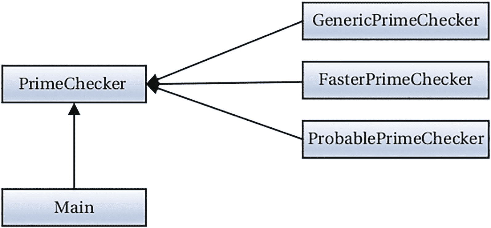
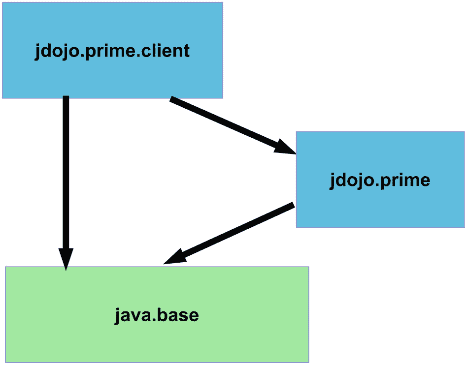

# 七、实现服务

在本章中，您将学习:

*   什么是服务、服务接口和服务提供者

*   如何用 Java 实现服务

*   如何使用 Java 接口作为服务实现

*   如何使用`ServiceLoader`类加载服务提供者

*   如何在模块声明中使用`uses`语句来指定当前模块使用`ServiceLoader`类发现和加载的服务接口

*   如何使用`provides`语句指定当前模块提供的服务提供者

*   如何根据服务提供者的类型发现、过滤和选择服务提供者，而不需要实例化它们

## 什么是服务？

由应用程序(或库)提供的特定功能被称为*服务*。例如，你可以让不同的库提供一个*素数服务*，它可以检查一个数是否是素数，并在给定的数之后生成下一个素数。为服务提供实现的应用程序和库被称为*服务提供者*。使用服务的应用程序被称为*服务消费者*或*客户端*。客户如何使用服务？客户认识所有的服务提供商吗？客户在不知道任何服务提供商的情况下获得服务吗？我在这一章回答这些问题。

Java 的早期版本(SE 6 以上)已经提供了一种机制，允许服务提供者和服务消费者之间的松散耦合。也就是说，服务消费者可以在不知道服务提供商的情况下使用服务提供商提供的服务。有了模块系统，这种架构模式变得更加标准化，并且更直接地应用于 Java 项目。

在 Java 中，*服务*是由一组接口和类定义的。服务包含一个接口或者一个抽象类，它定义了服务所提供的功能，它被称为*服务提供者接口*或者简称为*服务接口*。注意，“服务提供者接口”和“服务接口”中的术语“接口”不是指 Java 中的接口构造。服务接口可以是 Java 接口或抽象类。可以使用具体的类作为服务接口，但不推荐这样做。有时，服务接口也被称为*服务类型*——用于标识服务的类型。

一个*服务*的具体实现被称为一个*服务提供者*。一个服务接口可以有多个服务提供者。通常，服务提供者由几个接口和类组成，为服务接口提供实现。

JDK 包含一个`java.util.ServiceLoader<S>`类，其唯一目的是在运行时为类型`S`的服务接口发现和加载服务提供者。`ServiceLoader`类允许服务提供者与服务消费者分离。服务消费者只知道服务接口；`ServiceLoader`类使实现服务接口的服务提供者的实例对消费者可用。图 [7-1](#Fig1) 显示了一个服务、服务提供者和服务消费者的安排的图示视图。


图 7-1

服务、服务提供者和服务消费者的安排

通常，服务将使用`ServiceLoader`类来加载所有服务提供者，并使它们对服务消费者(或客户端)可用。这种体系结构允许一种插件机制，可以在不影响服务和服务消费者的情况下添加或删除服务提供者。服务消费者只知道服务接口。他们不知道服务接口的任何具体实现(服务提供者)。

Note

我建议阅读`java.util.ServiceLoader`类的文档，以全面理解服务加载工具。

在本章中，我使用了一个服务和三个服务提供者。表 [7-1](#Tab1) 中列出了它们的模块、类/接口名称和简要描述。

表 7-1

示例章节中使用的模块、类和接口

<colgroup><col class="tcol1 align-left"> <col class="tcol2 align-left"> <col class="tcol3 align-left"></colgroup> 
| 

组件

 | 

类别/接口

 | 

描述

 |
| --- | --- | --- |
| `jdojo.prime` | `PrimeChecker` | 它充当服务、服务接口和服务提供者。它为服务接口提供了默认实现。 |
| `jdojo.prime.faster` | `FasterPrimeChecker` | 服务提供商。 |
| `jdojo.prime.probable` | `ProbablePrimeChecker` | 服务提供商。 |
| `jdojo.prime.client` | `Main` | 服务消费者。 |

图 [7-2](#Fig2) 显示了被安排为服务、服务提供者和服务消费者的类/接口，可以与图 [7-1](#Fig1) 进行比较。



图 7-2

一个服务、三个服务提供者和一个服务消费者的安排

## 发现服务

为了使用一个服务，需要发现并加载它的提供者。`ServiceLoader`类完成发现和加载服务提供者的工作。发现并加载服务提供者的模块必须在其声明中包含一个`uses`语句，其语法如下:

```java
uses <service-interface>;

```

这里，`<service-interface>`是服务接口的名称，是 Java 接口名、类名或者注释类型名。如果一个模块使用`ServiceLoader<S>`类为名为`S`的服务接口加载服务提供者的实例，那么模块声明必须包含以下语句:

```java
uses S;

```

在我看来，声明名`uses`，似乎是用词不当。乍一看，似乎当前模块将使用指定的服务。然而，事实并非如此。服务由客户端使用，而不是由定义服务的模块使用。更直观的语句名称应该是`discovers`或`loads`。如果你把它的定义理解为:拥有`uses`语句*的模块使用*类`ServiceLoader`来加载这个服务接口的服务提供者，你就能正确理解它的意思。您不需要在客户端模块中使用`uses`语句，除非您的客户端模块加载服务的服务提供者。客户端模块加载服务是不常见的。

一个模块可以发现并加载多个服务。下面的模块声明使用了两个`uses`语句，表示它将发现并加载由`com.jdojo.PrimeChecker`和`com.jdojo.CsvParser`接口标识的服务:

```java
module jdojo.loader {
    uses com.jdojo.PrimeChecker;
    uses com.jdojo.CsvParser:
    // Other module statements go here
}

```

一个模块声明允许`import`语句。为了提高可读性，可以将该模块声明重写如下:

```java
// Import types from other packages
import com.jdojo.PrimeChecker;
import com.jdojo.CsvParser:
module jdojo.loader {
    uses PrimeChecker;
    uses CsvParser:
    // Other module statements go here
}

```

在`uses`语句中指定的服务接口可以在当前模块或另一个模块中声明。如果在另一个模块中声明，则服务接口必须可被当前模块中的代码访问；否则，会发生编译时错误。例如，前面声明中的`uses`语句中使用的`com.jdojo.CsvParser`服务接口可以在`jdojo.loader`模块或另一个模块中声明，比如说`jdojo.csvUtil`。在后一种情况下，`com.jdojo.CsvParser`接口必须可被`jdojo.loader`模块访问。

服务提供者发现发生在运行时。发现服务提供者的模块通常不会(也不需要)声明对服务提供者模块的编译时依赖，因为不可能预先知道所有的提供者模块。service discoverer 模块不声明对服务提供者模块的依赖性的另一个原因是为了保持服务提供者和服务消费者的分离。

## 提供服务实现

为服务接口提供实现的模块必须包含一个`provides`语句。如果一个模块包含一个服务提供者，但是在其声明中没有包含一个`provides`语句，这个服务提供者将不会通过`ServiceLoader`类被加载。也就是说，模块声明中的`provides`语句是告诉`ServiceLoader`类“嘿！我为服务提供了一个实现。无论何时你需要服务，你都可以把我当作服务提供商。”`provides`语句的语法如下:

```java
provides <service-interface> with
    <service-implementation-name>;

```

(你当然可以用一行来写这个。)

这里，`provides`子句指定服务接口的名称，`with`子句指定实现服务提供者接口的类的名称。服务提供者可以指定一个接口作为服务接口的实现。这听起来可能不正确，但却是事实。我在本章中提供了一个例子，其中一个接口作为服务提供者的实现类型。下面的模块声明包含两个`provides`语句:

```java
module com.jdojo.provider {
    provides com.jdojo.PrimeChecker with
        com.jdojo.impl.PrimeCheckerFactory;
    provides com.jdojo.CsvParser with
        com.jdojo.impl.CsvFastParser;
    // Other module statements go here
}

```

第一个`provides`语句声明`com.jdojo.impl.PrimeCheckerFactory`是名为`com.jdojo.PrimeChecker`的服务接口的一个可能实现。第二个`provides`语句声明`com.jdojo.impl.CsvFastParser`是名为`com.jdojo.CsvParser`的服务接口的一个可能实现。实现`PrimeCheckerFactory`和`CsvParser`通常是类，但是也可以使用接口。

一个模块可以包含任意组合的`uses`和`provides`语句——同一个模块可以为一个服务提供实现并发现同一个服务；它只能为一个或多个服务提供实现，或者它可以为一个服务提供实现并发现另一种类型的服务。以下模块声明发现并提供了同一服务的实现:

```java
module com.jdojo.parser {
    uses com.jdojo.XmlParser;
    provides com.jdojo.XmlParser with
        com.jdojo.xml.impl.XmlParserFactory;
    // Other module statements go here
}

```

Note

provides 语句的 with 子句中指定的服务实现类/接口必须在当前模块中声明。否则，会发生编译时错误。

`ServiceLoader`类创建服务实现的实例。当服务实现是一个接口时，它调用接口的`provider()`静态方法来获取提供者的实例。服务实现(类或接口)必须遵循以下规则:

*   如果服务实现隐式或显式地声明了一个没有形参的公共构造函数，这个构造函数就被称为*提供者构造函数*。

*   如果服务实现包含一个名为`provider`的没有形参的公共静态方法，这个方法被称为*提供者方法*。

*   提供者方法的返回类型必须是服务接口类型或其子类型。

*   如果服务实现不包含提供者方法，则服务实现的类型必须是具有提供者构造函数的类，并且该类必须是服务接口类型或其子类型。

当请求`ServiceLoader`类发现并加载服务提供者时，它检查服务实现是否包含提供者方法。如果找到了提供者方法，该方法的返回值就是由`ServiceLoader`类返回的服务。如果没有找到提供者方法，它将使用提供者构造函数实例化服务实现。如果服务实现既不包含提供者方法也不包含提供者构造函数，则会发生编译时错误。

有了这些规则，就有可能使用 Java 接口作为服务实现。该接口应该有一个名为`provider`的公共静态方法，该方法返回服务接口类型的实例。

下面几节将向您介绍使用模块实现服务的步骤。最后一节解释了如何让相同的服务在非模块化环境中工作。

## 定义服务接口

在本节中，您将开发一个名为 *prime checker* 的服务。我保持服务简单，这样您就可以专注于使用 Java 中的服务提供者机制，而不是编写复杂的代码来实现服务功能。这项服务的要求如下:

*   该服务应该提供一个 API 来检查一个数是否是质数。

*   客户应该能够知道可用服务提供商的名称。服务提供者的名称将是服务提供者类或接口的完全限定名称。

*   服务应该提供服务接口的默认实现。

*   客户端应该能够在不指定服务提供者名称的情况下检索服务实例。在这种情况下，将返回默认的服务提供者。

*   客户端应该能够通过指定服务提供者完全限定的名称来检索服务实例。如果指定名称的服务提供者不存在，则返回`null`。

让我们来设计服务。服务提供的功能将由一个名为`PrimeChecker`的接口来表示。它包含一种方法:

```java
public interface PrimeChecker {
    boolean isPrime(long n);
}

```

如果指定的参数是质数，`isPrime()`方法返回`true`，否则返回`false`。所有服务提供商都将实现`PrimeChecker`接口。`PrimeChecker`接口是我们的服务接口(或服务类型)。

## 获取服务提供者实例

服务需要向客户机提供 API 来检索服务提供者的实例。该服务需要发现并加载所有服务提供者，然后才能将它们提供给客户端。使用`ServiceLoader`类加载服务提供者。该类没有公共构造函数。您可以使用它的一个`load()`方法来获取它的实例。您需要指定服务接口对`load()`方法的类引用。`ServiceLoader`类包含一个`iterator()`方法，为这个`ServiceLoader`加载的特定服务接口的所有服务提供者返回一个`Iterator`。`ServiceLoader`类还实现了`Iterable`接口，因此您也可以使用`for-each`语句迭代所有的服务提供者。下面的代码片段向您展示了如何加载和遍历`PrimeChecker`的所有服务提供者实例:

```java
// Load the service providers for PrimeChecker
ServiceLoader<PrimeChecker> loader =
    ServiceLoader.load(PrimeChecker.class);
// Iterate through all service provider instances
Iterator<PrimeChecker> iterator = loader.iterator();
if (iterator.hasNext()) {
   PrimeChecker checker = iterator.next();
   // Use the prime checker here...
}

```

以下代码片段向您展示了如何在`for-each`语句中使用`ServiceLoader`实例来迭代所有服务提供者实例:

```java
ServiceLoader<PrimeChecker> loader =
    ServiceLoader.load(PrimeChecker.class);
for (PrimeChecker checker : loader) {
    // checker is your service provider instance
}

```

有时，您会希望根据类名来选择提供程序。例如，您可能希望只选择那些完全限定类名以`com.jdojo`开头的主要服务提供者。实现这一点的典型逻辑是使用由`ServiceLoader`类的`iterator()`方法返回的迭代器。然而，这是昂贵的。迭代器在返回之前实例化一个提供者。JDK9 在`ServiceLoader`类中添加了一个新的`stream()`方法:

```java
public Stream<ServiceLoader.Provider<S>> stream()

```

该方法返回`ServiceProvider.Provider<S>`接口的实例流，该接口在`ServiceLoader`类中声明为嵌套接口，如下所示:

```java
public static interface Provider<S> extends Supplier<S> {
    // Returns a Class reference of the class of the
    // service provider
    Class<? extends S> type();
    @Override
    S get();
}

```

`ServiceLoader.Provider`接口的一个实例代表一个服务提供者。它的`type()`方法返回服务实现的`Class`对象。`get()`方法返回服务提供者的一个实例。

`ServiceLoader.Provider`界面有什么帮助？当您使用`stream()`方法时，流中的每个元素都是`ServiceLoader.Provider`类型的。您可以根据提供程序的类名或类型过滤流，这不会实例化提供程序。您可以在过滤器中使用`type()`方法。当您找到所需的提供者时，调用`get()`方法实例化该提供者。这样，当你知道你需要一个提供者时，你就实例化了它，而不是当你遍历所有的提供者时。下面是一个使用`ServiceLoader`类的`stream()`方法的例子。它给出了类名以`com.jdojo`开头的所有主要服务提供者的列表:

```java
static List<PrimeChecker> startsWith(String prefix) {
    return ServiceLoader.load(PrimeChecker.class)
            .stream()
            .filter((Provider p) ->
                p.type().getName().startsWith(prefix))
            .map(Provider::get)
            .collect(Collectors.toList());
}

```

您的 prime checker 服务应该让客户机使用服务提供者类或接口名来找到服务提供者。您可以使用`ServiceLoader`类的`stream()`方法提供一个`newInstance(String providerName)`方法，如下所示:

```java
static PrimeChecker newInstance(String providerName) {
    // Try to find the first service provider with the
    // specified providerName
    Optional<Provider<PrimeChecker>> optional =
        ServiceLoader.load(PrimeChecker.class)
            .stream()
            .filter((Provider p) ->
                p.type().getName().equals(providerName))
            .findFirst();
    PrimeChecker checker = null;
    // Instantiate the provider if we found one
    if (optional.isPresent()) {
        Provider<PrimeChecker> provider = optional.get();
        checker = provider.get();
    }
    return checker;
}

```

使用`ServiceLoader`类的`Iterator`和`stream()`方法来寻找服务提供者有很大的不同。`Iterator`为您提供了服务提供者的实例，您可以使用它来确定实际服务提供者实现类的细节。服务提供者可以使用提供者构造函数或提供者方法来提供其实例。`stream()`方法不创建服务提供者实例。相反，它查看提供者构造函数和提供者方法，为您提供服务提供者实现的类型。如果使用提供者构造函数，`stream()`方法知道服务实现的实际类名。如果使用 provider 方法，`stream()`方法不会(也不能)查看 provider 方法内部来查看实际的实现类类型。在这种情况下，它只查看提供者方法的返回类型，它的`type()`方法返回该返回类型的`Class`引用。考虑下面的`PrimeChecker`服务类型的提供者方法实现:

```java
// FasterPrimeChecker.java
package com.jdojo.prime.faster;
import com.jdojo.prime.PrimeChecker;
public class FasterPrimeChecker implements PrimeChecker {
    // No provider constructor
    private FasterPrimeChecker() {
        // No code
    }
    // Define a provider method
    public static PrimeChecker provider() {
        return new FasterPrimeChecker();
    }
    @Override
    public boolean isPrime(long n) {
        // More code goes here
    }
}

```

假设`FasterPrimeChecker`类作为服务提供者可用。当您使用`ServiceLoader`类的`stream()`方法时，您将获得这个服务提供者的`ServiceLoader.Provider`元素，其`type()`方法将返回`com.jdojo.prime.PrimeChecker`接口的`Class`引用，这是`provider()`方法的返回类型。当您调用`ServiceLoader.Provider`实例的`get()`方法时，它将调用`provider()`方法并返回从`provider()`方法返回的`FasterPrimeChecker`类对象的引用。如果您尝试编写以下代码来查找`FasterPrimeChecker`提供者，将会失败:

```java
String providerName =
    "com.jdojo.prime.faster.FasterPrimeChecker";
Optional<Provider<PrimeChecker>> optional =
    ServiceLoader.load(PrimeChecker.class)
        .stream()
        .filter((Provider p) ->
            p.type().getName().equals(providerName))
        .findFirst();

```

如果您想使用`ServiceLoader`类的`stream()`方法通过类名找到这个服务提供者，您可以更改`provider()`方法的返回类型，如下所示:

```java
// FasterPrimeChecker.java
package com.jdojo.prime.faster;
import com.jdojo.prime.PrimeChecker;
public class FasterPrimeChecker implements PrimeChecker {
    // No provider constructor
    private FasterPrimeChecker() {
        // No code
    }
    // Define a provider method
    public static FasterPrimeChecker provider() {
        return new FasterPrimeChecker();
    }
    @Override
    public boolean isPrime(long n) {
        // More code goes here
    }
}

```

## 定义服务

您可以创建一个类来为您的服务提供发现、加载和检索功能。但是因为可以向接口添加静态方法，所以也可以将接口用于相同的目的。让我们向服务接口添加两个静态方法:

```java
public interface PrimeChecker {
    // Part of the service interface
    boolean isPrime(long n);
    // Part of the service
    static PrimeChecker newInstance() { /*...*/ };
    static PrimeChecker newInstance(String providerName) {
        /*...*/ };
    static List<PrimeChecker> providers() { /*...*/ };
    static List<String> providerNames(/*...*/);
 }

```

`newInstance()`方法将返回默认服务提供者`PrimeChecker`的实例。`newInstance(String providerName)`方法将返回具有指定提供者名称的服务提供者的实例。`providers()`方法将返回所有提供者实例，而`providerNames()`方法将返回所有提供者名称的列表。

请注意，您的`PrimeChecker`接口将服务于两个目的:

*   它充当一个服务接口，而`isPrime()`方法是该服务接口中唯一的方法。客户端将使用`PrimeChecker`接口作为服务类型。

*   它通过两个版本的`newInstance()`方法、`providers()`方法和`providerNames()`方法作为服务。

此时，您可以选择拥有一个单独的服务类，比如说一个包含`newInstance()`、`providers()`和`providerNames()`方法的`PrimeService`类——只留下`PrimeChecker`接口中的`isPrime()`方法。如果您决定这样做，客户端将使用`PrimeService`类来获得服务提供者。

Note

向接口添加方法在某种程度上违背了接口的原始概念。严格地说，描述方法的接口和实现这些方法并包含实际可执行代码的类之间应该有明显的区别。如果您希望将这样的接口方法与接口声明本身中给出的代码一起使用，或者如果您希望提供允许实例化服务的特殊基础结构类，这取决于您。

清单 [7-1](#PC19) 包含了`PrimeChecker`接口的完整代码。

```java
// PrimeChecker.java
package com.jdojo.prime;
import java.util.ArrayList;
import java.util.List;
import java.util.Optional;
import java.util.ServiceLoader;
import java.util.ServiceLoader.Provider;
import java.util.stream.Collectors;
public interface PrimeChecker {
    boolean isPrime(long n);
    static PrimeChecker newInstance() {
        // Return the default service provider
        String defaultSP =
            "com.jdojo.prime.impl.GenericPrimeChecker";
        return newInstance(defaultSP);
    }
    static PrimeChecker newInstance(String providerName) {
        Optional<Provider<PrimeChecker>> optional =
            ServiceLoader.load(PrimeChecker.class)
                .stream()
                .filter((Provider p) ->
                    p.type().getName().
                        equals(providerName))
                .findFirst();
        PrimeChecker checker = null;
        if (optional.isPresent()) {
            Provider<PrimeChecker> provider =
                optional.get();
            checker = provider.get();
        }
        return checker;
    }
    static List<PrimeChecker> providers() {
        List<PrimeChecker> providers = new ArrayList<>();
        ServiceLoader<PrimeChecker> loader =
            ServiceLoader.load(PrimeChecker.class);
        for (PrimeChecker checker : loader) {
            providers.add(checker);
        }
        return providers;
    }
    static List<String> providerNames() {
        List<String> providers =
            ServiceLoader.load(PrimeChecker.class)
                .stream()
                .map((Provider p) -> p.type().getName())
                .collect(Collectors.toList());
        return providers;
    }
}

Listing 7-1A Service Provider Interface Named PrimeChecker

```

`jdojo.prime`模块的声明如清单 [7-2](#PC20) 所示。它导出`com.jdojo.prime`包，因为其他服务提供者模块需要使用`PrimeChecker`接口。

```java
// module-info.java
module jdojo.prime {
    exports com.jdojo.prime;
    uses com.jdojo.prime.PrimeChecker;
}

Listing 7-2The Declaration of the jdojo.prime Module

```

您需要使用带有`PrimeChecker`接口的完全限定名的`uses`语句，因为该模块中的代码将使用`ServiceLoader`类来加载该接口的服务提供者。您还没有完成`jdojo.prime`模块的声明。在下一节中，您将向该模块添加一个默认的服务提供者。

## 定义服务提供商

在接下来的部分中，您将为`PrimeChecker`服务接口创建三个服务提供者。第一个服务提供商将是您的默认 prime checker 服务提供商。你将把它和`jdojo.prime`模块打包在一起。您将调用第二个服务提供商作为*更快的素数检查器* *提供商*。您将调用第三个服务提供者作为*可能的主要检查者提供者*。稍后，您将创建一个客户端来测试服务。您可以选择使用这些服务提供商之一或全部。

这些服务提供商将实现算法来检查一个给定的数字是否是素数。理解质数的定义对你会有帮助。除非被 1 或它本身整除，否则不能被除尽的正整数称为素数。1 不是素数。素数的几个例子是 2、3、5、7 和 11。

### 定义默认主要服务提供商

在本节中，您将为`PrimeChecker`服务定义一个默认的服务提供者。为服务定义服务提供者只需创建一个实现服务接口的类。对于我们的例子，您将创建一个名为`GenericPrimeChecker`的类，它实现了`PrimeChecker`接口，并将包含一个提供者构造函数。

这个服务提供者将在同一个模块`jdojo.prime`中定义，该模块也包含您的服务接口。清单 [7-3](#PC21) 包含了一个名为`GenericPrimeChecker`的类的完整代码。它实现了`PrimeChecker`接口，因此它的实例可以用作服务提供者。注意，我将这个类放在了`com.jdojo.prime.impl`包中，只是为了将公共接口和私有实现分开。该类的`isPrime()`方法检查指定的参数是否是质数。这种方法的实现不是最佳的。下一个服务提供了更好的实现。

```java
// GenericPrimeChecker.java
package com.jdojo.prime.impl;
import com.jdojo.prime.PrimeChecker;
public class GenericPrimeChecker implements PrimeChecker {
    @Override
    public boolean isPrime(long n) {
        if (n <= 1) {
            return false;
        }
        if (n == 2) {
            return true;
        }
        if (n % 2 == 0) {
            return false;
        }
        for (long i = 3; i < n; i += 2) {
            if (n % i == 0) {
                return false;
            }
        }
        return true;
    }
}

Listing 7-3A Service Implementation Class for the PrimeChecker Service Interface

```

为了使`GenericPrimeChecker`类作为`PrimeChecker`服务接口的服务提供者对`ServiceLoader`类可用，您需要在`jdojo.prime`模块的声明中包含一个`provides`语句。清单 [7-4](#PC22) 包含了`jdojo.prime`模块声明的修改版本。

```java
// module-info.java
module jdojo.prime {
    exports com.jdojo.prime;
    uses com.jdojo.prime.PrimeChecker;
    provides com.jdojo.prime.PrimeChecker
        with com.jdojo.prime.impl.GenericPrimeChecker;
}

Listing 7-4The Modified Declaration of the jdojo.prime Module

```

`provides`语句指定这个模块为`PrimeChecker`接口提供一个实现，它的`with`子句指定实现类的名称。实现类必须满足以下条件:

*   它必须是公共具体类或公共接口。它可以是顶级或嵌套的静态类。它不能是内部类或`abstract`类。

*   它必须提供提供者构造函数或提供者方法。您有一个公共的无参数构造函数，它充当提供者构造函数。这个构造函数由`ServiceLoader`类使用反射来实例化服务提供者。

*   实现类的实例必须与服务提供者接口的赋值兼容。

如果不满足这些条件中的任何一个，就会发生编译时错误。请注意，您不需要导出包含服务实现类的`com.jdojo.prime.impl`包，因为没有客户端应该直接依赖于服务实现。客户端只需要引用服务接口，而不是任何特定的服务实现类。`ServiceLoader`类可以访问和实例化实现类，而不需要模块导出包含服务实现的包。

Note

如果一个模块使用了一个`provides`语句，那么指定的服务接口可能在当前模块或者另一个可访问的模块中。在`with`子句中指定的服务实现类/接口必须在当前模块中定义。

这就是本模块的全部内容。将这个模块编译并打包成一个模块化的 JAR。此时，没有什么可测试的。

### 定义更快的主要服务提供商

在本节中，您将为`PrimeChecker`服务接口定义另一个服务提供者。让我们称之为*更快的*服务提供者，因为您将实现一个更快的算法来检查素数。这个服务提供者将在一个名为`jdojo.prime.faster`的独立模块中定义，服务实现类称为`FasterPrimeChecker`。

清单 [7-5](#PC23) 包含模块声明，类似于我们对`jdojo.prime`模块的声明。这一次，只有`with`子句中的类名发生了变化。

```java
// module-info.java
module jdojo.prime {
    exports com.jdojo.prime;
    uses com.jdojo.prime.PrimeChecker;
    provides com.jdojo.prime.PrimeChecker
        with com.jdojo.prime.impl.GenericPrimeChecker;
}

Listing 7-5The Module Declaration for the com.jdojo.prime.faster Module

```

`FasterPrimeChecker`类需要实现`PrimeChecker`接口，该接口在`jdojo.prime`模块中。读取`jdojo.prime`模块需要`requires`语句。

清单 [7-6](#PC24) 包含了`FasterPrimeChecker`类的代码，它的`isPrime()`方法比`GenericPrimeChecker`类的`isPrime()`方法执行得更快。这一次，该方法遍历所有奇数，从 3 开始，到要测试素数的数字的平方根结束。

```java
// FasterPrimeChecker.java
package com.jdojo.prime.faster;
import com.jdojo.prime.PrimeChecker;
public class FasterPrimeChecker implements PrimeChecker {
    // No provider constructor
    private FasterPrimeChecker() {
        // No code
    }
    // Define a provider method
    public static FasterPrimeChecker provider() {
        return new FasterPrimeChecker();
    }
    @Override
    public boolean isPrime(long n) {
        if (n <= 1) {
            return false;
        }
        if (n == 2) {
            return true;
        }
        if (n % 2 == 0) {
            return false;
        }
        long limit = (long) Math.sqrt(n);
        for (long i = 3; i <= limit; i += 2) {
            if (n % i == 0) {
                return false;
            }
        }
        return true;
    }
}

Listing 7-6An Implementation for the PrimeChecker Service Interface

```

注意`GenericPrimeChecker`和`FasterPrimeChecker`类之间的区别，如清单 [7-3](#PC21) 和 [7-6](#PC24) 所示。GenericPrimeChecker 类包含一个默认构造函数，用作提供程序构造函数。它不包含提供者方法。`FasterPrimeChecker`类使无参数构造函数成为私有的，这并没有使构造函数成为提供者构造函数。`FasterPrimeChecker`类提供了 provider 方法，声明如下:

```java
public static FasterPrimeChecker provider() { /*...*/ }

```

当`ServiceLoader`类需要实例化更快的 prime 服务时，就会调用这个方法。这个方法非常简单——它创建并返回一个`FasterPrimeChecker`类的对象。

这就是目前您学习本模块所需的全部内容。要编译这个模块，`jdojo.prime`模块需要在模块路径中。将这个模块编译并打包成一个模块化的 JAR。此时，没有什么可测试的。

### 定义可能的主要服务提供商

在这一节中，我将向您展示如何使用 Java 接口作为服务实现。您将为`PrimeChecker`服务接口定义另一个服务提供者。让我们称之为*可能的*素数服务提供者，因为它告诉你一个数可能是素数。这个服务提供者将在一个名为`jdojo.prime.probable`的独立模块中定义，服务实现接口称为`ProbablePrimeChecker`。

这项服务是关于检查一个质数。`java.math.BigInteger`类包含一个名为`isProbablePrime(int certainty)`的方法。如果这个方法返回`true`，这个数字可能是一个质数。如果方法返回`false`，这个数肯定不是素数。`certainty`参数决定了该方法在返回`true`之前确保数字是质数的程度。参数`certainty`的值越大，该方法产生的成本就越高，当该方法返回`true`时，该数字是素数的概率就越高。

清单 [7-7](#PC26) 包含模块声明，类似于我们之前对`jdojo.prime.faster`模块的声明。这一次，只有`with`子句中的类/接口名称发生了变化。清单 [7-8](#PC27) 包含了 ProbablePrimeChecker 类的代码。

```java
// ProbablePrimeChecker.java
package com.jdojo.prime.probable;
import com.jdojo.prime.PrimeChecker;
import java.math.BigInteger;
public interface ProbablePrimeChecker
        extends PrimeChecker {
    // A provider method
    public static ProbablePrimeChecker provider() {
        int certainty = 1000;
        ProbablePrimeChecker checker = n ->
            BigInteger.valueOf(n).
            isProbablePrime(certainty);
        return checker;
    }
}

Listing 7-8An Implementation Interface for the PrimeChecker Service Interface

```

```java
// module-info.java
module jdojo.prime.probable {
    requires jdojo.prime;
    provides com.jdojo.prime.PrimeChecker
        with com.jdojo.prime.probable.ProbablePrimeChecker;
}

Listing 7-7The Module Declaration for the com.jdojo.prime.probable Module

```

`ProbablePrimeChecker`接口扩展了`PrimeChecker`接口，并且只包含一个方法，即提供者方法:

```java
public static ProbablePrimeChecker provider() {/*...*/}

```

当`ServiceLoader`类需要实例化可能的 prime 服务时，它会调用这个方法。这个方法非常简单——它创建并返回一个`ProbablePrimeChecker`接口的实例。它使用 lambda 表达式来创建提供者。`isPrime()`方法使用`BigInteger`类来检查数字是否是可能的质数。

清单 [7-9](#PC29) 包含了将`ProbablePrimeChecker`接口作为服务提供者的另一种声明。

```java
// ProbablePrimeChecker.java
package com.jdojo.prime.probable;
import com.jdojo.prime.PrimeChecker;
import java.math.BigInteger;
public interface ProbablePrimeChecker {
    // A provider method
    public static PrimeChecker provider() {
        int certainty = 1000;
        PrimeChecker checker = n ->
            BigInteger.valueOf(n).
            isProbablePrime(certainty);
        return checker;
    }
}

Listing 7-9An Alternative Declaration of the ProbablePrimeChecker Interface

```

这一次，接口没有扩展`PrimeChecker`接口。要成为一个服务实现，其提供者方法必须返回服务接口(`PrimeChecker`接口)或其子类型的实例。通过将提供者方法的返回类型声明为`PrimeChecker`，您已经满足了这个需求。声明`ProbablePrimeChecker`接口，如清单 [7-9](#PC29) 所示，有一个缺点，即在没有实例化服务提供者的情况下，使用`ServiceLoader`类的`stream()`方法，无法通过服务提供者的类名`com.jdojo.probable.ProbablePrimeChecker`找到该服务提供者。`ServiceLoader.Provider`的`type()`方法会返回`com.jdojo.prime.PrimeChecker`接口的`Class`引用，是`provider()`方法的返回类型。我使用这个接口的声明，如清单 [7-8](#PC27) 所示。

这就是本模块的全部内容。要编译这个模块，需要将`jdojo.prime`模块添加到模块路径中。将这个模块编译并打包成一个模块化的 JAR。此时，没有什么可测试的。

## 测试主要服务

在本节中，您将通过创建一个客户端应用程序来测试服务，该应用程序将在一个名为`jdojo.prime.client`的单独模块中定义。清单 [7-10](#PC30) 包含了模块声明。

```java
// module-info.java
module jdojo.prime.client {
    requires jdojo.prime;
}

Listing 7-10The Declaration 

of the jdojo.prime.client Module

```

客户端模块只需要知道服务接口。在这种情况下，`jdojo.prime`模块定义了服务接口。因此，客户端模块只读取服务接口模块，而不读取其他内容。在现实世界中，客户端模块要比这复杂得多，它也可能读取其他模块。图 [7-3](#Fig3) 为`jdojo.prime.client`模块的模块图。



图 7-3

com.jdojo.prime.client 模块的模块图

Note

客户端模块不知道服务提供者模块，因此它不需要直接读取它们。服务的职责是发现所有服务提供者，并使它们的实例对客户端可用。在这种情况下，`jdojo.prime`模块定义了`com.jdojo.prime.PrimeChecker`接口，它是一个服务接口，也充当服务。

清单 [7-11](#PC31) 包含使用`PrimeChecker`服务的客户端代码。

```java
// Main.java
package com.jdojo.prime.client;
import com.jdojo.prime.PrimeChecker;
public class Main {
    public static void main(String[] args) {
        // Numbers to be checked for prime
        long[] numbers = {3, 4, 121, 977};
        // Use the default service provider
        PrimeChecker checker = PrimeChecker.newInstance();
        System.out.println(
            "Using default service provider:");
        checkPrimes(checker, numbers);
        // Try faster prime service provider
        String fasterProviderName =
            "com.jdojo.prime.faster.FasterPrimeChecker";
        PrimeChecker fasterChecker =
            PrimeChecker.newInstance(fasterProviderName);
        if (fasterChecker == null) {
            System.out.println(
                "\nFaster service provider is not" +
                " available.");
        } else {
            System.out.println(
                "\h nUsing faster service provider:");
            checkPrimes(fasterChecker, numbers);
        }
        // Try probable prime service provider
        String probableProviderName =
           "com.jdojo.prime.probable.ProbablePrimeChecker";
        PrimeChecker probableChecker =
            PrimeChecker.newInstance(probableProviderName);
        if (probableChecker == null) {
            System.out.println(
                "\nProbable service provider is not" +
                " available.");
        } else {
            System.out.println(
                "\nUsing probable service provider:");
            checkPrimes(probableChecker, numbers);
        }
    }
    public static void checkPrimes(PrimeChecker checker,
            long... numbers) {
        for (long n : numbers) {
            if (checker.isPrime(n)) {
                System.out.printf(
                    "%d is a prime.%n", n);
            } else {
                System.out.printf(
                    "%d is not a prime.%n", n);
            }
        }
    }
}

Listing 7-11A Main Class to Test the PrimeChecker Service

```

`checkPrimes()`方法接受一个`PrimeChecker`实例和变量`long`数字。它使用`PrimeChecker`来检查数字是否是质数，并打印相应的信息。`main()`方法检索默认的`PrimeChecker`服务提供者实例以及更快的和可能的服务提供者实例。它使用所有三个服务提供者的实例来检查相同的一组数是否是质数。编译并打包模块的代码。在模块路径中运行只有两个模块`jdojo.prime`和`jdojo.prime.client`的`Main`类，如下所示(删除“；”后的换行符和空格)):

```java
C:\Java9LanguageFeatures>java ^
--module-path dist\jdojo.prime.jar;
              dist\jdojo.prime.client.jar ^
--module jdojo.prime.client/com.jdojo.prime.client.Main

Using default service provider:
3 is a prime.
4 is not a prime.
121 is not a prime.
977 is a prime.
Faster service provider is not available.
Probable service provider is not available.

```

模块路径中只有一个服务提供者，它是与`jdojo.prime`模块打包在一起的默认服务提供者。因此，检索更快和可能的服务提供商的尝试失败了。从输出中可以明显看出这一点。

Note

当模块系统在已解析模块的模块声明中遇到一个`uses`语句时，它会扫描模块路径，以找到所有包含`provides`语句的模块，这些语句指定了在`uses`语句中指定的服务接口的实现。从这个意义上说，模块中的`uses`语句表示对其他模块的间接可选依赖，这是自动为您解决的。因此，要使用服务提供者，只需将服务提供者模块放在模块路径上；它将被`ServiceLoader`级发现并装载。

让我们通过将`jdojo.prime.faster`模块包含到模块路径中来运行相同的命令，如下所示(删除“；”后面的换行符和空格)):

```java
C:\Java9LanguageFeatures>java ^
--module-path dist\jdojo.prime.jar;
    dist\jdojo.prime.client.jar;
    dist\jdojo.prime.faster.jar ^
--module jdojo.prime.client/com.jdojo.prime.client.Main

Using default service provider:
3 is a prime.
4 is not a prime.
121 is not a prime.
977 is a prime.
Using faster service provider:
3 is a prime.
4 is not a prime.
121 is not a prime.
977 is a prime.
Probable service provider is not available.

```

这一次，您在模块路径上有两个服务提供者，并且两者都被运行时找到，这从输出中可以明显看出。

以下命令包括模块路径上的`jdojo.prime`、`jdojo.prime.faster`和`jdojo.prime.probable`模块。将找到所有三个服务提供者，这从输出中可以明显看出(删除“；”后的换行符和空格)):

```java
C:\Java9LanguageFeatures>java ^
--module-path dist\jdojo.prime.jar;
    dist\jdojo.prime.client.jar;
    dist\jdojo.prime.faster.jar;
    dist\jdojo.prime.probable.jar ^
--module jdojo.prime.client/com.jdojo.prime.client.Main

Using default service provider:
3 is a prime.
4 is not a prime.
121 is not a prime.
977 is a prime.
Using faster service provider:
3 is a prime.
4 is not a prime.
121 is not a prime.
977 is a prime.
Using probable service provider:
3 is a prime.
4 is not a prime.
121 is not a prime.
977 is a prime.

```

在这种情况下，模块是这样解析的:

*   主类在`jdojo.prime.client`模块中，所以这个模块是根模块，先解析。

*   `jdojo.prime.client`模块读取`jdojo.prime`模块，因此`jdojo.prime`模块被解析。

*   `jdojo.prime`模块包含一个`uses`语句，该语句将`com.jdojo.prime.PrimeChecker`指定为服务接口类型。运行时扫描模块路径中的所有模块，检查它们是否包含指定相同服务接口的`provides`语句。它找到包含这些`provides`语句的`jdojo.prime`、`jdojo.prime.faster`和`jdojo.prime.probable`模块。在上一步中已经解决了`jdojo.prime`模块。此时`jdojo.prime.faster`和`jdojo.probable`模块被解析。

您可以使用下面的`–show-module-resolution`命令行选项来查看模块解析过程。显示部分输出(删除“；”后的换行符和空格)):

```java
C:\Java9LanguageFeatures>java ^
--module-path dist\jdojo.prime.jar;
    dist\jdojo.prime.client.jar;
    dist\jdojo.prime.faster.jar;
    dist\jdojo.prime.probable.jar ^
--show-module-resolution ^
--module jdojo.prime.client/com.jdojo.prime.client.Main

root jdojo.prime.client ...
jdojo.prime.client requires jdojo.prime ...
jdojo.prime binds jdojo.prime.probable ...
jdojo.prime binds jdojo.prime.faster...
...

```

## 在传统模式下测试主要服务

并非所有的应用程序都将被迁移以使用模块。主服务的模块化 jar 可以和类路径上的其他 jar 一起使用。假设您将主要服务的所有模块化 jar 放在了`C:\Java9LanguageFeatures\lib`目录中。通过使用以下命令将四个模块化 jar 放在类路径上来运行`com.jdojo.prime.client.Main`类(删除“；”后的换行符和空格)):

```java
C:\Java9Revealed>java ^
--class-path lib\com.jdojo.prime.jar;
    lib\com.jdojo.prime.client.jar;
    lib\com.jdojo.prime.faster.jar;
    lib\com.jdojo.prime.generic.jar;
    lib\com.jdojo.prime.probable.jar ^
com.jdojo.prime.client.Main

Using default service provider:
Exception in thread "main" java.lang.NullPointerException
        at com.jdojo.prime.client.Main.checkPrimes
            (Main.java:39)
        at com.jdojo.prime.client.Main.main
            (Main.java:14)

```

输出表明使用遗留模式——JDK 9 之前的模式，将所有模块化 jar 放在类路径上——找不到任何服务提供者。在传统模式中，服务提供者发现机制是不同的。`ServiceLoader`类扫描类路径上的所有 jar，寻找`META-INF/services`目录中的文件。文件名是完全限定的服务接口名称。文件路径如下所示:

```java
META-INF/services/<service-interface>

```

该文件的内容是服务提供者实现类/接口的全限定名称列表。每个类名需要在单独的一行上。您可以在文件中使用单行注释。从`#`字符开始的行上的文本被认为是注释。

服务接口名为`com.jdojo.prime.PrimeChecker`，因此三个服务提供者的模块化 jar 将有一个名为`com.jdojo.prime.PrimeChecker`的文件，路径如下:

```java
META-INF/services/com.jdojo.prime.PrimeChecker

```

您需要将`META-INF/services`目录添加到源代码目录的根目录中。如果您使用的是 NetBeans 之类的 IDE，IDE 会为您打包文件。清单 [7-12](#PC39) 到 [7-14](#PC41) 包含三个主要服务提供商模块的模块化 jar 文件的内容。

```java
# The probable service provider implementation interface
# name
com.jdojo.prime.probable.ProbablePrimeChecker

Listing 7-14Contents of the META-INF/services/com.jdojo.prime.PrimeChecker File in the Modular JAR for the com.jdojo.prime.probable Module

```

```java
# The faster service provider implementation class name
com.jdojo.prime.faster.FasterPrimeChecker

Listing 7-13Contents of the META-INF/services/com.jdojo.prime.PrimeChecker File in the Modular JAR for the com.jdojo.prime.faster Module

```

```java
# The generic service provider implementation class name
com.jdojo.prime.impl.GenericPrimeChecker

Listing 7-12Contents of the META-INF/services/com.jdojo.prime.PrimeChecker File in the Modular JAR for the com.jdojo.prime Module

```

为通用和更快的 prime checker 服务提供者重新编译和打包模块化 jar。运行以下命令(删除“；”后的换行符和空格)):

```java
C:\Java9LanguageFeatures>java ^
--class-path lib\jdojo.prime.jar;
    lib\jdojo.prime.client.jar;
    lib\jdojo.prime.faster.jar;
    lib\jdojo.prime.probable.jar ^
com.jdojo.prime.client.Main

Using default service provider:
3 is a prime.
4 is not a prime.
121 is not a prime.
977 is a prime.
Exception in thread "main"
    java.util.ServiceConfigurationError:
    com.jdojo.prime.
PrimeChecker:
com.jdojo.prime.faster.FasterPrimeChecker
Unable to get public no-arg  constructor
...
   Caused by: java.lang.NoSuchMethodException:
   com.jdojo.prime.faster.
FasterPrimeChecker.<init>()
...

```

显示了部分输出。当`ServiceLoader`类试图实例化更快的主要服务提供者时，输出指示运行时异常。当试图实例化可能的主要服务提供者时，您将得到相同的错误。在`META-INF/services`目录中添加关于服务的信息是实现服务的遗留方式。为了向后兼容，服务实现必须是具有公共无参数构造函数的类。回想一下，您只为`GenericPrimeChecker`类提供了一个提供者构造函数。因此，在遗留模式下，默认的主要检查器服务提供者工作，而其他两个不工作。您可以向`FasterPrimeChecker`类添加一个提供者构造函数来使其工作。但是，不能向接口添加提供者构造函数，并且`ProbablePrimeChecker`在类路径模式下不工作。您必须从一个显式模块加载它才能使它工作。

## 摘要

由应用程序(或库)提供的特定功能被称为*服务*。提供服务实现的应用程序和库被称为服务提供者。使用这些服务提供商提供的服务的应用程序被称为*服务消费者*或*客户*。

在 Java 中，*服务*是由一组接口和类定义的。服务包含一个接口或抽象类，定义了服务提供的功能，它被称为*服务提供者接口*、*服务接口*或*服务类型*。服务接口的具体实现被称为*服务提供者*。一个服务接口可以有多个服务提供者。服务提供者可以是一个类或一个接口。

JDK 包含一个`java.util.ServiceLoader<S>`类，其唯一目的是在运行时为指定的服务接口发现并加载类型为`S`的服务提供者。如果包含服务提供者的 JAR(模块化的或非模块化的)放在类路径上，`ServiceLoader`类使用`META-INF/services`目录来查找服务提供者。该目录中的文件名应该与服务接口的完全限定名相同。该文件包含服务提供者实现类的完全限定名—每行一个类名。文件可以使用一个`#`字符作为单行注释的开始。`ServiceLoader`类扫描类路径上的所有`META-INF/services`目录来发现服务提供者。

在模块化的环境中，不需要`META-INF/services`目录。使用`ServiceLoader`类来发现和加载服务提供者的模块需要使用`uses`语句来指定服务接口。在`uses`语句中指定的服务接口可以在当前模块或当前模块可访问的任何模块中声明。您可以使用`ServiceLoader`类的`iterator()`方法来迭代所有的服务提供者。`stream()`方法提供了一个元素流，这些元素是`ServiceLoader.Provider`接口的实例。您可以使用流根据提供者的类名筛选和选择特定类型的提供者，而不必实例化所有提供者。

包含服务提供者的模块需要使用`provides`语句指定服务接口及其实现类。实现类必须在当前模块中声明。

## 练习

**练习** 1

Java 中的服务、服务接口、服务提供者是什么？

**练习** 2

为名为`M`的模块编写声明，该模块加载服务接口的服务提供者，该服务接口的完全限定名为`p.S`。

**运动** 3

为名为`N`的模块编写声明，该模块提供服务接口`p.S`的实现。服务实现类的全限定名是`q.C`。

**演习** 4

使用`ServiceLoader`类，一个模块可以加载多少类型的服务？

**锻炼** 5

一个模块可以提供多少个服务类型的服务实现？

**锻炼** 6

什么时候使用`java.util.ServiceLoader<S>`类？

**锻炼** 7

什么时候使用嵌套的`java.util.ServiceLoader.Provider<S>`接口？

**运动** 8

您可以使用`ServiceLoader`类的`iterator()`方法或`stream()`方法来发现和加载特定类型的服务提供者。当您必须根据服务提供者实现类或接口的名称来选择服务提供者时，哪种方法具有更好的性能？

**演习** 9

什么是提供者构造函数和提供者方法？如果两者都可用，那么从模块化 jar 加载服务时使用哪一个？

**运动** 10

在定义一个打包在模块化 JAR 中的服务时，如果放在类路径中也应该工作，您会采取什么步骤？