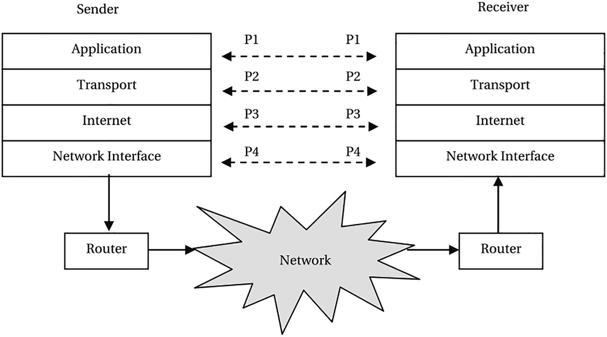
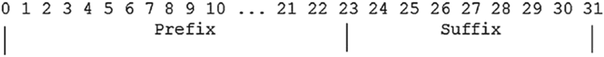
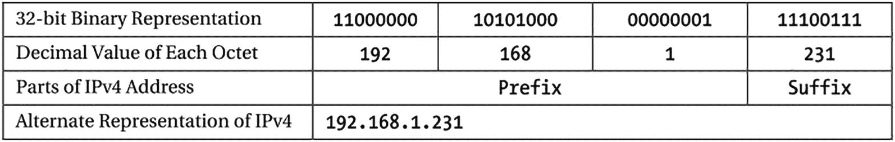
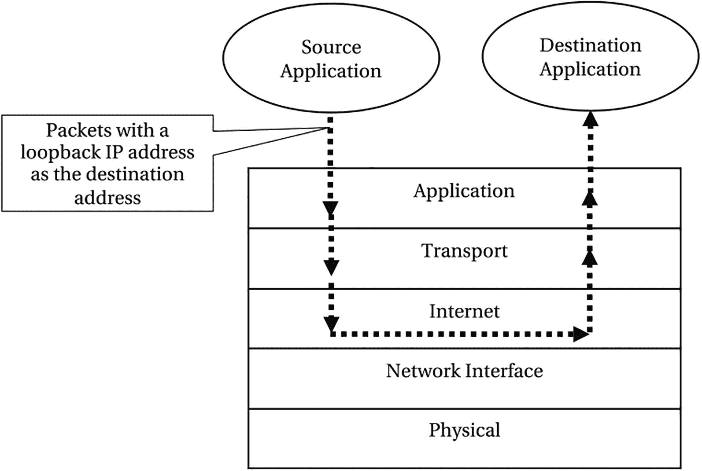
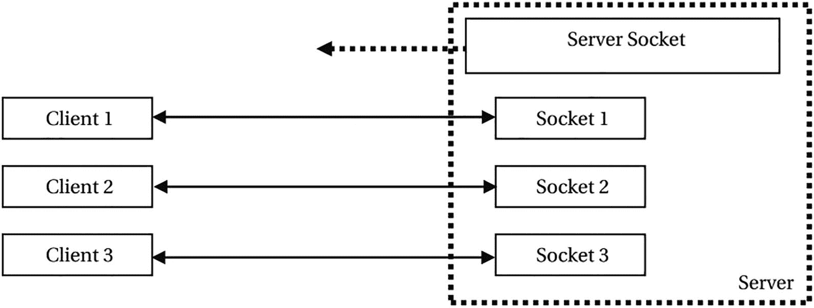
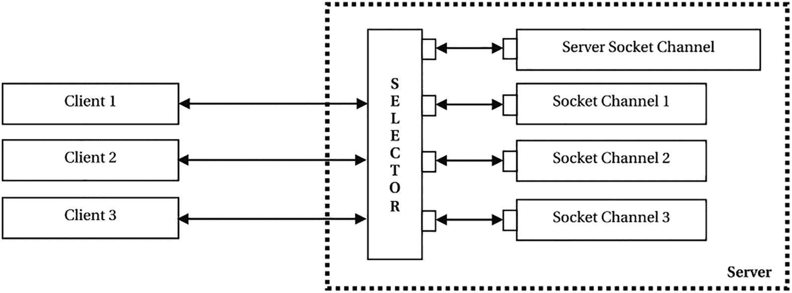

# 八、网络编程

在本章中，您将学习:

*   什么是网络编程

*   什么是网络协议套件

*   什么是 IP 地址，不同的 IP 编址方案是什么

*   特殊 IP 地址及其用途

*   什么是端口号以及如何使用它们

*   使用 TCP 和 UDP 客户端和服务器套接字在远程计算机之间进行通信

*   URI、URL 和 URN 的定义以及如何在 Java 程序中表示它们

*   如何使用非阻塞套接字

*   如何使用异步套接字通道

*   面向数据报的套接字通道和多播数据报通道

本章中的所有示例程序都是清单 [8-1](#PC1) 中声明的`jdojo.net`模块的成员。

```java
// module-info.java
module jdojo.net {
    exports com.jdojo.net;
}

Listing 8-1The Declaration of a jdojo.net Module

```

本章的前几节旨在为没有计算机科学背景的读者快速概述与网络技术相关的基础知识。如果您理解像 IP 地址、端口号和网络协议套件这样的术语，您可以跳过这些部分，开始阅读“套接字 API 和客户机-服务器范例”部分。

## 什么是网络编程？

网络是一组两台或多台计算机或其他类型的电子设备(如打印机)，它们为了共享信息而连接在一起。链接到网络的每个设备被称为一个*节点*。一台与网络相连的计算机被称为*主机*。Java 中的网络编程包括编写 Java 程序，以促进网络上不同计算机上运行的进程之间的信息交换。

Java 使编写网络程序变得容易。向另一台计算机上运行的进程发送消息就像向本地文件系统写入数据一样简单。类似地，接收从另一台计算机上运行的进程发送的消息就像从本地文件系统中读取数据一样简单。本章中的大多数程序都涉及到通过网络读写数据，它们类似于文件 I/O。本章中的几个新类有助于网络上两台计算机之间的通信。

要理解或编写本章中的 Java 程序，您不需要具备网络技术的高级知识。本章涵盖了网络通信中所涉及的一些事物的高级细节。

网络可以根据不同的标准进行分类。根据网络分布的地理区域，网络可分为以下几类:

*   局域网(LAN):它覆盖一个小区域，如一栋大楼或一组大楼。

*   校园网(CAN):它覆盖一个校园，如大学校园，在校园内互连多个局域网。

*   城域网:它比局域网覆盖更大的地理区域。通常，它覆盖一个城市。

*   广域网(WAN):它覆盖更大的地理区域，例如一个国家的一个区域或世界上不同国家的多个区域。

当两个或两个以上的网络使用路由器(也称为网关)连接时，称为*网间互联*，由此产生的组合网络称为*网间互联*，简称*互联网*(注意*互联网*中小写的 I)。全球互联网络，包括世界上所有连接在一起的网络，被称为*互联网*(注意互联网中的大写 I)。

根据拓扑结构(网络中节点的排列)，网络可以分为*星形*、*树*、*环*、*总线*、*混合式*等。

根据网络传输数据的技术，可以分为*以太网*、 *LocalTalk* 、*光纤分布式数据接口(FDDI)* 、*令牌环网*、*异步传输模式(ATM)* 等。

我不涉及不同种类的网络的任何细节。请参考任何有关网络的标准教科书，详细了解网络和网络技术。

计算机上两个进程之间的通信很简单，它是使用操作系统定义的进程间通信来实现的。当在互联网上的两台不同的计算机上运行的两个进程需要通信时，这是一项非常乏味的任务。在这两个进程开始通信之前，您需要考虑通信的许多方面。您需要考虑的一些要点如下:

*   两台计算机可能使用不同的技术，如不同的操作系统、不同的硬件等。

*   它们可能位于使用不同网络技术的两个不同网络上。

*   它们可能被使用不同技术的许多其它网络分隔开。也就是说，两台计算机不在两个直接互连的网络上。您需要考虑的不仅仅是两个网络，而是来自一台计算机的数据必须通过才能到达另一台计算机的所有网络。

*   他们可能相隔几英里，或者在地球的另一边。你如何高效地传输信息而不用担心两台电脑之间的距离？

*   一台计算机可能不理解另一台计算机发送的信息。

*   通过网络发送的信息可能会被复制、延迟或丢失。接收方和发送方应该如何处理这些异常情况？

简单地说，网络上的两台计算机使用消息(0 和 1 的序列)进行通信。

必须有定义良好的规则来处理前面提到的问题(以及更多)。处理特定任务的规则集被称为*协议*。处理网络通信涉及许多类型的任务。有一个协议来处理每个特定的任务。有一堆协议(也称为*协议簇*)一起用于处理网络通信。

## 网络协议组

现代网络被称为*分组交换网络*，因为它们以被称为*分组*的块传输数据。每个分组独立于其他分组传输。这使得使用不同的路由从同一台计算机向同一目的地传输数据包变得容易。然而，如果一台计算机向一台远程计算机发送两个数据包，而第二个数据包在第一个数据包到达之前到达，这可能会成为一个问题。因此，每个数据包都有一个数据包编号和目的地址。在目的计算机上有重新排列无序到达的数据包的规则。下面的讨论试图解释用于处理网络通信中的分组的一些机制。

图 [8-1](#Fig1) 显示了一个分层协议套件，称为*互联网参考模型*或 *TCP/IP 分层模型*。这是使用最广泛的协议套件。模型中的每一层都执行定义明确的任务。拥有分层协议模型的主要优点是任何层都可以被改变而不影响其他层。新协议可以添加到任何层，而无需更改其他层。


图 8-1

显示其五个协议层的互联网协议套件

每一层只知道它上面和下面的那一层。每一层都有两个接口，一个用于上一层，一个用于下一层。例如，传输层有到应用层和互联网层的接口。也就是说，传输层只知道如何与应用层和 internet 层通信。它对网络接口层或物理层一无所知。

Java 程序等用户应用程序使用应用层与远程应用程序进行通信。用户应用程序必须指定它想要用来与远程应用程序通信的协议。应用层中的协议定义了用于格式化消息以及将含义与包含在消息中的信息(例如消息类型、描述它是请求还是响应等)相关联的规则。应用层格式化消息后，将消息移交给传输层。应用层中的协议的例子是超文本传输协议(HTTP)、文件传输协议(FTP)、Gopher、电信网络(Telnet)、简单邮件传输协议(SMTP)和网络新闻传输协议(NNTP)。

传输层协议处理将消息从一台计算机上的一个应用程序传输到远程计算机上的另一个应用程序的方式。它控制数据流、数据传输过程中的错误处理以及两个应用程序之间的连接。例如，用户应用程序可能会将非常大的数据块移交给传输层，以便传输到远程应用程序。远程计算机可能无法一次处理如此大量的数据。传输层负责一次向远程计算机传送适量的数据，这样远程应用程序就可以根据自己的能力处理数据。通过网络传递到远程计算机的数据可能由于各种原因在途中丢失。传输层负责重新传输丢失的数据。请注意，应用层只向传输层传递一次要传输的数据。在传输过程中，是传输层(而不是应用层)跟踪传递的数据和丢失的数据。可能有多个应用程序正在运行，所有这些应用程序都使用不同的协议，并与不同的远程应用程序交换信息。传输层负责将发送到远程应用程序的消息正确地传递出去。例如，您可能正在使用 HTTP 协议从一个远程 web 服务器浏览 Internet，并使用 FTP 协议从另一个 FTP 服务器下载文件。您的计算机正在从两台远程计算机接收消息，这些消息是针对您的计算机上运行的两个不同的应用程序的，一个 web 浏览器接收 HTTP 数据，一个 FTP 应用程序接收 FTP 数据。传输层负责将传入的数据传递给适当的应用程序。您可以看到协议组的不同层在网络数据传输中扮演着不同的角色。根据所使用的传输层协议，传输层将相关信息添加到消息中，并将其传递到下一层，即 internet 层。传输层中使用的协议示例有传输控制协议(TCP)、用户数据报协议(UDP)和流控制传输协议(SCTP)。

互联网层接受来自传输层的消息，并准备适合通过互联网发送的数据包。它包括互联网协议(IP)。IP 准备的数据包也称为 IP 数据报。除了其他信息外，它还包括一个报头和一个数据区。报头包含发送方的 IP 地址、目的 IP 地址、生存时间(TTL，是一个整数)、报头校验和以及协议中指定的许多其他信息。IP 将消息准备成数据报，准备通过互联网传输。IP 数据报报头中的 TTL 根据路由器的数量指定了 IP 数据报在需要被丢弃之前可以保持传输多长时间。它的大小是一个字节，其值可以在 1 到 255 之间。当 IP 数据报在到达目的地的路由中到达路由器时，路由器将 TTL 值减 1。如果递减值为零，路由器将丢弃该数据报，并使用互联网控制消息协议(ICMP)向发送方发回一条错误消息。如果 TTL 值仍然是正数，路由器将数据报转发到下一个路由器。IP 使用地址方案，为每台计算机分配一个唯一的地址。该地址称为 IP 地址。我将在下一节详细讨论 IP 寻址方案。互联网层将 IP 数据报交给下一层，即网络接口层。互联网层中的协议的例子是互联网协议(IP)、互联网控制消息协议(ICMP)、互联网组管理协议(IGMP)和互联网协议安全(IPsec)。

网络接口层准备要在网络上传输的数据包。该数据包被称为*帧*。网络接口层位于物理层之上，物理层包括硬件。请注意，IP 层使用 IP 地址来标识网络上的目的地。IP 地址是一个虚拟地址，完全由软件维护。硬件不知道 IP 地址，也不知道如何使用 IP 地址传输帧。必须给硬件一个硬件地址，也称为*媒体访问控制* (MAC)地址，它需要将帧传输到目的地。这一层从 IP 地址中解析出目的硬件地址，并将其放入帧头中。它将帧移交给物理层。网络接口层中的协议示例有开放最短路径优先(OSPF)、点对点协议(PPP)、点对点隧道协议(PPTP)和第 2 层隧道协议(L2TP)。

物理层由硬件组成。它负责将信息比特转换成信号，并通过线路传输信号。

Note

数据包是一个通用术语，在网络编程中用来表示一个独立的数据块。协议的每一层也使用特定的术语来表示它所处理的数据包。例如，一个数据包在 TCP 层被称为一个段；它在 IP 层被称为数据报；它在网络接口和物理层被称为帧。每一层在准备要通过网络传输的数据包时，都会将报头(有时也包括报尾)添加到从上一层接收的数据包中。当每一层从其下一层接收到数据包时，它会执行相反的操作。它从数据包中删除报头；如果需要，执行一些操作；并将数据包移交给其上一层。

当应用程序发送的数据包到达远程计算机时，它必须以相反的顺序通过同一层协议。每一层都将删除其报头，执行一些操作，并将数据包传递给其上一层。最后，数据包到达远程应用程序时的格式与它从发送方计算机上的应用程序开始时的格式相同。图 [8-2](#Fig2) 显示了发送方和接收方计算机的数据包传输。P1、P2、P3 和 P4 是相同数据的不同格式的数据包。目的地的协议层从其下一层接收相同的数据包，该数据包是由同一协议层传递给发送方计算机上的下一层的。



图 8-2

通过发送方和接收方计算机上的协议层传输数据包

## IP 寻址方案

IP 使用称为 IP 地址的唯一地址将 IP 数据报路由到目的地。IP 地址唯一标识计算机和路由器之间的连接。通常，IP 地址标识一台计算机。但是，需要强调的是，它标识的是计算机和路由器之间的连接，而不仅仅是计算机。路由器也会被分配一个 IP 地址。一台计算机可以使用多个路由器连接到多个网络，并且计算机和路由器之间的每个连接都有一个唯一的 IP 地址。在这种情况下，计算机将被分配多个 IP 地址，该计算机被称为*多宿主*。多宿主增加了计算机网络连接的可用性。如果一个网络连接失败，计算机可以使用其他可用的网络连接。

一个 IP 地址包含两部分——一个网络标识符(我称之为前缀)和一个主机标识符(我称之为后缀)。前缀唯一地标识互联网上的网络；后缀在网络中唯一标识主机。两台主机的 IP 地址可能有相同的后缀，只要它们有不同的前缀。

互联网协议有两个版本——IP v4(或简称 IP)和 IPv6，其中 v4 和 v6 分别代表版本 4 和版本 6。IPv6 也被称为下一代互联网协议(IPng)。注意没有 IPv5。IP 最流行的时候是在第 4 版。在 IPng 被分配第 6 版之前，第 5 版已经被分配给了另一个被称为互联网流协议(ST)的协议。

IPv4 和 IPv6 都使用 IP 地址来标识网络上的主机。然而，两个版本中的寻址方案有很大不同。接下来的两节解释了 IPv4 和 IPv6 使用的寻址方案。

由于 IP 地址必须是唯一的，它的分配由一个名为*互联网号码分配机构* (IANA)的组织控制。IANA 为属于某个组织的每个网络分配一个唯一的地址。该组织使用网络地址和一个唯一的数字为网络上的每台主机形成一个唯一的 IP 地址。IANA 将 IP 地址分配给五个地区互联网注册管理机构(RIR)，这些机构在表 [8-1](#Tab1) 中列出的特定地区分配 IP 地址。您可以在 [`www.iana.com`找到更多关于如何从 IANA 获得您所在地区的网络地址的信息。](http://www.iana.com/)

表 8-1

用于分配网络 IP 地址的区域互联网注册中心

<colgroup><col class="tcol1 align-left"> <col class="tcol2 align-left"></colgroup> 
| 

地区互联网注册管理机构名称

 | 

覆盖的区域

 |
| --- | --- |
| 非洲网络信息中心 | 非洲区域 |
| 亚太网络信息中心 | 亚太地区 |
| 美国互联网号码注册局(ARIN) | 北美地区 |
| 拉丁美洲和加勒比互联网地址注册处 | 拉丁美洲和一些加勒比海岛屿 |
| 欧洲 IP 网络网络协调中心(RIPE NCC) | 欧洲、中东和中亚 |

### IPv4 寻址方案

IPv4(或简称 IP)使用 32 位数字来表示 IP 地址。IP 地址包含两部分—前缀和后缀。前缀标识网络，后缀标识网络上的主机，如图 [8-3](#Fig3) 所示。



图 8-3

IPv4 寻址方案

人类要记住二进制格式的 32 位数字并不容易。IPv4 允许您使用四个十进制数字的替代形式。每个十进制数的范围是从 0 到 255。程序负责将十进制数转换成计算机将使用的 32 位二进制数。IPv4 的十进制数字格式称为点分十进制格式，因为点用于分隔两个十进制数字。每个十进制数代表 32 位数字中 8 位包含的值。例如，二进制格式的 IPv4 地址`1100 0000 1010 1000 0000 0001 1110 0111`可以表示为点分十进制格式的`192.168.1.231`。将二进制 IPv4 转换为十进制的过程如图 [8-4](#Fig4) 所示。在`192.168.1.231`中，`192.168.1`部分标识网络地址(前缀)，而`231`(后缀)部分标识该网络上的主机。



图 8-4

二进制和十进制格式的 IPv4 地址的一部分

你怎么知道`192.168.1`代表 IPv4 地址`192.168.1.231`中的前缀？规则控制 IPv4 中前缀和后缀的值。

更准确地说，IPv4 地址空间被分为五类，称为网络类，即`A`、`B`、`C`、`D`和`E`。类别类型定义了 32 位中有多少位将用于表示 IP 地址的网络地址部分。前缀中的前导位定义了 IP 地址的类别。这也被称为*自识别*或*有类* IP 地址，因为你可以通过查看 IP 地址来判断它属于哪个类。

表 [8-2](#Tab2) 列出了 IPv4 中的五个网络类别及其特征。IP 地址中的前导位标识网络的类别。例如，如果一个 IP 地址看起来像`0XXX`，其中`XXX`是 32 位中的最后 31 位，那么它属于`A`类网络；如果一个 IP 地址看起来像`110XXX`，其中`XXX`是 32 位的最后 29 位，它属于`C`类网络。只能有类`A`类型的`128`网络，每个网络可以有`16777214`个主机。一个`A`类网络可以拥有的主机数量非常大，一个网络拥有那么多主机的可能性非常小。在 class `C`类型的网络中，一个网络可以拥有的最大主机数量限制为 254 台。

表 8-2

有类编址方案中的五类 IPv4

<colgroup><col class="tcol1 align-left"> <col class="tcol2 align-left"> <col class="tcol3 align-left"> <col class="tcol4 align-left"> <col class="tcol5 align-left"> <col class="tcol6 align-left"></colgroup> 
| 

网络类

 | 

前缀

 | 

后缀

 | 

前缀中的前导位

 | 

网络数量

 | 

每个网络的主机数量

 |
| --- | --- | --- | --- | --- | --- |
| `A` | 8 位 | 24 位 | Zero | One hundred and twenty-eight | Sixteen million seven hundred and seventy-seven thousand two hundred and fourteen |
| `B` | 16 位 | 16 位 | Ten | Sixteen thousand three hundred and eighty-four | Sixty-five thousand five hundred and thirty-four |
| `C` | 24 位 | 8 位 | One hundred and ten | Two million ninety-seven thousand one hundred and fifty-two | Two hundred and fifty-four |
| `D` | 未定义 | 未定义 | One thousand one hundred and ten | 未定义 | 未定义 |
| `E` | 未定义 | 未定义 | One thousand one hundred and eleven | 未定义 | 未定义 |

如果一个组织被分配了一个来自类`C`的网络地址，而它只有 10 台主机连接到该网络，会发生什么情况？该网络中 IP 地址的剩余插槽仍未使用。回想一下，IP 地址中的主机(或后缀)部分在网络中必须是唯一的(前缀部分)。另一方面，如果一个组织需要将 300 台计算机连接到网络，它需要获得两个`C`类网络地址，因为获得一个能够容纳`65534`主机的`B`类网络地址将再次浪费大量 IP 地址。

注意，如果为后缀分配的位数是`N`，则可以使用的主机数是`2N - 2`。两位模式(全 0 和全 1)不能用于主机地址。它们有特殊的用途。这就是一个`C`类网络最多可以有 254 台主机而不是 256 台主机的原因。类别`D`地址用作组播地址。类别`E`地址被保留。

互联网的快速发展和大量未使用的 IP 地址促使人们制定新的编址方案。该方案仅基于一个标准，即应该能够在 IP 地址的前缀和后缀部分之间使用任意边界，而不是 8、16 和 24 位的预定义边界。这将使未使用的地址最少。例如，如果一个组织需要一个只有 20 台主机的网络的网络号，该组织只能使用 27 位前缀和 5 位后缀。

称为*子网划分*和*超网划分*的两个术语用于描述后缀中的一些位用作前缀以及前缀中的一些位用作后缀的情况。当后缀中的位用作前缀时，实质上是以主机地址为代价创建更多的网络地址。额外的网络地址称为*子网*。通过使用一个称为*子网掩码*或*地址掩码*的数字来实现子网划分。子网掩码是一个 32 位的数字，用于根据 IP 地址计算网络地址。使用子网掩码消除了网络类别必须预先定义 IP 地址的网络号部分的限制。对 IP 地址和子网掩码执行逻辑`AND`以计算网络号。在这种编址方案中，IP 地址总是用其子网掩码来指定。IP 地址后面跟一个正斜杠和子网掩码。例如，`140.10.11.9/255.255.0.0`表示带有子网掩码`255.255.0.0`的 IP 地址`140.10.11.9`。可以使用四个十进制部分在 0 到 255 范围内的任何子网掩码。在这个例子中，`140.10.11.9`是一个类`B`地址。类别`B`地址使用 16 位作为前缀，16 位作为后缀。让我们把后缀去掉 6 位，加到前缀上。现在前缀是 22 位，后缀只有 10 位。通过这样做，您以主机数量为代价创建了额外的网络数量。要描述这个子网划分方案中的 IP 地址，您需要使用子网掩码`255.255.252.0`。如果您将此子网掩码用作`140.10.11.9/255.255.252.0`来书写 IP 地址，网络地址将被计算为`140.10.8.0`，如下所示:

```java
IP Address: 10001100 00001010 00001011 00001001
Subnet Mask: 11111111 11111111 11111100 00000000
------------------------------------------------
Logical AND: 10001100 00001010 00001000 00000000
              (140)     (10)      (8)    (0)

```

无类域间路由(CIDR)是另一种 IPv4 寻址方案，在该方案中，IPv4 地址被指定为四个带点的十进制数字以及由正斜杠分隔的另一个十进制数字，例如`192.168.1.231/24`，其中最后一个数字`24`表示 32 位 IPv4 地址中的前缀长度(或用于网络号的位数)。请注意，CIDR 编址方案允许您在 32 位 IPv4 的任意位定义前缀/后缀边界。通过将这些位从前缀移到后缀，您可以组合多个网络并增加每个网络的主机数量。这被称为*超网*。您可以使用 CIDR 符号创建超网和子网。

IPv4 寻址方案中的一些 IP 地址是为广播和多播 IP 地址保留的。我将在本章后面讨论广播和组播。

### IPv6 寻址方案

IPv6 是 IP 的新版本，是 IPv4 的继任者。在快速发展的互联网世界中，IPv4 中的地址空间正在耗尽。IPv6 旨在提供足够的地址空间，以便在未来几十年内，世界上的每台计算机都可以获得一个唯一的 IP 地址。以下是 IPv6 的一些主要功能:

*   IPv6 使用 128 位数字作为 IP 地址，而不是 IPv4 中使用的 32 位数字。

*   它的 IP 数据包报头格式与 IPv4 不同。IPv4 的每个数据报只有一个报头，而 IPv6 的每个数据报只有一个基本报头，后跟多个可变长度的扩展报头。

*   IPv6 支持比 IPv4 更大的数据报。

*   在 IPv4 中，路由器执行 IP 数据包分段。在 IPv6 中，应该由发送方主机而不是路由器来执行数据包分段。这意味着使用 IPv6 的主机必须预先知道最大传输单元(MTU)的路径，即所有网络到目的主机的最大数据包大小的最小值。当 IP 数据报不得不进入一个比数据报离开的网络具有更小传输容量的网络时，就会发生 IP 数据报的分段。在 IPv4 中，分段由路由器执行，它检测路由中传输容量较低的网络。因为 IPv6 只允许主机执行分段，所以主机必须发现最小大小的数据报，该数据报可以通过所有可能的路由从源主机路由到目的主机。

*   IPv6 支持在报头中指定数据报的路由信息，以便路由器可以使用它通过特定的路由来路由数据报。此功能有助于传递时间关键的信息。

*   IPv6 具有可扩展性。可以将任意数量的扩展报头添加到 IPv6 数据报中，这可以用一种新的方式来解释。

IPv6 使用 128 位 IP 地址。它使用易于理解的符号以文本形式表示 IP 地址。这 128 位被分成 8 个字段，每个字段 16 位。每个字段都以十六进制形式书写，并用冒号分隔。以下是 IPv6 地址的一些示例:

*   `F6DC:0:0:4015:0:BA98:C0A8:1E7`

*   `F6DC:0:0:7678:0:0:0:A21D`

*   `F6DC:0:0:0:0:0:0:A21D`

*   `0:0:0:0:0:0:0:1`

IPv6 地址中有许多字段的值为零是很常见的，尤其是对于所有 IPv4 地址。IPv6 地址表示法允许您通过使用两个连续的冒号来压缩连续的零值字段。在一个地址中，只能使用两个冒号来隐藏一次连续的零值字段。可以使用零压缩技术重写先前的 IPv6 地址:

*   `F6DC::4015:0:BA98:C0A8:1E7`

*   `F6DC:0:0:7678::A21D`

*   `F6DC::A21D`

*   `::1`

注意，我们可以只抑制第二个地址`F6DC:0:0:7678::A21D`中两组连续零字段中的一组。将其重写为`F6DC::7678::A21D`是无效的，因为它不止一次使用了两个冒号。您可以使用两个冒号来隐藏连续的零字段，这些零字段可能出现在地址字符串的开头、中间或结尾。如果一个地址全是零，你可以简单地用`::`来表示。

您也可以在 IPv6 地址中混合十六进制和十进制格式。当您有一个 IPv4 地址并希望以 IPv6 格式书写时，这种表示法非常有用。如前所述，您可以使用十六进制表示法写入前六个 16 位字段，并对 IPv4 使用点分十进制表示法写入后两个 16 位字段。混合记数法采用`X:X:X:X:X:X:D.D.D.D`的形式，其中`X`是十六进制数，`D`是十进制数。您可以使用以下表示法重写以前的 IPv6 地址:

*   `F6DC::4015:0:BA98:192.168.1.231`

*   `F6DC:0:0:7678::0.0.162.29`

*   `F6DC::0.0.162.29`

*   `::0.0.0.1`

与 IPv4 不同，IPv6 不基于网络类别分配 IP 地址。像 IPv4 一样，它使用 CIDR 地址，因此 IP 地址中前缀和后缀之间的边界可以在任意位指定。例如，`::1`可以用 CIDR 符号表示为`::1/128`，其中 128 是前缀长度。

Note

当 IPv6 地址作为 URL 的一部分在文字字符串中使用时，应该用括号(`[]`)括起来。此规则不适用于 IPv4。例如，如果您使用 IPv4 地址访问环回地址上的 web 服务器，您可以使用类似于 [`http://127.0.0.1/index.html`的 URL。](http://127.0.0.1/index.html)在 IPv6 地址符号中，你需要使用类似`http://[::1]/index.html`的 URL。在使用之前，请确保您的浏览器在其 URL 中支持 IPv6 地址表示法。

## 特殊 IP 地址

一些 IP 地址用于特殊目的。一些这样的 IP 地址如下:

*   环回 IP 地址

*   单播 IP 地址

*   多播 IP 地址

*   任播 IP 地址

*   广播 IP 地址

*   未指定的 IP 地址

以下部分详细描述了这些特殊 IP 地址的使用。

### 环回 IP 地址

您需要至少两台通过网络连接的计算机来测试或运行网络程序。有时，当您想在项目的开发阶段测试网络程序时，建立网络可能不可行或不理想。IP 的设计者们意识到了这种需求。

IP 编址方案中规定将 IP 地址视为环回地址，以便只使用一台计算机测试网络程序。当协议组中的互联网层检测到回送 IP 地址作为 IP 数据报的目的地时，它不会将分组传递到其下的协议层(即网络接口层)。相反，它会返回(或环回，因此得名*环回地址*)并将数据包路由回同一台计算机上的传输层。传输层将数据包传送到同一台主机上的目的地进程，就像数据包来自远程主机一样。回送 IP 地址使得使用一台计算机测试网络程序成为可能。图 [8-5](#Fig5) 描述了 IP 处理发往环回 IP 地址的互联网数据包的方式。数据包不会离开源计算机。它被互联网层截获，并被路由回它所来自的同一台计算机。



图 8-5

将回送 IP 地址作为其目的地的因特网分组被路由回相同的目的地

回送 IP 地址是保留地址，IP 不需要将回送 IP 地址作为目的地址的数据包转发到网络接口层。

在 IPv4 寻址方案中，`127.X.X.X`块是为环回地址保留的，其中`X`是 0 到 255 之间的十进制数。通常，`127.0.0.1`被用作 IPv4 中的环回地址。但是，您并不局限于仅使用`127.0.0.1`作为唯一的环回地址。如果您愿意，也可以使用`127.0.0.2`或`127.3.5.11`作为有效的环回地址。通常，名称`localhost`被映射到计算机上的回送地址`127.0.0.1`。

在 IPv6 寻址方案中，只有一个环回地址，足以对网络程序执行任何本地测试。就是`0:0:0:0:0:0:0:1`或者干脆就是`::1`。

### 单播 IP 地址

单播是网络上两台计算机之间的一对一通信，其中 IP 数据包被传送到一台远程主机。单播 IP 地址标识网络上唯一的主机。IPv4 和 IPv6 支持单播 IP 地址。

### 多播 IP 地址

多播是一种一对多的通信，其中一台计算机发送一个 IP 数据包，该数据包被传送到多台远程计算机。多播让您实现组交互的概念，如音频或视频会议，其中一台计算机向组中的所有计算机发送信息。使用多播代替多个单播的好处是发送方只发送一份数据包。数据包的一个副本会尽可能长地沿着网络传输。如果包的接收者在多个网络上，则在需要时制作包的副本，并且包的每个副本被独立地路由。最后，每个接收者都会收到一份单独的数据包副本。多播是群组成员之间通信的有效方式，因为它减少了网络流量。

一个 IP 数据包只有一个目的 IP 地址。如何使用多播将 IP 数据包传送到多台主机？IP 在其地址空间中包含一些地址作为多播地址。如果数据包的地址是组播地址，该数据包将被传送到多台主机。多播数据包传送的概念与活动的组成员资格相同。当一个组形成时，该组被给予一个组 ID。寻址到该组 ID 的任何信息被传递给所有组成员。在多播通信中，使用多播 IP 地址(类似于组 ID)。多播数据包被寻址到该多播地址。每个感兴趣的主机向其感兴趣的本地路由器注册其 IP 地址，以便在该多播地址上进行通信。主机和本地路由器之间的注册过程是使用互联网组管理协议(IGMP)完成的。当路由器收到带有组播地址的数据包时，它会将该数据包的副本发送给向其注册了该组播地址的每台主机。接收者可以通过通知路由器来选择在任何时候离开多播组。

多播数据包在到达接收主机之前可能会经过许多路由器。多播数据包的所有接收者可能不在同一个网络上。有许多处理多播数据包路由的协议，如距离矢量多播路由协议(DVMRP)。

IPv4 和 IPv6 都支持组播寻址。在 IPv4 中，`D`类网络地址用于多播。也就是说，IPv4 中的多播地址中的四个最高位是`1110`。在 IPv6 中，组播地址的前 8 位设置为 1。也就是说，IPv6 中的组播地址总是以`FF`开头。例如，`FF0X:0:0:0:0:0:2:0000`是 IPv6 中的组播地址。

### 任播 IP 地址

任播是一种一对一的群组通信，其中一台计算机向一组计算机发送数据包，但该数据包只发送给该组中的一台计算机。IPv4 不支持任播。IPv6 支持任播。在任播中，同一个地址被分配给多台计算机。当路由器收到发往任播地址的数据包时，它会将该数据包传送到最近的计算机。当一项服务已经在许多主机上复制，并且您希望在离客户端最近的主机上提供该服务时，任播非常有用。有时，任播寻址也称为*集群寻址*。使用单播地址空间中的任播地址。您无法通过查看位的排列来区分单播地址和任播地址。当同一个单播地址被分配给多台主机时，它被视为一个任播地址。请注意，路由器必须知道分配了任播地址的主机，这样它才能将寻址到该任播地址的数据包传送到最近的主机之一。

### 广播 IP 地址

广播是一种一对多的通信，其中一台计算机发送一个数据包，该数据包将被传送到网络上的所有计算机。IPv4 分配一些地址作为广播地址。当所有 32 位都设置为 1 时，它就形成了一个广播地址，数据包将被发送到本地子网上的所有主机。当主机地址中的所有位都设置为 1 并且指定了网络地址时，它就形成了指定网络号的广播地址。例如，`255.255.255.255`是本地子网的广播地址，`192.168.1.255`是网络`192.168.1.0`的广播地址。IPv6 没有广播地址。在 IPv6 中，您需要使用多播地址作为广播地址。

### 未指定的 IP 地址

IPv4 中的`0.0.0.0`和 IPv6 中的`::`(注意，`::`表示 128 位 IPv6 地址，所有位都设置为零)被称为未指定地址。主机使用此地址作为源地址来表示它还没有 IP 地址，例如在启动过程中，它还没有被分配 IP 地址。

## 端口号

端口号是 16 位无符号整数，范围从 0 到 65535。有时，端口号也简称为*端口*。一台计算机运行许多进程，这些进程与远程计算机上运行的其他进程进行通信。当传输层收到来自 Internet 层的传入数据包时，它需要知道该数据包应该发送到该计算机上的哪个进程(运行在应用层)。端口号是一个逻辑编号，传输层使用它来识别计算机上数据包的目的进程。

每个传入传输层的数据包都有一个协议；例如，传输层中的 TCP 协议处理程序处理 TCP 数据包，而传输层中的 UDP 协议处理程序处理 UDP 数据包。

在应用程序层，一个进程使用它希望与远程进程通信的每个通信信道的独立协议。一个进程为它为特定协议打开的每个通信信道使用一个唯一的端口号，并在传输层的特定协议模块中注册该端口号。因此，对于特定协议，端口号必须是唯一的。例如，进程 P1 可以对 TCP 协议使用端口号 1988，而另一个被调用的进程 P2 可以在同一台计算机上对 UDP 协议使用相同的端口号 1988。主机上的进程使用远程进程的协议和端口号向远程进程发送数据。

计算机上的进程如何开始与远程进程通信？比如你访问雅虎的网站，只需输入 [`http://www.yahoo.com`](http://www.yahoo.com/) 作为网页地址。在该网页地址中，`http`表示应用层协议，其使用 TCP 作为传输层协议， [`www.yahoo.com`](http://www.yahoo.com/) 是机器名称，其使用域名系统(DNS)解析为 IP 地址。由 [`www.yahoo.com`](http://www.yahoo.com/) 标识的机器可能正在运行许多进程，这些进程可能使用`http`协议。您的网络浏览器连接到 [`www.yahoo.com`](http://www.yahoo.com/) 上的哪个进程？由于许多人使用雅虎的网站，它需要在一个众所周知的端口运行其`http`服务，这样每个人都可以使用该端口连接到它。通常，`http` web 服务器运行在端口 80。可以用 [`http://www.yahoo.com:80`](http://www.yahoo.com:80) ，和用 [`http://www.yahoo.com`](http://www.yahoo.com) 一样。并不总是需要在端口 80 运行`http` web 服务器。如果您没有在端口 80 运行您的`http` web 服务器，想要使用您的`http`服务的人必须知道您正在使用的端口。IANA 负责推荐哪些端口号用于知名服务。IANA 将端口号分为三个范围:

*   已知端口:0–1023

*   注册端口:1024–49151

*   动态和/或专用端口:49152–65535

众所周知的端口号被全球提供的最常用的服务使用，例如 HTTP、FTP 等。表 [8-3](#Tab3) 列出了一些用于知名应用层协议的知名端口。通常，您需要管理权限才能使用计算机上众所周知的端口。

表 8-3

用于某些应用层协议的部分知名端口列表

<colgroup><col class="tcol1 align-left"> <col class="tcol2 align-left"></colgroup> 
| 

应用层协议

 | 

通道数

 |
| --- | --- |
| 回声 | seven |
| 文件传送协议 | Twenty-one |
| 用于远程联接服务的标准协议或者实现此协议的软件(可为动词) | Twenty-three |
| 简单邮件传输协议 | Twenty-five |
| 超文本传送协议 | Eighty |
| 安全超文本传输协议 | Four hundred and forty-three |
| POP3 | One hundred and ten |
| 网络新闻传输协议(Network News Transfer Protocol) | One hundred and nineteen |

组织(或用户)可以在应用程序要使用的已注册端口范围中向 IANA 注册一个端口号。例如，已经为 RMI 注册表注册了 1099 (TCP/UDP)端口(RMI 代表远程方法调用)。

任何应用程序都可以使用动态/私有端口号范围内的端口号。

## 套接字 API 和客户机-服务器范例

我还没有开始讨论在 Java 程序中使网络通信成为可能的 Java 类。在这一节中，我将介绍套接字和在两台远程主机之间的网络通信中使用的客户机-服务器范例。

在前面几节中，我简要介绍了不同的底层协议及其职责。是时候在协议栈中向上移动，讨论应用层和传输层之间的交互了。应用程序如何使用这些协议与远程应用程序通信？操作系统提供了一个名为*套接字*的应用程序接口(API ),它允许两个远程应用程序通信，利用协议栈中的低层协议。套接字不是另一层协议。它是传输层和应用层之间的接口。它提供了两层之间的标准通信方式，这反过来又提供了两个远程应用程序之间的标准通信方式。有两种插座:

*   面向连接的套接字

*   无连接插座

面向连接的套接字也称为*流套接字*。无连接套接字也称为*数据报套接字*。请注意，数据总是使用 IP 数据报从互联网上的一台主机一次一个数据报地发送到另一台主机。

传输层中使用的传输控制协议(TCP)是提供面向连接的套接字的最广泛使用的协议之一。应用程序将数据传递给 TCP 套接字，TCP 负责将数据传输到目的主机。TCP 处理所有问题，如排序、分段、组装、丢失数据检测、重复数据传输等。这给应用程序的印象是，数据像连续的字节流一样从源应用程序流向目标应用程序。使用 TCP 套接字的两台主机之间不存在硬件级的物理连接。都是用软件实现的。有时，它也被称为虚拟连接。两个插座的组合唯一地定义了一个连接。

在面向连接的套接字通信中，客户端和服务器端创建套接字，建立连接，并交换信息。TCP 负责处理数据传输过程中可能出现的错误。TCP 也称为可靠的传输层协议，因为它保证数据的传输。如果它由于某种原因不能传递数据，它将通知发送方应用程序有关错误的情况。发送数据后，它会等待接收方的确认，以确保数据到达目的地。然而，TCP 提供的可靠性是有代价的。与无连接协议相比，开销更大，速度也更慢。TCP 确保发送方向接收方发送一定量的数据，这可以由接收方的缓冲区大小来处理。它还处理网络上的流量拥塞。当它检测到交通拥堵时，它会减慢数据传输速度。Java 支持 TCP 套接字。

传输层中使用的用户数据报协议(UDP)是使用最广泛的提供无连接套接字的协议。它不可靠，但是快得多。它允许您发送有限大小的数据，一次一个包，这与 TCP 不同，TCP 允许您将数据作为任意大小的流发送，并处理将数据分段成适当大小的包的细节。当您使用 UDP 发送数据时，无法保证数据传递。但是，它仍然在许多应用程序中使用，而且效果非常好。发送方将 UDP 数据包发送到目的地，然后忘记了它。如果接收者得到了它，它就得到它。否则，接收方无法知道是否有 UDP 数据包发送给了它。您可以将 TCP 和 UDP 中使用的通信与电话和邮件中使用的通信进行比较。电话交谈是可靠的，它提供了通信双方之间的确认。当你邮寄一封信时，你不知道收信人什么时候收到，或者他们是否收到了。UDP 和 TCP 还有一个重要的区别。UDP 不保证数据的排序。也就是说，如果您使用 UDP 向目的地发送五个数据包，这五个数据包可能以任何顺序到达。但是，TCP 保证数据包将按照发送的顺序传送。Java 支持 UDP 套接字。

你应该使用哪种协议:TCP 还是 UDP？这取决于应用程序将如何使用。如果数据完整性至关重要，您应该使用 TCP。如果速度优先于较低的数据完整性，您应该使用 UDP。例如，文件传输应用程序应该使用 TCP，而视频会议应用程序应该使用 UDP。如果您丢失了几个像素的视频数据，这对视频会议没有太大影响。它可以继续。但是，如果在传输文件时丢失了几个字节的数据，该文件可能根本就不可用。

两个远程应用程序如何开始通信？哪个应用程序发起通信？应用程序如何知道远程应用程序有兴趣与之通信？你有没有拨过一个公司的客服电话和客服代表通话？如果你与一家公司的客户服务代表交谈过，你就已经体验过两个远程应用程序的通信。我在本节中参考了使用公司客服来解释远程通信的机制。你和一个公司的代表在两个遥远的地方。你需要一项服务，公司就提供这项服务。换句话说，你是客户，公司是服务商(或者服务器)。你不知道什么时候你会需要公司的服务。公司提供了客服电话，你可以联系公司。公司还做了一件事。公司必须做什么来为你提供服务？你能猜到吗？它会按照给你的电话号码等待你的来电。沟通必须发生在你和公司之间，而公司已经在沟通中向前迈进了一步，被动地等待你的电话。一旦你拨了公司的号码，就建立了一个连接，你和公司的代表交换信息。最后，你们俩都挂断了电话，停止了交流。使用套接字的网络通信类似于您和公司代表之间的通信。如果你理解了这个通信的例子，理解套接字就很容易了。

两个远程应用程序使用一对套接字进行通信。任何通信都需要两个端点。套接字是通信信道两端的通信端点。一对套接字上的通信遵循典型的客户机-服务器通信范例。一个应用程序创建一个套接字，被动地等待另一个远程应用程序的联系。等待远程应用程序联系它的应用程序被称为*服务器应用程序*，或者简称为*服务器*。另一个应用程序创建一个套接字，并启动与等待的服务器应用程序的通信。这被称为*客户端应用*或者简称为*客户端*。在客户端和服务器可以交换信息之前，必须执行许多其他步骤。例如，服务器必须公布其位置和其他详细信息，以便客户可以联系它。

套接字会经历不同的状态。每个状态都标志着一个事件。套接字的状态告诉你套接字能做什么，不能做什么。通常，套接字的生命周期由表 [8-4](#Tab4) 中列出的八个原语来描述。

表 8-4

典型的套接字原语及其描述

<colgroup><col class="tcol1 align-left"> <col class="tcol2 align-left"></colgroup> 
| 

基元

 | 

描述

 |
| --- | --- |
| `Socket` | 创建一个套接字，应用程序使用该套接字作为通信端点。 |
| `Bind` | 将本地地址与套接字关联。本地地址包括 IP 地址和端口号。端口号必须是 0 到 65535 之间的数字。对于计算机上用于套接字的协议，它应该是唯一的。例如，如果 TCP 套接字使用端口 12456，UDP 套接字也可以使用相同的端口号 12456。 |
| `Listen` | 为客户端请求定义其等待队列的大小。它只能由面向连接的服务器套接字执行。 |
| `Accept` | 等待客户端请求到达。它只能由面向连接的服务器套接字执行。 |
| `Connect` | 尝试建立到服务器套接字的连接，该套接字正在等待一个`accept`原语。它是由面向连接的客户端套接字执行的。 |
| `Send/Sendto` | 发送数据。通常，`send`表示在面向连接的套接字上的发送操作，`Sendto`表示在无连接套接字上的发送操作。 |
| `Receive/ReceiveFrom` | 接收数据。他们是`Send`和`Sendto`的对应。 |
| `Close` | 关闭连接。 |

下面几节详细阐述了每个套接字原语。

### 套接字原语

服务器通过指定套接字的类型来创建套接字:流套接字或数据报套接字。

### 绑定原语

`bind`原语将套接字与本地 IP 地址和端口号相关联。请注意，一台主机可以有多个 IP 地址。套接字可以绑定到主机的一个 IP 地址或所有 IP 地址。将套接字绑定到主机的所有可用 IP 地址也称为绑定到通配符地址。绑定为这个套接字保留端口号。没有其他套接字可以使用该端口号进行通信。传输协议(TCP 和 UDP)将使用绑定端口来路由发往此套接字的数据。在本节的稍后部分，我将详细解释传输层和套接字之间的数据传输。现在，只需要理解，在绑定中，套接字告诉传输层这是我的 IP 地址和端口号，如果您获得了寻址到该地址的任何数据，请将该数据传递给我。套接字绑定的 IP 地址和端口号分别称为套接字的*本地地址*和*本地端口*。

### Listen 原语

服务器通知操作系统将套接字置于被动模式，以便它等待传入的客户端请求。此时，服务器还没有准备好接受任何客户机请求。服务器还指定套接字的等待队列大小。当客户机在这个套接字上联系服务器时，客户机请求被放入那个队列中。最初，队列是空的。如果客户机在这个套接字上联系服务器，并且等待队列已满，那么客户机的请求将被拒绝。

### 接受原语

服务器通知操作系统这个套接字已经准备好接受客户机请求。如果服务器使用无连接传输协议(如 UDP)的套接字，则不执行此步骤。对 TCP 服务器套接字执行此步骤。当套接字向操作系统发送接受消息时，它会一直阻塞，直到接收到客户端对新连接的请求。

### 连接原语

只有面向连接的客户端套接字执行此步骤。这是套接字通信中最重要的阶段。客户端套接字向服务器套接字发送请求以建立连接。服务器套接字已经发出了`accept`，并且一直在等待客户端请求的到达。客户机套接字发送服务器套接字的 IP 地址和端口号。回想一下，服务器套接字在开始侦听和接受来自外部的连接之前绑定了 IP 地址和端口号。随着它的请求，客户机套接字也发送它自己的 IP 地址和它已经绑定到的端口号。

这时出现了一个重要的问题。TCP 等传输层如何知道来自客户端的数据包(以连接请求的形式)必须被传递给服务器套接字？在绑定阶段，套接字指定其本地 IP 地址和本地端口号，以及远程 IP 地址和远程端口号。如果服务器套接字只想接受来自特定远程主机 IP 地址和端口号的连接，它可以这样做。通常，服务器套接字将接受来自任何客户端的连接，并将指定一个未指定的 IP 地址和一个零端口号作为其远程地址。服务器套接字向传输层传递五条信息——本地 IP 地址、本地端口号、远程 IP 地址、远程端口号和缓冲区。传输层将它们存储在一个称为*传输控制块* (TCB)的特殊结构中，以备将来使用。当来自外部的数据包到达传输层时，它会根据传入数据包中包含的四条信息查找其 TCB，<源 IP 地址，源端口号，目的 IP 地址，目的端口号>。回想一下，客户端将每个 TCP 数据包中的源地址和目的地址发送给服务器。传输层试图找到与源地址和目的地址相关联的缓冲区。如果它找到一个缓冲区，它将传入的数据传输到缓冲区，并通知套接字缓冲区中有它的一些信息。如果服务器套接字接受来自任何客户机的请求(远程地址全为零)，来自任何客户机的数据都将被路由到其缓冲区。

一旦服务器套接字检测到来自客户机的请求，它就用远程客户机的地址信息创建一个新的套接字。使用<local ip="" address="" local="" port="" number="" same="" as="" the="" server="" socket="" remote="" and="">绑定新的套接字，并且创建新的缓冲区并将其绑定到这个组合地址。事实上，为一个套接字创建了两个缓冲区:一个用于传入数据，一个用于传出数据。此时，服务器套接字让新套接字与请求连接的客户机套接字进行通信。服务器套接字本身可以关闭自己(不再接受客户端的连接请求)，或者它可以再次开始等待接受另一个客户端的连接请求。</local>

在两个套接字(客户机和服务器)之间建立连接后，它们可以交换信息。TCP 连接支持全双工连接。也就是说，数据可以同时双向发送或接收。

客户端套接字在尝试连接到服务器之前，知道其本地 IP 地址、本地端口号、远程 IP 地址和远程端口号。在客户端，TCB 的创建遵循类似的规则。

一旦客户机和服务器套接字就位，两个套接字(客户机套接字和专用于客户机的服务器套接字)就定义了一个连接。

服务器套接字就像坐在办公室(服务器)前台的接待员。一位客户走进来，先和接待员交谈。连接请求来自客户端到服务器，首先联系服务器套接字。接待员将客户交给另一名工作人员。在这一点上，接待员的工作对客户来说已经结束了。他们继续他们的工作，等待迎接另一个客户来到办公室。同时，第一个客户可以继续与另一个员工交谈，只要他们需要。类似地，服务器套接字创建一个新的套接字，并将该新的套接字分配给客户端以进行进一步的通信。一旦服务器套接字为客户机分配了一个新的套接字，它的工作就结束了。它将等待来自另一个客户端的另一个连接请求。请注意，除了许多其他细节之外，一个套接字还有五个重要的相关信息:协议、本地 IP 地址、本地端口号、远程 IP 地址和远程端口号。

### Send/Sendto 原语

这是套接字发送数据的阶段。

### 接收/接收自原语

这是套接字接收数据的阶段。

### 封闭原语

是说再见的时候了。最后，服务器和客户端套接字关闭连接。

后续部分将讨论支持不同类型套接字的 Java 类，以便于网络编程。与网络编程相关的 Java 类在`java.net`、`javax.net`和`javax.net.ssl`包中。

## 表示机器地址

互联网协议使用机器的 IP 地址来传送数据包。在程序中使用 IP 地址并不容易，因为它是数字格式。您可能能够记住并使用 IPv4 地址，因为它们的长度只有四个十进制数字。记住和使用 IPv6 地址有点困难，因为它们是十六进制格式的八个数字。每台电脑也有一个名字，如 [`www.yahoo.com`](http://www.yahoo.com) 。在你的程序中使用一个计算机名会使你的生活变得更容易。Java 提供了允许您在 Java 程序中使用计算机名或 IP 地址的类。如果您使用计算机名，Java 会使用域名系统(DNS)将计算机名解析为其 IP 地址。

`InetAddress`类的对象代表一个 IP 地址。它有两个子类，`Inet4Address`和`Inet6Address`，分别代表 IPv4 和 IPv6 地址。`InetAddress`类没有公共构造函数。它提供以下工厂方法来创建其对象。它们如下—全部抛出一个勾选的`UnknownHostException`:

*   `static InetAddress[] getAllByName(String host)`

*   `static InetAddress getByAddress(byte[] addr)`

*   `static InetAddress getByAddress(String host, byte[] addr)`

*   `static InetAddress getByName(String host)`

*   `static InetAddress getLocalHost()`

*   `static InetAddress getLoopbackAddress()`

`host`参数指的是标准格式的计算机名或 IP 地址。`addr`参数以字节数组的形式引用 IP 地址的各个部分。如果指定 IPv4 地址，`addr`必须是 4 元素的`byte`数组。对于 IPv6 地址，它应该是一个 16 元素的`byte`数组。`InetAddress`类负责使用 DNS 将主机名解析为 IP 地址。

有时，一台主机可能有多个 IP 地址。`getAllByName()`方法将所有地址作为`InetAddress`对象的数组返回。

通常，使用这些工厂方法之一创建一个`InetAddress`类的对象，并在套接字创建和连接期间将该对象传递给其他方法。下面的代码片段演示了它的一些用法。当您使用`InetAddress`类或它的子类时，您将需要处理异常。

```java
// Get the IP address of the yahoo web server
InetAddress yahooAddress = InetAddress.
    getByName("www.yahoo.com");
// Get the loopback IP address
InetAddress loopbackAddress = InetAddress.
    getByName(null);
/* Get the address of the local host. Typically, a name
   "localhost" is mapped to a loopback address. Here, we
   are trying to get the IP address of the local computer
   where this code executes and not the loopback address.
*/ 

InetAddress myComputerIPAddress =
    InetAddress.getLocalHost();

```

以下代码片段显示了如何打印执行代码的计算机的名称和 IP 地址:

```java
try {
    InetAddress addr = InetAddress.getLocalHost();
    System.out.println("My computer name: " +
        addr.getHostName());
    System.out.println("My computer IP address: " +
        addr.getHostAddress());
} catch (UnknownHostException e) {
    e.printStackTrace();
}

```

清单 [8-2](#PC5) 展示了 InetAddress 类及其一些方法的使用。运行该程序时，您可能会得到不同的输出。

```java
// InetAddressTest.java
package com.jdojo.net;
import java.io.IOException;
import java.net.InetAddress;
public class InetAddressTest {
    public static void main(String[] args) {
        // Print www.yahoo.com address details
        printAddressDetails("www.yahoo.com");
        // Print the loopback address details
        printAddressDetails(null);
        // Print the loopback address details using IPv6
        // format 

        printAddressDetails("::1");
    }
    public static void printAddressDetails(String host) {
        System.out.println("Host name: " + host);
        try {
            InetAddress addr = InetAddress.getByName(host);
            System.out.println("Host IP Address: " +
                addr.getHostAddress());
            System.out.println("Canonical Host Name: " +
                addr.getCanonicalHostName());
            int timeOutinMillis = 10000;
            System.out.println("isReachable(): " +
                addr.isReachable(timeOutinMillis));
            System.out.println("isLoopbackAddress(): " +
                addr.isLoopbackAddress());
        } catch (IOException e) {
            e.printStackTrace();
        } finally {
            System.out.println(
                "-------------------------------\n");
        }
    }
}

Host name: www.yahoo.com
Host IP Address: 98.138.252.39
Canonical Host Name:
    media-router-fp2.prod.media.vip.ne1.yahoo.com
isReachable(): true
isLoopbackAddress(): false
-------------------------------
Host name: null
Host IP Address: 127.0.0.1
Canonical Host Name: 127.0.0.1
isReachable(): true
isLoopbackAddress(): true
-------------------------------
Host name: ::1
Host IP Address: 0:0:0:0:0:0:0:1
Canonical Host Name: 0:0:0:0:0:0:0:1
isReachable(): true
isLoopbackAddress(): true
------------------------------- 

Listing 8-2Demonstrating the Use of the InetAddress Class

```

## 表示套接字地址

套接字地址包含两部分，一个 IP 地址和一个端口号。`InetSocketAddress`类的一个对象代表一个套接字地址。您可以使用以下构造函数来创建一个`InetSocketAddress`类的对象:

*   `InetSocketAddress(InetAddress addr, int port)`

*   `InetSocketAddress(int port)`

*   `InetSocketAddress(String hostname, int port)`

所有构造函数都会尝试将主机名解析为 IP 地址。如果主机名无法解析，套接字地址将被标记为未解析，您可以使用`isUnresolved()`方法进行测试。如果不希望该类在创建其对象时解析地址，可以使用以下工厂方法来创建套接字地址:

```java
static InetSocketAddress createUnresolved(
    String host, int port)

```

`InetSocketAddress`类的`getAddress()`方法返回一个`InetAddress`。如果主机名没有被解析，`getAddress()`方法返回`null`。如果您使用一个带有套接字的未解析的`InetSocketAddress`对象，在绑定过程中会尝试解析主机名。

清单 [8-3](#PC7) 展示了如何创建已解析和未解析的`InetSocketAddress`对象。运行该程序时，您可能会得到不同的输出。

```java
// InetSocketAddressTest.java
package com.jdojo.net;
import java.net.InetSocketAddress;
public class InetSocketAddressTest {
    public static void main(String[] args) {
        InetSocketAddress addr1 = new InetSocketAddress(
            "::1", 12889);
        printSocketAddress(addr1);
        InetSocketAddress addr2 = InetSocketAddress.
            createUnresolved("::1", 12881);
        printSocketAddress(addr2);
    }
    public static void
    printSocketAddress(InetSocketAddress sAddr) {
        System.out.println("Socket Address: " +
            sAddr.getAddress());
        System.out.println("Socket Host Name: " +
            sAddr.getHostName());
        System.out.println("Socket Port: " +
            sAddr.getPort());
        System.out.println("isUnresolved(): " +
            sAddr.isUnresolved());
        System.out.println();
    }
}

Socket Address: /0:0:0:0:0:0:0:1
Socket Host Name: 0:0:0:0:0:0:0:1
Socket Port: 12889
isUnresolved(): false
Socket Address: null
Socket Host Name: ::1
Socket Port: 12881
isUnresolved(): true

Listing 8-3Creating an InetSocketAddress Object

```

## 创建 TCP 服务器套接字

`ServerSocket`类的一个对象代表一个 TCP 服务器套接字。一个`ServerSocket`对象用于接受来自远程客户端的连接请求。`ServerSocket`类提供了许多构造函数。您可以使用 no-args 构造函数创建一个未绑定的服务器套接字，并使用它的`bind()`方法将其绑定到一个本地端口和一个本地 IP 地址。以下代码片段向您展示了如何创建服务器套接字:

```java
// Create an unbound server socket
ServerSocket serverSocket = new ServerSocket();
// Create a socket address object
InetSocketAddress endPoint = new InetSocketAddress(
    "localhost", 12900);
// Set the wait queue size to 100
int waitQueueSize = 100;
// Bind the server socket to localhost at port 12900
// with a wait queue size of 100
serverSocket.bind(endPoint, waitQueueSize);

```

在`ServerSocket`类中没有单独的`listen()`方法对应于`listen`套接字原语。它的`bind()`方法负责指定套接字的等待队列大小。

通过使用`ServerSocket`类的以下任意构造函数，可以将`create`、`bind`和`listen`操作组合在一个步骤中。等待队列大小的默认值是 50。本地 IP 地址的默认值是通配符地址，这意味着服务器的所有 IP 地址。

*   `ServerSocket(int port)`

*   `ServerSocket(int port, int waitQueueSize)`

*   `ServerSocket(int port, int waitQueueSize, InetAddress bindAddr)`

您可以将套接字创建和绑定步骤合并到一个语句中，如下所示:

```java
// Create a server socket at port 12900, with 100 as the
// wait queue size at the localhost loopback address
ServerSocket serverSocket =
    new ServerSocket(12900, 100, InetAddress.
getByName("localhost"));

```

一旦创建并绑定了服务器套接字，它就可以接受来自远程客户端的连接请求。要接受远程连接请求，需要在服务器套接字上调用`accept()`方法。在来自远程客户端的请求到达其等待队列之前，`accept()`方法调用会一直阻塞。当服务器套接字接收到一个连接请求时，它从请求中读取远程 IP 地址和远程端口号，并创建一个新的*活动*套接字。新创建的活动套接字的引用从`accept()`方法返回。`Socket`类的一个对象代表新的活动套接字。`accept()`方法返回一个新的*主动*套接字，因为它不像服务器套接字那样是一个*被动*套接字，它等待一个远程请求。它是一个活动套接字，因为它是为与远程客户端的活动通信而创建的。有时，这个活动套接字也被称为*连接套接字*，因为它处理连接上的数据传输:

```java
// Wait for a new remote connection request
Socket activeSocket = serverSocket.accept();

```

一旦服务器套接字从`accept()`方法调用返回，服务器应用程序中的套接字数量就增加一个。您有一个被动服务器套接字和一个主动套接字。新的活动套接字是新客户端连接在服务器上的端点。此时，您需要使用新的活动套接字来处理与客户端的通信。

现在，您可以在新套接字表示的连接上读写数据了。Java TCP 套接字提供全双工连接。它允许您从连接中读取数据以及向连接中写入数据。为此，`Socket`类包含两个名为`getInputStream()`和`getOutputStream()`的方法。`getInputStream()`方法返回一个`InputStream`对象，您可以使用它从连接中读取数据。`getOutputStream()`方法返回一个`OutputStream`对象，您可以使用它将数据写入连接。您可以使用`InputStream`和`OutputStream`对象，就好像您正在从本地文件系统上的一个文件中读取和写入一样。我假设您熟悉 Java I/O。当您在连接上读/写完数据后，关闭`InputStream/OutputStream`，最后关闭套接字。下面的代码片段从客户端读取一条消息，并将该消息回显给客户端。请注意，在开始通信之前，服务器和客户端必须就消息的格式达成一致。以下代码片段假设客户端一次发送一行文本:

```java
// Create a buffered reader and a buffered writer from
// the socket's input and output streams, so that we can
// read/write one line at a time
BufferedReader br = new BufferedReader(
    new InputStreamReader(activeSocket.
        getInputStream()));
BufferedWriter bw = new BufferedWriter(
    new OutputStreamWriter(activeSocket.
        getOutputStream()));

```

您可以使用`br`和`bw`来读取文件或写入文件。从输入流中读取数据的尝试会一直阻塞，直到数据在连接上可用。

```java
// Read one line of text from the connection
String inMsg = br.readLine();
// Write some text to the output buffer
bw.write("Hello from server");
bw.flush();

```

最后，使用套接字的`close()`方法关闭连接。关闭套接字也会关闭其输入和输出流。事实上，您可以关闭三个中的一个(输入流、输出流或套接字)，其他两个将自动关闭。试图在关闭的套接字上读/写会抛出一个`java.net.SocketException`。您可以通过使用其`isClosed()`方法来检查套接字是否关闭，如果套接字关闭，该方法将返回`true`。

```java
// Close the socket
activeSocket.close();

```

Note

一旦你关闭了一个套接字，你就不能再使用它。在使用新套接字之前，必须创建一个新套接字并绑定它。

服务器处理两种工作:接受新的连接请求和响应已经连接的客户端。如果回应客户只需要很少的时间，您可以使用如下所示的策略:

```java
ServerSocket serverSocket = ...;
// <- create a server socket here;
while(true) {
    Socket activeSocket = serverSocket.accept();
    // Handle the client request on activeSocket here
}

```

这种策略一次处理一个客户端。只有当并发传入连接数非常低，并且客户端的请求只需要很少的时间来响应时，它才适用。如果一个客户端请求需要很长时间才能得到响应，那么所有其他客户端都必须等待才能得到服务。

处理多个客户机请求的另一个策略是在一个单独的线程中处理每个客户机的请求，这样服务器就可以同时为多个客户机服务。以下伪代码概述了这一策略:

```java
ServerSocket serverSocket = ...;
// <- create a server socket here;
while(true) {
    Socket activeSocket = serverSocket.accept();
    Runnable runnable = () -> {
        // Handle the client request on the activeSocket
        // here
    };
    new Thread(runnable).start(); // start a new thread
}

```

这种策略似乎可以很好地工作，直到为并发客户端连接创建了太多的线程。另一个在大多数情况下都有效的策略是用一个线程池来服务所有的客户端连接。如果池中的所有线程都忙于为客户端提供服务，那么请求应该等待，直到有一个线程可以为其提供服务。

清单 [8-4](#PC16) 包含了一个 echo 服务器的完整代码。它创建一个新线程来处理每个客户端请求。您现在可以运行 echo 服务器程序了。然而，它不会做很多事情，因为你没有一个客户端程序连接到它。在下一节学习如何创建 TCP 客户端套接字之后，您将看到它的实际应用。

```java
// TCPEchoServer.java
package com.jdojo.net;
import java.io.BufferedReader;
import java.io.BufferedWriter;
import java.io.IOException;
import java.io.InputStreamReader;
import java.io.OutputStreamWriter;
import java.net.InetAddress;
import java.net.ServerSocket;
import java.net.Socket;
public class TCPEchoServer {
    public static void main(String[] args) {
        try { 

            // Create a Server socket
            ServerSocket serverSocket =
                new ServerSocket(12900, 100,
                     InetAddress.getByName("localhost"));
            System.out.println("Server started at: " +
                serverSocket);
            // Keep accepting client connections in an
            // infinite loop
            while (true) {
                System.out.println(
                    "Waiting for a connection...");
                // Accept a connection
                final Socket activeSocket =
                    serverSocket.accept();
                System.out.println(
                    "Received a connection from " +
                    activeSocket);
                // Create a new thread to handle the new
                // connection
                Runnable runnable = () ->
                    handleClientRequest(activeSocket);
                new Thread(runnable).start();
                // <- start a new thread
            }
        } catch (IOException e) {
            e.printStackTrace();
        }
    }
    public static void handleClientRequest(Socket socket) {
        BufferedReader socketReader = null;
        BufferedWriter socketWriter = null;
        try {
            // Create a buffered reader and writer for
            // the socket
            socketReader = new BufferedReader(
                new InputStreamReader(
                    socket.getInputStream()));
            socketWriter = new BufferedWriter(
                new OutputStreamWriter(
                    socket.getOutputStream()));
            String inMsg = null;
            while ((inMsg = socketReader.readLine())
                  != null) {

                System.out.println(
                    "Received from client: " + inMsg);
                // Echo the received message to the client
                String outMsg = inMsg;
                socketWriter.write(outMsg);
                socketWriter.write("\n");
                socketWriter.flush();
            }
        } catch (IOException e) {
            e.printStackTrace();
        } finally {
            try {
                socket.close();
            } catch (IOException e) {
                e.printStackTrace();
            }
        }
    }
}

Listing 8-4An Echo Server Based on TCP Sockets

```

## 创建 TCP 客户端套接字

`Socket`类的一个对象代表一个 TCP 客户端套接字。您已经看到了`Socket`类的对象如何与 TCP 服务器套接字一起工作。对于服务器套接字，您从服务器套接字的`accept()`方法获得了一个`Socket`类的对象作为返回值。对于客户端套接字，您必须执行三个步骤:创建、绑定和连接。`Socket`类提供了许多构造函数，让您指定远程 IP 地址和端口号。这些构造函数将套接字绑定到一个本地主机和一个可用的端口号。以下代码片段显示了如何创建 TCP 客户端套接字:

```java
// Create a client socket, which is bound to the
// localhost at any available port
// connected to remote IP 192.168.1.2 at port 3456
Socket socket = new Socket("192.168.1.2", 3456);

// Create an unbound client socket. bind it, and
// connect it.
Socket socket = new Socket();

socket.bind(new InetSocketAddress("localhost", 14101));
socket.connect(new InetSocketAddress("localhost", 12900));

```

一旦得到一个连接的`Socket`，就可以分别使用`getInputStream()`和`getOutputStream()`方法来使用它的输入和输出流。您可以在连接上读/写，就像您使用输入和输出流读/写文件一样。

清单 [8-5](#PC18) 包含了一个 echo 客户端应用程序的完整代码。它接收来自用户的输入，将输入发送到清单 [8-4](#PC16) 中列出的 echo 服务器，并在标准输出上打印服务器的响应。echo 服务器和 echo 客户机这两个应用程序必须就它们将要交换的消息格式达成一致。他们一次交换一行文本。值得注意的是，您必须为通过连接发送的每条消息附加一个新行，因为您使用的是`BufferedReader`类的`readLine()`方法，该方法只有在遇到新行时才返回。客户端应用程序必须使用服务器套接字接受连接的相同 IP 地址和端口号。

```java
// TCPEchoClient.java
package com.jdojo.net;
import java.io.BufferedReader;
import java.io.BufferedWriter;
import java.io.IOException;
import java.io.InputStreamReader;
import java.io.OutputStreamWriter;
import java.net.Socket;
public class TCPEchoClient {
    public static void main(String[] args) {
        Socket socket = null;
        BufferedReader socketReader = null;
        BufferedWriter socketWriter = null;
        try {
            // Create a socket that will connect to
            // localhost at port 12900.
            // Note that the server must also be running
            // at localhost and 12900.
            socket = new Socket("localhost", 12900);
            System.out.println("Started client socket at "
                    + socket.getLocalSocketAddress());
            // Create a buffered reader and writer using
            // the socket's input and output streams
            socketReader = new BufferedReader(
                new InputStreamReader(
                    socket.getInputStream()));
            socketWriter = new BufferedWriter(
                new OutputStreamWriter(
                    socket.getOutputStream()));
            // Create a buffered reader for user's input
            BufferedReader consoleReader =
                new BufferedReader(
                    new InputStreamReader(System.in));
            String promptMsg =
                "Please enter a message (Bye to quit):";
            String outMsg = null;
            System.out.print(promptMsg);
            while ((outMsg = consoleReader.readLine())
                    != null) {
                if (outMsg.equalsIgnoreCase("bye")) {
                    break;
                } 

                // Add a new line to the message to the
                // server, because the server reads one
                // line at a time.
                socketWriter.write(outMsg);
                socketWriter.write("\n");
                socketWriter.flush();
                // Read and display the message from the
                // server
                String inMsg = socketReader.readLine();
                System.out.println("Server: " + inMsg);
                System.out.println(); // Print a blank line
                System.out.print(promptMsg);
            }
        } catch (IOException e) {
            e.printStackTrace();
        } finally {
            // Finally close the socket
            if (socket != null) {
                try {
                    socket.close();
                } catch (IOException e) {
                    e.printStackTrace();
                }
            }
        }
    }
}

Listing 8-5An Echo Client Based on TCP Sockets

```

## 将 TCP 服务器和客户端放在一起

图 [8-6](#Fig6) 显示了三个客户端连接到一个服务器的设置。两个`Socket`对象，一端一个，代表一个连接。服务器中的`ServerSocket`对象一直在等待来自客户机的连接请求。



图 8-6

使用 ServerSocket 和 Socket 对象的客户机-服务器设置

清单 [8-4](#PC16) 和 [8-5](#PC18) 列出了 TCP echo 服务器和客户端应用程序的完整程序。您需要首先运行`TCPEchoServer`类，然后运行`TCPEchoClient`类。服务器应用程序等待客户端应用程序连接。客户端应用程序提示用户在控制台上输入文本消息。一旦用户输入一条文本消息并按下`Enter`键，客户端应用程序就会将该文本发送到服务器。服务器用相同的消息进行响应。这两个应用程序都将关于对话的详细信息打印到标准输出中。以下是 echo 服务器和 echo 客户端的输出。您可以运行`TCPEchoClient`应用程序的多个实例。服务器应用程序在单独的线程中处理每个客户端连接。

以下是服务器应用程序的输出示例:

```java
Server started at: ServerSocket[addr=localhost/
    127.0.0.1,port=0,localport=12900]
Waiting for a connection ...
Received a connection from Socket[addr=/127.0.0.1,
    port=1698,localport=12900]
Waiting for a connection ...
Received from client: Hello

```

以下是客户端应用程序的输出示例:

```java
Started client socket at /127.0.0.1:53498
Please enter a message (Bye to quit):Hello
Server: Hello
Please enter a message (Bye to quit):Bye

```

## 使用 UDP 套接字

基于 UDP 的套接字是无连接的，并且是基于数据报的，与 TCP 套接字相反，TCP 套接字是面向连接的，并且是基于流的。作为无连接套接字的效果是两个套接字(客户机和服务器)在通信之前不建立连接。回想一下，TCP 有一个服务器套接字，其唯一的功能是侦听来自远程客户端的连接请求。因为 UDP 是一种无连接协议，所以在使用 UDP 时不会有服务器套接字。在 TCP 套接字中，客户端和服务器之间具有面向流的数据传输的印象是由 TCP 在传输层产生的，因为它具有面向连接的特性。TCP 维护连接两端传输的数据的状态。UDP 是一种无连接协议，其含义是每一方(客户端和服务器)发送或接收一个数据块，而无需事先了解它们之间的通信。在使用 UDP 的通信中，发送到同一目的地的每个数据块都独立于以前发送的数据。使用 UDP 发送的数据块称为数据报或 UDP 数据包。每个 UDP 数据包都包含数据、目的 IP 地址和目的端口号。UDP 是一种不可靠的协议，因为它不保证数据包到目标接收方的传递和传递顺序。

Note

尽管 UDP 是一种无连接协议，但您可以在应用程序中使用 UDP 构建面向连接的通信。您将需要编写逻辑来处理丢失的数据包、无序的数据包传递以及许多其他事情。TCP 在传输层提供了所有这些特性，您的应用程序不必担心这些特性。

使用 UDP 套接字编写应用程序比使用 TCP 套接字编写应用程序更容易。您只需要处理两个类:

*   `DatagramPacket`

*   `DatagramSocket`

`DatagramPacket`类的对象代表 UDP 数据报，它是 UDP 套接字上的数据传输单元。`DatagramSocket`类的一个对象代表一个 UDP 套接字，用于发送或接收数据报数据包。以下是使用 UDP 套接字需要执行的步骤:

*   创建一个`DatagramSocket`类的对象，并将其绑定到一个本地 IP 地址和一个本地端口号。

*   创建一个`DatagramPacket`类的对象来保存目的地址和要传输的数据。

*   使用`DatagramSocket`类的`send(DatagramPacket packet)`方法将数据包发送到目的地。在接收端，使用`receive(DatagramPacket packet)`方法读取数据包。

您可以使用其中一个构造函数来创建一个`DatagramSocket`类的对象。它们都将创建套接字，并将其绑定到本地 IP 地址和本地端口号。请注意，UDP 套接字没有远程 IP 地址和远程端口号，因为它从未连接到远程套接字。它可以从/向任何 UDP 套接字接收/发送数据报分组。

```java
// Create a UDP Socket bound to a port number 15900
// at localhost
DatagramSocket udpSocket =
    new DatagramSocket(15900, "localhost");

```

`DatagramSocket`类提供了一个`bind()`方法，允许您将套接字绑定到一个本地 IP 地址和一个本地端口号。通常，您不需要使用此方法，因为您已经在构造函数中指定了它需要绑定到的套接字地址，就像您刚才所做的那样。

一个`DatagramPacket`包含三样东西:目的 IP 地址、目的端口号和数据。`DatagramPacket`类的构造函数分为两类。其中一个类别的构造函数允许您创建一个`DatagramPacket`对象来接收数据包。它们只需要缓冲区大小、偏移量和缓冲区中数据的长度。另一类构造函数允许您创建一个`DatagramPacket`对象来发送数据包。它们要求您指定目的地址和数据。如果您已经创建了一个没有指定目的地址的`DatagramPacket`，您可以使用`setAddress()`和`setPort()`方法设置目的地址。

创建数据包以接收数据的`DatagramPacket`类的构造函数如下:

*   `DatagramPacket(byte[] buffer, int length)`

*   `DatagramPacket(byte[] buffer, int offset, int length)`

创建数据包发送数据的`DatagramPacket`类的构造函数如下:

*   `DatagramPacket(byte[] buffer, int length, InetAddress address, int port)`

*   `DatagramPacket(byte[] buffer, int offset, int length, InetAddress address, int port)`

*   `DatagramPacket(byte[] buffer, int length, SocketAddress address)`

*   `DatagramPacket(byte[] buffer, int offset, int length, SocketAddress address)`

以下代码片段演示了创建数据报数据包的一些方法:

```java
// Create a packet to receive 1024 bytes of data
byte[] data = new byte[1024];
DatagramPacket packet =
    new DatagramPacket(data, data.length);
// Create a packet that a has buffer size of 1024, but it
// will receive data starting at offset 8 (offset zero
// means the first element in the array) and it will
// receive only 32 bytes of data.
byte[] data2 = new byte[1024];
DatagramPacket packet2 = new DatagramPacket(data2, 8, 32);
// Create a packet to send 1024 bytes of data that has a
// destination address of "localhost" and port 15900.
// Will need to populate data3 array before sending the
// packet.
byte[] data3 = new byte[1024];
DatagramPacket packet3 = new DatagramPacket(data3, 1024,
    InetAddress.getByName("localhost"), 15900);
// Create a packet to send 1024 bytes of data that has a
// destination address of "localhost" and port 15900.
// Will need to populate data4 array before sending the
// packet. The code sets the destination address by
// calling methods on the packet instead of specifying
// it in its constructor.
byte[] data4 = new byte[1024];
DatagramPacket packet4 = new DatagramPacket(data4, 1024);
packet4.setAddress(InetAddress.getByName("localhost"));
packet4.setPort(15900);

```

了解数据包中的数据始终具有指定的偏移量和长度非常重要。在从数据包中读取数据时，您需要使用这两条信息。假设一个`receivedPacket`对象引用代表一个从远程 UDP 套接字接收的`DatagramPacket`。`DatagramPacket`类的`getData()`方法返回包的缓冲区(一个字节数组)。数据包可以有比从远程客户端接收的数据更大的缓冲区。在这种情况下，您必须使用偏移量和长度从缓冲区中读取接收到的数据，而不接触缓冲区中的垃圾数据。如果数据包的缓冲区大小小于接收的数据大小，多余的字节会被忽略。您应该使用类似下面的代码来读取套接字接收的数据。要点是您应该使用接收缓冲区中的数据，从其指定的`offset`开始，并使用其`length`属性指示的尽可能多的字节:

```java
// Get the packet's buffer, offset, and length
byte[] dataBuffer = receivedPacket.getData();
int offset = receivedPacket.getOffset();
int length = receivedPacket.getLength();
// Copy the received data using offset and length to
// receivedData array, which will hold all good data
byte[] receivedData = new byte[length];
System.arraycopy(dataBuffer, offset,
    receivedData, 0,
    length);

```

创建 UDP 套接字(客户机和服务器)就像创建一个`DatagramSocket`类的对象一样简单。你可以用它的`send()`方法发送一个包。您可以使用`receive()`方法从远程套接字接收数据包。`receive()`方法阻塞，直到一个包到达。您向`receive()`方法提供一个空的数据包。套接字用它从远程套接字接收的信息填充它。如果所提供的数据报分组的数据缓冲区大小小于所接收的数据报分组的数据缓冲区大小，则所接收的数据被无声地截断以适合所提供的数据报分组。如果提供的数据报包的数据缓冲区大小大于接收的数据报包的数据缓冲区大小，则套接字会将接收的数据复制到由其`offset`和`length`属性指示的数据段中的提供的数据缓冲区，而不会触及缓冲区的其他部分。请注意，可用的数据缓冲区大小不是字节数组的大小。相反，它是由`length`属性定义的。例如，假设您有一个数据报数据包，其字节数组包含 32 个元素，偏移量为 2，数据缓冲区长度为 8。如果您将这个数据报数据包传递给`receive()`方法，将复制最多 8 个字节的接收数据。数据将从缓冲器中的第三个元素复制到第十一个元素，分别由偏移量 2 和长度 8 表示。

```java
// Create a UDP socket bound to a port number 15900 at
// localhost
DatagramSocket socket =
    new DatagramSocket(15900,
        InetAddress.getByName("localhost"));
// Send a packet assuming that you have a datagram packet
// in p
socket.send(p);
// Receive a packet
DatagramPacket p2 =
    new DatagramPacket(new byte[1024], 1024);
socket.receive(p2);

```

## 创建 UDP Echo 服务器

使用 UDP 创建 echo 服务器非常容易。它只需要四行真正的代码。使用以下步骤创建 UDP echo 服务器:

*   创建一个`DatagramSocket`对象来表示 UDP 套接字。

*   创建一个`DatagramPacket`对象来接收来自远程客户端的数据包。

*   调用套接字的`receive()`方法来等待数据包到达。

*   调用套接字的`send()`方法，传递您收到的同一个数据包。

当服务器收到 UDP 数据包时，它包含发送者的地址。您不需要更改数据包中的任何内容就可以将相同的消息回显给数据包的发送者。当准备发送数据报数据包时，需要设置目的地址。当数据包到达目的地时，它包含了发送者的地址。这在接收者想要响应数据报分组的发送者的情况下是有用的。

以下代码片段向您展示了如何编写 UDP echo 服务器:

```java
DatagramSocket socket =
    new DatagramSocket(15900);
DatagramPacket packet =
    new DatagramPacket(new byte[1024], 1024);
while(true) {
    // Receive the packet
    socket.receive(packet);
    // Send back the same packet to the sender
    socket.send(packet);
}

```

清单 [8-6](#PC26) 包含了 UDP echo 服务器相同代码的扩展版本。它包含与前面所示相同的基本逻辑。此外，它还包含处理错误和在标准输出中打印数据包详细信息的代码。

```java
// UDPEchoServer.java
package com.jdojo.net;
import java.io.IOException;
import java.net.DatagramPacket;
import java.net.DatagramSocket;
import java.net.InetAddress;
public class UDPEchoServer {
    public static void main(String[] args) {
        final int LOCAL_PORT = 15900;
        final String SERVER_NAME = "localhost";
        try {
            DatagramSocket udpSocket = new DatagramSocket(
                LOCAL_PORT,
                InetAddress.getByName(SERVER_NAME));
            System.out.println(
                "Created UDP server socket at " +
                udpSocket.getLocalSocketAddress() +
                "...");
            // Wait for a message in a loop and echo the
            // same message to the sender
            while (true) {
                System.out.println(
                    "Waiting for a UDP packet" +
                    " to arrive...");
                // Prepare a packet to hold the received
                // data
                DatagramPacket packet =
                    new DatagramPacket(
                        new byte[1024], 1024);
                // Receive a packet
                udpSocket.receive(packet);
                // Print the packet details
                displayPacketDetails(packet);
                // Echo the same packet to the sender
                udpSocket.send(packet);
            }
        } catch (IOException e) {
            e.printStackTrace();
        }
    }
    public static void
    displayPacketDetails(DatagramPacket packet) {
        // Get the message
        byte[] msgBuffer = packet.getData();
        int length = packet.getLength();
        int offset = packet.getOffset();
        int remotePort = packet.getPort();
        InetAddress remoteAddr = packet.getAddress();
        String msg = new String(
            msgBuffer, offset, length);
        System.out.println(
            "Received a packet:[IP Address="
            + remoteAddr + ", port=" + remotePort
            + ", message=" + msg + "]");
    }
}

Listing 8-6An Echo Server Based on UDP Sockets

```

清单 [8-7](#PC27) 包含使用 UDP 套接字向/从 UDP echo 服务器发送/接收消息的客户端应用程序的程序。请注意，客户端和服务器一次交换一行文本。

```java
// UDPEchoClient.java
package com.jdojo.net;
import java.io.BufferedReader;
import java.io.InputStreamReader;
import java.net.DatagramPacket;
import java.net.DatagramSocket;
import java.net.InetAddress;
import java.net.UnknownHostException;
public class UDPEchoClient {
    public static void main(String[] args) {
        DatagramSocket udpSocket = null;
        BufferedReader br = null;
        try {
            // Create a UDP socket at localhost using an
            // available port
            udpSocket = new DatagramSocket();
            String msg = null;
            // Create a buffered reader to get an input
            // from a user
            br = new BufferedReader(
                new InputStreamReader(System.in));
            String promptMsg =
                "Please enter a message (Bye to quit):";
            System.out.print(promptMsg);
            while ((msg = br.readLine()) != null) {
                if (msg.equalsIgnoreCase("bye")) {
                    break;
                }
                // Prepare a packet to send to the server
                DatagramPacket packet =
                    UDPEchoClient.getPacket(msg);
                // Send the packet to the server
                udpSocket.send(packet);
                // Wait for a packet from the server
                udpSocket.receive(packet);
                // Display the packet details received
                // from the server
                displayPacketDetails(packet);
                System.out.print(promptMsg);
            }
        } catch (Exception e) {
            e.printStackTrace();
        } finally {
            // Close the socket
            if (udpSocket != null) {
                udpSocket.close();
            }
        }
    }
    public static void
    displayPacketDetails(DatagramPacket packet) {
        byte[] msgBuffer = packet.getData();
        int length = packet.getLength();
        int offset = packet.getOffset();
        int remotePort = packet.getPort();
        InetAddress remoteAddr = packet.getAddress();
        String msg = new String(msgBuffer, offset, length);
        System.out.println(
            "[Server at IP Address=" + remoteAddr
            + ", port=" + remotePort + "]: " + msg);
        // Add a line break
        System.out.println();
    }
    public static DatagramPacket
    getPacket(String msg) throws UnknownHostException {
        // We will send and accept a message of 1024
        // bytes in length.
        // Longer messages will be truncated
        final int PACKET_MAX_LENGTH = 1024;
        byte[] msgBuffer = msg.getBytes();
        int length = msgBuffer.length;
        if (length > PACKET_MAX_LENGTH) {
            length = PACKET_MAX_LENGTH;
        }
        DatagramPacket packet =
            new DatagramPacket(msgBuffer, length);
        // Set the destination address and the port number
        int serverPort = 15900;
        final String SERVER_NAME = "localhost";
        InetAddress serverIPAddress =
            InetAddress.getByName(SERVER_NAME);
        packet.setAddress(serverIPAddress);
        packet.setPort(serverPort);
        return packet;
    }
}

Listing 8-7An Echo Client Based on UDP Sockets

```

为了测试 UDP echo 应用程序，您需要运行`UDPEchoServer`和`UDPEchoClient`类。您需要首先运行服务器。客户端应用程序将提示您输入一条消息。输入文本消息，然后按 Enter 键将该消息发送到服务器。服务器将回显相同的消息。两个应用程序都在标准输出上显示正在交换的消息。它们还显示数据包的详细信息，如发送者的 IP 地址和端口号。服务器应用程序使用端口号 15900，客户端应用程序使用计算机上任何可用的 UDP 端口。如果您得到一个错误，这意味着端口号 15900 正在使用，因此您需要在服务器程序中更改端口号，并在客户端程序中使用新的端口号来寻址数据包。该服务器被设计为同时处理多个客户端。您可以运行`UDPEchoClient`类的多个实例。请注意，服务器在无限循环中运行，您必须手动停止服务器应用程序。

以下是服务器控制台上的日志示例:

```java
Created UDP server socket at /127.0.0.1:15900...
Waiting for a UDP packet to arrive...
Received a packet:[IP Address=/127.0.0.1,
    port=61119, message=Hello]
Waiting for a UDP packet to arrive...
Received a packet:[IP Address=/127.0.0.1,
    port=61119, message=Nice talking to you]
Waiting for a UDP packet to arrive...

```

以下是客户端控制台上的日志示例:

```java
Please enter a message (Bye to quit):
    Hello
[Server at IP Address=localhost/127.0.0.1,
    port=15900]: Hello
Please enter a message (Bye to quit):
    Nice talking to you
[Server at IP Address=localhost/127.0.0.1, port=15900]:
    Nice talking to you
Please enter a message (Bye to quit):
    Bye

```

## 已连接的 UDP 套接字

UDP 套接字不像 TCP 套接字那样支持端到端连接。`DatagramSocket`类包含一个`connect()`方法。这种方法允许应用程序将 UDP 数据包的发送和接收限制到特定端口号上的特定 IP 地址。考虑以下代码片段:

```java
InetAddress localIPAddress =
    InetAddress.getByName("192.168.11.101");
int localPort = 15900;
DatagramSocket socket =
    new DatagramSocket(localPort, localIPAddress);
// Connect the socket to a remote address
InetAddress remoteIPAddress =
    InetAddress.getByName("192.168.12.115");
int remotePort = 17901;
socket.connect(remoteIPAddress, remotePort);

```

套接字绑定到本地 IP 地址`192.168.11.101`和本地 UDP 端口号`15900`。它连接到一个远程 IP 地址`192.188.12.15`和一个远程 UDP 端口号`17901`。这意味着`socket`对象只能用于向/从另一个运行在 IP 地址`192.168.12.115`和端口号`17901`的 UDP 套接字发送/接收数据包。在 UDP 套接字上调用了`connect()`方法之后，您不需要为传出的数据报数据包设置目的地 IP 地址和端口号。套接字会将在`connect()`方法调用中使用的目的 IP 地址和端口号添加到所有传出的数据包中。如果您在发送数据包之前提供了目的地址，那么套接字将确保数据包中提供的目的地址与`connect()`方法调用中使用的远程地址相同。否则，`send()`方法将抛出一个`IllegalArgumentException`。

使用 UDP 套接字的`connect()`方法有两个优点:

*   每次您发送数据包时，它都会设置传出数据包的目的地址。

*   它限制套接字只与远程主机通信，该主机的 IP 地址在`connect()`方法的调用中使用。

现在您了解了 UDP 套接字是无连接的，并且您没有使用 UDP 套接字的真正连接。`DatagramSocket`类中的`connect()`方法没有为 UDP 套接字提供任何类型的连接。相反，它有助于将通信限制到特定的远程 UDP 套接字。

## UDP 多播套接字

Java 支持 UDP 多播套接字，这些套接字可以接收发送到多播 IP 地址的数据报数据包。`MulticastSocket`类的一个对象代表一个多播套接字。使用`MulticastSocket`套接字与使用`DatagramSocket`套接字类似，只有一点不同——多播套接字是基于组成员的。在创建并绑定了一个多播套接字之后，需要调用它的`joinGroup(InetAddress multiCastIPAddress)`方法，使这个套接字成为由指定的多播 IP 地址`multiCastIpAddress`定义的多播组的成员。一旦它成为一个多播组的成员，任何发送到该组的数据包都将被传送到这个套接字。一个多播组中可以有多个成员。多播套接字可以是多个多播组的成员。如果一个成员决定不接收来自一个组的多播包，它可以通过调用`leaveGroup(InetAddress multiCastIPAddress)`方法离开该组。

在 IPv4 中，`224.0.0.0`到`239.255.255.255`范围内的任何 IP 地址都可以作为组播地址发送数据报包。IP 地址`224.0.0.0`是保留的，你不应该在你的应用程序中使用它。多播 IP 地址不能用作数据报数据包的源地址，这意味着您不能将套接字绑定到多播地址。

套接字本身不一定要成为多播组的成员才能将数据报数据包发送到多播地址。

在 Java 中，IP 多播功能是`DatagramChannel`类的一部分。请参阅本章后面的“使用数据报通道的多播”一节，了解如何使用数据报通道进行 IP 多播。

清单 [8-8](#PC31) 包含一个创建组播套接字的程序，该套接字接收寻址到`230.1.1.1`组播 IP 地址的数据包。

```java
// UDPMultiCastReceiver.java
package com.jdojo.net;
import java.io.IOException;
import java.net.DatagramPacket;
import java.net.InetAddress;
import java.net.MulticastSocket;
public class UDPMultiCastReceiver {
    public static void main(String[] args) {
        int mcPort = 18777;
        String mcIPStr = "230.1.1.1";
        MulticastSocket mcSocket = null;
        InetAddress mcIPAddress = null;
        try {
            mcIPAddress = InetAddress.getByName(mcIPStr);
            mcSocket = new MulticastSocket(mcPort);
            System.out.println(
                "Multicast Receiver running at:"
                + mcSocket.getLocalSocketAddress());
            // Join the group
            mcSocket.joinGroup(mcIPAddress);
            DatagramPacket packet =
                new DatagramPacket(new byte[1024], 1024);
            while (true) {
                System.out.println(
                    "Waiting for a multicast message...");
                mcSocket.receive(packet);
                String msg = new String(
                    packet.getData(),
                    packet.getOffset(),
                    packet.getLength());
                System.out.println(
                    "[Multicast Receiver] Received:" +
                    msg);
            }
        } catch (Exception e) {
            e.printStackTrace();
        } finally {
            if (mcSocket != null) {
                try {
                    mcSocket.leaveGroup(mcIPAddress);
                    mcSocket.close();
                } catch (IOException e) {
                    e.printStackTrace();
                }
            }
        }
    }
}

Listing 8-8A UDP Multicast Socket That Receives UDP Multicast Messages

```

清单 [8-9](#PC32) 包含了一个向同一个组播地址发送消息的程序。注意，您可以运行`UDPMulticastReceiver`类的多个实例，所有这些实例都将成为同一个多播组的成员。当您运行`UDPMulticastSender`类时，它将向组发送一条消息，组中的所有成员都将收到同一条消息的副本。`UDPMulticastSender`类使用`DatagramSocket`，而不是`MulticastSocket`，来发送多播消息。

```java
// UDPMultiCastSender.java
package com.jdojo.net;
import java.net.DatagramPacket;
import java.net.DatagramSocket;
import java.net.InetAddress;
public class UDPMultiCastSender {
    public static void main(String[] args) {
        int mcPort = 18777;
        String mcIPStr = "230.1.1.1";
        DatagramSocket udpSocket = null;
        try {
            // Create a datagram socket
            udpSocket = new DatagramSocket();
            // Prepare a message
            InetAddress mcIPAddress =
                InetAddress.getByName(mcIPStr);
            byte[] msg = "Hello multicast socket".
                getBytes();
            DatagramPacket packet =
                new DatagramPacket(msg, msg.length);
            packet.setAddress(mcIPAddress);
            packet.setPort(mcPort);
            udpSocket.send(packet);
            System.out.println(
                "Sent a multicast message.");
            System.out.println(
                "Exiting application");
        } catch (Exception e) {
            e.printStackTrace();
        } finally {
            if (udpSocket != null) {
                try {
                    udpSocket.close();
                } catch (Exception e) {
                    e.printStackTrace();
                }
            }
        }
    }
}

Listing 8-9A UDP Datagram Socket, a Multicast Sender Application

```

要查看实际的多播，运行一个或多个`UDPMulticastReceiver`类的实例，然后运行一个`UDPMulticastSender`类的实例。下面是运行`UDPMulticastReceiver`类时的示例输出。请注意，当`UDPMulticastSender`运行时，程序接收到一条组播消息:

```java
Multicast Receiver running at:
    0.0.0.0/0.0.0.0:18777
Waiting for a multicast message...
[Multicast Receiver] Received:
    Hello multicast socket
Waiting for a multicast message...

```

以下是运行`UDPMulticastSender`类时的示例输出:

```java
Sent a multicast message.
Exiting application

```

## URI、URL 和 URN

统一资源标识符(URI)是标识资源的字符序列。征求意见稿(RFC) 3986 定义了 URI 的通用语法。此 RFC 的全文可在 [`www.ietf.org/rfc/rfc3986.txt`](http://www.ietf.o/rg/rfc/rfc3986.txt) 获得。资源标识符可以通过位置、名称或两者来标识资源。本节概述了 URI。如果您对 URI 的细节感兴趣，建议您阅读 RFC3986。

使用位置来标识资源的 URI 称为统一资源定位器(URL)。例如， [`http://www.yahoo.com/index.html`](http://www.yahoo.com/index.html) 表示在主机 [`www.yahoo.com`上标识名为`index.html`的文档的 URL。](http://www.yahoo.com/)URL 的另一个例子是`mailto:ksharan@jdojo.com`，其中`mailto`协议指示解释它的应用程序打开电子邮件应用程序，向 URL 中指定的电子邮件地址发送电子邮件。在这种情况下，URL 没有定位任何资源。相反，它是识别电子邮件的细节。您还可以使用`mailto`协议设置电子邮件的主题和正文部分。因此，URL 并不总是意味着资源的位置。有时，资源可能是抽象的，如在`mailto`协议的情况下。使用 URL 找到资源后，可以对资源执行一些操作，如检索、更新或删除。如何执行操作的细节取决于 URL 中使用的方案。URL 只是标识资源位置和定位它的方案的一部分，而不是可以在资源上执行的任何操作的细节。

使用名称来标识资源的 URI 称为统一资源名(URN)。例如，`URN:ISBN:978-1-4302-6661-7`表示一个 URN，它使用国际标准书号(ISBN)名称空间来标识一本书。

URL 和 URN 是 URI 的子集。因此，关于 URI 的讨论适用于 URL 和 URN。URI 的详细语法取决于它使用的方案。在这一节中，我将介绍 URI 的一般语法，它通常是一个 URL。下一节将探讨在 Java 程序中用来表示 URIs 和 URL 的 Java 类。

URI 可以是绝对的，也可以是相对的。一个相对的 URI 总是在另一个绝对的 URI 的背景下被解释，后者被称为基本的 URI。换句话说，你必须有一个绝对的 URI，才能使相对的 URI 有意义。绝对 URI 具有以下通用格式:

```java
<scheme>:<scheme-specific-part>

```

`<scheme-specific-part>`依赖于`<scheme>`。例如，`http`方案使用一种格式，而`mailto`方案使用另一种格式。URI 的另一种通用形式如下。通常，但不一定，它代表一个 URL:

```java
<scheme>://<authority><path>?<query>#<fragment>

```

这里，`<scheme>`表示访问资源的方法。是协议名称，如`http`、`ftp`等。在 URI 规范中，我们都使用术语“协议”来表示“方案”。如果术语“scheme”使您迷惑，那么无论它何时出现在本节中，您都可以将其理解为“protocol”。URI 需要`<scheme>`和`<path>`零件。所有其他部分都是可选的。`<path>`部分可以是空字符串。

`<authority>`部分表示服务器名(或 IP 地址)或特定于方案的注册表。如果`<authority>`部分代表一个服务器名，它可以写成`<userinfo>@host:port`的形式。如果 URI 中有一个`<authority>`，它以两个正斜杠开始；这是一个可选部分。例如，一个标识机器上本地文件系统中的一个文件的 URL 使用`file`方案作为`file:///c:/documents/welcome.doc`。

URI 语法在它的`<path>`部分使用了分层语法，它在服务器上定位资源。`<path>`的多个部分由正斜杠(`/`)分隔。

`<query>`部分表示通过执行指定的查询获得资源。它由用&符号(`&`)分隔的名称-值对组成。名称和值由等号(=)分隔。例如，`id=123&rate=5.5`是一个查询，它有两部分，`id`和`rate`。

`id`的值为`123`，而`rate`的值为`5.5`。

`<fragment>`部分标识次要资源，通常是由 URI 的另一部分标识的主要资源的子集。

下面是一个 URI 的例子，它也被分成几个部分:

```java
URI:       http://www.jdojo.com/java/intro.html?
           id=123#conclusion
Scheme:    http
Authority: www.jdojo.com
Path:      /java/intro.html
Query:     id=123
Fragment:  conclusion

```

URI 代表一个 URL，该 URL 指向在 [`www.jdojo.com`](http://www.jdojo.com/) 服务器上名为`intro.html`的文档。方案`http`表明可以使用`http`协议检索文档。查询`id=123`表明该文档是通过执行该查询获得的。片段部分`conclusion`可以由使用该文档的不同应用程序进行不同的解释。在 HTML 文档的情况下，片段部分被 web 浏览器解释为主文档的一部分。

并非 URI 的所有部分都是强制性的。哪些部分是强制性的，哪些部分是可选的，这取决于所使用的方案。使用 URI 来标识资源的目标之一是使其具有普遍的可读性。因此，有一组定义明确的字符可以用来表示 URI。URI 语法使用一些具有特殊含义的保留字符，它们只能用于 URI 的特定部分。在其他部分，需要对保留字符进行转义。使用百分号后跟十六进制格式的 ASCII 值对字符进行转义。比如 space 的 ASCII 值十进制格式是 32，十六进制格式是 20。如果您想在 URI 中使用空格字符，您必须使用`%20`，它是空格的转义形式。因为百分号被用作转义字符的一部分，所以您必须使用`%25`来表示 URI 中的`%`字符(25 是十进制数 37 的十六进制值。`%`的 ASCII 值是十进制的 37)。例如，如果要在查询中使用值 5.2%，以下是无效的 URI:

[T2`http://www.jdojo.com/details?rate=5.2%`](http://www.jdojo.com/details%253Frate%253D5.2%252525)

要使其成为有效的 URI，您需要将百分号字符转义为`%25`，如下所示:

[T2`http://www.jdojo.com/details?rate=5.2%25`](http://www.jdojo.com/details%253Frate%253D5.2%252525)

理解相对 URI 的用法很重要。一个相对的 URI 总是在一个绝对的 URI 的背景下被解释，后者被称为基础 URI。绝对的 URI 始于一个计划。一个亲戚 URI 继承了它的基地 URI 的一些部分。让我们考虑一个引用 HTML 文档的 URI，如下所示:

[T2`http://www.jdojo.com/java/intro.html`](http://www.jdojo.com/java/intro.html)

URI 所指的文件是`intro.html`。它的路径是`/java/intro.html`。假设名为`brief_intro.html`和`detailed_intro.html`的两个文档(物理上或逻辑上)与`intro.html`位于相同的路径层次结构中。以下是所有三个文档的绝对 URIs:

*   [T2`http://www.jdojo.com/java/intro.html`](http://www.jdojo.com/java/intro.html)

*   [T2`http://www.jdojo.com/java/brief_intro.html`](http://www.jdojo.com/java/brief_intro.html)

*   [T2`http://www.jdojo.com/java/detailed_intro.html`](http://www.jdojo.com/java/detailed_intro.html)

如果您已经在`intro.html`上下文中，使用它们的名字而不是它们的绝对 URI 来引用另外两个文档会更容易。在`intro.html`环境中意味着什么？当您使用 [`http://www.jdojo.com/java/intro.html`](http://www.jdojo.com/java/intro.html) URI 来标识一个资源时，它有三个部分:一个方案(`http`)、一个服务器名( [`www.jdojo.com`](http://www.jdojo.com) )和一个文档路径(`/java/intro.html`)。该路径表明该文档位于`java`路径层次结构下，而后者又位于路径层次结构的根。所有细节——方案、服务器名称、路径细节，不包括文档名称本身(`intro.html`)—构成了`intro.html`文档的上下文。如果您查看前面列出的其他两份文件的 URI，您会注意到关于它们的所有细节都与`intro.html`相同。换句话说，您可以声明其他两个文档的上下文与`intro.html`的相同。在这种情况下，以`intro.html`文档的绝对 URI 作为基本 URI，其他两个文档的相对 URIs 是它们的名称:`brief_intro.html`和`detailed_intro.html`。可以列举如下:

*   基础 uri:

*   相对 URI: `brief_intro.html`

*   相对 URI: `detailed_intro.html`

在该列表中，两个相对 URIs 从基本 URI 继承方案、服务器名称和路径层次结构。需要强调的是，一个相对的 URI 如果不指明它的基地 URI 是没有意义的。

当必须使用相对 URI 时，它必须被解析为其等价的绝对 URI。URI 规范规定了解决相对 URI 的规则。我讨论了一些最常用的相对 URIs 形式及其解决方案。有两个特殊字符用于定义 URI 的`<path>`部分。它们是一个点和两个点。点表示当前的路径层次。两个点表示路径层次中的上一级。您一定见过在文件系统中使用这两组字符来表示当前目录和父目录。您可以用同样的方式思考它们在 URI 中的含义，但是 URI 并不假定任何目录层次结构。在 URI 中，路径被认为是分层的，它根本不依赖于文件系统的分层结构。然而，在实践中，当您使用基于 web 的应用程序时，URL 通常被映射到一个文件系统层次结构。在 URI 的规范化形式中，点会被适当替换。比如`s://sn/a/./b`归一化为`s://sn/a/b`，`s://sn/a/../b`归一化为`s://sn/b`。非规范化和规范化形式指的是同一个 URL。规范化格式移除了多余的字符。只看这两个 URIs，你不能说它们指的是同一个资源。在比较它们是否相等之前，必须对它们进行规范化。在比较过程中，方案、服务器名称和十六进制数字不区分大小写。以下是解决相对 URI 的一些规则:

*   如果一个 URI 以一个计划开始，它被认为是一个绝对的 URI。

*   如果一个相对 URI 以一个权威开始，它从它的基础 URI 继承一个方案。

*   如果一个相对 URI 是一个空字符串，它与基 URI 相同。

*   如果相对 URI 只有片段部分，则解析后的 URI 将使用新片段。如果一个 URI 有一个片段，它将被相对 URI 的片段所取代。否则，将相对 URI 的片段添加到基本 URI 中。

*   相对 URI 的路径不是以正斜杠(`/`)开始的。如果基本 URI 有路径，则删除基本 URI 中路径的最后一个组件，并附加相对 URI。注意，路径的最后一部分可能是一个空字符串，如 [`http://www.abc.com/`。](http://www.abc.com/)

*   如果相对 URL 以路径开头，而路径又以正斜杠(`/`)开头，则基本 URI 路径将被相对 URI 路径替换。

表 [8-5](#Tab5) 包含使用这些规则的例子。表中的示例符合 Java URI 和 URL 类中遵循的规则。Java 规则在某些情况下与 URI 规范中的规则略有不同。

表 8-5

使用基本 URI 将相对 URI 解析为绝对 URI 的示例

<colgroup><col class="tcol1 align-left"> <col class="tcol2 align-left"> <col class="tcol3 align-left"> <col class="tcol4 align-left"></colgroup> 
| 

基本 URI

 | 

相对 URI

 | 

已解析的 URI 亲戚

 | 

相对 URI 的描述

 |
| --- | --- | --- | --- |
| `h://sn/a/b/c` | `http://sn2/fooh://sn2/foo` | 这绝对是 URI。 |   |
| `h://sn/a/b/c` | `//sn2/h/k``h://sn2/h/k` | 它始于一个权威。 |   |
| `h://sn/a/b/c` |   | `h://sn/a/b/c` | 它是一个空字符串。 |
| `h://sn/a/b/c` | #k | `h://sn/a/b/c#k` | 它只包含一个片段。 |
| `h://sn/a/b/c#a` | #k | `h://sn/a/b/c#k` | 它只包含一个片段。 |
| `h://sn/a/b/` | 富（中国姓氏） | `h://sn/a/b/foo` | 路径不是以/开头。 |
| `h://sn/a/b/c` | 富（中国姓氏） | `h://sn/a/b/foo` | 路径不是以/开头。 |
| `h://sn/a/b/c?d=3` | 富（中国姓氏） | `h://sn/a/b/foo` | 路径不是以/开头。 |
| `h://sn/` | 富（中国姓氏） | `h://sn/foo` | 路径不是以/开头。 |
| `h://sn` | 富（中国姓氏） | `h://sn/foo` | 路径不是以/开头。 |
| `h://sn/a/b/` | /foo | `h://sn/foo` | 路径以/开头。 |
| `h://sn/a/b/c` | /foo | `h://sn/foo` | 路径以/开头。 |
| `h://sn/a/b/c?d=3` | /foo | `h://sn/foo` | 路径以/开头。 |
| `h://sn/` | /foo | `h://sn/foo` | 路径以/开头。 |
| `h://sn/` | /foo | `h://sn/foo` | 路径以/开头。 |

Note

您也可以使用主机名或 IP 地址作为 URI 中的授权机构。IPv4 可以使用点分十进制格式，如 [`http://192.168.10.178/docs/toc.html`。](http://192.168.10.178/docs/toc.html) IPv6 必须用括号括起来，如`http://[1283::8:800:200C:A43A]/docs/toc.html`。

## 作为 Java 对象的 URI 和 URL

Java 将 URIs 和 URL 表示为对象。它提供了以下四个类，您可以使用它们在 Java 程序中将 URIs 和 URL 作为对象进行处理:

*   `java.net.URI`

*   `java.net.URL`

*   `java.net.URLEncoder`

*   `java.net.URLDecoder`

一个`URI`类的对象代表一个 URI。`URL`类的一个对象代表一个 URL。`URLEncoder`和`URLDecoder`是帮助编码和解码 URI 字符串的实用程序类。在下一节中，我将介绍其他 Java 类，它们用于检索由 URL 标识的资源。

`URI`类有许多构造函数，允许您从 URI 的各个部分(方案、权限、路径、查询和片段)的组合中创建一个`URI`对象。如果你用来构造一个`URI`对象的字符串可能不符合 URI 规范，所有的构造函数都会抛出一个检查过的异常`URISyntaxException`。

```java
// Create a URI object
URI baseURI = new URI("http://www.yahoo.com");
// Create a URI with relative URI string and resolve it
// using baseURI
URI relativeURI = new URI("welcome.html");
URI resolvedRelativeURI = baseURI.resolve(relativeURI);

```

清单 8-10 展示了如何在 Java 程序中使用`URI`类。

```java
// URITest.java
package com.jdojo.net;
import java.net.URI;
import java.net.URISyntaxException;
public class URITest {
    public static void main(String[] args) {
        String baseURIStr =
            "http://www.jdojo.com/javaintro.html?"
            + "id=25&rate=5.5%25#foo";
        String relativeURIStr = "../sports/welcome.html";
        try {
            URI baseURI = new URI(baseURIStr);
            URI relativeURI = new URI(relativeURIStr);
            // Resolve the relative URI with respect to
            // the base URI
            URI resolvedURI = baseURI.resolve(relativeURI);
            printURIDetails(baseURI);
            printURIDetails(relativeURI);
            printURIDetails(resolvedURI);
        } catch (URISyntaxException e) {
            e.printStackTrace();
        }
    } 

    public static void printURIDetails(URI uri) {
        System.out.println("URI:" + uri);
        System.out.println("Normalized:"
                + uri.normalize());
        String parts = "[Scheme=" + uri.getScheme()
                + ", Authority=" + uri.getAuthority()
                + ", Path=" + uri.getPath()
                + ", Query:" + uri.getQuery()
                + ", Fragment:" + uri.getFragment()
                + "]";
        System.out.println(parts);
        System.out.println();
    }
}

URI:http://www.jdojo.com/javaintro.html?
    id=25&rate=5.5%25#foo
Normalized:http://www.jdojo.com/javaintro.html?
    id=25&rate=5.5%25#foo
[Scheme=http,
  Authority=www.jdojo.com,
  Path=/javaintro.html,
  Query:id=25&rate=5.5%,
Fragment:foo]
URI:../sports/welcome.html
Normalized:../sports/welcome.html
[
  Scheme=null,
  Authority=null,
  Path=../sports/welcome.html,
  Query:null,
  Fragment:null
]
URI:http://www.jdojo.com/../sports/welcome.html
Normalized:http://www.jdojo.com/../sports/welcome.html
[
  Scheme=http,
  Authority=www.jdojo.com,
  Path=/../sports/welcome.html,
  Query:null,
  Fragment:null
]

Listing 8-10A Sample Class That Demonstrates the Use of the java.net.URI Class

```

您也可以使用`toURL()`方法从`URI`对象获取`URL`对象，如下所示:

```java
URL baseURL = baseURI.toURL();

```

您还可以使用 URI 类的`create(String str)`静态方法创建一个`URI`对象。`create()`方法不会抛出一个检查过的异常。它抛出一个运行时异常。因此，它的使用不会强制您处理异常。只有当您知道 URI 字符串是格式良好的时，才应该使用此方法:

```java
URI uri2 = URI.create("http://www.yahoo.com");

```

`java.net.URL`类的一个实例代表 Java 程序中的一个 URL。虽然每个 URL 也是一个 URI，但是 Java 并没有从`URI`类继承`URL`类。Java 使用术语协议来指代 URI 规范中的方案部分。您可以通过提供一个将 URL 的所有部分连接在一起的字符串或通过单独提供这些部分来创建 URL 对象。如果您为创建 URL 对象提供的字符串无效，URL 类的构造函数将抛出一个`MalformedURLException` checked 异常。

清单 [8-11](#PC42) 演示了如何创建一个`URL`对象。`URL`类允许您使用它的一个构造函数从一个相对 URL 和一个基本 URL 创建一个绝对 URL。

```java
// URLTest.java
package com.jdojo.net;
import java.net.URL;
public class URLTest {
    public static void main(String[] args) {
        String baseURLStr =
            "http://www.ietf.org/rfc/rfc3986.txt";
        String relativeURLStr = "rfc2732.txt";
        try {
            URL baseURL = new URL(baseURLStr);
            URL resolvedRelativeURL =
                new URL(baseURL, relativeURLStr);
            System.out.println(
                "Base URL:" + baseURL);
            System.out.println(
                "Relative URL String:" +
                relativeURLStr);
            System.out.println(
                "Resolved Relative URL:" +
                resolvedRelativeURL);
        } catch (Exception e) {
            e.printStackTrace();
        }
    }
}

Base URL:http://www.ietf.org/rfc/rfc3986.txt
Relative URL String:rfc2732.txt
Resolved Relative URL:http://www.ietf.org/rfc/rfc2732.txt

Listing 8-11A Sample Class That Demonstrates the Use of the java.net.URL Class

```

通常，创建一个`URL`对象来检索由 URL 标识的资源。请注意，只要 URL 的文本格式良好，并且处理 URL 的协议可用，就可以创建一个`URL`类的对象。在 Java 程序中成功创建一个`URL`对象并不保证在 URL 中指定的服务器上存在该资源。`URL`类提供了一些方法，您可以结合其他类使用这些方法来检索由 URL 标识的资源。

`URL`类确保它能够处理 URL 字符串中指定的协议。例如，它不会让你创建一个带有字符串 [`ppp://www.sss.com/`](http://www.sss.com/) 的`URL`对象，除非你为一个名为`ppp`的协议开发并提供一个协议处理程序。我将在下一节介绍如何检索由 URL 标识的资源。

有时，您事先不知道 URL 字符串的各个部分。您在运行时从程序的其他部分或用户那里获得 URL 的各个部分作为输入。在这种情况下，您需要对 URL 的各个部分进行编码，然后才能使用它们来创建一个`URL`对象。有时，你得到一个编码形式的字符串，你希望它被解码。编码后的字符串将所有受限字符正确转义。

`URLEncoder`和`URLDecoder`类分别用于编码和解码字符串。`URLEncoder.encode(String source, String encoding) static`方法用于使用指定的编码对源字符串进行编码。`URLDecoder.decode(String source, String encoding) static`方法用于使用指定的编码对源字符串进行解码。以下代码片段显示了如何编码/解码字符串。通常，在 URL 的查询部分对名称-值对的值部分进行编码/解码。请注意，不要试图对整个 URL 字符串进行编码。否则，它将对一些保留字符(如正斜杠)进行编码，结果 URL 字符串将无效。

```java
String source = "this is a test for 2.5% and &" ;
String encoded = URLEncoder.encode(source, "utf-8");
String decoded = URLDecoder.decode(encoded, "utf-8");
System.out.println("Source: " + source);
System.out.println("Encoded: " + encoded);
System.out.println("Decoded: " + decoded);
Source: this is a test for 2.5% and &
Encoded: this+is+a+test+for+2.5%25+and+%26
Decoded: this is a test for 2.5% and &

```

## 访问 URL 的内容

URL 有一个协议，用于与托管 URL 内容的远程应用程序进行通信。例如，URL [`http://www.yahoo.com/index.html`](http://www.yahoo.com/index.html) 使用的是`http`协议。在 URL 中，您可以指定协议套件中应用层使用的协议。当您需要访问 URL 的内容时，计算机将使用协议组中较低层的某种协议(传输层、互联网层等)。)与远程主机通信。`http`应用层协议在较低层使用`TCP/IP`协议。在分布式应用程序中，经常需要检索(或读取)由 URL 标识的资源(可以是文本、html 内容、图像文件、音频/视频文件或任何其他类型的信息)。虽然每次需要读取 URL 的内容时都可以打开一个套接字，但对于程序员来说，这既费时又麻烦。毕竟，程序员需要一些方法来提高效率，而不是为看似例行公事的工作编写重复的代码。Java 设计者意识到了这种需求，他们提供了一种非常简单(是的，非常简单)的方法来从/向 URL 读取/写入数据。本节探索了从非常简单到非常复杂的从/向 URL 读取/写入数据的一些方法。

当数据在协议组中从一层传递到另一层时，每一层都会向数据添加一个报头。由于 URL 使用应用层的协议，所以它也包含自己的头。报头的格式取决于所使用的协议。当`http`请求被发送到远程主机时，源主机中的应用层向数据添加`http`报头。远程主机有一个处理`http`协议的应用层，它使用报头信息来解释内容。总之，一个 URL 数据将有两个部分:标题部分和内容部分。`URL`类和其他一些类可以让你读/写 URL 的头部和内容部分。我从读取 URL 内容这个最简单的例子开始。

在读取/写入 URL 之前，您需要有一个可以访问的工作 URL。您可以阅读互联网上公开的任何 URL 的内容。对于这个讨论，我使用了一个位于 [`www.httpbin.org/`](http://www.httpbin.org/) 的网站，它提供了几个用于测试的 URL。该网站提供了几个用于测试目的的端点。请访问该网站获取完整的端点列表。表 [8-6](#Tab6) 包含两个您将在本节示例中使用的端点。

表 8-6

示例中使用的 [`www.httpbin.org`](http://www.httpbin.org/) 处的有用端点

<colgroup><col class="tcol1 align-left"> <col class="tcol2 align-left"></colgroup> 
| 

统一资源定位器

 | 

描述

 |
| --- | --- |
| [T2`http://www.httpbin.org/get`](http://www.httpbin.org/get) | 接受 HTTP `GET`请求，并以 JSON 格式返回传递给该 URL 的参数。如果您将值为 1969 的 year 参数传递给这个端点，您的 URL 将如下所示: [`http://www.httpbin.org/get?y ear=1069`](http://www.httpbin.org/get%253Fy%252520ear%253D1069) |
| [T2`http://www.httpbin.org/post`](http://www.httpbin.org/post) | 接受 HTTP `POST`请求，并以 JSON 格式返回传递给该 URL 的相同的`POST`数据。 |

通过编写如下所示的两行代码，`URL`类允许您读取 URL 的内容(不是标题):

```java
URL url = new URL("your URL string goes here");
InputStream ins = url.openStream();

```

清单 [8-12](#PC45) 包含读取 URL [`http://httpbin.org/get?year=1969`内容的完整程序。](http://httpbin.org/get%253Fyear%253D1969)输出显示服务器返回了在`args`对象中传递的`GET`参数(年份=1969)。如果你想使用`POST`方法发送一个请求到一个 URL，你将需要使用`URLConnection`类，我将在下面解释。为了更好的可读性，我对输出进行了格式化。

```java
// SimpleURLContentReader.java
package com.jdojo.net;
import java.io.BufferedReader;
import java.io.IOException;
import java.io.InputStreamReader;
import java.net.URL;
public class SimpleURLContentReader {
    public static void main(String[] args) {
        String urlStr = "http://httpbin.org/get?year=1969";
        String content = getURLContent(urlStr);
        System.out.println(content);
    }
    public static String getURLContent(String urlStr) {
        BufferedReader br = null;
        try {
            URL url = new URL(urlStr);
            // Get the input stream wrapped into a
            // BufferedReader
            br = new BufferedReader(
                new InputStreamReader(
                    url.openStream()));
            StringBuilder sb = new StringBuilder();
            String msg = null;
            while ((msg = br.readLine()) != null) {
                sb.append(msg);
                sb.append("\n");
                // <- Append a new line
            }
            return sb.toString();
        } catch (IOException e) {
            e.printStackTrace();
        } finally {
            if (br != null) {
                try {
                    br.close();
                } catch (IOException e) {
                    e.printStackTrace();
                }
            }
        } 

        // If we get here it means there was an error
        return null;
    }
}

{
  "args": {
    "year": "1969"
  },
  "headers": {
    "Accept": "text/html, image/gif,
        image/jpeg, *; q=.2, */*; q=.2",
    "Connection": "close",
    "Host": "httpbin.org",
    "User-Agent": "Java/9"
  },
  "origin": "50.58.251.82",
  "url": "http://httpbin.org/get?year=1969"
}

Listing 8-12A Simple URL Content Reader Program

```

一旦获得输入流，就可以用它来读取 URL 的内容。读取 URL 内容的另一种方式是使用`URL`类的`getContent()`方法。因为`getContent()`可以返回任何类型的内容，所以它的返回类型是`Object`类型。在使用对象的内容之前，您需要检查它返回哪种对象。例如，它可能返回一个`InputStream`对象，在这种情况下，您将需要从输入流中读取数据。以下是`getContent()`方法的两个版本:

*   `final Object getContent() throws IOException`

*   `final Object getContent(Class[] classes) throws IOException`

方法的第二个版本允许您传递类类型的数组。它将尝试将内容对象转换为您按指定顺序传递给它的某个类。如果内容对象不匹配任何类型，它将返回`null`。您仍然需要编写`if`语句来知道从`getContent()`方法返回的是什么类型的对象，如下所示:

```java
URL baseURL = new URL ("your url string goes here");
Class[] c = new Class[] {
    String.class,
    BufferedReader.class,
    InputStream.class
};
Object content = baseURL.getContent(c);
if (content == null) {
    // Contents are not of any of the three kinds
} else if (content instanceof String) {
    // You got a string
} else if (content instanceof BufferedReader) {
    // You got a reader
} else if (content instanceof InputStream) {
    // You got an input stream
}

```

如果您使用`openStream()`或`getContent()`方法读取 URL 的内容，那么`URL`类会处理许多在内部使用套接字的复杂性。这种方法的缺点是您无法控制连接设置。您不能使用这种方法将数据写入 URL。此外，您无权访问 URL 中使用的协议的标头信息。不要绝望；Java 提供了另一个名为`URLConnection`的类，让您以一种简单明了的方式完成这些工作。

`URLConnection`是抽象类，不能直接创建它的对象。你需要使用 URL 对象的`openConnection()`方法来获得一个`URLConnection`对象。`URL`类将处理`URLConnection`对象的创建，该对象适合于处理 URL 中使用的协议的数据。下面的代码片段展示了如何使用一个`URLConnection`对象来读取和写入数据到一个 URL:

```java
URL url = new URL("your URL string goes here");
// Get a connection object
URLConnection connection = url.openConnection();
// Indicate that you will be writing to the connection
connection.setDoOutput(true);
// Get output/input streams to write/read data
OutputStream ous = connection.getOutputStream();
InputStream ins = connection.getInputStream();
// <- Caution. Read below

```

`URL`类的`openConnection()`方法返回一个`URLConnection`对象，它还没有连接到 URL 源。在连接之前，您必须为该对象设置所有与连接相关的参数。例如，如果要将数据写入 URL，必须在连接之前调用连接对象上的`setDoOutput(true)`方法。当你调用一个`URLConnection`对象的`connect()`方法时，它就会被连接起来。但是，当您调用需要连接的方法时，它是隐式连接的。例如，向 URL 写入数据并读取 URL 的数据或标题字段将自动连接`URLConnection`对象，如果它还没有连接的话。

如果你想避免在使用`URLConnection`读写 URL 数据时出现问题，你必须遵循以下几点:

*   当您只从 URL 读取数据时，您可以使用它的`getInputStream()`方法获得输入流。使用输入流读取数据。它将使用一个`GET`方法向远程主机发出请求。也就是说，如果要向 URL 传递一些参数，必须通过向 URL 添加查询部分来实现。

*   如果你在从一个 URL 中写入和读取数据，你必须在连接前调用`setDoOutput(true)`。在开始读取数据之前，必须先将数据写入 URL。将数据写入 URL 会将请求方法更改为`POST`。在将数据写入 URL 之前，您甚至无法获得输入流。事实上，`getInputStream()`方法向远程主机发送一个请求。您的目的是将数据发送到远程主机，并从远程主机读取响应。这一次变得非常棘手。这里有更多的解释，使用一段代码，假设`connection`是一个`URLConnection`对象:

*   使用`getInputStream()`方法和使用任何方法(如`getHeaderField(String headerName)`)读取标题字段具有相同的效果。URL 的服务器提供标题和内容。一个`URLConnection`必须发出请求才能得到它们。

```java
// Incorrect – 1\. Get input and output streams
// you must get the output stream first
InputStream ins = connection.getInputStream();
OutputStream ous = connection.getOutputStream();
// Incorrect – 2\. Get output and input streams
// you must get the output stream and finish writing
// before you should get the input stream
OutputStream ous = connection.getOutputStream();
InputStream ins = connection.getInputStream();
// Correct. Get output stream and get done with it.
// And, then get the input stream and read data.
OutputStream ous = connection.getOutputStream();
// Write logic to write data using ous object here.
// Make sure you are done writing data before you
// call the getInputStream() method as shown below
InputStream ins = connection.getInputStream();
// Write logic to read data

```

清单 [8-13](#PC49) 包含向/从 [`http://www.httpbin/post`](http://www.httpbin/post) URL 写入/读取数据的完整代码。

```java
// URLConnectionReaderWriter.java
package com.jdojo.net;
import java.io.BufferedReader;
import java.io.BufferedWriter;
import java.io.IOException;
import java.io.InputStream;
import java.io.InputStreamReader;
import java.io.OutputStream;
import java.io.OutputStreamWriter;
import java.io.UnsupportedEncodingException;
import java.net.URL;
import java.net.URLConnection;
import java.net.URLEncoder;
import java.util.Map;
public class URLConnectionReaderWriter {
    public static String
    getURLContent(String urlStr, String input) {
        BufferedReader br = null;
        BufferedWriter bw = null;
        try {
           URL url = new URL(urlStr);
           URLConnection connection =
               url.openConnection();
           // Must call setDoOutput(true) to indicate
           // that you will write to the connection. By
           // default, it is false.
           // By default, setDoInput() is set to true.
           connection.setDoOutput(true);
           // Now, connect to the remote object
           connection.connect();
           // Write data to the URL first before reading
           // the response 

           OutputStream ous = connection.getOutputStream();
           bw = new BufferedWriter(
               new OutputStreamWriter(ous));
           bw.write(input);
           bw.flush();
           bw.close();
           // Must be placed after writing the data.
           // Otherwise, it will result in error, because
           // if write is performed, read must be performed
           // after the write.
           printRequestHeaders(connection);
           InputStream ins = connection.getInputStream();
           // Wrap the input stream into a reader
           br = new BufferedReader(
               new InputStreamReader(ins));
           StringBuilder sb = new StringBuilder();
           String msg = null;
           while ((msg = br.readLine()) != null) {
                sb.append(msg);
                sb.append("\n");
                // <- Append a new line
           }
           return sb.toString();
        } catch (IOException e) {
            e.printStackTrace();
        } finally {
            if (br != null) {
                try {
                    br.close();
                } catch (IOException e) {
                    e.printStackTrace();
                }
            } 

        }
        // If we arrive here it means there was an error
        return null;
    }
    public static void
    printRequestHeaders(URLConnection connection) {
        Map headers = connection.getHeaderFields();
        System.out.println("Request Headers are:");
        System.out.println(headers);
        System.out.println();
    }
    public static void main(String[] args) {
        // Change the URL to point to the echo_params.jsp
        // page on your web server
        String urlStr = "http://www.httpbin.org/post";
        String query = null;
        try {
            // Encode the query. We need to encode only
            // the value of the name parameter. Other
            // names and values are fine
            query = "id=789&name=" +
                URLEncoder.encode("John & Co.", "utf-8");
            // Get the content and display it on the console
            String content = getURLContent(urlStr, query);
            System.out.println(
                "Returned data from the server is:");
            System.out.println(content);
        } catch (UnsupportedEncodingException e) {
            e.printStackTrace();
        }
    }
}

Request Headers are:
{

  null=[HTTP/1.1 200 OK],
  X-Processed-Time=[0.000935077667236],
  Server=[meinheld/0.6.1],
  Access-Control-Allow-Origin=[*],
  Access-Control-Allow-Credentials=[true],
  Connection=[keep-alive],
  Content-Length=[462],
  Date=[Wed, 03 Jan 2018 19:37:10 GMT],
  Via=[1.1 vegur],
  X-Powered-By=[Flask],
  Content-Type=[application/json]
}
Returned data from the server is:
{
  "args": {},
  "data": "",
  "files": {},
  "form": {
    "id": "789",
    "name": "John & Co."
  },
  "headers": {
    "Accept": "text/html, image/gif, image/jpeg, *;
               q=.2, */*; q=.2",
    "Connection": "close",
    "Content-Length": "24",
    "Content-Type": "application/x-www-form-urlencoded",
    "Host": "www.httpbin.org",
    "User-Agent": "Java/9"
  },
  "json": null,
  "origin": "50.58.251.82",
  "url": "http://www.httpbin.org/post"
}

Listing 8-13A URL Reader/Writer Class That Writes/Reads Data to/from a URL

```

这一次，您将使用`POST`方法向 URL 发送数据。注意，您发送的数据已经使用`URLEncoder`类进行了编码。您只需要对名称字段的值进行编码，即`"John & Co."`，因为值中的&符号将与查询字符串中的名称-值对分隔符冲突。如果你改变任何语句的顺序，程序有大量的注释来警告你任何危险。

该程序打印出一个`java.util.Map`对象中返回的所有标题的信息。`URLConnection`类提供了几种获取头字段值的方法。对于常用的头，它提供了一个直接的方法。例如，名为`getContentLength()`、`getContentType()`和`getContentEncoding()`的方法返回头字段的值，分别表示 URL 内容的长度、类型和编码。如果您知道标题字段名或它的索引，您可以使用`getHeaderField(String headerName)`或`getHeaderField(int headerIndex)`方法来获取它的值。`getHeaderFields()`方法返回一个`Map`对象，它的键代表标题字段名称，值代表标题字段值。读取标题字段时要小心，因为它对`URLConnection`对象的影响与读取内容相同。如果您希望将数据写入 URL，您必须先写入数据，然后才能读取标题字段。

Java 允许您使用`jar`协议读取 JAR 文件的内容。假设您有一个名为`myclasses.jar`的 JAR 文件，其中有一个路径为`myfolder/Abc.class`的类文件。您可以从 URL 获取一个`JarURLConnection`，并使用它的方法来访问 JAR 文件数据。请注意，您只能从 URL 读取 JAR 文件内容。您不能写入 JAR 文件 URL。下面的代码片段显示了如何获得一个`JarURLConnection`对象。您将需要使用它的方法来获取特定于 JAR 的数据:

```java
String str =
    "jar:http://www.abc.com/myclasses.jar!/myfolder/" +
    "Abc.class";
URL url = new URL(str);
JarURLConnection connection = (JarURLConnection)
    url.openConnection();
// Use the connection object to access any jar related
// data.

```

Note

在本节中，您已经读到了许多关于使用 URLConnection 对象的警告。还有一个:URLConnection 对象只能用于一个请求。它基于“获得-使用-丢弃”的概念。如果您希望多次从 URL 写入或读取数据，则每次都必须单独调用 URL 的 openConnection()。

## 非阻塞套接字编程

在前面的章节中，我解释了 TCP 和 UDP 套接字。`Socket`和`ServerSocket`类的`connect()`、`accept()`、`read()`和`write()`方法阻塞，直到操作完成。例如，如果客户端套接字的线程调用`read()`方法从服务器读取数据，直到数据可用，它就会被阻塞。如果您可以在客户端套接字上调用`read()`方法并开始做其他事情，直到来自服务器的数据到达，这不是很好吗？当从服务器获得数据时，将通知客户机套接字，客户机套接字将在适当的时间读取数据。套接字编程面临的另一个大问题是服务器应用程序的可伸缩性。在前面的小节中，我建议您需要创建一个新的线程来处理每个客户端连接，或者您将有一个线程池来处理所有的客户端连接。无论哪种方式，你都将在你的程序中创建和维护一堆线程。如果您不必在一个服务器程序中处理线程来处理多个客户端，那不是很好吗？非阻塞套接字通道提供了所有这些好的特性。一如既往，一个好的特性有一个与之相关的价格标签；非阻塞套接字通道也是如此。这需要一点学习过程。你习惯于编程，事情按顺序发生。有了非阻塞的套接字通道，你将需要改变在程序中执行事情的思维方式。改变心态需要时间。你的程序将会执行多项不会按顺序执行的任务。如果您是第一次学习 Java，您可以跳过这一节，以后当您在编写复杂的 Java 程序方面获得更多经验时再来看它。

假设您已经很好地理解了使用`ServerSocket`和`Socket`类的套接字编程。进一步假设您对 Java 中使用缓冲区和通道的*新输入/输出*有基本的了解。本节使用了一些包含在`java.nio`、`java.nio.channels`和`java.nio.charset`包中的类。

让我们从比较阻塞和非阻塞套接字通信中涉及的类开始。表 [8-7](#Tab7) 列出了阻塞和非阻塞套接字应用中使用的主要类。

表 8-7

阻塞和非阻塞套接字编程中涉及的类的比较

<colgroup><col class="tcol1 align-left"> <col class="tcol2 align-left"></colgroup> 
| 

用于阻止基于套接字的通信的类

 | 

在基于非阻塞套接字的通信中使用的类

 |
| --- | --- |
| `ServerSocket` | `ServerSocketChannel``ServerSocket`类仍然存在于幕后。 |
| `Socket` | `SocketChannel``Socket`类仍然存在于幕后。 |
| `InputStream``OutputStream` | 不存在相应的类。`SocketChannel`用于读取/写入数据。 |
| 不存在相应的类。 | `Selector` |
| 不存在相应的类。 | `SelectionKey` |

您将使用一个`ServerSocketChannel`对象主要是为了在服务器中接受一个新的连接请求，而不是使用一个`ServerSocket`。`ServerSocket`并没有消失。它仍在幕后运作。如果需要内部使用的`ServerSocket`对象的引用，可以通过使用`ServerSocketChannel`对象的`socket()`方法来获取。你可以把一个`ServerSocketChannel`对象看作是一个`ServerSocket`对象的包装器。

您将使用一个`SocketChannel`来代替一个`Socket`在客户端和服务器之间进行通信。一个`Socket`物体仍在幕后发挥作用。您可以使用`SocketChannel`类的`socket()`方法来获取`Socket`对象的引用。你可以把一个`SocketChannel`对象看作是一个`Socket`对象的包装器。

在我开始讨论非阻塞套接字为您提供更高效、更可伸缩的应用程序接口所使用的机制之前，看一个真实的例子会有所帮助。让我们讨论一下在快餐店点餐和上菜的方式。假设餐馆在任何时候都期望最多十个顾客，最少零个顾客。一位顾客来到餐厅，下了订单，然后就可以享用食物了。那家餐馆应该雇用多少服务员？在最好的情况下，它可能只使用一台服务器来处理接收来自所有客户的订单并为他们提供食物。在最坏的情况下，它可能有十台服务器—一台服务器留给一个客户。在后一种情况下，如果餐厅只有三个客户，那么将有七个服务器处于空闲状态。

让我们在餐馆管理中走中间道路。让我们在厨房有几个服务器做饭，在柜台有一个服务器接收订单。顾客来到柜台，向服务员下订单，顾客得到订单 ID，顾客离开柜台，柜台的服务员将订单传递给厨房的一个服务员，服务员开始接受下一个顾客的订单。此时，顾客可以在准备订单的同时自由地做其他事情。柜台的服务员正在接待其他顾客。厨房里的服务员正忙着根据订单准备食物。没有人在等谁。一旦订单中的食品准备好，柜台的服务员就会从厨房的服务员那里收到食品，并呼叫订单号，这样下订单的顾客就可以取走他们的食品。顾客可以分多次购买食物。他们可以在厨房准备他们点的菜时吃他们点的食物。这种建筑是餐馆中最高效的建筑。它让每个人大部分时间都很忙，并有效地利用了资源。这是非阻塞套接字通道遵循的方法。

另一种方法是，客户进来，下订单，等待订单完成并送达，然后下一个客户下订单，依此类推。这是阻塞套接字遵循的方法。如果您了解快餐店为有效利用资源所采取的方法，您就可以很容易地理解非阻塞套接字通道。在下面的讨论中，我将餐馆示例中使用的人与非阻塞套接字中使用的对象进行了比较。

我们先来讨论一下服务器端的情况。服务器端是你的餐厅。柜台上与所有顾客打交道的人被称为“选择者”。选择器是`Selector`类的一个对象。它唯一的工作就是与外界互动。它位于与服务器交互的远程客户端和服务器内部的事物之间。远程客户机从不与在服务器内部工作的对象交互，就像餐馆里的顾客从不与厨房里的服务器直接交互一样。图 [8-7](#Fig7) 显示了非阻塞套接字通道通信的架构。它显示了选择器在体系结构中的位置。



图 8-7

非阻塞客户机-服务器套接字的体系结构

不能使用选择器对象的构造函数直接创建选择器对象。您需要调用它的`open()`静态方法来获得一个选择器对象，如下所示:

```java
// Get a selector object
Selector selector = Selector.open();

```

`ServerSocketChannel`用于监听来自客户端的新连接请求。同样，您不能使用其构造函数创建新的`ServerSocketChannel`对象。你需要调用它的`open()`静态方法如图所示:

```java
// Get a server socket channel
ServerSocketChannel ssChannel = ServerSocketChannel.open();

```

默认情况下，服务器套接字通道或套接字通道是阻塞通道。您需要对其进行配置，使其成为非阻塞通道，如下所示:

```java
// Configure the server socket channel to be non-blocking
ssChannel.configureBlocking(false);

```

您的服务器套接字通道需要绑定到一个本地 IP 地址和一个本地端口号，以便远程客户端可以联系它以获得新的连接。您使用其`bind()`方法绑定服务器套接字通道，该方法是`ServerSocketChannel`和`SocketChannel`类的一部分:

```java
InetAddress hostIPAddress =
    InetAddress.getByName("localhost");
int port = 19000;
ssChannel.bind(new InetSocketAddress(hostIPAddress, port));

```

现在迈出了最重要的一步。服务器套接字必须向选择器注册自己，以显示对某种操作的兴趣。这就像餐馆里的比萨饼师傅让柜台的服务员知道他们已经准备好为顾客做比萨饼了，并且他们需要在订购比萨饼时得到通知。有四种操作可以在选择器中注册通道。它们被定义为表 [8-8](#Tab8) 中列出的`SelectionKey`类中的整数常量。

表 8-8

选择器识别的操作

<colgroup><col class="tcol1 align-left"> <col class="tcol2 align-left"> <col class="tcol3 align-left"> <col class="tcol4 align-left"></colgroup> 
| 

操作类型

 | 

值(SelectionKey 类中的常数)

 | 

谁可以注册这个操作

 | 

描述

 |
| --- | --- | --- | --- |
| `Connect` | OP _ 连接 | 客户端的套接字通道 | 选择器将通知连接操作的进度。 |
| `Accept` | OP _ 接受 | 服务器上的 ServerSocketChannel | 当客户端请求新连接时，选择器会发出通知。 |
| `Read` | 操作 _ 读取 | 客户端和服务器端的套接字通道 | 当通道准备好读取某些数据时，选择器会发出通知。 |
| `Write` | OP_WRITE | 客户端和服务器端的套接字通道 | 当通道准备好写入一些数据时，选择器将发出通知。 |

A `ServerSocketChannel`只监听接受新的客户端连接请求，因此它只能注册一个操作，如下所示:

```java
// Register the server socket channel with the selector
// for accept operation
ssChannel.register(selector, SelectionKey.OP_ACCEPT);

```

`ServerSocketChannel`的`register()`方法返回一个类型为`SelectionKey`的对象。您可以将这个对象视为带有选择器的注册证书。如果以后需要使用这个 key 对象，可以将它存储在一个变量中。该示例忽略了这一点。选择器有您的密钥(注册详细信息)的副本，并将在将来使用它来通知您您的通道已准备好的任何操作。

此时，您的选择器已经准备好拦截客户机连接的传入请求，并将其传递给服务器套接字通道。假设此时有一个客户端试图连接到服务器套接字通道。选择器和服务器套接字通道之间的交互是如何发生的？当选择器检测到它有一个已注册的键，并准备好进行操作时，它将该键(`SelectionKey`类的对象)放在一个单独的组中，称为*就绪集*。一个`java.util.Set`对象代表一个就绪集合。您可以通过调用`Selector`对象的`select()`方法来确定处于就绪状态的键的数量:

```java
// Get the key count in the ready set
int readyCount = selector.select();

```

一旦你在就绪集合中得到至少一个就绪键，你就需要得到这个键并查看细节。您可以从就绪集合中获取所有就绪密钥，如下所示:

```java
// Get the set of ready keys
Set readySet = selector.selectedKeys();

```

请注意，您为一个或多个操作注册了一个密钥。您需要查看特定操作的关键细节。如果一个键准备好接受新的连接请求，它的`isAcceptable()`方法将返回`true`。如果一个键准备好进行连接操作，它的`isConnectable()`方法将返回`true`。如果一个键准备好进行读写操作，它的`isReadable()`和`isWritable()`方法将返回`true`。您可能会发现有一种方法可以检查每种操作类型的准备情况。当您处理就绪集合时，您还需要从就绪集合中移除密钥。下面是在服务器应用程序中处理就绪集的一些典型代码。在服务器应用程序中，无限循环是很典型的，因为一旦完成了当前的就绪集，就需要继续寻找下一个就绪集:

```java
while(true) {
    // Get the count of keys in the ready set. If ready
    // key count is greater than zero, process each key
    // in the ready set.
}

```

以下代码片段显示了可用于处理就绪集中所有键的典型逻辑:

```java
SelectionKey key = null;
Iterator iterator = readySet.iterator();
while (iterator.hasNext()) {
    // Get the next ready selection key object
    key = (SelectionKey)iterator.next();
    // Remove the key from ready set
    iterator.remove();
    // Process the key according to the operation
    if (key.isAcceptable()) {
        // Process new connection
    }
    if (key.isReadable()) {
        // Read from the channel
    }
    if (key.isWritable()) {
        // Write to the channel
    }
}

```

如何在服务器套接字通道上接受来自远程客户端的连接请求？逻辑类似于使用`ServerSocket`对象接受远程连接请求。一个`SelectionKey`对象引用了注册它的`ServerSocketChannel`。您可以使用`channel()`方法访问`SelectionKey`对象的`ServerSocketChannel`对象。您需要调用`ServerSocketChannel`对象上的`accept()`方法来接受新的连接请求。`accept()`方法返回`SocketChannel`类的一个对象，用于与远程客户端通信(读写)。您需要将新的`SocketChannel`对象配置为非阻塞套接字通道。您需要理解的最重要的一点是，新的`SocketChannel`对象必须向选择器注册自己的读、写或两种操作，以开始在连接通道上读/写数据。以下代码片段显示了接受远程连接请求的逻辑:

```java
ServerSocketChannel ssChannel =
    (ServerSocketChannel)key.channel();
SocketChannel sChannel = (SocketChannel)ssChannel.accept();
sChannel.configureBlocking(false);
// Register only for read. Your message is small and you
// write it back to the client as soon as you read it.
sChannel.register(key.selector(), SelectionKey.OP_READ);

```

如果您希望向选择器注册套接字通道以进行读取和写入，您可以如下所示进行操作:

```java
// Register for read and write
sChannel.register(key.selector(),
    SelectionKey.OP_READ | SelectionKey.OP_WRITE);

```

一旦您的套接字通道向选择器注册，当它从远程客户端接收到任何数据时，或者当您可以在其通道上向远程客户端写入数据时，它将通过选择器的就绪集得到通知。

如果数据在套接字通道上变得可用，`key.isReadable()`将为该套接字通道返回`true`。典型的读取操作如下所示。要使用通道和缓冲区读取数据，您必须对 Java NIO(新输入/输出)有基本的了解。

```java
SocketChannel sChannel = (SocketChannel) key.channel();
ByteBuffer buffer = ByteBuffer.allocate(1024);
int bytesCount = sChannel.read(buffer);
String msg = "";
if (bytesCount > 0) {
    buffer.flip();
    Charset charset = Charset.forName("UTF-8");
    CharsetDecoder decoder = charset.newDecoder();
    CharBuffer charBuffer = decoder.decode(buffer);
    msg = charBuffer.toString();
    System.out.println("Received Message: " + msg);
}

```

如果您可以写入通道，选择器会将相关的键放入其就绪集合中，其`isWritable()`方法将返回`true`。同样，您需要理解 Java NIO 来使用`ByteBuffer`对象在通道上写数据。

```java
SocketChannel sChannel = (SocketChannel)key.channel();
String msg =
    "message to be sent to remote client goes here";
ByteBuffer buffer = ByteBuffer.wrap(msg.getBytes());
sChannel.write(buffer);

```

客户端发生的事情很容易理解。首先获得一个选择器对象，然后通过调用`SocketChannel.open()`方法获得一个`SocketChannel`对象。此时，您需要在连接到服务器之前将套接字通道配置为非阻塞的。现在，您已经准备好向选择器注册您的套接字通道了。通常，您向选择器注册连接、读取和写入操作。处理选择器就绪集的方式与在服务器应用程序中处理选择器就绪集的方式相同。读取和写入通道的代码类似于服务器端代码。以下代码片段显示了客户端应用程序中使用的典型逻辑:

```java
InetAddress serverIPAddress =
    InetAddress.getByName("localhost");
int port = 19000;
InetSocketAddress serverAddress =
    new InetSocketAddress(serverIPAddress, port);
// Get a selector
Selector selector = Selector.open();
// Create and configure a client socket channel
SocketChannel channel = SocketChannel.open();
channel.configureBlocking(false);
// Connect to the server
channel.connect(serverAddress);
// Register the channel for connect, read and write
// operations
int operations = SelectionKey.OP_CONNECT |
    SelectionKey.OP_READ |
    SelectionKey.OP_WRITE;
channel.register(selector, operations);
// Process the ready set of the selector here

```

当您在客户端`SocketChannel`上获得一个连接操作时，它可能意味着成功或失败的连接。您可以在`SocketChannel`对象上调用`finishConnect()`方法来完成连接过程。如果连接失败，`finishConnect()`调用将抛出一个`IOException`。通常，您可以按如下方式处理连接操作:

```java
if (key.isConnectable()) {
    try {
        // Call to finishConnect() is in a loop as it is
        // non-blocking for your channel
        while(channel.isConnectionPending()) {
            channel.finishConnect();
        }
    } catch (IOException e) {
        // Cancel the channel's registration with the
        // selector
        key.cancel();
        e.printStackTrace();
    }
}

```

是时候使用这些通道构建 echo 客户端应用程序和 echo 服务器应用程序了。清单 [8-14](#PC66) 和 [8-15](#PC67) 分别包含 echo 服务器和 echo 客户端的非阻塞套接字通道的完整代码。

您需要首先运行`NonBlockingEchoServer`类，然后运行`NonBlockingEchoClient`类的一个或多个实例。它们的工作方式类似于另外两个 echo 客户机-服务器程序。请注意，这一次，在客户端应用程序中输入消息后，您可能看不到来自服务器的消息。客户端应用程序向服务器发送一条消息，它不等待消息被回显。相反，当套接字通道收到来自选择器的通知时，它会处理服务器消息。因此，有可能同时从服务器获得两条消息的回显。为了保持代码的简单性和可读性，这些例子中省略了异常处理。

```java
// NonBlockingEchoClient.java
package com.jdojo.net;
import java.io.BufferedReader;
import java.io.IOException;
import java.io.InputStreamReader;
import java.net.InetAddress;
import java.net.InetSocketAddress;
import java.nio.ByteBuffer;
import java.nio.CharBuffer;
import java.nio.channels.SelectionKey;
import java.nio.channels.Selector;
import java.nio.channels.SocketChannel;
import java.nio.charset.Charset;
import java.nio.charset.CharsetDecoder;
import java.util.Iterator;
import java.util.Set;
public class NonBlockingEchoClient {
    private static BufferedReader userInputReader = null;
    public static void main(String[] args)
            throws Exception {
        InetAddress serverIPAddress =
            InetAddress.getByName("localhost");
        int port = 19000;
        InetSocketAddress serverAddress =
            new InetSocketAddress(serverIPAddress, port);
        // Get a selector
        Selector selector = Selector.open();
        // Create and configure a client socket
        // channelHello
        try (SocketChannel channel =
                SocketChannel.open()) {
            channel.configureBlocking(false);
            channel.connect(serverAddress);
            // Register the channel for connect, read and
            // write operations
            int operations =
                SelectionKey.OP_CONNECT |
                SelectionKey.OP_READ |
                SelectionKey.OP_WRITE;
            channel.register(selector, operations);
            userInputReader =
                new BufferedReader(
                    new InputStreamReader(System.in));
            while (true) {
                if (selector.select() > 0) {
                    boolean doneStatus =
                        processReadySet(
                            selector.selectedKeys());
                    if (doneStatus) { 

                        break;
                    }
                }
            }
        }
    } 

    public static boolean
    processReadySet(Set readySet) throws Exception {
        SelectionKey key = null;
        Iterator iterator = null;
        iterator = readySet.iterator();
        while (iterator.hasNext()) {
            // Get the next ready selection key object
            key = (SelectionKey) iterator.next();
            // Remove the key from the ready key set
            iterator.remove();
            if (key.isConnectable()) {
                boolean connected = processConnect(key);
                if (!connected) {
                    return true; // Exit
                }
            }
            if (key.isReadable()) {
                String msg = processRead(key);
                System.out.println("[Server]: " + msg);
            }
            if (key.isWritable()) {
                String msg = getUserInput();
                if (msg.equalsIgnoreCase("bye")) {
                    return true; // Exit
                }
                processWrite(key, msg);
            }
        }
        return false; // Not done yet
    }
    public static boolean
    processConnect(SelectionKey key) {
        SocketChannel channel =
            (SocketChannel) key.channel();
        try { 

            // Call the finishConnect() in a loop as it is
            // non-blocking for your channel
            while (channel.isConnectionPending()) {
                channel.finishConnect();
            }
        } catch (IOException e) {
            // Cancel the channel's registration with the
            // selector
            key.cancel();
            e.printStackTrace();
            return false;
        }
        return true;
    }
    public static String
    processRead(SelectionKey key) throws Exception {
        SocketChannel sChannel =
            (SocketChannel) key.channel();
        ByteBuffer buffer = ByteBuffer.allocate(1024);
        sChannel.read(buffer);
        buffer.flip();
        Charset charset = Charset.forName("UTF-8");
        CharsetDecoder decoder = charset.newDecoder();
        CharBuffer charBuffer = decoder.decode(buffer);
        String msg = charBuffer.toString();
        return msg;
    }
    public static void
    processWrite(SelectionKey key, String msg)
    throws IOException {
        SocketChannel sChannel =
            (SocketChannel) key.channel();
        ByteBuffer buffer =
            ByteBuffer.wrap(msg.getBytes());
        sChannel.write(buffer);
    }
    public static String
    getUserInput() throws IOException {
        String promptMsg =
            "Please enter a message(Bye to quit): ";
        System.out.print(promptMsg);
        String userMsg = userInputReader.readLine();
        return userMsg;
    }
}

Listing 8-15A Non-blocking Socket Channel Echo Client Program

```

```java
// NonBlockingEchoServer.java
package com.jdojo.net;
import java.io.IOException;
import java.net.InetAddress;
import java.net.InetSocketAddress;
import java.nio.ByteBuffer;
import java.nio.CharBuffer;
import java.nio.channels.SelectionKey;
import java.nio.channels.Selector;
import java.nio.channels.ServerSocketChannel;
import java.nio.channels.SocketChannel;
import java.nio.charset.Charset;
import java.nio.charset.CharsetDecoder;
import java.util.Iterator;
import java.util.Set;
public class NonBlockingEchoServer {
    public static void main(String[] args)
            throws Exception {
        InetAddress hostIPAddress =
            InetAddress.getByName("localhost");
        int port = 19000;
        // Get a selector
        Selector selector = Selector.open();
        // Get a server socket channel
        ServerSocketChannel ssChannel =
            ServerSocketChannel.open();
        // Make the server socket channel non-blocking
        // and bind it to an address
        ssChannel.configureBlocking(false);
        ssChannel.socket().bind(
            new InetSocketAddress(hostIPAddress, port));
        // Register a socket server channel with the
        // selector for accept operation, so that it can
        // be notified when a new connection request
        // arrives
        ssChannel.register(selector,
            SelectionKey.OP_ACCEPT);
        // Now we will keep waiting in a loop for any kind
        // of request that arrives to the server -
        // connection, read, or write request. If a
        // connection request comes in, we will accept the
        // request and register a new socket channel with
        // the selector for read and write operations. If
        // read or write requests come in, we will forward
        // that request to the registered channel.
        while (true) {
            if (selector.select() <= 0) {
                continue;
            }
            processReadySet(selector.selectedKeys());
        }
    } 

    public static void
    processReadySet(Set readySet) throws Exception {
        SelectionKey key = null;
        Iterator iterator = null;
        iterator = readySet.iterator();
        while (iterator.hasNext()) {
            // Get the next ready selection key object
            key = (SelectionKey) iterator.next();
            // Remove the key from the ready key set
            iterator.remove();
            // Process the key according to the operation
            // it is ready for
            if (key.isAcceptable()) {
                processAccept(key);
            }
            if (key.isReadable()) {
                String msg = processRead(key);
                if (msg.length() > 0) {
                    echoMsg(key, msg);
                }
            }
        }
    } 

    public static void
    processAccept(SelectionKey key) throws IOException {
        // This method call indicates that we got a new
        // connection request. Accept the connection
        // request and register the new socket channel
        // with the selector, so that client can
        // communicate on a new channel
        ServerSocketChannel ssChannel =
            (ServerSocketChannel)key.channel();
        SocketChannel sChannel =
            (SocketChannel) ssChannel.accept();
        sChannel.configureBlocking(false);
        // Register only for read. Our message is small
        // and we write it back to the client as soon
        // as we read it
        sChannel.register(key.selector(),
            SelectionKey.OP_READ);
    }
    public static String
    processRead(SelectionKey key) throws Exception {
        SocketChannel sChannel =
            (SocketChannel) key.channel();
        ByteBuffer buffer = ByteBuffer.allocate(1024);
        int bytesCount = sChannel.read(buffer);
        String msg = "";
        if (bytesCount > 0) {
            buffer.flip();
            Charset charset = Charset.forName("UTF-8");
            CharsetDecoder decoder = charset.newDecoder();
            CharBuffer charBuffer = decoder.decode(buffer);
            msg = charBuffer.toString();
            System.out.println("Received Message: " + msg);
        }
        return msg;
    }
    public static void
    echoMsg(SelectionKey key, String msg)
    throws IOException {
        SocketChannel sChannel =
            (SocketChannel) key.channel();
        ByteBuffer buffer =
            ByteBuffer.wrap(msg.getBytes());
        sChannel.write(buffer);
    }
}

Listing 8-14A Non-blocking Socket Channel Echo Server Program

```

## 套接字安全权限

您可以使用`java.net.SocketPermission`类的实例来控制 Java 程序使用套接字的访问。用于在 Java 策略文件中授予套接字权限的通用格式如下:

```java
grant {
    permission java.net.SocketPermission
        "target", "actions";
};

```

目标的形式是`<host name>:<port range>`。动作的可能值是`accept`、`connect`、`listen`和`resolve`。

只有当“localhost”用作主机名时，`listen`动作才有意义。`resolve`动作指的是 DNS 查找，如果其他三个动作中的任何一个存在，它就是隐含的。

主机名可以是 DNS 名称或 IP 地址。您可以在 DNS 主机名中使用星号(*)作为通配符。如果使用星号，它必须用作 DNS 名称中最左边的字符。如果主机名只包含一个星号，则表示任何主机。主机名的“localhost”指的是本地机器。如表 [8-9](#Tab9) 所述，您可以用不同的格式表示主机名的端口范围。这里，N1 和 N2 表示端口号(0 到 65535)，并且假设 N1 小于 N2。表 [8-9](#Tab9) 列出了用于指示端口范围的格式。

表 8-9

java.net.SocketPermission 安全设置的<port range="">格式</port>

<colgroup><col class="tcol1 align-left"> <col class="tcol2 align-left"></colgroup> 
| 

端口范围值

 | 

描述

 |
| --- | --- |
| N1 | 只有一个端口号——N1 |
| N1-N2 | 从 N1 到 N2 的端口号 |
| N1- | N1 和更大地区的端口号 |
| N1 | N1 及以下国家的端口号 |

以下是在 Java 策略文件中使用`java.net.SocketPermission`的例子:

```java
// Grant to all codebase
grant {
    // Permission to connect with 192.168.10.123
    // at port 5000
    permission java.net.SocketPermission
        "192.168.10.123:5000", "connect";
    // Connect permission to any host at port 80
    permission java.net.SocketPermission
        "*:80", "connect";
    // All socket permissions to on port >= 1024
    // on the localhost
    permission java.net.SocketPermission
        "localhost:1024-", "listen, accept, connect";
};

```

## 异步套接字通道

Java 支持异步套接字操作，如连接、读取和写入。异步套接字操作使用以下两个套接字通道类来执行:

*   `java.nio.channels.AsynchronousServerSocketChannel`

*   `java.nio.channels.AsynchronousSocketChannel`

一个`AsynchronousServerSocketChannel`作为一个服务器套接字来监听新的客户端连接。一旦它接受了一个新的客户机连接，客户机和服务器之间的交互就由两端的一个`AsynchronousSocketChannel`处理。异步套接字通道的设置与同步套接字非常相似。这两种设置的主要区别在于，异步套接字操作的请求会立即返回，并在操作完成时通知请求者，而在同步套接字操作中，套接字操作的请求会一直阻塞，直到操作完成。由于异步套接字通道操作的异步特性，处理套接字操作完成或失败的代码有点复杂。

在异步套接字通道中，使用异步套接字通道类的方法之一请求操作。该方法立即返回。稍后您会收到操作完成或失败的通知。允许您请求异步操作的方法被重载。一个版本返回一个`Future`对象，让您检查所请求操作的状态。这些方法的另一个版本允许您传递一个`CompletionHandler`。当请求的操作成功完成时，调用`CompletionHandler`的`completed()`方法。当请求的操作失败时，调用`CompletionHandler`的`failed()`方法。下面的代码片段演示了处理请求的异步套接字操作的完成/失败的两种方法。它显示了服务器套接字通道如何异步接受客户端连接:

```java
/* Using a Future Object */
// Get a server socket channel instance
AsynchronousServerSocketChannel server =
   ... /* get a server instance */;
// Bind the socket to a host and a port
server.bind(your_host, your_port);
// Start accepting a new client connection. Note that the
// accept() method returns immediately by returning a
// Future object
Future<AsynchronousSocketChannel> result = server.accept();
// Wait for the new client connection by calling the get()
// method of the Future object. Alternatively, you can poll
// the Future object periodically using its isDone() method
AsynchronousSocketChannel newClient = result.get();
// Handle the newClient here and call the server.accept()
// again to accept another client connection

/* Using a CompletionHandler Object */
// Get a server socket channel instance
AsynchronousServerSocketChannel server =
   ... /* get a server instance */;
// Bind the socket to a host and a port
server.bind(your_host, your_port);
// Start accepting a new client connection. The accept()
// method returns immediately. The completed() or failed()
// method of the ConnectionHandler will be called upon
// completion or failure of the requested operation
YourAnyClass attach = ...; // Get an attachment
server.accept(attach, new ConnectionHandler());

```

这个版本的`accept()`方法接受任何类的对象作为附件。它可能是一个`null`参考。附件被传递给完成处理程序的`completed()`和`failed()`方法，在本例中完成处理程序是`ConnectionHandler`的一个对象。`ConnectionHandler`类可能如下所示:

```java
private static class ConnectionHandler
    implements CompletionHandler
               <AsynchronousSocketChannel, YourAnyClass> {
    @Override
    public void
    completed(AsynchronousSocketChannel client,
            YourAnyClass attach) {
        // Handle the new client connection here and again
        // start accepting a new client connection
    }
    @Override
    public void
    failed(Throwable e, YourAnyClass attach) {
        // Handle the failure here
    }
}

```

在这一节中，我将详细介绍以下三个步骤。在讨论过程中，我构建了一个由 echo 服务器和客户机组成的应用程序。客户端将向服务器异步发送消息，服务器将消息异步回显给客户端。假设您熟悉使用缓冲区和通道。

*   设置异步服务器套接字通道

*   设置异步客户端套接字通道

*   将异步服务器和客户端套接字通道投入使用

### 设置异步服务器套接字通道

`AsynchronousServerSocketChannel`类的一个实例被用作异步服务器套接字通道来监听新的客户端连接。一旦建立了到客户机的连接，就使用`AsynchronousSocketChannel`类的一个实例与客户机通信。`AsynchronousServerSocketChannel`类的静态`open()`方法返回一个`AsynchronousServerSocketChannel`类的对象，该对象尚未绑定:

```java
// Create an asynchronous server socket channel object
AsynchronousServerSocketChannel server =
    AsynchronousServerSocketChannel.open();
// Bind the server to the localhost and the port 8989
String host = "localhost";
int port = 8989;
InetSocketAddress sAddr =
    new InetSocketAddress(host, port);
server.bind(sAddr);

```

此时，您的服务器套接字通道可以通过调用它的`accept()`方法来接受新的客户端连接，如下所示。代码使用了两个类，`Attachment`和`ConnectionHandler`，这将在后面描述。

```java
// Prepare the attachment
Attachment attach = new Attachment();
attach.server = server;
// Accept new connections
server.accept(attach, new ConnectionHandler());

```

通常，服务器应用程序会无限期运行。您可以通过在`main()`方法中等待主线程来使服务器应用程序永远运行，如下所示:

```java
try {
    // Wait indefinitely until someone interrupts the
    // main thread
    Thread.currentThread().join();
} catch (InterruptedException e) {
    e.printStackTrace();
}

```

您将使用完成处理程序机制来处理服务器套接字通道的完成/失败通知。下面的`Attachment`类的一个对象将被用作完成处理程序的附件。附件对象用于传递服务器套接字的上下文，该服务器套接字可能在完成处理程序的`completed()`和`failed()`方法中使用:

```java
class Attachment {
    AsynchronousServerSocketChannel server;
    AsynchronousSocketChannel client;
    ByteBuffer buffer;
    SocketAddress clientAddr;
    boolean isRead;
}

```

您需要一个`CompletionHandler`实现来处理一个`accept()`调用的完成。让我们称你的班级为`ConnectionHandler`，如图所示:

```java
private static class ConnectionHandler
    implements CompletionHandler
               <AsynchronousSocketChannel, Attachment> {
    @Override
    public void
    completed(AsynchronousSocketChannel client,
            Attachment attach) {
        try {
            // Get the client address
            SocketAddress clientAddr =
                client.getRemoteAddress();
            System.out.format(
                "Accepted a connection from %s%n",
                clientAddr);
            // Accept another connection
            attach.server.accept(attach, this);
            // Handle the client connection by invoking an
            // asyn read
            Attachment newAttach = new Attachment();
            newAttach.server = attach.server;
            newAttach.client = client;
            newAttach.buffer = ByteBuffer.allocate(2048);
            newAttach.isRead = true;
            newAttach.clientAddr = clientAddr;
            // Create a new completion handler for reading
            // to and writing from the new client
            ReadWriteHandler readWriteHandler =
                new ReadWriteHandler();
            // Read from the client
            client.read(newAttach.buffer, newAttach,
                readWriteHandler);
        } catch (IOException e) {
            e.printStackTrace();
        }
    } 

    @Override
    public void failed(Throwable e, Attachment attach) {
        System.out.println(
            "Failed to accept a connection.");
        e.printStackTrace();
    }
}

```

`ConnectionHandler`类很简单。在其`failed()`方法中，它打印异常堆栈跟踪。在它的`completed()`方法中，它打印一个新的客户端连接已经建立的消息，并通过再次调用服务器套接字上的`accept()`方法开始监听另一个新的客户端连接。注意附件在另一个`completed()`方法内部的`accept()`方法调用中的重用。它再次使用同一个`CompletionHandler`对象。注意，`attach.server.accept(attach, this)`方法调用使用关键字`this`来引用完成处理程序的同一个实例。最后，它准备了一个`Attachment`类的新实例，该实例包装了处理(读取和写入)新客户端连接的细节，并在客户端套接字上调用`read()`方法来从客户端读取。注意，`read()`方法使用了另一个完成处理程序，它是`ReadWriteHandler`类的一个实例。`ReadWriteHandler`的代码如下:

```java
private static class ReadWriteHandler
        implements CompletionHandler<Integer, Attachment> {
    @Override
    public void
    completed(Integer result, Attachment attach) {
        if (result == -1) {
            try {
                attach.client.close();
                System.out.format(
                    "Stopped listening to the client %s%n",
                    attach.clientAddr);
            } catch (IOException ex) {
                ex.printStackTrace();
            }
            return;
        }
        if (attach.isRead) {
            // A read to the client was completed
            // Get the buffer ready to read from it
            attach.buffer.flip();
            int limits = attach.buffer.limit();
            byte bytes[] = new byte[limits];
            attach.buffer.get(bytes, 0, limits);
            Charset cs = Charset.forName("UTF-8");
            String msg = new String(bytes, cs);
            // Print the message from the client
            System.out.format(
                "Client at %s says: %s%n",
                attach.clientAddr, msg);
            // Let us echo back the same message to the
            // client
            attach.isRead = false; // It is a write
            // Prepare the buffer to be read again
            attach.buffer.rewind();
            // Write to the client again
            attach.client.write(attach.buffer,
                attach, this);
        } else {
            // A write to the client was completed.
            // Perform another read from the client.
            attach.isRead = true;
            // Prepare the buffer to be filled in
            attach.buffer.clear();
            // Perform a read from the client
            attach.client.read(attach.buffer, attach,
                this);
        }
    }
    @Override
    public void
    failed(Throwable e, Attachment attach) {
        e.printStackTrace();
    }
}

```

`completed()`方法的第一个参数`result`是从客户端读取或写入客户端的字节数。它的值–1 表示流的结束，在这种情况下，客户端套接字关闭。如果读操作完成，它会在标准输出上显示读取的文本，并将相同的文本写回客户端。如果对客户端的写操作已完成，它会在同一客户端上执行读操作。

清单 8-16 包含了异步服务器套接字通道的完整代码。它使用三个内部类:一个用于附件，一个用于连接完成处理程序，一个用于读/写完成处理程序。现在可以运行`AsyncEchoServerSocket`类了。但是，它不会做任何工作，因为它需要一个客户端连接到它，以回显从客户端发送的消息。在下一节中，您将开发您的异步客户机套接字通道，然后，在下一节中，您将一起测试服务器和客户机套接字通道。

```java
// AsyncEchoServerSocket.java
package com.jdojo.net;
import java.io.IOException;
import java.net.SocketAddress;
import java.nio.ByteBuffer;
import java.nio.charset.Charset;
import java.net.InetSocketAddress;
import java.nio.channels.CompletionHandler;
import java.nio.channels.AsynchronousSocketChannel;
import java.nio.channels.AsynchronousServerSocketChannel;
public class AsyncEchoServerSocket {
    private static class Attachment {
        AsynchronousServerSocketChannel server;
        AsynchronousSocketChannel client;
        ByteBuffer buffer;
        SocketAddress clientAddr;
        boolean isRead;
    }
    private static class ConnectionHandler implements
            CompletionHandler
            <AsynchronousSocketChannel, Attachment> {
        @Override
        public void
        completed(AsynchronousSocketChannel client,
                Attachment attach) {
            try {
                // Get the client address
                SocketAddress clientAddr = client.
                    getRemoteAddress();
                System.out.format(
                    "Accepted a connection from %s%n",
                    clientAddr);
                // Accept another connection
                attach.server.accept(attach, this);
                // Handle the client connection by using
                // an asyn read
                ReadWriteHandler rwHandler =
                    new ReadWriteHandler();
                Attachment newAttach = new Attachment();
                newAttach.server = attach.server;
                newAttach.client = client;
                newAttach.buffer = ByteBuffer.
                    allocate(2048);
                newAttach.isRead = true;
                newAttach.clientAddr = clientAddr;
                client.read(newAttach.buffer, newAttach,
                    rwHandler);
            } catch (IOException e) {
                e.printStackTrace();
            }
        } 

        @Override
        public void
        failed(Throwable e, Attachment attach) {
            System.out.println(
                "Failed to accept a connection.");
            e.printStackTrace();
        }
    }
    private static class ReadWriteHandler
            implements CompletionHandler
            <Integer, Attachment> {
        @Override
        public void
        completed(Integer result, Attachment attach) {
            if (result == -1) {
                try {
                    attach.client.close();
                    System.out.format(
                        "Stopped listening to the" +
                        " client %s%n",
                        attach.clientAddr);
                } catch (IOException ex) {
                    ex.printStackTrace();
                }
                return;
            }
            if (attach.isRead) {
                // A read to the client was completed.
                // Get the buffer ready to read from it
                attach.buffer.flip();
                int limits = attach.buffer.limit();
                byte bytes[] = new byte[limits];
                attach.buffer.get(bytes, 0, limits);
                Charset cs = Charset.forName("UTF-8");
                String msg = new String(bytes, cs);
                // Print the message from the client
                System.out.format(
                    "Client at %s says: %s%n",
                    attach.clientAddr, msg);
                // Let us echo back the same message to
                // the client
                attach.isRead = false; // It is a write
                // Prepare the buffer to be read again
                attach.buffer.rewind();
                // Write to the client
                attach.client.write(attach.buffer,
                    attach, this);
            } else { 

                // A write to the client was completed.
                // Perform another read.
                attach.isRead = true;
                // Prepare the buffer to be filled in
                attach.buffer.clear();
                // Perform a read from the client
                attach.client.read(attach.buffer,
                    attach, this);
            }
        }
        @Override
        public void
        failed(Throwable e, Attachment attach) {
            e.printStackTrace();
        }
    } 

    public static void main(String[] args) {
        try (AsynchronousServerSocketChannel server
                = AsynchronousServerSocketChannel.open()) {
            // Bind the server to the localhost and the
            // port 8989
            String host = "localhost";
            int port = 8989;
            InetSocketAddress sAddr
                    = new InetSocketAddress(host, port);
            server.bind(sAddr);
            // Display a message that server is ready
            System.out.format(
                "Server is listening at %s%n", sAddr);
            // Prepare the attachment
            Attachment attach = new Attachment();
            attach.server = server;
            // Accept new connections
            server.accept(attach,
                new ConnectionHandler());
            try {
                // Wait until the main thread is
                // interrupted
                Thread.currentThread().join();
            } catch (InterruptedException e) {
                e.printStackTrace();
            }
        } catch (IOException e) {
            e.printStackTrace();
        }
    }
}

Listing 8-16A Server Application That Uses an Asynchronous Server Socket Channel

```

### 设置异步客户端套接字通道

在客户端应用程序中，`AsynchronousSocketChannel`类的一个实例被用作异步客户端套接字通道。`AsynchronousSocketChannel`类的静态`open()`方法返回一个`AsynchronousSocketChannel`类型的开放通道，该通道尚未连接到服务器套接字通道。通道的`connect()`方法用于连接到服务器套接字通道。下面的代码片段显示了如何创建异步客户端套接字通道并将其连接到服务器套接字通道。它使用一个`Future`对象来完成与服务器的连接:

```java
// Create an asynchronous socket channel
AsynchronousSocketChannel channel =
    AsynchronousSocketChannel.open();
// Connect the channel to the server
String serverName = "localhost";
int serverPort = 8989;
SocketAddress serverAddr =
    new InetSocketAddress(serverName, serverPort);
Future<Void> result = channel.connect(serverAddr);
System.out.println("Connecting to the server...");
// Wait for the connection to complete
result.get();
// Connection to the server is complete now
System.out.println("Connected to the server...");

```

一旦客户端套接字通道连接到服务器，您就可以开始使用通道的`read()`和`write()`方法异步地从服务器读取数据和向服务器写入数据。这两种方法都允许您使用一个`Future`对象或一个`CompletionHandler`对象来处理操作的完成。您将使用如图所示的`Attachment`类将上下文传递给完成处理程序:

```java
class Attachment {
    AsynchronousSocketChannel channel;
    ByteBuffer buffer;
    Thread mainThread;
    boolean isRead;
}

```

在`Attachment`类中，`channel`实例变量保存对客户端通道的引用。`buffer`实例变量保存对数据缓冲区的引用。您将使用相同的数据缓冲区进行读取和写入。`mainThread`实例变量保存对应用程序主线程的引用。当客户端通道完成时，您可以中断正在等待的主线程，这样客户端应用程序就终止了。`isRead`实例变量表示操作是读还是写。如果是`true`，表示是读操作。否则，它是一个写操作。

清单 [8-17](#PC81) 包含了异步客户端套接字通道的完整代码。它使用了两个名为`Attachment`和`ReadWriteHandler`的内部类。一个`Attachment`类的实例被用作`read()`和`write()`异步操作的附件。`ReadWriteHandler`类的一个实例被用作`read()`和`write()`操作的完成处理器。它的`getTextFromUser()`方法提示用户在标准输入上输入消息，并返回用户输入的消息。完成处理程序的`completed()`方法检查它是读操作还是写操作。如果是读取操作，它会在标准输出中打印从服务器读取的文本。它会提示用户输入另一条消息。如果用户输入`Bye`，它通过中断正在等待的主线程来终止应用程序。注意，当程序退出`try`程序块时，通道自动关闭，因为它是在`main()`方法的`try-with-resources`程序块内打开的。

```java
// AsyncEchoClientSocket.java
package com.jdojo.net;
import java.io.BufferedReader;
import java.io.IOException;
import java.io.InputStreamReader;
import java.net.InetSocketAddress;
import java.net.SocketAddress;
import java.nio.ByteBuffer;
import java.nio.charset.Charset;
import java.util.concurrent.Future;
import java.nio.channels.CompletionHandler;
import java.util.concurrent.ExecutionException;
import java.nio.channels.AsynchronousSocketChannel;
public class AsyncEchoClientSocket {
    private static class Attachment {
        AsynchronousSocketChannel channel;
        ByteBuffer buffer;
        Thread mainThread;
        boolean isRead;
    }
    private static class ReadWriteHandler
        implements CompletionHandler<Integer, Attachment>
    {
        @Override
        public void
        completed(Integer result, Attachment attach) {
            if (attach.isRead) {
                attach.buffer.flip();
                // Get the text read from the server
                Charset cs = Charset.forName("UTF-8");
                int limits = attach.buffer.limit();
                byte bytes[] = new byte[limits];
                attach.buffer.get(bytes, 0, limits);
                String msg = new String(bytes, cs);
                // A read from the server was completed
                System.out.format(
                    "Server Responded: %s%n", msg);
                // Prompt the user for another message
                msg = this.getTextFromUser();
                if (msg.equalsIgnoreCase("bye")) {
                    // Interrupt the main thread, so the
                    // program terminates
                    attach.mainThread.interrupt();
                    return;
                } 

                // Prepare buffer to be filled in again
                attach.buffer.clear();
                byte[] data = msg.getBytes(cs);
                attach.buffer.put(data);
                // Prepared buffer to be read
                attach.buffer.flip();
                attach.isRead = false; // It is a write
                // Write to the server
                attach.channel.write(
                    attach.buffer, attach, this);
            } else {
                // A write to the server was completed.
                // Perform another read from the server
                attach.isRead = true;
                // Prepare the buffer to be filled in
                attach.buffer.clear();
                // Read from the server
                attach.channel.read(attach.buffer,
                    attach, this);
            }
        }
        @Override
        public void
        failed(Throwable e, Attachment attach) {
            e.printStackTrace();
        }
        private String getTextFromUser() {
            System.out.print(
                "Please enter a message (Bye to quit):");
            String msg = null;
            BufferedReader consoleReader =
                new BufferedReader(
                    new InputStreamReader(System.in));
            try { 

                msg = consoleReader.readLine();
            } catch (IOException e) {
                e.printStackTrace();
            }
            return msg;
        }
    }
    public static void main(String[] args) {
        // Use a try-with-resources to open a channel
        try (AsynchronousSocketChannel channel =
                AsynchronousSocketChannel.open()) {
            // Connect the client to the server
            String serverName = "localhost";
            int serverPort = 8989;
            SocketAddress serverAddr =
                new InetSocketAddress(serverName,
                    serverPort);
            Future<Void> result = channel.
                connect(serverAddr);
            System.out.println(
                "Connecting to the server...");
            // Wait for the connection to complete
            result.get();
            // Connection to the server is complete now
            System.out.println(
                "Connected to the server...");
            // Start reading from and writing to the server
            Attachment attach = new Attachment();
            attach.channel = channel;
            attach.buffer = ByteBuffer.allocate(2048);
            attach.isRead = false;
            attach.mainThread = Thread.currentThread();
            // Place the "Hello" message in the buffer
            Charset cs = Charset.forName("UTF-8");
            String msg = "Hello";
            byte[] data = msg.getBytes(cs);
            attach.buffer.put(data);
            attach.buffer.flip();
            // Write to the server
            ReadWriteHandler readWriteHandler =
                new ReadWriteHandler();
            channel.write(attach.buffer, attach,
                readWriteHandler);
            // Let this thread wait for ever on its own
            // death until interrupted
            attach.mainThread.join();
        } catch (ExecutionException | IOException e) {
            e.printStackTrace();
        } catch (InterruptedException e) {
            System.out.println(
                "Disconnected from the server.");
        }
    }
}

Listing 8-17An Asynchronous Client Socket Channel

```

### 将服务器和客户端放在一起

此时，您的异步服务器和客户端程序已经准备好了。您需要使用以下步骤来运行服务器和客户端。

运行清单 [8-16](#PC78) 中列出的`AsyncEchoServerSocket`类。您应该会在标准输出中得到如下消息:

```java
Server is listening at localhost/127.0.0.1:8989

```

如果您收到此消息，您需要继续下一步。如果您没有收到此消息，很可能是端口 8989 正在被另一个进程使用。在这种情况下，您应该会收到以下错误消息:

```java
java.net.BindException: Address already in use: bind

```

如果您得到了`"Address already in use"`错误消息，您需要将`AsyncEchoServerSocket`类中的端口值从 8989 更改为其他值，并重试运行`AsyncEchoServerSocket`类。如果在服务器程序中更改端口号，还必须在客户端程序中更改端口号以匹配服务器端口号。服务器套接字通道在一个端口上侦听，客户端必须连接到服务器侦听的同一个端口。

在继续此步骤之前，请确保您能够成功执行上一步。运行清单 [8-17](#PC81) 中列出的`AsyncEchoClientSocket`类的一个或多个实例。如果客户端应用程序能够成功连接到服务器，您应该会在标准输出中看到以下消息:

```java
Connecting to the server...
Connected to the server...
Server Responded: Hello
Please enter a message (Bye to quit):

```

当您尝试运行`AsyncEchoClientSocket`类时，可能会收到以下错误消息:

```java
Connecting to the server...
java.util.concurrent.ExecutionException:
    java.io.IOException: The remote system refused
the network connection.

```

通常，此错误消息指示以下问题之一:

*   服务器没有运行。如果是这种情况，请确保服务器正在运行。

*   客户端正试图连接到与服务器侦听的主机和端口不同的主机和端口上的服务器。如果是这种情况，请确保服务器和客户端使用相同的主机名(或 IP 地址)和端口号。

您需要手动停止服务器程序，例如在 Windows 的命令提示符下按 Ctrl+C 键。

## 面向数据报的套接字通道

`java.nio.channels.DatagramChannel`类的一个实例代表一个数据报通道。默认情况下，它是阻止的。您可以使用`configureBlocking(false)`方法将其配置为非阻塞的。

要创建一个`DatagramChannel`，您需要调用它的一个`open()`静态方法。如果您想将其用于 IP 多播，您需要指定多播组的地址类型(或协议族)作为其`open()`方法的参数。`open()`方法创建了一个没有连接的`DatagramChannel`。如果您希望您的数据报通道只向特定的远程主机发送和接收数据报，您需要使用它的`connect()`方法将通道连接到那个特定的主机。未连接的数据报通道可以向任何远程主机发送数据报，也可以从任何远程主机接收数据报。以下部分概述了使用数据报通道发送/接收数据报通常需要的步骤。

### 创建数据报通道

您可以使用`DatagramChannel`类的`open()`方法创建数据报通道。以下代码片段显示了创建数据报通道的三种不同方式:

```java
// Create a new datagram channel to send/receive datagram
DatagramChannel channel = DatagramChannel.open();
// Create a datagram channel to receive datagrams from a
// multicast group
// that uses IPv4 address type
DatagramChannel ipv4MulticastChannel =
    DatagramChannel.open(StandardProtocolFamily.INET);
// Create a datagram channel to receive datagrams from a
// multicast group that uses IPv6 address type
DatagramChannel iPv6MulticastChannel =
    DatagramChannel.open(StandardProtocolFamily.INET6);

```

### 设置频道选项

您可以使用`DatagramChannel`类的`setOption()`方法设置通道选项。有些选项必须在将通道绑定到特定地址之前设置，而有些可以在绑定之后设置。下面的代码片段显示了如何设置通道选项。套接字选项在`StandardSocketOptions`类中被定义为常量。关于所有类型的套接字都支持的套接字选项的完整列表，请参考`StandardSocketOptions`类的 Javadoc。表 [8-10](#Tab10) 包含插座选项列表，其描述由`DatagramChannel`支持。

表 8-10

标准插座选项

<colgroup><col class="tcol1 align-left"> <col class="tcol2 align-left"></colgroup> 
| 

套接字选项名称

 | 

描述

 |
| --- | --- |
| `SO_SNDBUF` | 套接字发送缓冲区的大小，以字节为单位。它的值属于`Integer`类型。 |
| `SO_RCVBUF` | 套接字接收缓冲区的大小，以字节为单位。它的值属于`Integer`类型。 |
| `SO_REUSEADDR` | 对于数据报套接字，它允许多个程序绑定到同一个地址。它的值属于`Boolean`类型。应该为使用数据报通道的 IP 多播启用此选项。 |
| `SO_BROADCAST` | 允许传输广播数据报。它的值属于类型`Boolean`。 |
| `IP_TOS` | 互联网协议(IP)报头中的服务类型(ToS)八位字节。它的值属于`Integer`类型。 |
| `IP_MULTICAST_IF` | 网际协议(IP)多播数据报的网络接口。其值是一个`NetworkInterface`类型的引用。 |
| `IP_MULTICAST_TTL` | 网际协议(IP)多播数据报的生存时间。其值属于类型`Integer`，范围为 0 到 255。 |
| `IP_MULTICAST_LOOP` | 网际协议(IP)多播数据报的环回。它的值属于类型`Boolean`。 |

在`Socket`、`ServerSocket`和`DatagramSocket`类中有三种方法`setOption()`、`getOption()`和`supportedOptions()`。这些方法允许您设置套接字选项，查询套接字选项的值，并通过套接字获得一组受支持的套接字选项。有关如何使用这些方法的更多详细信息，请参考这些类的 Javadoc。

要将多个套接字绑定到同一个套接字地址，需要为套接字设置`SO_REUSEADDR`选项，如下所示:

```java
channel.setOption(StandardSocketOptions.SO_REUSEADDR, true)

```

使用`DatagramChannel`类的`bind()`方法将数据报通道绑定到特定的本地地址和端口。如果使用`null`作为绑定地址，这个方法会自动将套接字绑定到一个可用的地址。以下代码片段显示了如何绑定数据报通道:

```java
// Bind the channel to any available address automatically
channel.bind(null);
// Bind the channel to "localhost" and port 8989
InetSocketAddress sAddr =
    new InetSocketAddress("localhost", 8989);
channel.bind(sAddr);

```

### 发送数据报

要向远程主机发送数据报，请使用`DatagramChannel`类的`send()`方法。该方法接受一个`ByteBuffer`和一个远程`SocketAddress`。如果在未绑定的数据报通道上调用`send()`方法，`send()`方法会自动将通道绑定到一个可用的地址:

```java
// Prepare a message to send
String msg = "Hello";
ByteBuffer buffer = ByteBuffer.wrap(msg.getBytes());
// Pack the remote address and port into an object
InetSocketAddress serverAddress =
    new InetSocketAddress("localhost", 8989);
// Send the message to the remote host
channel.send(buffer, serverAddress);

```

`DatagramChannel`类的`receive()`方法让数据报通道从远程主机接收数据报。这种方法要求你提供一个`ByteBuffer`来接收数据。接收到的数据被复制到指定的`ByteBuffer`的当前位置。如果`ByteBuffer`的可用空间少于接收到的数据，多余的数据将被自动丢弃。`receive()`方法返回远程主机的地址。如果数据报通道处于非阻塞模式，`receive()`方法通过返回`null`立即返回。否则，它会一直等待，直到收到数据报。

```java
// Prepare a ByteBufer to receive data
ByteBuffer buffer = ByteBuffer.allocate(1024);
// Wait to receive data from a remote host
SocketAddress remoteAddress = channel.receive(buffer);

```

最后，使用其`close()`方法关闭数据报通道:

```java
// Close the channel
channel.close();

```

清单 [8-18](#PC92) 包含了一个充当 echo 服务器的程序。清单 [8-19](#PC93) 有一个充当客户端的程序。echo 服务器等待来自远程客户端的消息。它回显从远程客户端接收的消息。在启动客户端程序之前，您需要启动 echo 服务器程序。您可以同时运行多个客户端程序。显示了客户端和服务器程序的示例输出。

```java
// DGCEchoClient.java
package com.jdojo.net;
import java.io.IOException;
import java.net.InetSocketAddress;
import java.nio.ByteBuffer;
import java.nio.channels.DatagramChannel;
public class DGCEchoClient {
    public static void main(String[] args) {
        // Create a new datagram channel
        try (DatagramChannel client =
                DatagramChannel.open()) {
            // Bind the client to any available local
            // address and port
            client.bind(null);
            // Prepare a message for the server
            String msg = "Hello";
            ByteBuffer buffer =
                ByteBuffer.wrap(msg.getBytes());
            InetSocketAddress serverAddress =
                new InetSocketAddress("localhost", 8989);
            // Send the message to the server
            client.send(buffer, serverAddress);
            // Reuse the buffer to receive a response from
            // the server
            buffer.clear();
            // Wait for the server to respond
            client.receive(buffer);
            // Prepare the buffer to read the message
            buffer.flip();
            // Convert the buffer into a string
            int limits = buffer.limit();
            byte bytes[] = new byte[limits];
            buffer.get(bytes, 0, limits);
            String response = new String(bytes);
            // Print the server message on the standard
            // output
            System.out.println("Server responded: " +
                response);
        } catch (IOException e) {
            e.printStackTrace();
        }
    }
}

Server responded: Hello

Listing 8-19A Client Program Based on the Datagram Channel

```

```java
// DGCEchoServer.java
package com.jdojo.net;
import java.io.IOException;
import java.net.InetSocketAddress;
import java.net.SocketAddress;
import java.nio.ByteBuffer;
import java.nio.channels.DatagramChannel;
public class DGCEchoServer {
    public static void main(String[] args) {
        // Create a datagram channel and bind it to
        // localhost at port 8989
        try (DatagramChannel server =
                DatagramChannel.open()) {
            InetSocketAddress sAddr =
                new InetSocketAddress("localhost", 8989);
            server.bind(sAddr);
            ByteBuffer buffer = ByteBuffer.allocate(1024);
            // Wait in an infinite loop for a client to
            // send data
            while (true) {
                System.out.println(
                    "Waiting for a message from"
                    + " a remote host at " + sAddr);
                // Wait for a client to send a message
                SocketAddress remoteAddr =
                    server.receive(buffer);
                // Prepare the buffer to read the message
                buffer.flip();
                // Convert the buffer data into a String
                int limits = buffer.limit();
                byte bytes[] = new byte[limits];
                buffer.get(bytes, 0, limits);
                String msg = new String(bytes);
                System.out.println(
                    "Client at " + remoteAddr +
                    " says: " + msg);
                // Reuse the buffer to echo the message to
                // the client
                buffer.rewind();
                // Send the message back to the client
                server.send(buffer, remoteAddr);
                // Prepare the buffer to receive the next
                // message
                buffer.clear();
            }
        } catch (IOException e) {
            e.printStackTrace();
        }
    }
}

Waiting for a message from a remote host
    at localhost/127.0.0.1:8989
Client at /127.0.0.1:62644 says: Hello
Waiting for a message from a remote host
    at localhost/127.0.0.1:8989

Listing 8-18An Echo Server Based on the Datagram Channel

```

## 使用数据报信道的多播

Java 支持使用数据报通道的 IP 多播。对接收多播数据报感兴趣的数据报通道加入多播组。发送到多播组的数据报被传递给其所有成员。以下部分概述了设置对接收多播数据报感兴趣的客户端应用程序通常需要的步骤。

### 创建数据报通道

创建数据报通道以使用特定的多播地址类型，如下所示。在您的应用程序中，您将使用 IPv4 或 IPv6，而不是两者都使用。

```java
// Need to use INET protocol family for an IPv4 addressing
// scheme
DatagramChannel client =
    DatagramChannel.open(StandardProtocolFamily.INET);

// Need to use INET6 protocol family for an IPv6
// addressing scheme
DatagramChannel client =
    DatagramChannel.open(StandardProtocolFamily.INET6);

```

### 设置频道选项

使用`setOption()`方法设置客户端通道的选项，如下所示:

```java
// Let other sockets reuse the same address
client.setOption(StandardSocketOptions.SO_REUSEADDR, true);

```

### 绑定频道

将客户端通道绑定到本地地址和端口，如下所示:

```java
int MULTICAST_PORT = 8989;
client.bind(new InetSocketAddress(MULTICAST_PORT));

```

### 设置多播网络接口

设置套接字选项`IP_MULTICAST_IF`,指定客户端通道将加入多播组的网络接口:

```java
// Get the reference of a network interface named "eth1"
NetworkInterface interf =
    NetworkInterface.getByName("eth1");
// Set the IP_MULTICAST_IF option
client.setOption(StandardSocketOptions.IP_MULTICAST_IF,
    interf);

```

清单 [8-20](#PC98) 包含打印机器上所有可用网络接口名称的完整程序。它还打印网络接口是否支持多播以及它是否启动。在您的机器上运行代码时，您可能会得到不同的输出。您将需要使用一个支持多播的可用网络接口的名称，并且该网络接口应该是打开的。例如，如输出所示，在我的机器上，名为`eth2`的网络接口启动并支持多播，所以我使用`eth2`作为处理多播消息的网络接口。

```java
// ListNetworkInterfaces.java
package com.jdojo.net;
import java.net.NetworkInterface;
import java.net.SocketException;
import java.util.Enumeration;
public class ListNetworkInterfaces {
    public static void main(String[] args) {
        try {
            Enumeration<NetworkInterface> e =
                NetworkInterface.getNetworkInterfaces();
            while (e.hasMoreElements()) {
                NetworkInterface nif = e.nextElement();
                System.out.println("Name: "
                    + nif.getName()
                    + ", Supports Multicast: "
                    + nif.supportsMulticast()
                    + ", isUp(): " + nif.isUp());
            }
        } catch (SocketException ex) {
            ex.printStackTrace();
        }
    }
}

Name: lo, Supports Multicast: true, isUp(): true
Name: eth0, Supports Multicast: true, isUp(): false
Name: net0, Supports Multicast: true, isUp(): false
Name: wlan0, Supports Multicast: true, isUp(): false
Name: net1, Supports Multicast: true, isUp(): false
Name: wlan1, Supports Multicast: true, isUp(): false
Name: wlan2, Supports Multicast: true, isUp(): false
Name: eth1, Supports Multicast: true, isUp(): false
Name: wlan3, Supports Multicast: true, isUp(): false
Name: wlan4, Supports Multicast: true, isUp(): false
Name: eth2, Supports Multicast: true, isUp(): true
Name: eth3, Supports Multicast: true, isUp(): false
Name: eth4, Supports Multicast: true, isUp(): false
Name: eth5, Supports Multicast: true, isUp(): false
Name: eth6, Supports Multicast: true, isUp(): false
Name: wlan5, Supports Multicast: true, isUp(): false
Name: wlan6, Supports Multicast: true, isUp(): false
Name: wlan7, Supports Multicast: true, isUp(): false
Name: wlan8, Supports Multicast: true, isUp(): false
Name: wlan9, Supports Multicast: true, isUp(): false
Name: wlan10, Supports Multicast: true, isUp(): false
Name: wlan11, Supports Multicast: true, isUp(): false
Name: wlan12, Supports Multicast: true, isUp(): false
Name: wlan13, Supports Multicast: true, isUp(): false
Name: wlan14, Supports Multicast: true, isUp(): false
Name: wlan15, Supports Multicast: true, isUp(): false
Name: wlan16, Supports Multicast: true, isUp(): false
Name: wlan17, Supports Multicast: true, isUp(): false

Listing 8-20Listing the Available Network Interface on a Machine

```

### 加入多播组

现在是使用如下的`join()`方法加入多播组的时候了。请注意，您必须为该组使用多播 IP 地址:

```java
String MULTICAST_IP = "239.1.1.1";
// Join the multicast group on interf interface
InetAddress group = InetAddress.getByName(MULTICAST_IP);
MembershipKey key = client.join(group, interf);

```

`join()`方法返回一个`MembershipKey`类的对象，表示数据报通道与多播组的成员关系。如果数据报通道不再对接收多播数据报感兴趣，它可以使用`key`的`drop()`方法从多播组中删除其成员。

Note

数据报信道可以决定只从选择的源接收多播数据报。您可以使用`MembershipKey`类的`block(InetAddress source)`方法来阻止来自指定的`source`地址的多播数据报。它的`unblock(InetAddress source)`让你解锁一个先前被封锁的源地址。

### 接收消息

此时，接收寻址到多播组的数据报只需调用通道上的`receive()`方法，如下所示:

```java
// Prepare a buffer to receive the message from the
// multicast group
ByteBuffer buffer = ByteBuffer.allocate(1048);
// Wait to receive a message from the multicast group
client.receive(buffer);

```

使用完该频道后，您可以从组中删除其成员，如下所示:

```java
// We are no longer interested in receiving multicast
// message from the group. So, we need to drop the
// channel's membership from the group
key.drop();

```

### 关闭频道

最后，您需要使用它的`close()`方法关闭通道，如下所示:

```java
// Close the channel
client.close();

```

要向多播组发送消息，您不需要成为该多播组的成员。您可以使用`DatagramChannel`类的`send()`方法向多播组发送数据报。

清单 [8-21](#PC103) 包含一个带有三个常量的类，这三个常量在后面的两个类中用于构建多播应用程序。这些常量包含多播 IP 地址、多播端口号和多播网络接口名称，将在后续示例中使用。确保`MULTICAST_INTERFACE_NAME`常量的值`eth1`是您的机器上支持多播的网络接口名称，并且它是打开的。您可以通过运行清单 [8-20](#PC98) 中的程序获得您机器上所有网络接口的列表。

```java
// DGCMulticastUtil.java
package com.jdojo.net;
public class DGCMulticastUtil {
    public static final String MULTICAST_IP = "239.1.1.1";
    public static final int MULTICAST_PORT = 8989;
    /* You need to change the following network interface
       name "eth2" to the network interface name that
       supports multicast and is up on your machine.
       Please run the ListNetworkInterfaces class to
       get the list of all available network interface on
       your machine.
     */
    public static final String MULTICAST_INTERFACE_NAME =
        "eth2";
}

Listing 8-21A DatagramChannel-Based Multicast Client Program

```

清单 [8-22](#PC104) 包含一个作为成员加入多播组的程序。它等待来自多播组的消息到达，打印该消息，然后退出。清单 [8-23](#PC105) 包含一个向多播组发送消息的程序。您可以运行`DGCMulticastClient`类的多个实例，然后运行`DGCMulticastServer`类。所有客户端实例都应该在标准输出中接收和打印相同的消息。

```java
// DGCMulticastServer.java
package com.jdojo.net;
import java.io.IOException;
import java.net.InetSocketAddress;
import java.net.NetworkInterface;
import java.net.StandardSocketOptions;
import java.nio.ByteBuffer;
import java.nio.channels.DatagramChannel;
public class DGCMulticastServer {
    public static void main(String[] args) {
        // Get a datagram channel object to act as a server
        try (DatagramChannel server =
                DatagramChannel.open()) {
            // Bind the server to any available local
            // address
            server.bind(null);
            // Set the network interface for outgoing
            // multicast data
            NetworkInterface interf =
                NetworkInterface.getByName(
                    DGCMulticastUtil.
                    MULTICAST_INTERFACE_NAME);
            server.setOption(
                StandardSocketOptions.IP_MULTICAST_IF,
                interf);
            // Prepare a message to send to the multicast
            // group
            String msg = "Hello from multicast!";
            ByteBuffer buffer =
                ByteBuffer.wrap(msg.getBytes());
            // Get the multicast group reference to send
            // data to
            InetSocketAddress group =
                new InetSocketAddress(
                    DGCMulticastUtil.MULTICAST_IP,
                    DGCMulticastUtil.MULTICAST_PORT);
            // Send the message to the multicast group
            server.send(buffer, group);
            System.out.println(
                "Sent the multicast message: " + msg);
        } catch (IOException e) {
            e.printStackTrace();
        }
    }
}

Sent the multicast message: Hello from multicast!

Listing 8-23A DatagramChannel-Based Multicast Program That Sends a Message to a Multicast Group

```

```java
// DGCMulticastClient.java
package com.jdojo.net;
import java.io.IOException;
import java.net.InetAddress;
import java.net.InetSocketAddress;
import java.net.NetworkInterface;
import java.net.StandardProtocolFamily;
import java.net.StandardSocketOptions;
import java.nio.ByteBuffer;
import java.nio.channels.DatagramChannel;
import java.nio.channels.MembershipKey;
public class DGCMulticastClient {
    public static void main(String[] args) {
        MembershipKey key = null;
        // Create, configure and bind the client datagram
        // channel
        try (DatagramChannel client =
                DatagramChannel.open(
                    StandardProtocolFamily.INET)) {
            // Get the reference of a network interface
            NetworkInterface interf =
                NetworkInterface.getByName(
                    DGCMulticastUtil.
                    MULTICAST_INTERFACE_NAME);
            client.setOption(
                StandardSocketOptions.SO_REUSEADDR,
                true);
            client.bind(
                new InetSocketAddress(
                    DGCMulticastUtil.MULTICAST_PORT));
            client.setOption(
                StandardSocketOptions.IP_MULTICAST_IF,
                interf);
            // Join the multicast group on the interf
            // interface
            InetAddress group =
                InetAddress.getByName(
                    DGCMulticastUtil.MULTICAST_IP);
            key = client.join(group, interf);
            // Print some useful messages for the user
            System.out.println(
                "Joined the multicast group:" + key);
            System.out.println(
                "Waiting for a message from the"
                + " multicast group....");
            // Prepare a data buffer to receive a message
            // from the multicast group
            ByteBuffer buffer = ByteBuffer.allocate(1048);
            // Wait to receive a message from the
            // multicast group
            client.receive(buffer);
            // Convert the message in the ByteBuffer
            // into a string
            buffer.flip();
            int limits = buffer.limit();
            byte bytes[] = new byte[limits];
            buffer.get(bytes, 0, limits);
            String msg = new String(bytes);
            System.out.format(
                "Multicast Message:%s%n", msg);
        } catch (IOException e) {
            e.printStackTrace();
        } finally {
            // Drop the membership from the multicast
            // group
            if (key != null) {
                key.drop();
            }
        }
    }
}

Joined the multicast group:<239.1.1.1,eth3>
Waiting for a message from the multicast group....
Multicast Message:Hello from multicast!

Listing 8-22A DatagramChannel-Based Multicast Client Program

```

## 进一步阅读

用 Java 进行网络编程是一个很大的话题。有几本书是专门写这个话题的。本章仅涵盖 Java 中可用的网络编程支持的基础知识。Java 还支持使用安全套接字层(SSL)协议的安全套接字通信。安全套接字通信编程的类在`javax.net.ssl`包中。本章不包括 SSL 套接字。我还没有介绍许多可以在 Java 程序中使用的套接字选项。如果你想用 Java 进行高级网络编程，建议你在读完这一章后，读一本专门用 Java 进行网络编程的书。

## 摘要

网络是一组两台或多台计算机或其他类型的电子设备(如打印机)，它们为了共享信息而连接在一起。连接到网络的每个设备称为一个节点。与网络相连的计算机称为主机。Java 中的网络编程包括编写 Java 程序，以促进网络上不同计算机上运行的进程之间的信息交换。

两台远程主机之间的通信是通过称为 Internet 参考模型或 TCP/IP 分层模型的分层协议套件来执行的。该协议组由五层组成，即应用层、传输层、互联网层、网络接口层和物理层。Java 程序等用户应用程序使用应用层与远程应用程序进行通信。传输层协议处理将消息从一台计算机上的一个应用程序传输到远程计算机上的另一个应用程序的方式。互联网层接受来自传输层的消息，并准备适合通过互联网发送的数据包。它包括互联网协议(IP)。由 IP 准备的数据包也称为 IP 数据报，它由报头和数据区以及其他信息组成。网络接口层准备要在网络上传输的数据包。这个数据包称为一个帧。网络接口层位于物理层之上，物理层涉及硬件。物理层由硬件组成。它负责将信息比特转换成信号，并通过线路传输信号。

IP 地址唯一标识计算机和路由器之间的连接。互联网协议有两个版本——IP v4(或简称 IP)和 IPv6，其中 v4 和 v6 分别代表版本 4 和版本 6。IPv6 也被称为下一代互联网协议(IPng)。在 Java 程序中，`InetAddress`类的一个对象代表一个 IP 地址。`InetAddress`类有两个子类，`Inet4Address`和`Inet6Address`，分别代表 IPv4 和 IPv6 地址。

端口号是 16 位无符号整数，范围从 0 到 65535，用于唯一标识特定协议的进程。

`InetSocketAddress`类的一个对象表示一个套接字地址，它结合了一个 IP 地址和一个端口号。

`ServerSocket`类的一个对象代表一个 TCP 服务器套接字，用于接受来自远程主机的连接。`Socket`类的一个对象代表一个服务器/客户端套接字。客户端和服务器应用程序使用`Socket`类的对象交换信息。`Socket`类提供了`getInputStream()`和`getOutputStream()`方法来分别获取套接字的输入和输出流。套接字的输入流用于从套接字读取数据，套接字的输出流用于向套接字写入数据。

`DatagramPacket`类的对象代表 UDP 数据报，它是 UDP 套接字上的数据传输单元。`DatagramSocket`类的一个对象代表一个 UDP 服务器/客户端套接字。

统一资源标识符(URI)是标识资源的字符序列。使用位置来标识资源的 URI 称为统一资源定位器(URL)。使用名称来标识资源的 URI 称为统一资源名(URN)。URL 和 URN 是 URI 的子集。`java.net.URI`类的一个对象代表 Java 中的一个 URI。`java.net.URL`类的一个对象代表 Java 中的一个 URL。Java 提供了访问由 URL 标识的内容的类。

Java 支持使用`java.nio.channels`包中的`ServerSocketChannel`、`SocketChannel`、`Selector`和`SelectionKey`类的非阻塞套接字通道。

Java 还通过`java.nio.channels`包中的`AsynchronousServerSocketChannel`和`AsynchronousSocketChannel`类支持异步套接字通道。

Java 通过`DatagramChannel`类支持面向数据报的套接字通道。数据报通道也支持 IP 多播。

## 练习

**练习** 1

Java 中的网络编程是什么？

**练习** 2

网络类型有哪些:局域网、局域网、城域网和广域网？

**运动** 3

什么是网络协议？

**演习** 4

什么是 IP 地址？一台计算机可以有多个 IP 地址吗？

**锻炼** 5

在 IPv4 和 IPv6 中，一个 IP 地址用多少字节来表示？描述以 IPv4 和 IPv6 格式表示 IP 地址的文本格式。

**锻炼** 6

您有一个 IP 地址`0.0.0.0`，它是 IPv4 格式的。您将如何以 IPv6 格式重写此 IP 地址？

**锻炼** 7

描述以下地址类型的用法:环回 IP 地址、单播 IP 地址、多播 IP 地址、任播 IP 地址、广播 IP 地址和未指定的 IP 地址。

**运动** 8

什么是端口号，为什么使用端口号？

**演习** 9

什么是插座？面向连接的套接字和无连接的套接字有什么区别？举一个支持这些类型套接字的协议的例子。

**运动** 10

`InetAddress`类的实例代表什么？编写一个程序，打印执行该程序的计算机的名称和 IP 地址。

**演习** 11

`InetSocketAddress`类的实例代表什么？

**运动** 12

`ServerSocket`和`Socket`类的实例代表什么？

**运动** 13

`DatagramSocket`和`DatagramPacket`类的实例代表什么？

**运动** 14

UDP 套接字不像 TCP 套接字那样支持端到端连接。代表 UDP 套接字的`DatagramSocket`类包含一个`connect()`方法。这个`connect()`方法的目的是什么？

**运动** 15

`MulticastSocket`类的实例代表什么？套接字必须是多播组的成员才能将数据报数据包发送到多播地址吗？

**演习** 16

什么是 URI、URL 和 URN？如何在 Java 程序中表示它们？