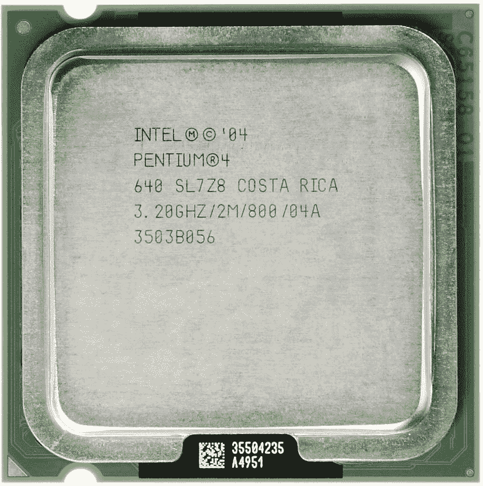
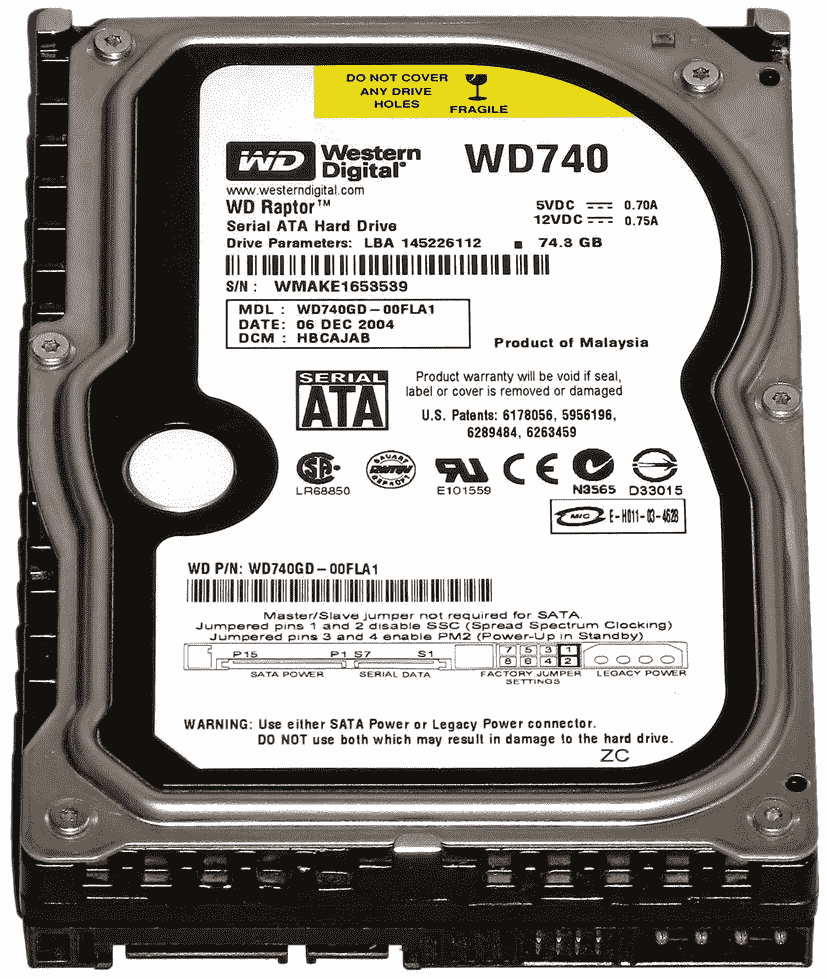
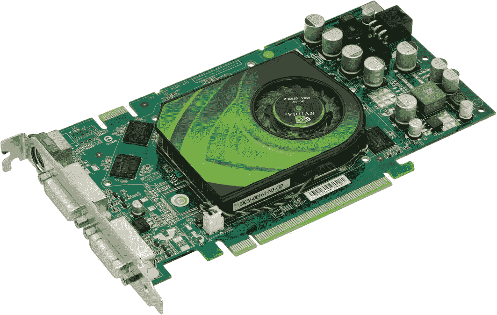
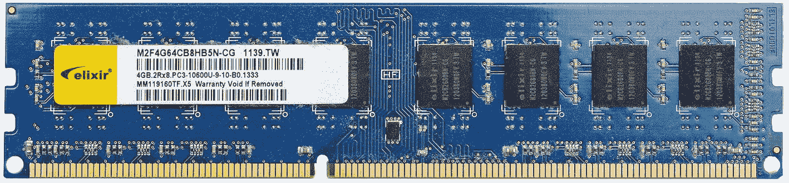
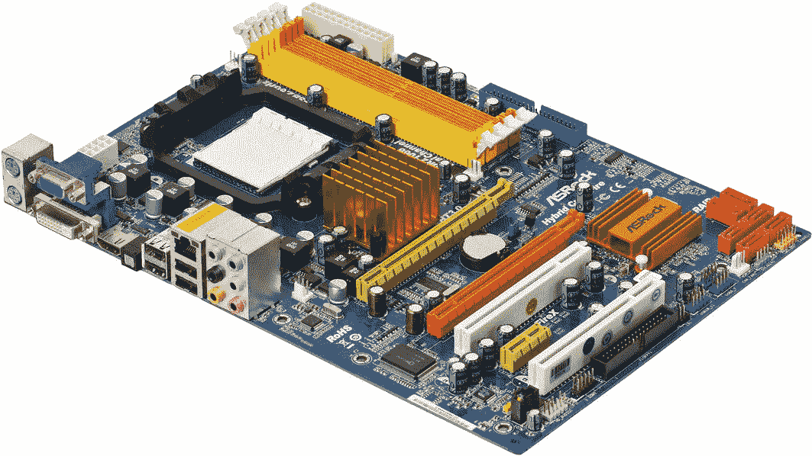
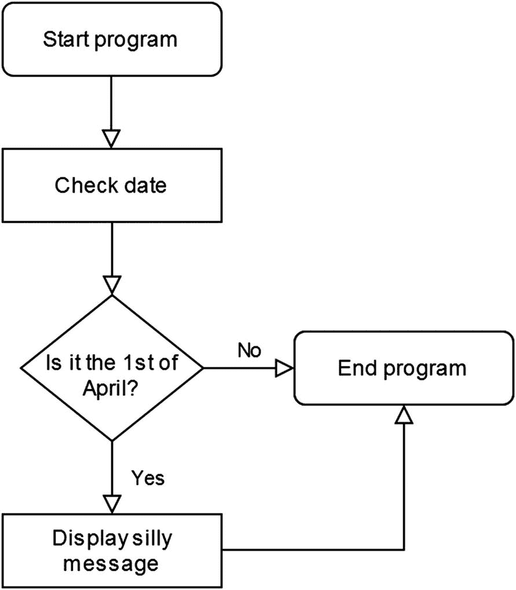

# 一、编程的基础

视频游戏、社交网络和你的活动手环有什么共同点？它们运行在一群(或多或少)程序员在很远很远的地方编写的软件上。在我们这个技术驱动的社会中，小工具和硬件只是硬币更明显的一面。在这一章中，我们将讨论编程的基础知识。我们还将看看数字系统的可见部分:硬件。

## 到底什么是编程？

基本上，编程是告诉数字设备，比如你的个人电脑，做什么的行为。我们键入由编程语言定义的命令列表，以便发生有用或有趣的事件。正确编程的计算机运行着世界上大部分的通信和在线服务。你可以提到像自动取款机、票阅读器和智能手机这样的小玩意，它们运行在某人用某种编程语言开发的软件上。

## 基本硬件缩减

作为一名初露头角的程序员，你将从理解你正在使用的普遍存在的电子设备中受益。最好至少对计算机内部最常见的组件有一个基本的了解。

计算机中的这些硬件组件代表了你的劳动力。作为一名程序员，你来主持这个节目。把编程的行为想象成告诉工厂工人要造什么。你制造应用程序，无论它们是大型复杂的软件项目，还是一些令人敬畏的编程书籍中的教程。

出于本书的目的，任何相对现代的台式机或笔记本电脑都可以。在尝试编程时，我们不需要任何昂贵的硬件。

## 1.中央处理器

自然，一个数字设备不能只靠软件运行；一个**中央处理器(CPU)** 是硬件“大脑”，它执行代码并使事情实际发生(见图 [1-1](#Fig1) )。即使在一个不太复杂的电子产品中，所有指令都流向并通过一个 CPU(或一组 CPU)。由于体积非常小，自 20 世纪 70 年代以来，这些微芯片越来越成为我们生活的一部分。每个数字设备都有一个中央处理器，甚至可能是你的固定自行车/衣架。

图 1-1

早在 2005 年，数百万台电脑中使用的旧英特尔奔腾 4 CPU 的俯视图。图片由 Eric Gaba 提供。抄送-服务协议 3.0

## 2.硬盘(又称硬盘)

这个组件是用来永久存储数据的。在硬盘中，你会发现成千上万的文件，无论是图片、文本文件还是数据库。您的操作系统(如 Windows 或 macOS)也在硬盘的范围内。这些设备有两种类型:*机械硬盘*(见图 [1-2](#Fig2) )和*固态硬盘(SSD)。*

图 1-2

Western Digital 机械硬盘的俯视图。由“Darkone”拍摄的图像经 CC BY-SA 2.5([creative commons . org/licenses/BY-SA/2 . 5/deed . en](https://www.creativecommons.org/licenses/by-sa/2.5/deed.en))许可

机械驱动器更实惠，但由于它们内部有移动部件，因此在过度振动和极端天气下，它们比固态硬盘更容易损坏。此外，固态硬盘通常运行速度更快。

## 3.视频卡

显卡负责显示系统的视觉效果，无论是纯文本还是现代视频游戏中令人眼花缭乱的 3D 图形。这些设备有多种配置和价格，从 30 美元的文字处理器恶魔到 1000 美元的游戏怪兽(见图 [1-3](#Fig3) )。计算机显示器通常直接连接到视频卡。

图 1-3

2006 年的 Nvidia 7900GS 显卡

自 21 世纪初以来，视频卡业务基本上一直是两家数十亿美元的科技巨头*英伟达*和*AMD*的垄断。然而，英特尔在这一领域也取得了进展。

## 4.随机存取存储器

*随机存取存储器*，俗称 RAM，用作计算机的临时存储。在物理上，它通常以棒状附件的形式出现(见图 [1-4](#Fig4) )。当运行任何类型的软件时，您的计算机使用 RAM 来执行它。关闭你的设备将清空你的内存。相比之下，当关闭电脑时，写在硬盘上的数据不会被擦除。定期保存您的文档。

图 1-4

典型的内存块。图片由亨利·凯尔纳提供。CC BY-SA 4.0。来源: [`upload.wikimedia.org/wikipedia/commons/3/32/DDR3_RAM_53051.jpg`](https://www.upload.wikimedia.org/wikipedia/commons/3/32/DDR3_RAM_53051.jpg)

截至 2021 年，4 GB(即*4gb*)对于大多数用途来说已经足够了。视频编辑等高级用户将受益于 16 GB 或更大的 RAM。

## 5.母板

前面提到的所有四个硬件组件(即 CPU、显卡、硬盘和 RAM)在主板上组合在一起，形成一个工作的计算机单元。主板还具有用于键盘、鼠标和其他控制设备的连接器(参见图 [1-5](#Fig5) )。

图 1-5

现代的个人电脑主板。图片由埃文-阿莫斯提供。CC BY-SA 3.0。来源: [`upload.wikimedia.org/wikipedia/commons/0/0c/A790GXH-128M-Motherboard.jpg`](https://www.upload.wikimedia.org/wikipedia/commons/0/0c/A790GXH-128M-Motherboard.jpg)

## 成为一名优秀程序员的三个要求

接下来，让我们讨论一下所有程序员为了在他们的职业中进步而应该拥有的一些个人优先事项，无论他们的起点可能是什么:

1.  **自信**:问问自己这个，为什么要学编码？一些完全正确的答案包括“为了职业发展”、“保持我的能力”和“我想成为伟大事业的一部分。”现在，编程有时被外行人认为是一种可怕的活动。坐下来，置身事外，进入比特操作的世界，确实需要一些勇气。请记住，即使你是一个完全的初学者，你也可以在这个领域获得能力。自信来自经验。一行接一行，你将获得更多的良好氛围，并从编程书籍和在线教程中获得独立性。

2.  正确的语言:不是所有人都能从流利的世界语或古典拉丁语中受益。当学习一门新语言时，我们倾向于学习一些有用的东西，如西班牙语或法语。同样，选择一种最适合你的意图的编程语言是至关重要的。如果你想最终为移动用户编写食谱应用程序，比如说，精通 1957 年的 FORTRAN 只能让你到此为止。为此，本书介绍了我们这个时代最流行的三种编程语言:Java、C# 和 Python。

3.  耐心:在选择了你想专攻的编程语言之后，你只需要坚持下去。精通一门新语言需要六个月到一年的实践经验。这其实是个好消息。编码对失眠和无聊很有帮助。它还可以防止痴呆症，因为它确实在很大程度上激活了那些大脑突触。

## 初级程序员词汇表

我们现在将深入研究一些与神圣的编码爱好相关的基本术语。有数百个与各种编程技术和语言相关的术语和概念。然而，我们将只关注最相关的关键词，没有特定的顺序。

## 输入/输出

*输入*在编程的上下文中，是指我们输入数据，让计算机上运行的一个软件进行处理。这以键入文本、鼠标命令或各种类型的文件的形式出现。例如，文字处理程序(例如，Microsoft Office)通常将其输入主要作为通过击键提供的字母数字数据。*输出*是指经过软件处理的数据。在字处理器中，这通常是指与程序一起保存的文件。这种输出也可以指向打印机或其他设备。程序员的输出(尽管有二氧化碳和其他东西)通常是一个工作应用程序，无论它是一个完整的教程文件还是一个更大的项目。

## 算法

一个工作程序列表基本上构成了一个*算法，*指的是为解决问题而创建的一组步骤。大多数软件由许多子算法组成。在视频游戏的情况下，有显示图形、保存和加载游戏状态、播放音频文件等算法。

## 流程图

编程项目及其算法通常使用流程图来可视化，尤其是在团队环境中。在大多数情况下，这些都是演示基本程序流的好方法。

流程图仅由几个通用元素组成(见图 [1-6](#Fig6) )。在它们最基本的形式中，它们使用四种符号。这些是*终端*(圆角矩形)*流程*(矩形)*决策*(菱形/菱形)，以及*流线*(箭头)。结束符号用来表示程序流的开始和结束。任何操作和一般数据操作都由进程矩形表示。

图 1-6

一个非常简单的描述愚人节程序的流程图

大多数情况下，流程图是从上到下、从左到右解释的。早在 20 世纪 60 年代，美国国家标准协会(ANSI)就创建了流程图及其符号的标准。这组符号在 20 世纪 70 年代和 80 年代被国际标准化组织(ISO)扩展到 T2。为了这本书的目的，我们将坚持原著。

## 源代码

这个术语指的是组成每个软件项目的或多或少键入的编程清单的集合。作为程序员，你是*源代码的创造者。*简单的程序以单个源代码的形式出现，而复杂的软件，如操作系统(如 Windows ),可能由成千上万个清单组成，所有清单构成一个产品。

## 句法

一个*语法*是一组规则和原则，它们管理给定语言中的句子结构，包括在编程环境中。不同的编程语言对特定的操作使用不同的关键字。现在，看看用两种编程语言显示文本字符串的实际编程行:

表 1-1

两种编程语言之间语法差异的演示

<colgroup><col class="tcol1 align-left"> <col class="tcol2 align-left"></colgroup> 
| 

爪哇

 | 

公式翻译程式语言(formula translator)

 |
| --- | --- |
| System.out.print("你好！我喜欢蛋糕！”); | 1 打印*，“你好！我喜欢蛋糕！” |

Java，你可能已经知道了，是本书的主要语言之一。表 [1-1](#Tab1) 中使用的另一种编程语言叫做 *FORTRAN。这种语言主要是为科学计算而设计的，由 IBM 在 20 世纪 50 年代创造。许多工业硬件都在 FORTRAN 上运行。甚至一些极客仍然用它来追求技术时尚(在某种程度上，我们也是如此)。*

你可能会注意到我们在表 [1-1](#Tab1) 中的一个例子是以数字(1)开始的。在编码术语中，这被称为*行号*，这种做法早就被放弃了。通常，当代编程语言不需要行号。

## 例行的

编程环境中的*例程*是一个代码术语，它完成一项特定的任务，并被编码者随意反复调用。例如，一个程序可能包含一个播放声音效果的简单例程。代替每次需要所述声音效果时编写和重写代码，程序员将特别触发相同的代码(即，例程)。

根据上下文和使用的编程语言，例程有时也被称为*子程序、函数、过程、*或*方法。*我们将在本书后面更详细地讨论术语。

## 文件格式

*文件格式*是一种编码数据的方法。到 2021 年，你已经在日常生活中遇到了很多 a 文件格式。数码照片、在 OpenOffice 中输入的情书以及那些时髦的 Excel 电子表格都代表了不同的文件格式。存放在硬盘上的图像文件(例如， *apress_is_great.jpg* )只能通过软件以图像的形式使用。同样，在照片编辑套件中打开 *love-letter.doc* 也不会给你带来最佳效果，最多显示些胡言乱语。大多数操作系统将不同的可用文件格式与正确的软件相关联，因此您可以安全地双击文件，并期望它们能够正常加载。

## 美国信息交换标准代码

*美国信息交换标准码(ASCII)* 是一种字符编码标准，用于分配字母、数字和其他字符，以供计算和其他数字设备使用。本质上，你现在读的是 ASCII 码。作为一名程序员，你会经常碰到这个术语。“ASCII 文件”通常被用作“人类可读文本文件”的简称该系统可追溯到 1963 年。

在今天的互联网上，最常用的字符编码标准是 UTF-8，它包括所有的 ASCII 字母数字以及许多其他符号。

## 样板代码

术语*样板*指的是或多或少自动插入到程序中的编程代码，几乎不需要编辑。当你在一个 C++环境中开始一个新项目时，当代的开发工具通常会为你提供运行程序所需的样板代码。如果没有，您可以相对安全地将旧工作项目中的样板代码复制粘贴到新项目中，以便开始工作。

## 软件框架

一个*软件框架* **是一组**通用功能，通常可以节省编码人员很多时间。没有理由重新发明轮子，尤其是在软件项目中。框架包括各种焦点的各种软件库，包括文件操作例程、音频回放和 3D 图形例程(在 3D 视频游戏开发和其他高度可视化应用程序的情况下)。

出于本书的目的，我们不会深究任何复杂的软件框架，但是理解这个概念是很重要的。

## 全栈

一个*全栈*是组成一个完整工作的 web 应用程序的软件，比如一个在线数据库。一个 web 应用程序通常分为两个区域:一个*前端*和一个*后端。*前端是为用户做的；它包含使用应用程序所需的所有用户界面元素。后端由 web 服务器、框架和数据库组成。因此，全栈开发人员是指那些了解在线应用程序编码前端和后端的人。

## 最后

读完这一章，你有望对以下内容有所了解:

*   计算机中的五个基本硬件组件

*   成为程序员的三个主要要求

*   一些基本的编程概念，包括源代码、语法和样板代码

*   流程图指的是什么，它们的基本构件是什么