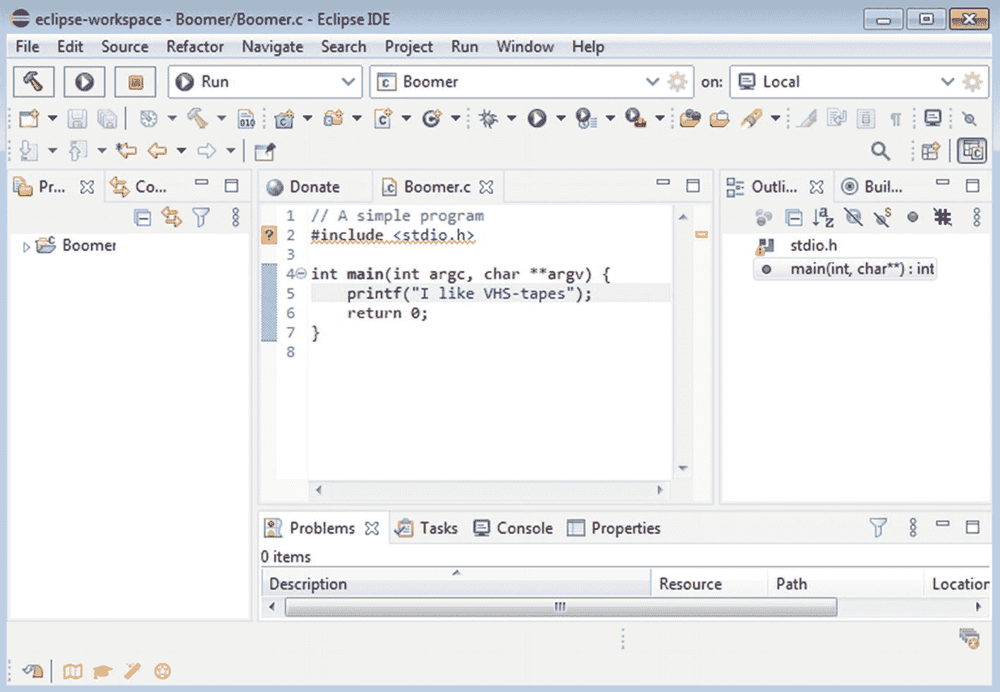
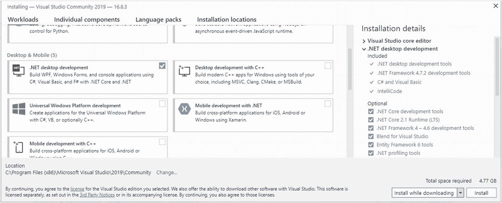

# 三、设置您的编程环境

本章致力于向您介绍集成开发环境的乐趣。虽然在线编程环境对您的前几份清单来说是不错的，但是在您自己的计算机上安装一些专用的编码软件会让您受益匪浅。幸运的是，有很多免费的 ide 可供你下载。我们将涵盖 2021 年三个最流行的操作系统的各种软件。但首先，我们将解决另一个基本概念:*计算架构*T4。

## 关于计算体系结构

一个*时钟周期*代表一个 CPU 内执行的单个动作。在每个时钟周期中，CPU 执行基本的内部操作，这些操作构成了计算机生态系统中任何更大任务的一部分。现在，*时钟速度*指的是一个 CPU 每秒可以召集的时钟周期数，通常用*千兆赫(Ghz)来表示。*例如，一个 2.1 Ghz 的 CPU 每秒提供 21 亿个时钟周期。CPU 每秒提供的时钟周期越多，系统处理数据的速度就越快。

现在，术语*计算架构*被用来描述一个 CPU 每个时钟周期可以处理多少数据。目前市场上基本上有两种主要的计算架构:32 位和 64 位。后者正迅速成为大多数计算类型的事实架构。为 64 位架构编写的软件可以更好地利用系统资源，如 RAM，同时通常比 32 位架构执行得更快。

架构实现发生在硬件和软件中。只有 64 位 CPU 可以运行 64 位操作系统，同时仍然提供与旧的 32 位软件(和操作系统)的兼容性。然而，64 位操作系统通常甚至不能安装在具有 32 位 CPU 的计算机上。

到 21 世纪初，支持 64 位计算的 CPU 变得越来越流行。除非你使用的是真正的老式电脑，否则你很可能已经准备好了 64 位计算，至少在硬件方面是如此。有关这两种架构的概要，请参见表 [3-1](#Tab1) 。

大企业正在彻底放弃 32 位技术。事实上，从 *macOS Catalina (10.15)* 开始，苹果完全放弃了对 32 位软件的支持。微软也正在将 32 位世界抛在身后。截至 2020 年 5 月，任何现成的电脑都将只配备 64 位版本的 *Windows 10* 。在三大操作系统中，只有一些 *Linux* 发行版仍然广泛适用于 32 位硬件。

表 3-1

32 位和 64 位计算架构的比较

<colgroup><col class="tcol1 align-left"> <col class="tcol2 align-left"> <col class="tcol3 align-left"></colgroup> 
|   | 

32 位架构

 | 

64 位架构

 |
| --- | --- | --- |
| 特征 | 仅运行 32 位版本的操作系统，可以运行大多数传统的 16 位软件 | 运行 32 位和 64 位操作系统，通常不支持 16 位软件 |
| 每个系统的理论最大 RAM | 4 千兆字节或 4，294，967，296 字节 | 171 亿 GB 或 18，446，744，073，709，551，616 字节 |
| 系统中的典型 RAM 数量 | 1 到 4 GB 之间 | 介于 8 和 32 GB 之间 |

出于本书的目的，您不需要运行任何 64 位软件；32 位操作系统就可以了。但是，为了让您的设备经得起未来的考验，您应该考虑尽快迁移到 64 位操作系统。

## 解释了位派生单元

就像你现在可能知道的，计算的最小单位是比特。和其他量一样，仅仅用原子单位来衡量事物是不切实际的。因此，我们有字节、兆字节和千兆字节，仅举三个例子(见表 [3-2](#Tab2) )。

公制单位(即使用 10 的幂乘数的单位)在个人计算的早期工作得很好。然而，使用这些乘数并不完全准确。例如，按照公制，1 千字节的文件实际上是 1024 字节，而不是 1000 (10 <sup>3</sup> )。

典型的硬盘驱动器的额定容量为 250 GB(即 250，000，000，000 字节)，实际容量为 232.8 GB。硬件厂商一般不会提这些东西。我想你可以走了。

1998 年，*国际电工委员会(IEC)* 创建了更精确的测量方案。新系统使用 2 的幂乘数。例如，一千字节变成了 1024 字节大小的*千比字节*(2<sup>10</sup>= 1024)。这些新单元非常需要，因为它们在测量更大的数据池时更加精确。

表 3-2

最常用的公制和 IEC 数据存储单元的比较

<colgroup><col class="tcol1 align-left"> <col class="tcol2 align-left"> <col class="tcol3 align-left"> <col class="tcol4 align-left"></colgroup> 
| 

米制单位

 | 

价值(公制)

 | 

IEC 单位

 | 

价值(国际电工委员会)

 |
| --- | --- | --- | --- |
| 位(b) | 0 或 1(原子/最小单位) |   |   |
| 字节(b) | 八位 |   |   |
| 千字节(kB) | 1000 字节 | 基布利特(基布利特) | 1024 字节 |
| 兆字节 | 100 万字节 | Mebibyte (MiB) | 1，048，576 字节(1024 个字节) |
| 千兆字节 | 10 亿字节(十亿字节) | 吉布比特(gib) | 1，073，741，824 字节（1024 兆字节） |
| 兆兆字节 （TB） | 10 亿字节(一万亿字节) | 提比布 | 1099511627776 字节(1024) |

## 64 位多任务处理

与旧的 32 位架构相比，64 位计算的主要优势之一是大大改善了多任务处理能力。多任务指的是同时运行几个程序。一个典型的程序员可能在他们的电脑上有一个很棒的 IDE、 *Photoshop* 、 *Spotify* ，以及在 *Firefox* 中同时打开的 50 个标签。安装了大量千兆字节的 RAM 消除了通常与运行多个程序相关的许多不连贯和变慢的情况。RAM 升级可能是将个人电脑推向更高性能的最常见方式。

## 识别您的操作系统架构

您可能需要检查操作系统的架构是 32 位还是 64 位。又快又简单。

*   在 Windows 10 中，进入*设置* ➤ *系统* ➤ *关于。你会在这一页看到必要的细节。*

*   在 Linux 中，打开一个终端窗口，键入 *arch* 并按回车键显示您的系统架构。显示 *x86_64* 的输出意味着您拥有 64 位版本的 Linux。对于该操作系统的 32 位版本，显示 *i386* 或 *i686* 的输出。

*   至于 *macOS，*这个操作系统从 2009 年*雪豹(10.6)* 开始，每个版本都是 64 位(对 32 位软件有不同程度的向后兼容)。

## 为 Java 开发安装 Eclipse

好的开发环境提供搜索特性、语法突出显示，在某些情况下还支持多种编程语言。我们将首先为您设置一个专门为 Java 开发打造的环境，由 Eclipse Foundation 开发的强大的 *Eclipse IDE* (见图 [3-1](#Fig1) )。

Eclipse 项目最初是由 IBM 在 2001 年 11 月创建的。*Eclipse Foundation*于 2004 年作为一个独立的非盈利组织出现。它是作为一个围绕 Eclipse 的开放透明的社区而创建的。

Eclipse 适用于 *Windows* 、 *macOS* 和 *Linux。*访问下面提供的下载页面，只需点击反映您正在运行的操作系统类型的链接。然而，有一个警告。Eclipse 的最新版本只适用于现代操作系统的 64 位版本。如果您仍然在使用 32 位操作系统，请查看 Eclipse 旧版本的专用链接。它们也很适合我们的目的。



图 3-1

行动中的 Eclipse

*   **下载安装** ***Eclipse for Java 开发者*** **(64 位版)** : [`www.eclipse.org/downloads/packages/release/2020-12/r/eclipse-ide-java-developers`](http://www.eclipse.org/downloads/packages/release/2020-12/r/eclipse-ide-java-developers)

*   **下载** ***Eclipse for Java 开发者*** **(32 位版)** : [`www.eclipse.org/downloads/packages/release/helios/sr1/eclipse-ide-java-developers`](http://www.eclipse.org/downloads/packages/release/helios/sr1/eclipse-ide-java-developers)

## 安装 Eclipse for Linux

Linux 存储库可能托管一个过时版本的 Eclipse。为了在 Linux 中安装最新版本，我们将使用 Canonical Ltd .提供的 Snapcraft 方法。这种方法应该适用于 Linux 的所有主要发行版。打开终端窗口，输入以下行:

1.  首先，我们确保您的操作系统上安装了***【JRE】*****。**在终端窗口中键入以下字符串:

1.  **接下来，我们使用 snappy 系统下载 Eclipse:**

```java
sudo apt install default-jre
Fedora Linux users might need to input the following Terminal-commands:
sudo dnf install java-latest-openjdk.x86_64
sudo dnf install java-latest-openjdk-devel.x86_64

```

```java
sudo snap install --classic eclipse

```

在安装过程中，系统可能会提示您输入密码。成功安装后，您应该会看到以下消息:*安装了来自 Snapcrafters 的 eclipse(版本信息)。*

## Eclipse 首次发布

启动 Eclipse 时，会提示您为 Eclipse 工作区选择一个目录。默认设置适用于大多数用途。让我们创建一个新项目。这是通过从顶部菜单栏导航到*文件* ➤ *新建* ➤ *Java 项目*来完成的。接下来，您应该会看到一个等待您的项目图块的窗口。输入一个并点击*创建。*

将出现一个窗口，询问您是否想要创建*module-info.java*。这个文件是 Java 的模块化功能使用的一个*模块声明*。对于简单的应用程序，如果你选择*不要创建就好了。*

您将被带到 Eclipse 中的主项目视图。我们手头上还没有一个实用的 Java 应用程序。现在，在左边，你会看到*项目浏览器。*左键单击您的项目名称。从顶部菜单中选择*档* ➤ *新* ➤ *级*。输入这个新类的名称；它不必共享您的项目名称。

接下来，确保你已经勾选了*public static void main(String args)旁边的复选框。*这给了你的项目一个 *Java main 方法。没有它，你无法执行你的项目。最后，点击*完成*进入你全新的 Java 代码清单。您现在可以在 main 方法下开始编码了。*

## C# 开发的好主意

现在，让我们回顾一下您的 C# 需求的一些选择。我们将从微软的 *Visual Studio* 开始，这是一个流行的多平台 IDE，充满了伟大的特性，包括动态错误下划线。该软件适用于 Windows 和 macOS。

## 为 Windows 和 Mac 设置 Visual Studio

让我们从 Windows 和 macOS 的 Visual Studio 安装开始。首先，您需要下载完全免费的社区版的正确安装程序。这是一个用于多种语言的健壮的 IDE，包括 C#。

*   **下载** ***Visual Studio 社区版*** : [`https://visualstudio.microsoft.com/free-developer-offers/`](https://visualstudio.microsoft.com/free-developer-offers/)

启动 Visual Studio 安装程序后，您最终会看到一个关于*工作负载的屏幕。*这些基本上是指 Visual Studio 中提供的各种语言的不同实现场景。您将看到 C# 和其他语言的四类工作负载；分别是 *Web &云、桌面&移动、游戏、*和*其他工具集*(见图 [3-2](#Fig2) )。对于我们的编码需求，让我们勾选*旁边的复选框。NET 桌面开发。这将很好地为我们设置 C# 语言。*

最后点击窗口右下角的*安装*。您也可以选择在下载时安装，或者先下载所有必需的文件，然后再开始安装过程。



图 3-2

Microsoft Visual Studio Community Edition 的安装屏幕

第*。NET* 是微软在 2002 年创建的一个软件框架，在专有许可下发布。它为 C#、C++和其他流行语言提供了简化的开发。该框架在 2016 年以*的名义接受了一次大修。NET 核心。*这一次，它以开源和跨平台的形式出现，包括对 macOS(以及在一定程度上对 Linux)的支持。此后，微软不再将新版本的名字改回. NET。

## 在 Visual Studio 中启动新项目

经过可能很长的安装过程后，Visual Studio 为您提供了登录开发人员帐户(或注册一个)的选项，以获得更多好处。请随意跳过这一步。接下来，您要为 IDE 选择一种配色方案，并单击*启动 Visual Studio。*

几分钟后，您将到达 Visual Studio 主窗口。当你点击*创建新项目*时，你会看到各种各样的编程模板，包括那些专门针对 C# 的模板。对于我们的需求来说，*控制台 App* 是合适的。过一会儿，Visual Studio 将创建您的项目文件，您可以开始在 main 函数下编码。

## 控制台与图形用户界面应用程序

在所谓的控制台应用程序和那些具有图形用户界面(GUI)的应用程序之间有一个普遍的区别。前者使用基于文本的基本界面，而后者为用户提供更多的视觉效果，通常还提供额外的输入方法(如鼠标或触控板)。控制台应用程序有时会利用基于文本的*伪图形*来模拟几何形状。

尽管外观古怪，但控制台应用程序为开发人员提供了很高的效率；毕竟,(音频)视觉所消耗的所有资源都可以用于程序的核心功能。

控制台应用程序遍布我们的操作系统。它们用于与网络相关的任务，以及潜在的大量自动化实例。主要的控制台应用有 macOS 中的*终端*、 *Windows 控制台*、 *Linux 命令行*。此外，有史以来最受欢迎的角色扮演视频游戏之一 *Nethack、*是一款真正的控制台应用程序。谁需要 3D 图形？

您可以通过在控制台应用程序领域中工作来学习所有基本的编程技巧。尽管我们将触及基于 GUI 的开发，但本书的重点主要是基于文本的环境。

## Linux 中的 MonoDevelop 简介

截至 Q1 2021 年，Visual Studio 不可用于 Linux。然而， *MonoDevelop* 提供了在灵活的 IDE 中开始编写 C# 所需的一切。

*   **遵循 MonoDevelop 网站** : [`www.monodevelop.com/download`](http://www.monodevelop.com/download) 上的这些说明

从前面的下载页面(例如 Debian)导航到最接近您当前使用的 Linux 发行版和版本的 Mono 存储库。接下来，您将复制粘贴许多命令到您的终端窗口。根据您的硬件，您可能需要等待几分钟才能完成安装。之后，MonoDevelop 应该安全地驻留在您的应用程序文件夹中。

点击 MonoDevelop 图标打开 MonoDevelop。导航到*文件* ➤ *新解决方案*。一个新的窗口将会打开。点击*。NET* 下*其他*，选择*控制台项目*。最后点击右下角下一个的*。将打开另一个窗口，提示您输入项目名称。输入您认为合适的内容，然后点击*创建。**

接下来，您应该会看到一个用 C# 编写的通用 hello world 应用程序的清单。或者导航到*运行* ➤ *启动而不调试*，或者单击 MonoDevelop IDE 左上角的播放图标来执行列表。

在 MonoDevelop 中尝试运行/调试程序后，如果出现以“找不到指定文件”结尾的错误提示，您可能需要在终端窗口中执行以下附加行:

`cd /usr/lib`

`sudo mkdir gnome-terminal`

`cd gnome-terminal`

`sudo ln -s /usr/libexec/gnome-terminal-server`

现在，您已经准备好为 Linux 开发一些漂亮的控制台应用程序了。

## Python 开发的 PyCharm

当使用 Python 进行开发时，有一个软件是最优秀的。PyCharm 是一个多平台 IDE，具有智能代码完成等优秀特性。该套件有付费版和免费版；我们将与后者合作。以下链接将引导您找到您的操作系统支持的 PyCharm 版本。

*   **下载** ***PyCharm 社区版*** : [`www.jetbrains.com/pycharm/download`](http://www.jetbrains.com/pycharm/download)

PyCharm 在 Windows 和 macOS 上的安装过程非常简单。对于前者，运行您下载的可执行文件，并按照屏幕上的指示进行操作。对于 macOS，只需双击图像文件(以结尾。dmg)，并将 PyCharm 图标拖到应用程序文件夹中。

在 Windows 上安装 PyCharm 时，即使您的帐户没有密码保护，也可能会出现密码提示。只需单击“取消”继续安装。

要开始试用 PyCharm，请点击*创建项目。*然后，您将有机会命名您的项目，并为其选择一些其他选项。项目名称同时也是所有 PyCharm 项目文件的目录位置。当你选定了一个合适的标题后，点击窗口右下角的*创建*。

为了使开始更容易，PyCharm 为您提供了创建欢迎脚本的选项。最好启用这个选项。创建新项目时，确保勾选了*Create a main . py welcome script*旁边的复选框。

第一次创建新项目时，PyCharm 可能会下载一些额外的组件。安装这些组件可能需要一段时间。当您的新项目文件准备好时，您将进入 PyCharm 的主编码视图。现在，您可以自由编辑文件 *main.py* 并体验这个令人惊叹的 Python IDE。

第一次打开新项目时，文件 *main.py* 将填充一些 Python 代码。你可以删除所有的代码，然后在它的位置键入你自己的代码。

## 为 Linux 安装 PyCharm

让 PyCharm 在您的 Linux 上运行的最佳方式是使用 snap 包。只需打开一个终端窗口，输入下面一行:

```java
sudo snap install pycharm-community --classic

```

## 软件害虫:臭虫

你是否曾经因为电脑堵塞和/或文本文件丢失而结束了你的工作？你可能会在运行中遇到一个软件错误。软件环境中的 bug 意味着由错误的程序代码引起的小故障；它们可能是程序员的打字错误，或者更常见的是一些神秘的设计错误。所有这些操作系统的软件更新基本上都是为了修复错误(有时还会提供新功能)。参见表 [3-3](#Tab3) 了解最常见的软件错误和问题。

表 3-3

最常见的软件问题/错误类别

<colgroup><col class="tcol1 align-left"> <col class="tcol2 align-left"> <col class="tcol3 align-left"> <col class="tcol4 align-left"></colgroup> 
| 

软件缺陷

 | 

例子

 | 

软件问题

 | 

例子

 |
| --- | --- | --- | --- |
| 句法的 | 不正确地使用语言语法，例如，使用错误的变量比较运算符 | 连接 | 缺少用户界面功能，例如，缺少导航按钮或其他关键元素 |
| 算术 | 被零除，可变范围溢出 | 安全 | 薄弱的身份验证，关键系统组件的不必要暴露 |
| 逻辑学的 | 较差的程序流控制，例如无限循环或折衷循环 | 沟通 | 缺少用户文档，用户界面元素的标签不好，不直观的错误提示 |
| 资源 | 使用未初始化的变量，通过不释放不需要的变量空间来耗尽系统 RAM | 团队合作疏忽 | 代码元素/变量的标签不合逻辑，注释不当 |

## 关于调试和测试

*调试*是发现并修复软件中发现的 bug 的艺术。一个*调试器*为软件开发人员提供工具，在错误发生时，在它们可能对用户计算机造成严重破坏之前修复它们。这是 solid IDE 的另一个特性，自然属于本章介绍的每个解决方案。

调试范围从 IDE 编辑器中简单的错误突出显示到详尽的数据收集和分析。典型的调试组件允许程序员在软件运行时检查正在开发的软件，如有必要，可以一行一行地检查。代码编写的高级编程语言，如 Java 和 Python，通常更容易调试。低级语言，如过程 C，留给程序员更多的控制权；这可能会更频繁地导致内存损坏等问题。

繁重的调试对于较大的软件项目来说是绝对必要的。出于我们的需要，这个话题我们不必深究。在这一点上，你知道这个术语的意思就足够了。

调试与软件开发中有时被忽视的领域有关:*测试。*虽然测试包括调试，但还有更多。测试团队负责报告软件产品在其预期的使用场景下是否正常工作。然而，即使是大规模的测试过程也不能找到软件项目中的每一个缺陷。

软件测试可以大致分为*功能*和*非功能*分支。前者侧重于将软件及其组件的功能与一组规范进行比较。非功能测试指的是与性能、可用性和安全性相关(但不限于此)的问题。本地化，包括非西方市场的开发，也是非功能软件测试的一部分。本地化涉及到结合流畅和适当的翻译语言，并关注不同的文化敏感性。

测试过程的细节取决于目标受众的类型。视频游戏开发人员，尤其是对于较小的团队，有时会在测试上偷懒(这对他们非常不利)。银行和金融领域的基本软件预计将接受最严格的测试。较大的软件项目需要一个高度组织化的测试团队。由于经济原因，大型软件的测试通常外包给国外的企业。

## 调试:基本方法

现在，我们将详细介绍一些最常见的代码调试方法:

*   **跟踪/打印调试**:这种方法简单来说就是密切关注每一行代码的执行结果，将它们一个接一个地打印在屏幕上。可以密切注意变量和其他数据结构的内容，因为它们在程序执行过程中会发生变化。跟踪对于较小的项目非常有用，比如本书中的教程。

*   记录和回放调试:使用这种方法，程序执行的部分被记录和回放，以检查其潜在的缺点。这不是指软件的外部或视觉回放；相反，它侧重于州一级的程序。

*   **事后分析** **调试**:这种方法包括分析程序崩溃后的日志数据。许多类型的软件在严重故障后会在磁盘上写入日志文件，包括大多数操作系统。然后可以检查这些文件，寻找导致崩溃的错误的线索。

*   **远程调试**:调试不必在运行焦点程序的设备上进行。使用流行的网络方法，如 Wi-Fi 或 USB 电缆，不同角色和外形的设备可以连接在一起工作。为 Android 和 iOS 编写和调试软件时，远程完成是最常见的方法，因为开发机器几乎总是一台独立的全尺寸计算机。

*   Bug 聚类:每当发现大量 Bug 时，这是一个有用的方法。程序员首先识别错误中的所有共同特征。然后，问题被分成特定的组，这些组共享它们的属性，逻辑是，即使一个集群中的几个 bug 被解决了，其余的也应该随之而来。

*   代码简化:有时消除 bug 的最佳策略是(或多或少暂时地)删除它们周围的功能代码部分。这显然对更隐秘/害羞的虫子最有效。当您还不确定什么不起作用时(例如，什么导致了崩溃)，一个接一个地移除明显起作用的部分，并引诱 bug 出来。

## 最后

读完这一章，你会对以下内容有所了解:

*   32 位和 64 位计算体系结构之间的主要区别，以及如何识别您的操作系统运行在哪个品种上

*   如何定义最常见的位导出数据单元

*   什么是*集成开发环境(IDE)* 以及如何为您的操作系统获得一个集成开发环境

*   *控制台应用*和利用*图形用户界面(GUI)* 的应用之间的核心区别

*   最常见的软件错误/问题类型

*   什么是调试和软件测试

下一章将详细介绍面向对象编程(OOP)的奇迹。正如在第 2 章中提到的，这是一个非常重要的范例，每个初学的程序员都应该能够使用。