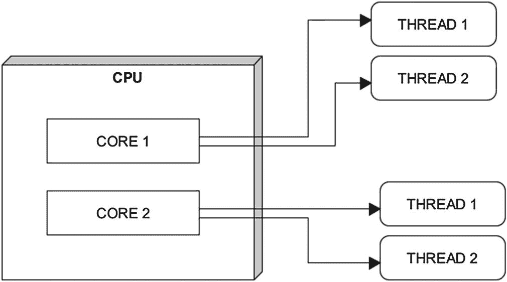
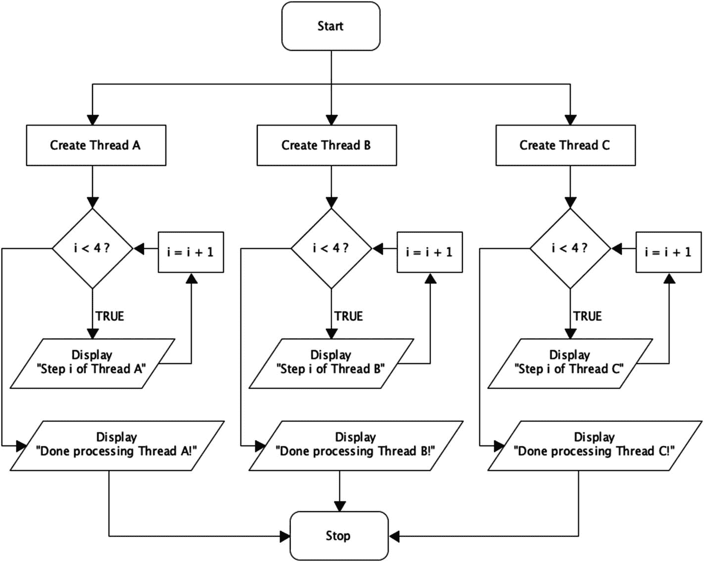

# 五、文件操作、多线程和其他 Java 设施

到目前为止，您可能已经相当熟悉了强大的面向对象语言 Java 中的基本编程元素。现在是时候转向更高级的概念了。在本章的后面，我们将从多线程和 Java 中的基本错误处理开始。继续，我们最终会谈到文件操作这个有趣的话题。

## 多线程:内核和线程

Java 支持*多线程*，多线程基本上是指将一个程序拆分成几个并发运行的部分。这通常会大大加快任何算法的执行时间。多线程有时也被称为*并发*。

多线程是一个与*处理器内核*密切相关的概念，处理器内核指的是硬件方面:中央处理器单元(CPU)。比如说，2005 年以前的老一代 CPU 通常只有一个内核。你很难找到 2021 年制造的全新单核。如今，大多数 CPU 至少包含两个内核。这些核心处理你输入计算机的所有数据(见图 [5-1](#Fig1) )。



图 5-1

演示双核 CPU 内部多线程的简单图表

一般来说，系统拥有的内核越多，处理数字的效率就越高。这取决于您的操作系统以及它是否支持多核计算；几乎所有现代操作系统都具备这样做的条件。然而，并非所有第三方软件都是为了充分利用多核处理而编写的。在这种情况下，软件只使用系统中的一个内核。

现在，并发运行线程的数量通常不等于 CPU 可支配的内核数量。记住，一个软件应用程序可以为不同的任务调用多个线程。这意味着单核系统可能会有几个线程同时运行。多核 CPU 提供的是在众多内核之间共享所有这些线程的工作负载的可能性。在具有六个或更多 CPU 内核的系统上，这可以极大地提高计算速度。

你可能偶尔会遇到术语*超线程*。这是指英特尔的专有技术，理论上，它可以提供两倍于处理器实际配备的 CPU 内核。超线程技术于 2002 年推出，它与操作系统协同工作，以增加可用内核的数量。英特尔声称，与没有超线程技术的相同 CPU 相比，配备超线程技术的 CPU 可以全面提升性能。然而，在现实生活中，超线程技术的优势在很大程度上取决于应用。这项技术确实在视频编辑和 3D 建模等 CPU 密集型场景下蓬勃发展。

## 用 Java 实现多线程

线程可以分为不同的状态，这些状态构成了一个*线程生命周期*。接下来，让我们详细了解这五个阶段:

1.  **新**:一个线程诞生。

2.  **Runnable** :顾名思义，这个阶段的线程正在运行它的任务，无论它们是什么。

3.  **等待**:当一个线程与其他线程一起工作，并且暂时完成了它们的处理，让其他线程接管时，这个线程就进入了这个阶段。此阶段中的线程正在等待其他线程的“同意”以恢复其工作负载。

4.  **定时等待**:当线程暂时完成了自己的任务，但在将来某个特定的时间点又被需要时，线程就进入这个不活动的阶段。

5.  **终止**:当一个线程完成了它所有的任务，它就死了。

    你可能听说过计算环境中的多任务处理。这个概念指的是共享同一组资源(如 CPU)的几个进程(即软件)。使用多线程，单个程序中的任务被分割成单独的执行线程。

让我们看一个用 Java 演示多线程的实际程序(见清单 [5-1](#PC1) )。

```java
// Make HappyThreadClass inherit methods from Thread-class
// using the keyword "extends"
class HappyThreadClass extends Thread {

public HappyThreadClass(String str)
{
// The super-keyword is used to access data from a parent-class
// (Class "Thread" in this case)
super(str);
}
    // Make the thread do things while executing using the run-method
    public void run() {

    // Iterate each thread four times, displaying each step
    for (int i = 0; i < 4; i++) {
    System.out.println("Step "+ i + " of " + getName());
    }
    System.out.println("Done processing " + getName() + "!");
    }
    }

public class Thread_Demo {
// Add main method
public static void main(String[] args){

// Create and execute three threads
new HappyThreadClass("Thread A").start();
new HappyThreadClass("Thread B").start();
new HappyThreadClass("Thread C").start();
}
}

Listing 5-1A listing in Java demonstrating multithreading

```

在清单 [5-1](#PC1) 的第二行，您会看到一个新的关键字，*扩展了*。在 Java 中，这个类继承了另一个类的方法和构造函数。在我们的例子中， *HappyThreadClass* 接收 Thread-class 的功能(在 Java SDK 中称为 *Java.lang.Thread* )。在后面的清单中，我们将看到一些从 thread 派生的方法，即 *getName( )* 和 *start( )* 方法。前者返回一个线程的名字，而后者执行一个线程。

虽然清单 [5-1](#PC1) 的输出是以有序的方式呈现的，但是其中的三个线程是按照多线程的方法并发运行的(参见图 [5-2](#Fig2) )。

此外，在连续几次运行清单时，您可能会发现不同的线程以不同的顺序显示它们的输出。对于一个不同步的程序来说，这是非常正常的。



图 5-2

清单 [5-1](#PC1) 中程序流程的简化图

CPU 提供的处理能力是一种有限的资源。因此，多个执行线程被分配了*优先级*，这有助于操作系统对它们的处理进行优先级排序。这是一个基本上自动化的过程，取决于计算机资源的当前状态。

## 线程同步

尤其是在大型项目中，多线程绝对需要协同工作。幸运的是，Java 非常重视这种方法。*线程同步*在 Java 的上下文中是指控制多个线程对一个共享资源的访问。为什么要同步呢？如果没有这种方法，几个线程可能会试图同时访问相同的数据。这不利于数据的排序或稳定性。

要以简单的方式在 Java 中实现同步，可以使用语句 *synchronized* 。这种方法可以在三个层次上使用:静态方法、实例方法和代码块。以清单 [5-1](#PC1) 为例。只要稍微修改一下函数声明(即 public*synchronized*void run())，我们就能从程序中获得更有序的输出。

## 同步块

我们甚至不必同步整个方法；我们可以选择在哪里使用这项技术。同步代码块将一个*监视器锁*绑定到一个对象。同一对象种类的所有同步块只允许一个线程同时执行它们。

要添加简单的块级同步，可以用 *synchronize(this) {...}* 。括号带宾语；在我们的例子中，我们使用关键字 *this* 来指代它所属的(目前不存在的)方法。

## 论公平与饥饿

按照 Java 的说法，*饥饿*在一个线程(或一组线程)没有获得足够的 CPU 资源来正确执行时发生，因为在这种情况下,“果汁”被其他更贪婪的线程霸占了。那些宝贵的 CPU 资源的平均分配系统被称为*公平*。Java 饥饿的主要原因之一实际上在于基于块的同步。处理饥饿的主要方法是通过适当的线程优先级和使用*锁*。

## Java 中的锁

现在，Java 中的每个对象都有一个所谓的*锁属性*。这种机制只允许那些被明确授予权限的线程访问对象数据。在这样一个线程处理完一个对象后，它执行一个*锁释放*，这将锁返回到可用状态。在 Java 中，使用锁是一种比基于块的方法更复杂的同步形式(见表 [5-1](#Tab1) )。

表 5-1

Java 中基于块的同步和基于锁的同步的主要区别

<colgroup><col class="tcol1 align-left"> <col class="tcol2 align-left"> <col class="tcol3 align-left"></colgroup> 
|   | 

块同步

(如*同步(this)...)*

 | 

基于锁的同步

 |
| --- | --- | --- |
| **公平** | 不支持 | 支持 |
| **等待状态** | 不能被打断 | 可以被打断 |
| **发布** | 自动的 | 指南 |
| **可以查询锁定** | 不 | 是 |

## 一些基本线程方法一览

现在是时候回顾一下在 *Java.lang.Thread* 中发现的一些关键方法了(见表 [5-2](#Tab2) )。随着我们继续阅读本书，这些方法和许多其他方法将会越来越为你所熟悉。

表 5-2

Java 的 Thread-class (Java.lang.Thread)中的一些方法

<colgroup><col class="tcol1 align-left"> <col class="tcol2 align-left"> <col class="tcol3 align-left"></colgroup> 
| 

方法

 | 

描述

 | 

示例

 |
| --- | --- | --- |
| getName（ ） | 返回线程的名称 | System.out.println("我是 a "+getName())； |
| setPriority() | 设置线程的优先级。取 1 到 10 之间的一个数 | orange . set priority(10)；peach . set priority(1)； |
| getPriority() | 返回线程的优先级 | system . out . println(" Priority for "+getName()+":"+getPriority())； |
| getState（ ） | 返回线程的状态 | State state = currentThread()。getState()；system . out . println(" Thread:"+current Thread()。getName())；system . out . println(" State:"+State)； |
| 中断( ) | 停止正在运行的线程 | some class . interrupt()； |
| 中断( ) | 返回线程是否被中断 | if (ShoeFactory.interrupted( ) ) {System.out.println("线程已被中断！");} |
| 当前线程( ) | 返回对当前正在执行的线程的引用 | thread gimme = thread . current thread()；Thread niceThread = new Thread(这个，“好线程”)；System.out.println("这是"+ gimme +"线程"； |
| 睡眠( ) | 将线程置于睡眠状态，持续特定的毫秒数 | 线程.睡眠(50)；// 50 毫秒的休息 thread . sleep(1000)；//一秒钟的小睡 |
| 等待( ) | 将线程置于等待状态，直到另一个线程对其执行 notify 方法 | System.out.println("等待..");尝试{wait()；} catch(异常 e){ } |
| 通知( ) | 恢复处于等待状态的单个线程 | 已同步(bananaObject) {banana object . notify()；处理完成！);} |
| 开始( ) | 执行线程 | 新 FruitThreads(“香蕉”)。start()；my class car factory = new my class()；car factory . start()； |

## Try-Catch 块

为了处理 Java 中的错误，程序员可以实现 *try-catch 块*。监视 try 块中的代码是否有错误，如果有错误，程序将切换到 catch 块中的代码。这种方法也被称为*异常处理*。看一下清单 [5-2](#PC2) 来看看机械师的动作。

```java
public class TryCatchDemo {
  public static void main(String[ ] args) {
    int happyNumber = 20;

    try {
      // Divide twenty with zero (uh oh..)
      happyNumber /= 0;

      System.out.println(happyNumber);

    } catch (Exception e) {
      // Display our error message
      System.out.println("We have an error.");
    }
  }
}

Listing 5-2A simple demonstration of the try-catch block (i.e., exception handling) in Java

```

## 最后:更多有趣的尝试捕捉块

是的，Java 的 try-catch 块带来了更多的乐趣。无论前面的 try-catch 中是否出现异常，最终都会执行一个名为*的可选块*;这对于确保在任一事件之后运行任何特定的关键操作非常有用。参见清单 [5-3](#PC3) 中一个在 Java 中使用 finally 块的简单例子。

```java
public class TryCatchFinally
{
   public static void main (String[] args)
   {
     // Begin a try-catch block
     try {
     // happyArray is allocated to hold five integers
     // (The count starts from zero in Java)
     int happyArray[] = new int[4];

     // Be naughty and assign the value of 14 into
     // a non-existent sixth element in happyArray
     happyArray[5] = 14;
     }
     catch(ArrayIndexOutOfBoundsException e) {
     System.out.println("We encountered a medium-sized issue with an array..");
     }
     // Implement a finally-block which is executed regardless of
     // what happened in the try-catch block
     finally {
     System.out.println("You are reading this in Alan Partridge's voice!");
     }
   }
}

Listing 5-3A Java listing demonstrating a finally block during exception handling

```

## 抛出:您的自定义错误消息

为了创建我们自己的异常/错误消息，我们可以在 Java 中使用 throw 语句(参见清单 [5-4](#PC4) )。使用 throw，我们可以得到更详细的错误消息，指出代码中有问题的行。

```java
public class FruitChecker {

  // Create method for checking type of fruit
  static void checkFruit(String fruit) {

    // Display our custom error message if fruit does not equal "Lemon"
    if (!fruit.equals("Lemon")) {
      throw new RuntimeException("Only lemons are accepted.");
    }
    else {
      System.out.println("Lemon detected. Thank you!");
    }
  }

  public static void main(String[] args) {
    checkFruit("Lemon");
    checkFruit("Orange");
  }
}

Listing 5-4A Java listing demonstrating the use of the throw statement

```

Java 中的异常基本上是程序执行过程中出错的信号。程序员可以实现多种类型的异常。

在清单 [5-4](#PC4) 中，术语 *RuntimeException* 指的是一般类型的错误；我们选择扔掉一个，以防我们不会遇到柠檬。因为我们对“柠檬”和“橙子”都运行了 checkFruit()方法，所以我们既得到了无异常的消息，又得到了有异常的消息。参见清单 [5-4](#PC4) 的输出:

检测到柠檬。谢谢大家！

线程“main”Java . lang . runtime 异常:只接受柠檬。

```java
    at FruitChecker.checkFruit(FruitChecker.java:8)
    at FruitChecker.main(FruitChecker.java:17)

```

接下来让我们看看 Java 中其他一些常见的异常:

*   **ArrayIndexOutOfBoundsException**:当访问数组中不存在的索引项时(即索引超出了数组的分配大小)，抛出该异常。

*   **算术异常**:算术运算失败时抛出。

*   **ClassNotFoundException** :正如你可能猜到的，这是在试图访问一个无处可寻的类时抛出的。

*   **NumberFormatException** :当方法无法将字符串转换成数字时抛出。

*   NoSuchFieldException :当处理一个类中缺少的变量时抛出。

*   **RuntimeException** :如清单 [5-3](#PC3) 所示，该异常用于程序执行过程中的任何一般性错误。

## 已检查和未检查的异常

Java 中基本上有两类异常:*已检查*和*未检查*。前者用于处理程序无法理解的错误，例如文件操作或网络传输的问题。未检查的异常，有时也被称为*运行时异常*，处理编程逻辑中的问题，例如无效参数和不支持的操作。参见表 [5-3](#Tab3) 了解这两种异常之间的更详细的差异。

表 5-3

Java 中检查异常和未检查异常的主要区别

<colgroup><col class="tcol1 align-left"> <col class="tcol2 align-left"> <col class="tcol3 align-left"></colgroup> 
|   | 

检查异常

 | 

未检查/运行时异常

 |
| --- | --- | --- |
| **主要作用区域** | 外部，程序之外 | 内部，程序内 |
| **例题** | 文件访问或网络连接问题，外部数据库问题 | 有缺陷的程序逻辑；类定义、算术运算或变量转换的错误 |
| **检测** | 在程序编译期间 | 在程序执行期间 |
| **优先级** | 关键:不可忽视。程序将无法执行 | 严重:不应忽视程序将运行，但或多或少仍不稳定 |

我们将在本书的后面更详细地讨论 Java 异常处理。

## Java 中的基本文件操作

基本上，文件操作是指读取、写入和删除存储在硬盘或固态硬盘等设备上的数据。为了建立一个准备好文件操作的 Java 项目，我们应该在清单的开头添加下面的包: *import java.io.File* 。实际上，让我们看看 Java 中一个简单的文件操作程序是什么样子的(见清单 [5-5](#PC6) )。

```java
import java.io.File;

public class JollyFileClass {

  public static void main(String[] args) {
    // Use the imported File class to create a file object, happyfile
    File happyfile = new File("apress_is_great.txt");

    // Begin a try-catch block
    try {
      // Summon the createNewFile-method from File class
      boolean ok = happyfile.createNewFile();
      // ok is a boolean variable, meaning it holds either 'true' or 'false'
      if (ok == true) {
        System.out.println("File " + happyfile.getName() + " created.");
      }
      else {
        System.out.println("The file already exists.");
      }
    }
    // Display error message in the catch-block if necessary
    catch(Exception e) {
    System.out.println("We have an issue..");
    }
  }
}

Listing 5-5A Java listing for creating an empty text file

```

不仅仅局限于我们在清单 [5-5](#PC6) 中检查的方法，java.io.File-package 提供了更多。参见表 [5-4](#Tab4) 了解我们即将探索的所有方法。此外，表 [5-5](#Tab5) 列出了一些与时间相关的格式标记，我们将在本章后面深入研究。Java 的格式标记显示解析成特定字符串模式的时间和日期。现在，你知道它们就足够了；它们中的许多起源于类*Java . time . format . datetime formatter*。

表 5-4

java.io.File 提供的 Java 中文件操作的一些常用方法

<colgroup><col class="tcol1 align-left"> <col class="tcol2 align-left"> <col class="tcol3 align-left"> <col class="tcol4 align-left"></colgroup> 
| createNewFile() | 创建新文件 | 长度( ) | 以字节为单位返回文件的大小 |
| mkdir() | 创建新目录 | getAbsolutePath() | 检索文件的绝对路径，例如 C:\Windows\hello.txt |
| 删除( ) | 删除文件 | 可以读取（ ） | 测试文件是否可读 |
| 存在( ) | 测试文件是否存在 | canWrite() | 测试文件是否可写 |

## 用 Java 创建文本文件

言归正传，我们接下来做一个文本文件，好吗？参见清单 [5-6](#PC7) 了解我们下一剂 Java 文件操作的良药。

```java
import java.io.*;

 public class Main {
   public static void main(String args[]) {

   // Define a string we intend to write into a file
   String data = "Apress rules, OK?";

     try {
       // Create a Writer object using the FileWriter-class
       FileWriter writer1 = new FileWriter("happyfile.txt");
       // Writes a message to the file
       writer1.write(data);
       // Closes the writer
       writer1.close();
       // Open the created file
       File file1 = new File("happyfile.txt");
       // Create a new file input stream, "fileinput1"
       FileInputStream fileinput1 = new FileInputStream(file1);

System.out.println("The file " + file1.getName() + " says the following:");

int counter=0;
// Use a while-loop to display every text character in "happyfile.txt"
// Break out of "while" when encountering "-1", which signals the
// end of the file
while((counter = fileinput1.read())!=-1)
{
System.out.print((char)counter);
}
     // Close file input stream
     fileinput1.close();
     }
     catch (Exception e) {
       e.getStackTrace();
     }
  }
}

Listing 5-6A Java program demonstrating text-file creation and access

```

在第二个清单中，您将看到大量新的、可能令人恐惧的机制。我们现在以平静的方式一个接一个地看一遍。首先，*导入 Java . io . *；清单 [5-6](#PC7) 中的*提供了对 java.io 包中所有可用类的访问。

接下来，我们有 Filewriter 类。正如您所料，这个类提供了写入数据和创建新文件的方法。我们从 Filewriter 实例化一个对象，将其命名为 *happyfile.txt.*

在清单 [5-6](#PC7) 中，我们为我们的文件提供了一个文件名和一个*目录路径*， *happyfile.txt* 。带有字母 C 的部分指的是 Windows 根目录驱动器的最常见选择。您可以在在线编程环境中运行这个列表。然而，如果你使用硬盘，你不太可能在硬盘上写任何东西。

沿着清单向下，我们从 Filewriter 类调用 write 方法，将来自字符串*数据*的消息传递给它。我们的 happyfile.txt 现在包含了一条基于文本的消息。接下来，我们执行 close 方法；需要这样做，以便后续方法能够访问 happyfile.txt。

现在，我们再次打开我们的文件，这次是为了在屏幕上打印它的内容。我们首先使用 Java 的 File 类实例化一个对象，即*File File 1 = new File(" c:\ \ happy File . txt ")*。行*file inputstream file input 1 = new file inputstream(file 1)*让我们能够访问 Java 文件输入流类，以一个字节为增量提供文件读取功能。在我们的例子中，这意味着一次读取和显示一个文本文件(即 happyfile.txt)。为此，我们实现了一个 while 循环，它使用了 FileInputStream 类中的一个方法(例如， *read* )。

我们打印 happyfile.txt 的内容(同样，按照 FileInputStream 文件访问的实现方式，一次打印一个字符)。一个负一(-1)的值表示文件结束，中断了 while 循环。在这之后，就是清理时间了。我们关闭文件并退出程序。

## Java 文件操作的更多冒险

让我们做一些更多的文件操作。不如我们查询文件属性，比如文件大小，并尝试删除一些文件(参见清单 [5-7](#PC8) )。

```java
import java.io.*;

 public class Main2 {
   public static void main(String args[]) {
     // Open file for access
     File file1 = new File("c:\\happyfile.txt");
     // Begin try-catch block
     try {
       // First check if file exists
       if (file1.exists()) {
       // If so, display confirmation of existence
       System.out.println("The file " + file1.getName() + " exists!");
       // Summon length()-method and display file size
       System.out.println("This file is " + file1.length() + " bytes in size");
       // Display notification if the file is over 10 bytes/characters in size
       if(file1.length()>10) System.out.println("That's a lot of data!");
       // Display read/write information
       if (file1.canRead()) System.out.println("This file is readable.");
       if (file1.canWrite()) System.out.println("This file is writable.");
       System.out.println("Deleting " + file1.getName() + "...");
       // Summon delete()-method on file1
       file1.delete();
            // If file does not exist, display notification
       } else System.out.println("Can't find file. Nothing will be deleted.");
     }
     catch (Exception e) {
       e.getStackTrace();
     }
  }
}

Listing 5-7A program demonstrating file attribute query and deletion in Java

```

从清单 [5-7](#PC8) 中可以看出，用 Java 实现基本的文件操作相当简单。但是有一些手术我们还是应该试验一下。我们使用第二种类型的文件流，并创建一个全新的目录，怎么样？(参见清单 [5-8](#PC9) 。)

```java
import java.io.*;
class FileStreamTesting {
   public static void main(String args[]) {
      // Begin try-catch block
      try {
      // Define a string we use as a name for a directory
      String directoryName = "HappyDirectory";
      File dir1 = new File(directoryName);
      // Create new directory into the Windows root-folder, C:
      dir1.mkdir();
      // Create an array of six characters, Publisher
      char Publisher[] = {'A','p','r','e','s','s'};
      // Instantiate an object from the OutputStream class, stream1
OutputStream stream1= new FileOutputStream("c://HappyDirectory//publisher.txt");
         for(int x = 0; x < Publisher.length ; x++) {
            // Write each character from our array into the file
            stream1.write(Publisher[x]);
         }
         stream1.close();

      } catch (IOException e) {
         System.out.print("An error has occurred.");
      }
   }
}

Listing 5-8A listing in Java demonstrating the use of file streams and directories

```

最后两个清单使用了 Java 的文件流类。清单 [5-7](#PC8) 使用了 InputStream 类中的一个方法在屏幕上打印文本。在清单 [5-8](#PC9) 中，我们有一个 Java 的 OutputStream 实例将一个由六个字符组成的数组(即 *Publisher[ ]* 的内容)写入一个文件。

在指定目录位置时，两个清单有不同的符号:在清单 [5-7](#PC8) 中，我们使用反斜杠(即 *c:\\happyfile.txt* )来表示目录路径，而在清单 [5-8](#PC9) 中，我们使用正斜杠，如 *c://HappyDirectory* 。这两种方法都可以在 Java 中使用。

## Java 约会

让我们面对现实吧:在这个世界上记录时间是相当重要的。没有理由不在 Java 中这样做。幸运的是，有一个很棒的类，叫做 *LocalDate* 。此外，*Java . time . format . datetime formatter*类用于按照程序员定义的定制格式显示日期。(我们在表 [5-5](#Tab5) 中遇到了这些格式标记)。清单 [5-9](#PC10) 向您展示了这是如何完成的。

```java
import java.time.LocalDate;
import java.time.format.DateTimeFormatter;
public class HappyDateDemo {
   public static void main(String args[]) {
        // Create an object using the Java LocalDate-class
        LocalDate happyDate = LocalDate.now();
        LocalDate fortnite = happyDate.minusDays(14);
        LocalDate tomorrow = happyDate.plusDays(14);
        System.out.println("Today's date is " + happyDate);
        System.out.println("Two weeks ago it was " + fortnite);
        System.out.println("Two weeks into the future it'll be.. " + tomorrow);
        // Create and display three different formatting patterns
        System.out.println("Today's date in format A: "+happyDate.format(DateTimeFormatter.ofPattern("d.M.uuuu")));
        System.out.println("Today's date in format B: "+happyDate.format(DateTimeFormatter.ofPattern("MMM d uuuu")));
        System.out.println("Today's date in format C: "+happyDate.format(DateTimeFormatter.ofPattern("d.MMM.uu")));
   }
}

Listing 5-9A program demonstrating date retrieval and formatting in Java

```

表 5-5

一些时间模式–来自 Java . time . format . datetime formatter 的格式化标记

<colgroup><col class="tcol1 align-left"> <col class="tcol2 align-left"> <col class="tcol3 align-left"> <col class="tcol4 align-left"></colgroup> 
| *d/d*T2】d | 一月中的某一天 | *W* | 一个月中的第几周(0–5) |
| *毫米* | 月 | *K* | 一天中的小时数(1–24) |
| uuuu */uu* | 年份(完整或最后两位数字) | *K* | 一天中的小时，上午/下午(0–11) |
| *w* | 一年中的一周(1–53) | *E* | 一周中的某一天(如星期一) |

## 更多关于约会:闰年和时间旅行

让我们探索更多 Java 的约会选项。我们不仅可以以一天为单位在时间上来回旅行；月和年也由我们支配。请参见清单 [5-10](#PC11) 中这两个实例。此外，我们将探索如何在 Java 中发现闰年。

```java
import java.time.LocalDate;
import java.time.LocalTime;

public class TimeTravel {
public static void main(String[] args) {
// Store current date into rightnow
LocalDate rightnow = LocalDate.now();
System.out.println("This is thirty weeks into the future: " + rightnow.plusWeeks(30));
System.out.println("This is fifty months into the past: " + rightnow.minusMonths(50));
System.out.println("This is 56 years into the past: " + rightnow.minusYears(56));
System.out.println("Whoa! This is 373 years into the future: " + rightnow.plusYears(373));
// Store a future date into futuredate1
LocalDate futuredate1 = LocalDate.of(2028,1,1);
// Store a past date into pastdate1
LocalDate pastdate1 = LocalDate.of(1728,1,1);
// Check for leap years
System.out.println("\nWas the year " + pastdate1.getYear() + " a leap year? " + pastdate1.isLeapYear());
System.out.println("Is the year " + rightnow.getYear() + " a leap year? " + rightnow.isLeapYear());
System.out.println("Is the year " + futuredate1.getYear() + " a leap year? " + futuredate1.isLeapYear());
     }
}

Listing 5-10A listing demonstrating the use of some of the methods in the LocalDate class in Java

```

## Java 日历

当谈到 Java 的时间旅行时，有许多方法，特别是在公历中，公历仍然是自 1582 年以来最流行的组织我们日子的系统。我们可以很容易地获取过去和未来的日期，如清单 [5-11](#PC12) 所示。

```java
import java.util.Calendar;

public class HappyCalendar {

   public static void main(String[] args) {
   // Create an object using the Calendar-class
   Calendar calendar1 = Calendar.getInstance();
   // Display current date
   System.out.println("Current date: " + calendar1.getTime());
   // Take a week out of the date and display it
   calendar1.add(Calendar.DATE, -7);
   System.out.println("A week ago it was: " + calendar1.getTime());
   // Fast forward two months
  calendar1.add(Calendar.MONTH, 2);
  System.out.println("Two months into the future: " + calendar1.getTime());
   // Go ten years into the future
  calendar1.add(Calendar.YEAR, 10);
  System.out.println("Ten years into the future: " + calendar1.getTime());
  // Go a century back into the past
  calendar1.add(Calendar.YEAR, -100);
  System.out.println("A century ago: " + calendar1.getTime());
   }
 }

Listing 5-11A listing demonstrating the use of the Calendar

class in Java

```

## 自定义您的日历

基于 Java 的日历的乐趣不会停留在时间旅行上。让我们把事情变得真正有趣，创建我们自己的日期格式符号，即工作日和月份。为此，我们正在召唤一些令人兴奋的新方法和一个新类， *Locale* (参见清单 [5-12](#PC13) )。您会注意到这个清单导入了 java.util.Date 类，这是一个所谓的过时类，意味着它有一个更新的版本(在本例中是 java.util.LocalDate)。然而，在您的编码冒险中，您可能会不时地遇到这些更具历史意义的类。

```java
import java.text.DateFormatSymbols;
import java.util.Date;
import java.util.Locale;
import java.text.SimpleDateFormat;

public class SassyCalendar {

public static void main(String [] args){
// Create a new object from class Locale
Locale locale1 = new Locale("en", "US");
// Create an object for a new set of date format symbols
DateFormatSymbols sassysymbols = new DateFormatSymbols(locale1);

// Rename days of the week using setWeekdays() method
sassysymbols.setWeekdays(new String[]{
        "",
        "Superior Sunday",
        "Mega Monday",
        "Tepid Tuesday",
        "Wonderful Wednesday",
        "Tedious Thursday",
        "Fun Friday",
        "Serious Saturday",
});
// Rename months using setMonths() method
sassysymbols.setMonths(new String[]{
        "",
        "Jolly January", "Fabulous February",
        "Marvelous March", "Amazing April",
        "Joyous June", "Jubilant July",
        "Affable August", "Silly September",
        "Odorous October", "Nasty November",
        "Delightful December",
});
// Choose a formatting pattern
String pattern = "EEEEE', in 'MMMMM yyyy'!'";
// Apply this pattern on our object, sassysymbols
SimpleDateFormat format1 = new SimpleDateFormat(pattern, sassysymbols);
// Create a new object using Date-class
String sassydate = format1.format(new Date());
System.out.println("Today is " + sassydate);
     }
}

Listing 5-12A Java listing demonstrating customized date symbol creation for a particular locale

```

在清单 [5-12](#PC13) 中，我们迎合了特定的地区，美国，选择英语作为使用“US”和“en”的语言。我们将在本章的后面更深入地探讨本地化。

现在，方法 *setWeekdays( )* 和 *setMonths( )* 都接受字符串数组，这些字符串数组用于覆盖默认的格式符号(例如，星期一、一月等)。).这些数组中的第一项故意留空，因为它不考虑这些方法的工作。

谈到清单 [5-12](#PC13) 中的格式模式，我们使用 *E* 来表示一周中的某天(现在已经修改过了)，用 *M* 来表示月份，用 *y* 来表示年份。我们还在单引号内添加了一些空格和其他标点符号(例如，`'!'`)。

如果我们在 2021 年 6 月 29 日运行清单 [5-12](#PC13) ，我们将得到以下输出:

今天是不温不火的星期二，在快乐的 2021 年 6 月！

## Java 的国际化和本地化

*国际化*是指设计软件，使其无需大修即可本地化；*本地化*是为特定语言和/或地区创建内容的行为。就国际化而言，Java 是一种很棒的编程语言，它提供了相当动态地本地化日期、货币和数字的方法。

术语“国际化”输入起来可能有点麻烦。因此，软件人员有时更喜欢缩写 *i18n* 而不是*。*本地化，另一方面，在知情人士中被称为 *L10n* 。你可能已经猜到了，这些节略中的数字代表了前面提到的两个术语中的字母数量。

清单 [5-12](#PC13) 中简单提到的 Java Locale 类提供了本地化我们项目的选项。它让程序员有机会呈现本地化的消息或程序的其他部分。Locale 类用于标识对象，而不是对象本身的容器。

Locale 类有三个维度:*语言*、*国家*和*变体*。虽然前两个是不言自明的，但 variant 用于表示程序运行的操作系统的类型和/或版本。

现在，在 Java 中，一个应用程序实际上可以同时有几个活动的语言环境。例如，可以组合意大利日期格式和日本数字格式。因此，Java 是创建真正多文化应用程序的好选择。让我们看看清单 [5-13](#PC14) 中关于如何在 Java 中使用本地化的演示。

```java
import java.util.Locale;

public class LocalizationDemo {
 public static void main(String[] args) {

    // Create a generic English-speaking locale
    Locale locale1 = new Locale("en");
    // Create an English-speaking locale set in the UK
    Locale locale2 = new Locale("en", "UK");
    // Create a Finnish-speaking, Indian locale in Mumbai
    Locale locale3 = new Locale("fi", "IN", "Mumbai");

   System.out.println("Locale 1\. " + locale1.getDisplayName());
   System.out.println("Locale 2\. " + locale2.getDisplayName());
   System.out.println("Locale 3\. " + locale3.getDisplayName());

   // Retrieve user's current operating system locale information by creating
   // another instance of Locale-class and summoning the getDefault() method
   Locale yourLocale = Locale.getDefault();

  System.out.println("OS language: " + yourLocale.getDisplayLanguage());
  System.out.println("OS country: " + yourLocale.getDisplayCountry());
 }
}

Listing 5-13A listing demonstrating the three main dimensions of locales in Java (i.e., language, country, and variant)

```

在清单 [5-13](#PC14) 中，我们首先创建三个不同的 locale 对象，并使用 Locale 类中的 *getDisplayName( )* 方法显示它们的一些内容。

我们还调用了第四个对象来检查用户操作系统的地区设置。首先， *getDefault( )* 方法用于检索这些数据，并将其插入到我们命名为 *yourLocale* 的对象中。然后，执行另外两个方法，即 *getDisplayLanguage( )* 和 *getDisplayCountry( )* ，来显示我们感兴趣的信息。

## 最后

读完这一章，你将有望学到以下内容:

*   如何用 Java 打开、创建和删除文件

*   多线程指的是什么以及它是如何在 Java 中实现的

*   如何在 Java 中实现基本同步

*   try-catch 块的操作

*   异常处理意味着什么以及如何实现

*   检查异常和未检查异常的区别

*   Java 中日期相关类的一些基本用法

*   基于 Java 的本地化基础

第 6 章将提供一些确实完全不同的东西；我们将探索强大的 Python 语言的更高级的功能。